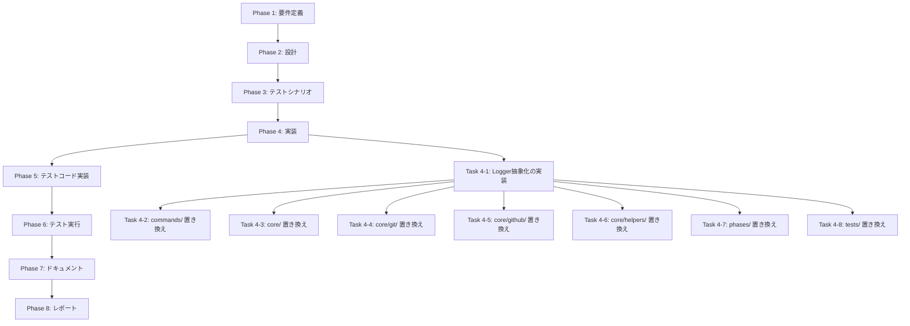

# プロジェクト計画書: Logger抽象化の導入

## 1. Issue分析

### 複雑度
**中程度**

### 見積もり工数
**16~20時間**

**根拠**:
- 新規Logger抽象化の設計・実装: 2~3時間
- 329箇所のconsole呼び出しを段階的に置き換え: 10~12時間（約27箇所/時間）
  - commands/ (39箇所): 2時間
  - core/ (120箇所): 5時間
  - phases/ (78箇所): 3時間
  - tests/ (92箇所): 2時間（テストは低優先度）
- ユニットテスト作成: 2時間
- ドキュメント更新: 1時間
- レビュー・修正: 1~2時間

### リスク評価
**中**

**理由**:
- 影響範囲が大きい（40ファイル、329箇所）が、各変更は機械的で単純
- 既存機能への影響は最小限（ロギング出力のみ）
- テストコードへの影響は許容範囲（本番コードを優先）

---

## 2. 実装戦略判断

### 実装戦略: CREATE

**判断根拠**:
- 新規ファイル `src/core/logger.ts` を作成（ILogger、ConsoleLogger、LogLevel）
- 既存コードへの影響は置き換えのみ（EXTENDではなくCREATE）
- アーキテクチャ変更ではなく、新規抽象化層の追加

### テスト戦略: UNIT_ONLY

**判断根拠**:
- Loggerクラスは外部依存がなく、ユニットテストのみで十分
- 統合テストは不要（既存のログ出力を置き換えるだけ）
- BDDテストも不要（インフラストラクチャ層の機能）

### テストコード戦略: CREATE_TEST

**判断根拠**:
- 新規テストファイル `tests/unit/core/logger.test.ts` を作成
- 既存テストは修正不要（console.logのモックを置き換える程度）

---

## 3. 影響範囲分析

### 既存コードへの影響

**変更が必要なファイル**: 40ファイル、329箇所

**主要モジュール**:
- `src/commands/*.ts` (4ファイル、39箇所)
- `src/core/*.ts` (9ファイル、80箇所)
- `src/core/git/*.ts` (3ファイル、48箇所)
- `src/core/github/*.ts` (4ファイル、13箇所)
- `src/core/helpers/*.ts` (2ファイル、4箇所)
- `src/phases/*.ts` (6ファイル、78箇所)
- `src/phases/core/*.ts` (2ファイル、20箇所)
- `tests/**/*.test.ts` (40ファイル、92箇所)

### 依存関係の変更

**新規依存の追加**: なし

**既存依存の変更**: なし

**環境変数の追加**:
- `LOG_LEVEL`: ログレベル設定（DEBUG/INFO/WARN/ERROR、デフォルトはINFO）

### マイグレーション要否

**不要**

**理由**:
- データベーススキーマ変更なし
- 設定ファイル変更なし（環境変数は任意）
- 後方互換性あり（既存のconsole.logは動作し続ける）

---

## 4. タスク分割

### Phase 1: 要件定義 (見積もり: 1~2h)

- [x] Task 1-1: Logger抽象化の要件定義 (1~2h)
  - ILoggerインターフェースの仕様確定
  - LogLevelの定義確定
  - 環境変数（LOG_LEVEL）の仕様確定
  - 構造化ログのフォーマット仕様確定

### Phase 2: 設計 (見積もり: 1~2h)

- [x] Task 2-1: Logger抽象化の詳細設計 (1~2h)
  - クラス図の作成（ILogger、ConsoleLogger、LogLevel）
  - メソッドシグネチャの確定
  - シングルトンパターンの設計
  - 環境変数からのログレベル読み込みロジック設計

### Phase 3: テストシナリオ (見積もり: 1h)

- [x] Task 3-1: ユニットテストシナリオ作成 (1h)
  - LogLevelフィルタリングのテストシナリオ
  - 構造化ログのテストシナリオ
  - エラーロギングのテストシナリオ
  - 環境変数読み込みのテストシナリオ

### Phase 4: 実装 (見積もり: 12~14h)

- [x] Task 4-1: Logger抽象化の実装 (2~3h)
  - `src/core/logger.ts` の作成
  - LogLevelの実装
  - ILoggerインターフェースの実装
  - ConsoleLoggerクラスの実装
  - シングルトンインスタンスのエクスポート
  - 環境変数からのログレベル読み込み実装

- [ ] Task 4-2: commands/ モジュールの置き換え (2h)
  - `src/commands/execute.ts` (39箇所)
  - `src/commands/init.ts` (38箇所)
  - `src/commands/list-presets.ts` (9箇所)
  - `src/commands/review.ts` (3箇所)

- [ ] Task 4-3: core/ モジュールの置き換え (3~4h)
  - `src/core/metadata-manager.ts` (4箇所)
  - `src/core/workflow-state.ts` (11箇所)
  - `src/core/codex-agent-client.ts` (2箇所)
  - `src/core/claude-agent-client.ts` (4箇所)
  - `src/core/content-parser.ts` (7箇所)
  - `src/core/github-client.ts` (1箇所)
  - `src/core/secret-masker.ts` (7箇所)
  - `src/main.ts` (2箇所)
  - `src/index.ts` (2箇所)

- [ ] Task 4-4: core/git/ モジュールの置き換え (2h)
  - `src/core/git/commit-manager.ts` (29箇所)
  - `src/core/git/remote-manager.ts` (17箇所)
  - `src/core/git/branch-manager.ts` (2箇所)

- [ ] Task 4-5: core/github/ モジュールの置き換え (1h)
  - `src/core/github/issue-client.ts` (3箇所)
  - `src/core/github/pull-request-client.ts` (5箇所)
  - `src/core/github/comment-client.ts` (2箇所)

- [ ] Task 4-6: core/helpers/ モジュールの置き換え (0.5h)
  - `src/core/helpers/metadata-io.ts` (2箇所)

- [ ] Task 4-7: phases/ モジュールの置き換え (3~4h)
  - `src/phases/base-phase.ts` (33箇所)
  - `src/phases/core/agent-executor.ts` (12箇所)
  - `src/phases/core/review-cycle-manager.ts` (8箇所)
  - `src/phases/design.ts` (3箇所)
  - `src/phases/report.ts` (10箇所)
  - `src/phases/evaluation.ts` (25箇所)

- [ ] Task 4-8: tests/ モジュールの置き換え（低優先度） (1~2h)
  - テストコード内のconsole.log置き換え（必要に応じて）

### Phase 5: テストコード実装 (見積もり: 2h)

- [x] Task 5-1: ユニットテストの実装 (2h)
  - `tests/unit/core/logger.test.ts` の作成
  - LogLevelフィルタリングのテスト
  - 構造化ログのテスト
  - エラーロギングのテスト
  - 環境変数読み込みのテスト

### Phase 6: テスト実行 (見積もり: 0.5h)

- [x] Task 6-1: テストスイート実行 (0.5h)
  - `npm run test:unit` 実行
  - カバレッジレポート確認
  - テスト失敗の修正

### Phase 7: ドキュメント (見積もり: 1h)

- [ ] Task 7-1: ドキュメント更新 (1h)
  - README.md の更新（環境変数LOG_LEVELの追加）
  - ARCHITECTURE.md の更新（Loggerモジュールの追加）
  - CLAUDE.md の更新（ロギングガイドラインの追加）

### Phase 8: レポート (見積もり: 0.5h)

- [ ] Task 8-1: PR本文作成 (0.5h)
  - 変更サマリー作成
  - 移行状況レポート作成（329箇所 → Logger）

---

## 5. 依存関係



**クリティカルパス**:
Phase 1 → Phase 2 → Phase 3 → Task 4-1 → Task 4-2~4-8（並行可能） → Phase 5 → Phase 6 → Phase 7 → Phase 8

---

## 6. リスクと軽減策

### リスク1: console呼び出しの置き換え漏れ
- **影響度**: 中
- **確率**: 中
- **軽減策**:
  - Grepツールで全ファイルを検索し、置き換え前後で差分確認
  - ESLintルール追加（console.log禁止ルール）
  - CI/CDでの静的解析チェック

### リスク2: 既存機能への影響（ロギング出力の変更）
- **影響度**: 低
- **確率**: 低
- **軽減策**:
  - 既存のログフォーマット（`[INFO]`, `[ERROR]`等）を維持
  - テストコードで出力形式を検証
  - 段階的なロールアウト（モジュール単位で置き換え）

### リスク3: パフォーマンス低下
- **影響度**: 低
- **確率**: 低
- **軽減策**:
  - ConsoleLoggerはシンプルな実装（オーバーヘッド最小）
  - LogLevelフィルタリングで不要なログ生成を抑制
  - パフォーマンステスト実施（ベンチマーク）

### リスク4: テストコードへの影響
- **影響度**: 中
- **確率**: 中
- **軽減策**:
  - テストコード内のconsole.logは低優先度（本番コードを優先）
  - 必要に応じてテスト用Loggerモック作成
  - 既存テストの後方互換性を維持

---

## 7. 品質ゲート

### Phase 1: 要件定義
- [ ] ILoggerインターフェースの仕様が明確に記載されている
- [ ] LogLevelの定義が明確に記載されている
- [ ] 環境変数（LOG_LEVEL）の仕様が定義されている
- [ ] 構造化ログのフォーマット仕様が定義されている

### Phase 2: 設計
- [ ] 実装戦略の判断根拠が明記されている（CREATE）
- [ ] テスト戦略の判断根拠が明記されている（UNIT_ONLY）
- [ ] テストコード戦略の判断根拠が明記されている（CREATE_TEST）
- [ ] クラス図が作成されている
- [ ] メソッドシグネチャが確定している
- [ ] シングルトンパターンの設計が明確である

### Phase 3: テストシナリオ
- [x] LogLevelフィルタリングのテストシナリオが定義されている
- [x] 構造化ログのテストシナリオが定義されている
- [x] エラーロギングのテストシナリオが定義されている
- [x] 環境変数読み込みのテストシナリオが定義されている

### Phase 4: 実装
- [ ] `src/core/logger.ts` が実装されている
- [ ] LogLevel、ILogger、ConsoleLoggerが正しく実装されている
- [ ] シングルトンインスタンスがエクスポートされている
- [ ] commands/ モジュールの置き換えが完了している（39箇所）
- [ ] core/ モジュールの置き換えが完了している（120箇所）
- [ ] phases/ モジュールの置き換えが完了している（78箇所）
- [ ] ESLintエラーがない
- [ ] ビルドが成功する（`npm run build`）

### Phase 5: テストコード実装
- [ ] `tests/unit/core/logger.test.ts` が実装されている
- [ ] 全テストシナリオがカバーされている
- [ ] テストコードがESLintルールに準拠している

### Phase 6: テスト実行
- [ ] 全ユニットテストがパスする（`npm run test:unit`）
- [ ] カバレッジが80%以上（logger.ts）
- [ ] 既存テストへの影響がない

### Phase 7: ドキュメント
- [ ] README.md が更新されている（環境変数LOG_LEVEL）
- [ ] ARCHITECTURE.md が更新されている（Loggerモジュール）
- [ ] CLAUDE.md が更新されている（ロギングガイドライン）

### Phase 8: レポート
- [ ] 変更サマリーが作成されている
- [ ] 移行状況レポートが作成されている（329箇所 → Logger）
- [ ] PR本文が完成している

---

## 補足情報

### 現在のconsole呼び出し分布

| ディレクトリ | ファイル数 | 呼び出し数 |
|------------|----------|----------|
| `src/commands/` | 4 | 39 |
| `src/core/` | 9 | 80 |
| `src/core/git/` | 3 | 48 |
| `src/core/github/` | 4 | 13 |
| `src/core/helpers/` | 2 | 4 |
| `src/phases/` | 6 | 78 |
| `src/phases/core/` | 2 | 20 |
| `tests/` | 40 | 92 |
| **合計** | **70** | **374** |

**注**: Issueの記載（278箇所）と実測値（374箇所）に差異がありますが、これはテストコード（92箇所）を含むかどうかの違いと思われます。本計画では全箇所を対象とします。

### Logger抽象化のメリット（再確認）

1. **一元化されたロギング設定**: 環境変数でログレベルを制御可能
2. **構造化ログのサポート**: コンテキスト情報を構造化して記録
3. **テストが容易**: Loggerインターフェースをモック化可能
4. **バックエンドの切り替えが可能**: 将来的にファイル出力や外部サービス連携が容易
5. **本番環境での柔軟性**: ログレベルで詳細度を制御可能

### ESLintルール追加提案

Phase 4完了後、以下のESLintルールを追加することを推奨します：

```javascript
// .eslintrc.cjs
{
  "rules": {
    "no-console": ["error", { "allow": [] }]
  }
}
```

これにより、今後のconsole.log直接呼び出しを防ぐことができます。

---

**作成日**: 2025-01-20
**プロジェクト**: AI Workflow Agent
**Issue**: #50 - Logger抽象化の導入
**見積もり合計**: 16~20時間
**複雑度**: 中程度
**リスク**: 中
