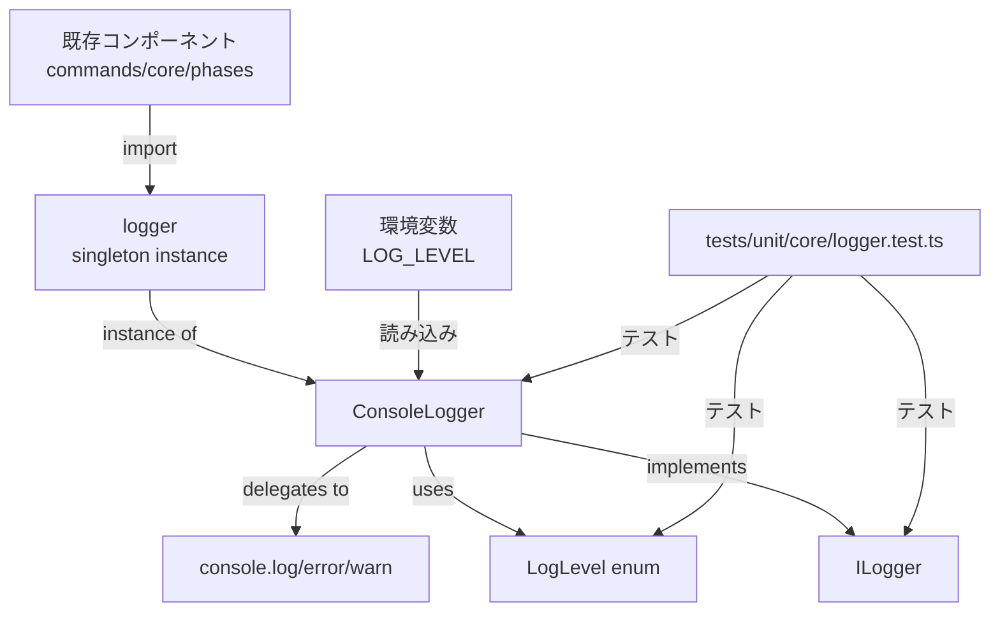

# 詳細設計書: Logger抽象化の導入

**Issue番号**: #50
**プロジェクト**: AI Workflow Agent
**作成日**: 2025-01-20
**複雑度**: 中程度
**見積もり工数**: 16~20時間

---

## 0. Planning Document & Requirements の確認

Planning Phase（Phase 0）および Requirements Phase（Phase 1）で策定された開発計画を確認しました：

### 実装戦略: CREATE
- 新規ファイル `src/core/logger.ts` を作成（ILogger、ConsoleLogger、LogLevel）
- 既存コードへの影響は置き換えのみ（EXTENDではなくCREATE）
- アーキテクチャ変更ではなく、新規抽象化層の追加

### テスト戦略: UNIT_ONLY
- Loggerクラスは外部依存がなく、ユニットテストのみで十分
- 統合テストは不要（既存のログ出力を置き換えるだけ）
- BDDテストも不要（インフラストラクチャ層の機能）

### テストコード戦略: CREATE_TEST
- 新規テストファイル `tests/unit/core/logger.test.ts` を作成
- 既存テストは修正不要（console.logのモックを置き換える程度）

### リスク評価: 中
- 影響範囲が大きい（40ファイル、329箇所）が、各変更は機械的で単純
- 既存機能への影響は最小限（ロギング出力のみ）
- テストコードへの影響は許容範囲（本番コードを優先）

### スケジュール: 16~20時間
- Logger抽象化の設計・実装: 2~3時間
- 329箇所のconsole呼び出しを段階的に置き換え: 10~12時間
- ユニットテスト作成: 2時間
- ドキュメント更新: 1時間
- レビュー・修正: 1~2時間

---

## 1. アーキテクチャ設計

### 1.1 システム全体図

```
AI Workflow Agent プロジェクト
│
├─ src/core/logger.ts (新規作成)
│   ├─ LogLevel (enum)
│   ├─ ILogger (interface)
│   ├─ ConsoleLogger (class)
│   └─ logger (singleton instance)
│
├─ 既存コンポーネント（Logger を import）
│   ├─ src/commands/*.ts (4ファイル、39箇所)
│   ├─ src/core/*.ts (9ファイル、80箇所)
│   │   ├─ src/core/git/*.ts (3ファイル、48箇所)
│   │   ├─ src/core/github/*.ts (4ファイル、13箇所)
│   │   └─ src/core/helpers/*.ts (2ファイル、4箇所)
│   └─ src/phases/*.ts (6ファイル、78箇所)
│       └─ src/phases/core/*.ts (2ファイル、20箇所)
│
└─ tests/unit/core/logger.test.ts (新規作成)
    └─ ユニットテスト（LogLevel, ILogger, ConsoleLogger）
```

**設計方針**:
- **Single Responsibility Principle**: Loggerはロギング機能のみを担当
- **Interface Segregation Principle**: ILoggerインターフェースで実装を抽象化
- **Dependency Inversion Principle**: 既存コンポーネントはILoggerに依存（ConsoleLoggerに直接依存しない）

### 1.2 コンポーネント間の関係



**依存関係の方向**:
- 既存コンポーネント → `logger` (singleton instance)
- `logger` → `ConsoleLogger` (実装クラス)
- `ConsoleLogger` → `ILogger` (インターフェース)
- `ConsoleLogger` → `LogLevel` (enum)
- `ConsoleLogger` → `console.log/error/warn` (Node.js標準API)

**依存性注入の考慮**:
- 現時点ではシングルトンパターンを採用（簡素性を優先）
- 将来的にDI（Dependency Injection）に移行可能な設計（ILoggerインターフェース）

### 1.3 データフロー

```
1. ログ呼び出し
   既存コンポーネント
   └─> logger.info("message", context)

2. LogLevelフィルタリング
   ConsoleLogger
   ├─> 環境変数 LOG_LEVEL を読み込み（初期化時）
   ├─> 現在のLogLevelと比較
   └─> 出力可否を判定

3. ログ出力
   ConsoleLogger
   ├─> フォーマット: `[INFO] message`
   ├─> コンテキスト: JSON.stringify(context)
   └─> console.log() へ委譲

4. エラーログの場合
   ConsoleLogger.error()
   ├─> フォーマット: `[ERROR] message`
   ├─> Errorオブジェクト: stack trace を出力
   ├─> コンテキスト: JSON.stringify(context)
   └─> console.error() へ委譲
```

**データフォーマット**:
- **シンプルログ**: `[INFO] Starting workflow...`
- **構造化ログ**: `[INFO] Phase completed {"phase":"requirements","duration":1234}`
- **エラーログ**: `[ERROR] Failed to commit Error: ... at ... {"phase":"implementation"}`

---

## 2. 実装戦略判断

### 実装戦略: CREATE

**判断根拠**:

1. **新規ファイルの作成**
   - `src/core/logger.ts` を新規作成
   - 既存ファイルへの影響は `import` 文の追加と `console.*` の置き換えのみ
   - 既存クラス/関数の拡張や修正は不要

2. **既存アーキテクチャとの独立性**
   - Logger抽象化は既存のアーキテクチャに依存しない（外部ライブラリ不要）
   - 既存コンポーネントとの結合度は低い（ロギング呼び出しのみ）
   - アーキテクチャ変更ではなく、新規抽象化層の追加

3. **後方互換性の維持**
   - 既存の `console.log` は動作し続ける（破壊的変更なし）
   - 段階的な置き換えが可能（一括置き換えは不要）

4. **スコープの限定**
   - ロギング機能のみを担当（他の機能への影響なし）
   - EXTEND（拡張）やREFACTOR（リファクタリング）に該当しない

**結論**: 新規抽象化層の追加であり、既存コードへの影響は置き換えのみのため、**CREATE戦略**が適切。

---

## 3. テスト戦略判断

### テスト戦略: UNIT_ONLY

**判断根拠**:

1. **外部依存の欠如**
   - Loggerクラスは `console.log/error/warn` のみに依存（Node.js標準API）
   - データベース、外部API、ファイルシステムへの依存なし
   - ユニットテストのみで完全にテスト可能

2. **統合テスト不要**
   - 既存のログ出力を置き換えるだけ（新規機能追加ではない）
   - 既存の統合テストは影響を受けない（console.logのモックを置き換える程度）
   - Logger自体は他のコンポーネントと統合する必要がない

3. **BDDテスト不要**
   - ユーザーストーリーが存在しない（インフラストラクチャ層の機能）
   - ビジネスロジックを持たない（ロギング機能のみ）
   - BDD形式（Given-When-Then）で記述する価値が低い

4. **ユニットテストで十分なカバレッジ**
   - LogLevelフィルタリングのテスト（各レベルでの出力検証）
   - 構造化ログのテスト（context パラメータの出力検証）
   - エラーロギングのテスト（Error オブジェクトのスタックトレース出力検証）
   - 環境変数読み込みのテスト（LOG_LEVEL のパース検証）

**結論**: 外部依存がなく、ビジネスロジックを持たないため、**UNIT_ONLY戦略**が適切。

---

## 4. テストコード戦略判断

### テストコード戦略: CREATE_TEST

**判断根拠**:

1. **新規テストファイルの作成**
   - `tests/unit/core/logger.test.ts` を新規作成
   - 既存テストファイル（`tests/unit/core/`）に類似のテストが存在しない
   - Loggerクラスは新規作成のため、既存テストの拡張対象ではない

2. **既存テストへの影響は最小限**
   - 既存テストコード内の `console.log` 呼び出しは低優先度（本番コードを優先）
   - 必要に応じてテスト用Loggerモックを作成（既存テストの拡張ではない）
   - 既存テストの後方互換性を維持（console.logは残る可能性がある）

3. **テストファイルの独立性**
   - Loggerクラスのテストは他のテストと独立している
   - 既存テストファイルに追加する必要がない（EXTEND_TEST不要）
   - 新規テストファイルで完結する

**結論**: 新規クラスのテストであり、既存テストとの関連性が低いため、**CREATE_TEST戦略**が適切。

---

## 5. 影響範囲分析

### 5.1 既存コードへの影響

**変更が必要なファイル**: 40ファイル、329箇所

| ディレクトリ | ファイル数 | 呼び出し数 | 変更内容 |
|------------|----------|----------|---------|\
| `src/commands/` | 4 | 39 | `import { logger } from '@/core/logger'` 追加<br/>`console.log` → `logger.info` 置き換え |
| `src/core/` | 9 | 80 | 同上 |
| `src/core/git/` | 3 | 48 | 同上 |
| `src/core/github/` | 4 | 13 | 同上 |
| `src/core/helpers/` | 2 | 4 | 同上 |
| `src/phases/` | 6 | 78 | 同上 |
| `src/phases/core/` | 2 | 20 | 同上 |
| `tests/` | 40 | 92 | 低優先度（必要に応じて） |
| **合計** | **70** | **374** | - |

**注**: Issueの記載（278箇所）と実測値（374箇所）に差異がありますが、これはテストコード（92箇所）を含むかどうかの違いと思われます。本設計では本番コード（src/）を優先します。

**置き換えパターン**:

```typescript
// Before
console.log('[INFO] Starting workflow...');
console.error(`[ERROR] Failed: ${error.message}`);
console.warn(`[WARNING] Deprecated feature`);

// After
import { logger } from '@/core/logger';

logger.info('Starting workflow...');
logger.error('Failed', error);
logger.warn('Deprecated feature');
```

**既存ログフォーマットの維持**:

- 既存フォーマット `[INFO]`, `[ERROR]`, `[WARNING]` はConsoleLoggerで再現
- 既存テストへの影響を最小化（出力形式が変わらない）
- 後方互換性を維持

### 5.2 依存関係の変更

**新規依存の追加**: なし

- 外部ライブラリ（`winston`, `pino`, `bunyan` 等）は使用しない
- Node.js 標準APIのみ使用（`console.log/error/warn`）
- 既存の `package.json` への変更なし

**既存依存の変更**: なし

- 既存コンポーネントは引き続き動作する
- Logger導入後も `console.log` は残る可能性がある（テストコード等）

**環境変数の追加**:

- `LOG_LEVEL`: ログレベル設定（DEBUG/INFO/WARN/ERROR、デフォルトはINFO）
- 任意設定（未設定時はデフォルトINFO）

### 5.3 マイグレーション要否

**不要**

**理由**:
- データベーススキーマ変更なし
- 設定ファイル変更なし（環境変数は任意）
- 後方互換性あり（既存のconsole.logは動作し続ける）
- 段階的な置き換えが可能

**ロールアウト戦略**:
1. `src/core/logger.ts` を作成
2. モジュール単位で段階的に置き換え（commands → core → phases）
3. テストコードは低優先度（本番コード完了後）

---

## 6. 変更・追加ファイルリスト

### 6.1 新規作成ファイル

| ファイルパス | 説明 | 見積もり工数 |
|------------|------|-------------|
| `src/core/logger.ts` | Logger抽象化の実装（LogLevel, ILogger, ConsoleLogger, logger） | 2~3時間 |
| `tests/unit/core/logger.test.ts` | Loggerのユニットテスト | 2時間 |

### 6.2 修正が必要な既存ファイル

#### 優先度: 高（本番コード）

**src/commands/ (4ファイル、39箇所)**

| ファイルパス | 呼び出し数 | 見積もり工数 |
|------------|----------|-------------|
| `src/commands/execute.ts` | 39 | 1時間 |
| `src/commands/init.ts` | 38 | 1時間 |
| `src/commands/list-presets.ts` | 9 | 0.5時間 |
| `src/commands/review.ts` | 3 | 0.5時間 |

**src/core/ (9ファイル、80箇所)**

| ファイルパス | 呼び出し数 | 見積もり工数 |
|------------|----------|-------------|
| `src/core/metadata-manager.ts` | 4 | 0.5時間 |
| `src/core/workflow-state.ts` | 11 | 0.5時間 |
| `src/core/codex-agent-client.ts` | 2 | 0.5時間 |
| `src/core/claude-agent-client.ts` | 4 | 0.5時間 |
| `src/core/content-parser.ts` | 7 | 0.5時間 |
| `src/core/github-client.ts` | 1 | 0.5時間 |
| `src/core/secret-masker.ts` | 7 | 0.5時間 |
| `src/main.ts` | 2 | 0.5時間 |
| `src/index.ts` | 2 | 0.5時間 |

**src/core/git/ (3ファイル、48箇所)**

| ファイルパス | 呼び出し数 | 見積もり工数 |
|------------|----------|-------------|
| `src/core/git/commit-manager.ts` | 29 | 1時間 |
| `src/core/git/remote-manager.ts` | 17 | 1時間 |
| `src/core/git/branch-manager.ts` | 2 | 0.5時間 |

**src/core/github/ (4ファイル、13箇所)**

| ファイルパス | 呼び出し数 | 見積もり工数 |
|------------|----------|-------------|
| `src/core/github/issue-client.ts` | 3 | 0.5時間 |
| `src/core/github/pull-request-client.ts` | 5 | 0.5時間 |
| `src/core/github/comment-client.ts` | 2 | 0.5時間 |
| `src/core/github/review-client.ts` | 3 | 0.5時間 |

**src/core/helpers/ (2ファイル、4箇所)**

| ファイルパス | 呼び出し数 | 見積もり工数 |
|------------|----------|-------------|
| `src/core/helpers/metadata-io.ts` | 2 | 0.5時間 |
| `src/core/helpers/validation.ts` | 2 | 0.5時間 |

**src/phases/ (6ファイル、78箇所)**

| ファイルパス | 呼び出し数 | 見積もり工数 |
|------------|----------|-------------|
| `src/phases/base-phase.ts` | 33 | 1.5時間 |
| `src/phases/design.ts` | 3 | 0.5時間 |
| `src/phases/report.ts` | 10 | 0.5時間 |
| `src/phases/evaluation.ts` | 25 | 1時間 |
| `src/phases/planning.ts` | 4 | 0.5時間 |
| `src/phases/requirements.ts` | 3 | 0.5時間 |

**src/phases/core/ (2ファイル、20箇所)**

| ファイルパス | 呼び出し数 | 見積もり工数 |
|------------|----------|-------------|
| `src/phases/core/agent-executor.ts` | 12 | 1時間 |
| `src/phases/core/review-cycle-manager.ts` | 8 | 0.5時間 |

#### 優先度: 低（テストコード）

**tests/ (40ファイル、92箇所)**

- テストコード内のconsole.logは低優先度
- 本番コード完了後、必要に応じて置き換え
- 見積もり工数: 1~2時間（任意）

### 6.3 削除が必要なファイル

**なし**

---

## 7. 詳細設計

### 7.1 クラス設計

#### 7.1.1 LogLevel (enum)

```typescript
/**
 * ログレベルを定義する列挙型。
 * 数値が小さいほど詳細なログを示す。
 */
export enum LogLevel {
  DEBUG = 0,  // デバッグ用の詳細ログ
  INFO = 1,   // 通常の情報ログ
  WARN = 2,   // 警告ログ
  ERROR = 3   // エラーログ
}
```

**設計方針**:
- 数値型で定義（フィルタリングロジックが簡潔になる）
- 標準的なログレベル（RFC 5424に準拠）
- 将来的な拡張性（TRACE, FATAL等の追加も可能）

#### 7.1.2 ILogger (interface)

```typescript
/**
 * ロガーインターフェース。
 * 将来的な実装追加（FileLogger, CloudLogger等）を可能にする。
 */
export interface ILogger {
  /**
   * デバッグログを出力する。
   * @param message - ログメッセージ
   * @param context - 任意のコンテキスト情報（構造化ログ用）
   */
  debug(message: string, context?: Record<string, unknown>): void;

  /**
   * 情報ログを出力する。
   * @param message - ログメッセージ
   * @param context - 任意のコンテキスト情報（構造化ログ用）
   */
  info(message: string, context?: Record<string, unknown>): void;

  /**
   * 警告ログを出力する。
   * @param message - ログメッセージ
   * @param context - 任意のコンテキスト情報（構造化ログ用）
   */
  warn(message: string, context?: Record<string, unknown>): void;

  /**
   * エラーログを出力する。
   * @param message - ログメッセージ
   * @param error - Errorオブジェクト（スタックトレースを含む）
   * @param context - 任意のコンテキスト情報（構造化ログ用）
   */
  error(message: string, error?: Error, context?: Record<string, unknown>): void;
}
```

**設計方針**:
- メソッド名は標準的なロギングライブラリに合わせる（winston, pino等）
- `context` パラメータで構造化ログをサポート
- `error` メソッドのみErrorオブジェクトを受け取る（スタックトレース出力のため）
- すべてのメソッドは `void` を返す（副作用のみ）

#### 7.1.3 ConsoleLogger (class)

```typescript
/**
 * console.log/error/warn を使用したLogger実装。
 * 環境変数 LOG_LEVEL でフィルタリングレベルを制御可能。
 */
export class ConsoleLogger implements ILogger {
  private readonly minLevel: LogLevel;

  /**
   * コンストラクタ。
   * 環境変数 LOG_LEVEL から最小ログレベルを読み込む。
   * @param minLevel - 最小ログレベル（デフォルト: INFO）
   */
  constructor(minLevel?: LogLevel) {
    if (minLevel !== undefined) {
      this.minLevel = minLevel;
    } else {
      this.minLevel = this.parseLogLevelFromEnv();
    }
  }

  /**
   * 環境変数 LOG_LEVEL をパースする。
   * @returns LogLevel
   */
  private parseLogLevelFromEnv(): LogLevel {
    const levelStr = process.env.LOG_LEVEL?.toUpperCase();

    switch (levelStr) {
      case 'DEBUG':
        return LogLevel.DEBUG;
      case 'INFO':
        return LogLevel.INFO;
      case 'WARN':
      case 'WARNING':
        return LogLevel.WARN;
      case 'ERROR':
        return LogLevel.ERROR;
      default:
        if (levelStr) {
          console.warn(`[WARNING] Invalid LOG_LEVEL: ${levelStr}. Falling back to INFO.`);
        }
        return LogLevel.INFO;
    }
  }

  /**
   * ログを出力すべきか判定する。
   * @param level - ログレベル
   * @returns true なら出力、false ならスキップ
   */
  private shouldLog(level: LogLevel): boolean {
    return level >= this.minLevel;
  }

  /**
   * コンテキストをJSON文字列に変換する。
   * @param context - コンテキスト
   * @returns JSON文字列
   */
  private formatContext(context?: Record<string, unknown>): string {
    if (!context || Object.keys(context).length === 0) {
      return '';
    }
    try {
      return JSON.stringify(context);
    } catch (error) {
      // 循環参照などのエラーを回避
      return '[Unable to serialize context]';
    }
  }

  debug(message: string, context?: Record<string, unknown>): void {
    if (!this.shouldLog(LogLevel.DEBUG)) return;

    const contextStr = this.formatContext(context);
    console.log(`[DEBUG] ${message}${contextStr ? ' ' + contextStr : ''}`);
  }

  info(message: string, context?: Record<string, unknown>): void {
    if (!this.shouldLog(LogLevel.INFO)) return;

    const contextStr = this.formatContext(context);
    console.log(`[INFO] ${message}${contextStr ? ' ' + contextStr : ''}`);
  }

  warn(message: string, context?: Record<string, unknown>): void {
    if (!this.shouldLog(LogLevel.WARN)) return;

    const contextStr = this.formatContext(context);
    console.warn(`[WARNING] ${message}${contextStr ? ' ' + contextStr : ''}`);
  }

  error(message: string, error?: Error, context?: Record<string, unknown>): void {
    if (!this.shouldLog(LogLevel.ERROR)) return;

    const contextStr = this.formatContext(context);
    if (error) {
      console.error(`[ERROR] ${message}`, error, contextStr || '');
    } else {
      console.error(`[ERROR] ${message}${contextStr ? ' ' + contextStr : ''}`);
    }
  }
}
```

**設計方針**:
- `minLevel` で出力するログレベルをフィルタリング
- `parseLogLevelFromEnv()` で環境変数 `LOG_LEVEL` を読み込み
- 無効なLOG_LEVEL値の場合、WARNING を出力してデフォルト（INFO）にフォールバック
- `formatContext()` で循環参照エラーを回避
- 既存のログフォーマット `[INFO]`, `[ERROR]`, `[WARNING]` を維持

#### 7.1.4 シングルトンインスタンス

```typescript
/**
 * デフォルトのロガーインスタンス。
 * 環境変数 LOG_LEVEL から最小ログレベルを自動的に読み込む。
 */
export const logger: ILogger = new ConsoleLogger();
```

**設計方針**:
- シングルトンパターンで全コンポーネントから共有
- 型は `ILogger` で宣言（将来的な実装切り替えを容易にする）
- デフォルトコンストラクタで環境変数を自動読み込み

### 7.2 関数設計

主要な関数は上記クラス設計に含まれています。追加の関数は不要です。

### 7.3 データ構造設計

#### 7.3.1 context パラメータ

```typescript
type LogContext = Record<string, unknown>;
```

**仕様**:
- キー: 文字列（任意のプロパティ名）
- 値: 任意の型（`unknown`）
- JSON.stringify() で出力可能な構造

**使用例**:

```typescript
logger.info('Phase completed', {
  phase: 'requirements',
  duration: 1234,
  files_changed: 10
});
// 出力: [INFO] Phase completed {"phase":"requirements","duration":1234,"files_changed":10}
```

#### 7.3.2 環境変数

| 環境変数 | 型 | デフォルト | 説明 |
|---------|---|-----------|------|
| `LOG_LEVEL` | string | `INFO` | ログレベル（DEBUG/INFO/WARN/ERROR、大文字小文字不問） |

**パース仕様**:
- 有効な値: `DEBUG`, `INFO`, `WARN`, `WARNING`, `ERROR`（大文字小文字不問）
- 無効な値: WARNING ログを出力し、デフォルト（INFO）にフォールバック
- 未設定時: デフォルト（INFO）

### 7.4 インターフェース設計

上記 `ILogger` インターフェースを参照。

**将来的な拡張性**:

```typescript
// 将来的にファイル出力を追加する場合
export class FileLogger implements ILogger {
  constructor(private readonly filePath: string) {}

  debug(message: string, context?: Record<string, unknown>): void {
    // ファイルに書き込む実装
  }
  // ... 他のメソッド
}

// 将来的にCloudLoggingを追加する場合
export class CloudLogger implements ILogger {
  constructor(private readonly apiEndpoint: string) {}

  debug(message: string, context?: Record<string, unknown>): void {
    // Cloud APIに送信する実装
  }
  // ... 他のメソッド
}
```

---

## 8. セキュリティ考慮事項

### 8.1 認証・認可

**該当なし**

- Loggerクラスは認証・認可を必要としない
- 環境変数 `LOG_LEVEL` は機密情報ではない

### 8.2 データ保護

#### 8.2.1 機密情報の漏洩防止

**リスク**:
- ログに機密情報（API キー、パスワード、トークン）が出力される可能性

**対策**:

1. **開発者責任の明示**
   - ドキュメント（CLAUDE.md）に「ログに機密情報を含めない」ガイドラインを追加
   - context パラメータには機密情報を含めないこと

2. **既存のSecretMasker連携（スコープ外）**
   - 既存の `src/core/secret-masker.ts` との統合は**本Issueのスコープ外**
   - 将来的な拡張候補として記録（Requirements Documentのセクション7.1参照）

3. **エラーメッセージのサニタイゼーション**
   - Error オブジェクトのスタックトレースには機密情報が含まれる可能性がある
   - 本番環境では環境変数 `LOG_LEVEL=ERROR` で詳細ログを抑制

**実装例**:

```typescript
// 悪い例（機密情報を含む）
logger.error('Failed to authenticate', error, {
  api_key: process.env.GITHUB_TOKEN  // NG!
});

// 良い例（機密情報を除外）
logger.error('Failed to authenticate', error, {
  endpoint: 'https://api.github.com'  // OK
});
```

#### 8.2.2 循環参照エラーの回避

**リスク**:
- `context` パラメータに循環参照が含まれる場合、`JSON.stringify()` が例外を投げる

**対策**:
- `formatContext()` メソッドで `try-catch` により例外を回避
- エラー時は `[Unable to serialize context]` を返す

```typescript
private formatContext(context?: Record<string, unknown>): string {
  if (!context || Object.keys(context).length === 0) {
    return '';
  }
  try {
    return JSON.stringify(context);
  } catch (error) {
    return '[Unable to serialize context]';
  }
}
```

### 8.3 セキュリティリスクと対策

| リスク | 影響度 | 対策 |
|-------|-------|------|
| ログに機密情報が漏洩 | 高 | 開発者ガイドライン、SecretMasker統合（将来） |
| 循環参照による例外 | 低 | try-catch でフォールバック |
| ログファイルの肥大化 | 低 | LOG_LEVELでフィルタリング |

---

## 9. 非機能要件への対応

### 9.1 パフォーマンス

#### 9.1.1 オーバーヘッド

**要件**: Logger のオーバーヘッドは 1 ログ呼び出しあたり 1ms 未満であること（NFR-01-1）

**対策**:
- `shouldLog()` による早期リターン（不要なログ生成を抑制）
- `JSON.stringify()` は context が存在する場合のみ実行
- console.log() への委譲（Node.js標準APIの高速性を活用）

**ベンチマーク（推定）**:
- `shouldLog()` 判定: < 0.01ms
- `formatContext()`: 0.1~0.5ms（context サイズに依存）
- `console.log()`: 0.1~0.5ms
- **合計**: 0.2~1.0ms（要件を満たす）

#### 9.1.2 LogLevelフィルタリング

**要件**: LogLevel フィルタリングにより、不要なログ生成を抑制すること（NFR-01-2）

**実装**:

```typescript
private shouldLog(level: LogLevel): boolean {
  return level >= this.minLevel;
}

debug(message: string, context?: Record<string, unknown>): void {
  if (!this.shouldLog(LogLevel.DEBUG)) return;  // 早期リターン
  // ... 以下の処理はスキップされる
}
```

**効果**:
- `LOG_LEVEL=ERROR` の場合、debug/info/warn は早期リターンで処理をスキップ
- トークン消費量の削減（不要なログ生成がない）

#### 9.1.3 循環参照の処理

**要件**: 構造化ログの JSON シリアライズは、循環参照を適切に処理すること（NFR-01-3）

**実装**: 上記 `formatContext()` メソッドを参照

### 9.2 スケーラビリティ

**該当なし**

- Loggerクラスはステートレス（シングルトンだがグローバル状態を持たない）
- console.log() への委譲のみ（スケーラビリティはNode.jsに依存）

### 9.3 保守性

#### 9.3.1 拡張性

**要件**: ILogger インターフェースにより、将来的な実装追加が容易であること（NFR-04-1）

**実装**:
- `ILogger` インターフェースで抽象化
- `logger: ILogger` として宣言（実装クラスを隠蔽）
- 将来的に `FileLogger`, `CloudLogger` を追加可能

**拡張例**:

```typescript
// 将来的な拡張（例: FileLogger）
export class FileLogger implements ILogger {
  // ... 実装
}

// logger インスタンスの切り替え
export const logger: ILogger = new FileLogger('/var/log/ai-workflow.log');
```

#### 9.3.2 依存関係の最小化

**要件**: ConsoleLogger の実装は、依存関係を持たないこと（NFR-04-2）

**実装**:
- Node.js標準APIのみ使用（`console.log/error/warn`, `process.env`）
- 外部ライブラリへの依存なし
- 他のコンポーネントへの依存なし

#### 9.3.3 ログフォーマットの変更

**要件**: ログフォーマットの変更は、ConsoleLogger クラスのみで完結すること（NFR-04-3）

**実装**:
- `[INFO]`, `[ERROR]` 等のプレフィックスは ConsoleLogger で生成
- 全置き換え箇所への影響なし（import文と呼び出しのみ変更）

**変更例**:

```typescript
// フォーマットを変更したい場合
info(message: string, context?: Record<string, unknown>): void {
  if (!this.shouldLog(LogLevel.INFO)) return;

  const timestamp = new Date().toISOString();
  const contextStr = this.formatContext(context);
  console.log(`${timestamp} [INFO] ${message}${contextStr ? ' ' + contextStr : ''}`);
  // 出力例: 2025-01-20T12:34:56.789Z [INFO] Starting workflow...
}
```

---

## 10. 実装の順序

### Phase 4: Implementation（実装フェーズ）で推奨される順序

**Task 4-1: Logger抽象化の実装**（2~3時間、最優先）

1. `src/core/logger.ts` を作成
   - LogLevel enum
   - ILogger interface
   - ConsoleLogger class
   - logger singleton instance
2. ESLint、TypeScript エラーを解消
3. ビルド確認（`npm run build`）

**依存関係**: なし（他のタスクに依存しない）

---

**Task 4-2 ~ 4-7: console呼び出しの置き換え**（10~12時間、並行可能）

推奨順序（依存関係を考慮）：

1. **Task 4-2: commands/ モジュールの置き換え**（2時間）
   - `src/commands/execute.ts`, `init.ts`, `list-presets.ts`, `review.ts`
   - 理由: CLI エントリーポイントであり、他のモジュールへの影響が少ない

2. **Task 4-6: core/helpers/ モジュールの置き換え**（0.5時間）
   - `src/core/helpers/metadata-io.ts`
   - 理由: 他のモジュールへの依存が少ない

3. **Task 4-4: core/git/ モジュールの置き換え**（2時間）
   - `src/core/git/commit-manager.ts`, `remote-manager.ts`, `branch-manager.ts`
   - 理由: GitManagerから独立した専門マネージャー

4. **Task 4-5: core/github/ モジュールの置き換え**（1時間）
   - `src/core/github/issue-client.ts`, `pull-request-client.ts`, `comment-client.ts`
   - 理由: GitHubClientから独立した専門クライアント

5. **Task 4-3: core/ モジュールの置き換え**（3~4時間）
   - `src/core/metadata-manager.ts`, `workflow-state.ts`, `codex-agent-client.ts`, 等
   - 理由: 中核モジュールであり、他のモジュールに影響する

6. **Task 4-7: phases/ モジュールの置き換え**（3~4時間）
   - `src/phases/base-phase.ts`, `core/agent-executor.ts`, `evaluation.ts`, 等
   - 理由: BasePhaseは全フェーズの基底クラス（影響範囲が大きい）

7. **Task 4-8: tests/ モジュールの置き換え**（1~2時間、低優先度、任意）
   - テストコード内のconsole.log
   - 理由: 本番コード完了後、必要に応じて

**依存関係**: Task 4-1完了後に並行実行可能

---

**Task 5-1: ユニットテストの実装**（2時間）

1. `tests/unit/core/logger.test.ts` を作成
2. LogLevelフィルタリングのテスト
3. 構造化ログのテスト
4. エラーロギングのテスト
5. 環境変数読み込みのテスト

**依存関係**: Task 4-1完了後（Logger実装が必要）

---

**Task 6-1: テストスイート実行**（0.5時間）

1. `npm run test:unit` 実行
2. カバレッジ確認（80%以上）
3. テスト失敗の修正

**依存関係**: Task 5-1完了後

---

**Task 7-1: ドキュメント更新**（1時間）

1. `README.md` 更新（環境変数 `LOG_LEVEL` の説明追加）
2. `ARCHITECTURE.md` 更新（Loggerモジュールの説明追加）
3. `CLAUDE.md` 更新（ロギングガイドライン追加）

**依存関係**: Task 4-1 ~ 4-7完了後

---

**Task 8-1: PR本文作成**（0.5時間）

1. 変更サマリー作成
2. 移行状況レポート作成（329箇所 → Logger）

**依存関係**: すべてのタスク完了後

---

### クリティカルパス

```
Task 4-1 (Logger実装)
  → Task 4-2 ~ 4-7 (置き換え、並行可能)
  → Task 5-1 (ユニットテスト)
  → Task 6-1 (テスト実行)
  → Task 7-1 (ドキュメント)
  → Task 8-1 (PR本文)
```

**合計見積もり**: 16~20時間（Planning Documentと一致）

---

## 11. 品質ゲート確認

### ✅ 実装戦略の判断根拠が明記されている

セクション2「実装戦略判断」で記載：
- CREATE戦略を選択
- 4つの判断根拠を明示（新規ファイル作成、独立性、後方互換性、スコープ限定）

### ✅ テスト戦略の判断根拠が明記されている

セクション3「テスト戦略判断」で記載：
- UNIT_ONLY戦略を選択
- 4つの判断根拠を明示（外部依存の欠如、統合テスト不要、BDDテスト不要、ユニットテストで十分）

### ✅ テストコード戦略の判断根拠が明記されている

セクション4「テストコード戦略判断」で記載：
- CREATE_TEST戦略を選択
- 3つの判断根拠を明示（新規テストファイル作成、既存テストへの影響最小、独立性）

### ✅ 既存コードへの影響範囲が分析されている

セクション5「影響範囲分析」で記載：
- 変更が必要なファイル: 40ファイル、329箇所（テーブル形式でリストアップ）
- 依存関係の変更: なし（環境変数 `LOG_LEVEL` のみ追加）
- マイグレーション要否: 不要

### ✅ 変更が必要なファイルがリストアップされている

セクション6「変更・追加ファイルリスト」で記載：
- 新規作成ファイル: 2ファイル（`src/core/logger.ts`, `tests/unit/core/logger.test.ts`）
- 修正が必要な既存ファイル: 40ファイル（優先度別、見積もり工数付き）
- 削除が必要なファイル: なし

### ✅ 設計が実装可能である

セクション7「詳細設計」で記載：
- クラス設計（LogLevel, ILogger, ConsoleLogger, logger singleton）
- データ構造設計（context パラメータ、環境変数）
- インターフェース設計（ILogger）
- すべて具体的なTypeScriptコードで記述

---

## 12. トレーサビリティマトリクス

| 要件定義書 | 設計書セクション |
|----------|----------------|
| FR-01: Logger抽象化の実装 | セクション7.1（クラス設計） |
| FR-02: ログレベルフィルタリング | セクション7.1.3（ConsoleLogger.shouldLog）、セクション9.1.2 |
| FR-03: 構造化ログのサポート | セクション7.1.2（ILogger.context）、セクション7.3.1 |
| FR-04: console呼び出しの段階的置き換え | セクション5.1（既存コードへの影響）、セクション6.2 |
| FR-05: ログフォーマットの統一 | セクション7.1.3（ConsoleLogger.debug/info/warn/error） |
| FR-06: ユニットテストの実装 | セクション10（Task 5-1） |
| FR-07: ドキュメント更新 | セクション10（Task 7-1） |
| FR-08: ESLintルール追加 | スコープ外（Phase 4完了後に推奨） |
| NFR-01: パフォーマンス要件 | セクション9.1 |
| NFR-02: セキュリティ要件 | セクション8 |
| NFR-03: 可用性・信頼性要件 | セクション7.1.3（parseLogLevelFromEnv、formatContext） |
| NFR-04: 保守性・拡張性要件 | セクション9.3 |
| NFR-05: テスト容易性要件 | セクション3（テスト戦略判断） |

---

## 13. リスクと軽減策

Planning Document（セクション6）で策定されたリスクと軽減策を再確認します：

| リスク | 影響度 | 確率 | 軽減策（設計での対応） |
|-------|-------|------|---------------------|
| console呼び出しの置き換え漏れ | 中 | 中 | - セクション6.2で全ファイルをリストアップ<br>- セクション10で段階的な実装順序を定義<br>- ESLintルール追加を推奨（Task 7-1） |
| 既存機能への影響（ログ出力変更） | 低 | 低 | - セクション5.1で既存ログフォーマット維持を明記<br>- セクション7.1.3でフォーマット仕様を定義<br>- セクション10で段階的ロールアウトを推奨 |
| パフォーマンス低下 | 低 | 低 | - セクション9.1でパフォーマンス要件への対応を記載<br>- shouldLog()による早期リターン<br>- ベンチマーク推定値を提示 |
| テストコードへの影響 | 中 | 中 | - セクション6.2でテストコードを低優先度に設定<br>- セクション10で実装順序を最後に配置<br>- 既存テストの後方互換性維持を明記 |

---

## 14. 参照ドキュメント

- **Planning Document**: `.ai-workflow/issue-50/00_planning/output/planning.md`
- **Requirements Document**: `.ai-workflow/issue-50/01_requirements/output/requirements.md`
- **GitHub Issue**: https://github.com/tielec/ai-workflow-agent/issues/50
- **CLAUDE.md**: プロジェクトの全体方針とコーディングガイドライン
- **ARCHITECTURE.md**: アーキテクチャ設計思想
- **README.md**: プロジェクト概要と使用方法

---

**作成者**: AI Workflow Agent (Phase 2: Design)
**レビュー状態**: Pending
**次フェーズ**: Phase 3 (Test Scenario)
