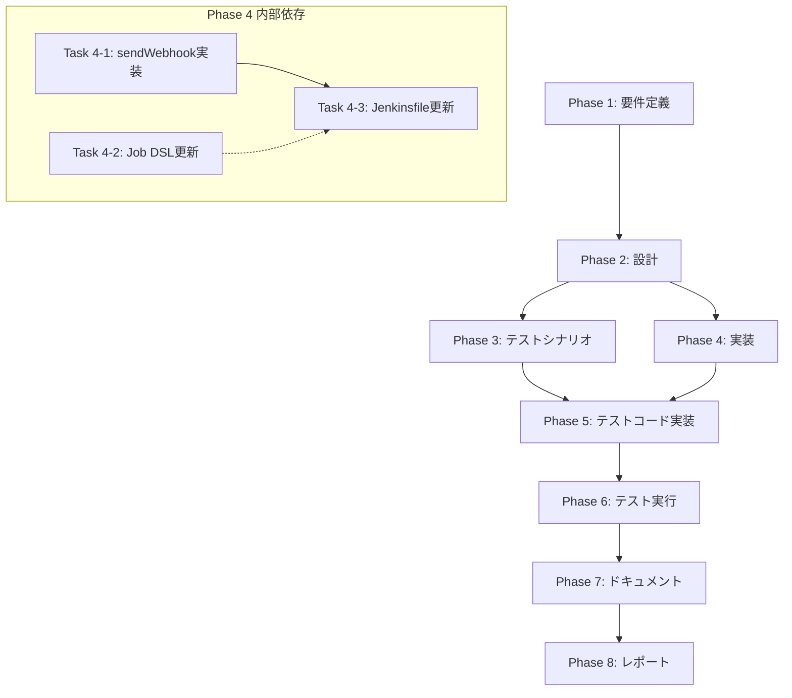

# プロジェクト計画書: Issue #505

## Jenkins Pipelineからのwebhook送信機能を追加してジョブ実行状況をLavableに通知

---

## 1. Issue分析

### 複雑度: 中程度

**判定根拠**:
- **複数ファイルの修正**: Job DSL定義ファイル8個 + Jenkinsfile 8個 + 共通モジュール1個 = 計17ファイルの変更
- **既存機能の拡張**: 新規サブシステムではなく、既存のJenkins Pipeline構成への機能追加
- **パターン化された作業**: 各ファイルで同様のパターン（パラメータ追加 + webhook呼び出し）を繰り返す
- **技術的難易度**: HTTP Request Plugin使用は標準的、設計もIssueで明示されている

### 見積もり工数: 8〜12時間

**工数内訳**:
| フェーズ | 時間 | 根拠 |
|---------|------|------|
| Phase 1: 要件定義 | 1h | Issueが詳細に記載済み、確認程度 |
| Phase 2: 設計 | 1.5h | 共通モジュール設計、適用パターン設計 |
| Phase 3: テストシナリオ | 1h | テストケース洗い出し |
| Phase 4: 実装 | 3-4h | 17ファイルの変更（パターン化で効率化） |
| Phase 5: テストコード実装 | 1.5h | common.groovy用テスト |
| Phase 6: テスト実行 | 0.5h | 動作確認 |
| Phase 7: ドキュメント | 0.5h | README更新 |
| Phase 8: レポート | 0.5h | 変更サマリー |
| **合計** | **9.5-10.5h** | |

### リスク評価: 低

**理由**:
- 既存パターンに沿った拡張
- Issueに詳細な実装仕様が記載済み
- webhook失敗時はビルドを失敗させない設計（影響範囲が限定的）
- HTTP Request Pluginは広く使われている標準プラグイン

---

## 2. 実装戦略判断

### 実装戦略: EXTEND

**判断根拠**:
- **既存コードの拡張が中心**: common.groovyへの関数追加、既存Jenkinsfileへのwebhook呼び出し追加
- **新規ファイル作成なし**: 既存の8つのJenkinsfile + 8つのJob DSL + 1つの共通モジュールへの追加
- **アーキテクチャ変更なし**: 現行のJenkins Pipeline構成を維持
- **CREATE不適**: 新規ファイル・モジュール作成は不要
- **REFACTOR不適**: 構造改善ではなく機能追加

### テスト戦略: INTEGRATION_ONLY

**判断根拠**:
- **外部システム連携が中心**: HTTP Request Pluginを使ったwebhook送信
- **ユニットテスト不適**: Groovy Jenkinsfileのテストは統合テストが主流
- **BDD不適**: エンドユーザー向け機能ではなくシステム間連携
- **検証項目**:
  - webhook送信成功時の動作
  - webhook送信失敗時のエラーハンドリング
  - パラメータ未指定時のスキップ動作

### テストコード戦略: CREATE_TEST

**判断根拠**:
- **新規機能のテスト**: `sendWebhook()` 関数は新規実装
- **既存テストなし**: `jenkins/shared/common.groovy` に対するテストファイルは現状存在しない
- **新規テストファイル作成**: `jenkins/shared/common_test.groovy` または `tests/integration/jenkins/webhook-test.groovy` を作成

---

## 3. 影響範囲分析

### 既存コードへの影響

#### 変更対象ファイル

**1. Job DSL定義ファイル（パラメータ追加）**: 8ファイル
| ファイル | 追加パラメータ |
|---------|---------------|
| `jenkins/jobs/dsl/ai-workflow/ai_workflow_all_phases_job.groovy` | JOB_ID, WEBHOOK_URL, WEBHOOK_TOKEN |
| `jenkins/jobs/dsl/ai-workflow/ai_workflow_preset_job.groovy` | JOB_ID, WEBHOOK_URL, WEBHOOK_TOKEN |
| `jenkins/jobs/dsl/ai-workflow/ai_workflow_single_phase_job.groovy` | JOB_ID, WEBHOOK_URL, WEBHOOK_TOKEN |
| `jenkins/jobs/dsl/ai-workflow/ai_workflow_rollback_job.groovy` | JOB_ID, WEBHOOK_URL, WEBHOOK_TOKEN |
| `jenkins/jobs/dsl/ai-workflow/ai_workflow_auto_issue_job.groovy` | JOB_ID, WEBHOOK_URL, WEBHOOK_TOKEN |
| `jenkins/jobs/dsl/ai-workflow/ai_workflow_finalize_job.groovy` | JOB_ID, WEBHOOK_URL, WEBHOOK_TOKEN |
| `jenkins/jobs/dsl/ai-workflow/ai_workflow_pr_comment_execute_job.groovy` | JOB_ID, WEBHOOK_URL, WEBHOOK_TOKEN |
| `jenkins/jobs/dsl/ai-workflow/ai_workflow_pr_comment_finalize_job.groovy` | JOB_ID, WEBHOOK_URL, WEBHOOK_TOKEN |

**2. Jenkinsfile（webhook呼び出し追加）**: 8ファイル
| ファイル | 変更内容 |
|---------|---------|
| `jenkins/jobs/pipeline/ai-workflow/all-phases/Jenkinsfile` | sendWebhook呼び出し追加 |
| `jenkins/jobs/pipeline/ai-workflow/preset/Jenkinsfile` | sendWebhook呼び出し追加 |
| `jenkins/jobs/pipeline/ai-workflow/single-phase/Jenkinsfile` | sendWebhook呼び出し追加 |
| `jenkins/jobs/pipeline/ai-workflow/rollback/Jenkinsfile` | sendWebhook呼び出し追加 |
| `jenkins/jobs/pipeline/ai-workflow/auto-issue/Jenkinsfile` | sendWebhook呼び出し追加 |
| `jenkins/jobs/pipeline/ai-workflow/finalize/Jenkinsfile` | sendWebhook呼び出し追加 |
| `jenkins/jobs/pipeline/ai-workflow/pr-comment-execute/Jenkinsfile` | sendWebhook呼び出し追加 |
| `jenkins/jobs/pipeline/ai-workflow/pr-comment-finalize/Jenkinsfile` | sendWebhook呼び出し追加 |

**3. 共通モジュール（sendWebhook関数追加）**: 1ファイル
| ファイル | 変更内容 |
|---------|---------|
| `jenkins/shared/common.groovy` | sendWebhook関数を新規追加 |

**注意**: Issueに記載されている以下のファイルパスは存在しません：
- `jenkins/Jenkinsfile.all-phases` → 正しくは `jenkins/jobs/pipeline/ai-workflow/all-phases/Jenkinsfile`
- その他も同様のパターン

### 依存関係の変更

#### 新規依存の追加
- **HTTP Request Plugin**: Jenkinsにインストール済みであること（前提条件）
  - `httpRequest` ステップを使用
  - プラグイン未インストール時はwebhook送信がスキップされる設計とする

#### 既存依存の変更
- なし

### マイグレーション要否

#### Jenkins側での作業（自動化対象外）
- [ ] Job DSL更新後、Jenkins Seed Jobを実行してジョブ定義を再生成
- [ ] HTTP Request Pluginがインストールされていることを確認

#### データベーススキーマ変更
- 不要

#### 設定ファイル変更
- 不要

---

## 4. タスク分割

### Phase 1: 要件定義 (見積もり: 1h)

- [x] Task 1-1: 機能要件の確認と明確化 (0.5h)
  - Issueに記載された仕様の再確認
  - webhook送信タイミングの確認（開始/成功/失敗）
  - リクエストボディ形式の確認
  - 認証ヘッダー形式の確認

- [x] Task 1-2: 非機能要件の確認 (0.5h)
  - タイムアウト設定の決定（デフォルト30秒を提案）
  - リトライポリシーの決定（なし、失敗はログのみ）
  - エラーハンドリング方針の確認

### Phase 2: 設計 (見積もり: 1.5h)

- [x] Task 2-1: sendWebhook共通関数の詳細設計 (0.5h)
  - 関数シグネチャの確定
  - 引数バリデーションロジック
  - エラーハンドリングパターン

- [x] Task 2-2: Job DSLパラメータ設計 (0.5h)
  - パラメータ名・型・説明の確定
  - `nonStoredPasswordParam` の使用確認
  - 既存パラメータとの配置順序

- [x] Task 2-3: Jenkinsfileへの組み込み設計 (0.5h)
  - webhook呼び出し位置の特定（各Jenkinsfileのステージ構造に応じて）
  - try-catch構造の設計
  - 各実行モード固有の考慮事項

### Phase 3: テストシナリオ (見積もり: 1h)

- [x] Task 3-1: テストケース定義 (1h)
  - 正常系: webhook送信成功
  - 正常系: パラメータ未指定時のスキップ
  - 異常系: webhook送信失敗（タイムアウト）
  - 異常系: 無効なURL指定
  - 各ステータス（running/success/failed）の送信確認

### Phase 4: 実装 (見積もり: 3-4h)

- [x] Task 4-1: sendWebhook共通関数の実装 (1h)
  - `jenkins/shared/common.groovy` への関数追加
  - httpRequestステップの実装
  - エラーハンドリング実装

- [x] Task 4-2: Job DSLパラメータ追加（全8ファイル） (1h)
  - JOB_ID パラメータ追加
  - WEBHOOK_URL パラメータ追加（nonStoredPasswordParam）
  - WEBHOOK_TOKEN パラメータ追加（nonStoredPasswordParam）

- [x] Task 4-3: Jenkinsfile更新（全8ファイル） (1.5-2h)
  - ビルド開始時のwebhook送信追加
  - post.success時のwebhook送信追加
  - post.failure時のwebhook送信追加

### Phase 5: テストコード実装 (見積もり: 1.5h)

- [x] Task 5-1: sendWebhook関数のテスト実装 (1.5h)
  - モックサーバーを使ったテスト
  - パラメータバリデーションテスト
  - エラーハンドリングテスト

### Phase 6: テスト実行 (見積もり: 0.5h)

- [x] Task 6-1: 統合テスト実行 (0.5h)
  - テストの実行と結果確認
  - 必要に応じて修正

### Phase 7: ドキュメント (見積もり: 0.5h)

- [ ] Task 7-1: ドキュメント更新 (0.5h)
  - `jenkins/README.md` の更新（webhook機能の説明追加）
  - 新規パラメータの説明追加

### Phase 8: レポート (見積もり: 0.5h)

- [ ] Task 8-1: 変更サマリー作成 (0.5h)
  - 変更内容の要約
  - テスト結果の報告
  - Jenkins側での必要作業の記載

---

## 5. 依存関係

### 並列実行可能なタスク
- Task 4-2（Job DSL更新）と Task 4-1（sendWebhook実装）は並列実行可能
- Phase 3（テストシナリオ）と Phase 4（実装）は部分的に並列実行可能

---

## 6. リスクと軽減策

### リスク1: HTTP Request Pluginの未インストール

- **影響度**: 高
- **確率**: 低
- **軽減策**:
  - 設計段階でプラグイン存在確認ロジックを追加
  - プラグイン未検出時は警告ログを出力してスキップ
  - ドキュメントに前提条件として明記

### リスク2: 既存Jenkinsfileの構造差異

- **影響度**: 中
- **確率**: 低（調査済み）
- **軽減策**:
  - 調査結果に基づき、8つのJenkinsfileすべての構造を把握済み
  - 各ファイルのpost.success/post.failureブロック位置を特定済み
  - pr-comment-finalizeは認証情報準備ステージがないため、別途考慮

### リスク3: webhook送信のパフォーマンス影響

- **影響度**: 低
- **確率**: 低
- **軽減策**:
  - タイムアウトを適切に設定（30秒）
  - 非同期送信の検討（ただしGroovyの制約あり）
  - 失敗時はログのみで継続

### リスク4: Issueの記載パスと実際のファイルパスの差異

- **影響度**: 中
- **確率**: 確定（調査で発見）
- **軽減策**:
  - 正しいファイルパスを本計画書で明記済み
  - `jenkins/Jenkinsfile.*` は存在しない
  - 実際は `jenkins/jobs/pipeline/ai-workflow/*/Jenkinsfile` に配置

---

## 7. 品質ゲート

### Phase 1: 要件定義

- [ ] 機能要件が明確に記載されている
- [ ] 受け入れ基準が定義されている
- [ ] webhook送信のタイミング・フォーマットが確定している
- [ ] エラーハンドリング方針が決定している

### Phase 2: 設計

- [ ] 実装戦略の判断根拠が明記されている（EXTEND）
- [ ] テスト戦略の判断根拠が明記されている（INTEGRATION_ONLY）
- [ ] テストコード戦略の判断根拠が明記されている（CREATE_TEST）
- [ ] sendWebhook関数のシグネチャが確定している
- [ ] パラメータ設計が完了している

### Phase 3: テストシナリオ

- [x] 正常系テストケースが網羅されている
- [x] 異常系テストケースが網羅されている
- [x] 境界条件（パラメータ未指定等）がカバーされている

### Phase 4: 実装

- [x] sendWebhook関数が common.groovy に追加されている
- [x] 全8個のJob DSLファイルにパラメータが追加されている
- [x] 全8個のJenkinsfileにwebhook呼び出しが追加されている
- [x] エラーハンドリングが実装されている
- [x] コードスタイルが既存コードと一貫している

### Phase 5: テストコード実装

- [x] sendWebhook関数のテストが実装されている
- [x] 正常系・異常系のテストケースがカバーされている

### Phase 6: テスト実行

- [ ] 全テストがパスしている
- [ ] カバレッジが十分である

### Phase 7: ドキュメント

- [ ] README.mdが更新されている
- [ ] 新規パラメータの説明が記載されている
- [ ] 前提条件（HTTP Request Plugin）が記載されている

### Phase 8: レポート

- [ ] 変更サマリーが作成されている
- [ ] Jenkins側の必要作業が明記されている

---

## 補足情報

### Issueとの差異

Issueに記載されていた以下のファイルパスは存在しません。実際のパスは以下の通りです：

| Issue記載パス | 実際のパス |
|--------------|-----------|
| `jenkins/Jenkinsfile.all-phases` | `jenkins/jobs/pipeline/ai-workflow/all-phases/Jenkinsfile` |
| `jenkins/Jenkinsfile.preset` | `jenkins/jobs/pipeline/ai-workflow/preset/Jenkinsfile` |
| `jenkins/Jenkinsfile.single-phase` | `jenkins/jobs/pipeline/ai-workflow/single-phase/Jenkinsfile` |
| `jenkins/Jenkinsfile.rollback` | `jenkins/jobs/pipeline/ai-workflow/rollback/Jenkinsfile` |
| `jenkins/Jenkinsfile.auto-issue` | `jenkins/jobs/pipeline/ai-workflow/auto-issue/Jenkinsfile` |
| `jenkins/jobs/pipeline/ai-workflow/pr-comment-execute/Jenkinsfile` | 正確 |
| `jenkins/jobs/pipeline/ai-workflow/pr-comment-finalize/Jenkinsfile` | 正確 |

また、対象Jenkinsfileは7つではなく8つあります（`finalize/Jenkinsfile` が追加対象）。

### 技術的補足

- **common.groovy の現在の関数**: `prepareAgentCredentials()`, `prepareCodexAuthFile()`, `setupEnvironment()`, `setupNodeEnvironment()`, `archiveArtifacts()`
- **WORKFLOW_VERSION**: 各Jenkinsfileで異なる（0.2.0〜0.6.0）
- **セキュリティ**: `nonStoredPasswordParam` を使用してWEBHOOK_TOKENを保護

---

## 品質ゲート（Phase 0）チェックリスト

- [x] **実装戦略が明確に決定されている**: EXTEND
- [x] **テスト戦略が明確に決定されている**: INTEGRATION_ONLY
- [x] **テストコード戦略が明確に決定されている**: CREATE_TEST
- [x] **影響範囲が分析されている**: 17ファイル（Job DSL 8 + Jenkinsfile 8 + common.groovy 1）
- [x] **タスク分割が適切な粒度である**: 全タスク1〜4時間以内
- [x] **リスクが洗い出されている**: 4つのリスクと軽減策を記載
