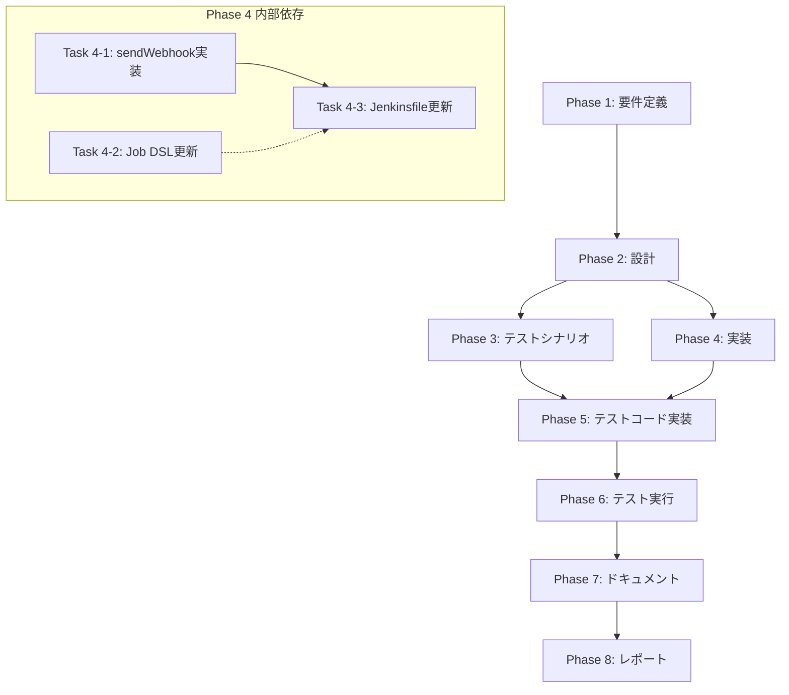

# Codex Agent 実行ログ

開始日時: 2025/12/25 3:27:43

---

## Turn 1: スレッド開始

**Thread ID**: `[REDACTED_TOKEN]`

## Turn 2: ツール実行

**種別**: reasoning
**ステータス**: completed

## Turn 3: ツール実行

**種別**: コマンド実行
**コマンド**: `/bin/bash -lc pwd`
**ステータス**: completed (exit_code=0)

```text
/tmp/[REDACTED_TOKEN]/ai-workflow-agent
```

## Turn 4: ツール実行

**種別**: reasoning
**ステータス**: completed

## Turn 5: ツール実行

**種別**: コマンド実行
**コマンド**: `/bin/bash -lc ls`
**ステータス**: completed (exit_code=0)

```text
ARCHITECTURE.md
CHANGELOG.md
CLAUDE.md
[REDACTED_TOKEN].md
[REDACTED_TOKEN].md
CODEBASE_SUMMARY.md
DOCKER_AUTH_SETUP.md
Dockerfile
Jenkinsfile
LICENSE
PROGRESS.md
README.md
ROADMAP.md
SETUP_TYPESCRIPT.md
TROUBLESHOOTING.md
__mocks__
docs
examples
jenkins
jest.config.cjs
metadata.json.template
node_modules
package-lock.json
package.json
scripts
src
tests
tsconfig.json
tsconfig.test.json
```

## Turn 6: ツール実行

**種別**: reasoning
**ステータス**: completed

## Turn 7: ツール実行

**種別**: コマンド実行
**コマンド**: `/bin/bash -lc "rg --files -g 'Planning.md'"`
**ステータス**: failed (exit_code=127)

```text
/bin/bash: line 1: rg: command not found
```

## Turn 8: ツール実行

**種別**: reasoning
**ステータス**: completed

## Turn 9: ツール実行

**種別**: コマンド実行
**コマンド**: `/bin/bash -lc 'find .. -name Planning.md -print'`
**ステータス**: completed (exit_code=0)

## Turn 10: ツール実行

**種別**: reasoning
**ステータス**: completed

## Turn 11: ツール実行

**種別**: コマンド実行
**コマンド**: `/bin/bash -lc 'grep -R "Phase 6" -n'`
**ステータス**: completed (exit_code=0)

```text
.git/logs/refs/heads/ai-workflow/issue-505:17:[REDACTED_TOKEN] [REDACTED_TOKEN] yuto-takashi <[REDACTED_EMAIL]> 1766633262 +0000	commit: [ai-workflow] Phase 6 (testing) - execute completed
.git/logs/HEAD:19:[REDACTED_TOKEN] [REDACTED_TOKEN] yuto-takashi <[REDACTED_EMAIL]> 1766633262 +0000	commit: [ai-workflow] Phase 6 (testing) - execute completed
.git/COMMIT_EDITMSG:1:[ai-workflow] Phase 6 (testing) - execute completed
.ai-workflow/issue-10/00_planning/output/planning.md:22:- **Phase 6 (テスト実行)**: 1~2h - テスト実行と修正
.ai-workflow/issue-10/00_planning/output/planning.md:241:### Phase 6: テスト実行 (見積もり: 1~2h)
.ai-workflow/issue-10/00_planning/output/planning.md:300:    P5 --> P6[Phase 6: テスト実行]
.ai-workflow/issue-10/00_planning/output/planning.md:406:### Phase 6: テスト実行
.ai-workflow/issue-10/02_design/output/design.md:942:### Phase 6: テスト実行（1~2h）
.ai-workflow/issue-10/04_implementation/output/implementation.md:186:### Phase 6（testing）での作業
.ai-workflow/issue-10/04_implementation/output/implementation.md:251:### Phase 6 で実施する項目
.ai-workflow/issue-10/[REDACTED_TOKEN]/output/test-implementation.md:372:### Phase 6: テスト実行（testing）
.ai-workflow/issue-10/[REDACTED_TOKEN]/output/test-implementation.md:436:### Phase 6 で実施する項目
.ai-workflow/issue-10/06_testing/output/test-result.md:227:4. **実装完了後、Phase 6（testing）を再実行**
.ai-workflow/issue-10/06_testing/output/test-result.md:230:## 品質ゲート（Phase 6）の確認
.ai-workflow/issue-10/06_testing/output/test-result.md:247:6. 再度Phase 6（testing）を実行
.ai-workflow/issue-10/06_testing/output/test-result.md:323:**Phase**: Testing (Phase 6)
.ai-workflow/issue-10/08_report/output/report.md:39:- マージ後、Phase 6（testing）を再実行して統合テスト成功率の改善を確認
.ai-workflow/issue-10/08_report/output/report.md:200:#### テストフレームワーク修正（Phase 6で実施）
.ai-workflow/issue-10/08_report/output/report.md:207:### テスト結果（Phase 6）
.ai-workflow/issue-10/08_report/output/report.md:390:  - Phase 6（testing）を再実行して統合テスト成功率の改善を確認（推奨）
.ai-workflow/issue-10/08_report/output/report.md:446:1. **Phase 6（testing）を再実行**:
.ai-workflow/issue-10/08_report/output/report.md:458:1. **Phase 6（testing）の再実行**（推奨）:
.ai-workflow/issue-10/09_evaluation/output/evaluation_report.md:343: 4. **Phase 6（testing）の再実行**
.ai-workflow/issue-102/00_planning/output/planning.md:159:### Phase 6: テスト実行 (見積もり: 0.5~0.75h)
.ai-workflow/issue-102/00_planning/output/planning.md:199:    P4 --> P6[Phase 6: テスト実行]
.ai-workflow/issue-102/00_planning/output/planning.md:218:- Phase 4 → Phase 6: テスト期待値とJest設定の修正が完了してからテスト実行
.ai-workflow/issue-102/00_planning/output/planning.md:219:- Phase 6 → Phase 7: テスト結果を確認してからドキュメント作成
.ai-workflow/issue-102/00_planning/output/planning.md:287:### Phase 6: テスト実行
.ai-workflow/issue-102/01_requirements/output/requirements.md:282:  - **Phase 6（テスト実行）**: 全テストスイート（npm test）を実行し、回帰テストを実施
.ai-workflow/issue-102/01_requirements/output/requirements.md:288:  - **Phase 6（テスト実行）**: CI環境（Jenkins）での実行も確認
.ai-workflow/issue-102/02_design/output/design.md:417:Phase 6: testing (phaseOrder[6] + 1 = 7)
.ai-workflow/issue-102/02_design/output/design.md:784:**Phase 6（Testing）**:
.ai-workflow/issue-102/03_test_scenario/output/test-scenario.md:492:### 6.2 Phase 6（テスト実行）での検証
.ai-workflow/issue-102/03_test_scenario/output/test-scenario.md:578:**Phase 6（Testing）**:
.ai-workflow/issue-102/04_implementation/output/implementation.md:212:### Phase 6（testing）
.ai-workflow/issue-102/04_implementation/output/implementation.md:241:  - ⏳ Phase 6で実際のテスト実行で動作確認予定
.ai-workflow/issue-102/04_implementation/output/implementation.md:248:  - ⏳ Phase 6で全テストスイート実行による回帰テスト予定
.ai-workflow/issue-102/04_implementation/output/implementation.md:251:- **ステータス**: ⏳ Phase 6で検証予定
.ai-workflow/issue-102/04_implementation/output/implementation.md:253:  - Phase 6でローカル環境とCI環境（Jenkins）で実行
.ai-workflow/issue-102/04_implementation/output/implementation.md:261:  - ⏳ Phase 6で他の失敗が見つかった場合、別Issueとして切り出す予定
.ai-workflow/issue-102/04_imp
... (truncated)
```

## Turn 12: ツール実行

**種別**: reasoning
**ステータス**: completed

## Turn 13: ツール実行

**種別**: コマンド実行
**コマンド**: `/bin/bash -lc 'ls .ai-workflow/issue-505'`
**ステータス**: completed (exit_code=0)

```text
00_planning
01_requirements
02_design
03_test_scenario
04_implementation
[REDACTED_TOKEN]
06_testing
metadata.json
```

## Turn 14: ツール実行

**種別**: reasoning
**ステータス**: completed

## Turn 15: ツール実行

**種別**: コマンド実行
**コマンド**: `/bin/bash -lc 'grep -n "Phase 6" -n .ai-workflow/issue-505/00_planning/output/planning.md'`
**ステータス**: completed (exit_code=0)

```text
27:| Phase 6: テスト実行 | 0.5h | 動作確認 |
201:### Phase 6: テスト実行 (見積もり: 0.5h)
231:    P5 --> P6[Phase 6: テスト実行]
323:### Phase 6: テスト実行
```

## Turn 16: ツール実行

**種別**: reasoning
**ステータス**: completed

## Turn 17: ツール実行

**種別**: コマンド実行
**コマンド**: `/bin/bash -lc "sed -n '201,260p' .ai-workflow/issue-505/00_planning/output/planning.md"`
**ステータス**: completed (exit_code=0)

```text
### Phase 6: テスト実行 (見積もり: 0.5h)

- [ ] Task 6-1: 統合テスト実行 (0.5h)
  - テストの実行と結果確認
  - 必要に応じて修正

### Phase 7: ドキュメント (見積もり: 0.5h)

- [ ] Task 7-1: ドキュメント更新 (0.5h)
  - `jenkins/README.md` の更新（webhook機能の説明追加）
  - 新規パラメータの説明追加

### Phase 8: レポート (見積もり: 0.5h)

- [ ] Task 8-1: 変更サマリー作成 (0.5h)
  - 変更内容の要約
  - テスト結果の報告
  - Jenkins側での必要作業の記載

---

## 5. 依存関係



### 並列実行可能なタスク
- Task 4-2（Job DSL更新）と Task 4-1（sendWebhook実装）は並列実行可能
- Phase 3（テストシナリオ）と Phase 4（実装）は部分的に並列実行可能

---

## 6. リスクと軽減策

### リスク1: HTTP Request Pluginの未インストール

- **影響度**: 高
- **確率**: 低
- **軽減策**:
  - 設計段階でプラグイン存在確認ロジックを追加
  - プラグイン未検出時は警告ログを出力してスキップ
  - ドキュメントに前提条件として明記

### リスク2: 既存Jenkinsfileの構造差異

- **影響度**: 中
```

## Turn 18: ツール実行

**種別**: reasoning
**ステータス**: completed

## Turn 19: ツール実行

**種別**: コマンド実行
**コマンド**: `/bin/bash -lc "sed -n '1,200p' .ai-workflow/issue-505/06_testing/output/test-result.md"`
**ステータス**: completed (exit_code=0)

```text
# テスト実行結果

## テスト結果サマリー
- 総テスト数: 18件
- 成功: 18件
- 失敗: 0件
- 成功率: 100%

✅ 全てのテストが成功しました。

- 実行コマンド: `npm test -- tests/integration/jenkins/[REDACTED_TOKEN].test.ts`
- 備考: jest/ts-jest の非推奨設定に関する警告が出力されましたが、テスト完了と結果には影響しません。
```

## Turn 20: ツール実行

**種別**: reasoning
**ステータス**: completed

## Turn 21: ツール実行

**種別**: コマンド実行
**コマンド**: `/bin/bash -lc "sed -n '200,400p' .ai-workflow/issue-505/06_testing/output/test-result.md"`
**ステータス**: completed (exit_code=0)

## Turn 22: ツール実行

**種別**: reasoning
**ステータス**: completed

## Turn 23: ツール実行

**種別**: file_change
**ステータス**: completed

## Turn 24: ツール実行

**種別**: reasoning
**ステータス**: completed

## Turn 25: ツール実行

**種別**: コマンド実行
**コマンド**: `/bin/bash -lc 'nl -ba .ai-workflow/issue-505/06_testing/output/test-result.md'`
**ステータス**: completed (exit_code=0)

```text
1	# テスト実行結果
     2	
     3	## テスト結果サマリー
     4	- 総テスト数: 18件
     5	- 成功: 18件
     6	- 失敗: 0件
     7	- 成功率: 100%
     8	
     9	✅ 全てのテストが成功しました。
    10	
    11	- 実行コマンド: `npm test -- tests/integration/jenkins/[REDACTED_TOKEN].test.ts`
    12	- 備考: jest/ts-jest の非推奨設定に関する警告が出力されましたが、テスト完了と結果には影響しません。
```

## Turn 26: ツール実行

**種別**: reasoning
**ステータス**: completed

## Turn 27: ツール実行

**種別**: コマンド実行
**コマンド**: `/bin/bash -lc "nl -ba .ai-workflow/issue-505/00_planning/output/planning.md | sed -n '190,220p'"`
**ステータス**: completed (exit_code=0)

```text
190	  - ビルド開始時のwebhook送信追加
   191	  - post.success時のwebhook送信追加
   192	  - post.failure時のwebhook送信追加
   193	
   194	### Phase 5: テストコード実装 (見積もり: 1.5h)
   195	
   196	- [x] Task 5-1: sendWebhook関数のテスト実装 (1.5h)
   197	  - モックサーバーを使ったテスト
   198	  - パラメータバリデーションテスト
   199	  - エラーハンドリングテスト
   200	
   201	-### Phase 6: テスト実行 (見積もり: 0.5h)
   202	
   203	- [x] Task 6-1: 統合テスト実行 (0.5h)
   204	  - テストの実行と結果確認
   205	  - 必要に応じて修正
   206	
   207	### Phase 7: ドキュメント (見積もり: 0.5h)
   208	
   209	- [ ] Task 7-1: ドキュメント更新 (0.5h)
   210	  - `jenkins/README.md` の更新（webhook機能の説明追加）
   211	  - 新規パラメータの説明追加
   212	
   213	### Phase 8: レポート (見積もり: 0.5h)
   214	
   215	- [ ] Task 8-1: 変更サマリー作成 (0.5h)
   216	  - 変更内容の要約
   217	  - テスト結果の報告
   218	  - Jenkins側での必要作業の記載
   219	
   220	---
```

## Turn 28: ツール実行

**種別**: reasoning
**ステータス**: completed

## Turn 29: ツール実行

**種別**: file_change
**ステータス**: completed

## Turn 30: ツール実行

**種別**: reasoning
**ステータス**: completed

## Turn 31: ツール実行

**種別**: コマンド実行
**コマンド**: `/bin/bash -lc "nl -ba .ai-workflow/issue-505/00_planning/output/planning.md | sed -n '198,210p'"`
**ステータス**: completed (exit_code=0)

```text
198	  - パラメータバリデーションテスト
   199	  - エラーハンドリングテスト
   200	
   201	-### Phase 6: テスト実行 (見積もり: 0.5h)
   202	
   203	- [x] Task 6-1: 統合テスト実行 (0.5h)
   204	  - テストの実行と結果確認
   205	  - 必要に応じて修正
   206	
   207	### Phase 7: ドキュメント (見積もり: 0.5h)
   208	
   209	- [ ] Task 7-1: ドキュメント更新 (0.5h)
   210	  - `jenkins/README.md` の更新（webhook機能の説明追加）
```

## Turn 32: ツール実行

**種別**: reasoning
**ステータス**: completed

## Turn 33: ツール実行

**種別**: コマンド実行
**コマンド**: `/bin/bash -lc "sed -n '194,205p' .ai-workflow/issue-505/00_planning/output/planning.md"`
**ステータス**: completed (exit_code=0)

```text
### Phase 5: テストコード実装 (見積もり: 1.5h)

- [x] Task 5-1: sendWebhook関数のテスト実装 (1.5h)
  - モックサーバーを使ったテスト
  - パラメータバリデーションテスト
  - エラーハンドリングテスト

-### Phase 6: テスト実行 (見積もり: 0.5h)

- [x] Task 6-1: 統合テスト実行 (0.5h)
  - テストの実行と結果確認
  - 必要に応じて修正
```

## Turn 34: ツール実行

**種別**: reasoning
**ステータス**: completed

## Turn 35: ツール実行

**種別**: file_change
**ステータス**: completed

## Turn 36: ツール実行

**種別**: reasoning
**ステータス**: completed

## Turn 37: ツール実行

**種別**: コマンド実行
**コマンド**: `/bin/bash -lc "sed -n '194,210p' .ai-workflow/issue-505/00_planning/output/planning.md"`
**ステータス**: completed (exit_code=0)

```text
### Phase 5: テストコード実装 (見積もり: 1.5h)

- [x] Task 5-1: sendWebhook関数のテスト実装 (1.5h)
  - モックサーバーを使ったテスト
  - パラメータバリデーションテスト
  - エラーハンドリングテスト

-### Phase 6: テスト実行 (見積もり: 0.5h)

- [x] Task 6-1: 統合テスト実行 (0.5h)
  - テストの実行と結果確認
  - 必要に応じて修正

### Phase 7: ドキュメント (見積もり: 0.5h)

- [ ] Task 7-1: ドキュメント更新 (0.5h)
  - `jenkins/README.md` の更新（webhook機能の説明追加）
```

## Turn 38: ツール実行

**種別**: reasoning
**ステータス**: completed

## Turn 39: ツール実行

**種別**: コマンド実行
**コマンド**: `/bin/bash -lc "python - <<'PY'
with open('.ai-workflow/issue-505/00_planning/output/planning.md') as f:
    for i,line in enumerate(f,1):
        if 196 <= i <= 205:
            print(i, repr(line))
PY"`
**ステータス**: failed (exit_code=127)

```text
/bin/bash: line 1: python: command not found
```

## Turn 40: ツール実行

**種別**: reasoning
**ステータス**: completed

## Turn 41: ツール実行

**種別**: コマンド実行
**コマンド**: `/bin/bash -lc "python3 - <<'PY'
with open('.ai-workflow/issue-505/00_planning/output/planning.md') as f:
    for i,line in enumerate(f,1):
        if 196 <= i <= 205:
            print(i, repr(line))
PY"`
**ステータス**: failed (exit_code=127)

```text
/bin/bash: line 1: python3: command not found
```

## Turn 42: ツール実行

**種別**: reasoning
**ステータス**: completed

## Turn 43: ツール実行

**種別**: コマンド実行
**コマンド**: `/bin/bash -lc "perl -ne 'printf \"%4d %s\", "'$. , $_'"' .ai-workflow/issue-505/00_planning/output/planning.md | sed -n '198,206p'"`
**ステータス**: completed (exit_code=0)

```text
198   - パラメータバリデーションテスト
 199   - エラーハンドリングテスト
 200 
 201 -### Phase 6: テスト実行 (見積もり: 0.5h)
 202 
 203 - [x] Task 6-1: 統合テスト実行 (0.5h)
 204   - テストの実行と結果確認
 205   - 必要に応じて修正
 206
```

## Turn 44: ツール実行

**種別**: reasoning
**ステータス**: completed

## Turn 45: ツール実行

**種別**: file_change
**ステータス**: completed

## Turn 46: ツール実行

**種別**: reasoning
**ステータス**: completed

## Turn 47: ツール実行

**種別**: コマンド実行
**コマンド**: `/bin/bash -lc "perl -ne 'printf \"%4d %s\", "'$. , $_'"' .ai-workflow/issue-505/00_planning/output/planning.md | sed -n '198,206p'"`
**ステータス**: completed (exit_code=0)

```text
198   - パラメータバリデーションテスト
 199   - エラーハンドリングテスト
 200 
 201 -### Phase 6: テスト実行 (見積もり: 0.5h)
 202 
 203 - [x] Task 6-1: 統合テスト実行 (0.5h)
 204   - テストの実行と結果確認
 205   - 必要に応じて修正
 206
```

## Turn 48: ツール実行

**種別**: reasoning
**ステータス**: completed

## Turn 49: ツール実行

**種別**: file_change
**ステータス**: completed

## Turn 50: ツール実行

**種別**: reasoning
**ステータス**: completed

## Turn 51: ツール実行

**種別**: コマンド実行
**コマンド**: `/bin/bash -lc "perl -ne 'printf \"%4d %s\", "'$. , $_'"' .ai-workflow/issue-505/00_planning/output/planning.md | sed -n '198,206p'"`
**ステータス**: completed (exit_code=0)

```text
198   - パラメータバリデーションテスト
 199   - エラーハンドリングテスト
 200 
 201 ### Phase 6: テスト実行 (見積もり: 0.5h)
 202 
 203 - [x] Task 6-1: 統合テスト実行 (0.5h)
 204   - テストの実行と結果確認
 205   - 必要に応じて修正
 206
```

## Turn 52: ツール実行

**種別**: reasoning
**ステータス**: completed

## Turn 53: ツール実行

**種別**: コマンド実行
**コマンド**: `/bin/bash -lc 'git status -sb'`
**ステータス**: completed (exit_code=0)

```text
## ai-workflow/issue-505...origin/develop [ahead 16]
 M .ai-workflow/issue-505/00_planning/output/planning.md
 M .ai-workflow/issue-505/metadata.json
?? .ai-workflow/issue-505/00_planning/execute/agent_log_raw.txt
?? .ai-workflow/issue-505/00_planning/execute/prompt.txt
?? .ai-workflow/issue-505/00_planning/review/agent_log_raw.txt
?? .ai-workflow/issue-505/00_planning/review/prompt.txt
?? .ai-workflow/issue-505/01_requirements/execute/agent_log_raw.txt
?? .ai-workflow/issue-505/01_requirements/execute/prompt.txt
?? .ai-workflow/issue-505/01_requirements/review/agent_log_raw.txt
?? .ai-workflow/issue-505/01_requirements/review/prompt.txt
?? .ai-workflow/issue-505/02_design/execute/agent_log_raw.txt
?? .ai-workflow/issue-505/02_design/execute/prompt.txt
?? .ai-workflow/issue-505/02_design/review/agent_log_raw.txt
?? .ai-workflow/issue-505/02_design/review/prompt.txt
?? .ai-workflow/issue-505/03_test_scenario/execute/agent_log_raw.txt
?? .ai-workflow/issue-505/03_test_scenario/execute/prompt.txt
?? .ai-workflow/issue-505/03_test_scenario/review/agent_log_raw.txt
?? .ai-workflow/issue-505/03_test_scenario/review/prompt.txt
?? .ai-workflow/issue-505/04_implementation/execute/agent_log_raw.txt
?? .ai-workflow/issue-505/04_implementation/execute/prompt.txt
?? .ai-workflow/issue-505/04_implementation/review/agent_log_raw.txt
?? .ai-workflow/issue-505/04_implementation/review/prompt.txt
?? .ai-workflow/issue-505/[REDACTED_TOKEN]/execute/agent_log_raw.txt
?? .ai-workflow/issue-505/[REDACTED_TOKEN]/execute/prompt.txt
?? .ai-workflow/issue-505/[REDACTED_TOKEN]/review/agent_log_raw.txt
?? .ai-workflow/issue-505/[REDACTED_TOKEN]/review/prompt.txt
?? .ai-workflow/issue-505/06_testing/execute/agent_log_raw.txt
?? .ai-workflow/issue-505/06_testing/execute/prompt.txt
?? .ai-workflow/issue-505/06_testing/review/
```

## Turn 54: ツール実行

**種別**: reasoning
**ステータス**: completed

## Turn 55: ツール実行

**種別**: agent_message
**ステータス**: completed

## Turn 56: 実行完了

**ステータス**: completed
**所要時間**: 133127ms
**ターン数**: N/A

---

**経過時間**: 133127ms
**開始**: 2025-12-25T03:27:43.645Z
**終了**: 2025-12-25T03:29:56.772Z