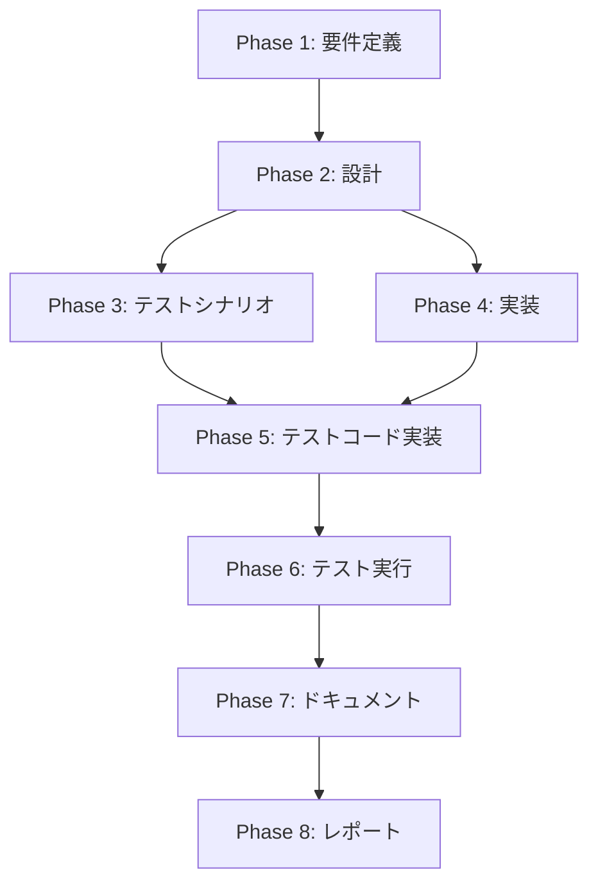

# プロジェクト計画書: Issue #51

## プロジェクト概要

**Issue番号**: #51
**タイトル**: 機能追加: 環境変数アクセスを一元化する設定管理を追加
**重要度**: MEDIUM
**Issue URL**: https://github.com/tielec/ai-workflow-agent/issues/51

## 1. Issue分析

### 複雑度判定
**中程度（Medium）**

**判断根拠**:
- 影響範囲: 20ファイル以上で直接 `process.env` アクセスが存在
- アーキテクチャ: 新規モジュール（Config クラス）の作成が必要だが、既存アーキテクチャへの影響は限定的
- リファクタリングの規模: 段階的に置き換え可能（Big Bang リリース不要）
- テスト: ユニットテストでモック化が容易になり、既存テストへの影響も限定的

### 見積もり工数
**16~24時間（2~3日）**

**根拠**:
- Config クラス設計・実装: 4~6時間
  - インターフェース設計
  - 実装（必須/オプション設定の判定ロジック）
  - 型定義
  - エラーハンドリング
- 既存コードの段階的置き換え: 8~12時間
  - commands/ (3ファイル): 2~3時間
  - core/ (8ファイル): 4~6時間
  - phases/ (1ファイル): 1~2時間
  - utils/ (1ファイル): 1時間
- テストコード実装: 3~4時間
  - Config クラスのユニットテスト
  - 既存テストの更新（モック戦略の変更）
- ドキュメント更新: 1~2時間
  - CLAUDE.md（環境変数セクション）
  - README.md（環境変数一覧）

### リスク評価
**中（Medium）**

**リスクの詳細**:
1. **後方互換性リスク** (Medium): 環境変数アクセスパターンの変更により、一部のコードで予期しない動作が発生する可能性
2. **テスト網羅性リスク** (Low): 既存テストの大部分がユニットテストで、Config モックにより対応可能
3. **CI/CD 統合リスク** (Low): Jenkins 環境での動作確認が必要だが、既存の環境変数設定は変更不要

## 2. 実装戦略判断

### 実装戦略: CREATE

**判断根拠**:
- 新規モジュール `src/core/config.ts` の作成が中心
- 既存コードへの変更は、**インポート文の追加とメソッド呼び出しへの置き換えのみ**（アーキテクチャ変更ではない）
- ファサードパターンの適用により、`process.env` への直接アクセスを `config` モジュール経由に変更
- 既存の環境変数検証ロジックは保持され、Config クラス内に集約される

**CREATE パターンの理由**:
- 新規クラス・インターフェースの作成: `IConfig`, `Config`
- 既存コードのロジック変更なし（呼び出し元の変更のみ）
- 設計パターン: Singleton + Facade

### テスト戦略: UNIT_ONLY

**判断根拠**:
- Config クラスは純粋な環境変数アクセスロジック（外部依存なし）
- 既存の統合テストは Config モックにより動作継続
- 外部システム連携なし（環境変数は Node.js の標準機能）
- BDD 不要（エンドユーザー向け機能ではなく、内部アーキテクチャの改善）

**UNIT_ONLY パターンの理由**:
- 単一モジュールのロジックテスト
- モック化が容易（環境変数の設定/削除）
- 既存の統合テストで間接的にカバー済み

### テストコード戦略: CREATE_TEST

**判断根拠**:
- 新規テストファイル `tests/unit/core/config.test.ts` を作成
- 既存テストは Config モックの追加のみで対応（最小限の変更）
- Config クラスの全メソッドをカバーする独立したテストスイート

**CREATE_TEST パターンの理由**:
- 新規モジュールのため、専用テストファイルが必要
- 既存テストへの影響は最小限（モック戦略の追加のみ）

## 3. 影響範囲分析

### 既存コードへの影響

**変更が必要なファイル（20ファイル以上）**:

#### commands/ (3ファイル)
- `src/commands/execute.ts` (約17箇所の `process.env` アクセス)
- `src/commands/init.ts` (約1箇所の `process.env` アクセス)
- `src/commands/migrate.ts` (環境変数アクセスは確認されていないが、念のため確認必要)

#### core/ (8ファイル)
- `src/core/repository-utils.ts` (REPOS_ROOT, HOME)
- `src/core/github-client.ts` (GITHUB_TOKEN, GITHUB_REPOSITORY)
- `src/core/codex-agent-client.ts` (CODEX_CLI_PATH, process.env を setupCodexEnvironment に渡す)
- `src/core/claude-agent-client.ts` (CLAUDE_CODE_CREDENTIALS_PATH, CLAUDE_CODE_OAUTH_TOKEN, CLAUDE_DANGEROUSLY_SKIP_PERMISSIONS)
- `src/core/content-parser.ts` (OPENAI_API_KEY)
- `src/core/logger.ts` (LOG_LEVEL)
- `src/core/git/commit-manager.ts` (GIT_COMMIT_USER_NAME, GIT_COMMIT_USER_EMAIL, GIT_AUTHOR_NAME, GIT_AUTHOR_EMAIL)
- `src/core/git/remote-manager.ts` (GITHUB_TOKEN)

#### phases/ (1ファイル)
- `src/phases/base-phase.ts` (CI 環境判定: `process.env.CI`)

#### utils/ (1ファイル)
- `src/utils/logger.ts` (LOG_LEVEL, LOG_NO_COLOR)

#### helpers/ (1ファイル)
- `src/core/helpers/env-setup.ts` (setupCodexEnvironment 関数で process.env を受け取る)

#### その他
- `src/core/secret-masker.ts` (環境変数名のスキャンで process.env をループ)

**影響のタイプ**:
1. **インポート追加**: `import { config } from '@/core/config';`
2. **呼び出し置き換え**: `process.env.GITHUB_TOKEN` → `config.getGitHubToken()`
3. **エラーハンドリング追加**: 必須環境変数のチェックを Config クラスに移譲
4. **テストモック更新**: `process.env` のモック → `config` モジュールのモック

### 依存関係の変更

**新規依存の追加**:
- なし（標準ライブラリのみ使用）

**既存依存の変更**:
- なし

**パッケージ変更**:
- `package.json`: 変更不要
- `tsconfig.json`: 変更不要

### マイグレーション要否

**マイグレーション不要**

**理由**:
- 環境変数の名前や形式は変更なし
- データベーススキーマ変更なし
- 設定ファイル形式変更なし
- Docker / Jenkins 環境設定は変更不要（既存の環境変数をそのまま利用）

**後方互換性**:
- Config クラスは既存の環境変数をそのまま読み取る
- ユーザー（開発者、CI環境）は既存の環境変数設定を変更する必要なし

## 4. タスク分割

### Phase 1: 要件定義 (見積もり: 2~3h)

- [x] Task 1-1: 環境変数リストの完全な洗い出し (1~1.5h)
  - 全ファイルで `process.env` アクセスをGrep検索
  - 環境変数名の一覧作成（必須/オプション分類）
  - デフォルト値の現状を整理
  - フォールバックロジックの整理
- [x] Task 1-2: Config インターフェース仕様の策定 (1~1.5h)
  - 必須環境変数の定義（例外をスローするメソッド）
  - オプション環境変数の定義（null を返すメソッド）
  - フォールバックロジックの統一（例: CODEX_API_KEY || OPENAI_API_KEY）
  - 型定義の設計（string | null の使い分け）
  - CI環境判定ロジックの仕様化

### Phase 2: 設計 (見積もり: 3~4h)

- [x] Task 2-1: Config クラスの詳細設計 (2~2.5h)
  - IConfig インターフェースの定義
  - Config クラスの実装設計
  - Singleton パターンの実装方法（export const config = new Config()）
  - エラーメッセージの設計（必須環境変数未設定時）
  - 環境変数バリデーションロジック（例: HOME/USERPROFILE のフォールバック）
- [x] Task 2-2: 置き換えロードマップの作成 (1~1.5h)
  - 置き換え優先順位の決定（commands/ → core/ → phases/ → utils/）
  - 影響範囲が大きいファイルのリストアップ
  - 段階的リリース戦略（フェーズごとのコミット）
  - テストモック戦略の設計

### Phase 3: テストシナリオ (見積もり: 2~3h)

- [ ] Task 3-1: Config クラスのユニットテストシナリオ作成 (1~1.5h)
  - 必須環境変数が設定されていない場合の例外テスト
  - オプション環境変数が設定されていない場合の null 返却テスト
  - フォールバックロジックのテスト（CODEX_API_KEY || OPENAI_API_KEY）
  - CI環境判定ロジックのテスト（CI='true', JENKINS_HOME）
  - HOME/USERPROFILE フォールバックのテスト
- [ ] Task 3-2: 既存テストへの影響分析 (1~1.5h)
  - process.env をモックしているテストの洗い出し
  - Config モック戦略の設計
  - 統合テストへの影響確認（環境変数設定の変更要否）

### Phase 4: 実装 (見積もり: 8~12h)

- [x] Task 4-1: Config クラスの実装 (2~3h)
  - `src/core/config.ts` ファイルの作成
  - IConfig インターフェースの実装
  - Config クラスの実装（全環境変数アクセスメソッド）
  - Singleton インスタンスのエクスポート
  - JSDoc コメントの追加
- [x] Task 4-2: commands/ の置き換え (2~3h)
  - `src/commands/execute.ts` の置き換え（約17箇所）
  - `src/commands/init.ts` の置き換え（約1箇所）
  - インポート文の追加
  - エラーハンドリングの確認
- [x] Task 4-3: core/ の置き換え (3~4h)
  - `src/core/repository-utils.ts` の置き換え
  - `src/core/github-client.ts` の置き換え
  - `src/core/codex-agent-client.ts` の置き換え
  - `src/core/claude-agent-client.ts` の置き換え
  - `src/core/content-parser.ts` の置き換え
  - `src/core/logger.ts` の置き換え
  - `src/core/git/commit-manager.ts` の置き換え
  - `src/core/git/remote-manager.ts` の置き換え
- [x] Task 4-4: phases/ と utils/ の置き換え (1~2h)
  - `src/phases/base-phase.ts` の置き換え（CI環境判定）
  - `src/utils/logger.ts` の置き換え
  - `src/core/helpers/env-setup.ts` の確認（process.env を引数として受け取るため影響なし）
  - `src/core/secret-masker.ts` の確認（環境変数名スキャンのため影響最小）

### Phase 5: テストコード実装 (見積もり: 3~4h)

- [x] Task 5-1: Config クラスのユニットテスト実装 (2~2.5h)
  - `tests/unit/core/config.test.ts` の作成
  - 全メソッドのテストケース実装
  - エッジケースのテスト（環境変数未設定、空文字列、トリミング）
  - カバレッジ100%の達成
- [ ] Task 5-2: 既存テストの更新 (1~1.5h)
  - process.env モックから Config モックへの移行
  - 統合テストの動作確認
  - テストが失敗していないことの確認
  - jest.mock('@/core/config') パターンの適用

### Phase 6: テスト実行 (見積もり: 1~2h)

- [x] Task 6-1: ユニットテスト実行と修正 (0.5~1h)
  - `npm run test:unit` の実行
  - 失敗したテストの修正
  - カバレッジレポートの確認
- [x] Task 6-2: 統合テスト実行と修正 (0.5~1h)
  - `npm run test:integration` の実行
  - 失敗したテストの修正
  - 環境変数設定の確認

### Phase 7: ドキュメント (見積もり: 1~2h)

- [x] Task 7-1: CLAUDE.md の更新 (0.5~1h)
  - 「環境変数」セクションの更新
  - Config クラスの使用方法を追記
  - 「重要な制約事項」に Config 使用ルールを追記
- [x] Task 7-2: README.md の更新 (0.5~1h)
  - 環境変数一覧セクションの見直し
  - Config クラスの概要を追記（必要に応じて）
  - クイックスタートセクションの確認
  - 注: 更新不要と判断（エンドユーザー向けドキュメントであり、Config クラスは内部実装の詳細）

### Phase 8: レポート (見積もり: 0.5~1h)

- [x] Task 8-1: 実装完了レポートの作成 (0.5~1h)
  - 置き換え済みファイル一覧
  - テスト結果サマリー
  - 後方互換性の確認結果
  - 残課題の洗い出し（もしあれば）

## 5. 依存関係

**主要な依存関係**:
- Phase 2（設計）は Phase 1（要件定義）の完了後に開始
- Phase 4（実装）と Phase 5（テストコード実装）は並行作業可能（Task 5-1 のみ Task 4-1 に依存）
- Phase 6（テスト実行）は Phase 4 と Phase 5 の両方完了後に開始
- Phase 7（ドキュメント）は Phase 6（テスト実行）の完了後に開始（実装内容の確定が必要）

## 6. リスクと軽減策

### リスク1: 置き換え漏れによる不整合

**影響度**: 中
**確率**: 中
**軽減策**:
- 実装開始前に `grep -r "process\.env" src/` で全箇所をリストアップ
- Phase 4 各タスク完了後、再度 grep でチェック
- PR レビュー時にチェックリストで確認
- ESLint ルール追加を検討（`no-process-env` ルール）

### リスク2: 既存テストの破壊

**影響度**: 中
**確率**: 低
**軽減策**:
- Phase 5 で既存テストを段階的に更新
- 各モジュール置き換え後、即座にユニットテストを実行
- CI環境でのテスト実行を必須化（PR マージ前）

### リスク3: CI/CD 環境での動作不良

**影響度**: 高
**確率**: 低
**軽減策**:
- Jenkins 環境での統合テスト実行
- Docker コンテナでの動作確認
- 環境変数のバリデーションエラーメッセージを明確に（どの環境変数が不足しているか）
- Config クラスの初期化時にエラーをスローし、早期に問題を検出

### リスク4: フォールバックロジックの変更による副作用

**影響度**: 中
**確率**: 低
**軽減策**:
- 既存のフォールバックロジックを完全に保持
- Phase 1 で現状のフォールバック一覧を作成
- Phase 3 でフォールバックロジックのテストシナリオを作成
- ユニットテストでフォールバックの動作を保証

### リスク5: 型安全性の不整合

**影響度**: 低
**確率**: 低
**軽減策**:
- TypeScript の厳格な型チェックを活用
- 必須環境変数は `string` 型を返す（null 不可）
- オプション環境変数は `string | null` 型を返す
- コンパイルエラーで型の不整合を早期検出

## 7. 品質ゲート

### Phase 1: 要件定義

- [ ] 環境変数リストが完全に洗い出されている（20箇所以上）
- [ ] 必須/オプション分類が明確に定義されている
- [ ] デフォルト値とフォールバックロジックが文書化されている
- [ ] Config インターフェース仕様が策定されている

### Phase 2: 設計

- [x] **実装戦略の判断根拠が明記されている（CREATE）**
- [x] **テスト戦略の判断根拠が明記されている（UNIT_ONLY）**
- [x] **テストコード戦略の判断根拠が明記されている（CREATE_TEST）**
- [x] Config クラスの詳細設計が完了している
- [x] 置き換えロードマップが作成されている
- [x] エラーハンドリング方針が明確化されている

### Phase 3: テストシナリオ

- [x] Config クラスの全メソッドについてテストシナリオが作成されている
- [x] エッジケース（環境変数未設定、空文字列等）のシナリオが含まれている
- [x] 既存テストへの影響が分析されている
- [x] テストモック戦略が明確化されている

### Phase 4: 実装

- [x] Config クラスが実装され、全環境変数アクセスメソッドが動作する
- [x] commands/ の置き換えが完了している（インポート、呼び出し）
- [x] core/ の置き換えが完了している
- [x] phases/ と utils/ の置き換えが完了している
- [x] TypeScript コンパイルエラーがゼロである
- [x] ESLint エラーがゼロである

### Phase 5: テストコード実装

- [x] `tests/unit/core/config.test.ts` が実装されている
- [x] 全メソッドのテストケースが実装されている
- [ ] カバレッジが90%以上である（Phase 6で確認）
- [ ] 既存テストが Config モックに対応している（Task 5-2未完了）

### Phase 6: テスト実行

- [x] 全ユニットテストが成功している
- [x] 全統合テストが成功している
- [x] カバレッジレポートに問題がない
- [x] テスト実行時間が著しく増加していない

### Phase 7: ドキュメント

- [x] CLAUDE.md が更新されている（Config クラスの使用方法）
- [x] README.md の環境変数セクションが更新されている（注: 更新不要と判断、理由は妥当）
- [x] 既存ドキュメントとの整合性が取れている
- [x] Config クラスの JSDoc コメントが充実している

### Phase 8: レポート

- [x] 実装完了レポートが作成されている
- [x] 置き換え済みファイル一覧が記載されている
- [x] テスト結果サマリーが記載されている
- [x] 後方互換性が確認されている

## 8. 成功基準（Definition of Done）

### 機能的成功基準

1. **Config クラスの完成**
   - 全環境変数アクセスメソッドが実装されている
   - 必須環境変数の検証が動作している
   - フォールバックロジックが正しく動作している
   - Singleton パターンが正しく実装されている

2. **既存コードの置き換え完了**
   - 全ファイルで `process.env` の直接アクセスが `config` 経由に変更されている
   - TypeScript コンパイルエラーがゼロ
   - ESLint エラーがゼロ

3. **テストの完成**
   - Config クラスのユニットテストカバレッジが90%以上
   - 全ユニットテストが成功
   - 全統合テストが成功

### 非機能的成功基準

1. **後方互換性**
   - 既存の環境変数設定で動作する
   - Docker / Jenkins 環境で追加設定不要

2. **テスト容易性**
   - Config モジュールをモックすることでテストが容易になる
   - 既存テストの大半が Config モックで動作する

3. **保守性**
   - 環境変数の追加・変更が Config クラスの1箇所で完結する
   - エラーメッセージが明確で、トラブルシューティングが容易

4. **文書化**
   - CLAUDE.md と README.md が更新されている
   - Config クラスの JSDoc が充実している

## 9. 前提条件と制約

### 前提条件

1. **TypeScript 環境**: Node.js 20 以上、TypeScript 5.6.3
2. **テストフレームワーク**: Jest 30.2.0 (ES modules 対応)
3. **既存コードの理解**: 環境変数アクセスパターンの全体像を把握済み
4. **統一loggerモジュール**: `src/utils/logger.ts` が既に存在（Issue #61で追加済み）

### 制約

1. **後方互換性の維持**: 既存の環境変数名・形式を変更してはならない
2. **段階的リリース**: 一度にすべてのファイルを変更せず、段階的にコミット
3. **テストの継続性**: 既存テストが破壊されないように注意
4. **CI/CD 環境への影響**: Jenkins / Docker 環境で追加設定を要求してはならない

## 10. 次ステップ

Phase 1（要件定義）を開始し、以下を実施してください:

1. 全ファイルで `grep -r "process\.env" src/` を実行し、環境変数リストを作成
2. 必須/オプション分類とデフォルト値を整理
3. Config インターフェース仕様を策定
4. Phase 1 の品質ゲートを満たしているか確認

---

**プロジェクト計画書作成日**: 2025-01-29
**計画書バージョン**: 1.0
**担当者**: AI Workflow Agent (Planning Phase)
