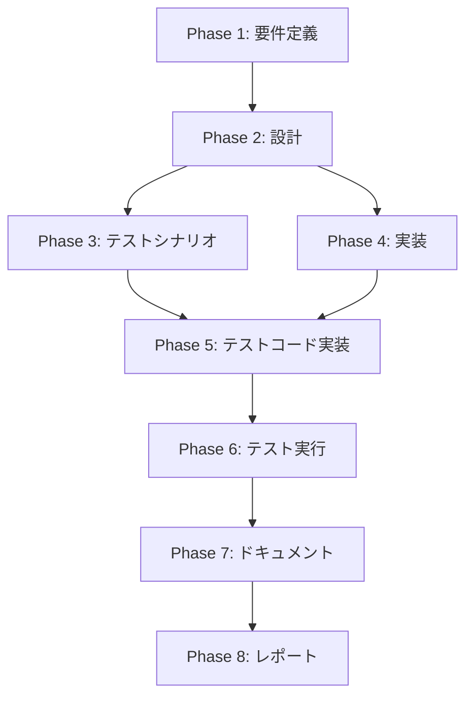

# プロジェクト計画書: Issue #510

## finalize コマンドで Step 2 の push 時に pull が実行されると HEAD が更新されスカッシュが失敗する

**作成日**: 2025-12-25
**Issue URL**: https://github.com/tielec/ai-workflow-agent/issues/510

---

## 1. Issue分析

### 問題概要

`finalize` コマンドの Step 3（コミットスカッシュ）が「Only 0 commit(s) found. Skipping squash.」と表示され実行されない問題。

### 根本原因

1. Step 2 の `pushToRemote()` で non-fast-forward エラーが発生
2. エラーハンドリングで `pullLatest()` が自動実行
3. pull により HEAD が更新され、base_commit..HEAD の範囲が0コミットになる
4. Step 3 でスカッシュがスキップされる

### 複雑度: **中程度**

**判断根拠**:
- 複数ファイルの修正が必要（3ファイル）
- 既存機能の拡張が中心
- 既存テストの拡張と新規テストの追加が必要
- アーキテクチャ変更は不要

### 見積もり工数: **8〜12時間**

**内訳**:
- 要件定義・設計: 2時間
- 実装: 3〜4時間
- テスト設計・実装: 2〜3時間
- テスト実行・修正: 1〜2時間
- ドキュメント・レポート: 1時間

### リスク評価: **低〜中**

- 既存のスカッシュ機能への影響は限定的（後方互換性を維持）
- テストカバレッジが充実しており、回帰検出が容易
- 型安全性が TypeScript により担保されている

---

## 2. 実装戦略判断

### 実装戦略: **EXTEND**

**判断根拠**:
- 新規ファイル・クラスの作成は不要
- 既存コード（`finalize.ts`, `squash-manager.ts`）の拡張が中心
- `FinalizeContext` 型への `headCommit` プロパティ追加
- `getCommitsToSquash()` メソッドへのパラメータ追加
- `executeStep1()` と `executeStep3()` の修正

**主な変更点**:
1. `executeStep1()`: Step 2 実行直前の HEAD を保存
2. `FinalizeContext`: `headCommit` オプショナルプロパティ追加
3. `squashCommitsForFinalize()`: `headCommit` 指定時にそれを使用
4. `getCommitsToSquash()`: `targetHead` パラメータ追加

### テスト戦略: **UNIT_INTEGRATION**

**判断根拠**:
- ユニットテスト: `getCommitsToSquash()` のパラメータ追加、`FinalizeContext` 型の拡張
- インテグレーションテスト: finalize コマンド全体フローでの動作確認
- BDDテストは不要（既存のユーザーストーリーに変更なし）

**テスト対象**:
1. **ユニットテスト**:
   - `squash-manager.test.ts`: `getCommitsToSquash()` の新パラメータ動作
   - 型定義の後方互換性確認

2. **インテグレーションテスト**:
   - `finalize-command.test.ts`: pull による HEAD 更新シナリオ
   - Step 1 → Step 2 (pull発生) → Step 3 の一連フロー

### テストコード戦略: **BOTH_TEST**

**判断根拠**:
- 既存テストファイルへの追加（`finalize-command.test.ts`, `squash-workflow.test.ts`）
- 新規テストケースの追加（non-fast-forward + pull シナリオ）
- 既存テストの修正（`FinalizeContext` 型変更への対応）

---

## 3. 影響範囲分析

### 既存コードへの影響

| ファイル | 変更内容 | 影響度 |
|---------|---------|-------|
| `src/commands/finalize.ts` | `executeStep1()`, `executeStep3()` の修正 | 中 |
| `src/core/git/squash-manager.ts` | `FinalizeContext` 型拡張、`getCommitsToSquash()` 修正 | 中 |
| `tests/integration/finalize-command.test.ts` | 新規テストケース追加 | 低 |
| `tests/integration/squash-workflow.test.ts` | 新規テストケース追加 | 低 |

### 依存関係の変更

- **新規依存の追加**: なし
- **既存依存の変更**: なし

### マイグレーション要否

- **データベーススキーマ変更**: なし
- **設定ファイル変更**: なし
- **API 変更**: なし（内部メソッドの変更のみ）

### 後方互換性

- `FinalizeContext.headCommit` はオプショナル（`headCommit?: string`）
- `headCommit` 未指定時は従来通り `HEAD` を使用
- 既存の finalize コマンド呼び出しに影響なし

---

## 4. タスク分割

### Phase 1: 要件定義 (見積もり: 1〜1.5h)

- [x] Task 1-1: Issue分析と要件整理 (0.5h)
  - Issue #510 の根本原因の詳細分析
  - 修正案1（推奨案）の妥当性確認
  - エッジケースの洗い出し

- [x] Task 1-2: 受け入れ基準の定義 (0.5h)
  - 正常系シナリオの定義
  - 異常系シナリオの定義
  - 後方互換性要件の確認

### Phase 2: 設計 (見積もり: 1.5〜2h)

- [x] Task 2-1: 型定義の設計 (0.5h)
  - `FinalizeContext` 型の拡張設計
  - 後方互換性を保つ設計確認

- [x] Task 2-2: メソッドシグネチャの設計 (0.5h)
  - `executeStep1()` の戻り値拡張
  - `getCommitsToSquash()` のパラメータ追加
  - `squashCommitsForFinalize()` の変更

- [x] Task 2-3: 詳細設計ドキュメント作成 (0.5h)
  - 変更箇所の詳細設計
  - データフロー図の作成

### Phase 3: テストシナリオ (見積もり: 1〜1.5h)

- [ ] Task 3-1: ユニットテストシナリオ設計 (0.5h)
  - `getCommitsToSquash()` のテストケース
  - 型定義のテストケース

- [ ] Task 3-2: インテグレーションテストシナリオ設計 (0.5h)
  - non-fast-forward + pull シナリオ
  - 正常系・異常系テストケース

### Phase 4: 実装 (見積もり: 3〜4h)

- [x] Task 4-1: FinalizeContext 型の拡張 (0.5h)
  - `src/core/git/squash-manager.ts` の `FinalizeContext` に `headCommit?: string` 追加
  - JSDoc コメント追加

- [x] Task 4-2: executeStep1() の修正 (1h)
  - Step 2 実行直前の HEAD を `git.revparse(['HEAD'])` で取得
  - 戻り値を `{ baseCommit, headBeforeCleanup }` に拡張
  - ログ出力の追加

- [x] Task 4-3: executeStep3() の修正 (0.5h)
  - `headBeforeCleanup` を `FinalizeContext.headCommit` に設定
  - `squashCommitsForFinalize()` 呼び出しの修正

- [x] Task 4-4: squashCommitsForFinalize() の修正 (0.5h)
  - `context.headCommit` が指定されている場合の処理追加
  - `getCommitsToSquash()` への引数渡し

- [x] Task 4-5: getCommitsToSquash() の修正 (0.5h)
  - `targetHead` パラメータ追加（デフォルト: `'HEAD'`）
  - `git.log()` の `to` パラメータを `targetHead` に変更
  - デバッグログの追加

-### Phase 5: テストコード実装 (見積もり: 2〜2.5h)

- [x] Task 5-1: ユニットテスト実装 (1h)
  - `squash-manager.test.ts` に新規テストケース追加
  - `getCommitsToSquash()` の `targetHead` パラメータテスト

- [x] Task 5-2: インテグレーションテスト実装 (1h)
  - `finalize-command.test.ts` に Issue #510 シナリオ追加
  - non-fast-forward + pull 後のスカッシュ動作確認

- [x] Task 5-3: 後方互換性テスト (0.5h)
  - `headCommit` 未指定時の従来動作確認
  - 既存テストの修正（必要に応じて）

### Phase 6: テスト実行 (見積もり: 1〜1.5h)

- [x] Task 6-1: ユニットテスト実行 (0.5h)
  - `npm run test:unit` 実行
  - 失敗テストの修正

- [ ] Task 6-2: インテグレーションテスト実行 (0.5h)
  - `npm run test:integration` 実行
  - 失敗テストの修正

- [ ] Task 6-3: 全体テスト実行 (0.5h)
  - `npm test` 実行
  - カバレッジ確認

### Phase 7: ドキュメント (見積もり: 0.5〜1h)

- [x] Task 7-1: コード内ドキュメント更新 (0.5h)
  - JSDoc コメントの追加・更新
  - 変更理由のコメント追加

### Phase 8: レポート (見積もり: 0.5h)

- [x] Task 8-1: 実装レポート作成 (0.5h)
  - 変更内容のサマリー
  - テスト結果のサマリー
  - 今後の改善提案

---

## 5. 依存関係

### タスク間の依存関係

| タスク | 依存先 | 備考 |
|-------|-------|------|
| Task 4-2 | Task 4-1 | 型定義が先に必要 |
| Task 4-3 | Task 4-2 | executeStep1 の戻り値を使用 |
| Task 4-4 | Task 4-1 | 型定義が先に必要 |
| Task 4-5 | Task 4-4 | squashCommitsForFinalize から呼び出し |
| Task 5-1 | Task 4-5 | 実装完了後にテスト |
| Task 5-2 | Task 4-3 | 実装完了後にテスト |

---

## 6. リスクと軽減策

### リスク1: 既存テストへの影響

- **影響度**: 中
- **確率**: 低
- **説明**: `FinalizeContext` 型の変更により、既存テストがコンパイルエラーになる可能性
- **軽減策**:
  - `headCommit` をオプショナルプロパティとして追加
  - 既存テストコードの修正は最小限に抑える
  - 変更前に既存テストを実行して現状を把握

### リスク2: スカッシュ動作の変更による影響

- **影響度**: 高
- **確率**: 低
- **説明**: `getCommitsToSquash()` の変更により、意図しないスカッシュ範囲になる可能性
- **軽減策**:
  - 従来動作（`targetHead = 'HEAD'`）をデフォルト維持
  - 詳細なデバッグログを追加
  - 複数のシナリオでテスト

### リスク3: Git操作の不整合

- **影響度**: 高
- **確率**: 低
- **説明**: pull 前の HEAD を使用することで、実際のファイル状態と不整合が発生する可能性
- **軽減策**:
  - Step 2 実行前に HEAD を取得（ファイル操作前）
  - git reset --soft で適切なステージング状態を維持
  - テストで実際の Git 操作を含むシナリオを確認

### リスク4: 型定義の配置問題

- **影響度**: 低
- **確率**: 中
- **説明**: `FinalizeContext` が `squash-manager.ts` に定義されており、循環参照の可能性
- **軽減策**:
  - 現状維持（`squash-manager.ts` 内での定義）
  - 将来的に `types/commands.ts` への移動を検討
  - 循環参照が発生した場合は型定義ファイルへ分離

---

## 7. 品質ゲート

### Phase 1: 要件定義

- [ ] 機能要件が明確に記載されている
- [ ] 受け入れ基準が定義されている
- [ ] エッジケースが洗い出されている
- [ ] 後方互換性要件が明記されている

### Phase 2: 設計

- [ ] 実装戦略の判断根拠が明記されている（EXTEND）
- [ ] テスト戦略の判断根拠が明記されている（UNIT_INTEGRATION）
- [ ] テストコード戦略の判断根拠が明記されている（BOTH_TEST）
- [ ] 型定義の設計が完了している
- [ ] メソッドシグネチャの変更が明確化されている

### Phase 3: テストシナリオ

- [ ] ユニットテストシナリオが定義されている
- [ ] インテグレーションテストシナリオが定義されている
- [ ] Issue #510 の再現シナリオが含まれている
- [ ] 後方互換性テストが含まれている

### Phase 4: 実装

- [ ] TypeScript 型エラーがない
- [ ] ESLint エラーがない
- [ ] コードフォーマットが統一されている
- [ ] JSDoc コメントが追加されている

### Phase 5: テストコード実装

- [ ] 全テストケースが実装されている
- [ ] テストコードが可読性を持つ
- [ ] モック設定が適切である

### Phase 6: テスト実行

- [x] 全ユニットテストがパス
- [ ] 全インテグレーションテストがパス
- [ ] カバレッジが目標値（80%以上）を達成
- [x] 回帰テストがパス

### Phase 7: ドキュメント

- [ ] コード内コメントが適切
- [ ] 変更理由が記載されている

### Phase 8: レポート

- [x] 実装サマリーが完成
- [x] テスト結果が記載されている

---

## 8. 成果物一覧

| フェーズ | 成果物 | 出力パス |
|---------|-------|---------|
| Phase 1 | 要件定義書 | `01_requirements/output/` |
| Phase 2 | 設計書 | `02_design/output/` |
| Phase 3 | テストシナリオ | `03_test_scenario/output/` |
| Phase 4 | 実装コード | `src/commands/finalize.ts`, `src/core/git/squash-manager.ts` |
| Phase 5 | テストコード | `tests/integration/finalize-command.test.ts`, etc. |
| Phase 6 | テスト結果 | `06_testing/output/` |
| Phase 7 | ドキュメント | `07_documentation/output/` |
| Phase 8 | レポート | `08_report/output/` |

---

## 9. 品質ゲートチェックリスト（Phase 0）

- [x] **実装戦略が明確に決定されている**: EXTEND
- [x] **テスト戦略が明確に決定されている**: UNIT_INTEGRATION
- [x] **テストコード戦略が明確に決定されている**: BOTH_TEST
- [x] **影響範囲が分析されている**: 3ファイル修正、後方互換性維持
- [x] **タスク分割が適切な粒度である**: 各タスク0.5〜1h
- [x] **リスクが洗い出されている**: 4つのリスクと軽減策

---

## 10. 参考情報

### 関連Issue

- Issue #505: この問題が最初に確認された Issue
- Issue #261: finalize コマンドの実装
- Issue #194: スカッシュ機能の実装
- Issue #507: working-directory-resolver の修正（デバッグログ追加）
- Issue #216: force push 実装

### 関連ファイル

- `src/commands/finalize.ts`: finalize コマンドハンドラ
- `src/core/git/squash-manager.ts`: スカッシュ処理マネージャー
- `src/core/git/remote-manager.ts`: リモート操作マネージャー
- `tests/integration/finalize-command.test.ts`: finalize インテグレーションテスト
- `tests/integration/squash-workflow.test.ts`: スカッシュワークフローテスト
