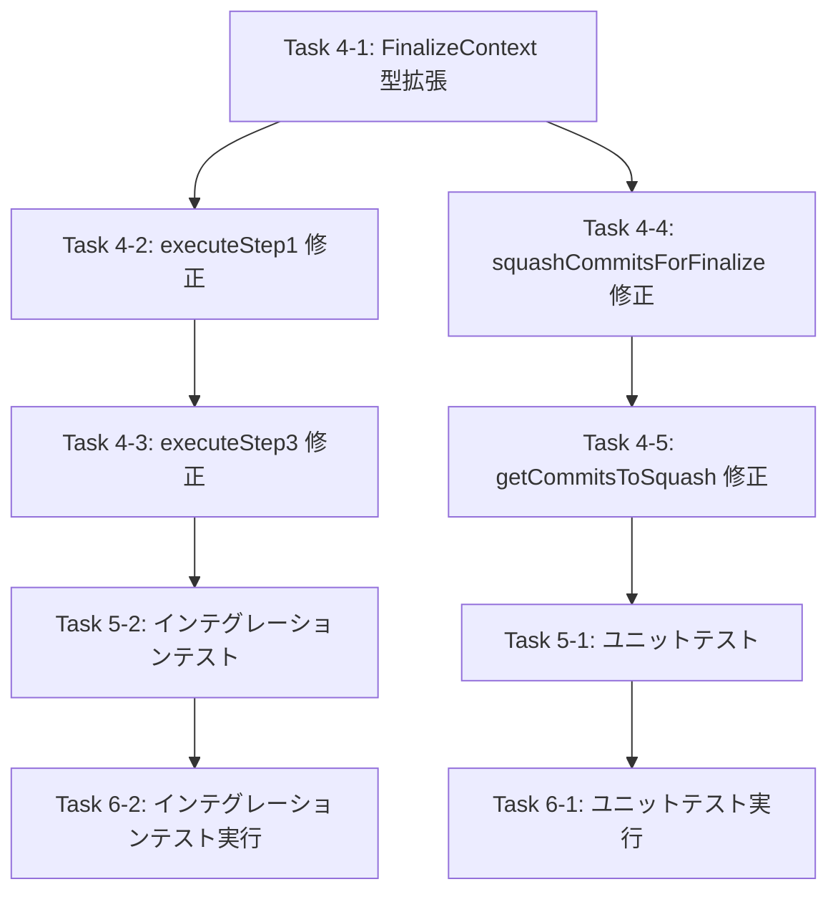

# 詳細設計書: Issue #510

## finalize コマンドで Step 2 の push 時に pull が実行されると HEAD が更新されスカッシュが失敗する

**作成日**: 2025-12-25
**Issue URL**: https://github.com/tielec/ai-workflow-agent/issues/510
**バージョン**: 1.0

---

## 0. Planning Document の確認

### 開発計画の全体像

Planning Phase（`00_planning/output/planning.md`）にて、以下の戦略が策定済みです：

| 項目 | 決定事項 |
|------|---------|
| **実装戦略** | EXTEND（既存コードの拡張） |
| **テスト戦略** | UNIT_INTEGRATION（ユニット + インテグレーション） |
| **テストコード戦略** | BOTH_TEST（既存テスト修正 + 新規テスト追加） |
| **見積もり工数** | 8〜12時間 |
| **複雑度** | 中程度 |
| **リスク評価** | 低〜中 |

---

## 1. アーキテクチャ設計

### 1.1 システム全体図

```
┌─────────────────────────────────────────────────────────────────────────────┐
│                          finalize コマンド                                   │
│                        (src/commands/finalize.ts)                           │
└─────────────────────────────────────────────────────────────────────────────┘
                                    │
        ┌───────────────────────────┼───────────────────────────┐
        │                           │                           │
        ▼                           ▼                           ▼
┌───────────────┐         ┌───────────────────┐         ┌─────────────────┐
│ executeStep1()│         │  executeStep2()   │         │  executeStep3() │
│               │         │                   │         │                 │
│ base_commit   │────────▶│  ArtifactCleaner  │────────▶│  SquashManager  │
│ headBeforeCleanup      │  GitManager.push  │         │                 │
│ (NEW!)        │         │                   │         │  headCommit     │
└───────────────┘         └───────────────────┘         │  (NEW!)         │
                                    │                   └─────────────────┘
                                    │                           │
                                    ▼                           ▼
                          ┌───────────────────┐         ┌─────────────────┐
                          │  RemoteManager    │         │ getCommitsTo-   │
                          │  pushToRemote()   │         │ Squash()        │
                          │  ────────────────│         │ (targetHead)    │
                          │  pullLatest()     │         │ (NEW PARAM!)    │
                          │  (HEAD が更新)    │         └─────────────────┘
                          └───────────────────┘
```

### 1.2 コンポーネント間の関係

```
finalize.ts
├── MetadataManager (base_commit 取得)
├── simple-git (HEAD 取得) ← NEW: Step 1 で追加
├── ArtifactCleaner (cleanup artifacts)
├── GitManager
│   └── SquashManager
│       ├── FinalizeContext ← NEW: headCommit プロパティ追加
│       ├── getCommitsToSquash() ← NEW: targetHead パラメータ追加
│       ├── RemoteManager (force push)
│       └── CommitManager (git config)
└── GitHubClient
    └── PullRequestClient (PR operations)
```

### 1.3 データフロー

**現状（問題あり）**:
```
Step 1: base_commit 取得
    ↓
Step 2: cleanup + commit + push
    ↓ (non-fast-forward エラー)
    ↓ pullLatest() 実行
    ↓ HEAD が更新される ← 問題の原因
    ↓
Step 3: getCommitsToSquash(base_commit, HEAD)
    ↓ HEAD が pull 後の値のため 0 コミット
    → スカッシュスキップ
```

**修正後**:
```
Step 1: base_commit 取得
    ↓  headBeforeCleanup 取得 ← NEW
    ↓
Step 2: cleanup + commit + push
    ↓ (non-fast-forward エラー)
    ↓ pullLatest() 実行
    ↓ HEAD が更新される
    ↓
Step 3: getCommitsToSquash(base_commit, headBeforeCleanup)
    ↓ pull 前の HEAD を使用するため正しいコミット範囲
    → スカッシュ成功
```

---

## 2. 実装戦略判断

### 実装戦略: EXTEND

**判断根拠**:

1. **新規ファイル・クラスの作成は不要**
   - 既存の `finalize.ts`、`squash-manager.ts` の拡張のみ
   - 新しいコンポーネントやモジュールの追加なし

2. **既存コードの拡張が中心**
   - `executeStep1()`: 戻り値の拡張（`headBeforeCleanup` 追加）
   - `executeStep3()`: パラメータの追加（`headBeforeCleanup` 受け取り）
   - `FinalizeContext` 型: オプショナルプロパティ追加
   - `getCommitsToSquash()`: パラメータ追加（`targetHead`）

3. **既存機能との統合度が高い**
   - 既存の finalize コマンドフローを維持
   - 後方互換性を保持（`headCommit` 未指定時は従来動作）

4. **アーキテクチャ変更なし**
   - 既存の責務分離（GitManager / SquashManager / RemoteManager）を維持
   - 依存関係の変更なし

---

## 3. テスト戦略判断

### テスト戦略: UNIT_INTEGRATION

**判断根拠**:

1. **ユニットテストが必要な理由**
   - `getCommitsToSquash()` の新パラメータ（`targetHead`）の動作検証
   - `FinalizeContext` 型の後方互換性確認
   - 各メソッドの入出力の正確性確認

2. **インテグレーションテストが必要な理由**
   - finalize コマンド全体フロー（Step 1 → Step 2 → Step 3）の統合動作確認
   - non-fast-forward + pull シナリオの再現テスト
   - モジュール間連携（finalize.ts ↔ squash-manager.ts）の検証

3. **BDDテストが不要な理由**
   - 既存のユーザーストーリーに変更なし
   - 新しいユーザーシナリオの追加なし
   - 内部実装の修正が主目的

**テスト対象**:

| テスト種別 | 対象 | 目的 |
|-----------|------|------|
| ユニット | `getCommitsToSquash(baseCommit, targetHead)` | targetHead パラメータの動作確認 |
| ユニット | `squashCommitsForFinalize(context)` | headCommit 指定時の動作確認 |
| インテグレーション | finalize コマンド全体 | Issue #510 シナリオの再現 |
| インテグレーション | Step 1 → Step 3 連携 | headBeforeCleanup の伝播確認 |

---

## 4. テストコード戦略判断

### テストコード戦略: BOTH_TEST

**判断根拠**:

1. **既存テストの拡張が必要な理由**
   - `squash-workflow.test.ts`: `getCommitsToSquash()` のテストに targetHead パラメータ追加
   - `finalize-command.test.ts`: IT-12（SquashManager連携）の検証強化
   - 既存テストケースの `FinalizeContext` 使用箇所の更新

2. **新規テスト作成が必要な理由**
   - Issue #510 シナリオ（non-fast-forward + pull）の再現テスト
   - `headCommit` 指定時のスカッシュ動作確認テスト
   - 後方互換性テスト（`headCommit` 未指定時）

**テストファイル変更計画**:

| ファイル | 変更種別 | 内容 |
|----------|----------|------|
| `tests/integration/squash-workflow.test.ts` | 拡張 | `targetHead` パラメータテスト追加 |
| `tests/integration/finalize-command.test.ts` | 拡張 + 新規 | Issue #510 シナリオテスト追加 |

---

## 5. 影響範囲分析

### 5.1 既存コードへの影響

| ファイル | 変更内容 | 影響度 | 理由 |
|----------|----------|--------|------|
| `src/commands/finalize.ts` | `executeStep1()`, `executeStep3()` の修正 | **中** | 戻り値・パラメータの変更 |
| `src/core/git/squash-manager.ts` | `FinalizeContext` 型拡張、`getCommitsToSquash()` 修正 | **中** | インターフェース変更 |
| `tests/integration/finalize-command.test.ts` | 新規テストケース追加 | **低** | テストコードの追加のみ |
| `tests/integration/squash-workflow.test.ts` | 新規テストケース追加 | **低** | テストコードの追加のみ |

### 5.2 依存関係の変更

| 項目 | 変更有無 | 詳細 |
|------|----------|------|
| 新規依存の追加 | **なし** | 既存の simple-git ライブラリを使用 |
| 既存依存の変更 | **なし** | バージョン変更なし |
| 型定義の変更 | **あり** | `FinalizeContext` にオプショナルプロパティ追加 |

### 5.3 マイグレーション要否

| 項目 | 要否 | 詳細 |
|------|------|------|
| データベーススキーマ変更 | **不要** | データベース使用なし |
| 設定ファイル変更 | **不要** | 設定変更なし |
| API 変更 | **不要** | 内部メソッドの変更のみ |

### 5.4 後方互換性

| 項目 | 互換性 | 詳細 |
|------|--------|------|
| `FinalizeContext.headCommit` | **維持** | オプショナル（`headCommit?: string`） |
| `getCommitsToSquash()` | **維持** | デフォルト値 `targetHead = 'HEAD'` |
| 既存 finalize コマンド呼び出し | **維持** | 動作変更なし |
| 既存テスト | **維持** | コンパイルエラーなし |

---

## 6. 変更・追加ファイルリスト

### 6.1 修正が必要な既存ファイル

| ファイルパス | 修正内容 |
|--------------|----------|
| `src/commands/finalize.ts` | `executeStep1()` の戻り値拡張、`executeStep3()` のパラメータ追加 |
| `src/core/git/squash-manager.ts` | `FinalizeContext` 型拡張、`getCommitsToSquash()` パラメータ追加、`squashCommitsForFinalize()` 修正 |
| `tests/integration/finalize-command.test.ts` | Issue #510 シナリオテスト追加、IT-12 テスト更新 |
| `tests/integration/squash-workflow.test.ts` | `targetHead` パラメータテスト追加 |

### 6.2 新規作成ファイル

なし（既存ファイルの拡張のみ）

### 6.3 削除が必要なファイル

なし

---

## 7. 詳細設計

### 7.1 型定義の設計

#### 7.1.1 FinalizeContext 型の拡張

**ファイル**: `src/core/git/squash-manager.ts`

**現状**:
```typescript
export interface FinalizeContext {
  /** Issue番号 */
  issueNumber: number;

  /** ワークフロー開始時のコミットハッシュ */
  baseCommit: string;

  /** マージ先ブランチ（デフォルト: main） */
  targetBranch: string;
}
```

**変更後**:
```typescript
/**
 * FinalizeContext - finalize コマンド用のコンテキスト
 *
 * PhaseContext の代替として、finalize コマンド専用のコンテキストを定義。
 */
export interface FinalizeContext {
  /** Issue番号 */
  issueNumber: number;

  /** ワークフロー開始時のコミットハッシュ */
  baseCommit: string;

  /** マージ先ブランチ（デフォルト: main） */
  targetBranch: string;

  /**
   * スカッシュ範囲の終点コミットハッシュ（オプショナル）
   *
   * 指定されている場合、getCommitsToSquash() の終点として使用。
   * 未指定の場合は 'HEAD' を使用（後方互換性）。
   *
   * Issue #510: Step 2 の push 時に pull が発生した場合でも、
   * pull 前の HEAD を使用してスカッシュ範囲を正しく計算するために追加。
   */
  headCommit?: string;
}
```

### 7.2 関数設計

#### 7.2.1 executeStep1() の修正

**ファイル**: `src/commands/finalize.ts`

**現状**:
```typescript
async function executeStep1(metadataManager: MetadataManager): Promise<string>
```

**変更後**:
```typescript
/**
 * executeStep1 - base_commit 取得・headBeforeCleanup 保存
 *
 * Issue #510: Step 2 で pull が発生した場合に備え、
 * Step 2 実行直前の HEAD も保存する。
 *
 * @param metadataManager - メタデータマネージャー
 * @param repoDir - リポジトリルートディレクトリパス
 * @returns base_commit と headBeforeCleanup
 * @throws Error - base_commit が存在しない場合
 */
async function executeStep1(
  metadataManager: MetadataManager,
  repoDir: string
): Promise<{ baseCommit: string; headBeforeCleanup: string }> {
  logger.info('Step 1: Retrieving base_commit and current HEAD...');

  // 1. base_commit 取得
  const baseCommit = metadataManager.getBaseCommit();
  if (!baseCommit) {
    throw new Error(
      'base_commit not found in metadata. ' +
        'Please ensure the workflow was initialized with the "init" command.'
    );
  }

  // 2. Step 2 実行直前の HEAD を保存（pull で更新される前の値）
  //    Issue #510: pull による HEAD 更新の影響を回避するため
  const git = simpleGit(repoDir);
  const headBeforeCleanup = (await git.revparse(['HEAD'])).trim();

  logger.info(`base_commit: ${baseCommit}`);
  logger.info(`HEAD (before cleanup): ${headBeforeCleanup}`);

  return { baseCommit, headBeforeCleanup };
}
```

#### 7.2.2 executeStep3() の修正

**ファイル**: `src/commands/finalize.ts`

**現状**:
```typescript
async function executeStep3(
  metadataManager: MetadataManager,
  repoDir: string,
  baseCommit: string,
  options: FinalizeCommandOptions
): Promise<void>
```

**変更後**:
```typescript
/**
 * executeStep3 - コミットスカッシュ
 *
 * Issue #510: headBeforeCleanup を使用してスカッシュ範囲の終点を指定。
 * Step 2 で pull が発生した場合でも、pull 前の HEAD を使用して
 * 正しいコミット範囲でスカッシュを実行。
 *
 * @param metadataManager - メタデータマネージャー
 * @param repoDir - リポジトリルートディレクトリパス
 * @param baseCommit - ワークフロー開始時のコミットハッシュ
 * @param headBeforeCleanup - Step 2 実行直前の HEAD コミットハッシュ
 * @param options - CLI オプション
 */
async function executeStep3(
  metadataManager: MetadataManager,
  repoDir: string,
  baseCommit: string,
  headBeforeCleanup: string,
  options: FinalizeCommandOptions
): Promise<void> {
  logger.info('Step 3: Squashing commits...');

  // リポジトリルートで初期化（.ai-workflow は削除済み）
  const gitManager = new GitManager(repoDir, metadataManager);
  const squashManager = gitManager.getSquashManager();

  // finalize 用のコンテキストを作成
  // Issue #510: headCommit に pull 前の HEAD を設定
  const context: FinalizeContext = {
    issueNumber: parseInt(options.issue, 10),
    baseCommit,
    targetBranch: 'main',
    headCommit: headBeforeCleanup,  // NEW: pull 前の HEAD を使用
  };

  // SquashManager の新しいオーバーロードメソッドを呼び出し
  await squashManager.squashCommitsForFinalize(context);

  logger.info('✅ Step 3 completed: Commits squashed.');
}
```

#### 7.2.3 handleFinalizeCommand() の修正

**ファイル**: `src/commands/finalize.ts`

**変更箇所**:
```typescript
export async function handleFinalizeCommand(options: FinalizeCommandOptions): Promise<void> {
  // ... 既存コード ...

  // 4. Step 1: base_commit 取得・headBeforeCleanup 保存
  //    Issue #510: executeStep1 の戻り値を拡張
  const { baseCommit, headBeforeCleanup } = await executeStep1(metadataManager, repoDir);

  // 5. Step 2: .ai-workflow 削除 + コミット
  await executeStep2(metadataManager, repoDir, options);

  // 6. Step 3: コミットスカッシュ（--skip-squash でスキップ可能）
  //    Issue #510: headBeforeCleanup を渡す
  if (!options.skipSquash) {
    await executeStep3(metadataManager, repoDir, baseCommit, headBeforeCleanup, options);
  } else {
    logger.info('Skipping commit squash (--skip-squash option)');
  }

  // ... 既存コード ...
}
```

#### 7.2.4 squashCommitsForFinalize() の修正

**ファイル**: `src/core/git/squash-manager.ts`

**変更箇所**:
```typescript
/**
 * squashCommitsForFinalize - finalize コマンド用のスカッシュ処理
 *
 * Issue #510: context.headCommit が指定されている場合、
 * それを getCommitsToSquash() の終点として使用。
 */
public async squashCommitsForFinalize(context: FinalizeContext): Promise<void> {
  try {
    logger.info('Starting commit squash for finalize...');

    // 1. base_commitの取得
    const baseCommit = context.baseCommit;
    if (!baseCommit) {
      logger.warn('base_commit not provided. Skipping squash.');
      return;
    }

    // 2. コミット範囲の特定
    //    Issue #510: context.headCommit が指定されていればそれを使用
    const targetHead = context.headCommit ?? 'HEAD';
    logger.debug(`Squash range: ${baseCommit.slice(0, 7)}..${targetHead.slice(0, 7)}`);

    const commits = await this.getCommitsToSquash(baseCommit, targetHead);
    if (commits.length <= 1) {
      logger.info(`Only ${commits.length} commit(s) found. Skipping squash.`);
      return;
    }

    // ... 以降は既存コード ...
  }
}
```

#### 7.2.5 getCommitsToSquash() の修正

**ファイル**: `src/core/git/squash-manager.ts`

**現状**:
```typescript
private async getCommitsToSquash(baseCommit: string): Promise<string[]>
```

**変更後**:
```typescript
/**
 * スカッシュ対象のコミット範囲を特定
 *
 * Issue #510: targetHead パラメータを追加し、スカッシュ範囲の終点を
 * 明示的に指定可能に。
 *
 * @param baseCommit - ワークフロー開始時のコミットハッシュ（起点）
 * @param targetHead - スカッシュ範囲の終点（デフォルト: 'HEAD'）
 * @returns コミットハッシュの配列（古い順）
 * @throws Error - Gitコマンド失敗時
 */
private async getCommitsToSquash(
  baseCommit: string,
  targetHead: string = 'HEAD'
): Promise<string[]> {
  try {
    // デバッグログ: スカッシュ範囲の情報を出力
    logger.debug(
      `getCommitsToSquash: base_commit=${baseCommit.slice(0, 7)}, ` +
      `targetHead=${targetHead === 'HEAD' ? 'HEAD' : targetHead.slice(0, 7)}`
    );

    // git log <base_commit>..<targetHead> --format=%H --reverse
    const result = await this.git.log({
      from: baseCommit,
      to: targetHead,  // Issue #510: HEAD ではなく targetHead を使用
      format: { hash: '%H' },
    });

    const commits = result.all.map((commit) => commit.hash);
    logger.debug(`getCommitsToSquash: found ${commits.length} commit(s)`);

    return commits;
  } catch (error) {
    throw new Error(`Failed to get commits to squash: ${getErrorMessage(error)}`);
  }
}
```

### 7.3 シーケンス図

```
┌──────────┐     ┌─────────────┐     ┌─────────────┐     ┌───────────────┐     ┌──────────────┐
│ finalize │     │ Metadata-   │     │ simple-git  │     │ Squash-       │     │ Remote-      │
│ .ts      │     │ Manager     │     │             │     │ Manager       │     │ Manager      │
└────┬─────┘     └──────┬──────┘     └──────┬──────┘     └───────┬───────┘     └──────┬───────┘
     │                  │                   │                    │                    │
     │  Step 1          │                   │                    │                    │
     │──────────────────>                   │                    │                    │
     │  getBaseCommit() │                   │                    │                    │
     │<─ ─ ─ ─ ─ ─ ─ ─ ─│                   │                    │                    │
     │  baseCommit      │                   │                    │                    │
     │                  │                   │                    │                    │
     │  git.revparse(['HEAD']) ─────────────>                    │                    │
     │<─ ─ ─ ─ ─ ─ ─ ─ ─ ─ ─ ─ ─ ─ ─ ─ ─ ─ ─│                    │                    │
     │  headBeforeCleanup (e.g., "abc123")  │                    │                    │
     │                  │                   │                    │                    │
     │  Step 2          │                   │                    │                    │
     │  (cleanup + commit + push)           │                    │                    │
     │  ─────────────────────────────────────────────────────────────────────────────>│
     │                  │                   │                    │                    │ pushToRemote()
     │                  │                   │                    │                    │ (non-fast-forward)
     │                  │                   │                    │                    │ pullLatest()
     │<─ ─ ─ ─ ─ ─ ─ ─ ─ ─ ─ ─ ─ ─ ─ ─ ─ ─ ─ ─ ─ ─ ─ ─ ─ ─ ─ ─ ─ ─ ─ ─ ─ ─ ─ ─ ─ ─ ─ │
     │  (HEAD は更新されている: "def456")   │                    │                    │
     │                  │                   │                    │                    │
     │  Step 3          │                   │                    │                    │
     │  squashCommitsForFinalize({         │                    │                    │
     │    baseCommit,                       │                    │                    │
     │    headCommit: headBeforeCleanup    │                    │                    │
     │  }) ──────────────────────────────────────────────────────>                    │
     │                  │                   │                    │                    │
     │                  │                   │    getCommitsToSquash(baseCommit,       │
     │                  │                   │                    │ headBeforeCleanup) │
     │                  │                   │                    │                    │
     │                  │                   │    git.log({from: baseCommit,           │
     │                  │                   │             to: headBeforeCleanup})     │
     │                  │                   │<───────────────────│                    │
     │                  │                   │                    │                    │
     │                  │                   │─ ─ ─ ─ ─ ─ ─ ─ ─ ─>│                    │
     │                  │                   │    commits (正しい範囲)                 │
     │                  │                   │                    │                    │
     │                  │                   │                    │ executeSquash()    │
     │                  │                   │                    │ forcePushToRemote()│
     │                  │                   │                    │ ──────────────────>│
     │<─ ─ ─ ─ ─ ─ ─ ─ ─ ─ ─ ─ ─ ─ ─ ─ ─ ─ ─ ─ ─ ─ ─ ─ ─ ─ ─ ─ ─│                    │
     │  スカッシュ成功  │                   │                    │                    │
     │                  │                   │                    │                    │
```

---

## 8. セキュリティ考慮事項

### 8.1 認証・認可

| 項目 | 対応 | 詳細 |
|------|------|------|
| Git 操作の認証 | **既存機能を利用** | `RemoteManager.setupGithubCredentials()` による認証 |
| GitHub API 認証 | **既存機能を利用** | `GitHubClient` による GITHUB_TOKEN 認証 |

### 8.2 データ保護

| 項目 | 対応 | 詳細 |
|------|------|------|
| コミットハッシュのログ出力 | **既存パターンに従う** | 短縮ハッシュ（7文字）でログ出力 |
| トークン情報 | **変更なし** | 既存のマスキング処理を維持 |

### 8.3 セキュリティリスクと対策

| リスク | 影響度 | 対策 |
|--------|--------|------|
| 不正なコミットハッシュ | 低 | Git コマンド実行時のエラーハンドリング |
| ブランチ保護バイパス | 低 | 既存の `validateBranchProtection()` を維持 |

---

## 9. 非機能要件への対応

### 9.1 パフォーマンス

| 要件 | 対応 | 詳細 |
|------|------|------|
| HEAD 取得の実行時間 | **100ms 以下** | `git.revparse(['HEAD'])` は軽量操作 |
| 追加処理のオーバーヘッド | **無視できる程度** | 1回の Git コマンド追加のみ |

### 9.2 スケーラビリティ

| 項目 | 対応 | 詳細 |
|------|------|------|
| 大量コミットのスカッシュ | **既存機能を維持** | `getCommitsToSquash()` のパフォーマンス変更なし |

### 9.3 保守性

| 項目 | 対応 | 詳細 |
|------|------|------|
| JSDoc コメント | **追加** | 変更理由と動作を明記 |
| デバッグログ | **追加** | `base_commit`、`headBeforeCleanup`、`targetHead` をログ出力 |
| 型安全性 | **維持** | TypeScript strict モードに準拠 |

---

## 10. 実装の順序

### 10.1 推奨実装順序

```
Phase 1: 型定義の拡張
├── Task 4-1: FinalizeContext 型に headCommit プロパティ追加
│
Phase 2: コア関数の修正
├── Task 4-5: getCommitsToSquash() に targetHead パラメータ追加
├── Task 4-4: squashCommitsForFinalize() で headCommit を使用
│
Phase 3: finalize コマンドの修正
├── Task 4-2: executeStep1() の戻り値拡張
├── Task 4-3: executeStep3() のパラメータ追加
├── (finalize.ts 全体の呼び出し修正)
│
Phase 4: テストコード実装
├── Task 5-1: ユニットテスト実装
├── Task 5-2: インテグレーションテスト実装
├── Task 5-3: 後方互換性テスト
│
Phase 5: テスト実行・修正
├── Task 6-1: ユニットテスト実行
├── Task 6-2: インテグレーションテスト実行
├── Task 6-3: 全体テスト実行
```

### 10.2 依存関係の考慮



---

## 11. テストシナリオ設計

### 11.1 ユニットテスト

#### UT-001: getCommitsToSquash() - targetHead 指定あり

```typescript
describe('getCommitsToSquash with targetHead parameter', () => {
  it('should use specified targetHead instead of HEAD', async () => {
    // Given
    const baseCommit = 'abc123';
    const targetHead = 'def456';
    mockGit.log.mockResolvedValue({
      all: [{ hash: 'c1' }, { hash: 'c2' }, { hash: 'c3' }],
    });

    // When
    const commits = await squashManager['getCommitsToSquash'](baseCommit, targetHead);

    // Then
    expect(mockGit.log).toHaveBeenCalledWith({
      from: baseCommit,
      to: targetHead,
      format: { hash: '%H' },
    });
    expect(commits).toHaveLength(3);
  });
});
```

#### UT-002: getCommitsToSquash() - targetHead 省略（後方互換性）

```typescript
it('should use HEAD when targetHead is not specified', async () => {
  // Given
  const baseCommit = 'abc123';
  mockGit.log.mockResolvedValue({
    all: [{ hash: 'c1' }, { hash: 'c2' }],
  });

  // When
  const commits = await squashManager['getCommitsToSquash'](baseCommit);

  // Then
  expect(mockGit.log).toHaveBeenCalledWith({
    from: baseCommit,
    to: 'HEAD',
    format: { hash: '%H' },
  });
});
```

#### UT-003: squashCommitsForFinalize() - headCommit 指定あり

```typescript
it('should pass headCommit to getCommitsToSquash when specified', async () => {
  // Given
  const context: FinalizeContext = {
    issueNumber: 510,
    baseCommit: 'abc123',
    targetBranch: 'main',
    headCommit: 'def456',
  };

  // When
  await squashManager.squashCommitsForFinalize(context);

  // Then
  expect(mockGit.log).toHaveBeenCalledWith(
    expect.objectContaining({ to: 'def456' })
  );
});
```

### 11.2 インテグレーションテスト

#### IT-510-001: Issue #510 シナリオ再現

```typescript
describe('IT-510-001: Issue #510 - non-fast-forward + pull シナリオ', () => {
  it('should squash correctly even when pull updates HEAD during Step 2', async () => {
    // Given: ワークフローが初期化されている
    // - base_commit が記録されている
    // - フィーチャーブランチ上に複数のコミットがある
    // - リモートブランチに別の変更がある（non-fast-forward 状態）

    // When: finalize コマンドが実行される
    // - Step 2 の push で non-fast-forward エラーが発生
    // - pullLatest() が自動実行され HEAD が更新される

    // Then:
    // - Step 3 で headBeforeCleanup を使用してスカッシュ範囲が計算される
    // - "Only 0 commit(s) found. Skipping squash." が表示されない
    // - スカッシュが正常に実行される
    // - 1つのスカッシュコミットが作成される
  });
});
```

#### IT-510-002: headCommit 未指定時の後方互換性

```typescript
describe('IT-510-002: 後方互換性 - headCommit 未指定', () => {
  it('should use HEAD when headCommit is not specified in FinalizeContext', async () => {
    // Given: FinalizeContext に headCommit が設定されていない
    const context: FinalizeContext = {
      issueNumber: 123,
      baseCommit: 'abc123',
      targetBranch: 'main',
      // headCommit: undefined (未指定)
    };

    // When: squashCommitsForFinalize が呼び出される

    // Then:
    // - getCommitsToSquash() に 'HEAD' が渡される
    // - 従来通りの動作でスカッシュが実行される
  });
});
```

---

## 12. 品質ゲートチェックリスト（Phase 2）

- [x] **実装戦略の判断根拠が明記されている**: EXTEND（セクション2で詳細説明）
- [x] **テスト戦略の判断根拠が明記されている**: UNIT_INTEGRATION（セクション3で詳細説明）
- [x] **テストコード戦略の判断根拠が明記されている**: BOTH_TEST（セクション4で詳細説明）
- [x] **既存コードへの影響範囲が分析されている**: セクション5で4ファイルの影響を分析
- [x] **変更が必要なファイルがリストアップされている**: セクション6で4ファイルをリスト
- [x] **設計が実装可能である**: セクション7で具体的なコード変更を提示

---

## 13. 変更履歴

| バージョン | 日付 | 変更内容 |
|-----------|------|---------|
| 1.0 | 2025-12-25 | 初版作成 |

---

## 14. 関連ドキュメント

| ドキュメント | パス |
|------------|------|
| Planning Document | `.ai-workflow/issue-510/00_planning/output/planning.md` |
| Requirements Document | `.ai-workflow/issue-510/01_requirements/output/requirements.md` |
| finalize コマンド実装 | `src/commands/finalize.ts` |
| SquashManager 実装 | `src/core/git/squash-manager.ts` |
| RemoteManager 実装 | `src/core/git/remote-manager.ts` |
