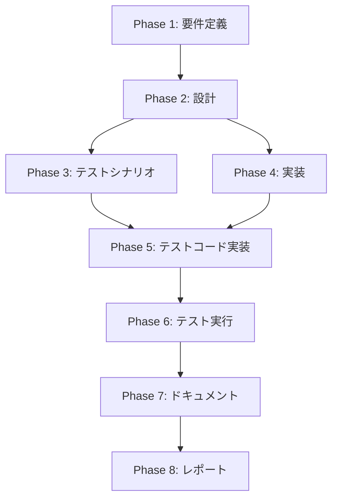

# Codex Agent 実行ログ

開始日時: 2025/12/25 5:46:26

---

## Turn 1: スレッド開始

**Thread ID**: `[REDACTED_TOKEN]`

## Turn 2: ツール実行

**種別**: reasoning
**ステータス**: completed

## Turn 3: ツール実行

**種別**: コマンド実行
**コマンド**: `/bin/bash -lc pwd`
**ステータス**: completed (exit_code=0)

```text
/tmp/[REDACTED_TOKEN]/ai-workflow-agent
```

## Turn 4: ツール実行

**種別**: reasoning
**ステータス**: completed

## Turn 5: ツール実行

**種別**: コマンド実行
**コマンド**: `/bin/bash -lc ls`
**ステータス**: completed (exit_code=0)

```text
ARCHITECTURE.md
CHANGELOG.md
CLAUDE.md
[REDACTED_TOKEN].md
[REDACTED_TOKEN].md
CODEBASE_SUMMARY.md
DOCKER_AUTH_SETUP.md
Dockerfile
Jenkinsfile
LICENSE
PROGRESS.md
README.md
ROADMAP.md
SETUP_TYPESCRIPT.md
TROUBLESHOOTING.md
__mocks__
docs
examples
jenkins
jest.config.cjs
metadata.json.template
node_modules
package-lock.json
package.json
scripts
src
tests
tmp
tmp-init-auto
tsconfig.json
tsconfig.test.json
```

## Turn 6: ツール実行

**種別**: reasoning
**ステータス**: completed

## Turn 7: ツール実行

**種別**: コマンド実行
**コマンド**: `/bin/bash -lc "rg --files -g 'Planning.md'"`
**ステータス**: failed (exit_code=127)

```text
/bin/bash: line 1: rg: command not found
```

## Turn 8: ツール実行

**種別**: reasoning
**ステータス**: completed

## Turn 9: ツール実行

**種別**: コマンド実行
**コマンド**: `/bin/bash -lc 'find .. -name Planning.md -print'`
**ステータス**: completed (exit_code=0)

## Turn 10: ツール実行

**種別**: reasoning
**ステータス**: completed

## Turn 11: ツール実行

**種別**: コマンド実行
**コマンド**: `/bin/bash -lc 'grep -R "Phase 6" -n'`
**ステータス**: failed (exit_code=124)

```text
.git/logs/refs/heads/ai-workflow/issue-510:18:[REDACTED_TOKEN] [REDACTED_TOKEN] yuto-takashi <[REDACTED_EMAIL]> 1766641585 +0000	commit: [ai-workflow] Phase 6 (testing) - execute completed
.git/logs/HEAD:20:[REDACTED_TOKEN] [REDACTED_TOKEN] yuto-takashi <[REDACTED_EMAIL]> 1766641585 +0000	commit: [ai-workflow] Phase 6 (testing) - execute completed
.git/COMMIT_EDITMSG:1:[ai-workflow] Phase 6 (testing) - execute completed
.ai-workflow/issue-10/00_planning/output/planning.md:22:- **Phase 6 (テスト実行)**: 1~2h - テスト実行と修正
.ai-workflow/issue-10/00_planning/output/planning.md:241:### Phase 6: テスト実行 (見積もり: 1~2h)
.ai-workflow/issue-10/00_planning/output/planning.md:300:    P5 --> P6[Phase 6: テスト実行]
.ai-workflow/issue-10/00_planning/output/planning.md:406:### Phase 6: テスト実行
.ai-workflow/issue-10/02_design/output/design.md:942:### Phase 6: テスト実行（1~2h）
.ai-workflow/issue-10/04_implementation/output/implementation.md:186:### Phase 6（testing）での作業
.ai-workflow/issue-10/04_implementation/output/implementation.md:251:### Phase 6 で実施する項目
.ai-workflow/issue-10/[REDACTED_TOKEN]/output/test-implementation.md:372:### Phase 6: テスト実行（testing）
.ai-workflow/issue-10/[REDACTED_TOKEN]/output/test-implementation.md:436:### Phase 6 で実施する項目
.ai-workflow/issue-10/06_testing/output/test-result.md:227:4. **実装完了後、Phase 6（testing）を再実行**
.ai-workflow/issue-10/06_testing/output/test-result.md:230:## 品質ゲート（Phase 6）の確認
.ai-workflow/issue-10/06_testing/output/test-result.md:247:6. 再度Phase 6（testing）を実行
.ai-workflow/issue-10/06_testing/output/test-result.md:323:**Phase**: Testing (Phase 6)
.ai-workflow/issue-10/08_report/output/report.md:39:- マージ後、Phase 6（testing）を再実行して統合テスト成功率の改善を確認
.ai-workflow/issue-10/08_report/output/report.md:200:#### テストフレームワーク修正（Phase 6で実施）
.ai-workflow/issue-10/08_report/output/report.md:207:### テスト結果（Phase 6）
.ai-workflow/issue-10/08_report/output/report.md:390:  - Phase 6（testing）を再実行して統合テスト成功率の改善を確認（推奨）
.ai-workflow/issue-10/08_report/output/report.md:446:1. **Phase 6（testing）を再実行**:
.ai-workflow/issue-10/08_report/output/report.md:458:1. **Phase 6（testing）の再実行**（推奨）:
.ai-workflow/issue-10/09_evaluation/output/evaluation_report.md:343: 4. **Phase 6（testing）の再実行**
.ai-workflow/issue-102/00_planning/output/planning.md:159:### Phase 6: テスト実行 (見積もり: 0.5~0.75h)
.ai-workflow/issue-102/00_planning/output/planning.md:199:    P4 --> P6[Phase 6: テスト実行]
.ai-workflow/issue-102/00_planning/output/planning.md:218:- Phase 4 → Phase 6: テスト期待値とJest設定の修正が完了してからテスト実行
.ai-workflow/issue-102/00_planning/output/planning.md:219:- Phase 6 → Phase 7: テスト結果を確認してからドキュメント作成
.ai-workflow/issue-102/00_planning/output/planning.md:287:### Phase 6: テスト実行
.ai-workflow/issue-102/01_requirements/output/requirements.md:282:  - **Phase 6（テスト実行）**: 全テストスイート（npm test）を実行し、回帰テストを実施
.ai-workflow/issue-102/01_requirements/output/requirements.md:288:  - **Phase 6（テスト実行）**: CI環境（Jenkins）での実行も確認
.ai-workflow/issue-102/02_design/output/design.md:417:Phase 6: testing (phaseOrder[6] + 1 = 7)
.ai-workflow/issue-102/02_design/output/design.md:784:**Phase 6（Testing）**:
.ai-workflow/issue-102/03_test_scenario/output/test-scenario.md:492:### 6.2 Phase 6（テスト実行）での検証
.ai-workflow/issue-102/03_test_scenario/output/test-scenario.md:578:**Phase 6（Testing）**:
.ai-workflow/issue-102/04_implementation/output/implementation.md:212:### Phase 6（testing）
.ai-workflow/issue-102/04_implementation/output/implementation.md:241:  - ⏳ Phase 6で実際のテスト実行で動作確認予定
.ai-workflow/issue-102/04_implementation/output/implementation.md:248:  - ⏳ Phase 6で全テストスイート実行による回帰テスト予定
.ai-workflow/issue-102/04_implementation/output/implementation.md:251:- **ステータス**: ⏳ Phase 6で検証予定
.ai-workflow/issue-102/04_implementation/output/implementation.md:253:  - Phase 6でローカル環境とCI環境（Jenkins）で実行
.ai-workflow/issue-102/04_implementation/output/implementation.md:261:  - ⏳ Phase 6で他の失敗が見つかった場合、別Issueとして切り出す予定
.ai-workflow/issue-102/04_imp
... (truncated)
```

## Turn 12: ツール実行

**種別**: reasoning
**ステータス**: completed

## Turn 13: ツール実行

**種別**: コマンド実行
**コマンド**: `/bin/bash -lc 'ls .ai-workflow/issue-510/00_planning/output'`
**ステータス**: completed (exit_code=0)

```text
planning.md
```

## Turn 14: ツール実行

**種別**: reasoning
**ステータス**: completed

## Turn 15: ツール実行

**種別**: コマンド実行
**コマンド**: `/bin/bash -lc 'grep -n "Phase 6" .ai-workflow/issue-510/00_planning/output/planning.md'`
**ステータス**: completed (exit_code=0)

```text
197:### Phase 6: テスト実行 (見積もり: 1〜1.5h)
235:    P5 --> P6[Phase 6: テスト実行]
334:### Phase 6: テスト実行
362:| Phase 6 | テスト結果 | `06_testing/output/` |
```

## Turn 16: ツール実行

**種別**: reasoning
**ステータス**: completed

## Turn 17: ツール実行

**種別**: コマンド実行
**コマンド**: `/bin/bash -lc "sed -n '180,260p' .ai-workflow/issue-510/00_planning/output/planning.md"`
**ステータス**: completed (exit_code=0)

```text
- `git.log()` の `to` パラメータを `targetHead` に変更
  - デバッグログの追加

-### Phase 5: テストコード実装 (見積もり: 2〜2.5h)

- [x] Task 5-1: ユニットテスト実装 (1h)
  - `squash-manager.test.ts` に新規テストケース追加
  - `getCommitsToSquash()` の `targetHead` パラメータテスト

- [x] Task 5-2: インテグレーションテスト実装 (1h)
  - `finalize-command.test.ts` に Issue #510 シナリオ追加
  - non-fast-forward + pull 後のスカッシュ動作確認

- [x] Task 5-3: 後方互換性テスト (0.5h)
  - `headCommit` 未指定時の従来動作確認
  - 既存テストの修正（必要に応じて）

### Phase 6: テスト実行 (見積もり: 1〜1.5h)

- [ ] Task 6-1: ユニットテスト実行 (0.5h)
  - `npm run test:unit` 実行
  - 失敗テストの修正

- [ ] Task 6-2: インテグレーションテスト実行 (0.5h)
  - `npm run test:integration` 実行
  - 失敗テストの修正

- [ ] Task 6-3: 全体テスト実行 (0.5h)
  - `npm test` 実行
  - カバレッジ確認

### Phase 7: ドキュメント (見積もり: 0.5〜1h)

- [ ] Task 7-1: コード内ドキュメント更新 (0.5h)
  - JSDoc コメントの追加・更新
  - 変更理由のコメント追加

### Phase 8: レポート (見積もり: 0.5h)

- [ ] Task 8-1: 実装レポート作成 (0.5h)
  - 変更内容のサマリー
  - テスト結果のサマリー
  - 今後の改善提案

---

## 5. 依存関係



### タスク間の依存関係

| タスク | 依存先 | 備考 |
|-------|-------|------|
| Task 4-2 | Task 4-1 | 型定義が先に必要 |
| Task 4-3 | Task 4-2 | executeStep1 の戻り値を使用 |
| Task 4-4 | Task 4-1 | 型定義が先に必要 |
| Task 4-5 | Task 4-4 | [REDACTED_TOKEN] から呼び出し |
| Task 5-1 | Task 4-5 | 実装完了後にテスト |
| Task 5-2 | Task 4-3 | 実装完了後にテスト |

---

## 6. リスクと軽減策

### リスク1: 既存テストへの影響

- **影響度**: 中
- **確率**: 低
- **説明**: `FinalizeContext` 型の変更により、既存テストがコンパイルエラーになる可能性
- **軽減策**:
```

## Turn 18: ツール実行

**種別**: reasoning
**ステータス**: completed

## Turn 19: ツール実行

**種別**: コマンド実行
**コマンド**: `/bin/bash -lc "sed -n '1,200p' .ai-workflow/issue-510/06_testing/output/test-result.md"`
**ステータス**: completed (exit_code=0)

```text
# テスト実行結果

## テスト結果サマリー
- 総テスト数: 2205件
- 成功: 1638件
- 失敗: 547件
- 成功率: 74.3%

## 条件分岐
以下のテストが失敗しました。

### `tests/integration/[REDACTED_TOKEN].test.ts::GitHubClient Facade Integration › Pull Request Operations Delegation › should delegate closePullRequest to PullRequestClient`
- **エラー**: ReferenceError: jest is not defined
- **スタックトレース**:
  ```
  at Object.<anonymous> (tests/integration/[REDACTED_TOKEN].test.ts:228:27)
  ```

### `tests/unit/core/[REDACTED_TOKEN].test.ts::MetadataManager - Rollback機能 › UC-MM-01: setRollbackContext() - 正常系`
- **エラー**: TypeError: existsSync.mockReturnValue is not a function
- **スタックトレース**:
  ```
  at Object.<anonymous> (tests/unit/core/[REDACTED_TOKEN].test.ts:35:16)
  ```

### `tests/integration/[REDACTED_TOKEN].test.ts::メタデータ永続化の統合テスト › メタデータ永続化フロー`
- **エラー**: Error: metadata.json not found: /test/.ai-workflow/issue-26/metadata.json
- **スタックトレース**:
  ```
  at Function.load (src/core/workflow-state.ts:67:13)
  at new MetadataManager (src/core/metadata-manager.ts:43:32)
  at Object.<anonymous> (tests/integration/[REDACTED_TOKEN].test.ts:42:23)
  ```

### `tests/integration/jenkins/[REDACTED_TOKEN].test.ts::Integration: auto-issue Jenkins Custom Instruction support (Issue #435) › documents the CUSTOM_INSTRUCTION parameter in the header comments`
- **エラー**: TypeError: The "cb" argument must be of type function. Received type string ('utf-8')
- **スタックトレース**:
  ```
  at Object.<anonymous> (tests/integration/jenkins/[REDACTED_TOKEN].test.ts:23:35)
  ```

### `tests/integration/finalize-command.test.ts::Integration: Finalize Command - エンドツーエンドフロー › IT-510-001: pull を挟んでも headBeforeCleanup でスカッシュする`
- **エラー**: TypeError: jest.mocked(...).mockReturnValue is not a function
- **スタックトレース**:
  ```
  at Object.<anonymous> (tests/integration/finalize-command.test.ts:104:32)
  ```

### `tests/integration/squash-workflow.test.ts::スカッシュワークフロー統合テスト › シナリオ 3.2.1: git reset → commit → push --force-with-lease の一連の流れ`
- **エラー**: expect(received).toBeLessThan(expected) with expected value undefined
- **スタックトレース**:
  ```
  at Object.<anonymous> (tests/integration/squash-workflow.test.ts:244:28)
  ```

### `tests/unit/squash-manager.test.ts::SquashManager › Issue #216: ESM compatibility and forcePushToRemote › should load prompt template without __dirname error in ESM environment`
- **エラー**: expect(jest.fn()).toHaveBeenCalled() – mockReadFile が呼ばれていない
- **スタックトレース**:
  ```
  at Object.<anonymous> (tests/unit/squash-manager.test.ts:591:28)
  ```
```

## Turn 20: ツール実行

**種別**: reasoning
**ステータス**: completed

## Turn 21: ツール実行

**種別**: コマンド実行
**コマンド**: `/bin/bash -lc 'grep -n "npm" .ai-workflow/issue-510/06_testing/output/test-result.md'`
**ステータス**: failed (exit_code=1)

## Turn 22: ツール実行

**種別**: reasoning
**ステータス**: completed

## Turn 23: ツール実行

**種別**: コマンド実行
**コマンド**: `/bin/bash -lc "sed -n '200,400p' .ai-workflow/issue-510/06_testing/output/test-result.md"`
**ステータス**: completed (exit_code=0)

## Turn 24: ツール実行

**種別**: reasoning
**ステータス**: completed

## Turn 25: ツール実行

**種別**: コマンド実行
**コマンド**: `/bin/bash -lc 'wc -l .ai-workflow/issue-510/06_testing/output/test-result.md'`
**ステータス**: completed (exit_code=0)

```text
61 .ai-workflow/issue-510/06_testing/output/test-result.md
```

## Turn 26: ツール実行

**種別**: reasoning
**ステータス**: completed

## Turn 27: ツール実行

**種別**: コマンド実行
**コマンド**: `/bin/bash -lc 'nl -ba .ai-workflow/issue-510/06_testing/output/test-result.md'`
**ステータス**: completed (exit_code=0)

```text
1	# テスト実行結果
     2	
     3	## テスト結果サマリー
     4	- 総テスト数: 2205件
     5	- 成功: 1638件
     6	- 失敗: 547件
     7	- 成功率: 74.3%
     8	
     9	## 条件分岐
    10	以下のテストが失敗しました。
    11	
    12	### `tests/integration/[REDACTED_TOKEN].test.ts::GitHubClient Facade Integration › Pull Request Operations Delegation › should delegate closePullRequest to PullRequestClient`
    13	- **エラー**: ReferenceError: jest is not defined
    14	- **スタックトレース**:
    15	  ```
    16	  at Object.<anonymous> (tests/integration/[REDACTED_TOKEN].test.ts:228:27)
    17	  ```
    18	
    19	### `tests/unit/core/[REDACTED_TOKEN].test.ts::MetadataManager - Rollback機能 › UC-MM-01: setRollbackContext() - 正常系`
    20	- **エラー**: TypeError: existsSync.mockReturnValue is not a function
    21	- **スタックトレース**:
    22	  ```
    23	  at Object.<anonymous> (tests/unit/core/[REDACTED_TOKEN].test.ts:35:16)
    24	  ```
    25	
    26	### `tests/integration/[REDACTED_TOKEN].test.ts::メタデータ永続化の統合テスト › メタデータ永続化フロー`
    27	- **エラー**: Error: metadata.json not found: /test/.ai-workflow/issue-26/metadata.json
    28	- **スタックトレース**:
    29	  ```
    30	  at Function.load (src/core/workflow-state.ts:67:13)
    31	  at new MetadataManager (src/core/metadata-manager.ts:43:32)
    32	  at Object.<anonymous> (tests/integration/[REDACTED_TOKEN].test.ts:42:23)
    33	  ```
    34	
    35	### `tests/integration/jenkins/[REDACTED_TOKEN].test.ts::Integration: auto-issue Jenkins Custom Instruction support (Issue #435) › documents the CUSTOM_INSTRUCTION parameter in the header comments`
    36	- **エラー**: TypeError: The "cb" argument must be of type function. Received type string ('utf-8')
    37	- **スタックトレース**:
    38	  ```
    39	  at Object.<anonymous> (tests/integration/jenkins/[REDACTED_TOKEN].test.ts:23:35)
    40	  ```
    41	
    42	### `tests/integration/finalize-command.test.ts::Integration: Finalize Command - エンドツーエンドフロー › IT-510-001: pull を挟んでも headBeforeCleanup でスカッシュする`
    43	- **エラー**: TypeError: jest.mocked(...).mockReturnValue is not a function
    44	- **スタックトレース**:
    45	  ```
    46	  at Object.<anonymous> (tests/integration/finalize-command.test.ts:104:32)
    47	  ```
    48	
    49	### `tests/integration/squash-workflow.test.ts::スカッシュワークフロー統合テスト › シナリオ 3.2.1: git reset → commit → push --force-with-lease の一連の流れ`
    50	- **エラー**: expect(received).toBeLessThan(expected) with expected value undefined
    51	- **スタックトレース**:
    52	  ```
    53	  at Object.<anonymous> (tests/integration/squash-workflow.test.ts:244:28)
    54	  ```
    55	
    56	### `tests/unit/squash-manager.test.ts::SquashManager › Issue #216: ESM compatibility and forcePushToRemote › should load prompt template without __dirname error in ESM environment`
    57	- **エラー**: expect(jest.fn()).toHaveBeenCalled() – mockReadFile が呼ばれていない
    58	- **スタックトレース**:
    59	  ```
    60	  at Object.<anonymous> (tests/unit/squash-manager.test.ts:591:28)
    61	  ```
```

## Turn 28: ツール実行

**種別**: reasoning
**ステータス**: completed

## Turn 29: ツール実行

**種別**: コマンド実行
**コマンド**: `/bin/bash -lc "nl -ba .ai-workflow/issue-510/00_planning/output/planning.md | sed -n '190,220p'"`
**ステータス**: completed (exit_code=0)

```text
190	  - `finalize-command.test.ts` に Issue #510 シナリオ追加
   191	  - non-fast-forward + pull 後のスカッシュ動作確認
   192	
   193	- [x] Task 5-3: 後方互換性テスト (0.5h)
   194	  - `headCommit` 未指定時の従来動作確認
   195	  - 既存テストの修正（必要に応じて）
   196	
   197	### Phase 6: テスト実行 (見積もり: 1〜1.5h)
   198	
   199	- [ ] Task 6-1: ユニットテスト実行 (0.5h)
   200	  - `npm run test:unit` 実行
   201	  - 失敗テストの修正
   202	
   203	- [ ] Task 6-2: インテグレーションテスト実行 (0.5h)
   204	  - `npm run test:integration` 実行
   205	  - 失敗テストの修正
   206	
   207	- [ ] Task 6-3: 全体テスト実行 (0.5h)
   208	  - `npm test` 実行
   209	  - カバレッジ確認
   210	
   211	### Phase 7: ドキュメント (見積もり: 0.5〜1h)
   212	
   213	- [ ] Task 7-1: コード内ドキュメント更新 (0.5h)
   214	  - JSDoc コメントの追加・更新
   215	  - 変更理由のコメント追加
   216	
   217	### Phase 8: レポート (見積もり: 0.5h)
   218	
   219	- [ ] Task 8-1: 実装レポート作成 (0.5h)
   220	  - 変更内容のサマリー
```

## Turn 30: ツール実行

**種別**: reasoning
**ステータス**: completed

## Turn 31: ツール実行

**種別**: agent_message
**ステータス**: completed

## Turn 32: 実行完了

**ステータス**: completed
**所要時間**: 94904ms
**ターン数**: N/A

---

**経過時間**: 94904ms
**開始**: 2025-12-25T05:46:26.455Z
**終了**: 2025-12-25T05:48:01.359Z