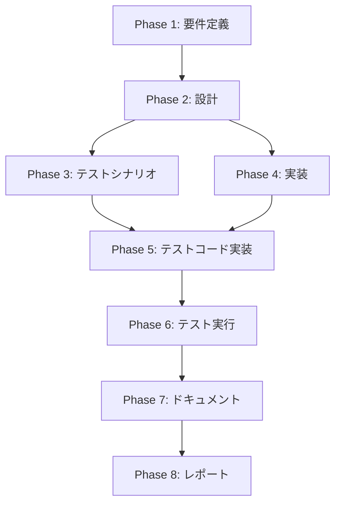

# プロジェクト計画書: Issue #512

## Jenkins Webhook仕様に合わせてペイロードを拡張（build_url, branch_name, pr_url等を追加）

---

## 1. Issue分析

### 複雑度: 中程度

**根拠**:
- 既存の`sendWebhook()`関数の拡張が中心
- 対象ファイル: 1つの共通モジュール + 8つのJenkinsfile
- 新規フィールド追加（5項目）とAPI変更を伴う
- 既存の統合テスト（18シナリオ）の拡張が必要

### 見積もり工数: 8〜12時間

| 作業項目 | 見積もり時間 |
|---------|------------|
| 要件定義・仕様確認 | 1h |
| 設計（API設計・影響分析） | 1〜2h |
| テストシナリオ作成 | 1〜2h |
| 実装（common.groovy + 8 Jenkinsfile） | 2〜3h |
| テストコード実装・拡張 | 2〜3h |
| テスト実行・デバッグ | 1h |
| ドキュメント・レポート | 1h |

### リスク評価: 低

- 既存のwebhook実装（Issue #505）が安定して動作中
- 破壊的変更なし（追加フィールドはすべてオプショナル）
- 既存テストの静的解析パターンが確立済み

---

## 2. 実装戦略判断

### 実装戦略: EXTEND

**判断根拠**:
- `jenkins/shared/common.groovy`の既存`sendWebhook()`関数を拡張
- 8つの既存Jenkinsfileに対してwebhook呼び出し箇所を更新
- 新規ファイル作成は不要
- 既存のアーキテクチャ・設計パターンを維持

**具体的な拡張内容**:
1. `sendWebhook()`のシグネチャ変更（位置引数 → Map型config引数）
2. オプショナルフィールドの追加（build_url, branch_name, pr_url, finished_at, logs_url）
3. 各Jenkinsfileでの呼び出しパターン更新

---

### テスト戦略: INTEGRATION_ONLY

**判断根拠**:
- 既存の統合テスト`tests/integration/jenkins/webhook-notifications.test.ts`が存在
- JenkinsパイプラインのGroovyコードは静的解析テストが最適
- 実際のHTTP通信はJenkins環境でのみ検証可能
- ユニットテストはGroovyランタイムが必要なため不適

**テスト対象**:
- common.groovyの`sendWebhook()`関数シグネチャと実装パターン
- 全Jenkinsfileでの正しいパラメータ渡し
- 各ステータス（running/success/failed）での適切なフィールド送信
- オプショナルフィールドの条件付き追加ロジック

---

### テストコード戦略: EXTEND_TEST

**判断根拠**:
- 既存の`webhook-notifications.test.ts`に新規テストケースを追加
- Issue #505で確立されたテストパターンを踏襲
- テストファイル構造は維持、テストケースを拡張

**拡張内容**:
- 新規フィールド（build_url, branch_name, pr_url, finished_at, logs_url）の検証
- Map型config引数のシグネチャ検証
- 各ステータスでの送信フィールド条件の検証
- ISO 8601タイムスタンプ形式の検証

---

## 3. 影響範囲分析

### 既存コードへの影響

| ファイル | 変更内容 | 影響度 |
|---------|---------|-------|
| `jenkins/shared/common.groovy` | `sendWebhook()`関数の完全書き換え | 高 |
| `jenkins/jobs/pipeline/ai-workflow/all-phases/Jenkinsfile` | webhook呼び出しパターン更新 | 中 |
| `jenkins/jobs/pipeline/ai-workflow/preset/Jenkinsfile` | webhook呼び出しパターン更新 | 中 |
| `jenkins/jobs/pipeline/ai-workflow/single-phase/Jenkinsfile` | webhook呼び出しパターン更新 | 中 |
| `jenkins/jobs/pipeline/ai-workflow/rollback/Jenkinsfile` | webhook呼び出しパターン更新 | 中 |
| `jenkins/jobs/pipeline/ai-workflow/auto-issue/Jenkinsfile` | webhook呼び出しパターン更新 | 中 |
| `jenkins/jobs/pipeline/ai-workflow/finalize/Jenkinsfile` | webhook呼び出しパターン更新 | 中 |
| `jenkins/jobs/pipeline/ai-workflow/pr-comment-execute/Jenkinsfile` | webhook呼び出しパターン更新 | 中 |
| `jenkins/jobs/pipeline/ai-workflow/pr-comment-finalize/Jenkinsfile` | webhook呼び出しパターン更新 | 中 |
| `tests/integration/jenkins/webhook-notifications.test.ts` | テストケース追加 | 中 |
| `jenkins/README.md` | ドキュメント更新 | 低 |

### 依存関係の変更

- **新規依存**: なし
- **既存依存の変更**: なし（HTTP Request Pluginは既に使用中）

### マイグレーション要否

- **データベーススキーマ変更**: なし
- **設定ファイル変更**: なし
- **Job DSLパラメータ変更**: なし（既存のJOB_ID, WEBHOOK_URL, WEBHOOK_TOKENをそのまま使用）

---

## 4. タスク分割

### Phase 1: 要件定義 (見積もり: 1h)

- [x] Task 1-1: 機能要件の明確化 (0.5h)
  - Issue #512の要件を機能要件書として整理
  - 新規フィールド（build_url, branch_name, pr_url, finished_at, logs_url）の仕様確認
  - 各ステータス（running/success/failed）での送信フィールド条件の定義

- [x] Task 1-2: 受け入れ基準の定義 (0.5h)
  - 各フィールドの型・形式（ISO 8601、URL形式など）を明確化
  - オプショナルフィールドの振る舞い（null/空文字の扱い）を定義
  - 後方互換性の確認（既存呼び出しが動作すること）

### Phase 2: 設計 (見積もり: 1〜2h)

- [x] Task 2-1: API設計 (1h)
  - `sendWebhook(Map config)`の新シグネチャ設計
  - configマップのキー・値仕様の定義
  - オプショナルフィールドの条件付き追加ロジック設計

- [x] Task 2-2: 実装パターン設計 (0.5〜1h)
  - 各Jenkinsfileでの呼び出しパターン統一
  - PR URL取得方法（metadata.jsonから読み取り）の設計
  - タイムスタンプ生成ロジックの設計（ISO 8601形式）

### Phase 3: テストシナリオ (見積もり: 1〜2h)

- [ ] Task 3-1: 統合テストシナリオ作成 (1〜2h)
  - IT-019〜IT-030: 新規フィールドの静的検証シナリオ
  - Map型シグネチャの検証
  - 各ステータスでの送信フィールド条件検証
  - ISO 8601タイムスタンプ形式の正規表現検証

### Phase 4: 実装 (見積もり: 2〜3h)

- [x] Task 4-1: common.groovy sendWebhook()の拡張 (1〜1.5h)
  - 既存の位置引数シグネチャをMap型config引数に変更
  - 新規フィールド（build_url, branch_name, pr_url, finished_at, logs_url）の追加
  - オプショナルフィールドの条件付きペイロード構築
  - groovy.json.JsonOutputを使用したJSON生成

- [x] Task 4-2: 8つのJenkinsfileの更新 (1〜1.5h)
  - all-phases/Jenkinsfile: running/success/failed呼び出しの更新
  - preset/Jenkinsfile: running/success/failed呼び出しの更新
  - single-phase/Jenkinsfile: running/success/failed呼び出しの更新
  - rollback/Jenkinsfile: running/success/failed呼び出しの更新
  - auto-issue/Jenkinsfile: running/success/failed呼び出しの更新
  - finalize/Jenkinsfile: running/success/failed呼び出しの更新
  - pr-comment-execute/Jenkinsfile: running/success/failed呼び出しの更新
  - pr-comment-finalize/Jenkinsfile: running/success/failed呼び出しの更新

### Phase 5: テストコード実装 (見積もり: 2〜3h)

- [x] Task 5-1: 統合テストの拡張 (2〜3h)
  - webhook-notifications.test.tsに新規describeブロック追加
  - Map型シグネチャの検証テスト
  - 新規フィールド（build_url等）の存在確認テスト
  - オプショナルフィールドの条件付き追加ロジック検証
  - ISO 8601形式の正規表現マッチング検証
  - PR URL取得パターン（jq使用）の検証

### Phase 6: テスト実行 (見積もり: 1h)

- [ ] Task 6-1: 全テスト実行と検証 (1h)
  - npm run test:integration の実行
  - 新規テストケースの成功確認
  - 既存テストケース（IT-001〜IT-018）の継続成功確認
  - カバレッジレポートの確認

### Phase 7: ドキュメント (見積もり: 0.5h)

- [ ] Task 7-1: jenkins/README.mdの更新 (0.5h)
  - 新規Webhookフィールドの説明追加
  - 各ステータスでの送信フィールド一覧表の追加
  - 使用例の更新

### Phase 8: レポート (見積もり: 0.5h)

- [ ] Task 8-1: 実装レポート作成 (0.5h)
  - 変更ファイル一覧の作成
  - テスト結果サマリー
  - Issue #505からの変更点まとめ

---

## 5. 依存関係

**並列実行可能なタスク**:
- Phase 3とPhase 4は、Phase 2完了後に並列実行可能
- Task 4-1（common.groovy）とTask 4-2（Jenkinsfile）は順次実行（4-1が前提）

---

## 6. リスクと軽減策

### リスク1: 後方互換性の破壊

- **影響度**: 高
- **確率**: 低
- **説明**: 既存の`sendWebhook()`呼び出しが新シグネチャで動作しなくなる可能性
- **軽減策**:
  - 全Jenkinsfileを同時に更新することで整合性を確保
  - 既存テスト（IT-001〜IT-018）の継続成功を確認
  - Map型引数への移行により、将来の拡張も容易に

### リスク2: PR URL取得の失敗

- **影響度**: 中
- **確率**: 中
- **説明**: metadata.jsonが存在しない、またはpr_urlフィールドがない場合
- **軽減策**:
  - jqコマンドで`// empty`フォールバックを使用
  - 空文字列の場合はペイロードに含めない設計
  - エラー時もビルド全体を失敗させない（既存方針を継続）

### リスク3: タイムスタンプ形式の不一致

- **影響度**: 低
- **確率**: 低
- **説明**: ISO 8601形式がDevLoop Runner（Lavable）の期待と異なる
- **軽減策**:
  - 明確なフォーマット指定: `yyyy-MM-dd'T'HH:mm:ss.SSS'Z'`
  - UTCタイムゾーンを明示的に使用
  - テストで正規表現による形式検証

### リスク4: テストの静的解析限界

- **影響度**: 中
- **確率**: 低
- **説明**: Groovyコードの静的解析では実行時の挙動を完全に検証できない
- **軽減策**:
  - 既存のテストパターン（正規表現マッチング）を踏襲
  - コードパターンの一貫性を重視した実装
  - 本番環境での動作確認はJenkins統合テストで実施

---

## 7. 品質ゲート

### Phase 1: 要件定義

- [x] 機能要件が明確に記載されている
- [x] 新規フィールド（5項目）の仕様が定義されている
- [x] 各ステータスでの送信条件が明確化されている
- [x] 受け入れ基準が定義されている
- [x] 後方互換性の要件が確認されている

### Phase 2: 設計

- [x] 実装戦略（EXTEND）の判断根拠が明記されている
- [x] テスト戦略（INTEGRATION_ONLY）の判断根拠が明記されている
- [x] テストコード戦略（EXTEND_TEST）の判断根拠が明記されている
- [x] `sendWebhook(Map config)`のAPI仕様が定義されている
- [x] 各Jenkinsfileでの呼び出しパターンが統一されている

### Phase 3: テストシナリオ

- [x] 新規フィールドの検証シナリオが定義されている（IT-019〜）
- [x] 各ステータスでの送信条件シナリオがカバーされている
- [x] ISO 8601形式の検証シナリオが含まれている
- [x] オプショナルフィールドの条件付き追加シナリオが含まれている

### Phase 4: 実装

- [ ] `jenkins/shared/common.groovy`の`sendWebhook()`がMap型引数に変更されている
- [ ] 5つの新規フィールドがペイロード構築ロジックに含まれている
- [ ] 8つのJenkinsfileすべてで新しい呼び出しパターンが適用されている
- [ ] オプショナルフィールドは存在する場合のみ追加される

### Phase 5: テストコード実装

- [ ] `webhook-notifications.test.ts`に新規テストケースが追加されている
- [ ] Map型シグネチャの検証テストが実装されている
- [ ] 新規フィールドの存在確認テストが実装されている
- [ ] 既存テスト（IT-001〜IT-018）が変更されていない、または最小限の変更

### Phase 6: テスト実行

- [ ] 全統合テストが成功している
- [ ] 新規テストケースが成功している
- [ ] 既存テストケースが継続して成功している
- [ ] テストカバレッジが低下していない

### Phase 7: ドキュメント

- [ ] `jenkins/README.md`が更新されている
- [ ] 新規Webhookフィールドの説明が追加されている
- [ ] 使用例が最新の呼び出しパターンを反映している

### Phase 8: レポート

- [ ] 変更ファイル一覧が作成されている
- [ ] テスト結果サマリーが記載されている
- [ ] Issue #505からの変更点が明確に記載されている

---

## 補足情報

### Issue #505との関係

| 項目 | Issue #505 | Issue #512（本Issue） |
|-----|-----------|---------------------|
| 基本機能 | webhook送信の基盤実装 | #505の拡張 |
| フィールド | job_id, status, error | + build_url, branch_name, pr_url, finished_at, logs_url |
| シグネチャ | 位置引数（5つ） | Map型config引数 |
| テスト | IT-001〜IT-018 | IT-019〜（追加） |

### 対象Jenkinsfile一覧（Issueに記載の7ファイル + finalize）

1. `jenkins/jobs/pipeline/ai-workflow/all-phases/Jenkinsfile`
2. `jenkins/jobs/pipeline/ai-workflow/preset/Jenkinsfile`
3. `jenkins/jobs/pipeline/ai-workflow/single-phase/Jenkinsfile`
4. `jenkins/jobs/pipeline/ai-workflow/rollback/Jenkinsfile`
5. `jenkins/jobs/pipeline/ai-workflow/auto-issue/Jenkinsfile`
6. `jenkins/jobs/pipeline/ai-workflow/finalize/Jenkinsfile`
7. `jenkins/jobs/pipeline/ai-workflow/pr-comment-execute/Jenkinsfile`
8. `jenkins/jobs/pipeline/ai-workflow/pr-comment-finalize/Jenkinsfile`

### 技術的考慮事項（Issueから引用）

1. **PR URL取得**: metadata.jsonから`pr_url`を取得（jq使用）
2. **タイムスタンプ生成**: ISO 8601形式（`yyyy-MM-dd'T'HH:mm:ss.SSS'Z'`）、UTC
3. **エラーハンドリング**: webhook送信失敗時はログ出力のみ（ビルド全体を失敗させない）
4. **オプショナルフィールド**: 存在する場合のみペイロードに追加

---

## 品質ゲート（Phase 0）チェックリスト

- [x] **実装戦略が明確に決定されている**: EXTEND
- [x] **テスト戦略が明確に決定されている**: INTEGRATION_ONLY
- [x] **テストコード戦略が明確に決定されている**: EXTEND_TEST
- [x] **影響範囲が分析されている**: 10ファイル（common.groovy + 8 Jenkinsfile + テスト + README）
- [x] **タスク分割が適切な粒度である**: 8フェーズ、各タスク1〜3時間
- [x] **リスクが洗い出されている**: 4つのリスクと軽減策
