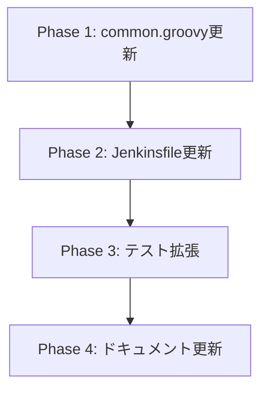

# 詳細設計書: Issue #512

## Jenkins Webhook仕様に合わせてペイロードを拡張（build_url, branch_name, pr_url等を追加）

---

## 1. 概要

### 1.1 設計目的

本設計書は、Issue #505で実装された基本的なwebhook送信機能を拡張し、DevLoop Runner（Lovable）が必要とする追加フィールド（build_url, branch_name, pr_url, finished_at, logs_url）を送信可能にするための詳細設計を定義する。

### 1.2 前提条件

- Issue #505で実装されたwebhook機能が安定稼働中
- Jenkins HTTP Request Pluginがインストール済み
- jqコマンドがJenkinsエージェントで利用可能

### 1.3 設計方針

- 既存の`sendWebhook()`関数のシグネチャを位置引数からMap型config引数に変更
- 8つのJenkinsfileすべてを同時更新し、整合性を確保
- 既存の18テストケース（IT-001〜IT-018）を維持しつつ、新規テストケースを追加

---

## 2. 実装戦略判断

### 実装戦略: EXTEND

**判断根拠**:
- 既存の`jenkins/shared/common.groovy`の`sendWebhook()`関数を拡張する
- 新規ファイルの作成は不要（既存ファイルの修正のみ）
- 8つのJenkinsfileすべてで呼び出しパターンを統一的に更新
- Issue #505で確立されたアーキテクチャ・設計パターンを維持
- 破壊的変更なし（追加フィールドはすべてオプショナル）

**具体的な拡張内容**:
1. `sendWebhook()`のシグネチャ変更（位置引数 → Map型config引数）
2. オプショナルフィールドの追加（build_url, branch_name, pr_url, finished_at, logs_url）
3. 各Jenkinsfileでの呼び出しパターン更新（3箇所×8ファイル＝24箇所）

---

## 3. テスト戦略判断

### テスト戦略: INTEGRATION_ONLY

**判断根拠**:
- 既存の統合テスト`tests/integration/jenkins/webhook-notifications.test.ts`が存在し、静的解析パターンが確立済み
- JenkinsパイプラインのGroovyコードは、Groovyランタイム依存のため単体テストが困難
- 静的解析（正規表現マッチング、パターン検証）による統合テストが最も効果的
- 実際のHTTP通信はJenkins環境でのみ検証可能であり、CI環境での検証は静的解析に限定
- BDDテストは本機能の性質（Jenkinsパイプライン拡張）に適さない

**テスト対象**:
- common.groovyの`sendWebhook()`関数シグネチャと実装パターン
- 全Jenkinsfileでの正しいパラメータ渡し
- 各ステータス（running/success/failed）での適切なフィールド送信
- オプショナルフィールドの条件付き追加ロジック
- ISO 8601タイムスタンプ形式の検証

---

## 4. テストコード戦略判断

### テストコード戦略: EXTEND_TEST

**判断根拠**:
- 既存の`tests/integration/jenkins/webhook-notifications.test.ts`に新規テストケースを追加
- Issue #505で確立されたテストパターン（静的解析、正規表現マッチング）を踏襲
- 既存テスト（IT-001〜IT-018）との一貫性を維持
- 新規テストファイルの作成は不要（同一機能の拡張のため）

**拡張内容**:
- IT-019〜: 新規フィールド（build_url, branch_name, pr_url, finished_at, logs_url）の検証
- Map型シグネチャの検証
- 各ステータスでの送信フィールド条件の検証
- ISO 8601タイムスタンプ形式の正規表現検証

---

## 5. アーキテクチャ設計

### 5.1 システム全体図

```
┌─────────────────────────────────────────────────────────────────────────┐
│                              Jenkins                                     │
├─────────────────────────────────────────────────────────────────────────┤
│                                                                          │
│  ┌──────────────────────────────────────────────────────────────────┐   │
│  │                         Jenkinsfiles (8)                          │   │
│  │                                                                    │   │
│  │  ┌────────────────┐  ┌────────────────┐  ┌────────────────┐      │   │
│  │  │  all-phases    │  │    preset      │  │  single-phase  │      │   │
│  │  └───────┬────────┘  └───────┬────────┘  └───────┬────────┘      │   │
│  │          │                   │                   │                │   │
│  │  ┌───────┴───────┐  ┌───────┴───────┐  ┌───────┴───────┐        │   │
│  │  │   rollback    │  │  auto-issue   │  │   finalize    │        │   │
│  │  └───────┬───────┘  └───────┬───────┘  └───────┬───────┘        │   │
│  │          │                   │                   │                │   │
│  │  ┌───────┴───────────────────┴───────────────────┴───────┐       │   │
│  │  │  pr-comment-execute       │        pr-comment-finalize │       │   │
│  │  └───────────────────────────┴────────────────────────────┘       │   │
│  │                              │                                     │   │
│  │                              │ load / call                         │   │
│  │                              ▼                                     │   │
│  │  ┌──────────────────────────────────────────────────────────┐    │   │
│  │  │               common.groovy                                │    │   │
│  │  │                                                            │    │   │
│  │  │  ┌──────────────────────────────────────────────────┐    │    │   │
│  │  │  │  sendWebhook(Map config)                          │    │    │   │
│  │  │  │                                                    │    │    │   │
│  │  │  │  config keys:                                      │    │    │   │
│  │  │  │  - webhookUrl, webhookToken, jobId (必須)          │    │    │   │
│  │  │  │  - status (必須)                                   │    │    │   │
│  │  │  │  - errorMessage (オプション)                       │    │    │   │
│  │  │  │  - buildUrl, branchName, prUrl (新規)             │    │    │   │
│  │  │  │  - finishedAt, logsUrl (新規)                     │    │    │   │
│  │  │  └──────────────────────────────────────────────────┘    │    │   │
│  │  │                       │                                   │    │   │
│  │  └───────────────────────┼───────────────────────────────────┘    │   │
│  └──────────────────────────┼────────────────────────────────────────┘   │
│                             │                                            │
│                             │ HTTP POST                                  │
│                             ▼                                            │
└─────────────────────────────────────────────────────────────────────────┘
                              │
                              │ HTTPS
                              ▼
┌─────────────────────────────────────────────────────────────────────────┐
│                        DevLoop Runner (Lovable)                          │
│                                                                          │
│  Webhook Endpoint: {WEBHOOK_URL}                                        │
│  Authentication: X-Webhook-Token header                                  │
│                                                                          │
│  Expected Payload:                                                       │
│  {                                                                       │
│    "job_id": "abc123",                                                  │
│    "status": "running" | "success" | "failed",                          │
│    "error": "...",           // failedのみ                              │
│    "build_url": "...",       // 新規                                    │
│    "branch_name": "...",     // 新規                                    │
│    "pr_url": "...",          // 新規（successのみ）                     │
│    "finished_at": "...",     // 新規（success/failed）                  │
│    "logs_url": "..."         // 新規（success/failed）                  │
│  }                                                                       │
└─────────────────────────────────────────────────────────────────────────┘
```

### 5.2 コンポーネント間の関係

| コンポーネント | 役割 | 変更内容 |
|--------------|------|---------|
| Jenkinsfile (8) | パイプライン定義、webhook呼び出し | 呼び出しパターンをMap型に変更 |
| common.groovy | 共通処理、sendWebhook()関数 | シグネチャ変更、新規フィールド追加 |
| Job DSL (8) | パラメータ定義 | **変更なし** |
| HTTP Request Plugin | HTTP通信 | **変更なし** |

### 5.3 データフロー

```
1. ビルド開始
   │
   ├─▶ Jenkinsfile: 'running' webhook送信
   │   │
   │   └─▶ common.sendWebhook([
   │           webhookUrl: params.WEBHOOK_URL,
   │           webhookToken: params.WEBHOOK_TOKEN,
   │           jobId: params.JOB_ID,
   │           status: 'running',
   │           buildUrl: env.BUILD_URL,
   │           branchName: env.BRANCH_NAME
   │       ])
   │
   ├─▶ ビルド処理実行
   │
   └─▶ post ブロック
       │
       ├─▶ success: 'success' webhook送信
       │   │
       │   └─▶ common.sendWebhook([
       │           webhookUrl: params.WEBHOOK_URL,
       │           webhookToken: params.WEBHOOK_TOKEN,
       │           jobId: params.JOB_ID,
       │           status: 'success',
       │           buildUrl: env.BUILD_URL,
       │           branchName: env.BRANCH_NAME,
       │           prUrl: (metadata.jsonから取得),
       │           finishedAt: (ISO 8601形式),
       │           logsUrl: "${env.BUILD_URL}console"
       │       ])
       │
       └─▶ failure: 'failed' webhook送信
           │
           └─▶ common.sendWebhook([
                   webhookUrl: params.WEBHOOK_URL,
                   webhookToken: params.WEBHOOK_TOKEN,
                   jobId: params.JOB_ID,
                   status: 'failed',
                   errorMessage: (エラーメッセージ),
                   buildUrl: env.BUILD_URL,
                   finishedAt: (ISO 8601形式),
                   logsUrl: "${env.BUILD_URL}console"
               ])
```

---

## 6. 影響範囲分析

### 6.1 既存コードへの影響

| ファイル | 変更内容 | 影響度 | 変更量 |
|---------|---------|:-----:|-------|
| `jenkins/shared/common.groovy` | `sendWebhook()`関数の完全書き換え | 高 | ~40行 |
| `jenkins/jobs/pipeline/ai-workflow/all-phases/Jenkinsfile` | webhook呼び出しパターン更新（3箇所） | 中 | ~30行 |
| `jenkins/jobs/pipeline/ai-workflow/preset/Jenkinsfile` | webhook呼び出しパターン更新（3箇所） | 中 | ~30行 |
| `jenkins/jobs/pipeline/ai-workflow/single-phase/Jenkinsfile` | webhook呼び出しパターン更新（3箇所） | 中 | ~30行 |
| `jenkins/jobs/pipeline/ai-workflow/rollback/Jenkinsfile` | webhook呼び出しパターン更新（3箇所） | 中 | ~30行 |
| `jenkins/jobs/pipeline/ai-workflow/auto-issue/Jenkinsfile` | webhook呼び出しパターン更新（3箇所） | 中 | ~30行 |
| `jenkins/jobs/pipeline/ai-workflow/finalize/Jenkinsfile` | webhook呼び出しパターン更新（3箇所） | 中 | ~30行 |
| `jenkins/jobs/pipeline/ai-workflow/pr-comment-execute/Jenkinsfile` | webhook呼び出しパターン更新（3箇所） | 中 | ~30行 |
| `jenkins/jobs/pipeline/ai-workflow/pr-comment-finalize/Jenkinsfile` | webhook呼び出しパターン更新（3箇所） | 中 | ~30行 |
| `tests/integration/jenkins/webhook-notifications.test.ts` | テストケース追加（IT-019〜） | 中 | ~150行 |
| `jenkins/README.md` | ドキュメント更新 | 低 | ~20行 |

### 6.2 依存関係の変更

- **新規依存**: なし
- **既存依存の変更**: なし
  - HTTP Request Plugin: そのまま使用
  - jqコマンド: そのまま使用（PR URL取得用）

### 6.3 マイグレーション要否

| 項目 | 要否 | 理由 |
|------|:----:|------|
| データベーススキーマ変更 | 不要 | webhook送信側のみの変更 |
| 設定ファイル変更 | 不要 | 既存のJob DSLパラメータをそのまま使用 |
| Job DSLパラメータ変更 | 不要 | JOB_ID, WEBHOOK_URL, WEBHOOK_TOKENは変更なし |
| Jenkins再起動 | 不要 | Groovyファイルは実行時に読み込まれる |

### 6.4 後方互換性

- **全Jenkinsfileを同時更新**することで、シグネチャ変更の影響を吸収
- 新規フィールドはすべてオプショナルのため、DevLoop Runner側で未対応でも問題なし
- 既存のwebhook受信側（DevLoop Runner）に破壊的変更なし

---

## 7. 変更・追加ファイルリスト

### 7.1 修正が必要な既存ファイル

| # | ファイルパス | 変更概要 |
|:-:|------------|---------|
| 1 | `jenkins/shared/common.groovy` | sendWebhook()関数をMap型引数に変更、新規フィールド追加 |
| 2 | `jenkins/jobs/pipeline/ai-workflow/all-phases/Jenkinsfile` | webhook呼び出し3箇所を新パターンに更新 |
| 3 | `jenkins/jobs/pipeline/ai-workflow/preset/Jenkinsfile` | webhook呼び出し3箇所を新パターンに更新 |
| 4 | `jenkins/jobs/pipeline/ai-workflow/single-phase/Jenkinsfile` | webhook呼び出し3箇所を新パターンに更新 |
| 5 | `jenkins/jobs/pipeline/ai-workflow/rollback/Jenkinsfile` | webhook呼び出し3箇所を新パターンに更新 |
| 6 | `jenkins/jobs/pipeline/ai-workflow/auto-issue/Jenkinsfile` | webhook呼び出し3箇所を新パターンに更新 |
| 7 | `jenkins/jobs/pipeline/ai-workflow/finalize/Jenkinsfile` | webhook呼び出し3箇所を新パターンに更新 |
| 8 | `jenkins/jobs/pipeline/ai-workflow/pr-comment-execute/Jenkinsfile` | webhook呼び出し3箇所を新パターンに更新 |
| 9 | `jenkins/jobs/pipeline/ai-workflow/pr-comment-finalize/Jenkinsfile` | webhook呼び出し3箇所を新パターンに更新 |
| 10 | `tests/integration/jenkins/webhook-notifications.test.ts` | 新規テストケース（IT-019〜）を追加 |
| 11 | `jenkins/README.md` | 新規Webhookフィールドの説明を追加 |

### 7.2 新規作成ファイル

- なし

### 7.3 削除が必要なファイル

- なし

---

## 8. 詳細設計

### 8.1 sendWebhook()関数設計

#### 8.1.1 関数シグネチャ

**現状（Issue #505）**:
```groovy
def sendWebhook(String jobId, String webhookUrl, String webhookToken, String status, String errorMessage = '')
```

**変更後（Issue #512）**:
```groovy
def sendWebhook(Map config)
```

#### 8.1.2 configマップ仕様

| キー | 型 | 必須 | 説明 | 例 |
|-----|------|:----:|------|-----|
| `webhookUrl` | String | Yes | Webhookエンドポイント | `https://api.example.com/webhook` |
| `webhookToken` | String | Yes | 認証トークン | `token123` |
| `jobId` | String | Yes | ジョブ識別子 | `abc123` |
| `status` | String | Yes | ステータス | `running`, `success`, `failed` |
| `errorMessage` | String | No | エラーメッセージ（failedのみ） | `Build failed` |
| `buildUrl` | String | No | JenkinsビルドURL | `http://jenkins/job/123/` |
| `branchName` | String | No | ブランチ名 | `ai-workflow/issue-505` |
| `prUrl` | String | No | PR URL（successのみ） | `https://github.com/owner/repo/pull/456` |
| `finishedAt` | String | No | 完了日時（ISO 8601） | `2025-01-13T04:41:18.000Z` |
| `logsUrl` | String | No | ログURL | `http://jenkins/job/123/console` |

#### 8.1.3 実装コード

```groovy
/**
 * Webhookを送信する
 *
 * @param config Map型の設定
 *   - webhookUrl: Webhookエンドポイント（必須）
 *   - webhookToken: 認証トークン（必須）
 *   - jobId: ジョブ識別子（必須）
 *   - status: ステータス（必須）: 'running', 'success', 'failed'
 *   - errorMessage: エラーメッセージ（オプション、failedのみ）
 *   - buildUrl: JenkinsビルドURL（オプション）
 *   - branchName: ブランチ名（オプション）
 *   - prUrl: PR URL（オプション、successのみ）
 *   - finishedAt: 完了日時（オプション、ISO 8601形式）
 *   - logsUrl: ログURL（オプション）
 */
def sendWebhook(Map config) {
    // 必須パラメータのバリデーション
    if (!config.webhookUrl?.trim() || !config.webhookToken?.trim() || !config.jobId?.trim()) {
        echo "Webhook parameters not provided, skipping notification"
        return
    }

    // 基本ペイロードの構築
    def payload = [
        job_id: config.jobId,
        status: config.status
    ]

    // オプショナルフィールドの条件付き追加
    if (config.errorMessage?.trim()) {
        payload.error = config.errorMessage
    }
    if (config.buildUrl?.trim()) {
        payload.build_url = config.buildUrl
    }
    if (config.branchName?.trim()) {
        payload.branch_name = config.branchName
    }
    if (config.prUrl?.trim()) {
        payload.pr_url = config.prUrl
    }
    if (config.finishedAt?.trim()) {
        payload.finished_at = config.finishedAt
    }
    if (config.logsUrl?.trim()) {
        payload.logs_url = config.logsUrl
    }

    try {
        httpRequest(
            url: config.webhookUrl,
            httpMode: 'POST',
            contentType: 'APPLICATION_JSON',
            customHeaders: [[name: 'X-Webhook-Token', value: config.webhookToken]],
            requestBody: groovy.json.JsonOutput.toJson(payload),
            validResponseCodes: '200:299',
            timeout: 30
        )
        echo "Webhook sent successfully: ${config.status}"
    } catch (Exception e) {
        echo "Failed to send webhook: ${e.message}"
        // webhook送信失敗はビルド全体を失敗させない
    }
}
```

### 8.2 Jenkinsfile呼び出しパターン設計

#### 8.2.1 runningステータス（ビルド開始時）

**変更前**:
```groovy
common.sendWebhook(
    params.JOB_ID,
    params.WEBHOOK_URL,
    params.WEBHOOK_TOKEN,
    'running'
)
```

**変更後**:
```groovy
common.sendWebhook([
    webhookUrl: params.WEBHOOK_URL,
    webhookToken: params.WEBHOOK_TOKEN,
    jobId: params.JOB_ID,
    status: 'running',
    buildUrl: env.BUILD_URL,
    branchName: env.BRANCH_NAME ?: ''
])
```

#### 8.2.2 successステータス（ビルド成功時）

**変更前**:
```groovy
common.sendWebhook(
    params.JOB_ID,
    params.WEBHOOK_URL,
    params.WEBHOOK_TOKEN,
    'success'
)
```

**変更後**:
```groovy
// PR URLを取得（存在する場合のみ）
def prUrl = ''
try {
    prUrl = sh(
        script: "cat .ai-workflow/issue-\${env.ISSUE_NUMBER}/metadata.json 2>/dev/null | jq -r '.pr_url // empty' 2>/dev/null || echo ''",
        returnStdout: true
    ).trim()
} catch (Exception e) {
    echo "Could not retrieve PR URL: ${e.message}"
}

common.sendWebhook([
    webhookUrl: params.WEBHOOK_URL,
    webhookToken: params.WEBHOOK_TOKEN,
    jobId: params.JOB_ID,
    status: 'success',
    buildUrl: env.BUILD_URL,
    branchName: env.BRANCH_NAME ?: '',
    prUrl: prUrl,
    finishedAt: new Date().format("yyyy-MM-dd'T'HH:mm:ss.SSS'Z'", TimeZone.getTimeZone('UTC')),
    logsUrl: "${env.BUILD_URL}console"
])
```

#### 8.2.3 failedステータス（ビルド失敗時）

**変更前**:
```groovy
def errorMessage = currentBuild.result ?: 'Build failed'
common.sendWebhook(
    params.JOB_ID,
    params.WEBHOOK_URL,
    params.WEBHOOK_TOKEN,
    'failed',
    errorMessage
)
```

**変更後**:
```groovy
def errorMessage = currentBuild.result ?: 'Build failed'
common.sendWebhook([
    webhookUrl: params.WEBHOOK_URL,
    webhookToken: params.WEBHOOK_TOKEN,
    jobId: params.JOB_ID,
    status: 'failed',
    errorMessage: errorMessage,
    buildUrl: env.BUILD_URL,
    finishedAt: new Date().format("yyyy-MM-dd'T'HH:mm:ss.SSS'Z'", TimeZone.getTimeZone('UTC')),
    logsUrl: "${env.BUILD_URL}console"
])
```

### 8.3 ペイロード構造設計

#### 8.3.1 ステータス別送信フィールド

| フィールド | running | success | failed |
|-----------|:-------:|:-------:|:------:|
| job_id | ✓ | ✓ | ✓ |
| status | ✓ | ✓ | ✓ |
| error | - | - | ✓ |
| build_url | ✓ | ✓ | ✓ |
| branch_name | ✓ | ✓ | - |
| pr_url | - | ✓ | - |
| finished_at | - | ✓ | ✓ |
| logs_url | - | ✓ | ✓ |

#### 8.3.2 サンプルペイロード

**runningステータス**:
```json
{
  "job_id": "abc123",
  "status": "running",
  "build_url": "http://jenkins.example.com/job/devloop/123/",
  "branch_name": "ai-workflow/issue-505"
}
```

**successステータス**:
```json
{
  "job_id": "abc123",
  "status": "success",
  "build_url": "http://jenkins.example.com/job/devloop/123/",
  "branch_name": "ai-workflow/issue-505",
  "pr_url": "https://github.com/owner/repo/pull/456",
  "finished_at": "2025-01-13T04:41:18.000Z",
  "logs_url": "http://jenkins.example.com/job/devloop/123/console"
}
```

**failedステータス**:
```json
{
  "job_id": "abc123",
  "status": "failed",
  "error": "Build failed",
  "build_url": "http://jenkins.example.com/job/devloop/123/",
  "finished_at": "2025-01-13T04:41:18.000Z",
  "logs_url": "http://jenkins.example.com/job/devloop/123/console"
}
```

### 8.4 タイムスタンプ生成設計

#### 8.4.1 フォーマット仕様

- **形式**: ISO 8601
- **パターン**: `yyyy-MM-dd'T'HH:mm:ss.SSS'Z'`
- **タイムゾーン**: UTC
- **例**: `2025-01-13T04:41:18.000Z`

#### 8.4.2 Groovyコード

```groovy
new Date().format("yyyy-MM-dd'T'HH:mm:ss.SSS'Z'", TimeZone.getTimeZone('UTC'))
```

### 8.5 PR URL取得設計

#### 8.5.1 取得ロジック

```groovy
def prUrl = ''
try {
    prUrl = sh(
        script: "cat .ai-workflow/issue-\${env.ISSUE_NUMBER}/metadata.json 2>/dev/null | jq -r '.pr_url // empty' 2>/dev/null || echo ''",
        returnStdout: true
    ).trim()
} catch (Exception e) {
    echo "Could not retrieve PR URL: ${e.message}"
}
```

#### 8.5.2 エラーハンドリング

| ケース | 挙動 |
|-------|------|
| metadata.jsonが存在しない | 空文字列を返す |
| pr_urlフィールドがない | 空文字列を返す（jq `// empty`） |
| jqコマンドエラー | 空文字列を返す |
| pr_urlが空文字列 | ペイロードに含めない |

---

## 9. テスト設計

### 9.1 新規テストケース一覧

| テストID | カテゴリ | テスト内容 |
|---------|---------|----------|
| IT-019 | common.groovy | sendWebhook()がMap型config引数を受け取ること |
| IT-020 | common.groovy | build_urlフィールドがペイロードに追加されること |
| IT-021 | common.groovy | branch_nameフィールドがペイロードに追加されること |
| IT-022 | common.groovy | pr_urlフィールドがペイロードに追加されること |
| IT-023 | common.groovy | finished_atフィールドがペイロードに追加されること |
| IT-024 | common.groovy | logs_urlフィールドがペイロードに追加されること |
| IT-025 | common.groovy | オプショナルフィールドは空の場合ペイロードに含まれないこと |
| IT-026 | common.groovy | JsonOutput.toJsonでペイロードが生成されること |
| IT-027 | Jenkinsfile | runningステータスでbuild_url, branch_nameが送信されること |
| IT-028 | Jenkinsfile | successステータスで全フィールドが送信されること |
| IT-029 | Jenkinsfile | failedステータスでerror, build_url, finished_at, logs_urlが送信されること |
| IT-030 | Jenkinsfile | PR URLがmetadata.jsonから取得されること |
| IT-031 | Jenkinsfile | タイムスタンプがISO 8601形式であること |
| IT-032 | 全Jenkinsfile | 8つのJenkinsfileすべてで新呼び出しパターンが使用されていること |

### 9.2 テストパターン

既存のテストパターンを踏襲し、静的解析（正規表現マッチング）で検証：

```typescript
describe('IT-019: sendWebhook() accepts Map config argument', () => {
  it('should have Map type parameter in function signature', () => {
    const commonGroovy = readFileContent('jenkins/shared/common.groovy');
    expect(commonGroovy).toMatch(/def sendWebhook\s*\(\s*Map\s+config\s*\)/);
  });
});

describe('IT-031: Timestamp follows ISO 8601 format', () => {
  it('should generate timestamp with correct format', () => {
    const iso8601Pattern = /new Date\(\)\.format\s*\(\s*["']yyyy-MM-dd'T'HH:mm:ss\.SSS'Z'["']/;
    JENKINSFILE_PATHS.forEach(path => {
      const content = readFileContent(path);
      // success/failedブロックでタイムスタンプ生成が使用されていること
      expect(content).toMatch(iso8601Pattern);
    });
  });
});
```

---

## 10. セキュリティ考慮事項

### 10.1 認証・認可

| 項目 | 対策 | 状態 |
|------|------|:----:|
| WEBHOOK_URL | nonStoredPasswordParamで保護 | 既存 |
| WEBHOOK_TOKEN | nonStoredPasswordParamで保護 | 既存 |
| X-Webhook-Tokenヘッダー | 認証トークンをヘッダーで送信 | 既存 |

### 10.2 データ保護

| 項目 | 対策 | 状態 |
|------|------|:----:|
| 機密情報のログ出力防止 | パラメータ値はログに出力しない | 既存 |
| ビルド履歴への保存防止 | nonStoredPasswordParamを使用 | 既存 |
| JSON生成の安全性 | JsonOutput.toJson()を使用し、手動連結を回避 | **新規** |

### 10.3 セキュリティリスクと対策

| リスク | 影響度 | 対策 |
|-------|:-----:|------|
| Webhookエンドポイントの漏洩 | 中 | nonStoredPasswordParamで保護済み |
| 認証トークンの漏洩 | 高 | nonStoredPasswordParamで保護済み |
| JSONインジェクション | 低 | JsonOutput.toJson()で自動エスケープ |

---

## 11. 非機能要件への対応

### 11.1 パフォーマンス

| 要件 | 対応 |
|------|------|
| Webhookタイムアウト30秒 | 既存実装を維持 |
| ビルドへの影響最小化 | 各webhook送信は通常1秒以内 |

### 11.2 スケーラビリティ

| 要件 | 対応 |
|------|------|
| フィールド追加の容易さ | Map型引数により、シグネチャ変更なしで追加可能 |
| 新規Jenkinsfile対応 | 共通モジュールを使用するため、パターンをコピーするだけ |

### 11.3 保守性

| 要件 | 対応 |
|------|------|
| コードの一元管理 | common.groovyに集約 |
| 呼び出しパターンの統一 | 8つのJenkinsfileで同一パターン |
| ドキュメント整備 | README.mdに詳細を記載 |

---

## 12. 実装の順序

### 12.1 推奨実装順序

```
Phase 1: 共通モジュール更新
├── Step 1.1: common.groovyのsendWebhook()関数を更新
│   - シグネチャをMap型に変更
│   - 新規フィールドの条件付き追加ロジックを実装
│   - JsonOutput.toJson()でペイロード生成
└── Step 1.2: 単体動作確認（任意）

Phase 2: Jenkinsfile更新（8ファイル）
├── Step 2.1: all-phases/Jenkinsfile更新
├── Step 2.2: preset/Jenkinsfile更新
├── Step 2.3: single-phase/Jenkinsfile更新
├── Step 2.4: rollback/Jenkinsfile更新
├── Step 2.5: auto-issue/Jenkinsfile更新
├── Step 2.6: finalize/Jenkinsfile更新
├── Step 2.7: pr-comment-execute/Jenkinsfile更新
└── Step 2.8: pr-comment-finalize/Jenkinsfile更新

Phase 3: テスト拡張
├── Step 3.1: webhook-notifications.test.tsに新規テストケース追加
└── Step 3.2: 全テスト実行・確認

Phase 4: ドキュメント更新
└── Step 4.1: jenkins/README.md更新
```

### 12.2 依存関係



**注意事項**:
- Phase 1は他のすべてのPhaseの前提条件
- Phase 2の8ファイルは並列で更新可能だが、Phase 1完了後に行う
- Phase 3はPhase 2完了後に実行（テスト対象が揃っている必要がある）

---

## 13. 品質ゲート（Phase 2）チェックリスト

- [x] **実装戦略の判断根拠が明記されている**: EXTEND（セクション2）
- [x] **テスト戦略の判断根拠が明記されている**: INTEGRATION_ONLY（セクション3）
- [x] **テストコード戦略の判断根拠が明記されている**: EXTEND_TEST（セクション4）
- [x] **既存コードへの影響範囲が分析されている**: セクション6で11ファイルの影響を分析
- [x] **変更が必要なファイルがリストアップされている**: セクション7で11ファイルを列挙
- [x] **設計が実装可能である**: セクション8で詳細なコード例を提示

---

## 変更履歴

| 日付 | バージョン | 変更内容 |
|------|-----------|---------|
| 2025-01-13 | 1.0 | 初版作成 |
