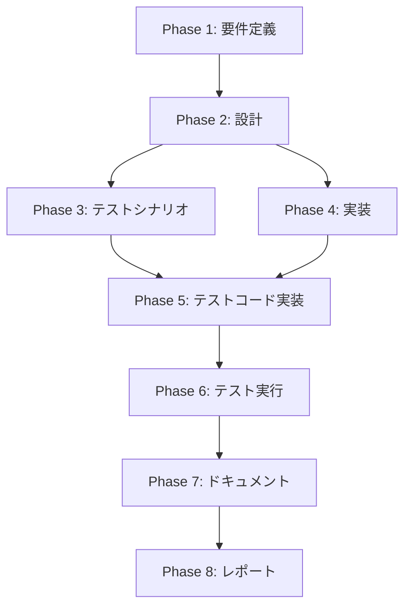

# Codex Agent 実行ログ

開始日時: 2025/12/25 5:58:14

---

## Turn 1: スレッド開始

**Thread ID**: `[REDACTED_TOKEN]`

## Turn 2: ツール実行

**種別**: reasoning
**ステータス**: completed

## Turn 3: ツール実行

**種別**: コマンド実行
**コマンド**: `/bin/bash -lc pwd`
**ステータス**: completed (exit_code=0)

```text
/tmp/[REDACTED_TOKEN]/ai-workflow-agent
```

## Turn 4: ツール実行

**種別**: reasoning
**ステータス**: completed

## Turn 5: ツール実行

**種別**: コマンド実行
**コマンド**: `/bin/bash -lc ls`
**ステータス**: completed (exit_code=0)

```text
ARCHITECTURE.md
CHANGELOG.md
CLAUDE.md
[REDACTED_TOKEN].md
[REDACTED_TOKEN].md
CODEBASE_SUMMARY.md
DOCKER_AUTH_SETUP.md
Dockerfile
Jenkinsfile
LICENSE
PROGRESS.md
README.md
ROADMAP.md
SETUP_TYPESCRIPT.md
TROUBLESHOOTING.md
__mocks__
docs
examples
jenkins
jest.config.cjs
metadata.json.template
node_modules
package-lock.json
package.json
scripts
src
tests
tmp
tsconfig.json
tsconfig.test.json
```

## Turn 6: ツール実行

**種別**: reasoning
**ステータス**: completed

## Turn 7: ツール実行

**種別**: コマンド実行
**コマンド**: `/bin/bash -lc 'rg --files | rg -i planning'`
**ステータス**: failed (exit_code=127)

```text
/bin/bash: line 1: rg: command not found
/bin/bash: line 1: rg: command not found
```

## Turn 8: ツール実行

**種別**: reasoning
**ステータス**: completed

## Turn 9: ツール実行

**種別**: コマンド実行
**コマンド**: `/bin/bash -lc "find . -name '*Planning*' -maxdepth 4"`
**ステータス**: completed (exit_code=0)

## Turn 10: ツール実行

**種別**: reasoning
**ステータス**: completed

## Turn 11: ツール実行

**種別**: コマンド実行
**コマンド**: `/bin/bash -lc 'ls .ai-workflow'`
**ステータス**: completed (exit_code=0)

```text
issue-10
issue-102
issue-104
issue-105
issue-108
issue-113
issue-115
issue-119
issue-126
issue-127
issue-128
issue-140
issue-144
issue-150
issue-153
issue-155
issue-16
issue-161
issue-165
issue-174
issue-177
issue-18
issue-184
issue-188
issue-194
issue-2
issue-200
issue-207
issue-208
issue-211
issue-212
issue-216
issue-22
issue-225
issue-23
issue-238
issue-24
issue-243
issue-248
issue-25
issue-253
issue-259
issue-26
issue-261
issue-271
issue-38
issue-45
issue-46
issue-47
issue-48
issue-49
issue-5
issue-50
issue-51
issue-512
issue-52
issue-54
issue-58
issue-61
issue-64
issue-7
issue-73
issue-74
issue-90
issue-91
```

## Turn 12: ツール実行

**種別**: reasoning
**ステータス**: completed

## Turn 13: ツール実行

**種別**: コマンド実行
**コマンド**: `/bin/bash -lc 'ls .ai-workflow/issue-512'`
**ステータス**: completed (exit_code=0)

```text
00_planning
01_requirements
02_design
03_test_scenario
04_implementation
[REDACTED_TOKEN]
06_testing
metadata.json
```

## Turn 14: ツール実行

**種別**: reasoning
**ステータス**: completed

## Turn 15: ツール実行

**種別**: コマンド実行
**コマンド**: `/bin/bash -lc 'ls .ai-workflow/issue-512/00_planning'`
**ステータス**: completed (exit_code=0)

```text
execute
output
review
revise
```

## Turn 16: ツール実行

**種別**: reasoning
**ステータス**: completed

## Turn 17: ツール実行

**種別**: コマンド実行
**コマンド**: `/bin/bash -lc 'ls .ai-workflow/issue-512/00_planning/output'`
**ステータス**: completed (exit_code=0)

```text
planning.md
```

## Turn 18: ツール実行

**種別**: reasoning
**ステータス**: completed

## Turn 19: ツール実行

**種別**: コマンド実行
**コマンド**: `/bin/bash -lc 'cat .ai-workflow/issue-512/06_testing/output/test-result.md'`
**ステータス**: completed (exit_code=0)

```text
# テスト実行結果

## テスト結果サマリー
- 総テスト数: 558件
- 成功: 205件
- 失敗: 334件
- 成功率: 36.7%

以下のテストが失敗しました。

### `tests/integration/squash-workflow.test.ts`
- **エラー**: EACCES: permission denied, mkdir '/test'
- **スタックトレース**:
  ```
  Error: EACCES: permission denied, mkdir '/test'
    at SquashManager.squashCommits (src/core/git/squash-manager.ts:124:16)
    at Object.<anonymous> (tests/integration/squash-workflow.test.ts:130:7)
  ```

### `tests/integration/[REDACTED_TOKEN].test.ts`
- **エラー**: metadata.json not found: /test/.ai-workflow/issue-26/metadata.json
- **スタックトレース**:
  ```
  Error: metadata.json not found: /test/.ai-workflow/issue-26/metadata.json
    at Function.load (src/core/workflow-state.ts:67:13)
    at new MetadataManager (src/core/metadata-manager.ts:43:32)
    at Object.<anonymous> (tests/integration/[REDACTED_TOKEN].test.ts:103:23)
  ```

### `tests/integration/jenkins/[REDACTED_TOKEN].test.ts`
- **エラー**: TypeError: The "cb" argument must be of type function. Received type string ('utf-8')
- **スタックトレース**:
  ```
  TypeError: The "cb" argument must be of type function. Received type string ('utf-8')
    at Object.<anonymous> (tests/integration/jenkins/[REDACTED_TOKEN].test.ts:23:35)
  ```

### `tests/integration/jenkins/[REDACTED_TOKEN].test.ts`
- **エラー**: TypeError: The "cb" argument must be of type function. Received type string ('utf-8')
- **スタックトレース**:
  ```
  TypeError: The "cb" argument must be of type function. Received type string ('utf-8')
    at Object.<anonymous> (tests/integration/jenkins/[REDACTED_TOKEN].test.ts:24:32)
  ```

### その他
- **エラー**: Cannot log after tests are done. Did you forget to wait for something async in your test?
- **スタックトレース**:
  ```
  Cannot log after tests are done.
    at log (src/utils/logger.ts:123:17)
    at CodexAgentClient.logEvent (src/core/codex-agent-client.ts:258:14)
  ```
```

## Turn 20: ツール実行

**種別**: reasoning
**ステータス**: completed

## Turn 21: ツール実行

**種別**: コマンド実行
**コマンド**: `/bin/bash -lc 'cat .ai-workflow/issue-512/03_test_scenario/output/test-scenario.md'`
**ステータス**: completed (exit_code=0)

```text
# テストシナリオ: Issue #512

## Jenkins Webhook仕様に合わせてペイロードを拡張（build_url, branch_name, pr_url等を追加）

---

## 1. テスト戦略サマリー

### 1.1 選択されたテスト戦略

**テスト戦略**: INTEGRATION_ONLY

**判断根拠**:
- JenkinsパイプラインのGroovyコードは、Groovyランタイム依存のため単体テストが困難
- 静的解析（正規表現マッチング、パターン検証）による統合テストが最も効果的
- 既存の`tests/integration/jenkins/[REDACTED_TOKEN].test.ts`が存在し、静的解析パターンが確立済み
- 実際のHTTP通信はJenkins環境でのみ検証可能

### 1.2 テスト対象の範囲

| 対象コンポーネント | テスト内容 |
|------------------|----------|
| `jenkins/shared/common.groovy` | `sendWebhook()`関数のシグネチャ変更、新規フィールド追加、ペイロード構築ロジック |
| 8つのJenkinsfile | 新しいMap型呼び出しパターン、各ステータスでの適切なフィールド送信 |
| `jenkins/README.md` | 新規Webhookフィールドのドキュメント記載 |

### 1.3 テストの目的

1. `sendWebhook()`関数がMap型config引数を受け取ることを検証
2. 新規フィールド（build_url, branch_name, pr_url, finished_at, logs_url）がペイロード構築ロジックに含まれることを検証
3. オプショナルフィールドの条件付き追加ロジックを検証
4. ISO 8601タイムスタンプ形式が正しく使用されることを検証
5. 8つのJenkinsfileすべてで新しい呼び出しパターンが適用されていることを検証
6. 既存のテスト（IT-001〜IT-018）が継続して成功することを確認

---

## 2. 統合テストシナリオ

### 2.1 common.groovy sendWebhook()関数の検証

#### IT-019: sendWebhook()がMap型config引数を受け取ること

- **目的**: 関数シグネチャが位置引数からMap型引数に変更されていることを検証
- **前提条件**: `jenkins/shared/common.groovy`ファイルが存在する
- **テスト手順**:
  1. common.groovyファイルを読み込む
  2. `def sendWebhook(Map config)`パターンを検索
- **期待結果**: シグネチャが`def sendWebhook(Map config)`にマッチする
- **確認項目**:
  - [x] Map型引数`config`が宣言されている
  - [x] 旧シグネチャ（位置引数5つ）が削除されている

**テストコード例**:
```typescript
it('should have Map type parameter in function signature', () => {
  expect(commonContent).toMatch(/def sendWebhook\s*\(\s*Map\s+config\s*\)/);
});
```

#### IT-020: build_urlフィールドがペイロードに追加されること

- **目的**: build_urlフィールドがペイロード構築ロジックに含まれることを検証
- **前提条件**: common.groovyのsendWebhook()関数が存在する
- **テスト手順**:
  1. sendWebhook()関数のコードブロックを抽出
  2. `build_url`フィールドの追加ロジックを検索
- **期待結果**: `if (config.buildUrl?.trim()) { payload.build_url = config.buildUrl }`相当のパターンが存在
- **確認項目**:
  - [x] config.buildUrlからpayload.build_urlへの代入が存在
  - [x] 条件付き追加（空チェック）が実装されている

**テストコード例**:
```typescript
it('should add build_url field to payload when provided', () => {
  const sendWebhookBlock = getSendWebhookBlock();
  expect(sendWebhookBlock).toMatch(/if\s*\(\s*config\.buildUrl/);
  expect(sendWebhookBlock).toMatch(/payload\.build_url\s*=\s*config\.buildUrl/);
});
```

#### IT-021: branch_nameフィールドがペイロードに追加されること

- **目的**: branch_nameフィールドがペイロード構築ロジックに含まれることを検証
- **前提条件**: common.groovyのsendWebhook()関数が存在する
- **テスト手順**:
  1. sendWebhook()関数のコードブロックを抽出
  2. `branch_name`フィールドの追加ロジックを検索
- **期待結果**: `if (config.branchName?.trim()) { payload.branch_name = config.branchName }`相当のパターンが存在
- **確認項目**:
  - [x] config.branchNameからpayload.branch_nameへの代入が存在
  - [x] 条件付き追加（空チェック）が実装されている

**テストコード例**:
```typescript
it('should add branch_name field to payload when provided', () => {
  const sendWebhookBlock = getSendWebhookBlock();
  expect(sendWebhookBlock).toMatch(/if\s*\(\s*config\.branchName/);
  expect(sendWebhookBlock).toMatch(/payload\.branch_name\s*=\s*config\.branchName/);
});
```

#### IT-022: pr_urlフィールドがペイロードに追加されること

- **目的**: pr_urlフィールドがペイロード構築ロジックに含まれることを検証
- **前提条件**: common.groovyのsendWebhook()関数が存在する
- **テスト手順**:
  1. sendWebhook()関数のコードブロックを抽出
  2. `pr_url`フィールドの追加ロジックを検索
- **期待結果**: `if (config.prUrl?.trim()) { payload.pr_url = config.prUrl }`相当のパターンが存在
- **確認項目**:
  - [x] config.prUrlからpayload.pr_urlへの代入が存在
  - [x] 条件付き追加（空チェック）が実装されている

**テストコード例**:
```typescript
it('should add pr_url field to payload when provided', () => {
  const sendWebhookBlock = getSendWebhookBlock();
  expect(sendWebhookBlock).toMatch(/if\s*\(\s*config\.prUrl/);
  expect(sendWebhookBlock).toMatch(/payload\.pr_url\s*=\s*config\.prUrl/);
});
```

#### IT-023: finished_atフィールドがペイロードに追加されること

- **目的**: finished_atフィールドがペイロード構築ロジックに含まれることを検証
- **前提条件**: common.groovyのsendWebhook()関数が存在する
- **テスト手順**:
  1. sendWebhook()関数のコードブロックを抽出
  2. `finished_at`フィールドの追加ロジックを検索
- **期待結果**: `if (config.finishedAt?.trim()) { payload.finished_at = config.finishedAt }`相当のパターンが存在
- **確認項目**:
  - [x] config.finishedAtからpayload.finished_a
... (truncated)
```

## Turn 22: ツール実行

**種別**: reasoning
**ステータス**: completed

## Turn 23: ツール実行

**種別**: コマンド実行
**コマンド**: `/bin/bash -lc 'grep -n "Phase 6" -n .ai-workflow/issue-512/00_planning/output/planning.md'`
**ステータス**: completed (exit_code=0)

```text
178:### Phase 6: テスト実行 (見積もり: 1h)
211:    P5 --> P6[Phase 6: テスト実行]
305:### Phase 6: テスト実行
```

## Turn 24: ツール実行

**種別**: reasoning
**ステータス**: completed

## Turn 25: ツール実行

**種別**: コマンド実行
**コマンド**: `/bin/bash -lc "sed -n '160,260p' .ai-workflow/issue-512/00_planning/output/planning.md"`
**ステータス**: completed (exit_code=0)

```text
- preset/Jenkinsfile: running/success/failed呼び出しの更新
  - single-phase/Jenkinsfile: running/success/failed呼び出しの更新
  - rollback/Jenkinsfile: running/success/failed呼び出しの更新
  - auto-issue/Jenkinsfile: running/success/failed呼び出しの更新
  - finalize/Jenkinsfile: running/success/failed呼び出しの更新
  - pr-comment-execute/Jenkinsfile: running/success/failed呼び出しの更新
  - pr-comment-finalize/Jenkinsfile: running/success/failed呼び出しの更新

### Phase 5: テストコード実装 (見積もり: 2〜3h)

- [x] Task 5-1: 統合テストの拡張 (2〜3h)
  - [REDACTED_TOKEN].test.tsに新規describeブロック追加
  - Map型シグネチャの検証テスト
  - 新規フィールド（build_url等）の存在確認テスト
  - オプショナルフィールドの条件付き追加ロジック検証
  - ISO 8601形式の正規表現マッチング検証
  - PR URL取得パターン（jq使用）の検証

### Phase 6: テスト実行 (見積もり: 1h)

- [ ] Task 6-1: 全テスト実行と検証 (1h)
  - npm run test:integration の実行
  - 新規テストケースの成功確認
  - 既存テストケース（IT-001〜IT-018）の継続成功確認
  - カバレッジレポートの確認

### Phase 7: ドキュメント (見積もり: 0.5h)

- [ ] Task 7-1: jenkins/README.mdの更新 (0.5h)
  - 新規Webhookフィールドの説明追加
  - 各ステータスでの送信フィールド一覧表の追加
  - 使用例の更新

### Phase 8: レポート (見積もり: 0.5h)

- [ ] Task 8-1: 実装レポート作成 (0.5h)
  - 変更ファイル一覧の作成
  - テスト結果サマリー
  - Issue #505からの変更点まとめ

---

## 5. 依存関係



**並列実行可能なタスク**:
- Phase 3とPhase 4は、Phase 2完了後に並列実行可能
- Task 4-1（common.groovy）とTask 4-2（Jenkinsfile）は順次実行（4-1が前提）

---

## 6. リスクと軽減策

### リスク1: 後方互換性の破壊

- **影響度**: 高
- **確率**: 低
- **説明**: 既存の`sendWebhook()`呼び出しが新シグネチャで動作しなくなる可能性
- **軽減策**:
  - 全Jenkinsfileを同時に更新することで整合性を確保
  - 既存テスト（IT-001〜IT-018）の継続成功を確認
  - Map型引数への移行により、将来の拡張も容易に

### リスク2: PR URL取得の失敗

- **影響度**: 中
- **確率**: 中
- **説明**: metadata.jsonが存在しない、またはpr_urlフィールドがない場合
- **軽減策**:
  - jqコマンドで`// empty`フォールバックを使用
  - 空文字列の場合はペイロードに含めない設計
  - エラー時もビルド全体を失敗させない（既存方針を継続）

### リスク3: タイムスタンプ形式の不一致

- **影響度**: 低
- **確率**: 低
- **説明**: ISO 8601形式がDevLoop Runner（Lavable）の期待と異なる
- **軽減策**:
  - 明確なフォーマット指定: `yyyy-MM-dd'T'HH:mm:ss.SSS'Z'`
  - UTCタイムゾーンを明示的に使用
  - テストで正規表現による形式検証

### リスク4: テストの静的解析限界

- **影響度**: 中
- **確率**: 低
- **説明**: Groovyコードの静的解析では実行時の挙動を完全に検証できない
- **軽減策**:
  - 既存のテストパターン（正規表現マッチング）を踏襲
```

## Turn 26: ツール実行

**種別**: reasoning
**ステータス**: completed

## Turn 27: ツール実行

**種別**: コマンド実行
**コマンド**: `/bin/bash -lc "sed -n '280,360p' .ai-workflow/issue-512/00_planning/output/planning.md"`
**ステータス**: completed (exit_code=0)

```text
- [x] テストコード戦略（EXTEND_TEST）の判断根拠が明記されている
- [x] `sendWebhook(Map config)`のAPI仕様が定義されている
- [x] 各Jenkinsfileでの呼び出しパターンが統一されている

### Phase 3: テストシナリオ

- [x] 新規フィールドの検証シナリオが定義されている（IT-019〜）
- [x] 各ステータスでの送信条件シナリオがカバーされている
- [x] ISO 8601形式の検証シナリオが含まれている
- [x] オプショナルフィールドの条件付き追加シナリオが含まれている

### Phase 4: 実装

- [ ] `jenkins/shared/common.groovy`の`sendWebhook()`がMap型引数に変更されている
- [ ] 5つの新規フィールドがペイロード構築ロジックに含まれている
- [ ] 8つのJenkinsfileすべてで新しい呼び出しパターンが適用されている
- [ ] オプショナルフィールドは存在する場合のみ追加される

### Phase 5: テストコード実装

- [ ] `[REDACTED_TOKEN].test.ts`に新規テストケースが追加されている
- [ ] Map型シグネチャの検証テストが実装されている
- [ ] 新規フィールドの存在確認テストが実装されている
- [ ] 既存テスト（IT-001〜IT-018）が変更されていない、または最小限の変更

### Phase 6: テスト実行

- [ ] 全統合テストが成功している
- [ ] 新規テストケースが成功している
- [ ] 既存テストケースが継続して成功している
- [ ] テストカバレッジが低下していない

### Phase 7: ドキュメント

- [ ] `jenkins/README.md`が更新されている
- [ ] 新規Webhookフィールドの説明が追加されている
- [ ] 使用例が最新の呼び出しパターンを反映している

### Phase 8: レポート

- [ ] 変更ファイル一覧が作成されている
- [ ] テスト結果サマリーが記載されている
- [ ] Issue #505からの変更点が明確に記載されている

---

## 補足情報

### Issue #505との関係

| 項目 | Issue #505 | Issue #512（本Issue） |
|-----|-----------|---------------------|
| 基本機能 | webhook送信の基盤実装 | #505の拡張 |
| フィールド | job_id, status, error | + build_url, branch_name, pr_url, finished_at, logs_url |
| シグネチャ | 位置引数（5つ） | Map型config引数 |
| テスト | IT-001〜IT-018 | IT-019〜（追加） |

### 対象Jenkinsfile一覧（Issueに記載の7ファイル + finalize）

1. `jenkins/jobs/pipeline/ai-workflow/all-phases/Jenkinsfile`
2. `jenkins/jobs/pipeline/ai-workflow/preset/Jenkinsfile`
3. `jenkins/jobs/pipeline/ai-workflow/single-phase/Jenkinsfile`
4. `jenkins/jobs/pipeline/ai-workflow/rollback/Jenkinsfile`
5. `jenkins/jobs/pipeline/ai-workflow/auto-issue/Jenkinsfile`
6. `jenkins/jobs/pipeline/ai-workflow/finalize/Jenkinsfile`
7. `jenkins/jobs/pipeline/ai-workflow/pr-comment-execute/Jenkinsfile`
8. `jenkins/jobs/pipeline/ai-workflow/pr-comment-finalize/Jenkinsfile`

### 技術的考慮事項（Issueから引用）

1. **PR URL取得**: metadata.jsonから`pr_url`を取得（jq使用）
2. **タイムスタンプ生成**: ISO 8601形式（`yyyy-MM-dd'T'HH:mm:ss.SSS'Z'`）、UTC
3. **エラーハンドリング**: webhook送信失敗時はログ出力のみ（ビルド全体を失敗させない）
4. **オプショナルフィールド**: 存在する場合のみペイロードに追加

---

## 品質ゲート（Phase 0）チェックリスト

- [x] **実装戦略が明確に決定されている**: EXTEND
- [x] **テスト戦略が明確に決定されている**: INTEGRATION_ONLY
```

## Turn 28: ツール実行

**種別**: reasoning
**ステータス**: completed

## Turn 29: ツール実行

**種別**: reasoning
**ステータス**: completed

## Turn 30: ツール実行

**種別**: reasoning
**ステータス**: completed

## Turn 31: ツール実行

**種別**: reasoning
**ステータス**: completed

## Turn 32: ツール実行

**種別**: コマンド実行
**コマンド**: `/bin/bash -lc "nl -ba .ai-workflow/issue-512/06_testing/output/test-result.md | sed -n '1,200p'"`
**ステータス**: completed (exit_code=0)

```text
1	# テスト実行結果
     2	
     3	## テスト結果サマリー
     4	- 総テスト数: 558件
     5	- 成功: 205件
     6	- 失敗: 334件
     7	- 成功率: 36.7%
     8	
     9	以下のテストが失敗しました。
    10	
    11	### `tests/integration/squash-workflow.test.ts`
    12	- **エラー**: EACCES: permission denied, mkdir '/test'
    13	- **スタックトレース**:
    14	  ```
    15	  Error: EACCES: permission denied, mkdir '/test'
    16	    at SquashManager.squashCommits (src/core/git/squash-manager.ts:124:16)
    17	    at Object.<anonymous> (tests/integration/squash-workflow.test.ts:130:7)
    18	  ```
    19	
    20	### `tests/integration/[REDACTED_TOKEN].test.ts`
    21	- **エラー**: metadata.json not found: /test/.ai-workflow/issue-26/metadata.json
    22	- **スタックトレース**:
    23	  ```
    24	  Error: metadata.json not found: /test/.ai-workflow/issue-26/metadata.json
    25	    at Function.load (src/core/workflow-state.ts:67:13)
    26	    at new MetadataManager (src/core/metadata-manager.ts:43:32)
    27	    at Object.<anonymous> (tests/integration/[REDACTED_TOKEN].test.ts:103:23)
    28	  ```
    29	
    30	### `tests/integration/jenkins/[REDACTED_TOKEN].test.ts`
    31	- **エラー**: TypeError: The "cb" argument must be of type function. Received type string ('utf-8')
    32	- **スタックトレース**:
    33	  ```
    34	  TypeError: The "cb" argument must be of type function. Received type string ('utf-8')
    35	    at Object.<anonymous> (tests/integration/jenkins/[REDACTED_TOKEN].test.ts:23:35)
    36	  ```
    37	
    38	### `tests/integration/jenkins/[REDACTED_TOKEN].test.ts`
    39	- **エラー**: TypeError: The "cb" argument must be of type function. Received type string ('utf-8')
    40	- **スタックトレース**:
    41	  ```
    42	  TypeError: The "cb" argument must be of type function. Received type string ('utf-8')
    43	    at Object.<anonymous> (tests/integration/jenkins/[REDACTED_TOKEN].test.ts:24:32)
    44	  ```
    45	
    46	### その他
    47	- **エラー**: Cannot log after tests are done. Did you forget to wait for something async in your test?
    48	- **スタックトレース**:
    49	  ```
    50	  Cannot log after tests are done.
    51	    at log (src/utils/logger.ts:123:17)
    52	    at CodexAgentClient.logEvent (src/core/codex-agent-client.ts:258:14)
    53	  ```
```

## Turn 33: ツール実行

**種別**: reasoning
**ステータス**: completed

## Turn 34: ツール実行

**種別**: コマンド実行
**コマンド**: `/bin/bash -lc "nl -ba .ai-workflow/issue-512/00_planning/output/planning.md | sed -n '170,220p'"`
**ステータス**: completed (exit_code=0)

```text
170	- [x] Task 5-1: 統合テストの拡張 (2〜3h)
   171	  - [REDACTED_TOKEN].test.tsに新規describeブロック追加
   172	  - Map型シグネチャの検証テスト
   173	  - 新規フィールド（build_url等）の存在確認テスト
   174	  - オプショナルフィールドの条件付き追加ロジック検証
   175	  - ISO 8601形式の正規表現マッチング検証
   176	  - PR URL取得パターン（jq使用）の検証
   177	
   178	### Phase 6: テスト実行 (見積もり: 1h)
   179	
   180	- [ ] Task 6-1: 全テスト実行と検証 (1h)
   181	  - npm run test:integration の実行
   182	  - 新規テストケースの成功確認
   183	  - 既存テストケース（IT-001〜IT-018）の継続成功確認
   184	  - カバレッジレポートの確認
   185	
   186	### Phase 7: ドキュメント (見積もり: 0.5h)
   187	
   188	- [ ] Task 7-1: jenkins/README.mdの更新 (0.5h)
   189	  - 新規Webhookフィールドの説明追加
   190	  - 各ステータスでの送信フィールド一覧表の追加
   191	  - 使用例の更新
   192	
   193	### Phase 8: レポート (見積もり: 0.5h)
   194	
   195	- [ ] Task 8-1: 実装レポート作成 (0.5h)
   196	  - 変更ファイル一覧の作成
   197	  - テスト結果サマリー
   198	  - Issue #505からの変更点まとめ
   199	
   200	---
   201	
   202	## 5. 依存関係
   203	
   204	```mermaid
   205	graph TD
   206	    P1[Phase 1: 要件定義] --> P2[Phase 2: 設計]
   207	    P2 --> P3[Phase 3: テストシナリオ]
   208	    P2 --> P4[Phase 4: 実装]
   209	    P3 --> P5[Phase 5: テストコード実装]
   210	    P4 --> P5
   211	    P5 --> P6[Phase 6: テスト実行]
   212	    P6 --> P7[Phase 7: ドキュメント]
   213	    P7 --> P8[Phase 8: レポート]
   214	```
   215	
   216	**並列実行可能なタスク**:
   217	- Phase 3とPhase 4は、Phase 2完了後に並列実行可能
   218	- Task 4-1（common.groovy）とTask 4-2（Jenkinsfile）は順次実行（4-1が前提）
   219	
   220	---
```

## Turn 35: ツール実行

**種別**: reasoning
**ステータス**: completed

## Turn 36: ツール実行

**種別**: コマンド実行
**コマンド**: `/bin/bash -lc "nl -ba .ai-workflow/issue-512/00_planning/output/planning.md | sed -n '260,340p'"`
**ステータス**: completed (exit_code=0)

```text
260	  - 既存のテストパターン（正規表現マッチング）を踏襲
   261	  - コードパターンの一貫性を重視した実装
   262	  - 本番環境での動作確認はJenkins統合テストで実施
   263	
   264	---
   265	
   266	## 7. 品質ゲート
   267	
   268	### Phase 1: 要件定義
   269	
   270	- [x] 機能要件が明確に記載されている
   271	- [x] 新規フィールド（5項目）の仕様が定義されている
   272	- [x] 各ステータスでの送信条件が明確化されている
   273	- [x] 受け入れ基準が定義されている
   274	- [x] 後方互換性の要件が確認されている
   275	
   276	### Phase 2: 設計
   277	
   278	- [x] 実装戦略（EXTEND）の判断根拠が明記されている
   279	- [x] テスト戦略（INTEGRATION_ONLY）の判断根拠が明記されている
   280	- [x] テストコード戦略（EXTEND_TEST）の判断根拠が明記されている
   281	- [x] `sendWebhook(Map config)`のAPI仕様が定義されている
   282	- [x] 各Jenkinsfileでの呼び出しパターンが統一されている
   283	
   284	### Phase 3: テストシナリオ
   285	
   286	- [x] 新規フィールドの検証シナリオが定義されている（IT-019〜）
   287	- [x] 各ステータスでの送信条件シナリオがカバーされている
   288	- [x] ISO 8601形式の検証シナリオが含まれている
   289	- [x] オプショナルフィールドの条件付き追加シナリオが含まれている
   290	
   291	### Phase 4: 実装
   292	
   293	- [ ] `jenkins/shared/common.groovy`の`sendWebhook()`がMap型引数に変更されている
   294	- [ ] 5つの新規フィールドがペイロード構築ロジックに含まれている
   295	- [ ] 8つのJenkinsfileすべてで新しい呼び出しパターンが適用されている
   296	- [ ] オプショナルフィールドは存在する場合のみ追加される
   297	
   298	### Phase 5: テストコード実装
   299	
   300	- [ ] `[REDACTED_TOKEN].test.ts`に新規テストケースが追加されている
   301	- [ ] Map型シグネチャの検証テストが実装されている
   302	- [ ] 新規フィールドの存在確認テストが実装されている
   303	- [ ] 既存テスト（IT-001〜IT-018）が変更されていない、または最小限の変更
   304	
   305	### Phase 6: テスト実行
   306	
   307	- [ ] 全統合テストが成功している
   308	- [ ] 新規テストケースが成功している
   309	- [ ] 既存テストケースが継続して成功している
   310	- [ ] テストカバレッジが低下していない
   311	
   312	### Phase 7: ドキュメント
   313	
   314	- [ ] `jenkins/README.md`が更新されている
   315	- [ ] 新規Webhookフィールドの説明が追加されている
   316	- [ ] 使用例が最新の呼び出しパターンを反映している
   317	
   318	### Phase 8: レポート
   319	
   320	- [ ] 変更ファイル一覧が作成されている
   321	- [ ] テスト結果サマリーが記載されている
   322	- [ ] Issue #505からの変更点が明確に記載されている
   323	
   324	---
   325	
   326	## 補足情報
   327	
   328	### Issue #505との関係
   329	
   330	| 項目 | Issue #505 | Issue #512（本Issue） |
   331	|-----|-----------|---------------------|
   332	| 基本機能 | webhook送信の基盤実装 | #505の拡張 |
   333	| フィールド | job_id, status, error | + build_url, branch_name, pr_url, finished_at, logs_url |
   334	| シグネチャ | 位置引数（5つ） | Map型config引数 |
   335	| テスト | IT-001〜IT-018 | IT-019〜（追加） |
   336	
   337	### 対象Jenkinsfile一覧（Issueに記載の7ファイル + finalize）
   338	
   339	1. `jenkins/jobs/pipeline/ai-workflow/all-phases/Jenkinsfile`
   340	2. `jenkins/jobs/pipeline/ai-workflow/preset/Jenkinsfile`
```

## Turn 37: ツール実行

**種別**: reasoning
**ステータス**: completed

## Turn 38: ツール実行

**種別**: コマンド実行
**コマンド**: `/bin/bash -lc "nl -ba .ai-workflow/issue-512/03_test_scenario/output/test-scenario.md | sed -n '1,200p'"`
**ステータス**: completed (exit_code=0)

```text
1	# テストシナリオ: Issue #512
     2	
     3	## Jenkins Webhook仕様に合わせてペイロードを拡張（build_url, branch_name, pr_url等を追加）
     4	
     5	---
     6	
     7	## 1. テスト戦略サマリー
     8	
     9	### 1.1 選択されたテスト戦略
    10	
    11	**テスト戦略**: INTEGRATION_ONLY
    12	
    13	**判断根拠**:
    14	- JenkinsパイプラインのGroovyコードは、Groovyランタイム依存のため単体テストが困難
    15	- 静的解析（正規表現マッチング、パターン検証）による統合テストが最も効果的
    16	- 既存の`tests/integration/jenkins/[REDACTED_TOKEN].test.ts`が存在し、静的解析パターンが確立済み
    17	- 実際のHTTP通信はJenkins環境でのみ検証可能
    18	
    19	### 1.2 テスト対象の範囲
    20	
    21	| 対象コンポーネント | テスト内容 |
    22	|------------------|----------|
    23	| `jenkins/shared/common.groovy` | `sendWebhook()`関数のシグネチャ変更、新規フィールド追加、ペイロード構築ロジック |
    24	| 8つのJenkinsfile | 新しいMap型呼び出しパターン、各ステータスでの適切なフィールド送信 |
    25	| `jenkins/README.md` | 新規Webhookフィールドのドキュメント記載 |
    26	
    27	### 1.3 テストの目的
    28	
    29	1. `sendWebhook()`関数がMap型config引数を受け取ることを検証
    30	2. 新規フィールド（build_url, branch_name, pr_url, finished_at, logs_url）がペイロード構築ロジックに含まれることを検証
    31	3. オプショナルフィールドの条件付き追加ロジックを検証
    32	4. ISO 8601タイムスタンプ形式が正しく使用されることを検証
    33	5. 8つのJenkinsfileすべてで新しい呼び出しパターンが適用されていることを検証
    34	6. 既存のテスト（IT-001〜IT-018）が継続して成功することを確認
    35	
    36	---
    37	
    38	## 2. 統合テストシナリオ
    39	
    40	### 2.1 common.groovy sendWebhook()関数の検証
    41	
    42	#### IT-019: sendWebhook()がMap型config引数を受け取ること
    43	
    44	- **目的**: 関数シグネチャが位置引数からMap型引数に変更されていることを検証
    45	- **前提条件**: `jenkins/shared/common.groovy`ファイルが存在する
    46	- **テスト手順**:
    47	  1. common.groovyファイルを読み込む
    48	  2. `def sendWebhook(Map config)`パターンを検索
    49	- **期待結果**: シグネチャが`def sendWebhook(Map config)`にマッチする
    50	- **確認項目**:
    51	  - [x] Map型引数`config`が宣言されている
    52	  - [x] 旧シグネチャ（位置引数5つ）が削除されている
    53	
    54	**テストコード例**:
    55	```typescript
    56	it('should have Map type parameter in function signature', () => {
    57	  expect(commonContent).toMatch(/def sendWebhook\s*\(\s*Map\s+config\s*\)/);
    58	});
    59	```
    60	
    61	#### IT-020: build_urlフィールドがペイロードに追加されること
    62	
    63	- **目的**: build_urlフィールドがペイロード構築ロジックに含まれることを検証
    64	- **前提条件**: common.groovyのsendWebhook()関数が存在する
    65	- **テスト手順**:
    66	  1. sendWebhook()関数のコードブロックを抽出
    67	  2. `build_url`フィールドの追加ロジックを検索
    68	- **期待結果**: `if (config.buildUrl?.trim()) { payload.build_url = config.buildUrl }`相当のパターンが存在
    69	- **確認項目**:
    70	  - [x] config.buildUrlからpayload.build_urlへの代入が存在
    71	  - [x] 条件付き追加（空チェック）が実装されている
    72	
    73	**テストコード例**:
    74	```typescript
    75	it('should add build_url field to payload when provided', () => {
    76	  const sendWebhookBlock = getSendWebhookBlock();
    77	  expect(sendWebhookBlock).toMatch(/if\s*\(\s*config\.buildUrl/);
    78	  expect(sendWebhookBlock).toMatch(/payload\.build_url\s*=\s*config\.buildUrl/);
    79	});
    80	```
    81	
    82	#### IT-021: branch_nameフィールドがペイロードに追加されること
    83	
    84	- **目的**: branch_nameフィールドがペイロード構築ロジックに含まれることを検証
    85	- **前提条件**: common.groovyのsendWebhook()関数が存在する
    86	- **テスト手順**:
    87	  1. sendWebhook()関数のコードブロックを抽出
    88	  2. `branch_name`フィールドの追加ロジックを検索
    89	- **期待結果**: `if (config.branchName?.trim()) { payload.branch_name = config.branchName }`相当のパターンが存在
    90	- **確認項目**:
    91	  - [x] config.branchNameからpayload.branch_nameへの代入が存在
    92	  - [x] 条件付き追加（空チェック）が実装されている
    93	
    94	**テストコード例**:
    95	```typescript
    96	it('should add branch_name field to payload when provided', () => {
    97	  const sendWebhookBlock = getSendWebhookBlock();
    98	  expect(sendWebhookBlock).toMatch(/if\s*\(\s*config\.branchName/);
    99	  expect(sendWebhookBlock).toMatch(/payload\.branch_name\s*=\s*config\.branchName/);
   100	});
   101	```
   102	
   103	#### IT-022: pr_urlフィールドがペイロードに追加されること
   104	
   105	- **目的**: pr_urlフィールドがペイロード構築ロジックに含まれることを検証
   106	- **前提条件**: common.groovyのsendWebhook()関数が存在する
   107	- **テスト手順**:
   108	  1. sendWebhook()関数のコードブロックを抽出
   109	  2. `pr_url`フィールドの追加ロジックを検索
   110	- **期待結果**: `if (config.prUrl?.trim()) { payload.pr_url = config.prUr
... (truncated)
```

## Turn 39: ツール実行

**種別**: reasoning
**ステータス**: completed

## Turn 40: ツール実行

**種別**: reasoning
**ステータス**: completed

## Turn 41: ツール実行

**種別**: agent_message
**ステータス**: completed

## Turn 42: ツール実行

**種別**: todo_list
**ステータス**: completed

## Turn 43: 実行完了

**ステータス**: completed
**所要時間**: 118432ms
**ターン数**: N/A

---

**経過時間**: 118432ms
**開始**: 2025-12-25T05:58:14.301Z
**終了**: 2025-12-25T06:00:12.733Z