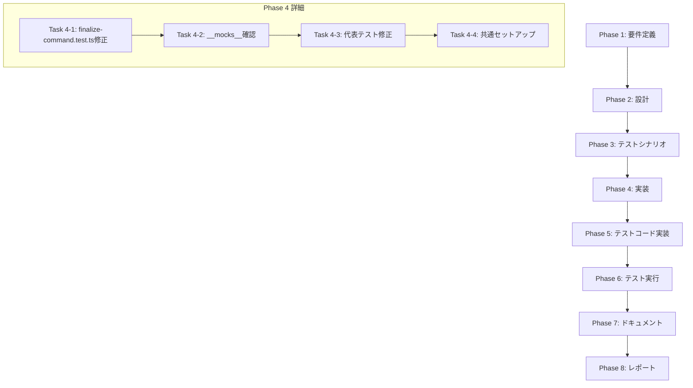

# プロジェクト計画書: Issue #518

## [FOLLOW-UP] #510: finalize-command.test・Jest モックの一貫したパターンをテスト

---

## 1. Issue分析

### 概要
Issue #510 の修正後のインテグレーションテスト `tests/integration/finalize-command.test.ts` が ESM 互換性のない Jest モックにより失敗している問題を解決する。また、テストスイート全体で Jest モックの書き方を統一し、CJS/ESM 混在環境でも安定して動く標準パターンを確立する。

### 複雑度: **中程度**

**判定根拠:**
- 対象ファイルは複数存在（1つのインテグレーションテスト + 複数の関連テストファイル）
- 既存のモックパターンの調査・分析が必要
- ESM/CJS 互換性という技術的な複雑さがある
- ただし、新規機能開発ではなく、既存コードのリファクタリングが中心

### 見積もり工数: **8〜12時間**

**内訳:**
- Task 1 (finalize-command.test.ts の修正): 2〜3時間
- Task 2 (モックパターン確立): 4〜6時間
- テスト実行・検証: 1〜2時間
- ドキュメント作成: 1時間

### リスク評価: **中**

**理由:**
- 既存テストへの影響範囲が広い可能性
- ESM/CJS 互換性問題は微妙な挙動の違いを生じさせる可能性
- モックパターン変更時に既存テストの期待値が変わる可能性

---

## 2. 実装戦略判断

### 実装戦略: **REFACTOR**

**判断根拠:**
- 新規ファイル作成ではなく、既存テストコードの構造改善が中心
- `tests/integration/finalize-command.test.ts` の既存モック記法を ESM 互換パターンに置き換える
- `__mocks__/fs-extra.ts` の既存コードを ESM 対応に修正
- 共通モックヘルパーの追加は可能だが、主な作業はリファクタリング

### テスト戦略: **INTEGRATION_ONLY**

**判断根拠:**
- 本 Issue の主目的はインテグレーションテスト `finalize-command.test.ts` の修正
- モックパターン変更の検証はインテグレーションテストで実施
- ユニットテストの追加は不要（既存テストのリファクタリングのみ）
- BDD テストは対象外（テストインフラの修正であり、ユーザーストーリーには直接関係しない）

### テストコード戦略: **EXTEND_TEST**

**判断根拠:**
- 新規テストファイル作成ではなく、既存テストファイルの修正
- `tests/integration/finalize-command.test.ts` のモック記法を ESM 互換に変更
- 代表的な他のテストファイルも同様に修正（パターン統一）
- 共通モックヘルパーを追加する場合は `tests/helpers/` に配置

---

## 3. 影響範囲分析

### 既存コードへの影響

#### 直接影響を受けるファイル:
1. **`tests/integration/finalize-command.test.ts`** (881行)
   - `jest.mock` を使用している箇所（6つのモック定義）
   - ESM 互換パターンへの変更が必要

2. **`__mocks__/fs-extra.ts`** (89行)
   - ESM 対応の確認・修正
   - default export と named export の両対応

#### 間接的に影響を受ける可能性のあるファイル:
- `tests/integration/cleanup-command.test.ts`
- `tests/integration/init-base-branch.test.ts`
- `tests/integration/preset-workflow.test.ts`
- `tests/integration/rollback-workflow.test.ts`
- その他 `jest.mock` を使用しているテストファイル（合計29ファイル）

### 依存関係の変更

**新規依存の追加**: なし

**既存依存への影響**:
- Jest 設定（`jest.config.cjs`）への変更は不要（既に ESM 対応済み）
- `package.json` のテストスクリプトは変更なし（既に `--experimental-vm-modules` 指定済み）

### マイグレーション要否: **不要**

- データベーススキーマ変更: なし
- 設定ファイル変更: なし
- 実行時の挙動変更: なし

---

## 4. タスク分割

### Phase 1: 要件定義 (見積もり: 0.5h)

- [x] Task 1-1: 現状のモックパターン調査 (0.5h)
  - 既存の `jest.mock` パターンを分類（同期 vs 非同期、`__esModule` 有無）
  - ESM 互換パターン（`jest.unstable_mockModule`）の使用状況確認
  - 問題のあるパターンと正常なパターンの特定

### Phase 2: 設計 (見積もり: 1.5h)

- [x] Task 2-1: ESM 互換モックパターンの標準化設計 (1h)
  - `jest.unstable_mockModule` + `beforeAll` + 動的インポートパターンの採用
  - `__esModule: true` の明示
  - `jest.requireActual` の併用方法の決定
  - 共通ヘルパー関数の設計（必要に応じて）

- [x] Task 2-2: 影響範囲の詳細分析 (0.5h)
  - 変更対象テストファイルの優先順位付け
  - リファクタリング順序の決定

### Phase 3: テストシナリオ (見積もり: 0.5h)

- [x] Task 3-1: 検証シナリオの定義 (0.5h)
  - `npm test -- tests/integration/finalize-command.test.ts` の成功確認
  - 変更した代表テストの実行確認
  - 全テストスイートのリグレッションテスト

### Phase 4: 実装 (見積もり: 4〜5h)

- [ ] Task 4-1: `finalize-command.test.ts` の ESM モック修正 (2h)
  - `jest.mock('fs-extra', ...)` を `jest.unstable_mockModule` パターンに変更
  - `jest.mock('simple-git', ...)` の修正
  - `jest.mock('../../src/core/repository-utils.js', ...)` の修正
  - `jest.mock('../../src/core/git-manager.js', ...)` の修正
  - `jest.mock('../../src/phases/cleanup/artifact-cleaner.js', ...)` の修正
  - `jest.mock('../../src/core/github-client.js', ...)` の修正
  - モジュールインポートを `beforeAll` 内の動的インポートに変更

- [ ] Task 4-2: `__mocks__/fs-extra.ts` の確認・修正 (0.5h)
  - ESM 互換性の確認
  - 必要に応じて `__esModule: true` の追加

- [ ] Task 4-3: 代表的なテストファイルのパターン統一 (1.5〜2h)
  - `tests/integration/cleanup-command.test.ts` の修正
  - `tests/unit/commands/finalize.test.ts` の確認・統一
  - その他影響度の高いテストファイルの修正

- [ ] Task 4-4: 共通セットアップの整理（オプション）(0.5h)
  - 共通モックヘルパー関数の作成（必要な場合）
  - `tests/helpers/` への配置

### Phase 5: テストコード実装 (見積もり: 0.5h)

- [ ] Task 5-1: テストパターンのドキュメント化 (0.5h)
  - モックガイドラインの作成（コード内コメントまたは別ドキュメント）
  - ESM/CJS 混在環境での推奨パターンの明文化

### Phase 6: テスト実行 (見積もり: 1.5h)

- [ ] Task 6-1: 対象テストの個別実行 (0.5h)
  - `npm test -- tests/integration/finalize-command.test.ts`
  - ESM モック関連の TypeError が発生しないことを確認

- [ ] Task 6-2: 変更した代表テストの実行 (0.5h)
  - 修正した各テストファイルの個別実行
  - モック初期化エラーがないことを確認

- [ ] Task 6-3: 全テストスイートの実行 (0.5h)
  - `npm test` で全テストを実行
  - リグレッションがないことを確認

### Phase 7: ドキュメント (見積もり: 1h)

- [ ] Task 7-1: モックガイドラインの作成 (1h)
  - ESM 対応モックパターンのガイドライン作成
  - テストディレクトリまたは CLAUDE.md への追記
  - サンプルコードの記載

### Phase 8: レポート (見積もり: 0.5h)

- [ ] Task 8-1: 実装レポートの作成 (0.5h)
  - 変更したファイル一覧
  - 確立したモックパターンの説明
  - 受け入れ基準の達成状況

---

## 5. 依存関係



---

## 6. リスクと軽減策

### リスク1: 既存テストの破壊
- **影響度**: 高
- **確率**: 中
- **軽減策**:
  - 変更前に全テストの現状を記録
  - 段階的に変更し、各段階でテスト実行
  - 既存の期待値（呼び出し回数・戻り値）が変わらないように注意

### リスク2: ESM/CJS 互換性の微妙な挙動の違い
- **影響度**: 中
- **確率**: 中
- **軽減策**:
  - 既に `jest.unstable_mockModule` を使用している正常なテストを参考にする
  - `tests/unit/pr-comment/finalize-command.test.ts` をテンプレートとして使用
  - 変更後は必ず `NODE_OPTIONS="--experimental-vm-modules"` で実行

### リスク3: モックの初期化タイミングの問題
- **影響度**: 高
- **確率**: 低
- **軽減策**:
  - `beforeAll` で非同期モック設定
  - モジュールインポートはモック設定後に実施
  - `beforeEach` でモックの状態をリセット

### リスク4: スコープクリープ（対象ファイルの増加）
- **影響度**: 中
- **確率**: 中
- **軽減策**:
  - Phase 4 の Task 4-1（finalize-command.test.ts）を最優先
  - Task 4-3 は代表的なファイルのみに限定
  - 全ファイルの完全統一は別 Issue で対応

---

## 7. 品質ゲート

### Phase 1: 要件定義
- [ ] 既存モックパターンの分類が完了している
- [ ] 問題のあるパターンが特定されている

### Phase 2: 設計
- [x] 実装戦略（REFACTOR）の判断根拠が明記されている
- [x] テスト戦略（INTEGRATION_ONLY）の判断根拠が明記されている
- [x] テストコード戦略（EXTEND_TEST）の判断根拠が明記されている
- [x] ESM 互換モックパターンが設計されている

### Phase 3: テストシナリオ
- [x] 検証シナリオが定義されている
- [x] 受け入れ基準に対応するテストケースが明確

### Phase 4: 実装
- [ ] `finalize-command.test.ts` のモック記法が ESM 互換に変更されている
- [ ] `__mocks__/fs-extra.ts` が ESM 対応している
- [ ] 代表的なテストファイルでパターンが統一されている

### Phase 5: テストコード実装
- [ ] モックガイドラインがコード内コメントまたは別ドキュメントに記載されている

### Phase 6: テスト実行
- [ ] `npm test -- tests/integration/finalize-command.test.ts` が成功する
- [ ] ESM モック関連の TypeError が発生しない
- [ ] 変更した代表テストでモック初期化エラーがない
- [ ] 全テストスイートでリグレッションがない

### Phase 7: ドキュメント
- [ ] ESM/CJS 混在を意識した統一的なモック手順が明文化されている
- [ ] サンプルコードが記載されている

### Phase 8: レポート
- [ ] 受け入れ基準の達成状況が確認されている
- [ ] 変更したファイル一覧が記載されている

---

## 受け入れ基準の対応表

| 受け入れ基準 | 対応タスク | 検証方法 |
|-------------|-----------|---------|
| `tests/integration/finalize-command.test.ts` が成功する | Task 4-1, Task 6-1 | `npm test -- tests/integration/finalize-command.test.ts` |
| 代表的な既存テストでモック初期化エラーなし | Task 4-3, Task 6-2 | 変更したテストの個別実行 |
| ESM/CJS 混在を意識した統一的なモック手順が明文化 | Task 5-1, Task 7-1 | ドキュメントレビュー |

---

## 参考情報

### 正常なモックパターン例（テンプレート）

`tests/unit/pr-comment/finalize-command.test.ts` より:

```typescript
import { describe, it, expect, beforeAll, beforeEach, jest } from '@jest/globals';

// モック関数の事前定義
const getRepoRootMock = jest.fn<() => Promise<string>>();
const parsePullRequestUrlMock = jest.fn(() => ({
  owner: 'owner',
  repo: 'repo',
  repositoryName: 'owner/repo',
  prNumber: 123,
}));

let handlePRCommentFinalizeCommand: (options: PRCommentFinalizeOptions) => Promise<void>;

beforeAll(async () => {
  // ESM 互換の非同期モック設定
  await jest.unstable_mockModule('../../../src/core/repository-utils.js', () => ({
    __esModule: true,
    getRepoRoot: getRepoRootMock,
    parsePullRequestUrl: parsePullRequestUrlMock,
    resolveRepoPathFromPrUrl: resolveRepoPathFromPrUrlMock,
  }));

  // モック設定後にモジュールをインポート
  const module = await import('../../../src/commands/pr-comment/finalize.js');
  handlePRCommentFinalizeCommand = module.handlePRCommentFinalizeCommand;
});

beforeEach(() => {
  jest.clearAllMocks();
  jest.restoreAllMocks();
  // モックの初期値設定
});
```

### 問題のあるパターン例（現在の finalize-command.test.ts）

```typescript
// 同期的な jest.mock - ESM では問題が発生する可能性
jest.mock('fs-extra', () => ({
  existsSync: jest.fn(),
  ensureDirSync: jest.fn(),
  // ...
}));

// モック設定前にインポート（ホイスティングに依存）
import fs from 'fs-extra';
```

---

## 関連リソース

- **元 Issue**: #510
- **Jest ESM ドキュメント**: https://jestjs.io/docs/ecmascript-modules
- **jest.unstable_mockModule API**: https://jestjs.io/docs/jest-object#jestunstable_mockmodulemodulename-factory-options

---

*作成日: 2025-01-20*
*作成者: AI Workflow Agent*
