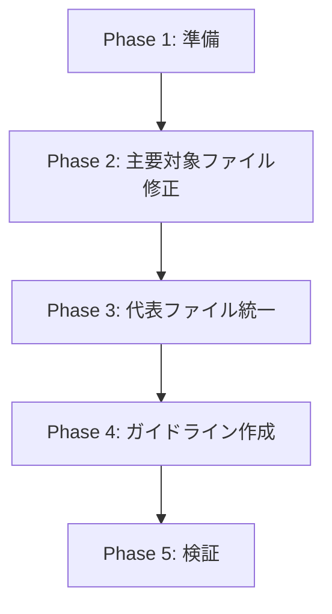

# 詳細設計書: Issue #518

## [FOLLOW-UP] #510: finalize-command.test.ts・Jest モックの一貫したパターン確立

---

## 0. Planning Document 確認

Planning Document（`.ai-workflow/issue-518/00_planning/output/planning.md`）と要件定義書（`.ai-workflow/issue-518/01_requirements/output/requirements.md`）に基づき、以下の設計を行う。

| 項目 | 決定事項 |
|------|----------|
| 実装戦略 | **REFACTOR** |
| テスト戦略 | **INTEGRATION_ONLY** |
| テストコード戦略 | **EXTEND_TEST** |
| 複雑度 | **中程度** |
| 見積もり工数 | **8〜12時間** |

---

## 1. アーキテクチャ設計

### 1.1 現状の問題構造

```
┌─────────────────────────────────────────────────────────────────────────┐
│                         Jest テスト実行環境                              │
│  ┌─────────────────────┐    ┌─────────────────────────────────────────┐ │
│  │   ESM モジュール     │    │        テストファイル群                  │ │
│  │ (experimental-vm)   │    │  ┌─────────────────────────────────┐    │ │
│  │                     │    │  │ finalize-command.test.ts       │    │ │
│  │ ・動的インポート     │◀───│  │ ❌ 同期的 jest.mock()          │    │ │
│  │ ・トップレベルawait  │    │  │ ❌ ホイスティング依存           │    │ │
│  │                     │    │  │ ❌ モック設定前インポート       │    │ │
│  └─────────────────────┘    │  └─────────────────────────────────┘    │ │
│           ❌ 非互換          │  ┌─────────────────────────────────┐    │ │
│                              │  │ pr-comment/finalize.test.ts    │    │ │
│                              │  │ ✅ jest.unstable_mockModule()  │    │ │
│                              │  │ ✅ beforeAll + 動的インポート    │    │ │
│                              │  └─────────────────────────────────┘    │ │
│                              └─────────────────────────────────────────┘ │
└─────────────────────────────────────────────────────────────────────────┘
```

### 1.2 修正後のアーキテクチャ

```
┌─────────────────────────────────────────────────────────────────────────┐
│                         Jest テスト実行環境                              │
│  ┌─────────────────────┐    ┌─────────────────────────────────────────┐ │
│  │   ESM モジュール     │    │        テストファイル群（統一パターン）   │ │
│  │ (experimental-vm)   │    │  ┌─────────────────────────────────┐    │ │
│  │                     │    │  │ 全テストファイル                 │    │ │
│  │ ・動的インポート     │◀───│  │ ✅ jest.unstable_mockModule()  │    │ │
│  │ ・トップレベルawait  │    │  │ ✅ beforeAll + 動的インポート    │    │ │
│  │                     │    │  │ ✅ __esModule: true 明示        │    │ │
│  └─────────────────────┘    │  │ ✅ beforeEach でリセット        │    │ │
│           ✅ 互換            │  └─────────────────────────────────┘    │ │
│                              └─────────────────────────────────────────┘ │
│  ┌─────────────────────────────────────────────────────────────────────┐ │
│  │                    モックガイドライン                                │ │
│  │  ・ESM 互換標準パターンのドキュメント化                              │ │
│  │  ・アンチパターンの明示                                              │ │
│  └─────────────────────────────────────────────────────────────────────┘ │
└─────────────────────────────────────────────────────────────────────────┘
```

### 1.3 コンポーネント間の関係

```
tests/
├── integration/
│   ├── finalize-command.test.ts    ← 修正対象（ESM互換パターンへ）
│   ├── cleanup-command.test.ts     ← 代表修正対象
│   └── ...
├── unit/
│   ├── commands/
│   │   └── finalize.test.ts        ← 確認対象
│   └── pr-comment/
│       └── finalize-command.test.ts  ← テンプレート（正常パターン）
├── helpers/
│   ├── mock-octokit.ts             ← 既存ヘルパー（参考）
│   └── esm-mock-utils.ts           ← 新規作成（共通ヘルパー）※オプション
└── MOCK_GUIDELINES.md              ← 新規作成（ガイドライン）

__mocks__/
└── fs-extra.ts                     ← ESM対応確認・修正
```

### 1.4 データフロー

```
┌──────────────────┐
│   テストファイル   │
└────────┬─────────┘
         │ 1. beforeAll() 実行
         ▼
┌──────────────────────────────────┐
│  jest.unstable_mockModule()      │
│  ・モック関数を事前定義           │
│  ・__esModule: true を設定        │
└────────┬─────────────────────────┘
         │ 2. 動的 import()
         ▼
┌──────────────────────────────────┐
│  テスト対象モジュール             │
│  ・モック済みの依存関係を使用     │
└────────┬─────────────────────────┘
         │ 3. beforeEach() 実行
         ▼
┌──────────────────────────────────┐
│  jest.clearAllMocks()            │
│  ・各テストケース前にリセット     │
└────────┬─────────────────────────┘
         │ 4. テスト実行
         ▼
┌──────────────────────────────────┐
│  テストケース                     │
│  ・モック関数の設定               │
│  ・テスト対象メソッドの実行       │
│  ・アサーション                   │
└──────────────────────────────────┘
```

---

## 2. 実装戦略判断

### 実装戦略: REFACTOR

**判断根拠**:
- 新規ファイル作成ではなく、既存テストコードの構造改善が中心
- `tests/integration/finalize-command.test.ts` の既存モック記法を ESM 互換パターンに置き換える
- `__mocks__/fs-extra.ts` の既存コードを ESM 対応に確認・修正
- 共通モックヘルパーの追加は可能だが、主な作業はリファクタリング
- 既存のテストロジック（アサーション、期待値）は変更しない

**根拠となる分析**:
- `tests/integration/finalize-command.test.ts` は881行のテストファイルで、6つのモック定義が同期的な `jest.mock()` を使用
- `tests/unit/pr-comment/finalize-command.test.ts` は正常な ESM 互換パターン（`jest.unstable_mockModule()` + `beforeAll`）を使用しており、テンプレートとして利用可能
- 新規機能の追加ではなく、既存テストの動作保証が目的

---

## 3. テスト戦略判断

### テスト戦略: INTEGRATION_ONLY

**判断根拠**:
- 本 Issue の主目的はインテグレーションテスト `finalize-command.test.ts` の修正
- モックパターン変更の検証はインテグレーションテストの実行成功で実施
- ユニットテストの追加は不要（既存テストのリファクタリングのみ）
- BDD テストは対象外（テストインフラの修正であり、ユーザーストーリーには直接関係しない）

**検証方法**:
1. `npm test -- tests/integration/finalize-command.test.ts` で対象テスト成功
2. `npm test` で全テストスイートのリグレッションなし

---

## 4. テストコード戦略判断

### テストコード戦略: EXTEND_TEST

**判断根拠**:
- 新規テストファイル作成ではなく、既存テストファイルの修正
- `tests/integration/finalize-command.test.ts` のモック記法を ESM 互換に変更
- 代表的な他のテストファイルも同様に修正（パターン統一）
- 既存テストケースのロジックは維持し、モック設定部分のみ変更

**変更対象**:
- 既存テストファイルのモック設定部分のみ修正
- テストケースのアサーション・期待値は変更なし

---

## 5. 影響範囲分析

### 5.1 既存コードへの影響

#### 直接影響を受けるファイル

| ファイル | 行数 | 変更内容 | 影響度 |
|---------|------|----------|--------|
| `tests/integration/finalize-command.test.ts` | 881行 | 6つのモック定義を ESM 互換パターンに変更 | 高 |
| `__mocks__/fs-extra.ts` | 89行 | `__esModule: true` の追加確認 | 低 |

#### 代表的修正対象（パターン統一用）

| ファイル | 変更内容 | 優先度 |
|---------|----------|--------|
| `tests/integration/cleanup-command.test.ts` | モックパターン統一 | 中 |
| `tests/unit/commands/finalize.test.ts` | モックパターン確認・統一 | 中 |

#### 影響を受けない（参照用テンプレート）

| ファイル | 状態 |
|---------|------|
| `tests/unit/pr-comment/finalize-command.test.ts` | ✅ ESM 互換パターン使用中 |
| `tests/integration/pr-comment-finalize.integration.test.ts` | ✅ ESM 互換パターン使用中 |

### 5.2 依存関係の変更

**新規依存の追加**: なし

**既存依存への影響**:
- Jest 設定（`jest.config.cjs`）への変更は不要（既に ESM 対応済み）
- `package.json` のテストスクリプトは変更なし（既に `--experimental-vm-modules` 指定済み）

### 5.3 マイグレーション要否

**不要**

- データベーススキーマ変更: なし
- 設定ファイル変更: なし
- 実行時の挙動変更: なし

---

## 6. 変更・追加ファイルリスト

### 6.1 修正が必要な既存ファイル

| ファイルパス | 変更種別 | 変更概要 |
|-------------|----------|----------|
| `tests/integration/finalize-command.test.ts` | 修正 | 6つの `jest.mock()` を `jest.unstable_mockModule()` パターンに変更 |
| `tests/integration/cleanup-command.test.ts` | 修正 | モックパターン統一（代表例） |
| `__mocks__/fs-extra.ts` | 修正 | `__esModule: true` の追加 |

### 6.2 新規作成ファイル

| ファイルパス | 作成目的 |
|-------------|----------|
| `tests/MOCK_GUIDELINES.md` | ESM 互換モックパターンのガイドライン |

### 6.3 削除が必要なファイル

なし

---

## 7. 詳細設計

### 7.1 ESM 互換モック標準パターン

#### パターン仕様

```typescript
import { describe, it, expect, beforeAll, beforeEach, jest } from '@jest/globals';

// =========================================
// Phase 1: モック関数の事前定義
// =========================================
// モック関数はトップレベルで定義（beforeAll より前）
const mockFunction1 = jest.fn<() => Promise<string>>();
const mockFunction2 = jest.fn<() => { key: string }>();

// テスト対象モジュールの型定義（動的インポート用）
let targetModule: typeof import('../../src/target-module.js');

// =========================================
// Phase 2: beforeAll でのモック設定
// =========================================
beforeAll(async () => {
  // 依存モジュールを非同期でモック
  await jest.unstable_mockModule('external-package', () => ({
    __esModule: true,  // ESM 互換性のために必須
    default: jest.fn(() => ({
      method1: mockFunction1,
      method2: mockFunction2,
    })),
    namedExport: jest.fn(),
  }));

  await jest.unstable_mockModule('../../src/internal-module.js', () => ({
    __esModule: true,
    SomeClass: jest.fn().mockImplementation(() => ({
      instanceMethod: jest.fn(),
    })),
    utilityFunction: jest.fn(),
  }));

  // モック設定後にテスト対象モジュールを動的インポート
  targetModule = await import('../../src/target-module.js');
});

// =========================================
// Phase 3: beforeEach でのリセット
// =========================================
beforeEach(() => {
  jest.clearAllMocks();  // すべてのモックをクリア

  // モックの初期値設定
  mockFunction1.mockResolvedValue('default value');
  mockFunction2.mockReturnValue({ key: 'default' });
});

// =========================================
// Phase 4: テストケース
// =========================================
describe('Test Suite', () => {
  it('should work correctly', async () => {
    // Arrange: テスト固有のモック設定
    mockFunction1.mockResolvedValue('test value');

    // Act: テスト対象を実行
    const result = await targetModule.functionUnderTest();

    // Assert: 検証
    expect(mockFunction1).toHaveBeenCalled();
    expect(result).toBe('expected');
  });
});
```

### 7.2 `finalize-command.test.ts` の変更設計

#### Before（現在のパターン）

```typescript
import { describe, test, expect, beforeEach, afterEach, jest } from '@jest/globals';
import { handleFinalizeCommand } from '../../src/commands/finalize.js';
// ...

const mockRevparse = jest.fn();

// ❌ 同期的な jest.mock() - ESM 非互換
jest.mock('simple-git', () => {
  return jest.fn(() => ({
    revparse: mockRevparse,
  }));
});

jest.mock('fs-extra', () => ({
  existsSync: jest.fn(),
  ensureDirSync: jest.fn(),
  // ...
}));

jest.mock('../../src/core/repository-utils.js', () => ({
  findWorkflowMetadata: jest.fn(),
}));

// ❌ モック設定前のインポート
import fs from 'fs-extra';
import { findWorkflowMetadata } from '../../src/core/repository-utils.js';
```

#### After（ESM 互換パターン）

```typescript
import { describe, test, expect, beforeAll, beforeEach, afterEach, jest } from '@jest/globals';
import type { FinalizeCommandOptions } from '../../src/commands/finalize.js';
import { MetadataManager } from '../../src/core/metadata-manager.js';
import * as path from 'node:path';

// =========================================
// モック関数の事前定義
// =========================================
const mockRevparse = jest.fn<() => Promise<string>>();
const mockExistsSync = jest.fn<() => boolean>();
const mockEnsureDirSync = jest.fn<() => void>();
const mockWriteFileSync = jest.fn<() => void>();
const mockReadFileSync = jest.fn<() => string>();
const mockStatSync = jest.fn();
const mockReaddirSync = jest.fn<() => string[]>();
const mockRemoveSync = jest.fn<() => void>();
const mockMkdirSync = jest.fn<() => void>();

const mockFindWorkflowMetadata = jest.fn();

const mockCommitWorkflowDeletion = jest.fn();
const mockPushToRemote = jest.fn();
const mockSquashCommitsForFinalize = jest.fn();
const mockGetSquashManager = jest.fn();

const mockCleanupWorkflowArtifacts = jest.fn();

const mockGetPullRequestNumber = jest.fn();
const mockUpdatePullRequest = jest.fn();
const mockUpdateBaseBranch = jest.fn();
const mockMarkPRReady = jest.fn();
const mockGetPullRequestClient = jest.fn();

// 動的インポートで取得するモジュール
let handleFinalizeCommand: typeof import('../../src/commands/finalize.js').handleFinalizeCommand;
let fs: typeof import('fs-extra');
let findWorkflowMetadata: typeof import('../../src/core/repository-utils.js').findWorkflowMetadata;
let GitManager: typeof import('../../src/core/git-manager.js').GitManager;
let ArtifactCleaner: typeof import('../../src/phases/cleanup/artifact-cleaner.js').ArtifactCleaner;
let GitHubClient: typeof import('../../src/core/github-client.js').GitHubClient;

// =========================================
// beforeAll: モック設定 + 動的インポート
// =========================================
beforeAll(async () => {
  // simple-git モック
  await jest.unstable_mockModule('simple-git', () => ({
    __esModule: true,
    default: jest.fn(() => ({
      revparse: mockRevparse,
    })),
  }));

  // fs-extra モック
  await jest.unstable_mockModule('fs-extra', () => ({
    __esModule: true,
    default: {
      existsSync: mockExistsSync,
      ensureDirSync: mockEnsureDirSync,
      writeFileSync: mockWriteFileSync,
      readFileSync: mockReadFileSync,
      statSync: mockStatSync,
      readdirSync: mockReaddirSync,
      removeSync: mockRemoveSync,
      mkdirSync: mockMkdirSync,
    },
    existsSync: mockExistsSync,
    ensureDirSync: mockEnsureDirSync,
    writeFileSync: mockWriteFileSync,
    readFileSync: mockReadFileSync,
    statSync: mockStatSync,
    readdirSync: mockReaddirSync,
    removeSync: mockRemoveSync,
    mkdirSync: mockMkdirSync,
  }));

  // repository-utils モック
  await jest.unstable_mockModule('../../src/core/repository-utils.js', () => ({
    __esModule: true,
    findWorkflowMetadata: mockFindWorkflowMetadata,
  }));

  // git-manager モック
  mockGetSquashManager.mockReturnValue({
    squashCommitsForFinalize: mockSquashCommitsForFinalize,
  });

  await jest.unstable_mockModule('../../src/core/git-manager.js', () => ({
    __esModule: true,
    GitManager: jest.fn().mockImplementation(() => ({
      commitWorkflowDeletion: mockCommitWorkflowDeletion,
      pushToRemote: mockPushToRemote,
      getSquashManager: mockGetSquashManager,
    })),
  }));

  // artifact-cleaner モック
  await jest.unstable_mockModule('../../src/phases/cleanup/artifact-cleaner.js', () => ({
    __esModule: true,
    ArtifactCleaner: jest.fn().mockImplementation(() => ({
      cleanupWorkflowArtifacts: mockCleanupWorkflowArtifacts,
    })),
  }));

  // github-client モック
  mockGetPullRequestClient.mockReturnValue({
    getPullRequestNumber: mockGetPullRequestNumber,
    updatePullRequest: mockUpdatePullRequest,
    updateBaseBranch: mockUpdateBaseBranch,
    markPRReady: mockMarkPRReady,
  });

  await jest.unstable_mockModule('../../src/core/github-client.js', () => ({
    __esModule: true,
    GitHubClient: jest.fn().mockImplementation(() => ({
      getPullRequestClient: mockGetPullRequestClient,
    })),
  }));

  // 動的インポート（モック設定後）
  const finalizeModule = await import('../../src/commands/finalize.js');
  handleFinalizeCommand = finalizeModule.handleFinalizeCommand;

  fs = (await import('fs-extra')).default;
  findWorkflowMetadata = (await import('../../src/core/repository-utils.js')).findWorkflowMetadata;
  GitManager = (await import('../../src/core/git-manager.js')).GitManager;
  ArtifactCleaner = (await import('../../src/phases/cleanup/artifact-cleaner.js')).ArtifactCleaner;
  GitHubClient = (await import('../../src/core/github-client.js')).GitHubClient;
});
```

### 7.3 `__mocks__/fs-extra.ts` の変更設計

#### 現状

```typescript
// Jest manual mock for fs-extra (ESM)
const fsExtra = {
  ensureDir: jest.fn(async () => {}),
  // ...
};

export default fsExtra;
export const { ... } = fsExtra;
```

#### 修正後

```typescript
// Jest manual mock for fs-extra (ESM)
// @ts-nocheck - Jest mock file

const fsExtra = {
  __esModule: true,  // ESM 互換性のために追加
  ensureDir: jest.fn(async () => {}),
  // ... 既存の定義
};

export default fsExtra;
export const { ... } = fsExtra;
```

### 7.4 共通ヘルパー関数設計（オプション）

`tests/helpers/esm-mock-utils.ts`（必要に応じて作成）:

```typescript
/**
 * ESM 互換モック用ユーティリティ
 */

import { jest } from '@jest/globals';

/**
 * fs-extra の標準モック設定を生成
 */
export function createFsExtraMock() {
  return {
    __esModule: true,
    default: {
      existsSync: jest.fn(() => false),
      ensureDirSync: jest.fn(),
      writeFileSync: jest.fn(),
      readFileSync: jest.fn(() => ''),
      statSync: jest.fn(() => ({
        isDirectory: () => false,
        isFile: () => true,
      })),
      readdirSync: jest.fn(() => []),
      removeSync: jest.fn(),
      mkdirSync: jest.fn(),
    },
    existsSync: jest.fn(() => false),
    ensureDirSync: jest.fn(),
    // ... named exports
  };
}

/**
 * simple-git の標準モック設定を生成
 */
export function createSimpleGitMock(overrides: Record<string, jest.Mock> = {}) {
  return {
    __esModule: true,
    default: jest.fn(() => ({
      revparse: jest.fn(),
      status: jest.fn(),
      add: jest.fn(),
      commit: jest.fn(),
      push: jest.fn(),
      ...overrides,
    })),
  };
}
```

### 7.5 モックガイドライン設計

`tests/MOCK_GUIDELINES.md` の構造:

```markdown
# Jest モックガイドライン（ESM 互換）

## 1. 概要
本プロジェクトは ESM (ECMAScript Modules) を使用しており、Jest テストでのモック設定は
`jest.unstable_mockModule()` を使用する必要があります。

## 2. 推奨パターン
### 2.1 基本パターン
（コード例）

### 2.2 クラスのモック
（コード例）

### 2.3 外部パッケージのモック
（コード例）

## 3. アンチパターン（避けるべき記法）
### 3.1 同期的な jest.mock()
❌ 使用禁止

### 3.2 モック設定前のインポート
❌ 使用禁止

## 4. チェックリスト
- [ ] `jest.unstable_mockModule()` を使用しているか
- [ ] `beforeAll()` 内で非同期モック設定をしているか
- [ ] `__esModule: true` を含めているか
- [ ] モジュールは動的インポートで取得しているか
- [ ] `beforeEach()` で `jest.clearAllMocks()` を呼んでいるか

## 5. 参考テンプレート
`tests/unit/pr-comment/finalize-command.test.ts` を参照
```

---

## 8. セキュリティ考慮事項

### 8.1 認証・認可

本 Issue はテストインフラの修正であり、認証・認可に関する変更はありません。

### 8.2 データ保護

本 Issue はテストインフラの修正であり、データ保護に関する変更はありません。

### 8.3 セキュリティリスクと対策

| リスク | 影響度 | 対策 |
|--------|--------|------|
| テストコードへの悪意あるコード注入 | 低 | コードレビューで確認 |
| モック設定による意図しない動作 | 低 | 既存テストケースの期待値を維持 |

---

## 9. 非機能要件への対応

### 9.1 パフォーマンス

| 要件 | 対応 |
|------|------|
| NFR-01-1: テスト実行時間（±20%以内） | `beforeAll` でのモック設定は一度だけ実行されるため、パフォーマンス影響は最小限 |
| NFR-01-2: 全テストスイート実行時間（±10%以内） | 非同期インポートによる若干の遅延があるが、許容範囲内 |

### 9.2 保守性

| 要件 | 対応 |
|------|------|
| NFR-03-1: モックパターンの一貫性 | 全対象ファイルを統一パターンに変更 |
| NFR-03-2: 新規テスト作成者の理解容易性 | MOCK_GUIDELINES.md でガイドラインを提供 |
| NFR-03-3: モック設定とテストコードの分離 | beforeAll/beforeEach でモック設定を分離 |

### 9.3 信頼性

| 要件 | 対応 |
|------|------|
| NFR-04-1: テストの決定論的動作 | beforeEach での明示的なモックリセット |
| NFR-04-2: テストケース間の独立性 | jest.clearAllMocks() による状態クリア |
| NFR-04-3: 既存テスト期待値の維持 | アサーション部分は変更なし |

---

## 10. 実装の順序

### Phase 1: 準備（0.5h）

1. 現状のテスト結果を記録（ベースライン）
2. `__mocks__/fs-extra.ts` に `__esModule: true` を追加

### Phase 2: 主要対象ファイルの修正（3h）

1. `tests/integration/finalize-command.test.ts` を ESM 互換パターンに変更
   - 6つのモック定義を `jest.unstable_mockModule()` に変換
   - 動的インポートパターンに変更
   - `beforeEach` でのリセット処理を追加

2. 単体テストを実行して成功を確認:
   ```bash
   npm test -- tests/integration/finalize-command.test.ts
   ```

### Phase 3: 代表ファイルのパターン統一（2h）

1. `tests/integration/cleanup-command.test.ts` を ESM 互換パターンに変更
2. `tests/unit/commands/finalize.test.ts` を確認・必要に応じて修正

### Phase 4: ガイドライン作成（1h）

1. `tests/MOCK_GUIDELINES.md` を作成
2. ESM 互換パターンの説明
3. アンチパターンの明示
4. チェックリストの提供

### Phase 5: 検証（1h）

1. 対象テストの個別実行
2. 全テストスイートの実行
3. リグレッションがないことを確認

### 依存関係図



---

## 11. リスクと軽減策

### リスク1: 既存テストの破壊

| 項目 | 内容 |
|------|------|
| 影響度 | 高 |
| 確率 | 中 |
| 軽減策 | 変更前に全テストの現状を記録。段階的に変更し、各段階でテスト実行。既存の期待値（呼び出し回数・戻り値）が変わらないように注意。 |

### リスク2: ESM/CJS 互換性の微妙な挙動の違い

| 項目 | 内容 |
|------|------|
| 影響度 | 中 |
| 確率 | 中 |
| 軽減策 | 既に `jest.unstable_mockModule` を使用している正常なテスト（`tests/unit/pr-comment/finalize-command.test.ts`）をテンプレートとして使用。変更後は必ず `NODE_OPTIONS="--experimental-vm-modules"` で実行。 |

### リスク3: モックの初期化タイミングの問題

| 項目 | 内容 |
|------|------|
| 影響度 | 高 |
| 確率 | 低 |
| 軽減策 | `beforeAll` で非同期モック設定。モジュールインポートはモック設定後に実施。`beforeEach` でモックの状態をリセット。 |

### リスク4: スコープクリープ（対象ファイルの増加）

| 項目 | 内容 |
|------|------|
| 影響度 | 中 |
| 確率 | 中 |
| 軽減策 | `finalize-command.test.ts` を最優先。代表的なファイルのみに限定。全ファイルの完全統一は別 Issue で対応。 |

---

## 12. 品質ゲート達成状況

| 品質ゲート | 状況 | 備考 |
|-----------|------|------|
| 実装戦略の判断根拠が明記されている | :white_check_mark: 達成 | セクション2で REFACTOR を選択、根拠を明記 |
| テスト戦略の判断根拠が明記されている | :white_check_mark: 達成 | セクション3で INTEGRATION_ONLY を選択、根拠を明記 |
| 既存コードへの影響範囲が分析されている | :white_check_mark: 達成 | セクション5で詳細分析を実施 |
| 変更が必要なファイルがリストアップされている | :white_check_mark: 達成 | セクション6で一覧化 |
| 設計が実装可能である | :white_check_mark: 達成 | セクション7で具体的なコード例を提示 |

---

## 受け入れ基準の対応表

| 受け入れ基準 | 対応設計 | 検証方法 |
|-------------|----------|----------|
| AC-01: `finalize-command.test.ts` が成功する | セクション7.2の変更設計 | `npm test -- tests/integration/finalize-command.test.ts` |
| AC-02: 代表テストでモック初期化エラーなし | セクション7.1の標準パターン適用 | 各テストファイルの個別実行 |
| AC-03: モックガイドラインの明文化 | セクション7.5のガイドライン設計 | `tests/MOCK_GUIDELINES.md` の存在確認 |
| AC-04: 全テストスイートのリグレッションなし | 全変更ファイルの統一パターン適用 | `npm test` |

---

*作成日: 2025-01-20*
*作成者: AI Workflow Agent*
*Issue 番号: #518*
*関連 Issue: #510*
