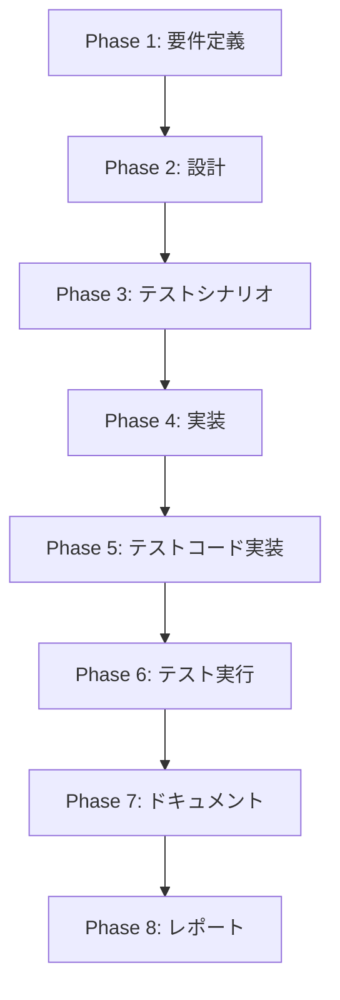

# Codex Agent 実行ログ

開始日時: 2025/12/25 9:12:49

---

## Turn 1: スレッド開始

**Thread ID**: `[REDACTED_TOKEN]`

## Turn 2: ツール実行

**種別**: reasoning
**ステータス**: completed

## Turn 3: ツール実行

**種別**: コマンド実行
**コマンド**: `/bin/bash -lc pwd`
**ステータス**: completed (exit_code=0)

```text
/tmp/ai-workflow-repos-131-4ba85e3e/ai-workflow-agent
```

## Turn 4: ツール実行

**種別**: reasoning
**ステータス**: completed

## Turn 5: ツール実行

**種別**: mcp_tool_call
**ステータス**: failed

## Turn 6: ツール実行

**種別**: reasoning
**ステータス**: completed

## Turn 7: ツール実行

**種別**: コマンド実行
**コマンド**: `/bin/bash -lc ls`
**ステータス**: completed (exit_code=0)

```text
ARCHITECTURE.md
CHANGELOG.md
CLAUDE.md
[REDACTED_TOKEN].md
[REDACTED_TOKEN].md
CODEBASE_SUMMARY.md
DOCKER_AUTH_SETUP.md
Dockerfile
Jenkinsfile
LICENSE
PROGRESS.md
README.md
ROADMAP.md
SETUP_TYPESCRIPT.md
TROUBLESHOOTING.md
__mocks__
docs
examples
jenkins
jest.config.cjs
metadata.json.template
node_modules
package-lock.json
package.json
scripts
src
tests
tmp
tsconfig.json
tsconfig.test.json
```

## Turn 8: ツール実行

**種別**: reasoning
**ステータス**: completed

## Turn 9: ツール実行

**種別**: コマンド実行
**コマンド**: `/bin/bash -lc 'ls .ai-workflow'`
**ステータス**: completed (exit_code=0)

```text
issue-10
issue-102
issue-104
issue-105
issue-108
issue-113
issue-115
issue-119
issue-126
issue-127
issue-128
issue-140
issue-144
issue-150
issue-153
issue-155
issue-16
issue-161
issue-165
issue-174
issue-177
issue-18
issue-184
issue-188
issue-194
issue-2
issue-207
issue-208
issue-211
issue-212
issue-216
issue-22
issue-225
issue-23
issue-238
issue-24
issue-243
issue-248
issue-25
issue-253
issue-259
issue-26
issue-261
issue-271
issue-38
issue-45
issue-46
issue-47
issue-48
issue-49
issue-5
issue-50
issue-51
issue-518
issue-52
issue-54
issue-58
issue-61
issue-64
issue-7
issue-73
issue-74
issue-90
issue-91
```

## Turn 10: ツール実行

**種別**: reasoning
**ステータス**: completed

## Turn 11: ツール実行

**種別**: コマンド実行
**コマンド**: `/bin/bash -lc "sed -n '1,200p' .ai-workflow/issue-518/00_planning/output/planning.md"`
**ステータス**: completed (exit_code=0)

```text
# プロジェクト計画書: Issue #518

## [FOLLOW-UP] #510: finalize-command.test・Jest モックの一貫したパターンをテスト

---

## 1. Issue分析

### 概要
Issue #510 の修正後のインテグレーションテスト `tests/integration/finalize-command.test.ts` が ESM 互換性のない Jest モックにより失敗している問題を解決する。また、テストスイート全体で Jest モックの書き方を統一し、CJS/ESM 混在環境でも安定して動く標準パターンを確立する。

### 複雑度: **中程度**

**判定根拠:**
- 対象ファイルは複数存在（1つのインテグレーションテスト + 複数の関連テストファイル）
- 既存のモックパターンの調査・分析が必要
- ESM/CJS 互換性という技術的な複雑さがある
- ただし、新規機能開発ではなく、既存コードのリファクタリングが中心

### 見積もり工数: **8〜12時間**

**内訳:**
- Task 1 (finalize-command.test.ts の修正): 2〜3時間
- Task 2 (モックパターン確立): 4〜6時間
- テスト実行・検証: 1〜2時間
- ドキュメント作成: 1時間

### リスク評価: **中**

**理由:**
- 既存テストへの影響範囲が広い可能性
- ESM/CJS 互換性問題は微妙な挙動の違いを生じさせる可能性
- モックパターン変更時に既存テストの期待値が変わる可能性

---

## 2. 実装戦略判断

### 実装戦略: **REFACTOR**

**判断根拠:**
- 新規ファイル作成ではなく、既存テストコードの構造改善が中心
- `tests/integration/finalize-command.test.ts` の既存モック記法を ESM 互換パターンに置き換える
- `__mocks__/fs-extra.ts` の既存コードを ESM 対応に修正
- 共通モックヘルパーの追加は可能だが、主な作業はリファクタリング

### テスト戦略: **INTEGRATION_ONLY**

**判断根拠:**
- 本 Issue の主目的はインテグレーションテスト `finalize-command.test.ts` の修正
- モックパターン変更の検証はインテグレーションテストで実施
- ユニットテストの追加は不要（既存テストのリファクタリングのみ）
- BDD テストは対象外（テストインフラの修正であり、ユーザーストーリーには直接関係しない）

### テストコード戦略: **EXTEND_TEST**

**判断根拠:**
- 新規テストファイル作成ではなく、既存テストファイルの修正
- `tests/integration/finalize-command.test.ts` のモック記法を ESM 互換に変更
- 代表的な他のテストファイルも同様に修正（パターン統一）
- 共通モックヘルパーを追加する場合は `tests/helpers/` に配置

---

## 3. 影響範囲分析

### 既存コードへの影響

#### 直接影響を受けるファイル:
1. **`tests/integration/finalize-command.test.ts`** (881行)
   - `jest.mock` を使用している箇所（6つのモック定義）
   - ESM 互換パターンへの変更が必要

2. **`__mocks__/fs-extra.ts`** (89行)
   - ESM 対応の確認・修正
   - default export と named export の両対応

#### 間接的に影響を受ける可能性のあるファイル:
- `tests/integration/cleanup-command.test.ts`
- `tests/integration/init-base-branch.test.ts`
- `tests/integration/preset-workflow.test.ts`
- `tests/integration/rollback-workflow.test.ts`
- その他 `jest.mock` を使用しているテストファイル（合計29ファイル）

### 依存関係の変更

**新規依存の追加**: なし

**既存依存への影響**:
- Jest 設定（`jest.config.cjs`）への変更は不要（既に ESM 対応済み）
- `package.json` のテストスクリプトは変更なし（既に `--[REDACTED_TOKEN]` 指定済み）

### マイグレーション要否: **不要**

- データベーススキーマ変更: なし
- 設定ファイル変更: なし
- 実行時の挙動変更: なし

---

## 4. タスク分割

### Phase 1: 要件定義 (見積もり: 0.5h)

- [x] Task 1-1: 現状のモックパターン調査 (0.5h)
  - 既存の `jest.mock` パターンを分類（同期 vs 非同期、`__esModule` 有無）
  - ESM 互換パターン（`jest.unstable_mockModule`）の使用状況確認
  - 問題のあるパターンと正常なパターンの特定

### Phase 2: 設計 (見積もり: 1.5h)

- [x] Task 2-1: ESM 互換モックパターンの標準化設計 (1h)
  - `jest.unstable_mockModule` + `beforeAll` + 動的インポートパターンの採用
  - `__esModule: true` の明示
  - `jest.requireActual` の併用方法の決定
  - 共通ヘルパー関数の設計（必要に応じて）

- [x] Task 2-2: 影響範囲の詳細分析 (0.5h)
  - 変更対象テストファイルの優先順位付け
  - リファクタリング順序の決定

### Phase 3: テストシナリオ (見積もり: 0.5h)

- [x] Task 3-1: 検証シナリオの定義 (0.5h)
  - `npm test -- tests/integration/finalize-command.test.ts` の成功確認
  - 変更した代表テストの実行確認
  - 全テストスイートのリグレッションテスト

### Phase 4: 実装 (見積もり: 4〜5h)

- [ ] Task 4-1: `finalize-command.test.ts` の ESM モック修正 (2h)
  - `jest.mock('fs-extra', ...)` を `jest.unstable_mockModule` パターンに変更
  - `jest.mock('simple-git', ...)` の修正
  - `jest.mock('../../src/core/repository-utils.js', ...)` の修正
  - `jest.mock('../../src/core/git-manager.js', ...)` の修正
  - `jest.mock('../../src/phases/cleanup/artifact-cleaner.js', ...)` の修正
  - `jest.mock('../../src/core/github-client.js', ...)` の修正
  - モジュールインポートを `beforeAll` 内の動的インポートに変更

- [ ] Task 4-2: `__mocks__/fs-extra.ts` の確認・修正 (0.5h)
  - ESM 互換性の確認
  - 必要に応じて `__esModule: true` の追加

- [ ] Task 4-3: 代表的なテストファイルのパターン統一 (1.5〜2h)
  - `tests/integration/cleanup-command.test.ts` の修正
  - `tests/unit/commands/finalize.test.ts` の確認・統一
  - その他影響度の高いテストファイルの修正

- [ ] Task 4-4: 共通セットアップの整理（オプション）(0.5h)
  - 共通モックヘルパー関数の作成（必要な場合）
  - `tests/helpers/` への配置

### Phase 5: テストコード実装 (見積もり: 0.5h)

- [ ] Task 5-1: テストパターンのドキュメント化 (0.5h)
  - モックガイドラインの作成（コード内コメントまたは別ドキュメント）
  - ESM/CJS 混在環境での推奨パターンの明文化

### Phase 6: テスト実行 (見積もり: 1.5h)

- [ ] Task 6-1: 対象テストの個別実行 (0.5h)
  - `npm test -- tests/integration/finalize-command.test.ts`
  - ESM モック関連の TypeError が発生しないことを確認

- [
... (truncated)
```

## Turn 12: ツール実行

**種別**: reasoning
**ステータス**: completed

## Turn 13: ツール実行

**種別**: コマンド実行
**コマンド**: `/bin/bash -lc "sed -n '1,200p' .ai-workflow/issue-518/04_implementation/output/implementation.md"`
**ステータス**: completed (exit_code=0)

```text
# 実装完了レポート

## 変更ファイル一覧

| ファイル | 変更種別 | 概要 |
|---------|---------|------|
| `tests/integration/finalize-command.test.ts` | 修正 | finalize 統合テストを ESM 対応の動的モックパターンへ置き換え、モック初期化を統一 |
| `tests/integration/cleanup-command.test.ts` | 修正 | cleanup 統合テストを ESM 安全なモックパターンにリファクタし、モックリセットを標準化 |
| `__mocks__/fs-extra.ts` | 修正 | manual mock に `__esModule` を追加し ESM 互換性を明示 |
| `tests/MOCK_GUIDELINES.md` | 新規 | Jest ESM モックの推奨パターンとアンチパターンをまとめたガイドラインを追加 |

## 主要な変更点
- finalize/cleanup 統合テストの依存モックを `jest.unstable_mockModule` + `beforeAll` 動的インポートに統一し、モックのリセット/初期値もヘルパーで集中管理。
- `MetadataManager` など依存クラスを動的インポートに切り替え、モック済み依存を確実に使用するよう修正。
- `__mocks__/fs-extra.ts` に `__esModule` を付与し、default/named 両対応の ESM 互換 manual mock を提供。
- Jest ESM 向けモックガイドライン文書を追加し、推奨記法とチェックリストを整理。

## テスト実施状況
- ビルド: 未実行（依頼なし）
- リント: 未実行（依頼なし）
- 基本動作確認: `npm test -- tests/integration/finalize-command.test.ts`, `npm test -- tests/integration/cleanup-command.test.ts`
```

## Turn 14: ツール実行

**種別**: reasoning
**ステータス**: completed

## Turn 15: ツール実行

**種別**: コマンド実行
**コマンド**: `/bin/bash -lc "sed -n '1,200p' .ai-workflow/issue-518/02_design/output/design.md"`
**ステータス**: completed (exit_code=0)

```text
# 詳細設計書: Issue #518

## [FOLLOW-UP] #510: finalize-command.test.ts・Jest モックの一貫したパターン確立

---

## 0. Planning Document 確認

Planning Document（`.ai-workflow/issue-518/00_planning/output/planning.md`）と要件定義書（`.ai-workflow/issue-518/01_requirements/output/requirements.md`）に基づき、以下の設計を行う。

| 項目 | 決定事項 |
|------|----------|
| 実装戦略 | **REFACTOR** |
| テスト戦略 | **INTEGRATION_ONLY** |
| テストコード戦略 | **EXTEND_TEST** |
| 複雑度 | **中程度** |
| 見積もり工数 | **8〜12時間** |

---

## 1. アーキテクチャ設計

### 1.1 現状の問題構造

```
┌─────────────────────────────────────────────────────────────────────────┐
│                         Jest テスト実行環境                              │
│  ┌─────────────────────┐    ┌─────────────────────────────────────────┐ │
│  │   ESM モジュール     │    │        テストファイル群                  │ │
│  │ (experimental-vm)   │    │  ┌─────────────────────────────────┐    │ │
│  │                     │    │  │ finalize-command.test.ts       │    │ │
│  │ ・動的インポート     │◀───│  │ ❌ 同期的 jest.mock()          │    │ │
│  │ ・トップレベルawait  │    │  │ ❌ ホイスティング依存           │    │ │
│  │                     │    │  │ ❌ モック設定前インポート       │    │ │
│  └─────────────────────┘    │  └─────────────────────────────────┘    │ │
│           ❌ 非互換          │  ┌─────────────────────────────────┐    │ │
│                              │  │ pr-comment/finalize.test.ts    │    │ │
│                              │  │ ✅ jest.unstable_mockModule()  │    │ │
│                              │  │ ✅ beforeAll + 動的インポート    │    │ │
│                              │  └─────────────────────────────────┘    │ │
│                              └─────────────────────────────────────────┘ │
└─────────────────────────────────────────────────────────────────────────┘
```

### 1.2 修正後のアーキテクチャ

```
┌─────────────────────────────────────────────────────────────────────────┐
│                         Jest テスト実行環境                              │
│  ┌─────────────────────┐    ┌─────────────────────────────────────────┐ │
│  │   ESM モジュール     │    │        テストファイル群（統一パターン）   │ │
│  │ (experimental-vm)   │    │  ┌─────────────────────────────────┐    │ │
│  │                     │    │  │ 全テストファイル                 │    │ │
│  │ ・動的インポート     │◀───│  │ ✅ jest.unstable_mockModule()  │    │ │
│  │ ・トップレベルawait  │    │  │ ✅ beforeAll + 動的インポート    │    │ │
│  │                     │    │  │ ✅ __esModule: true 明示        │    │ │
│  └─────────────────────┘    │  │ ✅ beforeEach でリセット        │    │ │
│           ✅ 互換            │  └─────────────────────────────────┘    │ │
│                              └─────────────────────────────────────────┘ │
│  ┌─────────────────────────────────────────────────────────────────────┐ │
│  │                    モックガイドライン                                │ │
│  │  ・ESM 互換標準パターンのドキュメント化                              │ │
│  │  ・アンチパターンの明示                                              │ │
│  └─────────────────────────────────────────────────────────────────────┘ │
└─────────────────────────────────────────────────────────────────────────┘
```

### 1.3 コンポーネント間の関係

```
tests/
├── integration/
│   ├── finalize-command.test.ts    ← 修正対象（ESM互換パターンへ）
│   ├── cleanup-command.test.ts     ← 代表修正対象
│   └── ...
├── unit/
│   ├── commands/
│   │   └── finalize.test.ts        ← 確認対象
│   └── pr-comment/
│       └── finalize-command.test.ts  ← テンプレート（正常パターン）
├── helpers/
│   ├── mock-octokit.ts             ← 既存ヘルパー（参考）
│   └── esm-mock-utils.ts           ← 新規作成（共通ヘルパー）※オプション
└── MOCK_GUIDELINES.md              ← 新規作成（ガイドライン）

__mocks__/
└── fs-extra.ts                     ← ESM対応確認・修正
```

### 1.4 データフロー

```
┌──────────────────┐
│   テストファイル   │
└────────┬─────────┘
         │ 1. beforeAll() 実行
         ▼
┌──────────────────────────────────┐
│  jest.unstable_mockModule()      │
│  ・モック関数を事前定義           │
│  ・__esModule: true を設定        │
└────────┬─────────────────────────┘
         │ 2. 動的 import()
         ▼
┌──────────────────────────────────┐
│  テスト対象モジュール             │
│  ・モック済みの依存関係を使用     │
└────────┬────
... (truncated)
```

## Turn 16: ツール実行

**種別**: reasoning
**ステータス**: completed

## Turn 17: ツール実行

**種別**: コマンド実行
**コマンド**: `/bin/bash -lc 'git status -sb'`
**ステータス**: completed (exit_code=0)

```text
## ai-workflow/issue-518...origin/develop [ahead 12]
 M .ai-workflow/issue-518/metadata.json
?? .ai-workflow/issue-518/00_planning/execute/agent_log_raw.txt
?? .ai-workflow/issue-518/00_planning/execute/prompt.txt
?? .ai-workflow/issue-518/00_planning/review/agent_log_raw.txt
?? .ai-workflow/issue-518/00_planning/review/prompt.txt
?? .ai-workflow/issue-518/01_requirements/execute/agent_log_raw.txt
?? .ai-workflow/issue-518/01_requirements/execute/prompt.txt
?? .ai-workflow/issue-518/01_requirements/review/agent_log_raw.txt
?? .ai-workflow/issue-518/01_requirements/review/prompt.txt
?? .ai-workflow/issue-518/02_design/execute/agent_log_raw.txt
?? .ai-workflow/issue-518/02_design/execute/prompt.txt
?? .ai-workflow/issue-518/02_design/review/agent_log_raw.txt
?? .ai-workflow/issue-518/02_design/review/prompt.txt
?? .ai-workflow/issue-518/03_test_scenario/execute/agent_log_raw.txt
?? .ai-workflow/issue-518/03_test_scenario/execute/prompt.txt
?? .ai-workflow/issue-518/03_test_scenario/review/agent_log_raw.txt
?? .ai-workflow/issue-518/03_test_scenario/review/prompt.txt
?? .ai-workflow/issue-518/04_implementation/execute/agent_log_raw.txt
?? .ai-workflow/issue-518/04_implementation/execute/prompt.txt
?? .ai-workflow/issue-518/04_implementation/review/
```

## Turn 18: ツール実行

**種別**: reasoning
**ステータス**: completed

## Turn 19: ツール実行

**種別**: コマンド実行
**コマンド**: `/bin/bash -lc "sed -n '1,200p' tests/integration/finalize-command.test.ts"`
**ステータス**: completed (exit_code=0)

```text
/**
 * インテグレーションテスト: finalize コマンド
 * Issue #261: ワークフロー完了時の最終処理を統合したコマンドとして実装
 *
 * テスト対象:
 * - エンドツーエンドの finalize シナリオ
 * - 5ステップ全体の統合フロー
 * - モジュール連携（MetadataManager, ArtifactCleaner, SquashManager, PullRequestClient）
 * - エラーハンドリング
 *
 * テスト戦略: UNIT_INTEGRATION - インテグレーション部分
 */

import { describe, test, expect, beforeAll, beforeEach, afterEach, jest } from '@jest/globals';
import type { MetadataManager as MetadataManagerType } from '../../src/core/metadata-manager.js';
import type { [REDACTED_TOKEN] } from '../../src/commands/finalize.js';
import * as path from 'node:path';

const mockRevparse = jest.fn<() => Promise<string>>();

const mockExistsSync = jest.fn<() => boolean>();
const mockEnsureDirSync = jest.fn<() => void>();
const mockWriteFileSync = jest.fn<() => void>();
const mockReadFileSync = jest.fn<() => string>();
const mockStatSync = jest.fn();
const mockReaddirSync = jest.fn<() => string[]>();
const mockRemoveSync = jest.fn<() => void>();
const mockMkdirSync = jest.fn<() => void>();

const [REDACTED_TOKEN] = jest.fn<
  (issueNumber: string) => Promise<{ repoRoot: string; metadataPath: string }>
>();

const [REDACTED_TOKEN] = jest.fn();
const mockPushToRemote = jest.fn();
const [REDACTED_TOKEN] = jest.fn();
const [REDACTED_TOKEN] = jest.fn();

const [REDACTED_TOKEN] = jest.fn();

const [REDACTED_TOKEN] = jest.fn();
const [REDACTED_TOKEN] = jest.fn();
const [REDACTED_TOKEN] = jest.fn();
const mockMarkPRReady = jest.fn();
const [REDACTED_TOKEN] = jest.fn();

let [REDACTED_TOKEN]: typeof import('../../src/commands/finalize.js').[REDACTED_TOKEN];
let [REDACTED_TOKEN]: typeof import('../../src/core/repository-utils.js').[REDACTED_TOKEN];
let GitManager: typeof import('../../src/core/git-manager.js').GitManager;
let ArtifactCleaner: typeof import('../../src/phases/cleanup/artifact-cleaner.js').ArtifactCleaner;
let GitHubClient: typeof import('../../src/core/github-client.js').GitHubClient;
let MetadataManager: typeof import('../../src/core/metadata-manager.js').MetadataManager;

const resetCommonMocks = () => {
  jest.clearAllMocks();

  mockRevparse.mockReset();
  mockExistsSync.mockReset();
  mockEnsureDirSync.mockReset();
  mockWriteFileSync.mockReset();
  mockReadFileSync.mockReset();
  mockStatSync.mockReset();
  mockReaddirSync.mockReset();
  mockRemoveSync.mockReset();
  mockMkdirSync.mockReset();

  [REDACTED_TOKEN].mockReset();

  [REDACTED_TOKEN].mockReset();
  mockPushToRemote.mockReset();
  [REDACTED_TOKEN].mockReset();
  [REDACTED_TOKEN].mockReset();

  [REDACTED_TOKEN].mockReset();

  [REDACTED_TOKEN].mockReset();
  [REDACTED_TOKEN].mockReset();
  [REDACTED_TOKEN].mockReset();
  mockMarkPRReady.mockReset();
  [REDACTED_TOKEN].mockReset();

  (GitManager as jest.MockedClass<typeof GitManager>).mockReset();
  (GitManager as jest.MockedClass<typeof GitManager>).mockImplementation(() => ({
    [REDACTED_TOKEN]: [REDACTED_TOKEN],
    pushToRemote: mockPushToRemote,
    getSquashManager: [REDACTED_TOKEN],
  }));

  (ArtifactCleaner as jest.MockedClass<typeof ArtifactCleaner>).mockReset();
  (ArtifactCleaner as jest.MockedClass<typeof ArtifactCleaner>).mockImplementation(() => ({
    [REDACTED_TOKEN]: [REDACTED_TOKEN],
  }));

  (GitHubClient as jest.MockedClass<typeof GitHubClient>).mockReset();
  (GitHubClient as jest.MockedClass<typeof GitHubClient>).mockImplementation(() => ({
    [REDACTED_TOKEN]: [REDACTED_TOKEN],
  }));

  mockRevparse.mockResolvedValue('head-before-cleanup\n');

  mockExistsSync.mockReturnValue(true);
  mockEnsureDirSync.mockImplementation(() => undefined);
  mockWriteFileSync.mockImplementation(() => undefined);
  mockReadFileSync.mockReturnValue(JSON.stringify(baseMetadata));
  mockStatSync.mockReturnValue({
    isDirectory: () => false,
    isFile: () => true,
  });
  m
... (truncated)
```

## Turn 20: ツール実行

**種別**: reasoning
**ステータス**: completed

## Turn 21: ツール実行

**種別**: コマンド実行
**コマンド**: `/bin/bash -lc 'rg -n "beforeEach" -n tests/integration/finalize-command.test.ts'`
**ステータス**: failed (exit_code=127)

```text
/bin/bash: line 1: rg: command not found
```

## Turn 22: ツール実行

**種別**: reasoning
**ステータス**: completed

## Turn 23: ツール実行

**種別**: コマンド実行
**コマンド**: `/bin/bash -lc 'grep -n "beforeEach" -n tests/integration/finalize-command.test.ts'`
**ステータス**: completed (exit_code=0)

```text
14:import { describe, test, expect, beforeAll, beforeEach, afterEach, jest } from '@jest/globals';
250:  beforeEach(() => {
624:  beforeEach(() => {
756:  beforeEach(() => {
878:  beforeEach(() => {
932:      // Note: metadataManager は beforeEach で初期化済み
```

## Turn 24: ツール実行

**種別**: reasoning
**ステータス**: completed

## Turn 25: ツール実行

**種別**: コマンド実行
**コマンド**: `/bin/bash -lc "sed -n '220,320p' tests/integration/finalize-command.test.ts"`
**ステータス**: completed (exit_code=0)

```text
requirements: { status: 'pending', retry_count: 0, started_at: null, completed_at: null, review_result: null },
    design: { status: 'pending', retry_count: 0, started_at: null, completed_at: null, review_result: null },
    test_scenario: { status: 'pending', retry_count: 0, started_at: null, completed_at: null, review_result: null },
    implementation: { status: 'pending', retry_count: 0, started_at: null, completed_at: null, review_result: null },
    test_implementation: { status: 'pending', retry_count: 0, started_at: null, completed_at: null, review_result: null },
    testing: { status: 'pending', retry_count: 0, started_at: null, completed_at: null, review_result: null },
    documentation: { status: 'pending', retry_count: 0, started_at: null, completed_at: null, review_result: null },
    report: { status: 'pending', retry_count: 0, started_at: null, completed_at: null, review_result: null },
    evaluation: {
      status: 'pending',
      retry_count: 0,
      started_at: null,
      completed_at: null,
      review_result: null,
      decision: null,
      failed_phase: null,
      remaining_tasks: [],
      created_issue_url: null,
      abort_reason: null,
    },
  },
  created_at: '',
  updated_at: '',
};

describe('Integration: Finalize Command - エンドツーエンドフロー', () => {
  const testWorkflowDir = '/test/.ai-workflow/issue-123';
  const testMetadataPath = path.join(testWorkflowDir, 'metadata.json');
  let metadataManager: MetadataManagerType;

  beforeEach(() => {
    resetCommonMocks();
    mockReadFileSync.mockReturnValue(JSON.stringify(baseMetadata));

    // [REDACTED_TOKEN]のモック設定
    [REDACTED_TOKEN].mockResolvedValue({
      repoRoot: '/test/repo',
      metadataPath: testMetadataPath,
    });

    metadataManager = new MetadataManager(testMetadataPath);

    // メタデータの初期化（全フェーズ完了）
    metadataManager.data.issue_number = '123';  // string型
    metadataManager.data.base_commit = 'abc123def456';
    metadataManager.data.issue_title = 'feat(cli): Add finalize command';
    metadataManager.data.issue_url = 'https://__GITHUB_URL_0__/issues/123';
    metadataManager.data.target_repository = {
      owner: 'owner',
      repo: 'repo',
      path: '/test/repo',
      github_name: 'owner/repo',  // 必須フィールド
      remote_url: 'https://github.com/owner/repo.git',  // 必須フィールド
    };
    metadataManager.data.phases.planning.status = 'completed';
    metadataManager.data.phases.requirements.status = 'completed';
    metadataManager.data.phases.design.status = 'completed';
    metadataManager.data.phases.test_scenario.status = 'completed';
    metadataManager.data.phases.implementation.status = 'completed';
    metadataManager.data.phases.test_implementation.status = 'completed';
    metadataManager.data.phases.testing.status = 'completed';
    metadataManager.data.phases.documentation.status = 'completed';
    metadataManager.data.phases.report.status = 'completed';
    metadataManager.data.phases.evaluation.status = 'completed';

    // fs.readFileSyncでメタデータを返す
    mockReadFileSync.mockReturnValue(JSON.stringify(metadataManager.data));
  });

  afterEach(() => {
    jest.restoreAllMocks();
  });

  // =============================================================================
  // IT-01: 統合テスト_正常系_全ステップ完全実行
  // =============================================================================
  describe('IT-01: 統合テスト_正常系_全ステップ完全実行', () => {
    test('finalize --issue 123 で全5ステップが順次実行される', async () => {
      // Given: ワークフローが完了している
      const options: [REDACTED_TOKEN] = {
        issue: '123',
      };

      // When: finalize コマンドを実行
      await [REDACTED_TOKEN](options);

      // Then:
      // Step 2: ArtifactCleaner.[REDACTED_TOKEN]()が呼ばれる
      const mockArtifactCleaner = ArtifactCleaner as jest.MockedClass<typeof ArtifactCleaner>;
      const [REDACTED_TOKEN] = mockArtifactCleaner.mock.results[0]?.value;
      expect([REDACTED_TOKEN]?.[REDACTED_TOKEN]).toHav
... (truncated)
```

## Turn 26: ツール実行

**種別**: reasoning
**ステータス**: completed

## Turn 27: ツール実行

**種別**: コマンド実行
**コマンド**: `/bin/bash -lc "sed -n '1,200p' tests/integration/cleanup-command.test.ts"`
**ステータス**: completed (exit_code=0)

```text
/**
 * インテグレーションテスト: cleanup コマンド
 * Issue #212: ワークフローログクリーンアップを独立したコマンドとして実装
 *
 * テスト対象:
 * - エンドツーエンドのクリーンアップシナリオ
 * - ドライランモード
 * - フェーズ範囲指定
 * - 完全クリーンアップ（--all）
 * - エラーハンドリング
 *
 * テスト戦略: UNIT_INTEGRATION - インテグレーション部分
 */

import { describe, test, expect, beforeAll, beforeEach, afterEach, jest } from '@jest/globals';
import type { MetadataManager as MetadataManagerType } from '../../src/core/metadata-manager.js';
import type { [REDACTED_TOKEN] } from '../../src/commands/cleanup.js';
import * as path from 'node:path';

const mockExistsSync = jest.fn<() => boolean>();
const mockEnsureDirSync = jest.fn<() => void>();
const mockWriteFileSync = jest.fn<() => void>();
const mockReadFileSync = jest.fn<() => string>();
const mockStatSync = jest.fn();
const mockReaddirSync = jest.fn<() => string[]>();
const mockRemoveSync = jest.fn<() => void>();

const [REDACTED_TOKEN] = jest.fn<
  (issue: string) => Promise<{ metadataPath: string; repoRoot?: string }>
>();

const [REDACTED_TOKEN] = jest.fn();
const mockPushToRemote = jest.fn();
const [REDACTED_TOKEN] = jest.fn();
const [REDACTED_TOKEN] = jest.fn();

let [REDACTED_TOKEN]: typeof import('../../src/commands/cleanup.js').[REDACTED_TOKEN];
let [REDACTED_TOKEN]: typeof import('../../src/core/repository-utils.js').[REDACTED_TOKEN];
let GitManager: typeof import('../../src/core/git-manager.js').GitManager;
let ArtifactCleaner: typeof import('../../src/phases/cleanup/artifact-cleaner.js').ArtifactCleaner;
let MetadataManager: typeof import('../../src/core/metadata-manager.js').MetadataManager;

const baseMetadata = {
  issue_number: '123',
  issue_url: '',
  issue_title: '',
  repository: null,
  target_repository: null,
  workflow_version: '1.0.0',
  current_phase: 'planning',
  design_decisions: {
    [REDACTED_TOKEN]: null,
    test_strategy: null,
    test_code_strategy: null,
  },
  cost_tracking: {
    total_input_tokens: 0,
    total_output_tokens: 0,
    total_cost_usd: 0,
  },
  phases: {
    planning: { status: 'pending', retry_count: 0, started_at: null, completed_at: null, review_result: null },
    requirements: { status: 'pending', retry_count: 0, started_at: null, completed_at: null, review_result: null },
    design: { status: 'pending', retry_count: 0, started_at: null, completed_at: null, review_result: null },
    test_scenario: { status: 'pending', retry_count: 0, started_at: null, completed_at: null, review_result: null },
    implementation: { status: 'pending', retry_count: 0, started_at: null, completed_at: null, review_result: null },
    test_implementation: { status: 'pending', retry_count: 0, started_at: null, completed_at: null, review_result: null },
    testing: { status: 'pending', retry_count: 0, started_at: null, completed_at: null, review_result: null },
    documentation: { status: 'pending', retry_count: 0, started_at: null, completed_at: null, review_result: null },
    report: { status: 'pending', retry_count: 0, started_at: null, completed_at: null, review_result: null },
    evaluation: { status: 'pending', retry_count: 0, started_at: null, completed_at: null, review_result: null },
  },
  created_at: '',
  updated_at: '',
};

const resetCommonMocks = () => {
  jest.clearAllMocks();

  mockExistsSync.mockReset();
  mockEnsureDirSync.mockReset();
  mockWriteFileSync.mockReset();
  mockReadFileSync.mockReset();
  mockStatSync.mockReset();
  mockReaddirSync.mockReset();
  mockRemoveSync.mockReset();

  [REDACTED_TOKEN].mockReset();

  [REDACTED_TOKEN].mockReset();
  mockPushToRemote.mockReset();
  [REDACTED_TOKEN].mockReset();
  [REDACTED_TOKEN].mockReset();

  mockExistsSync.mockReturnValue(true);
  mockEnsureDirSync.mockImplementation(() => undefined);
  mockWriteFileSync.mockImplementation(() => undefined);
  mockReadFileSync.mockReturnValue(JSON.stringify(baseMetadata));
  mockStatSync.mockReturnValue({
    isDirectory: () => false,
    isFile: () => t
... (truncated)
```

## Turn 28: ツール実行

**種別**: reasoning
**ステータス**: completed

## Turn 29: ツール実行

**種別**: コマンド実行
**コマンド**: `/bin/bash -lc "sed -n '1,200p' __mocks__/fs-extra.ts"`
**ステータス**: completed (exit_code=0)

```text
// Jest manual mock for fs-extra (ESM)
const fsExtra = {
  __esModule: true,
  ensureDir: jest.fn(async () => {}),
  ensureDirSync: jest.fn(() => {}),
  ensureFile: jest.fn(async () => {}),
  ensureFileSync: jest.fn(() => {}),
  emptyDir: jest.fn(async () => {}),
  emptyDirSync: jest.fn(() => {}),
  readFile: jest.fn(async () => ''),
  readFileSync: jest.fn(() => ''),
  writeFile: jest.fn(async () => {}),
  writeFileSync: jest.fn(() => {}),
  outputFile: jest.fn(async () => {}),
  outputFileSync: jest.fn(() => {}),
  readJson: jest.fn(async () => ({})),
  readJsonSync: jest.fn(() => ({})),
  writeJson: jest.fn(async () => {}),
  writeJsonSync: jest.fn(() => {}),
  outputJson: jest.fn(async () => {}),
  outputJsonSync: jest.fn(() => {}),
  pathExists: jest.fn(async () => false),
  pathExistsSync: jest.fn(() => false),
  existsSync: jest.fn(() => false),
  mkdirSync: jest.fn(() => {}),
  readdir: jest.fn(async () => []),
  readdirSync: jest.fn(() => []),
  copy: jest.fn(async () => {}),
  copySync: jest.fn(() => {}),
  remove: jest.fn(async () => {}),
  removeSync: jest.fn(() => {}),
  rm: jest.fn(async () => {}),
  mkdirs: jest.fn(async () => {}),
  mkdtemp: jest.fn(async (prefix: string) => `${prefix}${Math.random().toString(16).slice(2, 8)}`),
  statSync: jest.fn(() => ({
    isDirectory: () => false,
    isFile: () => true,
    isSymbolicLink: () => false,
    size: 0,
  })),
  lstatSync: jest.fn(() => ({
    isSymbolicLink: () => false,
    isDirectory: () => false,
    isFile: () => true,
  })),
  symlink: jest.fn(async () => {}),
  createReadStream: jest.fn(),
  createWriteStream: jest.fn(),
};

export default fsExtra;
export const {
  ensureDir,
  ensureDirSync,
  ensureFile,
  ensureFileSync,
  emptyDir,
  emptyDirSync,
  readFile,
  readFileSync,
  writeFile,
  writeFileSync,
  outputFile,
  outputFileSync,
  readJson,
  readJsonSync,
  writeJson,
  writeJsonSync,
  outputJson,
  outputJsonSync,
  pathExists,
  pathExistsSync,
  existsSync,
  mkdirSync,
  readdir,
  readdirSync,
  copy,
  copySync,
  remove,
  removeSync,
  rm,
  mkdirs,
  mkdtemp,
  statSync,
  lstatSync,
  symlink,
  createReadStream,
  createWriteStream,
} = fsExtra;
```

## Turn 30: ツール実行

**種別**: reasoning
**ステータス**: completed

## Turn 31: ツール実行

**種別**: コマンド実行
**コマンド**: `/bin/bash -lc "sed -n '1,200p' tests/MOCK_GUIDELINES.md"`
**ステータス**: completed (exit_code=0)

```text
# Jest モックガイドライン（ESM 互換）

## 推奨パターン
- `beforeAll` 内で `await jest.unstable_mockModule()` を用いて依存をモックする。
- モック設定後に `await import()` でテスト対象モジュールを動的インポートする。
- `__esModule: true` を必ず含め、default と named を両方定義する。
- `beforeEach` で `jest.resetAllMocks()` または `jest.clearAllMocks()` を行い、モックの戻り値を初期化する。
- クラスは `jest.fn().mockImplementation` でラップし、`jest.MockedClass` で結果を参照する。

```typescript
beforeAll(async () => {
  await jest.unstable_mockModule('external-lib', () => ({
    __esModule: true,
    default: { run: mockRun },
    run: mockRun,
  }));

  await jest.unstable_mockModule('../core/service.js', () => ({
    __esModule: true,
    Service: jest.fn().mockImplementation(() => ({ exec: mockExec })),
  }));

  subject = (await import('../commands/subject.js')).subject;
});

beforeEach(() => {
  jest.resetAllMocks();
  mockRun.mockResolvedValue(undefined);
  mockExec.mockResolvedValue({ success: true });
});
```

## アンチパターン
- 同期的な `jest.mock()` を ESM で使用する。
- モック設定前に静的インポートでモジュールを読み込む。
- `__esModule` を省略した manual mock を使用する。
- `jest.spyOn` を使って ES モジュールのデフォルトエクスポートを直接上書きする。

## チェックリスト
- [ ] すべてのモックが `jest.unstable_mockModule` で定義されている。
- [ ] `__esModule: true` を含め、default/named の両方を提供している。
- [ ] モック後にテスト対象を動的インポートしている。
- [ ] `beforeEach` でモック状態をリセットしている。
- [ ] クラスモックは `jest.MockedClass` で参照している。

## 参考
- `tests/unit/pr-comment/finalize-command.test.ts`（ESM 対応テンプレート）
- Jest ESM docs: https://jestjs.io/docs/ecmascript-modules
```

## Turn 32: ツール実行

**種別**: reasoning
**ステータス**: completed

## Turn 33: ツール実行

**種別**: コマンド実行
**コマンド**: `/bin/bash -lc 'git diff tests/integration/finalize-command.test.ts'`
**ステータス**: completed (exit_code=0)

## Turn 34: ツール実行

**種別**: reasoning
**ステータス**: completed

## Turn 35: ツール実行

**種別**: コマンド実行
**コマンド**: `/bin/bash -lc 'grep -n "restoreAllMocks" tests/integration/cleanup-command.test.ts'`
**ステータス**: completed (exit_code=0)

```text
203:    jest.restoreAllMocks();
```

## Turn 36: ツール実行

**種別**: reasoning
**ステータス**: completed

## Turn 37: ツール実行

**種別**: コマンド実行
**コマンド**: `/bin/bash -lc "sed -n '180,220p' tests/integration/cleanup-command.test.ts"`
**ステータス**: completed (exit_code=0)

```text
// [REDACTED_TOKEN]のモック設定
    [REDACTED_TOKEN].mockResolvedValue({
      metadataPath: testMetadataPath,
    });

    metadataManager = new MetadataManager(testMetadataPath);

    // メタデータの初期化（Phase 0-8が完了している状態）
    metadataManager.data.phases.planning.status = 'completed';
    metadataManager.data.phases.requirements.status = 'completed';
    metadataManager.data.phases.design.status = 'completed';
    metadataManager.data.phases.test_scenario.status = 'completed';
    metadataManager.data.phases.implementation.status = 'completed';
    metadataManager.data.phases.test_implementation.status = 'completed';
    metadataManager.data.phases.testing.status = 'completed';
    metadataManager.data.phases.documentation.status = 'completed';
    metadataManager.data.phases.report.status = 'completed';

    // fs.readFileSyncでメタデータを返す
    mockReadFileSync.mockReturnValue(JSON.stringify(metadataManager.data));
  });

  afterEach(() => {
    jest.restoreAllMocks();
  });

  // =============================================================================
  // IC-CLEANUP-01: 基本的なクリーンアップ実行
  // =============================================================================
  describe('IC-CLEANUP-01: 基本的なクリーンアップ実行', () => {
    test('cleanup --issue 123 で通常クリーンアップが実行される', async () => {
      // Given: Issue #123のワークフローが存在する
      const options: [REDACTED_TOKEN] = {
        issue: '123',
      };

      // When: クリーンアップコマンドを実行
      await [REDACTED_TOKEN](options);

      // Then: ArtifactCleaner.cleanupWorkflowLogs()が呼ばれる
      const [REDACTED_TOKEN] = (ArtifactCleaner as jest.MockedClass<typeof ArtifactCleaner>).mock.results[0]?.value;
```

## Turn 38: ツール実行

**種別**: reasoning
**ステータス**: completed

## Turn 39: ツール実行

**種別**: コマンド実行
**コマンド**: `/bin/bash -lc 'grep -n "afterEach" tests/integration/finalize-command.test.ts'`
**ステータス**: completed (exit_code=0)

```text
14:import { describe, test, expect, beforeAll, beforeEach, afterEach, jest } from '@jest/globals';
289:  afterEach(() => {
```

## Turn 40: ツール実行

**種別**: reasoning
**ステータス**: completed

## Turn 41: ツール実行

**種別**: コマンド実行
**コマンド**: `/bin/bash -lc "sed -n '280,340p' tests/integration/finalize-command.test.ts"`
**ステータス**: completed (exit_code=0)

```text
metadataManager.data.phases.testing.status = 'completed';
    metadataManager.data.phases.documentation.status = 'completed';
    metadataManager.data.phases.report.status = 'completed';
    metadataManager.data.phases.evaluation.status = 'completed';

    // fs.readFileSyncでメタデータを返す
    mockReadFileSync.mockReturnValue(JSON.stringify(metadataManager.data));
  });

  afterEach(() => {
    jest.restoreAllMocks();
  });

  // =============================================================================
  // IT-01: 統合テスト_正常系_全ステップ完全実行
  // =============================================================================
  describe('IT-01: 統合テスト_正常系_全ステップ完全実行', () => {
    test('finalize --issue 123 で全5ステップが順次実行される', async () => {
      // Given: ワークフローが完了している
      const options: [REDACTED_TOKEN] = {
        issue: '123',
      };

      // When: finalize コマンドを実行
      await [REDACTED_TOKEN](options);

      // Then:
      // Step 2: ArtifactCleaner.[REDACTED_TOKEN]()が呼ばれる
      const mockArtifactCleaner = ArtifactCleaner as jest.MockedClass<typeof ArtifactCleaner>;
      const [REDACTED_TOKEN] = mockArtifactCleaner.mock.results[0]?.value;
      expect([REDACTED_TOKEN]?.[REDACTED_TOKEN]).[REDACTED_TOKEN](true);

      // Git コミット＆プッシュが実行される
      const mockGitManager = GitManager as jest.MockedClass<typeof GitManager>;
      const gitManagerInstance = mockGitManager.mock.results[0]?.value;
      expect(gitManagerInstance?.[REDACTED_TOKEN]).[REDACTED_TOKEN](123);
      expect(gitManagerInstance?.pushToRemote).toHaveBeenCalled();

      // Step 3: スカッシュが実行される
      expect(gitManagerInstance?.getSquashManager).toHaveBeenCalled();
      const squashManager = gitManagerInstance?.getSquashManager();
      expect(squashManager.[REDACTED_TOKEN]).[REDACTED_TOKEN](
        expect.objectContaining({
          issueNumber: 123,
          baseCommit: 'abc123def456',
          targetBranch: 'main',
          headCommit: 'head-before-cleanup',
        }),
      );

      // Step 4-5: PR更新とドラフト解除が実行される
      const mockGitHubClient = GitHubClient as jest.MockedClass<typeof GitHubClient>;
      const [REDACTED_TOKEN] = mockGitHubClient.mock.results[0]?.value;
      const prClient = [REDACTED_TOKEN]?.[REDACTED_TOKEN]();

      expect(prClient.[REDACTED_TOKEN]).[REDACTED_TOKEN](123);
      expect(prClient.updatePullRequest).[REDACTED_TOKEN](456, expect.stringContaining('Issue番号: #123'));
      expect(prClient.markPRReady).[REDACTED_TOKEN](456);
    });
  });
```

## Turn 42: ツール実行

**種別**: reasoning
**ステータス**: completed

## Turn 43: ツール実行

**種別**: コマンド実行
**コマンド**: `/bin/bash -lc 'grep -n "Phase 4" -n .ai-workflow/issue-518/00_planning/output/planning.md'`
**ステータス**: completed (exit_code=0)

```text
129:### Phase 4: 実装 (見積もり: 4〜5h)
195:    P3 --> P4[Phase 4: 実装]
201:    subgraph "Phase 4 詳細"
240:  - Phase 4 の Task 4-1（finalize-command.test.ts）を最優先
262:### Phase 4: 実装
```

## Turn 44: ツール実行

**種別**: reasoning
**ステータス**: completed

## Turn 45: ツール実行

**種別**: コマンド実行
**コマンド**: `/bin/bash -lc "sed -n '120,200p' .ai-workflow/issue-518/00_planning/output/planning.md"`
**ステータス**: completed (exit_code=0)

```text
- リファクタリング順序の決定

### Phase 3: テストシナリオ (見積もり: 0.5h)

- [x] Task 3-1: 検証シナリオの定義 (0.5h)
  - `npm test -- tests/integration/finalize-command.test.ts` の成功確認
  - 変更した代表テストの実行確認
  - 全テストスイートのリグレッションテスト

### Phase 4: 実装 (見積もり: 4〜5h)

- [ ] Task 4-1: `finalize-command.test.ts` の ESM モック修正 (2h)
  - `jest.mock('fs-extra', ...)` を `jest.unstable_mockModule` パターンに変更
  - `jest.mock('simple-git', ...)` の修正
  - `jest.mock('../../src/core/repository-utils.js', ...)` の修正
  - `jest.mock('../../src/core/git-manager.js', ...)` の修正
  - `jest.mock('../../src/phases/cleanup/artifact-cleaner.js', ...)` の修正
  - `jest.mock('../../src/core/github-client.js', ...)` の修正
  - モジュールインポートを `beforeAll` 内の動的インポートに変更

- [ ] Task 4-2: `__mocks__/fs-extra.ts` の確認・修正 (0.5h)
  - ESM 互換性の確認
  - 必要に応じて `__esModule: true` の追加

- [ ] Task 4-3: 代表的なテストファイルのパターン統一 (1.5〜2h)
  - `tests/integration/cleanup-command.test.ts` の修正
  - `tests/unit/commands/finalize.test.ts` の確認・統一
  - その他影響度の高いテストファイルの修正

- [ ] Task 4-4: 共通セットアップの整理（オプション）(0.5h)
  - 共通モックヘルパー関数の作成（必要な場合）
  - `tests/helpers/` への配置

### Phase 5: テストコード実装 (見積もり: 0.5h)

- [ ] Task 5-1: テストパターンのドキュメント化 (0.5h)
  - モックガイドラインの作成（コード内コメントまたは別ドキュメント）
  - ESM/CJS 混在環境での推奨パターンの明文化

### Phase 6: テスト実行 (見積もり: 1.5h)

- [ ] Task 6-1: 対象テストの個別実行 (0.5h)
  - `npm test -- tests/integration/finalize-command.test.ts`
  - ESM モック関連の TypeError が発生しないことを確認

- [ ] Task 6-2: 変更した代表テストの実行 (0.5h)
  - 修正した各テストファイルの個別実行
  - モック初期化エラーがないことを確認

- [ ] Task 6-3: 全テストスイートの実行 (0.5h)
  - `npm test` で全テストを実行
  - リグレッションがないことを確認

### Phase 7: ドキュメント (見積もり: 1h)

- [ ] Task 7-1: モックガイドラインの作成 (1h)
  - ESM 対応モックパターンのガイドライン作成
  - テストディレクトリまたは CLAUDE.md への追記
  - サンプルコードの記載

### Phase 8: レポート (見積もり: 0.5h)

- [ ] Task 8-1: 実装レポートの作成 (0.5h)
  - 変更したファイル一覧
  - 確立したモックパターンの説明
  - 受け入れ基準の達成状況

---

## 5. 依存関係



## Turn 46: ツール実行

**種別**: reasoning
**ステータス**: completed

## Turn 47: ツール実行

**種別**: reasoning
**ステータス**: completed

## Turn 48: ツール実行

**種別**: file_change
**ステータス**: completed

## Turn 49: ツール実行

**種別**: reasoning
**ステータス**: completed

## Turn 50: ツール実行

**種別**: コマンド実行
**コマンド**: `/bin/bash -lc "sed -n '120,200p' .ai-workflow/issue-518/00_planning/output/planning.md"`
**ステータス**: completed (exit_code=0)

```text
- リファクタリング順序の決定

### Phase 3: テストシナリオ (見積もり: 0.5h)

- [x] Task 3-1: 検証シナリオの定義 (0.5h)
  - `npm test -- tests/integration/finalize-command.test.ts` の成功確認
  - 変更した代表テストの実行確認
  - 全テストスイートのリグレッションテスト

### Phase 4: 実装 (見積もり: 4〜5h)

- [x] Task 4-1: `finalize-command.test.ts` の ESM モック修正 (2h)
  - `jest.mock('fs-extra', ...)` を `jest.unstable_mockModule` パターンに変更
  - `jest.mock('simple-git', ...)` の修正
  - `jest.mock('../../src/core/repository-utils.js', ...)` の修正
  - `jest.mock('../../src/core/git-manager.js', ...)` の修正
  - `jest.mock('../../src/phases/cleanup/artifact-cleaner.js', ...)` の修正
  - `jest.mock('../../src/core/github-client.js', ...)` の修正
  - モジュールインポートを `beforeAll` 内の動的インポートに変更

- [x] Task 4-2: `__mocks__/fs-extra.ts` の確認・修正 (0.5h)
  - ESM 互換性の確認
  - 必要に応じて `__esModule: true` の追加

- [x] Task 4-3: 代表的なテストファイルのパターン統一 (1.5〜2h)
  - `tests/integration/cleanup-command.test.ts` の修正
  - `tests/unit/commands/finalize.test.ts` の確認・統一
  - その他影響度の高いテストファイルの修正

- [ ] Task 4-4: 共通セットアップの整理（オプション）(0.5h)
  - 共通モックヘルパー関数の作成（必要な場合）
  - `tests/helpers/` への配置

### Phase 5: テストコード実装 (見積もり: 0.5h)

- [ ] Task 5-1: テストパターンのドキュメント化 (0.5h)
  - モックガイドラインの作成（コード内コメントまたは別ドキュメント）
  - ESM/CJS 混在環境での推奨パターンの明文化

### Phase 6: テスト実行 (見積もり: 1.5h)

- [ ] Task 6-1: 対象テストの個別実行 (0.5h)
  - `npm test -- tests/integration/finalize-command.test.ts`
  - ESM モック関連の TypeError が発生しないことを確認

- [ ] Task 6-2: 変更した代表テストの実行 (0.5h)
  - 修正した各テストファイルの個別実行
  - モック初期化エラーがないことを確認

- [ ] Task 6-3: 全テストスイートの実行 (0.5h)
  - `npm test` で全テストを実行
  - リグレッションがないことを確認

### Phase 7: ドキュメント (見積もり: 1h)

- [ ] Task 7-1: モックガイドラインの作成 (1h)
  - ESM 対応モックパターンのガイドライン作成
  - テストディレクトリまたは CLAUDE.md への追記
  - サンプルコードの記載

### Phase 8: レポート (見積もり: 0.5h)

- [ ] Task 8-1: 実装レポートの作成 (0.5h)
  - 変更したファイル一覧
  - 確立したモックパターンの説明
  - 受け入れ基準の達成状況

---

## 5. 依存関係


## Turn 51: ツール実行

**種別**: reasoning
**ステータス**: completed

## Turn 52: ツール実行

**種別**: コマンド実行
**コマンド**: `/bin/bash -lc 'git status -sb'`
**ステータス**: completed (exit_code=0)

```text
## ai-workflow/issue-518...origin/develop [ahead 12]
 M .ai-workflow/issue-518/00_planning/output/planning.md
 M .ai-workflow/issue-518/metadata.json
?? .ai-workflow/issue-518/00_planning/execute/agent_log_raw.txt
?? .ai-workflow/issue-518/00_planning/execute/prompt.txt
?? .ai-workflow/issue-518/00_planning/review/agent_log_raw.txt
?? .ai-workflow/issue-518/00_planning/review/prompt.txt
?? .ai-workflow/issue-518/01_requirements/execute/agent_log_raw.txt
?? .ai-workflow/issue-518/01_requirements/execute/prompt.txt
?? .ai-workflow/issue-518/01_requirements/review/agent_log_raw.txt
?? .ai-workflow/issue-518/01_requirements/review/prompt.txt
?? .ai-workflow/issue-518/02_design/execute/agent_log_raw.txt
?? .ai-workflow/issue-518/02_design/execute/prompt.txt
?? .ai-workflow/issue-518/02_design/review/agent_log_raw.txt
?? .ai-workflow/issue-518/02_design/review/prompt.txt
?? .ai-workflow/issue-518/03_test_scenario/execute/agent_log_raw.txt
?? .ai-workflow/issue-518/03_test_scenario/execute/prompt.txt
?? .ai-workflow/issue-518/03_test_scenario/review/agent_log_raw.txt
?? .ai-workflow/issue-518/03_test_scenario/review/prompt.txt
?? .ai-workflow/issue-518/04_implementation/execute/agent_log_raw.txt
?? .ai-workflow/issue-518/04_implementation/execute/prompt.txt
?? .ai-workflow/issue-518/04_implementation/review/
```

## Turn 53: ツール実行

**種別**: reasoning
**ステータス**: completed

## Turn 54: ツール実行

**種別**: コマンド実行
**コマンド**: `/bin/bash -lc 'grep -n "[REDACTED_TOKEN]" -n src/commands/finalize.js'`
**ステータス**: failed (exit_code=2)

```text
grep: src/commands/finalize.js: No such file or directory
```

## Turn 55: ツール実行

**種別**: reasoning
**ステータス**: completed

## Turn 56: ツール実行

**種別**: コマンド実行
**コマンド**: `/bin/bash -lc 'ls src/commands'`
**ステータス**: completed (exit_code=0)

```text
auto-issue-output.ts
auto-issue.ts
cleanup.ts
execute
execute.ts
finalize.ts
init.ts
list-presets.ts
migrate.ts
pr-comment
review.ts
rollback.ts
```

## Turn 57: ツール実行

**種別**: reasoning
**ステータス**: completed

## Turn 58: ツール実行

**種別**: コマンド実行
**コマンド**: `/bin/bash -lc 'grep -n "[REDACTED_TOKEN]" -n src/commands/finalize.ts'`
**ステータス**: completed (exit_code=0)

```text
43: * [REDACTED_TOKEN] - finalize コマンドのエントリーポイント
45:export async function [REDACTED_TOKEN](options: [REDACTED_TOKEN]): Promise<void> {
```

## Turn 59: ツール実行

**種別**: reasoning
**ステータス**: completed

## Turn 60: ツール実行

**種別**: コマンド実行
**コマンド**: `/bin/bash -lc "sed -n '1,200p' src/commands/finalize.ts"`
**ステータス**: completed (exit_code=0)

```text
/**
 * Finalize コマンドハンドラ（Issue #261）
 *
 * ワークフロー完了時の最終処理を統合したコマンドとして実装。
 * - CLI引数解析（--issue, --dry-run, --skip-squash, --skip-pr-update, --base-branch）
 * - 5ステップの順次実行（base_commit取得、クリーンアップ、スカッシュ、PR更新、ドラフト解除）
 * - エラーハンドリング（各ステップで明確なエラーメッセージ）
 */

import path from 'node:path';
import simpleGit from 'simple-git';
import { logger } from '../utils/logger.js';
import { MetadataManager } from '../core/metadata-manager.js';
import { GitManager } from '../core/git-manager.js';
import { ArtifactCleaner } from '../phases/cleanup/artifact-cleaner.js';
import { GitHubClient } from '../core/github-client.js';
import { [REDACTED_TOKEN] } from '../core/repository-utils.js';
import { getErrorMessage } from '../utils/error-utils.js';
import type { FinalizeContext } from '../core/git/squash-manager.js';
import type { PhaseName } from '../types.js';

/**
 * [REDACTED_TOKEN] - CLIオプションの型定義
 */
export interface [REDACTED_TOKEN] {
  /** Issue番号（必須） */
  issue: string;

  /** ドライランフラグ（オプション） */
  dryRun?: boolean;

  /** スカッシュをスキップ（オプション） */
  skipSquash?: boolean;

  /** PR更新をスキップ（オプション） */
  skipPrUpdate?: boolean;

  /** PRのマージ先ブランチ（オプション、デフォルト: main） */
  baseBranch?: string;
}

/**
 * [REDACTED_TOKEN] - finalize コマンドのエントリーポイント
 */
export async function [REDACTED_TOKEN](options: [REDACTED_TOKEN]): Promise<void> {
  logger.info('Starting finalize command...');

  // 1. バリデーション
  [REDACTED_TOKEN](options);

  // 2. メタデータ読み込み
  const { metadataManager, workflowDir, repoDir } = await [REDACTED_TOKEN](options.issue);

  // 3. ドライランモード判定
  if (options.dryRun) {
    await previewFinalize(options, metadataManager);
    return;
  }

  // 4. Step 1: base_commit 取得・一時保存
  const { baseCommit, headBeforeCleanup } = await executeStep1(metadataManager, repoDir);

  // 5. Step 2: .ai-workflow 削除 + コミット
  await executeStep2(metadataManager, repoDir, options);

  // 6. Step 3: コミットスカッシュ（--skip-squash でスキップ可能）
  if (!options.skipSquash) {
    await executeStep3(metadataManager, repoDir, baseCommit, headBeforeCleanup, options);
  } else {
    logger.info('Skipping commit squash (--skip-squash option)');
  }

  // 7. Step 4-5: PR 更新とドラフト解除（--skip-pr-update でスキップ可能）
  if (!options.skipPrUpdate) {
    await executeStep4And5(metadataManager, options);
  } else {
    logger.info('Skipping PR update and draft conversion (--skip-pr-update option)');
  }

  logger.info('✅ Finalize completed successfully.');
}

/**
 * ワークフローメタデータを読み込む
 */
async function [REDACTED_TOKEN](issueNumber: string): Promise<{
  metadataManager: MetadataManager;
  workflowDir: string;
  repoDir: string;
}> {
  // メタデータの探索
  const result = await [REDACTED_TOKEN](issueNumber);
  const metadataPath = result.metadataPath;

  const metadataManager = new MetadataManager(metadataPath);
  const workflowDir = metadataManager.workflowDir;
  // リポジトリルートは .ai-workflow の親ディレクトリ
  const repoDir = path.dirname(path.dirname(workflowDir));

  logger.info(`Loaded workflow metadata: ${metadataPath}`);
  return { metadataManager, workflowDir, repoDir };
}

/**
 * [REDACTED_TOKEN] - CLIオプションのバリデーション
 */
function [REDACTED_TOKEN](options: [REDACTED_TOKEN]): void {
  // Issue番号チェック
  if (!options.issue) {
    throw new Error('Error: --issue option is required');
  }

  const issueNum = parseInt(options.issue, 10);
  if (isNaN(issueNum) || issueNum <= 0) {
    throw new Error(`Error: Invalid issue number: ${options.issue}. Must be a positive integer.`);
  }

  // baseBranch チェック（指定されている場合のみ）
  if (options.baseBranch && options.baseBranch.trim().length === 0) {
    throw new Error('Error: --base-branch cannot be empty');
  }
}

/**
 * executeStep1 - base_commit 取得・headBeforeCleanup 保存
 *
 * @param metadataManager - メタデータマネージャー
 * @param repoDir - リポジトリルートディレクトリパス
 * @returns base_commit と headBeforeCleanup
 * @throws Error - base_commit が存在しない場合
 */
async function executeStep1(
  metadataManager: MetadataManager,
  repoDir: string
): Promise<{ baseCom
... (truncated)
```

## Turn 61: ツール実行

**種別**: reasoning
**ステータス**: completed

## Turn 62: ツール実行

**種別**: コマンド実行
**コマンド**: `/bin/bash -lc "nl -ba tests/integration/finalize-command.test.ts | sed -n '1,200p'"`
**ステータス**: completed (exit_code=0)

```text
1	/**
     2	 * インテグレーションテスト: finalize コマンド
     3	 * Issue #261: ワークフロー完了時の最終処理を統合したコマンドとして実装
     4	 *
     5	 * テスト対象:
     6	 * - エンドツーエンドの finalize シナリオ
     7	 * - 5ステップ全体の統合フロー
     8	 * - モジュール連携（MetadataManager, ArtifactCleaner, SquashManager, PullRequestClient）
     9	 * - エラーハンドリング
    10	 *
    11	 * テスト戦略: UNIT_INTEGRATION - インテグレーション部分
    12	 */
    13	
    14	import { describe, test, expect, beforeAll, beforeEach, afterEach, jest } from '@jest/globals';
    15	import type { MetadataManager as MetadataManagerType } from '../../src/core/metadata-manager.js';
    16	import type { [REDACTED_TOKEN] } from '../../src/commands/finalize.js';
    17	import * as path from 'node:path';
    18	
    19	const mockRevparse = jest.fn<() => Promise<string>>();
    20	
    21	const mockExistsSync = jest.fn<() => boolean>();
    22	const mockEnsureDirSync = jest.fn<() => void>();
    23	const mockWriteFileSync = jest.fn<() => void>();
    24	const mockReadFileSync = jest.fn<() => string>();
    25	const mockStatSync = jest.fn();
    26	const mockReaddirSync = jest.fn<() => string[]>();
    27	const mockRemoveSync = jest.fn<() => void>();
    28	const mockMkdirSync = jest.fn<() => void>();
    29	
    30	const [REDACTED_TOKEN] = jest.fn<
    31	  (issueNumber: string) => Promise<{ repoRoot: string; metadataPath: string }>
    32	>();
    33	
    34	const [REDACTED_TOKEN] = jest.fn();
    35	const mockPushToRemote = jest.fn();
    36	const [REDACTED_TOKEN] = jest.fn();
    37	const [REDACTED_TOKEN] = jest.fn();
    38	
    39	const [REDACTED_TOKEN] = jest.fn();
    40	
    41	const [REDACTED_TOKEN] = jest.fn();
    42	const [REDACTED_TOKEN] = jest.fn();
    43	const [REDACTED_TOKEN] = jest.fn();
    44	const mockMarkPRReady = jest.fn();
    45	const [REDACTED_TOKEN] = jest.fn();
    46	
    47	let [REDACTED_TOKEN]: typeof import('../../src/commands/finalize.js').[REDACTED_TOKEN];
    48	let [REDACTED_TOKEN]: typeof import('../../src/core/repository-utils.js').[REDACTED_TOKEN];
    49	let GitManager: typeof import('../../src/core/git-manager.js').GitManager;
    50	let ArtifactCleaner: typeof import('../../src/phases/cleanup/artifact-cleaner.js').ArtifactCleaner;
    51	let GitHubClient: typeof import('../../src/core/github-client.js').GitHubClient;
    52	let MetadataManager: typeof import('../../src/core/metadata-manager.js').MetadataManager;
    53	
    54	const resetCommonMocks = () => {
    55	  jest.clearAllMocks();
    56	
    57	  mockRevparse.mockReset();
    58	  mockExistsSync.mockReset();
    59	  mockEnsureDirSync.mockReset();
    60	  mockWriteFileSync.mockReset();
    61	  mockReadFileSync.mockReset();
    62	  mockStatSync.mockReset();
    63	  mockReaddirSync.mockReset();
    64	  mockRemoveSync.mockReset();
    65	  mockMkdirSync.mockReset();
    66	
    67	  [REDACTED_TOKEN].mockReset();
    68	
    69	  [REDACTED_TOKEN].mockReset();
    70	  mockPushToRemote.mockReset();
    71	  [REDACTED_TOKEN].mockReset();
    72	  [REDACTED_TOKEN].mockReset();
    73	
    74	  [REDACTED_TOKEN].mockReset();
    75	
    76	  [REDACTED_TOKEN].mockReset();
    77	  [REDACTED_TOKEN].mockReset();
    78	  [REDACTED_TOKEN].mockReset();
    79	  mockMarkPRReady.mockReset();
    80	  [REDACTED_TOKEN].mockReset();
    81	
    82	  (GitManager as jest.MockedClass<typeof GitManager>).mockReset();
    83	  (GitManager as jest.MockedClass<typeof GitManager>).mockImplementation(() => ({
    84	    [REDACTED_TOKEN]: [REDACTED_TOKEN],
    85	    pushToRemote: mockPushToRemote,
    86	    getSquashManager: [REDACTED_TOKEN],
    87	  }));
    88	
    89	  (ArtifactCleaner as jest.MockedClass<typeof ArtifactCleaner>).mockReset();
    90	  (ArtifactCleaner as jest.MockedClass<typeof ArtifactCleaner>).mockImplementation(() => ({
    91	    [REDACTED_TOKEN]:
... (truncated)
```

## Turn 63: ツール実行

**種別**: reasoning
**ステータス**: completed

## Turn 64: ツール実行

**種別**: コマンド実行
**コマンド**: `/bin/bash -lc "nl -ba tests/integration/finalize-command.test.ts | sed -n '200,320p'"`
**ステータス**: completed (exit_code=0)

```text
200	const baseMetadata = {
   201	  issue_number: '123',
   202	  issue_url: '',
   203	  issue_title: '',
   204	  repository: null,
   205	  target_repository: null,
   206	  workflow_version: '1.0.0',
   207	  current_phase: 'planning',
   208	  design_decisions: {
   209	    [REDACTED_TOKEN]: null,
   210	    test_strategy: null,
   211	    test_code_strategy: null,
   212	  },
   213	  cost_tracking: {
   214	    total_input_tokens: 0,
   215	    total_output_tokens: 0,
   216	    total_cost_usd: 0,
   217	  },
   218	  phases: {
   219	    planning: { status: 'pending', retry_count: 0, started_at: null, completed_at: null, review_result: null },
   220	    requirements: { status: 'pending', retry_count: 0, started_at: null, completed_at: null, review_result: null },
   221	    design: { status: 'pending', retry_count: 0, started_at: null, completed_at: null, review_result: null },
   222	    test_scenario: { status: 'pending', retry_count: 0, started_at: null, completed_at: null, review_result: null },
   223	    implementation: { status: 'pending', retry_count: 0, started_at: null, completed_at: null, review_result: null },
   224	    test_implementation: { status: 'pending', retry_count: 0, started_at: null, completed_at: null, review_result: null },
   225	    testing: { status: 'pending', retry_count: 0, started_at: null, completed_at: null, review_result: null },
   226	    documentation: { status: 'pending', retry_count: 0, started_at: null, completed_at: null, review_result: null },
   227	    report: { status: 'pending', retry_count: 0, started_at: null, completed_at: null, review_result: null },
   228	    evaluation: {
   229	      status: 'pending',
   230	      retry_count: 0,
   231	      started_at: null,
   232	      completed_at: null,
   233	      review_result: null,
   234	      decision: null,
   235	      failed_phase: null,
   236	      remaining_tasks: [],
   237	      created_issue_url: null,
   238	      abort_reason: null,
   239	    },
   240	  },
   241	  created_at: '',
   242	  updated_at: '',
   243	};
   244	
   245	describe('Integration: Finalize Command - エンドツーエンドフロー', () => {
   246	  const testWorkflowDir = '/test/.ai-workflow/issue-123';
   247	  const testMetadataPath = path.join(testWorkflowDir, 'metadata.json');
   248	  let metadataManager: MetadataManagerType;
   249	
   250	  beforeEach(() => {
   251	    resetCommonMocks();
   252	    mockReadFileSync.mockReturnValue(JSON.stringify(baseMetadata));
   253	
   254	    // [REDACTED_TOKEN]のモック設定
   255	    [REDACTED_TOKEN].mockResolvedValue({
   256	      repoRoot: '/test/repo',
   257	      metadataPath: testMetadataPath,
   258	    });
   259	
   260	    metadataManager = new MetadataManager(testMetadataPath);
   261	
   262	    // メタデータの初期化（全フェーズ完了）
   263	    metadataManager.data.issue_number = '123';  // string型
   264	    metadataManager.data.base_commit = 'abc123def456';
   265	    metadataManager.data.issue_title = 'feat(cli): Add finalize command';
   266	    metadataManager.data.issue_url = 'https://__GITHUB_URL_2__/issues/123';
   267	    metadataManager.data.target_repository = {
   268	      owner: 'owner',
   269	      repo: 'repo',
   270	      path: '/test/repo',
   271	      github_name: 'owner/repo',  // 必須フィールド
   272	      remote_url: 'https://github.com/owner/repo.git',  // 必須フィールド
   273	    };
   274	    metadataManager.data.phases.planning.status = 'completed';
   275	    metadataManager.data.phases.requirements.status = 'completed';
   276	    metadataManager.data.phases.design.status = 'completed';
   277	    metadataManager.data.phases.test_scenario.status = 'completed';
   278	    metadataManager.data.phases.implementation.status = 'completed';
   279	    metadataManager.data.phases.test_implementation.status = 'completed';
   280	    metadataManager.data.phases.testing.status = 'completed';
   281	    metadataManager.data.phases.documentation.status = 'completed';
   282	    meta
... (truncated)
```

## Turn 65: ツール実行

**種別**: reasoning
**ステータス**: completed

## Turn 66: ツール実行

**種別**: コマンド実行
**コマンド**: `/bin/bash -lc "nl -ba tests/integration/cleanup-command.test.ts | sed -n '1,200p'"`
**ステータス**: completed (exit_code=0)

```text
1	/**
     2	 * インテグレーションテスト: cleanup コマンド
     3	 * Issue #212: ワークフローログクリーンアップを独立したコマンドとして実装
     4	 *
     5	 * テスト対象:
     6	 * - エンドツーエンドのクリーンアップシナリオ
     7	 * - ドライランモード
     8	 * - フェーズ範囲指定
     9	 * - 完全クリーンアップ（--all）
    10	 * - エラーハンドリング
    11	 *
    12	 * テスト戦略: UNIT_INTEGRATION - インテグレーション部分
    13	 */
    14	
    15	import { describe, test, expect, beforeAll, beforeEach, afterEach, jest } from '@jest/globals';
    16	import type { MetadataManager as MetadataManagerType } from '../../src/core/metadata-manager.js';
    17	import type { [REDACTED_TOKEN] } from '../../src/commands/cleanup.js';
    18	import * as path from 'node:path';
    19	
    20	const mockExistsSync = jest.fn<() => boolean>();
    21	const mockEnsureDirSync = jest.fn<() => void>();
    22	const mockWriteFileSync = jest.fn<() => void>();
    23	const mockReadFileSync = jest.fn<() => string>();
    24	const mockStatSync = jest.fn();
    25	const mockReaddirSync = jest.fn<() => string[]>();
    26	const mockRemoveSync = jest.fn<() => void>();
    27	
    28	const [REDACTED_TOKEN] = jest.fn<
    29	  (issue: string) => Promise<{ metadataPath: string; repoRoot?: string }>
    30	>();
    31	
    32	const [REDACTED_TOKEN] = jest.fn();
    33	const mockPushToRemote = jest.fn();
    34	const [REDACTED_TOKEN] = jest.fn();
    35	const [REDACTED_TOKEN] = jest.fn();
    36	
    37	let [REDACTED_TOKEN]: typeof import('../../src/commands/cleanup.js').[REDACTED_TOKEN];
    38	let [REDACTED_TOKEN]: typeof import('../../src/core/repository-utils.js').[REDACTED_TOKEN];
    39	let GitManager: typeof import('../../src/core/git-manager.js').GitManager;
    40	let ArtifactCleaner: typeof import('../../src/phases/cleanup/artifact-cleaner.js').ArtifactCleaner;
    41	let MetadataManager: typeof import('../../src/core/metadata-manager.js').MetadataManager;
    42	
    43	const baseMetadata = {
    44	  issue_number: '123',
    45	  issue_url: '',
    46	  issue_title: '',
    47	  repository: null,
    48	  target_repository: null,
    49	  workflow_version: '1.0.0',
    50	  current_phase: 'planning',
    51	  design_decisions: {
    52	    [REDACTED_TOKEN]: null,
    53	    test_strategy: null,
    54	    test_code_strategy: null,
    55	  },
    56	  cost_tracking: {
    57	    total_input_tokens: 0,
    58	    total_output_tokens: 0,
    59	    total_cost_usd: 0,
    60	  },
    61	  phases: {
    62	    planning: { status: 'pending', retry_count: 0, started_at: null, completed_at: null, review_result: null },
    63	    requirements: { status: 'pending', retry_count: 0, started_at: null, completed_at: null, review_result: null },
    64	    design: { status: 'pending', retry_count: 0, started_at: null, completed_at: null, review_result: null },
    65	    test_scenario: { status: 'pending', retry_count: 0, started_at: null, completed_at: null, review_result: null },
    66	    implementation: { status: 'pending', retry_count: 0, started_at: null, completed_at: null, review_result: null },
    67	    test_implementation: { status: 'pending', retry_count: 0, started_at: null, completed_at: null, review_result: null },
    68	    testing: { status: 'pending', retry_count: 0, started_at: null, completed_at: null, review_result: null },
    69	    documentation: { status: 'pending', retry_count: 0, started_at: null, completed_at: null, review_result: null },
    70	    report: { status: 'pending', retry_count: 0, started_at: null, completed_at: null, review_result: null },
    71	    evaluation: { status: 'pending', retry_count: 0, started_at: null, completed_at: null, review_result: null },
    72	  },
    73	  created_at: '',
    74	  updated_at: '',
    75	};
    76	
    77	const resetCommonMocks = () => {
    78	  jest.clearAllMocks();
    79	
    80	  mockExistsSync.mockReset();
    81	  mockEnsureDirSync.mockReset();
    82	  mockWriteFileSync.mockReset();
    83	  mockReadFileSync.mockReset();
    84	  m
... (truncated)
```

## Turn 67: ツール実行

**種別**: reasoning
**ステータス**: completed

## Turn 68: ツール実行

**種別**: コマンド実行
**コマンド**: `/bin/bash -lc 'nl -ba tests/MOCK_GUIDELINES.md'`
**ステータス**: completed (exit_code=0)

```text
1	# Jest モックガイドライン（ESM 互換）
     2	
     3	## 推奨パターン
     4	- `beforeAll` 内で `await jest.unstable_mockModule()` を用いて依存をモックする。
     5	- モック設定後に `await import()` でテスト対象モジュールを動的インポートする。
     6	- `__esModule: true` を必ず含め、default と named を両方定義する。
     7	- `beforeEach` で `jest.resetAllMocks()` または `jest.clearAllMocks()` を行い、モックの戻り値を初期化する。
     8	- クラスは `jest.fn().mockImplementation` でラップし、`jest.MockedClass` で結果を参照する。
     9	
    10	```typescript
    11	beforeAll(async () => {
    12	  await jest.unstable_mockModule('external-lib', () => ({
    13	    __esModule: true,
    14	    default: { run: mockRun },
    15	    run: mockRun,
    16	  }));
    17	
    18	  await jest.unstable_mockModule('../core/service.js', () => ({
    19	    __esModule: true,
    20	    Service: jest.fn().mockImplementation(() => ({ exec: mockExec })),
    21	  }));
    22	
    23	  subject = (await import('../commands/subject.js')).subject;
    24	});
    25	
    26	beforeEach(() => {
    27	  jest.resetAllMocks();
    28	  mockRun.mockResolvedValue(undefined);
    29	  mockExec.mockResolvedValue({ success: true });
    30	});
    31	```
    32	
    33	## アンチパターン
    34	- 同期的な `jest.mock()` を ESM で使用する。
    35	- モック設定前に静的インポートでモジュールを読み込む。
    36	- `__esModule` を省略した manual mock を使用する。
    37	- `jest.spyOn` を使って ES モジュールのデフォルトエクスポートを直接上書きする。
    38	
    39	## チェックリスト
    40	- [ ] すべてのモックが `jest.unstable_mockModule` で定義されている。
    41	- [ ] `__esModule: true` を含め、default/named の両方を提供している。
    42	- [ ] モック後にテスト対象を動的インポートしている。
    43	- [ ] `beforeEach` でモック状態をリセットしている。
    44	- [ ] クラスモックは `jest.MockedClass` で参照している。
    45	
    46	## 参考
    47	- `tests/unit/pr-comment/finalize-command.test.ts`（ESM 対応テンプレート）
    48	- Jest ESM docs: https://jestjs.io/docs/ecmascript-modules
```

## Turn 69: ツール実行

**種別**: reasoning
**ステータス**: completed

## Turn 70: ツール実行

**種別**: コマンド実行
**コマンド**: `/bin/bash -lc "nl -ba __mocks__/fs-extra.ts | sed -n '1,200p'"`
**ステータス**: completed (exit_code=0)

```text
1	// Jest manual mock for fs-extra (ESM)
     2	const fsExtra = {
     3	  __esModule: true,
     4	  ensureDir: jest.fn(async () => {}),
     5	  ensureDirSync: jest.fn(() => {}),
     6	  ensureFile: jest.fn(async () => {}),
     7	  ensureFileSync: jest.fn(() => {}),
     8	  emptyDir: jest.fn(async () => {}),
     9	  emptyDirSync: jest.fn(() => {}),
    10	  readFile: jest.fn(async () => ''),
    11	  readFileSync: jest.fn(() => ''),
    12	  writeFile: jest.fn(async () => {}),
    13	  writeFileSync: jest.fn(() => {}),
    14	  outputFile: jest.fn(async () => {}),
    15	  outputFileSync: jest.fn(() => {}),
    16	  readJson: jest.fn(async () => ({})),
    17	  readJsonSync: jest.fn(() => ({})),
    18	  writeJson: jest.fn(async () => {}),
    19	  writeJsonSync: jest.fn(() => {}),
    20	  outputJson: jest.fn(async () => {}),
    21	  outputJsonSync: jest.fn(() => {}),
    22	  pathExists: jest.fn(async () => false),
    23	  pathExistsSync: jest.fn(() => false),
    24	  existsSync: jest.fn(() => false),
    25	  mkdirSync: jest.fn(() => {}),
    26	  readdir: jest.fn(async () => []),
    27	  readdirSync: jest.fn(() => []),
    28	  copy: jest.fn(async () => {}),
    29	  copySync: jest.fn(() => {}),
    30	  remove: jest.fn(async () => {}),
    31	  removeSync: jest.fn(() => {}),
    32	  rm: jest.fn(async () => {}),
    33	  mkdirs: jest.fn(async () => {}),
    34	  mkdtemp: jest.fn(async (prefix: string) => `${prefix}${Math.random().toString(16).slice(2, 8)}`),
    35	  statSync: jest.fn(() => ({
    36	    isDirectory: () => false,
    37	    isFile: () => true,
    38	    isSymbolicLink: () => false,
    39	    size: 0,
    40	  })),
    41	  lstatSync: jest.fn(() => ({
    42	    isSymbolicLink: () => false,
    43	    isDirectory: () => false,
    44	    isFile: () => true,
    45	  })),
    46	  symlink: jest.fn(async () => {}),
    47	  createReadStream: jest.fn(),
    48	  createWriteStream: jest.fn(),
    49	};
    50	
    51	export default fsExtra;
    52	export const {
    53	  ensureDir,
    54	  ensureDirSync,
    55	  ensureFile,
    56	  ensureFileSync,
    57	  emptyDir,
    58	  emptyDirSync,
    59	  readFile,
    60	  readFileSync,
    61	  writeFile,
    62	  writeFileSync,
    63	  outputFile,
    64	  outputFileSync,
    65	  readJson,
    66	  readJsonSync,
    67	  writeJson,
    68	  writeJsonSync,
    69	  outputJson,
    70	  outputJsonSync,
    71	  pathExists,
    72	  pathExistsSync,
    73	  existsSync,
    74	  mkdirSync,
    75	  readdir,
    76	  readdirSync,
    77	  copy,
    78	  copySync,
    79	  remove,
    80	  removeSync,
    81	  rm,
    82	  mkdirs,
    83	  mkdtemp,
    84	  statSync,
    85	  lstatSync,
    86	  symlink,
    87	  createReadStream,
    88	  createWriteStream,
    89	} = fsExtra;
```

## Turn 71: ツール実行

**種別**: reasoning
**ステータス**: completed

## Turn 72: ツール実行

**種別**: コマンド実行
**コマンド**: `/bin/bash -lc "nl -ba .ai-workflow/issue-518/02_design/output/design.md | sed -n '1,200p'"`
**ステータス**: completed (exit_code=0)

```text
1	# 詳細設計書: Issue #518
     2	
     3	## [FOLLOW-UP] #510: finalize-command.test.ts・Jest モックの一貫したパターン確立
     4	
     5	---
     6	
     7	## 0. Planning Document 確認
     8	
     9	Planning Document（`.ai-workflow/issue-518/00_planning/output/planning.md`）と要件定義書（`.ai-workflow/issue-518/01_requirements/output/requirements.md`）に基づき、以下の設計を行う。
    10	
    11	| 項目 | 決定事項 |
    12	|------|----------|
    13	| 実装戦略 | **REFACTOR** |
    14	| テスト戦略 | **INTEGRATION_ONLY** |
    15	| テストコード戦略 | **EXTEND_TEST** |
    16	| 複雑度 | **中程度** |
    17	| 見積もり工数 | **8〜12時間** |
    18	
    19	---
    20	
    21	## 1. アーキテクチャ設計
    22	
    23	### 1.1 現状の問題構造
    24	
    25	```
    26	┌─────────────────────────────────────────────────────────────────────────┐
    27	│                         Jest テスト実行環境                              │
    28	│  ┌─────────────────────┐    ┌─────────────────────────────────────────┐ │
    29	│  │   ESM モジュール     │    │        テストファイル群                  │ │
    30	│  │ (experimental-vm)   │    │  ┌─────────────────────────────────┐    │ │
    31	│  │                     │    │  │ finalize-command.test.ts       │    │ │
    32	│  │ ・動的インポート     │◀───│  │ ❌ 同期的 jest.mock()          │    │ │
    33	│  │ ・トップレベルawait  │    │  │ ❌ ホイスティング依存           │    │ │
    34	│  │                     │    │  │ ❌ モック設定前インポート       │    │ │
    35	│  └─────────────────────┘    │  └─────────────────────────────────┘    │ │
    36	│           ❌ 非互換          │  ┌─────────────────────────────────┐    │ │
    37	│                              │  │ pr-comment/finalize.test.ts    │    │ │
    38	│                              │  │ ✅ jest.unstable_mockModule()  │    │ │
    39	│                              │  │ ✅ beforeAll + 動的インポート    │    │ │
    40	│                              │  └─────────────────────────────────┘    │ │
    41	│                              └─────────────────────────────────────────┘ │
    42	└─────────────────────────────────────────────────────────────────────────┘
    43	```
    44	
    45	### 1.2 修正後のアーキテクチャ
    46	
    47	```
    48	┌─────────────────────────────────────────────────────────────────────────┐
    49	│                         Jest テスト実行環境                              │
    50	│  ┌─────────────────────┐    ┌─────────────────────────────────────────┐ │
    51	│  │   ESM モジュール     │    │        テストファイル群（統一パターン）   │ │
    52	│  │ (experimental-vm)   │    │  ┌─────────────────────────────────┐    │ │
    53	│  │                     │    │  │ 全テストファイル                 │    │ │
    54	│  │ ・動的インポート     │◀───│  │ ✅ jest.unstable_mockModule()  │    │ │
    55	│  │ ・トップレベルawait  │    │  │ ✅ beforeAll + 動的インポート    │    │ │
    56	│  │                     │    │  │ ✅ __esModule: true 明示        │    │ │
    57	│  └─────────────────────┘    │  │ ✅ beforeEach でリセット        │    │ │
    58	│           ✅ 互換            │  └─────────────────────────────────┘    │ │
    59	│                              └─────────────────────────────────────────┘ │
    60	│  ┌─────────────────────────────────────────────────────────────────────┐ │
    61	│  │                    モックガイドライン                                │ │
    62	│  │  ・ESM 互換標準パターンのドキュメント化                              │ │
    63	│  │  ・アンチパターンの明示                                              │ │
    64	│  └─────────────────────────────────────────────────────────────────────┘ │
    65	└─────────────────────────────────────────────────────────────────────────┘
    66	```
    67	
    68	### 1.3 コンポーネント間の関係
    69	
    70	```
    71	tests/
    72	├── integration/
    73	│   ├── finalize-command.test.ts    ← 修正対象（ESM互換パターンへ）
    74	│   ├── cleanup-command.test.ts     ← 代表修正対象
    75	│   └── ...
    76	├── unit/
    77	│   ├── commands/
    78	│   │   └── finalize.test.ts        ← 確認対象
    79	│   └── pr-comment/
    80	│       └── finalize-command.test.ts  ← テンプレート（正常パターン）
    81	├── helpers/
    82	│   ├── mock-octokit.ts             ← 既存ヘルパー（参考）
    83	│   └── esm-mock-utils.ts
... (truncated)
```

## Turn 73: ツール実行

**種別**: reasoning
**ステータス**: completed

## Turn 74: ツール実行

**種別**: agent_message
**ステータス**: completed

## Turn 75: 実行完了

**ステータス**: completed
**所要時間**: 210778ms
**ターン数**: N/A

---

**経過時間**: 210778ms
**開始**: 2025-12-25T09:12:49.043Z
**終了**: 2025-12-25T09:16:19.821Z