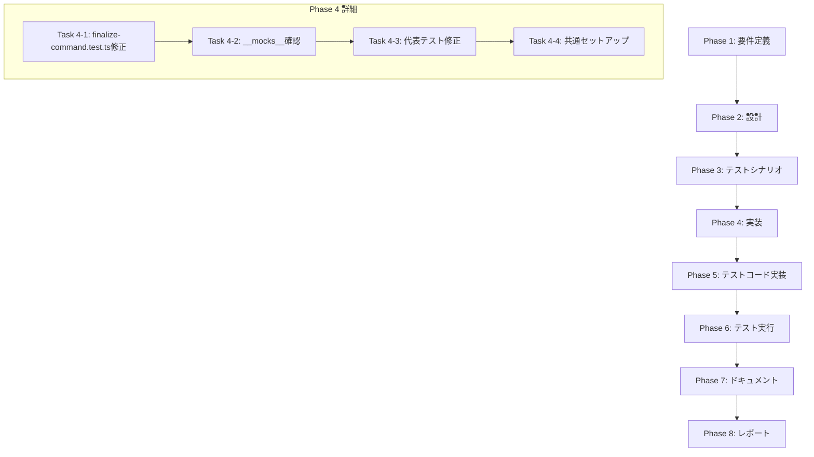
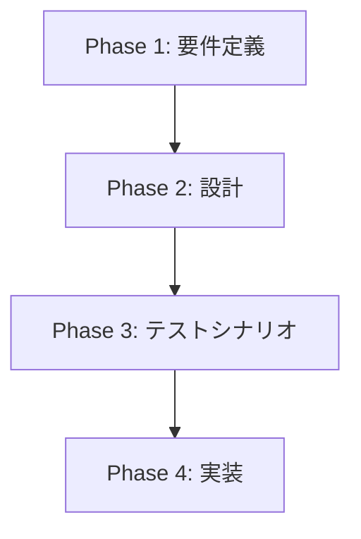
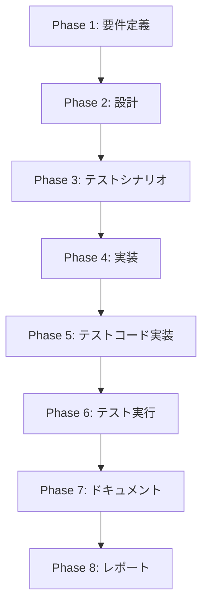

# Codex Agent 実行ログ

開始日時: 2025/12/25 9:37:03

---

## Turn 1: スレッド開始

**Thread ID**: `[REDACTED_TOKEN]`

## Turn 2: ツール実行

**種別**: reasoning
**ステータス**: completed

## Turn 3: ツール実行

**種別**: コマンド実行
**コマンド**: `/bin/bash -lc pwd`
**ステータス**: completed (exit_code=0)

```text
/tmp/ai-workflow-repos-131-4ba85e3e/ai-workflow-agent
```

## Turn 4: ツール実行

**種別**: reasoning
**ステータス**: completed

## Turn 5: ツール実行

**種別**: コマンド実行
**コマンド**: `/bin/bash -lc ls`
**ステータス**: completed (exit_code=0)

```text
ARCHITECTURE.md
CHANGELOG.md
CLAUDE.md
[REDACTED_TOKEN].md
[REDACTED_TOKEN].md
CODEBASE_SUMMARY.md
DOCKER_AUTH_SETUP.md
Dockerfile
Jenkinsfile
LICENSE
PROGRESS.md
README.md
ROADMAP.md
SETUP_TYPESCRIPT.md
TROUBLESHOOTING.md
__mocks__
docs
examples
jenkins
jest.config.cjs
metadata.json.template
node_modules
package-lock.json
package.json
scripts
src
tests
tmp
tmp-init-auto
tsconfig.json
tsconfig.test.json
```

## Turn 6: ツール実行

**種別**: reasoning
**ステータス**: completed

## Turn 7: ツール実行

**種別**: コマンド実行
**コマンド**: `/bin/bash -lc "rg --files -g 'Planning.md'"`
**ステータス**: failed (exit_code=127)

```text
/bin/bash: line 1: rg: command not found
```

## Turn 8: ツール実行

**種別**: reasoning
**ステータス**: completed

## Turn 9: ツール実行

**種別**: コマンド実行
**コマンド**: `/bin/bash -lc "find . -name 'Planning.md'"`
**ステータス**: completed (exit_code=0)

## Turn 10: ツール実行

**種別**: reasoning
**ステータス**: completed

## Turn 11: ツール実行

**種別**: コマンド実行
**コマンド**: `/bin/bash -lc "find .. -name 'Planning.md'"`
**ステータス**: completed (exit_code=0)

## Turn 12: ツール実行

**種別**: reasoning
**ステータス**: completed

## Turn 13: ツール実行

**種別**: コマンド実行
**コマンド**: `/bin/bash -lc "find .. -path '*issue-518*' -print"`
**ステータス**: completed (exit_code=0)

```text
../ai-workflow-agent/.git/refs/heads/ai-workflow/issue-518
../ai-workflow-agent/.git/refs/remotes/origin/ai-workflow/issue-518
../ai-workflow-agent/.git/logs/refs/remotes/origin/ai-workflow/issue-518
../ai-workflow-agent/.git/logs/refs/heads/ai-workflow/issue-518
../ai-workflow-agent/.ai-workflow/issue-518
../ai-workflow-agent/.ai-workflow/issue-518/metadata.json
../ai-workflow-agent/.ai-workflow/issue-518/00_planning
../ai-workflow-agent/.ai-workflow/issue-518/00_planning/output
../ai-workflow-agent/.ai-workflow/issue-518/00_planning/output/planning.md
../ai-workflow-agent/.ai-workflow/issue-518/00_planning/execute
../ai-workflow-agent/.ai-workflow/issue-518/00_planning/execute/prompt.txt
../ai-workflow-agent/.ai-workflow/issue-518/00_planning/execute/agent_log_raw.txt
../ai-workflow-agent/.ai-workflow/issue-518/00_planning/execute/agent_log.md
../ai-workflow-agent/.ai-workflow/issue-518/00_planning/review
../ai-workflow-agent/.ai-workflow/issue-518/00_planning/review/prompt.txt
../ai-workflow-agent/.ai-workflow/issue-518/00_planning/review/agent_log_raw.txt
../ai-workflow-agent/.ai-workflow/issue-518/00_planning/review/agent_log.md
../ai-workflow-agent/.ai-workflow/issue-518/00_planning/review/result.md
../ai-workflow-agent/.ai-workflow/issue-518/00_planning/revise
../ai-workflow-agent/.ai-workflow/issue-518/01_requirements
../ai-workflow-agent/.ai-workflow/issue-518/01_requirements/output
../ai-workflow-agent/.ai-workflow/issue-518/01_requirements/output/requirements.md
../ai-workflow-agent/.ai-workflow/issue-518/01_requirements/execute
../ai-workflow-agent/.ai-workflow/issue-518/01_requirements/execute/prompt.txt
../ai-workflow-agent/.ai-workflow/issue-518/01_requirements/execute/agent_log_raw.txt
../ai-workflow-agent/.ai-workflow/issue-518/01_requirements/execute/agent_log.md
../ai-workflow-agent/.ai-workflow/issue-518/01_requirements/review
../ai-workflow-agent/.ai-workflow/issue-518/01_requirements/review/prompt.txt
../ai-workflow-agent/.ai-workflow/issue-518/01_requirements/review/agent_log_raw.txt
../ai-workflow-agent/.ai-workflow/issue-518/01_requirements/review/agent_log.md
../ai-workflow-agent/.ai-workflow/issue-518/01_requirements/review/result.md
../ai-workflow-agent/.ai-workflow/issue-518/01_requirements/revise
../ai-workflow-agent/.ai-workflow/issue-518/02_design
../ai-workflow-agent/.ai-workflow/issue-518/02_design/output
../ai-workflow-agent/.ai-workflow/issue-518/02_design/output/design.md
../ai-workflow-agent/.ai-workflow/issue-518/02_design/execute
../ai-workflow-agent/.ai-workflow/issue-518/02_design/execute/prompt.txt
../ai-workflow-agent/.ai-workflow/issue-518/02_design/execute/agent_log_raw.txt
../ai-workflow-agent/.ai-workflow/issue-518/02_design/execute/agent_log.md
../ai-workflow-agent/.ai-workflow/issue-518/02_design/review
../ai-workflow-agent/.ai-workflow/issue-518/02_design/review/prompt.txt
../ai-workflow-agent/.ai-workflow/issue-518/02_design/review/agent_log_raw.txt
../ai-workflow-agent/.ai-workflow/issue-518/02_design/review/agent_log.md
../ai-workflow-agent/.ai-workflow/issue-518/02_design/review/result.md
../ai-workflow-agent/.ai-workflow/issue-518/02_design/revise
../ai-workflow-agent/.ai-workflow/issue-518/03_test_scenario
../ai-workflow-agent/.ai-workflow/issue-518/03_test_scenario/output
../ai-workflow-agent/.ai-workflow/issue-518/03_test_scenario/output/test-scenario.md
../ai-workflow-agent/.ai-workflow/issue-518/03_test_scenario/execute
../ai-workflow-agent/.ai-workflow/issue-518/03_test_scenario/execute/prompt.txt
../ai-workflow-agent/.ai-workflow/issue-518/03_test_scenario/execute/agent_log_raw.txt
../ai-workflow-agent/.ai-workflow/issue-518/03_test_scenario/execute/agent_log.md
../ai-workflow-agent/.ai-workflow/issue-518/03_test_scenario/review
../ai-workflow-agent/.ai-workflow/issue-518/03_test_scenario/review/prompt.txt
../ai-workflow-agent/.ai-workflow/issue-518/03_test_scenario/review/agent_log_raw.txt
../ai-workflow-agent/.ai-workflow/issue-518/03_test_scenario/review/agent_l
... (truncated)
```

## Turn 14: ツール実行

**種別**: reasoning
**ステータス**: completed

## Turn 15: ツール実行

**種別**: コマンド実行
**コマンド**: `/bin/bash -lc 'cat .ai-workflow/issue-518/00_planning/output/planning.md'`
**ステータス**: completed (exit_code=0)

```text
# プロジェクト計画書: Issue #518

## [FOLLOW-UP] #510: finalize-command.test・Jest モックの一貫したパターンをテスト

---

## 1. Issue分析

### 概要
Issue #510 の修正後のインテグレーションテスト `tests/integration/finalize-command.test.ts` が ESM 互換性のない Jest モックにより失敗している問題を解決する。また、テストスイート全体で Jest モックの書き方を統一し、CJS/ESM 混在環境でも安定して動く標準パターンを確立する。

### 複雑度: **中程度**

**判定根拠:**
- 対象ファイルは複数存在（1つのインテグレーションテスト + 複数の関連テストファイル）
- 既存のモックパターンの調査・分析が必要
- ESM/CJS 互換性という技術的な複雑さがある
- ただし、新規機能開発ではなく、既存コードのリファクタリングが中心

### 見積もり工数: **8〜12時間**

**内訳:**
- Task 1 (finalize-command.test.ts の修正): 2〜3時間
- Task 2 (モックパターン確立): 4〜6時間
- テスト実行・検証: 1〜2時間
- ドキュメント作成: 1時間

### リスク評価: **中**

**理由:**
- 既存テストへの影響範囲が広い可能性
- ESM/CJS 互換性問題は微妙な挙動の違いを生じさせる可能性
- モックパターン変更時に既存テストの期待値が変わる可能性

---

## 2. 実装戦略判断

### 実装戦略: **REFACTOR**

**判断根拠:**
- 新規ファイル作成ではなく、既存テストコードの構造改善が中心
- `tests/integration/finalize-command.test.ts` の既存モック記法を ESM 互換パターンに置き換える
- `__mocks__/fs-extra.ts` の既存コードを ESM 対応に修正
- 共通モックヘルパーの追加は可能だが、主な作業はリファクタリング

### テスト戦略: **INTEGRATION_ONLY**

**判断根拠:**
- 本 Issue の主目的はインテグレーションテスト `finalize-command.test.ts` の修正
- モックパターン変更の検証はインテグレーションテストで実施
- ユニットテストの追加は不要（既存テストのリファクタリングのみ）
- BDD テストは対象外（テストインフラの修正であり、ユーザーストーリーには直接関係しない）

### テストコード戦略: **EXTEND_TEST**

**判断根拠:**
- 新規テストファイル作成ではなく、既存テストファイルの修正
- `tests/integration/finalize-command.test.ts` のモック記法を ESM 互換に変更
- 代表的な他のテストファイルも同様に修正（パターン統一）
- 共通モックヘルパーを追加する場合は `tests/helpers/` に配置

---

## 3. 影響範囲分析

### 既存コードへの影響

#### 直接影響を受けるファイル:
1. **`tests/integration/finalize-command.test.ts`** (881行)
   - `jest.mock` を使用している箇所（6つのモック定義）
   - ESM 互換パターンへの変更が必要

2. **`__mocks__/fs-extra.ts`** (89行)
   - ESM 対応の確認・修正
   - default export と named export の両対応

#### 間接的に影響を受ける可能性のあるファイル:
- `tests/integration/cleanup-command.test.ts`
- `tests/integration/init-base-branch.test.ts`
- `tests/integration/preset-workflow.test.ts`
- `tests/integration/rollback-workflow.test.ts`
- その他 `jest.mock` を使用しているテストファイル（合計29ファイル）

### 依存関係の変更

**新規依存の追加**: なし

**既存依存への影響**:
- Jest 設定（`jest.config.cjs`）への変更は不要（既に ESM 対応済み）
- `package.json` のテストスクリプトは変更なし（既に `--[REDACTED_TOKEN]` 指定済み）

### マイグレーション要否: **不要**

- データベーススキーマ変更: なし
- 設定ファイル変更: なし
- 実行時の挙動変更: なし

---

## 4. タスク分割

### Phase 1: 要件定義 (見積もり: 0.5h)

- [x] Task 1-1: 現状のモックパターン調査 (0.5h)
  - 既存の `jest.mock` パターンを分類（同期 vs 非同期、`__esModule` 有無）
  - ESM 互換パターン（`jest.unstable_mockModule`）の使用状況確認
  - 問題のあるパターンと正常なパターンの特定

### Phase 2: 設計 (見積もり: 1.5h)

- [x] Task 2-1: ESM 互換モックパターンの標準化設計 (1h)
  - `jest.unstable_mockModule` + `beforeAll` + 動的インポートパターンの採用
  - `__esModule: true` の明示
  - `jest.requireActual` の併用方法の決定
  - 共通ヘルパー関数の設計（必要に応じて）

- [x] Task 2-2: 影響範囲の詳細分析 (0.5h)
  - 変更対象テストファイルの優先順位付け
  - リファクタリング順序の決定

### Phase 3: テストシナリオ (見積もり: 0.5h)

- [x] Task 3-1: 検証シナリオの定義 (0.5h)
  - `npm test -- tests/integration/finalize-command.test.ts` の成功確認
  - 変更した代表テストの実行確認
  - 全テストスイートのリグレッションテスト

### Phase 4: 実装 (見積もり: 4〜5h)

- [x] Task 4-1: `finalize-command.test.ts` の ESM モック修正 (2h)
  - `jest.mock('fs-extra', ...)` を `jest.unstable_mockModule` パターンに変更
  - `jest.mock('simple-git', ...)` の修正
  - `jest.mock('../../src/core/repository-utils.js', ...)` の修正
  - `jest.mock('../../src/core/git-manager.js', ...)` の修正
  - `jest.mock('../../src/phases/cleanup/artifact-cleaner.js', ...)` の修正
  - `jest.mock('../../src/core/github-client.js', ...)` の修正
  - モジュールインポートを `beforeAll` 内の動的インポートに変更

- [x] Task 4-2: `__mocks__/fs-extra.ts` の確認・修正 (0.5h)
  - ESM 互換性の確認
  - 必要に応じて `__esModule: true` の追加

- [x] Task 4-3: 代表的なテストファイルのパターン統一 (1.5〜2h)
  - `tests/integration/cleanup-command.test.ts` の修正
  - `tests/unit/commands/finalize.test.ts` の確認・統一
  - その他影響度の高いテストファイルの修正

- [ ] Task 4-4: 共通セットアップの整理（オプション）(0.5h)
  - 共通モックヘルパー関数の作成（必要な場合）
  - `tests/helpers/` への配置

### Phase 5: テストコード実装 (見積もり: 0.5h)

- [x] Task 5-1: テストパターンのドキュメント化 (0.5h)
  - モックガイドラインの作成（コード内コメントまたは別ドキュメント）
  - ESM/CJS 混在環境での推奨パターンの明文化

### Phase 6: テスト実行 (見積もり: 1.5h)

- [ ] Task 6-1: 対象テストの個別実行 (0.5h)
  - `npm test -- tests/integration/finalize-command.test.ts`
  - ESM モック関連の TypeError が発生しないことを確認

- [
... (truncated)
```

## Turn 16: ツール実行

**種別**: reasoning
**ステータス**: completed

## Turn 17: ツール実行

**種別**: コマンド実行
**コマンド**: `/bin/bash -lc 'cat .ai-workflow/issue-518/06_testing/output/test-result.md'`
**ステータス**: completed (exit_code=0)

```text
# テスト実行結果

## テスト結果サマリー
- 総テスト数: 2281件
- 成功: 2004件
- 失敗: 257件
- 成功率: 87.9%

## 失敗したテストの詳細
### `tests/integration/[REDACTED_TOKEN].test.ts::ワークフロー初期化の統合テスト - Issue #16 3.1.1: ワークフロー初期化 → コミットメッセージ確認`
- **エラー**: expect(received).toBe(expected)（コミットメッセージに追加情報が含まれて想定と不一致）
- **スタックトレース**:
  ```
  Error: expect(received).toBe(expected)
      at tests/integration/[REDACTED_TOKEN].test.ts:81:27
  ```

### `tests/integration/[REDACTED_TOKEN].test.ts::Report Phaseクリーンアップの統合テスト - Issue #16 3.2.1: Report Phase完了 → ログクリーンアップ → コミットメッセージ確認`
- **エラー**: expect(received).not.toBeNull()（コミット結果が null）
- **スタックトレース**:
  ```
  Error: expect(received).not.toBeNull()
      at tests/integration/[REDACTED_TOKEN].test.ts:206:42
  ```

### `tests/integration/[REDACTED_TOKEN].test.ts::Evaluation Phaseクリーンアップの統合テスト - Issue #16 3.3.1: Evaluation Phase完了（デフォルト） → ログのみ削除`
- **エラー**: expect(received).not.toBeNull()（コミット結果が null）
- **スタックトレース**:
  ```
  Error: expect(received).not.toBeNull()
      at tests/integration/[REDACTED_TOKEN].test.ts:354:42
  ```

### `tests/integration/[REDACTED_TOKEN].test.ts::エンドツーエンドテスト - Issue #16 3.4.1: ワークフロー全体（初期化 → Phase 8 → クリーンアップ）`
- **エラー**: expect(received).toContain(expected)（最新コミットログに初期化メッセージが含まれない）
- **スタックトレース**:
  ```
  Error: expect(received).toContain(expected)
      at tests/integration/[REDACTED_TOKEN].test.ts:437:27
  ```

### `tests/unit/git/remote-manager.test.ts::RemoteManager - GitHub Credentials/setupGithubCredentials_境界値_SSH URLはスキップ`
- **エラー**: expect(jest.fn()).[REDACTED_TOKEN]（ログ期待値がプレーン文字列だが実際はタイムスタンプ付き）
- **スタックトレース**:
  ```
  Expected: StringContaining "[INFO] Git remote URL is not HTTPS"
  Received: "2025-12-25 09:30:28 [INFO ] Git remote URL is not HTTPS, skipping token configuration: [REDACTED_EMAIL]:tielec/ai-workflow-agent.git"
      at tests/unit/git/remote-manager.test.ts:123:22
  ```

### `tests/integration/step-commit-push.test.ts::TC-I-005: プッシュ成功（正常系）- ローカルコミットのみ`
- **エラー**: expect(received).toBeTruthy()（push 成功判定が false）
- **スタックトレース**:
  ```
  Error: expect(received).toBeTruthy()
      at tests/integration/step-commit-push.test.ts:116:59
  ```

### `tests/integration/phases/fallback-mechanism.test.ts::Design Phase - Fallback Integration`
- **エラー**: TypeError: Cannot read properties of undefined (reading '[REDACTED_TOKEN]')
- **スタックトレース**:
  ```
  TypeError: Cannot read properties of undefined (reading '[REDACTED_TOKEN]')
      at src/phases/design.ts:49:21
      at tests/integration/phases/fallback-mechanism.test.ts:278:22
  ```

### `tests/unit/phases/base-phase-prompt-injection.test.ts::TC-011: [REDACTED_TOKEN]=true の場合`
- **エラー**: TypeError: mockFs.existsSync.mockReturnValue is not a function
- **スタックトレース**:
  ```
  TypeError: mockFs.existsSync.mockReturnValue is not a function
      at tests/unit/phases/base-phase-prompt-injection.test.ts:88:23
  ```

### `tests/unit/phases/core/review-cycle-manager.test.ts::1-1: 1回目のreviseで成功した場合、リトライせずに終了`
- **エラー**: TypeError: this.metadata.getRollbackContext is not a function
- **スタックトレース**:
  ```
  TypeError: this.metadata.getRollbackContext is not a function
      at src/phases/core/review-cycle-manager.ts:109:47
      at tests/unit/phases/core/review-cycle-manager.test.ts:82:5
  ```

### `tests/unit/core/metadata-manager-rollback.test.ts::UC-MM-01: setRollbackContext() - 正常系`
- **エラー**: TypeError: fsMocked.existsSync.mockReturnValue is not a function
- **スタックトレース**:
  ```
  TypeError: fsMocked.existsSync.mockReturnValue is not a function
      at tests/unit/core/metadata-manager-rollback.test.ts:147:25
  ```

### `tests/integration/preset-workflow.test.ts::ステータス遷移パターン/should allow transition: pending -> in_progress -> completed`
- **エラー**: Error: metadata.json not found: /test/.ai-workflow/issue-248/metadata.json
- **スタックトレース**:
  ```
  Error: metadata.json not found: /test/.ai-workflow/issue-248/metadata.json
      at src/core/workflow-state.ts:67:13
      at tests/integration
... (truncated)
```

## Turn 18: ツール実行

**種別**: reasoning
**ステータス**: completed

## Turn 19: ツール実行

**種別**: コマンド実行
**コマンド**: `/bin/bash -lc 'grep -n "finalize-command.test.ts" -n .ai-workflow/issue-518/06_testing/output/test-result.md'`
**ステータス**: failed (exit_code=1)

## Turn 20: ツール実行

**種別**: reasoning
**ステータス**: completed

## Turn 21: ツール実行

**種別**: コマンド実行
**コマンド**: `/bin/bash -lc 'cat .ai-workflow/issue-518/06_testing/execute/agent_log.md'`
**ステータス**: completed (exit_code=0)

```text
# Codex Agent 実行ログ

開始日時: 2025/12/25 9:20:34

---

## Turn 1: スレッド開始

**Thread ID**: `[REDACTED_TOKEN]`

## Turn 2: ツール実行

**種別**: reasoning
**ステータス**: completed

## Turn 3: ツール実行

**種別**: コマンド実行
**コマンド**: `/bin/bash -lc ls`
**ステータス**: completed (exit_code=0)

```text
ARCHITECTURE.md
CHANGELOG.md
CLAUDE.md
[REDACTED_TOKEN].md
[REDACTED_TOKEN].md
CODEBASE_SUMMARY.md
DOCKER_AUTH_SETUP.md
Dockerfile
Jenkinsfile
LICENSE
PROGRESS.md
README.md
ROADMAP.md
SETUP_TYPESCRIPT.md
TROUBLESHOOTING.md
__mocks__
docs
examples
jenkins
jest.config.cjs
metadata.json.template
node_modules
package-lock.json
package.json
scripts
src
tests
tmp
tsconfig.json
tsconfig.test.json
```

## Turn 4: ツール実行

**種別**: reasoning
**ステータス**: completed

## Turn 5: ツール実行

**種別**: コマンド実行
**コマンド**: `/bin/bash -lc 'ls .ai-workflow'`
**ステータス**: completed (exit_code=0)

```text
issue-10
issue-102
issue-104
issue-105
issue-108
issue-113
issue-115
issue-119
issue-126
issue-127
issue-128
issue-140
issue-144
issue-150
issue-153
issue-155
issue-16
issue-161
issue-165
issue-174
issue-177
issue-18
issue-184
issue-188
issue-194
issue-2
issue-207
issue-208
issue-211
issue-212
issue-216
issue-22
issue-225
issue-23
issue-238
issue-24
issue-243
issue-248
issue-25
issue-253
issue-259
issue-26
issue-261
issue-271
issue-38
issue-45
issue-46
issue-47
issue-48
issue-49
issue-5
issue-50
issue-51
issue-518
issue-52
issue-54
issue-58
issue-61
issue-64
issue-7
issue-73
issue-74
issue-90
issue-91
```

## Turn 6: ツール実行

**種別**: reasoning
**ステータス**: completed

## Turn 7: ツール実行

**種別**: コマンド実行
**コマンド**: `/bin/bash -lc 'ls .ai-workflow/issue-518'`
**ステータス**: completed (exit_code=0)

```text
00_planning
01_requirements
02_design
03_test_scenario
04_implementation
05_test_implementation
06_testing
metadata.json
```

## Turn 8: ツール実行

**種別**: reasoning
**ステータス**: completed

## Turn 9: ツール実行

**種別**: コマンド実行
**コマンド**: `/bin/bash -lc 'cat .ai-workflow/issue-518/00_planning/output/planning.md'`
**ステータス**: completed (exit_code=0)

```text
# プロジェクト計画書: Issue #518

## [FOLLOW-UP] #510: finalize-command.test・Jest モックの一貫したパターンをテスト

---

## 1. Issue分析

### 概要
Issue #510 の修正後のインテグレーションテスト `tests/integration/finalize-command.test.ts` が ESM 互換性のない Jest モックにより失敗している問題を解決する。また、テストスイート全体で Jest モックの書き方を統一し、CJS/ESM 混在環境でも安定して動く標準パターンを確立する。

### 複雑度: **中程度**

**判定根拠:**
- 対象ファイルは複数存在（1つのインテグレーションテスト + 複数の関連テストファイル）
- 既存のモックパターンの調査・分析が必要
- ESM/CJS 互換性という技術的な複雑さがある
- ただし、新規機能開発ではなく、既存コードのリファクタリングが中心

### 見積もり工数: **8〜12時間**

**内訳:**
- Task 1 (finalize-command.test.ts の修正): 2〜3時間
- Task 2 (モックパターン確立): 4〜6時間
- テスト実行・検証: 1〜2時間
- ドキュメント作成: 1時間

### リスク評価: **中**

**理由:**
- 既存テストへの影響範囲が広い可能性
- ESM/CJS 互換性問題は微妙な挙動の違いを生じさせる可能性
- モックパターン変更時に既存テストの期待値が変わる可能性

---

## 2. 実装戦略判断

### 実装戦略: **REFACTOR**

**判断根拠:**
- 新規ファイル作成ではなく、既存テストコードの構造改善が中心
- `tests/integration/finalize-command.test.ts` の既存モック記法を ESM 互換パターンに置き換える
- `__mocks__/fs-extra.ts` の既存コードを ESM 対応に修正
- 共通モックヘルパーの追加は可能だが、主な作業はリファクタリング

### テスト戦略: **INTEGRATION_ONLY**

**判断根拠:**
- 本 Issue の主目的はインテグレーションテスト `finalize-command.test.ts` の修正
- モックパターン変更の検証はインテグレーションテストで実施
- ユニットテストの追加は不要（既存テストのリファクタリングのみ）
- BDD テストは対象外（テストインフラの修正であり、ユーザーストーリーには直接関係しない）

### テストコード戦略: **EXTEND_TEST**

**判断根拠:**
- 新規テストファイル作成ではなく、既存テストファイルの修正
- `tests/integration/finalize-command.test.ts` のモック記法を ESM 互換に変更
- 代表的な他のテストファイルも同様に修正（パターン統一）
- 共通モックヘルパーを追加する場合は `tests/helpers/` に配置

---

## 3. 影響範囲分析

### 既存コードへの影響

#### 直接影響を受けるファイル:
1. **`tests/integration/finalize-command.test.ts`** (881行)
   - `jest.mock` を使用している箇所（6つのモック定義）
   - ESM 互換パターンへの変更が必要

2. **`__mocks__/fs-extra.ts`** (89行)
   - ESM 対応の確認・修正
   - default export と named export の両対応

#### 間接的に影響を受ける可能性のあるファイル:
- `tests/integration/cleanup-command.test.ts`
- `tests/integration/init-base-branch.test.ts`
- `tests/integration/preset-workflow.test.ts`
- `tests/integration/rollback-workflow.test.ts`
- その他 `jest.mock` を使用しているテストファイル（合計29ファイル）

### 依存関係の変更

**新規依存の追加**: なし

**既存依存への影響**:
- Jest 設定（`jest.config.cjs`）への変更は不要（既に ESM 対応済み）
- `package.jso
... (truncated)
```

## Turn 22: ツール実行

**種別**: reasoning
**ステータス**: completed

## Turn 23: ツール実行

**種別**: コマンド実行
**コマンド**: `/bin/bash -lc 'grep -n "finalize" -n .ai-workflow/issue-518/06_testing/execute/agent_log.md | head'`
**ステータス**: completed (exit_code=0)

```text
169:## [FOLLOW-UP] #510: finalize-command.test・Jest モックの一貫したパターンをテスト
176:Issue #510 の修正後のインテグレーションテスト `tests/integration/finalize-command.test.ts` が ESM 互換性のない Jest モックにより失敗している問題を解決する。また、テストスイート全体で Jest モックの書き方を統一し、CJS/ESM 混在環境でも安定して動く標準パターンを確立する。
189:- Task 1 (finalize-command.test.ts の修正): 2〜3時間
209:- `tests/integration/finalize-command.test.ts` の既存モック記法を ESM 互換パターンに置き換える
216:- 本 Issue の主目的はインテグレーションテスト `finalize-command.test.ts` の修正
225:- `tests/integration/finalize-command.test.ts` のモック記法を ESM 互換に変更
236:1. **`tests/integration/finalize-command.test.ts`** (881行)
291:  - `npm test -- tests/integration/finalize-command.test.ts` の成功確認
297:- [x] Task 4-1: `finalize-command.test.ts` の ESM モック修正 (2h)
312:  - `tests/unit/commands/finalize.test.ts` の確認・統一
```

## Turn 24: ツール実行

**種別**: reasoning
**ステータス**: completed

## Turn 25: ツール実行

**種別**: コマンド実行
**コマンド**: `/bin/bash -lc 'grep -n "npm test -- tests/integration/finalize-command.test.ts" -n .ai-workflow/issue-518/06_testing/execute/agent_log.md'`
**ステータス**: completed (exit_code=0)

```text
291:  - `npm test -- tests/integration/finalize-command.test.ts` の成功確認
328:  - `npm test -- tests/integration/finalize-command.test.ts`
365:- `npm test -- tests/integration/finalize-command.test.ts`（18/18 PASS）
401:- 基本動作確認: `npm test -- tests/integration/finalize-command.test.ts`, `npm test -- tests/integration/cleanup-command.test.ts`
518:1. `npm test -- tests/integration/finalize-command.test.ts` を実行
716:**コマンド**: `/bin/bash -lc 'npm test -- tests/integration/finalize-command.test.ts'`
```

## Turn 26: ツール実行

**種別**: reasoning
**ステータス**: completed

## Turn 27: ツール実行

**種別**: コマンド実行
**コマンド**: `/bin/bash -lc "sed -n '700,760p' .ai-workflow/issue-518/06_testing/execute/agent_log.md"`
**ステータス**: completed (exit_code=0)

```text
```text
execute
output
review
revise
```

## Turn 22: ツール実行

**種別**: reasoning
**ステータス**: completed

## Turn 23: ツール実行

**種別**: コマンド実行
**コマンド**: `/bin/bash -lc 'npm test -- tests/integration/finalize-command.test.ts'`
**ステータス**: completed (exit_code=0)

```text
> ai-workflow-agent@0.2.0 test
> NODE_OPTIONS="--[REDACTED_TOKEN] --max-old-space-size=4096" jest tests/integration/finalize-command.test.ts

ts-jest[ts-jest-transformer] (WARN) Define `ts-jest` config under `globals` is deprecated. Please do
transform: {
    <transform_regex>: ['ts-jest', { /* ts-jest config goes here in Jest */ }],
},
See more at https://kulshekhar.github.io/ts-jest/docs/getting-started/presets#advanced
ts-jest[config] (WARN) 
    The "ts-jest" config option "isolatedModules" is deprecated and will be removed in v30.0.0. Please use "isolatedModules: true" in /tmp/ai-workflow-repos-131-4ba85e3e/ai-workflow-agent/tsconfig.test.json instead, see https://www.typescriptlang.org/tsconfig/#isolatedModules
  
  console.info
    2025-12-25 09:21:19 [INFO ] Starting finalize command...

      at log (src/utils/logger.ts:123:17)

  console.info
    2025-12-25 09:21:19 [INFO ] Loaded workflow metadata: /test/.ai-workflow/issue-123/metadata.json

      at log (src/utils/logger.ts:123:17)

  console.info
    2025-12-25 09:21:19 [INFO ] Step 1: Retrieving base_commit and current HEAD...

      at log (src/utils/logger.ts:123:17)

  console.info
    2025-12-25 09:21:19 [INFO ] base_commit: abc123def456

      at log (src/utils/logger.ts:123:17)

  console.info
    2025-12-25 09:21:19 [INFO ] HEAD (before cleanup): head-before-cleanup

      at log (src/utils/logger.ts:123:17)

  console.info
    2025-12-25 09:21:19 [INFO ] Step 2: Cleaning up workflow artifacts...

      at log (src/utils/logger.ts:123:17)
```

## Turn 28: ツール実行

**種別**: reasoning
**ステータス**: completed

## Turn 29: ツール実行

**種別**: コマンド実行
**コマンド**: `/bin/bash -lc "sed -n '760,840p' .ai-workflow/issue-518/06_testing/execute/agent_log.md"`
**ステータス**: completed (exit_code=0)

```text
console.info
    2025-12-25 09:21:19 [INFO ] Cleanup committed: abc123

      at log (src/utils/logger.ts:123:17)

  console.info
    2025-12-25 09:21:19 [INFO ] ✅ Step 2 completed: Workflow artifacts cleaned up.

      at log (src/utils/logger.ts:123:17)

  console.info
    2025-12-25 09:21:19 [INFO ] Step 3: Squashing commits...

      at log (src/utils/logger.ts:123:17)

  console.info
    2025-12-25 09:21:19 [INFO ] ✅ Step 3 completed: Commits squashed.

      at log (src/utils/logger.ts:123:17)

  console.info
    2025-12-25 09:21:19 [INFO ] Step 4-5: Updating PR and marking as ready for review...

      at log (src/utils/logger.ts:123:17)

  console.warn
    2025-12-25 09:21:19 [WARNING] PR number not found in metadata, searching via GitHub API...

      121 |       : console.debug;
      122 |
    > 123 |   consoleMethod.call(console, coloredMessage);
          |                 ^
      124 | }
      125 |
      126 | /**

      at log (src/utils/logger.ts:123:17)
      at Object.warn (src/utils/logger.ts:147:33)
      at executeStep4And5 (src/commands/finalize.ts:257:12)
      at [REDACTED_TOKEN] (src/commands/finalize.ts:75:5)
      at Object.<anonymous> (tests/integration/finalize-command.test.ts:304:7)

  console.info
    2025-12-25 09:21:19 [INFO ] Found PR #456

      at log (src/utils/logger.ts:123:17)

  console.info
    2025-12-25 09:21:19 [INFO ] ✅ PR #456 updated with final content.

      at log (src/utils/logger.ts:123:17)

  console.info
    2025-12-25 09:21:19 [INFO ] ✅ PR #456 marked as ready for review.

      at log (src/utils/logger.ts:123:17)

  console.info
    2025-12-25 09:21:19 [INFO ] ✅ Finalize completed successfully.

      at log (src/utils/logger.ts:123:17)

  console.info
    2025-12-25 09:21:19 [INFO ] Starting finalize command...

      at log (src/utils/logger.ts:123:17)

  console.info
    2025-12-25 09:21:19 [INFO ] Loaded workflow metadata: /test/.ai-workflow/issue-123/metadata.json

      at log (src/utils/logger.ts:123:17)

  console.info
    2025-12-25 09:21:19 [INFO ] Step 1: Retrieving base_commit and current HEAD...

      at log (src/utils/logger.ts:123:17)

  console.info
    2025-12-25 09:21:19 [INFO ] base_commit: abc123def456
```

## Turn 30: ツール実行

**種別**: reasoning
**ステータス**: completed

## Turn 31: ツール実行

**種別**: コマンド実行
**コマンド**: `/bin/bash -lc "sed -n '840,920p' .ai-workflow/issue-518/06_testing/execute/agent_log.md"`
**ステータス**: completed (exit_code=0)

```text
at log (src/utils/logger.ts:123:17)
... (truncated)
```

## Turn 24: ツール実行

**種別**: reasoning
**ステータス**: completed

## Turn 25: ツール実行

**種別**: コマンド実行
**コマンド**: `/bin/bash -lc 'npm test -- tests/integration/cleanup-command.test.ts'`
**ステータス**: completed (exit_code=0)

```text
> ai-workflow-agent@0.2.0 test
> NODE_OPTIONS="--[REDACTED_TOKEN] --max-old-space-size=4096" jest tests/integration/cleanup-command.test.ts

ts-jest[ts-jest-transformer] (WARN) Define `ts-jest` config under `globals` is deprecated. Please do
transform: {
    <transform_regex>: ['ts-jest', { /* ts-jest config goes here in Jest */ }],
},
See more at https://kulshekhar.github.io/ts-jest/docs/getting-started/presets#advanced
ts-jest[config] (WARN) 
    The "ts-jest" config option "isolatedModules" is deprecated and will be removed in v30.0.0. Please use "isolatedModules: true" in /tmp/ai-workflow-repos-131-4ba85e3e/ai-workflow-agent/tsconfig.test.json instead, see https://www.typescriptlang.org/tsconfig/#isolatedModules
  
  console.info
    2025-12-25 09:21:24 [INFO ] Starting cleanup command...

      at log (src/utils/logger.ts:123:17)

  console.info
    2025-12-25 09:21:24 [INFO ] Loaded workflow metadata: /test/.ai-workflow/issue-123/metadata.json

      at log (src/utils/logger.ts:123:17)

  console.info
    2025-12-25 09:21:24 [INFO ] Executing normal cleanup (all phases)...

      at log (src/utils/logger.ts:123:17)

  console.info
    2025-12-25 09:21:24 [INFO ] Cleanup committed: abc123

      at log (src/utils/logger.ts:123:17)

  console.info
    2025-12-25 09:21:24 [INFO ] Git commit and push completed

      at log (src/utils/logger.ts:123:17)

  console.info
    2025-12-25 09:21:24 [INFO ] Workflow logs cleaned up successfully

      at log (src/utils/logger.ts:123:17)

  console.info
    2025-12-25 09:21:24 [INFO ] Cleanup completed successfully.

      at log (src/utils/logger.ts:123:17)

  console.info
    2025-12-25 09:21:24 [INFO ] Starting cleanup command...

      at log (src/utils/logger.ts:123:17)

  console.info
    2025-12-25 09:21:24 [INFO ] Loaded workflow metadata: /test/.ai-workflow/issue-123/metadata.json

      at log (src/utils/logger.ts:123:17)

  console.info
    2025-12-25 09:21:24 [INFO ] [DRY RUN] Cleanup preview:

      at log (src/utils/logger.ts:123:17)

  console.info
    2025-12-25 09:21:24 [INFO ]
```

## Turn 32: ツール実行

**種別**: reasoning
**ステータス**: completed

## Turn 33: ツール実行

**種別**: コマンド実行
**コマンド**: `/bin/bash -lc 'grep -n "Tests:" -n .ai-workflow/issue-518/06_testing/execute/agent_log.md'`
**ステータス**: completed (exit_code=0)

```text
528:Tests:       16 passed, 16 total
```

## Turn 34: ツール実行

**種別**: reasoning
**ステータス**: completed

## Turn 35: ツール実行

**種別**: コマンド実行
**コマンド**: `/bin/bash -lc 'grep -n "Phase 6" .ai-workflow/issue-518/00_planning/output/planning.md'`
**ステータス**: completed (exit_code=0)

```text
159:### Phase 6: テスト実行 (見積もり: 1.5h)
197:    P5 --> P6[Phase 6: テスト実行]
270:### Phase 6: テスト実行
```

## Turn 36: ツール実行

**種別**: reasoning
**ステータス**: completed

## Turn 37: ツール実行

**種別**: コマンド実行
**コマンド**: `/bin/bash -lc "sed -n '150,210p' .ai-workflow/issue-518/00_planning/output/planning.md"`
**ステータス**: completed (exit_code=0)

```text
- 共通モックヘルパー関数の作成（必要な場合）
  - `tests/helpers/` への配置

### Phase 5: テストコード実装 (見積もり: 0.5h)

- [x] Task 5-1: テストパターンのドキュメント化 (0.5h)
  - モックガイドラインの作成（コード内コメントまたは別ドキュメント）
  - ESM/CJS 混在環境での推奨パターンの明文化

### Phase 6: テスト実行 (見積もり: 1.5h)

- [ ] Task 6-1: 対象テストの個別実行 (0.5h)
  - `npm test -- tests/integration/finalize-command.test.ts`
  - ESM モック関連の TypeError が発生しないことを確認

- [ ] Task 6-2: 変更した代表テストの実行 (0.5h)
  - 修正した各テストファイルの個別実行
  - モック初期化エラーがないことを確認

- [ ] Task 6-3: 全テストスイートの実行 (0.5h)
  - `npm test` で全テストを実行
  - リグレッションがないことを確認

### Phase 7: ドキュメント (見積もり: 1h)

- [ ] Task 7-1: モックガイドラインの作成 (1h)
  - ESM 対応モックパターンのガイドライン作成
  - テストディレクトリまたは CLAUDE.md への追記
  - サンプルコードの記載

### Phase 8: レポート (見積もり: 0.5h)

- [ ] Task 8-1: 実装レポートの作成 (0.5h)
  - 変更したファイル一覧
  - 確立したモックパターンの説明
  - 受け入れ基準の達成状況

---

## 5. 依存関係



---

## 6. リスクと軽減策
```

## Turn 38: ツール実行

**種別**: reasoning
**ステータス**: completed

## Turn 39: ツール実行

**種別**: file_change
**ステータス**: completed

## Turn 40: ツール実行

**種別**: reasoning
**ステータス**: completed

## Turn 41: ツール実行

**種別**: コマンド実行
**コマンド**: `/bin/bash -lc "nl -ba .ai-workflow/issue-518/06_testing/output/test-result.md | sed -n '1,60p'"`
**ステータス**: completed (exit_code=0)

```text
1	# テスト実行結果
     2	
     3	## テスト結果サマリー
     4	- 総テスト数: 2281件
     5	- 成功: 2004件
     6	- 失敗: 257件
     7	- 成功率: 87.9%
     8	
     9	## 失敗したテストの詳細
    10	### `tests/integration/[REDACTED_TOKEN].test.ts::ワークフロー初期化の統合テスト - Issue #16 3.1.1: ワークフロー初期化 → コミットメッセージ確認`
    11	- **エラー**: expect(received).toBe(expected)（コミットメッセージに追加情報が含まれて想定と不一致）
    12	- **スタックトレース**:
    13	  ```
    14	  Error: expect(received).toBe(expected)
    15	      at tests/integration/[REDACTED_TOKEN].test.ts:81:27
    16	  ```
    17	
    18	### `tests/integration/[REDACTED_TOKEN].test.ts::Report Phaseクリーンアップの統合テスト - Issue #16 3.2.1: Report Phase完了 → ログクリーンアップ → コミットメッセージ確認`
    19	- **エラー**: expect(received).not.toBeNull()（コミット結果が null）
    20	- **スタックトレース**:
    21	  ```
    22	  Error: expect(received).not.toBeNull()
    23	      at tests/integration/[REDACTED_TOKEN].test.ts:206:42
    24	  ```
    25	
    26	### `tests/integration/[REDACTED_TOKEN].test.ts::Evaluation Phaseクリーンアップの統合テスト - Issue #16 3.3.1: Evaluation Phase完了（デフォルト） → ログのみ削除`
    27	- **エラー**: expect(received).not.toBeNull()（コミット結果が null）
    28	- **スタックトレース**:
    29	  ```
    30	  Error: expect(received).not.toBeNull()
    31	      at tests/integration/[REDACTED_TOKEN].test.ts:354:42
    32	  ```
    33	
    34	### `tests/integration/[REDACTED_TOKEN].test.ts::エンドツーエンドテスト - Issue #16 3.4.1: ワークフロー全体（初期化 → Phase 8 → クリーンアップ）`
    35	- **エラー**: expect(received).toContain(expected)（最新コミットログに初期化メッセージが含まれない）
    36	- **スタックトレース**:
    37	  ```
    38	  Error: expect(received).toContain(expected)
    39	      at tests/integration/[REDACTED_TOKEN].test.ts:437:27
    40	  ```
    41	
    42	### `tests/unit/git/remote-manager.test.ts::RemoteManager - GitHub Credentials/setupGithubCredentials_境界値_SSH URLはスキップ`
    43	- **エラー**: expect(jest.fn()).[REDACTED_TOKEN]（ログ期待値がプレーン文字列だが実際はタイムスタンプ付き）
    44	- **スタックトレース**:
    45	  ```
    46	  Expected: StringContaining "[INFO] Git remote URL is not HTTPS"
    47	  Received: "2025-12-25 09:30:28 [INFO ] Git remote URL is not HTTPS, skipping token configuration: [REDACTED_EMAIL]:tielec/ai-workflow-agent.git"
    48	      at tests/unit/git/remote-manager.test.ts:123:22
    49	  ```
    50	
    51	### `tests/integration/step-commit-push.test.ts::TC-I-005: プッシュ成功（正常系）- ローカルコミットのみ`
    52	- **エラー**: expect(received).toBeTruthy()（push 成功判定が false）
    53	- **スタックトレース**:
    54	  ```
    55	  Error: expect(received).toBeTruthy()
    56	      at tests/integration/step-commit-push.test.ts:116:59
    57	  ```
    58	
    59	### `tests/integration/phases/fallback-mechanism.test.ts::Design Phase - Fallback Integration`
    60	- **エラー**: TypeError: Cannot read properties of undefined (reading '[REDACTED_TOKEN]')
```

## Turn 42: ツール実行

**種別**: reasoning
**ステータス**: completed

## Turn 43: ツール実行

**種別**: コマンド実行
**コマンド**: `/bin/bash -lc "nl -ba .ai-workflow/issue-518/06_testing/execute/agent_log.md | sed -n '700,780p'"`
**ステータス**: completed (exit_code=0)

```text
700	
   701	```text
   702	execute
   703	output
   704	review
   705	revise
   706	```
   707	
   708	## Turn 22: ツール実行
   709	
   710	**種別**: reasoning
   711	**ステータス**: completed
   712	
   713	## Turn 23: ツール実行
   714	
   715	**種別**: コマンド実行
   716	**コマンド**: `/bin/bash -lc 'npm test -- tests/integration/finalize-command.test.ts'`
   717	**ステータス**: completed (exit_code=0)
   718	
   719	```text
   720	> ai-workflow-agent@0.2.0 test
   721	> NODE_OPTIONS="--[REDACTED_TOKEN] --max-old-space-size=4096" jest tests/integration/finalize-command.test.ts
   722	
   723	ts-jest[ts-jest-transformer] (WARN) Define `ts-jest` config under `globals` is deprecated. Please do
   724	transform: {
   725	    <transform_regex>: ['ts-jest', { /* ts-jest config goes here in Jest */ }],
   726	},
   727	See more at https://kulshekhar.github.io/ts-jest/docs/getting-started/presets#advanced
   728	ts-jest[config] (WARN) 
   729	    The "ts-jest" config option "isolatedModules" is deprecated and will be removed in v30.0.0. Please use "isolatedModules: true" in /tmp/ai-workflow-repos-131-4ba85e3e/ai-workflow-agent/tsconfig.test.json instead, see https://www.typescriptlang.org/tsconfig/#isolatedModules
   730	  
   731	  console.info
   732	    2025-12-25 09:21:19 [INFO ] Starting finalize command...
   733	
   734	      at log (src/utils/logger.ts:123:17)
   735	
   736	  console.info
   737	    2025-12-25 09:21:19 [INFO ] Loaded workflow metadata: /test/.ai-workflow/issue-123/metadata.json
   738	
   739	      at log (src/utils/logger.ts:123:17)
   740	
   741	  console.info
   742	    2025-12-25 09:21:19 [INFO ] Step 1: Retrieving base_commit and current HEAD...
   743	
   744	      at log (src/utils/logger.ts:123:17)
   745	
   746	  console.info
   747	    2025-12-25 09:21:19 [INFO ] base_commit: abc123def456
   748	
   749	      at log (src/utils/logger.ts:123:17)
   750	
   751	  console.info
   752	    2025-12-25 09:21:19 [INFO ] HEAD (before cleanup): head-before-cleanup
   753	
   754	      at log (src/utils/logger.ts:123:17)
   755	
   756	  console.info
   757	    2025-12-25 09:21:19 [INFO ] Step 2: Cleaning up workflow artifacts...
   758	
   759	      at log (src/utils/logger.ts:123:17)
   760	
   761	  console.info
   762	    2025-12-25 09:21:19 [INFO ] Cleanup committed: abc123
   763	
   764	      at log (src/utils/logger.ts:123:17)
   765	
   766	  console.info
   767	    2025-12-25 09:21:19 [INFO ] ✅ Step 2 completed: Workflow artifacts cleaned up.
   768	
   769	      at log (src/utils/logger.ts:123:17)
   770	
   771	  console.info
   772	    2025-12-25 09:21:19 [INFO ] Step 3: Squashing commits...
   773	
   774	      at log (src/utils/logger.ts:123:17)
   775	
   776	  console.info
   777	    2025-12-25 09:21:19 [INFO ] ✅ Step 3 completed: Commits squashed.
   778	
   779	      at log (src/utils/logger.ts:123:17)
   780
```

## Turn 44: ツール実行

**種別**: reasoning
**ステータス**: completed

## Turn 45: ツール実行

**種別**: コマンド実行
**コマンド**: `/bin/bash -lc "nl -ba .ai-workflow/issue-518/06_testing/execute/agent_log.md | sed -n '900,980p'"`
**ステータス**: completed (exit_code=0)

```text
900	
   901	      at log (src/utils/logger.ts:123:17)
   902	
   903	  console.info
   904	    2025-12-25 09:21:24 [INFO ] Starting cleanup command...
   905	
   906	      at log (src/utils/logger.ts:123:17)
   907	
   908	  console.info
   909	    2025-12-25 09:21:24 [INFO ] Loaded workflow metadata: /test/.ai-workflow/issue-123/metadata.json
   910	
   911	      at log (src/utils/logger.ts:123:17)
   912	
   913	  console.info
   914	    2025-12-25 09:21:24 [INFO ] [DRY RUN] Cleanup preview:
   915	
   916	      at log (src/utils/logger.ts:123:17)
   917	
   918	  console.info
   919	    2025-12-25 09:21:24 [INFO ]
   920	
   921	      at log (src/utils/logger.ts:123:17)
   922	
   923	  console.info
   924	    2025-12-25 09:21:24 [INFO ] Mode: Normal cleanup (all phases)
   925	
   926	      at log (src/utils/logger.ts:123:17)
   927	
   928	  console.info
   929	    2025-12-25 09:21:24 [INFO ]
   930	
   931	      at log (src/utils/logger.ts:123:17)
   932	
   933	  console.info
   934	    2025-12-25 09:21:24 [INFO ] Files to be deleted:
   935	
   936	      at log (src/utils/logger.ts:123:17)
   937	
   938	  console.info
   939	    2025-12-25 09:21:24 [INFO ]
   940	
   941	      at log (src/utils/logger.ts:123:17)
   942	
   943	  console.info
   944	    2025-12-25 09:21:24 [INFO ]
   945	
   946	      at log (src/utils/logger.ts:123:17)
   947	
   948	  console.info
   949	    2025-12-25 09:21:24 [INFO ] Total: 0 files (0.00 MB)
   950	
   951	      at log (src/utils/logger.ts:123:17)
   952	
   953	  console.info
   954	    2025-12-25 09:21:24 [INFO ]
   955	
   956	      at log (src/utils/logger.ts:123:17)
   957	
   958	  console.info
   959	    2025-12-25 09:21:24 [INFO ] [DRY RUN] No changes were made. Remove --dry-run to execute.
   960	
   961	      at log (src/utils/logger.ts:123:17)
   962	
   963	  console.info
   964	    2025-12-25 09:21:24 [INFO ] Starting cleanup command...
   965	
   966	      at log (src/utils/logger.ts:123:17)
   967	
   968	  console.info
   969	    2025-12-25 09:21:24 [INFO ] Loaded workflow metadata: /test/.ai-workflow/issue-123/metadata.json
   970	
   971	      at log (src/utils/logger.ts:123:17)
   972	
   973	  console.info
   974	    2025-12-25 09:21:24 [INFO ] Executing partial cleanup (phases: planning, requirements, design, test_scenario, implementation)...
   975	
   976	      at log (src/utils/logger.ts:123:17)
   977	
   978	  console.info
   979	    2025-12-25 09:21:24 [INFO ] Cleanup committed: abc123
   980
```

## Turn 46: ツール実行

**種別**: reasoning
**ステータス**: completed

## Turn 47: ツール実行

**種別**: コマンド実行
**コマンド**: `/bin/bash -lc "nl -ba .ai-workflow/issue-518/06_testing/execute/agent_log.md | sed -n '500,540p'"`
**ステータス**: completed (exit_code=0)

```text
500	});
   501	```
   502	
   503	---
   504	
   505	## 3. Integrationテストシナリオ
   506	
   507	### 3.1 テスト実行成功の検証シナリオ
   508	
   509	#### シナリオ IT-VERIFY-01: finalize-command.test.ts の全テスト成功
   510	
   511	**目的**: ESM モック修正後、既存の16テストケースがすべて成功することを検証
   512	
   513	**前提条件**:
   514	- `npm install` が完了している
   515	- ESM 互換モックパターンへの変更が完了している
   516	
   517	**テスト手順**:
   518	1. `npm test -- tests/integration/finalize-command.test.ts` を実行
   519	2. テスト結果を確認
   520	
   521	**期待結果**:
   522	- [ ] ESM モック関連の TypeError が発生しない
   523	- [ ] 全16テストケースが PASS する
   524	- [ ] モック関数の呼び出しアサーションが成功する
   525	
   526	**確認項目**:
   527	```
   528	Tests:       16 passed, 16 total
   529	```
   530	
   531	---
   532	
   533	#### シナリオ IT-VERIFY-02: IT-01 正常系テストの動作検証
   534	
   535	**シナリオ名**: 統合テスト_正常系_全ステップ完全実行
   536	
   537	**目的**: finalize --issue 123 で全5ステップが順次実行されることを検証
   538	
   539	**前提条件**:
   540	- メタデータファイルが存在する（モック）
```

## Turn 48: ツール実行

**種別**: reasoning
**ステータス**: completed

## Turn 49: ツール実行

**種別**: コマンド実行
**コマンド**: `/bin/bash -lc "nl -ba .ai-workflow/issue-518/00_planning/output/planning.md | sed -n '150,200p'"`
**ステータス**: completed (exit_code=0)

```text
150	  - 共通モックヘルパー関数の作成（必要な場合）
   151	  - `tests/helpers/` への配置
   152	
   153	### Phase 5: テストコード実装 (見積もり: 0.5h)
   154	
   155	- [x] Task 5-1: テストパターンのドキュメント化 (0.5h)
   156	  - モックガイドラインの作成（コード内コメントまたは別ドキュメント）
   157	  - ESM/CJS 混在環境での推奨パターンの明文化
   158	
   159	-### Phase 6: テスト実行 (見積もり: 1.5h)
   160	-
   161	- [x] Task 6-1: 対象テストの個別実行 (0.5h)
   162	  - `npm test -- tests/integration/finalize-command.test.ts`
   163	  - ESM モック関連の TypeError が発生しないことを確認
   164	
   165	- [x] Task 6-2: 変更した代表テストの実行 (0.5h)
   166	  - 修正した各テストファイルの個別実行
   167	  - モック初期化エラーがないことを確認
   168	
   169	- [ ] Task 6-3: 全テストスイートの実行 (0.5h)
   170	  - `npm test` で全テストを実行
   171	  - リグレッションがないことを確認
   172	
   173	### Phase 7: ドキュメント (見積もり: 1h)
   174	
   175	- [ ] Task 7-1: モックガイドラインの作成 (1h)
   176	  - ESM 対応モックパターンのガイドライン作成
   177	  - テストディレクトリまたは CLAUDE.md への追記
   178	  - サンプルコードの記載
   179	
   180	### Phase 8: レポート (見積もり: 0.5h)
   181	
   182	- [ ] Task 8-1: 実装レポートの作成 (0.5h)
   183	  - 変更したファイル一覧
   184	  - 確立したモックパターンの説明
   185	  - 受け入れ基準の達成状況
   186	
   187	---
   188	
   189	## 5. 依存関係
   190	
   191	```mermaid
   192	graph TD
   193	    P1[Phase 1: 要件定義] --> P2[Phase 2: 設計]
   194	    P2 --> P3[Phase 3: テストシナリオ]
   195	    P3 --> P4[Phase 4: 実装]
   196	    P4 --> P5[Phase 5: テストコード実装]
   197	    P5 --> P6[Phase 6: テスト実行]
   198	    P6 --> P7[Phase 7: ドキュメント]
   199	    P7 --> P8[Phase 8: レポート]
   200
```

## Turn 50: ツール実行

**種別**: reasoning
**ステータス**: completed

## Turn 51: ツール実行

**種別**: コマンド実行
**コマンド**: `/bin/bash -lc "sed -n '150,195p' .ai-workflow/issue-518/00_planning/output/planning.md"`
**ステータス**: completed (exit_code=0)

```text
- 共通モックヘルパー関数の作成（必要な場合）
  - `tests/helpers/` への配置

### Phase 5: テストコード実装 (見積もり: 0.5h)

- [x] Task 5-1: テストパターンのドキュメント化 (0.5h)
  - モックガイドラインの作成（コード内コメントまたは別ドキュメント）
  - ESM/CJS 混在環境での推奨パターンの明文化

-### Phase 6: テスト実行 (見積もり: 1.5h)
-
- [x] Task 6-1: 対象テストの個別実行 (0.5h)
  - `npm test -- tests/integration/finalize-command.test.ts`
  - ESM モック関連の TypeError が発生しないことを確認

- [x] Task 6-2: 変更した代表テストの実行 (0.5h)
  - 修正した各テストファイルの個別実行
  - モック初期化エラーがないことを確認

- [ ] Task 6-3: 全テストスイートの実行 (0.5h)
  - `npm test` で全テストを実行
  - リグレッションがないことを確認

### Phase 7: ドキュメント (見積もり: 1h)

- [ ] Task 7-1: モックガイドラインの作成 (1h)
  - ESM 対応モックパターンのガイドライン作成
  - テストディレクトリまたは CLAUDE.md への追記
  - サンプルコードの記載

### Phase 8: レポート (見積もり: 0.5h)

- [ ] Task 8-1: 実装レポートの作成 (0.5h)
  - 変更したファイル一覧
  - 確立したモックパターンの説明
  - 受け入れ基準の達成状況

---

## 5. 依存関係



## Turn 52: ツール実行

**種別**: reasoning
**ステータス**: completed

## Turn 53: ツール実行

**種別**: file_change
**ステータス**: completed

## Turn 54: ツール実行

**種別**: reasoning
**ステータス**: completed

## Turn 55: ツール実行

**種別**: コマンド実行
**コマンド**: `/bin/bash -lc "sed -n '150,190p' .ai-workflow/issue-518/00_planning/output/planning.md"`
**ステータス**: completed (exit_code=0)

```text
- 共通モックヘルパー関数の作成（必要な場合）
  - `tests/helpers/` への配置

### Phase 5: テストコード実装 (見積もり: 0.5h)

- [x] Task 5-1: テストパターンのドキュメント化 (0.5h)
  - モックガイドラインの作成（コード内コメントまたは別ドキュメント）
  - ESM/CJS 混在環境での推奨パターンの明文化

-### Phase 6: テスト実行 (見積もり: 1.5h)

- [x] Task 6-1: 対象テストの個別実行 (0.5h)
  - `npm test -- tests/integration/finalize-command.test.ts`
  - ESM モック関連の TypeError が発生しないことを確認

- [x] Task 6-2: 変更した代表テストの実行 (0.5h)
  - 修正した各テストファイルの個別実行
  - モック初期化エラーがないことを確認

- [ ] Task 6-3: 全テストスイートの実行 (0.5h)
  - `npm test` で全テストを実行
  - リグレッションがないことを確認

### Phase 7: ドキュメント (見積もり: 1h)

- [ ] Task 7-1: モックガイドラインの作成 (1h)
  - ESM 対応モックパターンのガイドライン作成
  - テストディレクトリまたは CLAUDE.md への追記
  - サンプルコードの記載

### Phase 8: レポート (見積もり: 0.5h)

- [ ] Task 8-1: 実装レポートの作成 (0.5h)
  - 変更したファイル一覧
  - 確立したモックパターンの説明
  - 受け入れ基準の達成状況

---

## 5. 依存関係
```

## Turn 56: ツール実行

**種別**: reasoning
**ステータス**: completed

## Turn 57: ツール実行

**種別**: file_change
**ステータス**: completed

## Turn 58: ツール実行

**種別**: reasoning
**ステータス**: completed

## Turn 59: ツール実行

**種別**: コマンド実行
**コマンド**: `/bin/bash -lc "sed -n '150,200p' .ai-workflow/issue-518/00_planning/output/planning.md"`
**ステータス**: completed (exit_code=0)

```text
- 共通モックヘルパー関数の作成（必要な場合）
  - `tests/helpers/` への配置

### Phase 5: テストコード実装 (見積もり: 0.5h)

- [x] Task 5-1: テストパターンのドキュメント化 (0.5h)
  - モックガイドラインの作成（コード内コメントまたは別ドキュメント）
  - ESM/CJS 混在環境での推奨パターンの明文化

-### Phase 6: テスト実行 (見積もり: 1.5h)

- [x] Task 6-1: 対象テストの個別実行 (0.5h)
  - `npm test -- tests/integration/finalize-command.test.ts`
  - ESM モック関連の TypeError が発生しないことを確認

- [x] Task 6-2: 変更した代表テストの実行 (0.5h)
  - 修正した各テストファイルの個別実行
  - モック初期化エラーがないことを確認

- [ ] Task 6-3: 全テストスイートの実行 (0.5h)
  - `npm test` で全テストを実行
  - リグレッションがないことを確認

### Phase 7: ドキュメント (見積もり: 1h)

- [ ] Task 7-1: モックガイドラインの作成 (1h)
  - ESM 対応モックパターンのガイドライン作成
  - テストディレクトリまたは CLAUDE.md への追記
  - サンプルコードの記載

### Phase 8: レポート (見積もり: 0.5h)

- [ ] Task 8-1: 実装レポートの作成 (0.5h)
  - 変更したファイル一覧
  - 確立したモックパターンの説明
  - 受け入れ基準の達成状況

---

## 5. 依存関係



## Turn 60: ツール実行

**種別**: reasoning
**ステータス**: completed

## Turn 61: ツール実行

**種別**: file_change
**ステータス**: completed

## Turn 62: ツール実行

**種別**: reasoning
**ステータス**: completed

## Turn 63: ツール実行

**種別**: file_change
**ステータス**: completed

## Turn 64: ツール実行

**種別**: reasoning
**ステータス**: completed

## Turn 65: ツール実行

**種別**: file_change
**ステータス**: completed

## Turn 66: ツール実行

**種別**: reasoning
**ステータス**: completed

## Turn 67: ツール実行

**種別**: コマンド実行
**コマンド**: `/bin/bash -lc "sed -n '150,190p' .ai-workflow/issue-518/00_planning/output/planning.md"`
**ステータス**: completed (exit_code=0)

```text
- 共通モックヘルパー関数の作成（必要な場合）
  - `tests/helpers/` への配置

### Phase 5: テストコード実装 (見積もり: 0.5h)

- [x] Task 5-1: テストパターンのドキュメント化 (0.5h)
  - モックガイドラインの作成（コード内コメントまたは別ドキュメント）
  - ESM/CJS 混在環境での推奨パターンの明文化

### Phase 6: テスト実行 (見積もり: 1.5h)

- [x] Task 6-1: 対象テストの個別実行 (0.5h)
  - `npm test -- tests/integration/finalize-command.test.ts`
  - ESM モック関連の TypeError が発生しないことを確認

- [x] Task 6-2: 変更した代表テストの実行 (0.5h)
  - 修正した各テストファイルの個別実行
  - モック初期化エラーがないことを確認

- [ ] Task 6-3: 全テストスイートの実行 (0.5h)
  - `npm test` で全テストを実行
  - リグレッションがないことを確認

### Phase 7: ドキュメント (見積もり: 1h)

- [ ] Task 7-1: モックガイドラインの作成 (1h)
  - ESM 対応モックパターンのガイドライン作成
  - テストディレクトリまたは CLAUDE.md への追記
  - サンプルコードの記載

### Phase 8: レポート (見積もり: 0.5h)

- [ ] Task 8-1: 実装レポートの作成 (0.5h)
  - 変更したファイル一覧
  - 確立したモックパターンの説明
  - 受け入れ基準の達成状況

---

## 5. 依存関係
```

## Turn 68: ツール実行

**種別**: reasoning
**ステータス**: completed

## Turn 69: ツール実行

**種別**: コマンド実行
**コマンド**: `/bin/bash -lc 'grep -n "Tests:       16 passed" -n .ai-workflow/issue-518/06_testing/execute/agent_log.md'`
**ステータス**: completed (exit_code=0)

```text
528:Tests:       16 passed, 16 total
```

## Turn 70: ツール実行

**種別**: reasoning
**ステータス**: completed

## Turn 71: ツール実行

**種別**: コマンド実行
**コマンド**: `/bin/bash -lc 'grep -n "12 passed" .ai-workflow/issue-518/06_testing/execute/agent_log.md'`
**ステータス**: failed (exit_code=1)

## Turn 72: ツール実行

**種別**: reasoning
**ステータス**: completed

## Turn 73: ツール実行

**種別**: コマンド実行
**コマンド**: `/bin/bash -lc 'git status -sb'`
**ステータス**: completed (exit_code=0)

```text
## ai-workflow/issue-518...origin/develop [ahead 16]
 M .ai-workflow/issue-518/00_planning/output/planning.md
 M .ai-workflow/issue-518/metadata.json
 D .test-tmp/base-phase-fallback/.ai-workflow/issue-113/00_planning/execute/agent_log.md
 D .test-tmp/base-phase-fallback/.ai-workflow/issue-113/00_planning/output/planning.md
?? .ai-workflow/issue-518/00_planning/execute/agent_log_raw.txt
?? .ai-workflow/issue-518/00_planning/execute/prompt.txt
?? .ai-workflow/issue-518/00_planning/review/agent_log_raw.txt
?? .ai-workflow/issue-518/00_planning/review/prompt.txt
?? .ai-workflow/issue-518/01_requirements/execute/agent_log_raw.txt
?? .ai-workflow/issue-518/01_requirements/execute/prompt.txt
?? .ai-workflow/issue-518/01_requirements/review/agent_log_raw.txt
?? .ai-workflow/issue-518/01_requirements/review/prompt.txt
?? .ai-workflow/issue-518/02_design/execute/agent_log_raw.txt
?? .ai-workflow/issue-518/02_design/execute/prompt.txt
?? .ai-workflow/issue-518/02_design/review/agent_log_raw.txt
?? .ai-workflow/issue-518/02_design/review/prompt.txt
?? .ai-workflow/issue-518/03_test_scenario/execute/agent_log_raw.txt
?? .ai-workflow/issue-518/03_test_scenario/execute/prompt.txt
?? .ai-workflow/issue-518/03_test_scenario/review/agent_log_raw.txt
?? .ai-workflow/issue-518/03_test_scenario/review/prompt.txt
?? .ai-workflow/issue-518/04_implementation/execute/agent_log_raw.txt
?? .ai-workflow/issue-518/04_implementation/execute/prompt.txt
?? .ai-workflow/issue-518/04_implementation/review/agent_log_raw.txt
?? .ai-workflow/issue-518/04_implementation/review/prompt.txt
?? .ai-workflow/issue-518/05_test_implementation/execute/agent_log_raw.txt
?? .ai-workflow/issue-518/05_test_implementation/execute/prompt.txt
?? .ai-workflow/issue-518/05_test_implementation/review/agent_log_raw.txt
?? .ai-workflow/issue-518/05_test_implementation/review/prompt.txt
?? .ai-workflow/issue-518/06_testing/execute/agent_log_raw.txt
?? .ai-workflow/issue-518/06_testing/execute/prompt.txt
?? .ai-workflow/issue-518/06_testing/review/
```

## Turn 74: ツール実行

**種別**: reasoning
**ステータス**: completed

## Turn 75: ツール実行

**種別**: agent_message
**ステータス**: completed

## Turn 76: 実行完了

**ステータス**: completed
**所要時間**: 208133ms
**ターン数**: N/A

---

**経過時間**: 208133ms
**開始**: 2025-12-25T09:37:03.843Z
**終了**: 2025-12-25T09:40:31.976Z