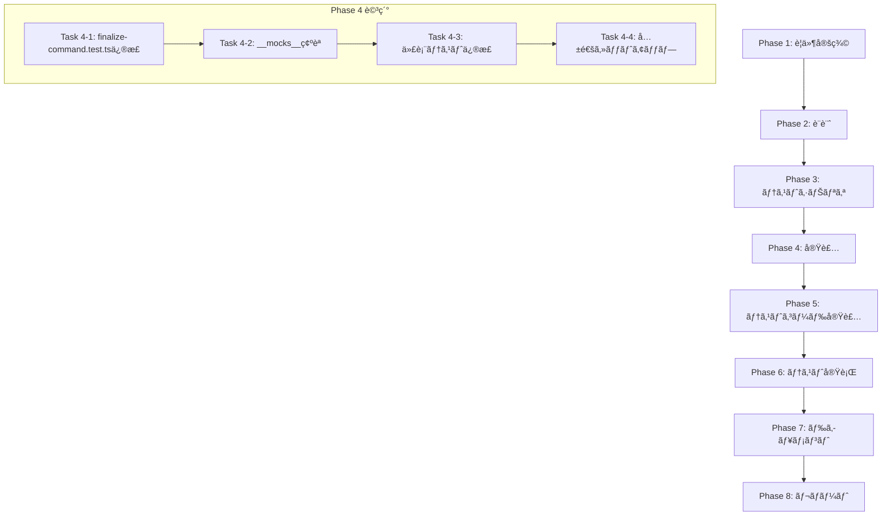
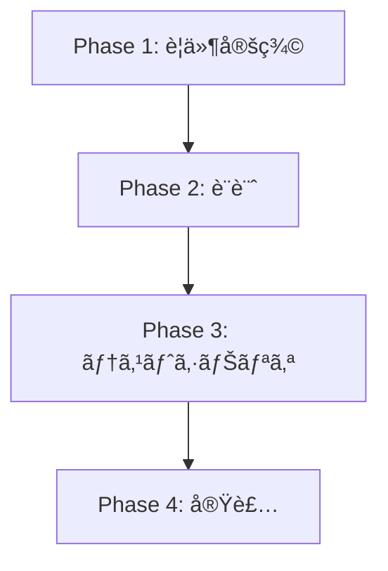
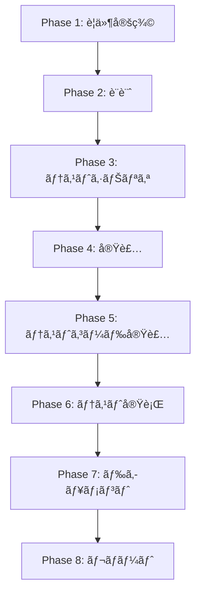

# Codex Agent 実行ログ

開始日時: 2025/12/25 9:37:03

---

## Turn 1: スレッド開始

**Thread ID**: `[REDACTED_TOKEN]`

## Turn 2: ツール実行

**種別**: reasoning
**ステータス**: completed

## Turn 3: ツール実行

**種別**: コãƒãƒ³ãƒ‰å®Ÿè¡Œ
**コãƒãƒ³ãƒ‰**: `/bin/bash -lc pwd`
**ステータス**: completed (exit_code=0)

```text
/tmp/ai-workflow-repos-131-4ba85e3e/ai-workflow-agent
```

## Turn 4: ツール実行

**種別**: reasoning
**ステータス**: completed

## Turn 5: ツール実行

**種別**: コãƒãƒ³ãƒ‰å®Ÿè¡Œ
**コãƒãƒ³ãƒ‰**: `/bin/bash -lc ls`
**ステータス**: completed (exit_code=0)

```text
ARCHITECTURE.md
CHANGELOG.md
CLAUDE.md
[REDACTED_TOKEN].md
[REDACTED_TOKEN].md
CODEBASE_SUMMARY.md
DOCKER_AUTH_SETUP.md
Dockerfile
Jenkinsfile
LICENSE
PROGRESS.md
README.md
ROADMAP.md
SETUP_TYPESCRIPT.md
TROUBLESHOOTING.md
__mocks__
docs
examples
jenkins
jest.config.cjs
metadata.json.template
node_modules
package-lock.json
package.json
scripts
src
tests
tmp
tmp-init-auto
tsconfig.json
tsconfig.test.json
```

## Turn 6: ツール実行

**種別**: reasoning
**ステータス**: completed

## Turn 7: ツール実行

**種別**: コãƒãƒ³ãƒ‰å®Ÿè¡Œ
**コãƒãƒ³ãƒ‰**: `/bin/bash -lc "rg --files -g 'Planning.md'"`
**ステータス**: failed (exit_code=127)

```text
/bin/bash: line 1: rg: command not found
```

## Turn 8: ツール実行

**種別**: reasoning
**ステータス**: completed

## Turn 9: ツール実行

**種別**: コãƒãƒ³ãƒ‰å®Ÿè¡Œ
**コãƒãƒ³ãƒ‰**: `/bin/bash -lc "find . -name 'Planning.md'"`
**ステータス**: completed (exit_code=0)

## Turn 10: ツール実行

**種別**: reasoning
**ステータス**: completed

## Turn 11: ツール実行

**種別**: コãƒãƒ³ãƒ‰å®Ÿè¡Œ
**コãƒãƒ³ãƒ‰**: `/bin/bash -lc "find .. -name 'Planning.md'"`
**ステータス**: completed (exit_code=0)

## Turn 12: ツール実行

**種別**: reasoning
**ステータス**: completed

## Turn 13: ツール実行

**種別**: コãƒãƒ³ãƒ‰å®Ÿè¡Œ
**コãƒãƒ³ãƒ‰**: `/bin/bash -lc "find .. -path '*issue-518*' -print"`
**ステータス**: completed (exit_code=0)

```text
../ai-workflow-agent/.git/refs/heads/ai-workflow/issue-518
../ai-workflow-agent/.git/refs/remotes/origin/ai-workflow/issue-518
../ai-workflow-agent/.git/logs/refs/remotes/origin/ai-workflow/issue-518
../ai-workflow-agent/.git/logs/refs/heads/ai-workflow/issue-518
../ai-workflow-agent/.ai-workflow/issue-518
../ai-workflow-agent/.ai-workflow/issue-518/metadata.json
../ai-workflow-agent/.ai-workflow/issue-518/00_planning
../ai-workflow-agent/.ai-workflow/issue-518/00_planning/output
../ai-workflow-agent/.ai-workflow/issue-518/00_planning/output/planning.md
../ai-workflow-agent/.ai-workflow/issue-518/00_planning/execute
../ai-workflow-agent/.ai-workflow/issue-518/00_planning/execute/prompt.txt
../ai-workflow-agent/.ai-workflow/issue-518/00_planning/execute/agent_log_raw.txt
../ai-workflow-agent/.ai-workflow/issue-518/00_planning/execute/agent_log.md
../ai-workflow-agent/.ai-workflow/issue-518/00_planning/review
../ai-workflow-agent/.ai-workflow/issue-518/00_planning/review/prompt.txt
../ai-workflow-agent/.ai-workflow/issue-518/00_planning/review/agent_log_raw.txt
../ai-workflow-agent/.ai-workflow/issue-518/00_planning/review/agent_log.md
../ai-workflow-agent/.ai-workflow/issue-518/00_planning/review/result.md
../ai-workflow-agent/.ai-workflow/issue-518/00_planning/revise
../ai-workflow-agent/.ai-workflow/issue-518/01_requirements
../ai-workflow-agent/.ai-workflow/issue-518/01_requirements/output
../ai-workflow-agent/.ai-workflow/issue-518/01_requirements/output/requirements.md
../ai-workflow-agent/.ai-workflow/issue-518/01_requirements/execute
../ai-workflow-agent/.ai-workflow/issue-518/01_requirements/execute/prompt.txt
../ai-workflow-agent/.ai-workflow/issue-518/01_requirements/execute/agent_log_raw.txt
../ai-workflow-agent/.ai-workflow/issue-518/01_requirements/execute/agent_log.md
../ai-workflow-agent/.ai-workflow/issue-518/01_requirements/review
../ai-workflow-agent/.ai-workflow/issue-518/01_requirements/review/prompt.txt
../ai-workflow-agent/.ai-workflow/issue-518/01_requirements/review/agent_log_raw.txt
../ai-workflow-agent/.ai-workflow/issue-518/01_requirements/review/agent_log.md
../ai-workflow-agent/.ai-workflow/issue-518/01_requirements/review/result.md
../ai-workflow-agent/.ai-workflow/issue-518/01_requirements/revise
../ai-workflow-agent/.ai-workflow/issue-518/02_design
../ai-workflow-agent/.ai-workflow/issue-518/02_design/output
../ai-workflow-agent/.ai-workflow/issue-518/02_design/output/design.md
../ai-workflow-agent/.ai-workflow/issue-518/02_design/execute
../ai-workflow-agent/.ai-workflow/issue-518/02_design/execute/prompt.txt
../ai-workflow-agent/.ai-workflow/issue-518/02_design/execute/agent_log_raw.txt
../ai-workflow-agent/.ai-workflow/issue-518/02_design/execute/agent_log.md
../ai-workflow-agent/.ai-workflow/issue-518/02_design/review
../ai-workflow-agent/.ai-workflow/issue-518/02_design/review/prompt.txt
../ai-workflow-agent/.ai-workflow/issue-518/02_design/review/agent_log_raw.txt
../ai-workflow-agent/.ai-workflow/issue-518/02_design/review/agent_log.md
../ai-workflow-agent/.ai-workflow/issue-518/02_design/review/result.md
../ai-workflow-agent/.ai-workflow/issue-518/02_design/revise
../ai-workflow-agent/.ai-workflow/issue-518/03_test_scenario
../ai-workflow-agent/.ai-workflow/issue-518/03_test_scenario/output
../ai-workflow-agent/.ai-workflow/issue-518/03_test_scenario/output/test-scenario.md
../ai-workflow-agent/.ai-workflow/issue-518/03_test_scenario/execute
../ai-workflow-agent/.ai-workflow/issue-518/03_test_scenario/execute/prompt.txt
../ai-workflow-agent/.ai-workflow/issue-518/03_test_scenario/execute/agent_log_raw.txt
../ai-workflow-agent/.ai-workflow/issue-518/03_test_scenario/execute/agent_log.md
../ai-workflow-agent/.ai-workflow/issue-518/03_test_scenario/review
../ai-workflow-agent/.ai-workflow/issue-518/03_test_scenario/review/prompt.txt
../ai-workflow-agent/.ai-workflow/issue-518/03_test_scenario/review/agent_log_raw.txt
../ai-workflow-agent/.ai-workflow/issue-518/03_test_scenario/review/agent_l
... (truncated)
```

## Turn 14: ツール実行

**種別**: reasoning
**ステータス**: completed

## Turn 15: ツール実行

**種別**: コãƒãƒ³ãƒ‰å®Ÿè¡Œ
**コãƒãƒ³ãƒ‰**: `/bin/bash -lc 'cat .ai-workflow/issue-518/00_planning/output/planning.md'`
**ステータス**: completed (exit_code=0)

```text
# プロジェクト計画書: Issue #518

## [FOLLOW-UP] #510: finalize-command.test・Jest モックã®ä¸€è²«ã—ãŸãƒ‘ターンをテスト

---

## 1. Issue分æ

### 概è¦
Issue #510 ã®ä¿®æ­£å¾Œã®ã‚¤ãƒ³ãƒ†ã‚°ãƒ¬ãƒ¼ã‚·ãƒ§ãƒ³ãƒ†ã‚¹ãƒˆ `tests/integration/finalize-command.test.ts` ㌠ESM 互æ›æ€§ã®ãªã„ Jest モックã«ã‚ˆã‚Šå¤±æ•—ã—ã¦ã„ã‚‹å•é¡Œã‚’解決ã™ã‚‹ã€‚ã¾ãŸã€ãƒ†ã‚¹ãƒˆã‚¹ã‚¤ãƒ¼ãƒˆå…¨ä½“㧠Jest モックã®æ›¸ã方を統一ã—ã€CJS/ESM 混在環境ã§ã‚‚安定ã—ã¦å‹•ã標準パターンを確立ã™ã‚‹ã€‚

### 複雑度: **中程度**

**判定根拠:**
- 対象ファイルã¯è¤‡æ•°å­˜åœ¨ï¼ˆ1ã¤ã®ã‚¤ãƒ³ãƒ†ã‚°ãƒ¬ãƒ¼ã‚·ãƒ§ãƒ³ãƒ†ã‚¹ãƒˆ + 複数ã®é–¢é€£ãƒ†ã‚¹ãƒˆãƒ•ã‚¡ã‚¤ãƒ«ï¼‰
- 既存ã®ãƒ¢ãƒƒã‚¯ãƒ‘ターンã®èª¿æŸ»ãƒ»åˆ†æãŒå¿…è¦
- ESM/CJS 互æ›æ€§ã¨ã„ã†æŠ€è¡“çš„ãªè¤‡é›‘ã•ãŒã‚ã‚‹
- ãŸã ã—ã€æ–°è¦æ©Ÿèƒ½é–‹ç™ºã§ã¯ãªãã€æ—¢å­˜ã‚³ãƒ¼ãƒ‰ã®ãƒªãƒ•ã‚¡ã‚¯ã‚¿ãƒªãƒ³ã‚°ãŒä¸­å¿ƒ

### 見ç©ã‚‚り工数: **8〜12時間**

**内訳:**
- Task 1 (finalize-command.test.ts ã®ä¿®æ­£): 2〜3時間
- Task 2 (モックパターン確立): 4〜6時間
- テスト実行・検証: 1〜2時間
- ドキュメント作æˆ: 1時間

### リスク評価: **中**

**ç†ç”±:**
- 既存テストã¸ã®å½±éŸ¿ç¯„囲ãŒåºƒã„å¯èƒ½æ€§
- ESM/CJS 互æ›æ€§å•é¡Œã¯å¾®å¦™ãªæŒ™å‹•ã®é•ã„を生ã˜ã•ã›ã‚‹å¯èƒ½æ€§
- モックパターン変更時ã«æ—¢å­˜ãƒ†ã‚¹ãƒˆã®æœŸå¾…値ãŒå¤‰ã‚ã‚‹å¯èƒ½æ€§

---

## 2. 実装戦略判断

### 実装戦略: **REFACTOR**

**判断根拠:**
- æ–°è¦ãƒ•ã‚¡ã‚¤ãƒ«ä½œæˆã§ã¯ãªãã€æ—¢å­˜ãƒ†ã‚¹ãƒˆã‚³ãƒ¼ãƒ‰ã®æ§‹é€ æ”¹å–„ãŒä¸­å¿ƒ
- `tests/integration/finalize-command.test.ts` ã®æ—¢å­˜ãƒ¢ãƒƒã‚¯è¨˜æ³•ã‚’ ESM 互æ›ãƒ‘ターンã«ç½®ãæ›ãˆã‚‹
- `__mocks__/fs-extra.ts` ã®æ—¢å­˜ã‚³ãƒ¼ãƒ‰ã‚’ ESM 対応ã«ä¿®æ­£
- 共通モックヘルパーã®è¿½åŠ ã¯å¯èƒ½ã ãŒã€ä¸»ãªä½œæ¥­ã¯ãƒªãƒ•ã‚¡ã‚¯ã‚¿ãƒªãƒ³ã‚°

### テスト戦略: **INTEGRATION_ONLY**

**判断根拠:**
- 本 Issue ã®ä¸»ç›®çš„ã¯ã‚¤ãƒ³ãƒ†ã‚°ãƒ¬ãƒ¼ã‚·ãƒ§ãƒ³ãƒ†ã‚¹ãƒˆ `finalize-command.test.ts` ã®ä¿®æ­£
- モックパターン変更ã®æ¤œè¨¼ã¯ã‚¤ãƒ³ãƒ†ã‚°ãƒ¬ãƒ¼ã‚·ãƒ§ãƒ³ãƒ†ã‚¹ãƒˆã§å®Ÿæ–½
- ユニットテストã®è¿½åŠ ã¯ä¸è¦ï¼ˆæ—¢å­˜ãƒ†ã‚¹ãƒˆã®ãƒªãƒ•ã‚¡ã‚¯ã‚¿ãƒªãƒ³ã‚°ã®ã¿ï¼‰
- BDD テストã¯å¯¾è±¡å¤–（テストインフラã®ä¿®æ­£ã§ã‚ã‚Šã€ãƒ¦ãƒ¼ã‚¶ãƒ¼ã‚¹ãƒˆãƒ¼ãƒªãƒ¼ã«ã¯ç›´æ¥é–¢ä¿‚ã—ãªã„）

### テストコード戦略: **EXTEND_TEST**

**判断根拠:**
- æ–°è¦ãƒ†ã‚¹ãƒˆãƒ•ã‚¡ã‚¤ãƒ«ä½œæˆã§ã¯ãªãã€æ—¢å­˜ãƒ†ã‚¹ãƒˆãƒ•ã‚¡ã‚¤ãƒ«ã®ä¿®æ­£
- `tests/integration/finalize-command.test.ts` ã®ãƒ¢ãƒƒã‚¯è¨˜æ³•ã‚’ ESM 互æ›ã«å¤‰æ›´
- 代表的ãªä»–ã®ãƒ†ã‚¹ãƒˆãƒ•ã‚¡ã‚¤ãƒ«ã‚‚åŒæ§˜ã«ä¿®æ­£ï¼ˆãƒ‘ターン統一）
- 共通モックヘルパーを追加ã™ã‚‹å ´åˆã¯ `tests/helpers/` ã«é…ç½®

---

## 3. 影響範囲分æ

### 既存コードã¸ã®å½±éŸ¿

#### ç›´æ¥å½±éŸ¿ã‚’å—ã‘るファイル:
1. **`tests/integration/finalize-command.test.ts`** (881行)
   - `jest.mock` を使用ã—ã¦ã„る箇所（6ã¤ã®ãƒ¢ãƒƒã‚¯å®šç¾©ï¼‰
   - ESM 互æ›ãƒ‘ターンã¸ã®å¤‰æ›´ãŒå¿…è¦

2. **`__mocks__/fs-extra.ts`** (89行)
   - ESM 対応ã®ç¢ºèªãƒ»ä¿®æ­£
   - default export 㨠named export ã®ä¸¡å¯¾å¿œ

#### é–“æ¥çš„ã«å½±éŸ¿ã‚’å—ã‘ã‚‹å¯èƒ½æ€§ã®ã‚るファイル:
- `tests/integration/cleanup-command.test.ts`
- `tests/integration/init-base-branch.test.ts`
- `tests/integration/preset-workflow.test.ts`
- `tests/integration/rollback-workflow.test.ts`
- ãã®ä»– `jest.mock` を使用ã—ã¦ã„るテストファイル（åˆè¨ˆ29ファイル）

### ä¾å­˜é–¢ä¿‚ã®å¤‰æ›´

**æ–°è¦ä¾å­˜ã®è¿½åŠ **: ãªã—

**既存ä¾å­˜ã¸ã®å½±éŸ¿**:
- Jest 設定（`jest.config.cjs`）ã¸ã®å¤‰æ›´ã¯ä¸è¦ï¼ˆæ—¢ã« ESM 対応済ã¿ï¼‰
- `package.json` ã®ãƒ†ã‚¹ãƒˆã‚¹ã‚¯ãƒªãƒ—トã¯å¤‰æ›´ãªã—（既㫠`--[REDACTED_TOKEN]` 指定済ã¿ï¼‰

### ãƒã‚¤ã‚°ãƒ¬ãƒ¼ã‚·ãƒ§ãƒ³è¦å¦: **ä¸è¦**

- データベーススキーãƒå¤‰æ›´: ãªã—
- 設定ファイル変更: ãªã—
- 実行時ã®æŒ™å‹•å¤‰æ›´: ãªã—

---

## 4. タスク分割

### Phase 1: è¦ä»¶å®šç¾© (見ç©ã‚‚ã‚Š: 0.5h)

- [x] Task 1-1: ç¾çŠ¶ã®ãƒ¢ãƒƒã‚¯ãƒ‘ターン調査 (0.5h)
  - 既存㮠`jest.mock` パターンを分é¡ï¼ˆåŒæœŸ vs éåŒæœŸã€`__esModule` 有無）
  - ESM 互æ›ãƒ‘ターン（`jest.unstable_mockModule`）ã®ä½¿ç”¨çŠ¶æ³ç¢ºèª
  - å•é¡Œã®ã‚るパターンã¨æ­£å¸¸ãªãƒ‘ターンã®ç‰¹å®š

### Phase 2: 設計 (見ç©ã‚‚ã‚Š: 1.5h)

- [x] Task 2-1: ESM 互æ›ãƒ¢ãƒƒã‚¯ãƒ‘ターンã®æ¨™æº–化設計 (1h)
  - `jest.unstable_mockModule` + `beforeAll` + 動的インãƒãƒ¼ãƒˆãƒ‘ターンã®æ¡ç”¨
  - `__esModule: true` ã®æ˜ç¤º
  - `jest.requireActual` ã®ä½µç”¨æ–¹æ³•ã®æ±ºå®š
  - 共通ヘルパー関数ã®è¨­è¨ˆï¼ˆå¿…è¦ã«å¿œã˜ã¦ï¼‰

- [x] Task 2-2: 影響範囲ã®è©³ç´°åˆ†æ (0.5h)
  - 変更対象テストファイルã®å„ªå…ˆé †ä½ä»˜ã‘
  - リファクタリング順åºã®æ±ºå®š

### Phase 3: テストシナリオ (見ç©ã‚‚ã‚Š: 0.5h)

- [x] Task 3-1: 検証シナリオã®å®šç¾© (0.5h)
  - `npm test -- tests/integration/finalize-command.test.ts` ã®æˆåŠŸç¢ºèª
  - 変更ã—ãŸä»£è¡¨ãƒ†ã‚¹ãƒˆã®å®Ÿè¡Œç¢ºèª
  - 全テストスイートã®ãƒªã‚°ãƒ¬ãƒƒã‚·ãƒ§ãƒ³ãƒ†ã‚¹ãƒˆ

### Phase 4: 実装 (見ç©ã‚‚ã‚Š: 4〜5h)

- [x] Task 4-1: `finalize-command.test.ts` 㮠ESM モック修正 (2h)
  - `jest.mock('fs-extra', ...)` ã‚’ `jest.unstable_mockModule` パターンã«å¤‰æ›´
  - `jest.mock('simple-git', ...)` ã®ä¿®æ­£
  - `jest.mock('../../src/core/repository-utils.js', ...)` ã®ä¿®æ­£
  - `jest.mock('../../src/core/git-manager.js', ...)` ã®ä¿®æ­£
  - `jest.mock('../../src/phases/cleanup/artifact-cleaner.js', ...)` ã®ä¿®æ­£
  - `jest.mock('../../src/core/github-client.js', ...)` ã®ä¿®æ­£
  - モジュールインãƒãƒ¼ãƒˆã‚’ `beforeAll` 内ã®å‹•çš„インãƒãƒ¼ãƒˆã«å¤‰æ›´

- [x] Task 4-2: `__mocks__/fs-extra.ts` ã®ç¢ºèªãƒ»ä¿®æ­£ (0.5h)
  - ESM 互æ›æ€§ã®ç¢ºèª
  - å¿…è¦ã«å¿œã˜ã¦ `__esModule: true` ã®è¿½åŠ 

- [x] Task 4-3: 代表的ãªãƒ†ã‚¹ãƒˆãƒ•ã‚¡ã‚¤ãƒ«ã®ãƒ‘ターン統一 (1.5〜2h)
  - `tests/integration/cleanup-command.test.ts` ã®ä¿®æ­£
  - `tests/unit/commands/finalize.test.ts` ã®ç¢ºèªãƒ»çµ±ä¸€
  - ãã®ä»–影響度ã®é«˜ã„テストファイルã®ä¿®æ­£

- [ ] Task 4-4: 共通セットアップã®æ•´ç†ï¼ˆã‚ªãƒ—ション）(0.5h)
  - 共通モックヘルパー関数ã®ä½œæˆï¼ˆå¿…è¦ãªå ´åˆï¼‰
  - `tests/helpers/` ã¸ã®é…ç½®

### Phase 5: テストコード実装 (見ç©ã‚‚ã‚Š: 0.5h)

- [x] Task 5-1: テストパターンã®ãƒ‰ã‚­ãƒ¥ãƒ¡ãƒ³ãƒˆåŒ– (0.5h)
  - モックガイドラインã®ä½œæˆï¼ˆã‚³ãƒ¼ãƒ‰å†…コメントã¾ãŸã¯åˆ¥ãƒ‰ã‚­ãƒ¥ãƒ¡ãƒ³ãƒˆï¼‰
  - ESM/CJS 混在環境ã§ã®æ¨å¥¨ãƒ‘ターンã®æ˜æ–‡åŒ–

### Phase 6: テスト実行 (見ç©ã‚‚ã‚Š: 1.5h)

- [ ] Task 6-1: 対象テストã®å€‹åˆ¥å®Ÿè¡Œ (0.5h)
  - `npm test -- tests/integration/finalize-command.test.ts`
  - ESM モック関連㮠TypeError ãŒç™ºç”Ÿã—ãªã„ã“ã¨ã‚’確èª

- [
... (truncated)
```

## Turn 16: ツール実行

**種別**: reasoning
**ステータス**: completed

## Turn 17: ツール実行

**種別**: コãƒãƒ³ãƒ‰å®Ÿè¡Œ
**コãƒãƒ³ãƒ‰**: `/bin/bash -lc 'cat .ai-workflow/issue-518/06_testing/output/test-result.md'`
**ステータス**: completed (exit_code=0)

```text
# テスト実行çµæœ

## テストçµæœã‚µãƒãƒªãƒ¼
- ç·ãƒ†ã‚¹ãƒˆæ•°: 2281件
- æˆåŠŸ: 2004件
- 失敗: 257件
- æˆåŠŸç‡: 87.9%

## 失敗ã—ãŸãƒ†ã‚¹ãƒˆã®è©³ç´°
### `tests/integration/[REDACTED_TOKEN].test.ts::ワークフローåˆæœŸåŒ–ã®çµ±åˆãƒ†ã‚¹ãƒˆ - Issue #16 3.1.1: ワークフローåˆæœŸåŒ– → コミットメッセージ確èª`
- **エラー**: expect(received).toBe(expected)（コミットメッセージã«è¿½åŠ æƒ…å ±ãŒå«ã¾ã‚Œã¦æƒ³å®šã¨ä¸ä¸€è‡´ï¼‰
- **スタックトレース**:
  ```
  Error: expect(received).toBe(expected)
      at tests/integration/[REDACTED_TOKEN].test.ts:81:27
  ```

### `tests/integration/[REDACTED_TOKEN].test.ts::Report Phaseクリーンアップã®çµ±åˆãƒ†ã‚¹ãƒˆ - Issue #16 3.2.1: Report Phase完了 → ログクリーンアップ → コミットメッセージ確èª`
- **エラー**: expect(received).not.toBeNull()（コミットçµæœãŒ null）
- **スタックトレース**:
  ```
  Error: expect(received).not.toBeNull()
      at tests/integration/[REDACTED_TOKEN].test.ts:206:42
  ```

### `tests/integration/[REDACTED_TOKEN].test.ts::Evaluation Phaseクリーンアップã®çµ±åˆãƒ†ã‚¹ãƒˆ - Issue #16 3.3.1: Evaluation Phase完了（デフォルト） → ログã®ã¿å‰Šé™¤`
- **エラー**: expect(received).not.toBeNull()（コミットçµæœãŒ null）
- **スタックトレース**:
  ```
  Error: expect(received).not.toBeNull()
      at tests/integration/[REDACTED_TOKEN].test.ts:354:42
  ```

### `tests/integration/[REDACTED_TOKEN].test.ts::エンドツーエンドテスト - Issue #16 3.4.1: ワークフロー全体（åˆæœŸåŒ– → Phase 8 → クリーンアップ）`
- **エラー**: expect(received).toContain(expected)（最新コミットログã«åˆæœŸåŒ–メッセージãŒå«ã¾ã‚Œãªã„）
- **スタックトレース**:
  ```
  Error: expect(received).toContain(expected)
      at tests/integration/[REDACTED_TOKEN].test.ts:437:27
  ```

### `tests/unit/git/remote-manager.test.ts::RemoteManager - GitHub Credentials/setupGithubCredentials_境界値_SSH URLã¯ã‚¹ã‚­ãƒƒãƒ—`
- **エラー**: expect(jest.fn()).[REDACTED_TOKEN]（ログ期待値ãŒãƒ—レーン文字列ã ãŒå®Ÿéš›ã¯ã‚¿ã‚¤ãƒ ã‚¹ã‚¿ãƒ³ãƒ—付ã）
- **スタックトレース**:
  ```
  Expected: StringContaining "[INFO] Git remote URL is not HTTPS"
  Received: "2025-12-25 09:30:28 [INFO ] Git remote URL is not HTTPS, skipping token configuration: [REDACTED_EMAIL]:tielec/ai-workflow-agent.git"
      at tests/unit/git/remote-manager.test.ts:123:22
  ```

### `tests/integration/step-commit-push.test.ts::TC-I-005: プッシュæˆåŠŸï¼ˆæ­£å¸¸ç³»ï¼‰- ローカルコミットã®ã¿`
- **エラー**: expect(received).toBeTruthy()（push æˆåŠŸåˆ¤å®šãŒ false）
- **スタックトレース**:
  ```
  Error: expect(received).toBeTruthy()
      at tests/integration/step-commit-push.test.ts:116:59
  ```

### `tests/integration/phases/fallback-mechanism.test.ts::Design Phase - Fallback Integration`
- **エラー**: TypeError: Cannot read properties of undefined (reading '[REDACTED_TOKEN]')
- **スタックトレース**:
  ```
  TypeError: Cannot read properties of undefined (reading '[REDACTED_TOKEN]')
      at src/phases/design.ts:49:21
      at tests/integration/phases/fallback-mechanism.test.ts:278:22
  ```

### `tests/unit/phases/base-phase-prompt-injection.test.ts::TC-011: [REDACTED_TOKEN]=true ã®å ´åˆ`
- **エラー**: TypeError: mockFs.existsSync.mockReturnValue is not a function
- **スタックトレース**:
  ```
  TypeError: mockFs.existsSync.mockReturnValue is not a function
      at tests/unit/phases/base-phase-prompt-injection.test.ts:88:23
  ```

### `tests/unit/phases/core/review-cycle-manager.test.ts::1-1: 1å›ç›®ã®reviseã§æˆåŠŸã—ãŸå ´åˆã€ãƒªãƒˆãƒ©ã‚¤ã›ãšã«çµ‚了`
- **エラー**: TypeError: this.metadata.getRollbackContext is not a function
- **スタックトレース**:
  ```
  TypeError: this.metadata.getRollbackContext is not a function
      at src/phases/core/review-cycle-manager.ts:109:47
      at tests/unit/phases/core/review-cycle-manager.test.ts:82:5
  ```

### `tests/unit/core/metadata-manager-rollback.test.ts::UC-MM-01: setRollbackContext() - 正常系`
- **エラー**: TypeError: fsMocked.existsSync.mockReturnValue is not a function
- **スタックトレース**:
  ```
  TypeError: fsMocked.existsSync.mockReturnValue is not a function
      at tests/unit/core/metadata-manager-rollback.test.ts:147:25
  ```

### `tests/integration/preset-workflow.test.ts::ステータスé·ç§»ãƒ‘ターン/should allow transition: pending -> in_progress -> completed`
- **エラー**: Error: metadata.json not found: /test/.ai-workflow/issue-248/metadata.json
- **スタックトレース**:
  ```
  Error: metadata.json not found: /test/.ai-workflow/issue-248/metadata.json
      at src/core/workflow-state.ts:67:13
      at tests/integration
... (truncated)
```

## Turn 18: ツール実行

**種別**: reasoning
**ステータス**: completed

## Turn 19: ツール実行

**種別**: コãƒãƒ³ãƒ‰å®Ÿè¡Œ
**コãƒãƒ³ãƒ‰**: `/bin/bash -lc 'grep -n "finalize-command.test.ts" -n .ai-workflow/issue-518/06_testing/output/test-result.md'`
**ステータス**: failed (exit_code=1)

## Turn 20: ツール実行

**種別**: reasoning
**ステータス**: completed

## Turn 21: ツール実行

**種別**: コãƒãƒ³ãƒ‰å®Ÿè¡Œ
**コãƒãƒ³ãƒ‰**: `/bin/bash -lc 'cat .ai-workflow/issue-518/06_testing/execute/agent_log.md'`
**ステータス**: completed (exit_code=0)

```text
# Codex Agent 実行ログ

開始日時: 2025/12/25 9:20:34

---

## Turn 1: スレッド開始

**Thread ID**: `[REDACTED_TOKEN]`

## Turn 2: ツール実行

**種別**: reasoning
**ステータス**: completed

## Turn 3: ツール実行

**種別**: コãƒãƒ³ãƒ‰å®Ÿè¡Œ
**コãƒãƒ³ãƒ‰**: `/bin/bash -lc ls`
**ステータス**: completed (exit_code=0)

```text
ARCHITECTURE.md
CHANGELOG.md
CLAUDE.md
[REDACTED_TOKEN].md
[REDACTED_TOKEN].md
CODEBASE_SUMMARY.md
DOCKER_AUTH_SETUP.md
Dockerfile
Jenkinsfile
LICENSE
PROGRESS.md
README.md
ROADMAP.md
SETUP_TYPESCRIPT.md
TROUBLESHOOTING.md
__mocks__
docs
examples
jenkins
jest.config.cjs
metadata.json.template
node_modules
package-lock.json
package.json
scripts
src
tests
tmp
tsconfig.json
tsconfig.test.json
```

## Turn 4: ツール実行

**種別**: reasoning
**ステータス**: completed

## Turn 5: ツール実行

**種別**: コãƒãƒ³ãƒ‰å®Ÿè¡Œ
**コãƒãƒ³ãƒ‰**: `/bin/bash -lc 'ls .ai-workflow'`
**ステータス**: completed (exit_code=0)

```text
issue-10
issue-102
issue-104
issue-105
issue-108
issue-113
issue-115
issue-119
issue-126
issue-127
issue-128
issue-140
issue-144
issue-150
issue-153
issue-155
issue-16
issue-161
issue-165
issue-174
issue-177
issue-18
issue-184
issue-188
issue-194
issue-2
issue-207
issue-208
issue-211
issue-212
issue-216
issue-22
issue-225
issue-23
issue-238
issue-24
issue-243
issue-248
issue-25
issue-253
issue-259
issue-26
issue-261
issue-271
issue-38
issue-45
issue-46
issue-47
issue-48
issue-49
issue-5
issue-50
issue-51
issue-518
issue-52
issue-54
issue-58
issue-61
issue-64
issue-7
issue-73
issue-74
issue-90
issue-91
```

## Turn 6: ツール実行

**種別**: reasoning
**ステータス**: completed

## Turn 7: ツール実行

**種別**: コãƒãƒ³ãƒ‰å®Ÿè¡Œ
**コãƒãƒ³ãƒ‰**: `/bin/bash -lc 'ls .ai-workflow/issue-518'`
**ステータス**: completed (exit_code=0)

```text
00_planning
01_requirements
02_design
03_test_scenario
04_implementation
05_test_implementation
06_testing
metadata.json
```

## Turn 8: ツール実行

**種別**: reasoning
**ステータス**: completed

## Turn 9: ツール実行

**種別**: コãƒãƒ³ãƒ‰å®Ÿè¡Œ
**コãƒãƒ³ãƒ‰**: `/bin/bash -lc 'cat .ai-workflow/issue-518/00_planning/output/planning.md'`
**ステータス**: completed (exit_code=0)

```text
# プロジェクト計画書: Issue #518

## [FOLLOW-UP] #510: finalize-command.test・Jest モックã®ä¸€è²«ã—ãŸãƒ‘ターンをテスト

---

## 1. Issue分æ

### 概è¦
Issue #510 ã®ä¿®æ­£å¾Œã®ã‚¤ãƒ³ãƒ†ã‚°ãƒ¬ãƒ¼ã‚·ãƒ§ãƒ³ãƒ†ã‚¹ãƒˆ `tests/integration/finalize-command.test.ts` ㌠ESM 互æ›æ€§ã®ãªã„ Jest モックã«ã‚ˆã‚Šå¤±æ•—ã—ã¦ã„ã‚‹å•é¡Œã‚’解決ã™ã‚‹ã€‚ã¾ãŸã€ãƒ†ã‚¹ãƒˆã‚¹ã‚¤ãƒ¼ãƒˆå…¨ä½“㧠Jest モックã®æ›¸ã方を統一ã—ã€CJS/ESM 混在環境ã§ã‚‚安定ã—ã¦å‹•ã標準パターンを確立ã™ã‚‹ã€‚

### 複雑度: **中程度**

**判定根拠:**
- 対象ファイルã¯è¤‡æ•°å­˜åœ¨ï¼ˆ1ã¤ã®ã‚¤ãƒ³ãƒ†ã‚°ãƒ¬ãƒ¼ã‚·ãƒ§ãƒ³ãƒ†ã‚¹ãƒˆ + 複数ã®é–¢é€£ãƒ†ã‚¹ãƒˆãƒ•ã‚¡ã‚¤ãƒ«ï¼‰
- 既存ã®ãƒ¢ãƒƒã‚¯ãƒ‘ターンã®èª¿æŸ»ãƒ»åˆ†æãŒå¿…è¦
- ESM/CJS 互æ›æ€§ã¨ã„ã†æŠ€è¡“çš„ãªè¤‡é›‘ã•ãŒã‚ã‚‹
- ãŸã ã—ã€æ–°è¦æ©Ÿèƒ½é–‹ç™ºã§ã¯ãªãã€æ—¢å­˜ã‚³ãƒ¼ãƒ‰ã®ãƒªãƒ•ã‚¡ã‚¯ã‚¿ãƒªãƒ³ã‚°ãŒä¸­å¿ƒ

### 見ç©ã‚‚り工数: **8〜12時間**

**内訳:**
- Task 1 (finalize-command.test.ts ã®ä¿®æ­£): 2〜3時間
- Task 2 (モックパターン確立): 4〜6時間
- テスト実行・検証: 1〜2時間
- ドキュメント作æˆ: 1時間

### リスク評価: **中**

**ç†ç”±:**
- 既存テストã¸ã®å½±éŸ¿ç¯„囲ãŒåºƒã„å¯èƒ½æ€§
- ESM/CJS 互æ›æ€§å•é¡Œã¯å¾®å¦™ãªæŒ™å‹•ã®é•ã„を生ã˜ã•ã›ã‚‹å¯èƒ½æ€§
- モックパターン変更時ã«æ—¢å­˜ãƒ†ã‚¹ãƒˆã®æœŸå¾…値ãŒå¤‰ã‚ã‚‹å¯èƒ½æ€§

---

## 2. 実装戦略判断

### 実装戦略: **REFACTOR**

**判断根拠:**
- æ–°è¦ãƒ•ã‚¡ã‚¤ãƒ«ä½œæˆã§ã¯ãªãã€æ—¢å­˜ãƒ†ã‚¹ãƒˆã‚³ãƒ¼ãƒ‰ã®æ§‹é€ æ”¹å–„ãŒä¸­å¿ƒ
- `tests/integration/finalize-command.test.ts` ã®æ—¢å­˜ãƒ¢ãƒƒã‚¯è¨˜æ³•ã‚’ ESM 互æ›ãƒ‘ターンã«ç½®ãæ›ãˆã‚‹
- `__mocks__/fs-extra.ts` ã®æ—¢å­˜ã‚³ãƒ¼ãƒ‰ã‚’ ESM 対応ã«ä¿®æ­£
- 共通モックヘルパーã®è¿½åŠ ã¯å¯èƒ½ã ãŒã€ä¸»ãªä½œæ¥­ã¯ãƒªãƒ•ã‚¡ã‚¯ã‚¿ãƒªãƒ³ã‚°

### テスト戦略: **INTEGRATION_ONLY**

**判断根拠:**
- 本 Issue ã®ä¸»ç›®çš„ã¯ã‚¤ãƒ³ãƒ†ã‚°ãƒ¬ãƒ¼ã‚·ãƒ§ãƒ³ãƒ†ã‚¹ãƒˆ `finalize-command.test.ts` ã®ä¿®æ­£
- モックパターン変更ã®æ¤œè¨¼ã¯ã‚¤ãƒ³ãƒ†ã‚°ãƒ¬ãƒ¼ã‚·ãƒ§ãƒ³ãƒ†ã‚¹ãƒˆã§å®Ÿæ–½
- ユニットテストã®è¿½åŠ ã¯ä¸è¦ï¼ˆæ—¢å­˜ãƒ†ã‚¹ãƒˆã®ãƒªãƒ•ã‚¡ã‚¯ã‚¿ãƒªãƒ³ã‚°ã®ã¿ï¼‰
- BDD テストã¯å¯¾è±¡å¤–（テストインフラã®ä¿®æ­£ã§ã‚ã‚Šã€ãƒ¦ãƒ¼ã‚¶ãƒ¼ã‚¹ãƒˆãƒ¼ãƒªãƒ¼ã«ã¯ç›´æ¥é–¢ä¿‚ã—ãªã„）

### テストコード戦略: **EXTEND_TEST**

**判断根拠:**
- æ–°è¦ãƒ†ã‚¹ãƒˆãƒ•ã‚¡ã‚¤ãƒ«ä½œæˆã§ã¯ãªãã€æ—¢å­˜ãƒ†ã‚¹ãƒˆãƒ•ã‚¡ã‚¤ãƒ«ã®ä¿®æ­£
- `tests/integration/finalize-command.test.ts` ã®ãƒ¢ãƒƒã‚¯è¨˜æ³•ã‚’ ESM 互æ›ã«å¤‰æ›´
- 代表的ãªä»–ã®ãƒ†ã‚¹ãƒˆãƒ•ã‚¡ã‚¤ãƒ«ã‚‚åŒæ§˜ã«ä¿®æ­£ï¼ˆãƒ‘ターン統一）
- 共通モックヘルパーを追加ã™ã‚‹å ´åˆã¯ `tests/helpers/` ã«é…ç½®

---

## 3. 影響範囲分æ

### 既存コードã¸ã®å½±éŸ¿

#### ç›´æ¥å½±éŸ¿ã‚’å—ã‘るファイル:
1. **`tests/integration/finalize-command.test.ts`** (881行)
   - `jest.mock` を使用ã—ã¦ã„る箇所（6ã¤ã®ãƒ¢ãƒƒã‚¯å®šç¾©ï¼‰
   - ESM 互æ›ãƒ‘ターンã¸ã®å¤‰æ›´ãŒå¿…è¦

2. **`__mocks__/fs-extra.ts`** (89行)
   - ESM 対応ã®ç¢ºèªãƒ»ä¿®æ­£
   - default export 㨠named export ã®ä¸¡å¯¾å¿œ

#### é–“æ¥çš„ã«å½±éŸ¿ã‚’å—ã‘ã‚‹å¯èƒ½æ€§ã®ã‚るファイル:
- `tests/integration/cleanup-command.test.ts`
- `tests/integration/init-base-branch.test.ts`
- `tests/integration/preset-workflow.test.ts`
- `tests/integration/rollback-workflow.test.ts`
- ãã®ä»– `jest.mock` を使用ã—ã¦ã„るテストファイル（åˆè¨ˆ29ファイル）

### ä¾å­˜é–¢ä¿‚ã®å¤‰æ›´

**æ–°è¦ä¾å­˜ã®è¿½åŠ **: ãªã—

**既存ä¾å­˜ã¸ã®å½±éŸ¿**:
- Jest 設定（`jest.config.cjs`）ã¸ã®å¤‰æ›´ã¯ä¸è¦ï¼ˆæ—¢ã« ESM 対応済ã¿ï¼‰
- `package.jso
... (truncated)
```

## Turn 22: ツール実行

**種別**: reasoning
**ステータス**: completed

## Turn 23: ツール実行

**種別**: コãƒãƒ³ãƒ‰å®Ÿè¡Œ
**コãƒãƒ³ãƒ‰**: `/bin/bash -lc 'grep -n "finalize" -n .ai-workflow/issue-518/06_testing/execute/agent_log.md | head'`
**ステータス**: completed (exit_code=0)

```text
169:## [FOLLOW-UP] #510: finalize-command.test・Jest モックã®ä¸€è²«ã—ãŸãƒ‘ターンをテスト
176:Issue #510 ã®ä¿®æ­£å¾Œã®ã‚¤ãƒ³ãƒ†ã‚°ãƒ¬ãƒ¼ã‚·ãƒ§ãƒ³ãƒ†ã‚¹ãƒˆ `tests/integration/finalize-command.test.ts` ㌠ESM 互æ›æ€§ã®ãªã„ Jest モックã«ã‚ˆã‚Šå¤±æ•—ã—ã¦ã„ã‚‹å•é¡Œã‚’解決ã™ã‚‹ã€‚ã¾ãŸã€ãƒ†ã‚¹ãƒˆã‚¹ã‚¤ãƒ¼ãƒˆå…¨ä½“㧠Jest モックã®æ›¸ã方を統一ã—ã€CJS/ESM 混在環境ã§ã‚‚安定ã—ã¦å‹•ã標準パターンを確立ã™ã‚‹ã€‚
189:- Task 1 (finalize-command.test.ts ã®ä¿®æ­£): 2〜3時間
209:- `tests/integration/finalize-command.test.ts` ã®æ—¢å­˜ãƒ¢ãƒƒã‚¯è¨˜æ³•ã‚’ ESM 互æ›ãƒ‘ターンã«ç½®ãæ›ãˆã‚‹
216:- 本 Issue ã®ä¸»ç›®çš„ã¯ã‚¤ãƒ³ãƒ†ã‚°ãƒ¬ãƒ¼ã‚·ãƒ§ãƒ³ãƒ†ã‚¹ãƒˆ `finalize-command.test.ts` ã®ä¿®æ­£
225:- `tests/integration/finalize-command.test.ts` ã®ãƒ¢ãƒƒã‚¯è¨˜æ³•ã‚’ ESM 互æ›ã«å¤‰æ›´
236:1. **`tests/integration/finalize-command.test.ts`** (881行)
291:  - `npm test -- tests/integration/finalize-command.test.ts` ã®æˆåŠŸç¢ºèª
297:- [x] Task 4-1: `finalize-command.test.ts` 㮠ESM モック修正 (2h)
312:  - `tests/unit/commands/finalize.test.ts` ã®ç¢ºèªãƒ»çµ±ä¸€
```

## Turn 24: ツール実行

**種別**: reasoning
**ステータス**: completed

## Turn 25: ツール実行

**種別**: コãƒãƒ³ãƒ‰å®Ÿè¡Œ
**コãƒãƒ³ãƒ‰**: `/bin/bash -lc 'grep -n "npm test -- tests/integration/finalize-command.test.ts" -n .ai-workflow/issue-518/06_testing/execute/agent_log.md'`
**ステータス**: completed (exit_code=0)

```text
291:  - `npm test -- tests/integration/finalize-command.test.ts` ã®æˆåŠŸç¢ºèª
328:  - `npm test -- tests/integration/finalize-command.test.ts`
365:- `npm test -- tests/integration/finalize-command.test.ts`（18/18 PASS）
401:- 基本動作確èª: `npm test -- tests/integration/finalize-command.test.ts`, `npm test -- tests/integration/cleanup-command.test.ts`
518:1. `npm test -- tests/integration/finalize-command.test.ts` を実行
716:**コãƒãƒ³ãƒ‰**: `/bin/bash -lc 'npm test -- tests/integration/finalize-command.test.ts'`
```

## Turn 26: ツール実行

**種別**: reasoning
**ステータス**: completed

## Turn 27: ツール実行

**種別**: コãƒãƒ³ãƒ‰å®Ÿè¡Œ
**コãƒãƒ³ãƒ‰**: `/bin/bash -lc "sed -n '700,760p' .ai-workflow/issue-518/06_testing/execute/agent_log.md"`
**ステータス**: completed (exit_code=0)

```text
```text
execute
output
review
revise
```

## Turn 22: ツール実行

**種別**: reasoning
**ステータス**: completed

## Turn 23: ツール実行

**種別**: コãƒãƒ³ãƒ‰å®Ÿè¡Œ
**コãƒãƒ³ãƒ‰**: `/bin/bash -lc 'npm test -- tests/integration/finalize-command.test.ts'`
**ステータス**: completed (exit_code=0)

```text
> ai-workflow-agent@0.2.0 test
> NODE_OPTIONS="--[REDACTED_TOKEN] --max-old-space-size=4096" jest tests/integration/finalize-command.test.ts

ts-jest[ts-jest-transformer] (WARN) Define `ts-jest` config under `globals` is deprecated. Please do
transform: {
    <transform_regex>: ['ts-jest', { /* ts-jest config goes here in Jest */ }],
},
See more at https://kulshekhar.github.io/ts-jest/docs/getting-started/presets#advanced
ts-jest[config] (WARN) 
    The "ts-jest" config option "isolatedModules" is deprecated and will be removed in v30.0.0. Please use "isolatedModules: true" in /tmp/ai-workflow-repos-131-4ba85e3e/ai-workflow-agent/tsconfig.test.json instead, see https://www.typescriptlang.org/tsconfig/#isolatedModules
  
  console.info
    2025-12-25 09:21:19 [INFO ] Starting finalize command...

      at log (src/utils/logger.ts:123:17)

  console.info
    2025-12-25 09:21:19 [INFO ] Loaded workflow metadata: /test/.ai-workflow/issue-123/metadata.json

      at log (src/utils/logger.ts:123:17)

  console.info
    2025-12-25 09:21:19 [INFO ] Step 1: Retrieving base_commit and current HEAD...

      at log (src/utils/logger.ts:123:17)

  console.info
    2025-12-25 09:21:19 [INFO ] base_commit: abc123def456

      at log (src/utils/logger.ts:123:17)

  console.info
    2025-12-25 09:21:19 [INFO ] HEAD (before cleanup): head-before-cleanup

      at log (src/utils/logger.ts:123:17)

  console.info
    2025-12-25 09:21:19 [INFO ] Step 2: Cleaning up workflow artifacts...

      at log (src/utils/logger.ts:123:17)
```

## Turn 28: ツール実行

**種別**: reasoning
**ステータス**: completed

## Turn 29: ツール実行

**種別**: コãƒãƒ³ãƒ‰å®Ÿè¡Œ
**コãƒãƒ³ãƒ‰**: `/bin/bash -lc "sed -n '760,840p' .ai-workflow/issue-518/06_testing/execute/agent_log.md"`
**ステータス**: completed (exit_code=0)

```text
console.info
    2025-12-25 09:21:19 [INFO ] Cleanup committed: abc123

      at log (src/utils/logger.ts:123:17)

  console.info
    2025-12-25 09:21:19 [INFO ] ✅ Step 2 completed: Workflow artifacts cleaned up.

      at log (src/utils/logger.ts:123:17)

  console.info
    2025-12-25 09:21:19 [INFO ] Step 3: Squashing commits...

      at log (src/utils/logger.ts:123:17)

  console.info
    2025-12-25 09:21:19 [INFO ] ✅ Step 3 completed: Commits squashed.

      at log (src/utils/logger.ts:123:17)

  console.info
    2025-12-25 09:21:19 [INFO ] Step 4-5: Updating PR and marking as ready for review...

      at log (src/utils/logger.ts:123:17)

  console.warn
    2025-12-25 09:21:19 [WARNING] PR number not found in metadata, searching via GitHub API...

      121 |       : console.debug;
      122 |
    > 123 |   consoleMethod.call(console, coloredMessage);
          |                 ^
      124 | }
      125 |
      126 | /**

      at log (src/utils/logger.ts:123:17)
      at Object.warn (src/utils/logger.ts:147:33)
      at executeStep4And5 (src/commands/finalize.ts:257:12)
      at [REDACTED_TOKEN] (src/commands/finalize.ts:75:5)
      at Object.<anonymous> (tests/integration/finalize-command.test.ts:304:7)

  console.info
    2025-12-25 09:21:19 [INFO ] Found PR #456

      at log (src/utils/logger.ts:123:17)

  console.info
    2025-12-25 09:21:19 [INFO ] ✅ PR #456 updated with final content.

      at log (src/utils/logger.ts:123:17)

  console.info
    2025-12-25 09:21:19 [INFO ] ✅ PR #456 marked as ready for review.

      at log (src/utils/logger.ts:123:17)

  console.info
    2025-12-25 09:21:19 [INFO ] ✅ Finalize completed successfully.

      at log (src/utils/logger.ts:123:17)

  console.info
    2025-12-25 09:21:19 [INFO ] Starting finalize command...

      at log (src/utils/logger.ts:123:17)

  console.info
    2025-12-25 09:21:19 [INFO ] Loaded workflow metadata: /test/.ai-workflow/issue-123/metadata.json

      at log (src/utils/logger.ts:123:17)

  console.info
    2025-12-25 09:21:19 [INFO ] Step 1: Retrieving base_commit and current HEAD...

      at log (src/utils/logger.ts:123:17)

  console.info
    2025-12-25 09:21:19 [INFO ] base_commit: abc123def456
```

## Turn 30: ツール実行

**種別**: reasoning
**ステータス**: completed

## Turn 31: ツール実行

**種別**: コãƒãƒ³ãƒ‰å®Ÿè¡Œ
**コãƒãƒ³ãƒ‰**: `/bin/bash -lc "sed -n '840,920p' .ai-workflow/issue-518/06_testing/execute/agent_log.md"`
**ステータス**: completed (exit_code=0)

```text
at log (src/utils/logger.ts:123:17)
... (truncated)
```

## Turn 24: ツール実行

**種別**: reasoning
**ステータス**: completed

## Turn 25: ツール実行

**種別**: コãƒãƒ³ãƒ‰å®Ÿè¡Œ
**コãƒãƒ³ãƒ‰**: `/bin/bash -lc 'npm test -- tests/integration/cleanup-command.test.ts'`
**ステータス**: completed (exit_code=0)

```text
> ai-workflow-agent@0.2.0 test
> NODE_OPTIONS="--[REDACTED_TOKEN] --max-old-space-size=4096" jest tests/integration/cleanup-command.test.ts

ts-jest[ts-jest-transformer] (WARN) Define `ts-jest` config under `globals` is deprecated. Please do
transform: {
    <transform_regex>: ['ts-jest', { /* ts-jest config goes here in Jest */ }],
},
See more at https://kulshekhar.github.io/ts-jest/docs/getting-started/presets#advanced
ts-jest[config] (WARN) 
    The "ts-jest" config option "isolatedModules" is deprecated and will be removed in v30.0.0. Please use "isolatedModules: true" in /tmp/ai-workflow-repos-131-4ba85e3e/ai-workflow-agent/tsconfig.test.json instead, see https://www.typescriptlang.org/tsconfig/#isolatedModules
  
  console.info
    2025-12-25 09:21:24 [INFO ] Starting cleanup command...

      at log (src/utils/logger.ts:123:17)

  console.info
    2025-12-25 09:21:24 [INFO ] Loaded workflow metadata: /test/.ai-workflow/issue-123/metadata.json

      at log (src/utils/logger.ts:123:17)

  console.info
    2025-12-25 09:21:24 [INFO ] Executing normal cleanup (all phases)...

      at log (src/utils/logger.ts:123:17)

  console.info
    2025-12-25 09:21:24 [INFO ] Cleanup committed: abc123

      at log (src/utils/logger.ts:123:17)

  console.info
    2025-12-25 09:21:24 [INFO ] Git commit and push completed

      at log (src/utils/logger.ts:123:17)

  console.info
    2025-12-25 09:21:24 [INFO ] Workflow logs cleaned up successfully

      at log (src/utils/logger.ts:123:17)

  console.info
    2025-12-25 09:21:24 [INFO ] Cleanup completed successfully.

      at log (src/utils/logger.ts:123:17)

  console.info
    2025-12-25 09:21:24 [INFO ] Starting cleanup command...

      at log (src/utils/logger.ts:123:17)

  console.info
    2025-12-25 09:21:24 [INFO ] Loaded workflow metadata: /test/.ai-workflow/issue-123/metadata.json

      at log (src/utils/logger.ts:123:17)

  console.info
    2025-12-25 09:21:24 [INFO ] [DRY RUN] Cleanup preview:

      at log (src/utils/logger.ts:123:17)

  console.info
    2025-12-25 09:21:24 [INFO ]
```

## Turn 32: ツール実行

**種別**: reasoning
**ステータス**: completed

## Turn 33: ツール実行

**種別**: コãƒãƒ³ãƒ‰å®Ÿè¡Œ
**コãƒãƒ³ãƒ‰**: `/bin/bash -lc 'grep -n "Tests:" -n .ai-workflow/issue-518/06_testing/execute/agent_log.md'`
**ステータス**: completed (exit_code=0)

```text
528:Tests:       16 passed, 16 total
```

## Turn 34: ツール実行

**種別**: reasoning
**ステータス**: completed

## Turn 35: ツール実行

**種別**: コãƒãƒ³ãƒ‰å®Ÿè¡Œ
**コãƒãƒ³ãƒ‰**: `/bin/bash -lc 'grep -n "Phase 6" .ai-workflow/issue-518/00_planning/output/planning.md'`
**ステータス**: completed (exit_code=0)

```text
159:### Phase 6: テスト実行 (見ç©ã‚‚ã‚Š: 1.5h)
197:    P5 --> P6[Phase 6: テスト実行]
270:### Phase 6: テスト実行
```

## Turn 36: ツール実行

**種別**: reasoning
**ステータス**: completed

## Turn 37: ツール実行

**種別**: コãƒãƒ³ãƒ‰å®Ÿè¡Œ
**コãƒãƒ³ãƒ‰**: `/bin/bash -lc "sed -n '150,210p' .ai-workflow/issue-518/00_planning/output/planning.md"`
**ステータス**: completed (exit_code=0)

```text
- 共通モックヘルパー関数ã®ä½œæˆï¼ˆå¿…è¦ãªå ´åˆï¼‰
  - `tests/helpers/` ã¸ã®é…ç½®

### Phase 5: テストコード実装 (見ç©ã‚‚ã‚Š: 0.5h)

- [x] Task 5-1: テストパターンã®ãƒ‰ã‚­ãƒ¥ãƒ¡ãƒ³ãƒˆåŒ– (0.5h)
  - モックガイドラインã®ä½œæˆï¼ˆã‚³ãƒ¼ãƒ‰å†…コメントã¾ãŸã¯åˆ¥ãƒ‰ã‚­ãƒ¥ãƒ¡ãƒ³ãƒˆï¼‰
  - ESM/CJS 混在環境ã§ã®æ¨å¥¨ãƒ‘ターンã®æ˜æ–‡åŒ–

### Phase 6: テスト実行 (見ç©ã‚‚ã‚Š: 1.5h)

- [ ] Task 6-1: 対象テストã®å€‹åˆ¥å®Ÿè¡Œ (0.5h)
  - `npm test -- tests/integration/finalize-command.test.ts`
  - ESM モック関連㮠TypeError ãŒç™ºç”Ÿã—ãªã„ã“ã¨ã‚’確èª

- [ ] Task 6-2: 変更ã—ãŸä»£è¡¨ãƒ†ã‚¹ãƒˆã®å®Ÿè¡Œ (0.5h)
  - 修正ã—ãŸå„テストファイルã®å€‹åˆ¥å®Ÿè¡Œ
  - モックåˆæœŸåŒ–エラーãŒãªã„ã“ã¨ã‚’確èª

- [ ] Task 6-3: 全テストスイートã®å®Ÿè¡Œ (0.5h)
  - `npm test` ã§å…¨ãƒ†ã‚¹ãƒˆã‚’実行
  - リグレッションãŒãªã„ã“ã¨ã‚’確èª

### Phase 7: ドキュメント (見ç©ã‚‚ã‚Š: 1h)

- [ ] Task 7-1: モックガイドラインã®ä½œæˆ (1h)
  - ESM 対応モックパターンã®ã‚¬ã‚¤ãƒ‰ãƒ©ã‚¤ãƒ³ä½œæˆ
  - テストディレクトリã¾ãŸã¯ CLAUDE.md ã¸ã®è¿½è¨˜
  - サンプルコードã®è¨˜è¼‰

### Phase 8: レãƒãƒ¼ãƒˆ (見ç©ã‚‚ã‚Š: 0.5h)

- [ ] Task 8-1: 実装レãƒãƒ¼ãƒˆã®ä½œæˆ (0.5h)
  - 変更ã—ãŸãƒ•ã‚¡ã‚¤ãƒ«ä¸€è¦§
  - 確立ã—ãŸãƒ¢ãƒƒã‚¯ãƒ‘ターンã®èª¬æ˜
  - å—ã‘入れ基準ã®é”æˆçŠ¶æ³

---

## 5. ä¾å­˜é–¢ä¿‚



---

## 6. リスクã¨è»½æ¸›ç­–
```

## Turn 38: ツール実行

**種別**: reasoning
**ステータス**: completed

## Turn 39: ツール実行

**種別**: file_change
**ステータス**: completed

## Turn 40: ツール実行

**種別**: reasoning
**ステータス**: completed

## Turn 41: ツール実行

**種別**: コãƒãƒ³ãƒ‰å®Ÿè¡Œ
**コãƒãƒ³ãƒ‰**: `/bin/bash -lc "nl -ba .ai-workflow/issue-518/06_testing/output/test-result.md | sed -n '1,60p'"`
**ステータス**: completed (exit_code=0)

```text
1	# テスト実行çµæœ
     2	
     3	## テストçµæœã‚µãƒãƒªãƒ¼
     4	- ç·ãƒ†ã‚¹ãƒˆæ•°: 2281件
     5	- æˆåŠŸ: 2004件
     6	- 失敗: 257件
     7	- æˆåŠŸç‡: 87.9%
     8	
     9	## 失敗ã—ãŸãƒ†ã‚¹ãƒˆã®è©³ç´°
    10	### `tests/integration/[REDACTED_TOKEN].test.ts::ワークフローåˆæœŸåŒ–ã®çµ±åˆãƒ†ã‚¹ãƒˆ - Issue #16 3.1.1: ワークフローåˆæœŸåŒ– → コミットメッセージ確èª`
    11	- **エラー**: expect(received).toBe(expected)（コミットメッセージã«è¿½åŠ æƒ…å ±ãŒå«ã¾ã‚Œã¦æƒ³å®šã¨ä¸ä¸€è‡´ï¼‰
    12	- **スタックトレース**:
    13	  ```
    14	  Error: expect(received).toBe(expected)
    15	      at tests/integration/[REDACTED_TOKEN].test.ts:81:27
    16	  ```
    17	
    18	### `tests/integration/[REDACTED_TOKEN].test.ts::Report Phaseクリーンアップã®çµ±åˆãƒ†ã‚¹ãƒˆ - Issue #16 3.2.1: Report Phase完了 → ログクリーンアップ → コミットメッセージ確èª`
    19	- **エラー**: expect(received).not.toBeNull()（コミットçµæœãŒ null）
    20	- **スタックトレース**:
    21	  ```
    22	  Error: expect(received).not.toBeNull()
    23	      at tests/integration/[REDACTED_TOKEN].test.ts:206:42
    24	  ```
    25	
    26	### `tests/integration/[REDACTED_TOKEN].test.ts::Evaluation Phaseクリーンアップã®çµ±åˆãƒ†ã‚¹ãƒˆ - Issue #16 3.3.1: Evaluation Phase完了（デフォルト） → ログã®ã¿å‰Šé™¤`
    27	- **エラー**: expect(received).not.toBeNull()（コミットçµæœãŒ null）
    28	- **スタックトレース**:
    29	  ```
    30	  Error: expect(received).not.toBeNull()
    31	      at tests/integration/[REDACTED_TOKEN].test.ts:354:42
    32	  ```
    33	
    34	### `tests/integration/[REDACTED_TOKEN].test.ts::エンドツーエンドテスト - Issue #16 3.4.1: ワークフロー全体（åˆæœŸåŒ– → Phase 8 → クリーンアップ）`
    35	- **エラー**: expect(received).toContain(expected)（最新コミットログã«åˆæœŸåŒ–メッセージãŒå«ã¾ã‚Œãªã„）
    36	- **スタックトレース**:
    37	  ```
    38	  Error: expect(received).toContain(expected)
    39	      at tests/integration/[REDACTED_TOKEN].test.ts:437:27
    40	  ```
    41	
    42	### `tests/unit/git/remote-manager.test.ts::RemoteManager - GitHub Credentials/setupGithubCredentials_境界値_SSH URLã¯ã‚¹ã‚­ãƒƒãƒ—`
    43	- **エラー**: expect(jest.fn()).[REDACTED_TOKEN]（ログ期待値ãŒãƒ—レーン文字列ã ãŒå®Ÿéš›ã¯ã‚¿ã‚¤ãƒ ã‚¹ã‚¿ãƒ³ãƒ—付ã）
    44	- **スタックトレース**:
    45	  ```
    46	  Expected: StringContaining "[INFO] Git remote URL is not HTTPS"
    47	  Received: "2025-12-25 09:30:28 [INFO ] Git remote URL is not HTTPS, skipping token configuration: [REDACTED_EMAIL]:tielec/ai-workflow-agent.git"
    48	      at tests/unit/git/remote-manager.test.ts:123:22
    49	  ```
    50	
    51	### `tests/integration/step-commit-push.test.ts::TC-I-005: プッシュæˆåŠŸï¼ˆæ­£å¸¸ç³»ï¼‰- ローカルコミットã®ã¿`
    52	- **エラー**: expect(received).toBeTruthy()（push æˆåŠŸåˆ¤å®šãŒ false）
    53	- **スタックトレース**:
    54	  ```
    55	  Error: expect(received).toBeTruthy()
    56	      at tests/integration/step-commit-push.test.ts:116:59
    57	  ```
    58	
    59	### `tests/integration/phases/fallback-mechanism.test.ts::Design Phase - Fallback Integration`
    60	- **エラー**: TypeError: Cannot read properties of undefined (reading '[REDACTED_TOKEN]')
```

## Turn 42: ツール実行

**種別**: reasoning
**ステータス**: completed

## Turn 43: ツール実行

**種別**: コãƒãƒ³ãƒ‰å®Ÿè¡Œ
**コãƒãƒ³ãƒ‰**: `/bin/bash -lc "nl -ba .ai-workflow/issue-518/06_testing/execute/agent_log.md | sed -n '700,780p'"`
**ステータス**: completed (exit_code=0)

```text
700	
   701	```text
   702	execute
   703	output
   704	review
   705	revise
   706	```
   707	
   708	## Turn 22: ツール実行
   709	
   710	**種別**: reasoning
   711	**ステータス**: completed
   712	
   713	## Turn 23: ツール実行
   714	
   715	**種別**: コãƒãƒ³ãƒ‰å®Ÿè¡Œ
   716	**コãƒãƒ³ãƒ‰**: `/bin/bash -lc 'npm test -- tests/integration/finalize-command.test.ts'`
   717	**ステータス**: completed (exit_code=0)
   718	
   719	```text
   720	> ai-workflow-agent@0.2.0 test
   721	> NODE_OPTIONS="--[REDACTED_TOKEN] --max-old-space-size=4096" jest tests/integration/finalize-command.test.ts
   722	
   723	ts-jest[ts-jest-transformer] (WARN) Define `ts-jest` config under `globals` is deprecated. Please do
   724	transform: {
   725	    <transform_regex>: ['ts-jest', { /* ts-jest config goes here in Jest */ }],
   726	},
   727	See more at https://kulshekhar.github.io/ts-jest/docs/getting-started/presets#advanced
   728	ts-jest[config] (WARN) 
   729	    The "ts-jest" config option "isolatedModules" is deprecated and will be removed in v30.0.0. Please use "isolatedModules: true" in /tmp/ai-workflow-repos-131-4ba85e3e/ai-workflow-agent/tsconfig.test.json instead, see https://www.typescriptlang.org/tsconfig/#isolatedModules
   730	  
   731	  console.info
   732	    2025-12-25 09:21:19 [INFO ] Starting finalize command...
   733	
   734	      at log (src/utils/logger.ts:123:17)
   735	
   736	  console.info
   737	    2025-12-25 09:21:19 [INFO ] Loaded workflow metadata: /test/.ai-workflow/issue-123/metadata.json
   738	
   739	      at log (src/utils/logger.ts:123:17)
   740	
   741	  console.info
   742	    2025-12-25 09:21:19 [INFO ] Step 1: Retrieving base_commit and current HEAD...
   743	
   744	      at log (src/utils/logger.ts:123:17)
   745	
   746	  console.info
   747	    2025-12-25 09:21:19 [INFO ] base_commit: abc123def456
   748	
   749	      at log (src/utils/logger.ts:123:17)
   750	
   751	  console.info
   752	    2025-12-25 09:21:19 [INFO ] HEAD (before cleanup): head-before-cleanup
   753	
   754	      at log (src/utils/logger.ts:123:17)
   755	
   756	  console.info
   757	    2025-12-25 09:21:19 [INFO ] Step 2: Cleaning up workflow artifacts...
   758	
   759	      at log (src/utils/logger.ts:123:17)
   760	
   761	  console.info
   762	    2025-12-25 09:21:19 [INFO ] Cleanup committed: abc123
   763	
   764	      at log (src/utils/logger.ts:123:17)
   765	
   766	  console.info
   767	    2025-12-25 09:21:19 [INFO ] ✅ Step 2 completed: Workflow artifacts cleaned up.
   768	
   769	      at log (src/utils/logger.ts:123:17)
   770	
   771	  console.info
   772	    2025-12-25 09:21:19 [INFO ] Step 3: Squashing commits...
   773	
   774	      at log (src/utils/logger.ts:123:17)
   775	
   776	  console.info
   777	    2025-12-25 09:21:19 [INFO ] ✅ Step 3 completed: Commits squashed.
   778	
   779	      at log (src/utils/logger.ts:123:17)
   780
```

## Turn 44: ツール実行

**種別**: reasoning
**ステータス**: completed

## Turn 45: ツール実行

**種別**: コãƒãƒ³ãƒ‰å®Ÿè¡Œ
**コãƒãƒ³ãƒ‰**: `/bin/bash -lc "nl -ba .ai-workflow/issue-518/06_testing/execute/agent_log.md | sed -n '900,980p'"`
**ステータス**: completed (exit_code=0)

```text
900	
   901	      at log (src/utils/logger.ts:123:17)
   902	
   903	  console.info
   904	    2025-12-25 09:21:24 [INFO ] Starting cleanup command...
   905	
   906	      at log (src/utils/logger.ts:123:17)
   907	
   908	  console.info
   909	    2025-12-25 09:21:24 [INFO ] Loaded workflow metadata: /test/.ai-workflow/issue-123/metadata.json
   910	
   911	      at log (src/utils/logger.ts:123:17)
   912	
   913	  console.info
   914	    2025-12-25 09:21:24 [INFO ] [DRY RUN] Cleanup preview:
   915	
   916	      at log (src/utils/logger.ts:123:17)
   917	
   918	  console.info
   919	    2025-12-25 09:21:24 [INFO ]
   920	
   921	      at log (src/utils/logger.ts:123:17)
   922	
   923	  console.info
   924	    2025-12-25 09:21:24 [INFO ] Mode: Normal cleanup (all phases)
   925	
   926	      at log (src/utils/logger.ts:123:17)
   927	
   928	  console.info
   929	    2025-12-25 09:21:24 [INFO ]
   930	
   931	      at log (src/utils/logger.ts:123:17)
   932	
   933	  console.info
   934	    2025-12-25 09:21:24 [INFO ] Files to be deleted:
   935	
   936	      at log (src/utils/logger.ts:123:17)
   937	
   938	  console.info
   939	    2025-12-25 09:21:24 [INFO ]
   940	
   941	      at log (src/utils/logger.ts:123:17)
   942	
   943	  console.info
   944	    2025-12-25 09:21:24 [INFO ]
   945	
   946	      at log (src/utils/logger.ts:123:17)
   947	
   948	  console.info
   949	    2025-12-25 09:21:24 [INFO ] Total: 0 files (0.00 MB)
   950	
   951	      at log (src/utils/logger.ts:123:17)
   952	
   953	  console.info
   954	    2025-12-25 09:21:24 [INFO ]
   955	
   956	      at log (src/utils/logger.ts:123:17)
   957	
   958	  console.info
   959	    2025-12-25 09:21:24 [INFO ] [DRY RUN] No changes were made. Remove --dry-run to execute.
   960	
   961	      at log (src/utils/logger.ts:123:17)
   962	
   963	  console.info
   964	    2025-12-25 09:21:24 [INFO ] Starting cleanup command...
   965	
   966	      at log (src/utils/logger.ts:123:17)
   967	
   968	  console.info
   969	    2025-12-25 09:21:24 [INFO ] Loaded workflow metadata: /test/.ai-workflow/issue-123/metadata.json
   970	
   971	      at log (src/utils/logger.ts:123:17)
   972	
   973	  console.info
   974	    2025-12-25 09:21:24 [INFO ] Executing partial cleanup (phases: planning, requirements, design, test_scenario, implementation)...
   975	
   976	      at log (src/utils/logger.ts:123:17)
   977	
   978	  console.info
   979	    2025-12-25 09:21:24 [INFO ] Cleanup committed: abc123
   980
```

## Turn 46: ツール実行

**種別**: reasoning
**ステータス**: completed

## Turn 47: ツール実行

**種別**: コãƒãƒ³ãƒ‰å®Ÿè¡Œ
**コãƒãƒ³ãƒ‰**: `/bin/bash -lc "nl -ba .ai-workflow/issue-518/06_testing/execute/agent_log.md | sed -n '500,540p'"`
**ステータス**: completed (exit_code=0)

```text
500	});
   501	```
   502	
   503	---
   504	
   505	## 3. Integrationテストシナリオ
   506	
   507	### 3.1 テスト実行æˆåŠŸã®æ¤œè¨¼ã‚·ãƒŠãƒªã‚ª
   508	
   509	#### シナリオ IT-VERIFY-01: finalize-command.test.ts ã®å…¨ãƒ†ã‚¹ãƒˆæˆåŠŸ
   510	
   511	**目的**: ESM モック修正後ã€æ—¢å­˜ã®16テストケースãŒã™ã¹ã¦æˆåŠŸã™ã‚‹ã“ã¨ã‚’検証
   512	
   513	**å‰ææ¡ä»¶**:
   514	- `npm install` ãŒå®Œäº†ã—ã¦ã„ã‚‹
   515	- ESM 互æ›ãƒ¢ãƒƒã‚¯ãƒ‘ターンã¸ã®å¤‰æ›´ãŒå®Œäº†ã—ã¦ã„ã‚‹
   516	
   517	**テスト手順**:
   518	1. `npm test -- tests/integration/finalize-command.test.ts` を実行
   519	2. テストçµæœã‚’確èª
   520	
   521	**期待çµæœ**:
   522	- [ ] ESM モック関連㮠TypeError ãŒç™ºç”Ÿã—ãªã„
   523	- [ ] å…¨16テストケース㌠PASS ã™ã‚‹
   524	- [ ] モック関数ã®å‘¼ã³å‡ºã—アサーションãŒæˆåŠŸã™ã‚‹
   525	
   526	**確èªé …ç›®**:
   527	```
   528	Tests:       16 passed, 16 total
   529	```
   530	
   531	---
   532	
   533	#### シナリオ IT-VERIFY-02: IT-01 正常系テストã®å‹•ä½œæ¤œè¨¼
   534	
   535	**シナリオå**: çµ±åˆãƒ†ã‚¹ãƒˆ_正常系_全ステップ完全実行
   536	
   537	**目的**: finalize --issue 123 ã§å…¨5ステップãŒé †æ¬¡å®Ÿè¡Œã•ã‚Œã‚‹ã“ã¨ã‚’検証
   538	
   539	**å‰ææ¡ä»¶**:
   540	- メタデータファイルãŒå­˜åœ¨ã™ã‚‹ï¼ˆãƒ¢ãƒƒã‚¯ï¼‰
```

## Turn 48: ツール実行

**種別**: reasoning
**ステータス**: completed

## Turn 49: ツール実行

**種別**: コãƒãƒ³ãƒ‰å®Ÿè¡Œ
**コãƒãƒ³ãƒ‰**: `/bin/bash -lc "nl -ba .ai-workflow/issue-518/00_planning/output/planning.md | sed -n '150,200p'"`
**ステータス**: completed (exit_code=0)

```text
150	  - 共通モックヘルパー関数ã®ä½œæˆï¼ˆå¿…è¦ãªå ´åˆï¼‰
   151	  - `tests/helpers/` ã¸ã®é…ç½®
   152	
   153	### Phase 5: テストコード実装 (見ç©ã‚‚ã‚Š: 0.5h)
   154	
   155	- [x] Task 5-1: テストパターンã®ãƒ‰ã‚­ãƒ¥ãƒ¡ãƒ³ãƒˆåŒ– (0.5h)
   156	  - モックガイドラインã®ä½œæˆï¼ˆã‚³ãƒ¼ãƒ‰å†…コメントã¾ãŸã¯åˆ¥ãƒ‰ã‚­ãƒ¥ãƒ¡ãƒ³ãƒˆï¼‰
   157	  - ESM/CJS 混在環境ã§ã®æ¨å¥¨ãƒ‘ターンã®æ˜æ–‡åŒ–
   158	
   159	-### Phase 6: テスト実行 (見ç©ã‚‚ã‚Š: 1.5h)
   160	-
   161	- [x] Task 6-1: 対象テストã®å€‹åˆ¥å®Ÿè¡Œ (0.5h)
   162	  - `npm test -- tests/integration/finalize-command.test.ts`
   163	  - ESM モック関連㮠TypeError ãŒç™ºç”Ÿã—ãªã„ã“ã¨ã‚’確èª
   164	
   165	- [x] Task 6-2: 変更ã—ãŸä»£è¡¨ãƒ†ã‚¹ãƒˆã®å®Ÿè¡Œ (0.5h)
   166	  - 修正ã—ãŸå„テストファイルã®å€‹åˆ¥å®Ÿè¡Œ
   167	  - モックåˆæœŸåŒ–エラーãŒãªã„ã“ã¨ã‚’確èª
   168	
   169	- [ ] Task 6-3: 全テストスイートã®å®Ÿè¡Œ (0.5h)
   170	  - `npm test` ã§å…¨ãƒ†ã‚¹ãƒˆã‚’実行
   171	  - リグレッションãŒãªã„ã“ã¨ã‚’確èª
   172	
   173	### Phase 7: ドキュメント (見ç©ã‚‚ã‚Š: 1h)
   174	
   175	- [ ] Task 7-1: モックガイドラインã®ä½œæˆ (1h)
   176	  - ESM 対応モックパターンã®ã‚¬ã‚¤ãƒ‰ãƒ©ã‚¤ãƒ³ä½œæˆ
   177	  - テストディレクトリã¾ãŸã¯ CLAUDE.md ã¸ã®è¿½è¨˜
   178	  - サンプルコードã®è¨˜è¼‰
   179	
   180	### Phase 8: レãƒãƒ¼ãƒˆ (見ç©ã‚‚ã‚Š: 0.5h)
   181	
   182	- [ ] Task 8-1: 実装レãƒãƒ¼ãƒˆã®ä½œæˆ (0.5h)
   183	  - 変更ã—ãŸãƒ•ã‚¡ã‚¤ãƒ«ä¸€è¦§
   184	  - 確立ã—ãŸãƒ¢ãƒƒã‚¯ãƒ‘ターンã®èª¬æ˜
   185	  - å—ã‘入れ基準ã®é”æˆçŠ¶æ³
   186	
   187	---
   188	
   189	## 5. ä¾å­˜é–¢ä¿‚
   190	
   191	```mermaid
   192	graph TD
   193	    P1[Phase 1: è¦ä»¶å®šç¾©] --> P2[Phase 2: 設計]
   194	    P2 --> P3[Phase 3: テストシナリオ]
   195	    P3 --> P4[Phase 4: 実装]
   196	    P4 --> P5[Phase 5: テストコード実装]
   197	    P5 --> P6[Phase 6: テスト実行]
   198	    P6 --> P7[Phase 7: ドキュメント]
   199	    P7 --> P8[Phase 8: レãƒãƒ¼ãƒˆ]
   200
```

## Turn 50: ツール実行

**種別**: reasoning
**ステータス**: completed

## Turn 51: ツール実行

**種別**: コãƒãƒ³ãƒ‰å®Ÿè¡Œ
**コãƒãƒ³ãƒ‰**: `/bin/bash -lc "sed -n '150,195p' .ai-workflow/issue-518/00_planning/output/planning.md"`
**ステータス**: completed (exit_code=0)

```text
- 共通モックヘルパー関数ã®ä½œæˆï¼ˆå¿…è¦ãªå ´åˆï¼‰
  - `tests/helpers/` ã¸ã®é…ç½®

### Phase 5: テストコード実装 (見ç©ã‚‚ã‚Š: 0.5h)

- [x] Task 5-1: テストパターンã®ãƒ‰ã‚­ãƒ¥ãƒ¡ãƒ³ãƒˆåŒ– (0.5h)
  - モックガイドラインã®ä½œæˆï¼ˆã‚³ãƒ¼ãƒ‰å†…コメントã¾ãŸã¯åˆ¥ãƒ‰ã‚­ãƒ¥ãƒ¡ãƒ³ãƒˆï¼‰
  - ESM/CJS 混在環境ã§ã®æ¨å¥¨ãƒ‘ターンã®æ˜æ–‡åŒ–

-### Phase 6: テスト実行 (見ç©ã‚‚ã‚Š: 1.5h)
-
- [x] Task 6-1: 対象テストã®å€‹åˆ¥å®Ÿè¡Œ (0.5h)
  - `npm test -- tests/integration/finalize-command.test.ts`
  - ESM モック関連㮠TypeError ãŒç™ºç”Ÿã—ãªã„ã“ã¨ã‚’確èª

- [x] Task 6-2: 変更ã—ãŸä»£è¡¨ãƒ†ã‚¹ãƒˆã®å®Ÿè¡Œ (0.5h)
  - 修正ã—ãŸå„テストファイルã®å€‹åˆ¥å®Ÿè¡Œ
  - モックåˆæœŸåŒ–エラーãŒãªã„ã“ã¨ã‚’確èª

- [ ] Task 6-3: 全テストスイートã®å®Ÿè¡Œ (0.5h)
  - `npm test` ã§å…¨ãƒ†ã‚¹ãƒˆã‚’実行
  - リグレッションãŒãªã„ã“ã¨ã‚’確èª

### Phase 7: ドキュメント (見ç©ã‚‚ã‚Š: 1h)

- [ ] Task 7-1: モックガイドラインã®ä½œæˆ (1h)
  - ESM 対応モックパターンã®ã‚¬ã‚¤ãƒ‰ãƒ©ã‚¤ãƒ³ä½œæˆ
  - テストディレクトリã¾ãŸã¯ CLAUDE.md ã¸ã®è¿½è¨˜
  - サンプルコードã®è¨˜è¼‰

### Phase 8: レãƒãƒ¼ãƒˆ (見ç©ã‚‚ã‚Š: 0.5h)

- [ ] Task 8-1: 実装レãƒãƒ¼ãƒˆã®ä½œæˆ (0.5h)
  - 変更ã—ãŸãƒ•ã‚¡ã‚¤ãƒ«ä¸€è¦§
  - 確立ã—ãŸãƒ¢ãƒƒã‚¯ãƒ‘ターンã®èª¬æ˜
  - å—ã‘入れ基準ã®é”æˆçŠ¶æ³

---

## 5. ä¾å­˜é–¢ä¿‚



## Turn 52: ツール実行

**種別**: reasoning
**ステータス**: completed

## Turn 53: ツール実行

**種別**: file_change
**ステータス**: completed

## Turn 54: ツール実行

**種別**: reasoning
**ステータス**: completed

## Turn 55: ツール実行

**種別**: コãƒãƒ³ãƒ‰å®Ÿè¡Œ
**コãƒãƒ³ãƒ‰**: `/bin/bash -lc "sed -n '150,190p' .ai-workflow/issue-518/00_planning/output/planning.md"`
**ステータス**: completed (exit_code=0)

```text
- 共通モックヘルパー関数ã®ä½œæˆï¼ˆå¿…è¦ãªå ´åˆï¼‰
  - `tests/helpers/` ã¸ã®é…ç½®

### Phase 5: テストコード実装 (見ç©ã‚‚ã‚Š: 0.5h)

- [x] Task 5-1: テストパターンã®ãƒ‰ã‚­ãƒ¥ãƒ¡ãƒ³ãƒˆåŒ– (0.5h)
  - モックガイドラインã®ä½œæˆï¼ˆã‚³ãƒ¼ãƒ‰å†…コメントã¾ãŸã¯åˆ¥ãƒ‰ã‚­ãƒ¥ãƒ¡ãƒ³ãƒˆï¼‰
  - ESM/CJS 混在環境ã§ã®æ¨å¥¨ãƒ‘ターンã®æ˜æ–‡åŒ–

-### Phase 6: テスト実行 (見ç©ã‚‚ã‚Š: 1.5h)

- [x] Task 6-1: 対象テストã®å€‹åˆ¥å®Ÿè¡Œ (0.5h)
  - `npm test -- tests/integration/finalize-command.test.ts`
  - ESM モック関連㮠TypeError ãŒç™ºç”Ÿã—ãªã„ã“ã¨ã‚’確èª

- [x] Task 6-2: 変更ã—ãŸä»£è¡¨ãƒ†ã‚¹ãƒˆã®å®Ÿè¡Œ (0.5h)
  - 修正ã—ãŸå„テストファイルã®å€‹åˆ¥å®Ÿè¡Œ
  - モックåˆæœŸåŒ–エラーãŒãªã„ã“ã¨ã‚’確èª

- [ ] Task 6-3: 全テストスイートã®å®Ÿè¡Œ (0.5h)
  - `npm test` ã§å…¨ãƒ†ã‚¹ãƒˆã‚’実行
  - リグレッションãŒãªã„ã“ã¨ã‚’確èª

### Phase 7: ドキュメント (見ç©ã‚‚ã‚Š: 1h)

- [ ] Task 7-1: モックガイドラインã®ä½œæˆ (1h)
  - ESM 対応モックパターンã®ã‚¬ã‚¤ãƒ‰ãƒ©ã‚¤ãƒ³ä½œæˆ
  - テストディレクトリã¾ãŸã¯ CLAUDE.md ã¸ã®è¿½è¨˜
  - サンプルコードã®è¨˜è¼‰

### Phase 8: レãƒãƒ¼ãƒˆ (見ç©ã‚‚ã‚Š: 0.5h)

- [ ] Task 8-1: 実装レãƒãƒ¼ãƒˆã®ä½œæˆ (0.5h)
  - 変更ã—ãŸãƒ•ã‚¡ã‚¤ãƒ«ä¸€è¦§
  - 確立ã—ãŸãƒ¢ãƒƒã‚¯ãƒ‘ターンã®èª¬æ˜
  - å—ã‘入れ基準ã®é”æˆçŠ¶æ³

---

## 5. ä¾å­˜é–¢ä¿‚
```

## Turn 56: ツール実行

**種別**: reasoning
**ステータス**: completed

## Turn 57: ツール実行

**種別**: file_change
**ステータス**: completed

## Turn 58: ツール実行

**種別**: reasoning
**ステータス**: completed

## Turn 59: ツール実行

**種別**: コãƒãƒ³ãƒ‰å®Ÿè¡Œ
**コãƒãƒ³ãƒ‰**: `/bin/bash -lc "sed -n '150,200p' .ai-workflow/issue-518/00_planning/output/planning.md"`
**ステータス**: completed (exit_code=0)

```text
- 共通モックヘルパー関数ã®ä½œæˆï¼ˆå¿…è¦ãªå ´åˆï¼‰
  - `tests/helpers/` ã¸ã®é…ç½®

### Phase 5: テストコード実装 (見ç©ã‚‚ã‚Š: 0.5h)

- [x] Task 5-1: テストパターンã®ãƒ‰ã‚­ãƒ¥ãƒ¡ãƒ³ãƒˆåŒ– (0.5h)
  - モックガイドラインã®ä½œæˆï¼ˆã‚³ãƒ¼ãƒ‰å†…コメントã¾ãŸã¯åˆ¥ãƒ‰ã‚­ãƒ¥ãƒ¡ãƒ³ãƒˆï¼‰
  - ESM/CJS 混在環境ã§ã®æ¨å¥¨ãƒ‘ターンã®æ˜æ–‡åŒ–

-### Phase 6: テスト実行 (見ç©ã‚‚ã‚Š: 1.5h)

- [x] Task 6-1: 対象テストã®å€‹åˆ¥å®Ÿè¡Œ (0.5h)
  - `npm test -- tests/integration/finalize-command.test.ts`
  - ESM モック関連㮠TypeError ãŒç™ºç”Ÿã—ãªã„ã“ã¨ã‚’確èª

- [x] Task 6-2: 変更ã—ãŸä»£è¡¨ãƒ†ã‚¹ãƒˆã®å®Ÿè¡Œ (0.5h)
  - 修正ã—ãŸå„テストファイルã®å€‹åˆ¥å®Ÿè¡Œ
  - モックåˆæœŸåŒ–エラーãŒãªã„ã“ã¨ã‚’確èª

- [ ] Task 6-3: 全テストスイートã®å®Ÿè¡Œ (0.5h)
  - `npm test` ã§å…¨ãƒ†ã‚¹ãƒˆã‚’実行
  - リグレッションãŒãªã„ã“ã¨ã‚’確èª

### Phase 7: ドキュメント (見ç©ã‚‚ã‚Š: 1h)

- [ ] Task 7-1: モックガイドラインã®ä½œæˆ (1h)
  - ESM 対応モックパターンã®ã‚¬ã‚¤ãƒ‰ãƒ©ã‚¤ãƒ³ä½œæˆ
  - テストディレクトリã¾ãŸã¯ CLAUDE.md ã¸ã®è¿½è¨˜
  - サンプルコードã®è¨˜è¼‰

### Phase 8: レãƒãƒ¼ãƒˆ (見ç©ã‚‚ã‚Š: 0.5h)

- [ ] Task 8-1: 実装レãƒãƒ¼ãƒˆã®ä½œæˆ (0.5h)
  - 変更ã—ãŸãƒ•ã‚¡ã‚¤ãƒ«ä¸€è¦§
  - 確立ã—ãŸãƒ¢ãƒƒã‚¯ãƒ‘ターンã®èª¬æ˜
  - å—ã‘入れ基準ã®é”æˆçŠ¶æ³

---

## 5. ä¾å­˜é–¢ä¿‚



## Turn 60: ツール実行

**種別**: reasoning
**ステータス**: completed

## Turn 61: ツール実行

**種別**: file_change
**ステータス**: completed

## Turn 62: ツール実行

**種別**: reasoning
**ステータス**: completed

## Turn 63: ツール実行

**種別**: file_change
**ステータス**: completed

## Turn 64: ツール実行

**種別**: reasoning
**ステータス**: completed

## Turn 65: ツール実行

**種別**: file_change
**ステータス**: completed

## Turn 66: ツール実行

**種別**: reasoning
**ステータス**: completed

## Turn 67: ツール実行

**種別**: コãƒãƒ³ãƒ‰å®Ÿè¡Œ
**コãƒãƒ³ãƒ‰**: `/bin/bash -lc "sed -n '150,190p' .ai-workflow/issue-518/00_planning/output/planning.md"`
**ステータス**: completed (exit_code=0)

```text
- 共通モックヘルパー関数ã®ä½œæˆï¼ˆå¿…è¦ãªå ´åˆï¼‰
  - `tests/helpers/` ã¸ã®é…ç½®

### Phase 5: テストコード実装 (見ç©ã‚‚ã‚Š: 0.5h)

- [x] Task 5-1: テストパターンã®ãƒ‰ã‚­ãƒ¥ãƒ¡ãƒ³ãƒˆåŒ– (0.5h)
  - モックガイドラインã®ä½œæˆï¼ˆã‚³ãƒ¼ãƒ‰å†…コメントã¾ãŸã¯åˆ¥ãƒ‰ã‚­ãƒ¥ãƒ¡ãƒ³ãƒˆï¼‰
  - ESM/CJS 混在環境ã§ã®æ¨å¥¨ãƒ‘ターンã®æ˜æ–‡åŒ–

### Phase 6: テスト実行 (見ç©ã‚‚ã‚Š: 1.5h)

- [x] Task 6-1: 対象テストã®å€‹åˆ¥å®Ÿè¡Œ (0.5h)
  - `npm test -- tests/integration/finalize-command.test.ts`
  - ESM モック関連㮠TypeError ãŒç™ºç”Ÿã—ãªã„ã“ã¨ã‚’確èª

- [x] Task 6-2: 変更ã—ãŸä»£è¡¨ãƒ†ã‚¹ãƒˆã®å®Ÿè¡Œ (0.5h)
  - 修正ã—ãŸå„テストファイルã®å€‹åˆ¥å®Ÿè¡Œ
  - モックåˆæœŸåŒ–エラーãŒãªã„ã“ã¨ã‚’確èª

- [ ] Task 6-3: 全テストスイートã®å®Ÿè¡Œ (0.5h)
  - `npm test` ã§å…¨ãƒ†ã‚¹ãƒˆã‚’実行
  - リグレッションãŒãªã„ã“ã¨ã‚’確èª

### Phase 7: ドキュメント (見ç©ã‚‚ã‚Š: 1h)

- [ ] Task 7-1: モックガイドラインã®ä½œæˆ (1h)
  - ESM 対応モックパターンã®ã‚¬ã‚¤ãƒ‰ãƒ©ã‚¤ãƒ³ä½œæˆ
  - テストディレクトリã¾ãŸã¯ CLAUDE.md ã¸ã®è¿½è¨˜
  - サンプルコードã®è¨˜è¼‰

### Phase 8: レãƒãƒ¼ãƒˆ (見ç©ã‚‚ã‚Š: 0.5h)

- [ ] Task 8-1: 実装レãƒãƒ¼ãƒˆã®ä½œæˆ (0.5h)
  - 変更ã—ãŸãƒ•ã‚¡ã‚¤ãƒ«ä¸€è¦§
  - 確立ã—ãŸãƒ¢ãƒƒã‚¯ãƒ‘ターンã®èª¬æ˜
  - å—ã‘入れ基準ã®é”æˆçŠ¶æ³

---

## 5. ä¾å­˜é–¢ä¿‚
```

## Turn 68: ツール実行

**種別**: reasoning
**ステータス**: completed

## Turn 69: ツール実行

**種別**: コãƒãƒ³ãƒ‰å®Ÿè¡Œ
**コãƒãƒ³ãƒ‰**: `/bin/bash -lc 'grep -n "Tests:       16 passed" -n .ai-workflow/issue-518/06_testing/execute/agent_log.md'`
**ステータス**: completed (exit_code=0)

```text
528:Tests:       16 passed, 16 total
```

## Turn 70: ツール実行

**種別**: reasoning
**ステータス**: completed

## Turn 71: ツール実行

**種別**: コãƒãƒ³ãƒ‰å®Ÿè¡Œ
**コãƒãƒ³ãƒ‰**: `/bin/bash -lc 'grep -n "12 passed" .ai-workflow/issue-518/06_testing/execute/agent_log.md'`
**ステータス**: failed (exit_code=1)

## Turn 72: ツール実行

**種別**: reasoning
**ステータス**: completed

## Turn 73: ツール実行

**種別**: コãƒãƒ³ãƒ‰å®Ÿè¡Œ
**コãƒãƒ³ãƒ‰**: `/bin/bash -lc 'git status -sb'`
**ステータス**: completed (exit_code=0)

```text
## ai-workflow/issue-518...origin/develop [ahead 16]
 M .ai-workflow/issue-518/00_planning/output/planning.md
 M .ai-workflow/issue-518/metadata.json
 D .test-tmp/base-phase-fallback/.ai-workflow/issue-113/00_planning/execute/agent_log.md
 D .test-tmp/base-phase-fallback/.ai-workflow/issue-113/00_planning/output/planning.md
?? .ai-workflow/issue-518/00_planning/execute/agent_log_raw.txt
?? .ai-workflow/issue-518/00_planning/execute/prompt.txt
?? .ai-workflow/issue-518/00_planning/review/agent_log_raw.txt
?? .ai-workflow/issue-518/00_planning/review/prompt.txt
?? .ai-workflow/issue-518/01_requirements/execute/agent_log_raw.txt
?? .ai-workflow/issue-518/01_requirements/execute/prompt.txt
?? .ai-workflow/issue-518/01_requirements/review/agent_log_raw.txt
?? .ai-workflow/issue-518/01_requirements/review/prompt.txt
?? .ai-workflow/issue-518/02_design/execute/agent_log_raw.txt
?? .ai-workflow/issue-518/02_design/execute/prompt.txt
?? .ai-workflow/issue-518/02_design/review/agent_log_raw.txt
?? .ai-workflow/issue-518/02_design/review/prompt.txt
?? .ai-workflow/issue-518/03_test_scenario/execute/agent_log_raw.txt
?? .ai-workflow/issue-518/03_test_scenario/execute/prompt.txt
?? .ai-workflow/issue-518/03_test_scenario/review/agent_log_raw.txt
?? .ai-workflow/issue-518/03_test_scenario/review/prompt.txt
?? .ai-workflow/issue-518/04_implementation/execute/agent_log_raw.txt
?? .ai-workflow/issue-518/04_implementation/execute/prompt.txt
?? .ai-workflow/issue-518/04_implementation/review/agent_log_raw.txt
?? .ai-workflow/issue-518/04_implementation/review/prompt.txt
?? .ai-workflow/issue-518/05_test_implementation/execute/agent_log_raw.txt
?? .ai-workflow/issue-518/05_test_implementation/execute/prompt.txt
?? .ai-workflow/issue-518/05_test_implementation/review/agent_log_raw.txt
?? .ai-workflow/issue-518/05_test_implementation/review/prompt.txt
?? .ai-workflow/issue-518/06_testing/execute/agent_log_raw.txt
?? .ai-workflow/issue-518/06_testing/execute/prompt.txt
?? .ai-workflow/issue-518/06_testing/review/
```

## Turn 74: ツール実行

**種別**: reasoning
**ステータス**: completed

## Turn 75: ツール実行

**種別**: agent_message
**ステータス**: completed

## Turn 76: 実行完了

**ステータス**: completed
**所è¦æ™‚é–“**: 208133ms
**ターン数**: N/A

---

**経é時間**: 208133ms
**開始**: 2025-12-25T09:37:03.843Z
**終了**: 2025-12-25T09:40:31.976Z