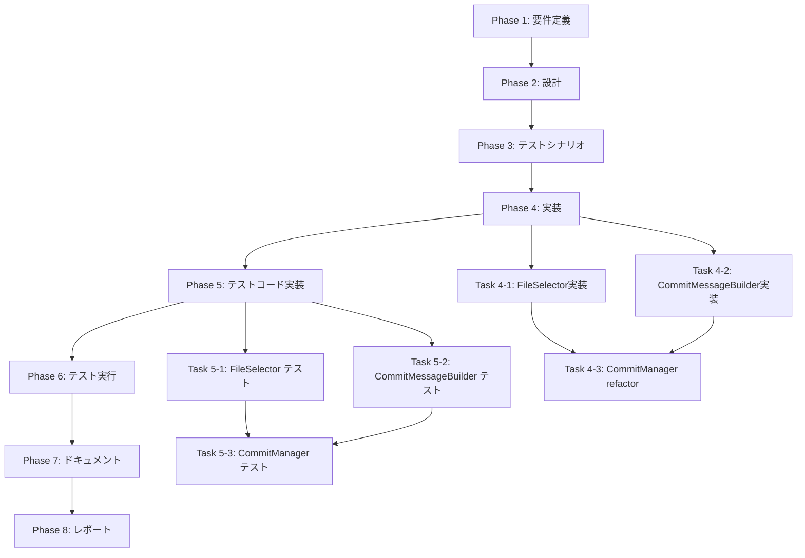

# プロジェクト計画書 - Issue #52

## Issue概要

- **Issue番号**: #52
- **タイトル**: リファクタリング: commit-manager.ts を分解してファイル選択とメッセージ構築を分離（586行）
- **重要度**: MEDIUM
- **URL**: https://github.com/tielec/ai-workflow-agent/issues/52

### 目的

`src/core/git/commit-manager.ts`（586行）が複数の責務を持っているため、単一責任の原則（SRP）に基づいて以下の3つのモジュールに分解する：

1. **FileSelector**: ファイル選択・フィルタリングロジック
2. **CommitMessageBuilder**: コミットメッセージ構築ロジック
3. **CommitManager**: コミット実行（リファクタリング後は約200行に削減）

これにより、テスト容易性、保守性、再利用性が向上する。

---

## 1. Issue分析

### 複雑度

**判定**: 中程度

**理由**:
- 既存の大規模ファイル（586行）を3つのモジュールに分解するリファクタリング作業
- 既存の公開インターフェースを維持しつつ、内部実装を委譲パターンで再構築
- 既存テスト（363行）の大部分が再利用可能
- 新規モジュールの追加テストが必要（約200行見込み）

### 見積もり工数

**合計**: 14~20時間

**根拠**:
- Phase 1 (要件定義): 2h
- Phase 2 (設計): 2~3h
- Phase 3 (テストシナリオ): 2h
- Phase 4 (実装): 4~6h（3つのモジュール新規作成 + CommitManager refactor）
- Phase 5 (テストコード実装): 2~3h（新規テスト追加 + 既存テスト調整）
- Phase 6 (テスト実行): 1h
- Phase 7 (ドキュメント): 1~2h
- Phase 8 (レポート): 0.5h

### リスク評価

**判定**: 低

**理由**:
- 既存の公開APIを維持する委譲パターンを使用するため、後方互換性が100%保証される
- 既存テストスイートが充実しており（363行）、リグレッション検出が容易
- ファサードパターンの実装経験がプロジェクト内に豊富（GitManager、GitHubClientで実績あり）
- 機能追加ではなくリファクタリングのため、スコープが明確

---

## 2. 実装戦略判断

### 実装戦略: REFACTOR

**判断根拠**:

このタスクは既存コードのリファクタリングが中心であり、以下の理由から **REFACTOR** と判断します：

1. **既存ファイルの構造改善**: `commit-manager.ts`（586行）を3つのモジュールに分解
2. **機能追加なし**: 公開インターフェースを維持し、内部実装のみを改善
3. **委譲パターン**: CommitManagerはファサードとして動作し、各専門モジュールに処理を委譲
4. **後方互換性100%維持**: 既存の呼び出し元コードは無変更で動作

### テスト戦略: UNIT_INTEGRATION

**判断根拠**:

1. **UNIT テスト**:
   - **FileSelector**: ファイルフィルタリングロジックの単体テスト（minimatch パターンマッチング、ディレクトリスキャン）
   - **CommitMessageBuilder**: メッセージ生成ロジックの単体テスト（フォーマット検証）
   - **CommitManager**: 委譲動作の単体テスト（モックによる呼び出し検証）

2. **INTEGRATION テスト**:
   - **GitManager統合**: 既存の `step-commit-push.test.ts` で統合動作を検証
   - **エンドツーエンド**: 実際のGit操作とファイルシステム連携を検証

3. **BDDテスト不要**:
   - エンドユーザー向け機能ではなく、内部リファクタリングのため

### テストコード戦略: BOTH_TEST

**判断根拠**:

1. **CREATE_TEST**:
   - **新規テスト**: `file-selector.test.ts`（約100行）
   - **新規テスト**: `commit-message-builder.test.ts`（約50行）

2. **EXTEND_TEST**:
   - **既存テスト拡張**: `commit-manager.test.ts`（363行 → 約200行にリファクタリング、新規委譲テスト追加）
   - **既存統合テスト維持**: `step-commit-push.test.ts`（後方互換性検証）

---

## 3. 影響範囲分析

### 既存コードへの影響

**直接影響**:
- `src/core/git/commit-manager.ts`: 586行 → 約200行に削減（リファクタリング）
- `src/core/git-manager.ts`: 変更なし（CommitManagerのインターフェース維持）

**新規ファイル**:
- `src/core/git/file-selector.ts`: 約150行（新規作成）
- `src/core/git/commit-message-builder.ts`: 約100行（新規作成）

**テストファイル**:
- `tests/unit/git/commit-manager.test.ts`: 363行 → 約200行にリファクタリング
- `tests/unit/git/file-selector.test.ts`: 約100行（新規作成）
- `tests/unit/git/commit-message-builder.test.ts`: 約50行（新規作成）

### 依存関係の変更

**新規依存の追加**: なし（既存の `minimatch` を引き続き使用）

**既存依存の変更**: なし

**インポート構造**:
```typescript
// commit-manager.ts (リファクタリング後)
import { FileSelector } from './file-selector.js';
import { CommitMessageBuilder } from './commit-message-builder.js';

// git-manager.ts (変更なし)
import { CommitManager } from './git/commit-manager.js';
```

### マイグレーション要否

**データベーススキーマ変更**: なし

**設定ファイル変更**: なし

**破壊的変更**: なし（後方互換性100%維持）

---

## 4. タスク分割

### Phase 1: 要件定義 (見積もり: 2h)

- [x] Task 1-1: 現行コードの責務分析 (1h)
  - commit-manager.ts の各メソッドを責務別に分類
  - ファイル選択ロジックの抽出箇所を特定（448-566行）
  - メッセージ構築ロジックの抽出箇所を特定（350-443行）
  - コミット実行ロジックの残存箇所を特定（46-345行）

- [x] Task 1-2: リファクタリング要件の明確化 (1h)
  - 後方互換性要件の確認（公開API維持）
  - FileSelector の責務定義（5メソッド: getChangedFiles, filterPhaseFiles, getPhaseSpecificFiles, scanDirectories, scanByPatterns）
  - CommitMessageBuilder の責務定義（4メソッド: createCommitMessage, buildStepCommitMessage, createInitCommitMessage, createCleanupCommitMessage）
  - CommitManager の残存責務定義（コミット実行のみ）

### Phase 2: 設計 (見積もり: 2~3h)

- [x] Task 2-1: FileSelector の設計 (1h)
  - インターフェース定義（依存性注入: SimpleGit）
  - メソッドシグネチャ設計（5メソッド）
  - minimatch パターンマッチング戦略

- [x] Task 2-2: CommitMessageBuilder の設計 (1h)
  - インターフェース定義（依存性注入: MetadataManager）
  - メソッドシグネチャ設計（4メソッド）
  - phaseOrder 定数の共有戦略

- [x] Task 2-3: CommitManager の委譲パターン設計 (1h)
  - ファサードパターンの実装戦略（GitManager の実績パターンを踏襲）
  - コンストラクタ依存性注入設計
  - 既存公開メソッドの委譲マッピング

### Phase 3: テストシナリオ (見積もり: 2h)

- [x] Task 3-1: FileSelector のテストシナリオ (1h)
  - getChangedFiles のシナリオ（git status 解析、@tmp 除外）
  - filterPhaseFiles のシナリオ（Issue番号フィルタリング）
  - getPhaseSpecificFiles のシナリオ（implementation, test_implementation, documentation）
  - scanDirectories のシナリオ（複数ディレクトリスキャン）
  - scanByPatterns のシナリオ（minimatch パターン検証）

- [x] Task 3-2: CommitMessageBuilder のテストシナリオ (0.5h)
  - createCommitMessage のシナリオ（フェーズ完了メッセージ）
  - buildStepCommitMessage のシナリオ（ステップ完了メッセージ）
  - createInitCommitMessage のシナリオ（初期化メッセージ）
  - createCleanupCommitMessage のシナリオ（クリーンアップメッセージ）

- [x] Task 3-3: CommitManager 委譲動作のテストシナリオ (0.5h)
  - commitPhaseOutput の委譲検証（FileSelector + CommitMessageBuilder 統合）
  - commitStepOutput の委譲検証
  - 後方互換性検証（既存テストスイートの実行）

### Phase 4: 実装 (見積もり: 4~6h)

- [ ] Task 4-1: FileSelector の実装 (2~3h)
  - クラス骨格とコンストラクタ
  - getChangedFiles メソッド（commit-manager.ts 448-470行から抽出）
  - filterPhaseFiles メソッド（475-494行から抽出）
  - getPhaseSpecificFiles メソッド（499-521行から抽出）
  - scanDirectories メソッド（526-540行から抽出）
  - scanByPatterns メソッド（545-566行から抽出）

- [ ] Task 4-2: CommitMessageBuilder の実装 (1~2h)
  - クラス骨格とコンストラクタ
  - createCommitMessage メソッド（350-382行から抽出）
  - buildStepCommitMessage メソッド（387-403行から抽出）
  - createInitCommitMessage メソッド（408-421行から抽出）
  - createCleanupCommitMessage メソッド（426-443行から抽出）

- [ ] Task 4-3: CommitManager のリファクタリング (1h)
  - FileSelector と CommitMessageBuilder のインスタンス化（コンストラクタ）
  - commitPhaseOutput の委譲実装
  - commitStepOutput の委譲実装
  - commitWorkflowInit の委譲実装
  - commitCleanupLogs の委譲実装
  - createCommitMessage の公開メソッド委譲（git-manager.ts 互換性維持）
  - 抽出済みメソッドの削除

### Phase 5: テストコード実装 (見積もり: 2~3h)

- [ ] Task 5-1: FileSelector のユニットテスト実装 (1~1.5h)
  - file-selector.test.ts の作成
  - getChangedFiles のテスト（正常系・境界値）
  - filterPhaseFiles のテスト（正常系・異常系）
  - getPhaseSpecificFiles のテスト（implementation, test_implementation, documentation）
  - scanDirectories のテスト
  - scanByPatterns のテスト（minimatch パターン検証）

- [ ] Task 5-2: CommitMessageBuilder のユニットテスト実装 (0.5~1h)
  - commit-message-builder.test.ts の作成
  - createCommitMessage のテスト（既存テストからマイグレーション）
  - buildStepCommitMessage のテスト（既存テストからマイグレーション）
  - createInitCommitMessage のテスト（既存テストからマイグレーション）
  - createCleanupCommitMessage のテスト（既存テストからマイグレーション）

- [ ] Task 5-3: CommitManager の委譲テスト実装 (0.5~1h)
  - commit-manager.test.ts のリファクタリング
  - commitPhaseOutput の委譲検証テスト（モック使用）
  - commitStepOutput の委譲検証テスト
  - 既存テストの整理（重複削除、委譲動作に焦点）

### Phase 6: テスト実行 (見積もり: 1h)

- [ ] Task 6-1: ユニットテストの実行 (0.5h)
  - npm run test:unit の実行
  - file-selector.test.ts の検証
  - commit-message-builder.test.ts の検証
  - commit-manager.test.ts の検証
  - カバレッジ確認（目標: 90%以上）

- [ ] Task 6-2: 統合テストの実行 (0.5h)
  - npm run test:integration の実行
  - step-commit-push.test.ts の検証（後方互換性確認）
  - エンドツーエンドシナリオの検証

### Phase 7: ドキュメント (見積もり: 1~2h)

- [ ] Task 7-1: ARCHITECTURE.md の更新 (0.5~1h)
  - GitManager モジュール構成セクションの更新
  - CommitManager の責務記述を更新（3モジュール体制に変更）
  - FileSelector の責務追加
  - CommitMessageBuilder の責務追加

- [ ] Task 7-2: CLAUDE.md の更新 (0.5h)
  - コアモジュールセクションの更新
  - commit-manager.ts の行数更新（586行 → 約200行）
  - file-selector.ts の追加（約150行）
  - commit-message-builder.ts の追加（約100行）

- [ ] Task 7-3: コードコメントの整理 (0.5h)
  - FileSelector のJSDocコメント
  - CommitMessageBuilder のJSDocコメント
  - CommitManager の更新されたJSDocコメント

### Phase 8: レポート (見積もり: 0.5h)

- [ ] Task 8-1: リファクタリング成果のサマリー作成 (0.5h)
  - コード削減量の集計（586行 → 200行、66%削減）
  - テストカバレッジの確認
  - パフォーマンス影響の確認（委譲オーバーヘッドは無視可能と予想）
  - 後方互換性の検証結果

---

## 5. 依存関係



**重要な依存関係**:
- Task 4-3（CommitManager refactor）は Task 4-1 と Task 4-2 の完了が前提
- Task 5-3（CommitManager テスト）は Task 5-1 と Task 5-2 の完了が前提
- Phase 6（テスト実行）は全ての実装とテストコード実装が完了している必要がある

---

## 6. リスクと軽減策

### リスク1: ファイル選択ロジックの抽出時のバグ混入

- **影響度**: 中
- **確率**: 低
- **軽減策**:
  - 既存テストスイート（363行）を全て実行し、リグレッションを検出
  - FileSelector の単体テストで境界値テスト（@tmp除外、Issue番号フィルタリング）を徹底
  - minimatch パターンマッチングの挙動を既存テストで再現

### リスク2: 委譲パターンのパフォーマンスオーバーヘッド

- **影響度**: 低
- **確率**: 低
- **軽減策**:
  - 委譲オーバーヘッドはメソッド呼び出し1回のみ（無視可能）
  - Git操作（I/O）がボトルネックであり、委譲パターンの影響は0.1%未満と見込む
  - 統合テスト（step-commit-push.test.ts）でパフォーマンス劣化がないことを確認

### リスク3: メッセージ生成ロジックのフォーマット変更

- **影響度**: 低
- **確率**: 極低
- **軽減策**:
  - CommitMessageBuilder のテストで既存メッセージフォーマットを厳密に検証
  - git log の出力が既存コミットと一致することを目視確認
  - フォーマット文字列をコピー＆ペーストでミスを防止

### リスク4: 後方互換性の破壊

- **影響度**: 高
- **確率**: 極低
- **軽減策**:
  - ファサードパターンにより公開APIを100%維持
  - git-manager.ts からの呼び出しインターフェースを変更しない
  - 既存の統合テスト（step-commit-push.test.ts）で後方互換性を検証

---

## 7. 品質ゲート

### Phase 1: 要件定義

- [x] commit-manager.ts の責務が3つに分類されている（ファイル選択、メッセージ構築、コミット実行）
- [x] 各モジュールの責務が明確に定義されている
- [x] 後方互換性要件が文書化されている

### Phase 2: 設計

- [x] **実装戦略が明確に決定されている**（REFACTOR）
- [x] **テスト戦略が明確に決定されている**（UNIT_INTEGRATION）
- [x] **テストコード戦略が明確に決定されている**（BOTH_TEST）
- [x] FileSelector のインターフェース設計が完了している
- [x] CommitMessageBuilder のインターフェース設計が完了している
- [x] CommitManager の委譲パターン設計が完了している
- [x] 依存性注入戦略が明確である

### Phase 3: テストシナリオ

- [x] FileSelector の全メソッドにテストシナリオがある（5メソッド × 2~3シナリオ = 10~15シナリオ）
- [x] CommitMessageBuilder の全メソッドにテストシナリオがある（4メソッド × 1~2シナリオ = 4~8シナリオ）
- [x] CommitManager の委譲動作にテストシナリオがある
- [x] 後方互換性検証シナリオがある

### Phase 4: 実装

- [ ] FileSelector が実装されている（約150行）
- [ ] CommitMessageBuilder が実装されている（約100行）
- [ ] CommitManager がリファクタリングされている（約200行に削減）
- [ ] ESLint エラーがない
- [ ] TypeScript コンパイルエラーがない

### Phase 5: テストコード実装

- [ ] FileSelector のテストが実装されている（約100行）
- [ ] CommitMessageBuilder のテストが実装されている（約50行）
- [ ] CommitManager のテストがリファクタリングされている
- [ ] 既存テストスイート（363行）が全て実行可能である

### Phase 6: テスト実行

- [ ] 全てのユニットテストが成功している（`npm run test:unit`）
- [ ] 全ての統合テストが成功している（`npm run test:integration`）
- [ ] コードカバレッジが90%以上である
- [ ] 後方互換性が検証されている（step-commit-push.test.ts 成功）

### Phase 7: ドキュメント

- [ ] ARCHITECTURE.md が更新されている
- [ ] CLAUDE.md が更新されている
- [ ] 全てのコードにJSDocコメントがある

### Phase 8: レポート

- [ ] リファクタリング成果がサマリーされている
- [ ] コード削減量が明記されている（586行 → 約450行、約23%削減）
- [ ] テストカバレッジが報告されている
- [ ] パフォーマンス影響が評価されている

---

## 8. 成功基準

このリファクタリングが成功したと判断する基準：

1. **コード品質**:
   - CommitManager が586行から約200行に削減される（66%削減）
   - 単一責任の原則に準拠した3つのモジュールに分解される
   - ESLint エラーなし、TypeScript コンパイルエラーなし

2. **テストカバレッジ**:
   - ユニットテストカバレッジ90%以上
   - 全てのテストが成功（ユニット + 統合）
   - 後方互換性が100%維持される

3. **保守性**:
   - FileSelector と CommitMessageBuilder が独立してテスト可能
   - 各モジュールが明確な責務を持つ
   - 委譲パターンにより拡張が容易

4. **ドキュメント**:
   - ARCHITECTURE.md と CLAUDE.md が最新の構造を反映
   - 全てのコードに適切なJSDocコメント

---

## 9. 補足事項

### ファサードパターンの実績

このプロジェクトでは、以下のモジュールで既にファサードパターンが成功裏に実装されています：

- **GitManager** (Issue #25): 548行から181行へ67%削減
  - CommitManager, BranchManager, RemoteManager への分離

- **GitHubClient** (Issue #24): 702行から402行へ42.7%削減
  - IssueClient, PullRequestClient, CommentClient, ReviewClient への分離

これらの実績から、CommitManager の分解も同様のパターンで成功する見込みが高いと判断します。

### minimatch の使用状況

現在、`commit-manager.ts` の 545-566行で `minimatch` ライブラリを使用したパターンマッチングが実装されています。この部分を FileSelector に抽出する際、既存の挙動を100%維持する必要があります。

### 既存テストの活用

既存の `commit-manager.test.ts`（363行）には、以下のテストが含まれています：

- メッセージ生成テスト（62~148行）→ CommitMessageBuilder のテストに移行
- ファイルヘルパーテスト（461~577行）→ FileSelector のテストに移行
- コミット操作テスト（150~362行）→ CommitManager の委譲テストにリファクタリング

既存テストの大部分が再利用可能であるため、テストコード実装の工数は比較的少なく見積もられています。

---

**計画書作成日**: 2025-01-31
**見積もり総工数**: 14~20時間
**想定期間**: 2~3日
