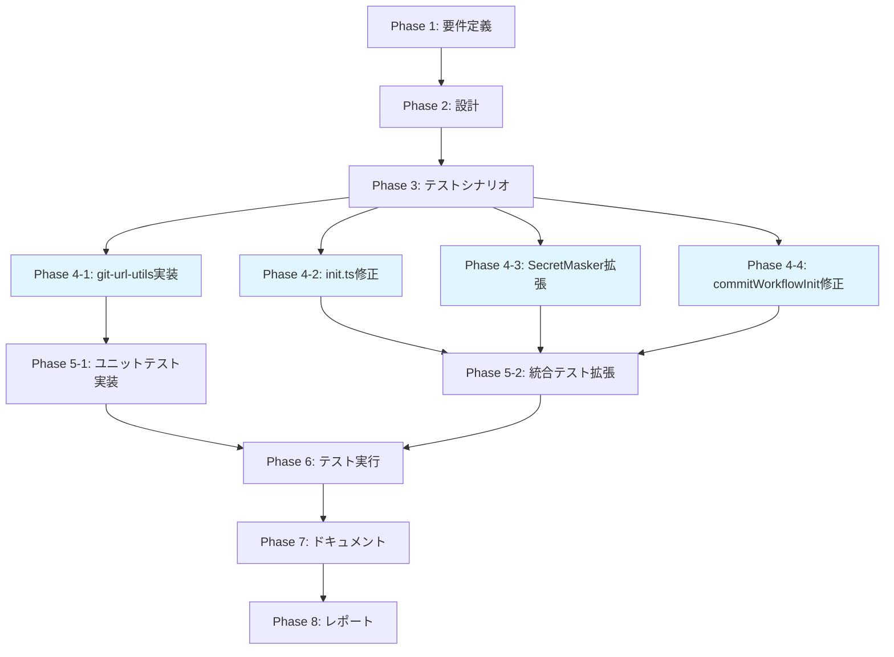

# プロジェクト計画書 - Issue #54

## Issue分析

### 概要
- **Issue番号**: #54
- **タイトル**: バグ: metadata.jsonにGitHub Personal Access Tokenが含まれpush protectionで拒否される
- **重要度**: HIGH（セキュリティリスク）
- **URL**: https://github.com/tielec/ai-workflow-agent/issues/54

### 1. Issue分析

#### 複雑度: 中程度

**判定理由**:
- 複数ファイルの修正が必要（`src/commands/init.ts`, `src/core/secret-masker.ts`, `src/core/git/commit-manager.ts` + 新規ユーティリティファイル）
- 既存の初期化フローとシークレットマスキング機能の拡張
- 新規ユーティリティ関数の作成とテストが必要
- ただし、アーキテクチャの大幅な変更は不要（既存パターンに従う）

#### 見積もり工数: 10~14時間

**根拠**:
- Phase 1 (要件定義): 1~2h - セキュリティ要件とテストケースの洗い出し
- Phase 2 (設計): 2~3h - URLサニタイゼーション関数の設計、SecretMaskerの拡張設計
- Phase 3 (テストシナリオ): 1~2h - ユニット・統合テストシナリオの作成
- Phase 4 (実装): 3~4h - ユーティリティ関数、init.ts修正、SecretMasker拡張
- Phase 5 (テストコード実装): 1.5~2h - ユニット・統合テストコード作成
- Phase 6 (テスト実行): 0.5~1h - テスト実行と修正
- Phase 7 (ドキュメント): 0.5~1h - CLAUDE.md、TROUBLESHOOTINGの更新
- Phase 8 (レポート): 0.5h - レポート作成

#### リスク評価: 中

**理由**:
- **技術的リスク（中）**: Git URL形式の多様性（HTTPS/SSH/異なるホスト）に対応する必要がある
- **セキュリティリスク（高→低）**: 根本原因を解決することで、トークン漏洩リスクを完全に排除できる
- **後方互換性リスク（低）**: 既存のmetadata.jsonには影響しない（新規init時のみ適用）
- **テストリスク（低）**: 明確なテストケースを定義可能

### 2. 実装戦略判断

#### 実装戦略: EXTEND

**判断根拠**:
- **既存コードの拡張が中心**:
  - `src/commands/init.ts`: remote URL取得後にサニタイズ処理を追加（2箇所）
  - `src/core/secret-masker.ts`: `targetFilePatterns` に `metadata.json` を追加
  - `src/core/git/commit-manager.ts`: `commitWorkflowInit()` でマスキング実行を確実化

- **新規作成は最小限**:
  - `src/utils/git-url-utils.ts`: URLサニタイゼーション関数（新規ユーティリティファイル）

- **既存アーキテクチャに従う**:
  - ユーティリティ関数は `src/utils/` に配置（既存パターン）
  - SecretMaskerの使用方法は既存コードと同様
  - コミットフローは既存の `CommitManager` パターンに従う

#### テスト戦略: UNIT_INTEGRATION

**判断根拠**:
- **UNIT（ユニットテスト）**:
  - `sanitizeGitUrl()` 関数: 純粋関数で外部依存なし、様々なURL形式のテストが必要
  - テストケース: HTTPS+トークン、HTTPS+ユーザー:パスワード、SSH、通常HTTPS、エッジケース

- **INTEGRATION（統合テスト）**:
  - `init` コマンド全体でトークン埋め込みURLを使用した場合の動作確認
  - metadata.json作成→マスキング→コミット→pushの一連のフローを検証
  - GitHub push protectionによる拒否が発生しないことを確認

- **BDD不要の理由**:
  - エンドユーザー向けの新機能ではなく、バグ修正（セキュリティ問題の解決）
  - ユーザーストーリーベースのテストよりも、技術的な正確性を重視

#### テストコード戦略: BOTH_TEST

**判断根拠**:
- **CREATE_TEST（新規テスト作成）**:
  - `tests/unit/utils/git-url-utils.test.ts`: `sanitizeGitUrl()` のユニットテスト（新規ファイル）

- **EXTEND_TEST（既存テスト拡張）**:
  - `tests/integration/init-command.test.ts`: 既存の `init` コマンドテストにトークン埋め込みURLのテストケースを追加
  - `tests/unit/core/secret-masker.test.ts`: `metadata.json` スキャンのテストケースを追加（ファイルが存在する場合）

- **両方必要な理由**:
  - 新規ユーティリティ関数は独立したテストファイルが適切
  - 既存機能の拡張部分は既存テストに追加することで、回帰テストを強化

### 3. 影響範囲分析

#### 既存コードへの影響

**変更が必要なファイル**:

1. **`src/commands/init.ts` (2箇所修正)**
   - 行192付近: `resolveLocalRepoPath()` 内のremote URL取得後にサニタイズ
   - 行236付近: メタデータ保存時のremote URLをサニタイズ
   - 影響: init コマンドの動作のみ（既存ワークフローには影響なし）

2. **`src/core/secret-masker.ts`**
   - `targetFilePatterns` に `metadata.json` を追加
   - 影響: 既存のマスキング対象（agent_log等）には影響なし

3. **`src/core/git/commit-manager.ts`**
   - `commitWorkflowInit()` メソッドにマスキング処理を追加
   - 影響: init時のコミットフローのみ（他のコミット処理には影響なし）

**新規作成ファイル**:

1. **`src/utils/git-url-utils.ts`**
   - `sanitizeGitUrl()` 関数
   - 既存コードへの影響: なし（新規ユーティリティ）

2. **`tests/unit/utils/git-url-utils.test.ts`**
   - ユニットテスト
   - 既存テストへの影響: なし

#### 依存関係の変更

**新規依存の追加**: なし（標準ライブラリのみ使用）

**既存依存の変更**: なし

**内部依存の追加**:
- `src/commands/init.ts` → `src/utils/git-url-utils.ts` (新規import)

#### マイグレーション要否

**不要**

**理由**:
- 既存の `metadata.json` には影響しない（過去に作成されたワークフローは変更なし）
- 新規 `init` コマンド実行時のみ適用される
- データベーススキーマ変更なし
- 設定ファイル変更なし

**注意点**:
- 既存ワークフローで過去にトークンが保存されている場合、手動でトークンを削除する必要がある（この対応は本Issue範囲外）

### 4. タスク分割

#### Phase 1: 要件定義 (見積もり: 1~2h)

- [ ] Task 1-1: セキュリティ要件の明確化 (0.5~1h)
  - GitHub Personal Access Tokenの検出パターンを定義（`ghp_`, `github_pat_` 等）
  - サニタイズすべきURL形式を列挙（HTTPS+トークン、HTTPS+ユーザー:パスワード）
  - 保持すべきURL形式を確認（SSH、通常HTTPS）

- [ ] Task 1-2: 受け入れ基準の定義 (0.5~1h)
  - HTTPS+トークン形式のURLからトークンが除去されること
  - SSH形式のURLは変更されないこと
  - metadata.jsonにトークンが含まれないこと
  - GitHub push protectionが発動しないこと
  - 既存のinitフローが正常に動作すること

#### Phase 2: 設計 (見積もり: 2~3h)

- [ ] Task 2-1: URLサニタイゼーション関数の設計 (1~1.5h)
  - `sanitizeGitUrl()` 関数のシグネチャ設計
  - 正規表現パターンの設計（HTTPS認証情報検出）
  - エッジケース処理の設計（空文字列、不正URL等）
  - JSDoc形式のドキュメント作成

- [ ] Task 2-2: SecretMaskerの拡張設計 (0.5~1h)
  - `metadata.json` スキャンの優先度決定
  - マスキングパターンの確認（既存パターンで十分か）
  - エラーハンドリング設計（metadata.json不在時の挙動）

- [ ] Task 2-3: commitWorkflowInitの修正設計 (0.5~1h)
  - マスキング実行タイミングの決定（コミット前）
  - マスキング失敗時のエラーハンドリング（致命的エラーとして扱う）
  - ログ出力設計（マスク件数の表示）

#### Phase 3: テストシナリオ (見積もり: 1~2h)

- [ ] Task 3-1: ユニットテストシナリオ作成 (0.5~1h)
  - `sanitizeGitUrl()` の正常系テストケース（HTTPS+トークン、SSH、通常HTTPS）
  - `sanitizeGitUrl()` の異常系テストケース（空文字列、null、不正URL）
  - エッジケース（複数@記号、ポート番号付き等）

- [ ] Task 3-2: 統合テストシナリオ作成 (0.5~1h)
  - トークン埋め込みURLでのinit実行テスト
  - metadata.json作成確認（トークンが除去されていること）
  - コミット・push成功確認（push protection発動なし）
  - 既存テストへの影響確認（回帰テストが通ること）

#### Phase 4: 実装 (見積もり: 3~4h)

- [ ] Task 4-1: git-url-utils.tsの実装 (1~1.5h)
  - `src/utils/git-url-utils.ts` ファイル作成
  - `sanitizeGitUrl()` 関数実装
  - HTTPS認証情報除去ロジック（正規表現）
  - JSDocコメント追加

- [ ] Task 4-2: init.tsの修正 (1~1.5h)
  - `src/commands/init.ts` にimport追加
  - 行192付近のremote URL取得後にサニタイズ追加
  - 行236付近のメタデータ保存前にサニタイズ追加
  - デバッグログ追加（サニタイズ前後のURL比較、トークン検出時の警告）

- [ ] Task 4-3: SecretMaskerの拡張 (0.5h)
  - `src/core/secret-masker.ts` の `targetFilePatterns` に `metadata.json` 追加

- [ ] Task 4-4: commitWorkflowInitの修正 (0.5~1h)
  - `src/core/git/commit-manager.ts` の `commitWorkflowInit()` 修正
  - metadata.json作成直後にマスキング実行
  - マスキング結果のログ出力
  - マスキング失敗時のエラースロー

#### Phase 5: テストコード実装 (見積もり: 1.5~2h)

- [ ] Task 5-1: ユニットテスト実装 (1~1.5h)
  - `tests/unit/utils/git-url-utils.test.ts` 作成
  - HTTPS+トークン形式のテスト実装（`ghp_xxx`, `github_pat_xxx`）
  - HTTPS+ユーザー:パスワード形式のテスト実装
  - SSH形式のテスト実装（変更なし確認）
  - 通常HTTPS形式のテスト実装（変更なし確認）
  - エッジケーステスト実装（空文字列、複数@、ポート番号等）

- [ ] Task 5-2: 統合テスト拡張 (0.5h)
  - `tests/integration/init-command.test.ts` にテストケース追加（ファイルが存在する場合）
  - トークン埋め込みURLでのinit実行テスト
  - metadata.json検証（トークン除去確認）

#### Phase 6: テスト実行 (見積もり: 0.5~1h)

- [ ] Task 6-1: ユニットテスト実行 (0.25~0.5h)
  - `npm run test:unit` 実行
  - git-url-utils.test.ts の全テストケース合格確認
  - カバレッジ確認（100%目標）

- [ ] Task 6-2: 統合テスト実行 (0.25~0.5h)
  - `npm run test:integration` 実行（統合テストが存在する場合）
  - 既存テストの回帰テスト確認
  - 新規テストケース合格確認

#### Phase 7: ドキュメント (見積もり: 0.5~1h)

- [ ] Task 7-1: CLAUDE.mdの更新 (0.25~0.5h)
  - セキュリティ対策セクションに本修正を追加
  - Git URL サニタイゼーション機能の説明
  - metadata.jsonのSecretMasker対応を記載

- [ ] Task 7-2: TROUBLESHOOTING.mdの更新 (0.25~0.5h)
  - 「GitHub push protection エラー」セクション追加
  - トラブルシューティング手順（既存ワークフローでのトークン削除方法）
  - 原因と解決策の説明

#### Phase 8: レポート (見積もり: 0.5h)

- [ ] Task 8-1: 実装レポート作成 (0.5h)
  - 実装内容のサマリー
  - テスト結果のサマリー
  - 既存ワークフローへの影響評価
  - 残課題（既存metadata.jsonの手動修正が必要な場合の対応）

### 5. 依存関係

**重要な依存関係**:
- Phase 4の各タスク（4-1〜4-4）は並行実装可能
- Phase 5-1（ユニットテスト）はPhase 4-1完了後すぐ開始可能
- Phase 5-2（統合テスト）はPhase 4-2, 4-3, 4-4すべて完了後に開始

### 6. リスクと軽減策

#### リスク1: Git URL形式の多様性

- **影響度**: 中
- **確率**: 中
- **詳細**: GitHub以外のGitホスト（GitLab、Bitbucket等）、異なるURL形式（ポート番号付き、サブドメイン等）に対応できない可能性
- **軽減策**:
  - Phase 1で幅広いURL形式をリストアップ
  - 正規表現を保守的に設計（誤って必要な情報を削除しない）
  - 不明な形式の場合は元のURLをそのまま返す（フェイルセーフ）
  - ユニットテストでエッジケースを網羅

#### リスク2: 既存ワークフローへの影響

- **影響度**: 低
- **確率**: 低
- **詳細**: 既存の `.ai-workflow/issue-*/metadata.json` に過去保存されたトークンは修正されない
- **軽減策**:
  - 本修正は新規init時のみ適用されることを明確化
  - ドキュメント（TROUBLESHOOTING.md）に既存ワークフローの対応方法を記載
  - 統合テストで既存ワークフローが影響を受けないことを確認

#### リスク3: SecretMaskerのパフォーマンス影響

- **影響度**: 低
- **確率**: 低
- **詳細**: metadata.jsonを毎回スキャンすることでinit時のパフォーマンスが低下する可能性
- **軽減策**:
  - metadata.jsonは小さいファイル（数KB）のため、実質的な影響は軽微
  - 必要に応じてベンチマーク測定
  - マスキング処理はすでに最適化されている（既存実装を活用）

#### リスク4: テスト環境でのトークン埋め込み

- **影響度**: 中
- **確率**: 低
- **詳細**: 統合テストで実際のトークンを使用してしまうリスク
- **軽減策**:
  - テストではダミートークン（`ghp_dummy123456789abcdef`）を使用
  - テスト用の一時リポジトリを作成（実リポジトリを使用しない）
  - CI環境でのシークレット管理を徹底

#### リスク5: 正規表現の誤検出・見逃し

- **影響度**: 高（セキュリティリスク）
- **確率**: 低
- **詳細**: 正規表現が複雑化し、トークンを誤って除去しない、または正常な文字列を誤って除去する
- **軽減策**:
  - シンプルで保守的な正規表現を使用（`https?://[^@]+@` パターン）
  - 包括的なユニットテストでパターンを検証
  - Phase 2でレビューを実施し、正規表現の妥当性を確認
  - SecretMaskerによる二重チェック（Defense in Depth）

### 7. 品質ゲート

#### Phase 1: 要件定義

- [ ] セキュリティ要件が明確に定義されている（トークン検出パターン、サニタイズ対象URL形式）
- [ ] 受け入れ基準が具体的かつ測定可能である
- [ ] エッジケースが網羅的にリストアップされている

#### Phase 2: 設計

- [ ] 実装戦略の判断根拠が明記されている（EXTEND）
- [ ] テスト戦略の判断根拠が明記されている（UNIT_INTEGRATION）
- [ ] テストコード戦略の判断根拠が明記されている（BOTH_TEST）
- [ ] `sanitizeGitUrl()` 関数の設計が明確である（シグネチャ、正規表現、エラーハンドリング）
- [ ] 既存コードとの統合方法が明確である（init.ts、SecretMasker、CommitManager）

#### Phase 3: テストシナリオ

- [ ] ユニットテストシナリオが網羅的である（正常系・異常系・エッジケース）
- [ ] 統合テストシナリオが実運用を模擬している（トークン埋め込みURL、push protection確認）
- [ ] 既存テストへの影響が評価されている（回帰テスト）

#### Phase 4: 実装

- [ ] `sanitizeGitUrl()` が正規表現でHTTPS認証情報を正しく除去する
- [ ] `init.ts` の2箇所でサニタイズが適用されている（行192, 236付近）
- [ ] `SecretMasker` に `metadata.json` が追加されている
- [ ] `commitWorkflowInit()` でマスキングが実行され、失敗時にエラーがスローされる
- [ ] コードがTypeScriptの型安全性を満たしている
- [ ] eslintチェックが通る

#### Phase 5: テストコード実装

- [ ] ユニットテストが全テストケースをカバーしている（HTTPS+トークン、SSH、通常HTTPS、エッジケース）
- [ ] 統合テストがトークン埋め込みURLでのinit実行を検証している
- [ ] テストコードがベストプラクティスに従っている（AAA pattern: Arrange-Act-Assert）

#### Phase 6: テスト実行

- [ ] すべてのユニットテストが合格している
- [ ] すべての統合テストが合格している
- [ ] 既存テストの回帰テストが合格している（`npm test` で全テスト通過）
- [ ] カバレッジが十分である（新規コードは100%目標）

#### Phase 7: ドキュメント

- [ ] CLAUDE.mdにセキュリティ対策が記載されている
- [ ] TROUBLESHOOTING.mdにトラブルシューティング手順が記載されている
- [ ] コードコメント（JSDoc）が十分である

#### Phase 8: レポート

- [ ] 実装内容が正確に記載されている
- [ ] テスト結果が定量的に記載されている（テスト件数、カバレッジ等）
- [ ] 既存ワークフローへの影響が評価されている
- [ ] 残課題が明確に記載されている

## まとめ

本プロジェクトは、GitHub Personal Access Tokenがmetadata.jsonに保存される重大なセキュリティ問題を解決するものです。

**主要な実装内容**:
1. Git URL サニタイゼーション関数の新規作成（`src/utils/git-url-utils.ts`）
2. init コマンドでのサニタイズ適用（2箇所）
3. SecretMasker の拡張（metadata.json スキャン）
4. commitWorkflowInit での確実なマスキング実行

**実装戦略**: EXTEND（既存コードの拡張が中心）
**テスト戦略**: UNIT_INTEGRATION（ユニット＋統合テスト）
**テストコード戦略**: BOTH_TEST（新規作成＋既存拡張）

**見積もり工数**: 10~14時間

**重要なリスク**:
- Git URL形式の多様性（軽減策: 保守的な正規表現、包括的なテスト）
- 正規表現の誤検出・見逃し（軽減策: SecretMaskerによる二重チェック）

本計画に従い、セキュアで信頼性の高い実装を進めます。
