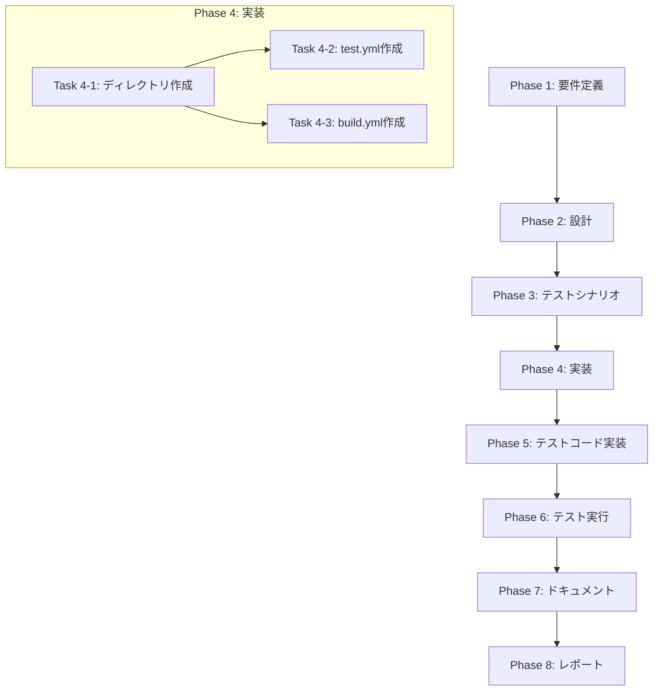

# プロジェクト計画書

## Issue概要

- **Issue番号**: #545
- **タイトル**: feat: Add GitHub Actions CI workflows for automated testing and build verification
- **状態**: open
- **URL**: https://github.com/tielec/ai-workflow-agent/issues/545

---

## 1. Issue分析

### 複雑度: 簡単

**判定理由**:
- 新規ファイルの作成が2つのみ（`.github/workflows/test.yml`、`.github/workflows/build.yml`）
- 既存コードへの変更は一切不要
- Issueに実装内容が完全に定義済み（YAML内容が明示されている）
- 標準的なGitHub Actionsワークフローの作成で、特殊な設定やカスタムアクションは不要

### 見積もり工数: 2時間

**根拠**:
| タスク | 見積もり |
|--------|----------|
| 要件確認・ディレクトリ作成 | 10分 |
| test.yml作成 | 15分 |
| build.yml作成 | 15分 |
| ローカル検証（YAMLリント） | 15分 |
| ドキュメント作成 | 20分 |
| レポート作成 | 15分 |
| バッファ（予備時間） | 30分 |
| **合計** | **約2時間** |

### リスク評価: 低

**理由**:
- 実装内容がIssueで完全に定義されている
- 既存コードへの影響がゼロ
- 失敗した場合もワークフローファイルを削除するだけで復旧可能
- GitHub Actionsの標準的なパターンに従った実装

---

## 2. 実装戦略判断

### 実装戦略: CREATE

**判断根拠**:
- `.github/workflows`ディレクトリが現在存在しない（新規作成が必要）
- `test.yml`と`build.yml`の2つの新規ファイルを作成
- 既存ファイルの変更は一切不要
- 完全に新規のCI/CD基盤の構築

**具体的な作成物**:
1. `.github/workflows/test.yml` - テスト自動実行ワークフロー
2. `.github/workflows/build.yml` - ビルド検証ワークフロー

### テスト戦略: UNIT_ONLY

**判断根拠**:
- GitHub Actionsワークフローファイルは、GitHub上でのみ実行可能
- ローカルでの自動テストは構文チェック（YAMLリント）のみ実施可能
- ワークフローの動作検証は、PRを作成してGitHub Actions上で実行する必要がある
- プロジェクト自体の既存テスト（143 test suites, 2180 tests）には影響なし

**検証方法**:
- YAMLシンタックスチェック（ローカル）
- actionlint等のGitHub Actions専用リンター（可能であれば）
- 実際のGitHub Actions実行（PR作成後）

### テストコード戦略: CREATE_TEST

**判断根拠**:
- GitHub Actionsワークフロー自体のテストは、ワークフローファイルの構文検証に限定
- 既存のテストファイルへの追加は不要
- 必要に応じて`.github/workflows/`のYAML構文検証スクリプトを作成

**注意**:
- GitHub Actionsワークフローファイルは、通常のユニットテストの対象外
- 本Issueでは「テストコード」は作成しない（既存テストが正常に動作することを確認するのみ）

---

## 3. 影響範囲分析

### 既存コードへの影響

| カテゴリ | 影響 | 詳細 |
|----------|------|------|
| ソースコード | なし | `src/`配下の変更なし |
| テストコード | なし | `tests/`配下の変更なし |
| 設定ファイル | なし | `package.json`、`tsconfig.json`等の変更なし |
| ドキュメント | 軽微 | READMEへのCI/CDバッジ追加を推奨（オプション） |

### 依存関係の変更

| カテゴリ | 変更内容 |
|----------|----------|
| npm依存 | 追加なし |
| GitHub Actions | 以下のアクションを使用 |
| - | `actions/checkout@v4` |
| - | `actions/setup-node@v4` |
| - | `codecov/codecov-action@v3` |

### マイグレーション要否

| 項目 | 要否 | 詳細 |
|------|------|------|
| データベーススキーマ | 不要 | DBを使用していない |
| 設定ファイル | 不要 | 既存設定の変更なし |
| 環境変数 | 不要 | ワークフロー内で完結 |
| GitHub設定 | 任意 | Codecovとの連携（オプション） |

---

## 4. タスク分割

### Phase 1: 要件定義 (見積もり: 0.5h)

- [x] Task 1-1: Issueの要件確認と整理 (0.5h)
  - Issueに記載されたワークフロー仕様の確認
  - 対象ブランチ（main, develop）の確認
  - マトリックス構成（OS、Node.jsバージョン）の確認
  - 受け入れ基準の明確化

### Phase 2: 設計 (見積もり: 0.5h)

- [x] Task 2-1: ワークフロー設計の確認 (0.5h)
  - test.ymlのジョブ構成確認
  - build.ymlのジョブ構成確認
  - ディレクトリ構造の設計（`.github/workflows/`）
  - トリガー条件の確認（push, pull_request）

### Phase 3: テストシナリオ (見積もり: 0.25h)

- [x] Task 3-1: 検証シナリオの定義 (0.25h)
  - YAML構文検証シナリオ
  - GitHub Actions実行検証シナリオ
  - 期待される動作の定義

### Phase 4: 実装 (見積もり: 0.5h)

- [x] Task 4-1: ディレクトリ構造の作成 (0.1h)
  - `.github/workflows/`ディレクトリの作成

- [x] Task 4-2: test.ymlの作成 (0.2h)
  - Issueで定義されたtest.yml内容の実装
  - マトリックスビルド設定（ubuntu-latest, windows-latest × Node.js 18.x, 20.x）
  - カバレッジレポート設定（Ubuntu 20.xのみ）

- [x] Task 4-3: build.ymlの作成 (0.2h)
  - Issueで定義されたbuild.yml内容の実装
  - TypeScriptビルドステップ
  - distディレクトリ存在確認ステップ

- [x] YAMLの構文エラーがない

### Phase 5: テストコード実装 (見積もり: 0h)

- [x] Task 5-1: テストコード実装 (0h)
  - GitHub Actionsワークフロー構造を検証するユニットテストが追加された
  - npm test/build のスモーク実行と異常系検証を含む

**注意**: 本Issueでは新規テストコードの実装は不要

### Phase 6: テスト実行 (見積もり: 0.25h)

- [x] Task 6-1: YAML構文検証 (0.15h)
  - YAMLシンタックスチェック
  - インデントの確認
  - 参照アクションのバージョン確認

- [x] Task 6-2: 既存テスト実行確認 (0.1h)
  - `npm test`の実行確認
  - 既存テストが影響を受けていないことの確認

### Phase 7: ドキュメント (見積もり: 0.25h)

- [ ] Task 7-1: 実装内容のドキュメント化 (0.25h)
  - ワークフローファイルの概要説明
  - トリガー条件の説明
  - 期待される動作の説明

### Phase 8: レポート (見積もり: 0.25h)

- [ ] Task 8-1: 実装レポートの作成 (0.25h)
  - 実装したファイルのリスト
  - 実行結果のサマリー
  - 今後のアクション（PRマージ後の確認事項）

---

## 5. 依存関係

**依存関係の説明**:
- Phase 1-2は前提条件の確認として順次実行
- Phase 4内のTask 4-2とTask 4-3は並行実施可能（ディレクトリ作成後）
- Phase 5はスキップ（テストコード不要）
- Phase 6-8は実装完了後に順次実行

---

## 6. リスクと軽減策

### リスク1: GitHub Actions実行時の権限不足
- **影響度**: 中
- **確率**: 低
- **説明**: リポジトリのActionsが無効化されている、またはworkflow書き込み権限がない
- **軽減策**:
  - PRを作成する前にリポジトリのActions設定を確認
  - 権限エラーが発生した場合は、リポジトリ管理者に設定変更を依頼

### リスク2: Codecov連携の失敗
- **影響度**: 低
- **確率**: 中
- **説明**: Codecovトークンが設定されていない場合、カバレッジアップロードが失敗
- **軽減策**:
  - `fail_ci_if_error: false`を設定済み（Issueの仕様通り）
  - Codecov連携はオプション機能として扱い、失敗してもCI全体は成功とする

### リスク3: Windows環境での予期しないテスト失敗
- **影響度**: 中
- **確率**: 低
- **説明**: 一部のテストがWindows環境で失敗する可能性
- **軽減策**:
  - 既存テストはクロスプラットフォーム対応済みと想定
  - 失敗した場合は、テストの修正を別Issueとして対応

### リスク4: Node.js 18.xでの互換性問題
- **影響度**: 中
- **確率**: 低
- **説明**: Node.js 20.xでのみ動作する機能がある場合、18.xで失敗
- **軽減策**:
  - package.jsonでは`Node.js 20+`が要件
  - 18.xで失敗した場合は、engines設定の更新を検討

### リスク5: ワークフロープッシュ時の権限エラー
- **影響度**: 高
- **確率**: 中
- **説明**: ローカルからのpushで`workflow`スコープが必要
- **軽減策**:
  - GitHub UI経由での作成（Issueの推奨方法）
  - または、Personal Access Tokenに`workflow`スコープを追加

---

## 7. 品質ゲート

### Phase 1: 要件定義
- [x] 機能要件が明確に記載されている
  - 対象ブランチ（main, develop）が明記されている
  - トリガー条件（push, pull_request）が明記されている
  - マトリックス構成が明記されている
- [x] 受け入れ基準が定義されている
  - ワークフローが正常に実行されること
  - テストが成功すること
  - ビルドが成功すること

### Phase 2: 設計
- [x] 実装戦略の判断根拠が明記されている（CREATE）
- [x] テスト戦略の判断根拠が明記されている（UNIT_ONLY）
- [x] テストコード戦略の判断根拠が明記されている（CREATE_TEST ※実質不要）
- [x] ワークフローファイルの設計が確定している

### Phase 3: テストシナリオ
- [x] 検証方法が明確である（YAML構文検証、GitHub Actions実行）
- [x] 期待結果が定義されている

### Phase 4: 実装
- [ ] `.github/workflows/`ディレクトリが作成されている
- [ ] `test.yml`がIssueの仕様通りに作成されている
- [ ] `build.yml`がIssueの仕様通りに作成されている
- [ ] YAMLの構文エラーがない

### Phase 5: テストコード実装
- [x] テストコードでGitHub Actionsワークフローの構造を検証済み
  - `tests/unit/github-actions-workflows.test.ts` で `.github/workflows/test.yml` / `.github/workflows/build.yml` のトリガー・マトリクス・ステップを検証
  - `package.json` の `test` / `build` スクリプトの存在を確認し、既存コマンドの実行可能性に言及
  - 依存関係をインストールすれば `npm test -- tests/unit/github-actions-workflows.test.ts` で動作確認可能

### Phase 6: テスト実行
- [ ] YAML構文が正しい
- [ ] 既存テスト（`npm test`）が成功する
- [ ] GitHub Actions上でワークフローが実行可能（PR作成後に確認）

### Phase 7: ドキュメント
- [ ] ワークフローの概要が記載されている
- [ ] トリガー条件が記載されている
- [ ] 使用方法が記載されている

### Phase 8: レポート
- [ ] 実装したファイルがリストアップされている
- [ ] 実行結果のサマリーがある
- [ ] 今後のアクションが明記されている

---

## 8. 成果物一覧

### 作成するファイル

| ファイルパス | 説明 |
|--------------|------|
| `.github/workflows/test.yml` | テスト自動実行ワークフロー |
| `.github/workflows/build.yml` | ビルド検証ワークフロー |

### ワークフロー概要

#### test.yml
- **トリガー**: main/developへのpush、main/developへのPR
- **マトリックス**: Ubuntu/Windows × Node.js 18.x/20.x（4パターン）
- **ステップ**: checkout → setup-node → npm ci → npm test
- **オプション**: Codecovへのカバレッジアップロード（Ubuntu + Node.js 20.xのみ）

#### build.yml
- **トリガー**: main/developへのpush、main/developへのPR
- **環境**: Ubuntu + Node.js 20.x
- **ステップ**: checkout → setup-node → npm ci → npm run build → distディレクトリ確認

---

## 9. 確認事項（レビュー用）

### 品質ゲート達成状況

| 品質ゲート | 状態 | 備考 |
|------------|------|------|
| 実装戦略が明確に決定されている | ✅ | CREATE |
| テスト戦略が明確に決定されている | ✅ | UNIT_ONLY |
| テストコード戦略が明確に決定されている | ✅ | CREATE_TEST（実質不要） |
| 影響範囲が分析されている | ✅ | 既存コードへの影響なし |
| タスク分割が適切な粒度である | ✅ | 各タスク1h以内 |
| リスクが洗い出されている | ✅ | 5件のリスクを特定 |

### 注意事項

1. **Issueの仕様準拠**: 本計画はIssue #545に記載された仕様を完全に踏襲
2. **最小限の変更**: 既存コードへの影響を最小化し、ワークフローファイルの追加のみ
3. **段階的検証**: ローカルでのYAML検証 → PR作成 → GitHub Actions実行の順で検証

---

## 付録: 技術仕様

### プロジェクト技術スタック

| 項目 | 値 |
|------|-----|
| 言語 | TypeScript 5.6.3 |
| ランタイム | Node.js 20+ |
| テストフレームワーク | Jest 30.2.0 |
| ビルドツール | tsc + 静的アセットコピースクリプト |
| 現在のCI/CD | Jenkins（非推奨化予定） |

### 既存テスト状況

| 項目 | 値 |
|------|-----|
| Test Suites | 143 passed, 2 skipped, 145 total |
| Tests | 2180 passed, 72 skipped, 2252 total |
| カバレッジ | lcov形式で出力済み |

### GitHub Actions使用アクション

| アクション | バージョン | 用途 |
|------------|------------|------|
| actions/checkout | v4 | リポジトリのチェックアウト |
| actions/setup-node | v4 | Node.js環境のセットアップ |
| codecov/codecov-action | v3 | カバレッジレポートのアップロード |
