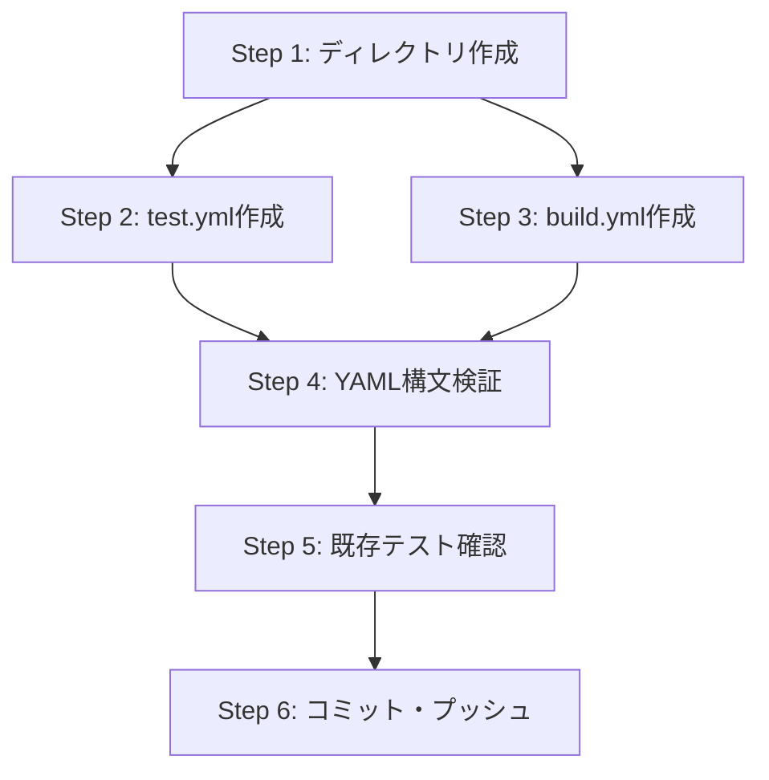

# 詳細設計書

## Issue概要

- **Issue番号**: #545
- **タイトル**: feat: Add GitHub Actions CI workflows for automated testing and build verification
- **状態**: open
- **URL**: https://github.com/tielec/ai-workflow-agent/issues/545

---

## 0. Planning Document確認

Planning Document（`.ai-workflow/issue-545/00_planning/output/planning.md`）を確認し、以下の戦略を踏襲する。

| 項目 | 判定 | 根拠 |
|------|------|------|
| **複雑度** | 簡単 | 新規ファイル2つのみ、既存コードへの変更なし |
| **見積もり工数** | 2時間 | ワークフローファイル作成、YAML検証、ドキュメント作成 |
| **リスク評価** | 低 | 実装内容がIssueで完全定義済み、既存コードへの影響ゼロ |

---

## 1. アーキテクチャ設計

### 1.1 システム全体図

```
┌─────────────────────────────────────────────────────────────────────────────┐
│                        GitHub Repository                                     │
│  tielec/ai-workflow-agent                                                   │
├─────────────────────────────────────────────────────────────────────────────┤
│                                                                              │
│  ┌─────────────────────────────────────────────────────────────────────────┐│
│  │                    .github/workflows/ (新規作成)                         ││
│  │  ┌─────────────────────────┐   ┌─────────────────────────┐              ││
│  │  │      test.yml           │   │      build.yml          │              ││
│  │  │  ┌─────────────────────┐│   │  ┌─────────────────────┐│              ││
│  │  │  │ Trigger:            ││   │  │ Trigger:            ││              ││
│  │  │  │ - push (main/dev)   ││   │  │ - push (main/dev)   ││              ││
│  │  │  │ - PR (main/dev)     ││   │  │ - PR (main/dev)     ││              ││
│  │  │  └─────────────────────┘│   │  └─────────────────────┘│              ││
│  │  │  ┌─────────────────────┐│   │  ┌─────────────────────┐│              ││
│  │  │  │ Matrix:             ││   │  │ Environment:        ││              ││
│  │  │  │ - ubuntu-latest     ││   │  │ - ubuntu-latest     ││              ││
│  │  │  │ - windows-latest    ││   │  │ - Node.js 20.x      ││              ││
│  │  │  │ - Node.js 18.x/20.x ││   │  └─────────────────────┘│              ││
│  │  │  └─────────────────────┘│   │  ┌─────────────────────┐│              ││
│  │  │  ┌─────────────────────┐│   │  │ Steps:              ││              ││
│  │  │  │ Steps:              ││   │  │ 1. Checkout         ││              ││
│  │  │  │ 1. Checkout         ││   │  │ 2. Setup Node.js    ││              ││
│  │  │  │ 2. Setup Node.js    ││   │  │ 3. npm ci           ││              ││
│  │  │  │ 3. npm ci           ││   │  │ 4. npm run build    ││              ││
│  │  │  │ 4. npm test         ││   │  │ 5. Verify dist/     ││              ││
│  │  │  │ 5. Codecov upload   ││   │  └─────────────────────┘│              ││
│  │  │  │    (Ubuntu+20.x)    ││   └─────────────────────────┘              ││
│  │  │  └─────────────────────┘│                                            ││
│  │  └─────────────────────────┘                                            ││
│  └─────────────────────────────────────────────────────────────────────────┘│
│                                                                              │
│  ┌─────────────────────────────────────────────────────────────────────────┐│
│  │                     既存プロジェクト構造 (変更なし)                      ││
│  │  ┌───────────────┐  ┌───────────────┐  ┌───────────────┐                ││
│  │  │   src/        │  │   tests/      │  │   dist/       │                ││
│  │  │ TypeScript    │  │ Jest Tests    │  │ Build Output  │                ││
│  │  └───────────────┘  └───────────────┘  └───────────────┘                ││
│  │  ┌───────────────┐  ┌───────────────┐  ┌───────────────┐                ││
│  │  │ package.json  │  │ tsconfig.json │  │ jest.config   │                ││
│  │  │ (変更なし)     │  │ (変更なし)     │  │ (変更なし)     │                ││
│  │  └───────────────┘  └───────────────┘  └───────────────┘                ││
│  └─────────────────────────────────────────────────────────────────────────┘│
└─────────────────────────────────────────────────────────────────────────────┘
                                    │
                                    ▼
┌─────────────────────────────────────────────────────────────────────────────┐
│                           外部サービス連携                                   │
│                                                                              │
│  ┌─────────────────────────┐           ┌─────────────────────────┐          │
│  │    GitHub Actions       │           │       Codecov           │          │
│  │    (ワークフロー実行)    │──────────▶│    (カバレッジ収集)      │          │
│  │                         │           │    (オプション)          │          │
│  └─────────────────────────┘           └─────────────────────────┘          │
└─────────────────────────────────────────────────────────────────────────────┘
```

### 1.2 コンポーネント間の関係

```
GitHub Event (push/PR)
        │
        ▼
┌───────────────────┐
│  GitHub Actions   │
│    Triggers       │
└───────┬───────────┘
        │
        ├───────────────────────┐
        ▼                       ▼
┌───────────────────┐   ┌───────────────────┐
│   test.yml        │   │   build.yml       │
│   (並列実行)       │   │   (並列実行)       │
└───────┬───────────┘   └───────┬───────────┘
        │                       │
        ▼                       ▼
┌───────────────────┐   ┌───────────────────┐
│  Matrix Build     │   │  Single Job       │
│  (4 environments) │   │  (Ubuntu+20.x)    │
├───────────────────┤   ├───────────────────┤
│ Ubuntu + 18.x     │   │ 1. Checkout       │
│ Ubuntu + 20.x     │   │ 2. Setup Node.js  │
│ Windows + 18.x    │   │ 3. npm ci         │
│ Windows + 20.x    │   │ 4. npm run build  │
└───────┬───────────┘   │ 5. Check dist/    │
        │               └───────────────────┘
        ▼
┌───────────────────┐
│  Test Execution   │
│  npm test         │
└───────┬───────────┘
        │
        ▼ (Ubuntu + 20.x のみ)
┌───────────────────┐
│  Codecov Upload   │
│  coverage/lcov.info│
└───────────────────┘
```

### 1.3 データフロー

```
1. Test Workflow データフロー:

   [Git Repository] ──checkout──▶ [GitHub Actions Runner]
                                          │
                                    npm ci │
                                          ▼
                                   [node_modules]
                                          │
                                  npm test │
                                          ▼
                              [Test Results + Coverage]
                                          │
                              (Ubuntu + 20.x) │
                                          ▼
                                   [Codecov API]

2. Build Workflow データフロー:

   [Git Repository] ──checkout──▶ [GitHub Actions Runner]
                                          │
                                    npm ci │
                                          ▼
                                   [node_modules]
                                          │
                             npm run build │
                                          ▼
                                    [dist/]
                                          │
                           verify existence │
                                          ▼
                              [Success/Failure]
```

---

## 2. 実装戦略判断

### 実装戦略: CREATE

**判断根拠**:
- `.github/workflows`ディレクトリが現在存在しない（新規作成が必要）
- `test.yml`と`build.yml`の2つの新規ファイルを作成するのみ
- 既存のソースコード（`src/`）、テストコード（`tests/`）、設定ファイル（`package.json`、`tsconfig.json`等）への変更は一切不要
- 完全に独立したCI/CD基盤の新規構築であり、既存コードとの依存関係がない
- Issueにワークフローの完全な内容が明示されており、新規作成のみで要件を満たせる

---

## 3. テスト戦略判断

### テスト戦略: UNIT_ONLY

**判断根拠**:
- GitHub Actionsワークフローファイル（YAML）は、GitHub上でのみ実行可能であり、ローカルでの自動テストは構文検証（YAMLリント）に限定される
- 本実装はワークフロー定義ファイルの作成であり、通常のアプリケーションコードではないため、Integration TestやBDD Testの対象外
- 検証方法は以下に限定される：
  1. **YAML構文検証（ローカル）**: YAMLシンタックスチェック、インデント確認
  2. **既存テストの影響確認**: `npm test`を実行し、既存テストが影響を受けていないことを確認
  3. **GitHub Actions実行検証（PR作成後）**: 実際のワークフロー動作はGitHub上でのみ検証可能
- プロジェクトの既存テスト（143 test suites, 2180 tests）への変更は不要

---

## 4. テストコード戦略判断

### テストコード戦略: CREATE_TEST

**判断根拠**:
- GitHub Actionsワークフローファイルは、通常のユニットテストの対象外
- 新規テストコード（`.test.ts`ファイル）の作成は不要
- 検証は以下の方法で実施：
  1. **YAML構文検証**: ワークフローファイルのYAML構文が正しいことを確認
  2. **既存テストへの影響確認**: `npm test`の実行結果に影響がないことを確認
- **注意**: 本Issueでは実質的にテストコードの作成は行わない（CREATE_TESTを選択するが、GitHub Actionsワークフローの特性上、自動化されたテストコードは作成しない）

**補足**:
- Planning Documentでも「テストコード実装スキップ」と明記されている
- ワークフローの動作検証はPR作成後にGitHub Actions上で実施

---

## 5. 影響範囲分析

### 5.1 既存コードへの影響

| カテゴリ | 影響 | 詳細 |
|----------|------|------|
| **ソースコード** | なし | `src/`配下のTypeScriptファイルへの変更なし |
| **テストコード** | なし | `tests/`配下のテストファイルへの変更なし |
| **設定ファイル** | なし | `package.json`、`tsconfig.json`、`jest.config.cjs`への変更なし |
| **ドキュメント** | なし | README.mdへのバッジ追加はスコープ外（将来的な拡張候補） |
| **既存CI/CD** | なし | Jenkinsfileへの変更なし（並行運用） |

### 5.2 依存関係の変更

| カテゴリ | 変更内容 |
|----------|----------|
| **npm依存** | 追加なし（`package.json`への変更なし） |
| **GitHub Actions依存** | 以下の外部アクションを使用 |

**使用するGitHub Actions**:

| アクション | バージョン | 用途 | 信頼性 |
|------------|------------|------|--------|
| `actions/checkout` | v4 | リポジトリのチェックアウト | GitHub公式 |
| `actions/setup-node` | v4 | Node.js環境のセットアップ | GitHub公式 |
| `codecov/codecov-action` | v3 | カバレッジレポートのアップロード | Codecov公式 |

### 5.3 マイグレーション要否

| 項目 | 要否 | 詳細 |
|------|------|------|
| データベーススキーマ | 不要 | 本プロジェクトはDBを使用していない |
| 設定ファイル | 不要 | 既存設定の変更なし |
| 環境変数 | 不要 | ワークフロー内で完結（`CI: true`はGitHub Actionsデフォルト） |
| GitHub設定 | 任意 | Codecovとの連携は任意（トークン設定はリポジトリ管理者タスク） |

---

## 6. 変更・追加ファイルリスト

### 6.1 新規作成ファイル

| ファイルパス | 説明 | 優先度 |
|--------------|------|--------|
| `.github/workflows/test.yml` | テスト自動実行ワークフロー | 高 |
| `.github/workflows/build.yml` | ビルド検証ワークフロー | 高 |

### 6.2 修正が必要な既存ファイル

なし

### 6.3 削除が必要なファイル

なし

---

## 7. 詳細設計

### 7.1 ワークフロー設計: test.yml

#### 7.1.1 概要

テストの自動実行を行うワークフロー。マトリックスビルドにより、複数の環境・バージョンで並列テストを実施。

#### 7.1.2 トリガー設計

```yaml
on:
  push:
    branches:
      - main
      - develop
  pull_request:
    branches:
      - main
      - develop
```

| トリガー | ブランチ | 説明 |
|----------|----------|------|
| `push` | main, develop | メインブランチへの直接プッシュ時 |
| `pull_request` | main, develop | PRの作成・更新時 |

#### 7.1.3 マトリックス設計

```yaml
strategy:
  matrix:
    os: [ubuntu-latest, windows-latest]
    node-version: [18.x, 20.x]
```

| OS | Node.js | 説明 |
|----|---------|------|
| ubuntu-latest | 18.x | Linux環境 + Node.js 18（LTS） |
| ubuntu-latest | 20.x | Linux環境 + Node.js 20（Current LTS） |
| windows-latest | 18.x | Windows環境 + Node.js 18（LTS） |
| windows-latest | 20.x | Windows環境 + Node.js 20（Current LTS） |

**設計判断**:
- プロジェクトの`engines`は`Node.js 20+`だが、互換性検証のため18.xも含める
- Windows環境でのテスト実行により、クロスプラットフォーム互換性を確保

#### 7.1.4 ステップ設計

| ステップ | 名前 | アクション/コマンド | 説明 |
|----------|------|---------------------|------|
| 1 | Checkout code | `actions/checkout@v4` | リポジトリをクローン |
| 2 | Setup Node.js | `actions/setup-node@v4` | Node.js環境をセットアップ（キャッシュ有効） |
| 3 | Install dependencies | `npm ci` | クリーンインストール |
| 4 | Run tests | `npm test` | Jestテスト実行（`CI: true`環境変数付き） |
| 5 | Upload coverage | `codecov/codecov-action@v3` | カバレッジアップロード（条件付き） |

#### 7.1.5 カバレッジアップロード条件

```yaml
if: matrix.os == 'ubuntu-latest' && matrix.node-version == '20.x'
```

**設計判断**:
- Ubuntu + Node.js 20.xの組み合わせでのみカバレッジをアップロード
- 複数環境からの重複アップロードを防止
- 最新のLTS環境（20.x）のカバレッジを代表値として使用

#### 7.1.6 エラーハンドリング

```yaml
fail_ci_if_error: false
```

**設計判断**:
- Codecovへのアップロード失敗時もCI全体は成功とする
- Codecov側のサービス障害やトークン未設定でもワークフローが止まらない

### 7.2 ワークフロー設計: build.yml

#### 7.2.1 概要

TypeScriptビルドプロセスの検証を行うワークフロー。ビルド成功とdistディレクトリの生成を確認。

#### 7.2.2 トリガー設計

```yaml
on:
  push:
    branches:
      - main
      - develop
  pull_request:
    branches:
      - main
      - develop
```

test.ymlと同一のトリガー設計。

#### 7.2.3 実行環境

```yaml
runs-on: ubuntu-latest
node-version: '20.x'
```

| 項目 | 値 | 説明 |
|------|-----|------|
| OS | ubuntu-latest | Linux環境（ビルド検証に十分） |
| Node.js | 20.x | プロジェクトの`engines`要件に合致 |

**設計判断**:
- ビルド検証はOS依存性が低いため、マトリックスビルドは不要
- Node.js 20.xのみで実行（`engines: "20+"`要件）

#### 7.2.4 ステップ設計

| ステップ | 名前 | アクション/コマンド | 説明 |
|----------|------|---------------------|------|
| 1 | Checkout code | `actions/checkout@v4` | リポジトリをクローン |
| 2 | Setup Node.js | `actions/setup-node@v4` | Node.js環境をセットアップ（キャッシュ有効） |
| 3 | Install dependencies | `npm ci` | クリーンインストール |
| 4 | Build | `npm run build` | TypeScriptコンパイル + 静的アセットコピー |
| 5 | Check dist directory | `if [ ! -d "dist" ]; then exit 1; fi` | distディレクトリの存在確認 |

#### 7.2.5 ビルド検証ロジック

```bash
if [ ! -d "dist" ]; then
  echo "Error: dist directory not created"
  exit 1
fi
echo "Build successful, dist directory created"
```

**設計判断**:
- `npm run build`の戻り値だけでなく、実際にdistディレクトリが生成されたことを確認
- エラー時は明確なメッセージを出力して`exit 1`で終了
- 成功時は確認メッセージを出力

### 7.3 共通設計要素

#### 7.3.1 npmキャッシュ設定

```yaml
- name: Setup Node.js
  uses: actions/setup-node@v4
  with:
    node-version: ${{ matrix.node-version }}  # または '20.x'
    cache: 'npm'
```

**設計判断**:
- `actions/setup-node`の組み込みキャッシュ機能を使用
- `package-lock.json`をキーとしてnpmキャッシュを管理
- 2回目以降の実行で依存関係インストール時間を短縮

#### 7.3.2 依存関係インストール

```yaml
- name: Install dependencies
  run: npm ci
```

**設計判断**:
- `npm install`ではなく`npm ci`を使用
- `package-lock.json`に基づいた厳密な依存関係管理
- CI環境での再現性を確保

---

## 8. セキュリティ考慮事項

### 8.1 認証・認可

| 項目 | 対策 |
|------|------|
| **GitHub Actions権限** | デフォルトの`GITHUB_TOKEN`で動作（追加権限不要） |
| **Codecovトークン** | GitHub Secretsで管理（リポジトリ管理者が設定） |
| **ワークフロー書き込み** | PRを作成するユーザーに`workflow`スコープが必要 |

### 8.2 データ保護

| 項目 | 対策 |
|------|------|
| **ソースコード** | GitHub Actionsランナー上でのみ処理、終了後に破棄 |
| **テスト結果** | GitHub Actionsログに記録（公開リポジトリの場合は公開） |
| **カバレッジデータ** | Codecovに送信（オプション、fail_ci_if_error: false） |

### 8.3 セキュリティリスクと対策

| リスク | 影響度 | 対策 |
|--------|--------|------|
| **サードパーティアクションの脆弱性** | 中 | メジャーバージョン固定（`@v4`、`@v3`）、公式アクションのみ使用 |
| **シークレットの漏洩** | 高 | Codecovトークンは`secrets.CODECOV_TOKEN`で管理（オプション） |
| **悪意のあるPR** | 低 | `pull_request`イベントはフォークからのPRでもシークレットにアクセス不可 |

---

## 9. 非機能要件への対応

### 9.1 パフォーマンス

| 要件ID | 要件 | 対応 |
|--------|------|------|
| NFR-001 | テスト実行時間 30分以内 | マトリックスビルドの並列実行により短縮 |
| NFR-002 | ビルド実行時間 15分以内 | 単一環境での実行により達成可能 |
| NFR-003 | npmキャッシュ活用 50%以上短縮 | `actions/setup-node`のcache機能で対応 |

**期待される実行時間**:
- テストワークフロー: 各マトリックスジョブ 5-10分（並列実行で合計10-15分）
- ビルドワークフロー: 3-5分

### 9.2 スケーラビリティ

| 観点 | 設計 |
|------|------|
| **マトリックス拡張** | OS/Node.jsバージョンの追加が容易 |
| **ワークフロー追加** | 独立したYAMLファイルで新規ワークフローを追加可能 |
| **ステップ追加** | 各ワークフローにステップを追加可能（lint、security scan等） |

### 9.3 保守性

| 観点 | 設計 |
|------|------|
| **YAML可読性** | 適切なコメント、明確なステップ名 |
| **ジョブ名** | `Run Tests`、`Build TypeScript`など目的が明確 |
| **拡張容易性** | 将来的なワークフロー追加（lint、deploy等）が容易な構造 |

---

## 10. 実装の順序

### 10.1 推奨実装順序

```
Step 1: ディレクトリ作成
   └── .github/workflows/ ディレクトリを作成

Step 2: test.yml 作成 (並列可能)
   └── テストワークフローファイルを作成

Step 3: build.yml 作成 (並列可能)
   └── ビルドワークフローファイルを作成

Step 4: YAML構文検証
   └── 両ファイルのYAML構文を検証

Step 5: 既存テスト確認
   └── npm test を実行し影響がないことを確認

Step 6: コミット・プッシュ
   └── 変更をコミットしてプッシュ
```

### 10.2 依存関係



**並列実行可能なステップ**:
- Step 2とStep 3は並列実行可能（ディレクトリ作成後）

---

## 11. 成果物仕様

### 11.1 test.yml 完全仕様

```yaml
name: Tests

on:
  push:
    branches:
      - main
      - develop
  pull_request:
    branches:
      - main
      - develop

jobs:
  test:
    name: Run Tests
    runs-on: ${{ matrix.os }}

    strategy:
      matrix:
        os: [ubuntu-latest, windows-latest]
        node-version: [18.x, 20.x]

    steps:
      - name: Checkout code
        uses: actions/checkout@v4

      - name: Setup Node.js ${{ matrix.node-version }}
        uses: actions/setup-node@v4
        with:
          node-version: ${{ matrix.node-version }}
          cache: 'npm'

      - name: Install dependencies
        run: npm ci

      - name: Run tests
        run: npm test
        env:
          CI: true

      - name: Upload coverage reports (Ubuntu only)
        if: matrix.os == 'ubuntu-latest' && matrix.node-version == '20.x'
        uses: codecov/codecov-action@v3
        with:
          files: ./coverage/lcov.info
          fail_ci_if_error: false
```

### 11.2 build.yml 完全仕様

```yaml
name: Build

on:
  push:
    branches:
      - main
      - develop
  pull_request:
    branches:
      - main
      - develop

jobs:
  build:
    name: Build TypeScript
    runs-on: ubuntu-latest

    steps:
      - name: Checkout code
        uses: actions/checkout@v4

      - name: Setup Node.js
        uses: actions/setup-node@v4
        with:
          node-version: '20.x'
          cache: 'npm'

      - name: Install dependencies
        run: npm ci

      - name: Build
        run: npm run build

      - name: Check dist directory
        run: |
          if [ ! -d "dist" ]; then
            echo "Error: dist directory not created"
            exit 1
          fi
          echo "Build successful, dist directory created"
```

---

## 12. 要件トレーサビリティ

### 12.1 機能要件との対応

| 要件ID | 要件概要 | 設計対応箇所 |
|--------|----------|--------------|
| FR-001 | test.ymlファイル作成 | 11.1 test.yml完全仕様 |
| FR-002 | pushトリガー設定 | 7.1.2 トリガー設計 |
| FR-003 | pull_requestトリガー設定 | 7.1.2 トリガー設計 |
| FR-004 | マトリックスビルド（OS） | 7.1.3 マトリックス設計 |
| FR-005 | マトリックスビルド（Node.js） | 7.1.3 マトリックス設計 |
| FR-006 | 依存関係インストール | 7.1.4 ステップ設計、7.3.2 依存関係インストール |
| FR-007 | テスト実行 | 7.1.4 ステップ設計 |
| FR-008 | カバレッジアップロード | 7.1.5 カバレッジアップロード条件 |
| FR-009 | Codecov連携（graceful） | 7.1.6 エラーハンドリング |
| FR-010 | npmキャッシュ | 7.3.1 npmキャッシュ設定 |
| FR-011 | build.ymlファイル作成 | 11.2 build.yml完全仕様 |
| FR-012 | pushトリガー設定 | 7.2.2 トリガー設計 |
| FR-013 | pull_requestトリガー設定 | 7.2.2 トリガー設計 |
| FR-014 | 実行環境 | 7.2.3 実行環境 |
| FR-015 | 依存関係インストール | 7.2.4 ステップ設計 |
| FR-016 | TypeScriptビルド | 7.2.4 ステップ設計 |
| FR-017 | ビルド成果物検証 | 7.2.5 ビルド検証ロジック |
| FR-018 | ビルド失敗時エラー | 7.2.5 ビルド検証ロジック |

### 12.2 非機能要件との対応

| 要件ID | 要件概要 | 設計対応箇所 |
|--------|----------|--------------|
| NFR-001 | テスト実行時間 | 9.1 パフォーマンス |
| NFR-002 | ビルド実行時間 | 9.1 パフォーマンス |
| NFR-003 | npmキャッシュ活用 | 7.3.1 npmキャッシュ設定 |
| NFR-004 | 公式アクション使用 | 5.2 依存関係の変更 |
| NFR-005 | バージョン固定 | 5.2 依存関係の変更 |
| NFR-006 | シークレット管理 | 8.1 認証・認可 |
| NFR-007 | Codecov障害耐性 | 7.1.6 エラーハンドリング |
| NFR-008 | マトリックス独立性 | 7.1.3 マトリックス設計（デフォルト動作） |
| NFR-009 | YAML可読性 | 9.3 保守性 |
| NFR-010 | ジョブ名明確化 | 11.1, 11.2 完全仕様 |
| NFR-011 | 拡張容易性 | 9.2 スケーラビリティ |

---

## 13. 品質ゲート確認

| 品質ゲート | 状態 | 備考 |
|------------|------|------|
| 実装戦略の判断根拠が明記されている | ✅ | セクション2: CREATE戦略を選択 |
| テスト戦略の判断根拠が明記されている | ✅ | セクション3: UNIT_ONLY戦略を選択 |
| 既存コードへの影響範囲が分析されている | ✅ | セクション5: 影響なしを確認 |
| 変更が必要なファイルがリストアップされている | ✅ | セクション6: 2つの新規ファイルをリスト |
| 設計が実装可能である | ✅ | セクション11: 完全なYAML仕様を提供 |

---

## 14. 改訂履歴

| バージョン | 日付 | 変更内容 | 作成者 |
|------------|------|----------|--------|
| 1.0 | - | 初版作成 | AI Workflow Agent |
