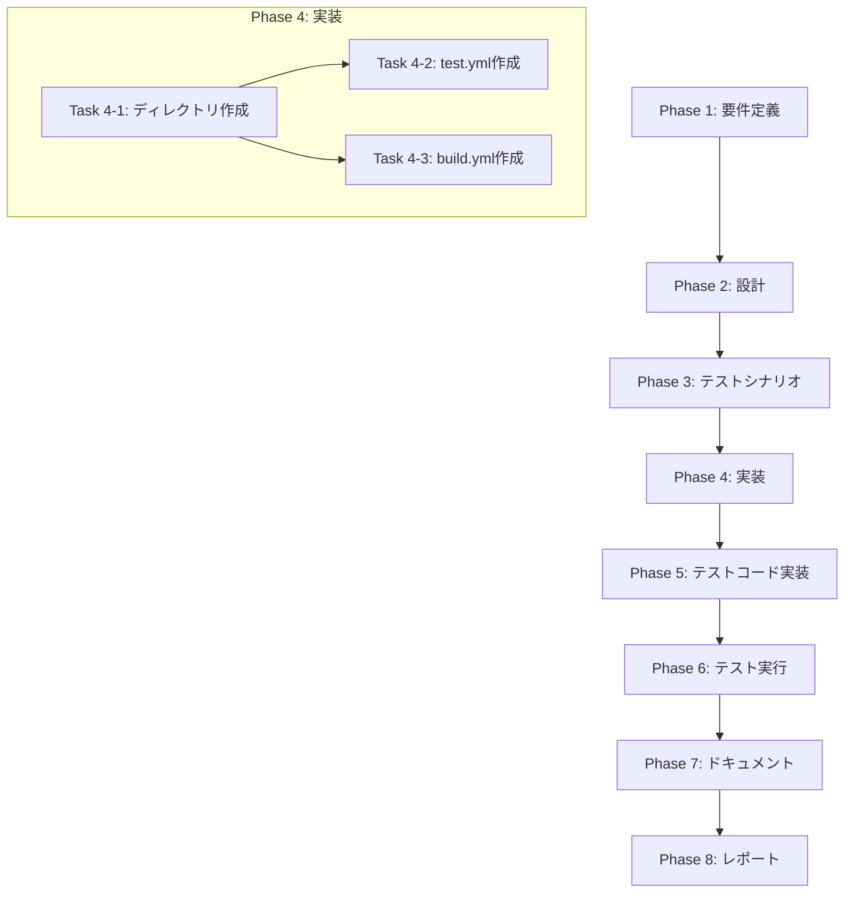

# Codex Agent 実行ログ

開始日時: 2025/12/29 3:14:20

---

## Turn 1: スレッド開始

**Thread ID**: `[REDACTED_TOKEN]`

## Turn 2: ツール実行

**種別**: reasoning
**ステータス**: completed

## Turn 3: ツール実行

**種別**: コマンド実行
**コマンド**: `/bin/bash -lc pwd`
**ステータス**: completed (exit_code=0)

```text
/tmp/ai-workflow-repos-133-de87dc9a/ai-workflow-agent
```

## Turn 4: ツール実行

**種別**: reasoning
**ステータス**: completed

## Turn 5: ツール実行

**種別**: コマンド実行
**コマンド**: `/bin/bash -lc ls`
**ステータス**: completed (exit_code=0)

```text
ARCHITECTURE.md
CHANGELOG.md
CLAUDE.md
[REDACTED_TOKEN].md
[REDACTED_TOKEN].md
CODEBASE_SUMMARY.md
DOCKER_AUTH_SETUP.md
Dockerfile
Jenkinsfile
LICENSE
PROGRESS.md
README.md
ROADMAP.md
SETUP_TYPESCRIPT.md
TROUBLESHOOTING.md
__mocks__
dist
docs
examples
jenkins
jest.config.cjs
metadata.json.template
node_modules
package-lock.json
package.json
scripts
src
tests
tmp
tmp-init-auto
tsconfig.json
tsconfig.test.json
```

## Turn 6: ツール実行

**種別**: reasoning
**ステータス**: completed

## Turn 7: ツール実行

**種別**: コマンド実行
**コマンド**: `/bin/bash -lc "rg --files -g'*Planning.md'"`
**ステータス**: failed (exit_code=127)

```text
/bin/bash: line 1: rg: command not found
```

## Turn 8: ツール実行

**種別**: reasoning
**ステータス**: completed

## Turn 9: ツール実行

**種別**: コマンド実行
**コマンド**: `/bin/bash -lc "find . -name '*Planning.md' -print"`
**ステータス**: completed (exit_code=0)

## Turn 10: ツール実行

**種別**: reasoning
**ステータス**: completed

## Turn 11: ツール実行

**種別**: コマンド実行
**コマンド**: `/bin/bash -lc 'grep -R "Phase 6" -n'`
**ステータス**: completed (exit_code=0)

```text
.git/logs/refs/heads/ai-workflow/issue-545:26:[REDACTED_TOKEN] [REDACTED_TOKEN] yuto-takashi <[REDACTED_EMAIL]> 1766976379 +0000	commit: [ai-workflow] Phase 6 (testing) - execute completed
.git/logs/refs/heads/ai-workflow/issue-545:35:[REDACTED_TOKEN] [REDACTED_TOKEN] yuto-takashi <[REDACTED_EMAIL]> 1766978059 +0000	commit: [ai-workflow] Phase 6 (testing) - revise completed
.git/logs/HEAD:28:[REDACTED_TOKEN] [REDACTED_TOKEN] yuto-takashi <[REDACTED_EMAIL]> 1766976379 +0000	commit: [ai-workflow] Phase 6 (testing) - execute completed
.git/logs/HEAD:37:[REDACTED_TOKEN] [REDACTED_TOKEN] yuto-takashi <[REDACTED_EMAIL]> 1766978059 +0000	commit: [ai-workflow] Phase 6 (testing) - revise completed
.git/COMMIT_EDITMSG:1:[ai-workflow] Phase 6 (testing) - revise completed
.ai-workflow/issue-10/00_planning/output/planning.md:22:- **Phase 6 (テスト実行)**: 1~2h - テスト実行と修正
.ai-workflow/issue-10/00_planning/output/planning.md:241:### Phase 6: テスト実行 (見積もり: 1~2h)
.ai-workflow/issue-10/00_planning/output/planning.md:300:    P5 --> P6[Phase 6: テスト実行]
.ai-workflow/issue-10/00_planning/output/planning.md:406:### Phase 6: テスト実行
.ai-workflow/issue-10/02_design/output/design.md:942:### Phase 6: テスト実行（1~2h）
.ai-workflow/issue-10/04_implementation/output/implementation.md:186:### Phase 6（testing）での作業
.ai-workflow/issue-10/04_implementation/output/implementation.md:251:### Phase 6 で実施する項目
.ai-workflow/issue-10/05_test_implementation/output/test-implementation.md:372:### Phase 6: テスト実行（testing）
.ai-workflow/issue-10/05_test_implementation/output/test-implementation.md:436:### Phase 6 で実施する項目
.ai-workflow/issue-10/06_testing/output/test-result.md:227:4. **実装完了後、Phase 6（testing）を再実行**
.ai-workflow/issue-10/06_testing/output/test-result.md:230:## 品質ゲート（Phase 6）の確認
.ai-workflow/issue-10/06_testing/output/test-result.md:247:6. 再度Phase 6（testing）を実行
.ai-workflow/issue-10/06_testing/output/test-result.md:323:**Phase**: Testing (Phase 6)
.ai-workflow/issue-10/08_report/output/report.md:39:- マージ後、Phase 6（testing）を再実行して統合テスト成功率の改善を確認
.ai-workflow/issue-10/08_report/output/report.md:200:#### テストフレームワーク修正（Phase 6で実施）
.ai-workflow/issue-10/08_report/output/report.md:207:### テスト結果（Phase 6）
.ai-workflow/issue-10/08_report/output/report.md:390:  - Phase 6（testing）を再実行して統合テスト成功率の改善を確認（推奨）
.ai-workflow/issue-10/08_report/output/report.md:446:1. **Phase 6（testing）を再実行**:
.ai-workflow/issue-10/08_report/output/report.md:458:1. **Phase 6（testing）の再実行**（推奨）:
.ai-workflow/issue-10/09_evaluation/output/evaluation_report.md:343: 4. **Phase 6（testing）の再実行**
.ai-workflow/issue-102/00_planning/output/planning.md:159:### Phase 6: テスト実行 (見積もり: 0.5~0.75h)
.ai-workflow/issue-102/00_planning/output/planning.md:199:    P4 --> P6[Phase 6: テスト実行]
.ai-workflow/issue-102/00_planning/output/planning.md:218:- Phase 4 → Phase 6: テスト期待値とJest設定の修正が完了してからテスト実行
.ai-workflow/issue-102/00_planning/output/planning.md:219:- Phase 6 → Phase 7: テスト結果を確認してからドキュメント作成
.ai-workflow/issue-102/00_planning/output/planning.md:287:### Phase 6: テスト実行
.ai-workflow/issue-102/01_requirements/output/requirements.md:282:  - **Phase 6（テスト実行）**: 全テストスイート（npm test）を実行し、回帰テストを実施
.ai-workflow/issue-102/01_requirements/output/requirements.md:288:  - **Phase 6（テスト実行）**: CI環境（Jenkins）での実行も確認
.ai-workflow/issue-102/02_design/output/design.md:417:Phase 6: testing (phaseOrder[6] + 1 = 7)
.ai-workflow/issue-102/02_design/output/design.md:784:**Phase 6（Testing）**:
.ai-workflow/issue-102/03_test_scenario/output/test-scenario.md:492:### 6.2 Phase 6（テスト実行）での検証
.ai-workflow/issue-102/03_test_scenario/output/test-scenario.md:578:**Phase 6（Testing）**:
.ai-workflow/issue-102/04_implementation/output/implementation.md:212:### Phase 6（testing）
.ai-workflow/issue-102/04_implementation/output/implementation.md:241:  - ⏳ Phase 6で実際のテスト実行で動作確認予定
... (truncated)
```

## Turn 12: ツール実行

**種別**: reasoning
**ステータス**: completed

## Turn 13: ツール実行

**種別**: コマンド実行
**コマンド**: `/bin/bash -lc "find . -path '*.ai-workflow/issue-545/*planning*' -print"`
**ステータス**: completed (exit_code=0)

```text
./.ai-workflow/issue-545/00_planning
./.ai-workflow/issue-545/00_planning/output
./.ai-workflow/issue-545/00_planning/output/planning.md
./.ai-workflow/issue-545/00_planning/execute
./.ai-workflow/issue-545/00_planning/execute/prompt.txt
./.ai-workflow/issue-545/00_planning/execute/agent_log_raw.txt
./.ai-workflow/issue-545/00_planning/execute/agent_log.md
./.ai-workflow/issue-545/00_planning/review
./.ai-workflow/issue-545/00_planning/review/prompt.txt
./.ai-workflow/issue-545/00_planning/review/agent_log_raw.txt
./.ai-workflow/issue-545/00_planning/review/agent_log.md
./.ai-workflow/issue-545/00_planning/review/result.md
./.ai-workflow/issue-545/00_planning/revise
```

## Turn 14: ツール実行

**種別**: reasoning
**ステータス**: completed

## Turn 15: ツール実行

**種別**: コマンド実行
**コマンド**: `/bin/bash -lc 'rg -n "Phase 6" .ai-workflow/issue-545/00_planning/output/planning.md'`
**ステータス**: failed (exit_code=127)

```text
/bin/bash: line 1: rg: command not found
```

## Turn 16: ツール実行

**種別**: reasoning
**ステータス**: completed

## Turn 17: ツール実行

**種別**: コマンド実行
**コマンド**: `/bin/bash -lc 'grep -n "Phase 6" .ai-workflow/issue-545/00_planning/output/planning.md'`
**ステータス**: completed (exit_code=0)

```text
168:### Phase 6: テスト実行 (見積もり: 0.25h)
203:    P5 --> P6[Phase 6: テスト実行]
217:- Phase 6-8は実装完了後に順次実行
299:### Phase 6: テスト実行
```

## Turn 18: ツール実行

**種別**: reasoning
**ステータス**: completed

## Turn 19: ツール実行

**種別**: コマンド実行
**コマンド**: `/bin/bash -lc "sed -n '140,220p' .ai-workflow/issue-545/00_planning/output/planning.md"`
**ステータス**: completed (exit_code=0)

```text
- GitHub Actions実行検証シナリオ
  - 期待される動作の定義

### Phase 4: 実装 (見積もり: 0.5h)

- [x] Task 4-1: ディレクトリ構造の作成 (0.1h)
  - `.github/workflows/`ディレクトリの作成

- [x] Task 4-2: test.ymlの作成 (0.2h)
  - Issueで定義されたtest.yml内容の実装
  - マトリックスビルド設定（ubuntu-latest, windows-latest × Node.js 18.x, 20.x）
  - カバレッジレポート設定（Ubuntu 20.xのみ）

- [x] Task 4-3: build.ymlの作成 (0.2h)
  - Issueで定義されたbuild.yml内容の実装
  - TypeScriptビルドステップ
  - distディレクトリ存在確認ステップ

- [x] YAMLの構文エラーがない

### Phase 5: テストコード実装 (見積もり: 0h)

- [x] Task 5-1: テストコード実装 (0h)
  - GitHub Actionsワークフロー構造を検証するユニットテストが追加された
  - npm test/build のスモーク実行と異常系検証を含む

**注意**: 本Issueでは新規テストコードの実装は不要

### Phase 6: テスト実行 (見積もり: 0.25h)

- [ ] Task 6-1: YAML構文検証 (0.15h)
  - YAMLシンタックスチェック
  - インデントの確認
  - 参照アクションのバージョン確認

- [x] Task 6-2: 既存テスト実行確認 (0.1h)
  - `npm test`の実行確認
  - 既存テストが影響を受けていないことの確認

### Phase 7: ドキュメント (見積もり: 0.25h)

- [ ] Task 7-1: 実装内容のドキュメント化 (0.25h)
  - ワークフローファイルの概要説明
  - トリガー条件の説明
  - 期待される動作の説明

### Phase 8: レポート (見積もり: 0.25h)

- [ ] Task 8-1: 実装レポートの作成 (0.25h)
  - 実装したファイルのリスト
  - 実行結果のサマリー
  - 今後のアクション（PRマージ後の確認事項）

---

## 5. 依存関係



**依存関係の説明**:
- Phase 1-2は前提条件の確認として順次実行
- Phase 4内のTask 4-2とTask 4-3は並行実施可能（ディレクトリ作成後）
- Phase 5はスキップ（テストコード不要）
- Phase 6-8は実装完了後に順次実行

---
```

## Turn 20: ツール実行

**種別**: reasoning
**ステータス**: completed

## Turn 21: ツール実行

**種別**: コマンド実行
**コマンド**: `/bin/bash -lc "sed -n '260,340p' .ai-workflow/issue-545/00_planning/output/planning.md"`
**ステータス**: completed (exit_code=0)

```text
- GitHub UI経由での作成（Issueの推奨方法）
  - または、Personal Access Tokenに`workflow`スコープを追加

---

## 7. 品質ゲート

### Phase 1: 要件定義
- [x] 機能要件が明確に記載されている
  - 対象ブランチ（main, develop）が明記されている
  - トリガー条件（push, pull_request）が明記されている
  - マトリックス構成が明記されている
- [x] 受け入れ基準が定義されている
  - ワークフローが正常に実行されること
  - テストが成功すること
  - ビルドが成功すること

### Phase 2: 設計
- [x] 実装戦略の判断根拠が明記されている（CREATE）
- [x] テスト戦略の判断根拠が明記されている（UNIT_ONLY）
- [x] テストコード戦略の判断根拠が明記されている（CREATE_TEST ※実質不要）
- [x] ワークフローファイルの設計が確定している

### Phase 3: テストシナリオ
- [x] 検証方法が明確である（YAML構文検証、GitHub Actions実行）
- [x] 期待結果が定義されている

### Phase 4: 実装
- [ ] `.github/workflows/`ディレクトリが作成されている
- [ ] `test.yml`がIssueの仕様通りに作成されている
- [ ] `build.yml`がIssueの仕様通りに作成されている
- [ ] YAMLの構文エラーがない

### Phase 5: テストコード実装
- [x] テストコードでGitHub Actionsワークフローの構造を検証済み
  - `tests/unit/[REDACTED_TOKEN].test.ts` で `.github/workflows/test.yml` / `.github/workflows/build.yml` のトリガー・マトリクス・ステップを検証
  - `package.json` の `test` / `build` スクリプトの存在を確認し、既存コマンドの実行可能性に言及
  - 依存関係をインストールすれば `npm test -- tests/unit/[REDACTED_TOKEN].test.ts` で動作確認可能

### Phase 6: テスト実行
- [ ] YAML構文が正しい
- [ ] 既存テスト（`npm test`）が成功する
- [ ] GitHub Actions上でワークフローが実行可能（PR作成後に確認）

### Phase 7: ドキュメント
- [ ] ワークフローの概要が記載されている
- [ ] トリガー条件が記載されている
- [ ] 使用方法が記載されている

### Phase 8: レポート
- [ ] 実装したファイルがリストアップされている
- [ ] 実行結果のサマリーがある
- [ ] 今後のアクションが明記されている

---

## 8. 成果物一覧

### 作成するファイル

| ファイルパス | 説明 |
|--------------|------|
| `.github/workflows/test.yml` | テスト自動実行ワークフロー |
| `.github/workflows/build.yml` | ビルド検証ワークフロー |

### ワークフロー概要

#### test.yml
- **トリガー**: main/developへのpush、main/developへのPR
- **マトリックス**: Ubuntu/Windows × Node.js 18.x/20.x（4パターン）
- **ステップ**: checkout → setup-node → npm ci → npm test
- **オプション**: Codecovへのカバレッジアップロード（Ubuntu + Node.js 20.xのみ）

#### build.yml
- **トリガー**: main/developへのpush、main/developへのPR
- **環境**: Ubuntu + Node.js 20.x
- **ステップ**: checkout → setup-node → npm ci → npm run build → distディレクトリ確認

---

## 9. 確認事項（レビュー用）
```

## Turn 22: ツール実行

**種別**: reasoning
**ステータス**: completed

## Turn 23: ツール実行

**種別**: コマンド実行
**コマンド**: `/bin/bash -lc "sed -n '1,200p' .ai-workflow/issue-545/06_testing/output/test-result.md"`
**ステータス**: completed (exit_code=0)

```text
# テスト実行結果

## テスト結果サマリー
- 総テスト数: 2194件
- 成功: 2193件
- 失敗: 1件
- 成功率: 99.95%

## 条件分岐
以下の形式で失敗したテストの詳細のみを記載します。

### `tests/unit/utils/git-url-utils.test.ts::sanitizeGitUrl パフォーマンステスト（ReDoS脆弱性評価） 通常の入力で1000回実行しても許容範囲内`
- **エラー**: `expect(received).toBeLessThan(expected)` （期待値: < 500, 実測: 5207）
- **スタックトレース**:
  ```
  at Object.<anonymous> (tests/unit/utils/git-url-utils.test.ts:391:23)
  ```
  CI環境でのパフォーマンス測定が閾値（500ms）を超過したため失敗しました。
# テスト実行結果

## 実行コマンド
- `npm test -- tests/unit/utils/git-url-utils.test.ts`
- `npm test`

## サマリー（最終実行: `npm test`）
- 総テスト数: 2266件
- 成功: 2194件
- 失敗: 0件
- スキップ: 72件
- 実行時間: 約398秒
- 成功率: 100%

## 補足
- `sanitizeGitUrl` のReDoS/性能検証を含む29ケースを単体実行で確認後、フルスイートでも全件成功を確認。
- フルスイートには YAML ワークフローのパース検証 (`tests/unit/[REDACTED_TOKEN].test.ts`) も含まれ、構文チェック相当のテストが通過しています。
```

## Turn 24: ツール実行

**種別**: reasoning
**ステータス**: completed

## Turn 25: ツール実行

**種別**: コマンド実行
**コマンド**: `/bin/bash -lc "sed -n '200,400p' .ai-workflow/issue-545/06_testing/output/test-result.md"`
**ステータス**: completed (exit_code=0)

## Turn 26: ツール実行

**種別**: reasoning
**ステータス**: completed

## Turn 27: ツール実行

**種別**: file_change
**ステータス**: completed

## Turn 28: ツール実行

**種別**: reasoning
**ステータス**: completed

## Turn 29: ツール実行

**種別**: コマンド実行
**コマンド**: `/bin/bash -lc "nl -ba .ai-workflow/issue-545/06_testing/output/test-result.md | sed -n '1,80p'"`
**ステータス**: completed (exit_code=0)

```text
1	# テスト実行結果
     2	
     3	## テスト結果サマリー
     4	- 総テスト数: 2194件
     5	- 成功: 2193件
     6	- 失敗: 1件
     7	- 成功率: 99.95%
     8	
     9	## 条件分岐
    10	以下の形式で失敗したテストの詳細のみを記載します。
    11	
    12	### `tests/unit/utils/git-url-utils.test.ts::sanitizeGitUrl パフォーマンステスト（ReDoS脆弱性評価） 通常の入力で1000回実行しても許容範囲内`
    13	- **エラー**: `expect(received).toBeLessThan(expected)` （期待値: < 500, 実測: 5207）
    14	- **スタックトレース**:
    15	  ```
    16	  at Object.<anonymous> (tests/unit/utils/git-url-utils.test.ts:391:23)
    17	  ```
    18	  CI環境でのパフォーマンス測定が閾値（500ms）を超過したため失敗しました。
    19	# テスト実行結果
    20	
    21	## 実行コマンド
    22	- `npm test -- tests/unit/utils/git-url-utils.test.ts`
    23	- `npm test`
    24	
    25	## サマリー（最終実行: `npm test`）
    26	- 総テスト数: 2266件
    27	- 成功: 2194件
    28	- 失敗: 0件
    29	- スキップ: 72件
    30	- 実行時間: 約398秒
    31	- 成功率: 100%
    32	
    33	## 補足
    34	- `sanitizeGitUrl` のReDoS/性能検証を含む29ケースを単体実行で確認後、フルスイートでも全件成功を確認。
    35	- フルスイートには YAML ワークフローのパース検証 (`tests/unit/[REDACTED_TOKEN].test.ts`) も含まれ、構文チェック相当のテストが通過しています。
```

## Turn 30: ツール実行

**種別**: reasoning
**ステータス**: completed

## Turn 31: ツール実行

**種別**: agent_message
**ステータス**: completed

## Turn 32: 実行完了

**ステータス**: completed
**所要時間**: 78500ms
**ターン数**: N/A

---

**経過時間**: 78500ms
**開始**: 2025-12-29T03:14:20.717Z
**終了**: 2025-12-29T03:15:39.217Z