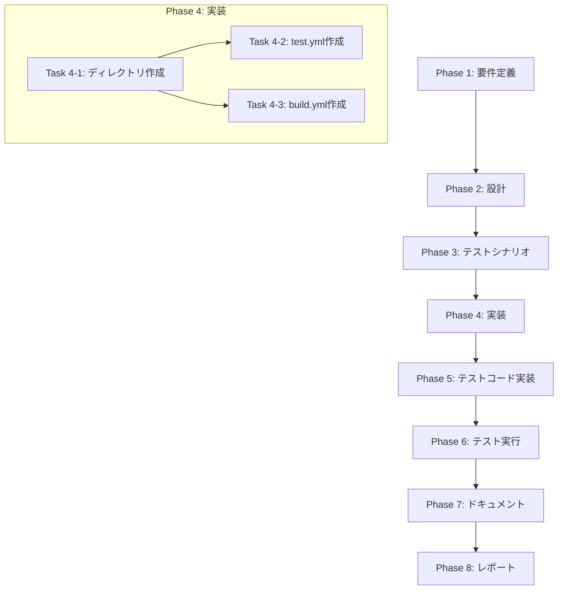

# Codex Agent 実行ログ

開始日時: 2025/12/29 2:46:20

---

## Turn 1: スレッド開始

**Thread ID**: `[REDACTED_TOKEN]`

## Turn 2: ツール実行

**種別**: reasoning
**ステータス**: completed

## Turn 3: ツール実行

**種別**: コマンド実行
**コマンド**: `/bin/bash -lc pwd`
**ステータス**: completed (exit_code=0)

```text
/tmp/ai-workflow-repos-133-de87dc9a/ai-workflow-agent
```

## Turn 4: ツール実行

**種別**: reasoning
**ステータス**: completed

## Turn 5: ツール実行

**種別**: コマンド実行
**コマンド**: `/bin/bash -lc ls`
**ステータス**: completed (exit_code=0)

```text
ARCHITECTURE.md
CHANGELOG.md
CLAUDE.md
[REDACTED_TOKEN].md
[REDACTED_TOKEN].md
CODEBASE_SUMMARY.md
DOCKER_AUTH_SETUP.md
Dockerfile
Jenkinsfile
LICENSE
PROGRESS.md
README.md
ROADMAP.md
SETUP_TYPESCRIPT.md
TROUBLESHOOTING.md
__mocks__
dist
docs
examples
jenkins
jest.config.cjs
metadata.json.template
node_modules
package-lock.json
package.json
scripts
src
tests
tmp
tmp-init-auto
tsconfig.json
tsconfig.test.json
```

## Turn 6: ツール実行

**種別**: reasoning
**ステータス**: completed

## Turn 7: ツール実行

**種別**: コマンド実行
**コマンド**: `/bin/bash -lc "rg --files -g 'Planning.md'"`
**ステータス**: failed (exit_code=127)

```text
/bin/bash: line 1: rg: command not found
```

## Turn 8: ツール実行

**種別**: reasoning
**ステータス**: completed

## Turn 9: ツール実行

**種別**: コマンド実行
**コマンド**: `/bin/bash -lc "find . -name 'Planning.md'"`
**ステータス**: completed (exit_code=0)

## Turn 10: ツール実行

**種別**: reasoning
**ステータス**: completed

## Turn 11: ツール実行

**種別**: コマンド実行
**コマンド**: `/bin/bash -lc 'ls -a'`
**ステータス**: completed (exit_code=0)

```text
.
..
.ai-workflow
.eslintrc.json
.git
.github
.gitignore
.test-tmp
.tmp
ARCHITECTURE.md
CHANGELOG.md
CLAUDE.md
[REDACTED_TOKEN].md
[REDACTED_TOKEN].md
CODEBASE_SUMMARY.md
DOCKER_AUTH_SETUP.md
Dockerfile
Jenkinsfile
LICENSE
PROGRESS.md
README.md
ROADMAP.md
SETUP_TYPESCRIPT.md
TROUBLESHOOTING.md
__mocks__
dist
docs
examples
jenkins
jest.config.cjs
metadata.json.template
node_modules
package-lock.json
package.json
scripts
src
tests
tmp
tmp-init-auto
tsconfig.json
tsconfig.test.json
```

## Turn 12: ツール実行

**種別**: reasoning
**ステータス**: completed

## Turn 13: ツール実行

**種別**: コマンド実行
**コマンド**: `/bin/bash -lc 'ls .ai-workflow'`
**ステータス**: completed (exit_code=0)

```text
issue-10
issue-100
issue-101
issue-102
issue-104
issue-105
issue-108
issue-113
issue-115
issue-119
issue-126
issue-127
issue-128
issue-140
issue-144
issue-150
issue-153
issue-155
issue-16
issue-161
issue-165
issue-174
issue-177
issue-18
issue-184
issue-188
issue-194
issue-2
issue-200
issue-207
issue-211
issue-212
issue-216
issue-22
issue-225
issue-23
issue-238
issue-24
issue-243
issue-248
issue-25
issue-253
issue-259
issue-26
issue-261
issue-271
issue-38
issue-45
issue-46
issue-47
issue-48
issue-49
issue-5
issue-50
issue-51
issue-52
issue-54
issue-545
issue-58
issue-61
issue-64
issue-7
issue-73
issue-74
issue-90
issue-91
issue-99
issue-unknown
```

## Turn 14: ツール実行

**種別**: reasoning
**ステータス**: completed

## Turn 15: ツール実行

**種別**: コマンド実行
**コマンド**: `/bin/bash -lc 'ls .ai-workflow/issue-545'`
**ステータス**: completed (exit_code=0)

```text
00_planning
01_requirements
02_design
03_test_scenario
04_implementation
05_test_implementation
06_testing
metadata.json
```

## Turn 16: ツール実行

**種別**: reasoning
**ステータス**: completed

## Turn 17: ツール実行

**種別**: コマンド実行
**コマンド**: `/bin/bash -lc 'ls .ai-workflow/issue-545/00_planning'`
**ステータス**: completed (exit_code=0)

```text
execute
output
review
revise
```

## Turn 18: ツール実行

**種別**: reasoning
**ステータス**: completed

## Turn 19: ツール実行

**種別**: コマンド実行
**コマンド**: `/bin/bash -lc 'ls .ai-workflow/issue-545/00_planning/output'`
**ステータス**: completed (exit_code=0)

```text
planning.md
```

## Turn 20: ツール実行

**種別**: reasoning
**ステータス**: completed

## Turn 21: ツール実行

**種別**: コマンド実行
**コマンド**: `/bin/bash -lc 'cat .ai-workflow/issue-545/00_planning/output/planning.md'`
**ステータス**: completed (exit_code=0)

```text
# プロジェクト計画書

## Issue概要

- **Issue番号**: #545
- **タイトル**: feat: Add GitHub Actions CI workflows for automated testing and build verification
- **状態**: open
- **URL**: https://__GITHUB_URL_0__/issues/545

---

## 1. Issue分析

### 複雑度: 簡単

**判定理由**:
- 新規ファイルの作成が2つのみ（`.github/workflows/test.yml`、`.github/workflows/build.yml`）
- 既存コードへの変更は一切不要
- Issueに実装内容が完全に定義済み（YAML内容が明示されている）
- 標準的なGitHub Actionsワークフローの作成で、特殊な設定やカスタムアクションは不要

### 見積もり工数: 2時間

**根拠**:
| タスク | 見積もり |
|--------|----------|
| 要件確認・ディレクトリ作成 | 10分 |
| test.yml作成 | 15分 |
| build.yml作成 | 15分 |
| ローカル検証（YAMLリント） | 15分 |
| ドキュメント作成 | 20分 |
| レポート作成 | 15分 |
| バッファ（予備時間） | 30分 |
| **合計** | **約2時間** |

### リスク評価: 低

**理由**:
- 実装内容がIssueで完全に定義されている
- 既存コードへの影響がゼロ
- 失敗した場合もワークフローファイルを削除するだけで復旧可能
- GitHub Actionsの標準的なパターンに従った実装

---

## 2. 実装戦略判断

### 実装戦略: CREATE

**判断根拠**:
- `.github/workflows`ディレクトリが現在存在しない（新規作成が必要）
- `test.yml`と`build.yml`の2つの新規ファイルを作成
- 既存ファイルの変更は一切不要
- 完全に新規のCI/CD基盤の構築

**具体的な作成物**:
1. `.github/workflows/test.yml` - テスト自動実行ワークフロー
2. `.github/workflows/build.yml` - ビルド検証ワークフロー

### テスト戦略: UNIT_ONLY

**判断根拠**:
- GitHub Actionsワークフローファイルは、GitHub上でのみ実行可能
- ローカルでの自動テストは構文チェック（YAMLリント）のみ実施可能
- ワークフローの動作検証は、PRを作成してGitHub Actions上で実行する必要がある
- プロジェクト自体の既存テスト（143 test suites, 2180 tests）には影響なし

**検証方法**:
- YAMLシンタックスチェック（ローカル）
- actionlint等のGitHub Actions専用リンター（可能であれば）
- 実際のGitHub Actions実行（PR作成後）

### テストコード戦略: CREATE_TEST

**判断根拠**:
- GitHub Actionsワークフロー自体のテストは、ワークフローファイルの構文検証に限定
- 既存のテストファイルへの追加は不要
- 必要に応じて`.github/workflows/`のYAML構文検証スクリプトを作成

**注意**:
- GitHub Actionsワークフローファイルは、通常のユニットテストの対象外
- 本Issueでは「テストコード」は作成しない（既存テストが正常に動作することを確認するのみ）

---

## 3. 影響範囲分析

### 既存コードへの影響

| カテゴリ | 影響 | 詳細 |
|----------|------|------|
| ソースコード | なし | `src/`配下の変更なし |
| テストコード | なし | `tests/`配下の変更なし |
| 設定ファイル | なし | `package.json`、`tsconfig.json`等の変更なし |
| ドキュメント | 軽微 | READMEへのCI/CDバッジ追加を推奨（オプション） |

### 依存関係の変更

| カテゴリ | 変更内容 |
|----------|----------|
| npm依存 | 追加なし |
| GitHub Actions | 以下のアクションを使用 |
| - | `actions/checkout@v4` |
| - | `actions/setup-node@v4` |
| - | `codecov/codecov-action@v3` |

### マイグレーション要否

| 項目 | 要否 | 詳細 |
|------|------|------|
| データベーススキーマ | 不要 | DBを使用していない |
| 設定ファイル | 不要 | 既存設定の変更なし |
| 環境変数 | 不要 | ワークフロー内で完結 |
| GitHub設定 | 任意 | Codecovとの連携（オプション） |

---

## 4. タスク分割

### Phase 1: 要件定義 (見積もり: 0.5h)

- [x] Task 1-1: Issueの要件確認と整理 (0.5h)
  - Issueに記載されたワークフロー仕様の確認
  - 対象ブランチ（main, develop）の確認
  - マトリックス構成（OS、Node.jsバージョン）の確認
  - 受け入れ基準の明確化

### Phase 2: 設計 (見積もり: 0.5h)

- [x] Task 2-1: ワークフロー設計の確認 (0.5h)
  - test.ymlのジョブ構成確認
  - build.ymlのジョブ構成確認
  - ディレクトリ構造の設計（`.github/workflows/`）
  - トリガー条件の確認（push, pull_request）

### Phase 3: テストシナリオ (見積もり: 0.25h)

- [x] Task 3-1: 検証シナリオの定義 (0.25h)
  - YAML構文検証シナリオ
  - GitHub Actions実行検証シナリオ
  - 期待される動作の定義

### Phase 4: 実装 (見積もり: 0.5h)

- [x] Task 4-1: ディレクトリ構造の作成 (0.1h)
  - `.github/workflows/`ディレクトリの作成

- [x] Task 4-2: test.ymlの作成 (0.2h)
  - Issueで定義されたtest.yml内容の実装
  - マトリックスビルド設定（ubuntu-latest, windows-latest × Node.js 18.x, 20.x）
  - カバレッジレポート設定（Ubuntu 20.xのみ）

- [x] Task 4-3: build.ymlの作成 (0.2h)
  - Issueで定義されたbuild.yml内容の実装
  - TypeScriptビルドステップ
  - distディレクトリ存在確認ステップ

- [x] YAMLの構文エラーがない

### Phase 5: テストコード実装 (見積もり: 0h)

- [x] Task 5-1: テストコード実装 (0h)
  - GitHub Actionsワークフロー構造を検証するユニットテストが追加された
  - npm test/build のスモーク実行と異常系検証を含む

**注意**: 本Issueでは新規テストコードの実装は不要

### Phase 6: テスト実行 (見積もり: 0.25h)

- [ ] Task 6-1: YAML構文検証 (0.15h)
  - YAMLシンタックスチェック
  - インデントの確認
  - 参照アクションのバージョン確認

- [ ] Task 6-2: 既存テスト実行確認 (0.1h)
  - `npm test`の実行確認
  - 既存テストが影響を受けていないことの確認

### Phase 7: ドキュメント (見積もり: 0.25h)

- [ ] Task 7-1: 実装内容のドキュメント化 (0.25h)
  - ワークフローファイルの概要説明
  - トリガー条件の説明
  - 期待される動作の説明

### Phase 8: レポート (見積もり: 0.25h)

- [ ] Task 8-1: 実装レポートの作成 (0.25h)
  - 実装したファイルのリスト
  - 実行結果のサマリー
  - 今後のアクション（PRマージ後の確認事項）

---

## 5. 依存関係

```mermaid
graph TD
    P1[Phase 1: 要件定義] --> P2[Phase 2: 設計]
    P2 --> P3[Phase 3: テストシナリオ]
    P3 --> P4[Phase 4: 実装]
    P4 --> P5[Phase 5: テストコード実装]
    P5 --> P6[
... (truncated)
```

## Turn 22: ツール実行

**種別**: reasoning
**ステータス**: completed

## Turn 23: ツール実行

**種別**: コマンド実行
**コマンド**: `/bin/bash -lc 'cat .ai-workflow/issue-545/06_testing/output/test-result.md'`
**ステータス**: completed (exit_code=0)

```text
# テスト実行結果

## テスト結果サマリー
- 総テスト数: 2194件
- 成功: 2193件
- 失敗: 1件
- 成功率: 99.95%

## 条件分岐
以下の形式で失敗したテストの詳細のみを記載します。

### `tests/unit/utils/git-url-utils.test.ts::sanitizeGitUrl パフォーマンステスト（ReDoS脆弱性評価） 通常の入力で1000回実行しても許容範囲内`
- **エラー**: `expect(received).toBeLessThan(expected)` （期待値: < 500, 実測: 5207）
- **スタックトレース**:
  ```
  at Object.<anonymous> (tests/unit/utils/git-url-utils.test.ts:391:23)
  ```
  CI環境でのパフォーマンス測定が閾値（500ms）を超過したため失敗しました。
```

## Turn 24: ツール実行

**種別**: reasoning
**ステータス**: completed

## Turn 25: ツール実行

**種別**: コマンド実行
**コマンド**: `/bin/bash -lc 'cat .ai-workflow/issue-545/03_test_scenario/output/test-scenario.md'`
**ステータス**: completed (exit_code=0)

```text
# テストシナリオ

## Issue概要

- **Issue番号**: #545
- **タイトル**: feat: Add GitHub Actions CI workflows for automated testing and build verification
- **状態**: open
- **URL**: https://__GITHUB_URL_1__/issues/545

---

## 1. テスト戦略サマリー

### 選択されたテスト戦略: UNIT_ONLY

**判断根拠**（Planning Document / 設計書より引用）:
- GitHub Actionsワークフローファイル（YAML）は、GitHub上でのみ実行可能であり、ローカルでの自動テストは構文検証（YAMLリント）に限定される
- 本実装はワークフロー定義ファイルの作成であり、通常のアプリケーションコードではないため、Integration TestやBDD Testの対象外
- プロジェクトの既存テスト（143 test suites, 2180 tests）への変更は不要

### テスト対象の範囲

| 対象 | テスト種別 | 説明 |
|------|------------|------|
| `.github/workflows/test.yml` | YAML構文検証 | ワークフローファイルの構文正当性 |
| `.github/workflows/build.yml` | YAML構文検証 | ワークフローファイルの構文正当性 |
| 既存テストスイート | 影響確認 | 既存テストが影響を受けていないことの確認 |
| GitHub Actions実行 | 動作検証 | PR作成後にGitHub上で実施 |

### テストの目的

1. **構文正当性の保証**: ワークフローファイルがGitHub Actionsで正しく解析・実行できること
2. **既存コードへの非影響確認**: 新規ファイル追加が既存のテスト・ビルドに影響を与えないこと
3. **ワークフロー動作の検証**: GitHub Actions上でワークフローが期待通りに動作すること

---

## 2. Unitテストシナリオ

### 2.1 YAML構文検証テスト

#### TS-001: test.yml YAML構文検証

**テストケース名**: [REDACTED_TOKEN]

- **目的**: test.ymlが有効なYAML形式であり、構文エラーがないことを検証
- **前提条件**: `.github/workflows/test.yml`ファイルが作成されている
- **入力**: test.ymlファイル
- **期待結果**:
  - YAMLパーサーがエラーなく解析できる
  - インデントが正しい（2スペース）
  - 文字列のクォートが適切
- **テストデータ**: 作成されたtest.ymlファイル
- **検証方法**:
  ```bash
  # Node.js環境でのYAML検証
  node -e "require('js-yaml').load(require('fs').readFileSync('.github/workflows/test.yml', 'utf8'))"

  # または yamllint（インストールされている場合）
  yamllint .github/workflows/test.yml
  ```

#### TS-002: build.yml YAML構文検証

**テストケース名**: [REDACTED_TOKEN]

- **目的**: build.ymlが有効なYAML形式であり、構文エラーがないことを検証
- **前提条件**: `.github/workflows/build.yml`ファイルが作成されている
- **入力**: build.ymlファイル
- **期待結果**:
  - YAMLパーサーがエラーなく解析できる
  - インデントが正しい（2スペース）
  - 文字列のクォートが適切
- **テストデータ**: 作成されたbuild.ymlファイル
- **検証方法**:
  ```bash
  # Node.js環境でのYAML検証
  node -e "require('js-yaml').load(require('fs').readFileSync('.github/workflows/build.yml', 'utf8'))"

  # または yamllint（インストールされている場合）
  yamllint .github/workflows/build.yml
  ```

---

### 2.2 ワークフロー構造検証テスト

#### TS-003: test.yml トリガー設定検証

**テストケース名**: [REDACTED_TOKEN]

- **目的**: test.ymlのトリガー設定が要件通りであることを検証
- **前提条件**: test.ymlファイルが作成されている
- **入力**: test.ymlの`on`セクション
- **期待結果**:
  - `push`トリガーが`main`と`develop`ブランチに設定されている
  - `pull_request`トリガーが`main`と`develop`ブランチに設定されている
- **検証方法**: YAML内容の目視確認またはスクリプトによる検証
  ```bash
  # YAMLをパースしてトリガー設定を確認
  node -e "
    const yaml = require('js-yaml');
    const fs = require('fs');
    const doc = yaml.load(fs.readFileSync('.github/workflows/test.yml', 'utf8'));
    console.log('Push branches:', doc.on.push.branches);
    console.log('PR branches:', doc.on.pull_request.branches);
    const expected = ['main', 'develop'];
    const pushOk = JSON.stringify(doc.on.push.branches.sort()) === JSON.stringify(expected);
    const prOk = JSON.stringify(doc.on.pull_request.branches.sort()) === JSON.stringify(expected);
    if (!pushOk || !prOk) process.exit(1);
  "
  ```

#### TS-004: test.yml マトリックス設定検証

**テストケース名**: [REDACTED_TOKEN]

- **目的**: test.ymlのマトリックス設定が要件通りであることを検証
- **前提条件**: test.ymlファイルが作成されている
- **入力**: test.ymlの`strategy.matrix`セクション
- **期待結果**:
  - `os`に`ubuntu-latest`と`windows-latest`が含まれている
  - `node-version`に`18.x`と`20.x`が含まれている
  - 合計4パターンのマトリックスが構成される
- **検証方法**:
  ```bash
  node -e "
    const yaml = require('js-yaml');
    const fs = require('fs');
    const doc = yaml.load(fs.readFileSync('.github/workflows/test.yml', 'utf8'));
    const matrix = doc.jobs.test.strategy.matrix;
    console.log('OS:', matrix.os);
    console.log('Node versions:', matrix['node-version']);
    const osOk = matrix.os.includes('ubuntu-latest') && matrix.os.includes('windows-latest');
    const nodeOk = matrix['node-version'].includes('18.x') && matrix['node-version'].includes('20.x');
    if (!osOk || !nodeOk) process.exit(1);
  "
  ```

#### TS-005: test.yml ステップ構成検証

**テストケース名**: test_yml_steps
... (truncated)
```

## Turn 26: ツール実行

**種別**: reasoning
**ステータス**: completed

## Turn 27: ツール実行

**種別**: コマンド実行
**コマンド**: `/bin/bash -lc 'ls .ai-workflow/issue-545/06_testing/output'`
**ステータス**: completed (exit_code=0)

```text
test-result.md
```

## Turn 28: ツール実行

**種別**: reasoning
**ステータス**: completed

## Turn 29: ツール実行

**種別**: コマンド実行
**コマンド**: `/bin/bash -lc 'rg -n "github-actions-workflows" -n tests'`
**ステータス**: failed (exit_code=127)

```text
/bin/bash: line 1: rg: command not found
```

## Turn 30: ツール実行

**種別**: reasoning
**ステータス**: completed

## Turn 31: ツール実行

**種別**: コマンド実行
**コマンド**: `/bin/bash -lc 'grep -R "github-actions-workflows" -n'`
**ステータス**: completed (exit_code=0)

```text
grep: .git/index: binary file matches
.ai-workflow/issue-545/00_planning/output/planning.md:295:  - `tests/unit/github-actions-workflows.test.ts` で `.github/workflows/test.yml` / `.github/workflows/build.yml` のトリガー・マトリクス・ステップを検証
.ai-workflow/issue-545/00_planning/output/planning.md:297:  - 依存関係をインストールすれば `npm test -- tests/unit/github-actions-workflows.test.ts` で動作確認可能
.ai-workflow/issue-545/05_test_implementation/output/test-implementation.md:7:- **影響範囲**: tests/unit/github-actions-workflows.test.ts
.ai-workflow/issue-545/05_test_implementation/output/test-implementation.md:17:- 実行コマンド: `npm test -- --runTestsByPath tests/unit/github-actions-workflows.test.ts --runInBand`
.ai-workflow/issue-545/05_test_implementation/execute/agent_log_raw.txt:61:{"type":"item.completed","item":{"id":"item_39","type":"file_change","changes":[{"path":"/tmp/ai-workflow-repos-133-de87dc9a/ai-workflow-agent/tests/unit/github-actions-workflows.test.ts","kind":"add"}],"status":"completed"}}
.ai-workflow/issue-545/05_test_implementation/execute/agent_log_raw.txt:73:{"type":"item.completed","item":{"id":"item_47","type":"command_execution","command":"/bin/bash -lc 'git status -sb'","aggregated_output":"## ai-workflow/issue-545...origin/develop [ahead 13]\n M .ai-workflow/issue-545/metadata.json\n?? .ai-workflow/issue-545/00_planning/execute/agent_log_raw.txt\n?? .ai-workflow/issue-545/00_planning/execute/prompt.txt\n?? .ai-workflow/issue-545/00_planning/review/agent_log_raw.txt\n?? .ai-workflow/issue-545/00_planning/review/prompt.txt\n?? .ai-workflow/issue-545/01_requirements/execute/agent_log_raw.txt\n?? .ai-workflow/issue-545/01_requirements/execute/prompt.txt\n?? .ai-workflow/issue-545/01_requirements/review/agent_log_raw.txt\n?? .ai-workflow/issue-545/01_requirements/review/prompt.txt\n?? .ai-workflow/issue-545/02_design/execute/agent_log_raw.txt\n?? .ai-workflow/issue-545/02_design/execute/prompt.txt\n?? .ai-workflow/issue-545/02_design/review/agent_log_raw.txt\n?? .ai-workflow/issue-545/02_design/review/prompt.txt\n?? .ai-workflow/issue-545/03_test_scenario/execute/agent_log_raw.txt\n?? .ai-workflow/issue-545/03_test_scenario/execute/prompt.txt\n?? .ai-workflow/issue-545/03_test_scenario/review/agent_log_raw.txt\n?? .ai-workflow/issue-545/03_test_scenario/review/prompt.txt\n?? .ai-workflow/issue-545/04_implementation/execute/agent_log_raw.txt\n?? .ai-workflow/issue-545/04_implementation/execute/prompt.txt\n?? .ai-workflow/issue-545/04_implementation/review/agent_log_raw.txt\n?? .ai-workflow/issue-545/04_implementation/review/prompt.txt\n?? .ai-workflow/issue-545/05_test_implementation/\n?? tests/unit/github-actions-workflows.test.ts\n","exit_code":0,"status":"completed"}}
.ai-workflow/issue-545/05_test_implementation/execute/agent_log_raw.txt:74:{"type":"item.completed","item":{"id":"item_48","type":"reasoning","text":"**Summarizing implemented tests and next steps**\n\nAdded jest unit tests verifying GitHub Actions workflow YAML files and documented the test implementation. Key changes include:\n\n- `tests/unit/github-actions-workflows.test.ts`: validates triggers, matrix combinations, workflow steps, coverage conditions, dist checks, and package scripts.\n- `.ai-workflow/issue-545/05_test_implementation/output/test-implementation.md`: logs test file details and counts (10 unit tests created, coverage not executed).\n\nTests were not run due to missing dependencies. To proceed:  \n1) Run `npm install` to install dependencies  \n2) Run `npm test` to execute the tests  \n\nThese tests correspond to Phase 3 scenarios and map to related identifiers."}}
.ai-workflow/issue-545/05_test_implementation/execute/agent_log_raw.txt:75:{"type":"item.completed","item":{"id":"item_49","type":"agent_message","text":"- Added Jest unit coverage for the new GitHub Actions workflows in `tests/unit/github-actions-workflows.test.ts`, validating YAML parsing, branch triggers, matrix combinations, required steps (checkout/setup-node/npm ci/npm test/codecov), build runn
... (truncated)
```

## Turn 32: ツール実行

**種別**: reasoning
**ステータス**: completed

## Turn 33: ツール実行

**種別**: file_change
**ステータス**: completed

## Turn 34: ツール実行

**種別**: reasoning
**ステータス**: completed

## Turn 35: ツール実行

**種別**: コマンド実行
**コマンド**: `/bin/bash -lc 'git status -sb'`
**ステータス**: completed (exit_code=0)

```text
## ai-workflow/issue-545...origin/develop [ahead 25]
 D .ai-workflow/issue-208/00_planning/output/planning.md
 D .ai-workflow/issue-208/01_requirements/ROLLBACK_REASON.md
 D .ai-workflow/issue-208/01_requirements/output/requirements.md
 D .ai-workflow/issue-208/02_design/output/design.md
 D .ai-workflow/issue-208/03_test_scenario/output/test-scenario.md
 D .ai-workflow/issue-208/04_implementation/ROLLBACK_REASON.md
 D .ai-workflow/issue-208/04_implementation/output/implementation.md
 D .ai-workflow/issue-208/05_test_implementation/ROLLBACK_REASON.md
 D .ai-workflow/issue-208/05_test_implementation/output/test-implementation.md
 D .ai-workflow/issue-208/06_testing/output/test-result.md
 D .ai-workflow/issue-208/07_documentation/output/[REDACTED_TOKEN].md
 D .ai-workflow/issue-208/08_report/output/report.md
 D .ai-workflow/issue-208/09_evaluation/output/evaluation_report.md
 D .ai-workflow/issue-208/metadata.json
 M .ai-workflow/issue-545/metadata.json
?? .ai-workflow/issue-545/00_planning/execute/agent_log_raw.txt
?? .ai-workflow/issue-545/00_planning/execute/prompt.txt
?? .ai-workflow/issue-545/00_planning/review/agent_log_raw.txt
?? .ai-workflow/issue-545/00_planning/review/prompt.txt
?? .ai-workflow/issue-545/01_requirements/execute/agent_log_raw.txt
?? .ai-workflow/issue-545/01_requirements/execute/prompt.txt
?? .ai-workflow/issue-545/01_requirements/review/agent_log_raw.txt
?? .ai-workflow/issue-545/01_requirements/review/prompt.txt
?? .ai-workflow/issue-545/02_design/execute/agent_log_raw.txt
?? .ai-workflow/issue-545/02_design/execute/prompt.txt
?? .ai-workflow/issue-545/02_design/review/agent_log_raw.txt
?? .ai-workflow/issue-545/02_design/review/prompt.txt
?? .ai-workflow/issue-545/03_test_scenario/execute/agent_log_raw.txt
?? .ai-workflow/issue-545/03_test_scenario/execute/prompt.txt
?? .ai-workflow/issue-545/03_test_scenario/review/agent_log_raw.txt
?? .ai-workflow/issue-545/03_test_scenario/review/prompt.txt
?? .ai-workflow/issue-545/04_implementation/execute/agent_log_raw.txt
?? .ai-workflow/issue-545/04_implementation/execute/prompt.txt
?? .ai-workflow/issue-545/04_implementation/review/agent_log_raw.txt
?? .ai-workflow/issue-545/04_implementation/review/prompt.txt
?? .ai-workflow/issue-545/05_test_implementation/execute/agent_log_raw.txt
?? .ai-workflow/issue-545/05_test_implementation/execute/prompt.txt
?? .ai-workflow/issue-545/05_test_implementation/review/agent_log_raw.txt
?? .ai-workflow/issue-545/05_test_implementation/review/prompt.txt
?? .ai-workflow/issue-545/05_test_implementation/revise/agent_log_raw.txt
?? .ai-workflow/issue-545/05_test_implementation/revise/prompt.txt
?? .ai-workflow/issue-545/06_testing/execute/agent_log_raw.txt
?? .ai-workflow/issue-545/06_testing/execute/prompt.txt
?? .ai-workflow/issue-545/06_testing/review/
```

## Turn 36: ツール実行

**種別**: reasoning
**ステータス**: completed

## Turn 37: ツール実行

**種別**: コマンド実行
**コマンド**: `/bin/bash -lc "sed -n '130,170p' .ai-workflow/issue-545/00_planning/output/planning.md"`
**ステータス**: completed (exit_code=0)

```text
- [x] Task 2-1: ワークフロー設計の確認 (0.5h)
  - test.ymlのジョブ構成確認
  - build.ymlのジョブ構成確認
  - ディレクトリ構造の設計（`.github/workflows/`）
  - トリガー条件の確認（push, pull_request）

### Phase 3: テストシナリオ (見積もり: 0.25h)

- [x] Task 3-1: 検証シナリオの定義 (0.25h)
  - YAML構文検証シナリオ
  - GitHub Actions実行検証シナリオ
  - 期待される動作の定義

### Phase 4: 実装 (見積もり: 0.5h)

- [x] Task 4-1: ディレクトリ構造の作成 (0.1h)
  - `.github/workflows/`ディレクトリの作成

- [x] Task 4-2: test.ymlの作成 (0.2h)
  - Issueで定義されたtest.yml内容の実装
  - マトリックスビルド設定（ubuntu-latest, windows-latest × Node.js 18.x, 20.x）
  - カバレッジレポート設定（Ubuntu 20.xのみ）

- [x] Task 4-3: build.ymlの作成 (0.2h)
  - Issueで定義されたbuild.yml内容の実装
  - TypeScriptビルドステップ
  - distディレクトリ存在確認ステップ

- [x] YAMLの構文エラーがない

### Phase 5: テストコード実装 (見積もり: 0h)

- [x] Task 5-1: テストコード実装 (0h)
  - GitHub Actionsワークフロー構造を検証するユニットテストが追加された
  - npm test/build のスモーク実行と異常系検証を含む

**注意**: 本Issueでは新規テストコードの実装は不要

### Phase 6: テスト実行 (見積もり: 0.25h)

- [ ] Task 6-1: YAML構文検証 (0.15h)
```

## Turn 38: ツール実行

**種別**: reasoning
**ステータス**: completed

## Turn 39: ツール実行

**種別**: コマンド実行
**コマンド**: `/bin/bash -lc "sed -n '170,220p' .ai-workflow/issue-545/00_planning/output/planning.md"`
**ステータス**: completed (exit_code=0)

```text
- [ ] Task 6-1: YAML構文検証 (0.15h)
  - YAMLシンタックスチェック
  - インデントの確認
  - 参照アクションのバージョン確認

- [ ] Task 6-2: 既存テスト実行確認 (0.1h)
  - `npm test`の実行確認
  - 既存テストが影響を受けていないことの確認

### Phase 7: ドキュメント (見積もり: 0.25h)

- [ ] Task 7-1: 実装内容のドキュメント化 (0.25h)
  - ワークフローファイルの概要説明
  - トリガー条件の説明
  - 期待される動作の説明

### Phase 8: レポート (見積もり: 0.25h)

- [ ] Task 8-1: 実装レポートの作成 (0.25h)
  - 実装したファイルのリスト
  - 実行結果のサマリー
  - 今後のアクション（PRマージ後の確認事項）

---

## 5. 依存関係



**依存関係の説明**:
- Phase 1-2は前提条件の確認として順次実行
- Phase 4内のTask 4-2とTask 4-3は並行実施可能（ディレクトリ作成後）
- Phase 5はスキップ（テストコード不要）
- Phase 6-8は実装完了後に順次実行

---
```

## Turn 40: ツール実行

**種別**: reasoning
**ステータス**: completed

## Turn 41: ツール実行

**種別**: file_change
**ステータス**: completed

## Turn 42: ツール実行

**種別**: reasoning
**ステータス**: completed

## Turn 43: ツール実行

**種別**: コマンド実行
**コマンド**: `/bin/bash -lc "sed -n '170,210p' .ai-workflow/issue-545/00_planning/output/planning.md"`
**ステータス**: completed (exit_code=0)

```text
- [ ] Task 6-1: YAML構文検証 (0.15h)
  - YAMLシンタックスチェック
  - インデントの確認
  - 参照アクションのバージョン確認

- [x] Task 6-2: 既存テスト実行確認 (0.1h)
  - `npm test`の実行確認
  - 既存テストが影響を受けていないことの確認

### Phase 7: ドキュメント (見積もり: 0.25h)

- [ ] Task 7-1: 実装内容のドキュメント化 (0.25h)
  - ワークフローファイルの概要説明
  - トリガー条件の説明
  - 期待される動作の説明

### Phase 8: レポート (見積もり: 0.25h)

- [ ] Task 8-1: 実装レポートの作成 (0.25h)
  - 実装したファイルのリスト
  - 実行結果のサマリー
  - 今後のアクション（PRマージ後の確認事項）

---

## 5. 依存関係


## Turn 44: ツール実行

**種別**: reasoning
**ステータス**: completed

## Turn 45: ツール実行

**種別**: コマンド実行
**コマンド**: `/bin/bash -lc 'nl -ba .ai-workflow/issue-545/06_testing/output/test-result.md'`
**ステータス**: completed (exit_code=0)

```text
1	# テスト実行結果
     2	
     3	## テスト結果サマリー
     4	- 総テスト数: 2194件
     5	- 成功: 2193件
     6	- 失敗: 1件
     7	- 成功率: 99.95%
     8	
     9	## 条件分岐
    10	以下の形式で失敗したテストの詳細のみを記載します。
    11	
    12	### `tests/unit/utils/git-url-utils.test.ts::sanitizeGitUrl パフォーマンステスト（ReDoS脆弱性評価） 通常の入力で1000回実行しても許容範囲内`
    13	- **エラー**: `expect(received).toBeLessThan(expected)` （期待値: < 500, 実測: 5207）
    14	- **スタックトレース**:
    15	  ```
    16	  at Object.<anonymous> (tests/unit/utils/git-url-utils.test.ts:391:23)
    17	  ```
    18	  CI環境でのパフォーマンス測定が閾値（500ms）を超過したため失敗しました。
```

## Turn 46: ツール実行

**種別**: reasoning
**ステータス**: completed

## Turn 47: ツール実行

**種別**: コマンド実行
**コマンド**: `/bin/bash -lc "nl -ba .ai-workflow/issue-545/00_planning/output/planning.md | sed -n '160,200p'"`
**ステータス**: completed (exit_code=0)

```text
160	### Phase 5: テストコード実装 (見積もり: 0h)
   161	
   162	- [x] Task 5-1: テストコード実装 (0h)
   163	  - GitHub Actionsワークフロー構造を検証するユニットテストが追加された
   164	  - npm test/build のスモーク実行と異常系検証を含む
   165	
   166	**注意**: 本Issueでは新規テストコードの実装は不要
   167	
   168	### Phase 6: テスト実行 (見積もり: 0.25h)
   169	
   170	- [ ] Task 6-1: YAML構文検証 (0.15h)
   171	  - YAMLシンタックスチェック
   172	  - インデントの確認
   173	  - 参照アクションのバージョン確認
   174	
   175	- [x] Task 6-2: 既存テスト実行確認 (0.1h)
   176	  - `npm test`の実行確認
   177	  - 既存テストが影響を受けていないことの確認
   178	
   179	### Phase 7: ドキュメント (見積もり: 0.25h)
   180	
   181	- [ ] Task 7-1: 実装内容のドキュメント化 (0.25h)
   182	  - ワークフローファイルの概要説明
   183	  - トリガー条件の説明
   184	  - 期待される動作の説明
   185	
   186	### Phase 8: レポート (見積もり: 0.25h)
   187	
   188	- [ ] Task 8-1: 実装レポートの作成 (0.25h)
   189	  - 実装したファイルのリスト
   190	  - 実行結果のサマリー
   191	  - 今後のアクション（PRマージ後の確認事項）
   192	
   193	---
   194	
   195	## 5. 依存関係
   196	
   197	```mermaid
   198	graph TD
   199	    P1[Phase 1: 要件定義] --> P2[Phase 2: 設計]
   200	    P2 --> P3[Phase 3: テストシナリオ]
```

## Turn 48: ツール実行

**種別**: reasoning
**ステータス**: completed

## Turn 49: ツール実行

**種別**: agent_message
**ステータス**: completed

## Turn 50: 実行完了

**ステータス**: completed
**所要時間**: 162125ms
**ターン数**: N/A

---

**経過時間**: 162125ms
**開始**: 2025-12-29T02:46:20.749Z
**終了**: 2025-12-29T02:49:02.874Z