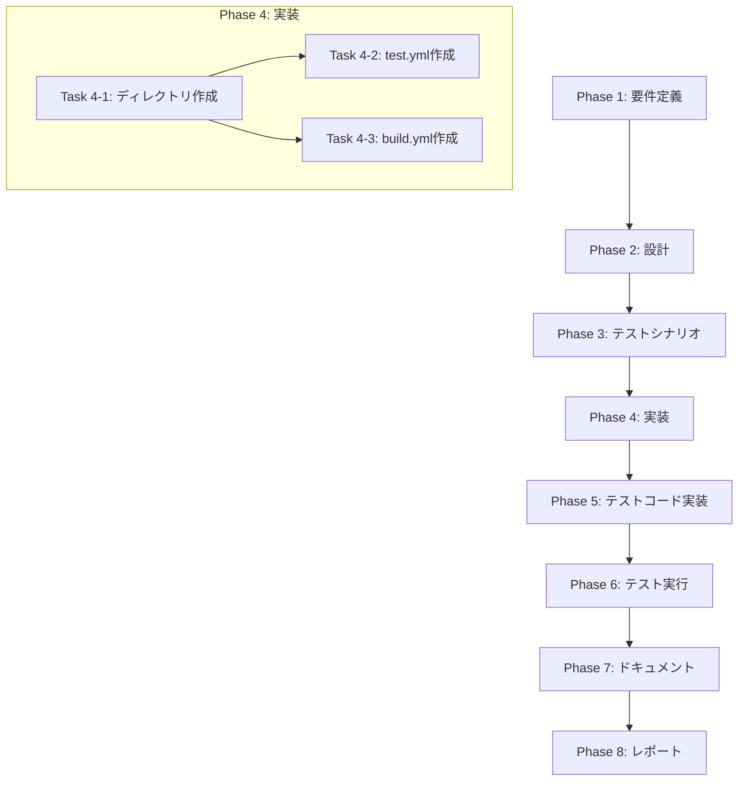

# Codex Agent 実行ログ

開始日時: 2025/12/29 4:27:18

---

## Turn 1: スレッド開始

**Thread ID**: `[REDACTED_TOKEN]`

## Turn 2: ツール実行

**種別**: error
**ステータス**: completed

## Turn 3: ツール実行

**種別**: reasoning
**ステータス**: completed

## Turn 4: ツール実行

**種別**: コマンド実行
**コマンド**: `/bin/bash -lc 'pwd && ls'`
**ステータス**: completed (exit_code=0)

```text
/tmp/ai-workflow-repos-133-de87dc9a/ai-workflow-agent
ARCHITECTURE.md
CHANGELOG.md
CLAUDE.md
[REDACTED_TOKEN].md
[REDACTED_TOKEN].md
CODEBASE_SUMMARY.md
DOCKER_AUTH_SETUP.md
Dockerfile
Jenkinsfile
LICENSE
PROGRESS.md
README.md
ROADMAP.md
SETUP_TYPESCRIPT.md
TROUBLESHOOTING.md
__mocks__
dist
docs
examples
jenkins
jest.config.cjs
metadata.json.template
node_modules
package-lock.json
package.json
scripts
src
tests
tmp
tmp-init-auto
tsconfig.json
tsconfig.test.json
```

## Turn 5: ツール実行

**種別**: reasoning
**ステータス**: completed

## Turn 6: ツール実行

**種別**: コマンド実行
**コマンド**: `/bin/bash -lc 'rg -n "Phase 6" -n'`
**ステータス**: failed (exit_code=127)

```text
/bin/bash: line 1: rg: command not found
```

## Turn 7: ツール実行

**種別**: reasoning
**ステータス**: completed

## Turn 8: ツール実行

**種別**: コマンド実行
**コマンド**: `/bin/bash -lc "find . -name 'Planning.md' -print"`
**ステータス**: completed (exit_code=0)

## Turn 9: ツール実行

**種別**: reasoning
**ステータス**: completed

## Turn 10: ツール実行

**種別**: コマンド実行
**コマンド**: `/bin/bash -lc 'rg -n "Planning"'`
**ステータス**: failed (exit_code=127)

```text
/bin/bash: line 1: rg: command not found
```

## Turn 11: ツール実行

**種別**: reasoning
**ステータス**: completed

## Turn 12: ツール実行

**種別**: コマンド実行
**コマンド**: `/bin/bash -lc 'grep -R "Phase 6" -n'`
**ステータス**: failed (exit_code=124)

```text
.git/logs/refs/heads/ai-workflow/issue-545:26:[REDACTED_TOKEN] [REDACTED_TOKEN] yuto-takashi <[REDACTED_EMAIL]> 1766976379 +0000	commit: [ai-workflow] Phase 6 (testing) - execute completed
.git/logs/refs/heads/ai-workflow/issue-545:35:[REDACTED_TOKEN] [REDACTED_TOKEN] yuto-takashi <[REDACTED_EMAIL]> 1766978059 +0000	commit: [ai-workflow] Phase 6 (testing) - revise completed
.git/logs/refs/heads/ai-workflow/issue-545:48:[REDACTED_TOKEN] [REDACTED_TOKEN] yuto-takashi <[REDACTED_EMAIL]> 1766982437 +0000	commit: [ai-workflow] Phase 6 (testing) - revise completed
.git/logs/HEAD:28:[REDACTED_TOKEN] [REDACTED_TOKEN] yuto-takashi <[REDACTED_EMAIL]> 1766976379 +0000	commit: [ai-workflow] Phase 6 (testing) - execute completed
.git/logs/HEAD:37:[REDACTED_TOKEN] [REDACTED_TOKEN] yuto-takashi <[REDACTED_EMAIL]> 1766978059 +0000	commit: [ai-workflow] Phase 6 (testing) - revise completed
.git/logs/HEAD:50:[REDACTED_TOKEN] [REDACTED_TOKEN] yuto-takashi <[REDACTED_EMAIL]> 1766982437 +0000	commit: [ai-workflow] Phase 6 (testing) - revise completed
.git/COMMIT_EDITMSG:1:[ai-workflow] Phase 6 (testing) - revise completed
.ai-workflow/issue-10/00_planning/output/planning.md:22:- **Phase 6 (テスト実行)**: 1~2h - テスト実行と修正
.ai-workflow/issue-10/00_planning/output/planning.md:241:### Phase 6: テスト実行 (見積もり: 1~2h)
.ai-workflow/issue-10/00_planning/output/planning.md:300:    P5 --> P6[Phase 6: テスト実行]
.ai-workflow/issue-10/00_planning/output/planning.md:406:### Phase 6: テスト実行
.ai-workflow/issue-10/02_design/output/design.md:942:### Phase 6: テスト実行（1~2h）
.ai-workflow/issue-10/04_implementation/output/implementation.md:186:### Phase 6（testing）での作業
.ai-workflow/issue-10/04_implementation/output/implementation.md:251:### Phase 6 で実施する項目
.ai-workflow/issue-10/05_test_implementation/output/test-implementation.md:372:### Phase 6: テスト実行（testing）
.ai-workflow/issue-10/05_test_implementation/output/test-implementation.md:436:### Phase 6 で実施する項目
.ai-workflow/issue-10/06_testing/output/test-result.md:227:4. **実装完了後、Phase 6（testing）を再実行**
.ai-workflow/issue-10/06_testing/output/test-result.md:230:## 品質ゲート（Phase 6）の確認
.ai-workflow/issue-10/06_testing/output/test-result.md:247:6. 再度Phase 6（testing）を実行
.ai-workflow/issue-10/06_testing/output/test-result.md:323:**Phase**: Testing (Phase 6)
.ai-workflow/issue-10/08_report/output/report.md:39:- マージ後、Phase 6（testing）を再実行して統合テスト成功率の改善を確認
.ai-workflow/issue-10/08_report/output/report.md:200:#### テストフレームワーク修正（Phase 6で実施）
.ai-workflow/issue-10/08_report/output/report.md:207:### テスト結果（Phase 6）
.ai-workflow/issue-10/08_report/output/report.md:390:  - Phase 6（testing）を再実行して統合テスト成功率の改善を確認（推奨）
.ai-workflow/issue-10/08_report/output/report.md:446:1. **Phase 6（testing）を再実行**:
.ai-workflow/issue-10/08_report/output/report.md:458:1. **Phase 6（testing）の再実行**（推奨）:
.ai-workflow/issue-10/09_evaluation/output/evaluation_report.md:343: 4. **Phase 6（testing）の再実行**
.ai-workflow/issue-102/00_planning/output/planning.md:159:### Phase 6: テスト実行 (見積もり: 0.5~0.75h)
.ai-workflow/issue-102/00_planning/output/planning.md:199:    P4 --> P6[Phase 6: テスト実行]
.ai-workflow/issue-102/00_planning/output/planning.md:218:- Phase 4 → Phase 6: テスト期待値とJest設定の修正が完了してからテスト実行
.ai-workflow/issue-102/00_planning/output/planning.md:219:- Phase 6 → Phase 7: テスト結果を確認してからドキュメント作成
.ai-workflow/issue-102/00_planning/output/planning.md:287:### Phase 6: テスト実行
.ai-workflow/issue-102/01_requirements/output/requirements.md:282:  - **Phase 6（テスト実行）**: 全テストスイート（npm test）を実行し、回帰テストを実施
.ai-workflow/issue-102/01_requirements/output/requirements.md:288:  - **Phase 6（テスト実行）**: CI環境（Jenkins）での実行も確認
.ai-workflow/issue-102/02_design/output/design.md:417:Phase 6: testing (phaseOrder[6] + 1 = 7)
... (truncated)
```

## Turn 13: ツール実行

**種別**: reasoning
**ステータス**: completed

## Turn 14: ツール実行

**種別**: コマンド実行
**コマンド**: `/bin/bash -lc "find . -path '*planning.md' -print"`
**ステータス**: completed (exit_code=0)

```text
./.ai-workflow/issue-10/00_planning/output/planning.md
./.ai-workflow/issue-102/00_planning/output/planning.md
./.ai-workflow/issue-104/00_planning/output/planning.md
./.ai-workflow/issue-105/00_planning/output/planning.md
./.ai-workflow/issue-108/00_planning/output/planning.md
./.ai-workflow/issue-113/00_planning/output/planning.md
./.ai-workflow/issue-115/00_planning/output/planning.md
./.ai-workflow/issue-119/00_planning/output/planning.md
./.ai-workflow/issue-126/00_planning/output/planning.md
./.ai-workflow/issue-127/00_planning/output/planning.md
./.ai-workflow/issue-128/00_planning/output/planning.md
./.ai-workflow/issue-140/00_planning/output/planning.md
./.ai-workflow/issue-144/00_planning/output/planning.md
./.ai-workflow/issue-153/00_planning/output/planning.md
./.ai-workflow/issue-155/00_planning/output/planning.md
./.ai-workflow/issue-16/00_planning/output/planning.md
./.ai-workflow/issue-174/00_planning/output/planning.md
./.ai-workflow/issue-177/00_planning/output/planning.md
./.ai-workflow/issue-184/00_planning/output/planning.md
./.ai-workflow/issue-194/00_planning/output/planning.md
./.ai-workflow/issue-2/00_planning/output/planning.md
./.ai-workflow/issue-207/00_planning/output/planning.md
./.ai-workflow/issue-211/00_planning/output/planning.md
./.ai-workflow/issue-212/00_planning/output/planning.md
./.ai-workflow/issue-216/00_planning/output/planning.md
./.ai-workflow/issue-22/00_planning/output/planning.md
./.ai-workflow/issue-225/00_planning/output/planning.md
./.ai-workflow/issue-23/00_planning/output/planning.md
./.ai-workflow/issue-238/00_planning/output/planning.md
./.ai-workflow/issue-24/00_planning/output/planning.md
./.ai-workflow/issue-243/00_planning/output/planning.md
./.ai-workflow/issue-248/00_planning/output/planning.md
./.ai-workflow/issue-25/00_planning/output/planning.md
./.ai-workflow/issue-253/00_planning/output/planning.md
./.ai-workflow/issue-259/00_planning/output/planning.md
./.ai-workflow/issue-26/00_planning/output/planning.md
./.ai-workflow/issue-261/00_planning/output/planning.md
./.ai-workflow/issue-271/00_planning/output/planning.md
./.ai-workflow/issue-38/00_planning/output/planning.md
./.ai-workflow/issue-45/00_planning/output/planning.md
./.ai-workflow/issue-46/00_planning/output/planning.md
./.ai-workflow/issue-47/00_planning/output/planning.md
./.ai-workflow/issue-48/00_planning/output/planning.md
./.ai-workflow/issue-49/00_planning/output/planning.md
./.ai-workflow/issue-5/00_planning/output/planning.md
./.ai-workflow/issue-50/00_planning/output/planning.md
./.ai-workflow/issue-51/00_planning/output/planning.md
./.ai-workflow/issue-52/00_planning/output/planning.md
./.ai-workflow/issue-54/00_planning/output/planning.md
./.ai-workflow/issue-58/00_planning/output/planning.md
./.ai-workflow/issue-61/00_planning/output/planning.md
./.ai-workflow/issue-64/00_planning/output/planning.md
./.ai-workflow/issue-7/00_planning/output/planning.md
./.ai-workflow/issue-73/00_planning/output/planning.md
./.ai-workflow/issue-74/00_planning/output/planning.md
./.ai-workflow/issue-90/00_planning/output/planning.md
./.ai-workflow/issue-91/00_planning/output/planning.md
./.ai-workflow/issue-545/00_planning/output/planning.md
```

## Turn 15: ツール実行

**種別**: reasoning
**ステータス**: completed

## Turn 16: ツール実行

**種別**: コマンド実行
**コマンド**: `/bin/bash -lc 'grep -n "Phase 6" .ai-workflow/issue-545/00_planning/output/planning.md'`
**ステータス**: completed (exit_code=0)

```text
168:### Phase 6: テスト実行 (見積もり: 0.25h)
203:    P5 --> P6[Phase 6: テスト実行]
217:- Phase 6-8は実装完了後に順次実行
299:### Phase 6: テスト実行
```

## Turn 17: ツール実行

**種別**: reasoning
**ステータス**: completed

## Turn 18: ツール実行

**種別**: コマンド実行
**コマンド**: `/bin/bash -lc "sed -n '150,230p' .ai-workflow/issue-545/00_planning/output/planning.md"`
**ステータス**: completed (exit_code=0)

```text
- マトリックスビルド設定（ubuntu-latest, windows-latest × Node.js 18.x, 20.x）
  - カバレッジレポート設定（Ubuntu 20.xのみ）

- [x] Task 4-3: build.ymlの作成 (0.2h)
  - Issueで定義されたbuild.yml内容の実装
  - TypeScriptビルドステップ
  - distディレクトリ存在確認ステップ

- [x] YAMLの構文エラーがない

### Phase 5: テストコード実装 (見積もり: 0h)

- [x] Task 5-1: テストコード実装 (0h)
  - GitHub Actionsワークフロー構造を検証するユニットテストが追加された
  - npm test/build のスモーク実行と異常系検証を含む

**注意**: 本Issueでは新規テストコードの実装は不要

### Phase 6: テスト実行 (見積もり: 0.25h)

- [x] Task 6-1: YAML構文検証 (0.15h)
  - YAMLシンタックスチェック
  - インデントの確認
  - 参照アクションのバージョン確認

- [x] Task 6-2: 既存テスト実行確認 (0.1h)
  - `npm test`の実行確認
  - 既存テストが影響を受けていないことの確認

### Phase 7: ドキュメント (見積もり: 0.25h)

- [ ] Task 7-1: 実装内容のドキュメント化 (0.25h)
  - ワークフローファイルの概要説明
  - トリガー条件の説明
  - 期待される動作の説明

### Phase 8: レポート (見積もり: 0.25h)

- [ ] Task 8-1: 実装レポートの作成 (0.25h)
  - 実装したファイルのリスト
  - 実行結果のサマリー
  - 今後のアクション（PRマージ後の確認事項）

---

## 5. 依存関係



**依存関係の説明**:
- Phase 1-2は前提条件の確認として順次実行
- Phase 4内のTask 4-2とTask 4-3は並行実施可能（ディレクトリ作成後）
- Phase 5はスキップ（テストコード不要）
- Phase 6-8は実装完了後に順次実行

---

## 6. リスクと軽減策

### リスク1: GitHub Actions実行時の権限不足
- **影響度**: 中
- **確率**: 低
- **説明**: リポジトリのActionsが無効化されている、またはworkflow書き込み権限がない
- **軽減策**:
  - PRを作成する前にリポジトリのActions設定を確認
  - 権限エラーが発生した場合は、リポジトリ管理者に設定変更を依頼
```

## Turn 19: ツール実行

**種別**: reasoning
**ステータス**: completed

## Turn 20: ツール実行

**種別**: コマンド実行
**コマンド**: `/bin/bash -lc "sed -n '1,200p' .ai-workflow/issue-545/06_testing/output/test-result.md"`
**ステータス**: completed (exit_code=0)

```text
# テスト実行結果

## テスト概要
- `npm test -- tests/unit/utils/git-url-utils.test.ts`: PASS（スイート1/1、テスト29/29、所要0.704s）。ReDoS性能: 大量@入力1ms、通常入力1000回64ms。
- `npm test`: PASS（スイート144/146中144パス・2スキップ、テスト2194/2266パス・72スキップ、所要504.703s）。終了時に未解放ハンドル警告のみで失敗なし。

## 主な確認ポイント
- sanitizeGitUrlの性能テストが500ms閾値内で全てPASS。
- report-cleanup/migrate-sanitize-tokensのファイルI/O系テストはタイムアウト拡張後も完走し、フルスイートで失敗なし。
```

## Turn 21: ツール実行

**種別**: reasoning
**ステータス**: completed

## Turn 22: ツール実行

**種別**: コマンド実行
**コマンド**: `/bin/bash -lc 'nl -ba .ai-workflow/issue-545/06_testing/output/test-result.md'`
**ステータス**: completed (exit_code=0)

```text
1	# テスト実行結果
     2	
     3	## テスト概要
     4	- `npm test -- tests/unit/utils/git-url-utils.test.ts`: PASS（スイート1/1、テスト29/29、所要0.704s）。ReDoS性能: 大量@入力1ms、通常入力1000回64ms。
     5	- `npm test`: PASS（スイート144/146中144パス・2スキップ、テスト2194/2266パス・72スキップ、所要504.703s）。終了時に未解放ハンドル警告のみで失敗なし。
     6	
     7	## 主な確認ポイント
     8	- sanitizeGitUrlの性能テストが500ms閾値内で全てPASS。
     9	- report-cleanup/migrate-sanitize-tokensのファイルI/O系テストはタイムアウト拡張後も完走し、フルスイートで失敗なし。
```

## Turn 23: ツール実行

**種別**: reasoning
**ステータス**: completed

## Turn 24: ツール実行

**種別**: agent_message
**ステータス**: completed

## Turn 25: 実行完了

**ステータス**: completed
**所要時間**: 56197ms
**ターン数**: N/A

---

**経過時間**: 56197ms
**開始**: 2025-12-29T04:27:18.571Z
**終了**: 2025-12-29T04:28:14.768Z