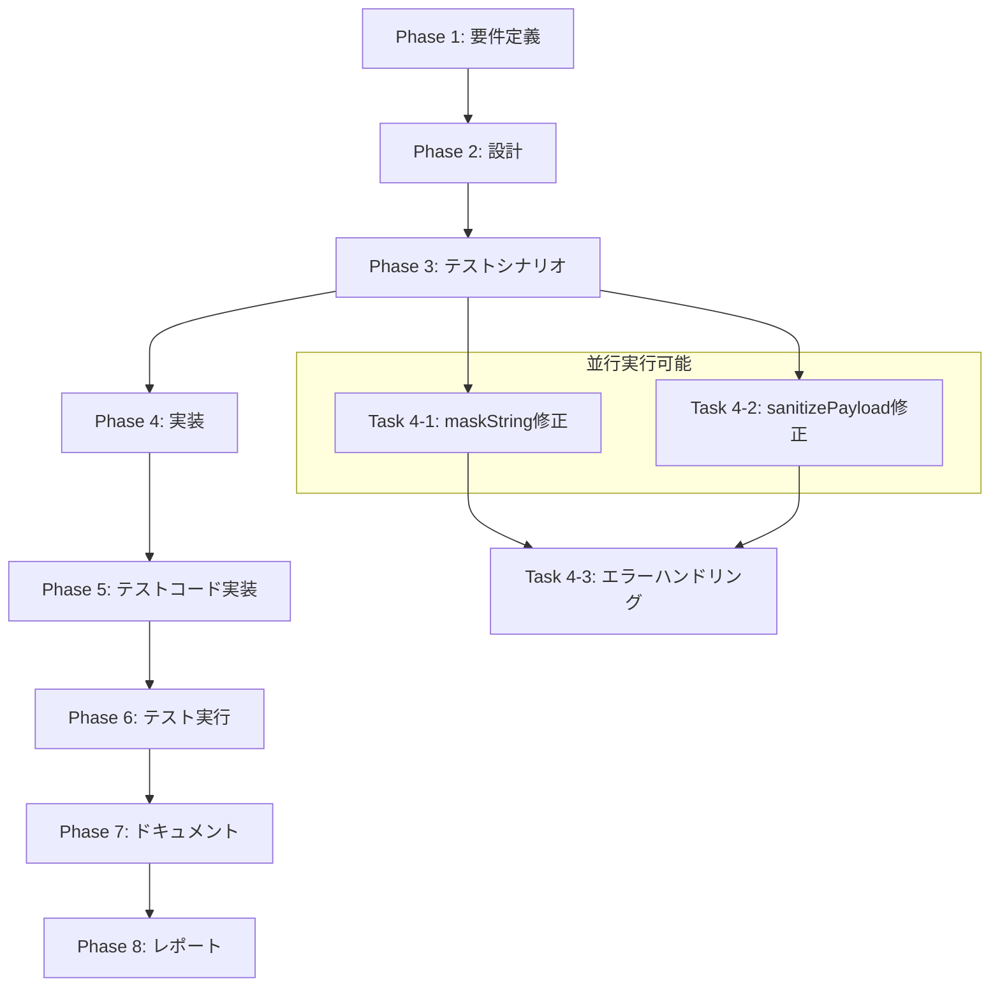

# プロジェクト計画書 - Issue #558

**Issue タイトル**: metadata.json に不適切なマススキング処理がされてしまう
**Issue URL**: https://github.com/tielec/ai-workflow-agent/issues/558
**作成日**: 2025-01-02
**プロジェクト**: AI Workflow Agent

---

## 1. Issue分析

### 複雑度: 中程度
**判定根拠**:
- 複数ファイルの修正が必要（secret-masker.ts、issue-ai-generator.ts、テストファイル）
- 既存マスキング機能の動作理解と修正が必要
- 複数のマスキングパス（URL保持、汎用パターンマスキング）の協調処理
- 既存テストの拡張が必要

### 見積もり工数: 10~14時間
**根拠**:
- **問題分析**: 複雑なマスキング処理フローの詳細調査（2時間）
- **設計・実装**: 3つのマスキング問題の修正（6時間）
- **テスト実装**: ユニット・インテグレーションテストの追加（4時間）
- **テスト実行・デバッグ**: 修正検証と回帰テスト（2時間）

### リスク評価: 中
**理由**:
- 秘密管理という機密性の高い機能への変更
- 既存の正常動作への影響リスク
- マスキング処理の誤実装による機密漏洩リスク

---

## 2. 実装戦略判断

### 実装戦略: REFACTOR

**判断根拠**:
既存のSecretMaskerクラスのマスキング処理に以下の構造的問題があるため、リファクタリングが必要：

1. **URL復元ロジックの問題**: `maskString()`メソッドでGitHub URLのプレースホルダー復元が失敗
2. **キー名マスキングの誤動作**: オブジェクトのキー名（`implementation_strategy`等）が汎用トークン正規表現に誤マッチ
3. **ignoredPathsの未活用**: `maskObject()`で`ignoredPaths: []`が空指定されているため不要なマスキングが発生

新規機能追加ではなく、既存コードの構造的改善が中心となる。

### テスト戦略: UNIT_INTEGRATION

**判断根拠**:
- **UNIT**: SecretMaskerクラスの個別メソッド（maskString、maskObject）の動作検証が必要
- **INTEGRATION**: metadata.json全体のマスキング動作、Issue生成プロセスでのマスキング連携テストが必要
- BDDは不要：エンドユーザーのストーリーではなく、内部的なセキュリティ処理の修正

### テストコード戦略: EXTEND_TEST

**判断根拠**:
既存のテストファイル（`tests/unit/secret-masker.test.ts`）にテストケースを追加拡張する：
- 現在720行の充実したテストが存在
- Issue #558の具体的なケース（metadata.json全体のマスキング）のテストが不足
- 新規テストファイル作成より、既存テスト拡張が効率的

---

## 3. 影響範囲分析

### 既存コードへの影響
**変更が必要なファイル・モジュール**:
1. **`src/core/secret-masker.ts`** (371行) - マスキング処理の中核
   - `maskString()`メソッドのURL復元ロジック修正
   - 汎用トークン正規表現の改善（キー名除外）
2. **`src/core/github/issue-ai-generator.ts`** (526行) - Issue生成時のマスキング設定
   - `sanitizePayload()`のignoredPaths設定
3. **`tests/unit/secret-masker.test.ts`** (720行) - テストケース拡張
   - metadata.json全体のマスキングテスト追加

### 依存関係の変更
**新規依存の追加**: なし
**既存依存の変更**: なし

### マイグレーション要否
**データベーススキーマ変更**: なし
**設定ファイル変更**: なし
**環境変数変更**: なし

---

## 4. タスク分割

### Phase 1: 要件定義 (見積もり: 1~2h)

- [x] Task 1-1: 不適切マスキングの詳細仕様定義 (1h)
  - Issue #558で発生している3つのマスキング問題の詳細分析
  - 期待される正常動作の定義（issue_url、pr_url、design_decisions等）
  - マスキング対象・非対象の明確な区別基準策定

- [x] Task 1-2: マスキング処理の受け入れ基準定義 (1h)
  - metadata.json保存時の正常マスキング動作基準
  - GitHub URL保持の受け入れ基準（`https://github.com/owner/repo`形式維持）
  - キー名保持の受け入れ基準（`implementation_strategy`等のキー名は非マスキング）

### Phase 2: 設計 (見積もり: 2~3h)

- [x] Task 2-1: SecretMasker.maskString()のリファクタリング設計 (1.5h)
  - URL復元ロジックの改善アルゴリズム設計
  - 汎用トークン正規表現の除外パターン設計（キー名マスキング防止）
  - プレースホルダー管理の改善設計

- [x] Task 2-2: ignoredPathsパラメータの活用設計 (1h)
  - metadata.jsonでマスキング除外すべきパスの設計
  - issue_url、pr_url、design_decisionsキーの保護戦略
  - IssueAIGenerator.sanitizePayload()の修正設計

### Phase 3: テストシナリオ (見積もり: 1h)

- [x] Task 3-1: ユニットテストシナリオ設計 (0.5h)
  - SecretMasker.maskString()の個別メソッドテストケース
  - GitHub URL復元テスト、キー名保持テストの詳細シナリオ

- [x] Task 3-2: インテグレーションテストシナリオ設計 (0.5h)
  - metadata.json全体のマスキング統合テスト
  - Issue生成プロセスでのマスキング連携テスト

-### Phase 4: 実装 (見積もり: 4~6h)

- [x] Task 4-1: SecretMasker.maskString()の修正実装 (2~3h)
  - URL復元ロジックの改善実装
  - 汎用トークン正規表現の除外パターン実装
  - プレースホルダー管理の改善実装

- [x] Task 4-2: IssueAIGenerator.sanitizePayload()の修正実装 (1h)
  - ignoredPathsパラメータの適切な設定実装
  - metadata.jsonでのマスキング除外パス設定

- [ ] Task 4-3: エラーハンドリングと境界条件の実装 (1~2h)
  - 不正なURL形式への対応
  - 空文字列・null値の適切な処理
  - プレースホルダーの重複・衝突回避

### Phase 5: テストコード実装 (見積もり: 2~3h)

- [x] Task 5-1: ユニットテストの拡張実装 (1.5~2h)
  - secret-masker.test.tsにIssue #558ケースを追加
  - maskString()の個別メソッドテスト実装
  - URL復元、キー名保持の詳細テスト実装

- [x] Task 5-2: インテグレーションテストの実装 (0.5~1h)
  - metadata.json全体のマスキングテスト実装
  - Issue生成プロセスでのマスキング統合テスト実装

### Phase 6: テスト実行 (見積もり: 1~2h)

- [x] Task 6-1: ユニットテストの実行と検証 (0.5~1h)
  - 新規追加テストの実行確認
  - 既存テストの回帰テスト実行
  - テストカバレッジの確認

- [x] Task 6-2: インテグレーションテストの実行と検証 (0.5~1h)
  - metadata.json実際保存時のマスキング動作確認
  - Issue生成プロセスでのマスキング連携確認

### Phase 7: ドキュメント (見積もり: 0.5h)

- [x] Task 7-1: マスキング処理の仕様ドキュメント更新 (0.5h)
  - SecretMaskerクラスのJSDoc更新
  - マスキング対象・非対象の明確化
  - ignoredPathsパラメータの使用方法記載

### Phase 8: レポート (見積もり: 0.5h)

- [ ] Task 8-1: 修正内容とテスト結果のサマリー作成 (0.5h)
  - Issue #558の問題解決確認レポート
  - マスキング処理の改善点まとめ
  - 今後の保守・拡張における注意点記載

---

## 5. 依存関係

---

## 6. リスクと軽減策

### リスク1: 既存の正常マスキング機能への回帰
- **影響度**: 高
- **確率**: 中
- **軽減策**:
  - 既存のsecret-masker.test.ts（720行）の全テスト実行で回帰確認
  - 段階的修正（maskString → sanitizePayload → 統合テスト）
  - 各修正後の部分テスト実行

### リスク2: マスキング処理の誤実装による機密漏洩
- **影響度**: 高
- **確率**: 低
- **軽減策**:
  - テストケースで実際のGitHubトークン形式をモック化して検証
  - コードレビューでマスキング対象・非対象の明確化確認
  - 環境変数の実際の値でのテスト実行（セキュアな環境）

### リスク3: URL復元ロジックの複雑化による保守性低下
- **影響度**: 中
- **確率**: 中
- **軽減策**:
  - プレースホルダー管理をシンプル化（Map構造の活用）
  - 復元処理のステップを明確に分離
  - 詳細なJSDocコメントとテストケースによる仕様明確化

### リスク4: ignoredPathsパターンマッチングの複雑化
- **影響度**: 中
- **確率**: 低
- **軽減策**:
  - 単純なパスパターン（"issue_url", "pr_url"等）から開始
  - ワイルドカード使用は最小限に抑制
  - パスパターンの妥当性をユニットテストで検証

---

## 7. 品質ゲート

### Phase 1: 要件定義
- [ ] 不適切マスキングの3つの問題が明確に記載されている
- [ ] 期待される正常動作（issue_url、pr_url、キー名保持）が定義されている
- [ ] マスキング対象・非対象の区別基準が明確に策定されている

### Phase 2: 設計
- [x] **実装戦略（REFACTOR）の判断根拠が明記されている**
- [x] **テスト戦略（UNIT_INTEGRATION）の判断根拠が明記されている**
- [x] **テストコード戦略（EXTEND_TEST）の判断根拠が明記されている**
- [x] SecretMasker.maskString()の改善アルゴリズムが設計されている
- [x] ignoredPathsパラメータの活用方針が設計されている

### Phase 3: テストシナリオ
- [x] ユニットテストシナリオが具体的に設計されている
- [x] インテグレーションテストシナリオが具体的に設計されている
- [x] Issue #558の具体的ケースがテストシナリオに含まれている

### Phase 4: 実装
- [ ] SecretMasker.maskString()の修正が完了している
- [ ] IssueAIGenerator.sanitizePayload()の修正が完了している
- [ ] エラーハンドリングと境界条件の実装が完了している
- [ ] 実装がリントエラーなく完了している

### Phase 5: テストコード実装
- [x] ユニットテストの拡張実装が完了している
- [x] インテグレーションテストの実装が完了している
- [x] 全テストがコンパイルエラーなく実装されている

### Phase 6: テスト実行
- [ ] 新規追加テストが全て成功している
- [ ] 既存テストの回帰テストが全て成功している
- [ ] Issue #558の問題が解決されていることが確認されている
- [ ] テストカバレッジが維持・向上している

### Phase 7: ドキュメント
- [x] SecretMaskerクラスのJSDocが更新されている
- [x] マスキング対象・非対象の仕様が明確に記載されている

### Phase 8: レポート
- [ ] Issue #558の問題解決が確認・記載されている
- [ ] 修正内容の要約とテスト結果が記載されている

---

## 注意事項

1. **セキュリティ最優先**: マスキング処理の修正時は、機密情報の漏洩リスクを最優先で考慮
2. **段階的修正**: maskString() → sanitizePayload() → 統合テストの順で段階的に修正し、各段階でテスト実行
3. **既存テストの保護**: 既存のsecret-masker.test.ts（720行）のテストケースは全て維持し、回帰を防止
4. **実装戦略の重要性**: Phase 2でREFACTORの実装戦略が確定しているため、新規機能追加ではなく既存コード改善に注力
5. **テスト戦略の遵守**: UNIT_INTEGRATIONのテスト戦略に基づき、個別メソッドテストと統合テストの両方を確実に実装
6. **ignoredPaths活用**: テストコード戦略EXTEND_TESTに基づき、既存テストファイルにテストケースを適切に追加

## 成功の定義

1. **機能的成功**: Issue #558で報告された不適切マスキング（`__GITHUB_URL_X__`、`[REDACTED_TOKEN]`キー名）が解決されている
2. **非機能的成功**: 既存のマスキング機能に回帰がなく、全テストが成功している
3. **保守性成功**: マスキング処理の仕様が明確化され、将来の拡張・保守が容易になっている
