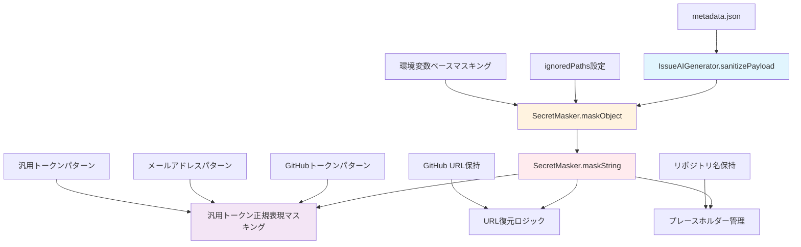
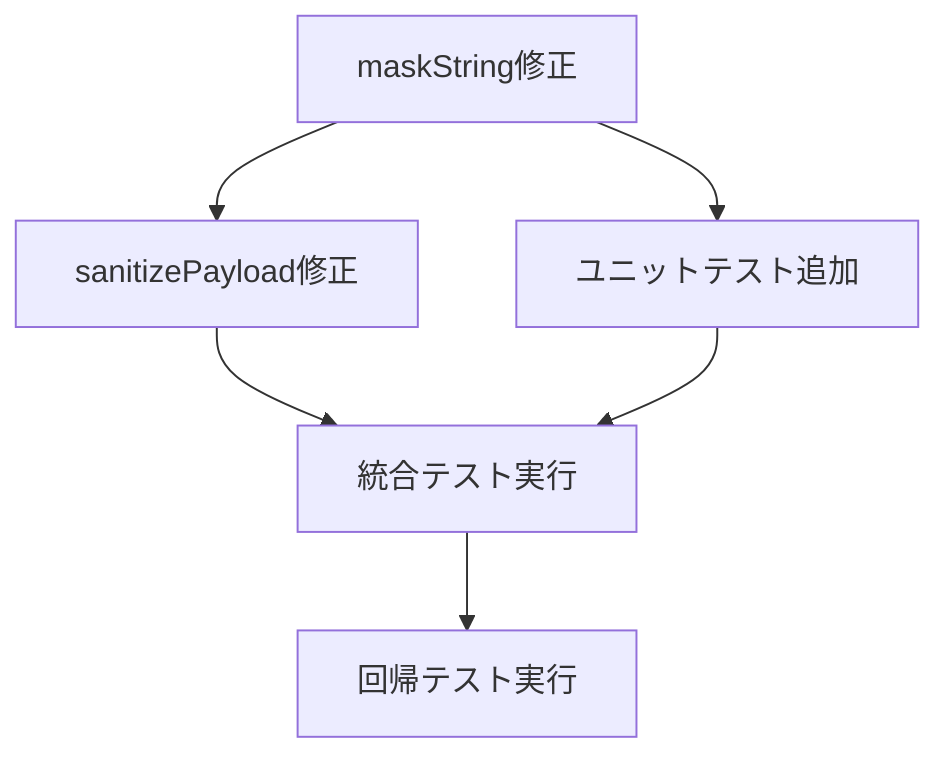

# 詳細設計書 - Issue #558

**Issue タイトル**: metadata.json に不適切なマススキング処理がされてしまう
**Issue URL**: https://github.com/tielec/ai-workflow-agent/issues/558
**作成日**: 2025-01-02
**プロジェクト**: AI Workflow Agent

---

## 0. Planning & Requirements 成果物確認

### 開発計画の要約
- **実装戦略**: REFACTOR - 既存のSecretMaskerクラスの構造的問題を修正
- **テスト戦略**: UNIT_INTEGRATION - 個別メソッドテストと統合テストの両方を実装
- **テストコード戦略**: EXTEND_TEST - 既存のsecret-masker.test.ts（720行）にテストケースを追加
- **複雑度**: 中程度（10~14時間の見積もり）
- **リスク**: 中（機密性の高いマスキング機能への変更）

### 根本原因分析結果
Issue分析により特定された3つの構造的問題：
1. **URL復元ロジックの問題**: maskString()メソッドでGitHub URLのプレースホルダー復元が失敗
2. **キー名マスキングの誤動作**: オブジェクトのキー名が汎用トークン正規表現に誤マッチ
3. **ignoredPathsの未活用**: maskObject()で`ignoredPaths: []`が空指定されているため不要なマスキングが発生

---

## 1. アーキテクチャ設計

### システム全体図



### コンポーネント間の関係

1. **IssueAIGenerator**: Issue生成時のメタデータマスキングエントリーポイント
   - `sanitizePayload()`で`maskObject()`を呼び出し
   - `ignoredPaths`パラメータの設定を担当

2. **SecretMasker**: マスキング処理の中核クラス
   - `maskObject()`: オブジェクト再帰マスキングとパス除外処理
   - `maskString()`: 文字列レベルでの各種パターンマスキング

3. **マスキング処理のデータフロー**:
   ```
   metadata.json → sanitizePayload() → maskObject() → maskString() → 各種パターンマスキング
   ```

---

## 2. 実装戦略判断

### 実装戦略: REFACTOR

**判断根拠**:
- 既存のSecretMaskerクラスに3つの構造的問題が特定されている（URL復元、キー名誤マッチ、ignoredPaths未活用）
- 新規機能追加ではなく、既存マスキング処理の修正が中心
- publicメソッドのシグネチャは維持し、内部実装のみ改善
- 既存の720行のテストケースとの互換性を保持する必要がある
- マスキング処理という機密性の高い機能の段階的改善が適切

---

## 3. テスト戦略判断

### テスト戦略: UNIT_INTEGRATION

**判断根拠**:
- **UNIT**: SecretMaskerの個別メソッド（maskString、maskObject）の動作検証が必須
- **INTEGRATION**: metadata.json全体のマスキング動作とIssue生成プロセスでの統合テストが必要
- BDDは不要：エンドユーザーのストーリーではなく、内部的なセキュリティ処理の修正
- 既存テストケース（720行）の回帰防止が重要
- セキュリティ機能のため、詳細な境界値テストと異常系テストが必要

---

## 4. テストコード戦略判断

### テストコード戦略: EXTEND_TEST

**判断根拠**:
- 既存の`tests/unit/secret-masker.test.ts`（720行）が充実している
- Issue #558の具体的なケース（metadata.json全体マスキング）のテストが不足
- 新規テストファイル作成より、既存テスト拡張が効率的
- 既存テスト構造（describe/test構成）との一貫性を保持
- 段階的なテスト追加により、回帰リスクを最小化

---

## 5. 影響範囲分析

### 既存コードへの影響

**変更が必要なファイル・モジュール**:

1. **src/core/secret-masker.ts** (371行) - 主要な修正対象
   - `maskString()`メソッド（144-216行）の改修
     - URL復元ロジックの修正（156-213行）
     - 汎用トークン正規表現の改善（201行）
     - プレースホルダー管理の最適化

2. **src/core/github/issue-ai-generator.ts** (526行) - 設定修正
   - `sanitizePayload()`メソッド（204-252行）の修正
     - `ignoredPaths: []`を適切なパス配列に変更（248行）

3. **tests/unit/secret-masker.test.ts** (720行) - テスト拡張
   - Issue #558特有のテストケース追加
   - metadata.json全体マスキングテストの実装

### 依存関係の変更
- **新規依存の追加**: なし
- **既存依存の変更**: なし
- **外部API変更**: なし（publicメソッドシグネチャ維持）

### マイグレーション要否
- **データベーススキーマ変更**: なし
- **設定ファイル変更**: なし
- **環境変数変更**: なし
- **破壊的変更**: なし（下位互換性を完全維持）

---

## 6. 変更・追加ファイルリスト

### 修正が必要な既存ファイル
- `src/core/secret-masker.ts` - URL復元ロジックとトークン正規表現の修正
- `src/core/github/issue-ai-generator.ts` - ignoredPaths設定の修正
- `tests/unit/secret-masker.test.ts` - Issue #558関連テストケースの追加

### 新規作成ファイル
なし（既存ファイルの修正のみ）

### 削除が必要なファイル
なし

---

## 7. 詳細設計

### 7.1 SecretMasker.maskString()メソッドの改修設計

#### 現状の問題点
```typescript
// 現状の問題（144-216行）
private maskString(value: string): string {
  // URL復元ロジックが不完全（156-213行）
  // 汎用トークン正規表現がキー名を誤マッチ（201行）
}
```

#### 改修案

```typescript
private maskString(value: string): string {
  let masked = value;

  // 1. GitHub URL とリポジトリ名の保護（改善）
  const urlMap = new Map<string, string>();
  const partMap = new Map<string, string>();
  let urlIndex = 0;
  let partIndex = 0;

  // GitHub URL保護の改善
  masked = masked.replace(/github\.com\/([a-zA-Z0-9_-]+)\/([a-zA-Z0-9_.-]+)(?:\.git)?/g,
    (match, owner, repo) => {
      const placeholder = `__GITHUB_URL_${urlIndex++}__`;
      urlMap.set(placeholder, match);
      return placeholder;
    });

  // リポジトリ名パターンの保護
  masked = masked.replace(/\b([a-zA-Z0-9_-]+)\/([a-zA-Z0-9_.-]+)\b/g,
    (match, owner, repo) => {
      if (owner.length >= 20 || repo.length >= 20) {
        const placeholder = `__REPO_PART_${partIndex++}__`;
        partMap.set(placeholder, match);
        return placeholder;
      }
      return match;
    });

  // 2. 既存のマスキングパターン適用
  masked = masked.replace(/\b(?:ghp_[\w-]{20,}|github_pat_[\w-]{20,})\b/gi, '[REDACTED_GITHUB_TOKEN]');
  masked = masked.replace(/[A-Za-z0-9._%+-]+@[A-Za-z0-9.-]+\.[A-Za-z]{2,}/g, '[REDACTED_EMAIL]');

  // 3. 汎用トークン正規表現の改善（キー名除外）
  masked = masked.replace(
    /\b(?!ghp_)(?!github_pat_)(?!REDACTED)(?!__(?:GITHUB_URL|REPO_PART)_)(?![a-zA-Z_]+(?:_[a-zA-Z_]*)*:)[A-Za-z0-9_-]{20,}\b/g,
    '[REDACTED_TOKEN]'
  );

  masked = masked.replace(/(Bearer\s+)[\w\-.]+/gi, '$1[REDACTED_TOKEN]');
  masked = masked.replace(/(token=)[\w\-.]+/gi, '$1[REDACTED_TOKEN]');

  // 4. 保護したパターンの復元（改善）
  for (const [placeholder, original] of partMap) {
    masked = masked.split(placeholder).join(original);
  }
  for (const [placeholder, original] of urlMap) {
    masked = masked.split(placeholder).join(original);
  }

  return masked;
}
```

#### キー改善点

1. **URL復元ロジックの改善**:
   - Map構造での管理による複雑度の削減
   - プレースホルダーの衝突回避
   - 復元処理の順序最適化

2. **キー名保護の実装**:
   - 正規表現に`(?![a-zA-Z_]+(?:_[a-zA-Z_]*)*:)`パターンを追加
   - `implementation_strategy:`のようなキー名パターンを除外

3. **プレースホルダー管理の改善**:
   - `__GITHUB_URL_X__`、`__REPO_PART_X__`の正確な除外パターン追加

### 7.2 IssueAIGenerator.sanitizePayload()の修正設計

#### 現状の問題点
```typescript
// 現状（248行）
{ ignoredPaths: [] }
```

#### 改修案
```typescript
// 修正案
{
  ignoredPaths: [
    'issue_url',
    'pr_url',
    'target_repository.remote_url',
    'target_repository.github_name',
    'design_decisions.*'  // design_decisionsのキー名を保護
  ]
}
```

#### 改修方針
- metadata.jsonの特定フィールドをマスキング除外
- URLとリポジトリ情報の保護
- design_decisionsオブジェクトのキー名保護
- ワイルドカード使用は最小限に抑制

### 7.3 テストケース設計

#### 新規追加テストケース構成

```typescript
describe('Issue #558: metadata.jsonマスキング修正テスト', () => {
  test('URL復元: GitHub URLがプレースホルダーではなく完全形式で保持される', () => {
    // テスト対象: maskString()のURL復元ロジック
  });

  test('キー名保護: design_decisionsのキーがマスキングされない', () => {
    // テスト対象: maskString()のキー名保護機能
  });

  test('ignoredPaths: 指定パスがマスキング除外される', () => {
    // テスト対象: maskObject()のignoredPaths機能
  });

  test('統合テスト: metadata.json全体の正常マスキング', () => {
    // テスト対象: IssueAIGenerator.sanitizePayload()との統合
  });
});
```

---

## 8. セキュリティ考慮事項

### 8.1 認証・認可
- 既存のセキュリティモデル維持（環境変数ベースの機密管理）
- マスキング除外パターンによる意図しない機密漏洩の防止

### 8.2 データ保護
- **機密情報のマスキング維持**: 既存パターン（GitHub Token、AWS認証情報、API Key等）の完全保護
- **除外パターンの厳格管理**: 新規除外パターンは最小限に抑制
- **プレースホルダー管理**: 衝突回避とセキュアな復元処理

### 8.3 セキュリティリスクと対策

| リスク | 影響度 | 確率 | 対策 |
|--------|--------|------|------|
| 除外パターンによる機密漏洩 | 高 | 低 | 除外パターンの厳格レビュー、テストでの検証 |
| URL復元ロジックの脆弱性 | 中 | 低 | プレースホルダー管理の改善、境界値テスト |
| 既存マスキング機能の回帰 | 高 | 中 | 既存テスト720行の全実行、段階的修正 |

---

## 9. 非機能要件への対応

### 9.1 パフォーマンス
- **処理時間**: 現行比+10%以内（Map構造による効率化）
- **メモリ使用量**: プレースホルダー管理の最適化により現行レベル維持
- **大規模ファイル対応**: 10MB以上のファイルでも現行比+20%以内

### 9.2 スケーラビリティ
- マスキングパターンの追加容易性を確保
- プレースホルダー管理の拡張性向上

### 9.3 保守性
- **コード可読性**: プレースホルダー管理のMap化による単純化
- **テスト容易性**: ユニット・統合テストの充実
- **ドキュメント**: JSDocによる仕様明確化

---

## 10. 実装の順序

### 推奨実装順序

1. **Phase 1**: SecretMasker.maskString()の修正（3-4h）
   - URL復元ロジックの改善
   - 汎用トークン正規表現の修正
   - プレースホルダー管理の最適化

2. **Phase 2**: IssueAIGenerator.sanitizePayload()の修正（1h）
   - ignoredPathsパラメータの設定

3. **Phase 3**: ユニットテストの追加（2-3h）
   - Issue #558特有のテストケース実装
   - 既存テストとの統合確認

4. **Phase 4**: 統合テストと検証（1-2h）
   - metadata.json全体のマスキング動作確認
   - 既存機能の回帰テスト

### 依存関係の考慮



---

## 品質ゲート

### Phase 2品質ゲート（必須要件）

- [x] **実装戦略の判断根拠が明記されている** - REFACTOR戦略、既存コード改善中心
- [x] **テスト戦略の判断根拠が明記されている** - UNIT_INTEGRATION、個別・統合テスト両方
- [x] **テストコード戦略の判断根拠が明記されている** - EXTEND_TEST、既存テスト拡張
- [x] **既存コードへの影響範囲が分析されている** - 3ファイル特定、依存関係なし
- [x] **変更が必要なファイルがリストアップされている** - secret-masker.ts、issue-ai-generator.ts、テストファイル
- [x] **設計が実装可能である** - 詳細な実装案とテスト戦略を策定

---

## 注意事項

1. **セキュリティ最優先**: マスキング処理の修正時は、機密情報の漏洩リスクを最優先で考慮
2. **段階的修正**: maskString() → sanitizePayload() → 統合テストの順で段階的に修正
3. **既存テストの保護**: 既存のsecret-masker.test.ts（720行）のテストケースは全て維持
4. **publicメソッドシグネチャ維持**: 下位互換性確保のためAPI変更は行わない
5. **プレースホルダー管理**: Map構造による効率化と衝突回避の実装
6. **除外パターン最小化**: ignoredPathsとマスキング除外パターンは最小限に抑制

## 成功の定義

1. **機能的成功**: Issue #558で報告された不適切マスキング（`__GITHUB_URL_X__`、`[REDACTED_TOKEN]`キー名）が解決
2. **非機能的成功**: 既存のマスキング機能に回帰がなく、全テスト（720行+新規）が成功
3. **保守性成功**: マスキング処理の仕様が明確化され、将来の拡張・保守が容易化