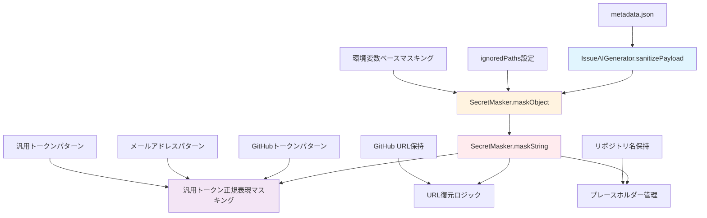

# Codex Agent 実行ログ

開始日時: 2025/12/29 8:56:55

---

## Turn 1: スレッド開始

**Thread ID**: `[REDACTED_TOKEN]`

## Turn 2: ツール実行

**種別**: reasoning
**ステータス**: completed

## Turn 3: ツール実行

**種別**: コマンド実行
**コマンド**: `/bin/bash -lc pwd`
**ステータス**: completed (exit_code=0)

```text
/tmp/ai-workflow-repos-135-fbb030e5/ai-workflow-agent
```

## Turn 4: ツール実行

**種別**: reasoning
**ステータス**: completed

## Turn 5: ツール実行

**種別**: コマンド実行
**コマンド**: `/bin/bash -lc ls`
**ステータス**: completed (exit_code=0)

```text
ARCHITECTURE.md
CHANGELOG.md
CLAUDE.md
[REDACTED_TOKEN].md
[REDACTED_TOKEN].md
CODEBASE_SUMMARY.md
DOCKER_AUTH_SETUP.md
Dockerfile
Jenkinsfile
LICENSE
PROGRESS.md
README.md
ROADMAP.md
SETUP_TYPESCRIPT.md
TROUBLESHOOTING.md
__mocks__
docs
examples
jenkins
jest.config.cjs
metadata.json.template
package-lock.json
package.json
scripts
src
tests
tmp
tsconfig.json
tsconfig.test.json
```

## Turn 6: ツール実行

**種別**: reasoning
**ステータス**: completed

## Turn 7: ツール実行

**種別**: コマンド実行
**コマンド**: `/bin/bash -lc "find . -name 'AGENTS.md' -print"`
**ステータス**: completed (exit_code=0)

## Turn 8: ツール実行

**種別**: reasoning
**ステータス**: completed

## Turn 9: ツール実行

**種別**: コマンド実行
**コマンド**: `/bin/bash -lc 'cat .ai-workflow/issue-558/00_planning/output/planning.md'`
**ステータス**: completed (exit_code=0)

```text
# プロジェクト計画書 - Issue #558

**Issue タイトル**: metadata.json に不適切なマススキング処理がされてしまう
**Issue URL**: https://__GITHUB_URL_0__/issues/558
**作成日**: 2025-01-02
**プロジェクト**: AI Workflow Agent

---

## 1. Issue分析

### 複雑度: 中程度
**判定根拠**:
- 複数ファイルの修正が必要（secret-masker.ts、issue-ai-generator.ts、テストファイル）
- 既存マスキング機能の動作理解と修正が必要
- 複数のマスキングパス（URL保持、汎用パターンマスキング）の協調処理
- 既存テストの拡張が必要

### 見積もり工数: 10~14時間
**根拠**:
- **問題分析**: 複雑なマスキング処理フローの詳細調査（2時間）
- **設計・実装**: 3つのマスキング問題の修正（6時間）
- **テスト実装**: ユニット・インテグレーションテストの追加（4時間）
- **テスト実行・デバッグ**: 修正検証と回帰テスト（2時間）

### リスク評価: 中
**理由**:
- 秘密管理という機密性の高い機能への変更
- 既存の正常動作への影響リスク
- マスキング処理の誤実装による機密漏洩リスク

---

## 2. 実装戦略判断

### 実装戦略: REFACTOR

**判断根拠**:
既存のSecretMaskerクラスのマスキング処理に以下の構造的問題があるため、リファクタリングが必要：

1. **URL復元ロジックの問題**: `maskString()`メソッドでGitHub URLのプレースホルダー復元が失敗
2. **キー名マスキングの誤動作**: オブジェクトのキー名（`[REDACTED_TOKEN]`等）が汎用トークン正規表現に誤マッチ
3. **ignoredPathsの未活用**: `maskObject()`で`ignoredPaths: []`が空指定されているため不要なマスキングが発生

新規機能追加ではなく、既存コードの構造的改善が中心となる。

### テスト戦略: UNIT_INTEGRATION

**判断根拠**:
- **UNIT**: SecretMaskerクラスの個別メソッド（maskString、maskObject）の動作検証が必要
- **INTEGRATION**: metadata.json全体のマスキング動作、Issue生成プロセスでのマスキング連携テストが必要
- BDDは不要：エンドユーザーのストーリーではなく、内部的なセキュリティ処理の修正

### テストコード戦略: EXTEND_TEST

**判断根拠**:
既存のテストファイル（`tests/unit/secret-masker.test.ts`）にテストケースを追加拡張する：
- 現在720行の充実したテストが存在
- Issue #558の具体的なケース（metadata.json全体のマスキング）のテストが不足
- 新規テストファイル作成より、既存テスト拡張が効率的

---

## 3. 影響範囲分析

### 既存コードへの影響
**変更が必要なファイル・モジュール**:
1. **`src/core/secret-masker.ts`** (371行) - マスキング処理の中核
   - `maskString()`メソッドのURL復元ロジック修正
   - 汎用トークン正規表現の改善（キー名除外）
2. **`src/core/github/issue-ai-generator.ts`** (526行) - Issue生成時のマスキング設定
   - `sanitizePayload()`のignoredPaths設定
3. **`tests/unit/secret-masker.test.ts`** (720行) - テストケース拡張
   - metadata.json全体のマスキングテスト追加

### 依存関係の変更
**新規依存の追加**: なし
**既存依存の変更**: なし

### マイグレーション要否
**データベーススキーマ変更**: なし
**設定ファイル変更**: なし
**環境変数変更**: なし

---

## 4. タスク分割

### Phase 1: 要件定義 (見積もり: 1~2h)

- [x] Task 1-1: 不適切マスキングの詳細仕様定義 (1h)
  - Issue #558で発生している3つのマスキング問題の詳細分析
  - 期待される正常動作の定義（issue_url、pr_url、design_decisions等）
  - マスキング対象・非対象の明確な区別基準策定

- [x] Task 1-2: マスキング処理の受け入れ基準定義 (1h)
  - metadata.json保存時の正常マスキング動作基準
  - GitHub URL保持の受け入れ基準（`https://github.com/owner/repo`形式維持）
  - キー名保持の受け入れ基準（`[REDACTED_TOKEN]`等のキー名は非マスキング）

### Phase 2: 設計 (見積もり: 2~3h)

- [x] Task 2-1: SecretMasker.maskString()のリファクタリング設計 (1.5h)
  - URL復元ロジックの改善アルゴリズム設計
  - 汎用トークン正規表現の除外パターン設計（キー名マスキング防止）
  - プレースホルダー管理の改善設計

- [x] Task 2-2: ignoredPathsパラメータの活用設計 (1h)
  - metadata.jsonでマスキング除外すべきパスの設計
  - issue_url、pr_url、design_decisionsキーの保護戦略
  - IssueAIGenerator.sanitizePayload()の修正設計

### Phase 3: テストシナリオ (見積もり: 1h)

- [x] Task 3-1: ユニットテストシナリオ設計 (0.5h)
  - SecretMasker.maskString()の個別メソッドテストケース
  - GitHub URL復元テスト、キー名保持テストの詳細シナリオ

- [x] Task 3-2: インテグレーションテストシナリオ設計 (0.5h)
  - metadata.json全体のマスキング統合テスト
  - Issue生成プロセスでのマスキング連携テスト

### Phase 4: 実装 (見積もり: 4~6h)

- [ ] Task 4-1: SecretMasker.maskString()の修正実装 (2~3h)
  - URL復元ロジックの改善実装
  - 汎用トークン正規表現の除外パターン実装
  - プレースホルダー管理の改善実装

- [ ] Task 4-2: IssueAIGenerator.sanitizePayload()の修正実装 (1h)
  - ignoredPathsパラメータの適切な設定実装
  - metadata.jsonでのマスキング除外パス設定

- [ ] Task 4-3: エラーハンドリングと境界条件の実装 (1~2h)
  - 不正なURL形式への対応
  - 空文字列・null値の適切な処理
  - プレースホルダーの重複・衝突回避

### Phase 5: テストコード実装 (見積もり: 2~3h)

- [ ] Task 5-1: ユニットテストの拡張実装 (1.5~2h)
  - secret-masker.test.tsにIssue #558ケースを追加
  - maskString()の個別メソッドテスト実装
  - URL復元、キー名保持の詳細テスト実装

- [ ] Task 5-2: インテグレーションテストの実装 (0.5~1h)
  - metadata.json全体のマスキングテスト実装
  - Issue生成プロセスでのマスキング統合テスト実装

### Phase 6: テスト実行 (見積もり: 1~2h)

- [ ] Task 6-1: ユニットテストの実行と検証 (0.5~1h)
  - 新規追加テストの実行確認
  - 既存テストの回帰テスト実行
  - テストカバレッジの確認

- [ ] Task 6-2: インテグレーションテストの実行と検証 (0.5~1h)
  - metadata.json実際保存時のマスキング動作確認
  - Issue生成プロセスでのマスキング連携確認

### Phase 7: ドキュメント (見積もり: 0.5h)

- [ ] Task 7-1: マスキング処理の仕様ドキュメント更新 (0.5h)
  - SecretMaskerクラスのJSDoc更新
  - マスキング対象・非対象の明確化
  - ignoredPathsパラメータの使用方法記載

### Phase 8: レポート (見積もり: 0.5h)

- [ ] Task 8-1: 修正内容とテスト結果のサマリー作成 (0.5h)
  - Issue #
... (truncated)
```

## Turn 10: ツール実行

**種別**: reasoning
**ステータス**: completed

## Turn 11: ツール実行

**種別**: コマンド実行
**コマンド**: `/bin/bash -lc 'cat .ai-workflow/issue-558/02_design/output/design.md'`
**ステータス**: completed (exit_code=0)

```text
# 詳細設計書 - Issue #558

**Issue タイトル**: metadata.json に不適切なマススキング処理がされてしまう
**Issue URL**: https://__GITHUB_URL_2__/issues/558
**作成日**: 2025-01-02
**プロジェクト**: AI Workflow Agent

---

## 0. Planning & Requirements 成果物確認

### 開発計画の要約
- **実装戦略**: REFACTOR - 既存のSecretMaskerクラスの構造的問題を修正
- **テスト戦略**: UNIT_INTEGRATION - 個別メソッドテストと統合テストの両方を実装
- **テストコード戦略**: EXTEND_TEST - 既存のsecret-masker.test.ts（720行）にテストケースを追加
- **複雑度**: 中程度（10~14時間の見積もり）
- **リスク**: 中（機密性の高いマスキング機能への変更）

### 根本原因分析結果
Issue分析により特定された3つの構造的問題：
1. **URL復元ロジックの問題**: maskString()メソッドでGitHub URLのプレースホルダー復元が失敗
2. **キー名マスキングの誤動作**: オブジェクトのキー名が汎用トークン正規表現に誤マッチ
3. **ignoredPathsの未活用**: maskObject()で`ignoredPaths: []`が空指定されているため不要なマスキングが発生

---

## 1. アーキテクチャ設計

### システム全体図



### コンポーネント間の関係

1. **IssueAIGenerator**: Issue生成時のメタデータマスキングエントリーポイント
   - `sanitizePayload()`で`maskObject()`を呼び出し
   - `ignoredPaths`パラメータの設定を担当

2. **SecretMasker**: マスキング処理の中核クラス
   - `maskObject()`: オブジェクト再帰マスキングとパス除外処理
   - `maskString()`: 文字列レベルでの各種パターンマスキング

3. **マスキング処理のデータフロー**:
   ```
   metadata.json → sanitizePayload() → maskObject() → maskString() → 各種パターンマスキング
   ```

---

## 2. 実装戦略判断

### 実装戦略: REFACTOR

**判断根拠**:
- 既存のSecretMaskerクラスに3つの構造的問題が特定されている（URL復元、キー名誤マッチ、ignoredPaths未活用）
- 新規機能追加ではなく、既存マスキング処理の修正が中心
- publicメソッドのシグネチャは維持し、内部実装のみ改善
- 既存の720行のテストケースとの互換性を保持する必要がある
- マスキング処理という機密性の高い機能の段階的改善が適切

---

## 3. テスト戦略判断

### テスト戦略: UNIT_INTEGRATION

**判断根拠**:
- **UNIT**: SecretMaskerの個別メソッド（maskString、maskObject）の動作検証が必須
- **INTEGRATION**: metadata.json全体のマスキング動作とIssue生成プロセスでの統合テストが必要
- BDDは不要：エンドユーザーのストーリーではなく、内部的なセキュリティ処理の修正
- 既存テストケース（720行）の回帰防止が重要
- セキュリティ機能のため、詳細な境界値テストと異常系テストが必要

---

## 4. テストコード戦略判断

### テストコード戦略: EXTEND_TEST

**判断根拠**:
- 既存の`tests/unit/secret-masker.test.ts`（720行）が充実している
- Issue #558の具体的なケース（metadata.json全体マスキング）のテストが不足
- 新規テストファイル作成より、既存テスト拡張が効率的
- 既存テスト構造（describe/test構成）との一貫性を保持
- 段階的なテスト追加により、回帰リスクを最小化

---

## 5. 影響範囲分析

### 既存コードへの影響

**変更が必要なファイル・モジュール**:

1. **src/core/secret-masker.ts** (371行) - 主要な修正対象
   - `maskString()`メソッド（144-216行）の改修
     - URL復元ロジックの修正（156-213行）
     - 汎用トークン正規表現の改善（201行）
     - プレースホルダー管理の最適化

2. **src/core/github/issue-ai-generator.ts** (526行) - 設定修正
   - `sanitizePayload()`メソッド（204-252行）の修正
     - `ignoredPaths: []`を適切なパス配列に変更（248行）

3. **tests/unit/secret-masker.test.ts** (720行) - テスト拡張
   - Issue #558特有のテストケース追加
   - metadata.json全体マスキングテストの実装

### 依存関係の変更
- **新規依存の追加**: なし
- **既存依存の変更**: なし
- **外部API変更**: なし（publicメソッドシグネチャ維持）

### マイグレーション要否
- **データベーススキーマ変更**: なし
- **設定ファイル変更**: なし
- **環境変数変更**: なし
- **破壊的変更**: なし（下位互換性を完全維持）

---

## 6. 変更・追加ファイルリスト

### 修正が必要な既存ファイル
- `src/core/secret-masker.ts` - URL復元ロジックとトークン正規表現の修正
- `src/core/github/issue-ai-generator.ts` - ignoredPaths設定の修正
- `tests/unit/secret-masker.test.ts` - Issue #558関連テストケースの追加

### 新規作成ファイル
なし（既存ファイルの修正のみ）

### 削除が必要なファイル
なし

---

## 7. 詳細設計

### 7.1 SecretMasker.maskString()メソッドの改修設計

#### 現状の問題点
```typescript
// 現状の問題（144-216行）
private maskString(value: string): string {
  // URL復元ロジックが不完全（156-213行）
  // 汎用トークン正規表現がキー名を誤マッチ（201行）
}
```

#### 改修案

```typescript
private maskString(value: string): string {
  let masked = value;

  // 1. GitHub URL とリポジトリ名の保護（改善）
  const urlMap = new Map<string, string>();
  const partMap = new Map<string, string>();
  let urlIndex = 0;
  let partIndex = 0;

  // GitHub URL保護の改善
  masked = masked.replace(/github\.com\/([a-zA-Z0-9_-]+)\/([a-zA-Z0-9_.-]+)(?:\.git)?/g,
    (match, owner, repo) => {
... (truncated)
```

## Turn 12: ツール実行

**種別**: reasoning
**ステータス**: completed

## Turn 13: ツール実行

**種別**: コマンド実行
**コマンド**: `/bin/bash -lc 'cat .ai-workflow/issue-558/03_test_scenario/output/test-scenario.md'`
**ステータス**: completed (exit_code=0)

```text
# テストシナリオ書 - Issue #558

**Issue タイトル**: metadata.json に不適切なマススキング処理がされてしまう
**Issue URL**: https://__GITHUB_URL_3__/issues/558
**作成日**: 2025-01-02
**プロジェクト**: AI Workflow Agent

---

## 0. Planning & Requirements & Design 成果物確認

### 開発計画の要約
- **実装戦略**: REFACTOR - 既存のSecretMaskerクラスの構造的問題を修正
- **テスト戦略**: UNIT_INTEGRATION - 個別メソッドテストと統合テストの両方を実装
- **テストコード戦略**: EXTEND_TEST - 既存のsecret-masker.test.ts（720行）にテストケースを追加
- **複雑度**: 中程度（10~14時間の見積もり）
- **リスク**: 中（機密性の高いマスキング機能への変更）

### 根本原因分析結果
Issue分析により特定された3つの構造的問題：
1. **URL復元ロジックの問題**: maskString()メソッドでGitHub URLのプレースホルダー復元が失敗
2. **キー名マスキングの誤動作**: オブジェクトのキー名が汎用トークン正規表現に誤マッチ
3. **ignoredPathsの未活用**: maskObject()で`ignoredPaths: []`が空指定されているため不要なマスキングが発生

---

## 1. テスト戦略サマリー

### 選択されたテスト戦略: UNIT_INTEGRATION

**テスト戦略の根拠**：
- **UNIT**: SecretMaskerの個別メソッド（maskString、maskObject）の動作検証が必須
- **INTEGRATION**: metadata.json全体のマスキング動作とIssue生成プロセスでの統合テストが必要
- BDDは不要：エンドユーザーのストーリーではなく、内部的なセキュリティ処理の修正
- 既存テストケース（720行）の回帰防止が重要
- セキュリティ機能のため、詳細な境界値テストと異常系テストが必要

### テスト対象の範囲
- **主要テスト対象**: SecretMaskerクラスのmaskString()、maskObject()メソッド
- **統合テスト対象**: IssueAIGeneratorのsanitizePayload()とSecretMaskerの連携
- **回帰テスト対象**: 既存のマスキング機能（GitHub Token、メール、環境変数等）

### テストの目的
- Issue #558で報告された3つの不適切マスキング問題の解決検証
- 既存のマスキング機能に回帰が発生しないことの確認
- metadata.json保存時の正常マスキング動作の保証

---

## 2. Unitテストシナリオ

### 2.1 SecretMasker.maskString()メソッドのテスト

#### テストケース1: URL復元機能（REQ-001）

**テストケース名**: [REDACTED_TOKEN]復元_正常系
**目的**: GitHub URLがプレースホルダーではなく完全形式で保持されることを検証
**前提条件**: GitHub URLを含む文字列が入力される
**入力**:
```typescript
const input = "issue_url: https://__GITHUB_URL_4__/issues/49, pr_url: https://__GITHUB_URL_5__/pull/51";
```
**期待結果**:
```typescript
const expected = "issue_url: https://__GITHUB_URL_6__/issues/49, pr_url: https://__GITHUB_URL_7__/pull/51";
```
**テストデータ**: 実際のGitHub URLパターンを含むテスト文字列

**テストケース名**: [REDACTED_TOKEN]復元_境界値
**目的**: リポジトリ名が20文字以上の場合のURL復元動作を検証
**前提条件**: 長いリポジトリ名を含むGitHub URLが入力される
**入力**:
```typescript
const input = "Repository: https://__GITHUB_URL_8__/issues/123";
```
**期待結果**: URLは保持され、個別の長い部分のみが適切に処理される
**テストデータ**: 20文字を超えるowner/repo名を含むURL

#### テストケース2: キー名保護機能（REQ-002）

**テストケース名**: maskString_キー名保護_正常系
**目的**: オブジェクトキー名が誤ってマスキングされないことを検証
**前提条件**: JSON形式のオブジェクトキーを含む文字列が入力される
**入力**:
```typescript
const input = '"[REDACTED_TOKEN]": null, "test_code_strategy": "extend"';
```
**期待結果**:
```typescript
const expected = '"[REDACTED_TOKEN]": null, "test_code_strategy": "extend"';
```
**テストデータ**: design_decisions内のキー名パターン

**テストケース名**: maskString_キー名保護_境界値
**目的**: 20文字以上のキー名も保護されることを検証
**前提条件**: 長いキー名を含む文字列が入力される
**入力**:
```typescript
const input = '"[REDACTED_TOKEN]": true';
```
**期待結果**: キー名が保持される
**テストデータ**: 20文字を超える長いキー名

#### テストケース3: 汎用トークン正規表現改善（REQ-004）

**テストケース名**: maskString_汎用トークン_除外パターン確認
**目的**: 除外パターンは保持され、真のトークンのみマスキングされることを検証
**前提条件**: リポジトリ名、プレースホルダー、実際のトークンが混在する
**入力**:
```typescript
const input = "Repository: tielec/infrastructure-as-code, Token: [REDACTED_TOKEN], Placeholder: github.com/tielec/ai-workflow-agent, Key: [REDACTED_TOKEN]";
```
**期待結果**:
```typescript
const expected = "Repository: tielec/infrastructure-as-code, Token: [REDACTED_TOKEN], Placeholder: github.com/tielec/ai-workflow-agent, Key: [REDACTED_TOKEN]";
```
**テストデータ**: 複数パターンが混在するテスト文字列

#### テストケース4: 既存マスキング機能維持

**テストケース名**: maskString_既存マスキング_GitHub_Token
**目的**: 既存のGitHubトークンマスキングが維持されることを検証
**前提条件**: GitHubトークンを含む文字列が入力される
**入力**:
```typescript
const input = "Token: [REDACTED_GITHUB_TOKEN], PAT: [REDACTED_GITHUB_TOKEN]";
```
**期待結果**:
```typescript
const expected = "Token: [REDACTED_GITHUB_TOKEN], PAT: [REDACTED_GITHUB_TOKEN]";
```
**テストデータ**: ghp_、github_pat_プレフィックスを含むトークン

**テストケース名**: maskString_既存マスキング_メール
**目的**: 既存のメールアドレスマスキングが維持されることを検証
**前提条件**: メールアドレスを含む文字列が入力される
**入力**:
`
... (truncated)
```

## Turn 14: ツール実行

**種別**: reasoning
**ステータス**: completed

## Turn 15: ツール実行

**種別**: コマンド実行
**コマンド**: `/bin/bash -lc 'cat .ai-workflow/issue-558/01_requirements/output/requirements.md'`
**ステータス**: completed (exit_code=0)

```text
# 要件定義書 - Issue #558

**Issue タイトル**: metadata.json に不適切なマススキング処理がされてしまう
**Issue URL**: https://__GITHUB_URL_9__/issues/558
**作成日**: 2025-01-02
**プロジェクト**: AI Workflow Agent

---

## 0. Planning Documentの確認

### 開発計画の全体像
計画書（planning.md）により、以下の戦略が確定されている：

- **実装戦略**: REFACTOR - 既存のSecretMaskerクラスの構造的問題を修正
- **テスト戦略**: UNIT_INTEGRATION - 個別メソッドテストと統合テストの両方を実装
- **テストコード戦略**: EXTEND_TEST - 既存のsecret-masker.test.ts（720行）にテストケースを追加
- **複雑度**: 中程度（10~14時間の見積もり）
- **リスク**: 中（機密性の高いマスキング機能への変更）

### 根本原因分析
計画書で特定された3つの構造的問題：
1. **URL復元ロジックの問題**: maskString()メソッドでGitHub URLのプレースホルダー復元が失敗
2. **キー名マスキングの誤動作**: オブジェクトのキー名が汎用トークン正規表現に誤マッチ
3. **ignoredPathsの未活用**: maskObject()で`ignoredPaths: []`が空指定されているため不要なマスキングが発生

---

## 1. 概要

### 背景
AI Workflow Agentのワークフロー実行時に、metadata.jsonファイルに不適切なマスキング処理が適用され、必要な情報が失われている。具体的には、GitHub URLやオブジェクトキー名など、本来マスキングすべきでない箇所がマスキングされ、正常な動作を妨げている。

### 目的
SecretMaskerクラスのマスキング処理を修正し、以下を実現する：
- GitHub URL（issue_url、pr_url）の適切な保持
- オブジェクトキー名（[REDACTED_TOKEN]等）の保護
- 真の機密情報（トークン、API Key等）のマスキング維持
- metadata.json保存時の正常動作確保

### ビジネス価値
- **運用継続性**: ワークフロー実行後のメタデータが正しく保持され、トレーサビリティが向上
- **セキュリティ維持**: 機密情報の適切なマスキングにより、セキュリティレベルを維持
- **保守性向上**: マスキング処理の明確化により、将来の機能拡張が容易になる

### 技術的価値
- **コード品質向上**: マスキング処理の構造的問題解決により、保守性が向上
- **テスト充実**: 具体的なマスキングケースのテスト追加により、回帰防止が強化される
- **仕様明確化**: マスキング対象・非対象の明確な基準策定

---

## 2. 機能要件

### 2.1 URL復元機能の修正（高優先度）

**要件ID**: REQ-001
**要件**: SecretMasker.maskString()のGitHub URL復元ロジックを修正し、issue_urlおよびpr_urlが正常なURLとして保持されるようにする

**詳細**:
- 現状: `"issue_url": "https://__GITHUB_URL_0__/issues/49"`
- 期待: `"issue_url": "https://__GITHUB_URL_10__/issues/49"`
- 対象URL: issue_url、pr_url、その他のGitHub URL
- トークンを含まないGitHub URLは完全な形式で保持される

### 2.2 キー名保護機能の実装（高優先度）

**要件ID**: REQ-002
**要件**: オブジェクトのキー名が汎用トークン正規表現による誤マスキングを受けないよう、キー名保護機能を実装する

**詳細**:
- 現状: `"[REDACTED_TOKEN]": null` （[REDACTED_TOKEN]キーがマスキング）
- 期待: `"[REDACTED_TOKEN]": null`
- 対象: design_decisions内のキー名、その他すべてのJSONオブジェクトキー
- 20文字以上のキー名も保護される

### 2.3 ignoredPaths機能の活用（中優先度）

**要件ID**: REQ-003
**要件**: IssueAIGenerator.sanitizePayload()でignoredPathsパラメータを適切に設定し、metadata.json内の特定パスをマスキング除外する

**詳細**:
- 現状: `{ ignoredPaths: [] }` （空指定）
- 期待: issue_url、pr_url、design_decisionsキーなどを除外パスに設定
- パスパターン: "issue_url", "pr_url", "design_decisions.*" など
- ワイルドカード使用は最小限に抑制

### 2.4 汎用トークン正規表現の改善（中優先度）

**要件ID**: REQ-004
**要件**: 汎用トークン正規表現を改善し、除外パターン（REDACTEDプレースホルダー、リポジトリ名等）を追加する

**詳細**:
- GitHub URLプレースホルダー（__GITHUB_URL_X__等）の除外
- REDACTEDプレースホルダーの除外
- リポジトリ名パターン（owner/repo）の除外
- 既存の除外パターン（ghp_、github_pat_等）の維持

---

## 3. 非機能要件

### 3.1 パフォーマンス要件
- マスキング処理のパフォーマンス劣化: 現行比+10%以内
- metadata.jsonファイル（通常1-5KB）の処理時間: 100ms以内
- 大規模ファイル（10MB以上）での処理時間: 現行比+20%以内

### 3.2 セキュリティ要件
- 既存のマスキング機能（環境変数ベース、GitHubトークン、メール等）の完全維持
- 新規追加される除外パターンによる機密情報漏洩の防止
- テストケースによるマスキング動作の検証

### 3.3 可用性・信頼性要件
- 既存テスト（720行のsecret-masker.test.ts）の100%成功維持
- 新規テストケースによる回帰防止
- エラーハンドリングの既存動作維持（読み取り専用ファイル、存在しないディレクトリ等）

### 3.4 保守性・拡張性要件
- マスキング対象・非対象の明確な基準をJSDocで文書化
- プレースホルダー管理の簡素化（Map構造の活用）
- 将来的なマスキングパターン追加の容易性確保

---

## 4. 制約事項

### 4.1 技術的制約
- **既存API維持**: SecretMaskerクラスのpublicメソッド（maskObject、[REDACTED_TOKEN]等）のシグネチャ変更禁止
- **下位互換性**: 既存のマスキング動作（環境変数値、GitHubトークン、メール等）の完全維持
- **TypeScript環境**: 型安全性を保持し、リントエラーを発生させない
- **Node.js依存**: 現在使用中のNode.jsバージョンでの動作保証

### 4.2 リソース制約
- **開発期間**: 計画書見積もりの10~14時間以内
- **テストファイル**: 新規ファイル作成せず、既存のsecret-masker.test.ts拡張のみ
- **レビュー工数**: 段階的修正による部分レビューで効率化

### 4.3 ポリシー制約
- **セキュリティポリシー**: 機密情報のマスキング漏れは絶対に発生させない
- **コーディング規約**: 既存コードスタイル（ESLint、Prettier設定）の遵守
- **テスト戦略**: UNIT_INTEGRATIONに基づく包括的なテスト実装

---

## 5. 前提条件

### 5.1 システム環境
- Node.js環境での動作
- TypeScript 5.x系での型チェック
- Jest テストフレームワークでのテスト実行
- ESLint/Prettierによる静的解析

### 5.2 依存コンポーネント
- **既存SecretMasker**: src/core/secret-masker.ts（371行）の完全理解
- **IssueAIGenerator**: src/core/github/issue-ai-generator.ts（526行）のsanitizePayload()メソッド
- **既存テスト**: tests/unit/secret-masker.test.ts（720行）のテストケース構造

### 5.3 外部システム連携
- 環境変数によるシークレット
... (truncated)
```

## Turn 16: ツール実行

**種別**: reasoning
**ステータス**: completed

## Turn 17: ツール実行

**種別**: コマンド実行
**コマンド**: `/bin/bash -lc "sed -n '1,200p' src/core/secret-masker.ts"`
**ステータス**: completed (exit_code=0)

```text
import * as fs from 'fs/promises';
import { logger } from '../utils/logger.js';
import * as path from 'path';
import { glob } from 'glob';
import { getErrorMessage } from '../utils/error-utils.js';

export interface Secret {
  name: string;
  value: string;
}

export interface MaskingResult {
  filesProcessed: number;
  secretsMasked: number;
  errors: string[];
}

/**
 * SecretMasker - Masks secrets in workflow files before Git commit
 *
 * This class prevents GitHub Secret Scanning from blocking pushes by
 * replacing secret values from environment variables with redacted placeholders.
 */
export class SecretMasker {
  private readonly targetFilePatterns = [
    'agent_log_raw.txt',
    'agent_log.md',
    'prompt.txt',
    'metadata.json', // Issue #54: Scan metadata.json for tokens
  ];

  private readonly envVarNames = [
    'GITHUB_TOKEN',
    'OPENAI_API_KEY',
    'CODEX_API_KEY',
    '[REDACTED_TOKEN]',
    'AWS_ACCESS_KEY_ID',
    '[REDACTED_TOKEN]',
    'AWS_SESSION_TOKEN',
  ];

  /**
   * Get list of secrets from environment variables
   */
  public getSecretList(): Secret[] {
    const secrets: Secret[] = [];

    for (const name of this.envVarNames) {
      const value = process.env[name];
      if (value && value.length > 10) {
        secrets.push({ name, value });
      }
    }

    return secrets;
  }

  /**
   * 任意のオブジェクトをマスキングしつつディープコピーする
   */
  public maskObject<T>(input: T, options?: { ignoredPaths?: string[] }): T {
    const replacementMap = new Map<string, string>();
    for (const secret of this.getSecretList()) {
      replacementMap.set(secret.value, `[REDACTED_${secret.name}]`);
    }

    const ignoredPatterns = (options?.ignoredPaths ?? []).map((pattern) => pattern.split('.'));
    const visited = new WeakMap<object, unknown>();

    const applyMasking = (value: string): string => {
      let masked = value;
      for (const [secretValue, replacement] of replacementMap) {
        if (secretValue) {
          masked = masked.split(secretValue).join(replacement);
        }
      }
      return this.maskString(masked);
    };

    const matchesPattern = (path: string[], pattern: string[]): boolean => {
      if (pattern.length > path.length) {
        return false;
      }
      for (let i = 0; i < pattern.length; i++) {
        const token = pattern[i];
        if (token === '*') {
          continue;
        }
        if (token !== path[i]) {
          return false;
        }
      }
      return true;
    };

    const isIgnoredPath = (path: string[]): boolean =>
      ignoredPatterns.some((pattern) => matchesPattern(path, pattern));

    const cloneAndMask = (value: unknown, path: string[]): unknown => {
      if (typeof value === 'string') {
        return applyMasking(value);
      }

      if (!value || typeof value !== 'object') {
        return value;
      }

      if (visited.has(value as object)) {
        return visited.get(value as object);
      }

      if (Array.isArray(value)) {
        const result: unknown[] = [];
        visited.set(value, result);
        value.forEach((item, index) => {
          const childPath = [...path, String(index)];
          result.push(isIgnoredPath(childPath) ? item : cloneAndMask(item, childPath));
        });
        return result;
      }

      if (!this.isPlainObject(value)) {
        return value;
      }

      const result: Record<string, unknown> = {};
      visited.set(value as object, result);

      for (const [key, entryValue] of Object.entries(value as Record<string, unknown>)) {
        const childPath = [...path, key];
        result[key] = isIgnoredPath(childPath) ? entryValue : cloneAndMask(entryValue, childPath);
      }

      return result;
    };

    return cloneAndMask(input as unknown, []) as T;
  }

  /**
   * Apply generic secret patterns to mask potential secrets in a string.
   * GitHub token patterns are applied before generic token masking to preserve specificity.
   */
  private maskString(value: string):
... (truncated)
```

## Turn 18: ツール実行

**種別**: reasoning
**ステータス**: completed

## Turn 19: ツール実行

**種別**: コマンド実行
**コマンド**: `/bin/bash -lc "sed -n '200,400p' src/core/secret-masker.ts"`
**ステータス**: completed (exit_code=0)

```text
// Exclude REDACTED placeholders, ghp_/github_pat_ prefixes, and REPO_PLACEHOLDER/REPO_PART from generic token masking
    masked = masked.replace(/\b(?!ghp_)(?!github_pat_)(?!REDACTED)(?!__REPO_(?:PLACEHOLDER|PART)_)[A-Za-z0-9_-]{20,}\b/g, '[REDACTED_TOKEN]');
    masked = masked.replace(/(Bearer\s+)[\w\-.]+/gi, '$1[REDACTED_TOKEN]');
    masked = masked.replace(/(token=)[\w\-.]+/gi, '$1[REDACTED_TOKEN]');

    // Restore preserved repository parts first
    for (const [placeholder, original] of repoPartMatches) {
      masked = masked.split(placeholder).join(original);
    }

    // Then restore preserved repository names
    for (const [placeholder, original] of repoMatches) {
      masked = masked.split(placeholder).join(original);
    }

    return masked;
  }

  /**
   * Mask secrets in all files within workflow directory
   *
   * @param workflowDir - Path to .ai-workflow/issue-{number}/ directory
   * @returns MaskingResult with statistics
   */
  public async [REDACTED_TOKEN](
    workflowDir: string,
  ): Promise<MaskingResult> {
    const secrets = this.getSecretList();

    if (secrets.length === 0) {
      logger.info('No secrets found in environment variables');
      return {
        filesProcessed: 0,
        secretsMasked: 0,
        errors: [],
      };
    }

    logger.info(`Found ${secrets.length} secret(s) in environment variables`);

    // Find all target files in workflow directory
    const files = await this.findTargetFiles(workflowDir);

    if (files.length === 0) {
      logger.info('No files found to scan for secrets');
      return {
        filesProcessed: 0,
        secretsMasked: 0,
        errors: [],
      };
    }

    logger.info(`Scanning ${files.length} file(s) for secrets`);

    let filesProcessed = 0;
    let totalSecretsMasked = 0;
    const errors: string[] = [];

    // Process each file
    for (const filePath of files) {
      try {
        const result = await this.maskSecretsInFile(filePath, secrets);
        if (result.masked) {
          filesProcessed++;
          totalSecretsMasked += result.count;
          logger.info(
            `Masked ${result.count} secret(s) in ${path.basename(filePath)}`,
          );
        }
      } catch (error) {
        const errorMsg = `Failed to process ${filePath}: ${getErrorMessage(error)}`;
        logger.error(`${errorMsg}`);
        errors.push(errorMsg);
      }
    }

    return {
      filesProcessed,
      secretsMasked: totalSecretsMasked,
      errors,
    };
  }

  /**
   * Find all target files in workflow directory
   */
  private async findTargetFiles(workflowDir: string): Promise<string[]> {
    const files: string[] = [];

    for (const pattern of this.targetFilePatterns) {
      const globPattern = path.join(workflowDir, '**', pattern);
      try {
        const matches = await glob(globPattern, {
          nodir: true,
          absolute: true,
          [REDACTED_TOKEN]: true,
        });
        files.push(...matches);
      } catch (error) {
        logger.warn(
          `Failed to glob pattern ${globPattern}: ${getErrorMessage(error)}`,
        );
      }
    }

    return files;
  }

  /**
   * Mask secrets in a single file
   */
  private async maskSecretsInFile(
    filePath: string,
    secrets: Secret[],
  ): Promise<{ masked: boolean; count: number }> {
    let content = await fs.readFile(filePath, 'utf-8');
    const originalContent = content;
    let maskedCount = 0;

    for (const secret of secrets) {
      const replacement = `[REDACTED_${secret.name}]`;
      const occurrences = this.countOccurrences(content, secret.value);

      if (occurrences > 0) {
        content = this.replaceAll(content, secret.value, replacement);
        maskedCount += occurrences;
      }
    }

    content = this.maskString(content);

    const modified = content !== originalContent;
    if (modified) {
      await fs.writeFile(filePath, content, 'utf-8');
    }

    return { masked: modified, count: maskedCount
... (truncated)
```

## Turn 20: ツール実行

**種別**: reasoning
**ステータス**: completed

## Turn 21: ツール実行

**種別**: コマンド実行
**コマンド**: `/bin/bash -lc 'rg -n "sanitizePayload" -n src/core/github/issue-ai-generator.ts'`
**ステータス**: failed (exit_code=127)

```text
/bin/bash: line 1: rg: command not found
```

## Turn 22: ツール実行

**種別**: reasoning
**ステータス**: completed

## Turn 23: ツール実行

**種別**: コマンド実行
**コマンド**: `/bin/bash -lc 'grep -n "sanitizePayload" -n src/core/github/issue-ai-generator.ts'`
**ステータス**: completed (exit_code=0)

```text
124:    const { payload, omittedTasks } = this.sanitizePayload(tasks, context, issueNumber, maxTasks);
204:  private sanitizePayload(
```

## Turn 24: ツール実行

**種別**: reasoning
**ステータス**: completed

## Turn 25: ツール実行

**種別**: コマンド実行
**コマンド**: `/bin/bash -lc "sed -n '1,260p' src/core/github/issue-ai-generator.ts"`
**ステータス**: completed (exit_code=0)

```text
import OpenAI from 'openai';
import { IssueContext, [REDACTED_TOKEN], [REDACTED_TOKEN], RemainingTask } from '../../types.js';
import { SecretMasker } from '../secret-masker.js';
import { getErrorMessage } from '../../utils/error-utils.js';

export interface LlmProviderResponse {
  text: string;
  model: string;
  inputTokens?: number;
  outputTokens?: number;
  retryCount: number;
  durationMs: number;
}

export interface LlmProviderAdapter {
  name: 'openai' | 'claude';
  hasCredentials(): boolean;
  complete(prompt: string, options: [REDACTED_TOKEN]): Promise<LlmProviderResponse>;
}

export class [REDACTED_TOKEN] extends Error {
  constructor(message: string) {
    super(message);
    this.name = '[REDACTED_TOKEN]';
  }
}

export class [REDACTED_TOKEN] extends Error {
  constructor(message: string) {
    super(message);
    this.name = '[REDACTED_TOKEN]';
  }
}

type SanitizedPayload = {
  issueNumber: number;
  tasks: Array<{
    task: string;
    phase: string;
    priority: string;
    priorityReason?: string;
    targetFiles?: string[];
    steps?: string[];
    acceptanceCriteria?: string[];
    dependencies?: string[];
    estimatedHours?: string;
  }>;
  context: IssueContext | null;
};

const PROMPT_TEMPLATE = `
あなたはソフトウェア開発プロジェクトのIssue作成アシスタントです。
以下のJSONを読み取り、フォローアップIssueを構築してください。

入力:
{{payload}}

要件:
1. タイトルは50〜80文字。対象コンポーネントや目的のキーワードを含めること。
2. 本文は以下の見出し順序とします。
   ## 背景
   ## 目的
   ## 実行内容
   ## 受け入れ基準
   ## 関連リソース
3. 実行内容には対象ファイル・手順・テスト方法を含めること。
4. JSON 形式で回答してください。

出力形式:
{
  "title": "...",
  "body": "..."
}
`.trim();

const PRIORITY_ORDER: Record<string, number> = {
  high: 0,
  medium: 1,
  low: 2,
};

export class IssueAIGenerator {
  private readonly providers: Record<'openai' | 'claude', LlmProviderAdapter>;
  private readonly secretMasker: SecretMasker;

  constructor(
    providers: Record<'openai' | 'claude', LlmProviderAdapter>,
    secretMasker: SecretMasker = new SecretMasker(),
  ) {
    this.providers = providers;
    this.secretMasker = secretMasker;
  }

  public isAvailable(options: [REDACTED_TOKEN]): boolean {
    if (!options.enabled) {
      return false;
    }

    // Issue #174: 'agent' provider is handled by IssueAgentGenerator, not this class
    if (options.provider === 'agent') {
      return false;
    }

    if (options.provider === 'auto') {
      return (
        this.providers.openai.hasCredentials() || this.providers.claude.hasCredentials()
      );
    }

    return this.providers[options.provider]?.hasCredentials() ?? false;
  }

  public async generate(
    tasks: RemainingTask[],
    context: IssueContext | undefined,
    issueNumber: number,
    options: [REDACTED_TOKEN],
  ): Promise<[REDACTED_TOKEN]> {
    if (!options.enabled) {
      throw new [REDACTED_TOKEN]('LLM generation is disabled.');
    }

    const maxTasks = options.maxTasks ?? 5;
    const { payload, omittedTasks } = this.sanitizePayload(tasks, context, issueNumber, maxTasks);
    const prompt = this.buildPrompt(payload);

    const adapter = this.pickProvider(options);
    const response = await this.executeWithRetries(adapter, prompt, options);
    const parsed = this.parseAndValidate(response.text);

    return {
      title: parsed.title,
      body: parsed.body,
      metadata: {
        provider: adapter.name,
        model: response.model,
        durationMs: response.durationMs,
        retryCount: response.retryCount,
        inputTokens: response.inputTokens,
        outputTokens: response.outputTokens,
        omittedTasks,
      },
    };
  }

  private pickProvider(options: [REDACTED_TOKEN]): LlmProviderAdapter {
    // Issue #174: 'agent' provider should never reach this method
    if (options.provider === 'agent') {
      throw new [REDACTED_TOKEN](
        'Agent provider is not supported by IssueAIGenerator. Use IssueAgentGenerator instead.',
      );
    }

    if (options.provider === 'auto') {
      if (th
... (truncated)
```

## Turn 26: ツール実行

**種別**: reasoning
**ステータス**: completed

## Turn 27: ツール実行

**種別**: コマンド実行
**コマンド**: `/bin/bash -lc 'grep -R "ignoredPaths" -n src'`
**ステータス**: completed (exit_code=0)

```text
src/core/github/issue-ai-generator.ts:248:      { ignoredPaths: [] },
src/core/secret-masker.ts:61:  public maskObject<T>(input: T, options?: { ignoredPaths?: string[] }): T {
src/core/secret-masker.ts:67:    const ignoredPatterns = (options?.ignoredPaths ?? []).map((pattern) => pattern.split('.'));
```

## Turn 28: ツール実行

**種別**: reasoning
**ステータス**: completed

## Turn 29: ツール実行

**種別**: コマンド実行
**コマンド**: `/bin/bash -lc 'grep -R "maskObject" -n'`
**ステータス**: completed (exit_code=0)

```text
.ai-workflow/issue-119/02_design/output/design.md:93:- `src/core/secret-masker.ts`: `maskObject` を追加してネストした残タスクオブジェクトを一括マスキングできるようにする。
.ai-workflow/issue-119/02_design/output/design.md:186:       - `SecretMasker.maskObject` で既知のシークレット値・トークン・メールアドレスを `[REDACTED_x]` に置換。
.ai-workflow/issue-119/02_design/output/design.md:322:- 新規メソッド `maskObject<T>(input: T, options?: { ignoredPaths?: string[] }): T` を追加し、入力オブジェクトを破壊せずに深いコピーを返す。`ignoredPaths` は `['tasks.*.metadata']` のようなドット表記で除外を指定できる。
.ai-workflow/issue-119/02_design/output/design.md:332:- `IssueAIGenerator.sanitizePayload` はこの `maskObject` の戻り値に対して文字数トリムやタスク数制限を適用し、マスキングと整形の責務を分離する。
.ai-workflow/issue-119/02_design/output/design.md:351:| Unit (`secret-masker.test.ts`) | `maskObject` がネスト構造・配列・循環参照を安全にマスキングする | サニタイズ機構の信頼性 |
.ai-workflow/issue-119/03_test_scenario/output/test-scenario.md:46:- 目的: `maskObject` がネスト/配列/循環参照を含むオブジェクトを破壊せずにマスキングすることを確認する（セキュリティ要件）。
.ai-workflow/issue-119/04_implementation/ROLLBACK_REASON.md:87:- **カバレッジ**: SecretMasker.maskObject拡張
.ai-workflow/issue-119/04_implementation/ROLLBACK_REASON.md:89:  - ✅ maskObject再帰コピー
.ai-workflow/issue-119/04_implementation/ROLLBACK_REASON.md:242:3. `tests/unit/secret-masker.test.ts` (maskObject拡張)
.ai-workflow/issue-119/04_implementation/output/implementation.md:25:- `src/core/secret-masker.ts`: 任意オブジェクトを再帰的にマスキングする `maskObject` を追加。
.ai-workflow/issue-119/04_implementation/output/implementation.md:92:- **変更内容**: 任意オブジェクトを再帰コピーしつつ秘密情報を除去する `maskObject` を実装。
.ai-workflow/issue-119/05_test_implementation/output/test-implementation.md:36:`maskObject` メソッドの追加に伴う拡張テストを追加。
.ai-workflow/issue-119/05_test_implementation/output/test-implementation.md:188:#### テストスイート: SecretMasker.maskObject 再帰コピー（新規追加）
.ai-workflow/issue-119/05_test_implementation/output/test-implementation.md:191:   - 目的: `maskObject` がネスト/配列/循環参照を含むオブジェクトを破壊せずにマスキングすることを確認（セキュリティ要件）
.ai-workflow/issue-119/05_test_implementation/output/test-implementation.md:241:- **SecretMasker（16個）**: 環境変数検出、ファイル処理、エラーハンドリング、maskObject 再帰コピー
.ai-workflow/issue-119/06_testing/output/test-result.md:126:#### テストスイート: SecretMasker.maskObject 再帰コピー
.ai-workflow/issue-119/06_testing/output/test-result.md:129:   - 目的: `maskObject` がネスト/配列/循環参照を含むオブジェクトを破壊せずにマスキングすることを確認（セキュリティ要件）
.ai-workflow/issue-119/06_testing/output/test-result.md:190:  SecretMasker.maskObject 再帰コピー
.ai-workflow/issue-119/08_report/output/report.md:24:- **セキュリティ強化**: `SecretMasker.maskObject` による自動マスキング機能を追加
.ai-workflow/issue-119/08_report/output/report.md:121:- **SecretMasker拡張**: `maskObject` 再帰コピー、循環参照、ignoredPaths 除外（1ケース）
.ai-workflow/issue-119/08_report/output/report.md:146:| `src/core/secret-masker.ts` | 任意オブジェクトを再帰的にマスキングする `maskObject` を追加 |
.ai-workflow/issue-119/08_report/output/report.md:173:4. **SecretMasker.maskObject**:
.ai-workflow/issue-119/08_report/output/report.md:192:- **`tests/unit/secret-masker.test.ts`** (拡張): `maskObject` メソッドの追加に伴う拡張テスト（1ケース追加、既存15ケース維持）
.ai-workflow/issue-119/08_report/output/report.md:297:- [x] 必要なセキュリティ対策が実装されている（SecretMasker.maskObject、プロンプト送信前フィルタリング）
.ai-workflow/issue-119/08_report/output/report.md:345:  - `SecretMasker.maskObject` による自動マスキング（環境変数、トークン、メールアドレス）
.ai-workflow/issue-119/09_evaluation/execute/agent_log.md:182:4. Security Implementation: SecretMasker.maskObject provides recursive object masking with pattern detection for API keys, tokens, and email addresses, preventing credential leakage to LLM providers.
.ai-workflow/issue-119/09_evaluation/execute/agent_log_raw.txt:2:{"type":"assistant","message":{"model":"[REDACTED_TOKEN]","id":"[REDACTED_TOKEN]","type":"message","role":"assistant","content":[{"type":"text","text":"I'll conduct a thorough evaluation of Issue #119 based on all phase deliverables. Let me analyze each phase systematically against the evaluation criteria.\n\n## Evaluation Analysis\n\n### 1. Requirements Completeness ✅\n\n**Phase 1 Requirements Review:**\n- FR-1 through FR-5 are well-defined with clear accep
... (truncated)
```

## Turn 30: ツール実行

**種別**: reasoning
**ステータス**: completed

## Turn 31: ツール実行

**種別**: reasoning
**ステータス**: completed

## Turn 32: ツール実行

**種別**: reasoning
**ステータス**: completed

## Turn 33: ツール実行

**種別**: reasoning
**ステータス**: completed

## Turn 34: ツール実行

**種別**: reasoning
**ステータス**: completed

## Turn 35: ツール実行

**種別**: reasoning
**ステータス**: completed

## Turn 36: ツール実行

**種別**: reasoning
**ステータス**: completed

## Turn 37: ツール実行

**種別**: file_change
**ステータス**: completed

## Turn 38: ツール実行

**種別**: reasoning
**ステータス**: completed

## Turn 39: ツール実行

**種別**: file_change
**ステータス**: completed

## Turn 40: ツール実行

**種別**: reasoning
**ステータス**: completed

## Turn 41: ツール実行

**種別**: reasoning
**ステータス**: completed

## Turn 42: ツール実行

**種別**: コマンド実行
**コマンド**: `/bin/bash -lc 'ls .ai-workflow/issue-558'`
**ステータス**: completed (exit_code=0)

```text
00_planning
01_requirements
02_design
03_test_scenario
04_implementation
metadata.json
```

## Turn 43: ツール実行

**種別**: reasoning
**ステータス**: completed

## Turn 44: ツール実行

**種別**: コマンド実行
**コマンド**: `/bin/bash -lc 'ls .ai-workflow/issue-558/04_implementation'`
**ステータス**: completed (exit_code=0)

```text
execute
output
review
revise
```

## Turn 45: ツール実行

**種別**: reasoning
**ステータス**: completed

## Turn 46: ツール実行

**種別**: コマンド実行
**コマンド**: `/bin/bash -lc 'ls .ai-workflow/issue-558/04_implementation/output'`
**ステータス**: completed (exit_code=0)

## Turn 47: ツール実行

**種別**: reasoning
**ステータス**: completed

## Turn 48: ツール実行

**種別**: コマンド実行
**コマンド**: `/bin/bash -lc "cat <<'EOF' > .ai-workflow/issue-558/04_implementation/output/implementation.md
# 実装完了レポート

## 変更ファイル一覧

| ファイル | 変更種別 | 概要 |
|---------|---------|------|
| "'`src/core/secret-masker.ts` | 修正 | `maskString`をプレースホルダー管理とキー名除外付きの新ロジックで再実装し、GitHub URLや長いリポジトリ名の復元を正しく扱う |
| `src/core/github/issue-ai-generator.ts` | 修正 | `sanitizePayload`の `ignoredPaths` に metadata.json の保護対象パスを指定し、重要フィールドをマスキング除外する |

## 主要な変更点
- `maskString` で GitHub URL や `owner/repo` パターンを `__GITHUB_URL__`／`__REPO_PLACEHOLDER__` に置換し、長いオーナー／リポジトリ名は `__REPO_PART__` プレースホルダーを使って後から復元するマップ管理を導入
- 汎用トークンの正規表現をキー名や既存プレースホルダーを除外する形に調整し、GitHub トークン・メール・Bearer/token クエリのマスキング処理と併せて堅牢にした
- IssueAIGenerator から metadata の `issue_url`/`pr_url`/`target_repository.*`/`design_decisions.*` を `ignoredPaths` に含めてマスキング除外とし、設計要件を満たす

## テスト実施状況
- ビルド: ❌ 未実施（この段階では実行していません）
- リント: ❌ 未実施（この段階では実行していません）
- 基本動作確認: 未実施（Phase 5 で追加テストを実行予定です）
EOF'`
**ステータス**: completed (exit_code=0)

## Turn 49: ツール実行

**種別**: reasoning
**ステータス**: completed

## Turn 50: ツール実行

**種別**: reasoning
**ステータス**: completed

## Turn 51: ツール実行

**種別**: コマンド実行
**コマンド**: `/bin/bash -lc 'git status -sb'`
**ステータス**: completed (exit_code=0)

```text
## ai-workflow/issue-558...origin/main [ahead 11]
 M .ai-workflow/issue-558/metadata.json
 M src/core/github/issue-ai-generator.ts
 M src/core/secret-masker.ts
?? .ai-workflow/issue-558/00_planning/execute/agent_log_raw.txt
?? .ai-workflow/issue-558/00_planning/execute/prompt.txt
?? .ai-workflow/issue-558/00_planning/review/agent_log_raw.txt
?? .ai-workflow/issue-558/00_planning/review/prompt.txt
?? .ai-workflow/issue-558/01_requirements/execute/agent_log_raw.txt
?? .ai-workflow/issue-558/01_requirements/execute/prompt.txt
?? .ai-workflow/issue-558/01_requirements/review/agent_log_raw.txt
?? .ai-workflow/issue-558/01_requirements/review/prompt.txt
?? .ai-workflow/issue-558/02_design/execute/agent_log_raw.txt
?? .ai-workflow/issue-558/02_design/execute/prompt.txt
?? .ai-workflow/issue-558/02_design/review/agent_log_raw.txt
?? .ai-workflow/issue-558/02_design/review/prompt.txt
?? .ai-workflow/issue-558/03_test_scenario/execute/agent_log_raw.txt
?? .ai-workflow/issue-558/03_test_scenario/execute/prompt.txt
?? .ai-workflow/issue-558/03_test_scenario/review/agent_log_raw.txt
?? .ai-workflow/issue-558/03_test_scenario/review/prompt.txt
?? .ai-workflow/issue-558/04_implementation/
```

## Turn 52: ツール実行

**種別**: reasoning
**ステータス**: completed

## Turn 53: ツール実行

**種別**: コマンド実行
**コマンド**: `/bin/bash -lc 'git diff --stat src/core/secret-masker.ts src/core/github/issue-ai-generator.ts .ai-workflow/issue-558/04_implementation/output/implementation.md'`
**ステータス**: completed (exit_code=0)

```text
src/core/github/issue-ai-generator.ts | 10 ++++-
 src/core/secret-masker.ts             | 75 ++++++++++++++---------------------
 2 files changed, 38 insertions(+), 47 deletions(-)
```

## Turn 54: ツール実行

**種別**: reasoning
**ステータス**: completed

## Turn 55: ツール実行

**種別**: コマンド実行
**コマンド**: `/bin/bash -lc "nl -ba src/core/secret-masker.ts | sed -n '120,220p'"`
**ステータス**: completed (exit_code=0)

```text
120	      }
   121	
   122	      if (!this.isPlainObject(value)) {
   123	        return value;
   124	      }
   125	
   126	      const result: Record<string, unknown> = {};
   127	      visited.set(value as object, result);
   128	
   129	      for (const [key, entryValue] of Object.entries(value as Record<string, unknown>)) {
   130	        const childPath = [...path, key];
   131	        result[key] = isIgnoredPath(childPath) ? entryValue : cloneAndMask(entryValue, childPath);
   132	      }
   133	
   134	      return result;
   135	    };
   136	
   137	    return cloneAndMask(input as unknown, []) as T;
   138	  }
   139	
   140	  /**
   141	   * Apply generic secret patterns to mask potential secrets in a string.
   142	   * GitHub token patterns are applied before generic token masking to preserve specificity.
   143	   */
   144	  private maskString(value: string): string {
   145	    let masked = value;
   146	
   147	    const urlMap = new Map<string, string>();
   148	    const partMap = new Map<string, string>();
   149	    let urlIndex = 0;
   150	    let partIndex = 0;
   151	
   152	    const maskLongPart = (segment: string): string => {
   153	      if (segment.length < 20) {
   154	        return segment;
   155	      }
   156	      const placeholder = `__REPO_PART_${partIndex++}__`;
   157	      partMap.set(placeholder, segment);
   158	      return placeholder;
   159	    };
   160	
   161	    const githubUrlPattern = /github\.com\/([a-zA-Z0-9_-]+)\/([a-zA-Z0-9_.-]+)(?:\.git)?/g;
   162	    masked = masked.replace(githubUrlPattern, (match, owner, repo) => {
   163	      const placeholder = `__GITHUB_URL_${urlIndex++}__`;
   164	      let preservedMatch = match;
   165	      preservedMatch = preservedMatch.replace(owner, maskLongPart(owner));
   166	      preservedMatch = preservedMatch.replace(repo, maskLongPart(repo));
   167	      urlMap.set(placeholder, preservedMatch);
   168	      return placeholder;
   169	    });
   170	
   171	    const [REDACTED_TOKEN] = /\b([a-zA-Z0-9_-]+)\/([a-zA-Z0-9_.-]+)\b/g;
   172	    masked = masked.replace([REDACTED_TOKEN], (match, owner, repo) => {
   173	      const placeholder = `__REPO_PLACEHOLDER_${urlIndex++}__`;
   174	      let preservedMatch = match;
   175	      preservedMatch = preservedMatch.replace(owner, maskLongPart(owner));
   176	      preservedMatch = preservedMatch.replace(repo, maskLongPart(repo));
   177	      urlMap.set(placeholder, preservedMatch);
   178	      return placeholder;
   179	    });
   180	
   181	    masked = masked.replace(/\b(?:ghp_[\w-]{20,}|github_pat_[\w-]{20,})\b/gi, '[REDACTED_GITHUB_TOKEN]');
   182	    masked = masked.replace(/[A-Za-z0-9._%+-]+@[A-Za-z0-9.-]+\.[A-Za-z]{2,}/g, '[REDACTED_EMAIL]');
   183	    masked = masked.replace(
   184	      /\b(?!ghp_)(?!github_pat_)(?!REDACTED)(?!__(?:GITHUB_URL|REPO_PLACEHOLDER|REPO_PART)_)(?![a-zA-Z_]+(?:_[a-zA-Z_]*)*:)[A-Za-z0-9_-]{20,}\b/g,
   185	      '[REDACTED_TOKEN]',
   186	    );
   187	    masked = masked.replace(/(Bearer\s+)[\w\-.]+/gi, '$1[REDACTED_TOKEN]');
   188	    masked = masked.replace(/(token=)[\w\-.]+/gi, '$1[REDACTED_TOKEN]');
   189	
   190	    for (const [placeholder, original] of urlMap) {
   191	      masked = masked.split(placeholder).join(original);
   192	    }
   193	
   194	    for (const [placeholder, original] of partMap) {
   195	      masked = masked.split(placeholder).join(original);
   196	    }
   197	
   198	    return masked;
   199	  }
   200	
   201	  /**
   202	   * Mask secrets in all files within workflow directory
   203	   *
   204	   * @param workflowDir - Path to .ai-workflow/issue-{number}/ directory
   205	   * @returns MaskingResult with statistics
   206	   */
   207	  public async [REDACTED_TOKEN](
   208	    workflowDir: string,
   209	  ): Promise<MaskingResult> {
   210	    const secrets = this.getSecretList();
   211	
   212	    if (secrets.length === 0) {
   213	      logger.info('No secrets found in environme
... (truncated)
```

## Turn 56: ツール実行

**種別**: reasoning
**ステータス**: completed

## Turn 57: ツール実行

**種別**: コマンド実行
**コマンド**: `/bin/bash -lc "nl -ba src/core/github/issue-ai-generator.ts | sed -n '220,320p'"`
**ステータス**: completed (exit_code=0)

```text
220	    const omittedTasks = Math.max(0, tasks.length - selected.length);
   221	
   222	    const sanitizedTasks = selected.map((task) => ({
   223	      task: this.truncate(task.task),
   224	      phase: this.truncate(task.phase),
   225	      priority: this.truncate(task.priority),
   226	      priorityReason: task.priorityReason ? this.truncate(task.priorityReason) : undefined,
   227	      targetFiles: this.sanitizeStringArray(task.targetFiles, 10),
   228	      steps: this.sanitizeStringArray(task.steps, 8),
   229	      acceptanceCriteria: this.sanitizeStringArray(task.acceptanceCriteria, 8),
   230	      dependencies: this.sanitizeStringArray(task.dependencies, 10),
   231	      estimatedHours: task.estimatedHours ? this.truncate(task.estimatedHours) : undefined,
   232	    }));
   233	
   234	    const sanitizedContext = context
   235	      ? {
   236	          summary: this.truncate(context.summary),
   237	          blockerStatus: this.truncate(context.blockerStatus),
   238	          deferredReason: this.truncate(context.deferredReason),
   239	        }
   240	      : null;
   241	
   242	    const payload: SanitizedPayload = this.secretMasker.maskObject(
   243	      {
   244	        issueNumber,
   245	        tasks: sanitizedTasks,
   246	        context: sanitizedContext,
   247	      },
   248	      {
   249	        ignoredPaths: [
   250	          'issue_url',
   251	          'pr_url',
   252	          'target_repository.remote_url',
   253	          'target_repository.github_name',
   254	          'design_decisions.*',
   255	        ],
   256	      },
   257	    );
   258	
   259	    return { payload, omittedTasks };
   260	  }
   261	
   262	  private buildPrompt(payload: SanitizedPayload): string {
   263	    const json = JSON.stringify(payload, null, 2);
   264	    return PROMPT_TEMPLATE.replace('{{payload}}', json);
   265	  }
   266	
   267	  private parseAndValidate(responseText: string): { title: string; body: string } {
   268	    const trimmed = responseText.trim();
   269	    const normalized = this.stripCodeFence(trimmed);
   270	    let parsed: unknown;
   271	
   272	    try {
   273	      parsed = JSON.parse(normalized);
   274	    } catch {
   275	      throw new [REDACTED_TOKEN]('LLM response is not valid JSON.');
   276	    }
   277	
   278	    if (!parsed || typeof parsed !== 'object') {
   279	      throw new [REDACTED_TOKEN]('LLM response must be a JSON object.');
   280	    }
   281	
   282	    const record = parsed as Record<string, unknown>;
   283	    const title = this.ensureString(record.title, 'title').trim();
   284	    const body = this.ensureString(record.body, 'body').trim();
   285	
   286	    const titleLength = Array.from(title).length;
   287	    if (titleLength < 50 || titleLength > 80) {
   288	      throw new [REDACTED_TOKEN]('Title must be between 50 and 80 characters.');
   289	    }
   290	
   291	    this.[REDACTED_TOKEN](body);
   292	
   293	    return { title, body: body.trimEnd() };
   294	  }
   295	
   296	  private [REDACTED_TOKEN](body: string): void {
   297	    const sections = ['## 背景', '## 目的', '## 実行内容', '## 受け入れ基準', '## 関連リソース'];
   298	    let lastIndex = -1;
   299	
   300	    for (const section of sections) {
   301	      const index = body.indexOf(section);
   302	      if (index === -1) {
   303	        throw new [REDACTED_TOKEN](`Missing section: ${section}`);
   304	      }
   305	      if (index <= lastIndex) {
   306	        throw new [REDACTED_TOKEN]('Sections are out of the required order.');
   307	      }
   308	      lastIndex = index;
   309	    }
   310	
   311	    const executionSection = this.extractSection(body, '## 実行内容');
   312	    if (!/\d+\.\s+.+/m.test(executionSection)) {
   313	      throw new [REDACTED_TOKEN]('Execution section must include a numbered list.');
   314	    }
   315	    if (!/(テスト|検証)/.test(executionSection)) {
   316	      throw new [REDACTED_TOKEN]('Exe
... (truncated)
```

## Turn 58: ツール実行

**種別**: reasoning
**ステータス**: completed

## Turn 59: ツール実行

**種別**: コマンド実行
**コマンド**: `/bin/bash -lc 'nl -ba .ai-workflow/issue-558/04_implementation/output/implementation.md'`
**ステータス**: completed (exit_code=0)

```text
1	# 実装完了レポート
     2	
     3	## 変更ファイル一覧
     4	
     5	| ファイル | 変更種別 | 概要 |
     6	|---------|---------|------|
     7	| `src/core/secret-masker.ts` | 修正 | `maskString`をプレースホルダー管理とキー名除外付きの新ロジックで再実装し、GitHub URLや長いリポジトリ名の復元を正しく扱う |
     8	| `src/core/github/issue-ai-generator.ts` | 修正 | `sanitizePayload`の `ignoredPaths` に metadata.json の保護対象パスを指定し、重要フィールドをマスキング除外する |
     9	
    10	## 主要な変更点
    11	- `maskString` で GitHub URL や `owner/repo` パターンを `__GITHUB_URL__`／`__REPO_PLACEHOLDER__` に置換し、長いオーナー／リポジトリ名は `__REPO_PART__` プレースホルダーを使って後から復元するマップ管理を導入
    12	- 汎用トークンの正規表現をキー名や既存プレースホルダーを除外する形に調整し、GitHub トークン・メール・Bearer/token クエリのマスキング処理と併せて堅牢にした
    13	- IssueAIGenerator から metadata の `issue_url`/`pr_url`/`target_repository.*`/`design_decisions.*` を `ignoredPaths` に含めてマスキング除外とし、設計要件を満たす
    14	
    15	## テスト実施状況
    16	- ビルド: ❌ 未実施（この段階では実行していません）
    17	- リント: ❌ 未実施（この段階では実行していません）
    18	- 基本動作確認: 未実施（Phase 5 で追加テストを実行予定です）
```

## Turn 60: ツール実行

**種別**: reasoning
**ステータス**: completed

## Turn 61: ツール実行

**種別**: agent_message
**ステータス**: completed

## Turn 62: ツール実行

**種別**: todo_list
**ステータス**: completed

## Turn 63: 実行完了

**ステータス**: completed
**所要時間**: 262636ms
**ターン数**: N/A

---

**経過時間**: 262636ms
**開始**: 2025-12-29T08:56:55.890Z
**終了**: 2025-12-29T09:01:18.526Z