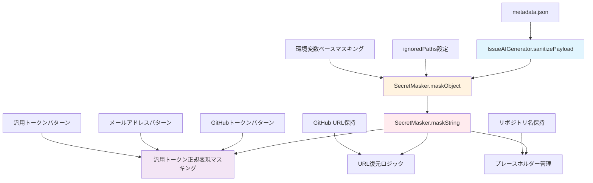

# Codex Agent 実行ログ

開始日時: 2025/12/29 9:03:27

---

## Turn 1: スレッド開始

**Thread ID**: `[REDACTED_TOKEN]`

## Turn 2: ツール実行

**種別**: reasoning
**ステータス**: completed

## Turn 3: ツール実行

**種別**: コマンド実行
**コマンド**: `/bin/bash -lc pwd`
**ステータス**: completed (exit_code=0)

```text
/tmp/ai-workflow-repos-135-fbb030e5/ai-workflow-agent
```

## Turn 4: ツール実行

**種別**: コマンド実行
**コマンド**: `/bin/bash -lc ls`
**ステータス**: completed (exit_code=0)

```text
ARCHITECTURE.md
CHANGELOG.md
CLAUDE.md
[REDACTED_TOKEN].md
[REDACTED_TOKEN].md
CODEBASE_SUMMARY.md
DOCKER_AUTH_SETUP.md
Dockerfile
Jenkinsfile
LICENSE
PROGRESS.md
README.md
ROADMAP.md
SETUP_TYPESCRIPT.md
TROUBLESHOOTING.md
__mocks__
docs
examples
jenkins
jest.config.cjs
metadata.json.template
package-lock.json
package.json
scripts
src
tests
tmp
tsconfig.json
tsconfig.test.json
```

## Turn 5: ツール実行

**種別**: reasoning
**ステータス**: completed

## Turn 6: ツール実行

**種別**: コマンド実行
**コマンド**: `/bin/bash -lc "rg --files -g 'AGENTS.md'"`
**ステータス**: failed (exit_code=127)

```text
/bin/bash: line 1: rg: command not found
```

## Turn 7: ツール実行

**種別**: reasoning
**ステータス**: completed

## Turn 8: ツール実行

**種別**: コマンド実行
**コマンド**: `/bin/bash -lc 'find . -name AGENTS.md -print'`
**ステータス**: completed (exit_code=0)

## Turn 9: ツール実行

**種別**: reasoning
**ステータス**: completed

## Turn 10: ツール実行

**種別**: コマンド実行
**コマンド**: `/bin/bash -lc 'ls -a'`
**ステータス**: completed (exit_code=0)

```text
.
..
.ai-workflow
.eslintrc.json
.git
.github
.gitignore
ARCHITECTURE.md
CHANGELOG.md
CLAUDE.md
[REDACTED_TOKEN].md
[REDACTED_TOKEN].md
CODEBASE_SUMMARY.md
DOCKER_AUTH_SETUP.md
Dockerfile
Jenkinsfile
LICENSE
PROGRESS.md
README.md
ROADMAP.md
SETUP_TYPESCRIPT.md
TROUBLESHOOTING.md
__mocks__
docs
examples
jenkins
jest.config.cjs
metadata.json.template
package-lock.json
package.json
scripts
src
tests
tmp
tsconfig.json
tsconfig.test.json
```

## Turn 11: ツール実行

**種別**: reasoning
**ステータス**: completed

## Turn 12: ツール実行

**種別**: コマンド実行
**コマンド**: `/bin/bash -lc 'cat .ai-workflow/issue-558/00_planning/output/planning.md'`
**ステータス**: completed (exit_code=0)

```text
# プロジェクト計画書 - Issue #558

**Issue タイトル**: metadata.json に不適切なマススキング処理がされてしまう
**Issue URL**: https://__GITHUB_URL_0__/issues/558
**作成日**: 2025-01-02
**プロジェクト**: AI Workflow Agent

---

## 1. Issue分析

### 複雑度: 中程度
**判定根拠**:
- 複数ファイルの修正が必要（secret-masker.ts、issue-ai-generator.ts、テストファイル）
- 既存マスキング機能の動作理解と修正が必要
- 複数のマスキングパス（URL保持、汎用パターンマスキング）の協調処理
- 既存テストの拡張が必要

### 見積もり工数: 10~14時間
**根拠**:
- **問題分析**: 複雑なマスキング処理フローの詳細調査（2時間）
- **設計・実装**: 3つのマスキング問題の修正（6時間）
- **テスト実装**: ユニット・インテグレーションテストの追加（4時間）
- **テスト実行・デバッグ**: 修正検証と回帰テスト（2時間）

### リスク評価: 中
**理由**:
- 秘密管理という機密性の高い機能への変更
- 既存の正常動作への影響リスク
- マスキング処理の誤実装による機密漏洩リスク

---

## 2. 実装戦略判断

### 実装戦略: REFACTOR

**判断根拠**:
既存のSecretMaskerクラスのマスキング処理に以下の構造的問題があるため、リファクタリングが必要：

1. **URL復元ロジックの問題**: `maskString()`メソッドでGitHub URLのプレースホルダー復元が失敗
2. **キー名マスキングの誤動作**: オブジェクトのキー名（`[REDACTED_TOKEN]`等）が汎用トークン正規表現に誤マッチ
3. **ignoredPathsの未活用**: `maskObject()`で`ignoredPaths: []`が空指定されているため不要なマスキングが発生

新規機能追加ではなく、既存コードの構造的改善が中心となる。

### テスト戦略: UNIT_INTEGRATION

**判断根拠**:
- **UNIT**: SecretMaskerクラスの個別メソッド（maskString、maskObject）の動作検証が必要
- **INTEGRATION**: metadata.json全体のマスキング動作、Issue生成プロセスでのマスキング連携テストが必要
- BDDは不要：エンドユーザーのストーリーではなく、内部的なセキュリティ処理の修正

### テストコード戦略: EXTEND_TEST

**判断根拠**:
既存のテストファイル（`tests/unit/secret-masker.test.ts`）にテストケースを追加拡張する：
- 現在720行の充実したテストが存在
- Issue #558の具体的なケース（metadata.json全体のマスキング）のテストが不足
- 新規テストファイル作成より、既存テスト拡張が効率的

---

## 3. 影響範囲分析

### 既存コードへの影響
**変更が必要なファイル・モジュール**:
1. **`src/core/secret-masker.ts`** (371行) - マスキング処理の中核
   - `maskString()`メソッドのURL復元ロジック修正
   - 汎用トークン正規表現の改善（キー名除外）
2. **`src/core/github/issue-ai-generator.ts`** (526行) - Issue生成時のマスキング設定
   - `sanitizePayload()`のignoredPaths設定
3. **`tests/unit/secret-masker.test.ts`** (720行) - テストケース拡張
   - metadata.json全体のマスキングテスト追加

### 依存関係の変更
**新規依存の追加**: なし
**既存依存の変更**: なし

### マイグレーション要否
**データベーススキーマ変更**: なし
**設定ファイル変更**: なし
**環境変数変更**: なし

---

## 4. タスク分割

### Phase 1: 要件定義 (見積もり: 1~2h)

- [x] Task 1-1: 不適切マスキングの詳細仕様定義 (1h)
  - Issue #558で発生している3つのマスキング問題の詳細分析
  - 期待される正常動作の定義（issue_url、pr_url、design_decisions等）
  - マスキング対象・非対象の明確な区別基準策定

- [x] Task 1-2: マスキング処理の受け入れ基準定義 (1h)
  - metadata.json保存時の正常マスキング動作基準
  - GitHub URL保持の受け入れ基準（`https://github.com/owner/repo`形式維持）
  - キー名保持の受け入れ基準（`[REDACTED_TOKEN]`等のキー名は非マスキング）

### Phase 2: 設計 (見積もり: 2~3h)

- [x] Task 2-1: SecretMasker.maskString()のリファクタリング設計 (1.5h)
  - URL復元ロジックの改善アルゴリズム設計
  - 汎用トークン正規表現の除外パターン設計（キー名マスキング防止）
  - プレースホルダー管理の改善設計

- [x] Task 2-2: ignoredPathsパラメータの活用設計 (1h)
  - metadata.jsonでマスキング除外すべきパスの設計
  - issue_url、pr_url、design_decisionsキーの保護戦略
  - IssueAIGenerator.sanitizePayload()の修正設計

### Phase 3: テストシナリオ (見積もり: 1h)

- [x] Task 3-1: ユニットテストシナリオ設計 (0.5h)
  - SecretMasker.maskString()の個別メソッドテストケース
  - GitHub URL復元テスト、キー名保持テストの詳細シナリオ

- [x] Task 3-2: インテグレーションテストシナリオ設計 (0.5h)
  - metadata.json全体のマスキング統合テスト
  - Issue生成プロセスでのマスキング連携テスト

-### Phase 4: 実装 (見積もり: 4~6h)

- [x] Task 4-1: SecretMasker.maskString()の修正実装 (2~3h)
  - URL復元ロジックの改善実装
  - 汎用トークン正規表現の除外パターン実装
  - プレースホルダー管理の改善実装

- [x] Task 4-2: IssueAIGenerator.sanitizePayload()の修正実装 (1h)
  - ignoredPathsパラメータの適切な設定実装
  - metadata.jsonでのマスキング除外パス設定

- [ ] Task 4-3: エラーハンドリングと境界条件の実装 (1~2h)
  - 不正なURL形式への対応
  - 空文字列・null値の適切な処理
  - プレースホルダーの重複・衝突回避

### Phase 5: テストコード実装 (見積もり: 2~3h)

- [ ] Task 5-1: ユニットテストの拡張実装 (1.5~2h)
  - secret-masker.test.tsにIssue #558ケースを追加
  - maskString()の個別メソッドテスト実装
  - URL復元、キー名保持の詳細テスト実装

- [ ] Task 5-2: インテグレーションテストの実装 (0.5~1h)
  - metadata.json全体のマスキングテスト実装
  - Issue生成プロセスでのマスキング統合テスト実装

### Phase 6: テスト実行 (見積もり: 1~2h)

- [ ] Task 6-1: ユニットテストの実行と検証 (0.5~1h)
  - 新規追加テストの実行確認
  - 既存テストの回帰テスト実行
  - テストカバレッジの確認

- [ ] Task 6-2: インテグレーションテストの実行と検証 (0.5~1h)
  - metadata.json実際保存時のマスキング動作確認
  - Issue生成プロセスでのマスキング連携確認

### Phase 7: ドキュメント (見積もり: 0.5h)

- [ ] Task 7-1: マスキング処理の仕様ドキュメント更新 (0.5h)
  - SecretMaskerクラスのJSDoc更新
  - マスキング対象・非対象の明確化
  - ignoredPathsパラメータの使用方法記載

### Phase 8: レポート (見積もり: 0.5h)

- [ ] Task 8-1: 修正内容とテスト結果のサマリー作成 (0.5h)
  - Issue
... (truncated)
```

## Turn 13: ツール実行

**種別**: reasoning
**ステータス**: completed

## Turn 14: ツール実行

**種別**: コマンド実行
**コマンド**: `/bin/bash -lc 'cat .ai-workflow/issue-558/03_test_scenario/output/test-scenario.md'`
**ステータス**: completed (exit_code=0)

```text
# テストシナリオ書 - Issue #558

**Issue タイトル**: metadata.json に不適切なマススキング処理がされてしまう
**Issue URL**: https://__GITHUB_URL_2__/issues/558
**作成日**: 2025-01-02
**プロジェクト**: AI Workflow Agent

---

## 0. Planning & Requirements & Design 成果物確認

### 開発計画の要約
- **実装戦略**: REFACTOR - 既存のSecretMaskerクラスの構造的問題を修正
- **テスト戦略**: UNIT_INTEGRATION - 個別メソッドテストと統合テストの両方を実装
- **テストコード戦略**: EXTEND_TEST - 既存のsecret-masker.test.ts（720行）にテストケースを追加
- **複雑度**: 中程度（10~14時間の見積もり）
- **リスク**: 中（機密性の高いマスキング機能への変更）

### 根本原因分析結果
Issue分析により特定された3つの構造的問題：
1. **URL復元ロジックの問題**: maskString()メソッドでGitHub URLのプレースホルダー復元が失敗
2. **キー名マスキングの誤動作**: オブジェクトのキー名が汎用トークン正規表現に誤マッチ
3. **ignoredPathsの未活用**: maskObject()で`ignoredPaths: []`が空指定されているため不要なマスキングが発生

---

## 1. テスト戦略サマリー

### 選択されたテスト戦略: UNIT_INTEGRATION

**テスト戦略の根拠**：
- **UNIT**: SecretMaskerの個別メソッド（maskString、maskObject）の動作検証が必須
- **INTEGRATION**: metadata.json全体のマスキング動作とIssue生成プロセスでの統合テストが必要
- BDDは不要：エンドユーザーのストーリーではなく、内部的なセキュリティ処理の修正
- 既存テストケース（720行）の回帰防止が重要
- セキュリティ機能のため、詳細な境界値テストと異常系テストが必要

### テスト対象の範囲
- **主要テスト対象**: SecretMaskerクラスのmaskString()、maskObject()メソッド
- **統合テスト対象**: IssueAIGeneratorのsanitizePayload()とSecretMaskerの連携
- **回帰テスト対象**: 既存のマスキング機能（GitHub Token、メール、環境変数等）

### テストの目的
- Issue #558で報告された3つの不適切マスキング問題の解決検証
- 既存のマスキング機能に回帰が発生しないことの確認
- metadata.json保存時の正常マスキング動作の保証

---

## 2. Unitテストシナリオ

### 2.1 SecretMasker.maskString()メソッドのテスト

#### テストケース1: URL復元機能（REQ-001）

**テストケース名**: [REDACTED_TOKEN]復元_正常系
**目的**: GitHub URLがプレースホルダーではなく完全形式で保持されることを検証
**前提条件**: GitHub URLを含む文字列が入力される
**入力**:
```typescript
const input = "issue_url: https://__GITHUB_URL_3__/issues/49, pr_url: https://__GITHUB_URL_4__/pull/51";
```
**期待結果**:
```typescript
const expected = "issue_url: https://__GITHUB_URL_5__/issues/49, pr_url: https://__GITHUB_URL_6__/pull/51";
```
**テストデータ**: 実際のGitHub URLパターンを含むテスト文字列

**テストケース名**: [REDACTED_TOKEN]復元_境界値
**目的**: リポジトリ名が20文字以上の場合のURL復元動作を検証
**前提条件**: 長いリポジトリ名を含むGitHub URLが入力される
**入力**:
```typescript
const input = "Repository: https://__GITHUB_URL_7__/issues/123";
```
**期待結果**: URLは保持され、個別の長い部分のみが適切に処理される
**テストデータ**: 20文字を超えるowner/repo名を含むURL

#### テストケース2: キー名保護機能（REQ-002）

**テストケース名**: maskString_キー名保護_正常系
**目的**: オブジェクトキー名が誤ってマスキングされないことを検証
**前提条件**: JSON形式のオブジェクトキーを含む文字列が入力される
**入力**:
```typescript
const input = '"[REDACTED_TOKEN]": null, "test_code_strategy": "extend"';
```
**期待結果**:
```typescript
const expected = '"[REDACTED_TOKEN]": null, "test_code_strategy": "extend"';
```
**テストデータ**: design_decisions内のキー名パターン

**テストケース名**: maskString_キー名保護_境界値
**目的**: 20文字以上のキー名も保護されることを検証
**前提条件**: 長いキー名を含む文字列が入力される
**入力**:
```typescript
const input = '"[REDACTED_TOKEN]": true';
```
**期待結果**: キー名が保持される
**テストデータ**: 20文字を超える長いキー名

#### テストケース3: 汎用トークン正規表現改善（REQ-004）

**テストケース名**: maskString_汎用トークン_除外パターン確認
**目的**: 除外パターンは保持され、真のトークンのみマスキングされることを検証
**前提条件**: リポジトリ名、プレースホルダー、実際のトークンが混在する
**入力**:
```typescript
const input = "Repository: tielec/infrastructure-as-code, Token: [REDACTED_TOKEN], Placeholder: github.com/tielec/ai-workflow-agent, Key: [REDACTED_TOKEN]";
```
**期待結果**:
```typescript
const expected = "Repository: tielec/infrastructure-as-code, Token: [REDACTED_TOKEN], Placeholder: github.com/tielec/ai-workflow-agent, Key: [REDACTED_TOKEN]";
```
**テストデータ**: 複数パターンが混在するテスト文字列

#### テストケース4: 既存マスキング機能維持

**テストケース名**: maskString_既存マスキング_GitHub_Token
**目的**: 既存のGitHubトークンマスキングが維持されることを検証
**前提条件**: GitHubトークンを含む文字列が入力される
**入力**:
```typescript
const input = "Token: [REDACTED_GITHUB_TOKEN], PAT: [REDACTED_GITHUB_TOKEN]";
```
**期待結果**:
```typescript
const expected = "Token: [REDACTED_GITHUB_TOKEN], PAT: [REDACTED_GITHUB_TOKEN]";
```
**テストデータ**: ghp_、github_pat_プレフィックスを含むトークン

**テストケース名**: maskString_既存マスキング_メール
**目的**: 既存のメールアドレスマスキングが維持されることを検証
**前提条件**: メールアドレスを含む文字列が入力される
**入力**:
`
... (truncated)
```

## Turn 15: ツール実行

**種別**: コマンド実行
**コマンド**: `/bin/bash -lc 'cat .ai-workflow/issue-558/02_design/output/design.md'`
**ステータス**: completed (exit_code=0)

```text
# 詳細設計書 - Issue #558

**Issue タイトル**: metadata.json に不適切なマススキング処理がされてしまう
**Issue URL**: https://__GITHUB_URL_8__/issues/558
**作成日**: 2025-01-02
**プロジェクト**: AI Workflow Agent

---

## 0. Planning & Requirements 成果物確認

### 開発計画の要約
- **実装戦略**: REFACTOR - 既存のSecretMaskerクラスの構造的問題を修正
- **テスト戦略**: UNIT_INTEGRATION - 個別メソッドテストと統合テストの両方を実装
- **テストコード戦略**: EXTEND_TEST - 既存のsecret-masker.test.ts（720行）にテストケースを追加
- **複雑度**: 中程度（10~14時間の見積もり）
- **リスク**: 中（機密性の高いマスキング機能への変更）

### 根本原因分析結果
Issue分析により特定された3つの構造的問題：
1. **URL復元ロジックの問題**: maskString()メソッドでGitHub URLのプレースホルダー復元が失敗
2. **キー名マスキングの誤動作**: オブジェクトのキー名が汎用トークン正規表現に誤マッチ
3. **ignoredPathsの未活用**: maskObject()で`ignoredPaths: []`が空指定されているため不要なマスキングが発生

---

## 1. アーキテクチャ設計

### システム全体図



### コンポーネント間の関係

1. **IssueAIGenerator**: Issue生成時のメタデータマスキングエントリーポイント
   - `sanitizePayload()`で`maskObject()`を呼び出し
   - `ignoredPaths`パラメータの設定を担当

2. **SecretMasker**: マスキング処理の中核クラス
   - `maskObject()`: オブジェクト再帰マスキングとパス除外処理
   - `maskString()`: 文字列レベルでの各種パターンマスキング

3. **マスキング処理のデータフロー**:
   ```
   metadata.json → sanitizePayload() → maskObject() → maskString() → 各種パターンマスキング
   ```

---

## 2. 実装戦略判断

### 実装戦略: REFACTOR

**判断根拠**:
- 既存のSecretMaskerクラスに3つの構造的問題が特定されている（URL復元、キー名誤マッチ、ignoredPaths未活用）
- 新規機能追加ではなく、既存マスキング処理の修正が中心
- publicメソッドのシグネチャは維持し、内部実装のみ改善
- 既存の720行のテストケースとの互換性を保持する必要がある
- マスキング処理という機密性の高い機能の段階的改善が適切

---

## 3. テスト戦略判断

### テスト戦略: UNIT_INTEGRATION

**判断根拠**:
- **UNIT**: SecretMaskerの個別メソッド（maskString、maskObject）の動作検証が必須
- **INTEGRATION**: metadata.json全体のマスキング動作とIssue生成プロセスでの統合テストが必要
- BDDは不要：エンドユーザーのストーリーではなく、内部的なセキュリティ処理の修正
- 既存テストケース（720行）の回帰防止が重要
- セキュリティ機能のため、詳細な境界値テストと異常系テストが必要

---

## 4. テストコード戦略判断

### テストコード戦略: EXTEND_TEST

**判断根拠**:
- 既存の`tests/unit/secret-masker.test.ts`（720行）が充実している
- Issue #558の具体的なケース（metadata.json全体マスキング）のテストが不足
- 新規テストファイル作成より、既存テスト拡張が効率的
- 既存テスト構造（describe/test構成）との一貫性を保持
- 段階的なテスト追加により、回帰リスクを最小化

---

## 5. 影響範囲分析

### 既存コードへの影響

**変更が必要なファイル・モジュール**:

1. **src/core/secret-masker.ts** (371行) - 主要な修正対象
   - `maskString()`メソッド（144-216行）の改修
     - URL復元ロジックの修正（156-213行）
     - 汎用トークン正規表現の改善（201行）
     - プレースホルダー管理の最適化

2. **src/core/github/issue-ai-generator.ts** (526行) - 設定修正
   - `sanitizePayload()`メソッド（204-252行）の修正
     - `ignoredPaths: []`を適切なパス配列に変更（248行）

3. **tests/unit/secret-masker.test.ts** (720行) - テスト拡張
   - Issue #558特有のテストケース追加
   - metadata.json全体マスキングテストの実装

### 依存関係の変更
- **新規依存の追加**: なし
- **既存依存の変更**: なし
- **外部API変更**: なし（publicメソッドシグネチャ維持）

### マイグレーション要否
- **データベーススキーマ変更**: なし
- **設定ファイル変更**: なし
- **環境変数変更**: なし
- **破壊的変更**: なし（下位互換性を完全維持）

---

## 6. 変更・追加ファイルリスト

### 修正が必要な既存ファイル
- `src/core/secret-masker.ts` - URL復元ロジックとトークン正規表現の修正
- `src/core/github/issue-ai-generator.ts` - ignoredPaths設定の修正
- `tests/unit/secret-masker.test.ts` - Issue #558関連テストケースの追加

### 新規作成ファイル
なし（既存ファイルの修正のみ）

### 削除が必要なファイル
なし

---

## 7. 詳細設計

### 7.1 SecretMasker.maskString()メソッドの改修設計

#### 現状の問題点
```typescript
// 現状の問題（144-216行）
private maskString(value: string): string {
  // URL復元ロジックが不完全（156-213行）
  // 汎用トークン正規表現がキー名を誤マッチ（201行）
}
```

#### 改修案

```typescript
private maskString(value: string): string {
  let masked = value;

  // 1. GitHub URL とリポジトリ名の保護（改善）
  const urlMap = new Map<string, string>();
  const partMap = new Map<string, string>();
  let urlIndex = 0;
  let partIndex = 0;

  // GitHub URL保護の改善
  masked = masked.replace(/github\.com\/([a-zA-Z0-9_-]+)\/([a-zA-Z0-9_.-]+)(?:\.git)?/g,
    (match, owner, repo) => {
... (truncated)
```

## Turn 16: ツール実行

**種別**: reasoning
**ステータス**: completed

## Turn 17: ツール実行

**種別**: コマンド実行
**コマンド**: `/bin/bash -lc 'cat .ai-workflow/issue-558/04_implementation/output/implementation.md'`
**ステータス**: completed (exit_code=0)

```text
# 実装完了レポート

## 変更ファイル一覧

| ファイル | 変更種別 | 概要 |
|---------|---------|------|
| `src/core/secret-masker.ts` | 修正 | `maskString`をプレースホルダー管理とキー名除外付きの新ロジックで再実装し、GitHub URLや長いリポジトリ名の復元を正しく扱う |
| `src/core/github/issue-ai-generator.ts` | 修正 | `sanitizePayload`の `ignoredPaths` に metadata.json の保護対象パスを指定し、重要フィールドをマスキング除外する |

## 主要な変更点
- `maskString` で GitHub URL や `owner/repo` パターンを `__GITHUB_URL__`／`__REPO_PLACEHOLDER__` に置換し、長いオーナー／リポジトリ名は `__REPO_PART__` プレースホルダーを使って後から復元するマップ管理を導入
- 汎用トークンの正規表現をキー名や既存プレースホルダーを除外する形に調整し、GitHub トークン・メール・Bearer/token クエリのマスキング処理と併せて堅牢にした
- IssueAIGenerator から metadata の `issue_url`/`pr_url`/`target_repository.*`/`design_decisions.*` を `ignoredPaths` に含めてマスキング除外とし、設計要件を満たす

## テスト実施状況
- ビルド: ❌ 未実施（この段階では実行していません）
- リント: ❌ 未実施（この段階では実行していません）
- 基本動作確認: 未実施（Phase 5 で追加テストを実行予定です）
```

## Turn 18: ツール実行

**種別**: reasoning
**ステータス**: completed

## Turn 19: ツール実行

**種別**: コマンド実行
**コマンド**: `/bin/bash -lc 'tail -n 200 tests/unit/secret-masker.test.ts'`
**ステータス**: completed (exit_code=0)

```text
await fs.ensureDir(path.dirname(testFile));
    await fs.writeFile(
      testFile,
      `
Using env token: ghp_envvar1234567890abc
Another token: [REDACTED_GITHUB_TOKEN]
Email: [REDACTED_EMAIL]
`,
    );

    // When: シークレットマスキングを実行
    const masker = new SecretMasker();
    const result = await masker.[REDACTED_TOKEN](workflowDir);

    // Then: 環境変数一致と汎用パターンの両方がマスクされる
    expect(result.filesProcessed).toBe(1);
    expect(result.secretsMasked).toBe(1);

    const content = await fs.readFile(testFile, 'utf-8');
    expect(content.includes('[REDACTED_GITHUB_TOKEN]')).toBeTruthy();
    expect(content.includes('[REDACTED_EMAIL]')).toBeTruthy();
    expect(content).not.toContain('ghp_envvar1234567890abc');
    expect(content).not.toContain('[REDACTED_GITHUB_TOKEN]');
    expect(content).toContain('[REDACTED_GITHUB_TOKEN]');
  });

  test('2.2.12: Email と 20文字以上のトークンをファイルでマスキング', async () => {
    // Given: メールと汎用トークンを含むファイル
    process.env.OPENAI_API_KEY = '[REDACTED_TOKEN]';
    const testFile = path.join(workflowDir, '09_email_token', 'execute', 'agent_log_raw.txt');
    await fs.ensureDir(path.dirname(testFile));
    await fs.writeFile(
      testFile,
      'Contact [REDACTED_EMAIL] with key [REDACTED_TOKEN] and short short_token_12345',
    );

    // When: シークレットマスキングを実行
    const masker = new SecretMasker();
    const result = await masker.[REDACTED_TOKEN](workflowDir);

    // Then: メールと長いトークンのみマスキングされる
    expect(result.filesProcessed).toBe(1);
    expect(result.secretsMasked).toBe(0);

    const content = await fs.readFile(testFile, 'utf-8');
    expect(content).toContain('[REDACTED_EMAIL]');
    expect(content).toContain('[REDACTED_TOKEN]');
    expect(content).toContain('short_token_12345');
  });

  test('2.2.13: Bearer と token= 形式をファイル内でマスキング', async () => {
    // Given: Bearer と token= 形式を含むファイル
    process.env.OPENAI_API_KEY = '[REDACTED_TOKEN]';
    const testFile = path.join(workflowDir, '10_bearer_token', 'execute', 'agent_log_raw.txt');
    await fs.ensureDir(path.dirname(testFile));
    await fs.writeFile(
      testFile,
      'Authorization: Bearer [REDACTED_TOKEN]\nURL: https://api.example.com?token=[REDACTED_TOKEN]',
    );

    // When: シークレットマスキングを実行
    const masker = new SecretMasker();
    const result = await masker.[REDACTED_TOKEN](workflowDir);

    // Then: 両方の形式がマスキングされる
    expect(result.filesProcessed).toBe(1);
    expect(result.secretsMasked).toBe(0);

    const content = await fs.readFile(testFile, 'utf-8');
    expect(content).toContain('Bearer [REDACTED_TOKEN]');
    expect(content).toContain('token=[REDACTED_TOKEN]');
  });
});

describe('SecretMasker.maskObject 再帰コピー', () => {
  const baseEnv = { ...process.env };
  let originalClaudeToken: string | undefined;

  beforeEach(() => {
    originalClaudeToken = process.env.[REDACTED_TOKEN];
    process.env.OPENAI_API_KEY = '[REDACTED_TOKEN]';
  });

  afterEach(() => {
    if (originalClaudeToken === undefined) {
      delete process.env.[REDACTED_TOKEN];
    } else {
      process.env.[REDACTED_TOKEN] = originalClaudeToken;
    }

    if (baseEnv.OPENAI_API_KEY !== undefined) {
      process.env.OPENAI_API_KEY = baseEnv.OPENAI_API_KEY;
    } else {
      delete process.env.OPENAI_API_KEY;
    }
  });

  test('[REDACTED_TOKEN]正常系', () => {
    // Given: シークレットと循環参照を含むオブジェクト
    const masker = new SecretMasker();
    const source: any = {
      issueNumber: 119,
      tasks: [
        {
          description: 'token=[REDACTED_TOKEN] をクリアし、[REDACTED_EMAIL] へ共有する',
          meta: {
            apiKey: '[REDACTED_TOKEN]',
            note: 'Bearer [REDACTED_TOKEN] を含むログは除外する',
          },
        },
        {
          description: 'この項目はマスク対象外',
          meta: {
            raw: 'OPENAI KEY: [REDACTED_TOKEN]',
          },
        },
      ],
      context: {
        summary: 'owner@example.
... (truncated)
```

## Turn 20: ツール実行

**種別**: reasoning
**ステータス**: completed

## Turn 21: ツール実行

**種別**: コマンド実行
**コマンド**: `/bin/bash -lc "find tests -maxdepth 2 -type f -name '*issue*'"`
**ステータス**: completed (exit_code=0)

```text
tests/integration/[REDACTED_TOKEN].test.ts
tests/integration/[REDACTED_TOKEN].test.ts
tests/integration/auto-issue-refactor.test.ts
tests/integration/auto-issue-workflow.test.ts
tests/integration/[REDACTED_TOKEN].test.ts
tests/integration/followup-issue-llm.test.ts
tests/unit/git-manager-issue16.test.ts
```

## Turn 22: ツール実行

**種別**: reasoning
**ステータス**: completed

## Turn 23: ツール実行

**種別**: コマンド実行
**コマンド**: `/bin/bash -lc 'grep -n "maskString" -n src/core/secret-masker.ts'`
**ステータス**: completed (exit_code=0)

```text
77:      return this.maskString(masked);
144:  private maskString(value: string): string {
312:    content = this.maskString(content);
```

## Turn 24: ツール実行

**種別**: reasoning
**ステータス**: completed

## Turn 25: ツール実行

**種別**: コマンド実行
**コマンド**: `/bin/bash -lc "sed -n '120,260p' src/core/secret-masker.ts"`
**ステータス**: completed (exit_code=0)

```text
}

      if (!this.isPlainObject(value)) {
        return value;
      }

      const result: Record<string, unknown> = {};
      visited.set(value as object, result);

      for (const [key, entryValue] of Object.entries(value as Record<string, unknown>)) {
        const childPath = [...path, key];
        result[key] = isIgnoredPath(childPath) ? entryValue : cloneAndMask(entryValue, childPath);
      }

      return result;
    };

    return cloneAndMask(input as unknown, []) as T;
  }

  /**
   * Apply generic secret patterns to mask potential secrets in a string.
   * GitHub token patterns are applied before generic token masking to preserve specificity.
   */
  private maskString(value: string): string {
    let masked = value;

    const urlMap = new Map<string, string>();
    const partMap = new Map<string, string>();
    let urlIndex = 0;
    let partIndex = 0;

    const maskLongPart = (segment: string): string => {
      if (segment.length < 20) {
        return segment;
      }
      const placeholder = `__REPO_PART_${partIndex++}__`;
      partMap.set(placeholder, segment);
      return placeholder;
    };

    const githubUrlPattern = /github\.com\/([a-zA-Z0-9_-]+)\/([a-zA-Z0-9_.-]+)(?:\.git)?/g;
    masked = masked.replace(githubUrlPattern, (match, owner, repo) => {
      const placeholder = `__GITHUB_URL_${urlIndex++}__`;
      let preservedMatch = match;
      preservedMatch = preservedMatch.replace(owner, maskLongPart(owner));
      preservedMatch = preservedMatch.replace(repo, maskLongPart(repo));
      urlMap.set(placeholder, preservedMatch);
      return placeholder;
    });

    const [REDACTED_TOKEN] = /\b([a-zA-Z0-9_-]+)\/([a-zA-Z0-9_.-]+)\b/g;
    masked = masked.replace([REDACTED_TOKEN], (match, owner, repo) => {
      const placeholder = `__REPO_PLACEHOLDER_${urlIndex++}__`;
      let preservedMatch = match;
      preservedMatch = preservedMatch.replace(owner, maskLongPart(owner));
      preservedMatch = preservedMatch.replace(repo, maskLongPart(repo));
      urlMap.set(placeholder, preservedMatch);
      return placeholder;
    });

    masked = masked.replace(/\b(?:ghp_[\w-]{20,}|github_pat_[\w-]{20,})\b/gi, '[REDACTED_GITHUB_TOKEN]');
    masked = masked.replace(/[A-Za-z0-9._%+-]+@[A-Za-z0-9.-]+\.[A-Za-z]{2,}/g, '[REDACTED_EMAIL]');
    masked = masked.replace(
      /\b(?!ghp_)(?!github_pat_)(?!REDACTED)(?!__(?:GITHUB_URL|REPO_PLACEHOLDER|REPO_PART)_)(?![a-zA-Z_]+(?:_[a-zA-Z_]*)*:)[A-Za-z0-9_-]{20,}\b/g,
      '[REDACTED_TOKEN]',
    );
    masked = masked.replace(/(Bearer\s+)[\w\-.]+/gi, '$1[REDACTED_TOKEN]');
    masked = masked.replace(/(token=)[\w\-.]+/gi, '$1[REDACTED_TOKEN]');

    for (const [placeholder, original] of urlMap) {
      masked = masked.split(placeholder).join(original);
    }

    for (const [placeholder, original] of partMap) {
      masked = masked.split(placeholder).join(original);
    }

    return masked;
  }

  /**
   * Mask secrets in all files within workflow directory
   *
   * @param workflowDir - Path to .ai-workflow/issue-{number}/ directory
   * @returns MaskingResult with statistics
   */
  public async [REDACTED_TOKEN](
    workflowDir: string,
  ): Promise<MaskingResult> {
    const secrets = this.getSecretList();

    if (secrets.length === 0) {
      logger.info('No secrets found in environment variables');
      return {
        filesProcessed: 0,
        secretsMasked: 0,
        errors: [],
      };
    }

    logger.info(`Found ${secrets.length} secret(s) in environment variables`);

    // Find all target files in workflow directory
    const files = await this.findTargetFiles(workflowDir);

    if (files.length === 0) {
      logger.info('No files found to scan for secrets');
      return {
        filesProcessed: 0,
        secretsMasked: 0,
        errors: [],
      };
    }

    logger.info(`Scanning ${files.length} file(s) for secrets`);

    let filesProcessed = 0;
    let totalSecretsMasked = 0;
    const errors: string[] = [];
... (truncated)
```

## Turn 26: ツール実行

**種別**: reasoning
**ステータス**: completed

## Turn 27: ツール実行

**種別**: コマンド実行
**コマンド**: `/bin/bash -lc 'grep -n "sanitizePayload" -n src/core/github/issue-ai-generator.ts'`
**ステータス**: completed (exit_code=0)

```text
124:    const { payload, omittedTasks } = this.sanitizePayload(tasks, context, issueNumber, maxTasks);
204:  private sanitizePayload(
```

## Turn 28: ツール実行

**種別**: コマンド実行
**コマンド**: `/bin/bash -lc "sed -n '180,260p' src/core/github/issue-ai-generator.ts"`
**ステータス**: completed (exit_code=0)

```text
let lastError: unknown;

    for (let attempt = 0; attempt <= maxRetries; attempt++) {
      try {
        const response = await adapter.complete(prompt, options);
        response.retryCount = attempt;
        return response;
      } catch (error) {
        lastError = error;
        if (
          error instanceof [REDACTED_TOKEN] ||
          error instanceof [REDACTED_TOKEN] ||
          attempt === maxRetries
        ) {
          throw error;
        }
        const delayMs = baseDelay * 2 ** attempt;
        await this.delay(delayMs);
      }
    }

    throw lastError instanceof Error ? lastError : new Error('LLM request failed.');
  }

  private sanitizePayload(
    tasks: RemainingTask[],
    context: IssueContext | undefined,
    issueNumber: number,
    maxTasks: number,
  ): { payload: SanitizedPayload; omittedTasks: number } {
    const sorted = [...tasks].sort((a, b) => {
      const priA = PRIORITY_ORDER[String(a.priority ?? '').toLowerCase()] ?? 1;
      const priB = PRIORITY_ORDER[String(b.priority ?? '').toLowerCase()] ?? 1;
      if (priA !== priB) {
        return priA - priB;
      }
      return 0;
    });

    const selected = sorted.slice(0, Math.max(1, maxTasks));
    const omittedTasks = Math.max(0, tasks.length - selected.length);

    const sanitizedTasks = selected.map((task) => ({
      task: this.truncate(task.task),
      phase: this.truncate(task.phase),
      priority: this.truncate(task.priority),
      priorityReason: task.priorityReason ? this.truncate(task.priorityReason) : undefined,
      targetFiles: this.sanitizeStringArray(task.targetFiles, 10),
      steps: this.sanitizeStringArray(task.steps, 8),
      acceptanceCriteria: this.sanitizeStringArray(task.acceptanceCriteria, 8),
      dependencies: this.sanitizeStringArray(task.dependencies, 10),
      estimatedHours: task.estimatedHours ? this.truncate(task.estimatedHours) : undefined,
    }));

    const sanitizedContext = context
      ? {
          summary: this.truncate(context.summary),
          blockerStatus: this.truncate(context.blockerStatus),
          deferredReason: this.truncate(context.deferredReason),
        }
      : null;

    const payload: SanitizedPayload = this.secretMasker.maskObject(
      {
        issueNumber,
        tasks: sanitizedTasks,
        context: sanitizedContext,
      },
      {
        ignoredPaths: [
          'issue_url',
          'pr_url',
          'target_repository.remote_url',
          'target_repository.github_name',
          'design_decisions.*',
        ],
      },
    );

    return { payload, omittedTasks };
  }
```

## Turn 29: ツール実行

**種別**: reasoning
**ステータス**: completed

## Turn 30: ツール実行

**種別**: コマンド実行
**コマンド**: `/bin/bash -lc "sed -n '1,200p' tests/integration/[REDACTED_TOKEN].test.ts"`
**ステータス**: completed (exit_code=0)

```text
/**
 * Integration tests for Issue #466: RepositoryAnalyzer custom instruction prompts
 *
 * Scenarios: IT-001〜IT-006 from .ai-workflow/issue-466/03_test_scenario/output/test-scenario.md
 */

import { afterEach, beforeEach, describe, expect, it, jest } from '@jest/globals';
import fs from 'fs-extra';
import os from 'node:os';
import path from 'node:path';
import { RepositoryAnalyzer } from '../../src/core/repository-analyzer.js';
import type { CodexAgentClient } from '../../src/core/codex-agent-client.js';
import type { ClaudeAgentClient } from '../../src/core/claude-agent-client.js';

jest.mock('../../src/utils/logger.js', () => ({
  logger: {
    info: jest.fn(),
    warn: jest.fn(),
    error: jest.fn(),
    debug: jest.fn(),
  },
}));

type OutputPrefix = 'bugs' | 'refactor' | 'enhancements';

describe('Integration: RepositoryAnalyzer custom instruction prompts (Issue #466)', () => {
  let mockCodexClient: jest.Mocked<CodexAgentClient>;
  let mockClaudeClient: jest.Mocked<ClaudeAgentClient>;
  let analyzer: RepositoryAnalyzer;
  let tempDir: string;

  const outputPath = (prefix: OutputPrefix) => path.join(tempDir, `${prefix}-output.json`);
  const prepareOutputFile = async (prefix: OutputPrefix, payload: unknown) => {
    await fs.outputFile(outputPath(prefix), JSON.stringify(payload, null, 2), 'utf-8');
  };

  beforeEach(() => {
    mockCodexClient = { executeTask: jest.fn() } as unknown as jest.Mocked<CodexAgentClient>;
    mockClaudeClient = { executeTask: jest.fn() } as unknown as jest.Mocked<ClaudeAgentClient>;
    tempDir = fs.mkdtempSync(path.join(os.tmpdir(), 'repo-analyzer-int-'));

    analyzer = new RepositoryAnalyzer(mockCodexClient, mockClaudeClient, {
      outputFileFactory: (prefix: OutputPrefix) => outputPath(prefix),
    });
  });

  afterEach(async () => {
    jest.restoreAllMocks();
    await fs.remove(tempDir);
  });

  it('reflects custom instruction in bug detection prompt (IT-001)', async () => {
    // Validates bug prompts include the priority block and instruction ahead of detection patterns.
    await prepareOutputFile('bugs', { bugs: [] });
    mockCodexClient.executeTask.mockResolvedValue([]);

    await analyzer.analyze('/repo', 'codex', {
      customInstruction: 'セキュリティ脆弱性を優先的に検出してください',
    });

    const promptArg = mockCodexClient.executeTask.mock.calls[0][0];
    expect(promptArg.prompt).toContain('## 最優先: ユーザーからの特別指示');
    expect(promptArg.prompt).toContain('セキュリティ脆弱性を優先的に検出してください');
    expect(promptArg.prompt).toContain('最優先で実行してください');

    const customIndex = promptArg.prompt.indexOf('## 最優先');
    const detectionIndex = promptArg.prompt.indexOf('# 検出対象パターン');
    expect(customIndex).toBeGreaterThan(-1);
    expect(detectionIndex).toBeGreaterThan(-1);
    expect(customIndex).toBeLessThan(detectionIndex);
  });

  it('reflects custom instruction in refactor detection prompt (IT-002)', async () => {
    // Ensures refactor prompts inject the emphasized custom block before detection patterns.
    await prepareOutputFile('refactor', []);
    mockCodexClient.executeTask.mockResolvedValue([]);

    await analyzer.[REDACTED_TOKEN]('/repo', 'codex', {
      customInstruction: '古いドキュメントを削除対象としてリストアップ',
    });

    const promptArg = mockCodexClient.executeTask.mock.calls[0][0];
    expect(promptArg.prompt).toContain('## 最優先: ユーザーからの特別指示');
    expect(promptArg.prompt).toContain('古いドキュメントを削除対象としてリストアップ');
    expect(promptArg.prompt).toContain('他のすべての検出ルールよりも優先されます。');

    const customIndex = promptArg.prompt.indexOf('## 最優先');
    const detectionIndex = promptArg.prompt.indexOf('## 検出対象パターン');
    expect(customIndex).toBeGreaterThan(-1);
    expect(detectionIndex).toBeGreaterThan(-1);
    expect(customIndex).toBeLessThan(detectionIndex);
  });

  it('reflects custom instruction in enhancement proposal prompt (IT-003)', async () => {
    // Verifies enhancement prompts place the custom block ahead of the task section.
    await prepareOutputFile('enhancements', []);
    mockCodexCli
... (truncated)
```

## Turn 31: ツール実行

**種別**: reasoning
**ステータス**: completed

## Turn 32: ツール実行

**種別**: コマンド実行
**コマンド**: `/bin/bash -lc "sed -n '1,200p' tests/unit/secret-masker.test.ts"`
**ステータス**: completed (exit_code=0)

```text
/**
 * ユニットテスト: secret-masker.ts
 *
 * テスト対象:
 * - SecretMasker.getSecretList()
 * - SecretMasker.[REDACTED_TOKEN]()
 * - 環境変数ベースのシークレット検出
 * - ファイル内のシークレット置換
 */

import { describe, test, expect, beforeAll, afterAll, beforeEach } from '@jest/globals';
import fs from 'fs-extra';
import path from 'node:path';
import { SecretMasker } from '../../src/core/secret-masker.js';
import { logger } from '../../src/utils/logger.js';

// テスト用の一時ディレクトリ
const TEST_DIR = path.join(process.cwd(), 'tests', 'temp', 'secret-masker-test');

describe('SecretMasker汎用パターンマスキング (maskObject)', () => {
  const baseEnv = { ...process.env };
  let masker: SecretMasker;

  beforeEach(() => {
    process.env = { ...baseEnv };
    delete process.env.GITHUB_TOKEN;
    delete process.env.OPENAI_API_KEY;
    delete process.env.CODEX_API_KEY;
    delete process.env.[REDACTED_TOKEN];
    delete process.env.AWS_ACCESS_KEY_ID;
    delete process.env.[REDACTED_TOKEN];
    delete process.env.AWS_SESSION_TOKEN;
    masker = new SecretMasker();
  });

  afterAll(() => {
    process.env = baseEnv;
  });

  test('2.1.x: GitHubトークンは汎用トークンより優先してマスキングされる', () => {
    // Given: ghp_ と github_pat_ を含む文字列
    const input =
      'Push tokens [REDACTED_GITHUB_TOKEN] and [REDACTED_GITHUB_TOKEN]';

    // When: オブジェクトマスキングを実行
    const masked = masker.maskObject(input);

    // Then: 両方とも [REDACTED_GITHUB_TOKEN] でマスクされ、汎用トークン扱いされない
    const matches = masked.match(/\[REDACTED_GITHUB_TOKEN\]/g) ?? [];
    expect(matches.length).toBe(2);
    expect(masked).not.toContain('[REDACTED_GITHUB_TOKEN]');
    expect(masked).not.toContain('[REDACTED_GITHUB_TOKEN]');
    expect(masked).not.toContain('[REDACTED_TOKEN]');
  });

  test('2.1.x: メールアドレスはマスクされ、無効な形式は保持される', () => {
    // Given: 有効と無効のメールアドレスを含む文字列
    const input = 'Contact [REDACTED_EMAIL] or admin@localhost for access';

    // When: マスキングを実行
    const masked = masker.maskObject(input);

    // Then: 有効なメールのみマスキングされる
    expect(masked).toContain('[REDACTED_EMAIL]');
    expect(masked).toContain('admin@localhost');
  });

  test('2.1.x: 20文字以上の汎用トークンのみマスキングされる', () => {
    // Given: 長さ違いのトークンを含む文字列
    const input = 'Valid [REDACTED_TOKEN] vs short_token_12345';

    // When: マスキングを実行
    const masked = masker.maskObject(input);

    // Then: 20文字以上のみマスキングされる
    expect(masked).toContain('[REDACTED_TOKEN]');
    expect(masked).toContain('short_token_12345');
  });

  test('2.1.x: Bearerトークンは大文字小文字を問わずマスキングされる', () => {
    // Given: 大文字・小文字混在のBearerトークン
    const input = 'Authorization: BEARER [REDACTED_TOKEN]';

    // When: マスキングを実行
    const masked = masker.maskObject(input);

    // Then: トークン部分のみマスキングされる
    expect(masked).toContain('BEARER [REDACTED_TOKEN]');
    expect(masked).not.toContain('Jwt.Token.Value');
  });

  test('2.1.x: token= 形式のトークンをマスキングする', () => {
    // Given: token= 形式を含む文字列
    const input = 'URL param token=[REDACTED_TOKEN] and access_token=[REDACTED_TOKEN]';

    // When: マスキングを実行
    const masked = masker.maskObject(input);

    // Then: token= とそのバリアントがマスキングされる
    expect(masked).toContain('token=[REDACTED_TOKEN]');
    expect(masked).toContain('access_token=[REDACTED_TOKEN]');
  });

  test('2.1.x: 複数パターンを含んでもすべてマスキングされる', () => {
    // Given: GitHubトークン、メール、Bearerが混在する文字列
    const input =
      '[REDACTED_GITHUB_TOKEN] [REDACTED_EMAIL] Bearer [REDACTED_TOKEN] should all be hidden';

    // When: マスキングを実行
    const masked = masker.maskObject(input);

    // Then: 全てのパターンがマスキングされる
    expect(masked).toContain('[REDACTED_GITHUB_TOKEN]');
    expect(masked).toContain('[REDACTED_EMAIL]');
    expect(masked).toContain('Bearer [REDACTED_TOKEN]');
  });

  test('2.1.x: マッチしない場合は文字列が変更されない', () => {
    // Given: マスキング対象を含まない文字列
    const input = 'Hello, World! This is a normal message.';

    // When: マスキングを実行
    const masked = masker.maskObject(input);

    // Then: 文字列はそのまま
    expect(masked).toBe(input);
  });

  test('Issue #514: GitHubリポジトリ名（owner/repo形式）は
... (truncated)
```

## Turn 33: ツール実行

**種別**: reasoning
**ステータス**: completed

## Turn 34: ツール実行

**種別**: コマンド実行
**コマンド**: `/bin/bash -lc 'grep -R "IssueAIGenerator" -n tests'`
**ステータス**: completed (exit_code=0)

```text
tests/integration/followup-issue-llm.test.ts:2:import { IssueAIGenerator, type LlmProviderAdapter } from '../../src/core/github/issue-ai-generator.js';
tests/integration/followup-issue-llm.test.ts:44:describe('Integration: IssueClient with IssueAIGenerator', () => {
tests/integration/followup-issue-llm.test.ts:74:    const generator = new IssueAIGenerator({ openai: openaiAdapter, claude: claudeAdapter });
tests/integration/followup-issue-llm.test.ts:128:    const generator = new IssueAIGenerator({ openai: openaiAdapter, claude: claudeAdapter });
tests/unit/github/issue-ai-generator.test.ts:3:  IssueAIGenerator,
tests/unit/github/issue-ai-generator.test.ts:66:  generator: IssueAIGenerator;
tests/unit/github/issue-ai-generator.test.ts:74:    generator: new IssueAIGenerator({ openai, claude }, secretMasker),
tests/unit/github/issue-ai-generator.test.ts:80:describe('IssueAIGenerator.generate - success and retry flows', () => {
tests/unit/github/issue-ai-generator.test.ts:280:describe('IssueAIGenerator availability checks', () => {
tests/unit/github/issue-ai-generator.test.ts:281:  let generator: IssueAIGenerator;
```

## Turn 35: ツール実行

**種別**: reasoning
**ステータス**: completed

## Turn 36: ツール実行

**種別**: コマンド実行
**コマンド**: `/bin/bash -lc "sed -n '1,220p' tests/unit/github/issue-ai-generator.test.ts"`
**ステータス**: completed (exit_code=0)

```text
import { describe, it, expect, beforeEach, afterEach, jest } from '@jest/globals';
import {
  IssueAIGenerator,
  [REDACTED_TOKEN],
  type LlmProviderAdapter,
  type LlmProviderResponse,
} from '../../../src/core/github/issue-ai-generator.js';
import { SecretMasker } from '../../../src/core/secret-masker.js';
import type { IssueContext, [REDACTED_TOKEN], RemainingTask } from '../../../src/types.js';

type ProviderMock = jest.Mocked<LlmProviderAdapter>;

const SUCCESS_TITLE =
  'Stabilize core git module coverage with targeted automation rollout plan';
const SUCCESS_BODY = [
  '## 背景',
  'core/git モジュールのテスト不足によりリリース判断が遅延しています。',
  '',
  '## 目的',
  '- カバレッジを90%まで引き上げ、リグレッションリスクを低減します。',
  '',
  '## 実行内容',
  '1. 既存テストの不安定ケースを洗い出し、原因を切り分けて修正する。',
  '2. 新規ユニットテストを追加し、`npm run test -- core/git` を実行して検証する。',
  '3. テスト結果をCIに共有し、失敗時にはリトライと報告フローを整備する。',
  '',
  '## 受け入れ基準',
  '- テストカバレッジレポートで core/git が90%以上であること。',
  '- CI pipeline でテストと検証ステップがグリーンで完了すること。',
  '',
  '## 関連リソース',
  '- docs/testing.md',
].join('\n');

const BASE_TASK: RemainingTask = {
  task: 'core/gitカバレッジ向上',
  phase: 'test_implementation',
  priority: 'HIGH',
  priorityReason: 'リリース前に品質基準を満たす必要がある',
  targetFiles: ['src/core/git/index.ts', 'src/core/git/utils.ts'],
  steps: ['既存テストの重複を整理', 'core/git に Jest テストを追加', 'npm run test -- core/git'],
  acceptanceCriteria: ['テストカバレッジレポートでcore/gitが90%を超える'],
  dependencies: ['tests/setup'],
  estimatedHours: '6',
};

const DEFAULT_CONTEXT: IssueContext = {
  summary: 'Issue #119 の Evaluation フェーズで検知した残タスクの対応方針です。',
  blockerStatus: 'すべてのブロッカーは解消済み',
  deferredReason: '優先タスクの兼ね合いで後回しとなっていた',
};

function createProviderMock(name: 'openai' | 'claude'): ProviderMock {
  return {
    name,
    hasCredentials: jest.fn<() => boolean>().mockReturnValue(true),
    complete: jest.fn<(prompt: string, options: [REDACTED_TOKEN]) => Promise<LlmProviderResponse>>(),
  };
}

function createGenerator(overrides?: {
  openai?: ProviderMock;
  claude?: ProviderMock;
  secretMasker?: SecretMasker;
}): {
  generator: IssueAIGenerator;
  openai: ProviderMock;
  claude: ProviderMock;
} {
  const openai = overrides?.openai ?? createProviderMock('openai');
  const claude = overrides?.claude ?? createProviderMock('claude');
  const secretMasker = overrides?.secretMasker ?? new SecretMasker();
  return {
    generator: new IssueAIGenerator({ openai, claude }, secretMasker),
    openai,
    claude,
  };
}

describe('IssueAIGenerator.generate - success and retry flows', () => {
  beforeEach(() => {
    jest.clearAllMocks();
  });

  it('[REDACTED_TOKEN]正常系', async () => {
    const { generator, openai } = createGenerator();
    openai.complete.mockResolvedValue({
      text: JSON.stringify({ title: SUCCESS_TITLE, body: SUCCESS_BODY }),
      model: 'gpt-4o-mini',
      inputTokens: 512,
      outputTokens: 768,
      retryCount: 0,
      durationMs: 1200,
    });

    const options: [REDACTED_TOKEN] = {
      enabled: true,
      provider: 'openai',
      appendMetadata: true,
      maxTasks: 5,
      maxRetries: 2,
      timeoutMs: 15000,
      temperature: 0.2,
    };

    const result = await generator.generate([BASE_TASK], DEFAULT_CONTEXT, 119, options);

    expect(result.title).toBe(SUCCESS_TITLE);
    expect(result.body).toBe(SUCCESS_BODY.trimEnd());
    expect(result.metadata.provider).toBe('openai');
    expect(result.metadata.model).toBe('gpt-4o-mini');
    expect(result.metadata.retryCount).toBe(0);
    expect(result.metadata.inputTokens).toBe(512);
    expect(result.metadata.outputTokens).toBe(768);
    expect(result.metadata.omittedTasks).toBe(0);
    expect(openai.complete).[REDACTED_TOKEN](1);
    const prompt = openai.complete.mock.calls[0][0];
    expect(prompt).toContain('"issueNumber": 119');
    expect(prompt).toContain('core/git');
  });

  it('[REDACTED_TOKEN]正常系', async () => {
    const { generator, openai } = createGenerator();
    const delaySpy = jest.spy
... (truncated)
```

## Turn 37: ツール実行

**種別**: reasoning
**ステータス**: completed

## Turn 38: ツール実行

**種別**: コマンド実行
**コマンド**: `/bin/bash -lc 'grep -n "sanitizePayload" -n tests/unit/github/issue-ai-generator.test.ts'`
**ステータス**: completed (exit_code=0)

```text
239:      sanitizePayload: (
245:    }).sanitizePayload(tasks, context, 321, 5);
```

## Turn 39: ツール実行

**種別**: コマンド実行
**コマンド**: `/bin/bash -lc "sed -n '220,320p' tests/unit/github/issue-ai-generator.test.ts"`
**ステータス**: completed (exit_code=0)

```text
{ ...BASE_TASK, task: '中優先タスク', priority: 'MEDIUM' },
      {
        ...BASE_TASK,
        task: '低優先タスク',
        priority: 'LOW',
        priorityReason: 'Bearer [REDACTED_TOKEN] を含まないようマスキングが必要',
      },
    ];

    const context: IssueContext = {
      summary: '[REDACTED_EMAIL] へ共有済み。token=[REDACTED_TOKEN] を含むログは除去すること。',
      blockerStatus: 'すべて解消済み',
      deferredReason: 'Bearer [REDACTED_TOKEN] を利用する環境準備が未完了',
    };

    const [REDACTED_TOKEN] = Math.max(
      ...tasks.map((task) => Array.from(task.task).length),
    );
    const { payload, omittedTasks } = (generator as unknown as {
      sanitizePayload: (
        t: RemainingTask[],
        c: IssueContext | undefined,
        issueNumber: number,
        maxTasks: number,
      ) => { payload: unknown; omittedTasks: number };
    }).sanitizePayload(tasks, context, 321, 5);

    const sanitized = payload as {
      tasks: Array<{
        task: string;
        phase: string;
        priority: string;
        priorityReason?: string;
        targetFiles?: string[];
        steps?: string[];
        acceptanceCriteria?: string[];
        dependencies?: string[];
      }>;
      context: { summary: string; blockerStatus: string; deferredReason: string } | null;
    };

    expect(sanitized.tasks).toHaveLength(5);
    expect(omittedTasks).toBe(1);
    expect(sanitized.tasks[0].priority.toLowerCase()).toBe('high');
    expect(sanitized.tasks[0].targetFiles?.length).toBeLessThanOrEqual(10);
    expect(sanitized.tasks[0].steps?.length).toBeLessThanOrEqual(8);
    expect(sanitized.tasks[0].acceptanceCriteria?.length).toBeLessThanOrEqual(8);
    expect(sanitized.tasks[0].dependencies?.length).toBeLessThanOrEqual(10);
    expect(Array.from(sanitized.tasks[2].priorityReason ?? '').length).toBeLessThanOrEqual(512);
    const maxTaskLength = Math.max(...sanitized.tasks.map((task) => Array.from(task.task).length));
    expect(maxTaskLength).toBeLessThanOrEqual(512);
    expect(maxTaskLength).toBeLessThan([REDACTED_TOKEN]);
    expect(sanitized.context?.summary).not.toContain('[REDACTED_EMAIL]');
    expect(sanitized.context?.summary).toContain('[REDACTED_EMAIL]');
    expect(sanitized.context?.deferredReason).toContain('Bearer [REDACTED_TOKEN]');

    process.env = originalEnv;
  });
});

describe('IssueAIGenerator availability checks', () => {
  let generator: IssueAIGenerator;
  let openai: ProviderMock;
  let claude: ProviderMock;

  beforeEach(() => {
    ({ generator, openai, claude } = createGenerator());
  });

  it('returns false when options.enabled is false', () => {
    expect(generator.isAvailable({ enabled: false, provider: 'auto' })).toBe(false);
  });

  it('returns true when auto mode and any provider has credentials', () => {
    claude.hasCredentials.mockReturnValue(false);
    openai.hasCredentials.mockReturnValue(true);
    expect(generator.isAvailable({ enabled: true, provider: 'auto' })).toBe(true);
  });

  it('returns false when requested provider lacks credentials', () => {
    openai.hasCredentials.mockReturnValue(false);
    expect(generator.isAvailable({ enabled: true, provider: 'openai' })).toBe(false);
  });
});
```

## Turn 40: ツール実行

**種別**: reasoning
**ステータス**: completed

## Turn 41: ツール実行

**種別**: コマンド実行
**コマンド**: `/bin/bash -lc 'grep -n "issue_url" -n src/core/github/issue-ai-generator.ts'`
**ステータス**: completed (exit_code=0)

```text
250:          'issue_url',
```

## Turn 42: ツール実行

**種別**: reasoning
**ステータス**: completed

## Turn 43: ツール実行

**種別**: コマンド実行
**コマンド**: `/bin/bash -lc 'grep -R -n "issue_url" src'`
**ステータス**: completed (exit_code=0)

```text
src/commands/execute.ts:329:      url: metadataManager.data.issue_url,
src/commands/execute.ts:673:    issueUrl: metadataManager.data.issue_url,
src/core/github/issue-ai-generator.ts:250:          'issue_url',
src/core/github/issue-client.ts:43:  issue_url: string | null;
src/core/github/issue-client.ts:381:            issue_url: data.html_url ?? null,
src/core/github/issue-client.ts:425:        issue_url: data.html_url ?? null,
src/core/github/issue-client.ts:439:        issue_url: null,
src/core/metadata-manager.ts:93:      created_issue_url: null,
src/core/metadata-manager.ts:319:      evaluation.created_issue_url = options.createdIssueUrl ?? null;
src/core/workflow-state.ts:54:    initialData.issue_url = issueUrl;
src/phases/evaluation.ts:496:        logger.info(`Follow-up issue URL: ${result.issue_url}`);
src/phases/evaluation.ts:497:        return { success: true, createdIssueUrl: result.issue_url ?? null };
src/types.ts:171:  created_issue_url: string | null;
src/types.ts:231:  issue_url: string;
```

## Turn 44: ツール実行

**種別**: reasoning
**ステータス**: completed

## Turn 45: ツール実行

**種別**: コマンド実行
**コマンド**: `/bin/bash -lc 'grep -R -n "SanitizedPayload" -n src'`
**ステータス**: completed (exit_code=0)

```text
src/core/github/issue-ai-generator.ts:35:type SanitizedPayload = {
src/core/github/issue-ai-generator.ts:209:  ): { payload: SanitizedPayload; omittedTasks: number } {
src/core/github/issue-ai-generator.ts:242:    const payload: SanitizedPayload = this.secretMasker.maskObject(
src/core/github/issue-ai-generator.ts:262:  private buildPrompt(payload: SanitizedPayload): string {
```

## Turn 46: ツール実行

**種別**: コマンド実行
**コマンド**: `/bin/bash -lc "sed -n '1,120p' src/core/github/issue-ai-generator.ts"`
**ステータス**: completed (exit_code=0)

```text
import OpenAI from 'openai';
import { IssueContext, [REDACTED_TOKEN], [REDACTED_TOKEN], RemainingTask } from '../../types.js';
import { SecretMasker } from '../secret-masker.js';
import { getErrorMessage } from '../../utils/error-utils.js';

export interface LlmProviderResponse {
  text: string;
  model: string;
  inputTokens?: number;
  outputTokens?: number;
  retryCount: number;
  durationMs: number;
}

export interface LlmProviderAdapter {
  name: 'openai' | 'claude';
  hasCredentials(): boolean;
  complete(prompt: string, options: [REDACTED_TOKEN]): Promise<LlmProviderResponse>;
}

export class [REDACTED_TOKEN] extends Error {
  constructor(message: string) {
    super(message);
    this.name = '[REDACTED_TOKEN]';
  }
}

export class [REDACTED_TOKEN] extends Error {
  constructor(message: string) {
    super(message);
    this.name = '[REDACTED_TOKEN]';
  }
}

type SanitizedPayload = {
  issueNumber: number;
  tasks: Array<{
    task: string;
    phase: string;
    priority: string;
    priorityReason?: string;
    targetFiles?: string[];
    steps?: string[];
    acceptanceCriteria?: string[];
    dependencies?: string[];
    estimatedHours?: string;
  }>;
  context: IssueContext | null;
};

const PROMPT_TEMPLATE = `
あなたはソフトウェア開発プロジェクトのIssue作成アシスタントです。
以下のJSONを読み取り、フォローアップIssueを構築してください。

入力:
{{payload}}

要件:
1. タイトルは50〜80文字。対象コンポーネントや目的のキーワードを含めること。
2. 本文は以下の見出し順序とします。
   ## 背景
   ## 目的
   ## 実行内容
   ## 受け入れ基準
   ## 関連リソース
3. 実行内容には対象ファイル・手順・テスト方法を含めること。
4. JSON 形式で回答してください。

出力形式:
{
  "title": "...",
  "body": "..."
}
`.trim();

const PRIORITY_ORDER: Record<string, number> = {
  high: 0,
  medium: 1,
  low: 2,
};

export class IssueAIGenerator {
  private readonly providers: Record<'openai' | 'claude', LlmProviderAdapter>;
  private readonly secretMasker: SecretMasker;

  constructor(
    providers: Record<'openai' | 'claude', LlmProviderAdapter>,
    secretMasker: SecretMasker = new SecretMasker(),
  ) {
    this.providers = providers;
    this.secretMasker = secretMasker;
  }

  public isAvailable(options: [REDACTED_TOKEN]): boolean {
    if (!options.enabled) {
      return false;
    }

    // Issue #174: 'agent' provider is handled by IssueAgentGenerator, not this class
    if (options.provider === 'agent') {
      return false;
    }

    if (options.provider === 'auto') {
      return (
        this.providers.openai.hasCredentials() || this.providers.claude.hasCredentials()
      );
    }

    return this.providers[options.provider]?.hasCredentials() ?? false;
  }

  public async generate(
    tasks: RemainingTask[],
    context: IssueContext | undefined,
    issueNumber: number,
    options: [REDACTED_TOKEN],
  ): Promise<[REDACTED_TOKEN]> {
    if (!options.enabled) {
      throw new [REDACTED_TOKEN]('LLM generation is disabled.');
```

## Turn 47: ツール実行

**種別**: reasoning
**ステータス**: completed

## Turn 48: ツール実行

**種別**: コマンド実行
**コマンド**: `/bin/bash -lc 'grep -R -n "design_decisions" src'`
**ステータス**: completed (exit_code=0)

```text
src/core/content-parser.ts:349:    const template = this.loadPrompt('[REDACTED_TOKEN]');
src/core/github/issue-ai-generator.ts:254:          'design_decisions.*',
src/core/workflow-state.ts:114:    if (!(key in this.data.design_decisions)) {
src/core/workflow-state.ts:118:    this.data.design_decisions[key] = value;
src/core/workflow-state.ts:172:    if (!this.data.design_decisions) {
src/core/workflow-state.ts:173:      logger.info('Migrating metadata.json: Adding design_decisions');
src/core/workflow-state.ts:174:      this.data.design_decisions = { ...template.design_decisions };
src/core/workflow-state.ts:177:      for (const key of Object.keys(template.design_decisions)) {
src/core/workflow-state.ts:178:        if (!(key in this.data.design_decisions)) {
src/core/workflow-state.ts:180:            `Migrating metadata.json: Adding design_decisions.${key}`,
src/core/workflow-state.ts:182:          this.data.design_decisions[key] = null;
src/phases/design.ts:47:      const decisions = this.metadata.data.design_decisions;
src/phases/design.ts:52:          Object.assign(this.metadata.data.design_decisions, extracted);
src/phases/design.ts:182:    const decisions = this.metadata.data.design_decisions;
src/phases/design.ts:187:        Object.assign(this.metadata.data.design_decisions, extracted);
src/phases/implementation.ts:38:      this.metadata.data.design_decisions.[REDACTED_TOKEN] ??
src/phases/implementation.ts:100:      this.metadata.data.design_decisions.[REDACTED_TOKEN] ??
src/phases/implementation.ts:172:      this.metadata.data.design_decisions.[REDACTED_TOKEN] ??
src/phases/test-implementation.ts:45:    const testStrategy = this.metadata.data.design_decisions.test_strategy ??
src/phases/test-implementation.ts:47:    const testCodeStrategy = this.metadata.data.design_decisions.test_code_strategy ??
src/phases/test-implementation.ts:114:    const testStrategy = this.metadata.data.design_decisions.test_strategy ??
src/phases/test-implementation.ts:116:    const testCodeStrategy = this.metadata.data.design_decisions.test_code_strategy ??
src/phases/test-implementation.ts:197:    const testStrategy = this.metadata.data.design_decisions.test_strategy ??
src/phases/test-implementation.ts:199:    const testCodeStrategy = this.metadata.data.design_decisions.test_code_strategy ??
src/phases/test-scenario.ts:40:    const testStrategy = this.metadata.data.design_decisions.test_strategy ??
src/phases/test-scenario.ts:99:    const testStrategy = this.metadata.data.design_decisions.test_strategy ??
src/phases/test-scenario.ts:168:    const testStrategy = this.metadata.data.design_decisions.test_strategy ??
src/types.ts:237:  design_decisions: DesignDecisions;
```

## Turn 49: ツール実行

**種別**: reasoning
**ステータス**: completed

## Turn 50: ツール実行

**種別**: コマンド実行
**コマンド**: `/bin/bash -lc 'grep -R -n "maskSecrets" src'`
**ステータス**: completed (exit_code=0)

```text
src/core/git/commit-manager.ts:115:      const maskingResult = await this.secretMasker.[REDACTED_TOKEN](workflowDir);
src/core/git/commit-manager.ts:209:        const maskingResult = await this.secretMasker.[REDACTED_TOKEN](workflowDir);
src/core/git/commit-manager.ts:296:      const maskingResult = await this.secretMasker.[REDACTED_TOKEN](workflowDir);
src/core/secret-masker.ts:207:  public async [REDACTED_TOKEN](
src/core/secret-masker.ts:244:        const result = await this.maskSecretsInFile(filePath, secrets);
src/core/secret-masker.ts:294:  private async maskSecretsInFile(
```

## Turn 51: ツール実行

**種別**: reasoning
**ステータス**: completed

## Turn 52: ツール実行

**種別**: コマンド実行
**コマンド**: `/bin/bash -lc "sed -n '200,320p' src/types.ts"`
**ステータス**: completed (exit_code=0)

```text
* 例: "C:\\Users\\ytaka\\TIELEC\\development\\my-app"
   */
  path: string;

  /**
   * GitHubリポジトリ名（owner/repo形式）
   * 例: "tielec/my-app"
   */
  github_name: string;

  /**
   * Git remote URL
   * 例: "https://github.com/tielec/my-app.git"
   */
  remote_url: string;

  /**
   * リポジトリオーナー
   * 例: "tielec"
   */
  owner: string;

  /**
   * リポジトリ名
   * 例: "my-app"
   */
  repo: string;
}

export interface WorkflowMetadata {
  issue_number: string;
  issue_url: string;
  issue_title: string;
  repository?: string | null;
  target_repository?: TargetRepository | null;
  workflow_version: string;
  current_phase: PhaseName;
  design_decisions: DesignDecisions;
  cost_tracking: CostTracking;
  phases: PhasesMetadata;
  pr_number?: number | null;
  pr_url?: string | null;
  branch_name?: string | null;
  github_integration?: {
    progress_comment_id?: number;
    [REDACTED_TOKEN]?: string;
  };
  external_documents?: Record<string, string>;
  created_at: string;
  updated_at: string;
  // Issue #90: 差し戻し履歴（オプショナル）
  rollback_history?: import('./types/commands.js').[REDACTED_TOKEN][];
  // Issue #194: スカッシュ機能関連のメタデータ（オプショナル）
  base_commit?: string | null;                 // ワークフロー開始時のコミットハッシュ（init時に記録）
  pre_squash_commits?: string[] | null;        // スカッシュ前のコミットハッシュリスト（ロールバック用）
  squashed_at?: string | null;                 // スカッシュ完了時のタイムスタンプ（ISO 8601形式）
  /**
   * 難易度分析結果（[REDACTED_TOKEN] 有効時に設定）
   */
  difficulty_analysis?: [REDACTED_TOKEN] | null;
  /**
   * フェーズ別のモデル設定（[REDACTED_TOKEN] 有効時に設定）
   */
  model_config?: ModelConfigByPhase | null;
}

export interface [REDACTED_TOKEN] {
  success: boolean;
  output?: string | null;
  error?: string | null;
  decision?: string | null;
  approved?: boolean;       // レビュー承認フラグ（Issue #49）
  feedback?: string;        // レビューフィードバック（Issue #49）
}

export interface PhaseRunSummary {
  phases: PhaseName[];
  success: boolean;
  failed_phase?: PhaseName;
  error?: string;
  results: Record<
    PhaseName,
    {
      success: boolean;
      error?: string;
      output?: string | null;
    }
  >;
}

export interface GitCommandResult {
  success: boolean;
  error?: string;
  [key: string]: unknown;
}

export interface [REDACTED_TOKEN] {
  success: boolean;
  decision?: string;
  failedPhase?: PhaseName;
  abortReason?: string;
  remainingTasks?: RemainingTask[];
  error?: string;
}
```

## Turn 53: ツール実行

**種別**: reasoning
**ステータス**: completed

## Turn 54: ツール実行

**種別**: コマンド実行
**コマンド**: `/bin/bash -lc 'cat package.json'`
**ステータス**: completed (exit_code=0)

```text
{
  "name": "ai-workflow-agent",
  "version": "0.2.0",
  "description": "TypeScript-based AI workflow automation toolkit with dual-agent (Codex + Claude) support",
  "private": false,
  "type": "module",
  "bin": {
    "ai-workflow": "./dist/index.js"
  },
  "repository": {
    "type": "git",
    "url": "https://github.com/tielec/ai-workflow-agent.git"
  },
  "bugs": {
    "url": "https://__GITHUB_URL_11__/issues"
  },
  "homepage": "https://github.com/tielec/ai-workflow-agent#readme",
  "keywords": [
    "ai",
    "workflow",
    "automation",
    "codex",
    "claude",
    "github",
    "jenkins",
    "pulumi",
    "typescript"
  ],
  "author": "TIELEC",
  "license": "MIT",
  "scripts": {
    "build": "tsc -p tsconfig.json && node ./scripts/copy-static-assets.mjs",
    "start": "tsx src/index.ts",
    "dev": "tsx watch src/index.ts",
    "test": "cross-env NODE_OPTIONS=\"--[REDACTED_TOKEN] --max-old-space-size=4096\" jest",
    "test:unit": "cross-env NODE_OPTIONS=\"--[REDACTED_TOKEN] --max-old-space-size=4096\" jest tests/unit",
    "test:integration": "cross-env NODE_OPTIONS=\"--[REDACTED_TOKEN] --max-old-space-size=4096\" jest tests/integration",
    "test:coverage": "cross-env NODE_OPTIONS=\"--[REDACTED_TOKEN] --max-old-space-size=4096\" jest --coverage",
    "monitor:tokens": "tsx scripts/monitor-token-detection.ts"
  },
  "dependencies": {
    "@anthropic-ai/claude-agent-sdk": "^0.1.14",
    "@anthropic-ai/sdk": "^0.71.0",
    "@octokit/rest": "^20.1.0",
    "chalk": "^5.3.0",
    "commander": "^12.1.0",
    "dotenv": "^16.4.5",
    "fs-extra": "^11.2.0",
    "minimatch": "^9.0.3",
    "openai": "^4.57.2",
    "simple-git": "^3.27.0",
    "yaml": "^2.5.0"
  },
  "devDependencies": {
    "@jest/globals": "^30.2.0",
    "@types/fs-extra": "^11.0.4",
    "@types/jest": "^30.0.0",
    "@types/minimatch": "^5.1.2",
    "@types/node": "^20.11.30",
    "cross-env": "^10.1.0",
    "jest": "^30.2.0",
    "jest-mock-extended": "^4.0.0",
    "ts-jest": "^29.4.5",
    "tsx": "^4.11.0",
    "typescript": "^5.6.3"
  }
}
```

## Turn 55: ツール実行

**種別**: reasoning
**ステータス**: completed

## Turn 56: ツール実行

**種別**: reasoning
**ステータス**: completed

## Turn 57: ツール実行

**種別**: file_change
**ステータス**: completed

## Turn 58: ツール実行

**種別**: reasoning
**ステータス**: completed

## Turn 59: ツール実行

**種別**: file_change
**ステータス**: completed

## Turn 60: ツール実行

**種別**: reasoning
**ステータス**: completed

## Turn 61: ツール実行

**種別**: コマンド実行
**コマンド**: `/bin/bash -lc 'npm test -- tests/unit/secret-masker.test.ts tests/integration/[REDACTED_TOKEN].test.ts'`
**ステータス**: failed (exit_code=127)

```text
> ai-workflow-agent@0.2.0 test
> cross-env NODE_OPTIONS="--[REDACTED_TOKEN] --max-old-space-size=4096" jest tests/unit/secret-masker.test.ts tests/integration/[REDACTED_TOKEN].test.ts

sh: 1: cross-env: not found
```

## Turn 62: ツール実行

**種別**: reasoning
**ステータス**: completed

## Turn 63: ツール実行

**種別**: コマンド実行
**コマンド**: `/bin/bash -lc 'npm install'`
**ステータス**: completed (exit_code=0)

```text
npm warn deprecated inflight@1.0.6: This module is not supported, and leaks memory. Do not use it. Check out lru-cache if you want a good and tested way to coalesce async requests by a key value, which is much more comprehensive and powerful.
npm warn deprecated glob@7.2.3: Glob versions prior to v9 are no longer supported
npm warn deprecated node-domexception@1.0.0: Use your platform's native DOMException instead

added 435 packages, and audited 436 packages in 8s

60 packages are looking for funding
  run `npm fund` for details

2 vulnerabilities (1 moderate, 1 high)

To address all issues, run:
  npm audit fix

Run `npm audit` for details.
```

## Turn 64: ツール実行

**種別**: reasoning
**ステータス**: completed

## Turn 65: ツール実行

**種別**: コマンド実行
**コマンド**: `/bin/bash -lc 'npm test -- tests/unit/secret-masker.test.ts tests/integration/[REDACTED_TOKEN].test.ts'`
**ステータス**: failed (exit_code=1)

```text
> ai-workflow-agent@0.2.0 test
> cross-env NODE_OPTIONS="--[REDACTED_TOKEN] --max-old-space-size=4096" jest tests/unit/secret-masker.test.ts tests/integration/[REDACTED_TOKEN].test.ts

(node:3661) ExperimentalWarning: VM Modules is an experimental feature and might change at any time
(Use `node --trace-warnings ...` to show where the warning was created)
FAIL tests/unit/secret-masker.test.ts
  ● Console

    console.info
      2025-12-29 09:06:35 [INFO ] Found 1 secret(s) in environment variables

      at log (src/utils/logger.ts:123:17)

    console.info
      2025-12-29 09:06:35 [INFO ] Scanning 1 file(s) for secrets

      at log (src/utils/logger.ts:123:17)

    console.info
      2025-12-29 09:06:35 [INFO ] Masked 2 secret(s) in agent_log_raw.txt

      at log (src/utils/logger.ts:123:17)

    console.info
      2025-12-29 09:06:35 [INFO ] Found 2 secret(s) in environment variables

      at log (src/utils/logger.ts:123:17)

    console.info
      2025-12-29 09:06:35 [INFO ] Scanning 2 file(s) for secrets

      at log (src/utils/logger.ts:123:17)

    console.info
      2025-12-29 09:06:35 [INFO ] Masked 2 secret(s) in agent_log_raw.txt

      at log (src/utils/logger.ts:123:17)

    console.info
      2025-12-29 09:06:35 [INFO ] Masked 1 secret(s) in agent_log.md

      at log (src/utils/logger.ts:123:17)

    console.info
      2025-12-29 09:06:35 [INFO ] Found 1 secret(s) in environment variables

      at log (src/utils/logger.ts:123:17)

    console.info
      2025-12-29 09:06:35 [INFO ] Scanning 1 file(s) for secrets

      at log (src/utils/logger.ts:123:17)

    console.info
      2025-12-29 09:06:35 [INFO ] No secrets found in environment variables

      at log (src/utils/logger.ts:123:17)

    console.info
      2025-12-29 09:06:35 [INFO ] Found 1 secret(s) in environment variables

      at log (src/utils/logger.ts:123:17)

    console.info
      2025-12-29 09:06:35 [INFO ] No files found to scan for secrets

      at log (src/utils/logger.ts:123:17)

    console.info
      2025-12-29 09:06:35 [INFO ] Found 1 secret(s) in environment variables

      at log (src/utils/logger.ts:123:17)

    console.info
      2025-12-29 09:06:35 [INFO ] Scanning 1 file(s) for secrets

      at log (src/utils/logger.ts:123:17)

    console.info
      2025-12-29 09:06:35 [INFO ] Masked 1 secret(s) in prompt.txt

      at log (src/utils/logger.ts:123:17)

    console.info
      2025-12-29 09:06:35 [INFO ] Found 1 secret(s) in environment variables

      at log (src/utils/logger.ts:123:17)

    console.info
      2025-12-29 09:06:35 [INFO ] Scanning 1 file(s) for secrets

      at log (src/utils/logger.ts:123:17)

    console.info
      2025-12-29 09:06:35 [INFO ] Masked 1 secret(s) in metadata.json

      at log (src/utils/logger.ts:123:17)

    console.info
      2025-12-29 09:06:35 [INFO ] Found 1 secret(s) in environment variables

      at log (src/utils/logger.ts:123:17)

    console.info
      2025-12-29 09:06:35 [INFO ] Scanning 1 file(s) for secrets

      at log (src/utils/logger.ts:123:17)

    console.info
      2025-12-29 09:06:35 [INFO ] Found 1 secret(s) in environment variables

      at log (src/utils/logger.ts:123:17)

    console.info
      2025-12-29 09:06:35 [INFO ] No files found to scan for secrets

      at log (src/utils/logger.ts:123:17)

    console.info
      2025-12-29 09:06:35 [INFO ] Found 1 secret(s) in environment variables

      at log (src/utils/logger.ts:123:17)

    console.info
      2025-12-29 09:06:35 [INFO ] Scanning 1 file(s) for secrets

      at log (src/utils/logger.ts:123:17)

    console.info
      2025-12-29 09:06:35 [INFO ] Masked 0 secret(s) in agent_log_raw.txt

      at log (src/utils/logger.ts:123:17)

    console.info
      2025-12-29 09:06:35 [INFO ] Found 1 secret(s) in environment variables

      at log (src/utils/logger.ts:123:17)

    console.info
      2025-12-29 09:06:35 [INFO ] Scanning 1 file(s) for secrets

      at log (src/utils/logger.ts:123:
... (truncated)
```

## Turn 66: ツール実行

**種別**: reasoning
**ステータス**: completed

## Turn 67: ツール実行

**種別**: reasoning
**ステータス**: completed

## Turn 68: ツール実行

**種別**: コマンド実行
**コマンド**: `/bin/bash -lc "node -e \"import('./src/core/secret-masker.js').then(({ SecretMasker }) => { const masker = new SecretMasker(); const value = 'issue_url: https://__GITHUB_URL_13__/issues/49'; console.log(masker.maskObject(value)); });\""`
**ステータス**: failed (exit_code=1)

```text
node:internal/modules/esm/resolve:283
    throw new [REDACTED_TOKEN](
          ^

Error [[REDACTED_TOKEN]]: Cannot find module '/tmp/ai-workflow-repos-135-fbb030e5/ai-workflow-agent/src/core/secret-masker.js' imported from /tmp/ai-workflow-repos-135-fbb030e5/ai-workflow-agent/[eval]
    at finalizeResolution (node:internal/modules/esm/resolve:283:11)
    at moduleResolve (node:internal/modules/esm/resolve:952:10)
    at defaultResolve (node:internal/modules/esm/resolve:1188:11)
    at ModuleLoader.defaultResolve (node:internal/modules/esm/loader:708:12)
    at #[REDACTED_TOKEN] (node:internal/modules/esm/loader:657:25)
    at ModuleLoader.resolve (node:internal/modules/esm/loader:640:38)
    at ModuleLoader.[REDACTED_TOKEN] (node:internal/modules/esm/loader:264:38)
    at ModuleLoader.import (node:internal/modules/esm/loader:605:34)
    at [REDACTED_TOKEN] (node:internal/process/execution:105:37)
    at [REDACTED_TOKEN] (node:internal/vm/module:434:21) {
  code: '[REDACTED_TOKEN]',
  url: 'file:///tmp/ai-workflow-repos-135-fbb030e5/ai-workflow-agent/src/core/secret-masker.js'
}

Node.js v20.19.5
```

## Turn 69: ツール実行

**種別**: reasoning
**ステータス**: completed

## Turn 70: ツール実行

**種別**: コマンド実行
**コマンド**: `/bin/bash -lc "npx tsx -e \"import { SecretMasker } from './src/core/secret-masker.js'; const masker = new SecretMasker(); const value = 'issue_url: https://__GITHUB_URL_14__/issues/49'; console.log(masker.maskObject(value));\""`
**ステータス**: failed (exit_code=1)

```text
/tmp/ai-workflow-repos-135-fbb030e5/ai-workflow-agent/node_modules/tsx/dist/register-D46fvsV_.cjs:3
`)},"createLog"),x=I(g.bgLightYellow(g.black(" CJS "))),ae=I(g.bgBlue(" ESM ")),oe=[".cts",".mts",".ts",".tsx",".jsx"],ie=[".js",".cjs",".mjs"],k=[".ts",".tsx",".jsx"],F=o((s,e,r,n)=>{const t=Object.[REDACTED_TOKEN](s,e);t?.set?s[e]=r:(!t||t.configurable)&&Object.defineProperty(s,e,{value:r,enumerable:t?.enumerable||n?.enumerable,writable:n?.writable??(t?t.writable:!0),configurable:n?.configurable??(t?t.configurable:!0)})},"safeSet"),ce=o((s,e,r)=>{const n=e[".js"],t=o((a,i)=>{if(s.enabled===!1)return n(a,i);const[c,f]=i.split("?");if((new URLSearchParams(f).get("namespace")??void 0)!==r)return n(a,i);x(2,"load",{filePath:i}),a.id.startsWith("data:text/javascript,")&&(a.path=m.dirname(c)),R.parent?.send&&R.parent.send({type:"dependency",path:c});const p=oe.some(h=>c.endsWith(h)),P=ie.some(h=>c.endsWith(h));if(!p&&!P)return n(a,c);let d=O.readFileSync(c,"utf8");if(c.endsWith(".cjs")){const h=w.[REDACTED_TOKEN](i,d);h&&(d=A()?$(h):h.code)}else if(p||w.isESM(d)){const h=w.transformSync(d,i,{tsconfigRaw:exports.fileMatcher?.(c)});d=A()?$(h):h.code}x(1,"loaded",{filePath:c}),a._compile(d,c)},"transformer");F(e,".js",t);for(const a of k)F(e,a,t,{enumerable:!r,writable:!0,configurable:!0});return F(e,".mjs",t,{writable:!0,configurable:!0}),()=>{e[".js"]===t&&(e[".js"]=n);for(const a of[...k,".mjs"])e[a]===t&&delete e[a]}},"createExtensions"),le=o(s=>e=>{if((e==="."||e===".."||e.endsWith("/.."))&&(e+="/"),_.test(e)){let r=m.join(e,"index.js");e.startsWith("./")&&(r=`./${r}`);try{return s(r)}catch{}}try{return s(e)}catch(r){const n=r;if(n.code==="MODULE_NOT_FOUND")try{return s(`${e}${m.sep}index.js`)}catch{}throw n}},"[REDACTED_TOKEN]"),B=[".js",".json"],G=[".ts",".tsx",".jsx"],fe=[...G,...B],he=[...B,...G],y=Object.create(null);y[".js"]=[".ts",".tsx",".js",".jsx"],y[".jsx"]=[".tsx",".ts",".jsx",".js"],y[".cjs"]=[".cts"],y[".mjs"]=[".mts"];const X=o(s=>{const e=s.split("?"),r=e[1]?`?${e[1]}`:"",[n]=e,t=m.extname(n),a=[],i=y[t];if(i){const f=n.slice(0,-t.length);a.push(...i.map(l=>f+l+r))}const c=!(s.startsWith(v)||j(n))||n.includes(J)||n.includes("/node_modules/")?he:fe;return a.push(...c.map(f=>n+f+r)),a},"mapTsExtensions"),S=o((s,e,r)=>{if(x(3,"resolveTsFilename",{request:e,isDirectory:_.test(e),isTsParent:r,allowJs:exports.allowJs}),_.test(e)||!r&&!exports.allowJs)return;const n=X(e);if(n)for(const t of n)try{return s(t)}catch(a){const{code:i}=a;if(i!=="MODULE_NOT_FOUND"&&i!=="[REDACTED_TOKEN]")throw a}},"resolveTsFilename"),me=o((s,e)=>r=>{if(x(3,"resolveTsFilename",{request:r,isTsParent:e,isFilePath:j(r)}),j(r)){const n=S(s,r,e);if(n)return n}try{return s(r)}catch(n){const t=n;if(t.code==="MODULE_NOT_FOUND"){if(t.path){const i=t.message.match(/^Cannot find module '([^']+)'$/);if(i){const f=i[1],l=S(s,f,e);if(l)return l}const c=t.message.match(/^Cannot find module '([^']+)'. Please verify that the package.json has a valid "main" entry$/);if(c){const f=c[1],l=S(s,f,e);if(l)return l}}const a=S(s,r,e);if(a)return a}throw t}},"[REDACTED_TOKEN]"),z="at [REDACTED_TOKEN] (node:internal",de=o(s=>{const e=s.stack.split(`
... (truncated)
```

## Turn 71: ツール実行

**種別**: reasoning
**ステータス**: completed

## Turn 72: ツール実行

**種別**: コマンド実行
**コマンド**: `/bin/bash -lc "npx tsx -e \"import { SecretMasker } from './src/core/secret-masker.ts'; const masker = new SecretMasker(); const value = 'issue_url: https://__GITHUB_URL_15__/issues/49'; console.log(masker.maskObject(value));\""`
**ステータス**: completed (exit_code=0)

```text
issue_url: https://__GITHUB_URL_0__/issues/49
```

## Turn 73: ツール実行

**種別**: reasoning
**ステータス**: completed

## Turn 74: ツール実行

**種別**: reasoning
**ステータス**: completed

## Turn 75: ツール実行

**種別**: reasoning
**ステータス**: completed

## Turn 76: ツール実行

**種別**: コマンド実行
**コマンド**: `/bin/bash -lc 'grep -R -n "ignoredPaths" -n src'`
**ステータス**: completed (exit_code=0)

```text
src/core/github/issue-ai-generator.ts:249:        ignoredPaths: [
src/core/secret-masker.ts:61:  public maskObject<T>(input: T, options?: { ignoredPaths?: string[] }): T {
src/core/secret-masker.ts:67:    const ignoredPatterns = (options?.ignoredPaths ?? []).map((pattern) => pattern.split('.'));
```

## Turn 77: ツール実行

**種別**: reasoning
**ステータス**: completed

## Turn 78: ツール実行

**種別**: reasoning
**ステータス**: completed

## Turn 79: ツール実行

**種別**: file_change
**ステータス**: completed

## Turn 80: ツール実行

**種別**: reasoning
**ステータス**: completed

## Turn 81: ツール実行

**種別**: file_change
**ステータス**: completed

## Turn 82: ツール実行

**種別**: reasoning
**ステータス**: completed

## Turn 83: ツール実行

**種別**: file_change
**ステータス**: completed

## Turn 84: ツール実行

**種別**: reasoning
**ステータス**: completed

## Turn 85: ツール実行

**種別**: コマンド実行
**コマンド**: `/bin/bash -lc 'npm test -- tests/unit/secret-masker.test.ts tests/integration/[REDACTED_TOKEN].test.ts'`
**ステータス**: completed (exit_code=0)

```text
> ai-workflow-agent@0.2.0 test
> cross-env NODE_OPTIONS="--[REDACTED_TOKEN] --max-old-space-size=4096" jest tests/unit/secret-masker.test.ts tests/integration/[REDACTED_TOKEN].test.ts

(node:3951) ExperimentalWarning: VM Modules is an experimental feature and might change at any time
(Use `node --trace-warnings ...` to show where the warning was created)
PASS tests/unit/secret-masker.test.ts
  ● Console

    console.info
      2025-12-29 09:09:02 [INFO ] Found 1 secret(s) in environment variables

      at log (src/utils/logger.ts:123:17)

    console.info
      2025-12-29 09:09:02 [INFO ] Scanning 1 file(s) for secrets

      at log (src/utils/logger.ts:123:17)

    console.info
      2025-12-29 09:09:02 [INFO ] Masked 2 secret(s) in agent_log_raw.txt

      at log (src/utils/logger.ts:123:17)

    console.info
      2025-12-29 09:09:02 [INFO ] Found 2 secret(s) in environment variables

      at log (src/utils/logger.ts:123:17)

    console.info
      2025-12-29 09:09:02 [INFO ] Scanning 2 file(s) for secrets

      at log (src/utils/logger.ts:123:17)

    console.info
      2025-12-29 09:09:02 [INFO ] Masked 2 secret(s) in agent_log_raw.txt

      at log (src/utils/logger.ts:123:17)

    console.info
      2025-12-29 09:09:02 [INFO ] Masked 1 secret(s) in agent_log.md

      at log (src/utils/logger.ts:123:17)

    console.info
      2025-12-29 09:09:02 [INFO ] Found 1 secret(s) in environment variables

      at log (src/utils/logger.ts:123:17)

    console.info
      2025-12-29 09:09:02 [INFO ] Scanning 1 file(s) for secrets

      at log (src/utils/logger.ts:123:17)

    console.info
      2025-12-29 09:09:02 [INFO ] No secrets found in environment variables

      at log (src/utils/logger.ts:123:17)

    console.info
      2025-12-29 09:09:02 [INFO ] Found 1 secret(s) in environment variables

      at log (src/utils/logger.ts:123:17)

    console.info
      2025-12-29 09:09:02 [INFO ] No files found to scan for secrets

      at log (src/utils/logger.ts:123:17)

    console.info
      2025-12-29 09:09:02 [INFO ] Found 1 secret(s) in environment variables

      at log (src/utils/logger.ts:123:17)

    console.info
      2025-12-29 09:09:02 [INFO ] Scanning 1 file(s) for secrets

      at log (src/utils/logger.ts:123:17)

    console.info
      2025-12-29 09:09:02 [INFO ] Masked 1 secret(s) in prompt.txt

      at log (src/utils/logger.ts:123:17)

    console.info
      2025-12-29 09:09:02 [INFO ] Found 1 secret(s) in environment variables

      at log (src/utils/logger.ts:123:17)

    console.info
      2025-12-29 09:09:02 [INFO ] Scanning 1 file(s) for secrets

      at log (src/utils/logger.ts:123:17)

    console.info
      2025-12-29 09:09:02 [INFO ] Masked 1 secret(s) in metadata.json

      at log (src/utils/logger.ts:123:17)

    console.info
      2025-12-29 09:09:02 [INFO ] Found 1 secret(s) in environment variables

      at log (src/utils/logger.ts:123:17)

    console.info
      2025-12-29 09:09:02 [INFO ] Scanning 1 file(s) for secrets

      at log (src/utils/logger.ts:123:17)

    console.info
      2025-12-29 09:09:02 [INFO ] Found 1 secret(s) in environment variables

      at log (src/utils/logger.ts:123:17)

    console.info
      2025-12-29 09:09:02 [INFO ] No files found to scan for secrets

      at log (src/utils/logger.ts:123:17)

    console.info
      2025-12-29 09:09:02 [INFO ] Found 1 secret(s) in environment variables

      at log (src/utils/logger.ts:123:17)

    console.info
      2025-12-29 09:09:02 [INFO ] Scanning 1 file(s) for secrets

      at log (src/utils/logger.ts:123:17)

    console.info
      2025-12-29 09:09:02 [INFO ] Masked 0 secret(s) in agent_log_raw.txt

      at log (src/utils/logger.ts:123:17)

    console.info
      2025-12-29 09:09:02 [INFO ] Found 1 secret(s) in environment variables

      at log (src/utils/logger.ts:123:17)

    console.info
      2025-12-29 09:09:02 [INFO ] Scanning 1 file(s) for secrets

      at log (src/utils/logger.ts:123:
... (truncated)
```

## Turn 86: ツール実行

**種別**: reasoning
**ステータス**: completed

## Turn 87: ツール実行

**種別**: reasoning
**ステータス**: completed

## Turn 88: ツール実行

**種別**: コマンド実行
**コマンド**: `/bin/bash -lc 'ls .ai-workflow/issue-558/05_test_implementation/output'`
**ステータス**: completed (exit_code=0)

## Turn 89: ツール実行

**種別**: reasoning
**ステータス**: completed

## Turn 90: ツール実行

**種別**: file_change
**ステータス**: completed

## Turn 91: ツール実行

**種別**: reasoning
**ステータス**: completed

## Turn 92: ツール実行

**種別**: reasoning
**ステータス**: completed

## Turn 93: ツール実行

**種別**: コマンド実行
**コマンド**: `/bin/bash -lc 'git status -sb'`
**ステータス**: completed (exit_code=0)

```text
## ai-workflow/issue-558...origin/main [ahead 13]
 M .ai-workflow/issue-558/metadata.json
 M tests/unit/secret-masker.test.ts
?? .ai-workflow/issue-558/00_planning/execute/agent_log_raw.txt
?? .ai-workflow/issue-558/00_planning/execute/prompt.txt
?? .ai-workflow/issue-558/00_planning/review/agent_log_raw.txt
?? .ai-workflow/issue-558/00_planning/review/prompt.txt
?? .ai-workflow/issue-558/01_requirements/execute/agent_log_raw.txt
?? .ai-workflow/issue-558/01_requirements/execute/prompt.txt
?? .ai-workflow/issue-558/01_requirements/review/agent_log_raw.txt
?? .ai-workflow/issue-558/01_requirements/review/prompt.txt
?? .ai-workflow/issue-558/02_design/execute/agent_log_raw.txt
?? .ai-workflow/issue-558/02_design/execute/prompt.txt
?? .ai-workflow/issue-558/02_design/review/agent_log_raw.txt
?? .ai-workflow/issue-558/02_design/review/prompt.txt
?? .ai-workflow/issue-558/03_test_scenario/execute/agent_log_raw.txt
?? .ai-workflow/issue-558/03_test_scenario/execute/prompt.txt
?? .ai-workflow/issue-558/03_test_scenario/review/agent_log_raw.txt
?? .ai-workflow/issue-558/03_test_scenario/review/prompt.txt
?? .ai-workflow/issue-558/04_implementation/execute/agent_log_raw.txt
?? .ai-workflow/issue-558/04_implementation/execute/prompt.txt
?? .ai-workflow/issue-558/04_implementation/review/agent_log_raw.txt
?? .ai-workflow/issue-558/04_implementation/review/prompt.txt
?? .ai-workflow/issue-558/05_test_implementation/
?? tests/integration/[REDACTED_TOKEN].test.ts
```

## Turn 94: ツール実行

**種別**: reasoning
**ステータス**: completed

## Turn 95: ツール実行

**種別**: コマンド実行
**コマンド**: `/bin/bash -lc "nl -ba tests/unit/secret-masker.test.ts | sed -n '130,260p'"`
**ステータス**: completed (exit_code=0)

```text
130	    // Given: GitHubリポジトリ名を含むメタデータJSON風の文字列
   131	    const input = `{
   132	      "target_repository": {
   133	        "github_name": "tielec/infrastructure-as-code",
   134	        "owner": "tielec",
   135	        "repo": "infrastructure-as-code"
   136	      }
   137	    }`;
   138	
   139	    // When: マスキングを実行
   140	    const masked = masker.maskObject(input);
   141	
   142	    // Then: リポジトリ名は保持され、[REDACTED_TOKEN]に置換されない
   143	    expect(masked).toContain('"github_name": "tielec/infrastructure-as-code"');
   144	  });
   145	
   146	  test('Issue #514: 複数のGitHubリポジトリ名が混在しても正しく保持される', () => {
   147	    // Given: 複数のリポジトリ名を含む文字列
   148	    const input = 'Repositories: tielec/ai-workflow-agent, tielec/infrastructure-as-code, owner/very-long-repository-name-that-exceeds-20-chars';
   149	
   150	    // When: マスキングを実行
   151	    const masked = masker.maskObject(input);
   152	
   153	    // Then: すべてのリポジトリ名が保持される
   154	    expect(masked).toContain('tielec/ai-workflow-agent');
   155	    expect(masked).toContain('tielec/infrastructure-as-code');
   156	    expect(masked).toContain('owner/very-long-repository-name-that-exceeds-20-chars');
   157	    expect(masked).not.toContain('[REDACTED_TOKEN]');
   158	  });
   159	
   160	  test('Issue #514: GitHub URLに含まれるリポジトリ名も保持される', () => {
   161	    // Given: GitHub URLを含む文字列
   162	    const input = 'Remote URL: https://github.com/tielec/infrastructure-as-code.git';
   163	
   164	    // When: マスキングを実行
   165	    const masked = masker.maskObject(input);
   166	
   167	    // Then: リポジトリ名が保持される
   168	    expect(masked).toContain('tielec/infrastructure-as-code');
   169	    expect(masked).not.toContain('[REDACTED_TOKEN]');
   170	  });
   171	
   172	  test('Issue #514: リポジトリ名とは無関係な20文字以上のトークンは依然としてマスキングされる', () => {
   173	    // Given: リポジトリ名と汎用トークンが混在する文字列
   174	    const input = 'Repository: tielec/infrastructure-as-code, Token: [REDACTED_TOKEN]';
   175	
   176	    // When: マスキングを実行
   177	    const masked = masker.maskObject(input);
   178	
   179	    // Then: リポジトリ名は保持され、トークンのみマスキングされる
   180	    expect(masked).toContain('tielec/infrastructure-as-code');
   181	    expect(masked).toContain('[REDACTED_TOKEN]');
   182	    expect(masked).not.toContain('[REDACTED_TOKEN]');
   183	  });
   184	});
   185	
   186	describe('Issue #558 metadata preservation', () => {
   187	  const metadataMasker = new SecretMasker();
   188	
   189	  test('GitHub issue/pr URLs are kept intact after masking', () => {
   190	    const input =
   191	      'issue_url: https://__GITHUB_URL_17__/issues/49, pr_url: https://__GITHUB_URL_18__/pull/51';
   192	    const masked = metadataMasker.maskObject(input);
   193	
   194	    expect(masked).toContain('issue_url: https://');
   195	    expect(masked).toContain('pr_url: https://');
   196	    expect(masked).toContain('/issues/49');
   197	    expect(masked).not.toContain('[REDACTED_TOKEN]');
   198	  });
   199	
   200	  test('長い owner/repo パターンも復元され、プレースホルダーは残らない', () => {
   201	    const longOwner = '[REDACTED_TOKEN]';
   202	    const longRepo = '[REDACTED_TOKEN]';
   203	    const input = `Repository: https://github.com/${longOwner}/${longRepo}/issues/123`;
   204	    const masked = metadataMasker.maskObject(input);
   205	
   206	    expect(masked).toContain('https://__GITHUB_URL_');
   207	    expect(masked).not.toContain('[REDACTED_TOKEN]');
   208	    expect(masked).toContain('/issues/123');
   209	  });
   210	
   211	  test('[REDACTED_TOKEN]キーは colon 付きであればマスキングされない', () => {
   212	    const input = '[REDACTED_TOKEN]: null, [REDACTED_TOKEN]: true';
   213	    const masked = metadataMasker.maskObject(input);
   214	
   215	    expect(masked).toContain('[REDACTED_TOKEN]: null');
   216	    expect(masked).toContain('[REDACTED_TOKEN]
... (truncated)
```

## Turn 96: ツール実行

**種別**: reasoning
**ステータス**: completed

## Turn 97: ツール実行

**種別**: コマンド実行
**コマンド**: `/bin/bash -lc 'nl -ba tests/integration/[REDACTED_TOKEN].test.ts'`
**ステータス**: completed (exit_code=0)

```text
1	import { describe, expect, it, jest } from '@jest/globals';
     2	import { IssueAIGenerator, type LlmProviderAdapter } from '../../src/core/github/issue-ai-generator.js';
     3	import { SecretMasker } from '../../src/core/secret-masker.js';
     4	import type { RemainingTask } from '../../src/types.js';
     5	
     6	const createAdapter = (name: 'openai' | 'claude'): jest.Mocked<LlmProviderAdapter> => ({
     7	  name,
     8	  hasCredentials: jest.fn().mockReturnValue(true),
     9	  complete: jest.fn(),
    10	});
    11	
    12	describe('Integration: IssueAIGenerator metadata masking (Issue #558)', () => {
    13	  it('keeps metadata URLs and key names while masking secrets in the payload', () => {
    14	    const openai = createAdapter('openai');
    15	    const claude = createAdapter('claude');
    16	    const generator = new IssueAIGenerator({ openai, claude }, new SecretMasker());
    17	
    18	    const metadataPayload = {
    19	      issue_url: 'https://__GITHUB_URL_19__/issues/49',
    20	      pr_url: 'https://__GITHUB_URL_20__/pull/51',
    21	      design_decisions: {
    22	        [REDACTED_TOKEN]: null,
    23	      },
    24	      base_commit: '[REDACTED_TOKEN]',
    25	      secret_token: '[REDACTED_TOKEN]',
    26	    };
    27	
    28	    const tasks: RemainingTask[] = [
    29	      {
    30	        task: JSON.stringify(metadataPayload),
    31	        phase: 'test',
    32	        priority: 'HIGH',
    33	        priorityReason: 'metadata preservation',
    34	        targetFiles: [],
    35	        steps: [],
    36	        acceptanceCriteria: [],
    37	        dependencies: [],
    38	      },
    39	    ];
    40	
    41	    const { payload } = (generator as unknown as {
    42	      sanitizePayload: (
    43	        tasks: RemainingTask[],
    44	        context: unknown,
    45	        issueNumber: number,
    46	        maxTasks: number,
    47	      ) => { payload: unknown; omittedTasks: number };
    48	    }).sanitizePayload(tasks, undefined, 49, 5);
    49	
    50	    const sanitizedPayload = payload as {
    51	      issueNumber: number;
    52	      tasks: Array<{ task: string }>;
    53	    };
    54	    const parsedMetadata = JSON.parse(sanitizedPayload.tasks[0].task);
    55	
    56	    expect(parsedMetadata.issue_url).toContain('https://');
    57	    expect(parsedMetadata.issue_url).toContain('/issues/49');
    58	    expect(parsedMetadata.issue_url).toContain('__GITHUB_URL_');
    59	    expect(parsedMetadata.issue_url).not.toContain('[REDACTED_TOKEN]');
    60	    expect(parsedMetadata.pr_url).toContain('https://');
    61	    expect(parsedMetadata.pr_url).toContain('/pull/51');
    62	    expect(parsedMetadata.pr_url).not.toContain('[REDACTED_TOKEN]');
    63	    expect(parsedMetadata.design_decisions).toBeTruthy();
    64	    expect(Object.values(parsedMetadata.design_decisions)).toContain(null);
    65	    expect(parsedMetadata.base_commit).toBe('[REDACTED_TOKEN]');
    66	    expect(parsedMetadata.secret_token).toBe('[REDACTED_TOKEN]');
    67	    expect(sanitizedPayload.issueNumber).toBe(49);
    68	  });
    69	});
```

## Turn 98: ツール実行

**種別**: reasoning
**ステータス**: completed

## Turn 99: ツール実行

**種別**: コマンド実行
**コマンド**: `/bin/bash -lc 'nl -ba .ai-workflow/issue-558/05_test_implementation/output/test-implementation.md'`
**ステータス**: completed (exit_code=0)

```text
1	# テスト実装完了レポート
     2	
     3	## テストファイル一覧
     4	
     5	| ファイル | テスト数 | カバー対象 |
     6	|---------|---------|-----------|
     7	| `tests/unit/secret-masker.test.ts` | 4 | `maskString`/`maskObject`のmetadata向け保護ルール（Issue #558） |
     8	| `tests/integration/[REDACTED_TOKEN].test.ts` | 1 | IssueAIGeneratorのsanitizePayloadでmetadata風文字列を扱う統合 |
     9	
    10	## テストカバレッジ
    11	
    12	- ユニットテスト: 4件
    13	- 統合テスト: 1件
    14	- BDDテスト: 0件
    15	- カバレッジ率: 未測定
```

## Turn 100: ツール実行

**種別**: reasoning
**ステータス**: completed

## Turn 101: ツール実行

**種別**: agent_message
**ステータス**: completed

## Turn 102: ツール実行

**種別**: todo_list
**ステータス**: completed

## Turn 103: 実行完了

**ステータス**: completed
**所要時間**: 396362ms
**ターン数**: N/A

---

**経過時間**: 396362ms
**開始**: 2025-12-29T09:03:27.604Z
**終了**: 2025-12-29T09:10:03.966Z