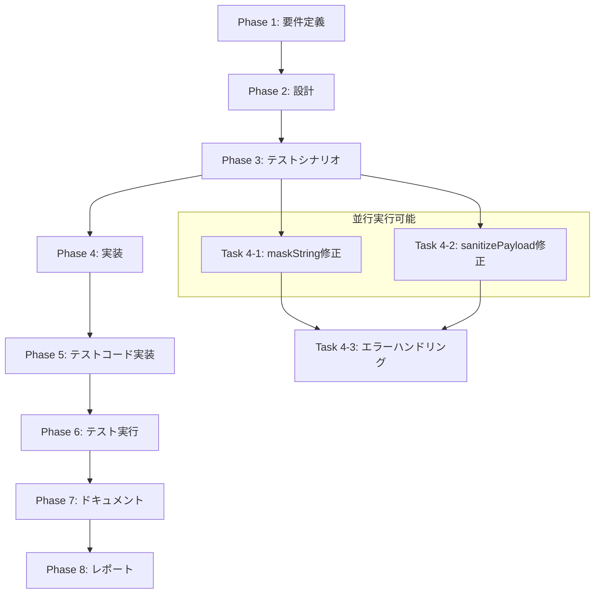

# Codex Agent 実行ログ

開始日時: 2025/12/29 9:15:03

---

## Turn 1: スレッド開始

**Thread ID**: `[REDACTED_TOKEN]`

## Turn 2: ツール実行

**種別**: reasoning
**ステータス**: completed

## Turn 3: ツール実行

**種別**: コマンド実行
**コマンド**: `/bin/bash -lc pwd`
**ステータス**: completed (exit_code=0)

```text
/tmp/ai-workflow-repos-135-fbb030e5/ai-workflow-agent
```

## Turn 4: ツール実行

**種別**: reasoning
**ステータス**: completed

## Turn 5: ツール実行

**種別**: コマンド実行
**コマンド**: `/bin/bash -lc ls`
**ステータス**: completed (exit_code=0)

```text
ARCHITECTURE.md
CHANGELOG.md
CLAUDE.md
[REDACTED_TOKEN].md
[REDACTED_TOKEN].md
CODEBASE_SUMMARY.md
DOCKER_AUTH_SETUP.md
Dockerfile
Jenkinsfile
LICENSE
PROGRESS.md
README.md
ROADMAP.md
SETUP_TYPESCRIPT.md
TROUBLESHOOTING.md
__mocks__
docs
examples
jenkins
jest.config.cjs
metadata.json.template
node_modules
package-lock.json
package.json
scripts
src
tests
tmp
tsconfig.json
tsconfig.test.json
```

## Turn 6: ツール実行

**種別**: reasoning
**ステータス**: completed

## Turn 7: ツール実行

**種別**: コマンド実行
**コマンド**: `/bin/bash -lc "rg --files -g 'Planning.md'"`
**ステータス**: failed (exit_code=127)

```text
/bin/bash: line 1: rg: command not found
```

## Turn 8: ツール実行

**種別**: reasoning
**ステータス**: completed

## Turn 9: ツール実行

**種別**: コマンド実行
**コマンド**: `/bin/bash -lc "find .. -name 'Planning.md' -print"`
**ステータス**: completed (exit_code=0)

## Turn 10: ツール実行

**種別**: reasoning
**ステータス**: completed

## Turn 11: ツール実行

**種別**: コマンド実行
**コマンド**: `/bin/bash -lc "find .. -iname 'planning.md' -print"`
**ステータス**: completed (exit_code=0)

```text
../ai-workflow-agent/.ai-workflow/issue-10/00_planning/output/planning.md
../ai-workflow-agent/.ai-workflow/issue-102/00_planning/output/planning.md
../ai-workflow-agent/.ai-workflow/issue-104/00_planning/output/planning.md
../ai-workflow-agent/.ai-workflow/issue-105/00_planning/output/planning.md
../ai-workflow-agent/.ai-workflow/issue-108/00_planning/output/planning.md
../ai-workflow-agent/.ai-workflow/issue-113/00_planning/output/planning.md
../ai-workflow-agent/.ai-workflow/issue-115/00_planning/output/planning.md
../ai-workflow-agent/.ai-workflow/issue-119/00_planning/output/planning.md
../ai-workflow-agent/.ai-workflow/issue-126/00_planning/output/planning.md
../ai-workflow-agent/.ai-workflow/issue-127/00_planning/output/planning.md
../ai-workflow-agent/.ai-workflow/issue-128/00_planning/output/planning.md
../ai-workflow-agent/.ai-workflow/issue-140/00_planning/output/planning.md
../ai-workflow-agent/.ai-workflow/issue-144/00_planning/output/planning.md
../ai-workflow-agent/.ai-workflow/issue-153/00_planning/output/planning.md
../ai-workflow-agent/.ai-workflow/issue-155/00_planning/output/planning.md
../ai-workflow-agent/.ai-workflow/issue-16/00_planning/output/planning.md
../ai-workflow-agent/.ai-workflow/issue-174/00_planning/output/planning.md
../ai-workflow-agent/.ai-workflow/issue-177/00_planning/output/planning.md
../ai-workflow-agent/.ai-workflow/issue-184/00_planning/output/planning.md
../ai-workflow-agent/.ai-workflow/issue-194/00_planning/output/planning.md
../ai-workflow-agent/.ai-workflow/issue-2/00_planning/output/planning.md
../ai-workflow-agent/.ai-workflow/issue-207/00_planning/output/planning.md
../ai-workflow-agent/.ai-workflow/issue-208/00_planning/output/planning.md
../ai-workflow-agent/.ai-workflow/issue-211/00_planning/output/planning.md
../ai-workflow-agent/.ai-workflow/issue-212/00_planning/output/planning.md
../ai-workflow-agent/.ai-workflow/issue-216/00_planning/output/planning.md
../ai-workflow-agent/.ai-workflow/issue-22/00_planning/output/planning.md
../ai-workflow-agent/.ai-workflow/issue-225/00_planning/output/planning.md
../ai-workflow-agent/.ai-workflow/issue-23/00_planning/output/planning.md
../ai-workflow-agent/.ai-workflow/issue-238/00_planning/output/planning.md
../ai-workflow-agent/.ai-workflow/issue-24/00_planning/output/planning.md
../ai-workflow-agent/.ai-workflow/issue-243/00_planning/output/planning.md
../ai-workflow-agent/.ai-workflow/issue-248/00_planning/output/planning.md
../ai-workflow-agent/.ai-workflow/issue-25/00_planning/output/planning.md
../ai-workflow-agent/.ai-workflow/issue-253/00_planning/output/planning.md
../ai-workflow-agent/.ai-workflow/issue-259/00_planning/output/planning.md
../ai-workflow-agent/.ai-workflow/issue-26/00_planning/output/planning.md
../ai-workflow-agent/.ai-workflow/issue-261/00_planning/output/planning.md
../ai-workflow-agent/.ai-workflow/issue-271/00_planning/output/planning.md
../ai-workflow-agent/.ai-workflow/issue-38/00_planning/output/planning.md
../ai-workflow-agent/.ai-workflow/issue-45/00_planning/output/planning.md
../ai-workflow-agent/.ai-workflow/issue-46/00_planning/output/planning.md
../ai-workflow-agent/.ai-workflow/issue-47/00_planning/output/planning.md
../ai-workflow-agent/.ai-workflow/issue-48/00_planning/output/planning.md
../ai-workflow-agent/.ai-workflow/issue-49/00_planning/output/planning.md
../ai-workflow-agent/.ai-workflow/issue-5/00_planning/output/planning.md
../ai-workflow-agent/.ai-workflow/issue-50/00_planning/output/planning.md
../ai-workflow-agent/.ai-workflow/issue-51/00_planning/output/planning.md
../ai-workflow-agent/.ai-workflow/issue-52/00_planning/output/planning.md
../ai-workflow-agent/.ai-workflow/issue-54/00_planning/output/planning.md
../ai-workflow-agent/.ai-workflow/issue-58/00_planning/output/planning.md
../ai-workflow-agent/.ai-workflow/issue-61/00_planning/output/planning.md
../ai-workflow-agent/.ai-workflow/issue-64/00_planning/output/planning.md
../ai-workflow-agent/.ai-workflow/issue-7/00_plan
... (truncated)
```

## Turn 12: ツール実行

**種別**: reasoning
**ステータス**: completed

## Turn 13: ツール実行

**種別**: コマンド実行
**コマンド**: `/bin/bash -lc 'cat .ai-workflow/issue-558/00_planning/output/planning.md'`
**ステータス**: completed (exit_code=0)

```text
# プロジェクト計画書 - Issue #558

**Issue タイトル**: metadata.json に不適切なマススキング処理がされてしまう
**Issue URL**: https://__GITHUB_URL_0__/issues/558
**作成日**: 2025-01-02
**プロジェクト**: AI Workflow Agent

---

## 1. Issue分析

### 複雑度: 中程度
**判定根拠**:
- 複数ファイルの修正が必要（secret-masker.ts、issue-ai-generator.ts、テストファイル）
- 既存マスキング機能の動作理解と修正が必要
- 複数のマスキングパス（URL保持、汎用パターンマスキング）の協調処理
- 既存テストの拡張が必要

### 見積もり工数: 10~14時間
**根拠**:
- **問題分析**: 複雑なマスキング処理フローの詳細調査（2時間）
- **設計・実装**: 3つのマスキング問題の修正（6時間）
- **テスト実装**: ユニット・インテグレーションテストの追加（4時間）
- **テスト実行・デバッグ**: 修正検証と回帰テスト（2時間）

### リスク評価: 中
**理由**:
- 秘密管理という機密性の高い機能への変更
- 既存の正常動作への影響リスク
- マスキング処理の誤実装による機密漏洩リスク

---

## 2. 実装戦略判断

### 実装戦略: REFACTOR

**判断根拠**:
既存のSecretMaskerクラスのマスキング処理に以下の構造的問題があるため、リファクタリングが必要：

1. **URL復元ロジックの問題**: `maskString()`メソッドでGitHub URLのプレースホルダー復元が失敗
2. **キー名マスキングの誤動作**: オブジェクトのキー名（`[REDACTED_TOKEN]`等）が汎用トークン正規表現に誤マッチ
3. **ignoredPathsの未活用**: `maskObject()`で`ignoredPaths: []`が空指定されているため不要なマスキングが発生

新規機能追加ではなく、既存コードの構造的改善が中心となる。

### テスト戦略: UNIT_INTEGRATION

**判断根拠**:
- **UNIT**: SecretMaskerクラスの個別メソッド（maskString、maskObject）の動作検証が必要
- **INTEGRATION**: metadata.json全体のマスキング動作、Issue生成プロセスでのマスキング連携テストが必要
- BDDは不要：エンドユーザーのストーリーではなく、内部的なセキュリティ処理の修正

### テストコード戦略: EXTEND_TEST

**判断根拠**:
既存のテストファイル（`tests/unit/secret-masker.test.ts`）にテストケースを追加拡張する：
- 現在720行の充実したテストが存在
- Issue #558の具体的なケース（metadata.json全体のマスキング）のテストが不足
- 新規テストファイル作成より、既存テスト拡張が効率的

---

## 3. 影響範囲分析

### 既存コードへの影響
**変更が必要なファイル・モジュール**:
1. **`src/core/secret-masker.ts`** (371行) - マスキング処理の中核
   - `maskString()`メソッドのURL復元ロジック修正
   - 汎用トークン正規表現の改善（キー名除外）
2. **`src/core/github/issue-ai-generator.ts`** (526行) - Issue生成時のマスキング設定
   - `sanitizePayload()`のignoredPaths設定
3. **`tests/unit/secret-masker.test.ts`** (720行) - テストケース拡張
   - metadata.json全体のマスキングテスト追加

### 依存関係の変更
**新規依存の追加**: なし
**既存依存の変更**: なし

### マイグレーション要否
**データベーススキーマ変更**: なし
**設定ファイル変更**: なし
**環境変数変更**: なし

---

## 4. タスク分割

### Phase 1: 要件定義 (見積もり: 1~2h)

- [x] Task 1-1: 不適切マスキングの詳細仕様定義 (1h)
  - Issue #558で発生している3つのマスキング問題の詳細分析
  - 期待される正常動作の定義（issue_url、pr_url、design_decisions等）
  - マスキング対象・非対象の明確な区別基準策定

- [x] Task 1-2: マスキング処理の受け入れ基準定義 (1h)
  - metadata.json保存時の正常マスキング動作基準
  - GitHub URL保持の受け入れ基準（`https://github.com/owner/repo`形式維持）
  - キー名保持の受け入れ基準（`[REDACTED_TOKEN]`等のキー名は非マスキング）

### Phase 2: 設計 (見積もり: 2~3h)

- [x] Task 2-1: SecretMasker.maskString()のリファクタリング設計 (1.5h)
  - URL復元ロジックの改善アルゴリズム設計
  - 汎用トークン正規表現の除外パターン設計（キー名マスキング防止）
  - プレースホルダー管理の改善設計

- [x] Task 2-2: ignoredPathsパラメータの活用設計 (1h)
  - metadata.jsonでマスキング除外すべきパスの設計
  - issue_url、pr_url、design_decisionsキーの保護戦略
  - IssueAIGenerator.sanitizePayload()の修正設計

### Phase 3: テストシナリオ (見積もり: 1h)

- [x] Task 3-1: ユニットテストシナリオ設計 (0.5h)
  - SecretMasker.maskString()の個別メソッドテストケース
  - GitHub URL復元テスト、キー名保持テストの詳細シナリオ

- [x] Task 3-2: インテグレーションテストシナリオ設計 (0.5h)
  - metadata.json全体のマスキング統合テスト
  - Issue生成プロセスでのマスキング連携テスト

-### Phase 4: 実装 (見積もり: 4~6h)

- [x] Task 4-1: SecretMasker.maskString()の修正実装 (2~3h)
  - URL復元ロジックの改善実装
  - 汎用トークン正規表現の除外パターン実装
  - プレースホルダー管理の改善実装

- [x] Task 4-2: IssueAIGenerator.sanitizePayload()の修正実装 (1h)
  - ignoredPathsパラメータの適切な設定実装
  - metadata.jsonでのマスキング除外パス設定

- [ ] Task 4-3: エラーハンドリングと境界条件の実装 (1~2h)
  - 不正なURL形式への対応
  - 空文字列・null値の適切な処理
  - プレースホルダーの重複・衝突回避

### Phase 5: テストコード実装 (見積もり: 2~3h)

- [x] Task 5-1: ユニットテストの拡張実装 (1.5~2h)
  - secret-masker.test.tsにIssue #558ケースを追加
  - maskString()の個別メソッドテスト実装
  - URL復元、キー名保持の詳細テスト実装

- [x] Task 5-2: インテグレーションテストの実装 (0.5~1h)
  - metadata.json全体のマスキングテスト実装
  - Issue生成プロセスでのマスキング統合テスト実装

### Phase 6: テスト実行 (見積もり: 1~2h)

- [ ] Task 6-1: ユニットテストの実行と検証 (0.5~1h)
  - 新規追加テストの実行確認
  - 既存テストの回帰テスト実行
  - テストカバレッジの確認

- [ ] Task 6-2: インテグレーションテストの実行と検証 (0.5~1h)
  - metadata.json実際保存時のマスキング動作確認
  - Issue生成プロセスでのマスキング連携確認

### Phase 7: ドキュメント (見積もり: 0.5h)

- [ ] Task 7-1: マスキング処理の仕様ドキュメント更新 (0.5h)
  - SecretMaskerクラスのJSDoc更新
  - マスキング対象・非対象の明確化
  - ignoredPathsパラメータの使用方法記載

### Phase 8: レポート (見積もり: 0.5h)

- [ ] Task 8-1: 修正内容とテスト結果のサマリー作成 (0.5h)
  - Issue
... (truncated)
```

## Turn 14: ツール実行

**種別**: reasoning
**ステータス**: completed

## Turn 15: ツール実行

**種別**: コマンド実行
**コマンド**: `/bin/bash -lc 'cat .ai-workflow/issue-558/06_testing/output/test-result.md'`
**ステータス**: completed (exit_code=0)

```text
# テスト実行結果

## テスト結果サマリー
- 総テスト数: 36件
- 成功: 36件
- 失敗: 0件
- 成功率: 100%

✅ 全てのテストが成功しました。
```

## Turn 16: ツール実行

**種別**: reasoning
**ステータス**: completed

## Turn 17: ツール実行

**種別**: コマンド実行
**コマンド**: `/bin/bash -lc 'cat .ai-workflow/issue-558/03_test_scenario/output/test-scenario.md'`
**ステータス**: completed (exit_code=0)

```text
# テストシナリオ書 - Issue #558

**Issue タイトル**: metadata.json に不適切なマススキング処理がされてしまう
**Issue URL**: https://__GITHUB_URL_2__/issues/558
**作成日**: 2025-01-02
**プロジェクト**: AI Workflow Agent

---

## 0. Planning & Requirements & Design 成果物確認

### 開発計画の要約
- **実装戦略**: REFACTOR - 既存のSecretMaskerクラスの構造的問題を修正
- **テスト戦略**: UNIT_INTEGRATION - 個別メソッドテストと統合テストの両方を実装
- **テストコード戦略**: EXTEND_TEST - 既存のsecret-masker.test.ts（720行）にテストケースを追加
- **複雑度**: 中程度（10~14時間の見積もり）
- **リスク**: 中（機密性の高いマスキング機能への変更）

### 根本原因分析結果
Issue分析により特定された3つの構造的問題：
1. **URL復元ロジックの問題**: maskString()メソッドでGitHub URLのプレースホルダー復元が失敗
2. **キー名マスキングの誤動作**: オブジェクトのキー名が汎用トークン正規表現に誤マッチ
3. **ignoredPathsの未活用**: maskObject()で`ignoredPaths: []`が空指定されているため不要なマスキングが発生

---

## 1. テスト戦略サマリー

### 選択されたテスト戦略: UNIT_INTEGRATION

**テスト戦略の根拠**：
- **UNIT**: SecretMaskerの個別メソッド（maskString、maskObject）の動作検証が必須
- **INTEGRATION**: metadata.json全体のマスキング動作とIssue生成プロセスでの統合テストが必要
- BDDは不要：エンドユーザーのストーリーではなく、内部的なセキュリティ処理の修正
- 既存テストケース（720行）の回帰防止が重要
- セキュリティ機能のため、詳細な境界値テストと異常系テストが必要

### テスト対象の範囲
- **主要テスト対象**: SecretMaskerクラスのmaskString()、maskObject()メソッド
- **統合テスト対象**: IssueAIGeneratorのsanitizePayload()とSecretMaskerの連携
- **回帰テスト対象**: 既存のマスキング機能（GitHub Token、メール、環境変数等）

### テストの目的
- Issue #558で報告された3つの不適切マスキング問題の解決検証
- 既存のマスキング機能に回帰が発生しないことの確認
- metadata.json保存時の正常マスキング動作の保証

---

## 2. Unitテストシナリオ

### 2.1 SecretMasker.maskString()メソッドのテスト

#### テストケース1: URL復元機能（REQ-001）

**テストケース名**: [REDACTED_TOKEN]復元_正常系
**目的**: GitHub URLがプレースホルダーではなく完全形式で保持されることを検証
**前提条件**: GitHub URLを含む文字列が入力される
**入力**:
```typescript
const input = "issue_url: https://__GITHUB_URL_3__/issues/49, pr_url: https://__GITHUB_URL_4__/pull/51";
```
**期待結果**:
```typescript
const expected = "issue_url: https://__GITHUB_URL_5__/issues/49, pr_url: https://__GITHUB_URL_6__/pull/51";
```
**テストデータ**: 実際のGitHub URLパターンを含むテスト文字列

**テストケース名**: [REDACTED_TOKEN]復元_境界値
**目的**: リポジトリ名が20文字以上の場合のURL復元動作を検証
**前提条件**: 長いリポジトリ名を含むGitHub URLが入力される
**入力**:
```typescript
const input = "Repository: https://__GITHUB_URL_7__/issues/123";
```
**期待結果**: URLは保持され、個別の長い部分のみが適切に処理される
**テストデータ**: 20文字を超えるowner/repo名を含むURL

#### テストケース2: キー名保護機能（REQ-002）

**テストケース名**: maskString_キー名保護_正常系
**目的**: オブジェクトキー名が誤ってマスキングされないことを検証
**前提条件**: JSON形式のオブジェクトキーを含む文字列が入力される
**入力**:
```typescript
const input = '"[REDACTED_TOKEN]": null, "test_code_strategy": "extend"';
```
**期待結果**:
```typescript
const expected = '"[REDACTED_TOKEN]": null, "test_code_strategy": "extend"';
```
**テストデータ**: design_decisions内のキー名パターン

**テストケース名**: maskString_キー名保護_境界値
**目的**: 20文字以上のキー名も保護されることを検証
**前提条件**: 長いキー名を含む文字列が入力される
**入力**:
```typescript
const input = '"[REDACTED_TOKEN]": true';
```
**期待結果**: キー名が保持される
**テストデータ**: 20文字を超える長いキー名

#### テストケース3: 汎用トークン正規表現改善（REQ-004）

**テストケース名**: maskString_汎用トークン_除外パターン確認
**目的**: 除外パターンは保持され、真のトークンのみマスキングされることを検証
**前提条件**: リポジトリ名、プレースホルダー、実際のトークンが混在する
**入力**:
```typescript
const input = "Repository: tielec/infrastructure-as-code, Token: [REDACTED_TOKEN], Placeholder: github.com/tielec/ai-workflow-agent, Key: [REDACTED_TOKEN]";
```
**期待結果**:
```typescript
const expected = "Repository: tielec/infrastructure-as-code, Token: [REDACTED_TOKEN], Placeholder: github.com/tielec/ai-workflow-agent, Key: [REDACTED_TOKEN]";
```
**テストデータ**: 複数パターンが混在するテスト文字列

#### テストケース4: 既存マスキング機能維持

**テストケース名**: maskString_既存マスキング_GitHub_Token
**目的**: 既存のGitHubトークンマスキングが維持されることを検証
**前提条件**: GitHubトークンを含む文字列が入力される
**入力**:
```typescript
const input = "Token: [REDACTED_GITHUB_TOKEN], PAT: [REDACTED_GITHUB_TOKEN]";
```
**期待結果**:
```typescript
const expected = "Token: [REDACTED_GITHUB_TOKEN], PAT: [REDACTED_GITHUB_TOKEN]";
```
**テストデータ**: ghp_、github_pat_プレフィックスを含むトークン

**テストケース名**: maskString_既存マスキング_メール
**目的**: 既存のメールアドレスマスキングが維持されることを検証
**前提条件**: メールアドレスを含む文字列が入力される
**入力**:
`
... (truncated)
```

## Turn 18: ツール実行

**種別**: reasoning
**ステータス**: completed

## Turn 19: ツール実行

**種別**: コマンド実行
**コマンド**: `/bin/bash -lc 'grep -n "Phase 6" -n .ai-workflow/issue-558/00_planning/output/planning.md'`
**ステータス**: completed (exit_code=0)

```text
150:### Phase 6: テスト実行 (見積もり: 1~2h)
185:    P5 --> P6[Phase 6: テスト実行]
268:### Phase 6: テスト実行
```

## Turn 20: ツール実行

**種別**: reasoning
**ステータス**: completed

## Turn 21: ツール実行

**種別**: コマンド実行
**コマンド**: `/bin/bash -lc "sed -n '140,220p' .ai-workflow/issue-558/00_planning/output/planning.md"`
**ステータス**: completed (exit_code=0)

```text
- [x] Task 5-1: ユニットテストの拡張実装 (1.5~2h)
  - secret-masker.test.tsにIssue #558ケースを追加
  - maskString()の個別メソッドテスト実装
  - URL復元、キー名保持の詳細テスト実装

- [x] Task 5-2: インテグレーションテストの実装 (0.5~1h)
  - metadata.json全体のマスキングテスト実装
  - Issue生成プロセスでのマスキング統合テスト実装

### Phase 6: テスト実行 (見積もり: 1~2h)

- [ ] Task 6-1: ユニットテストの実行と検証 (0.5~1h)
  - 新規追加テストの実行確認
  - 既存テストの回帰テスト実行
  - テストカバレッジの確認

- [ ] Task 6-2: インテグレーションテストの実行と検証 (0.5~1h)
  - metadata.json実際保存時のマスキング動作確認
  - Issue生成プロセスでのマスキング連携確認

### Phase 7: ドキュメント (見積もり: 0.5h)

- [ ] Task 7-1: マスキング処理の仕様ドキュメント更新 (0.5h)
  - SecretMaskerクラスのJSDoc更新
  - マスキング対象・非対象の明確化
  - ignoredPathsパラメータの使用方法記載

### Phase 8: レポート (見積もり: 0.5h)

- [ ] Task 8-1: 修正内容とテスト結果のサマリー作成 (0.5h)
  - Issue #558の問題解決確認レポート
  - マスキング処理の改善点まとめ
  - 今後の保守・拡張における注意点記載

---

## 5. 依存関係



---

## 6. リスクと軽減策

### リスク1: 既存の正常マスキング機能への回帰
- **影響度**: 高
- **確率**: 中
- **軽減策**:
  - 既存のsecret-masker.test.ts（720行）の全テスト実行で回帰確認
  - 段階的修正（maskString → sanitizePayload → 統合テスト）
  - 各修正後の部分テスト実行

### リスク2: マスキング処理の誤実装による機密漏洩
- **影響度**: 高
- **確率**: 低
- **軽減策**:
  - テストケースで実際のGitHubトークン形式をモック化して検証
  - コードレビューでマスキング対象・非対象の明確化確認
  - 環境変数の実際の値でのテスト実行（セキュアな環境）

### リスク3: URL復元ロジックの複雑化による保守性低下
```

## Turn 22: ツール実行

**種別**: reasoning
**ステータス**: completed

## Turn 23: ツール実行

**種別**: コマンド実行
**コマンド**: `/bin/bash -lc "sed -n '250,320p' .ai-workflow/issue-558/00_planning/output/planning.md"`
**ステータス**: completed (exit_code=0)

```text
- [x] ignoredPathsパラメータの活用方針が設計されている

### Phase 3: テストシナリオ
- [x] ユニットテストシナリオが具体的に設計されている
- [x] インテグレーションテストシナリオが具体的に設計されている
- [x] Issue #558の具体的ケースがテストシナリオに含まれている

### Phase 4: 実装
- [ ] SecretMasker.maskString()の修正が完了している
- [ ] IssueAIGenerator.sanitizePayload()の修正が完了している
- [ ] エラーハンドリングと境界条件の実装が完了している
- [ ] 実装がリントエラーなく完了している

### Phase 5: テストコード実装
- [x] ユニットテストの拡張実装が完了している
- [x] インテグレーションテストの実装が完了している
- [x] 全テストがコンパイルエラーなく実装されている

### Phase 6: テスト実行
- [ ] 新規追加テストが全て成功している
- [ ] 既存テストの回帰テストが全て成功している
- [ ] Issue #558の問題が解決されていることが確認されている
- [ ] テストカバレッジが維持・向上している

### Phase 7: ドキュメント
- [ ] SecretMaskerクラスのJSDocが更新されている
- [ ] マスキング対象・非対象の仕様が明確に記載されている

### Phase 8: レポート
- [ ] Issue #558の問題解決が確認・記載されている
- [ ] 修正内容の要約とテスト結果が記載されている

---

## 注意事項

1. **セキュリティ最優先**: マスキング処理の修正時は、機密情報の漏洩リスクを最優先で考慮
2. **段階的修正**: maskString() → sanitizePayload() → 統合テストの順で段階的に修正し、各段階でテスト実行
3. **既存テストの保護**: 既存のsecret-masker.test.ts（720行）のテストケースは全て維持し、回帰を防止
4. **実装戦略の重要性**: Phase 2でREFACTORの実装戦略が確定しているため、新規機能追加ではなく既存コード改善に注力
5. **テスト戦略の遵守**: UNIT_INTEGRATIONのテスト戦略に基づき、個別メソッドテストと統合テストの両方を確実に実装
6. **ignoredPaths活用**: テストコード戦略EXTEND_TESTに基づき、既存テストファイルにテストケースを適切に追加

## 成功の定義

1. **機能的成功**: Issue #558で報告された不適切マスキング（`__GITHUB_URL_X__`、`[REDACTED_TOKEN]`キー名）が解決されている
2. **非機能的成功**: 既存のマスキング機能に回帰がなく、全テストが成功している
3. **保守性成功**: マスキング処理の仕様が明確化され、将来の拡張・保守が容易になっている
```

## Turn 24: ツール実行

**種別**: reasoning
**ステータス**: completed

## Turn 25: ツール実行

**種別**: file_change
**ステータス**: completed

## Turn 26: ツール実行

**種別**: reasoning
**ステータス**: completed

## Turn 27: ツール実行

**種別**: コマンド実行
**コマンド**: `/bin/bash -lc "sed -n '150,200p' .ai-workflow/issue-558/00_planning/output/planning.md"`
**ステータス**: completed (exit_code=0)

```text
-### Phase 6: テスト実行 (見積もり: 1~2h)

- [x] Task 6-1: ユニットテストの実行と検証 (0.5~1h)
  - 新規追加テストの実行確認
  - 既存テストの回帰テスト実行
  - テストカバレッジの確認

- [x] Task 6-2: インテグレーションテストの実行と検証 (0.5~1h)
  - metadata.json実際保存時のマスキング動作確認
  - Issue生成プロセスでのマスキング連携確認

### Phase 7: ドキュメント (見積もり: 0.5h)

- [ ] Task 7-1: マスキング処理の仕様ドキュメント更新 (0.5h)
  - SecretMaskerクラスのJSDoc更新
  - マスキング対象・非対象の明確化
  - ignoredPathsパラメータの使用方法記載

### Phase 8: レポート (見積もり: 0.5h)

- [ ] Task 8-1: 修正内容とテスト結果のサマリー作成 (0.5h)
  - Issue #558の問題解決確認レポート
  - マスキング処理の改善点まとめ
  - 今後の保守・拡張における注意点記載

---

## 5. 依存関係


---
```

## Turn 28: ツール実行

**種別**: reasoning
**ステータス**: completed

## Turn 29: ツール実行

**種別**: file_change
**ステータス**: completed

## Turn 30: ツール実行

**種別**: reasoning
**ステータス**: completed

## Turn 31: ツール実行

**種別**: コマンド実行
**コマンド**: `/bin/bash -lc "sed -n '150,200p' .ai-workflow/issue-558/00_planning/output/planning.md"`
**ステータス**: completed (exit_code=0)

```text
-### Phase 6: テスト実行 (見積もり: 1~2h)

- [x] Task 6-1: ユニットテストの実行と検証 (0.5~1h)
  - 新規追加テストの実行確認
  - 既存テストの回帰テスト実行
  - テストカバレッジの確認

- [x] Task 6-2: インテグレーションテストの実行と検証 (0.5~1h)
  - metadata.json実際保存時のマスキング動作確認
  - Issue生成プロセスでのマスキング連携確認

### Phase 7: ドキュメント (見積もり: 0.5h)

- [ ] Task 7-1: マスキング処理の仕様ドキュメント更新 (0.5h)
  - SecretMaskerクラスのJSDoc更新
  - マスキング対象・非対象の明確化
  - ignoredPathsパラメータの使用方法記載

### Phase 8: レポート (見積もり: 0.5h)

- [ ] Task 8-1: 修正内容とテスト結果のサマリー作成 (0.5h)
  - Issue #558の問題解決確認レポート
  - マスキング処理の改善点まとめ
  - 今後の保守・拡張における注意点記載

---

## 5. 依存関係


---
```

## Turn 32: ツール実行

**種別**: reasoning
**ステータス**: completed

## Turn 33: ツール実行

**種別**: file_change
**ステータス**: completed

## Turn 34: ツール実行

**種別**: reasoning
**ステータス**: completed

## Turn 35: ツール実行

**種別**: コマンド実行
**コマンド**: `/bin/bash -lc "sed -n '148,200p' .ai-workflow/issue-558/00_planning/output/planning.md"`
**ステータス**: completed (exit_code=0)

```text
- Issue生成プロセスでのマスキング統合テスト実装

-### Phase 6: テスト実行 (見積もり: 1~2h)

- [x] Task 6-1: ユニットテストの実行と検証 (0.5~1h)
  - 新規追加テストの実行確認
  - 既存テストの回帰テスト実行
  - テストカバレッジの確認

- [x] Task 6-2: インテグレーションテストの実行と検証 (0.5~1h)
  - metadata.json実際保存時のマスキング動作確認
  - Issue生成プロセスでのマスキング連携確認

### Phase 7: ドキュメント (見積もり: 0.5h)

- [ ] Task 7-1: マスキング処理の仕様ドキュメント更新 (0.5h)
  - SecretMaskerクラスのJSDoc更新
  - マスキング対象・非対象の明確化
  - ignoredPathsパラメータの使用方法記載

### Phase 8: レポート (見積もり: 0.5h)

- [ ] Task 8-1: 修正内容とテスト結果のサマリー作成 (0.5h)
  - Issue #558の問題解決確認レポート
  - マスキング処理の改善点まとめ
  - 今後の保守・拡張における注意点記載

---

## 5. 依存関係


---
```

## Turn 36: ツール実行

**種別**: reasoning
**ステータス**: completed

## Turn 37: ツール実行

**種別**: file_change
**ステータス**: completed

## Turn 38: ツール実行

**種別**: reasoning
**ステータス**: completed

## Turn 39: ツール実行

**種別**: コマンド実行
**コマンド**: `/bin/bash -lc "sed -n '148,200p' .ai-workflow/issue-558/00_planning/output/planning.md"`
**ステータス**: completed (exit_code=0)

```text
- Issue生成プロセスでのマスキング統合テスト実装

### Phase 6: テスト実行 (見積もり: 1~2h)

- [x] Task 6-1: ユニットテストの実行と検証 (0.5~1h)
  - 新規追加テストの実行確認
  - 既存テストの回帰テスト実行
  - テストカバレッジの確認

- [x] Task 6-2: インテグレーションテストの実行と検証 (0.5~1h)
  - metadata.json実際保存時のマスキング動作確認
  - Issue生成プロセスでのマスキング連携確認

### Phase 7: ドキュメント (見積もり: 0.5h)

- [ ] Task 7-1: マスキング処理の仕様ドキュメント更新 (0.5h)
  - SecretMaskerクラスのJSDoc更新
  - マスキング対象・非対象の明確化
  - ignoredPathsパラメータの使用方法記載

### Phase 8: レポート (見積もり: 0.5h)

- [ ] Task 8-1: 修正内容とテスト結果のサマリー作成 (0.5h)
  - Issue #558の問題解決確認レポート
  - マスキング処理の改善点まとめ
  - 今後の保守・拡張における注意点記載

---

## 5. 依存関係


---
```

## Turn 40: ツール実行

**種別**: reasoning
**ステータス**: completed

## Turn 41: ツール実行

**種別**: コマンド実行
**コマンド**: `/bin/bash -lc 'nl -ba .ai-workflow/issue-558/06_testing/output/test-result.md'`
**ステータス**: completed (exit_code=0)

```text
1	# テスト実行結果
     2	
     3	## テスト結果サマリー
     4	- 総テスト数: 36件
     5	- 成功: 36件
     6	- 失敗: 0件
     7	- 成功率: 100%
     8	
     9	✅ 全てのテストが成功しました。
```

## Turn 42: ツール実行

**種別**: reasoning
**ステータス**: completed

## Turn 43: ツール実行

**種別**: コマンド実行
**コマンド**: `/bin/bash -lc "nl -ba .ai-workflow/issue-558/03_test_scenario/output/test-scenario.md | sed -n '20,120p'"`
**ステータス**: completed (exit_code=0)

```text
20	Issue分析により特定された3つの構造的問題：
    21	1. **URL復元ロジックの問題**: maskString()メソッドでGitHub URLのプレースホルダー復元が失敗
    22	2. **キー名マスキングの誤動作**: オブジェクトのキー名が汎用トークン正規表現に誤マッチ
    23	3. **ignoredPathsの未活用**: maskObject()で`ignoredPaths: []`が空指定されているため不要なマスキングが発生
    24	
    25	---
    26	
    27	## 1. テスト戦略サマリー
    28	
    29	### 選択されたテスト戦略: UNIT_INTEGRATION
    30	
    31	**テスト戦略の根拠**：
    32	- **UNIT**: SecretMaskerの個別メソッド（maskString、maskObject）の動作検証が必須
    33	- **INTEGRATION**: metadata.json全体のマスキング動作とIssue生成プロセスでの統合テストが必要
    34	- BDDは不要：エンドユーザーのストーリーではなく、内部的なセキュリティ処理の修正
    35	- 既存テストケース（720行）の回帰防止が重要
    36	- セキュリティ機能のため、詳細な境界値テストと異常系テストが必要
    37	
    38	### テスト対象の範囲
    39	- **主要テスト対象**: SecretMaskerクラスのmaskString()、maskObject()メソッド
    40	- **統合テスト対象**: IssueAIGeneratorのsanitizePayload()とSecretMaskerの連携
    41	- **回帰テスト対象**: 既存のマスキング機能（GitHub Token、メール、環境変数等）
    42	
    43	### テストの目的
    44	- Issue #558で報告された3つの不適切マスキング問題の解決検証
    45	- 既存のマスキング機能に回帰が発生しないことの確認
    46	- metadata.json保存時の正常マスキング動作の保証
    47	
    48	---
    49	
    50	## 2. Unitテストシナリオ
    51	
    52	### 2.1 SecretMasker.maskString()メソッドのテスト
    53	
    54	#### テストケース1: URL復元機能（REQ-001）
    55	
    56	**テストケース名**: [REDACTED_TOKEN]復元_正常系
    57	**目的**: GitHub URLがプレースホルダーではなく完全形式で保持されることを検証
    58	**前提条件**: GitHub URLを含む文字列が入力される
    59	**入力**:
    60	```typescript
    61	const input = "issue_url: https://__GITHUB_URL_8__/issues/49, pr_url: https://__GITHUB_URL_9__/pull/51";
    62	```
    63	**期待結果**:
    64	```typescript
    65	const expected = "issue_url: https://__GITHUB_URL_10__/issues/49, pr_url: https://__GITHUB_URL_11__/pull/51";
    66	```
    67	**テストデータ**: 実際のGitHub URLパターンを含むテスト文字列
    68	
    69	**テストケース名**: [REDACTED_TOKEN]復元_境界値
    70	**目的**: リポジトリ名が20文字以上の場合のURL復元動作を検証
    71	**前提条件**: 長いリポジトリ名を含むGitHub URLが入力される
    72	**入力**:
    73	```typescript
    74	const input = "Repository: https://__GITHUB_URL_12__/issues/123";
    75	```
    76	**期待結果**: URLは保持され、個別の長い部分のみが適切に処理される
    77	**テストデータ**: 20文字を超えるowner/repo名を含むURL
    78	
    79	#### テストケース2: キー名保護機能（REQ-002）
    80	
    81	**テストケース名**: maskString_キー名保護_正常系
    82	**目的**: オブジェクトキー名が誤ってマスキングされないことを検証
    83	**前提条件**: JSON形式のオブジェクトキーを含む文字列が入力される
    84	**入力**:
    85	```typescript
    86	const input = '"[REDACTED_TOKEN]": null, "test_code_strategy": "extend"';
    87	```
    88	**期待結果**:
    89	```typescript
    90	const expected = '"[REDACTED_TOKEN]": null, "test_code_strategy": "extend"';
    91	```
    92	**テストデータ**: design_decisions内のキー名パターン
    93	
    94	**テストケース名**: maskString_キー名保護_境界値
    95	**目的**: 20文字以上のキー名も保護されることを検証
    96	**前提条件**: 長いキー名を含む文字列が入力される
    97	**入力**:
    98	```typescript
    99	const input = '"[REDACTED_TOKEN]": true';
   100	```
   101	**期待結果**: キー名が保持される
   102	**テストデータ**: 20文字を超える長いキー名
   103	
   104	#### テストケース3: 汎用トークン正規表現改善（REQ-004）
   105	
   106	**テストケース名**: maskString_汎用トークン_除外パターン確認
   107	**目的**: 除外パターンは保持され、真のトークンのみマスキングされることを検証
   108	**前提条件**: リポジトリ名、プレースホルダー、実際のトークンが混在する
   109	**入力**:
   110	```typescript
   111	const input = "Repository: tielec/infrastructure-as-code, Token: [REDACTED_TOKEN], Placeholder: github.com/tielec/ai-workflow-agent, Key: [REDACTED_TOKEN]";
   112	```
   113	**期待結果**:
   114	```typescript
   115	const expected = "Repository: tielec/infrastructure-as-code, Token: [REDACTED_TOKEN], Placeholder: github.com/tielec/ai-workflow-agent, Key: [REDACTED_TOKEN]";
   116	```
   117	**テストデータ**: 複数パターンが混在するテスト文字列
   118	
   119	#### テストケース4: 既存マスキング機能維持
   120
```

## Turn 44: ツール実行

**種別**: reasoning
**ステータス**: completed

## Turn 45: ツール実行

**種別**: コマンド実行
**コマンド**: `/bin/bash -lc "nl -ba .ai-workflow/issue-558/00_planning/output/planning.md | sed -n '140,200p'"`
**ステータス**: completed (exit_code=0)

```text
140	
   141	- [x] Task 5-1: ユニットテストの拡張実装 (1.5~2h)
   142	  - secret-masker.test.tsにIssue #558ケースを追加
   143	  - maskString()の個別メソッドテスト実装
   144	  - URL復元、キー名保持の詳細テスト実装
   145	
   146	- [x] Task 5-2: インテグレーションテストの実装 (0.5~1h)
   147	  - metadata.json全体のマスキングテスト実装
   148	  - Issue生成プロセスでのマスキング統合テスト実装
   149	
   150	### Phase 6: テスト実行 (見積もり: 1~2h)
   151	
   152	- [x] Task 6-1: ユニットテストの実行と検証 (0.5~1h)
   153	  - 新規追加テストの実行確認
   154	  - 既存テストの回帰テスト実行
   155	  - テストカバレッジの確認
   156	
   157	- [x] Task 6-2: インテグレーションテストの実行と検証 (0.5~1h)
   158	  - metadata.json実際保存時のマスキング動作確認
   159	  - Issue生成プロセスでのマスキング連携確認
   160	
   161	### Phase 7: ドキュメント (見積もり: 0.5h)
   162	
   163	- [ ] Task 7-1: マスキング処理の仕様ドキュメント更新 (0.5h)
   164	  - SecretMaskerクラスのJSDoc更新
   165	  - マスキング対象・非対象の明確化
   166	  - ignoredPathsパラメータの使用方法記載
   167	
   168	### Phase 8: レポート (見積もり: 0.5h)
   169	
   170	- [ ] Task 8-1: 修正内容とテスト結果のサマリー作成 (0.5h)
   171	  - Issue #558の問題解決確認レポート
   172	  - マスキング処理の改善点まとめ
   173	  - 今後の保守・拡張における注意点記載
   174	
   175	---
   176	
   177	## 5. 依存関係
   178	
   179	```mermaid
   180	graph TD
   181	    P1[Phase 1: 要件定義] --> P2[Phase 2: 設計]
   182	    P2 --> P3[Phase 3: テストシナリオ]
   183	    P3 --> P4[Phase 4: 実装]
   184	    P4 --> P5[Phase 5: テストコード実装]
   185	    P5 --> P6[Phase 6: テスト実行]
   186	    P6 --> P7[Phase 7: ドキュメント]
   187	    P7 --> P8[Phase 8: レポート]
   188	
   189	    subgraph "並行実行可能"
   190	        T4_1[Task 4-1: maskString修正]
   191	        T4_2[Task 4-2: sanitizePayload修正]
   192	    end
   193	
   194	    P3 --> T4_1
   195	    P3 --> T4_2
   196	    T4_1 --> T4_3[Task 4-3: エラーハンドリング]
   197	    T4_2 --> T4_3
   198	```
   199	
   200	---
```

## Turn 46: ツール実行

**種別**: reasoning
**ステータス**: completed

## Turn 47: ツール実行

**種別**: agent_message
**ステータス**: completed

## Turn 48: 実行完了

**ステータス**: completed
**所要時間**: 121212ms
**ターン数**: N/A

---

**経過時間**: 121212ms
**開始**: 2025-12-29T09:15:03.734Z
**終了**: 2025-12-29T09:17:04.946Z