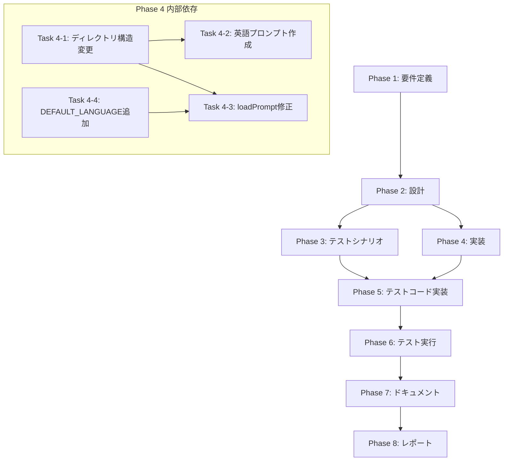

# プロジェクト計画書: Issue #571

## Implement prompt file switching based on language setting

---

## 1. Issue分析

### 概要

Issue #526で言語設定の解決ロジックとメタデータ永続化が実装されたが、実際のプロンプトファイルは日本語固定のままである。`metadata.json` の `language` 設定に応じてプロンプトファイルを切り替える機能を実装する。

### 複雑度: **中程度**

**判定根拠**:
- 複数ファイルの修正が必要（`base-phase.ts`、`copy-static-assets.mjs`、プロンプトファイル構造）
- 既存機能（`loadPrompt()`メソッド）の拡張が中心
- プロンプトファイルの構造変更（10フェーズ × 2言語 × 3種類 = 60ファイル）
- 新規アーキテクチャ変更ではなく、既存パターンに沿った拡張

### 見積もり工数: **12〜16時間**

**内訳**:
| 作業項目 | 見積もり時間 |
|---------|------------|
| 要件定義・設計 | 2h |
| プロンプトファイル構造変更（日本語移動） | 1h |
| 英語プロンプト翻訳（30ファイル） | 4〜6h |
| `BasePhase.loadPrompt()` 修正 | 1〜2h |
| ビルドスクリプト更新 | 0.5h |
| テストコード実装 | 2〜3h |
| 統合テスト・動作確認 | 1h |
| ドキュメント更新 | 0.5h |

### リスク評価: **中**

**理由**:
- プロンプトファイルの翻訳品質がシステム動作に影響
- 既存の全フェーズに影響するため、回帰テストが重要
- フォールバック機構が正しく動作しないと、言語未対応時にエラーが発生

---

## 2. 実装戦略判断

### 実装戦略: **EXTEND**

**判断根拠**:
- 既存の `BasePhase.loadPrompt()` メソッドを拡張して多言語対応を追加
- 新規ファイル作成は最小限（テストファイル1つ、英語プロンプト30ファイル）
- 既存のプロンプトロード機構を維持しつつ、言語切り替えロジックを追加
- `copy-static-assets.mjs` は既存のコピーロジックで対応可能（ディレクトリ構造変更のみ）

**EXTEND を選択した理由**:
1. `loadPrompt()` メソッドは既に存在し、パス解決ロジックを拡張するだけ
2. 環境情報注入や差し戻しコンテキスト注入など、既存の注入パターンを踏襲
3. プロンプトファイルのディレクトリ構造変更は、既存ファイルの移動が中心

### テスト戦略: **UNIT_INTEGRATION**

**判断根拠**:
- **ユニットテスト**: `loadPrompt()` メソッドの多言語パス解決ロジック、フォールバック動作
- **インテグレーションテスト**: 実際のプロンプトファイル構造での読み込み確認、ビルド後の動作確認

**UNIT_INTEGRATION を選択した理由**:
1. `loadPrompt()` のロジック変更はユニットテストで検証可能
2. プロンプトファイル構造変更は統合テストで実際のファイルシステム操作を検証
3. BDDは不要（エンドユーザー向け機能ではなく内部実装の拡張）

### テストコード戦略: **CREATE_TEST**

**判断根拠**:
- 新規テストファイル `tests/integration/prompt-language-switching.test.ts` を作成
- 既存の `base-phase-*.test.ts` とは独立した多言語切り替えテスト
- フォールバック動作の網羅的なテストには専用ファイルが適切

**CREATE_TEST を選択した理由**:
1. 多言語切り替えは新規機能であり、独立したテストスイートが適切
2. 既存テストファイルへの追加では、テストの関心事が混在する
3. Issue本文で `tests/integration/prompt-language-switching.test.ts` が指定されている

---

## 3. 影響範囲分析

### 既存コードへの影響

| ファイル | 変更内容 | 影響度 |
|---------|---------|-------|
| `src/phases/base-phase.ts` | `loadPrompt()` メソッドの多言語対応 | 高 |
| `scripts/copy-static-assets.mjs` | 多言語ディレクトリ構造のコピー対応 | 低 |
| `src/prompts/*/` | ディレクトリ構造変更（`{phase}/{lang}/` 形式へ） | 中 |
| `src/types.ts` | `DEFAULT_LANGUAGE` 定数の追加（必要に応じて） | 低 |

### 依存関係の変更

- **新規依存**: なし
- **既存依存の変更**: なし
- **内部依存**: `MetadataManager.getLanguage()` メソッドの利用（既に実装済み想定）

### マイグレーション要否

- **プロンプトファイル構造**:
  - 既存の `src/prompts/{phase}/*.txt` を `src/prompts/{phase}/ja/*.txt` に移動
  - 英語版プロンプト `src/prompts/{phase}/en/*.txt` を新規作成
- **設定ファイル変更**: なし
- **データベーススキーマ変更**: なし

### 影響を受けるフェーズ（全10フェーズ）

1. Planning (00)
2. Requirements (01)
3. Design (02)
4. Test Scenario (03)
5. Implementation (04)
6. Test Implementation (05)
7. Testing (06)
8. Documentation (07)
9. Report (08)
10. Evaluation (09)

---

## 4. タスク分割

### Phase 1: 要件定義 (見積もり: 1〜2h)

- [x] Task 1-1: 機能要件の明確化 (1h)
  - 多言語プロンプト切り替えの仕様定義
  - フォールバック動作の仕様定義
  - 対象言語（ja, en）の確定

- [x] Task 1-2: 受け入れ基準の定義 (0.5h)
  - `language: 'ja'` 設定時に日本語プロンプトが読み込まれる
  - `language: 'en'` 設定時に英語プロンプトが読み込まれる
  - 指定言語のプロンプトが存在しない場合、日本語にフォールバック
  - ビルド後も多言語ディレクトリ構造が維持される

### Phase 2: 設計 (見積もり: 1〜2h)

- [x] Task 2-1: `loadPrompt()` メソッドの設計 (1h)
  - 言語パラメータ取得方法の設計
  - パス解決ロジックの設計
  - フォールバック機構の設計

- [x] Task 2-2: ディレクトリ構造の設計 (0.5h)
  - `src/prompts/{phase}/{lang}/*.txt` 構造の確定
  - ビルド後の `dist/prompts/` 構造の確定

### Phase 3: テストシナリオ (見積もり: 1〜2h)

- [x] Task 3-1: ユニットテストシナリオ作成 (1h)
  - `loadPrompt()` 日本語読み込みテスト
  - `loadPrompt()` 英語読み込みテスト
  - フォールバックテスト（言語未対応時）
  - エラーテスト（プロンプトファイル欠落時）

- [x] Task 3-2: 統合テストシナリオ作成 (0.5h)
  - 全10フェーズの多言語切り替え確認
  - ビルド後のプロンプト読み込み確認

### Phase 4: 実装 (見積もり: 6〜8h)

- [ ] Task 4-1: プロンプトファイル構造の変更 (1h)
  - 既存日本語プロンプトを `{phase}/ja/` に移動
  - ディレクトリ作成スクリプトの実行

- [ ] Task 4-2: 英語プロンプトの翻訳・作成 (4〜6h)
  - 10フェーズ × 3種類（execute, review, revise）= 30ファイル
  - LLMを使用した翻訳の実施
  - 翻訳品質の確認

- [ ] Task 4-3: `BasePhase.loadPrompt()` の多言語対応実装 (1〜2h)
  - `MetadataManager.getLanguage()` の呼び出し追加
  - パス解決ロジックの変更（言語ディレクトリを含める）
  - フォールバック機構の実装
  - ログ出力の追加

- [ ] Task 4-4: `DEFAULT_LANGUAGE` 定数の追加 (0.5h)
  - `src/types.ts` または `src/core/config.ts` に追加
  - デフォルト言語を `'ja'` に設定

### Phase 5: テストコード実装 (見積もり: 2〜3h)

- [ ] Task 5-1: ユニットテストの実装 (1.5h)
  - `tests/unit/phases/base-phase-language-switching.test.ts` 作成
  - `loadPrompt()` のパス解決テスト
  - フォールバック動作テスト

- [ ] Task 5-2: 統合テストの実装 (1.5h)
  - `tests/integration/prompt-language-switching.test.ts` 作成
  - 実際のプロンプトファイル読み込みテスト
  - 全フェーズの多言語切り替えテスト

### Phase 6: テスト実行 (見積もり: 1〜2h)

- [ ] Task 6-1: ユニットテストの実行と修正 (0.5h)
  - `npm run test:unit` の実行
  - 失敗テストの修正

- [ ] Task 6-2: 統合テストの実行と修正 (0.5h)
  - `npm run test:integration` の実行
  - 失敗テストの修正

- [ ] Task 6-3: 全テストスイートの実行 (0.5h)
  - `npm test` の実行
  - 既存テストの回帰確認

### Phase 7: ドキュメント (見積もり: 0.5〜1h)

- [ ] Task 7-1: CLAUDE.md の更新 (0.5h)
  - 多言語プロンプト機能の説明追加
  - 新規言語追加手順の記載

- [ ] Task 7-2: CHANGELOG.md の更新 (0.5h)
  - Issue #571 の変更内容を記載

### Phase 8: レポート (見積もり: 0.5h)

- [ ] Task 8-1: 実装レポートの作成 (0.5h)
  - 実装内容のサマリー
  - テスト結果のサマリー
  - 残課題の整理

---

## 5. 依存関係

### 並行実行可能なタスク

- Task 4-2（英語プロンプト作成）と Task 4-4（定数追加）は並行実行可能
- Phase 3（テストシナリオ）と Phase 4（実装）は一部並行実行可能

---

## 6. リスクと軽減策

### リスク1: 英語プロンプトの翻訳品質

- **影響度**: 高
- **確率**: 中
- **軽減策**:
  - LLM翻訳後にレビューを実施
  - 主要なプロンプト（execute.txt）を優先的に品質確認
  - 将来的にネイティブスピーカーによる校正を検討

### リスク2: `MetadataManager.getLanguage()` の未実装

- **影響度**: 高
- **確率**: 低（Issue #526で実装済み想定）
- **軽減策**:
  - 実装前に `MetadataManager` の言語関連メソッドを確認
  - 未実装の場合は、本Issueで追加実装

### リスク3: 既存テストの回帰

- **影響度**: 中
- **確率**: 低
- **軽減策**:
  - プロンプトパス変更後、全テストスイートを実行
  - フォールバック機構により、既存の日本語プロンプト読み込みは維持

### リスク4: ビルドスクリプトの互換性

- **影響度**: 中
- **確率**: 低
- **軽減策**:
  - `fs.cp()` の `recursive: true` オプションで多言語ディレクトリ構造をコピー
  - ビルド後に `dist/prompts/` 構造を確認

### リスク5: プロンプトファイル移動時のミス

- **影響度**: 中
- **確率**: 低
- **軽減策**:
  - 移動スクリプトを作成し、自動化
  - Git履歴で変更を追跡可能に

---

## 7. 品質ゲート

### Phase 1: 要件定義

- [ ] 機能要件が明確に記載されている
- [ ] 受け入れ基準が定義されている
- [ ] 対象言語（ja, en）が確定している
- [ ] フォールバック動作が明確である

### Phase 2: 設計

- [ ] 実装戦略の判断根拠が明記されている（EXTEND）
- [ ] テスト戦略の判断根拠が明記されている（UNIT_INTEGRATION）
- [ ] `loadPrompt()` の設計が完了している
- [ ] ディレクトリ構造が確定している

### Phase 3: テストシナリオ

- [x] 全テストケースが網羅されている
- [x] 正常系・異常系・境界値テストが含まれている
- [x] フォールバック動作のテストが含まれている

### Phase 4: 実装

- [ ] プロンプトファイル構造が変更されている
- [ ] 全10フェーズの英語プロンプトが作成されている
- [ ] `loadPrompt()` が多言語対応されている
- [ ] フォールバック機構が実装されている
- [ ] コードがESLintを通過する

### Phase 5: テストコード実装

- [ ] ユニットテストが実装されている
- [ ] 統合テストが実装されている
- [ ] テストカバレッジが既存水準を維持している

### Phase 6: テスト実行

- [ ] 全ユニットテストがパスする
- [ ] 全統合テストがパスする
- [ ] 既存テストの回帰がない
- [ ] `npm test` が成功する

### Phase 7: ドキュメント

- [ ] CLAUDE.md が更新されている
- [ ] CHANGELOG.md が更新されている
- [ ] 新規言語追加手順が記載されている

### Phase 8: レポート

- [ ] 実装内容のサマリーが作成されている
- [ ] テスト結果のサマリーが作成されている
- [ ] 残課題が整理されている

---

## 補足情報

### プロンプトファイル一覧（翻訳対象）

| フェーズ | execute.txt | review.txt | revise.txt |
|---------|------------|-----------|-----------|
| planning | ✓ | ✓ | ✓ |
| requirements | ✓ | ✓ | ✓ |
| design | ✓ | ✓ | ✓ |
| test_scenario | ✓ | ✓ | ✓ |
| implementation | ✓ | ✓ | ✓ |
| test_implementation | ✓ | ✓ | ✓ |
| testing | ✓ | ✓ | ✓ |
| documentation | ✓ | ✓ | ✓ |
| report | ✓ | ✓ | ✓ |
| evaluation | ✓ | ✓ | ✓ |

**合計**: 30ファイル

### 将来の拡張性

- 新規言語追加時は `src/prompts/{phase}/{new_lang}/` ディレクトリを作成するだけ
- `DEFAULT_LANGUAGE` を変更することで、デフォルト言語を変更可能
- プロンプトファイルの品質を言語ごとに独立して改善可能

### 関連Issue・PR

- Issue #526: 言語設定オプションの実装（解決ロジック・永続化）
- PR #568: Issue #526の実装

---

## 品質ゲート（Phase 0）チェックリスト

- [x] **実装戦略が明確に決定されている**: EXTEND
- [x] **テスト戦略が明確に決定されている**: UNIT_INTEGRATION
- [x] **テストコード戦略が明確に決定されている**: CREATE_TEST
- [x] **影響範囲が分析されている**: 全10フェーズのプロンプトファイル、`base-phase.ts`、`copy-static-assets.mjs`
- [x] **タスク分割が適切な粒度である**: 各タスク1〜4時間以内
- [x] **リスクが洗い出されている**: 5つのリスクと軽減策を記載
