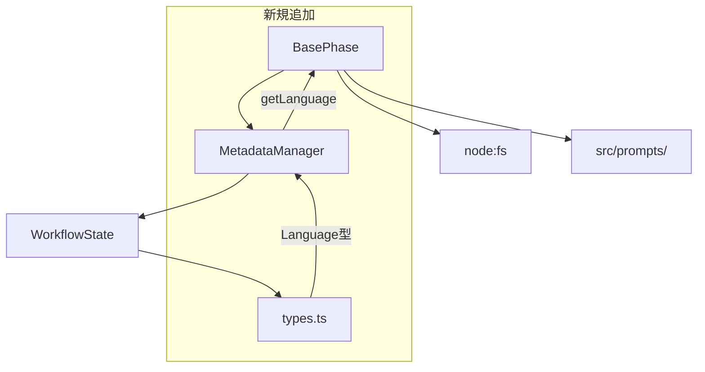
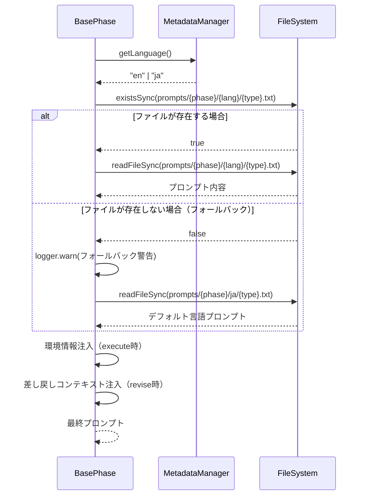

# 詳細設計書: Issue #571

## Implement prompt file switching based on language setting

---

## 0. Planning Documentの確認

本設計書は、Planning Phase成果物（`.ai-workflow/issue-571/00_planning/output/planning.md`）および要件定義書（`.ai-workflow/issue-571/01_requirements/output/requirements.md`）の計画に基づいて作成されています。

### 開発計画の概要

| 項目 | 内容 |
|------|------|
| **複雑度** | 中程度 |
| **見積もり工数** | 12〜16時間 |
| **実装戦略** | EXTEND（既存の`loadPrompt()`メソッドを拡張） |
| **テスト戦略** | UNIT_INTEGRATION |
| **テストコード戦略** | CREATE_TEST |

---

## 1. 既存コードベース分析

### 1.1 現状の実装

#### BasePhase.loadPrompt() メソッド

**ファイル**: `src/phases/base-phase.ts` (lines 291-320)

```typescript
protected loadPrompt(promptType: 'execute' | 'review' | 'revise'): string {
  const promptPath = path.join(promptsRoot, this.phaseName, `${promptType}.txt`);
  if (!fs.existsSync(promptPath)) {
    throw new Error(`Prompt file not found: ${promptPath}`);
  }

  let prompt = fs.readFileSync(promptPath, 'utf-8');

  // Issue #177: 環境情報の注入（execute ステップのみ）
  if (promptType === 'execute' && config.canAgentInstallPackages()) {
    const environmentInfo = this.buildEnvironmentInfoSection();
    prompt = environmentInfo + '\n\n' + prompt;
    // ...
  }

  // Issue #90: 差し戻しコンテキストの注入
  if (promptType === 'revise') {
    // ...
  }

  return prompt;
}
```

**現状の問題**:
- パス解決: `promptsRoot/{phaseName}/{promptType}.txt` （言語考慮なし）
- 言語設定を一切参照していない
- 日本語プロンプトのみ存在

#### MetadataManager クラス

**ファイル**: `src/core/metadata-manager.ts`

**重要な発見**: `getLanguage()` メソッドは**存在しない**。Issue #526で実装済みとの前提だったが、実際には未実装。

**現在のWorkflowMetadata型** (`src/types.ts`):
```typescript
export interface WorkflowMetadata {
  issue_number: string;
  issue_url: string;
  issue_title: string;
  // ...
  // language フィールドは存在しない
}
```

#### プロンプトファイル構造

**現状**: `src/prompts/{phase}/{promptType}.txt`

```
src/prompts/
├── planning/
│   ├── execute.txt
│   ├── review.txt
│   └── revise.txt
├── requirements/
│   ├── execute.txt
│   ├── review.txt
│   └── revise.txt
├── design/
├── test_scenario/
├── implementation/
├── test_implementation/
├── testing/
├── documentation/
├── report/
└── evaluation/
```

#### copy-static-assets.mjs

**ファイル**: `scripts/copy-static-assets.mjs`

```javascript
const assets = [
  // ...
  {
    source: path.join(projectRoot, 'src', 'prompts'),
    target: path.join(distDir, 'prompts'),
  },
];

await fsp.cp(asset.source, asset.target, {
  recursive: true,
  force: true,
});
```

**評価**: `recursive: true` オプションにより、多言語ディレクトリ構造もそのままコピーされる。**変更不要**。

### 1.2 影響範囲の特定

| コンポーネント | 影響 | 変更内容 |
|--------------|------|---------|
| `src/types.ts` | 中 | `Language` 型、`DEFAULT_LANGUAGE` 定数の追加 |
| `src/core/metadata-manager.ts` | 中 | `getLanguage()` メソッドの追加 |
| `src/phases/base-phase.ts` | 高 | `loadPrompt()` メソッドの多言語対応 |
| `src/prompts/**/*` | 高 | ディレクトリ構造変更（60ファイル） |
| `scripts/copy-static-assets.mjs` | 低 | **変更不要**（既存の再帰コピーで対応） |

### 1.3 依存関係の確認



---

## 2. 実装戦略判断

### 実装戦略: **EXTEND**

**判断根拠**:
1. **既存メソッドの拡張が中心**: `BasePhase.loadPrompt()` の既存実装を維持しつつ、言語パラメータによるパス解決ロジックを追加
2. **既存パターンの踏襲**: Issue #177（環境情報注入）やIssue #90（差し戻しコンテキスト注入）と同様の注入パターンを適用
3. **MetadataManagerの拡張**: 既存クラスに `getLanguage()` メソッドを追加（新規クラス作成不要）
4. **ファイル構造変更のみ**: 既存の日本語プロンプトを `{phase}/ja/` に移動し、英語版を `{phase}/en/` に新規作成
5. **ビルドスクリプト変更不要**: `copy-static-assets.mjs` は既存の再帰コピーで対応可能

**CREATE を選択しなかった理由**:
- 新規コンポーネント作成は不要
- 既存の `loadPrompt()` メソッドの責務を維持

**REFACTOR を選択しなかった理由**:
- 既存コードの構造改善が目的ではなく、機能追加が目的
- 既存の設計パターンは適切

---

## 3. テスト戦略判断

### テスト戦略: **UNIT_INTEGRATION**

**判断根拠**:
1. **ユニットテストが必要な理由**:
   - `loadPrompt()` のパス解決ロジックは単体でテスト可能
   - フォールバック動作の境界値テストが必要
   - `MetadataManager.getLanguage()` の単体テスト

2. **統合テストが必要な理由**:
   - 実際のプロンプトファイル構造での読み込み確認
   - 全10フェーズでの多言語切り替えの動作確認
   - ビルド後（`dist/prompts/`）の動作確認

3. **BDDテストが不要な理由**:
   - エンドユーザー向け機能ではなく、内部実装の拡張
   - ユーザーストーリーが存在しない
   - 既存のテストパターンに統合テストが含まれている

**テストカバレッジ目標**:
- ユニットテスト: 90%以上（ロジック部分）
- 統合テスト: 全10フェーズ × 2言語 × 3種類 = 60パターン

---

## 4. テストコード戦略判断

### テストコード戦略: **CREATE_TEST**

**判断根拠**:
1. **新規テストファイル作成が適切な理由**:
   - 多言語切り替えは新規機能であり、独立したテストスイートが必要
   - 既存テストファイル（`base-phase-prompt-injection.test.ts`）とは関心事が異なる
   - Issue本文で `tests/integration/prompt-language-switching.test.ts` が指定されている

2. **既存テストファイル拡張が不適切な理由**:
   - `base-phase-prompt-injection.test.ts` は環境情報注入のテストに特化
   - テストの関心事が混在すると保守性が低下

3. **作成するテストファイル**:
   - `tests/unit/phases/base-phase-language-switching.test.ts`（ユニットテスト）
   - `tests/integration/prompt-language-switching.test.ts`（統合テスト）

**既存テストへの影響**:
- 既存のプロンプト読み込みテストは、フォールバック機構により引き続き動作
- 既存テストの修正は不要

---

## 5. アーキテクチャ設計

### 5.1 システム全体図

```mermaid
graph TD
    subgraph "Phase Layer"
        BP[BasePhase]
        PP[PlanningPhase]
        RP[RequirementsPhase]
        DP[DesignPhase]
    end

    subgraph "Core Layer"
        MM[MetadataManager]
        WS[WorkflowState]
        CFG[config.ts]
    end

    subgraph "Data Layer"
        MJ[metadata.json]
        PROMPTS[src/prompts/{phase}/{lang}/]
    end

    PP --> BP
    RP --> BP
    DP --> BP

    BP --> |loadPrompt| PROMPTS
    BP --> |getLanguage| MM
    MM --> WS
    WS --> MJ

    style BP fill:#f9f,stroke:#333
    style MM fill:#f9f,stroke:#333
    style PROMPTS fill:#bbf,stroke:#333
```

### 5.2 データフロー



### 5.3 ディレクトリ構造設計

**Before（現状）**:
```
src/prompts/
├── planning/
│   ├── execute.txt
│   ├── review.txt
│   └── revise.txt
├── requirements/
│   └── ...
└── ...
```

**After（新構造）**:
```
src/prompts/
├── planning/
│   ├── ja/
│   │   ├── execute.txt
│   │   ├── review.txt
│   │   └── revise.txt
│   └── en/
│       ├── execute.txt
│       ├── review.txt
│       └── revise.txt
├── requirements/
│   ├── ja/
│   │   └── ...
│   └── en/
│       └── ...
└── ...
```

---

## 6. 影響範囲分析

### 6.1 既存コードへの影響

| ファイル | 変更内容 | 影響度 | リスク |
|---------|---------|-------|-------|
| `src/types.ts` | `Language`型、`DEFAULT_LANGUAGE`定数の追加 | 低 | 低 |
| `src/core/metadata-manager.ts` | `getLanguage()`メソッドの追加 | 中 | 低 |
| `src/phases/base-phase.ts` | `loadPrompt()`メソッドのパス解決変更 | 高 | 中 |
| `src/prompts/**/*` | ディレクトリ構造変更（60ファイル） | 高 | 中 |
| `scripts/copy-static-assets.mjs` | **変更不要** | なし | なし |

### 6.2 依存関係の変更

- **新規依存**: なし
- **既存依存の変更**: なし
- **内部依存**: `MetadataManager` から `DEFAULT_LANGUAGE` 定数を参照

### 6.3 マイグレーション

| 項目 | 内容 |
|-----|------|
| **プロンプトファイル** | 既存ファイルを `{phase}/ja/` に移動、英語版を `{phase}/en/` に新規作成 |
| **設定ファイル変更** | なし |
| **データベース変更** | なし |
| **metadata.json変更** | 既存の `language` フィールド参照（Issue #526で追加済み想定） |

---

## 7. 変更・追加ファイルリスト

### 7.1 新規作成ファイル

| ファイルパス | 説明 |
|------------|------|
| `tests/unit/phases/base-phase-language-switching.test.ts` | ユニットテスト（loadPrompt多言語対応） |
| `tests/integration/prompt-language-switching.test.ts` | 統合テスト（全フェーズ多言語切り替え） |
| `src/prompts/{phase}/en/execute.txt` | 英語版executeプロンプト（10フェーズ） |
| `src/prompts/{phase}/en/review.txt` | 英語版reviewプロンプト（10フェーズ） |
| `src/prompts/{phase}/en/revise.txt` | 英語版reviseプロンプト（10フェーズ） |

**新規作成ファイル数**: 2（テスト）+ 30（英語プロンプト）= **32ファイル**

### 7.2 修正が必要な既存ファイル

| ファイルパス | 変更内容 |
|------------|---------|
| `src/types.ts` | `Language`型、`DEFAULT_LANGUAGE`定数の追加 |
| `src/core/metadata-manager.ts` | `getLanguage()`メソッドの追加（未実装の場合） |
| `src/phases/base-phase.ts` | `loadPrompt()`メソッドの多言語対応 |

### 7.3 移動が必要なファイル

| 現在のパス | 移動先パス |
|-----------|-----------|
| `src/prompts/{phase}/execute.txt` | `src/prompts/{phase}/ja/execute.txt` |
| `src/prompts/{phase}/review.txt` | `src/prompts/{phase}/ja/review.txt` |
| `src/prompts/{phase}/revise.txt` | `src/prompts/{phase}/ja/revise.txt` |

**対象フェーズ（10フェーズ）**:
- planning, requirements, design, test_scenario, implementation
- test_implementation, testing, documentation, report, evaluation

**移動ファイル数**: 10フェーズ × 3種類 = **30ファイル**

### 7.4 削除が必要なファイル

なし（既存ファイルは移動のみ）

---

## 8. 詳細設計

### 8.1 型定義の追加 (`src/types.ts`)

```typescript
/**
 * サポートされる言語コード
 * Issue #571: 多言語プロンプト対応
 */
export type Language = 'ja' | 'en';

/**
 * デフォルト言語
 * Issue #571: フォールバック時に使用
 */
export const DEFAULT_LANGUAGE: Language = 'ja';
```

### 8.2 MetadataManager.getLanguage() の設計

**ファイル**: `src/core/metadata-manager.ts`

```typescript
/**
 * Issue #571: ワークフローの言語設定を取得
 *
 * @returns 言語コード（'ja' | 'en'）
 *
 * 優先順位:
 * 1. metadata.json の language フィールド
 * 2. DEFAULT_LANGUAGE 定数（'ja'）
 *
 * @example
 * const language = metadataManager.getLanguage();
 * // Returns: 'en' (if metadata.language === 'en')
 * // Returns: 'ja' (if metadata.language is undefined or 'ja')
 */
public getLanguage(): Language {
  const metadataLanguage = (this.state.data as any).language;

  // 有効な言語コードかチェック
  if (metadataLanguage === 'ja' || metadataLanguage === 'en') {
    return metadataLanguage;
  }

  return DEFAULT_LANGUAGE;
}
```

**設計上の注意**:
- `WorkflowMetadata` 型に `language` フィールドが存在しない場合でも、`any` キャストで安全にアクセス
- 無効な言語コードはデフォルト言語にフォールバック
- 将来的な言語追加時は `Language` 型を拡張

### 8.3 BasePhase.loadPrompt() の設計

**ファイル**: `src/phases/base-phase.ts`

```typescript
import { DEFAULT_LANGUAGE, Language } from '../types.js';

protected loadPrompt(promptType: 'execute' | 'review' | 'revise'): string {
  // Issue #571: 言語設定を取得
  const language = this.metadata.getLanguage();

  // Issue #571: 言語別プロンプトパスを構築
  const promptPath = path.join(promptsRoot, this.phaseName, language, `${promptType}.txt`);

  let actualPath = promptPath;

  // Issue #571: 指定言語のプロンプトが存在しない場合はデフォルト言語にフォールバック
  if (!fs.existsSync(promptPath)) {
    const fallbackPath = path.join(promptsRoot, this.phaseName, DEFAULT_LANGUAGE, `${promptType}.txt`);

    if (!fs.existsSync(fallbackPath)) {
      throw new Error(`Prompt file not found: ${promptPath} (fallback also failed: ${fallbackPath})`);
    }

    logger.warn(
      `Prompt not found for language '${language}', falling back to '${DEFAULT_LANGUAGE}': ${promptPath}`
    );
    actualPath = fallbackPath;
  }

  let prompt = fs.readFileSync(actualPath, 'utf-8');

  // Issue #177: 環境情報の注入（execute ステップのみ、パッケージインストール可能時）
  if (promptType === 'execute' && config.canAgentInstallPackages()) {
    const environmentInfo = this.buildEnvironmentInfoSection();
    prompt = environmentInfo + '\n\n' + prompt;
    logger.info(`Environment info injected into execute prompt for phase ${this.phaseName}`);
  }

  // Issue #90: 差し戻しコンテキストがある場合、プロンプトの先頭に追加
  if (promptType === 'revise') {
    const rollbackContext = this.metadata.getRollbackContext(this.phaseName);
    if (rollbackContext) {
      const rollbackSection = this.buildRollbackPromptSection(rollbackContext);
      prompt = rollbackSection + '\n\n' + prompt;
      logger.info(`Rollback context injected into revise prompt for phase ${this.phaseName}`);
    }
  }

  return prompt;
}
```

**設計上の注意**:
- 既存の環境情報注入（Issue #177）と差し戻しコンテキスト注入（Issue #90）のロジックを維持
- フォールバック時のログ出力はWARNレベル
- デフォルト言語のプロンプトも存在しない場合はエラーをスロー

### 8.4 プロンプトファイル移動スクリプト（補助）

プロンプトファイルの移動はGitで追跡するため、以下のシェルスクリプトを使用して実施:

```bash
#!/bin/bash
# scripts/migrate-prompts-to-multilang.sh

PHASES=(
  "planning"
  "requirements"
  "design"
  "test_scenario"
  "implementation"
  "test_implementation"
  "testing"
  "documentation"
  "report"
  "evaluation"
)

PROMPTS_DIR="src/prompts"

for phase in "${PHASES[@]}"; do
  # 日本語ディレクトリを作成
  mkdir -p "${PROMPTS_DIR}/${phase}/ja"

  # 既存のプロンプトを移動
  if [ -f "${PROMPTS_DIR}/${phase}/execute.txt" ]; then
    git mv "${PROMPTS_DIR}/${phase}/execute.txt" "${PROMPTS_DIR}/${phase}/ja/"
  fi
  if [ -f "${PROMPTS_DIR}/${phase}/review.txt" ]; then
    git mv "${PROMPTS_DIR}/${phase}/review.txt" "${PROMPTS_DIR}/${phase}/ja/"
  fi
  if [ -f "${PROMPTS_DIR}/${phase}/revise.txt" ]; then
    git mv "${PROMPTS_DIR}/${phase}/revise.txt" "${PROMPTS_DIR}/${phase}/ja/"
  fi

  # 英語ディレクトリを作成（翻訳ファイルは別途作成）
  mkdir -p "${PROMPTS_DIR}/${phase}/en"

  echo "Migrated: ${phase}"
done

echo "Migration complete!"
```

---

## 9. セキュリティ考慮事項

### 9.1 パストラバーサル攻撃対策

**リスク**: 言語パラメータに悪意のある値（例: `../../../etc/passwd`）が設定された場合

**対策**:
```typescript
// MetadataManager.getLanguage() で言語コードをバリデーション
public getLanguage(): Language {
  const metadataLanguage = (this.state.data as any).language;

  // 許可された言語コードのみ受け付け
  if (metadataLanguage === 'ja' || metadataLanguage === 'en') {
    return metadataLanguage;
  }

  // 無効な値はデフォルト言語にフォールバック
  return DEFAULT_LANGUAGE;
}
```

**追加対策**:
- `path.join()` による安全なパス構築
- 言語コードの型制約（`Language` 型）

### 9.2 データ保護

- プロンプトファイルにはユーザーデータを含めない
- metadata.json の言語設定は既存の認証・認可メカニズムで保護

### 9.3 セキュリティリスクと対策

| リスク | 影響度 | 対策 |
|-------|-------|-----|
| パストラバーサル | 高 | 言語コードのホワイトリスト検証 |
| 不正なプロンプト注入 | 中 | プロンプトファイルはリポジトリで管理 |
| 言語設定の改ざん | 低 | metadata.json の整合性チェック |

---

## 10. 非機能要件への対応

### 10.1 パフォーマンス

| 項目 | 要件 | 対応 |
|-----|-----|-----|
| プロンプト読み込み時間 | 10ms以下 | `fs.existsSync()` 1回追加のみ |
| フォールバック時のオーバーヘッド | 許容範囲内 | ファイル存在確認のみ追加 |
| キャッシュ | 不要 | 現行実装で十分 |

### 10.2 スケーラビリティ

| 項目 | 対応 |
|-----|-----|
| 新規言語追加 | `Language` 型に言語コードを追加、ディレクトリ作成のみ |
| フェーズ追加 | 既存のフェーズ追加手順と同様 |

### 10.3 保守性

| 項目 | 対応 |
|-----|-----|
| 言語別プロンプトの独立した改善 | 言語ディレクトリ分離により可能 |
| デフォルト言語の変更 | `DEFAULT_LANGUAGE` 定数の変更のみ |
| 翻訳品質の管理 | Git履歴で変更追跡 |

---

## 11. 実装の順序

### Phase 1: 型定義とMetadataManager拡張（1〜2時間）

1. `src/types.ts` に `Language` 型と `DEFAULT_LANGUAGE` 定数を追加
2. `src/core/metadata-manager.ts` に `getLanguage()` メソッドを追加
3. ユニットテスト: `getLanguage()` メソッドのテスト

### Phase 2: プロンプトファイル構造変更（1時間）

1. 移動スクリプトの作成と実行
2. 既存の日本語プロンプトを `{phase}/ja/` に移動
3. 英語ディレクトリ `{phase}/en/` を作成

### Phase 3: BasePhase.loadPrompt() 修正（1〜2時間）

1. `loadPrompt()` メソッドの多言語対応実装
2. フォールバック機構の実装
3. ログ出力の追加

### Phase 4: 英語プロンプト作成（4〜6時間）

1. 10フェーズ × 3種類 = 30ファイルの翻訳
2. 翻訳品質の確認（特に execute.txt）

### Phase 5: テストコード実装（2〜3時間）

1. ユニットテスト: `tests/unit/phases/base-phase-language-switching.test.ts`
2. 統合テスト: `tests/integration/prompt-language-switching.test.ts`

### Phase 6: 全体テストと回帰確認（1時間）

1. `npm test` の実行
2. 既存テストの回帰確認
3. ビルド後の動作確認

---

## 12. テスト設計

### 12.1 ユニットテスト（base-phase-language-switching.test.ts）

```typescript
describe('BasePhase - 多言語プロンプト切り替え（Issue #571）', () => {
  // TC-571-001: 日本語プロンプトの読み込み
  test('Given language="ja", When loadPrompt("execute") is called, Then ja/execute.txt is loaded');

  // TC-571-002: 英語プロンプトの読み込み
  test('Given language="en", When loadPrompt("execute") is called, Then en/execute.txt is loaded');

  // TC-571-003: フォールバック動作（言語プロンプト欠落）
  test('Given language="fr" and no fr/ directory, When loadPrompt("execute") is called, Then ja/execute.txt is loaded with warning');

  // TC-571-004: エラーハンドリング（デフォルト言語も欠落）
  test('Given no ja/ directory, When loadPrompt("execute") is called, Then error is thrown');

  // TC-571-005: 環境情報注入との組み合わせ
  test('Given language="en" and AGENT_CAN_INSTALL_PACKAGES=true, When loadPrompt("execute") is called, Then environment info is injected into en prompt');

  // TC-571-006: 差し戻しコンテキスト注入との組み合わせ
  test('Given language="en" and rollback context exists, When loadPrompt("revise") is called, Then rollback context is injected into en prompt');
});
```

### 12.2 統合テスト（prompt-language-switching.test.ts）

```typescript
describe('多言語プロンプト切り替え - 統合テスト（Issue #571）', () => {
  // TC-571-I01: 全10フェーズで日本語プロンプトが読み込まれる
  test('Given language="ja", When all phases load prompts, Then all ja prompts are loaded');

  // TC-571-I02: 全10フェーズで英語プロンプトが読み込まれる
  test('Given language="en", When all phases load prompts, Then all en prompts are loaded');

  // TC-571-I03: ビルド後のディレクトリ構造確認
  test('Given npm run build executed, When checking dist/prompts, Then multilingual structure exists');
});
```

---

## 品質ゲート（Phase 2）チェックリスト

- [x] **実装戦略の判断根拠が明記されている**: EXTEND（既存メソッド拡張、パターン踏襲）
- [x] **テスト戦略の判断根拠が明記されている**: UNIT_INTEGRATION（ロジックテスト + 実ファイル確認）
- [x] **テストコード戦略の判断根拠が明記されている**: CREATE_TEST（新規機能のため独立テスト）
- [x] **既存コードへの影響範囲が分析されている**: 3ファイル修正 + 60ファイル構造変更
- [x] **変更が必要なファイルがリストアップされている**: 修正3、新規32、移動30
- [x] **設計が実装可能である**: 擬似コード、シーケンス図、ディレクトリ構造を明示

---

## 関連Issue・PR

- **Issue #526**: 言語設定オプションの実装（解決ロジック・永続化）
- **PR #568**: Issue #526の実装
- **Issue #177**: 環境情報注入（関連する既存実装）
- **Issue #90**: 差し戻しコンテキスト注入（関連する既存実装）
- **Planning Document**: `.ai-workflow/issue-571/00_planning/output/planning.md`
- **Requirements Document**: `.ai-workflow/issue-571/01_requirements/output/requirements.md`

---

## 改訂履歴

| バージョン | 日付 | 変更内容 |
|-----------|------|---------|
| 1.0 | 2025-01-XX | 初版作成 |
