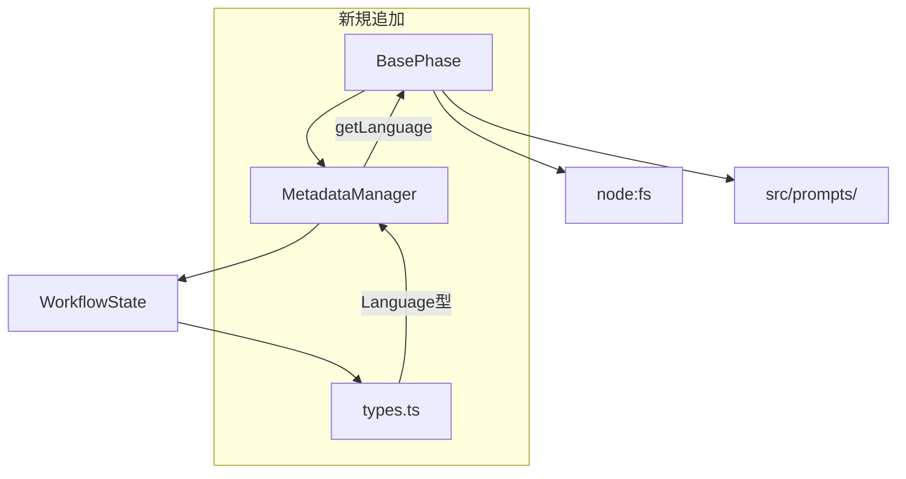
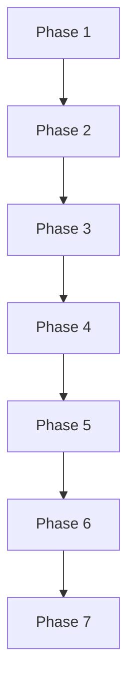

# Codex Agent 実行ログ

開始日時: 2025/12/30 3:00:12

---

## Turn 1: スレッド開始

**Thread ID**: `[REDACTED_TOKEN]`

## Turn 2: ツール実行

**種別**: reasoning
**ステータス**: completed

## Turn 3: ツール実行

**種別**: コマンド実行
**コマンド**: `/bin/bash -lc ls`
**ステータス**: completed (exit_code=0)

```text
ARCHITECTURE.md
CHANGELOG.md
CLAUDE.md
[REDACTED_TOKEN].md
[REDACTED_TOKEN].md
CODEBASE_SUMMARY.md
DOCKER_AUTH_SETUP.md
Dockerfile
Jenkinsfile
LICENSE
PROGRESS.md
README.md
ROADMAP.md
SETUP_TYPESCRIPT.md
TROUBLESHOOTING.md
__mocks__
docs
examples
jenkins
jest.config.cjs
metadata.json.template
package-lock.json
package.json
scripts
src
tests
tmp
tsconfig.json
tsconfig.test.json
```

## Turn 4: ツール実行

**種別**: reasoning
**ステータス**: completed

## Turn 5: ツール実行

**種別**: コマンド実行
**コマンド**: `/bin/bash -lc 'ls .ai-workflow'`
**ステータス**: completed (exit_code=0)

```text
issue-10
issue-102
issue-104
issue-105
issue-108
issue-113
issue-115
issue-119
issue-126
issue-127
issue-128
issue-140
issue-144
issue-150
issue-153
issue-155
issue-16
issue-161
issue-165
issue-174
issue-177
issue-18
issue-184
issue-188
issue-194
issue-2
issue-207
issue-208
issue-211
issue-212
issue-216
issue-22
issue-225
issue-23
issue-238
issue-24
issue-243
issue-248
issue-25
issue-253
issue-259
issue-26
issue-261
issue-271
issue-38
issue-45
issue-46
issue-47
issue-48
issue-49
issue-5
issue-50
issue-51
issue-52
issue-54
issue-571
issue-58
issue-61
issue-64
issue-7
issue-73
issue-74
issue-90
issue-91
```

## Turn 6: ツール実行

**種別**: コマンド実行
**コマンド**: `/bin/bash -lc 'ls .ai-workflow/issue-571'`
**ステータス**: completed (exit_code=0)

```text
00_planning
01_requirements
02_design
03_test_scenario
04_implementation
metadata.json
```

## Turn 7: ツール実行

**種別**: reasoning
**ステータス**: completed

## Turn 8: ツール実行

**種別**: コマンド実行
**コマンド**: `/bin/bash -lc 'cat .ai-workflow/issue-571/00_planning/output/planning.md'`
**ステータス**: completed (exit_code=0)

```text
# プロジェクト計画書: Issue #571

## Implement prompt file switching based on language setting

---

## 1. Issue分析

### 概要

Issue #526で言語設定の解決ロジックとメタデータ永続化が実装されたが、実際のプロンプトファイルは日本語固定のままである。`metadata.json` の `language` 設定に応じてプロンプトファイルを切り替える機能を実装する。

### 複雑度: **中程度**

**判定根拠**:
- 複数ファイルの修正が必要（`base-phase.ts`、`copy-static-assets.mjs`、プロンプトファイル構造）
- 既存機能（`loadPrompt()`メソッド）の拡張が中心
- プロンプトファイルの構造変更（10フェーズ × 2言語 × 3種類 = 60ファイル）
- 新規アーキテクチャ変更ではなく、既存パターンに沿った拡張

### 見積もり工数: **12〜16時間**

**内訳**:
| 作業項目 | 見積もり時間 |
|---------|------------|
| 要件定義・設計 | 2h |
| プロンプトファイル構造変更（日本語移動） | 1h |
| 英語プロンプト翻訳（30ファイル） | 4〜6h |
| `BasePhase.loadPrompt()` 修正 | 1〜2h |
| ビルドスクリプト更新 | 0.5h |
| テストコード実装 | 2〜3h |
| 統合テスト・動作確認 | 1h |
| ドキュメント更新 | 0.5h |

### リスク評価: **中**

**理由**:
- プロンプトファイルの翻訳品質がシステム動作に影響
- 既存の全フェーズに影響するため、回帰テストが重要
- フォールバック機構が正しく動作しないと、言語未対応時にエラーが発生

---

## 2. 実装戦略判断

### 実装戦略: **EXTEND**

**判断根拠**:
- 既存の `BasePhase.loadPrompt()` メソッドを拡張して多言語対応を追加
- 新規ファイル作成は最小限（テストファイル1つ、英語プロンプト30ファイル）
- 既存のプロンプトロード機構を維持しつつ、言語切り替えロジックを追加
- `copy-static-assets.mjs` は既存のコピーロジックで対応可能（ディレクトリ構造変更のみ）

**EXTEND を選択した理由**:
1. `loadPrompt()` メソッドは既に存在し、パス解決ロジックを拡張するだけ
2. 環境情報注入や差し戻しコンテキスト注入など、既存の注入パターンを踏襲
3. プロンプトファイルのディレクトリ構造変更は、既存ファイルの移動が中心

### テスト戦略: **UNIT_INTEGRATION**

**判断根拠**:
- **ユニットテスト**: `loadPrompt()` メソッドの多言語パス解決ロジック、フォールバック動作
- **インテグレーションテスト**: 実際のプロンプトファイル構造での読み込み確認、ビルド後の動作確認

**UNIT_INTEGRATION を選択した理由**:
1. `loadPrompt()` のロジック変更はユニットテストで検証可能
2. プロンプトファイル構造変更は統合テストで実際のファイルシステム操作を検証
3. BDDは不要（エンドユーザー向け機能ではなく内部実装の拡張）

### テストコード戦略: **CREATE_TEST**

**判断根拠**:
- 新規テストファイル `tests/integration/[REDACTED_TOKEN].test.ts` を作成
- 既存の `base-phase-*.test.ts` とは独立した多言語切り替えテスト
- フォールバック動作の網羅的なテストには専用ファイルが適切

**CREATE_TEST を選択した理由**:
1. 多言語切り替えは新規機能であり、独立したテストスイートが適切
2. 既存テストファイルへの追加では、テストの関心事が混在する
3. Issue本文で `tests/integration/[REDACTED_TOKEN].test.ts` が指定されている

---

## 3. 影響範囲分析

### 既存コードへの影響

| ファイル | 変更内容 | 影響度 |
|---------|---------|-------|
| `src/phases/base-phase.ts` | `loadPrompt()` メソッドの多言語対応 | 高 |
| `scripts/copy-static-assets.mjs` | 多言語ディレクトリ構造のコピー対応 | 低 |
| `src/prompts/*/` | ディレクトリ構造変更（`{phase}/{lang}/` 形式へ） | 中 |
| `src/types.ts` | `DEFAULT_LANGUAGE` 定数の追加（必要に応じて） | 低 |

### 依存関係の変更

- **新規依存**: なし
- **既存依存の変更**: なし
- **内部依存**: `MetadataManager.getLanguage()` メソッドの利用（既に実装済み想定）

### マイグレーション要否

- **プロンプトファイル構造**:
  - 既存の `src/prompts/{phase}/*.txt` を `src/prompts/{phase}/ja/*.txt` に移動
  - 英語版プロンプト `src/prompts/{phase}/en/*.txt` を新規作成
- **設定ファイル変更**: なし
- **データベーススキーマ変更**: なし

### 影響を受けるフェーズ（全10フェーズ）

1. Planning (00)
2. Requirements (01)
3. Design (02)
4. Test Scenario (03)
5. Implementation (04)
6. Test Implementation (05)
7. Testing (06)
8. Documentation (07)
9. Report (08)
10. Evaluation (09)

---

## 4. タスク分割

### Phase 1: 要件定義 (見積もり: 1〜2h)

- [x] Task 1-1: 機能要件の明確化 (1h)
  - 多言語プロンプト切り替えの仕様定義
  - フォールバック動作の仕様定義
  - 対象言語（ja, en）の確定

- [x] Task 1-2: 受け入れ基準の定義 (0.5h)
  - `language: 'ja'` 設定時に日本語プロンプトが読み込まれる
  - `language: 'en'` 設定時に英語プロンプトが読み込まれる
  - 指定言語のプロンプトが存在しない場合、日本語にフォールバック
  - ビルド後も多言語ディレクトリ構造が維持される

### Phase 2: 設計 (見積もり: 1〜2h)

- [x] Task 2-1: `loadPrompt()` メソッドの設計 (1h)
  - 言語パラメータ取得方法の設計
  - パス解決ロジックの設計
  - フォールバック機構の設計

- [x] Task 2-2: ディレクトリ構造の設計 (0.5h)
  - `src/prompts/{phase}/{lang}/*.txt` 構造の確定
  - ビルド後の `dist/prompts/` 構造の確定

### Phase 3: テストシナリオ (見積もり: 1〜2h)

- [x] Task 3-1: ユニットテストシナリオ作成 (1h)
  - `loadPrompt()` 日本語読み込みテスト
  - `loadPrompt()` 英語読み込みテスト
  - フォールバックテスト（言語未対応時）
  - エラーテスト（プロンプトファイル欠落時）

- [x] Task 3-2: 統合テストシナリオ作成 (0.5h)
  - 全10フェーズの多言語切り替え確認
  - ビルド後のプロンプト読み込み確認

### Phase 4: 実装 (見積もり: 6〜8h)

- [ ] Task 4-1: プロンプトファイル構造の変更 (1h)
  - 既存日本語プロンプトを `{phase}/ja/` に移動
  - ディレクトリ作成スクリプトの実行

- [ ] Task 4-2: 英語プロンプトの翻訳・作成 (4〜6h)
  - 10フェーズ × 3種類（execute, review, revise）= 30ファイル
  - LLMを使用した翻訳の実施
  - 翻訳品質の確認

- [ ] Task 4-3: `BasePhase.loadPrompt()` の多言語対応実装 (1〜2h)
  - `MetadataManager.getLanguage()` の呼び出し追加
  - パス解決ロジックの変更（言語ディレクトリを含める）
  - フォールバック機構の実装
  - ログ出力の追加

- [ ] Task 4-4: `DEFAULT_LANGUAGE` 定数の追加 (0.5h)
... (truncated)
```

## Turn 9: ツール実行

**種別**: reasoning
**ステータス**: completed

## Turn 10: ツール実行

**種別**: コマンド実行
**コマンド**: `/bin/bash -lc 'cat .ai-workflow/issue-571/02_design/output/design.md'`
**ステータス**: completed (exit_code=0)

```text
# 詳細設計書: Issue #571

## Implement prompt file switching based on language setting

---

## 0. Planning Documentの確認

本設計書は、Planning Phase成果物（`.ai-workflow/issue-571/00_planning/output/planning.md`）および要件定義書（`.ai-workflow/issue-571/01_requirements/output/requirements.md`）の計画に基づいて作成されています。

### 開発計画の概要

| 項目 | 内容 |
|------|------|
| **複雑度** | 中程度 |
| **見積もり工数** | 12〜16時間 |
| **実装戦略** | EXTEND（既存の`loadPrompt()`メソッドを拡張） |
| **テスト戦略** | UNIT_INTEGRATION |
| **テストコード戦略** | CREATE_TEST |

---

## 1. 既存コードベース分析

### 1.1 現状の実装

#### BasePhase.loadPrompt() メソッド

**ファイル**: `src/phases/base-phase.ts` (lines 291-320)

```typescript
protected loadPrompt(promptType: 'execute' | 'review' | 'revise'): string {
  const promptPath = path.join(promptsRoot, this.phaseName, `${promptType}.txt`);
  if (!fs.existsSync(promptPath)) {
    throw new Error(`Prompt file not found: ${promptPath}`);
  }

  let prompt = fs.readFileSync(promptPath, 'utf-8');

  // Issue #177: 環境情報の注入（execute ステップのみ）
  if (promptType === 'execute' && config.[REDACTED_TOKEN]()) {
    const environmentInfo = this.[REDACTED_TOKEN]();
    prompt = environmentInfo + '\n\n' + prompt;
    // ...
  }

  // Issue #90: 差し戻しコンテキストの注入
  if (promptType === 'revise') {
    // ...
  }

  return prompt;
}
```

**現状の問題**:
- パス解決: `promptsRoot/{phaseName}/{promptType}.txt` （言語考慮なし）
- 言語設定を一切参照していない
- 日本語プロンプトのみ存在

#### MetadataManager クラス

**ファイル**: `src/core/metadata-manager.ts`

**重要な発見**: `getLanguage()` メソッドは**存在しない**。Issue #526で実装済みとの前提だったが、実際には未実装。

**現在のWorkflowMetadata型** (`src/types.ts`):
```typescript
export interface WorkflowMetadata {
  issue_number: string;
  issue_url: string;
  issue_title: string;
  // ...
  // language フィールドは存在しない
}
```

#### プロンプトファイル構造

**現状**: `src/prompts/{phase}/{promptType}.txt`

```
src/prompts/
├── planning/
│   ├── execute.txt
│   ├── review.txt
│   └── revise.txt
├── requirements/
│   ├── execute.txt
│   ├── review.txt
│   └── revise.txt
├── design/
├── test_scenario/
├── implementation/
├── test_implementation/
├── testing/
├── documentation/
├── report/
└── evaluation/
```

#### copy-static-assets.mjs

**ファイル**: `scripts/copy-static-assets.mjs`

```javascript
const assets = [
  // ...
  {
    source: path.join(projectRoot, 'src', 'prompts'),
    target: path.join(distDir, 'prompts'),
  },
];

await fsp.cp(asset.source, asset.target, {
  recursive: true,
  force: true,
});
```

**評価**: `recursive: true` オプションにより、多言語ディレクトリ構造もそのままコピーされる。**変更不要**。

### 1.2 影響範囲の特定

| コンポーネント | 影響 | 変更内容 |
|--------------|------|---------|
| `src/types.ts` | 中 | `Language` 型、`DEFAULT_LANGUAGE` 定数の追加 |
| `src/core/metadata-manager.ts` | 中 | `getLanguage()` メソッドの追加 |
| `src/phases/base-phase.ts` | 高 | `loadPrompt()` メソッドの多言語対応 |
| `src/prompts/**/*` | 高 | ディレクトリ構造変更（60ファイル） |
| `scripts/copy-static-assets.mjs` | 低 | **変更不要**（既存の再帰コピーで対応） |

### 1.3 依存関係の確認



---

## 2. 実装戦略判断

### 実装戦略: **EXTEND**

**判断根拠**:
1. **既存メソッドの拡張が中心**: `BasePhase.loadPrompt()` の既存実装を維持しつつ、言語パラメータによるパス解決ロジックを追加
2. **既存パターンの踏襲**: Issue #177（環境情報注入）やIssue #90（差し戻しコンテキスト注入）と同様の注入パターンを適用
3. **MetadataManagerの拡張**: 既存クラスに `getLanguage()` メソッドを追加（新規クラス作成不要）
4. **ファイル構造変更のみ**: 既存の日本語プロンプトを `{phase}/ja/` に移動し、英語版を `{phase}/en/` に新規作成
5. **ビルドスクリプト変更不要**: `copy-static-assets.mjs` は既存の再帰コピーで対応可能

**CREATE を選択しなかった理由**:
- 新規コンポーネント作成は不要
- 既存の `loadPrompt()` メソッドの責務を維持

**REFACTOR を選択しなかった理由**:
- 既存コードの構造改善が目的ではなく、機能追加が目的
- 既存の設計パターンは適切

---

## 3. テスト戦略判断

### テスト戦略: **UNIT_INTEGRATION**

**判断根拠**:
1. **ユニットテストが必要な理由**:
   - `loadPrompt()` のパス解決ロジックは単体でテスト可能
   - フォールバック動作の境界値テストが必要
   - `MetadataManager.getLanguage()` の単体テスト

2. **統合テストが必要な理由**:
   - 実際のプロンプトファイル構造での読み込み確認
   - 全10フェーズでの多言語切り替えの動作確認
   - ビルド後（`dist/prompts/`
... (truncated)
```

## Turn 11: ツール実行

**種別**: reasoning
**ステータス**: completed

## Turn 12: ツール実行

**種別**: コマンド実行
**コマンド**: `/bin/bash -lc 'cat .ai-workflow/issue-571/01_requirements/output/requirements.md'`
**ステータス**: completed (exit_code=0)

```text
# 要件定義書: Issue #571

## Implement prompt file switching based on language setting

---

## 0. Planning Documentの確認

本要件定義は、Planning Phase成果物（`.ai-workflow/issue-571/00_planning/output/planning.md`）の計画に基づいて作成されています。

### 開発計画の概要

| 項目 | 内容 |
|------|------|
| **複雑度** | 中程度 |
| **見積もり工数** | 12〜16時間 |
| **実装戦略** | EXTEND（既存の`loadPrompt()`メソッドを拡張） |
| **テスト戦略** | UNIT_INTEGRATION |
| **テストコード戦略** | CREATE_TEST |

### リスク概要

- 英語プロンプトの翻訳品質がシステム動作に影響
- MetadataManager.getLanguage()の依存関係
- 既存テストの回帰リスク
- ビルドスクリプトの互換性

---

## 1. 概要

### 1.1 背景

Issue #526において、言語設定の優先順位解決ロジック（CLI > 環境変数 > メタデータ > デフォルト）とmetadata.jsonへの`language`フィールド永続化が実装された（PR #568）。しかし、現在のシステムでは実際のプロンプトファイル（`src/prompts/{phase}/execute.txt`等）が日本語固定のままであり、言語設定が反映されていない。

### 1.2 目的

`metadata.json`の`language`設定に応じて、適切な言語のプロンプトファイルを動的に読み込む機能を実装し、多言語対応ワークフローを実現する。

### 1.3 ビジネス価値

- **国際化対応**: 英語圏ユーザーへのサポート拡大
- **ユーザーエクスペリエンス向上**: 母国語でのプロンプト提供によるLLM応答品質向上
- **拡張性**: 将来的な多言語対応（中国語、韓国語等）への基盤整備

### 1.4 技術的価値

- **モジュール化**: 言語切り替えロジックの集中管理
- **後方互換性**: フォールバック機構による既存動作の保証
- **保守性**: 言語別プロンプトの独立した品質改善が可能

---

## 2. 機能要件

### FR-001: プロンプトファイルディレクトリ構造の多言語化

**優先度**: 高

**説明**: 既存のプロンプトファイル構造を多言語対応ディレクトリ構造に変更する。

**詳細仕様**:
- 現在の構造: `src/prompts/{phase}/{type}.txt`
- 新構造: `src/prompts/{phase}/{language}/{type}.txt`
- 対象フェーズ: 全10フェーズ（planning, requirements, design, test_scenario, implementation, test_implementation, testing, documentation, report, evaluation）
- 対象言語: `ja`（日本語）、`en`（英語）
- 対象ファイルタイプ: `execute.txt`、`review.txt`、`revise.txt`

**ファイル数**:
- 日本語: 30ファイル（10フェーズ × 3種類）の移動
- 英語: 30ファイル（10フェーズ × 3種類）の新規作成

### FR-002: BasePhase.loadPrompt()の多言語対応

**優先度**: 高

**説明**: `BasePhase`クラスの`loadPrompt()`メソッドを拡張し、言語設定に基づいてプロンプトファイルを読み込む。

**詳細仕様**:
```typescript
// 擬似コード
private loadPrompt(type: 'execute' | 'review' | 'revise'): string {
  const language = this.metadataManager.getLanguage(); // 言語設定を取得
  const promptPath = path.join(this.promptsRoot, this.phaseName, language, `${type}.txt`);

  // 指定言語のプロンプトが存在しない場合は日本語にフォールバック
  if (!fs.existsSync(promptPath)) {
    const fallbackPath = path.join(this.promptsRoot, this.phaseName, DEFAULT_LANGUAGE, `${type}.txt`);
    logger.warn(`Prompt not found for language '${language}', falling back to '${DEFAULT_LANGUAGE}'`);
    return fs.readFileSync(fallbackPath, 'utf-8');
  }

  return fs.readFileSync(promptPath, 'utf-8');
}
```

**依存関係**:
- `MetadataManager.getLanguage()`: Issue #526で実装済み想定（未実装の場合は本Issueで追加）

### FR-003: フォールバック機構

**優先度**: 高

**説明**: 指定された言語のプロンプトファイルが存在しない場合、日本語（デフォルト言語）にフォールバックする。

**詳細仕様**:
- デフォルト言語: `ja`（日本語）
- フォールバック条件: 指定言語のプロンプトファイルが存在しない場合
- ログ出力: フォールバック発生時にWARNレベルでログ出力
- エラー処理: デフォルト言語のプロンプトも存在しない場合はエラーをスロー

### FR-004: DEFAULT_LANGUAGE定数の追加

**優先度**: 中

**説明**: システム全体で使用するデフォルト言語を定数として定義する。

**詳細仕様**:
- 定義場所: `src/types.ts`または`src/core/config.ts`
- 定数名: `DEFAULT_LANGUAGE`
- デフォルト値: `'ja'`
- 型: `'ja' | 'en'`（Language型として定義も検討）

### FR-005: ビルドスクリプトの多言語対応

**優先度**: 中

**説明**: `scripts/copy-static-assets.mjs`を更新し、多言語ディレクトリ構造を`dist/prompts/`に正しくコピーする。

**詳細仕様**:
- 既存の`fs.cp()`による再帰コピーで対応可能（`recursive: true`オプション）
- コピー元: `src/prompts/{phase}/{lang}/*.txt`
- コピー先: `dist/prompts/{phase}/{lang}/*.txt`
- 検証: ビルド後に多言語ディレクトリ構造が維持されていることを確認

### FR-006: 英語プロンプトの作成

**優先度**: 高

**説明**: 全10フェーズ × 3種類 = 30ファイルの英語プロンプトを作成する。

**詳細仕様**:
- 翻訳対象: 既存の日本語プロンプトファイル
- 翻訳方法: LLMを使用した自動翻訳
- 品質保証: 主要プロンプト（特に`execute.txt`）の品質レビュー実施
- ファイル配置: `src/prompts/{phase}/en/`ディレクトリ

**対象ファイル一覧**:

| フェーズ | execute.txt | review.txt | revise.txt |
|---------|------------|-----------|------------|
| planning | 要翻訳 | 要翻訳 | 要翻訳 |
| requirements | 要翻訳 | 要翻訳 | 要翻訳 |
| design | 要翻訳 | 要翻訳 | 要翻訳 |
| test_scenario | 要翻訳 | 要翻訳 | 要翻訳 |
| implementation | 要翻訳 | 要翻訳 | 要翻訳 |
| test_implementation | 要翻訳 | 要翻訳 | 要翻訳 |
| testing | 要翻訳 | 要翻訳 | 要翻訳 |
| documentation | 要翻訳 | 要翻訳 | 要翻訳 |
| report | 要翻訳 | 要翻訳 | 要翻訳 |
| evaluation | 要翻訳 | 要翻訳 | 要翻訳 |

---

## 3. 非機能要件

### NFR-001: パフォーマンス要件

**説明**: プロンプトファイル読み込みのパフォーマンスへの影響を最小化する。

**詳細仕様**:
- 追加のファイルシステムアクセス:
... (truncated)
```

## Turn 13: ツール実行

**種別**: reasoning
**ステータス**: completed

## Turn 14: ツール実行

**種別**: コマンド実行
**コマンド**: `/bin/bash -lc 'cat .ai-workflow/issue-571/03_test_scenario/output/test-scenario.md'`
**ステータス**: completed (exit_code=0)

```text
# テストシナリオ: Issue #571

## Implement prompt file switching based on language setting

---

## 0. テスト戦略サマリー

### 選択されたテスト戦略（Phase 2から引用）

**テスト戦略**: **UNIT_INTEGRATION**

**判断根拠**:
1. **ユニットテストが必要な理由**:
   - `loadPrompt()` のパス解決ロジックは単体でテスト可能
   - フォールバック動作の境界値テストが必要
   - `MetadataManager.getLanguage()` の単体テスト

2. **統合テストが必要な理由**:
   - 実際のプロンプトファイル構造での読み込み確認
   - 全10フェーズでの多言語切り替えの動作確認
   - ビルド後（`dist/prompts/`）の動作確認

3. **BDDテストが不要な理由**:
   - エンドユーザー向け機能ではなく、内部実装の拡張
   - ユーザーストーリーが存在しない

### テスト対象の範囲

| コンポーネント | テスト種別 | 優先度 |
|--------------|----------|-------|
| `MetadataManager.getLanguage()` | Unit | 高 |
| `BasePhase.loadPrompt()` | Unit | 高 |
| プロンプトファイル構造 | Integration | 高 |
| 全10フェーズの多言語切り替え | Integration | 中 |
| ビルド後の動作確認 | Integration | 中 |

### テストの目的

1. `loadPrompt()` メソッドが言語設定に基づいて正しいプロンプトファイルを読み込むことを検証
2. フォールバック機構が正常に動作することを検証
3. 既存の環境情報注入・差し戻しコンテキスト注入との互換性を検証
4. 全10フェーズで多言語切り替えが正常に動作することを検証

### テストカバレッジ目標

- ユニットテスト: 90%以上（ロジック部分）
- 統合テスト: 全10フェーズ × 2言語 × 3種類 = 60パターン

---

## 1. Unitテストシナリオ

### 1.1 MetadataManager.getLanguage() テスト

**テストファイル**: `tests/unit/core/metadata-manager-language.test.ts`

#### TC-571-U01: getLanguage() - 日本語設定の取得

| 項目 | 内容 |
|-----|------|
| **目的** | metadata.jsonのlanguageが'ja'の場合、'ja'が返されることを検証 |
| **前提条件** | MetadataManagerインスタンスが初期化済み |
| **入力** | `metadata.language = 'ja'` |
| **期待結果** | `getLanguage()` が `'ja'` を返す |
| **テストデータ** | `{ language: 'ja', issue_number: '571', ... }` |

```typescript
test('TC-571-U01: getLanguage() returns "ja" when metadata.language is "ja"', () => {
  // Given
  const mockState = {
    data: { language: 'ja', issue_number: '571' }
  };
  const metadataManager = new MetadataManager(mockState);

  // When
  const result = metadataManager.getLanguage();

  // Then
  expect(result).toBe('ja');
});
```

#### TC-571-U02: getLanguage() - 英語設定の取得

| 項目 | 内容 |
|-----|------|
| **目的** | metadata.jsonのlanguageが'en'の場合、'en'が返されることを検証 |
| **前提条件** | MetadataManagerインスタンスが初期化済み |
| **入力** | `metadata.language = 'en'` |
| **期待結果** | `getLanguage()` が `'en'` を返す |
| **テストデータ** | `{ language: 'en', issue_number: '571', ... }` |

```typescript
test('TC-571-U02: getLanguage() returns "en" when metadata.language is "en"', () => {
  // Given
  const mockState = {
    data: { language: 'en', issue_number: '571' }
  };
  const metadataManager = new MetadataManager(mockState);

  // When
  const result = metadataManager.getLanguage();

  // Then
  expect(result).toBe('en');
});
```

#### TC-571-U03: getLanguage() - 未定義時のデフォルト値

| 項目 | 内容 |
|-----|------|
| **目的** | metadata.languageが未定義の場合、デフォルト言語'ja'が返されることを検証 |
| **前提条件** | MetadataManagerインスタンスが初期化済み |
| **入力** | `metadata.language = undefined` |
| **期待結果** | `getLanguage()` が `'ja'` (DEFAULT_LANGUAGE) を返す |
| **テストデータ** | `{ issue_number: '571' }` (languageフィールドなし) |

```typescript
test('TC-571-U03: getLanguage() returns DEFAULT_LANGUAGE when metadata.language is undefined', () => {
  // Given
  const mockState = {
    data: { issue_number: '571' } // No language field
  };
  const metadataManager = new MetadataManager(mockState);

  // When
  const result = metadataManager.getLanguage();

  // Then
  expect(result).toBe('ja');
});
```

#### TC-571-U04: getLanguage() - 無効な言語コード

| 項目 | 内容 |
|-----|------|
| **目的** | metadata.languageが無効な値の場合、デフォルト言語にフォールバックすることを検証 |
| **前提条件** | MetadataManagerインスタンスが初期化済み |
| **入力** | `metadata.language = 'fr'` (サポートされていない言語) |
| **期待結果** | `getLanguage()` が `'ja'` (DEFAULT_LANGUAGE) を返す |
| **テストデータ** | `{ language: 'fr', issue_number: '571' }` |

```typescript
test('TC-571-U04: getLanguage() returns DEFAULT_LANGUAGE for unsupported language code', () => {
  // Given
  const mockState = {
    data: { language: 'fr', issue_number: '571' }
  };
  const metadataManager = new MetadataManager(mockState);

  // When
  const result = metadataManager.getLanguage();

  // Then
  expect(result).toBe('ja');
});
```

#### TC-571-U05: getLanguage() - パストラバーサル攻撃対策

| 項目 | 内容 |
|-----|------|
| **目的
... (truncated)
```

## Turn 15: ツール実行

**種別**: reasoning
**ステータス**: completed

## Turn 16: ツール実行

**種別**: コマンド実行
**コマンド**: `/bin/bash -lc 'ls src/prompts'`
**ステータス**: completed (exit_code=0)

```text
auto-issue
content_parser
design
difficulty
documentation
evaluation
followup
implementation
planning
pr-comment
report
requirements
rollback
squash
test_implementation
test_scenario
testing
validation
```

## Turn 17: ツール実行

**種別**: reasoning
**ステータス**: completed

## Turn 18: ツール実行

**種別**: コマンド実行
**コマンド**: `/bin/bash -lc 'ls src/prompts/planning'`
**ステータス**: completed (exit_code=0)

```text
execute.txt
review.txt
revise.txt
```

## Turn 19: ツール実行

**種別**: reasoning
**ステータス**: completed

## Turn 20: ツール実行

**種別**: コマンド実行
**コマンド**: `/bin/bash -lc 'rg "loadPrompt" -n src/phases/base-phase.ts'`
**ステータス**: failed (exit_code=127)

```text
/bin/bash: line 1: rg: command not found
```

## Turn 21: ツール実行

**種別**: reasoning
**ステータス**: completed

## Turn 22: ツール実行

**種別**: コマンド実行
**コマンド**: `/bin/bash -lc 'grep -n "loadPrompt" -n src/phases/base-phase.ts'`
**ステータス**: completed (exit_code=0)

```text
291:  protected loadPrompt(promptType: 'execute' | 'review' | 'revise'): string {
457:    let prompt = this.loadPrompt('execute');
```

## Turn 23: ツール実行

**種別**: コマンド実行
**コマンド**: `/bin/bash -lc "sed -n '260,340p' src/phases/base-phase.ts"`
**ステータス**: completed (exit_code=0)

```text
this.metadata,
        this.reviewCycleManager,
        async () => this.runWithStepModel('execute', () => this.execute()),
        async () => this.runWithStepModel('review', () => this.review()),
        async () => this.shouldRunReview()
      );
    }

    if (!this.phaseRunner) {
      const reviseHandler = this.getReviseFunction();
      const wrappedRevise =
        reviseHandler !== null
          ? (feedback: string) => this.runWithStepModel('revise', () => reviseHandler(feedback))
          : null;

      this.phaseRunner = new PhaseRunner(
        this.phaseName,
        this.metadata,
        this.github,
        this.stepExecutor,
        this.skipDependencyCheck,
        this.ignoreDependencies,
        this.presetPhases,
        wrappedRevise
      );
    }

    // PhaseRunner に委譲（Issue #49）
    return this.phaseRunner.run(options);
  }

  protected loadPrompt(promptType: 'execute' | 'review' | 'revise'): string {
    const promptPath = path.join(promptsRoot, this.phaseName, `${promptType}.txt`);
    if (!fs.existsSync(promptPath)) {
      throw new Error(`Prompt file not found: ${promptPath}`);
    }

    let prompt = fs.readFileSync(promptPath, 'utf-8');

    // Issue #177: 環境情報の注入（execute ステップのみ、パッケージインストール可能時）
    if (promptType === 'execute' && config.[REDACTED_TOKEN]()) {
      const environmentInfo = this.[REDACTED_TOKEN]();
      prompt = environmentInfo + '\n\n' + prompt;

      logger.info(`Environment info injected into execute prompt for phase ${this.phaseName}`);
    }

    // Issue #90: 差し戻しコンテキストがある場合、プロンプトの先頭に追加
    // revise ステップのみに差し戻し情報を注入
    if (promptType === 'revise') {
      const rollbackContext = this.metadata.getRollbackContext(this.phaseName);
      if (rollbackContext) {
        const rollbackSection = this.[REDACTED_TOKEN](rollbackContext);
        prompt = rollbackSection + '\n\n' + prompt;

        logger.info(`Rollback context injected into revise prompt for phase ${this.phaseName}`);
      }
    }

    return prompt;
  }

  /**
   * Issue #177: 環境情報セクションのMarkdownを生成
   * @returns 環境情報セクションのMarkdown文字列
   * @private
   */
  private [REDACTED_TOKEN](): string {
    return `## 🛠️ 開発環境情報

このDocker環境では、以下のプログラミング言語をインストール可能です：

- **Python**: \`apt-get update && apt-get install -y python3 python3-pip\`
- **Go**: \`apt-get update && apt-get install -y golang-go\`
- **Java**: \`apt-get update && apt-get install -y default-jdk\`
- **Rust**: \`curl --proto '=https' --tlsv1.2 -sSf https://sh.rustup.rs | sh -s -- -y\`
- **Ruby**: \`apt-get update && apt-get install -y ruby ruby-dev\`

テスト実行や品質チェックに必要な言語環境は、自由にインストールしてください。`;
  }
```

## Turn 24: ツール実行

**種別**: reasoning
**ステータス**: completed

## Turn 25: ツール実行

**種別**: コマンド実行
**コマンド**: `/bin/bash -lc "sed -n '1,260p' src/core/metadata-manager.ts"`
**ステータス**: completed (exit_code=0)

```text
import fs from 'fs-extra';
import { logger } from '../utils/logger.js';
import { dirname, join } from 'node:path';
import { WorkflowState } from './workflow-state.js';
import {
  PhaseName,
  PhaseStatus,
  StepName,
  WorkflowMetadata,
  RemainingTask,
  PhaseMetadata,
  [REDACTED_TOKEN],
  [REDACTED_TOKEN],
  ModelConfigByPhase,
} from '../types.js';
import { [REDACTED_TOKEN], backupMetadataFile, [REDACTED_TOKEN] } from './helpers/metadata-io.js';

/**
 * フェーズの順序を定義
 * Object.keys() の順序は保証されないため、明示的な配列で順序を管理
 */
const PHASE_ORDER: PhaseName[] = [
  'planning',
  'requirements',
  'design',
  'test_scenario',
  'implementation',
  'test_implementation',
  'testing',
  'documentation',
  'report',
  'evaluation',
];

export class MetadataManager {
  public readonly metadataPath: string;
  public readonly workflowDir: string;
  private readonly state: WorkflowState;

  constructor(metadataPath: string) {
    this.metadataPath = metadataPath;
    this.workflowDir = dirname(metadataPath);
    this.state = WorkflowState.load(metadataPath);
  }

  private ensurePhaseData(
    phaseName: PhaseName,
  ): PhaseMetadata | [REDACTED_TOKEN] {
    let phaseData = this.state.data.phases[phaseName];
    if (phaseData) {
      return phaseData;
    }

    const migrated = this.state.migrate();
    phaseData = this.state.data.phases[phaseName];
    if (phaseData) {
      return phaseData;
    }

    logger.warn(`Phase ${phaseName} missing from metadata. Initializing default entry.`);
    if (phaseName === 'evaluation') {
      const evaluationData = this.[REDACTED_TOKEN]();
      this.state.data.phases.evaluation = evaluationData;
      return evaluationData;
    }

    const defaultData = this.[REDACTED_TOKEN]();
    this.state.data.phases[phaseName] = defaultData;
    return defaultData;
  }

  private [REDACTED_TOKEN](): PhaseMetadata {
    return {
      status: 'pending',
      retry_count: 0,
      started_at: null,
      completed_at: null,
      review_result: null,
      output_files: [],
      current_step: null,
      completed_steps: [],
      rollback_context: null,
    };
  }

  private [REDACTED_TOKEN](): [REDACTED_TOKEN] {
    const base = this.[REDACTED_TOKEN]();
    return {
      ...base,
      decision: null,
      failed_phase: null,
      remaining_tasks: [],
      created_issue_url: null,
      abort_reason: null,
    };
  }

  public get data(): WorkflowMetadata {
    return this.state.data;
  }

  public save(): void {
    this.state.save();
  }

  public updatePhaseStatus(
    phaseName: PhaseName,
    status: PhaseStatus,
    options: {
      outputFile?: string;
      reviewResult?: string;
    } = {},
  ): void {
    const phaseData = this.ensurePhaseData(phaseName);
    const currentStatus = phaseData.status;

    // Issue #248: 冪等性チェック（同じステータスへの重複更新をスキップ）
    if (currentStatus === status) {
      logger.info(`Phase ${phaseName}: Status already set to '${status}', skipping update`);
      return;
    }

    // Issue #248: ステータス遷移バリデーション（不正な遷移を検出）
    this.[REDACTED_TOKEN](phaseName, currentStatus, status);

    // 既存のステータス更新処理
    this.state.updatePhaseStatus(phaseName, status);

    if (options.outputFile) {
      if (!phaseData.output_files) {
        phaseData.output_files = [];
      }
      phaseData.output_files.push(options.outputFile);
    }

    if (options.reviewResult) {
      phaseData.review_result = options.reviewResult;
    }

    this.state.save();

    logger.debug(`Phase ${phaseName}: Status updated from '${currentStatus}' to '${status}'`);
  }

  /**
   * Issue #248: ステータス遷移のバリデーション
   *
   * 不正なステータス遷移を検出してログ出力する。
   * 不正な遷移でもステータス更新は実行される（エラーにはしない）。
   *
   * 許可される遷移:
   * - pending → in_progress
   * - in_progress → completed
   * - in_progress → failed
   *
   * 不正な遷移の例:
   * - completed → in_progress
   * - failed → in_progress
   * - pending → completed
   *
   * @pa
... (truncated)
```

## Turn 26: ツール実行

**種別**: reasoning
**ステータス**: completed

## Turn 27: ツール実行

**種別**: コマンド実行
**コマンド**: `/bin/bash -lc 'grep -n "getLanguage" -n src/core/metadata-manager.ts'`
**ステータス**: failed (exit_code=1)

## Turn 28: ツール実行

**種別**: reasoning
**ステータス**: completed

## Turn 29: ツール実行

**種別**: コマンド実行
**コマンド**: `/bin/bash -lc "sed -n '1,260p' src/types.ts"`
**ステータス**: completed (exit_code=0)

```text
export type PhaseName =
  | 'planning'
  | 'requirements'
  | 'design'
  | 'test_scenario'
  | 'implementation'
  | 'test_implementation'
  | 'testing'
  | 'documentation'
  | 'report'
  | 'evaluation';

export type PhaseStatus = 'pending' | 'in_progress' | 'completed' | 'failed';

// Issue #10: ステップ名の型定義
export type StepName = 'execute' | 'review' | 'revise';

export type DifficultyLevel = 'simple' | 'moderate' | 'complex';

export interface [REDACTED_TOKEN] {
  level: DifficultyLevel;
  confidence: number;
  factors: {
    estimated_file_changes: number;
    scope: 'single_file' | 'single_module' | 'multiple_modules' | 'cross_cutting';
    requires_tests: boolean;
    requires_architecture_change: boolean;
    complexity_score: number;
  };
  analyzed_at: string;
  analyzer_agent: 'claude' | 'codex';
  analyzer_model: string;
}

export interface StepModelConfig {
  claudeModel: 'opus' | 'sonnet';
  codexModel: 'max' | 'mini';
}

export interface PhaseModelConfig {
  execute: StepModelConfig;
  review: StepModelConfig;
  revise: StepModelConfig;
}

export type ModelConfigByPhase = {
  [phase in PhaseName]?: PhaseModelConfig;
};

export interface PhaseMetadata {
  status: PhaseStatus;
  retry_count: number;
  started_at: string | null;
  completed_at: string | null;
  review_result: string | null;
  output_files?: string[];
  // Issue #10: ステップ単位の進捗管理
  current_step?: StepName | null;  // 現在実行中のステップ（実行中でない場合はnull）
  completed_steps?: StepName[];     // 完了済みステップの配列（実行順序を保持）
  // Issue #90: 差し戻しコンテキスト（オプショナル）
  rollback_context?: import('./types/commands.js').RollbackContext | null;
}

/**
 * フォローアップ Issue の背景コンテキスト
 * Evaluation Phase から IssueClient に渡される
 */
export interface IssueContext {
  /**
   * 元 Issue の概要
   * 例: "Issue #91 では、BasePhase モジュール分解（Issue #49）で発生した 15 件のテスト失敗を修正しました。"
   */
  summary: string;

  /**
   * ブロッカーのステータス
   * 例: "すべてのブロッカーは解決済み"
   */
  blockerStatus: string;

  /**
   * タスクが残った理由
   * 例: "テスト失敗修正を優先したため、カバレッジ改善は後回しにした"
   */
  deferredReason: string;
}

/**
 * Evaluation Phase で検出された残タスク
 */
export interface RemainingTask {
  // ===== 既存フィールド（必須） =====
  /** タスクの説明 */
  task: string;

  /** 対象フェーズ（例: "implementation", "testing"） */
  phase: string;

  /** 優先度（例: "High", "Medium", "Low"） */
  priority: string;

  // ===== 新規フィールド（すべてオプショナル） =====

  /**
   * 優先度の理由
   * 例: "元 Issue #91 の推奨事項、ブロッカーではない"
   */
  priorityReason?: string;

  /**
   * 対象ファイル/モジュールのリスト
   * 例: ["src/core/phase-factory.ts", "src/commands/execute/agent-setup.ts"]
   */
  targetFiles?: string[];

  /**
   * 実行手順（番号付きリスト）
   * 例: ["不足しているテストケースを特定", "エッジケースのテストを追加"]
   */
  steps?: string[];

  /**
   * 受け入れ基準（Acceptance Criteria）
   * 例: ["すべての対象モジュールで 90% 以上のカバレッジを達成", "npm run test:coverage がすべてパス"]
   */
  acceptanceCriteria?: string[];

  /**
   * 依存タスク
   * 例: ["Task 1 完了後に実行", "Phase 4 の修正が必要"]
   */
  dependencies?: string[];

  /**
   * 見積もり工数
   * 例: "2-4h", "1日", "0.5h"
   */
  estimatedHours?: string;
}

export interface [REDACTED_TOKEN] {
  enabled: boolean;
  provider: 'auto' | 'openai' | 'claude' | 'agent';
  model?: string;
  temperature?: number;
  maxOutputTokens?: number;
  timeoutMs?: number;
  maxRetries?: number;
  maxTasks?: number;
  appendMetadata?: boolean;
}

export interface [REDACTED_TOKEN] {
  title: string;
  body: string;
  metadata: {
    provider: 'openai' | 'claude';
    model: string;
    durationMs: number;
    retryCount: number;
    inputTokens?: number;
    outputTokens?: number;
    omittedTasks?: number;
  };
}

export interface [REDACTED_TOKEN] extends PhaseMetadata {
  decision: string | null;
  failed_phase: PhaseName | null;
  remaining_tasks: RemainingTask[];
  created_issue_url: string | null;
  abort_reason: string | null;
}

export type PhasesMetadata = {
  [phase in Exclude<PhaseName, 'evaluation'>]: PhaseMetadata;
} & {
  evaluation: [REDACTED_TOKEN];
};

export interface DesignDecisions {
  implementation_strategy: string | null;
  test
... (truncated)
```

## Turn 30: ツール実行

**種別**: コマンド実行
**コマンド**: `/bin/bash -lc "sed -n '260,520p' src/types.ts"`
**ステータス**: completed (exit_code=0)

```text
/**
   * フェーズ別のモデル設定（[REDACTED_TOKEN] 有効時に設定）
   */
  model_config?: ModelConfigByPhase | null;
}

export interface [REDACTED_TOKEN] {
  success: boolean;
  output?: string | null;
  error?: string | null;
  decision?: string | null;
  approved?: boolean;       // レビュー承認フラグ（Issue #49）
  feedback?: string;        // レビューフィードバック（Issue #49）
}

export interface PhaseRunSummary {
  phases: PhaseName[];
  success: boolean;
  failed_phase?: PhaseName;
  error?: string;
  results: Record<
    PhaseName,
    {
      success: boolean;
      error?: string;
      output?: string | null;
    }
  >;
}

export interface GitCommandResult {
  success: boolean;
  error?: string;
  [key: string]: unknown;
}

export interface [REDACTED_TOKEN] {
  success: boolean;
  decision?: string;
  failedPhase?: PhaseName;
  abortReason?: string;
  remainingTasks?: RemainingTask[];
  error?: string;
}
```

## Turn 31: ツール実行

**種別**: reasoning
**ステータス**: completed

## Turn 32: ツール実行

**種別**: コマンド実行
**コマンド**: `/bin/bash -lc 'grep -R "language" -n src | head'`
**ステータス**: completed (exit_code=0)

```text
src/core/content-parser.ts:576:   * Uses LLM to extract structured information from natural language
```

## Turn 33: ツール実行

**種別**: コマンド実行
**コマンド**: `/bin/bash -lc 'grep -R "language" -n src/core src/phases src/types.ts'`
**ステータス**: completed (exit_code=0)

```text
src/core/content-parser.ts:576:   * Uses LLM to extract structured information from natural language
```

## Turn 34: ツール実行

**種別**: reasoning
**ステータス**: completed

## Turn 35: ツール実行

**種別**: コマンド実行
**コマンド**: `/bin/bash -lc "sed -n '1,220p' src/core/workflow-state.ts"`
**ステータス**: completed (exit_code=0)

```text
import fs from 'fs-extra';
import { logger } from '../utils/logger.js';
import { basename, dirname, join } from 'node:path';
import { resolveProjectPath } from './path-utils.js';
import {
  PhaseMetadata,
  PhaseName,
  PhaseStatus,
  WorkflowMetadata,
  PhasesMetadata,
  [REDACTED_TOKEN],
} from '../types.js';

const [REDACTED_TOKEN] = (date = new Date()): string => {
  const pad = (value: number) => value.toString().padStart(2, '0');
  return [
    date.getFullYear(),
    pad(date.getMonth() + 1),
    pad(date.getDate()),
  ].join('') +
    '_' +
    [pad(date.getHours()), pad(date.getMinutes()), pad(date.getSeconds())].join('');
};

const [REDACTED_TOKEN] = resolveProjectPath('metadata.json.template');

export class WorkflowState {
  public readonly metadataPath: string;
  public data: WorkflowMetadata;

  private constructor(metadataPath: string, data: WorkflowMetadata) {
    this.metadataPath = metadataPath;
    this.data = data;
  }

  public static createNew(
    metadataPath: string,
    issueNumber: string,
    issueUrl: string,
    issueTitle: string,
  ): WorkflowState {
    if (!fs.existsSync([REDACTED_TOKEN])) {
      throw new Error(
        `Template file not found: ${[REDACTED_TOKEN]}`,
      );
    }

    const initialData = JSON.parse(
      fs.readFileSync([REDACTED_TOKEN], 'utf-8')
    ) as WorkflowMetadata;

    const nowIso = new Date().toISOString();
    initialData.issue_number = issueNumber;
    initialData.issue_url = issueUrl;
    initialData.issue_title = issueTitle;
    initialData.created_at = nowIso;
    initialData.updated_at = nowIso;

    fs.mkdirSync(dirname(metadataPath), { recursive: true });
    fs.writeFileSync(metadataPath, JSON.stringify(initialData, null, 2), 'utf-8');

    return new WorkflowState(metadataPath, initialData);
  }

  public static load(metadataPath: string): WorkflowState {
    if (!fs.existsSync(metadataPath)) {
      throw new Error(`metadata.json not found: ${metadataPath}`);
    }

    const data = JSON.parse(fs.readFileSync(metadataPath, 'utf-8')) as WorkflowMetadata;
    return new WorkflowState(metadataPath, data);
  }

  public save(): void {
    this.data.updated_at = new Date().toISOString();
    fs.writeFileSync(this.metadataPath, JSON.stringify(this.data, null, 2), 'utf-8');
  }

  public updatePhaseStatus(phase: PhaseName, status: PhaseStatus): void {
    const phases = this.data.phases;
    if (!(phase in phases)) {
      throw new Error(`Unknown phase: ${phase}`);
    }

    const phaseData = phases[phase];
    phaseData.status = status;

    const nowIso = new Date().toISOString();
    if (status === 'in_progress') {
      phaseData.started_at = nowIso;
    } else if (status === 'completed' || status === 'failed') {
      phaseData.completed_at = nowIso;
    }

    this.data.current_phase = phase;
  }

  public incrementRetryCount(phase: PhaseName): number {
    const phases = this.data.phases;
    if (!(phase in phases)) {
      throw new Error(`Unknown phase: ${phase}`);
    }

    const current = phases[phase].retry_count;
    if (current >= 3) {
      throw new Error(`Max retry count exceeded for phase: ${phase}`);
    }

    phases[phase].retry_count = current + 1;
    return phases[phase].retry_count;
  }

  public setDesignDecision(key: string, value: string): void {
    if (!(key in this.data.design_decisions)) {
      throw new Error(`Unknown design decision key: ${key}`);
    }

    this.data.design_decisions[key] = value;
  }

  public getPhaseStatus(phase: PhaseName): PhaseStatus {
    const phases = this.data.phases;
    if (!(phase in phases)) {
      throw new Error(`Unknown phase: ${phase}`);
    }

    return phases[phase].status;
  }

  public migrate(): boolean {
    if (!fs.existsSync([REDACTED_TOKEN])) {
      logger.warn(`Template file not found: ${[REDACTED_TOKEN]}`);
      return false;
    }

    const template = JSON.parse(
      fs.readFileSync([REDACTED_TOKEN], 'utf-8'
... (truncated)
```

## Turn 36: ツール実行

**種別**: reasoning
**ステータス**: completed

## Turn 37: ツール実行

**種別**: コマンド実行
**コマンド**: `/bin/bash -lc 'cat metadata.json.template'`
**ステータス**: completed (exit_code=0)

```text
{
  "issue_number": "",
  "issue_url": "",
  "issue_title": "",
  "repository": null,
  "target_repository": null,
  "workflow_version": "1.0.0",
  "current_phase": "planning",
  "design_decisions": {
    "[REDACTED_TOKEN]": null,
    "test_strategy": null,
    "test_code_strategy": null
  },
  "cost_tracking": {
    "total_input_tokens": 0,
    "total_output_tokens": 0,
    "total_cost_usd": 0.0
  },
  "difficulty_analysis": null,
  "model_config": null,
  "phases": {
    "planning": {
      "status": "pending",
      "retry_count": 0,
      "started_at": null,
      "completed_at": null,
      "review_result": null
    },
    "requirements": {
      "status": "pending",
      "retry_count": 0,
      "started_at": null,
      "completed_at": null,
      "review_result": null
    },
    "design": {
      "status": "pending",
      "retry_count": 0,
      "started_at": null,
      "completed_at": null,
      "review_result": null
    },
    "test_scenario": {
      "status": "pending",
      "retry_count": 0,
      "started_at": null,
      "completed_at": null,
      "review_result": null
    },
    "implementation": {
      "status": "pending",
      "retry_count": 0,
      "started_at": null,
      "completed_at": null,
      "review_result": null
    },
    "test_implementation": {
      "status": "pending",
      "retry_count": 0,
      "started_at": null,
      "completed_at": null,
      "review_result": null
    },
    "testing": {
      "status": "pending",
      "retry_count": 0,
      "started_at": null,
      "completed_at": null,
      "review_result": null
    },
    "documentation": {
      "status": "pending",
      "retry_count": 0,
      "started_at": null,
      "completed_at": null,
      "review_result": null
    },
    "report": {
      "status": "pending",
      "retry_count": 0,
      "started_at": null,
      "completed_at": null,
      "review_result": null
    },
    "evaluation": {
      "status": "pending",
      "retry_count": 0,
      "started_at": null,
      "completed_at": null,
      "review_result": null,
      "decision": null,
      "failed_phase": null,
      "remaining_tasks": [],
      "created_issue_url": null,
      "abort_reason": null
    }
  },
  "created_at": "",
  "updated_at": ""
}
```

## Turn 38: ツール実行

**種別**: reasoning
**ステータス**: completed

## Turn 39: ツール実行

**種別**: コマンド実行
**コマンド**: `/bin/bash -lc 'grep -R "language" -n | head'`
**ステータス**: completed (exit_code=0)

```text
.ai-workflow/issue-126/05_test_implementation/output/test-implementation.md:292:#### TC-RA-009: [REDACTED_TOKEN] with unsupported language
.ai-workflow/issue-127/06_testing/output/test-result.md:36:- TC-RA-009: [REDACTED_TOKEN] with unsupported language - ✅ PASS
.ai-workflow/issue-127/07_documentation/output/[REDACTED_TOKEN].md:302:  - Language-agnostic support (30+ languages, inherited from Issue #144)
.ai-workflow/issue-127/09_evaluation/execute/agent_log_raw.txt:15:{"type":"user","message":{"role":"user","content":[{"tool_use_id":"[REDACTED_TOKEN]","type":"tool_result","content":"     1→# テスト実行結果 - Phase 6 Revise #2\n     2→\n     3→## 総合判定: 大幅改善、残課題あり\n     4→\n     5→**判定**: ⚠️ **PARTIAL SUCCESS - Phase 2のユニットテスト67%成功、統合テストは修正中**\n     6→\n     7→**主要な成果**:\n     8→- ✅ **ブロッカー#1（TypeScriptコンパイルエラー）**: 完全に解消\n     9→- ✅ **ブロッカー#2（Phase 2ユニットテスト18件失敗）**: 67%解消（12件成功、6件残存）\n    10→- ⚠️ **ブロッカー#3（Phase 2統合テスト14件失敗）**: ES Modules環境対応のアプローチで修正中\n    11→\n    12→---\n    13→\n    14→## 実行サマリー\n    15→\n    16→- **実行日時**: 2025-01-31 23:57:00 JST\n    17→- **テストフレームワーク**: Jest (Node 20)\n    18→- **対象Issue**: #127 - auto-issue Phase 2: リファクタリング検出機能の実装\n    19→- **修正内容**: ユニットテストと統合テストのモック設定（ES Modules環境対応）\n    20→\n    21→###ユニットテスト: `tests/unit/core/repository-analyzer.test.ts`\n    22→\n    23→**実行結果**:\n    24→- **総テスト数**: 22件\n    25→- **成功**: 14件（64%成功率）\n    26→- **失敗**: 8件\n    27→\n    28→**修正内容**:\n    29→1. Phase 2のテストケース（TC-2.1.1〜TC-2.3.3）に `jest.spyOn(analyzer as any, '[REDACTED_TOKEN]').mockReturnValue('mock repository code')` を追加\n    30→2. ファイルシステムアクセスを回避し、モックデータでバリデーションロジックを検証\n    31→\n    32→**成功したテスト** (14件):\n    33→- TC-RA-004: analyze with invalid JSON output - ✅ PASS\n    34→- TC-RA-006: parseAgentOutput without JSON block - ✅ PASS\n    35→- TC-RA-008: [REDACTED_TOKEN] with short title - ✅ PASS\n    36→- TC-RA-009: [REDACTED_TOKEN] with unsupported language - ✅ PASS\n    37→- TC-2.1.1: [REDACTED_TOKEN] with valid large-file candidate - ✅ PASS\n    38→- TC-2.1.2: [REDACTED_TOKEN] with duplication and lineRange - ✅ PASS\n    39→- TC-2.1.3: [REDACTED_TOKEN] with missing-docs and low priority - ✅ PASS\n    40→- TC-2.2.1: [REDACTED_TOKEN] with missing type field - ✅ PASS\n    41→- TC-2.2.2: [REDACTED_TOKEN] with missing description - ✅ PASS\n    42→- TC-2.2.3: [REDACTED_TOKEN] with invalid type - ✅ PASS\n    43→- TC-2.2.4: [REDACTED_TOKEN] with short description - ✅ PASS\n    44→- TC-2.2.5: [REDACTED_TOKEN] with short suggestion - ✅ PASS\n    45→- TC-2.2.6: [REDACTED_TOKEN] with invalid priority - ✅ PASS\n    46→- TC-2.3.3: [REDACTED_TOKEN] with all refactor types - ✅ PASS\n    47→\n    48→**Phase 2テストの成功率**: 18件中12件成功（67%）\n    49→\n    50→**失敗したテスト** (8件):\n    51→- TC-RA-001: analyze with Codex agent - ❌ FAIL（Phase 1バグ検出テスト）\n    52→- TC-RA-002: analyze with Claude agent - ❌ FAIL（Phase 1バグ検出テスト）\n    53→- TC-RA-003: analyze with auto mode fallback - ❌ FAIL（Phase 1バグ検出テスト）\n    54→- TC-RA-005: parseAgentOutput with JSON format - ❌ FAIL（Phase 1バグ検出テスト）\n    55→- TC-RA-007: [REDACTED_TOKEN] with valid candidate - ❌ FAIL（Phase 1バグ検出テスト）\n    56→- TC-RA-010: [REDACTED_TOKEN] with 10-character title - ❌ FAIL（Phase 1バグ検出テスト）\n    57→- TC-2.3.1: [REDACTED_TOKEN] with 20-character description - ❌ FAIL（Phase 2リファクタリングテスト）\n    58→- TC-2.3.2: [REDACTED_TOKEN] with 20-character suggestion - ❌ FAIL（Phase 2リファクタリングテスト）\n    59→\n    60→**失敗原因の分析**:\n    61→1. **Phase 1のテスト6件**: `analyze()`メソッドがファイル出力方式を使用しているが、モックされた`executeTask`が実際のファイルを作成しないため、空の配列が返される\n    62→2. **TC-2.3.1とTC-2.3.2**: バリデーションでfilePath除外パターンチェックまたは他の検証で弾かれている可能性（ログレベルがdebugのため詳細未確認）\n    63→\n    64→---\n    65→\n    66→### 統合テスト: `tests/integration/auto-issue-refactor.test.ts`\n    67→\n    68→**修正内容**:\n    69→1. `jest.mock()`から`jest.spyOn()`アプローチに変更（ES Modules環境対応）\n    70→2. `RepositoryAnalyze
... (truncated)
```

## Turn 40: ツール実行

**種別**: reasoning
**ステータス**: completed

## Turn 41: ツール実行

**種別**: reasoning
**ステータス**: completed

## Turn 42: ツール実行

**種別**: reasoning
**ステータス**: completed

## Turn 43: ツール実行

**種別**: コマンド実行
**コマンド**: `/bin/bash -lc 'cat src/prompts/planning/execute.txt'`
**ステータス**: completed (exit_code=0)

```text
# プロジェクト計画フェーズ - 実行プロンプト

## タスク概要

GitHubのIssue情報から詳細なプロジェクト計画書を作成してください。
Phase 0はプロジェクトマネージャの役割を担い、開発作業を計画的かつ効率的に進められるようにします。

## Issue情報

{issue_info}

## プロジェクト計画書の構成

以下のセクションを含むプロジェクト計画書を作成してください：

### 1. Issue分析
- **複雑度**: 簡単/中程度/複雑を判定
  - 簡単: 単一ファイルの修正、シンプルな機能追加（見積もり: ~4時間）
  - 中程度: 複数ファイルの修正、既存機能の拡張（見積もり: 4~16時間）
  - 複雑: アーキテクチャ変更、新規サブシステム追加（見積もり: 16時間~）
- **見積もり工数**: X時間（根拠を記載）
- **リスク評価**: 低/中/高

### 2. 実装戦略判断

**重要**: このセクションは最も重要です。Phase 2（Design）で使用されるため、必ず明記してください。

#### 実装戦略: CREATE / EXTEND / REFACTOR

**判断根拠**:
- CREATE: 新規ファイル・クラス・モジュールの作成が中心
- EXTEND: 既存コードの拡張（機能追加）が中心
- REFACTOR: 既存コードのリファクタリング（構造改善）が中心

（判断理由を具体的に記載）

#### テスト戦略: UNIT_ONLY / INTEGRATION_ONLY / BDD_ONLY / UNIT_INTEGRATION / UNIT_BDD / INTEGRATION_BDD / ALL

**判断根拠**:
- UNIT_ONLY: ユニットテストのみ（単純なロジック、外部依存なし）
- INTEGRATION_ONLY: インテグレーションテストのみ（外部システム連携中心）
- BDD_ONLY: BDDテストのみ（ユーザーストーリー中心）
- UNIT_INTEGRATION: ユニット + インテグレーション（一般的な機能開発）
- UNIT_BDD: ユニット + BDD（エンドユーザー向け機能）
- INTEGRATION_BDD: インテグレーション + BDD（システム間連携＋ユーザーストーリー）
- ALL: すべてのテストレベル（大規模な変更、高リスク）

（判断理由を具体的に記載）

#### テストコード戦略: EXTEND_TEST / CREATE_TEST / BOTH_TEST

**判断根拠**:
- EXTEND_TEST: 既存テストファイルに追加（既存機能の拡張時）
- CREATE_TEST: 新規テストファイル作成（新規機能追加時）
- BOTH_TEST: 両方（既存テスト拡張 + 新規テスト作成）

（判断理由を具体的に記載）

### 3. 影響範囲分析
- **既存コードへの影響**: 変更が必要なファイル・モジュール
- **依存関係の変更**: 新規依存の追加、既存依存の変更
- **マイグレーション要否**: データベーススキーマ変更、設定ファイル変更等

### 4. タスク分割

## ⚠️ 重要: チェックリスト標準フォーマット（必須）

各フェーズのタスクは、**必ずチェックリスト形式**で記述してください。このチェックリストは、Review Phaseで完了判定に使用されます。

### 標準フォーマット

```markdown
### Phase X: [フェーズ名] (見積もり: X~Yh)

- [ ] Task X-1: [タスク名] (見積もり時間)
  - [サブタスク1]
  - [サブタスク2]
- [ ] Task X-2: [タスク名] (見積もり時間)
  - [サブタスク1]
```

**重要**: このチェックリストは、Review Phaseで完了判定に使用されます。各タスクは明確で検証可能な内容にしてください。

**良い例**:
```
- [ ] Task 4-1: CLI層の分離 (3~5h)
  - cli/commands.py の作成
  - main.pyからCLIロジックを抽出
```

**悪い例**:
```
- [ ] リファクタリングを実施
```
（検証不可能なため不適切）

### 各フェーズのタスクリスト

各フェーズについて、サブタスクを洗い出してください：

#### Phase 1: 要件定義 (見積もり: Xh)

- [ ] Task 1-1: [タスク名] (見積もり時間)
  - サブタスク1
  - サブタスク2
- [ ] Task 1-2: [タスク名] (見積もり時間)
  - サブタスク1

#### Phase 2: 設計 (見積もり: Xh)

- [ ] Task 2-1: [タスク名] (見積もり時間)
  - サブタスク1
  - サブタスク2

#### Phase 3: テストシナリオ (見積もり: Xh)

- [ ] Task 3-1: [タスク名] (見積もり時間)
  - サブタスク1

#### Phase 4: 実装 (見積もり: Xh)

- [ ] Task 4-1: [タスク名] (見積もり時間)
  - サブタスク1
  - サブタスク2

#### Phase 5: テストコード実装 (見積もり: Xh)

- [ ] Task 5-1: [タスク名] (見積もり時間)
  - サブタスク1

#### Phase 6: テスト実行 (見積もり: Xh)

- [ ] Task 6-1: [タスク名] (見積もり時間)
  - サブタスク1

#### Phase 7: ドキュメント (見積もり: Xh)

- [ ] Task 7-1: [タスク名] (見積もり時間)
  - サブタスク1

#### Phase 8: レポート (見積もり: Xh)

- [ ] Task 8-1: [タスク名] (見積もり時間)
  - サブタスク1

**タスク粒度基準**:
- 1タスク = 1~4時間程度で完了可能な作業単位
- 明確な完了条件（Done criteria）を持つ
- 他のタスクから独立して実装・テスト可能
- **検証可能**: Review Phaseで「完了したか」を客観的に判断できる内容

### 5. 依存関係

タスク間の依存関係をMermaid形式で図示してください：



### 6. リスクと軽減策

潜在的なリスクを洗い出し、各リスクに対する軽減策を記載してください：

#### リスク1: （リスク名）
- **影響度**: 低/中/高
- **確率**: 低/中/高
- **軽減策**: （具体的な対策）

#### リスク2: （リスク名）
...

**リスクカテゴリ**:
- 技術的リスク: 新技術の学習コスト、既存システムとの統合問題
- スコープリスク: 要件の曖昧さ、スコープクリープ
- リソースリスク: 工数不足、スキル不足
- 依存リスク: 外部システム依存、ブロッキング問題

### 7. 品質ゲート

各フェーズの合格基準を定義してください：

#### Phase 1: 要件定義
- [ ] 機能要件が明確に記載されている
- [ ] 受け入れ基準が定義されている
...

#### Phase 2: 設計
- [ ] 実装戦略の判断根拠が明記されている
- [ ] テスト戦略の判断根拠が明記されている
...

（以下、Phase 3~7についても記載）

## 出力形式

Markdown形式でプロジェクト計画書を作成し、以下のファイルに保存してください：

```
.ai-workflow/issue-{issue_number}/00_planning/output/planning.md
```

## 品質ゲート（Phase 0）

作成するプロジェクト計画書は、以下の品質ゲートを満たす必要があります：

- [ ] **実装戦略が明確に決定されている**（CREATE/EXTEND/REFACTOR）
- [ ] **テスト戦略が明確に決定されている**（UNIT_ONLY/.../ALL）
- [ ] **テストコード戦略が明確に決定されている**（EXTEND_TEST/CREATE_TEST/BOTH_TEST）
- [ ] **影響範囲が分析されている**
- [ ] **タスク分割が適切な粒度である**（1タスク = 1~4時間）
- [ ] **リスクが洗い出されている**

これらの品質ゲートは**必須要件**です。作成後、クリティカルシンキングレビューが実施され、品質ゲートを満たさない場合は修正が必要になります。

## 注意事項

1. **実装戦略の判断**: Phase 2で使用されるため、必ず明記してください
   - 実装戦略: CREA
... (truncated)
```

## Turn 44: ツール実行

**種別**: reasoning
**ステータス**: completed

## Turn 45: ツール実行

**種別**: コマンド実行
**コマンド**: `/bin/bash -lc 'cat src/prompts/requirements/execute.txt'`
**ステータス**: completed (exit_code=0)

```text
# 要件定義フェーズ - 実行プロンプト

## タスク概要

GitHubのIssue情報から詳細な要件定義書を作成してください。

## 入力情報

### Planning Phase成果物
- Planning Document: {[REDACTED_TOKEN]}

**注意**: Planning Phaseが実行されている場合、開発計画（実装戦略、テスト戦略、リスク、スケジュール）を必ず確認してください。

### GitHub Issue情報

{issue_info}

## 要件定義書の構成

以下のセクションを含む要件定義書を作成してください：

### 0. Planning Documentの確認（Planning Phaseが実行されている場合）
- 開発計画の全体像を把握
- スコープ、技術選定、リスク、スケジュールを確認
- Planning Documentで策定された戦略を踏まえて要件定義を実施

### 1. 概要
- Issue本文の「## 概要」セクションを要約
- 背景と目的を明確に記述
- ビジネス価値・技術的価値を説明

### 2. 機能要件
- Issue本文の「## TODO」セクションから機能要件を抽出
- 各要件を明確かつ検証可能な形で記述
- 優先度（高/中/低）を付与

### 3. 非機能要件
- パフォーマンス要件
- セキュリティ要件
- 可用性・信頼性要件
- 保守性・拡張性要件

### 4. 制約事項
- 技術的制約（使用技術、既存システムとの整合性）
- リソース制約（時間、人員、予算）
- ポリシー制約（セキュリティポリシー、コーディング規約）

### 5. 前提条件
- システム環境
- 依存コンポーネント
- 外部システム連携

### 6. 受け入れ基準
- 各機能要件の受け入れ基準（Given-When-Then形式推奨）
- テスト可能な形で記述

### 7. スコープ外
- 明確にスコープ外とする事項
- 将来的な拡張候補

## 出力形式

Markdown形式で要件定義書を作成し、以下のファイルに保存してください：

```
.ai-workflow/issue-{issue_number}/01_requirements/output/requirements.md
```

## 品質ゲート（Phase 1）

作成する要件定義書は、以下の品質ゲートを満たす必要があります：

- [ ] **機能要件が明確に記載されている**
- [ ] **受け入れ基準が定義されている**
- [ ] **スコープが明確である**
- [ ] **論理的な矛盾がない**

これらの品質ゲートは**必須要件**です。作成後、クリティカルシンキングレビューが実施され、品質ゲートを満たさない場合は修正が必要になります。

## 注意事項

1. **具体性**: 曖昧な表現を避け、具体的かつ測定可能な要件を記述
   - NG例: "適切に処理する"、"必要に応じて対応"
   - OK例: "3秒以内にレスポンスを返す"、"エラー発生時は管理者に通知"

2. **整合性**: 各セクション間で矛盾がないか確認
   - 機能要件と受け入れ基準が対応しているか
   - 非機能要件と制約事項が矛盾していないか

3. **完全性**: Issue本文の情報を漏れなく反映
   - TODOセクションの項目をすべて機能要件に反映
   - 概要セクションの背景・目的を明確に記述

4. **検証可能性**: 各要件が検証可能（テスト可能）な形で記述
   - 受け入れ基準は Given-When-Then 形式で記述
   - 成功条件・失敗条件が明確に識別可能

5. **レビューされることを意識**: 作成した要件定義書はクリティカルシンキングレビューが実施されます
   - 品質ゲート（4つの必須要件）を最優先で満たすこと
   - ブロッカー（次フェーズに進めない問題）がないように注意
   - 改善提案は歓迎されるが、ブロッカーは修正が必須

## 参考情報

必要に応じて以下を参照してください（存在する場合）：
- @CLAUDE.md - プロジェクトの全体方針とコーディングガイドライン
- @ARCHITECTURE.md - アーキテクチャ設計思想
- @CONTRIBUTION.md - 開発ガイドライン
- @README.md - プロジェクト概要と使用方法
- その他、プロジェクト固有のドキュメント
```

## Turn 46: ツール実行

**種別**: reasoning
**ステータス**: completed

## Turn 47: ツール実行

**種別**: コマンド実行
**コマンド**: `/bin/bash -lc 'grep -R "Planning Phase" -n src/prompts'`
**ステータス**: completed (exit_code=0)

```text
src/prompts/design/execute.txt:8:### Planning Phase成果物
src/prompts/design/execute.txt:11:**注意**: Planning Phaseが実行されている場合、開発計画（実装戦略、テスト戦略、リスク、スケジュール）を必ず確認してください。
src/prompts/design/review.txt:25:## ⚠️ 重要: Planning Phaseチェックリストとの照合（必須）
src/prompts/design/review.txt:65:## Planning Phaseチェックリスト照合結果: FAIL
src/prompts/design/review.txt:79:Planning.mdの読み込みと照合作業は必要ですが、**planning.mdの全文やPlanning Phaseのレビュー内容をレビュー結果に含めないでください**。
src/prompts/design/review.txt:86:Planning Phaseのレビュー詳細やplanning.mdの内容全体は出力しないこと。
src/prompts/documentation/execute.txt:8:### Planning Phase成果物
src/prompts/documentation/execute.txt:11:**注意**: Planning Phaseが実行されている場合、開発計画（実装戦略、テスト戦略、リスク、スケジュール）を必ず確認してください。
src/prompts/documentation/review.txt:30:## ⚠️ 重要: Planning Phaseチェックリストとの照合（必須）
src/prompts/documentation/review.txt:70:## Planning Phaseチェックリスト照合結果: FAIL
src/prompts/documentation/review.txt:84:Planning.mdの読み込みと照合作業は必要ですが、**planning.mdの全文やPlanning Phaseのレビュー内容をレビュー結果に含めないでください**。
src/prompts/documentation/review.txt:91:Planning Phaseのレビュー詳細やplanning.mdの内容全体は出力しないこと。
src/prompts/implementation/execute.txt:8:### Planning Phase成果物
src/prompts/implementation/execute.txt:11:**注意**: Planning Phaseが実行されている場合、開発計画（実装戦略、テスト戦略、リスク、スケジュール）を必ず確認してください。
src/prompts/implementation/review.txt:34:## ⚠️ 重要: Planning Phaseチェックリストとの照合（必須）
src/prompts/implementation/review.txt:74:## Planning Phaseチェックリスト照合結果: FAIL
src/prompts/implementation/review.txt:88:Planning.mdの読み込みと照合作業は必要ですが、**planning.mdの全文やPlanning Phaseのレビュー内容をレビュー結果に含めないでください**。
src/prompts/implementation/review.txt:95:Planning Phaseのレビュー詳細やplanning.mdの内容全体は出力しないこと。
src/prompts/report/execute.txt:8:### Planning Phase成果物
src/prompts/report/execute.txt:11:**注意**: Planning Phaseが実行されている場合、開発計画（実装戦略、テスト戦略、リスク、スケジュール）を必ず確認してください。
src/prompts/report/review.txt:25:## ⚠️ 重要: Planning Phaseチェックリストとの照合（必須）
src/prompts/report/review.txt:65:## Planning Phaseチェックリスト照合結果: FAIL
src/prompts/report/review.txt:79:Planning.mdの読み込みと照合作業は必要ですが、**planning.mdの全文やPlanning Phaseのレビュー内容をレビュー結果に含めないでください**。
src/prompts/report/review.txt:86:Planning Phaseのレビュー詳細やplanning.mdの内容全体は出力しないこと。
src/prompts/requirements/execute.txt:9:### Planning Phase成果物
src/prompts/requirements/execute.txt:12:**注意**: Planning Phaseが実行されている場合、開発計画（実装戦略、テスト戦略、リスク、スケジュール）を必ず確認してください。
src/prompts/requirements/execute.txt:22:### 0. Planning Documentの確認（Planning Phaseが実行されている場合）
src/prompts/requirements/review.txt:24:## ⚠️ 重要: Planning Phaseチェックリストとの照合（必須）
src/prompts/requirements/review.txt:64:## Planning Phaseチェックリスト照合結果: FAIL
src/prompts/requirements/review.txt:78:Planning.mdの読み込みと照合作業は必要ですが、**planning.mdの全文やPlanning Phaseのレビュー内容をレビュー結果に含めないでください**。
src/prompts/requirements/review.txt:85:Planning Phaseのレビュー詳細やplanning.mdの内容全体は出力しないこと。
src/prompts/test_implementation/execute.txt:47:### Planning Phase成果物
src/prompts/test_implementation/execute.txt:50:**注意**: Planning Phaseが実行されている場合、開発計画（実装戦略、テスト戦略、リスク、スケジュール）を必ず確認してください。
src/prompts/test_implementation/review.txt:28:## ⚠️ 重要: Planning Phaseチェックリストとの照合（必須）
src/prompts/test_implementation/review.txt:68:## Planning Phaseチェックリスト照合結果: FAIL
src/prompts/test_implementation/review.txt:82:Planning.mdの読み込みと照合作業は必要ですが、**planning.mdの全文やPlanning Phaseのレビュー内容をレビュー結果に含めないでください**。
src/prompts/test_implementation/review.txt:89:Planning Phaseのレビュー詳細やplanning.mdの内容全体は出力しないこと。
src/prompts/test_scenario/execute.txt:8:### Planning Phase成果物
src/prompts/test_scenario/execute.txt:11:**注意**: Planning Phaseが実行されている場合、開発計画（実装戦略、テスト戦略、リスク、スケジュール）を必ず確認してください。
src/prompts/test_scenario/review.txt:27:## ⚠️ 重要: Planning Phaseチェックリストとの照合（必須）
src/prompts/test_scenario/review.txt:67:## Planning Phaseチェックリスト照合結果: FAIL
src/prompts/test_scenario/review.txt:81:Planning.mdの読み込みと照合作業は必要ですが、**planning.mdの全文やPlanning Phaseのレビュー内容をレビュー結果に含めないでください**。
src/prompts/test_scenario/review.txt:88:Planning Phaseのレビュー詳細やplanning.mdの内容全体は出力しないこと。
src/prompts/testing/execute.txt:41:### Planning Phase成果物
src/prompts/testing/execute.txt:44:**注意**: Planning Phaseが実行されている場合、開発計画（実
... (truncated)
```

## Turn 48: ツール実行

**種別**: reasoning
**ステータス**: completed

## Turn 49: ツール実行

**種別**: コマンド実行
**コマンド**: `/bin/bash -lc 'head -n 80 src/prompts/planning/review.txt'`
**ステータス**: completed (exit_code=0)

```text
# プロジェクト計画書レビュー - レビュープロンプト

## タスク概要

作成されたプロジェクト計画書をクリティカルシンキングによってレビューし、実現可能性と品質を確認してください。

## 計画書

{[REDACTED_TOKEN]}

## レビュー観点

以下の観点から計画書をレビューしてください：

### 1. 実現可能性
- **見積もりの妥当性**: タスクの見積もりが現実的か
- **リソースの充足性**: 必要なリソース（時間、スキル）は十分か
- **技術的実現可能性**: 提案された技術・アプローチは実現可能か
- **依存関係の整合性**: タスク間の依存関係が論理的に整合しているか

### 2. タスク分割の適切性
- **粒度の適切性**: 1タスク = 1~4時間程度の作業単位になっているか
- **完了条件の明確性**: 各タスクの完了条件（Done criteria）が明確か
- **独立性**: 各タスクが他のタスクから独立して実装・テスト可能か
- **網羅性**: Issue本文のTODOがすべてタスクに反映されているか

### 3. リスク分析の網羅性
- **リスクカテゴリの網羅**: 技術的、スコープ、リソース、依存の各リスクが考慮されているか
- **影響度・確率の妥当性**: リスクの影響度と確率が適切に評価されているか
- **軽減策の具体性**: 各リスクに対する軽減策が具体的に記載されているか
- **見落としリスクの有無**: 重要なリスクが見落とされていないか

### 4. 戦略判断の妥当性
- **実装戦略**: CREATE/EXTEND/REFACTORの選択が適切か（必須チェック）
- **テスト戦略**: UNIT_ONLY/.../ALLの選択が適切か（必須チェック）
- **テストコード戦略**: EXTEND_TEST/CREATE_TEST/BOTH_TESTの選択が適切か（必須チェック）
- **判断根拠**: 各戦略の選択理由が明確に記載されているか

### 5. 品質ゲートの確認

以下の品質ゲートがすべて満たされているか確認してください：

- [ ] **実装戦略が明確に決定されている**（CREATE/EXTEND/REFACTOR）
- [ ] **テスト戦略が明確に決定されている**（UNIT_ONLY/.../ALL）
- [ ] **テストコード戦略が明確に決定されている**（EXTEND_TEST/CREATE_TEST/BOTH_TEST）
- [ ] **影響範囲が分析されている**
- [ ] **タスク分割が適切な粒度である**（1タスク = 1~4時間）
- [ ] **リスクが洗い出されている**

## レビュー判定基準

レビュー結果は以下の3段階で判定してください：

### ⚠️ 最重要: 品質ゲートは絶対条件

**品質ゲート（6項目）は必須要件です。1つでも満たされていない場合、判定は自動的にFAILになります。**

- 品質ゲートは「最低限クリアすべき基準」であり、交渉の余地はありません
- 「80点で十分」の原則は、品質ゲートを満たした上での改善提案に適用されます
- 品質ゲートを満たさない状態で次フェーズに進むことは許されません

### PASS（合格）

以下の**すべて**を満たす場合のみPASS：
- ✅ **6つの品質ゲートすべてが満たされている**（1つでも×があればFAIL）
- ✅ ブロッカー（次フェーズに進めない問題）がない
- ✅ 計画が実行可能で、適切に構造化されている
- ✅ 軽微な改善提案もない、または非常に些細（typo程度）

### [REDACTED_TOKEN]（条件付き合格）

以下の**すべて**を満たす場合のみ[REDACTED_TOKEN]：
- ✅ **6つの品質ゲートすべてが満たされている**（1つでも×があればFAIL）
- ✅ ブロッカーは存在しない
- ✅ 改善余地はあるが、次フェーズに進むことは可能
- ⚠️ 改善提案を記載するが、現時点での実行は可能

### FAIL（不合格）

以下の**いずれか1つでも**該当すればFAIL：
```

## Turn 50: ツール実行

**種別**: reasoning
**ステータス**: completed

## Turn 51: ツール実行

**種別**: コマンド実行
**コマンド**: `/bin/bash -lc 'head -n 60 src/prompts/evaluation/execute.txt'`
**ステータス**: completed (exit_code=0)

```text
# 評価フェーズ - 実行プロンプト

あなたはソフトウェア開発ワークフローの総合的な品質と完成度を評価するAIプロジェクト評価者です。フェーズ1〜8の成果物を評価し、プロジェクトが完成準備完了かを判断することがあなたの任務です。

## ⚠️ 最重要：必須アクション

**このタスクの最終ステップとして、評価レポートを以下のパスに必ず保存してください：**

```
.ai-workflow/issue-{issue_number}/09_evaluation/output/evaluation_report.md
```

**Write ツールを使用してファイル保存すること。このファイルが存在しない場合、Evaluation Phase は失敗します。**

評価内容の生成だけでなく、**ファイル保存が必須**です。表示（出力）ではなく、**Write ツールによる保存**を忘れないでください。

---

## コンテキスト

- **Issue**: #{issue_number} - {issue_title}
- **リポジトリ**: {repo_name}
- **ブランチ**: {branch_name}
- **ワークフローディレクトリ**: {workflow_dir}

## ⚠️ 重要：コンテキスト制限への対応

**Report Phase（Phase 8）の成果物を主たる情報源として使用してください。**

Report Phase の `report.md` には、全フェーズ（Phase 0〜8）の実施内容、成果物、テスト結果が包括的にまとめられています。評価には基本的にこのファイルのみを読み込んでください。

**個別フェーズの成果物は、Report の内容に疑問がある場合や、詳細確認が必要な場合にのみ参照してください。全ファイルを読み込むとコンテキスト制限を超過するため、避けてください。**

## 評価の主要情報源（必読）

- **Report Phase 成果物**: {[REDACTED_TOKEN]}

## 参考情報（詳細確認が必要な場合のみ）

以下は詳細確認が必要な場合にのみ参照してください。**全てを読み込まないでください**：

{phase_outputs}

## 評価基準

以下の基準に照らしてプロジェクトを評価してください：

### 1. 要件の完全性
- フェーズ1（要件定義）からのすべての要件が対応されているか？
- 欠落または不完全な要件はないか？

### 2. 設計品質
- フェーズ2（設計）は明確な実装ガイダンスを提供しているか？
- 設計決定は十分に文書化され、正当化されているか？
- アーキテクチャは健全で保守可能か？

### 3. テストカバレッジ
- フェーズ3（テストシナリオ）はすべての重要なパスをカバーしているか？
- エッジケースとエラー条件がテストされているか？
- フェーズ6（テスト実行）の結果は十分なカバレッジを示しているか？
```

## Turn 52: ツール実行

**種別**: reasoning
**ステータス**: completed

## Turn 53: ツール実行

**種別**: コマンド実行
**コマンド**: `/bin/bash -lc 'ls docs'`
**ステータス**: completed (exit_code=0)

```text
[REDACTED_TOKEN].md
```

## Turn 54: ツール実行

**種別**: reasoning
**ステータス**: completed

## Turn 55: ツール実行

**種別**: コマンド実行
**コマンド**: `/bin/bash -lc 'for phase in planning requirements design test_scenario implementation test_implementation testing documentation report evaluation; do echo "--- $phase"; ls src/prompts/$phase; done'`
**ステータス**: completed (exit_code=0)

```text
--- planning
execute.txt
review.txt
revise.txt
--- requirements
execute.txt
review.txt
revise.txt
--- design
execute.txt
review.txt
revise.txt
--- test_scenario
execute.txt
review.txt
revise.txt
--- implementation
execute.txt
review.txt
revise.txt
--- test_implementation
execute.txt
review.txt
revise.txt
--- testing
execute.txt
review.txt
revise.txt
--- documentation
execute.txt
review.txt
revise.txt
--- report
execute.txt
review.txt
revise.txt
--- evaluation
execute.txt
review.txt
revise.txt
```

## Turn 56: ツール実行

**種別**: reasoning
**ステータス**: completed

## Turn 57: ツール実行

**種別**: コマンド実行
**コマンド**: `/bin/bash -lc 'set -e
phases=(planning requirements design test_scenario implementation test_implementation testing documentation report evaluation)
for phase in "${phases[@]}"; do
  mkdir -p "src/prompts/${phase}/ja" "src/prompts/${phase}/en"
  mv "src/prompts/${phase}/execute.txt" "src/prompts/${phase}/ja/execute.txt"
  mv "src/prompts/${phase}/review.txt" "src/prompts/${phase}/ja/review.txt"
  mv "src/prompts/${phase}/revise.txt" "src/prompts/${phase}/ja/revise.txt"
done
'`
**ステータス**: completed (exit_code=0)

## Turn 58: ツール実行

**種別**: reasoning
**ステータス**: completed

## Turn 59: ツール実行

**種別**: コマンド実行
**コマンド**: `/bin/bash -lc 'for phase in planning requirements design test_scenario implementation test_implementation testing documentation report evaluation; do echo "--- $phase"; ls src/prompts/$phase; done'`
**ステータス**: completed (exit_code=0)

```text
--- planning
en
ja
--- requirements
en
ja
--- design
en
ja
--- test_scenario
en
ja
--- implementation
en
ja
--- test_implementation
en
ja
--- testing
en
ja
--- documentation
en
ja
--- report
en
ja
--- evaluation
en
ja
```

## Turn 60: ツール実行

**種別**: reasoning
**ステータス**: completed

## Turn 61: ツール実行

**種別**: コマンド実行
**コマンド**: `/bin/bash -lc 'ls src/prompts/planning/ja'`
**ステータス**: completed (exit_code=0)

```text
execute.txt
review.txt
revise.txt
```

## Turn 62: ツール実行

**種別**: reasoning
**ステータス**: completed

## Turn 63: ツール実行

**種別**: file_change
**ステータス**: completed

## Turn 64: ツール実行

**種別**: reasoning
**ステータス**: completed

## Turn 65: ツール実行

**種別**: コマンド実行
**コマンド**: `/bin/bash -lc "sed -n '80,240p' src/prompts/planning/ja/review.txt"`
**ステータス**: completed (exit_code=0)

```text
以下の**いずれか1つでも**該当すればFAIL：
- ❌ **品質ゲート（6項目）のうち1つでも満たされていない**
- ❌ ブロッカー（次フェーズに進めない問題）が1つ以上存在する
- ❌ 計画が実行不可能、または構造的に問題がある

**重要**:
- ブロッカーとは「このまま次フェーズに進むと確実に問題が発生する事項」を指します
- 改善提案は「より良くするための提案」であり、ブロッカーではありません
- **品質ゲートは絶対条件であり、1つでも満たされていなければ自動的にFAIL**です

## ブロッカーの例

以下はブロッカーの例です（これらが存在する場合はFAIL）：

1. **戦略未定義**: 実装戦略・テスト戦略・テストコード戦略のいずれかが明記されていない
2. **タスク粒度の問題**: タスクが大きすぎる（8時間以上）または小さすぎる（15分以下）
3. **依存関係の矛盾**: タスクAがタスクBに依存し、タスクBがタスクAに依存（循環依存）
4. **実現不可能な見積もり**: 明らかに実現不可能な短時間見積もり
5. **重要リスクの見落とし**: 明らかに重大なリスクが記載されていない

## 改善提案の例

以下は改善提案の例です（これらは[REDACTED_TOKEN]で記載）：

1. **見積もりの精度向上**: バッファを追加してより安全な見積もりにする
2. **リスク分析の詳細化**: リスクの軽減策をより具体的に記載する
3. **タスク分割の細分化**: タスクをより小さな単位に分割して進捗管理しやすくする
4. **品質ゲートの追加**: より厳密な品質チェック項目を追加する

## レビュー結果の出力形式

以下の形式でレビュー結果を出力してください：

```markdown
## レビュー結果

**判定: PASS / [REDACTED_TOKEN] / FAIL**

## 実現可能性

（実現可能性に関するコメント）

## タスク分割の適切性

（タスク分割に関するコメント）

## リスク分析の網羅性

（リスク分析に関するコメント）

## 戦略判断の妥当性

（戦略判断に関するコメント）

## 品質ゲート確認

**⚠️ 重要: 各項目に対して明示的にPASS/FAILを判定してください。1つでもFAILがあれば最終判定は自動的にFAILです。**

- [x/　] 実装戦略が明確に決定されている: **PASS / FAIL** - （判定理由）
- [x/　] テスト戦略が明確に決定されている: **PASS / FAIL** - （判定理由）
- [x/　] テストコード戦略が明確に決定されている: **PASS / FAIL** - （判定理由）
- [x/　] 影響範囲が分析されている: **PASS / FAIL** - （判定理由）
- [x/　] タスク分割が適切な粒度である: **PASS / FAIL** - （判定理由）
- [x/　] リスクが洗い出されている: **PASS / FAIL** - （判定理由）

**品質ゲート総合判定: PASS / FAIL**
- PASS: 上記6項目すべてがPASS
- FAIL: 上記6項目のうち1つでもFAIL

**品質ゲート判定がFAILの場合、最終判定は自動的にFAILになります。**

## ブロッカー（FAIL時のみ）

1. （ブロッカー1の説明）
2. （ブロッカー2の説明）
...

## 改善提案（[REDACTED_TOKEN]時のみ）

1. （改善提案1の説明）
2. （改善提案2の説明）
...

## 総合評価

（総合的な評価コメント）
```

## 注意事項

1. **客観性**: 感情や主観を排除し、事実に基づいてレビュー
2. **建設的**: 批判だけでなく、具体的な改善案を提示
3. **明確性**: ブロッカーと改善提案を明確に区別
4. **完全性**: すべてのレビュー観点を網羅してチェック

## レビューを開始してください
```

## Turn 66: ツール実行

**種別**: reasoning
**ステータス**: completed

## Turn 67: ツール実行

**種別**: コマンド実行
**コマンド**: `/bin/bash -lc "sed -n '1,120p' src/prompts/planning/ja/review.txt"`
**ステータス**: completed (exit_code=0)

```text
# プロジェクト計画書レビュー - レビュープロンプト

## タスク概要

作成されたプロジェクト計画書をクリティカルシンキングによってレビューし、実現可能性と品質を確認してください。

## 計画書

{[REDACTED_TOKEN]}

## レビュー観点

以下の観点から計画書をレビューしてください：

### 1. 実現可能性
- **見積もりの妥当性**: タスクの見積もりが現実的か
- **リソースの充足性**: 必要なリソース（時間、スキル）は十分か
- **技術的実現可能性**: 提案された技術・アプローチは実現可能か
- **依存関係の整合性**: タスク間の依存関係が論理的に整合しているか

### 2. タスク分割の適切性
- **粒度の適切性**: 1タスク = 1~4時間程度の作業単位になっているか
- **完了条件の明確性**: 各タスクの完了条件（Done criteria）が明確か
- **独立性**: 各タスクが他のタスクから独立して実装・テスト可能か
- **網羅性**: Issue本文のTODOがすべてタスクに反映されているか

### 3. リスク分析の網羅性
- **リスクカテゴリの網羅**: 技術的、スコープ、リソース、依存の各リスクが考慮されているか
- **影響度・確率の妥当性**: リスクの影響度と確率が適切に評価されているか
- **軽減策の具体性**: 各リスクに対する軽減策が具体的に記載されているか
- **見落としリスクの有無**: 重要なリスクが見落とされていないか

### 4. 戦略判断の妥当性
- **実装戦略**: CREATE/EXTEND/REFACTORの選択が適切か（必須チェック）
- **テスト戦略**: UNIT_ONLY/.../ALLの選択が適切か（必須チェック）
- **テストコード戦略**: EXTEND_TEST/CREATE_TEST/BOTH_TESTの選択が適切か（必須チェック）
- **判断根拠**: 各戦略の選択理由が明確に記載されているか

### 5. 品質ゲートの確認

以下の品質ゲートがすべて満たされているか確認してください：

- [ ] **実装戦略が明確に決定されている**（CREATE/EXTEND/REFACTOR）
- [ ] **テスト戦略が明確に決定されている**（UNIT_ONLY/.../ALL）
- [ ] **テストコード戦略が明確に決定されている**（EXTEND_TEST/CREATE_TEST/BOTH_TEST）
- [ ] **影響範囲が分析されている**
- [ ] **タスク分割が適切な粒度である**（1タスク = 1~4時間）
- [ ] **リスクが洗い出されている**

## レビュー判定基準

レビュー結果は以下の3段階で判定してください：

### ⚠️ 最重要: 品質ゲートは絶対条件

**品質ゲート（6項目）は必須要件です。1つでも満たされていない場合、判定は自動的にFAILになります。**

- 品質ゲートは「最低限クリアすべき基準」であり、交渉の余地はありません
- 「80点で十分」の原則は、品質ゲートを満たした上での改善提案に適用されます
- 品質ゲートを満たさない状態で次フェーズに進むことは許されません

### PASS（合格）

以下の**すべて**を満たす場合のみPASS：
- ✅ **6つの品質ゲートすべてが満たされている**（1つでも×があればFAIL）
- ✅ ブロッカー（次フェーズに進めない問題）がない
- ✅ 計画が実行可能で、適切に構造化されている
- ✅ 軽微な改善提案もない、または非常に些細（typo程度）

### [REDACTED_TOKEN]（条件付き合格）

以下の**すべて**を満たす場合のみ[REDACTED_TOKEN]：
- ✅ **6つの品質ゲートすべてが満たされている**（1つでも×があればFAIL）
- ✅ ブロッカーは存在しない
- ✅ 改善余地はあるが、次フェーズに進むことは可能
- ⚠️ 改善提案を記載するが、現時点での実行は可能

### FAIL（不合格）

以下の**いずれか1つでも**該当すればFAIL：
- ❌ **品質ゲート（6項目）のうち1つでも満たされていない**
- ❌ ブロッカー（次フェーズに進めない問題）が1つ以上存在する
- ❌ 計画が実行不可能、または構造的に問題がある

**重要**:
- ブロッカーとは「このまま次フェーズに進むと確実に問題が発生する事項」を指します
- 改善提案は「より良くするための提案」であり、ブロッカーではありません
- **品質ゲートは絶対条件であり、1つでも満たされていなければ自動的にFAIL**です

## ブロッカーの例

以下はブロッカーの例です（これらが存在する場合はFAIL）：

1. **戦略未定義**: 実装戦略・テスト戦略・テストコード戦略のいずれかが明記されていない
2. **タスク粒度の問題**: タスクが大きすぎる（8時間以上）または小さすぎる（15分以下）
3. **依存関係の矛盾**: タスクAがタスクBに依存し、タスクBがタスクAに依存（循環依存）
4. **実現不可能な見積もり**: 明らかに実現不可能な短時間見積もり
5. **重要リスクの見落とし**: 明らかに重大なリスクが記載されていない

## 改善提案の例

以下は改善提案の例です（これらは[REDACTED_TOKEN]で記載）：

1. **見積もりの精度向上**: バッファを追加してより安全な見積もりにする
2. **リスク分析の詳細化**: リスクの軽減策をより具体的に記載する
3. **タスク分割の細分化**: タスクをより小さな単位に分割して進捗管理しやすくする
4. **品質ゲートの追加**: より厳密な品質チェック項目を追加する

## レビュー結果の出力形式

以下の形式でレビュー結果を出力してください：

```markdown
## レビュー結果

**判定: PASS / [REDACTED_TOKEN] / FAIL**

## 実現可能性

（実現可能性に関するコメント）
```

## Turn 68: ツール実行

**種別**: reasoning
**ステータス**: completed

## Turn 69: ツール実行

**種別**: file_change
**ステータス**: completed

## Turn 70: ツール実行

**種別**: コマンド実行
**コマンド**: `/bin/bash -lc 'cat src/prompts/planning/ja/revise.txt'`
**ステータス**: completed (exit_code=0)

```text
# プロジェクト計画書修正 - 修正プロンプト

## ⚠️ 必須タスク
**プロジェクト計画書の更新は最優先です。**
Edit ツールを使用して `.ai-workflow/issue-{issue_number}/00_planning/output/planning.md` を**上書き保存**し、古い内容は完全に置き換えて最新の計画書のみを残してください。ファイルが存在しない場合は Write ツールで新規作成してください。


---

## タスク概要

レビュー結果のフィードバックに基づいて、プロジェクト計画書を修正してください。

## 元の計画書

{[REDACTED_TOKEN]}

## レビューフィードバック

{review_feedback}

## Issue情報（参考）

{issue_info}

## 前回の実行ログ（参考）

以下は前回の実行ログの一部です。計画書内容がログに含まれている場合は、それを使用してファイルを作成できます：

```
{[REDACTED_TOKEN]}
```

## 修正方針

### ⚠️ 最重要: 計画書の上書き
Edit ツールで `.ai-workflow/issue-{issue_number}/00_planning/output/planning.md` を最優先で更新してください。内容は最新の Issue 分析と対応方針のみとし、不要な追記は避けてください。

以下の方針で計画書を修正してください：

### ケース A: プロジェクト計画書ファイルが未作成の場合

前回の実行でファイルが作成されなかった場合、以下の手順で対応してください：

1. **前回のログから計画書内容を抽出**（ログに計画書内容が含まれている場合）
   - 実装戦略、テスト戦略、影響範囲分析などを抽出
   - 整形して planning.md として保存

2. **新たに計画書を作成**（ログに計画書内容が不十分な場合）
   - Issue情報と要件に基づいて簡潔に計画書を作成
   - 必須項目（実装戦略、テスト戦略、タスク分割）を含める
   - Write ツールで planning.md として保存

### ケース B: レビューフィードバックに基づく修正の場合

1. **ブロッカーの解消（最優先）**
   - レビューで指摘されたブロッカーをすべて解消してください
   - ブロッカーとは「このまま次フェーズに進むと確実に問題が発生する事項」です
   - 戦略未定義、タスク粒度の問題、依存関係の矛盾などが該当します

2. **改善提案の反映（可能な範囲で）**
   - レビューで提案された改善点を可能な範囲で反映してください
   - すべての改善提案を反映する必要はありませんが、合理的な提案は積極的に取り入れてください

3. **品質ゲートの確認**
   - 修正後、すべての品質ゲートを満たしているか確認してください
   - [ ] **実装戦略が明確に決定されている**（CREATE/EXTEND/REFACTOR）
   - [ ] **テスト戦略が明確に決定されている**（UNIT_ONLY/.../ALL）
   - [ ] **テストコード戦略が明確に決定されている**（EXTEND_TEST/CREATE_TEST/BOTH_TEST）
   - [ ] **影響範囲が分析されている**
   - [ ] **タスク分割が適切な粒度である**（1タスク = 1~4時間）
   - [ ] **リスクが洗い出されている**

## 修正の進め方

1. **現状把握**: 元の計画書とレビューフィードバックを読み込み、問題点を把握
2. **優先順位付け**: ブロッカー → 改善提案の順に対応
3. **修正実施**: 元の計画書を読み込み、Edit toolで修正
4. **検証**: 修正後、品質ゲートをすべて満たしているか確認

## 修正手順（チェックリスト）
- [ ] 1. 現状把握とレビューフィードバックの理解を完了する
- [ ] 2. ブロッカーと改善提案の順で対応内容を決める
- [ ] 3. 修正内容と影響範囲を計画書に反映する
- [ ] 4. **Edit ツールで `.ai-workflow/issue-{issue_number}/00_planning/output/planning.md` を上書き保存**（必須）
- [ ] 5. 品質ゲート（戦略・分割・リスク等）を再確認する

## 出力形式

修正したプロジェクト計画書を以下のファイルに上書き保存してください：

```
.ai-workflow/issue-{issue_number}/00_planning/output/planning.md
```

**重要**: 必ず既存のplanning.mdを読み込んでから、Edit toolで修正してください。Write toolで新規作成しないでください。

## 注意事項

1. **修正の範囲**: 指摘された問題点に焦点を当て、不要な変更は避ける
2. **構造の維持**: 計画書の基本構造（セクション構成）は維持する
3. **戦略の明記**: 実装戦略・テスト戦略・テストコード戦略は必ず明記する
4. **具体性**: 修正内容は具体的かつ測定可能な形で記述する
5. **整合性**: 修正後も各セクション間で矛盾がないか確認する

## 修正の開始

上記の方針に従って、プロジェクト計画書を修正してください。
```

## Turn 71: ツール実行

**種別**: reasoning
**ステータス**: completed

## Turn 72: ツール実行

**種別**: file_change
**ステータス**: completed

## Turn 73: ツール実行

**種別**: reasoning
**ステータス**: completed

## Turn 74: ツール実行

**種別**: file_change
**ステータス**: completed

## Turn 75: ツール実行

**種別**: コマンド実行
**コマンド**: `/bin/bash -lc "sed -n '1,220p' src/prompts/requirements/ja/review.txt"`
**ステータス**: completed (exit_code=0)

```text
# 要件定義フェーズ - レビュープロンプト

## タスク概要

生成された要件定義書をクリティカルシンキングでレビューし、品質を評価してください。

**最優先事項**: レビュー完了後、必ず最終行に判定キーワードを明記すること。

## レビュー対象

{[REDACTED_TOKEN]}

## 品質ゲート（Phase 1）

要件定義書は以下の品質ゲートをクリアする必要があります：

- [ ] **機能要件が明確に記載されている**
- [ ] **受け入れ基準が定義されている**
- [ ] **スコープが明確である**
- [ ] **論理的な矛盾がない**

これらの品質ゲートは**必須要件**です。1つでも満たされていない場合は「FAIL」と判定してください。

## ⚠️ 重要: Planning Phaseチェックリストとの照合（必須）

### 1. Planning.mdの読み込み

以下のファイルを読み込んでください：
- {[REDACTED_TOKEN]}

### 2. 該当フェーズのチェックリストを抽出

Planning.mdから、現在のフェーズ（"### Phase 1:" または "## Phase 1:"）のセクションを見つけ、タスクチェックリストを抽出してください。

**注意**: チェックリストが見つからない場合は、このチェックをスキップしてください。

### 3. 要件定義内容との照合

要件定義書（requirements.md）と照合し、各タスクが完了しているかチェックしてください。

**完了の判定基準**:
- Task記載の要件項目が記述されているか
- Task記載の受け入れ基準が定義されているか
- サブタスクがすべて完了しているか

### 4. Planning.mdの更新

照合結果に基づき、planning.mdのチェックボックスを更新してください：

- 完了したタスク: `- [ ]` → `- [x]`
- 未完了のタスク: `- [ ]` のまま

**Editツールを使用**して、該当フェーズのセクションを更新してください。

### 5. レビュー判定への反映

- **すべてのタスクが完了**（全て `[x]`）: PASS または [REDACTED_TOKEN]
- **未完了タスクがある**（`[ ]` が残っている）: FAIL
  - レビューフィードバックに未完了タスクをリストアップ
  - 具体的に何が不足しているか説明

**例（FAIL時のフィードバック）**:
```
## Planning Phaseチェックリスト照合結果: FAIL

以下のタスクが未完了です：

- [ ] Task 1-2: 非機能要件の定義
  - 不足: パフォーマンス要件が定義されていません
- [ ] Task 1-3: 受け入れ基準の明確化
  - 不足: 各機能要件の受け入れ基準が不明確です

これらのタスクを完了してから再提出してください。
```

### ⚠️ 重要: Planning.mdの内容はレビュー結果に含めない

Planning.mdの読み込みと照合作業は必要ですが、**planning.mdの全文やPlanning Phaseのレビュー内容をレビュー結果に含めないでください**。

レビュー結果には以下のみを含めること:
- 要件定義書（requirements.md）に対する評価
- Planning.mdとの照合で発見した未完了タスク（FAIL時のみ）
- 要件定義書固有の改善提案

Planning Phaseのレビュー詳細やplanning.mdの内容全体は出力しないこと。

## レビュー姿勢

このレビューは「**80点で十分**」の原則に基づいて実施してください：

1. **完璧ではなく、十分を目指す**: 100点満点を求めず、プロジェクトを前進させられる品質を目指す
2. **ブロッカーと改善提案を明確に区別**: 次フェーズに進めない問題（ブロッカー）と、改善が望ましい事項（改善提案）を明確に分ける
3. **実用的でバランスの取れた判断**: 理論的完璧性よりも、実装可能性とビジネス価値を重視
4. **建設的なフィードバック**: 問題指摘だけでなく、具体的な改善提案を提示

## レビュー観点

以下の観点で要件定義書を評価してください：

### 1. 具体性（Specificity）
- [ ] 要件が具体的かつ明確に記述されているか
- [ ] 曖昧な表現（「適切に」「必要に応じて」など）が使われていないか
- [ ] 数値や基準が明示されているか

### 2. 完全性（Completeness）
- [ ] Issue本文の情報が漏れなく反映されているか
- [ ] 機能要件がすべて網羅されているか
- [ ] 非機能要件が適切に定義されているか
- [ ] 制約事項・前提条件が明記されているか

### 3. 検証可能性（Verifiability）
- [ ] 各要件が検証可能（テスト可能）な形で記述されているか
- [ ] 受け入れ基準が明確に定義されているか
- [ ] 成功条件・失敗条件が識別可能か

### 4. 整合性（Consistency）
- [ ] 各セクション間で矛盾がないか
- [ ] プロジェクトの全体方針（CLAUDE.md、ARCHITECTURE.md）と整合しているか
- [ ] 既存システムとの整合性が考慮されているか

### 5. 実現可能性（Feasibility）
- [ ] 技術的に実現可能な要件か
- [ ] リソース制約（時間、人員、予算）を考慮しているか
- [ ] 既存技術スタックと整合しているか

### 6. 優先度（Priority）
- [ ] 各要件の優先度が適切に設定されているか
- [ ] MVP（Minimum Viable Product）範囲が明確か
- [ ] 段階的なリリース計画が考慮されているか

### 7. セキュリティ（Security）
- [ ] セキュリティ要件が適切に定義されているか
- [ ] 認証・認可・暗号化などが考慮されているか
- [ ] 機密情報の取り扱いが明記されているか

### 8. パフォーマンス（Performance）
- [ ] パフォーマンス要件が定義されているか
- [ ] レスポンスタイム、スループット、リソース使用量などが明示されているか

## 判定基準

### ⚠️ 最重要: 品質ゲートは絶対条件

**品質ゲート（4項目）は必須要件です。1つでも満たされていない場合、判定は自動的にFAILになります。**

- 品質ゲートは「最低限クリアすべき基準」であり、交渉の余地はありません
- 「80点で十分」の原則は、品質ゲートを満たした上での改善提案に適用されます
- 品質ゲートを満たさない状態で次フェーズに進むことは許されません

### ブロッカー（BLOCKER）と改善提案（SUGGESTION）の区別

**ブロッカー（BLOCKER）**: 次フェーズ（設計）に進めない重大な問題
- 品質ゲート（4つの必須要件）が満たされていない
- 機能要件が不明確で実装の方向性が定まらない
- 論理的な矛盾があり、このまま進めると手戻りが発生する
- Issue本文との重大な乖離がある

**改善提案（SUGGESTION）**: 次フェーズに進めるが、改善が望ましい事項
- 非機能要件の一部が不足している（将来追加可能）
- より良い表現方法や構成がある
- セキュリティ・パフォーマンス要件の詳細化が望ましい
- ドキュメント構造の改善余地がある

### 判定ルール

以下のいずれかの判定を返してください：

#### PASS（合格）

以下の**すべて**を満たす場合のみPASS：
- ✅ **4つの品質ゲートすべてが満たされている**（1つでも×があればFAIL）
- ✅ ブロッカーが存在しない
- ✅ 軽微な改善提案のみ（typoレベル、または改善提案なし）

#### [REDACTED_TOKEN]（条件付き合格）

以下の**すべて**を満たす場合のみ[REDACTED_TOKEN]：
- ✅ **4つの品質ゲートすべてが満たされている**（1つでも×があればFAIL）
- ✅ ブロッカーは存在しない
- ✅ 次フェーズに進めるが、検討すべき改善点がある

#### FAIL（不合格）

以下の**いずれか1つでも**該当すればFAIL：
- ❌ **品質ゲート（4項目）のうち1つでも満たされていない**
- ❌ ブロッカーが1つ以上存在する
- ❌ このまま次フェーズに進むと手戻りが発生するリスクが高い

**重要: 品質ゲートは絶対条件であり、1つでも満たされていなければ自動的にFAILです。**

## 出力形式

以下の形式でレビュー結果を記述してください：

```markdown
# 要件定義レビュー

## 品質ゲート評価

**⚠️ 重要: 各項目に対して明示的にPASS/FAILを判定してください。1つでもFAILがあれば最終判定は自動的にFAILです。**

- [ ] 機能要件が明確に記載されている: **PASS / FAIL** - （判定理由）
- [ ] 受け
... (truncated)
```

## Turn 76: ツール実行

**種別**: コマンド実行
**コマンド**: `/bin/bash -lc "sed -n '220,520p' src/prompts/requirements/ja/review.txt"`
**ステータス**: completed (exit_code=0)

```text
### 3. 検証可能性（Verifiability）
[評価内容...]

### 4. 整合性（Consistency）
[評価内容...]

### 5. 実現可能性（Feasibility）
[評価内容...]

### 6. 優先度（Priority）
[評価内容...]

### 7. セキュリティ（Security）
[評価内容...]

### 8. パフォーマンス（Performance）
[評価内容...]

## ブロッカー（BLOCKER）

**次フェーズに進めない重大な問題**

[ブロッカーがある場合は箇条書きで記載、なければ「なし」]

## 改善提案（SUGGESTION）

**次フェーズに進めるが、改善が望ましい事項**

[改善提案がある場合は箇条書きで記載、なければ「なし」]

## 総合評価

[総合的なフィードバック...]

---
**判定: PASS | [REDACTED_TOKEN] | FAIL**
```

**重要**: 最終行に必ず上記フォーマットで判定を明記してください。
```

## Turn 77: ツール実行

**種別**: reasoning
**ステータス**: completed

## Turn 78: ツール実行

**種別**: file_change
**ステータス**: completed

## Turn 79: ツール実行

**種別**: コマンド実行
**コマンド**: `/bin/bash -lc 'cat src/prompts/requirements/ja/revise.txt'`
**ステータス**: completed (exit_code=0)

```text
# 要件定義フェーズ - 修正プロンプト

## ⚠️ 最重要：必須アクション

**Write ツールまたは Edit ツールを使用して、要件定義書を以下のパスに必ず保存してください：**

```
.ai-workflow/issue-{issue_number}/01_requirements/output/requirements.md
```

**このファイルが存在しない場合、Requirements Phase は失敗します。**

---

## タスク概要

レビューで指摘された問題を修正し、改善された要件定義書を作成してください。

**重要**: 前回のレビュー結果を踏まえ、ブロッカー（BLOCKER）を必ず解消してください。

## 元の成果物

以下の要件定義書をレビューした結果、修正が必要と判定されました。

{[REDACTED_TOKEN]}

## レビュー結果

{review_feedback}

## 前回の実行ログ（参考）

以下は前回の実行ログの一部です。要件定義書内容がログに含まれている場合は、それを使用してファイルを作成できます：

```
{[REDACTED_TOKEN]}
```

## 修正指示

### ケース A: 要件定義書ファイルが未作成の場合

前回の実行でファイルが作成されなかった場合、以下の手順で対応してください：

1. **前回のログから要件定義書内容を抽出**（ログに要件定義書内容が含まれている場合）
   - 機能要件、受け入れ基準、スコープなどを抽出
   - 整形して requirements.md として保存

2. **新たに要件定義書を作成**（ログに要件定義書内容が不十分な場合）
   - Issue情報とPlanning情報に基づいて簡潔に要件定義書を作成
   - 必須項目（機能要件、受け入れ基準、スコープ）を含める
   - Write ツールで requirements.md として保存

### ケース B: レビューフィードバックに基づく修正の場合

#### ブロッカー（BLOCKER）の解消

レビュー結果の「ブロッカー」セクションに記載された問題は、**次フェーズに進めない重大な問題**です。これらを必ず解消してください。

#### 改善提案（SUGGESTION）の検討

レビュー結果の「改善提案」セクションに記載された項目は、可能な範囲で反映してください。ただし、これらは次フェーズに進むための必須要件ではありません。

## Issue情報（参考）

元のIssue情報を再度確認してください：

{issue_info}

## 品質ゲート（Phase 1）

修正後の要件定義書は、以下の品質ゲートを満たす必要があります：

- [ ] **機能要件が明確に記載されている**
- [ ] **受け入れ基準が定義されている**
- [ ] **スコープが明確である**
- [ ] **論理的な矛盾がない**

## 修正方針

1. **ブロッカーを最優先で解消**: レビューで指摘されたブロッカーを必ず修正
2. **品質ゲートの確認**: 4つの必須要件を満たすことを確認
3. **改善提案の反映**: 可能な範囲で改善提案を反映（完璧を求めない）
4. **元の内容を尊重**: 問題のない部分は変更しない

## 注意事項

1. **レビュー指摘に焦点を当てる**: レビューで指摘されていない部分を大幅に変更しない
2. **ブロッカーと改善提案を区別**: ブロッカーは必須、改善提案は推奨
3. **具体性を維持**: 修正によって曖昧さが増えないように注意
4. **整合性の確保**: 修正箇所が他のセクションと矛盾しないか確認

## 出力形式

修正した要件定義書を以下のファイルに保存してください：

```
.ai-workflow/issue-{issue_number}/01_requirements/output/requirements.md
```

元のファイルを上書きする形で修正してください。

## 参考情報

必要に応じて以下を参照してください：
- @CLAUDE.md - プロジェクトの全体方針とコーディングガイドライン
- @ARCHITECTURE.md - アーキテクチャ設計思想
- 関連する@CONTRIBUTION.md - 開発ガイドライン
```

## Turn 80: ツール実行

**種別**: file_change
**ステータス**: completed

## Turn 81: ツール実行

**種別**: reasoning
**ステータス**: completed

## Turn 82: ツール実行

**種別**: コマンド実行
**コマンド**: `/bin/bash -lc 'head -n 60 src/prompts/design/ja/execute.txt'`
**ステータス**: completed (exit_code=0)

```text
# 詳細設計フェーズ - 実行プロンプト

## タスク概要
要件定義書とGitHub Issueの内容から、詳細な設計書を作成してください。このフェーズでは、**実装戦略・テスト戦略・テストコード戦略の判断**も行います。

## 入力情報

### Planning Phase成果物
- Planning Document: {[REDACTED_TOKEN]}

**注意**: Planning Phaseが実行されている場合、開発計画（実装戦略、テスト戦略、リスク、スケジュール）を必ず確認してください。

### 要件定義書
{[REDACTED_TOKEN]}

### GitHub Issue情報
{issue_info}

### 既存コードベースの理解

このリポジトリのプロジェクト構造、アーキテクチャ、コーディング規約を理解するため、以下のドキュメントを参照してください：

- プロジェクト全体のガイドライン: @CLAUDE.md（存在する場合）
- アーキテクチャ設計: @ARCHITECTURE.md（存在する場合）
- プロジェクトREADME: @README.md
- その他、関連するREADME、CONTRIBUTION.md等のドキュメント

上記ドキュメントから以下を把握してください：
- プロジェクトの目的とアーキテクチャ
- ディレクトリ構造とコンポーネント構成
- 既存のコーディング規約やパターン
- 開発ワークフロー

## 設計書作成手順

### 1. 既存コードベース分析

要件定義書とIssue内容から、以下を分析してください：

1. **影響範囲の特定**
   - どのコンポーネント（Ansible/Pulumi/Jenkins/Scripts）が影響を受けるか
   - 既存ファイルの修正が必要か、新規ファイルの作成が必要か
   - 依存関係のあるコンポーネントは何か

2. **既存パターンの調査**
   - 類似の機能実装がないか調査
   - 既存のコーディング規約やパターンを確認
   - 再利用可能なコンポーネントの特定

### 2. 実装戦略の判断（必須）

以下の3つから選択し、**判断根拠を明記**してください：

- **CREATE（新規作成）**: 既存コードとの依存関係がなく、完全に新しい機能
- **EXTEND（拡張）**: 既存コードを拡張・修正する必要がある
- **REFACTOR（リファクタリング）**: 既存コードの構造改善が主目的

**判断基準**：
- 既存ファイルへの影響範囲
- 新規ファイルの作成数
```

## Turn 83: ツール実行

**種別**: reasoning
**ステータス**: completed

## Turn 84: ツール実行

**種別**: コマンド実行
**コマンド**: `/bin/bash -lc "sed -n '60,200p' src/prompts/design/ja/execute.txt"`
**ステータス**: completed (exit_code=0)

```text
- 新規ファイルの作成数
- 既存機能との統合度

**出力形式**：
```markdown
### 実装戦略: CREATE / EXTEND / REFACTOR

**判断根拠**:
- （理由1）
- （理由2）
```

### 3. テスト戦略の判断（必須）

以下から選択し、**判断根拠を明記**してください：

- **UNIT_ONLY**: Unitテストのみ
- **INTEGRATION_ONLY**: Integrationテストのみ
- **BDD_ONLY**: BDDテストのみ
- **UNIT_INTEGRATION**: Unit + Integration
- **UNIT_BDD**: Unit + BDD
- **INTEGRATION_BDD**: Integration + BDD
- **ALL**: すべて

**判断基準**：
- 機能の複雑度
- ユーザーストーリーの有無
- 既存テストとの整合性

**出力形式**：
```markdown
### テスト戦略: UNIT_ONLY / INTEGRATION_ONLY / BDD_ONLY / UNIT_INTEGRATION / UNIT_BDD / INTEGRATION_BDD / ALL

**判断根拠**:
- （理由1）
- （理由2）
```

### 4. テストコード戦略の判断（必須）

以下から選択し、**判断根拠を明記**してください：

- **EXTEND_TEST（既存テストの拡張）**: 既存テストファイルに追加
- **CREATE_TEST（新規テスト作成）**: 新しいテストファイルを作成
- **BOTH_TEST（両方）**: 既存テストの拡張と新規テストの作成

**判断基準**：
- 既存テストファイルの有無
- 既存テストとの関連性

**出力形式**：
```markdown
### テストコード戦略: EXTEND_TEST / CREATE_TEST / BOTH_TEST

**判断根拠**:
- （理由1）
- （理由2）
```

### 5. 設計書の構成

以下のセクションを含む設計書を作成してください：

#### 必須セクション：

1. **アーキテクチャ設計**
   - システム全体図
   - コンポーネント間の関係
   - データフロー

2. **実装戦略判断**（セクション2で記載）

3. **テスト戦略判断**（セクション3で記載）

4. **テストコード戦略判断**（セクション4で記載）

5. **影響範囲分析**
   - 既存コードへの影響
   - 依存関係の変更
   - マイグレーション要否

6. **変更・追加ファイルリスト**
   - 新規作成ファイル（相対パス）
   - 修正が必要な既存ファイル（相対パス）
   - 削除が必要なファイル（相対パス）

7. **詳細設計**
   - クラス設計（必要な場合）
   - 関数設計（主要な関数のみ）
   - データ構造設計
   - インターフェース設計

8. **セキュリティ考慮事項**
   - 認証・認可
   - データ保護
   - セキュリティリスクと対策

9. **非機能要件への対応**
   - パフォーマンス
   - スケーラビリティ
   - 保守性

10. **実装の順序**
    - 実装順序の推奨
    - 依存関係の考慮

## 品質ゲート（Phase 2）

設計書は以下の品質ゲートを満たす必要があります：

- [ ] **実装戦略の判断根拠が明記されている**
- [ ] **テスト戦略の判断根拠が明記されている**
- [ ] **既存コードへの影響範囲が分析されている**
- [ ] **変更が必要なファイルがリストアップされている**
- [ ] **設計が実装可能である**

これらの品質ゲートは**必須要件**です。作成後、クリティカルシンキングレビューが実施され、品質ゲートを満たさない場合は修正が必要になります。

## 注意事項

1. **既存プロジェクト構造を尊重**: 既存のディレクトリ構造やコーディング規約に従ってください
2. **トレーサビリティ**: 要件定義書の各要件に対応する設計を明示してください
3. **実装可能性**: 実装できない設計や曖昧な設計は避けてください
4. **判断の明示**: 3つの戦略判断（実装・テスト・テストコード）は必ず明記してください
5. **レビューされることを意識**: 設計書はクリティカルシンキングレビューが実施されます
   - 品質ゲート（5つの必須要件）を最優先で満たすこと
   - ブロッカー（次フェーズに進めない問題）がないように注意
   - 判断根拠は具体的かつ論理的に記載すること

## 出力形式

設計書は `.ai-workflow/issue-{issue_number}/02_design/output/design.md` として保存してください。

Markdown形式で、見出しを適切に使用し、可読性の高いドキュメントを作成してください。図表が必要な場合はMarkdownのコードブロックやテーブルを活用してください。

## 実装開始

上記を踏まえ、詳細設計書を作成してください。
```

## Turn 85: ツール実行

**種別**: reasoning
**ステータス**: completed

## Turn 86: ツール実行

**種別**: file_change
**ステータス**: completed

## Turn 87: ツール実行

**種別**: reasoning
**ステータス**: completed

## Turn 88: ツール実行

**種別**: コマンド実行
**コマンド**: `/bin/bash -lc 'head -n 120 src/prompts/design/ja/review.txt'`
**ステータス**: completed (exit_code=0)

```text
# 詳細設計フェーズ - レビュープロンプト

## レビュー対象
設計書をクリティカルシンキングの観点からレビューしてください。

### 設計書
{[REDACTED_TOKEN]}

### 要件定義書（参考）
{[REDACTED_TOKEN]}

### GitHub Issue情報（参考）
{issue_info}

## 品質ゲート（Phase 2）

設計書は以下の品質ゲートをクリアする必要があります：

- [ ] **実装戦略の判断根拠が明記されている**
- [ ] **テスト戦略の判断根拠が明記されている**
- [ ] **既存コードへの影響範囲が分析されている**
- [ ] **変更が必要なファイルがリストアップされている**
- [ ] **設計が実装可能である**

## ⚠️ 重要: Planning Phaseチェックリストとの照合（必須）

### 1. Planning.mdの読み込み

以下のファイルを読み込んでください：
- {[REDACTED_TOKEN]}

### 2. 該当フェーズのチェックリストを抽出

Planning.mdから、現在のフェーズ（"### Phase 2:" または "## Phase 2:"）のセクションを見つけ、タスクチェックリストを抽出してください。

**注意**: チェックリストが見つからない場合は、このチェックをスキップしてください。

### 3. 設計内容との照合

設計書（design.md）と照合し、各タスクが完了しているかチェックしてください。

**完了の判定基準**:
- Task記載の設計項目が記述されているか
- Task記載の戦略判断が明記されているか
- サブタスクがすべて完了しているか

### 4. Planning.mdの更新

照合結果に基づき、planning.mdのチェックボックスを更新してください：

- 完了したタスク: `- [ ]` → `- [x]`
- 未完了のタスク: `- [ ]` のまま

**Editツールを使用**して、該当フェーズのセクションを更新してください。

### 5. レビュー判定への反映

- **すべてのタスクが完了**（全て `[x]`）: PASS または [REDACTED_TOKEN]
- **未完了タスクがある**（`[ ]` が残っている）: FAIL
  - レビューフィードバックに未完了タスクをリストアップ
  - 具体的に何が不足しているか説明

**例（FAIL時のフィードバック）**:
```
## Planning Phaseチェックリスト照合結果: FAIL

以下のタスクが未完了です：

- [ ] Task 2-2: テスト戦略の決定
  - 不足: テスト戦略の判断根拠が記載されていません
- [ ] Task 2-3: 影響範囲分析
  - 不足: 既存コードへの影響範囲が分析されていません

これらのタスクを完了してから再提出してください。
```

### ⚠️ 重要: Planning.mdの内容はレビュー結果に含めない

Planning.mdの読み込みと照合作業は必要ですが、**planning.mdの全文やPlanning Phaseのレビュー内容をレビュー結果に含めないでください**。

レビュー結果には以下のみを含めること:
- 設計書（design.md）に対する評価
- Planning.mdとの照合で発見した未完了タスク（FAIL時のみ）
- 設計書固有の改善提案

Planning Phaseのレビュー詳細やplanning.mdの内容全体は出力しないこと。

## レビュー姿勢

このレビューは「**80点で十分**」の原則に基づいて実施してください：

1. **完璧ではなく、十分を目指す**
   - 設計書が次フェーズ（テストシナリオ作成）に進める状態であれば合格
   - 細かい表現の改善は改善提案として記載（ブロッカーにしない）

2. **ブロッカーと改善提案を明確に区別**
   - ブロッカー: 次フェーズ（テストシナリオ）に進めない重大な問題
   - 改善提案: 次フェーズに進めるが、改善が望ましい事項

3. **実用的でバランスの取れた判断**
   - プロジェクトを前に進めることを最優先
   - 実装フェーズで対応可能な問題はブロッカーにしない

4. **建設的なフィードバック**
   - 「ダメ」ではなく「こうすればより良い」という表現
   - 具体的な改善案を提示

## レビュー観点

### 1. 戦略判断の妥当性（最重要）

**実装戦略（CREATE/EXTEND/REFACTOR）**:
- 判断根拠が具体的かつ論理的に記載されているか
- 要件定義書の内容と整合しているか
- 既存コードへの影響が適切に評価されているか

**テスト戦略（UNIT_ONLY/INTEGRATION_ONLY/BDD_ONLY/UNIT_INTEGRATION/UNIT_BDD/INTEGRATION_BDD/ALL）**:
- 判断根拠が具体的かつ論理的に記載されているか
- 機能の複雑度に見合ったテスト戦略か
- 要件定義の受け入れ基準と整合しているか
```

## Turn 89: ツール実行

**種別**: コマンド実行
**コマンド**: `/bin/bash -lc "sed -n '120,360p' src/prompts/design/ja/review.txt"`
**ステータス**: completed (exit_code=0)

```text
- 要件定義の受け入れ基準と整合しているか

**テストコード戦略（EXTEND_TEST/CREATE_TEST/BOTH_TEST）**:
- 判断根拠が具体的かつ論理的に記載されているか
- 既存テストとの関係が明確か

### 2. 影響範囲分析の適切性

- 既存コードへの影響が網羅的に分析されているか
- 依存関係が正しく把握されているか
- マイグレーションの必要性が評価されているか

### 3. ファイルリストの完全性

- 新規作成ファイルがリストアップされているか
- 修正が必要な既存ファイルがリストアップされているか
- パスが具体的で実装可能か

### 4. 設計の実装可能性

- 設計が具体的で実装者が迷わないか
- 技術的に実装可能な設計か
- 既存プロジェクトの規約・パターンに準拠しているか

### 5. 要件との対応（トレーサビリティ）

- 要件定義書の各要件に対応する設計があるか
- 要件の漏れがないか

### 6. セキュリティ考慮

- セキュリティリスクが識別されているか
- 対策が具体的か

### 7. 非機能要件への対応

- パフォーマンス考慮があるか
- スケーラビリティ考慮があるか
- 保守性考慮があるか

## ⚠️ 最重要: 品質ゲートは絶対条件

**品質ゲート（5項目）は必須要件です。1つでも満たされていない場合、判定は自動的にFAILになります。**

- 品質ゲートは「最低限クリアすべき基準」であり、交渉の余地はありません
- 「80点で十分」の原則は、品質ゲートを満たした上での改善提案に適用されます
- 品質ゲートを満たさない状態で次フェーズに進むことは許されません

## ブロッカー（BLOCKER）と改善提案（SUGGESTION）の区別

### ブロッカー（BLOCKER）: 次フェーズに進めない重大な問題

**ブロッカーの例**:
- 3つの戦略判断（実装・テスト・テストコード）のいずれかが欠落
- 判断根拠が記載されていない、または論理的に破綻している
- 変更ファイルリストが未記載
- 設計が実装不可能（技術的制約に違反）
- 既存システムを破壊する設計
- 重大なセキュリティリスクが未対策
- 要件との対応が不明確

### 改善提案（SUGGESTION）: 次フェーズに進めるが、改善が望ましい事項

**改善提案の例**:
- より良い設計パターンの提案
- パフォーマンス最適化の余地
- ドキュメントの充実（例: 図表追加）
- エッジケースの追加考慮
- より詳細な影響範囲分析
- セキュリティ対策の強化

### 判定ルール

#### PASS（合格）

以下の**すべて**を満たす場合のみPASS：
- ✅ **5つの品質ゲートすべてが満たされている**（1つでも×があればFAIL）
- ✅ ブロッカーが存在しない
- ✅ 軽微な改善提案のみ（または改善提案なし）

#### [REDACTED_TOKEN]（条件付き合格）

以下の**すべて**を満たす場合のみ[REDACTED_TOKEN]：
- ✅ **5つの品質ゲートすべてが満たされている**（1つでも×があればFAIL）
- ✅ ブロッカーは存在しない
- ✅ 次フェーズに進めるが、検討すべき改善点がある

#### FAIL（不合格）

以下の**いずれか1つでも**該当すればFAIL：
- ❌ **品質ゲート（5項目）のうち1つでも満たされていない**
- ❌ ブロッカーが1つ以上存在する

**重要: 品質ゲートは絶対条件であり、1つでも満たされていなければ自動的にFAILです。**

## 出力フォーマット

以下の形式で出力してください：

```markdown
## 品質ゲート評価

**⚠️ 重要: 各項目に対して明示的にPASS/FAILを判定してください。1つでもFAILがあれば最終判定は自動的にFAILです。**

- [x/  ] **実装戦略の判断根拠が明記されている**: **PASS / FAIL** - （判定理由）
- [x/  ] **テスト戦略の判断根拠が明記されている**: **PASS / FAIL** - （判定理由）
- [x/  ] **既存コードへの影響範囲が分析されている**: **PASS / FAIL** - （判定理由）
- [x/  ] **変更が必要なファイルがリストアップされている**: **PASS / FAIL** - （判定理由）
- [x/  ] **設計が実装可能である**: **PASS / FAIL** - （判定理由）

**品質ゲート総合判定: PASS / FAIL**
- PASS: 上記5項目すべてがPASS
- FAIL: 上記5項目のうち1つでもFAIL

**品質ゲート判定がFAILの場合、最終判定は自動的にFAILになります。**

## 詳細レビュー

### 1. 戦略判断の妥当性

**良好な点**:
- （具体的な良い点）

**懸念点**:
- （懸念があれば記載）

### 2. 影響範囲分析の適切性

**良好な点**:
- （具体的な良い点）

**懸念点**:
- （懸念があれば記載）

### 3. ファイルリストの完全性

**良好な点**:
- （具体的な良い点）

**懸念点**:
- （懸念があれば記載）

### 4. 設計の実装可能性

**良好な点**:
- （具体的な良い点）

**懸念点**:
- （懸念があれば記載）

### 5. 要件との対応

**良好な点**:
- （具体的な良い点）

**懸念点**:
- （懸念があれば記載）

### 6. セキュリティ考慮

**良好な点**:
- （具体的な良い点）

**改善の余地**:
- （改善提案があれば記載）

### 7. 非機能要件への対応

**良好な点**:
- （具体的な良い点）

**改善の余地**:
- （改善提案があれば記載）

## ブロッカー（BLOCKER）

**次フェーズに進めない重大な問題**

（ブロッカーがある場合のみ記載）
1. **（ブロッカー1のタイトル）**
   - 問題: （具体的な問題）
   - 影響: （次フェーズにどう影響するか）
   - 対策: （どう修正すべきか）

## 改善提案（SUGGESTION）

**次フェーズに進めるが、改善が望ましい事項**

（改善提案がある場合のみ記載）
1. **（提案1のタイトル）**
   - 現状: （現在の状態）
   - 提案: （こうすればより良い）
   - 効果: （改善による効果）

## 総合評価

（設計書全体の総合的な評価）

**主な強み**:
- （良い点をまとめる）

**主な改善提案**:
- （改善提案をまとめる）

（総括コメント）

---
**判定: PASS / [REDACTED_TOKEN] / FAIL**
```

**重要**: 最終行に必ず上記フォーマットで判定を明記してください。
```

## Turn 90: ツール実行

**種別**: reasoning
**ステータス**: completed

## Turn 91: ツール実行

**種別**: file_change
**ステータス**: completed

## Turn 92: ツール実行

**種別**: reasoning
**ステータス**: completed

## Turn 93: ツール実行

**種別**: コマンド実行
**コマンド**: `/bin/bash -lc 'cat src/prompts/design/ja/revise.txt'`
**ステータス**: completed (exit_code=0)

```text
# 詳細設計フェーズ - 修正プロンプト

## ⚠️ 最重要：必須アクション

**Write ツールまたは Edit ツールを使用して、設計書を以下のパスに必ず保存してください：**

```
.ai-workflow/issue-{issue_number}/02_design/output/design.md
```

**このファイルが存在しない場合、Design Phase は失敗します。**

---

## タスク概要
レビューで指摘された問題を修正し、改善された設計書を作成してください。

## 元の成果物
{[REDACTED_TOKEN]}

## レビュー結果
{review_feedback}

## 前回の実行ログ（参考）

以下は前回の実行ログの一部です。設計書内容がログに含まれている場合は、それを使用してファイルを作成できます：

```
{[REDACTED_TOKEN]}
```

## 参考情報

### 要件定義書
{[REDACTED_TOKEN]}

### GitHub Issue情報
{issue_info}

## 修正指示

### ケース A: 設計書ファイルが未作成の場合

前回の実行でファイルが作成されなかった場合、以下の手順で対応してください：

1. **前回のログから設計書内容を抽出**（ログに設計書内容が含まれている場合）
   - 実装戦略、テスト戦略、影響範囲分析、ファイルリストなどを抽出
   - 整形して design.md として保存

2. **新たに設計書を作成**（ログに設計書内容が不十分な場合）
   - 要件定義書とPlanning情報に基づいて簡潔に設計書を作成
   - 必須項目（実装戦略、テスト戦略、影響範囲、ファイルリスト）を含める
   - Write ツールで design.md として保存

### ケース B: レビューフィードバックに基づく修正の場合

#### ブロッカー（BLOCKER）の解消

レビュー結果の「ブロッカー」セクションに記載された問題は、**次フェーズに進めない重大な問題**です。これらを必ず解消してください。

**ブロッカーの典型例**:
- 3つの戦略判断（実装・テスト・テストコード）が欠落 → 追加する
- 判断根拠が不十分 → 具体的かつ論理的に補強する
- ファイルリストが未記載 → リストアップする
- 設計が実装不可能 → 実装可能な設計に修正する
- 重大なセキュリティリスク → 対策を追加する

#### 改善提案（SUGGESTION）の検討

レビュー結果の「改善提案」セクションに記載された項目は、可能な範囲で反映してください。

**改善提案の優先度**:
1. 設計の品質を大きく向上させる提案 → 優先的に反映
2. ドキュメントの充実（図表追加等） → 可能であれば反映
3. 細かい表現の改善 → 時間があれば反映

## 品質ゲート（Phase 2）

修正後の設計書は、以下の品質ゲートをすべて満たす必要があります：

- [ ] **実装戦略の判断根拠が明記されている**
- [ ] **テスト戦略の判断根拠が明記されている**
- [ ] **既存コードへの影響範囲が分析されている**
- [ ] **変更が必要なファイルがリストアップされている**
- [ ] **設計が実装可能である**

## 修正方針

### 1. ブロッカー対応（最優先）

レビューで指摘されたブロッカーを1つずつ解消してください。

**対応方法**:
- 元の設計書を読み込む
- ブロッカー指摘箇所を特定
- 指摘内容を理解し、適切に修正
- 修正後、ブロッカーが解消されたか確認

### 2. 改善提案の反映（推奨）

可能な範囲で、レビューの改善提案を反映してください。

**対応方法**:
- 改善提案を読み込む
- 実装可能かつ効果的な提案を選択
- 元の設計書に追記・修正
- 全体の整合性を確認

### 3. 元の成果物の尊重

レビューで問題がなかった部分は、基本的に変更しないでください。

**注意点**:
- ブロッカー解消に必要な修正のみ実施
- 不必要な変更は避ける
- 元の設計の良い部分は維持する

## 修正後の確認事項

修正完了後、以下を確認してください：

1. **ブロッカーが解消されたか**
   - レビューで指摘されたすべてのブロッカーに対応したか
   - 対応内容が適切か

2. **品質ゲートを満たしているか**
   - 5つの品質ゲートすべてをクリアしているか

3. **全体の整合性**
   - 修正によって新たな矛盾が生まれていないか
   - ドキュメント全体が一貫しているか

4. **実装可能性**
   - 修正後の設計が実装可能か
   - 次フェーズ（テストシナリオ）に進めるか

## 出力形式

修正した設計書を `.ai-workflow/issue-{issue_number}/02_design/output/design.md` として保存してください。

**上書き形式**で保存してください（元のファイルを置き換え）。

## 修正開始

上記を踏まえ、レビュー指摘事項を反映した改善版の設計書を作成してください。
```

## Turn 94: ツール実行

**種別**: file_change
**ステータス**: completed

## Turn 95: ツール実行

**種別**: reasoning
**ステータス**: completed

## Turn 96: ツール実行

**種別**: コマンド実行
**コマンド**: `/bin/bash -lc 'head -n 80 src/prompts/test_scenario/ja/execute.txt'`
**ステータス**: completed (exit_code=0)

```text
# テストシナリオフェーズ - 実行プロンプト

## タスク概要
要件定義書と設計書から、詳細なテストシナリオを作成してください。**Phase 2で決定されたテスト戦略に基づいて**、適切なテスト種別のシナリオを作成します。

## 入力情報

### Planning Phase成果物
- Planning Document: {[REDACTED_TOKEN]}

**注意**: Planning Phaseが実行されている場合、開発計画（実装戦略、テスト戦略、リスク、スケジュール）を必ず確認してください。

### 要件定義書
{[REDACTED_TOKEN]}

### 設計書
{[REDACTED_TOKEN]}

### テスト戦略（Phase 2で決定）
**{test_strategy}**

### GitHub Issue情報（参考）
{issue_info}

## テスト戦略別の対応

Phase 2で決定されたテスト戦略に応じて、以下のテストシナリオを作成してください：

### UNIT_ONLY: Unitテストのみ
- 各関数・メソッド単位のテストケース
- 正常系・異常系・境界値テスト
- モック/スタブを使用した単体テスト

### INTEGRATION_ONLY: Integrationテストのみ
- コンポーネント間の連携テスト
- 外部システムとの統合テスト
- データフローの検証

### BDD_ONLY: BDDテストのみ
- ユーザーストーリーベースのシナリオ
- Given-When-Then形式
- ビジネス要件との対応

### UNIT_INTEGRATION: Unit + Integration
- Unitテストシナリオ（上記）
- Integrationテストシナリオ（上記）

### UNIT_BDD: Unit + BDD
- Unitテストシナリオ（上記）
- BDDシナリオ（上記）

### INTEGRATION_BDD: Integration + BDD
- Integrationテストシナリオ（上記）
- BDDシナリオ（上記）

### ALL: すべて
- Unitテストシナリオ（上記）
- Integrationテストシナリオ（上記）
- BDDシナリオ（上記）

## テストシナリオの構成

### 1. テスト戦略サマリー
- 選択されたテスト戦略（Phase 2から引用）
- テスト対象の範囲
- テストの目的

### 2. Unitテストシナリオ（該当する場合）

各関数・メソッドについて：

**テストケース名**: （関数名_正常系/異常系/境界値）

- **目的**: このテストで検証すること
- **前提条件**: テスト実行前の状態
- **入力**: 関数への入力パラメータ
- **期待結果**: 期待される出力・状態変化
- **テストデータ**: 使用するテストデータ

**例**:
```

## Turn 97: ツール実行

**種別**: reasoning
**ステータス**: completed

## Turn 98: ツール実行

**種別**: コマンド実行
**コマンド**: `/bin/bash -lc "sed -n '80,220p' src/prompts/test_scenario/ja/execute.txt"`
**ステータス**: completed (exit_code=0)

```text
**例**:
```
テストケース名: calculate_total_正常系
目的: 合計金額が正しく計算されることを検証
前提条件: 商品リストが存在する
入力: items = [{price: 100, quantity: 2}, {price: 200, quantity: 1}]
期待結果: 400が返される
テストデータ: 上記items
```

### 3. Integrationテストシナリオ（該当する場合）

各統合ポイントについて：

**シナリオ名**: （統合する2つのコンポーネント名）

- **目的**: この統合で検証すること
- **前提条件**: 統合テスト実行前の状態
- **テスト手順**: ステップバイステップの手順
- **期待結果**: 統合後の期待される動作
- **確認項目**: 確認すべきポイントのチェックリスト

### 4. BDDシナリオ（該当する場合）

ユーザーストーリーごとに：

**Feature**: （機能名）

**Scenario**: （シナリオ名）

- **Given** (前提条件): システムの初期状態
- **When** (操作): ユーザーが実行するアクション
- **Then** (結果): 期待される結果

**例**:
```gherkin
Feature: ユーザー登録機能

Scenario: 新規ユーザーが正常に登録できる
  Given ユーザーがログインしていない
  When ユーザーが有効なメールアドレスとパスワードで登録フォームを送信する
  Then ユーザーアカウントが作成される
  And 確認メールが送信される
  And ユーザーがログイン画面にリダイレクトされる
```

### 5. テストデータ
- 各テストシナリオで使用するテストデータ
- 正常データ、異常データ、境界値データ

### 6. テスト環境要件
- 必要なテスト環境（ローカル、CI/CD等）
- 必要な外部サービス・データベース
- モック/スタブの必要性

## 品質ゲート（Phase 3）

テストシナリオは以下の品質ゲートを満たす必要があります：

- [ ] **Phase 2の戦略に沿ったテストシナリオである**
- [ ] **主要な正常系がカバーされている**
- [ ] **主要な異常系がカバーされている**
- [ ] **期待結果が明確である**

これらの品質ゲートは**必須要件**です。作成後、クリティカルシンキングレビューが実施され、品質ゲートを満たさない場合は修正が必要になります。

## 注意事項

1. **戦略準拠**: Phase 2のテスト戦略を厳守してください
   - 戦略に含まれないテスト種別は作成不要
   - 例: UNIT_ONLYの場合、Integration/BDDシナリオは不要

2. **要件との対応**: 要件定義書の各要件がテストでカバーされていることを確認
   - 受け入れ基準がテストシナリオに反映されているか
   - 機能要件がすべてテスト対象に含まれているか

3. **実行可能性**: 実際に実行可能なテストシナリオを記述
   - 曖昧な表現を避ける
   - 具体的な入力・出力を記載
   - 検証可能な期待結果

4. **優先度**: すべてのエッジケースではなく、主要なケースに注目
   - 80点で十分（完璧を目指さない）
   - クリティカルパス優先
   - 高リスク領域を優先的にカバー

5. **レビューされることを意識**: テストシナリオはクリティカルシンキングレビューが実施されます
   - 品質ゲート（4つの必須要件）を最優先で満たすこと
   - ブロッカー（次フェーズに進めない問題）がないように注意

## 出力形式

テストシナリオを `.ai-workflow/issue-{issue_number}/03_test_scenario/output/test-scenario.md` として保存してください。

Markdown形式で、見出しを適切に使用し、可読性の高いドキュメントを作成してください。

## 実装開始

上記を踏まえ、テストシナリオを作成してください。
```

## Turn 99: ツール実行

**種別**: reasoning
**ステータス**: completed

## Turn 100: ツール実行

**種別**: file_change
**ステータス**: completed

## Turn 101: ツール実行

**種別**: reasoning
**ステータス**: completed

## Turn 102: ツール実行

**種別**: コマンド実行
**コマンド**: `/bin/bash -lc 'head -n 80 src/prompts/test_scenario/ja/review.txt'`
**ステータス**: completed (exit_code=0)

```text
# テストシナリオフェーズ - レビュープロンプト

## レビュー対象
テストシナリオをクリティカルシンキングの観点からレビューしてください。

### テストシナリオ
{[REDACTED_TOKEN]}

### 設計書（参考）
{[REDACTED_TOKEN]}

### 要件定義書（参考）
{[REDACTED_TOKEN]}

### テスト戦略（Phase 2で決定）
**{test_strategy}**

## 品質ゲート（Phase 3）

テストシナリオは以下の品質ゲートをクリアする必要があります：

- [ ] **Phase 2の戦略に沿ったテストシナリオである**
- [ ] **主要な正常系がカバーされている**
- [ ] **主要な異常系がカバーされている**
- [ ] **期待結果が明確である**

## ⚠️ 重要: Planning Phaseチェックリストとの照合（必須）

### 1. Planning.mdの読み込み

以下のファイルを読み込んでください：
- {[REDACTED_TOKEN]}

### 2. 該当フェーズのチェックリストを抽出

Planning.mdから、現在のフェーズ（"### Phase 3:" または "## Phase 3:"）のセクションを見つけ、タスクチェックリストを抽出してください。

**注意**: チェックリストが見つからない場合は、このチェックをスキップしてください。

### 3. テストシナリオ内容との照合

テストシナリオ（test-scenario.md）と照合し、各タスクが完了しているかチェックしてください。

**完了の判定基準**:
- Task記載のテストケースが記述されているか
- Task記載のシナリオが実装されているか
- サブタスクがすべて完了しているか

### 4. Planning.mdの更新

照合結果に基づき、planning.mdのチェックボックスを更新してください：

- 完了したタスク: `- [ ]` → `- [x]`
- 未完了のタスク: `- [ ]` のまま

**Editツールを使用**して、該当フェーズのセクションを更新してください。

### 5. レビュー判定への反映

- **すべてのタスクが完了**（全て `[x]`）: PASS または [REDACTED_TOKEN]
- **未完了タスクがある**（`[ ]` が残っている）: FAIL
  - レビューフィードバックに未完了タスクをリストアップ
  - 具体的に何が不足しているか説明

**例（FAIL時のフィードバック）**:
```
## Planning Phaseチェックリスト照合結果: FAIL

以下のタスクが未完了です：

- [ ] Task 3-2: 異常系シナリオの作成
  - 不足: エラーハンドリングのシナリオが不足しています
- [ ] Task 3-3: エッジケースの定義
  - 不足: 境界値テストケースが定義されていません

これらのタスクを完了してから再提出してください。
```

### ⚠️ 重要: Planning.mdの内容はレビュー結果に含めない
```

## Turn 103: ツール実行

**種別**: reasoning
**ステータス**: completed

## Turn 104: ツール実行

**種別**: file_change
**ステータス**: completed

## Turn 105: ツール実行

**種別**: reasoning
**ステータス**: completed

## Turn 106: ツール実行

**種別**: file_change
**ステータス**: completed

## Turn 107: ツール実行

**種別**: reasoning
**ステータス**: completed

## Turn 108: ツール実行

**種別**: コマンド実行
**コマンド**: `/bin/bash -lc 'grep -n "''^[-+]" -n src/prompts/test_scenario/en/revise.txt'`
**ステータス**: completed (exit_code=0)

```text
13:---
31:- Design Document: {[REDACTED_TOKEN]}
32:- Requirements Document: {[REDACTED_TOKEN]}
33:- Test Strategy (from Phase 2): **{test_strategy}**
34:- GitHub Issue: {issue_info}
43:- **Resolve blockers first**: blockers are critical and must be fixed before proceeding. Typical blockers include missing strategy alignment, unclear expectations, or missing core cases.
44:- **Apply suggestions** where reasonable to improve coverage or clarity.
48:- [ ] **Scenarios follow the Phase 2 strategy**
49:+- [ ] **Main happy paths are covered**
50:- [ ] **Main error paths are covered**
51:- [ ] **Expected results are clear**
```

## Turn 109: ツール実行

**種別**: reasoning
**ステータス**: completed

## Turn 110: ツール実行

**種別**: file_change
**ステータス**: completed

## Turn 111: ツール実行

**種別**: reasoning
**ステータス**: completed

## Turn 112: ツール実行

**種別**: コマンド実行
**コマンド**: `/bin/bash -lc 'head -n 80 src/prompts/implementation/ja/execute.txt'`
**ステータス**: completed (exit_code=0)

```text
# 実装フェーズ - 実行プロンプト

## タスク概要
設計書とテストシナリオに基づいて、実際のコード実装を行ってください。

## 入力情報

### Planning Phase成果物
- Planning Document: {[REDACTED_TOKEN]}

**注意**: Planning Phaseが実行されている場合、開発計画（実装戦略、テスト戦略、リスク、スケジュール）を必ず確認してください。

### 設計書（利用可能な場合）
{design_context}
<!--
  存在する場合: @design.md への参照
  存在しない場合: "設計書は利用できません。Issue情報とPlanning情報に基づいて適切な設計判断を行ってください。"
-->

### テストシナリオ（利用可能な場合）
{[REDACTED_TOKEN]}
<!--
  存在する場合: @test-scenario.md への参照
  存在しない場合: "テストシナリオは利用できません。実装時に適切なテスト考慮を行ってください。"
-->

### 要件定義書（利用可能な場合）
{[REDACTED_TOKEN]}
<!--
  存在する場合: @requirements.md への参照
  存在しない場合: "要件定義書は利用できません。Planning情報とIssue情報から要件を推測してください。"
-->

### 実装戦略（Phase 2で決定）
**{[REDACTED_TOKEN]}**

## 実装戦略別の対応

Phase 2で決定された実装戦略に応じて、適切な実装を行ってください：

### CREATE（新規作成）
- 新しいファイルを作成
- 既存ファイルへの影響を最小限に
- 設計書の「新規作成ファイルリスト」に従う

### EXTEND（拡張）
- 既存ファイルを読み込み、理解
- 既存のコーディングスタイルに合わせて拡張
- 設計書の「修正ファイルリスト」に従う

### REFACTOR（リファクタリング）
- 既存コードの構造改善
- 機能を維持しながら品質向上
- テストが既に存在する場合、テストが通ることを確認

## 実装手順

### 1. 既存コードの理解

設計書に記載された「変更・追加ファイルリスト」を確認し、関連ファイルを読み込んでください。

**読み込むべきファイル**:
- 設計書に記載された既存ファイル
- 関連するドキュメント（README、CONTRIBUTION等）
- 既存のテストファイル（存在する場合）

### 2. コーディング規約の確認

プロジェクトのコーディング規約を確認してください：
- @CONTRIBUTION.md（存在する場合）
- @CLAUDE.md（存在する場合）
- 既存コードのスタイル

### 3. 実装の実行

設計書に従って、以下を実装してください：

#### 3.1 コード実装
- 設計書の「詳細設計」セクションに従う
- 関数・クラス・メソッドを実装
```

## Turn 113: ツール実行

**種別**: reasoning
**ステータス**: completed

## Turn 114: ツール実行

**種別**: コマンド実行
**コマンド**: `/bin/bash -lc "sed -n '80,220p' src/prompts/implementation/ja/execute.txt"`
**ステータス**: completed (exit_code=0)

```text
- 関数・クラス・メソッドを実装
- 適切なエラーハンドリングを追加
- コメント・ドキュメント文字列を記載

#### 3.2 テストコード実装（Phase 5に移行）

**Phase 4では実コード（ビジネスロジック、API、データモデル等）のみを実装し、テストコードは Phase 5（test_implementation）で実装します。**

Phase 3で作成されたテストシナリオは参照しますが、テストコード自体の実装は行いません。

#### 3.3 ファイル操作
以下のツールを使用してファイルを操作してください：
- **Read**: ファイルの読み込み
- **Write**: 新規ファイルの作成
- **Edit**: 既存ファイルの編集

### 4. 実装ログの記録

実装した内容を以下の形式で記録してください：

```markdown
# 実装完了レポート

## 変更ファイル一覧

| ファイル | 変更種別 | 概要 |
|---------|---------|------|
| `path/to/file.py` | 新規/修正/削除 | 1文で概要を記載 |

## 主要な変更点

重要な変更点を3-5個の箇条書きで簡潔に記載してください（各1-2文）：
- （変更点1）
- （変更点2）
- （変更点3）

## テスト実施状況
- ビルド: ✅ 成功 / ❌ 失敗
- リント: ✅ 成功 / ❌ 失敗
- 基本動作確認: （簡潔に記載）
```

このログを `.ai-workflow/issue-{issue_number}/04_implementation/output/implementation.md` として保存してください。

## 品質ゲート（Phase 4）

実装は以下の品質ゲートを満たす必要があります：

- [ ] **Phase 2の設計に沿った実装である**
- [ ] **既存コードの規約に準拠している**
- [ ] **基本的なエラーハンドリングがある**
- [ ] **明らかなバグがない**

**注意**: テストコードの実装は Phase 5（test_implementation）で行います。Phase 4では実コードのみを実装してください。

これらの品質ゲートは**必須要件**です。実装後、クリティカルシンキングレビューが実施され、品質ゲートを満たさない場合は修正が必要になります。

## 注意事項

1. **設計準拠**: 設計書から逸脱しない
   - 設計書に記載されたファイルのみ変更
   - 設計書の方針に従った実装

2. **既存コードの尊重**: 既存のスタイルを維持
   - インデント、命名規則を合わせる
   - 既存パターンを踏襲

3. **段階的実装**: 一度にすべて実装せず、段階的に
   - コア機能から実装
   - テストしながら進める

4. **安全性**: 危険な操作を避ける
   - データ削除は慎重に
   - バックアップが必要な場合は明記

5. **レビューされることを意識**: 実装はクリティカルシンキングレビューが実施されます
   - 品質ゲート（5つの必須要件）を最優先で満たすこと
   - ブロッカー（次フェーズに進めない問題）がないように注意
   - 実装の意図をコメントで明確に

## 実装開始

上記を踏まえ、コード実装とテストコード実装を行い、実装ログを作成してください。
```

## Turn 115: ツール実行

**種別**: reasoning
**ステータス**: completed

## Turn 116: ツール実行

**種別**: file_change
**ステータス**: completed

## Turn 117: ツール実行

**種別**: reasoning
**ステータス**: completed

## Turn 118: ツール実行

**種別**: コマンド実行
**コマンド**: `/bin/bash -lc 'head -n 60 src/prompts/implementation/ja/review.txt'`
**ステータス**: completed (exit_code=0)

```text
# 実装フェーズ - レビュープロンプト

## レビュー対象

### 実装ログ
{[REDACTED_TOKEN]}

### 実装されたコード
実装ログに記載されたファイルを確認してください。

### 設計書（参考）
{[REDACTED_TOKEN]}

### テストシナリオ（参考）
{[REDACTED_TOKEN]}

### 実装戦略（Phase 2で決定）
**{[REDACTED_TOKEN]}**

## 品質ゲート（Phase 4）

実装は以下の品質ゲートをクリアする必要があります：

- [ ] **Phase 2の設計に沿った実装である**
- [ ] **既存コードの規約に準拠している**
- [ ] **基本的なエラーハンドリングがある**
- [ ] **明らかなバグがない**

**注意**:
- Phase 4では**実コード（ビジネスロジック）の実装**のみを対象とします
- テストコードの実装はPhase 5（test_implementation）で行います
- 8フェーズワークフロー（Issue #324以降）での変更点です

## ⚠️ 重要: Planning Phaseチェックリストとの照合（必須）

### 1. Planning.mdの読み込み

以下のファイルを読み込んでください：
- {[REDACTED_TOKEN]}

### 2. 該当フェーズのチェックリストを抽出

Planning.mdから、現在のフェーズ（"### Phase 4:" または "## Phase 4:"）のセクションを見つけ、タスクチェックリストを抽出してください。

**注意**: チェックリストが見つからない場合は、このチェックをスキップしてください。

### 3. 実装内容との照合

実装ログ（implementation.md）と照合し、各タスクが完了しているかチェックしてください。

**完了の判定基準**:
- Task記載のファイルが作成されているか
- Task記載の機能が実装されているか
- サブタスクがすべて完了しているか

### 4. Planning.mdの更新

照合結果に基づき、planning.mdのチェックボックスを更新してください：

- 完了したタスク: `- [ ]` → `- [x]`
```

## Turn 119: ツール実行

**種別**: reasoning
**ステータス**: completed

## Turn 120: ツール実行

**種別**: file_change
**ステータス**: completed

## Turn 121: ツール実行

**種別**: reasoning
**ステータス**: completed

## Turn 122: ツール実行

**種別**: file_change
**ステータス**: completed

## Turn 123: ツール実行

**種別**: reasoning
**ステータス**: completed

## Turn 124: ツール実行

**種別**: コマンド実行
**コマンド**: `/bin/bash -lc 'head -n 80 src/prompts/test_implementation/ja/execute.txt'`
**ステータス**: completed (exit_code=0)

```text
# テストコード実装フェーズ - 実行プロンプト

## タスク概要
Phase 3のテストシナリオとPhase 4の実装に基づいて、テストコードを実装してください。

**🚨 最重要タスク: 実際のテストファイルの作成が最優先です**
- テスト実装ログ（test-implementation.md）だけでなく、**実際に実行可能なテストファイル**を必ず作成してください
- テストファイルを作成せずにログだけ書いても、Phase 6でテストが実行できず失敗します
- テストファイルの配置場所: プロジェクト構造に応じた適切なテストディレクトリ
- 対応言語: Python (.py), JavaScript (.test.js), TypeScript (.test.ts), Go (_test.go), Java (Test*.java) など
- 例: `tests/unit/test_xxx.py`、`src/tests/test_xxx.py`、`scripts/ai-workflow/tests/test_xxx.py` など

## ⚠️ このフェーズが不要と判断した場合の対応（Issue #411）

**重要**: このIssueでテストコード実装が不要と判断した場合でも、**必ずtest-implementation.mdファイルを作成**してください。
ファイルが作成されないと、ワークフローがエラーで停止します。

### スキップ判断の基準
以下のような場合、テストコード実装をスキップすることが適切です：
- ドキュメント修正のみのIssue
- ファイル削除のみのIssue
- 設定ファイルの微修正のみのIssue
- テスト対象となる実装コードが存在しないIssue

### スキップ時のファイル作成（必須）
スキップすると判断した場合、以下のテンプレートで必ずtest-implementation.mdを作成してください：

```markdown
# テストコード実装

## スキップ判定
このIssueではテストコード実装が不要と判断しました。

## 判定理由
- （具体的な理由を箇条書きで記載）
- 例: ドキュメント修正のみのため、テスト対象コードが存在しない
- 例: ファイル削除のみのため、新規テストコードは不要

## 次フェーズへの推奨
Phase 6（Testing）もスキップを推奨します。
```

**注意**: このテンプレートでファイルを作成した場合、Phase 6（Testing）でも同様にスキップ判定される可能性があります。

## 入力情報

### Planning Phase成果物
- Planning Document: {[REDACTED_TOKEN]}

**注意**: Planning Phaseが実行されている場合、開発計画（実装戦略、テスト戦略、リスク、スケジュール）を必ず確認してください。

### テストシナリオ（利用可能な場合）
{[REDACTED_TOKEN]}
<!--
  存在する場合: @test-scenario.md への参照
  存在しない場合: "テストシナリオは利用できません。実装時に適切なテスト考慮を行ってください。"
-->

### 実装ログ（利用可能な場合）
{[REDACTED_TOKEN]}
<!--
  存在する場合: @implementation.md への参照
  存在しない場合: "実装ログは利用できません。設計書とテストシナリオに基づいて実装してください。"
-->

### 設計書（利用可能な場合）
{design_context}
<!--
  存在する場合: @design.md への参照
  存在しない場合: "設計書は利用できません。Issue情報とPlanning情報に基づいて適切な設計判断を行ってください。"
-->

### 要件定義書（利用可能な場合）
{[REDACTED_TOKEN]}
<!--
  存在する場合: @requirements.md への参照
  存在しない場合: "要件定義書は利用できません。Planning情報とIssue情報から要件を推測してください。"
-->

### テスト戦略（Phase 2で決定）
```

## Turn 125: ツール実行

**種別**: reasoning
**ステータス**: completed

## Turn 126: ツール実行

**種別**: コマンド実行
**コマンド**: `/bin/bash -lc "sed -n '80,200p' src/prompts/test_implementation/ja/execute.txt"`
**ステータス**: completed (exit_code=0)

```text
### テスト戦略（Phase 2で決定）
**{test_strategy}**

## テスト戦略別の対応

Phase 2で決定されたテスト戦略に応じて、適切なテストコードを実装してください：

### UNIT_ONLY
- 各関数・メソッドの単体テストのみ実装
- モック・スタブを活用して外部依存を排除

### INTEGRATION_ONLY
- コンポーネント間の統合テストのみ実装
- 実際のDBやAPIを使用したテスト

### UNIT_INTEGRATION
- ユニットテストと統合テストの両方を実装
- ユニットテスト: 関数・メソッドレベル
- 統合テスト: コンポーネント間の連携

### BDD
- Given-When-Then形式のBDDテストを実装
- ユーザーストーリーに基づくシナリオテスト

### ALL（UNIT + INTEGRATION + BDD）
- すべてのテストタイプを実装
- 包括的なテストカバレッジを確保

## テストコード実装手順

### 1. テストシナリオの確認

Phase 3で作成されたテストシナリオを確認してください：
- 正常系シナリオ
- 異常系シナリオ
- エッジケースシナリオ

### 2. 実装コードの理解

Phase 4で実装された実コードを確認してください：
- 実装されたクラス・関数
- インターフェース
- データ構造

### 3. テストコードの実装

テストシナリオに基づいて、以下を実装してください：

#### 3.1 テストファイル作成（最優先タスク）
- 命名規則（言語により異なる）:
  - Python: test_*.py, *_test.py
  - JavaScript/TypeScript: *.test.js, *.spec.js, *.test.ts, *.spec.ts
  - Go: *_test.go
  - Java: Test*.java, *Test.java
  - Shell: test_*.sh
- 配置場所: プロジェクト構造に応じた適切なテストディレクトリ
- テスト戦略に応じた適切なディレクトリ構造（例: tests/unit/、tests/integration/等）
- **注意**: プロジェクトの既存のテストディレクトリ構造を確認し、それに合わせて配置してください

#### 3.2 テストケース実装
- Given-When-Then構造でテストを記述
- アサーション（assert文）を明確に
- テストの意図をコメントで記載

#### 3.3 テストユーティリティ
- モック・スタブの実装
- テストフィクスチャの作成
- テストヘルパー関数

### 4. テスト実装ログの記録

実装した内容を以下の形式で記録してください：

```markdown
# テスト実装完了レポート

## テストファイル一覧

| ファイル | テスト数 | カバー対象 |
|---------|---------|-----------|\
| `tests/test_xxx.py` | X | カバー対象モジュール名 |

## テストカバレッジ

以下の形式で数値サマリーを記載してください：
- ユニットテスト: X件
- 統合テスト: Y件
- BDDテスト: Z件（該当する場合）
- カバレッジ率: XX%（算出可能な場合のみ）
```

このログを `.ai-workflow/issue-{issue_number}/05_test_implementation/output/test-implementation.md` として保存してください。

## 品質ゲート（Phase 5）

テストコード実装は以下の品質ゲートを満たす必要があります：

- [ ] **Phase 3のテストシナリオがすべて実装されている**
- [ ] **テストコードが実行可能である**
- [ ] **テストの意図がコメントで明確**

これらの品質ゲートは**必須要件**です。実装後、クリティカルシンキングレビューが実施され、品質ゲートを満たさない場合は修正が必要になります。

## 注意事項

1. **責務の明確化**: テストコードのみを実装
   - 実コードは Phase 4 で実装済み
   - Phase 5 では一切の実コード変更を行わない

2. **テストの独立性**: テスト間の依存関係を避ける
   - 各テストは独立して実行可能
   - テストの実行順序に依存しない

3. **テストカバレッジ**: 十分なカバレッジを確保
   - 主要な機能はすべてテスト
   - エッジケースも考慮

4. **レビューされることを意識**: テストコードはクリティカルシンキングレビューが実施されます
   - 品質ゲート（3つの必須要件）を最優先で満たすこと
   - テストの意図を明確に
```

## Turn 127: ツール実行

**種別**: file_change
**ステータス**: completed

## Turn 128: ツール実行

**種別**: reasoning
**ステータス**: completed

## Turn 129: ツール実行

**種別**: file_change
**ステータス**: completed

## Turn 130: ツール実行

**種別**: reasoning
**ステータス**: completed

## Turn 131: ツール実行

**種別**: file_change
**ステータス**: completed

## Turn 132: ツール実行

**種別**: reasoning
**ステータス**: completed

## Turn 133: ツール実行

**種別**: コマンド実行
**コマンド**: `/bin/bash -lc 'head -n 80 src/prompts/testing/ja/execute.txt'`
**ステータス**: completed (exit_code=0)

```text
# テスト実行フェーズ - 実行プロンプト

## タスク概要
Phase 5で実装したテストコードを実行し、結果を記録してください。

## ⚠️ このフェーズが不要と判断した場合の対応（Issue #411）

**重要**: このIssueでテスト実行が不要と判断した場合でも、**必ずtest-result.mdファイルを作成**してください。
ファイルが作成されないと、ワークフローがエラーで停止します。

### スキップ判断の基準
以下のような場合、テスト実行をスキップすることが適切です：
- Phase 5でテストコード実装がスキップされた場合
- ドキュメント修正のみのIssue
- ファイル削除のみのIssue
- 設定ファイルの微修正のみのIssue
- テスト対象となる実装コードが存在しないIssue

### スキップ時のファイル作成（必須）
スキップすると判断した場合、以下のテンプレートで必ずtest-result.mdを作成してください：

```markdown
# テスト実行結果

## スキップ判定
このIssueではテスト実行が不要と判断しました。

## 判定理由
- （具体的な理由を箇条書きで記載）
- 例: Phase 5でテストコード実装がスキップされたため、実行するテストが存在しない
- 例: ドキュメント修正のみのため、テスト実行は不要

## 次フェーズへの推奨
Phase 7（Documentation）へ進んでください。
```

**注意**: Phase 5でtest-implementation.mdにスキップ判定が記載されている場合は、このフェーズもスキップすることを推奨します。

## 入力情報

### Planning Phase成果物
- Planning Document: {[REDACTED_TOKEN]}

**注意**: Planning Phaseが実行されている場合、開発計画（実装戦略、テスト戦略、リスク、スケジュール）を必ず確認してください。

### テスト実装ログ（利用可能な場合）
{[REDACTED_TOKEN]}
<!--
  存在する場合: @test-implementation.md への参照
  存在しない場合: "テストコード実装ログは利用できません。実装コードを直接確認してテストを実行してください。"
-->

### 実装ログ（利用可能な場合）
{[REDACTED_TOKEN]}
<!--
  存在する場合: @implementation.md への参照
  存在しない場合: "実装ログは利用できません。リポジトリの実装コードを直接確認してください。"
-->

### テストシナリオ（利用可能な場合）
{[REDACTED_TOKEN]}
<!--
  存在する場合: @test-scenario.md への参照
  存在しない場合: "テストシナリオは利用できません。実装内容に基づいて適切なテストを実施してください。"
-->

## テスト実行手順

### 1. テストコードの確認

テスト実装ログに記載されたテストファイルを確認してください：
- 実装されたテストファイルのパス
- テストフレームワーク（pytest, unittest, behave等）
- テスト実行コマンド

### 2. テストの実行

適切なテストコマンドを実行してください：

**Pytestの場合**:
```

## Turn 134: ツール実行

**種別**: コマンド実行
**コマンド**: `/bin/bash -lc "sed -n '80,200p' src/prompts/testing/ja/execute.txt"`
**ステータス**: completed (exit_code=0)

```text
**Pytestの場合**:
```bash
pytest tests/
```

**Unittestの場合**:
```bash
python -m unittest discover tests/
```

**Behave（BDD）の場合**:
```bash
behave tests/features/
```

**プロジェクト固有のテストコマンド**:
- @README.md や@CONTRIBUTION.md にテスト実行方法が記載されている場合があります
- 既存のテストスクリプトがあれば参考にしてください

### 3. テスト結果の記録

テスト結果を以下の形式で記録してください：

```markdown
# テスト実行結果

## テスト結果サマリー

以下の形式で数値サマリーを記載してください：
- 総テスト数: X件
- 成功: Y件
- 失敗: Z件
- 成功率: XX%

## 条件分岐

**成功時（失敗数が0件）**:
✅ 全てのテストが成功しました。

**失敗時（失敗数が1件以上）**:
以下の形式で失敗したテストの詳細のみを記載してください：

### `tests/test_xxx.py::test_function_name`
- **エラー**: （エラーメッセージ）
- **スタックトレース**:
  ```
  （関連する部分のみ抜粋）
  ```

**注意**: 成功したテストの詳細リストは記載しないでください。
```

このログを `.ai-workflow/issue-{issue_number}/06_testing/output/test-result.md` として保存してください。

## 品質ゲート（Phase 6）

テスト実行は以下の品質ゲートを満たす必要があります：

- [ ] **テストが実行されている**
- [ ] **主要なテストケースが成功している**
- [ ] **失敗したテストは分析されている**

これらの品質ゲートは**必須要件**です。テスト実行後、クリティカルシンキングレビューが実施されます。

## 注意事項

1. **テスト環境**: 適切なテスト環境で実行
   - 必要な依存パッケージがインストールされているか確認
   - テストデータが準備されているか確認

2. **失敗の分析**: テストが失敗した場合は詳細に分析
   - エラーメッセージを記録
   - 原因を特定
   - 修正方針を明記

3. **完全性**: すべてのテストを実行
   - 一部だけでなく、すべてのテストを実行
   - スキップされたテストがある場合は理由を記載

4. **客観性**: 結果を正直に記録
   - 失敗を隠さない
   - 成功・失敗を正確に報告

5. **レビューされることを意識**: テスト結果はクリティカルシンキングレビューが実施されます
   - 品質ゲート（3つの必須要件）を満たすこと
   - テスト失敗時は原因分析と対処方針を明記

## ⚠️ 重要: テストプロセスの実行に関する禁止事項（Issue #267）

**絶対にKillShellを使用しないでください。**

テストの実行には時間がかかることがあります（数分〜10分以上）。以下のルールを厳守してください：

### 禁止事項
- **KillShellの使用禁止**: テストプロセスを途中で強制終了しないでください
- **タイムアウトによる中断禁止**: テストが長時間実行されていても、完了まで待機してください
- **プロセスの手動終了禁止**: `kill`、`pkill`、`Ctrl+C` 相当の操作は行わないでください

### 推奨事項
- **十分なタイムアウト設定**: テスト実行コマンドには十分なタイムアウト（10分以上）を設定してください
- **バックグラウンド実行の活用**: 長時間テストは `run_in_background: true` オプションを使用し、`BashOutput` で結果を確認してください
- **段階的な実行**: テストスイートが大きい場合は、ディレクトリやファイル単位で分割実行することを検討してください

### テスト実行時間の目安
- 小規模プロジェクト: 1-3分
- 中規模プロジェクト: 3-10分
- 大規模プロジェクト: 10分以上

**テストが完了するまで必ず待機してください。** テストプロセスを強制終了すると、テスト結果が不完全になり、ワークフローが失敗します。

### 長時間テストの実行例

```bash
# 推奨: バックグラウンドで実行し、完了を待機
# Bashツールで run_in_background: true を使用
npm test

# その後、BashOutputで結果を確認
# テストが完了するまで定期的にBashOutputで状態を確認
```
```

## Turn 135: ツール実行

**種別**: file_change
**ステータス**: completed

## Turn 136: ツール実行

**種別**: reasoning
**ステータス**: completed

## Turn 137: ツール実行

**種別**: file_change
**ステータス**: completed

## Turn 138: ツール実行

**種別**: reasoning
**ステータス**: completed

## Turn 139: ツール実行

**種別**: file_change
**ステータス**: completed

## Turn 140: ツール実行

**種別**: reasoning
**ステータス**: completed

## Turn 141: ツール実行

**種別**: コマンド実行
**コマンド**: `/bin/bash -lc 'head -n 60 src/prompts/documentation/ja/execute.txt'`
**ステータス**: completed (exit_code=0)

```text
# ドキュメント更新フェーズ - 実行プロンプト

## タスク概要
今回の変更により影響を受けるプロジェクトドキュメントを特定し、更新してください。

## 入力情報

### Planning Phase成果物
- Planning Document: {[REDACTED_TOKEN]}

**注意**: Planning Phaseが実行されている場合、開発計画（実装戦略、テスト戦略、リスク、スケジュール）を必ず確認してください。

### 実装ログ（利用可能な場合）
{[REDACTED_TOKEN]}
<!--
  存在する場合: @implementation.md への参照
  存在しない場合: "実装ログは利用できません。リポジトリの実装内容を直接確認してください。"
-->

### テスト結果（利用可能な場合）
{testing_context}
<!--
  存在する場合: @test-result.md への参照
  存在しない場合: "テスト結果は利用できません。実装内容に基づいてドキュメントを更新してください。"
-->

### 要件定義書（参考・利用可能な場合）
{[REDACTED_TOKEN]}

### 設計書（参考・利用可能な場合）
{design_context}

### テストシナリオ（参考・利用可能な場合）
{[REDACTED_TOKEN]}

### テスト実装ログ（参考・利用可能な場合）
{[REDACTED_TOKEN]}

## ⚠️ 重要: プロンプト長制限への対応

### 自動的にコンテキストに含まれているファイル（Read 不要）
以下のファイルは Claude Code により自動読み込み済みです。Read ツールで再読込すると二重読み込みとなりコンテキストを浪費します。
- `CLAUDE.md`（リポジトリルート）
- `~/.claude/CLAUDE.md`（ユーザーグローバル）

### Read tool 使用時のルール
1. 一度に読み込むファイルは **最大3-5件まで** に絞る
2. 大きなファイルは `limit: 1000-2000` を必ず指定する（例: README.md, ARCHITECTURE.md）
3. 既に読んだファイルは再読み込みしない
4. 更新が必要なセクションを特定し、必要部分のみを部分読み込みする

### 段階的処理の推奨
1. 影響を受けるドキュメントをまずリストアップする（Read不要）
2. 重要度の高いものから **1-2ファイルずつ** 処理する
3. 各ドキュメントの更新内容を決めてから Edit で反映する

## ドキュメント更新手順

### ステップ1: プロジェクトのドキュメント構造を探索
```

## Turn 142: ツール実行

**種別**: reasoning
**ステータス**: completed

## Turn 143: ツール実行

**種別**: コマンド実行
**コマンド**: `/bin/bash -lc "sed -n '120,220p' src/prompts/documentation/ja/execute.txt"`
**ステータス**: completed (exit_code=0)

```text
[REDACTED_TOKEN].mdを `.ai-workflow/issue-{issue_number}/07_documentation/output/[REDACTED_TOKEN].md` として作成し、以下の内容を記載してください：

```markdown
# ドキュメント更新レポート

## 更新サマリー

以下のテーブル形式で更新したドキュメントのみをリストアップしてください：

| ファイル | 更新理由 |
|---------|---------|
| `{ファイル名}` | 1文で更新理由を記載 |

※ 更新不要と判断したファイルのリストは省略してください。
※ 詳細な変更内容は各ドキュメント自体に記載されているため、ここでは記載不要です。
```

## 品質ゲート（Phase 7: Documentation）

ドキュメント更新は以下の品質ゲートを満たす必要があります：

- [ ] **影響を受けるドキュメントが特定されている**
- [ ] **必要なドキュメントが更新されている**
- [ ] **更新内容が記録されている**

これらの品質ゲートは**必須要件**です。作成後、クリティカルシンキングレビューが実施されます。

## 出力形式

1. プロジェクトドキュメントを直接更新（README.md、ARCHITECTURE.md等）
2. 更新ログを `.ai-workflow/issue-{issue_number}/07_documentation/output/[REDACTED_TOKEN].md` として保存

## 注意事項

1. **探索の徹底**: すべての.mdファイルを調査すること（.ai-workflowディレクトリは除く）

2. **判断基準の明確化**: 各ドキュメントについて、なぜ更新したか/しなかったかを記録

3. **既存スタイルの維持**: ドキュメントのフォーマットや書き方を変えないこと

4. **レビューされることを意識**: ドキュメントはクリティカルシンキングレビューが実施されます
   - 品質ゲート（3つの必須要件）を満たすこと
   - 更新が必要なドキュメントをすべて特定していること

## ドキュメント更新開始

上記を踏まえ、プロジェクトドキュメントの更新を開始してください。
```

## Turn 144: ツール実行

**種別**: reasoning
**ステータス**: completed

## Turn 145: ツール実行

**種別**: file_change
**ステータス**: completed

## Turn 146: ツール実行

**種別**: reasoning
**ステータス**: completed

## Turn 147: ツール実行

**種別**: file_change
**ステータス**: completed

## Turn 148: ツール実行

**種別**: reasoning
**ステータス**: completed

## Turn 149: ツール実行

**種別**: file_change
**ステータス**: completed

## Turn 150: ツール実行

**種別**: reasoning
**ステータス**: completed

## Turn 151: ツール実行

**種別**: コマンド実行
**コマンド**: `/bin/bash -lc 'head -n 80 src/prompts/report/ja/execute.txt'`
**ステータス**: completed (exit_code=0)

```text
# レポート作成フェーズ - 実行プロンプト

## タスク概要
Phase 1-7の全成果物をまとめて、マージ判断用の最終レポートを作成してください。このレポートは、人間がPRをマージするかどうかを判断するための情報をすべて含みます。

## 入力情報

### Planning Phase成果物
- Planning Document: {[REDACTED_TOKEN]}

**注意**: Planning Phaseが実行されている場合、開発計画（実装戦略、テスト戦略、リスク、スケジュール）を必ず確認してください。

### 要件定義書（利用可能な場合）
{[REDACTED_TOKEN]}
<!--
  存在する場合: @requirements.md への参照
  存在しない場合: "要件定義書は利用できません。Issue情報から要件を推測してください。"
-->

### 設計書（利用可能な場合）
{design_context}
<!--
  存在する場合: @design.md への参照
  存在しない場合: "設計書は利用できません。Issue情報から設計内容を推測してください。"
-->

### 実装ログ（利用可能な場合）
{[REDACTED_TOKEN]}
<!--
  存在する場合: @implementation.md への参照
  存在しない場合: "実装ログは利用できません。リポジトリの実装内容を確認してください。"
-->

### テスト結果（利用可能な場合）
{testing_context}
<!--
  存在する場合: @test-result.md への参照
  存在しない場合: "テスト結果は利用できません。実装内容から推測してください。"
-->

### ドキュメント更新ログ（利用可能な場合）
{[REDACTED_TOKEN]}
<!--
  存在する場合: @[REDACTED_TOKEN].md への参照
  存在しない場合: "ドキュメント更新ログは利用できません。"
-->

### テストシナリオ（参考・利用可能な場合）
{[REDACTED_TOKEN]}

### テスト実装ログ（参考・利用可能な場合）
{[REDACTED_TOKEN]}

## レポート作成手順

### 1. エグゼクティブサマリーの作成

以下の形式で簡潔に記載してください：

```markdown
# Issue 完了レポート

## エグゼクティブサマリー

- **Issue番号**: #{issue_number}
- **タイトル**: {issue_title}
- **実装内容**: （1-2文で簡潔に）
- **変更規模**: 新規X件、修正Y件、削除Z件
- **テスト結果**: 全N件成功（成功率XX%）
- **マージ推奨**: ✅ マージ推奨 / ⚠️ 条件付きマージ / ❌ マージ非推奨

## マージチェックリスト

以下のチェックリストを埋めてください：

- [ ] 要件充足: （充足しているか？）
- [ ] テスト成功: （全テスト成功？）
- [ ] ドキュメント更新: （必要なドキュメントが更新されているか？）
- [ ] セキュリティリスク: （新たなリスクがないか？）
- [ ] 後方互換性: （既存機能に影響がないか？）
```

## Turn 152: ツール実行

**種別**: reasoning
**ステータス**: completed

## Turn 153: ツール実行

**種別**: コマンド実行
**コマンド**: `/bin/bash -lc "sed -n '120,200p' src/prompts/report/ja/execute.txt"`
**ステータス**: completed (exit_code=0)

```text
2. **客観性**: 事実に基づく記載
   - 感情的な表現を避ける
   - データに基づく評価

3. **実用性**: マージ判断に必要な情報に絞る
   - 不要な詳細は省略
   - チェックリストを活用

4. **レビューされることを意識**: レポートはクリティカルシンキングレビューが実施されます
   - 品質ゲート（3つの必須要件）を満たすこと
   - マージ判断に必要な情報が揃っていること

## レポート作成開始

上記を踏まえ、最終レポートを作成してください。
```

## Turn 154: ツール実行

**種別**: reasoning
**ステータス**: completed

## Turn 155: ツール実行

**種別**: コマンド実行
**コマンド**: `/bin/bash -lc "sed -n '80,140p' src/prompts/report/ja/execute.txt"`
**ステータス**: completed (exit_code=0)

```text
- [ ] 後方互換性: （既存機能に影響がないか？）

## リスク・注意点

特に注意すべき点があれば箇条書きで簡潔に記載してください。なければ「なし」と記載してください。

## 詳細参照

**重要**: 各フェーズの詳細をここに再掲載しないでください。代わりに以下の@参照形式でリンクしてください：

- **要件定義**: @.ai-workflow/issue-{issue_number}/01_requirements/output/requirements.md
- **設計**: @.ai-workflow/issue-{issue_number}/02_design/output/design.md
- **実装**: @.ai-workflow/issue-{issue_number}/04_implementation/output/implementation.md
- **テスト実装**: @.ai-workflow/issue-{issue_number}/05_test_implementation/output/test-implementation.md
- **テスト結果**: @.ai-workflow/issue-{issue_number}/06_testing/output/test-result.md
- **ドキュメント更新**: @.ai-workflow/issue-{issue_number}/07_documentation/output/[REDACTED_TOKEN].md
```

## 品質ゲート（Phase 8: Report）

レポートは以下の品質ゲートを満たす必要があります：

- [ ] **変更内容が要約されている**
- [ ] **マージ判断に必要な情報が揃っている**
- [ ] **動作確認手順が記載されている**

これらの品質ゲートは**必須要件**です。作成後、クリティカルシンキングレビューが実施されます。

## 出力形式

最終レポートを `.ai-workflow/issue-{issue_number}/08_report/output/report.md` として保存してください。

Markdown形式で、見出しを適切に使用し、可読性の高いレポートを作成してください。

## 注意事項

1. **簡潔性**: 長すぎないこと
   - エグゼクティブサマリーは1ページ以内
   - 詳細は要点のみ抜粋

2. **客観性**: 事実に基づく記載
   - 感情的な表現を避ける
   - データに基づく評価

3. **実用性**: マージ判断に必要な情報に絞る
   - 不要な詳細は省略
   - チェックリストを活用

4. **レビューされることを意識**: レポートはクリティカルシンキングレビューが実施されます
   - 品質ゲート（3つの必須要件）を満たすこと
   - マージ判断に必要な情報が揃っていること

## レポート作成開始

上記を踏まえ、最終レポートを作成してください。
```

## Turn 156: ツール実行

**種別**: reasoning
**ステータス**: completed

## Turn 157: ツール実行

**種別**: file_change
**ステータス**: completed

## Turn 158: ツール実行

**種別**: reasoning
**ステータス**: completed

## Turn 159: ツール実行

**種別**: file_change
**ステータス**: completed

## Turn 160: ツール実行

**種別**: reasoning
**ステータス**: completed

## Turn 161: ツール実行

**種別**: file_change
**ステータス**: completed

## Turn 162: ツール実行

**種別**: reasoning
**ステータス**: completed

## Turn 163: ツール実行

**種別**: file_change
**ステータス**: completed

## Turn 164: ツール実行

**種別**: reasoning
**ステータス**: completed

## Turn 165: ツール実行

**種別**: コマンド実行
**コマンド**: `/bin/bash -lc 'head -n 40 src/prompts/evaluation/ja/review.txt'`
**ステータス**: completed (exit_code=0)

```text
# 評価フェーズ - レビュープロンプト

あなたはプロジェクト評価レポートの品質と徹底性を検証する責任を持つシニア技術レビュアーです。評価レポートをレビューし、ワークフローの決定を確定する前に、必要な基準を満たしているかを確認することがあなたの任務です。

## コンテキスト

- **Issue**: #{issue_number} - {issue_title}
- **リポジトリ**: {repo_name}
- **評価レポート**: {[REDACTED_TOKEN]}

## レビュー対象の評価レポート

{evaluation_content}

## レビュー基準

評価レポートを以下の品質ゲートに照らして評価してください：

### 1. 完全性
- [ ] すべての7つの評価基準が扱われている
- [ ] 決定が正しいフォーマットで明確に述べられている
- [ ] 理由が具体的な証拠とともに提供されている
- [ ] 特定されたすべての問題が文書化されている

### 2. 決定の妥当性
- [ ] 決定タイプ（PASS/PASS_WITH_ISSUES/FAIL_PHASE_X/ABORT）が調査結果に適切
- [ ] 重大度分類が正しい（重大 vs. 軽微な問題）
- [ ] 決定フォーマットが要求されたテンプレートと正確に一致
- [ ] FAIL_PHASE_Xの場合、失敗したフェーズ名が有効
- [ ] PASS_WITH_ISSUESの場合、残りのタスクが明確に定義されている

### 3. 証拠の質
- [ ] 主張がフェーズ成果物への具体的な参照で裏付けられている
- [ ] 関連する場合、ファイル名、行番号、またはコードスニペットが提供されている
- [ ] 推論が論理的で十分に正当化されている
- [ ] 曖昧または裏付けのない主張がない

### 4. 客観性
- [ ] 評価が公正で偏りがない
- [ ] 問題が個人的な好みではなく影響に基づいて評価されている
```

## Turn 166: ツール実行

**種別**: コマンド実行
**コマンド**: `/bin/bash -lc "sed -n '80,140p' src/prompts/evaluation/ja/review.txt"`
**ステータス**: completed (exit_code=0)

```text
[評価レポートが受け入れ可能である理由の簡潔な説明]
```

### [REDACTED_TOKEN]（条件付き合格）

以下の**すべて**を満たす場合のみ[REDACTED_TOKEN]：
- ✅ 6つのレビュー基準の**重要な部分**が満たされている
- ✅ 重大な問題（CRITICAL_ISSUES）は存在しない
- ⚠️ 軽微な改善提案がある

**フォーマット**:
```
REVIEW_RESULT: [REDACTED_TOKEN]

SUGGESTIONS:
1. [提案1]
2. [提案2]
3. [提案3]

REASONING:
[提案された改善の簡潔な説明]
```

### FAIL（不合格）

以下の**いずれか1つでも**該当すればFAIL：
- ❌ 6つのレビュー基準のいずれかが**重大に**満たされていない
- ❌ 重大な問題（CRITICAL_ISSUES）が1つ以上存在する
- ❌ 評価レポートの決定が信頼できない

**フォーマット**:
```
REVIEW_RESULT: FAIL

CRITICAL_ISSUES:
1. [問題1]
2. [問題2]
3. [問題3]

REQUIRED_CHANGES:
1. [必要な変更1]
2. [必要な変更2]
3. [必要な変更3]

REASONING:
[修正が必要な理由の説明]
```

**重要**: 評価レポートの品質が不十分で信頼できない場合は、必ずFAIL判定を出してください。

## チェックすべき一般的な問題

### 決定フォーマットの問題
- 決定キーワードが正しいフォーマットでない（例：「Decision: pass」ではなく「DECISION: PASS」）
- 必須セクションが欠落（例：PASS_WITH_ISSUESのREMAINING_TASKS）
- FAIL_PHASE_X決定での無効なフェーズ名

### 証拠の問題
- 具体例のない曖昧な主張
- 実際のフェーズ成果物の内容への参照がない
- データや例で裏付けられていない主張
```

## Turn 167: ツール実行

**種別**: reasoning
**ステータス**: completed

## Turn 168: ツール実行

**種別**: file_change
**ステータス**: completed

## Turn 169: ツール実行

**種別**: reasoning
**ステータス**: completed

## Turn 170: ツール実行

**種別**: file_change
**ステータス**: completed

## Turn 171: ツール実行

**種別**: reasoning
**ステータス**: completed

## Turn 172: ツール実行

**種別**: コマンド実行
**コマンド**: `/bin/bash -lc 'for phase in planning requirements design test_scenario implementation test_implementation testing documentation report evaluation; do echo "--- $phase"; ls src/prompts/$phase/en; done'`
**ステータス**: completed (exit_code=0)

```text
--- planning
execute.txt
review.txt
revise.txt
--- requirements
execute.txt
review.txt
revise.txt
--- design
execute.txt
review.txt
revise.txt
--- test_scenario
execute.txt
review.txt
revise.txt
--- implementation
execute.txt
review.txt
revise.txt
--- test_implementation
execute.txt
review.txt
revise.txt
--- testing
execute.txt
review.txt
revise.txt
--- documentation
execute.txt
review.txt
revise.txt
--- report
execute.txt
review.txt
revise.txt
--- evaluation
execute.txt
review.txt
revise.txt
```

## Turn 173: ツール実行

**種別**: reasoning
**ステータス**: completed

## Turn 174: ツール実行

**種別**: コマンド実行
**コマンド**: `/bin/bash -lc 'head -n 40 src/phases/base-phase.ts'`
**ステータス**: completed (exit_code=0)

```text
import * as fs from 'node:fs';
import { logger } from '../utils/logger.js';
import path from 'node:path';
import { fileURLToPath } from 'node:url';
import { MetadataManager } from '../core/metadata-manager.js';
import { ClaudeAgentClient } from '../core/claude-agent-client.js';
import { CodexAgentClient } from '../core/codex-agent-client.js';
import { GitHubClient } from '../core/github-client.js';
import { ContentParser } from '../core/content-parser.js';
import { config } from '../core/config.js';
import {
  [REDACTED_TOKEN],
  PhaseName,
  PhaseStatus,
  PhaseMetadata,
  StepName,
  type [REDACTED_TOKEN],
  type WorkflowMetadata,
} from '../types.js';
import { LogFormatter } from './formatters/log-formatter.js';
import { ProgressFormatter } from './formatters/progress-formatter.js';
import { AgentExecutor } from './core/agent-executor.js';
import { ReviewCycleManager } from './core/review-cycle-manager.js';
import { ContextBuilder } from './context/context-builder.js';
import { ArtifactCleaner } from './cleanup/artifact-cleaner.js';
import { StepExecutor } from './lifecycle/step-executor.js';
import { PhaseRunner } from './lifecycle/phase-runner.js';
import { getErrorMessage } from '../utils/error-utils.js';
import { [REDACTED_TOKEN] } from '../commands/execute/agent-setup.js';
import { ModelOptimizer, ModelOverrides } from '../core/model-optimizer.js';

// PhaseRunOptions を BasePhase から export（Issue #49）
export interface PhaseRunOptions {
  gitManager?: import('../core/git-manager.js').GitManager | null;
  skipReview?: boolean;
  cleanupOnComplete?: boolean;  // Issue #2: Cleanup workflow artifacts after evaluation phase
  [REDACTED_TOKEN]?: boolean;  // Issue #2: Skip confirmation prompt for cleanup
}

const moduleDir = path.dirname(fileURLToPath(import.meta.url));
```

## Turn 175: ツール実行

**種別**: reasoning
**ステータス**: completed

## Turn 176: ツール実行

**種別**: コマンド実行
**コマンド**: `/bin/bash -lc 'grep -n "promptsRoot" -n src/phases/base-phase.ts'`
**ステータス**: completed (exit_code=0)

```text
41:const promptsRoot = path.resolve(moduleDir, '..', 'prompts');
292:    const promptPath = path.join(promptsRoot, this.phaseName, `${promptType}.txt`);
```

## Turn 177: ツール実行

**種別**: reasoning
**ステータス**: completed

## Turn 178: ツール実行

**種別**: reasoning
**ステータス**: completed

## Turn 179: ツール実行

**種別**: reasoning
**ステータス**: completed

## Turn 180: ツール実行

**種別**: file_change
**ステータス**: completed

## Turn 181: ツール実行

**種別**: reasoning
**ステータス**: completed

## Turn 182: ツール実行

**種別**: file_change
**ステータス**: completed

## Turn 183: ツール実行

**種別**: reasoning
**ステータス**: completed

## Turn 184: ツール実行

**種別**: file_change
**ステータス**: completed

## Turn 185: ツール実行

**種別**: reasoning
**ステータス**: completed

## Turn 186: ツール実行

**種別**: file_change
**ステータス**: completed

## Turn 187: ツール実行

**種別**: reasoning
**ステータス**: completed

## Turn 188: ツール実行

**種別**: file_change
**ステータス**: completed

## Turn 189: ツール実行

**種別**: reasoning
**ステータス**: completed

## Turn 190: ツール実行

**種別**: file_change
**ステータス**: completed

## Turn 191: ツール実行

**種別**: reasoning
**ステータス**: completed

## Turn 192: ツール実行

**種別**: reasoning
**ステータス**: completed

## Turn 193: ツール実行

**種別**: reasoning
**ステータス**: completed

## Turn 194: ツール実行

**種別**: コマンド実行
**コマンド**: `/bin/bash -lc "cat <<'EOF' > .ai-workflow/issue-571/04_implementation/output/implementation.md
# 実装完了レポート

## 変更ファイル一覧

| ファイル | 変更種別 | 概要 |
|---------|---------|------|
| "'`src/types.ts` | 修正 | プロンプト言語用の`Language`型と`DEFAULT_LANGUAGE`を追加しメタデータ型に言語を許容 |
| `src/core/metadata-manager.ts` | 修正 | 言語設定を取得する`getLanguage()`を実装しデフォルトフォールバックを追加 |
| `src/phases/base-phase.ts` | 修正 | `loadPrompt`を言語対応させ不足時にデフォルトへフォールバックするよう更新 |
| `src/prompts/*/ja/*.txt` | 移動 | 各フェーズの既存プロンプトを言語ディレクトリ配下に再配置 |
| `src/prompts/*/en/*.txt` | 新規 | 10フェーズ分の英語プロンプトを追加 |

## 主要な変更点
- プロンプトディレクトリを`{phase}/{lang}/`構造に整理し日本語ファイルを`ja/`へ移動、英語版を追加。
- `Language`型と`DEFAULT_LANGUAGE`を定義し、メタデータからの言語取得にフォールバック処理を追加。
- `BasePhase.loadPrompt`が言語設定に応じてプロンプトを読み込み、指定言語が無い場合は日本語へ警告付きでフォールバックするように変更。

## テスト実施状況
- ビルド: 未実行（依頼なし）
- リント: 未実行（依頼なし）
- 基本動作確認: プロンプト構造と読み込みロジックの変更のみのため手動テストは未実施
EOF'`
**ステータス**: completed (exit_code=0)

## Turn 195: ツール実行

**種別**: reasoning
**ステータス**: completed

## Turn 196: ツール実行

**種別**: コマンド実行
**コマンド**: `/bin/bash -lc 'ls .ai-workflow/issue-571/04_implementation/output'`
**ステータス**: completed (exit_code=0)

```text
implementation.md
```

## Turn 197: ツール実行

**種別**: reasoning
**ステータス**: completed

## Turn 198: ツール実行

**種別**: reasoning
**ステータス**: completed

## Turn 199: ツール実行

**種別**: agent_message
**ステータス**: completed

## Turn 200: ツール実行

**種別**: todo_list
**ステータス**: completed

## Turn 201: 実行完了

**ステータス**: completed
**所要時間**: 940201ms
**ターン数**: N/A

---

**経過時間**: 940201ms
**開始**: 2025-12-30T03:00:12.301Z
**終了**: 2025-12-30T03:15:52.502Z