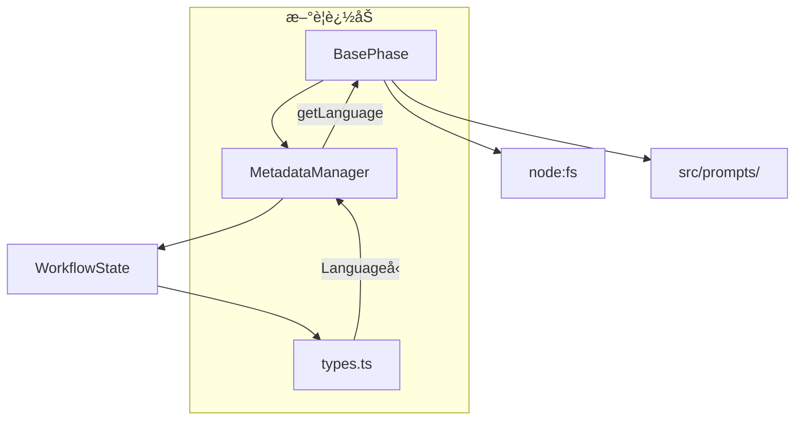

# Codex Agent 実行ログ

開始日時: 2025/12/30 3:00:12

---

## Turn 1: スレッド開始

**Thread ID**: `[REDACTED_TOKEN]`

## Turn 2: ツール実行

**種別**: reasoning
**ステータス**: completed

## Turn 3: ツール実行

**種別**: コãƒãƒ³ãƒ‰å®Ÿè¡Œ
**コãƒãƒ³ãƒ‰**: `/bin/bash -lc ls`
**ステータス**: completed (exit_code=0)

```text
ARCHITECTURE.md
CHANGELOG.md
CLAUDE.md
[REDACTED_TOKEN].md
[REDACTED_TOKEN].md
CODEBASE_SUMMARY.md
DOCKER_AUTH_SETUP.md
Dockerfile
Jenkinsfile
LICENSE
PROGRESS.md
README.md
ROADMAP.md
SETUP_TYPESCRIPT.md
TROUBLESHOOTING.md
__mocks__
docs
examples
jenkins
jest.config.cjs
metadata.json.template
package-lock.json
package.json
scripts
src
tests
tmp
tsconfig.json
tsconfig.test.json
```

## Turn 4: ツール実行

**種別**: reasoning
**ステータス**: completed

## Turn 5: ツール実行

**種別**: コãƒãƒ³ãƒ‰å®Ÿè¡Œ
**コãƒãƒ³ãƒ‰**: `/bin/bash -lc 'ls .ai-workflow'`
**ステータス**: completed (exit_code=0)

```text
issue-10
issue-102
issue-104
issue-105
issue-108
issue-113
issue-115
issue-119
issue-126
issue-127
issue-128
issue-140
issue-144
issue-150
issue-153
issue-155
issue-16
issue-161
issue-165
issue-174
issue-177
issue-18
issue-184
issue-188
issue-194
issue-2
issue-207
issue-208
issue-211
issue-212
issue-216
issue-22
issue-225
issue-23
issue-238
issue-24
issue-243
issue-248
issue-25
issue-253
issue-259
issue-26
issue-261
issue-271
issue-38
issue-45
issue-46
issue-47
issue-48
issue-49
issue-5
issue-50
issue-51
issue-52
issue-54
issue-571
issue-58
issue-61
issue-64
issue-7
issue-73
issue-74
issue-90
issue-91
```

## Turn 6: ツール実行

**種別**: コãƒãƒ³ãƒ‰å®Ÿè¡Œ
**コãƒãƒ³ãƒ‰**: `/bin/bash -lc 'ls .ai-workflow/issue-571'`
**ステータス**: completed (exit_code=0)

```text
00_planning
01_requirements
02_design
03_test_scenario
04_implementation
metadata.json
```

## Turn 7: ツール実行

**種別**: reasoning
**ステータス**: completed

## Turn 8: ツール実行

**種別**: コãƒãƒ³ãƒ‰å®Ÿè¡Œ
**コãƒãƒ³ãƒ‰**: `/bin/bash -lc 'cat .ai-workflow/issue-571/00_planning/output/planning.md'`
**ステータス**: completed (exit_code=0)

```text
# プロジェクト計画書: Issue #571

## Implement prompt file switching based on language setting

---

## 1. Issue分æ

### 概è¦

Issue #526ã§è¨€èªè¨­å®šã®è§£æ±ºãƒ­ã‚¸ãƒƒã‚¯ã¨ãƒ¡ã‚¿ãƒ‡ãƒ¼ã‚¿æ°¸ç¶šåŒ–ãŒå®Ÿè£…ã•ã‚ŒãŸãŒã€å®Ÿéš›ã®ãƒ—ロンプトファイルã¯æ—¥æœ¬èªå›ºå®šã®ã¾ã¾ã§ã‚る。`metadata.json` ã® `language` 設定ã«å¿œã˜ã¦ãƒ—ロンプトファイルを切り替ãˆã‚‹æ©Ÿèƒ½ã‚’実装ã™ã‚‹ã€‚

### 複雑度: **中程度**

**判定根拠**:
- 複数ファイルã®ä¿®æ­£ãŒå¿…è¦ï¼ˆ`base-phase.ts`ã€`copy-static-assets.mjs`ã€ãƒ—ロンプトファイル構造）
- 既存機能（`loadPrompt()`メソッド）ã®æ‹¡å¼µãŒä¸­å¿ƒ
- プロンプトファイルã®æ§‹é€ å¤‰æ›´ï¼ˆ10フェーズ × 2è¨€èª Ã— 3ç¨®é¡ = 60ファイル）
- æ–°è¦ã‚¢ãƒ¼ã‚­ãƒ†ã‚¯ãƒãƒ£å¤‰æ›´ã§ã¯ãªãã€æ—¢å­˜ãƒ‘ターンã«æ²¿ã£ãŸæ‹¡å¼µ

### 見ç©ã‚‚り工数: **12〜16時間**

**内訳**:
| 作業項目 | 見ç©ã‚‚り時間 |
|---------|------------|
| è¦ä»¶å®šç¾©ãƒ»è¨­è¨ˆ | 2h |
| プロンプトファイル構造変更（日本èªç§»å‹•ï¼‰ | 1h |
| 英èªãƒ—ロンプト翻訳（30ファイル） | 4〜6h |
| `BasePhase.loadPrompt()` 修正 | 1〜2h |
| ビルドスクリプト更新 | 0.5h |
| テストコード実装 | 2〜3h |
| çµ±åˆãƒ†ã‚¹ãƒˆãƒ»å‹•ä½œç¢ºèª | 1h |
| ドキュメント更新 | 0.5h |

### リスク評価: **中**

**ç†ç”±**:
- プロンプトファイルã®ç¿»è¨³å“質ãŒã‚·ã‚¹ãƒ†ãƒ å‹•ä½œã«å½±éŸ¿
- 既存ã®å…¨ãƒ•ã‚§ãƒ¼ã‚ºã«å½±éŸ¿ã™ã‚‹ãŸã‚ã€å›å¸°ãƒ†ã‚¹ãƒˆãŒé‡è¦
- フォールãƒãƒƒã‚¯æ©Ÿæ§‹ãŒæ­£ã—ã動作ã—ãªã„ã¨ã€è¨€èªæœªå¯¾å¿œæ™‚ã«ã‚¨ãƒ©ãƒ¼ãŒç™ºç”Ÿ

---

## 2. 実装戦略判断

### 実装戦略: **EXTEND**

**判断根拠**:
- 既存㮠`BasePhase.loadPrompt()` メソッドを拡張ã—ã¦å¤šè¨€èªå¯¾å¿œã‚’追加
- æ–°è¦ãƒ•ã‚¡ã‚¤ãƒ«ä½œæˆã¯æœ€å°é™ï¼ˆãƒ†ã‚¹ãƒˆãƒ•ã‚¡ã‚¤ãƒ«1ã¤ã€è‹±èªãƒ—ロンプト30ファイル）
- 既存ã®ãƒ—ロンプトロード機構を維æŒã—ã¤ã¤ã€è¨€èªåˆ‡ã‚Šæ›¿ãˆãƒ­ã‚¸ãƒƒã‚¯ã‚’追加
- `copy-static-assets.mjs` ã¯æ—¢å­˜ã®ã‚³ãƒ”ーロジックã§å¯¾å¿œå¯èƒ½ï¼ˆãƒ‡ã‚£ãƒ¬ã‚¯ãƒˆãƒªæ§‹é€ å¤‰æ›´ã®ã¿ï¼‰

**EXTEND ã‚’é¸æŠã—ãŸç†ç”±**:
1. `loadPrompt()` メソッドã¯æ—¢ã«å­˜åœ¨ã—ã€ãƒ‘ス解決ロジックを拡張ã™ã‚‹ã ã‘
2. 環境情報注入や差ã—戻ã—コンテキスト注入ãªã©ã€æ—¢å­˜ã®æ³¨å…¥ãƒ‘ターンをè¸è¥²
3. プロンプトファイルã®ãƒ‡ã‚£ãƒ¬ã‚¯ãƒˆãƒªæ§‹é€ å¤‰æ›´ã¯ã€æ—¢å­˜ãƒ•ã‚¡ã‚¤ãƒ«ã®ç§»å‹•ãŒä¸­å¿ƒ

### テスト戦略: **UNIT_INTEGRATION**

**判断根拠**:
- **ユニットテスト**: `loadPrompt()` メソッドã®å¤šè¨€èªãƒ‘ス解決ロジックã€ãƒ•ã‚©ãƒ¼ãƒ«ãƒãƒƒã‚¯å‹•ä½œ
- **インテグレーションテスト**: 実際ã®ãƒ—ロンプトファイル構造ã§ã®èª­ã¿è¾¼ã¿ç¢ºèªã€ãƒ“ルド後ã®å‹•ä½œç¢ºèª

**UNIT_INTEGRATION ã‚’é¸æŠã—ãŸç†ç”±**:
1. `loadPrompt()` ã®ãƒ­ã‚¸ãƒƒã‚¯å¤‰æ›´ã¯ãƒ¦ãƒ‹ãƒƒãƒˆãƒ†ã‚¹ãƒˆã§æ¤œè¨¼å¯èƒ½
2. プロンプトファイル構造変更ã¯çµ±åˆãƒ†ã‚¹ãƒˆã§å®Ÿéš›ã®ãƒ•ã‚¡ã‚¤ãƒ«ã‚·ã‚¹ãƒ†ãƒ æ“作を検証
3. BDDã¯ä¸è¦ï¼ˆã‚¨ãƒ³ãƒ‰ãƒ¦ãƒ¼ã‚¶ãƒ¼å‘ã‘機能ã§ã¯ãªã内部実装ã®æ‹¡å¼µï¼‰

### テストコード戦略: **CREATE_TEST**

**判断根拠**:
- æ–°è¦ãƒ†ã‚¹ãƒˆãƒ•ã‚¡ã‚¤ãƒ« `tests/integration/[REDACTED_TOKEN].test.ts` を作æˆ
- 既存㮠`base-phase-*.test.ts` ã¨ã¯ç‹¬ç«‹ã—ãŸå¤šè¨€èªåˆ‡ã‚Šæ›¿ãˆãƒ†ã‚¹ãƒˆ
- フォールãƒãƒƒã‚¯å‹•ä½œã®ç¶²ç¾…çš„ãªãƒ†ã‚¹ãƒˆã«ã¯å°‚用ファイルãŒé©åˆ‡

**CREATE_TEST ã‚’é¸æŠã—ãŸç†ç”±**:
1. 多言èªåˆ‡ã‚Šæ›¿ãˆã¯æ–°è¦æ©Ÿèƒ½ã§ã‚ã‚Šã€ç‹¬ç«‹ã—ãŸãƒ†ã‚¹ãƒˆã‚¹ã‚¤ãƒ¼ãƒˆãŒé©åˆ‡
2. 既存テストファイルã¸ã®è¿½åŠ ã§ã¯ã€ãƒ†ã‚¹ãƒˆã®é–¢å¿ƒäº‹ãŒæ··åœ¨ã™ã‚‹
3. Issue本文㧠`tests/integration/[REDACTED_TOKEN].test.ts` ãŒæŒ‡å®šã•ã‚Œã¦ã„ã‚‹

---

## 3. 影響範囲分æ

### 既存コードã¸ã®å½±éŸ¿

| ファイル | 変更内容 | 影響度 |
|---------|---------|-------|
| `src/phases/base-phase.ts` | `loadPrompt()` メソッドã®å¤šè¨€èªå¯¾å¿œ | 高 |
| `scripts/copy-static-assets.mjs` | 多言èªãƒ‡ã‚£ãƒ¬ã‚¯ãƒˆãƒªæ§‹é€ ã®ã‚³ãƒ”ー対応 | ä½ |
| `src/prompts/*/` | ディレクトリ構造変更（`{phase}/{lang}/` å½¢å¼ã¸ï¼‰ | 中 |
| `src/types.ts` | `DEFAULT_LANGUAGE` 定数ã®è¿½åŠ ï¼ˆå¿…è¦ã«å¿œã˜ã¦ï¼‰ | ä½ |

### ä¾å­˜é–¢ä¿‚ã®å¤‰æ›´

- **æ–°è¦ä¾å­˜**: ãªã—
- **既存ä¾å­˜ã®å¤‰æ›´**: ãªã—
- **内部ä¾å­˜**: `MetadataManager.getLanguage()` メソッドã®åˆ©ç”¨ï¼ˆæ—¢ã«å®Ÿè£…済ã¿æƒ³å®šï¼‰

### ãƒã‚¤ã‚°ãƒ¬ãƒ¼ã‚·ãƒ§ãƒ³è¦å¦

- **プロンプトファイル構造**:
  - 既存㮠`src/prompts/{phase}/*.txt` ã‚’ `src/prompts/{phase}/ja/*.txt` ã«ç§»å‹•
  - 英èªç‰ˆãƒ—ロンプト `src/prompts/{phase}/en/*.txt` ã‚’æ–°è¦ä½œæˆ
- **設定ファイル変更**: ãªã—
- **データベーススキーãƒå¤‰æ›´**: ãªã—

### 影響をå—ã‘るフェーズ（全10フェーズ）

1. Planning (00)
2. Requirements (01)
3. Design (02)
4. Test Scenario (03)
5. Implementation (04)
6. Test Implementation (05)
7. Testing (06)
8. Documentation (07)
9. Report (08)
10. Evaluation (09)

---

## 4. タスク分割

### Phase 1: è¦ä»¶å®šç¾© (見ç©ã‚‚ã‚Š: 1〜2h)

- [x] Task 1-1: 機能è¦ä»¶ã®æ˜ç¢ºåŒ– (1h)
  - 多言èªãƒ—ロンプト切り替ãˆã®ä»•æ§˜å®šç¾©
  - フォールãƒãƒƒã‚¯å‹•ä½œã®ä»•æ§˜å®šç¾©
  - 対象言èªï¼ˆja, en）ã®ç¢ºå®š

- [x] Task 1-2: å—ã‘入れ基準ã®å®šç¾© (0.5h)
  - `language: 'ja'` 設定時ã«æ—¥æœ¬èªãƒ—ロンプトãŒèª­ã¿è¾¼ã¾ã‚Œã‚‹
  - `language: 'en'` 設定時ã«è‹±èªãƒ—ロンプトãŒèª­ã¿è¾¼ã¾ã‚Œã‚‹
  - 指定言èªã®ãƒ—ロンプトãŒå­˜åœ¨ã—ãªã„å ´åˆã€æ—¥æœ¬èªã«ãƒ•ã‚©ãƒ¼ãƒ«ãƒãƒƒã‚¯
  - ビルド後も多言èªãƒ‡ã‚£ãƒ¬ã‚¯ãƒˆãƒªæ§‹é€ ãŒç¶­æŒã•ã‚Œã‚‹

### Phase 2: 設計 (見ç©ã‚‚ã‚Š: 1〜2h)

- [x] Task 2-1: `loadPrompt()` メソッドã®è¨­è¨ˆ (1h)
  - 言èªãƒ‘ラメータå–得方法ã®è¨­è¨ˆ
  - パス解決ロジックã®è¨­è¨ˆ
  - フォールãƒãƒƒã‚¯æ©Ÿæ§‹ã®è¨­è¨ˆ

- [x] Task 2-2: ディレクトリ構造ã®è¨­è¨ˆ (0.5h)
  - `src/prompts/{phase}/{lang}/*.txt` 構造ã®ç¢ºå®š
  - ビルド後㮠`dist/prompts/` 構造ã®ç¢ºå®š

### Phase 3: テストシナリオ (見ç©ã‚‚ã‚Š: 1〜2h)

- [x] Task 3-1: ãƒ¦ãƒ‹ãƒƒãƒˆãƒ†ã‚¹ãƒˆã‚·ãƒŠãƒªã‚ªä½œæˆ (1h)
  - `loadPrompt()` 日本èªèª­ã¿è¾¼ã¿ãƒ†ã‚¹ãƒˆ
  - `loadPrompt()` 英èªèª­ã¿è¾¼ã¿ãƒ†ã‚¹ãƒˆ
  - フォールãƒãƒƒã‚¯ãƒ†ã‚¹ãƒˆï¼ˆè¨€èªæœªå¯¾å¿œæ™‚）
  - エラーテスト（プロンプトファイル欠è½æ™‚）

- [x] Task 3-2: çµ±åˆãƒ†ã‚¹ãƒˆã‚·ãƒŠãƒªã‚ªä½œæˆ (0.5h)
  - å…¨10フェーズã®å¤šè¨€èªåˆ‡ã‚Šæ›¿ãˆç¢ºèª
  - ビルド後ã®ãƒ—ロンプト読ã¿è¾¼ã¿ç¢ºèª

### Phase 4: 実装 (見ç©ã‚‚ã‚Š: 6〜8h)

- [ ] Task 4-1: プロンプトファイル構造ã®å¤‰æ›´ (1h)
  - 既存日本èªãƒ—ロンプトを `{phase}/ja/` ã«ç§»å‹•
  - ディレクトリ作æˆã‚¹ã‚¯ãƒªãƒ—トã®å®Ÿè¡Œ

- [ ] Task 4-2: 英èªãƒ—ロンプトã®ç¿»è¨³ãƒ»ä½œæˆ (4〜6h)
  - 10フェーズ × 3種é¡ï¼ˆexecute, review, revise）= 30ファイル
  - LLMを使用ã—ãŸç¿»è¨³ã®å®Ÿæ–½
  - 翻訳å“質ã®ç¢ºèª

- [ ] Task 4-3: `BasePhase.loadPrompt()` ã®å¤šè¨€èªå¯¾å¿œå®Ÿè£… (1〜2h)
  - `MetadataManager.getLanguage()` ã®å‘¼ã³å‡ºã—追加
  - パス解決ロジックã®å¤‰æ›´ï¼ˆè¨€èªãƒ‡ã‚£ãƒ¬ã‚¯ãƒˆãƒªã‚’å«ã‚る）
  - フォールãƒãƒƒã‚¯æ©Ÿæ§‹ã®å®Ÿè£…
  - ログ出力ã®è¿½åŠ 

- [ ] Task 4-4: `DEFAULT_LANGUAGE` 定数ã®è¿½åŠ  (0.5h)
... (truncated)
```

## Turn 9: ツール実行

**種別**: reasoning
**ステータス**: completed

## Turn 10: ツール実行

**種別**: コãƒãƒ³ãƒ‰å®Ÿè¡Œ
**コãƒãƒ³ãƒ‰**: `/bin/bash -lc 'cat .ai-workflow/issue-571/02_design/output/design.md'`
**ステータス**: completed (exit_code=0)

```text
# 詳細設計書: Issue #571

## Implement prompt file switching based on language setting

---

## 0. Planning Documentã®ç¢ºèª

本設計書ã¯ã€Planning Phaseæˆæœç‰©ï¼ˆ`.ai-workflow/issue-571/00_planning/output/planning.md`）ãŠã‚ˆã³è¦ä»¶å®šç¾©æ›¸ï¼ˆ`.ai-workflow/issue-571/01_requirements/output/requirements.md`）ã®è¨ˆç”»ã«åŸºã¥ã„ã¦ä½œæˆã•ã‚Œã¦ã„ã¾ã™ã€‚

### 開発計画ã®æ¦‚è¦

| 項目 | 内容 |
|------|------|
| **複雑度** | 中程度 |
| **見ç©ã‚‚り工数** | 12〜16時間 |
| **実装戦略** | EXTEND（既存ã®`loadPrompt()`メソッドを拡張） |
| **テスト戦略** | UNIT_INTEGRATION |
| **テストコード戦略** | CREATE_TEST |

---

## 1. 既存コードベース分æ

### 1.1 ç¾çŠ¶ã®å®Ÿè£…

#### BasePhase.loadPrompt() メソッド

**ファイル**: `src/phases/base-phase.ts` (lines 291-320)

```typescript
protected loadPrompt(promptType: 'execute' | 'review' | 'revise'): string {
  const promptPath = path.join(promptsRoot, this.phaseName, `${promptType}.txt`);
  if (!fs.existsSync(promptPath)) {
    throw new Error(`Prompt file not found: ${promptPath}`);
  }

  let prompt = fs.readFileSync(promptPath, 'utf-8');

  // Issue #177: 環境情報ã®æ³¨å…¥ï¼ˆexecute ステップã®ã¿ï¼‰
  if (promptType === 'execute' && config.[REDACTED_TOKEN]()) {
    const environmentInfo = this.[REDACTED_TOKEN]();
    prompt = environmentInfo + '\n\n' + prompt;
    // ...
  }

  // Issue #90: å·®ã—戻ã—コンテキストã®æ³¨å…¥
  if (promptType === 'revise') {
    // ...
  }

  return prompt;
}
```

**ç¾çŠ¶ã®å•é¡Œ**:
- パス解決: `promptsRoot/{phaseName}/{promptType}.txt` （言èªè€ƒæ…®ãªã—）
- 言èªè¨­å®šã‚’一切å‚ç…§ã—ã¦ã„ãªã„
- 日本èªãƒ—ロンプトã®ã¿å­˜åœ¨

#### MetadataManager クラス

**ファイル**: `src/core/metadata-manager.ts`

**é‡è¦ãªç™ºè¦‹**: `getLanguage()` メソッドã¯**存在ã—ãªã„**。Issue #526ã§å®Ÿè£…済ã¿ã¨ã®å‰æã ã£ãŸãŒã€å®Ÿéš›ã«ã¯æœªå®Ÿè£…。

**ç¾åœ¨ã®WorkflowMetadataå‹** (`src/types.ts`):
```typescript
export interface WorkflowMetadata {
  issue_number: string;
  issue_url: string;
  issue_title: string;
  // ...
  // language フィールドã¯å­˜åœ¨ã—ãªã„
}
```

#### プロンプトファイル構造

**ç¾çŠ¶**: `src/prompts/{phase}/{promptType}.txt`

```
src/prompts/
├── planning/
│   ├── execute.txt
│   ├── review.txt
│   └── revise.txt
├── requirements/
│   ├── execute.txt
│   ├── review.txt
│   └── revise.txt
├── design/
├── test_scenario/
├── implementation/
├── test_implementation/
├── testing/
├── documentation/
├── report/
└── evaluation/
```

#### copy-static-assets.mjs

**ファイル**: `scripts/copy-static-assets.mjs`

```javascript
const assets = [
  // ...
  {
    source: path.join(projectRoot, 'src', 'prompts'),
    target: path.join(distDir, 'prompts'),
  },
];

await fsp.cp(asset.source, asset.target, {
  recursive: true,
  force: true,
});
```

**評価**: `recursive: true` オプションã«ã‚ˆã‚Šã€å¤šè¨€èªãƒ‡ã‚£ãƒ¬ã‚¯ãƒˆãƒªæ§‹é€ ã‚‚ãã®ã¾ã¾ã‚³ãƒ”ーã•ã‚Œã‚‹ã€‚**変更ä¸è¦**。

### 1.2 影響範囲ã®ç‰¹å®š

| コンãƒãƒ¼ãƒãƒ³ãƒˆ | 影響 | 変更内容 |
|--------------|------|---------|
| `src/types.ts` | 中 | `Language` å‹ã€`DEFAULT_LANGUAGE` 定数ã®è¿½åŠ  |
| `src/core/metadata-manager.ts` | 中 | `getLanguage()` メソッドã®è¿½åŠ  |
| `src/phases/base-phase.ts` | 高 | `loadPrompt()` メソッドã®å¤šè¨€èªå¯¾å¿œ |
| `src/prompts/**/*` | 高 | ディレクトリ構造変更（60ファイル） |
| `scripts/copy-static-assets.mjs` | ä½ | **変更ä¸è¦**（既存ã®å†å¸°ã‚³ãƒ”ーã§å¯¾å¿œï¼‰ |

### 1.3 ä¾å­˜é–¢ä¿‚ã®ç¢ºèª



---

## 2. 実装戦略判断

### 実装戦略: **EXTEND**

**判断根拠**:
1. **既存メソッドã®æ‹¡å¼µãŒä¸­å¿ƒ**: `BasePhase.loadPrompt()` ã®æ—¢å­˜å®Ÿè£…を維æŒã—ã¤ã¤ã€è¨€èªãƒ‘ラメータã«ã‚ˆã‚‹ãƒ‘ス解決ロジックを追加
2. **既存パターンã®è¸è¥²**: Issue #177（環境情報注入）やIssue #90（差ã—戻ã—コンテキスト注入）ã¨åŒæ§˜ã®æ³¨å…¥ãƒ‘ターンをé©ç”¨
3. **MetadataManagerã®æ‹¡å¼µ**: 既存クラス㫠`getLanguage()` メソッドを追加（新è¦ã‚¯ãƒ©ã‚¹ä½œæˆä¸è¦ï¼‰
4. **ファイル構造変更ã®ã¿**: 既存ã®æ—¥æœ¬èªãƒ—ロンプトを `{phase}/ja/` ã«ç§»å‹•ã—ã€è‹±èªç‰ˆã‚’ `{phase}/en/` ã«æ–°è¦ä½œæˆ
5. **ビルドスクリプト変更ä¸è¦**: `copy-static-assets.mjs` ã¯æ—¢å­˜ã®å†å¸°ã‚³ãƒ”ーã§å¯¾å¿œå¯èƒ½

**CREATE ã‚’é¸æŠã—ãªã‹ã£ãŸç†ç”±**:
- æ–°è¦ã‚³ãƒ³ãƒãƒ¼ãƒãƒ³ãƒˆä½œæˆã¯ä¸è¦
- 既存㮠`loadPrompt()` メソッドã®è²¬å‹™ã‚’維æŒ

**REFACTOR ã‚’é¸æŠã—ãªã‹ã£ãŸç†ç”±**:
- 既存コードã®æ§‹é€ æ”¹å–„ãŒç›®çš„ã§ã¯ãªãã€æ©Ÿèƒ½è¿½åŠ ãŒç›®çš„
- 既存ã®è¨­è¨ˆãƒ‘ターンã¯é©åˆ‡

---

## 3. テスト戦略判断

### テスト戦略: **UNIT_INTEGRATION**

**判断根拠**:
1. **ユニットテストãŒå¿…è¦ãªç†ç”±**:
   - `loadPrompt()` ã®ãƒ‘ス解決ロジックã¯å˜ä½“ã§ãƒ†ã‚¹ãƒˆå¯èƒ½
   - フォールãƒãƒƒã‚¯å‹•ä½œã®å¢ƒç•Œå€¤ãƒ†ã‚¹ãƒˆãŒå¿…è¦
   - `MetadataManager.getLanguage()` ã®å˜ä½“テスト

2. **çµ±åˆãƒ†ã‚¹ãƒˆãŒå¿…è¦ãªç†ç”±**:
   - 実際ã®ãƒ—ロンプトファイル構造ã§ã®èª­ã¿è¾¼ã¿ç¢ºèª
   - å…¨10フェーズã§ã®å¤šè¨€èªåˆ‡ã‚Šæ›¿ãˆã®å‹•ä½œç¢ºèª
   - ビルド後（`dist/prompts/`
... (truncated)
```

## Turn 11: ツール実行

**種別**: reasoning
**ステータス**: completed

## Turn 12: ツール実行

**種別**: コãƒãƒ³ãƒ‰å®Ÿè¡Œ
**コãƒãƒ³ãƒ‰**: `/bin/bash -lc 'cat .ai-workflow/issue-571/01_requirements/output/requirements.md'`
**ステータス**: completed (exit_code=0)

```text
# è¦ä»¶å®šç¾©æ›¸: Issue #571

## Implement prompt file switching based on language setting

---

## 0. Planning Documentã®ç¢ºèª

本è¦ä»¶å®šç¾©ã¯ã€Planning Phaseæˆæœç‰©ï¼ˆ`.ai-workflow/issue-571/00_planning/output/planning.md`）ã®è¨ˆç”»ã«åŸºã¥ã„ã¦ä½œæˆã•ã‚Œã¦ã„ã¾ã™ã€‚

### 開発計画ã®æ¦‚è¦

| 項目 | 内容 |
|------|------|
| **複雑度** | 中程度 |
| **見ç©ã‚‚り工数** | 12〜16時間 |
| **実装戦略** | EXTEND（既存ã®`loadPrompt()`メソッドを拡張） |
| **テスト戦略** | UNIT_INTEGRATION |
| **テストコード戦略** | CREATE_TEST |

### リスク概è¦

- 英èªãƒ—ロンプトã®ç¿»è¨³å“質ãŒã‚·ã‚¹ãƒ†ãƒ å‹•ä½œã«å½±éŸ¿
- MetadataManager.getLanguage()ã®ä¾å­˜é–¢ä¿‚
- 既存テストã®å›å¸°ãƒªã‚¹ã‚¯
- ビルドスクリプトã®äº’æ›æ€§

---

## 1. 概è¦

### 1.1 背景

Issue #526ã«ãŠã„ã¦ã€è¨€èªè¨­å®šã®å„ªå…ˆé †ä½è§£æ±ºãƒ­ã‚¸ãƒƒã‚¯ï¼ˆCLI > 環境変数 > メタデータ > デフォルト）ã¨metadata.jsonã¸ã®`language`フィールド永続化ãŒå®Ÿè£…ã•ã‚ŒãŸï¼ˆPR #568）。ã—ã‹ã—ã€ç¾åœ¨ã®ã‚·ã‚¹ãƒ†ãƒ ã§ã¯å®Ÿéš›ã®ãƒ—ロンプトファイル（`src/prompts/{phase}/execute.txt`等）ãŒæ—¥æœ¬èªå›ºå®šã®ã¾ã¾ã§ã‚ã‚Šã€è¨€èªè¨­å®šãŒå映ã•ã‚Œã¦ã„ãªã„。

### 1.2 目的

`metadata.json`ã®`language`設定ã«å¿œã˜ã¦ã€é©åˆ‡ãªè¨€èªã®ãƒ—ロンプトファイルを動的ã«èª­ã¿è¾¼ã‚€æ©Ÿèƒ½ã‚’実装ã—ã€å¤šè¨€èªå¯¾å¿œãƒ¯ãƒ¼ã‚¯ãƒ•ãƒ­ãƒ¼ã‚’実ç¾ã™ã‚‹ã€‚

### 1.3 ビジãƒã‚¹ä¾¡å€¤

- **国際化対応**: 英èªåœãƒ¦ãƒ¼ã‚¶ãƒ¼ã¸ã®ã‚µãƒãƒ¼ãƒˆæ‹¡å¤§
- **ユーザーエクスペリエンスå‘上**: æ¯å›½èªã§ã®ãƒ—ロンプトæä¾›ã«ã‚ˆã‚‹LLM応答å“質å‘上
- **拡張性**: å°†æ¥çš„ãªå¤šè¨€èªå¯¾å¿œï¼ˆä¸­å›½èªã€éŸ“国èªç­‰ï¼‰ã¸ã®åŸºç›¤æ•´å‚™

### 1.4 技術的価値

- **モジュール化**: 言èªåˆ‡ã‚Šæ›¿ãˆãƒ­ã‚¸ãƒƒã‚¯ã®é›†ä¸­ç®¡ç†
- **後方互æ›æ€§**: フォールãƒãƒƒã‚¯æ©Ÿæ§‹ã«ã‚ˆã‚‹æ—¢å­˜å‹•ä½œã®ä¿è¨¼
- **ä¿å®ˆæ€§**: 言èªåˆ¥ãƒ—ロンプトã®ç‹¬ç«‹ã—ãŸå“質改善ãŒå¯èƒ½

---

## 2. 機能è¦ä»¶

### FR-001: プロンプトファイルディレクトリ構造ã®å¤šè¨€èªåŒ–

**優先度**: 高

**説æ˜**: 既存ã®ãƒ—ロンプトファイル構造を多言èªå¯¾å¿œãƒ‡ã‚£ãƒ¬ã‚¯ãƒˆãƒªæ§‹é€ ã«å¤‰æ›´ã™ã‚‹ã€‚

**詳細仕様**:
- ç¾åœ¨ã®æ§‹é€ : `src/prompts/{phase}/{type}.txt`
- 新構造: `src/prompts/{phase}/{language}/{type}.txt`
- 対象フェーズ: 全10フェーズ（planning, requirements, design, test_scenario, implementation, test_implementation, testing, documentation, report, evaluation）
- 対象言èª: `ja`（日本èªï¼‰ã€`en`（英èªï¼‰
- 対象ファイルタイプ: `execute.txt`ã€`review.txt`ã€`revise.txt`

**ファイル数**:
- 日本èª: 30ファイル（10フェーズ × 3種é¡ï¼‰ã®ç§»å‹•
- 英èª: 30ファイル（10フェーズ × 3種é¡ï¼‰ã®æ–°è¦ä½œæˆ

### FR-002: BasePhase.loadPrompt()ã®å¤šè¨€èªå¯¾å¿œ

**優先度**: 高

**説æ˜**: `BasePhase`クラスã®`loadPrompt()`メソッドを拡張ã—ã€è¨€èªè¨­å®šã«åŸºã¥ã„ã¦ãƒ—ロンプトファイルを読ã¿è¾¼ã‚€ã€‚

**詳細仕様**:
```typescript
// 擬似コード
private loadPrompt(type: 'execute' | 'review' | 'revise'): string {
  const language = this.metadataManager.getLanguage(); // 言èªè¨­å®šã‚’å–å¾—
  const promptPath = path.join(this.promptsRoot, this.phaseName, language, `${type}.txt`);

  // 指定言èªã®ãƒ—ロンプトãŒå­˜åœ¨ã—ãªã„å ´åˆã¯æ—¥æœ¬èªã«ãƒ•ã‚©ãƒ¼ãƒ«ãƒãƒƒã‚¯
  if (!fs.existsSync(promptPath)) {
    const fallbackPath = path.join(this.promptsRoot, this.phaseName, DEFAULT_LANGUAGE, `${type}.txt`);
    logger.warn(`Prompt not found for language '${language}', falling back to '${DEFAULT_LANGUAGE}'`);
    return fs.readFileSync(fallbackPath, 'utf-8');
  }

  return fs.readFileSync(promptPath, 'utf-8');
}
```

**ä¾å­˜é–¢ä¿‚**:
- `MetadataManager.getLanguage()`: Issue #526ã§å®Ÿè£…済ã¿æƒ³å®šï¼ˆæœªå®Ÿè£…ã®å ´åˆã¯æœ¬Issueã§è¿½åŠ ï¼‰

### FR-003: フォールãƒãƒƒã‚¯æ©Ÿæ§‹

**優先度**: 高

**説æ˜**: 指定ã•ã‚ŒãŸè¨€èªã®ãƒ—ロンプトファイルãŒå­˜åœ¨ã—ãªã„å ´åˆã€æ—¥æœ¬èªï¼ˆãƒ‡ãƒ•ã‚©ãƒ«ãƒˆè¨€èªï¼‰ã«ãƒ•ã‚©ãƒ¼ãƒ«ãƒãƒƒã‚¯ã™ã‚‹ã€‚

**詳細仕様**:
- デフォルト言èª: `ja`（日本èªï¼‰
- フォールãƒãƒƒã‚¯æ¡ä»¶: 指定言èªã®ãƒ—ロンプトファイルãŒå­˜åœ¨ã—ãªã„å ´åˆ
- ログ出力: フォールãƒãƒƒã‚¯ç™ºç”Ÿæ™‚ã«WARNレベルã§ãƒ­ã‚°å‡ºåŠ›
- エラー処ç†: デフォルト言èªã®ãƒ—ロンプトも存在ã—ãªã„å ´åˆã¯ã‚¨ãƒ©ãƒ¼ã‚’スロー

### FR-004: DEFAULT_LANGUAGE定数ã®è¿½åŠ 

**優先度**: 中

**説æ˜**: システム全体ã§ä½¿ç”¨ã™ã‚‹ãƒ‡ãƒ•ã‚©ãƒ«ãƒˆè¨€èªã‚’定数ã¨ã—ã¦å®šç¾©ã™ã‚‹ã€‚

**詳細仕様**:
- 定義場所: `src/types.ts`ã¾ãŸã¯`src/core/config.ts`
- 定数å: `DEFAULT_LANGUAGE`
- デフォルト値: `'ja'`
- å‹: `'ja' | 'en'`（Languageå‹ã¨ã—ã¦å®šç¾©ã‚‚検è¨ï¼‰

### FR-005: ビルドスクリプトã®å¤šè¨€èªå¯¾å¿œ

**優先度**: 中

**説æ˜**: `scripts/copy-static-assets.mjs`ã‚’æ›´æ–°ã—ã€å¤šè¨€èªãƒ‡ã‚£ãƒ¬ã‚¯ãƒˆãƒªæ§‹é€ ã‚’`dist/prompts/`ã«æ­£ã—ãコピーã™ã‚‹ã€‚

**詳細仕様**:
- 既存ã®`fs.cp()`ã«ã‚ˆã‚‹å†å¸°ã‚³ãƒ”ーã§å¯¾å¿œå¯èƒ½ï¼ˆ`recursive: true`オプション）
- コピー元: `src/prompts/{phase}/{lang}/*.txt`
- コピー先: `dist/prompts/{phase}/{lang}/*.txt`
- 検証: ビルド後ã«å¤šè¨€èªãƒ‡ã‚£ãƒ¬ã‚¯ãƒˆãƒªæ§‹é€ ãŒç¶­æŒã•ã‚Œã¦ã„ã‚‹ã“ã¨ã‚’確èª

### FR-006: 英èªãƒ—ロンプトã®ä½œæˆ

**優先度**: 高

**説æ˜**: å…¨10フェーズ × 3ç¨®é¡ = 30ファイルã®è‹±èªãƒ—ロンプトを作æˆã™ã‚‹ã€‚

**詳細仕様**:
- 翻訳対象: 既存ã®æ—¥æœ¬èªãƒ—ロンプトファイル
- 翻訳方法: LLMを使用ã—ãŸè‡ªå‹•ç¿»è¨³
- å“質ä¿è¨¼: 主è¦ãƒ—ロンプト（特ã«`execute.txt`）ã®å“質レビュー実施
- ファイルé…ç½®: `src/prompts/{phase}/en/`ディレクトリ

**対象ファイル一覧**:

| フェーズ | execute.txt | review.txt | revise.txt |
|---------|------------|-----------|------------|
| planning | è¦ç¿»è¨³ | è¦ç¿»è¨³ | è¦ç¿»è¨³ |
| requirements | è¦ç¿»è¨³ | è¦ç¿»è¨³ | è¦ç¿»è¨³ |
| design | è¦ç¿»è¨³ | è¦ç¿»è¨³ | è¦ç¿»è¨³ |
| test_scenario | è¦ç¿»è¨³ | è¦ç¿»è¨³ | è¦ç¿»è¨³ |
| implementation | è¦ç¿»è¨³ | è¦ç¿»è¨³ | è¦ç¿»è¨³ |
| test_implementation | è¦ç¿»è¨³ | è¦ç¿»è¨³ | è¦ç¿»è¨³ |
| testing | è¦ç¿»è¨³ | è¦ç¿»è¨³ | è¦ç¿»è¨³ |
| documentation | è¦ç¿»è¨³ | è¦ç¿»è¨³ | è¦ç¿»è¨³ |
| report | è¦ç¿»è¨³ | è¦ç¿»è¨³ | è¦ç¿»è¨³ |
| evaluation | è¦ç¿»è¨³ | è¦ç¿»è¨³ | è¦ç¿»è¨³ |

---

## 3. é機能è¦ä»¶

### NFR-001: パフォーãƒãƒ³ã‚¹è¦ä»¶

**説æ˜**: プロンプトファイル読ã¿è¾¼ã¿ã®ãƒ‘フォーãƒãƒ³ã‚¹ã¸ã®å½±éŸ¿ã‚’最å°åŒ–ã™ã‚‹ã€‚

**詳細仕様**:
- 追加ã®ãƒ•ã‚¡ã‚¤ãƒ«ã‚·ã‚¹ãƒ†ãƒ ã‚¢ã‚¯ã‚»ã‚¹:
... (truncated)
```

## Turn 13: ツール実行

**種別**: reasoning
**ステータス**: completed

## Turn 14: ツール実行

**種別**: コãƒãƒ³ãƒ‰å®Ÿè¡Œ
**コãƒãƒ³ãƒ‰**: `/bin/bash -lc 'cat .ai-workflow/issue-571/03_test_scenario/output/test-scenario.md'`
**ステータス**: completed (exit_code=0)

```text
# テストシナリオ: Issue #571

## Implement prompt file switching based on language setting

---

## 0. テスト戦略サãƒãƒªãƒ¼

### é¸æŠã•ã‚ŒãŸãƒ†ã‚¹ãƒˆæˆ¦ç•¥ï¼ˆPhase 2ã‹ã‚‰å¼•ç”¨ï¼‰

**テスト戦略**: **UNIT_INTEGRATION**

**判断根拠**:
1. **ユニットテストãŒå¿…è¦ãªç†ç”±**:
   - `loadPrompt()` ã®ãƒ‘ス解決ロジックã¯å˜ä½“ã§ãƒ†ã‚¹ãƒˆå¯èƒ½
   - フォールãƒãƒƒã‚¯å‹•ä½œã®å¢ƒç•Œå€¤ãƒ†ã‚¹ãƒˆãŒå¿…è¦
   - `MetadataManager.getLanguage()` ã®å˜ä½“テスト

2. **çµ±åˆãƒ†ã‚¹ãƒˆãŒå¿…è¦ãªç†ç”±**:
   - 実際ã®ãƒ—ロンプトファイル構造ã§ã®èª­ã¿è¾¼ã¿ç¢ºèª
   - å…¨10フェーズã§ã®å¤šè¨€èªåˆ‡ã‚Šæ›¿ãˆã®å‹•ä½œç¢ºèª
   - ビルド後（`dist/prompts/`）ã®å‹•ä½œç¢ºèª

3. **BDDテストãŒä¸è¦ãªç†ç”±**:
   - エンドユーザーå‘ã‘機能ã§ã¯ãªãã€å†…部実装ã®æ‹¡å¼µ
   - ユーザーストーリーãŒå­˜åœ¨ã—ãªã„

### テスト対象ã®ç¯„囲

| コンãƒãƒ¼ãƒãƒ³ãƒˆ | テスト種別 | 優先度 |
|--------------|----------|-------|
| `MetadataManager.getLanguage()` | Unit | 高 |
| `BasePhase.loadPrompt()` | Unit | 高 |
| プロンプトファイル構造 | Integration | 高 |
| å…¨10フェーズã®å¤šè¨€èªåˆ‡ã‚Šæ›¿ãˆ | Integration | 中 |
| ビルド後ã®å‹•ä½œç¢ºèª | Integration | 中 |

### テストã®ç›®çš„

1. `loadPrompt()` メソッドãŒè¨€èªè¨­å®šã«åŸºã¥ã„ã¦æ­£ã—ã„プロンプトファイルを読ã¿è¾¼ã‚€ã“ã¨ã‚’検証
2. フォールãƒãƒƒã‚¯æ©Ÿæ§‹ãŒæ­£å¸¸ã«å‹•ä½œã™ã‚‹ã“ã¨ã‚’検証
3. 既存ã®ç’°å¢ƒæƒ…報注入・差ã—戻ã—コンテキスト注入ã¨ã®äº’æ›æ€§ã‚’検証
4. å…¨10フェーズã§å¤šè¨€èªåˆ‡ã‚Šæ›¿ãˆãŒæ­£å¸¸ã«å‹•ä½œã™ã‚‹ã“ã¨ã‚’検証

### テストカãƒãƒ¬ãƒƒã‚¸ç›®æ¨™

- ユニットテスト: 90%以上（ロジック部分）
- çµ±åˆãƒ†ã‚¹ãƒˆ: å…¨10フェーズ × 2è¨€èª Ã— 3ç¨®é¡ = 60パターン

---

## 1. Unitテストシナリオ

### 1.1 MetadataManager.getLanguage() テスト

**テストファイル**: `tests/unit/core/metadata-manager-language.test.ts`

#### TC-571-U01: getLanguage() - 日本èªè¨­å®šã®å–å¾—

| 項目 | 内容 |
|-----|------|
| **目的** | metadata.jsonã®languageãŒ'ja'ã®å ´åˆã€'ja'ãŒè¿”ã•ã‚Œã‚‹ã“ã¨ã‚’検証 |
| **å‰ææ¡ä»¶** | MetadataManagerインスタンスãŒåˆæœŸåŒ–済㿠|
| **入力** | `metadata.language = 'ja'` |
| **期待çµæœ** | `getLanguage()` ㌠`'ja'` を返㙠|
| **テストデータ** | `{ language: 'ja', issue_number: '571', ... }` |

```typescript
test('TC-571-U01: getLanguage() returns "ja" when metadata.language is "ja"', () => {
  // Given
  const mockState = {
    data: { language: 'ja', issue_number: '571' }
  };
  const metadataManager = new MetadataManager(mockState);

  // When
  const result = metadataManager.getLanguage();

  // Then
  expect(result).toBe('ja');
});
```

#### TC-571-U02: getLanguage() - 英èªè¨­å®šã®å–å¾—

| 項目 | 内容 |
|-----|------|
| **目的** | metadata.jsonã®languageãŒ'en'ã®å ´åˆã€'en'ãŒè¿”ã•ã‚Œã‚‹ã“ã¨ã‚’検証 |
| **å‰ææ¡ä»¶** | MetadataManagerインスタンスãŒåˆæœŸåŒ–済㿠|
| **入力** | `metadata.language = 'en'` |
| **期待çµæœ** | `getLanguage()` ㌠`'en'` を返㙠|
| **テストデータ** | `{ language: 'en', issue_number: '571', ... }` |

```typescript
test('TC-571-U02: getLanguage() returns "en" when metadata.language is "en"', () => {
  // Given
  const mockState = {
    data: { language: 'en', issue_number: '571' }
  };
  const metadataManager = new MetadataManager(mockState);

  // When
  const result = metadataManager.getLanguage();

  // Then
  expect(result).toBe('en');
});
```

#### TC-571-U03: getLanguage() - 未定義時ã®ãƒ‡ãƒ•ã‚©ãƒ«ãƒˆå€¤

| 項目 | 内容 |
|-----|------|
| **目的** | metadata.languageãŒæœªå®šç¾©ã®å ´åˆã€ãƒ‡ãƒ•ã‚©ãƒ«ãƒˆè¨€èª'ja'ãŒè¿”ã•ã‚Œã‚‹ã“ã¨ã‚’検証 |
| **å‰ææ¡ä»¶** | MetadataManagerインスタンスãŒåˆæœŸåŒ–済㿠|
| **入力** | `metadata.language = undefined` |
| **期待çµæœ** | `getLanguage()` ㌠`'ja'` (DEFAULT_LANGUAGE) を返㙠|
| **テストデータ** | `{ issue_number: '571' }` (languageフィールドãªã—) |

```typescript
test('TC-571-U03: getLanguage() returns DEFAULT_LANGUAGE when metadata.language is undefined', () => {
  // Given
  const mockState = {
    data: { issue_number: '571' } // No language field
  };
  const metadataManager = new MetadataManager(mockState);

  // When
  const result = metadataManager.getLanguage();

  // Then
  expect(result).toBe('ja');
});
```

#### TC-571-U04: getLanguage() - 無効ãªè¨€èªã‚³ãƒ¼ãƒ‰

| 項目 | 内容 |
|-----|------|
| **目的** | metadata.languageãŒç„¡åŠ¹ãªå€¤ã®å ´åˆã€ãƒ‡ãƒ•ã‚©ãƒ«ãƒˆè¨€èªã«ãƒ•ã‚©ãƒ¼ãƒ«ãƒãƒƒã‚¯ã™ã‚‹ã“ã¨ã‚’検証 |
| **å‰ææ¡ä»¶** | MetadataManagerインスタンスãŒåˆæœŸåŒ–済㿠|
| **入力** | `metadata.language = 'fr'` (サãƒãƒ¼ãƒˆã•ã‚Œã¦ã„ãªã„言èª) |
| **期待çµæœ** | `getLanguage()` ㌠`'ja'` (DEFAULT_LANGUAGE) を返㙠|
| **テストデータ** | `{ language: 'fr', issue_number: '571' }` |

```typescript
test('TC-571-U04: getLanguage() returns DEFAULT_LANGUAGE for unsupported language code', () => {
  // Given
  const mockState = {
    data: { language: 'fr', issue_number: '571' }
  };
  const metadataManager = new MetadataManager(mockState);

  // When
  const result = metadataManager.getLanguage();

  // Then
  expect(result).toBe('ja');
});
```

#### TC-571-U05: getLanguage() - パストラãƒãƒ¼ã‚µãƒ«æ”»æ’ƒå¯¾ç­–

| 項目 | 内容 |
|-----|------|
| **目的
... (truncated)
```

## Turn 15: ツール実行

**種別**: reasoning
**ステータス**: completed

## Turn 16: ツール実行

**種別**: コãƒãƒ³ãƒ‰å®Ÿè¡Œ
**コãƒãƒ³ãƒ‰**: `/bin/bash -lc 'ls src/prompts'`
**ステータス**: completed (exit_code=0)

```text
auto-issue
content_parser
design
difficulty
documentation
evaluation
followup
implementation
planning
pr-comment
report
requirements
rollback
squash
test_implementation
test_scenario
testing
validation
```

## Turn 17: ツール実行

**種別**: reasoning
**ステータス**: completed

## Turn 18: ツール実行

**種別**: コãƒãƒ³ãƒ‰å®Ÿè¡Œ
**コãƒãƒ³ãƒ‰**: `/bin/bash -lc 'ls src/prompts/planning'`
**ステータス**: completed (exit_code=0)

```text
execute.txt
review.txt
revise.txt
```

## Turn 19: ツール実行

**種別**: reasoning
**ステータス**: completed

## Turn 20: ツール実行

**種別**: コãƒãƒ³ãƒ‰å®Ÿè¡Œ
**コãƒãƒ³ãƒ‰**: `/bin/bash -lc 'rg "loadPrompt" -n src/phases/base-phase.ts'`
**ステータス**: failed (exit_code=127)

```text
/bin/bash: line 1: rg: command not found
```

## Turn 21: ツール実行

**種別**: reasoning
**ステータス**: completed

## Turn 22: ツール実行

**種別**: コãƒãƒ³ãƒ‰å®Ÿè¡Œ
**コãƒãƒ³ãƒ‰**: `/bin/bash -lc 'grep -n "loadPrompt" -n src/phases/base-phase.ts'`
**ステータス**: completed (exit_code=0)

```text
291:  protected loadPrompt(promptType: 'execute' | 'review' | 'revise'): string {
457:    let prompt = this.loadPrompt('execute');
```

## Turn 23: ツール実行

**種別**: コãƒãƒ³ãƒ‰å®Ÿè¡Œ
**コãƒãƒ³ãƒ‰**: `/bin/bash -lc "sed -n '260,340p' src/phases/base-phase.ts"`
**ステータス**: completed (exit_code=0)

```text
this.metadata,
        this.reviewCycleManager,
        async () => this.runWithStepModel('execute', () => this.execute()),
        async () => this.runWithStepModel('review', () => this.review()),
        async () => this.shouldRunReview()
      );
    }

    if (!this.phaseRunner) {
      const reviseHandler = this.getReviseFunction();
      const wrappedRevise =
        reviseHandler !== null
          ? (feedback: string) => this.runWithStepModel('revise', () => reviseHandler(feedback))
          : null;

      this.phaseRunner = new PhaseRunner(
        this.phaseName,
        this.metadata,
        this.github,
        this.stepExecutor,
        this.skipDependencyCheck,
        this.ignoreDependencies,
        this.presetPhases,
        wrappedRevise
      );
    }

    // PhaseRunner ã«å§”譲（Issue #49）
    return this.phaseRunner.run(options);
  }

  protected loadPrompt(promptType: 'execute' | 'review' | 'revise'): string {
    const promptPath = path.join(promptsRoot, this.phaseName, `${promptType}.txt`);
    if (!fs.existsSync(promptPath)) {
      throw new Error(`Prompt file not found: ${promptPath}`);
    }

    let prompt = fs.readFileSync(promptPath, 'utf-8');

    // Issue #177: 環境情報ã®æ³¨å…¥ï¼ˆexecute ステップã®ã¿ã€ãƒ‘ッケージインストールå¯èƒ½æ™‚）
    if (promptType === 'execute' && config.[REDACTED_TOKEN]()) {
      const environmentInfo = this.[REDACTED_TOKEN]();
      prompt = environmentInfo + '\n\n' + prompt;

      logger.info(`Environment info injected into execute prompt for phase ${this.phaseName}`);
    }

    // Issue #90: å·®ã—戻ã—コンテキストãŒã‚ã‚‹å ´åˆã€ãƒ—ロンプトã®å…ˆé ­ã«è¿½åŠ 
    // revise ステップã®ã¿ã«å·®ã—戻ã—情報を注入
    if (promptType === 'revise') {
      const rollbackContext = this.metadata.getRollbackContext(this.phaseName);
      if (rollbackContext) {
        const rollbackSection = this.[REDACTED_TOKEN](rollbackContext);
        prompt = rollbackSection + '\n\n' + prompt;

        logger.info(`Rollback context injected into revise prompt for phase ${this.phaseName}`);
      }
    }

    return prompt;
  }

  /**
   * Issue #177: 環境情報セクションã®Markdownを生æˆ
   * @returns 環境情報セクションã®Markdown文字列
   * @private
   */
  private [REDACTED_TOKEN](): string {
    return `## ğŸ› ï¸ é–‹ç™ºç’°å¢ƒæƒ…å ±

ã“ã®Docker環境ã§ã¯ã€ä»¥ä¸‹ã®ãƒ—ログラミング言èªã‚’インストールå¯èƒ½ã§ã™ï¼š

- **Python**: \`apt-get update && apt-get install -y python3 python3-pip\`
- **Go**: \`apt-get update && apt-get install -y golang-go\`
- **Java**: \`apt-get update && apt-get install -y default-jdk\`
- **Rust**: \`curl --proto '=https' --tlsv1.2 -sSf https://sh.rustup.rs | sh -s -- -y\`
- **Ruby**: \`apt-get update && apt-get install -y ruby ruby-dev\`

テスト実行やå“質ãƒã‚§ãƒƒã‚¯ã«å¿…è¦ãªè¨€èªç’°å¢ƒã¯ã€è‡ªç”±ã«ã‚¤ãƒ³ã‚¹ãƒˆãƒ¼ãƒ«ã—ã¦ãã ã•ã„。`;
  }
```

## Turn 24: ツール実行

**種別**: reasoning
**ステータス**: completed

## Turn 25: ツール実行

**種別**: コãƒãƒ³ãƒ‰å®Ÿè¡Œ
**コãƒãƒ³ãƒ‰**: `/bin/bash -lc "sed -n '1,260p' src/core/metadata-manager.ts"`
**ステータス**: completed (exit_code=0)

```text
import fs from 'fs-extra';
import { logger } from '../utils/logger.js';
import { dirname, join } from 'node:path';
import { WorkflowState } from './workflow-state.js';
import {
  PhaseName,
  PhaseStatus,
  StepName,
  WorkflowMetadata,
  RemainingTask,
  PhaseMetadata,
  [REDACTED_TOKEN],
  [REDACTED_TOKEN],
  ModelConfigByPhase,
} from '../types.js';
import { [REDACTED_TOKEN], backupMetadataFile, [REDACTED_TOKEN] } from './helpers/metadata-io.js';

/**
 * フェーズã®é †åºã‚’定義
 * Object.keys() ã®é †åºã¯ä¿è¨¼ã•ã‚Œãªã„ãŸã‚ã€æ˜ç¤ºçš„ãªé…列ã§é †åºã‚’管ç†
 */
const PHASE_ORDER: PhaseName[] = [
  'planning',
  'requirements',
  'design',
  'test_scenario',
  'implementation',
  'test_implementation',
  'testing',
  'documentation',
  'report',
  'evaluation',
];

export class MetadataManager {
  public readonly metadataPath: string;
  public readonly workflowDir: string;
  private readonly state: WorkflowState;

  constructor(metadataPath: string) {
    this.metadataPath = metadataPath;
    this.workflowDir = dirname(metadataPath);
    this.state = WorkflowState.load(metadataPath);
  }

  private ensurePhaseData(
    phaseName: PhaseName,
  ): PhaseMetadata | [REDACTED_TOKEN] {
    let phaseData = this.state.data.phases[phaseName];
    if (phaseData) {
      return phaseData;
    }

    const migrated = this.state.migrate();
    phaseData = this.state.data.phases[phaseName];
    if (phaseData) {
      return phaseData;
    }

    logger.warn(`Phase ${phaseName} missing from metadata. Initializing default entry.`);
    if (phaseName === 'evaluation') {
      const evaluationData = this.[REDACTED_TOKEN]();
      this.state.data.phases.evaluation = evaluationData;
      return evaluationData;
    }

    const defaultData = this.[REDACTED_TOKEN]();
    this.state.data.phases[phaseName] = defaultData;
    return defaultData;
  }

  private [REDACTED_TOKEN](): PhaseMetadata {
    return {
      status: 'pending',
      retry_count: 0,
      started_at: null,
      completed_at: null,
      review_result: null,
      output_files: [],
      current_step: null,
      completed_steps: [],
      rollback_context: null,
    };
  }

  private [REDACTED_TOKEN](): [REDACTED_TOKEN] {
    const base = this.[REDACTED_TOKEN]();
    return {
      ...base,
      decision: null,
      failed_phase: null,
      remaining_tasks: [],
      created_issue_url: null,
      abort_reason: null,
    };
  }

  public get data(): WorkflowMetadata {
    return this.state.data;
  }

  public save(): void {
    this.state.save();
  }

  public updatePhaseStatus(
    phaseName: PhaseName,
    status: PhaseStatus,
    options: {
      outputFile?: string;
      reviewResult?: string;
    } = {},
  ): void {
    const phaseData = this.ensurePhaseData(phaseName);
    const currentStatus = phaseData.status;

    // Issue #248: 冪等性ãƒã‚§ãƒƒã‚¯ï¼ˆåŒã˜ã‚¹ãƒ†ãƒ¼ã‚¿ã‚¹ã¸ã®é‡è¤‡æ›´æ–°ã‚’スキップ）
    if (currentStatus === status) {
      logger.info(`Phase ${phaseName}: Status already set to '${status}', skipping update`);
      return;
    }

    // Issue #248: ステータスé·ç§»ãƒãƒªãƒ‡ãƒ¼ã‚·ãƒ§ãƒ³ï¼ˆä¸æ­£ãªé·ç§»ã‚’検出）
    this.[REDACTED_TOKEN](phaseName, currentStatus, status);

    // 既存ã®ã‚¹ãƒ†ãƒ¼ã‚¿ã‚¹æ›´æ–°å‡¦ç†
    this.state.updatePhaseStatus(phaseName, status);

    if (options.outputFile) {
      if (!phaseData.output_files) {
        phaseData.output_files = [];
      }
      phaseData.output_files.push(options.outputFile);
    }

    if (options.reviewResult) {
      phaseData.review_result = options.reviewResult;
    }

    this.state.save();

    logger.debug(`Phase ${phaseName}: Status updated from '${currentStatus}' to '${status}'`);
  }

  /**
   * Issue #248: ステータスé·ç§»ã®ãƒãƒªãƒ‡ãƒ¼ã‚·ãƒ§ãƒ³
   *
   * ä¸æ­£ãªã‚¹ãƒ†ãƒ¼ã‚¿ã‚¹é·ç§»ã‚’検出ã—ã¦ãƒ­ã‚°å‡ºåŠ›ã™ã‚‹ã€‚
   * ä¸æ­£ãªé·ç§»ã§ã‚‚ステータス更新ã¯å®Ÿè¡Œã•ã‚Œã‚‹ï¼ˆã‚¨ãƒ©ãƒ¼ã«ã¯ã—ãªã„）。
   *
   * 許å¯ã•ã‚Œã‚‹é·ç§»:
   * - pending → in_progress
   * - in_progress → completed
   * - in_progress → failed
   *
   * ä¸æ­£ãªé·ç§»ã®ä¾‹:
   * - completed → in_progress
   * - failed → in_progress
   * - pending → completed
   *
   * @pa
... (truncated)
```

## Turn 26: ツール実行

**種別**: reasoning
**ステータス**: completed

## Turn 27: ツール実行

**種別**: コãƒãƒ³ãƒ‰å®Ÿè¡Œ
**コãƒãƒ³ãƒ‰**: `/bin/bash -lc 'grep -n "getLanguage" -n src/core/metadata-manager.ts'`
**ステータス**: failed (exit_code=1)

## Turn 28: ツール実行

**種別**: reasoning
**ステータス**: completed

## Turn 29: ツール実行

**種別**: コãƒãƒ³ãƒ‰å®Ÿè¡Œ
**コãƒãƒ³ãƒ‰**: `/bin/bash -lc "sed -n '1,260p' src/types.ts"`
**ステータス**: completed (exit_code=0)

```text
export type PhaseName =
  | 'planning'
  | 'requirements'
  | 'design'
  | 'test_scenario'
  | 'implementation'
  | 'test_implementation'
  | 'testing'
  | 'documentation'
  | 'report'
  | 'evaluation';

export type PhaseStatus = 'pending' | 'in_progress' | 'completed' | 'failed';

// Issue #10: ステップåã®å‹å®šç¾©
export type StepName = 'execute' | 'review' | 'revise';

export type DifficultyLevel = 'simple' | 'moderate' | 'complex';

export interface [REDACTED_TOKEN] {
  level: DifficultyLevel;
  confidence: number;
  factors: {
    estimated_file_changes: number;
    scope: 'single_file' | 'single_module' | 'multiple_modules' | 'cross_cutting';
    requires_tests: boolean;
    requires_architecture_change: boolean;
    complexity_score: number;
  };
  analyzed_at: string;
  analyzer_agent: 'claude' | 'codex';
  analyzer_model: string;
}

export interface StepModelConfig {
  claudeModel: 'opus' | 'sonnet';
  codexModel: 'max' | 'mini';
}

export interface PhaseModelConfig {
  execute: StepModelConfig;
  review: StepModelConfig;
  revise: StepModelConfig;
}

export type ModelConfigByPhase = {
  [phase in PhaseName]?: PhaseModelConfig;
};

export interface PhaseMetadata {
  status: PhaseStatus;
  retry_count: number;
  started_at: string | null;
  completed_at: string | null;
  review_result: string | null;
  output_files?: string[];
  // Issue #10: ステップå˜ä½ã®é€²æ—管ç†
  current_step?: StepName | null;  // ç¾åœ¨å®Ÿè¡Œä¸­ã®ã‚¹ãƒ†ãƒƒãƒ—（実行中ã§ãªã„å ´åˆã¯null）
  completed_steps?: StepName[];     // 完了済ã¿ã‚¹ãƒ†ãƒƒãƒ—ã®é…列（実行順åºã‚’ä¿æŒï¼‰
  // Issue #90: å·®ã—戻ã—コンテキスト（オプショナル）
  rollback_context?: import('./types/commands.js').RollbackContext | null;
}

/**
 * フォローアップ Issue ã®èƒŒæ™¯ã‚³ãƒ³ãƒ†ã‚­ã‚¹ãƒˆ
 * Evaluation Phase ã‹ã‚‰ IssueClient ã«æ¸¡ã•ã‚Œã‚‹
 */
export interface IssueContext {
  /**
   * å…ƒ Issue ã®æ¦‚è¦
   * 例: "Issue #91 ã§ã¯ã€BasePhase モジュール分解（Issue #49）ã§ç™ºç”Ÿã—㟠15 件ã®ãƒ†ã‚¹ãƒˆå¤±æ•—を修正ã—ã¾ã—ãŸã€‚"
   */
  summary: string;

  /**
   * ブロッカーã®ã‚¹ãƒ†ãƒ¼ã‚¿ã‚¹
   * 例: "ã™ã¹ã¦ã®ãƒ–ロッカーã¯è§£æ±ºæ¸ˆã¿"
   */
  blockerStatus: string;

  /**
   * タスクãŒæ®‹ã£ãŸç†ç”±
   * 例: "テスト失敗修正を優先ã—ãŸãŸã‚ã€ã‚«ãƒãƒ¬ãƒƒã‚¸æ”¹å–„ã¯å¾Œå›ã—ã«ã—ãŸ"
   */
  deferredReason: string;
}

/**
 * Evaluation Phase ã§æ¤œå‡ºã•ã‚ŒãŸæ®‹ã‚¿ã‚¹ã‚¯
 */
export interface RemainingTask {
  // ===== 既存フィールド（必須） =====
  /** タスクã®èª¬æ˜ */
  task: string;

  /** 対象フェーズ（例: "implementation", "testing"） */
  phase: string;

  /** 優先度（例: "High", "Medium", "Low"） */
  priority: string;

  // ===== æ–°è¦ãƒ•ã‚£ãƒ¼ãƒ«ãƒ‰ï¼ˆã™ã¹ã¦ã‚ªãƒ—ショナル） =====

  /**
   * 優先度ã®ç†ç”±
   * 例: "å…ƒ Issue #91 ã®æ¨å¥¨äº‹é …ã€ãƒ–ロッカーã§ã¯ãªã„"
   */
  priorityReason?: string;

  /**
   * 対象ファイル/モジュールã®ãƒªã‚¹ãƒˆ
   * 例: ["src/core/phase-factory.ts", "src/commands/execute/agent-setup.ts"]
   */
  targetFiles?: string[];

  /**
   * 実行手順（番å·ä»˜ãリスト）
   * 例: ["ä¸è¶³ã—ã¦ã„るテストケースを特定", "エッジケースã®ãƒ†ã‚¹ãƒˆã‚’追加"]
   */
  steps?: string[];

  /**
   * å—ã‘入れ基準（Acceptance Criteria）
   * 例: ["ã™ã¹ã¦ã®å¯¾è±¡ãƒ¢ã‚¸ãƒ¥ãƒ¼ãƒ«ã§ 90% 以上ã®ã‚«ãƒãƒ¬ãƒƒã‚¸ã‚’é”æˆ", "npm run test:coverage ãŒã™ã¹ã¦ãƒ‘ス"]
   */
  acceptanceCriteria?: string[];

  /**
   * ä¾å­˜ã‚¿ã‚¹ã‚¯
   * 例: ["Task 1 完了後ã«å®Ÿè¡Œ", "Phase 4 ã®ä¿®æ­£ãŒå¿…è¦"]
   */
  dependencies?: string[];

  /**
   * 見ç©ã‚‚り工数
   * 例: "2-4h", "1日", "0.5h"
   */
  estimatedHours?: string;
}

export interface [REDACTED_TOKEN] {
  enabled: boolean;
  provider: 'auto' | 'openai' | 'claude' | 'agent';
  model?: string;
  temperature?: number;
  maxOutputTokens?: number;
  timeoutMs?: number;
  maxRetries?: number;
  maxTasks?: number;
  appendMetadata?: boolean;
}

export interface [REDACTED_TOKEN] {
  title: string;
  body: string;
  metadata: {
    provider: 'openai' | 'claude';
    model: string;
    durationMs: number;
    retryCount: number;
    inputTokens?: number;
    outputTokens?: number;
    omittedTasks?: number;
  };
}

export interface [REDACTED_TOKEN] extends PhaseMetadata {
  decision: string | null;
  failed_phase: PhaseName | null;
  remaining_tasks: RemainingTask[];
  created_issue_url: string | null;
  abort_reason: string | null;
}

export type PhasesMetadata = {
  [phase in Exclude<PhaseName, 'evaluation'>]: PhaseMetadata;
} & {
  evaluation: [REDACTED_TOKEN];
};

export interface DesignDecisions {
  implementation_strategy: string | null;
  test
... (truncated)
```

## Turn 30: ツール実行

**種別**: コãƒãƒ³ãƒ‰å®Ÿè¡Œ
**コãƒãƒ³ãƒ‰**: `/bin/bash -lc "sed -n '260,520p' src/types.ts"`
**ステータス**: completed (exit_code=0)

```text
/**
   * フェーズ別ã®ãƒ¢ãƒ‡ãƒ«è¨­å®šï¼ˆ[REDACTED_TOKEN] 有効時ã«è¨­å®šï¼‰
   */
  model_config?: ModelConfigByPhase | null;
}

export interface [REDACTED_TOKEN] {
  success: boolean;
  output?: string | null;
  error?: string | null;
  decision?: string | null;
  approved?: boolean;       // レビュー承èªãƒ•ãƒ©ã‚°ï¼ˆIssue #49）
  feedback?: string;        // レビューフィードãƒãƒƒã‚¯ï¼ˆIssue #49）
}

export interface PhaseRunSummary {
  phases: PhaseName[];
  success: boolean;
  failed_phase?: PhaseName;
  error?: string;
  results: Record<
    PhaseName,
    {
      success: boolean;
      error?: string;
      output?: string | null;
    }
  >;
}

export interface GitCommandResult {
  success: boolean;
  error?: string;
  [key: string]: unknown;
}

export interface [REDACTED_TOKEN] {
  success: boolean;
  decision?: string;
  failedPhase?: PhaseName;
  abortReason?: string;
  remainingTasks?: RemainingTask[];
  error?: string;
}
```

## Turn 31: ツール実行

**種別**: reasoning
**ステータス**: completed

## Turn 32: ツール実行

**種別**: コãƒãƒ³ãƒ‰å®Ÿè¡Œ
**コãƒãƒ³ãƒ‰**: `/bin/bash -lc 'grep -R "language" -n src | head'`
**ステータス**: completed (exit_code=0)

```text
src/core/content-parser.ts:576:   * Uses LLM to extract structured information from natural language
```

## Turn 33: ツール実行

**種別**: コãƒãƒ³ãƒ‰å®Ÿè¡Œ
**コãƒãƒ³ãƒ‰**: `/bin/bash -lc 'grep -R "language" -n src/core src/phases src/types.ts'`
**ステータス**: completed (exit_code=0)

```text
src/core/content-parser.ts:576:   * Uses LLM to extract structured information from natural language
```

## Turn 34: ツール実行

**種別**: reasoning
**ステータス**: completed

## Turn 35: ツール実行

**種別**: コãƒãƒ³ãƒ‰å®Ÿè¡Œ
**コãƒãƒ³ãƒ‰**: `/bin/bash -lc "sed -n '1,220p' src/core/workflow-state.ts"`
**ステータス**: completed (exit_code=0)

```text
import fs from 'fs-extra';
import { logger } from '../utils/logger.js';
import { basename, dirname, join } from 'node:path';
import { resolveProjectPath } from './path-utils.js';
import {
  PhaseMetadata,
  PhaseName,
  PhaseStatus,
  WorkflowMetadata,
  PhasesMetadata,
  [REDACTED_TOKEN],
} from '../types.js';

const [REDACTED_TOKEN] = (date = new Date()): string => {
  const pad = (value: number) => value.toString().padStart(2, '0');
  return [
    date.getFullYear(),
    pad(date.getMonth() + 1),
    pad(date.getDate()),
  ].join('') +
    '_' +
    [pad(date.getHours()), pad(date.getMinutes()), pad(date.getSeconds())].join('');
};

const [REDACTED_TOKEN] = resolveProjectPath('metadata.json.template');

export class WorkflowState {
  public readonly metadataPath: string;
  public data: WorkflowMetadata;

  private constructor(metadataPath: string, data: WorkflowMetadata) {
    this.metadataPath = metadataPath;
    this.data = data;
  }

  public static createNew(
    metadataPath: string,
    issueNumber: string,
    issueUrl: string,
    issueTitle: string,
  ): WorkflowState {
    if (!fs.existsSync([REDACTED_TOKEN])) {
      throw new Error(
        `Template file not found: ${[REDACTED_TOKEN]}`,
      );
    }

    const initialData = JSON.parse(
      fs.readFileSync([REDACTED_TOKEN], 'utf-8')
    ) as WorkflowMetadata;

    const nowIso = new Date().toISOString();
    initialData.issue_number = issueNumber;
    initialData.issue_url = issueUrl;
    initialData.issue_title = issueTitle;
    initialData.created_at = nowIso;
    initialData.updated_at = nowIso;

    fs.mkdirSync(dirname(metadataPath), { recursive: true });
    fs.writeFileSync(metadataPath, JSON.stringify(initialData, null, 2), 'utf-8');

    return new WorkflowState(metadataPath, initialData);
  }

  public static load(metadataPath: string): WorkflowState {
    if (!fs.existsSync(metadataPath)) {
      throw new Error(`metadata.json not found: ${metadataPath}`);
    }

    const data = JSON.parse(fs.readFileSync(metadataPath, 'utf-8')) as WorkflowMetadata;
    return new WorkflowState(metadataPath, data);
  }

  public save(): void {
    this.data.updated_at = new Date().toISOString();
    fs.writeFileSync(this.metadataPath, JSON.stringify(this.data, null, 2), 'utf-8');
  }

  public updatePhaseStatus(phase: PhaseName, status: PhaseStatus): void {
    const phases = this.data.phases;
    if (!(phase in phases)) {
      throw new Error(`Unknown phase: ${phase}`);
    }

    const phaseData = phases[phase];
    phaseData.status = status;

    const nowIso = new Date().toISOString();
    if (status === 'in_progress') {
      phaseData.started_at = nowIso;
    } else if (status === 'completed' || status === 'failed') {
      phaseData.completed_at = nowIso;
    }

    this.data.current_phase = phase;
  }

  public incrementRetryCount(phase: PhaseName): number {
    const phases = this.data.phases;
    if (!(phase in phases)) {
      throw new Error(`Unknown phase: ${phase}`);
    }

    const current = phases[phase].retry_count;
    if (current >= 3) {
      throw new Error(`Max retry count exceeded for phase: ${phase}`);
    }

    phases[phase].retry_count = current + 1;
    return phases[phase].retry_count;
  }

  public setDesignDecision(key: string, value: string): void {
    if (!(key in this.data.design_decisions)) {
      throw new Error(`Unknown design decision key: ${key}`);
    }

    this.data.design_decisions[key] = value;
  }

  public getPhaseStatus(phase: PhaseName): PhaseStatus {
    const phases = this.data.phases;
    if (!(phase in phases)) {
      throw new Error(`Unknown phase: ${phase}`);
    }

    return phases[phase].status;
  }

  public migrate(): boolean {
    if (!fs.existsSync([REDACTED_TOKEN])) {
      logger.warn(`Template file not found: ${[REDACTED_TOKEN]}`);
      return false;
    }

    const template = JSON.parse(
      fs.readFileSync([REDACTED_TOKEN], 'utf-8'
... (truncated)
```

## Turn 36: ツール実行

**種別**: reasoning
**ステータス**: completed

## Turn 37: ツール実行

**種別**: コãƒãƒ³ãƒ‰å®Ÿè¡Œ
**コãƒãƒ³ãƒ‰**: `/bin/bash -lc 'cat metadata.json.template'`
**ステータス**: completed (exit_code=0)

```text
{
  "issue_number": "",
  "issue_url": "",
  "issue_title": "",
  "repository": null,
  "target_repository": null,
  "workflow_version": "1.0.0",
  "current_phase": "planning",
  "design_decisions": {
    "[REDACTED_TOKEN]": null,
    "test_strategy": null,
    "test_code_strategy": null
  },
  "cost_tracking": {
    "total_input_tokens": 0,
    "total_output_tokens": 0,
    "total_cost_usd": 0.0
  },
  "difficulty_analysis": null,
  "model_config": null,
  "phases": {
    "planning": {
      "status": "pending",
      "retry_count": 0,
      "started_at": null,
      "completed_at": null,
      "review_result": null
    },
    "requirements": {
      "status": "pending",
      "retry_count": 0,
      "started_at": null,
      "completed_at": null,
      "review_result": null
    },
    "design": {
      "status": "pending",
      "retry_count": 0,
      "started_at": null,
      "completed_at": null,
      "review_result": null
    },
    "test_scenario": {
      "status": "pending",
      "retry_count": 0,
      "started_at": null,
      "completed_at": null,
      "review_result": null
    },
    "implementation": {
      "status": "pending",
      "retry_count": 0,
      "started_at": null,
      "completed_at": null,
      "review_result": null
    },
    "test_implementation": {
      "status": "pending",
      "retry_count": 0,
      "started_at": null,
      "completed_at": null,
      "review_result": null
    },
    "testing": {
      "status": "pending",
      "retry_count": 0,
      "started_at": null,
      "completed_at": null,
      "review_result": null
    },
    "documentation": {
      "status": "pending",
      "retry_count": 0,
      "started_at": null,
      "completed_at": null,
      "review_result": null
    },
    "report": {
      "status": "pending",
      "retry_count": 0,
      "started_at": null,
      "completed_at": null,
      "review_result": null
    },
    "evaluation": {
      "status": "pending",
      "retry_count": 0,
      "started_at": null,
      "completed_at": null,
      "review_result": null,
      "decision": null,
      "failed_phase": null,
      "remaining_tasks": [],
      "created_issue_url": null,
      "abort_reason": null
    }
  },
  "created_at": "",
  "updated_at": ""
}
```

## Turn 38: ツール実行

**種別**: reasoning
**ステータス**: completed

## Turn 39: ツール実行

**種別**: コãƒãƒ³ãƒ‰å®Ÿè¡Œ
**コãƒãƒ³ãƒ‰**: `/bin/bash -lc 'grep -R "language" -n | head'`
**ステータス**: completed (exit_code=0)

```text
.ai-workflow/issue-126/05_test_implementation/output/test-implementation.md:292:#### TC-RA-009: [REDACTED_TOKEN] with unsupported language
.ai-workflow/issue-127/06_testing/output/test-result.md:36:- TC-RA-009: [REDACTED_TOKEN] with unsupported language - ✅ PASS
.ai-workflow/issue-127/07_documentation/output/[REDACTED_TOKEN].md:302:  - Language-agnostic support (30+ languages, inherited from Issue #144)
.ai-workflow/issue-127/09_evaluation/execute/agent_log_raw.txt:15:{"type":"user","message":{"role":"user","content":[{"tool_use_id":"[REDACTED_TOKEN]","type":"tool_result","content":"     1→# テスト実行çµæœ - Phase 6 Revise #2\n     2→\n     3→## ç·åˆåˆ¤å®š: 大幅改善ã€æ®‹èª²é¡Œã‚ã‚Š\n     4→\n     5→**判定**: âš ï¸ **PARTIAL SUCCESS - Phase 2ã®ãƒ¦ãƒ‹ãƒƒãƒˆãƒ†ã‚¹ãƒˆ67%æˆåŠŸã€çµ±åˆãƒ†ã‚¹ãƒˆã¯ä¿®æ­£ä¸­**\n     6→\n     7→**主è¦ãªæˆæœ**:\n     8→- ✅ **ブロッカー#1（TypeScriptコンパイルエラー）**: 完全ã«è§£æ¶ˆ\n     9→- ✅ **ブロッカー#2（Phase 2ユニットテスト18件失敗）**: 67%解消（12件æˆåŠŸã€6件残存）\n    10→- âš ï¸ **ブロッカー#3（Phase 2çµ±åˆãƒ†ã‚¹ãƒˆ14件失敗）**: ES Modules環境対応ã®ã‚¢ãƒ—ローãƒã§ä¿®æ­£ä¸­\n    11→\n    12→---\n    13→\n    14→## 実行サãƒãƒªãƒ¼\n    15→\n    16→- **実行日時**: 2025-01-31 23:57:00 JST\n    17→- **テストフレームワーク**: Jest (Node 20)\n    18→- **対象Issue**: #127 - auto-issue Phase 2: リファクタリング検出機能ã®å®Ÿè£…\n    19→- **修正内容**: ユニットテストã¨çµ±åˆãƒ†ã‚¹ãƒˆã®ãƒ¢ãƒƒã‚¯è¨­å®šï¼ˆES Modules環境対応）\n    20→\n    21→###ユニットテスト: `tests/unit/core/repository-analyzer.test.ts`\n    22→\n    23→**実行çµæœ**:\n    24→- **ç·ãƒ†ã‚¹ãƒˆæ•°**: 22件\n    25→- **æˆåŠŸ**: 14件（64%æˆåŠŸç‡ï¼‰\n    26→- **失敗**: 8件\n    27→\n    28→**修正内容**:\n    29→1. Phase 2ã®ãƒ†ã‚¹ãƒˆã‚±ãƒ¼ã‚¹ï¼ˆTC-2.1.1〜TC-2.3.3）㫠`jest.spyOn(analyzer as any, '[REDACTED_TOKEN]').mockReturnValue('mock repository code')` を追加\n    30→2. ファイルシステムアクセスをå›é¿ã—ã€ãƒ¢ãƒƒã‚¯ãƒ‡ãƒ¼ã‚¿ã§ãƒãƒªãƒ‡ãƒ¼ã‚·ãƒ§ãƒ³ãƒ­ã‚¸ãƒƒã‚¯ã‚’検証\n    31→\n    32→**æˆåŠŸã—ãŸãƒ†ã‚¹ãƒˆ** (14件):\n    33→- TC-RA-004: analyze with invalid JSON output - ✅ PASS\n    34→- TC-RA-006: parseAgentOutput without JSON block - ✅ PASS\n    35→- TC-RA-008: [REDACTED_TOKEN] with short title - ✅ PASS\n    36→- TC-RA-009: [REDACTED_TOKEN] with unsupported language - ✅ PASS\n    37→- TC-2.1.1: [REDACTED_TOKEN] with valid large-file candidate - ✅ PASS\n    38→- TC-2.1.2: [REDACTED_TOKEN] with duplication and lineRange - ✅ PASS\n    39→- TC-2.1.3: [REDACTED_TOKEN] with missing-docs and low priority - ✅ PASS\n    40→- TC-2.2.1: [REDACTED_TOKEN] with missing type field - ✅ PASS\n    41→- TC-2.2.2: [REDACTED_TOKEN] with missing description - ✅ PASS\n    42→- TC-2.2.3: [REDACTED_TOKEN] with invalid type - ✅ PASS\n    43→- TC-2.2.4: [REDACTED_TOKEN] with short description - ✅ PASS\n    44→- TC-2.2.5: [REDACTED_TOKEN] with short suggestion - ✅ PASS\n    45→- TC-2.2.6: [REDACTED_TOKEN] with invalid priority - ✅ PASS\n    46→- TC-2.3.3: [REDACTED_TOKEN] with all refactor types - ✅ PASS\n    47→\n    48→**Phase 2テストã®æˆåŠŸç‡**: 18件中12件æˆåŠŸï¼ˆ67%）\n    49→\n    50→**失敗ã—ãŸãƒ†ã‚¹ãƒˆ** (8件):\n    51→- TC-RA-001: analyze with Codex agent - ⌠FAIL（Phase 1ãƒã‚°æ¤œå‡ºãƒ†ã‚¹ãƒˆï¼‰\n    52→- TC-RA-002: analyze with Claude agent - ⌠FAIL（Phase 1ãƒã‚°æ¤œå‡ºãƒ†ã‚¹ãƒˆï¼‰\n    53→- TC-RA-003: analyze with auto mode fallback - ⌠FAIL（Phase 1ãƒã‚°æ¤œå‡ºãƒ†ã‚¹ãƒˆï¼‰\n    54→- TC-RA-005: parseAgentOutput with JSON format - ⌠FAIL（Phase 1ãƒã‚°æ¤œå‡ºãƒ†ã‚¹ãƒˆï¼‰\n    55→- TC-RA-007: [REDACTED_TOKEN] with valid candidate - ⌠FAIL（Phase 1ãƒã‚°æ¤œå‡ºãƒ†ã‚¹ãƒˆï¼‰\n    56→- TC-RA-010: [REDACTED_TOKEN] with 10-character title - ⌠FAIL（Phase 1ãƒã‚°æ¤œå‡ºãƒ†ã‚¹ãƒˆï¼‰\n    57→- TC-2.3.1: [REDACTED_TOKEN] with 20-character description - ⌠FAIL（Phase 2リファクタリングテスト）\n    58→- TC-2.3.2: [REDACTED_TOKEN] with 20-character suggestion - ⌠FAIL（Phase 2リファクタリングテスト）\n    59→\n    60→**失敗åŸå› ã®åˆ†æ**:\n    61→1. **Phase 1ã®ãƒ†ã‚¹ãƒˆ6件**: `analyze()`メソッドãŒãƒ•ã‚¡ã‚¤ãƒ«å‡ºåŠ›æ–¹å¼ã‚’使用ã—ã¦ã„ã‚‹ãŒã€ãƒ¢ãƒƒã‚¯ã•ã‚ŒãŸ`executeTask`ãŒå®Ÿéš›ã®ãƒ•ã‚¡ã‚¤ãƒ«ã‚’作æˆã—ãªã„ãŸã‚ã€ç©ºã®é…列ãŒè¿”ã•ã‚Œã‚‹\n    62→2. **TC-2.3.1ã¨TC-2.3.2**: ãƒãƒªãƒ‡ãƒ¼ã‚·ãƒ§ãƒ³ã§filePath除外パターンãƒã‚§ãƒƒã‚¯ã¾ãŸã¯ä»–ã®æ¤œè¨¼ã§å¼¾ã‹ã‚Œã¦ã„ã‚‹å¯èƒ½æ€§ï¼ˆãƒ­ã‚°ãƒ¬ãƒ™ãƒ«ãŒdebugã®ãŸã‚詳細未確èªï¼‰\n    63→\n    64→---\n    65→\n    66→### çµ±åˆãƒ†ã‚¹ãƒˆ: `tests/integration/auto-issue-refactor.test.ts`\n    67→\n    68→**修正内容**:\n    69→1. `jest.mock()`ã‹ã‚‰`jest.spyOn()`アプローãƒã«å¤‰æ›´ï¼ˆES Modules環境対応）\n    70→2. `RepositoryAnalyze
... (truncated)
```

## Turn 40: ツール実行

**種別**: reasoning
**ステータス**: completed

## Turn 41: ツール実行

**種別**: reasoning
**ステータス**: completed

## Turn 42: ツール実行

**種別**: reasoning
**ステータス**: completed

## Turn 43: ツール実行

**種別**: コãƒãƒ³ãƒ‰å®Ÿè¡Œ
**コãƒãƒ³ãƒ‰**: `/bin/bash -lc 'cat src/prompts/planning/execute.txt'`
**ステータス**: completed (exit_code=0)

```text
# プロジェクト計画フェーズ - 実行プロンプト

## タスク概è¦

GitHubã®Issue情報ã‹ã‚‰è©³ç´°ãªãƒ—ロジェクト計画書を作æˆã—ã¦ãã ã•ã„。
Phase 0ã¯ãƒ—ロジェクトãƒãƒãƒ¼ã‚¸ãƒ£ã®å½¹å‰²ã‚’æ‹…ã„ã€é–‹ç™ºä½œæ¥­ã‚’計画的ã‹ã¤åŠ¹ç‡çš„ã«é€²ã‚られるよã†ã«ã—ã¾ã™ã€‚

## Issue情報

{issue_info}

## プロジェクト計画書ã®æ§‹æˆ

以下ã®ã‚»ã‚¯ã‚·ãƒ§ãƒ³ã‚’å«ã‚€ãƒ—ロジェクト計画書を作æˆã—ã¦ãã ã•ã„：

### 1. Issue分æ
- **複雑度**: ç°¡å˜/中程度/複雑を判定
  - ç°¡å˜: å˜ä¸€ãƒ•ã‚¡ã‚¤ãƒ«ã®ä¿®æ­£ã€ã‚·ãƒ³ãƒ—ルãªæ©Ÿèƒ½è¿½åŠ ï¼ˆè¦‹ç©ã‚‚ã‚Š: ~4時間）
  - 中程度: 複数ファイルã®ä¿®æ­£ã€æ—¢å­˜æ©Ÿèƒ½ã®æ‹¡å¼µï¼ˆè¦‹ç©ã‚‚ã‚Š: 4~16時間）
  - 複雑: アーキテクãƒãƒ£å¤‰æ›´ã€æ–°è¦ã‚µãƒ–システム追加（見ç©ã‚‚ã‚Š: 16時間~）
- **見ç©ã‚‚り工数**: X時間（根拠を記載）
- **リスク評価**: ä½/中/高

### 2. 実装戦略判断

**é‡è¦**: ã“ã®ã‚»ã‚¯ã‚·ãƒ§ãƒ³ã¯æœ€ã‚‚é‡è¦ã§ã™ã€‚Phase 2（Design）ã§ä½¿ç”¨ã•ã‚Œã‚‹ãŸã‚ã€å¿…ãšæ˜è¨˜ã—ã¦ãã ã•ã„。

#### 実装戦略: CREATE / EXTEND / REFACTOR

**判断根拠**:
- CREATE: æ–°è¦ãƒ•ã‚¡ã‚¤ãƒ«ãƒ»ã‚¯ãƒ©ã‚¹ãƒ»ãƒ¢ã‚¸ãƒ¥ãƒ¼ãƒ«ã®ä½œæˆãŒä¸­å¿ƒ
- EXTEND: 既存コードã®æ‹¡å¼µï¼ˆæ©Ÿèƒ½è¿½åŠ ï¼‰ãŒä¸­å¿ƒ
- REFACTOR: 既存コードã®ãƒªãƒ•ã‚¡ã‚¯ã‚¿ãƒªãƒ³ã‚°ï¼ˆæ§‹é€ æ”¹å–„）ãŒä¸­å¿ƒ

（判断ç†ç”±ã‚’具体的ã«è¨˜è¼‰ï¼‰

#### テスト戦略: UNIT_ONLY / INTEGRATION_ONLY / BDD_ONLY / UNIT_INTEGRATION / UNIT_BDD / INTEGRATION_BDD / ALL

**判断根拠**:
- UNIT_ONLY: ユニットテストã®ã¿ï¼ˆå˜ç´”ãªãƒ­ã‚¸ãƒƒã‚¯ã€å¤–部ä¾å­˜ãªã—）
- INTEGRATION_ONLY: インテグレーションテストã®ã¿ï¼ˆå¤–部システム連æºä¸­å¿ƒï¼‰
- BDD_ONLY: BDDテストã®ã¿ï¼ˆãƒ¦ãƒ¼ã‚¶ãƒ¼ã‚¹ãƒˆãƒ¼ãƒªãƒ¼ä¸­å¿ƒï¼‰
- UNIT_INTEGRATION: ユニット + インテグレーション（一般的ãªæ©Ÿèƒ½é–‹ç™ºï¼‰
- UNIT_BDD: ユニット + BDD（エンドユーザーå‘ã‘機能）
- INTEGRATION_BDD: インテグレーション + BDD（システム間連æºï¼‹ãƒ¦ãƒ¼ã‚¶ãƒ¼ã‚¹ãƒˆãƒ¼ãƒªãƒ¼ï¼‰
- ALL: ã™ã¹ã¦ã®ãƒ†ã‚¹ãƒˆãƒ¬ãƒ™ãƒ«ï¼ˆå¤§è¦æ¨¡ãªå¤‰æ›´ã€é«˜ãƒªã‚¹ã‚¯ï¼‰

（判断ç†ç”±ã‚’具体的ã«è¨˜è¼‰ï¼‰

#### テストコード戦略: EXTEND_TEST / CREATE_TEST / BOTH_TEST

**判断根拠**:
- EXTEND_TEST: 既存テストファイルã«è¿½åŠ ï¼ˆæ—¢å­˜æ©Ÿèƒ½ã®æ‹¡å¼µæ™‚）
- CREATE_TEST: æ–°è¦ãƒ†ã‚¹ãƒˆãƒ•ã‚¡ã‚¤ãƒ«ä½œæˆï¼ˆæ–°è¦æ©Ÿèƒ½è¿½åŠ æ™‚）
- BOTH_TEST: 両方（既存テスト拡張 + æ–°è¦ãƒ†ã‚¹ãƒˆä½œæˆï¼‰

（判断ç†ç”±ã‚’具体的ã«è¨˜è¼‰ï¼‰

### 3. 影響範囲分æ
- **既存コードã¸ã®å½±éŸ¿**: 変更ãŒå¿…è¦ãªãƒ•ã‚¡ã‚¤ãƒ«ãƒ»ãƒ¢ã‚¸ãƒ¥ãƒ¼ãƒ«
- **ä¾å­˜é–¢ä¿‚ã®å¤‰æ›´**: æ–°è¦ä¾å­˜ã®è¿½åŠ ã€æ—¢å­˜ä¾å­˜ã®å¤‰æ›´
- **ãƒã‚¤ã‚°ãƒ¬ãƒ¼ã‚·ãƒ§ãƒ³è¦å¦**: データベーススキーãƒå¤‰æ›´ã€è¨­å®šãƒ•ã‚¡ã‚¤ãƒ«å¤‰æ›´ç­‰

### 4. タスク分割

## âš ï¸ é‡è¦: ãƒã‚§ãƒƒã‚¯ãƒªã‚¹ãƒˆæ¨™æº–フォーãƒãƒƒãƒˆï¼ˆå¿…須）

å„フェーズã®ã‚¿ã‚¹ã‚¯ã¯ã€**å¿…ãšãƒã‚§ãƒƒã‚¯ãƒªã‚¹ãƒˆå½¢å¼**ã§è¨˜è¿°ã—ã¦ãã ã•ã„。ã“ã®ãƒã‚§ãƒƒã‚¯ãƒªã‚¹ãƒˆã¯ã€Review Phaseã§å®Œäº†åˆ¤å®šã«ä½¿ç”¨ã•ã‚Œã¾ã™ã€‚

### 標準フォーãƒãƒƒãƒˆ

```markdown
### Phase X: [フェーズå] (見ç©ã‚‚ã‚Š: X~Yh)

- [ ] Task X-1: [タスクå] (見ç©ã‚‚り時間)
  - [サブタスク1]
  - [サブタスク2]
- [ ] Task X-2: [タスクå] (見ç©ã‚‚り時間)
  - [サブタスク1]
```

**é‡è¦**: ã“ã®ãƒã‚§ãƒƒã‚¯ãƒªã‚¹ãƒˆã¯ã€Review Phaseã§å®Œäº†åˆ¤å®šã«ä½¿ç”¨ã•ã‚Œã¾ã™ã€‚å„タスクã¯æ˜ç¢ºã§æ¤œè¨¼å¯èƒ½ãªå†…容ã«ã—ã¦ãã ã•ã„。

**良ã„例**:
```
- [ ] Task 4-1: CLI層ã®åˆ†é›¢ (3~5h)
  - cli/commands.py ã®ä½œæˆ
  - main.pyã‹ã‚‰CLIロジックを抽出
```

**悪ã„例**:
```
- [ ] リファクタリングを実施
```
（検証ä¸å¯èƒ½ãªãŸã‚ä¸é©åˆ‡ï¼‰

### å„フェーズã®ã‚¿ã‚¹ã‚¯ãƒªã‚¹ãƒˆ

å„フェーズã«ã¤ã„ã¦ã€ã‚µãƒ–タスクを洗ã„出ã—ã¦ãã ã•ã„：

#### Phase 1: è¦ä»¶å®šç¾© (見ç©ã‚‚ã‚Š: Xh)

- [ ] Task 1-1: [タスクå] (見ç©ã‚‚り時間)
  - サブタスク1
  - サブタスク2
- [ ] Task 1-2: [タスクå] (見ç©ã‚‚り時間)
  - サブタスク1

#### Phase 2: 設計 (見ç©ã‚‚ã‚Š: Xh)

- [ ] Task 2-1: [タスクå] (見ç©ã‚‚り時間)
  - サブタスク1
  - サブタスク2

#### Phase 3: テストシナリオ (見ç©ã‚‚ã‚Š: Xh)

- [ ] Task 3-1: [タスクå] (見ç©ã‚‚り時間)
  - サブタスク1

#### Phase 4: 実装 (見ç©ã‚‚ã‚Š: Xh)

- [ ] Task 4-1: [タスクå] (見ç©ã‚‚り時間)
  - サブタスク1
  - サブタスク2

#### Phase 5: テストコード実装 (見ç©ã‚‚ã‚Š: Xh)

- [ ] Task 5-1: [タスクå] (見ç©ã‚‚り時間)
  - サブタスク1

#### Phase 6: テスト実行 (見ç©ã‚‚ã‚Š: Xh)

- [ ] Task 6-1: [タスクå] (見ç©ã‚‚り時間)
  - サブタスク1

#### Phase 7: ドキュメント (見ç©ã‚‚ã‚Š: Xh)

- [ ] Task 7-1: [タスクå] (見ç©ã‚‚り時間)
  - サブタスク1

#### Phase 8: レãƒãƒ¼ãƒˆ (見ç©ã‚‚ã‚Š: Xh)

- [ ] Task 8-1: [タスクå] (見ç©ã‚‚り時間)
  - サブタスク1

**タスク粒度基準**:
- 1タスク = 1~4時間程度ã§å®Œäº†å¯èƒ½ãªä½œæ¥­å˜ä½
- æ˜ç¢ºãªå®Œäº†æ¡ä»¶ï¼ˆDone criteria）をæŒã¤
- ä»–ã®ã‚¿ã‚¹ã‚¯ã‹ã‚‰ç‹¬ç«‹ã—ã¦å®Ÿè£…・テストå¯èƒ½
- **検証å¯èƒ½**: Review Phaseã§ã€Œå®Œäº†ã—ãŸã‹ã€ã‚’客観的ã«åˆ¤æ–­ã§ãる内容

### 5. ä¾å­˜é–¢ä¿‚

タスク間ã®ä¾å­˜é–¢ä¿‚ã‚’Mermaidå½¢å¼ã§å›³ç¤ºã—ã¦ãã ã•ã„：


### 6. リスクã¨è»½æ¸›ç­–

潜在的ãªãƒªã‚¹ã‚¯ã‚’æ´—ã„出ã—ã€å„リスクã«å¯¾ã™ã‚‹è»½æ¸›ç­–を記載ã—ã¦ãã ã•ã„：

#### リスク1: （リスクå）
- **影響度**: ä½/中/高
- **確ç‡**: ä½/中/高
- **軽減策**: （具体的ãªå¯¾ç­–）

#### リスク2: （リスクå）
...

**リスクカテゴリ**:
- 技術的リスク: 新技術ã®å­¦ç¿’コストã€æ—¢å­˜ã‚·ã‚¹ãƒ†ãƒ ã¨ã®çµ±åˆå•é¡Œ
- スコープリスク: è¦ä»¶ã®æ›–昧ã•ã€ã‚¹ã‚³ãƒ¼ãƒ—クリープ
- リソースリスク: 工数ä¸è¶³ã€ã‚¹ã‚­ãƒ«ä¸è¶³
- ä¾å­˜ãƒªã‚¹ã‚¯: 外部システムä¾å­˜ã€ãƒ–ロッキングå•é¡Œ

### 7. å“質ゲート

å„フェーズã®åˆæ ¼åŸºæº–を定義ã—ã¦ãã ã•ã„：

#### Phase 1: è¦ä»¶å®šç¾©
- [ ] 機能è¦ä»¶ãŒæ˜ç¢ºã«è¨˜è¼‰ã•ã‚Œã¦ã„ã‚‹
- [ ] å—ã‘入れ基準ãŒå®šç¾©ã•ã‚Œã¦ã„ã‚‹
...

#### Phase 2: 設計
- [ ] 実装戦略ã®åˆ¤æ–­æ ¹æ‹ ãŒæ˜è¨˜ã•ã‚Œã¦ã„ã‚‹
- [ ] テスト戦略ã®åˆ¤æ–­æ ¹æ‹ ãŒæ˜è¨˜ã•ã‚Œã¦ã„ã‚‹
...

（以下ã€Phase 3~7ã«ã¤ã„ã¦ã‚‚記載）

## 出力形å¼

Markdownå½¢å¼ã§ãƒ—ロジェクト計画書を作æˆã—ã€ä»¥ä¸‹ã®ãƒ•ã‚¡ã‚¤ãƒ«ã«ä¿å­˜ã—ã¦ãã ã•ã„：

```
.ai-workflow/issue-{issue_number}/00_planning/output/planning.md
```

## å“質ゲート（Phase 0）

作æˆã™ã‚‹ãƒ—ロジェクト計画書ã¯ã€ä»¥ä¸‹ã®å“質ゲートを満ãŸã™å¿…è¦ãŒã‚ã‚Šã¾ã™ï¼š

- [ ] **実装戦略ãŒæ˜ç¢ºã«æ±ºå®šã•ã‚Œã¦ã„ã‚‹**（CREATE/EXTEND/REFACTOR）
- [ ] **テスト戦略ãŒæ˜ç¢ºã«æ±ºå®šã•ã‚Œã¦ã„ã‚‹**（UNIT_ONLY/.../ALL）
- [ ] **テストコード戦略ãŒæ˜ç¢ºã«æ±ºå®šã•ã‚Œã¦ã„ã‚‹**（EXTEND_TEST/CREATE_TEST/BOTH_TEST）
- [ ] **影響範囲ãŒåˆ†æã•ã‚Œã¦ã„ã‚‹**
- [ ] **タスク分割ãŒé©åˆ‡ãªç²’度ã§ã‚ã‚‹**（1タスク = 1~4時間）
- [ ] **リスクãŒæ´—ã„出ã•ã‚Œã¦ã„ã‚‹**

ã“れらã®å“質ゲートã¯**å¿…é ˆè¦ä»¶**ã§ã™ã€‚作æˆå¾Œã€ã‚¯ãƒªãƒ†ã‚£ã‚«ãƒ«ã‚·ãƒ³ã‚­ãƒ³ã‚°ãƒ¬ãƒ“ューãŒå®Ÿæ–½ã•ã‚Œã€å“質ゲートを満ãŸã•ãªã„å ´åˆã¯ä¿®æ­£ãŒå¿…è¦ã«ãªã‚Šã¾ã™ã€‚

## 注æ„事項

1. **実装戦略ã®åˆ¤æ–­**: Phase 2ã§ä½¿ç”¨ã•ã‚Œã‚‹ãŸã‚ã€å¿…ãšæ˜è¨˜ã—ã¦ãã ã•ã„
   - 実装戦略: CREA
... (truncated)
```

## Turn 44: ツール実行

**種別**: reasoning
**ステータス**: completed

## Turn 45: ツール実行

**種別**: コãƒãƒ³ãƒ‰å®Ÿè¡Œ
**コãƒãƒ³ãƒ‰**: `/bin/bash -lc 'cat src/prompts/requirements/execute.txt'`
**ステータス**: completed (exit_code=0)

```text
# è¦ä»¶å®šç¾©ãƒ•ã‚§ãƒ¼ã‚º - 実行プロンプト

## タスク概è¦

GitHubã®Issue情報ã‹ã‚‰è©³ç´°ãªè¦ä»¶å®šç¾©æ›¸ã‚’作æˆã—ã¦ãã ã•ã„。

## 入力情報

### Planning Phaseæˆæœç‰©
- Planning Document: {[REDACTED_TOKEN]}

**注æ„**: Planning PhaseãŒå®Ÿè¡Œã•ã‚Œã¦ã„ã‚‹å ´åˆã€é–‹ç™ºè¨ˆç”»ï¼ˆå®Ÿè£…戦略ã€ãƒ†ã‚¹ãƒˆæˆ¦ç•¥ã€ãƒªã‚¹ã‚¯ã€ã‚¹ã‚±ã‚¸ãƒ¥ãƒ¼ãƒ«ï¼‰ã‚’å¿…ãšç¢ºèªã—ã¦ãã ã•ã„。

### GitHub Issue情報

{issue_info}

## è¦ä»¶å®šç¾©æ›¸ã®æ§‹æˆ

以下ã®ã‚»ã‚¯ã‚·ãƒ§ãƒ³ã‚’å«ã‚€è¦ä»¶å®šç¾©æ›¸ã‚’作æˆã—ã¦ãã ã•ã„：

### 0. Planning Documentã®ç¢ºèªï¼ˆPlanning PhaseãŒå®Ÿè¡Œã•ã‚Œã¦ã„ã‚‹å ´åˆï¼‰
- 開発計画ã®å…¨ä½“åƒã‚’把æ¡
- スコープã€æŠ€è¡“é¸å®šã€ãƒªã‚¹ã‚¯ã€ã‚¹ã‚±ã‚¸ãƒ¥ãƒ¼ãƒ«ã‚’確èª
- Planning Documentã§ç­–定ã•ã‚ŒãŸæˆ¦ç•¥ã‚’è¸ã¾ãˆã¦è¦ä»¶å®šç¾©ã‚’実施

### 1. 概è¦
- Issue本文ã®ã€Œ## 概è¦ã€ã‚»ã‚¯ã‚·ãƒ§ãƒ³ã‚’è¦ç´„
- 背景ã¨ç›®çš„ã‚’æ˜ç¢ºã«è¨˜è¿°
- ビジãƒã‚¹ä¾¡å€¤ãƒ»æŠ€è¡“的価値を説æ˜

### 2. 機能è¦ä»¶
- Issue本文ã®ã€Œ## TODOã€ã‚»ã‚¯ã‚·ãƒ§ãƒ³ã‹ã‚‰æ©Ÿèƒ½è¦ä»¶ã‚’抽出
- å„è¦ä»¶ã‚’æ˜ç¢ºã‹ã¤æ¤œè¨¼å¯èƒ½ãªå½¢ã§è¨˜è¿°
- 優先度（高/中/ä½ï¼‰ã‚’付ä¸

### 3. é機能è¦ä»¶
- パフォーãƒãƒ³ã‚¹è¦ä»¶
- セキュリティè¦ä»¶
- å¯ç”¨æ€§ãƒ»ä¿¡é ¼æ€§è¦ä»¶
- ä¿å®ˆæ€§ãƒ»æ‹¡å¼µæ€§è¦ä»¶

### 4. 制約事項
- 技術的制約（使用技術ã€æ—¢å­˜ã‚·ã‚¹ãƒ†ãƒ ã¨ã®æ•´åˆæ€§ï¼‰
- リソース制約（時間ã€äººå“¡ã€äºˆç®—）
- ãƒãƒªã‚·ãƒ¼åˆ¶ç´„（セキュリティãƒãƒªã‚·ãƒ¼ã€ã‚³ãƒ¼ãƒ‡ã‚£ãƒ³ã‚°è¦ç´„）

### 5. å‰ææ¡ä»¶
- システム環境
- ä¾å­˜ã‚³ãƒ³ãƒãƒ¼ãƒãƒ³ãƒˆ
- 外部システム連æº

### 6. å—ã‘入れ基準
- å„機能è¦ä»¶ã®å—ã‘入れ基準（Given-When-Thenå½¢å¼æ¨å¥¨ï¼‰
- テストå¯èƒ½ãªå½¢ã§è¨˜è¿°

### 7. スコープ外
- æ˜ç¢ºã«ã‚¹ã‚³ãƒ¼ãƒ—外ã¨ã™ã‚‹äº‹é …
- å°†æ¥çš„ãªæ‹¡å¼µå€™è£œ

## 出力形å¼

Markdownå½¢å¼ã§è¦ä»¶å®šç¾©æ›¸ã‚’作æˆã—ã€ä»¥ä¸‹ã®ãƒ•ã‚¡ã‚¤ãƒ«ã«ä¿å­˜ã—ã¦ãã ã•ã„：

```
.ai-workflow/issue-{issue_number}/01_requirements/output/requirements.md
```

## å“質ゲート（Phase 1）

作æˆã™ã‚‹è¦ä»¶å®šç¾©æ›¸ã¯ã€ä»¥ä¸‹ã®å“質ゲートを満ãŸã™å¿…è¦ãŒã‚ã‚Šã¾ã™ï¼š

- [ ] **機能è¦ä»¶ãŒæ˜ç¢ºã«è¨˜è¼‰ã•ã‚Œã¦ã„ã‚‹**
- [ ] **å—ã‘入れ基準ãŒå®šç¾©ã•ã‚Œã¦ã„ã‚‹**
- [ ] **スコープãŒæ˜ç¢ºã§ã‚ã‚‹**
- [ ] **è«–ç†çš„ãªçŸ›ç›¾ãŒãªã„**

ã“れらã®å“質ゲートã¯**å¿…é ˆè¦ä»¶**ã§ã™ã€‚作æˆå¾Œã€ã‚¯ãƒªãƒ†ã‚£ã‚«ãƒ«ã‚·ãƒ³ã‚­ãƒ³ã‚°ãƒ¬ãƒ“ューãŒå®Ÿæ–½ã•ã‚Œã€å“質ゲートを満ãŸã•ãªã„å ´åˆã¯ä¿®æ­£ãŒå¿…è¦ã«ãªã‚Šã¾ã™ã€‚

## 注æ„事項

1. **具体性**: 曖昧ãªè¡¨ç¾ã‚’é¿ã‘ã€å…·ä½“çš„ã‹ã¤æ¸¬å®šå¯èƒ½ãªè¦ä»¶ã‚’記述
   - NG例: "é©åˆ‡ã«å‡¦ç†ã™ã‚‹"ã€"å¿…è¦ã«å¿œã˜ã¦å¯¾å¿œ"
   - OK例: "3秒以内ã«ãƒ¬ã‚¹ãƒãƒ³ã‚¹ã‚’è¿”ã™"ã€"エラー発生時ã¯ç®¡ç†è€…ã«é€šçŸ¥"

2. **æ•´åˆæ€§**: å„セクション間ã§çŸ›ç›¾ãŒãªã„ã‹ç¢ºèª
   - 機能è¦ä»¶ã¨å—ã‘入れ基準ãŒå¯¾å¿œã—ã¦ã„ã‚‹ã‹
   - é機能è¦ä»¶ã¨åˆ¶ç´„事項ãŒçŸ›ç›¾ã—ã¦ã„ãªã„ã‹

3. **完全性**: Issue本文ã®æƒ…報をæ¼ã‚Œãªãå映
   - TODOセクションã®é …目をã™ã¹ã¦æ©Ÿèƒ½è¦ä»¶ã«å映
   - 概è¦ã‚»ã‚¯ã‚·ãƒ§ãƒ³ã®èƒŒæ™¯ãƒ»ç›®çš„ã‚’æ˜ç¢ºã«è¨˜è¿°

4. **検証å¯èƒ½æ€§**: å„è¦ä»¶ãŒæ¤œè¨¼å¯èƒ½ï¼ˆãƒ†ã‚¹ãƒˆå¯èƒ½ï¼‰ãªå½¢ã§è¨˜è¿°
   - å—ã‘入れ基準㯠Given-When-Then å½¢å¼ã§è¨˜è¿°
   - æˆåŠŸæ¡ä»¶ãƒ»å¤±æ•—æ¡ä»¶ãŒæ˜ç¢ºã«è­˜åˆ¥å¯èƒ½

5. **レビューã•ã‚Œã‚‹ã“ã¨ã‚’æ„è­˜**: 作æˆã—ãŸè¦ä»¶å®šç¾©æ›¸ã¯ã‚¯ãƒªãƒ†ã‚£ã‚«ãƒ«ã‚·ãƒ³ã‚­ãƒ³ã‚°ãƒ¬ãƒ“ューãŒå®Ÿæ–½ã•ã‚Œã¾ã™
   - å“質ゲート（4ã¤ã®å¿…é ˆè¦ä»¶ï¼‰ã‚’最優先ã§æº€ãŸã™ã“ã¨
   - ブロッカー（次フェーズã«é€²ã‚ãªã„å•é¡Œï¼‰ãŒãªã„よã†ã«æ³¨æ„
   - 改善æ案ã¯æ­“è¿ã•ã‚Œã‚‹ãŒã€ãƒ–ロッカーã¯ä¿®æ­£ãŒå¿…é ˆ

## å‚考情報

å¿…è¦ã«å¿œã˜ã¦ä»¥ä¸‹ã‚’å‚ç…§ã—ã¦ãã ã•ã„（存在ã™ã‚‹å ´åˆï¼‰ï¼š
- @CLAUDE.md - プロジェクトã®å…¨ä½“æ–¹é‡ã¨ã‚³ãƒ¼ãƒ‡ã‚£ãƒ³ã‚°ã‚¬ã‚¤ãƒ‰ãƒ©ã‚¤ãƒ³
- @ARCHITECTURE.md - アーキテクãƒãƒ£è¨­è¨ˆæ€æƒ³
- @CONTRIBUTION.md - 開発ガイドライン
- @README.md - プロジェクト概è¦ã¨ä½¿ç”¨æ–¹æ³•
- ãã®ä»–ã€ãƒ—ロジェクト固有ã®ãƒ‰ã‚­ãƒ¥ãƒ¡ãƒ³ãƒˆ
```

## Turn 46: ツール実行

**種別**: reasoning
**ステータス**: completed

## Turn 47: ツール実行

**種別**: コãƒãƒ³ãƒ‰å®Ÿè¡Œ
**コãƒãƒ³ãƒ‰**: `/bin/bash -lc 'grep -R "Planning Phase" -n src/prompts'`
**ステータス**: completed (exit_code=0)

```text
src/prompts/design/execute.txt:8:### Planning Phaseæˆæœç‰©
src/prompts/design/execute.txt:11:**注æ„**: Planning PhaseãŒå®Ÿè¡Œã•ã‚Œã¦ã„ã‚‹å ´åˆã€é–‹ç™ºè¨ˆç”»ï¼ˆå®Ÿè£…戦略ã€ãƒ†ã‚¹ãƒˆæˆ¦ç•¥ã€ãƒªã‚¹ã‚¯ã€ã‚¹ã‚±ã‚¸ãƒ¥ãƒ¼ãƒ«ï¼‰ã‚’å¿…ãšç¢ºèªã—ã¦ãã ã•ã„。
src/prompts/design/review.txt:25:## âš ï¸ é‡è¦: Planning Phaseãƒã‚§ãƒƒã‚¯ãƒªã‚¹ãƒˆã¨ã®ç…§åˆï¼ˆå¿…須）
src/prompts/design/review.txt:65:## Planning Phaseãƒã‚§ãƒƒã‚¯ãƒªã‚¹ãƒˆç…§åˆçµæœ: FAIL
src/prompts/design/review.txt:79:Planning.mdã®èª­ã¿è¾¼ã¿ã¨ç…§åˆä½œæ¥­ã¯å¿…è¦ã§ã™ãŒã€**planning.mdã®å…¨æ–‡ã‚„Planning Phaseã®ãƒ¬ãƒ“ュー内容をレビューçµæœã«å«ã‚ãªã„ã§ãã ã•ã„**。
src/prompts/design/review.txt:86:Planning Phaseã®ãƒ¬ãƒ“ュー詳細やplanning.mdã®å†…容全体ã¯å‡ºåŠ›ã—ãªã„ã“ã¨ã€‚
src/prompts/documentation/execute.txt:8:### Planning Phaseæˆæœç‰©
src/prompts/documentation/execute.txt:11:**注æ„**: Planning PhaseãŒå®Ÿè¡Œã•ã‚Œã¦ã„ã‚‹å ´åˆã€é–‹ç™ºè¨ˆç”»ï¼ˆå®Ÿè£…戦略ã€ãƒ†ã‚¹ãƒˆæˆ¦ç•¥ã€ãƒªã‚¹ã‚¯ã€ã‚¹ã‚±ã‚¸ãƒ¥ãƒ¼ãƒ«ï¼‰ã‚’å¿…ãšç¢ºèªã—ã¦ãã ã•ã„。
src/prompts/documentation/review.txt:30:## âš ï¸ é‡è¦: Planning Phaseãƒã‚§ãƒƒã‚¯ãƒªã‚¹ãƒˆã¨ã®ç…§åˆï¼ˆå¿…須）
src/prompts/documentation/review.txt:70:## Planning Phaseãƒã‚§ãƒƒã‚¯ãƒªã‚¹ãƒˆç…§åˆçµæœ: FAIL
src/prompts/documentation/review.txt:84:Planning.mdã®èª­ã¿è¾¼ã¿ã¨ç…§åˆä½œæ¥­ã¯å¿…è¦ã§ã™ãŒã€**planning.mdã®å…¨æ–‡ã‚„Planning Phaseã®ãƒ¬ãƒ“ュー内容をレビューçµæœã«å«ã‚ãªã„ã§ãã ã•ã„**。
src/prompts/documentation/review.txt:91:Planning Phaseã®ãƒ¬ãƒ“ュー詳細やplanning.mdã®å†…容全体ã¯å‡ºåŠ›ã—ãªã„ã“ã¨ã€‚
src/prompts/implementation/execute.txt:8:### Planning Phaseæˆæœç‰©
src/prompts/implementation/execute.txt:11:**注æ„**: Planning PhaseãŒå®Ÿè¡Œã•ã‚Œã¦ã„ã‚‹å ´åˆã€é–‹ç™ºè¨ˆç”»ï¼ˆå®Ÿè£…戦略ã€ãƒ†ã‚¹ãƒˆæˆ¦ç•¥ã€ãƒªã‚¹ã‚¯ã€ã‚¹ã‚±ã‚¸ãƒ¥ãƒ¼ãƒ«ï¼‰ã‚’å¿…ãšç¢ºèªã—ã¦ãã ã•ã„。
src/prompts/implementation/review.txt:34:## âš ï¸ é‡è¦: Planning Phaseãƒã‚§ãƒƒã‚¯ãƒªã‚¹ãƒˆã¨ã®ç…§åˆï¼ˆå¿…須）
src/prompts/implementation/review.txt:74:## Planning Phaseãƒã‚§ãƒƒã‚¯ãƒªã‚¹ãƒˆç…§åˆçµæœ: FAIL
src/prompts/implementation/review.txt:88:Planning.mdã®èª­ã¿è¾¼ã¿ã¨ç…§åˆä½œæ¥­ã¯å¿…è¦ã§ã™ãŒã€**planning.mdã®å…¨æ–‡ã‚„Planning Phaseã®ãƒ¬ãƒ“ュー内容をレビューçµæœã«å«ã‚ãªã„ã§ãã ã•ã„**。
src/prompts/implementation/review.txt:95:Planning Phaseã®ãƒ¬ãƒ“ュー詳細やplanning.mdã®å†…容全体ã¯å‡ºåŠ›ã—ãªã„ã“ã¨ã€‚
src/prompts/report/execute.txt:8:### Planning Phaseæˆæœç‰©
src/prompts/report/execute.txt:11:**注æ„**: Planning PhaseãŒå®Ÿè¡Œã•ã‚Œã¦ã„ã‚‹å ´åˆã€é–‹ç™ºè¨ˆç”»ï¼ˆå®Ÿè£…戦略ã€ãƒ†ã‚¹ãƒˆæˆ¦ç•¥ã€ãƒªã‚¹ã‚¯ã€ã‚¹ã‚±ã‚¸ãƒ¥ãƒ¼ãƒ«ï¼‰ã‚’å¿…ãšç¢ºèªã—ã¦ãã ã•ã„。
src/prompts/report/review.txt:25:## âš ï¸ é‡è¦: Planning Phaseãƒã‚§ãƒƒã‚¯ãƒªã‚¹ãƒˆã¨ã®ç…§åˆï¼ˆå¿…須）
src/prompts/report/review.txt:65:## Planning Phaseãƒã‚§ãƒƒã‚¯ãƒªã‚¹ãƒˆç…§åˆçµæœ: FAIL
src/prompts/report/review.txt:79:Planning.mdã®èª­ã¿è¾¼ã¿ã¨ç…§åˆä½œæ¥­ã¯å¿…è¦ã§ã™ãŒã€**planning.mdã®å…¨æ–‡ã‚„Planning Phaseã®ãƒ¬ãƒ“ュー内容をレビューçµæœã«å«ã‚ãªã„ã§ãã ã•ã„**。
src/prompts/report/review.txt:86:Planning Phaseã®ãƒ¬ãƒ“ュー詳細やplanning.mdã®å†…容全体ã¯å‡ºåŠ›ã—ãªã„ã“ã¨ã€‚
src/prompts/requirements/execute.txt:9:### Planning Phaseæˆæœç‰©
src/prompts/requirements/execute.txt:12:**注æ„**: Planning PhaseãŒå®Ÿè¡Œã•ã‚Œã¦ã„ã‚‹å ´åˆã€é–‹ç™ºè¨ˆç”»ï¼ˆå®Ÿè£…戦略ã€ãƒ†ã‚¹ãƒˆæˆ¦ç•¥ã€ãƒªã‚¹ã‚¯ã€ã‚¹ã‚±ã‚¸ãƒ¥ãƒ¼ãƒ«ï¼‰ã‚’å¿…ãšç¢ºèªã—ã¦ãã ã•ã„。
src/prompts/requirements/execute.txt:22:### 0. Planning Documentã®ç¢ºèªï¼ˆPlanning PhaseãŒå®Ÿè¡Œã•ã‚Œã¦ã„ã‚‹å ´åˆï¼‰
src/prompts/requirements/review.txt:24:## âš ï¸ é‡è¦: Planning Phaseãƒã‚§ãƒƒã‚¯ãƒªã‚¹ãƒˆã¨ã®ç…§åˆï¼ˆå¿…須）
src/prompts/requirements/review.txt:64:## Planning Phaseãƒã‚§ãƒƒã‚¯ãƒªã‚¹ãƒˆç…§åˆçµæœ: FAIL
src/prompts/requirements/review.txt:78:Planning.mdã®èª­ã¿è¾¼ã¿ã¨ç…§åˆä½œæ¥­ã¯å¿…è¦ã§ã™ãŒã€**planning.mdã®å…¨æ–‡ã‚„Planning Phaseã®ãƒ¬ãƒ“ュー内容をレビューçµæœã«å«ã‚ãªã„ã§ãã ã•ã„**。
src/prompts/requirements/review.txt:85:Planning Phaseã®ãƒ¬ãƒ“ュー詳細やplanning.mdã®å†…容全体ã¯å‡ºåŠ›ã—ãªã„ã“ã¨ã€‚
src/prompts/test_implementation/execute.txt:47:### Planning Phaseæˆæœç‰©
src/prompts/test_implementation/execute.txt:50:**注æ„**: Planning PhaseãŒå®Ÿè¡Œã•ã‚Œã¦ã„ã‚‹å ´åˆã€é–‹ç™ºè¨ˆç”»ï¼ˆå®Ÿè£…戦略ã€ãƒ†ã‚¹ãƒˆæˆ¦ç•¥ã€ãƒªã‚¹ã‚¯ã€ã‚¹ã‚±ã‚¸ãƒ¥ãƒ¼ãƒ«ï¼‰ã‚’å¿…ãšç¢ºèªã—ã¦ãã ã•ã„。
src/prompts/test_implementation/review.txt:28:## âš ï¸ é‡è¦: Planning Phaseãƒã‚§ãƒƒã‚¯ãƒªã‚¹ãƒˆã¨ã®ç…§åˆï¼ˆå¿…須）
src/prompts/test_implementation/review.txt:68:## Planning Phaseãƒã‚§ãƒƒã‚¯ãƒªã‚¹ãƒˆç…§åˆçµæœ: FAIL
src/prompts/test_implementation/review.txt:82:Planning.mdã®èª­ã¿è¾¼ã¿ã¨ç…§åˆä½œæ¥­ã¯å¿…è¦ã§ã™ãŒã€**planning.mdã®å…¨æ–‡ã‚„Planning Phaseã®ãƒ¬ãƒ“ュー内容をレビューçµæœã«å«ã‚ãªã„ã§ãã ã•ã„**。
src/prompts/test_implementation/review.txt:89:Planning Phaseã®ãƒ¬ãƒ“ュー詳細やplanning.mdã®å†…容全体ã¯å‡ºåŠ›ã—ãªã„ã“ã¨ã€‚
src/prompts/test_scenario/execute.txt:8:### Planning Phaseæˆæœç‰©
src/prompts/test_scenario/execute.txt:11:**注æ„**: Planning PhaseãŒå®Ÿè¡Œã•ã‚Œã¦ã„ã‚‹å ´åˆã€é–‹ç™ºè¨ˆç”»ï¼ˆå®Ÿè£…戦略ã€ãƒ†ã‚¹ãƒˆæˆ¦ç•¥ã€ãƒªã‚¹ã‚¯ã€ã‚¹ã‚±ã‚¸ãƒ¥ãƒ¼ãƒ«ï¼‰ã‚’å¿…ãšç¢ºèªã—ã¦ãã ã•ã„。
src/prompts/test_scenario/review.txt:27:## âš ï¸ é‡è¦: Planning Phaseãƒã‚§ãƒƒã‚¯ãƒªã‚¹ãƒˆã¨ã®ç…§åˆï¼ˆå¿…須）
src/prompts/test_scenario/review.txt:67:## Planning Phaseãƒã‚§ãƒƒã‚¯ãƒªã‚¹ãƒˆç…§åˆçµæœ: FAIL
src/prompts/test_scenario/review.txt:81:Planning.mdã®èª­ã¿è¾¼ã¿ã¨ç…§åˆä½œæ¥­ã¯å¿…è¦ã§ã™ãŒã€**planning.mdã®å…¨æ–‡ã‚„Planning Phaseã®ãƒ¬ãƒ“ュー内容をレビューçµæœã«å«ã‚ãªã„ã§ãã ã•ã„**。
src/prompts/test_scenario/review.txt:88:Planning Phaseã®ãƒ¬ãƒ“ュー詳細やplanning.mdã®å†…容全体ã¯å‡ºåŠ›ã—ãªã„ã“ã¨ã€‚
src/prompts/testing/execute.txt:41:### Planning Phaseæˆæœç‰©
src/prompts/testing/execute.txt:44:**注æ„**: Planning PhaseãŒå®Ÿè¡Œã•ã‚Œã¦ã„ã‚‹å ´åˆã€é–‹ç™ºè¨ˆç”»ï¼ˆå®Ÿ
... (truncated)
```

## Turn 48: ツール実行

**種別**: reasoning
**ステータス**: completed

## Turn 49: ツール実行

**種別**: コãƒãƒ³ãƒ‰å®Ÿè¡Œ
**コãƒãƒ³ãƒ‰**: `/bin/bash -lc 'head -n 80 src/prompts/planning/review.txt'`
**ステータス**: completed (exit_code=0)

```text
# プロジェクト計画書レビュー - レビュープロンプト

## タスク概è¦

作æˆã•ã‚ŒãŸãƒ—ロジェクト計画書をクリティカルシンキングã«ã‚ˆã£ã¦ãƒ¬ãƒ“ューã—ã€å®Ÿç¾å¯èƒ½æ€§ã¨å“質を確èªã—ã¦ãã ã•ã„。

## 計画書

{[REDACTED_TOKEN]}

## レビュー観点

以下ã®è¦³ç‚¹ã‹ã‚‰è¨ˆç”»æ›¸ã‚’レビューã—ã¦ãã ã•ã„：

### 1. 実ç¾å¯èƒ½æ€§
- **見ç©ã‚‚ã‚Šã®å¦¥å½“性**: タスクã®è¦‹ç©ã‚‚ã‚ŠãŒç¾å®Ÿçš„ã‹
- **リソースã®å……足性**: å¿…è¦ãªãƒªã‚½ãƒ¼ã‚¹ï¼ˆæ™‚é–“ã€ã‚¹ã‚­ãƒ«ï¼‰ã¯å分ã‹
- **技術的実ç¾å¯èƒ½æ€§**: æ案ã•ã‚ŒãŸæŠ€è¡“・アプローãƒã¯å®Ÿç¾å¯èƒ½ã‹
- **ä¾å­˜é–¢ä¿‚ã®æ•´åˆæ€§**: タスク間ã®ä¾å­˜é–¢ä¿‚ãŒè«–ç†çš„ã«æ•´åˆã—ã¦ã„ã‚‹ã‹

### 2. タスク分割ã®é©åˆ‡æ€§
- **粒度ã®é©åˆ‡æ€§**: 1タスク = 1~4時間程度ã®ä½œæ¥­å˜ä½ã«ãªã£ã¦ã„ã‚‹ã‹
- **完了æ¡ä»¶ã®æ˜ç¢ºæ€§**: å„タスクã®å®Œäº†æ¡ä»¶ï¼ˆDone criteria）ãŒæ˜ç¢ºã‹
- **独立性**: å„タスクãŒä»–ã®ã‚¿ã‚¹ã‚¯ã‹ã‚‰ç‹¬ç«‹ã—ã¦å®Ÿè£…・テストå¯èƒ½ã‹
- **網羅性**: Issue本文ã®TODOãŒã™ã¹ã¦ã‚¿ã‚¹ã‚¯ã«å映ã•ã‚Œã¦ã„ã‚‹ã‹

### 3. リスク分æã®ç¶²ç¾…性
- **リスクカテゴリã®ç¶²ç¾…**: 技術的ã€ã‚¹ã‚³ãƒ¼ãƒ—ã€ãƒªã‚½ãƒ¼ã‚¹ã€ä¾å­˜ã®å„リスクãŒè€ƒæ…®ã•ã‚Œã¦ã„ã‚‹ã‹
- **影響度・確ç‡ã®å¦¥å½“性**: リスクã®å½±éŸ¿åº¦ã¨ç¢ºç‡ãŒé©åˆ‡ã«è©•ä¾¡ã•ã‚Œã¦ã„ã‚‹ã‹
- **軽減策ã®å…·ä½“性**: å„リスクã«å¯¾ã™ã‚‹è»½æ¸›ç­–ãŒå…·ä½“çš„ã«è¨˜è¼‰ã•ã‚Œã¦ã„ã‚‹ã‹
- **見è½ã¨ã—リスクã®æœ‰ç„¡**: é‡è¦ãªãƒªã‚¹ã‚¯ãŒè¦‹è½ã¨ã•ã‚Œã¦ã„ãªã„ã‹

### 4. 戦略判断ã®å¦¥å½“性
- **実装戦略**: CREATE/EXTEND/REFACTORã®é¸æŠãŒé©åˆ‡ã‹ï¼ˆå¿…é ˆãƒã‚§ãƒƒã‚¯ï¼‰
- **テスト戦略**: UNIT_ONLY/.../ALLã®é¸æŠãŒé©åˆ‡ã‹ï¼ˆå¿…é ˆãƒã‚§ãƒƒã‚¯ï¼‰
- **テストコード戦略**: EXTEND_TEST/CREATE_TEST/BOTH_TESTã®é¸æŠãŒé©åˆ‡ã‹ï¼ˆå¿…é ˆãƒã‚§ãƒƒã‚¯ï¼‰
- **判断根拠**: å„戦略ã®é¸æŠç†ç”±ãŒæ˜ç¢ºã«è¨˜è¼‰ã•ã‚Œã¦ã„ã‚‹ã‹

### 5. å“質ゲートã®ç¢ºèª

以下ã®å“質ゲートãŒã™ã¹ã¦æº€ãŸã•ã‚Œã¦ã„ã‚‹ã‹ç¢ºèªã—ã¦ãã ã•ã„：

- [ ] **実装戦略ãŒæ˜ç¢ºã«æ±ºå®šã•ã‚Œã¦ã„ã‚‹**（CREATE/EXTEND/REFACTOR）
- [ ] **テスト戦略ãŒæ˜ç¢ºã«æ±ºå®šã•ã‚Œã¦ã„ã‚‹**（UNIT_ONLY/.../ALL）
- [ ] **テストコード戦略ãŒæ˜ç¢ºã«æ±ºå®šã•ã‚Œã¦ã„ã‚‹**（EXTEND_TEST/CREATE_TEST/BOTH_TEST）
- [ ] **影響範囲ãŒåˆ†æã•ã‚Œã¦ã„ã‚‹**
- [ ] **タスク分割ãŒé©åˆ‡ãªç²’度ã§ã‚ã‚‹**（1タスク = 1~4時間）
- [ ] **リスクãŒæ´—ã„出ã•ã‚Œã¦ã„ã‚‹**

## レビュー判定基準

レビューçµæœã¯ä»¥ä¸‹ã®3段éšã§åˆ¤å®šã—ã¦ãã ã•ã„：

### âš ï¸ æœ€é‡è¦: å“質ゲートã¯çµ¶å¯¾æ¡ä»¶

**å“質ゲート（6項目）ã¯å¿…é ˆè¦ä»¶ã§ã™ã€‚1ã¤ã§ã‚‚満ãŸã•ã‚Œã¦ã„ãªã„å ´åˆã€åˆ¤å®šã¯è‡ªå‹•çš„ã«FAILã«ãªã‚Šã¾ã™ã€‚**

- å“質ゲートã¯ã€Œæœ€ä½é™ã‚¯ãƒªã‚¢ã™ã¹ã基準ã€ã§ã‚ã‚Šã€äº¤æ¸‰ã®ä½™åœ°ã¯ã‚ã‚Šã¾ã›ã‚“
- 「80点ã§å分ã€ã®åŸå‰‡ã¯ã€å“質ゲートを満ãŸã—ãŸä¸Šã§ã®æ”¹å–„æ案ã«é©ç”¨ã•ã‚Œã¾ã™
- å“質ゲートを満ãŸã•ãªã„状態ã§æ¬¡ãƒ•ã‚§ãƒ¼ã‚ºã«é€²ã‚€ã“ã¨ã¯è¨±ã•ã‚Œã¾ã›ã‚“

### PASS（åˆæ ¼ï¼‰

以下ã®**ã™ã¹ã¦**を満ãŸã™å ´åˆã®ã¿PASS：
- ✅ **6ã¤ã®å“質ゲートã™ã¹ã¦ãŒæº€ãŸã•ã‚Œã¦ã„ã‚‹**（1ã¤ã§ã‚‚×ãŒã‚ã‚Œã°FAIL）
- ✅ ブロッカー（次フェーズã«é€²ã‚ãªã„å•é¡Œï¼‰ãŒãªã„
- ✅ 計画ãŒå®Ÿè¡Œå¯èƒ½ã§ã€é©åˆ‡ã«æ§‹é€ åŒ–ã•ã‚Œã¦ã„ã‚‹
- ✅ 軽微ãªæ”¹å–„æ案もãªã„ã€ã¾ãŸã¯é常ã«äº›ç´°ï¼ˆtypo程度）

### [REDACTED_TOKEN]（æ¡ä»¶ä»˜ãåˆæ ¼ï¼‰

以下ã®**ã™ã¹ã¦**を満ãŸã™å ´åˆã®ã¿[REDACTED_TOKEN]：
- ✅ **6ã¤ã®å“質ゲートã™ã¹ã¦ãŒæº€ãŸã•ã‚Œã¦ã„ã‚‹**（1ã¤ã§ã‚‚×ãŒã‚ã‚Œã°FAIL）
- ✅ ブロッカーã¯å­˜åœ¨ã—ãªã„
- ✅ 改善余地ã¯ã‚ã‚‹ãŒã€æ¬¡ãƒ•ã‚§ãƒ¼ã‚ºã«é€²ã‚€ã“ã¨ã¯å¯èƒ½
- âš ï¸ æ”¹å–„æ案を記載ã™ã‚‹ãŒã€ç¾æ™‚点ã§ã®å®Ÿè¡Œã¯å¯èƒ½

### FAIL（ä¸åˆæ ¼ï¼‰

以下ã®**ã„ãšã‚Œã‹1ã¤ã§ã‚‚**該当ã™ã‚Œã°FAIL：
```

## Turn 50: ツール実行

**種別**: reasoning
**ステータス**: completed

## Turn 51: ツール実行

**種別**: コãƒãƒ³ãƒ‰å®Ÿè¡Œ
**コãƒãƒ³ãƒ‰**: `/bin/bash -lc 'head -n 60 src/prompts/evaluation/execute.txt'`
**ステータス**: completed (exit_code=0)

```text
# 評価フェーズ - 実行プロンプト

ã‚ãªãŸã¯ã‚½ãƒ•ãƒˆã‚¦ã‚§ã‚¢é–‹ç™ºãƒ¯ãƒ¼ã‚¯ãƒ•ãƒ­ãƒ¼ã®ç·åˆçš„ãªå“質ã¨å®Œæˆåº¦ã‚’評価ã™ã‚‹AIプロジェクト評価者ã§ã™ã€‚フェーズ1〜8ã®æˆæœç‰©ã‚’評価ã—ã€ãƒ—ロジェクトãŒå®Œæˆæº–備完了ã‹ã‚’判断ã™ã‚‹ã“ã¨ãŒã‚ãªãŸã®ä»»å‹™ã§ã™ã€‚

## âš ï¸ æœ€é‡è¦ï¼šå¿…須アクション

**ã“ã®ã‚¿ã‚¹ã‚¯ã®æœ€çµ‚ステップã¨ã—ã¦ã€è©•ä¾¡ãƒ¬ãƒãƒ¼ãƒˆã‚’以下ã®ãƒ‘スã«å¿…ãšä¿å­˜ã—ã¦ãã ã•ã„：**

```
.ai-workflow/issue-{issue_number}/09_evaluation/output/evaluation_report.md
```

**Write ツールを使用ã—ã¦ãƒ•ã‚¡ã‚¤ãƒ«ä¿å­˜ã™ã‚‹ã“ã¨ã€‚ã“ã®ãƒ•ã‚¡ã‚¤ãƒ«ãŒå­˜åœ¨ã—ãªã„å ´åˆã€Evaluation Phase ã¯å¤±æ•—ã—ã¾ã™ã€‚**

評価内容ã®ç”Ÿæˆã ã‘ã§ãªãã€**ファイルä¿å­˜ãŒå¿…é ˆ**ã§ã™ã€‚表示（出力）ã§ã¯ãªãã€**Write ツールã«ã‚ˆã‚‹ä¿å­˜**を忘れãªã„ã§ãã ã•ã„。

---

## コンテキスト

- **Issue**: #{issue_number} - {issue_title}
- **リãƒã‚¸ãƒˆãƒª**: {repo_name}
- **ブランãƒ**: {branch_name}
- **ワークフローディレクトリ**: {workflow_dir}

## âš ï¸ é‡è¦ï¼šã‚³ãƒ³ãƒ†ã‚­ã‚¹ãƒˆåˆ¶é™ã¸ã®å¯¾å¿œ

**Report Phase（Phase 8）ã®æˆæœç‰©ã‚’主ãŸã‚‹æƒ…å ±æºã¨ã—ã¦ä½¿ç”¨ã—ã¦ãã ã•ã„。**

Report Phase ã® `report.md` ã«ã¯ã€å…¨ãƒ•ã‚§ãƒ¼ã‚ºï¼ˆPhase 0〜8）ã®å®Ÿæ–½å†…容ã€æˆæœç‰©ã€ãƒ†ã‚¹ãƒˆçµæœãŒåŒ…括的ã«ã¾ã¨ã‚られã¦ã„ã¾ã™ã€‚評価ã«ã¯åŸºæœ¬çš„ã«ã“ã®ãƒ•ã‚¡ã‚¤ãƒ«ã®ã¿ã‚’読ã¿è¾¼ã‚“ã§ãã ã•ã„。

**個別フェーズã®æˆæœç‰©ã¯ã€Report ã®å†…容ã«ç–‘å•ãŒã‚ã‚‹å ´åˆã‚„ã€è©³ç´°ç¢ºèªãŒå¿…è¦ãªå ´åˆã«ã®ã¿å‚ç…§ã—ã¦ãã ã•ã„。全ファイルを読ã¿è¾¼ã‚€ã¨ã‚³ãƒ³ãƒ†ã‚­ã‚¹ãƒˆåˆ¶é™ã‚’超éã™ã‚‹ãŸã‚ã€é¿ã‘ã¦ãã ã•ã„。**

## 評価ã®ä¸»è¦æƒ…å ±æºï¼ˆå¿…読）

- **Report Phase æˆæœç‰©**: {[REDACTED_TOKEN]}

## å‚考情報（詳細確èªãŒå¿…è¦ãªå ´åˆã®ã¿ï¼‰

以下ã¯è©³ç´°ç¢ºèªãŒå¿…è¦ãªå ´åˆã«ã®ã¿å‚ç…§ã—ã¦ãã ã•ã„。**å…¨ã¦ã‚’読ã¿è¾¼ã¾ãªã„ã§ãã ã•ã„**：

{phase_outputs}

## 評価基準

以下ã®åŸºæº–ã«ç…§ã‚‰ã—ã¦ãƒ—ロジェクトを評価ã—ã¦ãã ã•ã„：

### 1. è¦ä»¶ã®å®Œå…¨æ€§
- フェーズ1（è¦ä»¶å®šç¾©ï¼‰ã‹ã‚‰ã®ã™ã¹ã¦ã®è¦ä»¶ãŒå¯¾å¿œã•ã‚Œã¦ã„ã‚‹ã‹ï¼Ÿ
- 欠è½ã¾ãŸã¯ä¸å®Œå…¨ãªè¦ä»¶ã¯ãªã„ã‹ï¼Ÿ

### 2. 設計å“質
- フェーズ2（設計）ã¯æ˜ç¢ºãªå®Ÿè£…ガイダンスをæä¾›ã—ã¦ã„ã‚‹ã‹ï¼Ÿ
- 設計決定ã¯å分ã«æ–‡æ›¸åŒ–ã•ã‚Œã€æ­£å½“化ã•ã‚Œã¦ã„ã‚‹ã‹ï¼Ÿ
- アーキテクãƒãƒ£ã¯å¥å…¨ã§ä¿å®ˆå¯èƒ½ã‹ï¼Ÿ

### 3. テストカãƒãƒ¬ãƒƒã‚¸
- フェーズ3（テストシナリオ）ã¯ã™ã¹ã¦ã®é‡è¦ãªãƒ‘スをカãƒãƒ¼ã—ã¦ã„ã‚‹ã‹ï¼Ÿ
- エッジケースã¨ã‚¨ãƒ©ãƒ¼æ¡ä»¶ãŒãƒ†ã‚¹ãƒˆã•ã‚Œã¦ã„ã‚‹ã‹ï¼Ÿ
- フェーズ6（テスト実行）ã®çµæœã¯å分ãªã‚«ãƒãƒ¬ãƒƒã‚¸ã‚’示ã—ã¦ã„ã‚‹ã‹ï¼Ÿ
```

## Turn 52: ツール実行

**種別**: reasoning
**ステータス**: completed

## Turn 53: ツール実行

**種別**: コãƒãƒ³ãƒ‰å®Ÿè¡Œ
**コãƒãƒ³ãƒ‰**: `/bin/bash -lc 'ls docs'`
**ステータス**: completed (exit_code=0)

```text
[REDACTED_TOKEN].md
```

## Turn 54: ツール実行

**種別**: reasoning
**ステータス**: completed

## Turn 55: ツール実行

**種別**: コãƒãƒ³ãƒ‰å®Ÿè¡Œ
**コãƒãƒ³ãƒ‰**: `/bin/bash -lc 'for phase in planning requirements design test_scenario implementation test_implementation testing documentation report evaluation; do echo "--- $phase"; ls src/prompts/$phase; done'`
**ステータス**: completed (exit_code=0)

```text
--- planning
execute.txt
review.txt
revise.txt
--- requirements
execute.txt
review.txt
revise.txt
--- design
execute.txt
review.txt
revise.txt
--- test_scenario
execute.txt
review.txt
revise.txt
--- implementation
execute.txt
review.txt
revise.txt
--- test_implementation
execute.txt
review.txt
revise.txt
--- testing
execute.txt
review.txt
revise.txt
--- documentation
execute.txt
review.txt
revise.txt
--- report
execute.txt
review.txt
revise.txt
--- evaluation
execute.txt
review.txt
revise.txt
```

## Turn 56: ツール実行

**種別**: reasoning
**ステータス**: completed

## Turn 57: ツール実行

**種別**: コãƒãƒ³ãƒ‰å®Ÿè¡Œ
**コãƒãƒ³ãƒ‰**: `/bin/bash -lc 'set -e
phases=(planning requirements design test_scenario implementation test_implementation testing documentation report evaluation)
for phase in "${phases[@]}"; do
  mkdir -p "src/prompts/${phase}/ja" "src/prompts/${phase}/en"
  mv "src/prompts/${phase}/execute.txt" "src/prompts/${phase}/ja/execute.txt"
  mv "src/prompts/${phase}/review.txt" "src/prompts/${phase}/ja/review.txt"
  mv "src/prompts/${phase}/revise.txt" "src/prompts/${phase}/ja/revise.txt"
done
'`
**ステータス**: completed (exit_code=0)

## Turn 58: ツール実行

**種別**: reasoning
**ステータス**: completed

## Turn 59: ツール実行

**種別**: コãƒãƒ³ãƒ‰å®Ÿè¡Œ
**コãƒãƒ³ãƒ‰**: `/bin/bash -lc 'for phase in planning requirements design test_scenario implementation test_implementation testing documentation report evaluation; do echo "--- $phase"; ls src/prompts/$phase; done'`
**ステータス**: completed (exit_code=0)

```text
--- planning
en
ja
--- requirements
en
ja
--- design
en
ja
--- test_scenario
en
ja
--- implementation
en
ja
--- test_implementation
en
ja
--- testing
en
ja
--- documentation
en
ja
--- report
en
ja
--- evaluation
en
ja
```

## Turn 60: ツール実行

**種別**: reasoning
**ステータス**: completed

## Turn 61: ツール実行

**種別**: コãƒãƒ³ãƒ‰å®Ÿè¡Œ
**コãƒãƒ³ãƒ‰**: `/bin/bash -lc 'ls src/prompts/planning/ja'`
**ステータス**: completed (exit_code=0)

```text
execute.txt
review.txt
revise.txt
```

## Turn 62: ツール実行

**種別**: reasoning
**ステータス**: completed

## Turn 63: ツール実行

**種別**: file_change
**ステータス**: completed

## Turn 64: ツール実行

**種別**: reasoning
**ステータス**: completed

## Turn 65: ツール実行

**種別**: コãƒãƒ³ãƒ‰å®Ÿè¡Œ
**コãƒãƒ³ãƒ‰**: `/bin/bash -lc "sed -n '80,240p' src/prompts/planning/ja/review.txt"`
**ステータス**: completed (exit_code=0)

```text
以下ã®**ã„ãšã‚Œã‹1ã¤ã§ã‚‚**該当ã™ã‚Œã°FAIL：
- ⌠**å“質ゲート（6項目）ã®ã†ã¡1ã¤ã§ã‚‚満ãŸã•ã‚Œã¦ã„ãªã„**
- ⌠ブロッカー（次フェーズã«é€²ã‚ãªã„å•é¡Œï¼‰ãŒ1ã¤ä»¥ä¸Šå­˜åœ¨ã™ã‚‹
- ⌠計画ãŒå®Ÿè¡Œä¸å¯èƒ½ã€ã¾ãŸã¯æ§‹é€ çš„ã«å•é¡ŒãŒã‚ã‚‹

**é‡è¦**:
- ブロッカーã¨ã¯ã€Œã“ã®ã¾ã¾æ¬¡ãƒ•ã‚§ãƒ¼ã‚ºã«é€²ã‚€ã¨ç¢ºå®Ÿã«å•é¡ŒãŒç™ºç”Ÿã™ã‚‹äº‹é …ã€ã‚’指ã—ã¾ã™
- 改善æ案ã¯ã€Œã‚ˆã‚Šè‰¯ãã™ã‚‹ãŸã‚ã®æ案ã€ã§ã‚ã‚Šã€ãƒ–ロッカーã§ã¯ã‚ã‚Šã¾ã›ã‚“
- **å“質ゲートã¯çµ¶å¯¾æ¡ä»¶ã§ã‚ã‚Šã€1ã¤ã§ã‚‚満ãŸã•ã‚Œã¦ã„ãªã‘ã‚Œã°è‡ªå‹•çš„ã«FAIL**ã§ã™

## ブロッカーã®ä¾‹

以下ã¯ãƒ–ロッカーã®ä¾‹ã§ã™ï¼ˆã“れらãŒå­˜åœ¨ã™ã‚‹å ´åˆã¯FAIL）：

1. **戦略未定義**: 実装戦略・テスト戦略・テストコード戦略ã®ã„ãšã‚Œã‹ãŒæ˜è¨˜ã•ã‚Œã¦ã„ãªã„
2. **タスク粒度ã®å•é¡Œ**: タスクãŒå¤§ãã™ãる（8時間以上）ã¾ãŸã¯å°ã•ã™ãる（15分以下）
3. **ä¾å­˜é–¢ä¿‚ã®çŸ›ç›¾**: タスクAãŒã‚¿ã‚¹ã‚¯Bã«ä¾å­˜ã—ã€ã‚¿ã‚¹ã‚¯BãŒã‚¿ã‚¹ã‚¯Aã«ä¾å­˜ï¼ˆå¾ªç’°ä¾å­˜ï¼‰
4. **実ç¾ä¸å¯èƒ½ãªè¦‹ç©ã‚‚ã‚Š**: æ˜ã‚‰ã‹ã«å®Ÿç¾ä¸å¯èƒ½ãªçŸ­æ™‚間見ç©ã‚‚ã‚Š
5. **é‡è¦ãƒªã‚¹ã‚¯ã®è¦‹è½ã¨ã—**: æ˜ã‚‰ã‹ã«é‡å¤§ãªãƒªã‚¹ã‚¯ãŒè¨˜è¼‰ã•ã‚Œã¦ã„ãªã„

## 改善æ案ã®ä¾‹

以下ã¯æ”¹å–„æ案ã®ä¾‹ã§ã™ï¼ˆã“れらã¯[REDACTED_TOKEN]ã§è¨˜è¼‰ï¼‰ï¼š

1. **見ç©ã‚‚ã‚Šã®ç²¾åº¦å‘上**: ãƒãƒƒãƒ•ã‚¡ã‚’追加ã—ã¦ã‚ˆã‚Šå®‰å…¨ãªè¦‹ç©ã‚‚ã‚Šã«ã™ã‚‹
2. **リスク分æã®è©³ç´°åŒ–**: リスクã®è»½æ¸›ç­–をより具体的ã«è¨˜è¼‰ã™ã‚‹
3. **タスク分割ã®ç´°åˆ†åŒ–**: タスクをよりå°ã•ãªå˜ä½ã«åˆ†å‰²ã—ã¦é€²æ—管ç†ã—ã‚„ã™ãã™ã‚‹
4. **å“質ゲートã®è¿½åŠ **: よりå³å¯†ãªå“質ãƒã‚§ãƒƒã‚¯é …目を追加ã™ã‚‹

## レビューçµæœã®å‡ºåŠ›å½¢å¼

以下ã®å½¢å¼ã§ãƒ¬ãƒ“ューçµæœã‚’出力ã—ã¦ãã ã•ã„：

```markdown
## レビューçµæœ

**判定: PASS / [REDACTED_TOKEN] / FAIL**

## 実ç¾å¯èƒ½æ€§

（実ç¾å¯èƒ½æ€§ã«é–¢ã™ã‚‹ã‚³ãƒ¡ãƒ³ãƒˆï¼‰

## タスク分割ã®é©åˆ‡æ€§

（タスク分割ã«é–¢ã™ã‚‹ã‚³ãƒ¡ãƒ³ãƒˆï¼‰

## リスク分æã®ç¶²ç¾…性

（リスク分æã«é–¢ã™ã‚‹ã‚³ãƒ¡ãƒ³ãƒˆï¼‰

## 戦略判断ã®å¦¥å½“性

（戦略判断ã«é–¢ã™ã‚‹ã‚³ãƒ¡ãƒ³ãƒˆï¼‰

## å“質ゲート確èª

**âš ï¸ é‡è¦: å„é …ç›®ã«å¯¾ã—ã¦æ˜ç¤ºçš„ã«PASS/FAILを判定ã—ã¦ãã ã•ã„。1ã¤ã§ã‚‚FAILãŒã‚ã‚Œã°æœ€çµ‚判定ã¯è‡ªå‹•çš„ã«FAILã§ã™ã€‚**

- [x/　] 実装戦略ãŒæ˜ç¢ºã«æ±ºå®šã•ã‚Œã¦ã„ã‚‹: **PASS / FAIL** - （判定ç†ç”±ï¼‰
- [x/　] テスト戦略ãŒæ˜ç¢ºã«æ±ºå®šã•ã‚Œã¦ã„ã‚‹: **PASS / FAIL** - （判定ç†ç”±ï¼‰
- [x/　] テストコード戦略ãŒæ˜ç¢ºã«æ±ºå®šã•ã‚Œã¦ã„ã‚‹: **PASS / FAIL** - （判定ç†ç”±ï¼‰
- [x/　] 影響範囲ãŒåˆ†æã•ã‚Œã¦ã„ã‚‹: **PASS / FAIL** - （判定ç†ç”±ï¼‰
- [x/　] タスク分割ãŒé©åˆ‡ãªç²’度ã§ã‚ã‚‹: **PASS / FAIL** - （判定ç†ç”±ï¼‰
- [x/　] リスクãŒæ´—ã„出ã•ã‚Œã¦ã„ã‚‹: **PASS / FAIL** - （判定ç†ç”±ï¼‰

**å“質ゲートç·åˆåˆ¤å®š: PASS / FAIL**
- PASS: 上記6é …ç›®ã™ã¹ã¦ãŒPASS
- FAIL: 上記6é …ç›®ã®ã†ã¡1ã¤ã§ã‚‚FAIL

**å“質ゲート判定ãŒFAILã®å ´åˆã€æœ€çµ‚判定ã¯è‡ªå‹•çš„ã«FAILã«ãªã‚Šã¾ã™ã€‚**

## ブロッカー（FAIL時ã®ã¿ï¼‰

1. （ブロッカー1ã®èª¬æ˜ï¼‰
2. （ブロッカー2ã®èª¬æ˜ï¼‰
...

## 改善æ案（[REDACTED_TOKEN]時ã®ã¿ï¼‰

1. （改善æ案1ã®èª¬æ˜ï¼‰
2. （改善æ案2ã®èª¬æ˜ï¼‰
...

## ç·åˆè©•ä¾¡

（ç·åˆçš„ãªè©•ä¾¡ã‚³ãƒ¡ãƒ³ãƒˆï¼‰
```

## 注æ„事項

1. **客観性**: 感情や主観をæ’除ã—ã€äº‹å®Ÿã«åŸºã¥ã„ã¦ãƒ¬ãƒ“ュー
2. **建設的**: 批判ã ã‘ã§ãªãã€å…·ä½“çš„ãªæ”¹å–„案をæ示
3. **æ˜ç¢ºæ€§**: ブロッカーã¨æ”¹å–„æ案をæ˜ç¢ºã«åŒºåˆ¥
4. **完全性**: ã™ã¹ã¦ã®ãƒ¬ãƒ“ュー観点を網羅ã—ã¦ãƒã‚§ãƒƒã‚¯

## レビューを開始ã—ã¦ãã ã•ã„
```

## Turn 66: ツール実行

**種別**: reasoning
**ステータス**: completed

## Turn 67: ツール実行

**種別**: コãƒãƒ³ãƒ‰å®Ÿè¡Œ
**コãƒãƒ³ãƒ‰**: `/bin/bash -lc "sed -n '1,120p' src/prompts/planning/ja/review.txt"`
**ステータス**: completed (exit_code=0)

```text
# プロジェクト計画書レビュー - レビュープロンプト

## タスク概è¦

作æˆã•ã‚ŒãŸãƒ—ロジェクト計画書をクリティカルシンキングã«ã‚ˆã£ã¦ãƒ¬ãƒ“ューã—ã€å®Ÿç¾å¯èƒ½æ€§ã¨å“質を確èªã—ã¦ãã ã•ã„。

## 計画書

{[REDACTED_TOKEN]}

## レビュー観点

以下ã®è¦³ç‚¹ã‹ã‚‰è¨ˆç”»æ›¸ã‚’レビューã—ã¦ãã ã•ã„：

### 1. 実ç¾å¯èƒ½æ€§
- **見ç©ã‚‚ã‚Šã®å¦¥å½“性**: タスクã®è¦‹ç©ã‚‚ã‚ŠãŒç¾å®Ÿçš„ã‹
- **リソースã®å……足性**: å¿…è¦ãªãƒªã‚½ãƒ¼ã‚¹ï¼ˆæ™‚é–“ã€ã‚¹ã‚­ãƒ«ï¼‰ã¯å分ã‹
- **技術的実ç¾å¯èƒ½æ€§**: æ案ã•ã‚ŒãŸæŠ€è¡“・アプローãƒã¯å®Ÿç¾å¯èƒ½ã‹
- **ä¾å­˜é–¢ä¿‚ã®æ•´åˆæ€§**: タスク間ã®ä¾å­˜é–¢ä¿‚ãŒè«–ç†çš„ã«æ•´åˆã—ã¦ã„ã‚‹ã‹

### 2. タスク分割ã®é©åˆ‡æ€§
- **粒度ã®é©åˆ‡æ€§**: 1タスク = 1~4時間程度ã®ä½œæ¥­å˜ä½ã«ãªã£ã¦ã„ã‚‹ã‹
- **完了æ¡ä»¶ã®æ˜ç¢ºæ€§**: å„タスクã®å®Œäº†æ¡ä»¶ï¼ˆDone criteria）ãŒæ˜ç¢ºã‹
- **独立性**: å„タスクãŒä»–ã®ã‚¿ã‚¹ã‚¯ã‹ã‚‰ç‹¬ç«‹ã—ã¦å®Ÿè£…・テストå¯èƒ½ã‹
- **網羅性**: Issue本文ã®TODOãŒã™ã¹ã¦ã‚¿ã‚¹ã‚¯ã«å映ã•ã‚Œã¦ã„ã‚‹ã‹

### 3. リスク分æã®ç¶²ç¾…性
- **リスクカテゴリã®ç¶²ç¾…**: 技術的ã€ã‚¹ã‚³ãƒ¼ãƒ—ã€ãƒªã‚½ãƒ¼ã‚¹ã€ä¾å­˜ã®å„リスクãŒè€ƒæ…®ã•ã‚Œã¦ã„ã‚‹ã‹
- **影響度・確ç‡ã®å¦¥å½“性**: リスクã®å½±éŸ¿åº¦ã¨ç¢ºç‡ãŒé©åˆ‡ã«è©•ä¾¡ã•ã‚Œã¦ã„ã‚‹ã‹
- **軽減策ã®å…·ä½“性**: å„リスクã«å¯¾ã™ã‚‹è»½æ¸›ç­–ãŒå…·ä½“çš„ã«è¨˜è¼‰ã•ã‚Œã¦ã„ã‚‹ã‹
- **見è½ã¨ã—リスクã®æœ‰ç„¡**: é‡è¦ãªãƒªã‚¹ã‚¯ãŒè¦‹è½ã¨ã•ã‚Œã¦ã„ãªã„ã‹

### 4. 戦略判断ã®å¦¥å½“性
- **実装戦略**: CREATE/EXTEND/REFACTORã®é¸æŠãŒé©åˆ‡ã‹ï¼ˆå¿…é ˆãƒã‚§ãƒƒã‚¯ï¼‰
- **テスト戦略**: UNIT_ONLY/.../ALLã®é¸æŠãŒé©åˆ‡ã‹ï¼ˆå¿…é ˆãƒã‚§ãƒƒã‚¯ï¼‰
- **テストコード戦略**: EXTEND_TEST/CREATE_TEST/BOTH_TESTã®é¸æŠãŒé©åˆ‡ã‹ï¼ˆå¿…é ˆãƒã‚§ãƒƒã‚¯ï¼‰
- **判断根拠**: å„戦略ã®é¸æŠç†ç”±ãŒæ˜ç¢ºã«è¨˜è¼‰ã•ã‚Œã¦ã„ã‚‹ã‹

### 5. å“質ゲートã®ç¢ºèª

以下ã®å“質ゲートãŒã™ã¹ã¦æº€ãŸã•ã‚Œã¦ã„ã‚‹ã‹ç¢ºèªã—ã¦ãã ã•ã„：

- [ ] **実装戦略ãŒæ˜ç¢ºã«æ±ºå®šã•ã‚Œã¦ã„ã‚‹**（CREATE/EXTEND/REFACTOR）
- [ ] **テスト戦略ãŒæ˜ç¢ºã«æ±ºå®šã•ã‚Œã¦ã„ã‚‹**（UNIT_ONLY/.../ALL）
- [ ] **テストコード戦略ãŒæ˜ç¢ºã«æ±ºå®šã•ã‚Œã¦ã„ã‚‹**（EXTEND_TEST/CREATE_TEST/BOTH_TEST）
- [ ] **影響範囲ãŒåˆ†æã•ã‚Œã¦ã„ã‚‹**
- [ ] **タスク分割ãŒé©åˆ‡ãªç²’度ã§ã‚ã‚‹**（1タスク = 1~4時間）
- [ ] **リスクãŒæ´—ã„出ã•ã‚Œã¦ã„ã‚‹**

## レビュー判定基準

レビューçµæœã¯ä»¥ä¸‹ã®3段éšã§åˆ¤å®šã—ã¦ãã ã•ã„：

### âš ï¸ æœ€é‡è¦: å“質ゲートã¯çµ¶å¯¾æ¡ä»¶

**å“質ゲート（6項目）ã¯å¿…é ˆè¦ä»¶ã§ã™ã€‚1ã¤ã§ã‚‚満ãŸã•ã‚Œã¦ã„ãªã„å ´åˆã€åˆ¤å®šã¯è‡ªå‹•çš„ã«FAILã«ãªã‚Šã¾ã™ã€‚**

- å“質ゲートã¯ã€Œæœ€ä½é™ã‚¯ãƒªã‚¢ã™ã¹ã基準ã€ã§ã‚ã‚Šã€äº¤æ¸‰ã®ä½™åœ°ã¯ã‚ã‚Šã¾ã›ã‚“
- 「80点ã§å分ã€ã®åŸå‰‡ã¯ã€å“質ゲートを満ãŸã—ãŸä¸Šã§ã®æ”¹å–„æ案ã«é©ç”¨ã•ã‚Œã¾ã™
- å“質ゲートを満ãŸã•ãªã„状態ã§æ¬¡ãƒ•ã‚§ãƒ¼ã‚ºã«é€²ã‚€ã“ã¨ã¯è¨±ã•ã‚Œã¾ã›ã‚“

### PASS（åˆæ ¼ï¼‰

以下ã®**ã™ã¹ã¦**を満ãŸã™å ´åˆã®ã¿PASS：
- ✅ **6ã¤ã®å“質ゲートã™ã¹ã¦ãŒæº€ãŸã•ã‚Œã¦ã„ã‚‹**（1ã¤ã§ã‚‚×ãŒã‚ã‚Œã°FAIL）
- ✅ ブロッカー（次フェーズã«é€²ã‚ãªã„å•é¡Œï¼‰ãŒãªã„
- ✅ 計画ãŒå®Ÿè¡Œå¯èƒ½ã§ã€é©åˆ‡ã«æ§‹é€ åŒ–ã•ã‚Œã¦ã„ã‚‹
- ✅ 軽微ãªæ”¹å–„æ案もãªã„ã€ã¾ãŸã¯é常ã«äº›ç´°ï¼ˆtypo程度）

### [REDACTED_TOKEN]（æ¡ä»¶ä»˜ãåˆæ ¼ï¼‰

以下ã®**ã™ã¹ã¦**を満ãŸã™å ´åˆã®ã¿[REDACTED_TOKEN]：
- ✅ **6ã¤ã®å“質ゲートã™ã¹ã¦ãŒæº€ãŸã•ã‚Œã¦ã„ã‚‹**（1ã¤ã§ã‚‚×ãŒã‚ã‚Œã°FAIL）
- ✅ ブロッカーã¯å­˜åœ¨ã—ãªã„
- ✅ 改善余地ã¯ã‚ã‚‹ãŒã€æ¬¡ãƒ•ã‚§ãƒ¼ã‚ºã«é€²ã‚€ã“ã¨ã¯å¯èƒ½
- âš ï¸ æ”¹å–„æ案を記載ã™ã‚‹ãŒã€ç¾æ™‚点ã§ã®å®Ÿè¡Œã¯å¯èƒ½

### FAIL（ä¸åˆæ ¼ï¼‰

以下ã®**ã„ãšã‚Œã‹1ã¤ã§ã‚‚**該当ã™ã‚Œã°FAIL：
- ⌠**å“質ゲート（6項目）ã®ã†ã¡1ã¤ã§ã‚‚満ãŸã•ã‚Œã¦ã„ãªã„**
- ⌠ブロッカー（次フェーズã«é€²ã‚ãªã„å•é¡Œï¼‰ãŒ1ã¤ä»¥ä¸Šå­˜åœ¨ã™ã‚‹
- ⌠計画ãŒå®Ÿè¡Œä¸å¯èƒ½ã€ã¾ãŸã¯æ§‹é€ çš„ã«å•é¡ŒãŒã‚ã‚‹

**é‡è¦**:
- ブロッカーã¨ã¯ã€Œã“ã®ã¾ã¾æ¬¡ãƒ•ã‚§ãƒ¼ã‚ºã«é€²ã‚€ã¨ç¢ºå®Ÿã«å•é¡ŒãŒç™ºç”Ÿã™ã‚‹äº‹é …ã€ã‚’指ã—ã¾ã™
- 改善æ案ã¯ã€Œã‚ˆã‚Šè‰¯ãã™ã‚‹ãŸã‚ã®æ案ã€ã§ã‚ã‚Šã€ãƒ–ロッカーã§ã¯ã‚ã‚Šã¾ã›ã‚“
- **å“質ゲートã¯çµ¶å¯¾æ¡ä»¶ã§ã‚ã‚Šã€1ã¤ã§ã‚‚満ãŸã•ã‚Œã¦ã„ãªã‘ã‚Œã°è‡ªå‹•çš„ã«FAIL**ã§ã™

## ブロッカーã®ä¾‹

以下ã¯ãƒ–ロッカーã®ä¾‹ã§ã™ï¼ˆã“れらãŒå­˜åœ¨ã™ã‚‹å ´åˆã¯FAIL）：

1. **戦略未定義**: 実装戦略・テスト戦略・テストコード戦略ã®ã„ãšã‚Œã‹ãŒæ˜è¨˜ã•ã‚Œã¦ã„ãªã„
2. **タスク粒度ã®å•é¡Œ**: タスクãŒå¤§ãã™ãる（8時間以上）ã¾ãŸã¯å°ã•ã™ãる（15分以下）
3. **ä¾å­˜é–¢ä¿‚ã®çŸ›ç›¾**: タスクAãŒã‚¿ã‚¹ã‚¯Bã«ä¾å­˜ã—ã€ã‚¿ã‚¹ã‚¯BãŒã‚¿ã‚¹ã‚¯Aã«ä¾å­˜ï¼ˆå¾ªç’°ä¾å­˜ï¼‰
4. **実ç¾ä¸å¯èƒ½ãªè¦‹ç©ã‚‚ã‚Š**: æ˜ã‚‰ã‹ã«å®Ÿç¾ä¸å¯èƒ½ãªçŸ­æ™‚間見ç©ã‚‚ã‚Š
5. **é‡è¦ãƒªã‚¹ã‚¯ã®è¦‹è½ã¨ã—**: æ˜ã‚‰ã‹ã«é‡å¤§ãªãƒªã‚¹ã‚¯ãŒè¨˜è¼‰ã•ã‚Œã¦ã„ãªã„

## 改善æ案ã®ä¾‹

以下ã¯æ”¹å–„æ案ã®ä¾‹ã§ã™ï¼ˆã“れらã¯[REDACTED_TOKEN]ã§è¨˜è¼‰ï¼‰ï¼š

1. **見ç©ã‚‚ã‚Šã®ç²¾åº¦å‘上**: ãƒãƒƒãƒ•ã‚¡ã‚’追加ã—ã¦ã‚ˆã‚Šå®‰å…¨ãªè¦‹ç©ã‚‚ã‚Šã«ã™ã‚‹
2. **リスク分æã®è©³ç´°åŒ–**: リスクã®è»½æ¸›ç­–をより具体的ã«è¨˜è¼‰ã™ã‚‹
3. **タスク分割ã®ç´°åˆ†åŒ–**: タスクをよりå°ã•ãªå˜ä½ã«åˆ†å‰²ã—ã¦é€²æ—管ç†ã—ã‚„ã™ãã™ã‚‹
4. **å“質ゲートã®è¿½åŠ **: よりå³å¯†ãªå“質ãƒã‚§ãƒƒã‚¯é …目を追加ã™ã‚‹

## レビューçµæœã®å‡ºåŠ›å½¢å¼

以下ã®å½¢å¼ã§ãƒ¬ãƒ“ューçµæœã‚’出力ã—ã¦ãã ã•ã„：

```markdown
## レビューçµæœ

**判定: PASS / [REDACTED_TOKEN] / FAIL**

## 実ç¾å¯èƒ½æ€§

（実ç¾å¯èƒ½æ€§ã«é–¢ã™ã‚‹ã‚³ãƒ¡ãƒ³ãƒˆï¼‰
```

## Turn 68: ツール実行

**種別**: reasoning
**ステータス**: completed

## Turn 69: ツール実行

**種別**: file_change
**ステータス**: completed

## Turn 70: ツール実行

**種別**: コãƒãƒ³ãƒ‰å®Ÿè¡Œ
**コãƒãƒ³ãƒ‰**: `/bin/bash -lc 'cat src/prompts/planning/ja/revise.txt'`
**ステータス**: completed (exit_code=0)

```text
# プロジェクト計画書修正 - 修正プロンプト

## âš ï¸ å¿…é ˆã‚¿ã‚¹ã‚¯
**プロジェクト計画書ã®æ›´æ–°ã¯æœ€å„ªå…ˆã§ã™ã€‚**
Edit ツールを使用ã—㦠`.ai-workflow/issue-{issue_number}/00_planning/output/planning.md` ã‚’**上書ãä¿å­˜**ã—ã€å¤ã„内容ã¯å®Œå…¨ã«ç½®ãæ›ãˆã¦æœ€æ–°ã®è¨ˆç”»æ›¸ã®ã¿ã‚’残ã—ã¦ãã ã•ã„。ファイルãŒå­˜åœ¨ã—ãªã„å ´åˆã¯ Write ツールã§æ–°è¦ä½œæˆã—ã¦ãã ã•ã„。


---

## タスク概è¦

レビューçµæœã®ãƒ•ã‚£ãƒ¼ãƒ‰ãƒãƒƒã‚¯ã«åŸºã¥ã„ã¦ã€ãƒ—ロジェクト計画書を修正ã—ã¦ãã ã•ã„。

## å…ƒã®è¨ˆç”»æ›¸

{[REDACTED_TOKEN]}

## レビューフィードãƒãƒƒã‚¯

{review_feedback}

## Issue情報（å‚考）

{issue_info}

## å‰å›ã®å®Ÿè¡Œãƒ­ã‚°ï¼ˆå‚考）

以下ã¯å‰å›ã®å®Ÿè¡Œãƒ­ã‚°ã®ä¸€éƒ¨ã§ã™ã€‚計画書内容ãŒãƒ­ã‚°ã«å«ã¾ã‚Œã¦ã„ã‚‹å ´åˆã¯ã€ãれを使用ã—ã¦ãƒ•ã‚¡ã‚¤ãƒ«ã‚’作æˆã§ãã¾ã™ï¼š

```
{[REDACTED_TOKEN]}
```

## 修正方é‡

### âš ï¸ æœ€é‡è¦: 計画書ã®ä¸Šæ›¸ã
Edit ツール㧠`.ai-workflow/issue-{issue_number}/00_planning/output/planning.md` を最優先ã§æ›´æ–°ã—ã¦ãã ã•ã„。内容ã¯æœ€æ–°ã® Issue 分æã¨å¯¾å¿œæ–¹é‡ã®ã¿ã¨ã—ã€ä¸è¦ãªè¿½è¨˜ã¯é¿ã‘ã¦ãã ã•ã„。

以下ã®æ–¹é‡ã§è¨ˆç”»æ›¸ã‚’修正ã—ã¦ãã ã•ã„：

### ケース A: プロジェクト計画書ファイルãŒæœªä½œæˆã®å ´åˆ

å‰å›ã®å®Ÿè¡Œã§ãƒ•ã‚¡ã‚¤ãƒ«ãŒä½œæˆã•ã‚Œãªã‹ã£ãŸå ´åˆã€ä»¥ä¸‹ã®æ‰‹é †ã§å¯¾å¿œã—ã¦ãã ã•ã„：

1. **å‰å›ã®ãƒ­ã‚°ã‹ã‚‰è¨ˆç”»æ›¸å†…容を抽出**（ログã«è¨ˆç”»æ›¸å†…容ãŒå«ã¾ã‚Œã¦ã„ã‚‹å ´åˆï¼‰
   - 実装戦略ã€ãƒ†ã‚¹ãƒˆæˆ¦ç•¥ã€å½±éŸ¿ç¯„囲分æãªã©ã‚’抽出
   - æ•´å½¢ã—㦠planning.md ã¨ã—ã¦ä¿å­˜

2. **æ–°ãŸã«è¨ˆç”»æ›¸ã‚’作æˆ**（ログã«è¨ˆç”»æ›¸å†…容ãŒä¸å分ãªå ´åˆï¼‰
   - Issue情報ã¨è¦ä»¶ã«åŸºã¥ã„ã¦ç°¡æ½”ã«è¨ˆç”»æ›¸ã‚’作æˆ
   - 必須項目（実装戦略ã€ãƒ†ã‚¹ãƒˆæˆ¦ç•¥ã€ã‚¿ã‚¹ã‚¯åˆ†å‰²ï¼‰ã‚’å«ã‚ã‚‹
   - Write ツール㧠planning.md ã¨ã—ã¦ä¿å­˜

### ケース B: レビューフィードãƒãƒƒã‚¯ã«åŸºã¥ã修正ã®å ´åˆ

1. **ブロッカーã®è§£æ¶ˆï¼ˆæœ€å„ªå…ˆï¼‰**
   - レビューã§æŒ‡æ‘˜ã•ã‚ŒãŸãƒ–ロッカーをã™ã¹ã¦è§£æ¶ˆã—ã¦ãã ã•ã„
   - ブロッカーã¨ã¯ã€Œã“ã®ã¾ã¾æ¬¡ãƒ•ã‚§ãƒ¼ã‚ºã«é€²ã‚€ã¨ç¢ºå®Ÿã«å•é¡ŒãŒç™ºç”Ÿã™ã‚‹äº‹é …ã€ã§ã™
   - 戦略未定義ã€ã‚¿ã‚¹ã‚¯ç²’度ã®å•é¡Œã€ä¾å­˜é–¢ä¿‚ã®çŸ›ç›¾ãªã©ãŒè©²å½“ã—ã¾ã™

2. **改善æ案ã®å映（å¯èƒ½ãªç¯„囲ã§ï¼‰**
   - レビューã§æ案ã•ã‚ŒãŸæ”¹å–„点をå¯èƒ½ãªç¯„囲ã§å映ã—ã¦ãã ã•ã„
   - ã™ã¹ã¦ã®æ”¹å–„æ案をå映ã™ã‚‹å¿…è¦ã¯ã‚ã‚Šã¾ã›ã‚“ãŒã€åˆç†çš„ãªæ案ã¯ç©æ¥µçš„ã«å–り入れã¦ãã ã•ã„

3. **å“質ゲートã®ç¢ºèª**
   - 修正後ã€ã™ã¹ã¦ã®å“質ゲートを満ãŸã—ã¦ã„ã‚‹ã‹ç¢ºèªã—ã¦ãã ã•ã„
   - [ ] **実装戦略ãŒæ˜ç¢ºã«æ±ºå®šã•ã‚Œã¦ã„ã‚‹**（CREATE/EXTEND/REFACTOR）
   - [ ] **テスト戦略ãŒæ˜ç¢ºã«æ±ºå®šã•ã‚Œã¦ã„ã‚‹**（UNIT_ONLY/.../ALL）
   - [ ] **テストコード戦略ãŒæ˜ç¢ºã«æ±ºå®šã•ã‚Œã¦ã„ã‚‹**（EXTEND_TEST/CREATE_TEST/BOTH_TEST）
   - [ ] **影響範囲ãŒåˆ†æã•ã‚Œã¦ã„ã‚‹**
   - [ ] **タスク分割ãŒé©åˆ‡ãªç²’度ã§ã‚ã‚‹**（1タスク = 1~4時間）
   - [ ] **リスクãŒæ´—ã„出ã•ã‚Œã¦ã„ã‚‹**

## 修正ã®é€²ã‚æ–¹

1. **ç¾çŠ¶æŠŠæ¡**: å…ƒã®è¨ˆç”»æ›¸ã¨ãƒ¬ãƒ“ューフィードãƒãƒƒã‚¯ã‚’読ã¿è¾¼ã¿ã€å•é¡Œç‚¹ã‚’把æ¡
2. **優先順ä½ä»˜ã‘**: ブロッカー → 改善æ案ã®é †ã«å¯¾å¿œ
3. **修正実施**: å…ƒã®è¨ˆç”»æ›¸ã‚’読ã¿è¾¼ã¿ã€Edit toolã§ä¿®æ­£
4. **検証**: 修正後ã€å“質ゲートをã™ã¹ã¦æº€ãŸã—ã¦ã„ã‚‹ã‹ç¢ºèª

## 修正手順（ãƒã‚§ãƒƒã‚¯ãƒªã‚¹ãƒˆï¼‰
- [ ] 1. ç¾çŠ¶æŠŠæ¡ã¨ãƒ¬ãƒ“ューフィードãƒãƒƒã‚¯ã®ç†è§£ã‚’完了ã™ã‚‹
- [ ] 2. ブロッカーã¨æ”¹å–„æ案ã®é †ã§å¯¾å¿œå†…容を決ã‚ã‚‹
- [ ] 3. 修正内容ã¨å½±éŸ¿ç¯„囲を計画書ã«å映ã™ã‚‹
- [ ] 4. **Edit ツール㧠`.ai-workflow/issue-{issue_number}/00_planning/output/planning.md` を上書ãä¿å­˜**（必須）
- [ ] 5. å“質ゲート（戦略・分割・リスク等）をå†ç¢ºèªã™ã‚‹

## 出力形å¼

修正ã—ãŸãƒ—ロジェクト計画書を以下ã®ãƒ•ã‚¡ã‚¤ãƒ«ã«ä¸Šæ›¸ãä¿å­˜ã—ã¦ãã ã•ã„：

```
.ai-workflow/issue-{issue_number}/00_planning/output/planning.md
```

**é‡è¦**: å¿…ãšæ—¢å­˜ã®planning.mdを読ã¿è¾¼ã‚“ã§ã‹ã‚‰ã€Edit toolã§ä¿®æ­£ã—ã¦ãã ã•ã„。Write toolã§æ–°è¦ä½œæˆã—ãªã„ã§ãã ã•ã„。

## 注æ„事項

1. **修正ã®ç¯„囲**: 指摘ã•ã‚ŒãŸå•é¡Œç‚¹ã«ç„¦ç‚¹ã‚’当ã¦ã€ä¸è¦ãªå¤‰æ›´ã¯é¿ã‘ã‚‹
2. **構造ã®ç¶­æŒ**: 計画書ã®åŸºæœ¬æ§‹é€ ï¼ˆã‚»ã‚¯ã‚·ãƒ§ãƒ³æ§‹æˆï¼‰ã¯ç¶­æŒã™ã‚‹
3. **戦略ã®æ˜è¨˜**: 実装戦略・テスト戦略・テストコード戦略ã¯å¿…ãšæ˜è¨˜ã™ã‚‹
4. **具体性**: 修正内容ã¯å…·ä½“çš„ã‹ã¤æ¸¬å®šå¯èƒ½ãªå½¢ã§è¨˜è¿°ã™ã‚‹
5. **æ•´åˆæ€§**: 修正後もå„セクション間ã§çŸ›ç›¾ãŒãªã„ã‹ç¢ºèªã™ã‚‹

## 修正ã®é–‹å§‹

上記ã®æ–¹é‡ã«å¾“ã£ã¦ã€ãƒ—ロジェクト計画書を修正ã—ã¦ãã ã•ã„。
```

## Turn 71: ツール実行

**種別**: reasoning
**ステータス**: completed

## Turn 72: ツール実行

**種別**: file_change
**ステータス**: completed

## Turn 73: ツール実行

**種別**: reasoning
**ステータス**: completed

## Turn 74: ツール実行

**種別**: file_change
**ステータス**: completed

## Turn 75: ツール実行

**種別**: コãƒãƒ³ãƒ‰å®Ÿè¡Œ
**コãƒãƒ³ãƒ‰**: `/bin/bash -lc "sed -n '1,220p' src/prompts/requirements/ja/review.txt"`
**ステータス**: completed (exit_code=0)

```text
# è¦ä»¶å®šç¾©ãƒ•ã‚§ãƒ¼ã‚º - レビュープロンプト

## タスク概è¦

生æˆã•ã‚ŒãŸè¦ä»¶å®šç¾©æ›¸ã‚’クリティカルシンキングã§ãƒ¬ãƒ“ューã—ã€å“質を評価ã—ã¦ãã ã•ã„。

**最優先事項**: レビュー完了後ã€å¿…ãšæœ€çµ‚è¡Œã«åˆ¤å®šã‚­ãƒ¼ãƒ¯ãƒ¼ãƒ‰ã‚’æ˜è¨˜ã™ã‚‹ã“ã¨ã€‚

## レビュー対象

{[REDACTED_TOKEN]}

## å“質ゲート（Phase 1）

è¦ä»¶å®šç¾©æ›¸ã¯ä»¥ä¸‹ã®å“質ゲートをクリアã™ã‚‹å¿…è¦ãŒã‚ã‚Šã¾ã™ï¼š

- [ ] **機能è¦ä»¶ãŒæ˜ç¢ºã«è¨˜è¼‰ã•ã‚Œã¦ã„ã‚‹**
- [ ] **å—ã‘入れ基準ãŒå®šç¾©ã•ã‚Œã¦ã„ã‚‹**
- [ ] **スコープãŒæ˜ç¢ºã§ã‚ã‚‹**
- [ ] **è«–ç†çš„ãªçŸ›ç›¾ãŒãªã„**

ã“れらã®å“質ゲートã¯**å¿…é ˆè¦ä»¶**ã§ã™ã€‚1ã¤ã§ã‚‚満ãŸã•ã‚Œã¦ã„ãªã„å ´åˆã¯ã€ŒFAILã€ã¨åˆ¤å®šã—ã¦ãã ã•ã„。

## âš ï¸ é‡è¦: Planning Phaseãƒã‚§ãƒƒã‚¯ãƒªã‚¹ãƒˆã¨ã®ç…§åˆï¼ˆå¿…須）

### 1. Planning.mdã®èª­ã¿è¾¼ã¿

以下ã®ãƒ•ã‚¡ã‚¤ãƒ«ã‚’読ã¿è¾¼ã‚“ã§ãã ã•ã„：
- {[REDACTED_TOKEN]}

### 2. 該当フェーズã®ãƒã‚§ãƒƒã‚¯ãƒªã‚¹ãƒˆã‚’抽出

Planning.mdã‹ã‚‰ã€ç¾åœ¨ã®ãƒ•ã‚§ãƒ¼ã‚ºï¼ˆ"### Phase 1:" ã¾ãŸã¯ "## Phase 1:"）ã®ã‚»ã‚¯ã‚·ãƒ§ãƒ³ã‚’見ã¤ã‘ã€ã‚¿ã‚¹ã‚¯ãƒã‚§ãƒƒã‚¯ãƒªã‚¹ãƒˆã‚’抽出ã—ã¦ãã ã•ã„。

**注æ„**: ãƒã‚§ãƒƒã‚¯ãƒªã‚¹ãƒˆãŒè¦‹ã¤ã‹ã‚‰ãªã„å ´åˆã¯ã€ã“ã®ãƒã‚§ãƒƒã‚¯ã‚’スキップã—ã¦ãã ã•ã„。

### 3. è¦ä»¶å®šç¾©å†…容ã¨ã®ç…§åˆ

è¦ä»¶å®šç¾©æ›¸ï¼ˆrequirements.md）ã¨ç…§åˆã—ã€å„タスクãŒå®Œäº†ã—ã¦ã„ã‚‹ã‹ãƒã‚§ãƒƒã‚¯ã—ã¦ãã ã•ã„。

**完了ã®åˆ¤å®šåŸºæº–**:
- Task記載ã®è¦ä»¶é …ç›®ãŒè¨˜è¿°ã•ã‚Œã¦ã„ã‚‹ã‹
- Task記載ã®å—ã‘入れ基準ãŒå®šç¾©ã•ã‚Œã¦ã„ã‚‹ã‹
- サブタスクãŒã™ã¹ã¦å®Œäº†ã—ã¦ã„ã‚‹ã‹

### 4. Planning.mdã®æ›´æ–°

ç…§åˆçµæœã«åŸºã¥ãã€planning.mdã®ãƒã‚§ãƒƒã‚¯ãƒœãƒƒã‚¯ã‚¹ã‚’æ›´æ–°ã—ã¦ãã ã•ã„：

- 完了ã—ãŸã‚¿ã‚¹ã‚¯: `- [ ]` → `- [x]`
- 未完了ã®ã‚¿ã‚¹ã‚¯: `- [ ]` ã®ã¾ã¾

**Editツールを使用**ã—ã¦ã€è©²å½“フェーズã®ã‚»ã‚¯ã‚·ãƒ§ãƒ³ã‚’æ›´æ–°ã—ã¦ãã ã•ã„。

### 5. レビュー判定ã¸ã®å映

- **ã™ã¹ã¦ã®ã‚¿ã‚¹ã‚¯ãŒå®Œäº†**（全㦠`[x]`）: PASS ã¾ãŸã¯ [REDACTED_TOKEN]
- **未完了タスクãŒã‚ã‚‹**（`[ ]` ãŒæ®‹ã£ã¦ã„る）: FAIL
  - レビューフィードãƒãƒƒã‚¯ã«æœªå®Œäº†ã‚¿ã‚¹ã‚¯ã‚’リストアップ
  - 具体的ã«ä½•ãŒä¸è¶³ã—ã¦ã„ã‚‹ã‹èª¬æ˜

**例（FAIL時ã®ãƒ•ã‚£ãƒ¼ãƒ‰ãƒãƒƒã‚¯ï¼‰**:
```
## Planning Phaseãƒã‚§ãƒƒã‚¯ãƒªã‚¹ãƒˆç…§åˆçµæœ: FAIL

以下ã®ã‚¿ã‚¹ã‚¯ãŒæœªå®Œäº†ã§ã™ï¼š

- [ ] Task 1-2: é機能è¦ä»¶ã®å®šç¾©
  - ä¸è¶³: パフォーãƒãƒ³ã‚¹è¦ä»¶ãŒå®šç¾©ã•ã‚Œã¦ã„ã¾ã›ã‚“
- [ ] Task 1-3: å—ã‘入れ基準ã®æ˜ç¢ºåŒ–
  - ä¸è¶³: å„機能è¦ä»¶ã®å—ã‘入れ基準ãŒä¸æ˜ç¢ºã§ã™

ã“れらã®ã‚¿ã‚¹ã‚¯ã‚’完了ã—ã¦ã‹ã‚‰å†æ出ã—ã¦ãã ã•ã„。
```

### âš ï¸ é‡è¦: Planning.mdã®å†…容ã¯ãƒ¬ãƒ“ューçµæœã«å«ã‚ãªã„

Planning.mdã®èª­ã¿è¾¼ã¿ã¨ç…§åˆä½œæ¥­ã¯å¿…è¦ã§ã™ãŒã€**planning.mdã®å…¨æ–‡ã‚„Planning Phaseã®ãƒ¬ãƒ“ュー内容をレビューçµæœã«å«ã‚ãªã„ã§ãã ã•ã„**。

レビューçµæœã«ã¯ä»¥ä¸‹ã®ã¿ã‚’å«ã‚ã‚‹ã“ã¨:
- è¦ä»¶å®šç¾©æ›¸ï¼ˆrequirements.md）ã«å¯¾ã™ã‚‹è©•ä¾¡
- Planning.mdã¨ã®ç…§åˆã§ç™ºè¦‹ã—ãŸæœªå®Œäº†ã‚¿ã‚¹ã‚¯ï¼ˆFAIL時ã®ã¿ï¼‰
- è¦ä»¶å®šç¾©æ›¸å›ºæœ‰ã®æ”¹å–„æ案

Planning Phaseã®ãƒ¬ãƒ“ュー詳細やplanning.mdã®å†…容全体ã¯å‡ºåŠ›ã—ãªã„ã“ã¨ã€‚

## レビュー姿勢

ã“ã®ãƒ¬ãƒ“ューã¯ã€Œ**80点ã§å分**ã€ã®åŸå‰‡ã«åŸºã¥ã„ã¦å®Ÿæ–½ã—ã¦ãã ã•ã„：

1. **完璧ã§ã¯ãªãã€å分を目指ã™**: 100点満点を求ã‚ãšã€ãƒ—ロジェクトをå‰é€²ã•ã›ã‚‰ã‚Œã‚‹å“質を目指ã™
2. **ブロッカーã¨æ”¹å–„æ案をæ˜ç¢ºã«åŒºåˆ¥**: 次フェーズã«é€²ã‚ãªã„å•é¡Œï¼ˆãƒ–ロッカー）ã¨ã€æ”¹å–„ãŒæœ›ã¾ã—ã„事項（改善æ案）をæ˜ç¢ºã«åˆ†ã‘ã‚‹
3. **実用的ã§ãƒãƒ©ãƒ³ã‚¹ã®å–ã‚ŒãŸåˆ¤æ–­**: ç†è«–的完璧性よりもã€å®Ÿè£…å¯èƒ½æ€§ã¨ãƒ“ジãƒã‚¹ä¾¡å€¤ã‚’é‡è¦–
4. **建設的ãªãƒ•ã‚£ãƒ¼ãƒ‰ãƒãƒƒã‚¯**: å•é¡ŒæŒ‡æ‘˜ã ã‘ã§ãªãã€å…·ä½“çš„ãªæ”¹å–„æ案をæ示

## レビュー観点

以下ã®è¦³ç‚¹ã§è¦ä»¶å®šç¾©æ›¸ã‚’評価ã—ã¦ãã ã•ã„：

### 1. 具体性（Specificity）
- [ ] è¦ä»¶ãŒå…·ä½“çš„ã‹ã¤æ˜ç¢ºã«è¨˜è¿°ã•ã‚Œã¦ã„ã‚‹ã‹
- [ ] 曖昧ãªè¡¨ç¾ï¼ˆã€Œé©åˆ‡ã«ã€ã€Œå¿…è¦ã«å¿œã˜ã¦ã€ãªã©ï¼‰ãŒä½¿ã‚ã‚Œã¦ã„ãªã„ã‹
- [ ] 数値や基準ãŒæ˜ç¤ºã•ã‚Œã¦ã„ã‚‹ã‹

### 2. 完全性（Completeness）
- [ ] Issue本文ã®æƒ…å ±ãŒæ¼ã‚Œãªãå映ã•ã‚Œã¦ã„ã‚‹ã‹
- [ ] 機能è¦ä»¶ãŒã™ã¹ã¦ç¶²ç¾…ã•ã‚Œã¦ã„ã‚‹ã‹
- [ ] é機能è¦ä»¶ãŒé©åˆ‡ã«å®šç¾©ã•ã‚Œã¦ã„ã‚‹ã‹
- [ ] 制約事項・å‰ææ¡ä»¶ãŒæ˜è¨˜ã•ã‚Œã¦ã„ã‚‹ã‹

### 3. 検証å¯èƒ½æ€§ï¼ˆVerifiability）
- [ ] å„è¦ä»¶ãŒæ¤œè¨¼å¯èƒ½ï¼ˆãƒ†ã‚¹ãƒˆå¯èƒ½ï¼‰ãªå½¢ã§è¨˜è¿°ã•ã‚Œã¦ã„ã‚‹ã‹
- [ ] å—ã‘入れ基準ãŒæ˜ç¢ºã«å®šç¾©ã•ã‚Œã¦ã„ã‚‹ã‹
- [ ] æˆåŠŸæ¡ä»¶ãƒ»å¤±æ•—æ¡ä»¶ãŒè­˜åˆ¥å¯èƒ½ã‹

### 4. æ•´åˆæ€§ï¼ˆConsistency）
- [ ] å„セクション間ã§çŸ›ç›¾ãŒãªã„ã‹
- [ ] プロジェクトã®å…¨ä½“æ–¹é‡ï¼ˆCLAUDE.mdã€ARCHITECTURE.md）ã¨æ•´åˆã—ã¦ã„ã‚‹ã‹
- [ ] 既存システムã¨ã®æ•´åˆæ€§ãŒè€ƒæ…®ã•ã‚Œã¦ã„ã‚‹ã‹

### 5. 実ç¾å¯èƒ½æ€§ï¼ˆFeasibility）
- [ ] 技術的ã«å®Ÿç¾å¯èƒ½ãªè¦ä»¶ã‹
- [ ] リソース制約（時間ã€äººå“¡ã€äºˆç®—）を考慮ã—ã¦ã„ã‚‹ã‹
- [ ] 既存技術スタックã¨æ•´åˆã—ã¦ã„ã‚‹ã‹

### 6. 優先度（Priority）
- [ ] å„è¦ä»¶ã®å„ªå…ˆåº¦ãŒé©åˆ‡ã«è¨­å®šã•ã‚Œã¦ã„ã‚‹ã‹
- [ ] MVP（Minimum Viable Product）範囲ãŒæ˜ç¢ºã‹
- [ ] 段éšçš„ãªãƒªãƒªãƒ¼ã‚¹è¨ˆç”»ãŒè€ƒæ…®ã•ã‚Œã¦ã„ã‚‹ã‹

### 7. セキュリティ（Security）
- [ ] セキュリティè¦ä»¶ãŒé©åˆ‡ã«å®šç¾©ã•ã‚Œã¦ã„ã‚‹ã‹
- [ ] èªè¨¼ãƒ»èªå¯ãƒ»æš—å·åŒ–ãªã©ãŒè€ƒæ…®ã•ã‚Œã¦ã„ã‚‹ã‹
- [ ] 機密情報ã®å–り扱ã„ãŒæ˜è¨˜ã•ã‚Œã¦ã„ã‚‹ã‹

### 8. パフォーãƒãƒ³ã‚¹ï¼ˆPerformance）
- [ ] パフォーãƒãƒ³ã‚¹è¦ä»¶ãŒå®šç¾©ã•ã‚Œã¦ã„ã‚‹ã‹
- [ ] レスãƒãƒ³ã‚¹ã‚¿ã‚¤ãƒ ã€ã‚¹ãƒ«ãƒ¼ãƒ—ットã€ãƒªã‚½ãƒ¼ã‚¹ä½¿ç”¨é‡ãªã©ãŒæ˜ç¤ºã•ã‚Œã¦ã„ã‚‹ã‹

## 判定基準

### âš ï¸ æœ€é‡è¦: å“質ゲートã¯çµ¶å¯¾æ¡ä»¶

**å“質ゲート（4項目）ã¯å¿…é ˆè¦ä»¶ã§ã™ã€‚1ã¤ã§ã‚‚満ãŸã•ã‚Œã¦ã„ãªã„å ´åˆã€åˆ¤å®šã¯è‡ªå‹•çš„ã«FAILã«ãªã‚Šã¾ã™ã€‚**

- å“質ゲートã¯ã€Œæœ€ä½é™ã‚¯ãƒªã‚¢ã™ã¹ã基準ã€ã§ã‚ã‚Šã€äº¤æ¸‰ã®ä½™åœ°ã¯ã‚ã‚Šã¾ã›ã‚“
- 「80点ã§å分ã€ã®åŸå‰‡ã¯ã€å“質ゲートを満ãŸã—ãŸä¸Šã§ã®æ”¹å–„æ案ã«é©ç”¨ã•ã‚Œã¾ã™
- å“質ゲートを満ãŸã•ãªã„状態ã§æ¬¡ãƒ•ã‚§ãƒ¼ã‚ºã«é€²ã‚€ã“ã¨ã¯è¨±ã•ã‚Œã¾ã›ã‚“

### ブロッカー（BLOCKER）ã¨æ”¹å–„æ案（SUGGESTION）ã®åŒºåˆ¥

**ブロッカー（BLOCKER）**: 次フェーズ（設計）ã«é€²ã‚ãªã„é‡å¤§ãªå•é¡Œ
- å“質ゲート（4ã¤ã®å¿…é ˆè¦ä»¶ï¼‰ãŒæº€ãŸã•ã‚Œã¦ã„ãªã„
- 機能è¦ä»¶ãŒä¸æ˜ç¢ºã§å®Ÿè£…ã®æ–¹å‘性ãŒå®šã¾ã‚‰ãªã„
- è«–ç†çš„ãªçŸ›ç›¾ãŒã‚ã‚Šã€ã“ã®ã¾ã¾é€²ã‚ã‚‹ã¨æ‰‹æˆ»ã‚ŠãŒç™ºç”Ÿã™ã‚‹
- Issue本文ã¨ã®é‡å¤§ãªä¹–離ãŒã‚ã‚‹

**改善æ案（SUGGESTION）**: 次フェーズã«é€²ã‚ã‚‹ãŒã€æ”¹å–„ãŒæœ›ã¾ã—ã„事項
- é機能è¦ä»¶ã®ä¸€éƒ¨ãŒä¸è¶³ã—ã¦ã„る（将æ¥è¿½åŠ å¯èƒ½ï¼‰
- より良ã„表ç¾æ–¹æ³•ã‚„構æˆãŒã‚ã‚‹
- セキュリティ・パフォーãƒãƒ³ã‚¹è¦ä»¶ã®è©³ç´°åŒ–ãŒæœ›ã¾ã—ã„
- ドキュメント構造ã®æ”¹å–„余地ãŒã‚ã‚‹

### 判定ルール

以下ã®ã„ãšã‚Œã‹ã®åˆ¤å®šã‚’è¿”ã—ã¦ãã ã•ã„：

#### PASS（åˆæ ¼ï¼‰

以下ã®**ã™ã¹ã¦**を満ãŸã™å ´åˆã®ã¿PASS：
- ✅ **4ã¤ã®å“質ゲートã™ã¹ã¦ãŒæº€ãŸã•ã‚Œã¦ã„ã‚‹**（1ã¤ã§ã‚‚×ãŒã‚ã‚Œã°FAIL）
- ✅ ブロッカーãŒå­˜åœ¨ã—ãªã„
- ✅ 軽微ãªæ”¹å–„æ案ã®ã¿ï¼ˆtypoレベルã€ã¾ãŸã¯æ”¹å–„æ案ãªã—）

#### [REDACTED_TOKEN]（æ¡ä»¶ä»˜ãåˆæ ¼ï¼‰

以下ã®**ã™ã¹ã¦**を満ãŸã™å ´åˆã®ã¿[REDACTED_TOKEN]：
- ✅ **4ã¤ã®å“質ゲートã™ã¹ã¦ãŒæº€ãŸã•ã‚Œã¦ã„ã‚‹**（1ã¤ã§ã‚‚×ãŒã‚ã‚Œã°FAIL）
- ✅ ブロッカーã¯å­˜åœ¨ã—ãªã„
- ✅ 次フェーズã«é€²ã‚ã‚‹ãŒã€æ¤œè¨ã™ã¹ã改善点ãŒã‚ã‚‹

#### FAIL（ä¸åˆæ ¼ï¼‰

以下ã®**ã„ãšã‚Œã‹1ã¤ã§ã‚‚**該当ã™ã‚Œã°FAIL：
- ⌠**å“質ゲート（4項目）ã®ã†ã¡1ã¤ã§ã‚‚満ãŸã•ã‚Œã¦ã„ãªã„**
- ⌠ブロッカーãŒ1ã¤ä»¥ä¸Šå­˜åœ¨ã™ã‚‹
- ⌠ã“ã®ã¾ã¾æ¬¡ãƒ•ã‚§ãƒ¼ã‚ºã«é€²ã‚€ã¨æ‰‹æˆ»ã‚ŠãŒç™ºç”Ÿã™ã‚‹ãƒªã‚¹ã‚¯ãŒé«˜ã„

**é‡è¦: å“質ゲートã¯çµ¶å¯¾æ¡ä»¶ã§ã‚ã‚Šã€1ã¤ã§ã‚‚満ãŸã•ã‚Œã¦ã„ãªã‘ã‚Œã°è‡ªå‹•çš„ã«FAILã§ã™ã€‚**

## 出力形å¼

以下ã®å½¢å¼ã§ãƒ¬ãƒ“ューçµæœã‚’記述ã—ã¦ãã ã•ã„：

```markdown
# è¦ä»¶å®šç¾©ãƒ¬ãƒ“ュー

## å“質ゲート評価

**âš ï¸ é‡è¦: å„é …ç›®ã«å¯¾ã—ã¦æ˜ç¤ºçš„ã«PASS/FAILを判定ã—ã¦ãã ã•ã„。1ã¤ã§ã‚‚FAILãŒã‚ã‚Œã°æœ€çµ‚判定ã¯è‡ªå‹•çš„ã«FAILã§ã™ã€‚**

- [ ] 機能è¦ä»¶ãŒæ˜ç¢ºã«è¨˜è¼‰ã•ã‚Œã¦ã„ã‚‹: **PASS / FAIL** - （判定ç†ç”±ï¼‰
- [ ] å—ã‘
... (truncated)
```

## Turn 76: ツール実行

**種別**: コãƒãƒ³ãƒ‰å®Ÿè¡Œ
**コãƒãƒ³ãƒ‰**: `/bin/bash -lc "sed -n '220,520p' src/prompts/requirements/ja/review.txt"`
**ステータス**: completed (exit_code=0)

```text
### 3. 検証å¯èƒ½æ€§ï¼ˆVerifiability）
[評価内容...]

### 4. æ•´åˆæ€§ï¼ˆConsistency）
[評価内容...]

### 5. 実ç¾å¯èƒ½æ€§ï¼ˆFeasibility）
[評価内容...]

### 6. 優先度（Priority）
[評価内容...]

### 7. セキュリティ（Security）
[評価内容...]

### 8. パフォーãƒãƒ³ã‚¹ï¼ˆPerformance）
[評価内容...]

## ブロッカー（BLOCKER）

**次フェーズã«é€²ã‚ãªã„é‡å¤§ãªå•é¡Œ**

[ブロッカーãŒã‚ã‚‹å ´åˆã¯ç®‡æ¡æ›¸ãã§è¨˜è¼‰ã€ãªã‘ã‚Œã°ã€Œãªã—ã€]

## 改善æ案（SUGGESTION）

**次フェーズã«é€²ã‚ã‚‹ãŒã€æ”¹å–„ãŒæœ›ã¾ã—ã„事項**

[改善æ案ãŒã‚ã‚‹å ´åˆã¯ç®‡æ¡æ›¸ãã§è¨˜è¼‰ã€ãªã‘ã‚Œã°ã€Œãªã—ã€]

## ç·åˆè©•ä¾¡

[ç·åˆçš„ãªãƒ•ã‚£ãƒ¼ãƒ‰ãƒãƒƒã‚¯...]

---
**判定: PASS | [REDACTED_TOKEN] | FAIL**
```

**é‡è¦**: 最終行ã«å¿…ãšä¸Šè¨˜ãƒ•ã‚©ãƒ¼ãƒãƒƒãƒˆã§åˆ¤å®šã‚’æ˜è¨˜ã—ã¦ãã ã•ã„。
```

## Turn 77: ツール実行

**種別**: reasoning
**ステータス**: completed

## Turn 78: ツール実行

**種別**: file_change
**ステータス**: completed

## Turn 79: ツール実行

**種別**: コãƒãƒ³ãƒ‰å®Ÿè¡Œ
**コãƒãƒ³ãƒ‰**: `/bin/bash -lc 'cat src/prompts/requirements/ja/revise.txt'`
**ステータス**: completed (exit_code=0)

```text
# è¦ä»¶å®šç¾©ãƒ•ã‚§ãƒ¼ã‚º - 修正プロンプト

## âš ï¸ æœ€é‡è¦ï¼šå¿…須アクション

**Write ツールã¾ãŸã¯ Edit ツールを使用ã—ã¦ã€è¦ä»¶å®šç¾©æ›¸ã‚’以下ã®ãƒ‘スã«å¿…ãšä¿å­˜ã—ã¦ãã ã•ã„：**

```
.ai-workflow/issue-{issue_number}/01_requirements/output/requirements.md
```

**ã“ã®ãƒ•ã‚¡ã‚¤ãƒ«ãŒå­˜åœ¨ã—ãªã„å ´åˆã€Requirements Phase ã¯å¤±æ•—ã—ã¾ã™ã€‚**

---

## タスク概è¦

レビューã§æŒ‡æ‘˜ã•ã‚ŒãŸå•é¡Œã‚’修正ã—ã€æ”¹å–„ã•ã‚ŒãŸè¦ä»¶å®šç¾©æ›¸ã‚’作æˆã—ã¦ãã ã•ã„。

**é‡è¦**: å‰å›ã®ãƒ¬ãƒ“ューçµæœã‚’è¸ã¾ãˆã€ãƒ–ロッカー（BLOCKER）を必ãšè§£æ¶ˆã—ã¦ãã ã•ã„。

## å…ƒã®æˆæœç‰©

以下ã®è¦ä»¶å®šç¾©æ›¸ã‚’レビューã—ãŸçµæœã€ä¿®æ­£ãŒå¿…è¦ã¨åˆ¤å®šã•ã‚Œã¾ã—ãŸã€‚

{[REDACTED_TOKEN]}

## レビューçµæœ

{review_feedback}

## å‰å›ã®å®Ÿè¡Œãƒ­ã‚°ï¼ˆå‚考）

以下ã¯å‰å›ã®å®Ÿè¡Œãƒ­ã‚°ã®ä¸€éƒ¨ã§ã™ã€‚è¦ä»¶å®šç¾©æ›¸å†…容ãŒãƒ­ã‚°ã«å«ã¾ã‚Œã¦ã„ã‚‹å ´åˆã¯ã€ãれを使用ã—ã¦ãƒ•ã‚¡ã‚¤ãƒ«ã‚’作æˆã§ãã¾ã™ï¼š

```
{[REDACTED_TOKEN]}
```

## 修正指示

### ケース A: è¦ä»¶å®šç¾©æ›¸ãƒ•ã‚¡ã‚¤ãƒ«ãŒæœªä½œæˆã®å ´åˆ

å‰å›ã®å®Ÿè¡Œã§ãƒ•ã‚¡ã‚¤ãƒ«ãŒä½œæˆã•ã‚Œãªã‹ã£ãŸå ´åˆã€ä»¥ä¸‹ã®æ‰‹é †ã§å¯¾å¿œã—ã¦ãã ã•ã„：

1. **å‰å›ã®ãƒ­ã‚°ã‹ã‚‰è¦ä»¶å®šç¾©æ›¸å†…容を抽出**（ログã«è¦ä»¶å®šç¾©æ›¸å†…容ãŒå«ã¾ã‚Œã¦ã„ã‚‹å ´åˆï¼‰
   - 機能è¦ä»¶ã€å—ã‘入れ基準ã€ã‚¹ã‚³ãƒ¼ãƒ—ãªã©ã‚’抽出
   - æ•´å½¢ã—㦠requirements.md ã¨ã—ã¦ä¿å­˜

2. **æ–°ãŸã«è¦ä»¶å®šç¾©æ›¸ã‚’作æˆ**（ログã«è¦ä»¶å®šç¾©æ›¸å†…容ãŒä¸å分ãªå ´åˆï¼‰
   - Issue情報ã¨Planning情報ã«åŸºã¥ã„ã¦ç°¡æ½”ã«è¦ä»¶å®šç¾©æ›¸ã‚’作æˆ
   - 必須項目（機能è¦ä»¶ã€å—ã‘入れ基準ã€ã‚¹ã‚³ãƒ¼ãƒ—）をå«ã‚ã‚‹
   - Write ツール㧠requirements.md ã¨ã—ã¦ä¿å­˜

### ケース B: レビューフィードãƒãƒƒã‚¯ã«åŸºã¥ã修正ã®å ´åˆ

#### ブロッカー（BLOCKER）ã®è§£æ¶ˆ

レビューçµæœã®ã€Œãƒ–ロッカーã€ã‚»ã‚¯ã‚·ãƒ§ãƒ³ã«è¨˜è¼‰ã•ã‚ŒãŸå•é¡Œã¯ã€**次フェーズã«é€²ã‚ãªã„é‡å¤§ãªå•é¡Œ**ã§ã™ã€‚ã“れらを必ãšè§£æ¶ˆã—ã¦ãã ã•ã„。

#### 改善æ案（SUGGESTION）ã®æ¤œè¨

レビューçµæœã®ã€Œæ”¹å–„æ案ã€ã‚»ã‚¯ã‚·ãƒ§ãƒ³ã«è¨˜è¼‰ã•ã‚ŒãŸé …ç›®ã¯ã€å¯èƒ½ãªç¯„囲ã§å映ã—ã¦ãã ã•ã„。ãŸã ã—ã€ã“れらã¯æ¬¡ãƒ•ã‚§ãƒ¼ã‚ºã«é€²ã‚€ãŸã‚ã®å¿…é ˆè¦ä»¶ã§ã¯ã‚ã‚Šã¾ã›ã‚“。

## Issue情報（å‚考）

å…ƒã®Issue情報をå†åº¦ç¢ºèªã—ã¦ãã ã•ã„：

{issue_info}

## å“質ゲート（Phase 1）

修正後ã®è¦ä»¶å®šç¾©æ›¸ã¯ã€ä»¥ä¸‹ã®å“質ゲートを満ãŸã™å¿…è¦ãŒã‚ã‚Šã¾ã™ï¼š

- [ ] **機能è¦ä»¶ãŒæ˜ç¢ºã«è¨˜è¼‰ã•ã‚Œã¦ã„ã‚‹**
- [ ] **å—ã‘入れ基準ãŒå®šç¾©ã•ã‚Œã¦ã„ã‚‹**
- [ ] **スコープãŒæ˜ç¢ºã§ã‚ã‚‹**
- [ ] **è«–ç†çš„ãªçŸ›ç›¾ãŒãªã„**

## 修正方é‡

1. **ブロッカーを最優先ã§è§£æ¶ˆ**: レビューã§æŒ‡æ‘˜ã•ã‚ŒãŸãƒ–ロッカーを必ãšä¿®æ­£
2. **å“質ゲートã®ç¢ºèª**: 4ã¤ã®å¿…é ˆè¦ä»¶ã‚’満ãŸã™ã“ã¨ã‚’確èª
3. **改善æ案ã®å映**: å¯èƒ½ãªç¯„囲ã§æ”¹å–„æ案をå映（完璧を求ã‚ãªã„）
4. **å…ƒã®å†…容を尊é‡**: å•é¡Œã®ãªã„部分ã¯å¤‰æ›´ã—ãªã„

## 注æ„事項

1. **レビュー指摘ã«ç„¦ç‚¹ã‚’当ã¦ã‚‹**: レビューã§æŒ‡æ‘˜ã•ã‚Œã¦ã„ãªã„部分を大幅ã«å¤‰æ›´ã—ãªã„
2. **ブロッカーã¨æ”¹å–„æ案を区別**: ブロッカーã¯å¿…é ˆã€æ”¹å–„æ案ã¯æ¨å¥¨
3. **具体性を維æŒ**: 修正ã«ã‚ˆã£ã¦æ›–昧ã•ãŒå¢—ãˆãªã„よã†ã«æ³¨æ„
4. **æ•´åˆæ€§ã®ç¢ºä¿**: 修正箇所ãŒä»–ã®ã‚»ã‚¯ã‚·ãƒ§ãƒ³ã¨çŸ›ç›¾ã—ãªã„ã‹ç¢ºèª

## 出力形å¼

修正ã—ãŸè¦ä»¶å®šç¾©æ›¸ã‚’以下ã®ãƒ•ã‚¡ã‚¤ãƒ«ã«ä¿å­˜ã—ã¦ãã ã•ã„：

```
.ai-workflow/issue-{issue_number}/01_requirements/output/requirements.md
```

å…ƒã®ãƒ•ã‚¡ã‚¤ãƒ«ã‚’上書ãã™ã‚‹å½¢ã§ä¿®æ­£ã—ã¦ãã ã•ã„。

## å‚考情報

å¿…è¦ã«å¿œã˜ã¦ä»¥ä¸‹ã‚’å‚ç…§ã—ã¦ãã ã•ã„：
- @CLAUDE.md - プロジェクトã®å…¨ä½“æ–¹é‡ã¨ã‚³ãƒ¼ãƒ‡ã‚£ãƒ³ã‚°ã‚¬ã‚¤ãƒ‰ãƒ©ã‚¤ãƒ³
- @ARCHITECTURE.md - アーキテクãƒãƒ£è¨­è¨ˆæ€æƒ³
- 関連ã™ã‚‹@CONTRIBUTION.md - 開発ガイドライン
```

## Turn 80: ツール実行

**種別**: file_change
**ステータス**: completed

## Turn 81: ツール実行

**種別**: reasoning
**ステータス**: completed

## Turn 82: ツール実行

**種別**: コãƒãƒ³ãƒ‰å®Ÿè¡Œ
**コãƒãƒ³ãƒ‰**: `/bin/bash -lc 'head -n 60 src/prompts/design/ja/execute.txt'`
**ステータス**: completed (exit_code=0)

```text
# 詳細設計フェーズ - 実行プロンプト

## タスク概è¦
è¦ä»¶å®šç¾©æ›¸ã¨GitHub Issueã®å†…容ã‹ã‚‰ã€è©³ç´°ãªè¨­è¨ˆæ›¸ã‚’作æˆã—ã¦ãã ã•ã„。ã“ã®ãƒ•ã‚§ãƒ¼ã‚ºã§ã¯ã€**実装戦略・テスト戦略・テストコード戦略ã®åˆ¤æ–­**ã‚‚è¡Œã„ã¾ã™ã€‚

## 入力情報

### Planning Phaseæˆæœç‰©
- Planning Document: {[REDACTED_TOKEN]}

**注æ„**: Planning PhaseãŒå®Ÿè¡Œã•ã‚Œã¦ã„ã‚‹å ´åˆã€é–‹ç™ºè¨ˆç”»ï¼ˆå®Ÿè£…戦略ã€ãƒ†ã‚¹ãƒˆæˆ¦ç•¥ã€ãƒªã‚¹ã‚¯ã€ã‚¹ã‚±ã‚¸ãƒ¥ãƒ¼ãƒ«ï¼‰ã‚’å¿…ãšç¢ºèªã—ã¦ãã ã•ã„。

### è¦ä»¶å®šç¾©æ›¸
{[REDACTED_TOKEN]}

### GitHub Issue情報
{issue_info}

### 既存コードベースã®ç†è§£

ã“ã®ãƒªãƒã‚¸ãƒˆãƒªã®ãƒ—ロジェクト構造ã€ã‚¢ãƒ¼ã‚­ãƒ†ã‚¯ãƒãƒ£ã€ã‚³ãƒ¼ãƒ‡ã‚£ãƒ³ã‚°è¦ç´„ã‚’ç†è§£ã™ã‚‹ãŸã‚ã€ä»¥ä¸‹ã®ãƒ‰ã‚­ãƒ¥ãƒ¡ãƒ³ãƒˆã‚’å‚ç…§ã—ã¦ãã ã•ã„：

- プロジェクト全体ã®ã‚¬ã‚¤ãƒ‰ãƒ©ã‚¤ãƒ³: @CLAUDE.md（存在ã™ã‚‹å ´åˆï¼‰
- アーキテクãƒãƒ£è¨­è¨ˆ: @ARCHITECTURE.md（存在ã™ã‚‹å ´åˆï¼‰
- プロジェクトREADME: @README.md
- ãã®ä»–ã€é–¢é€£ã™ã‚‹READMEã€CONTRIBUTION.mdç­‰ã®ãƒ‰ã‚­ãƒ¥ãƒ¡ãƒ³ãƒˆ

上記ドキュメントã‹ã‚‰ä»¥ä¸‹ã‚’把æ¡ã—ã¦ãã ã•ã„：
- プロジェクトã®ç›®çš„ã¨ã‚¢ãƒ¼ã‚­ãƒ†ã‚¯ãƒãƒ£
- ディレクトリ構造ã¨ã‚³ãƒ³ãƒãƒ¼ãƒãƒ³ãƒˆæ§‹æˆ
- 既存ã®ã‚³ãƒ¼ãƒ‡ã‚£ãƒ³ã‚°è¦ç´„やパターン
- 開発ワークフロー

## 設計書作æˆæ‰‹é †

### 1. 既存コードベース分æ

è¦ä»¶å®šç¾©æ›¸ã¨Issue内容ã‹ã‚‰ã€ä»¥ä¸‹ã‚’分æã—ã¦ãã ã•ã„：

1. **影響範囲ã®ç‰¹å®š**
   - ã©ã®ã‚³ãƒ³ãƒãƒ¼ãƒãƒ³ãƒˆï¼ˆAnsible/Pulumi/Jenkins/Scripts）ãŒå½±éŸ¿ã‚’å—ã‘ã‚‹ã‹
   - 既存ファイルã®ä¿®æ­£ãŒå¿…è¦ã‹ã€æ–°è¦ãƒ•ã‚¡ã‚¤ãƒ«ã®ä½œæˆãŒå¿…è¦ã‹
   - ä¾å­˜é–¢ä¿‚ã®ã‚るコンãƒãƒ¼ãƒãƒ³ãƒˆã¯ä½•ã‹

2. **既存パターンã®èª¿æŸ»**
   - é¡ä¼¼ã®æ©Ÿèƒ½å®Ÿè£…ãŒãªã„ã‹èª¿æŸ»
   - 既存ã®ã‚³ãƒ¼ãƒ‡ã‚£ãƒ³ã‚°è¦ç´„やパターンを確èª
   - å†åˆ©ç”¨å¯èƒ½ãªã‚³ãƒ³ãƒãƒ¼ãƒãƒ³ãƒˆã®ç‰¹å®š

### 2. 実装戦略ã®åˆ¤æ–­ï¼ˆå¿…須）

以下ã®3ã¤ã‹ã‚‰é¸æŠã—ã€**判断根拠をæ˜è¨˜**ã—ã¦ãã ã•ã„：

- **CREATE（新è¦ä½œæˆï¼‰**: 既存コードã¨ã®ä¾å­˜é–¢ä¿‚ãŒãªãã€å®Œå…¨ã«æ–°ã—ã„機能
- **EXTEND（拡張）**: 既存コードを拡張・修正ã™ã‚‹å¿…è¦ãŒã‚ã‚‹
- **REFACTOR（リファクタリング）**: 既存コードã®æ§‹é€ æ”¹å–„ãŒä¸»ç›®çš„

**判断基準**：
- 既存ファイルã¸ã®å½±éŸ¿ç¯„囲
- æ–°è¦ãƒ•ã‚¡ã‚¤ãƒ«ã®ä½œæˆæ•°
```

## Turn 83: ツール実行

**種別**: reasoning
**ステータス**: completed

## Turn 84: ツール実行

**種別**: コãƒãƒ³ãƒ‰å®Ÿè¡Œ
**コãƒãƒ³ãƒ‰**: `/bin/bash -lc "sed -n '60,200p' src/prompts/design/ja/execute.txt"`
**ステータス**: completed (exit_code=0)

```text
- æ–°è¦ãƒ•ã‚¡ã‚¤ãƒ«ã®ä½œæˆæ•°
- 既存機能ã¨ã®çµ±åˆåº¦

**出力形å¼**：
```markdown
### 実装戦略: CREATE / EXTEND / REFACTOR

**判断根拠**:
- （ç†ç”±1）
- （ç†ç”±2）
```

### 3. テスト戦略ã®åˆ¤æ–­ï¼ˆå¿…須）

以下ã‹ã‚‰é¸æŠã—ã€**判断根拠をæ˜è¨˜**ã—ã¦ãã ã•ã„：

- **UNIT_ONLY**: Unitテストã®ã¿
- **INTEGRATION_ONLY**: Integrationテストã®ã¿
- **BDD_ONLY**: BDDテストã®ã¿
- **UNIT_INTEGRATION**: Unit + Integration
- **UNIT_BDD**: Unit + BDD
- **INTEGRATION_BDD**: Integration + BDD
- **ALL**: ã™ã¹ã¦

**判断基準**：
- 機能ã®è¤‡é›‘度
- ユーザーストーリーã®æœ‰ç„¡
- 既存テストã¨ã®æ•´åˆæ€§

**出力形å¼**：
```markdown
### テスト戦略: UNIT_ONLY / INTEGRATION_ONLY / BDD_ONLY / UNIT_INTEGRATION / UNIT_BDD / INTEGRATION_BDD / ALL

**判断根拠**:
- （ç†ç”±1）
- （ç†ç”±2）
```

### 4. テストコード戦略ã®åˆ¤æ–­ï¼ˆå¿…須）

以下ã‹ã‚‰é¸æŠã—ã€**判断根拠をæ˜è¨˜**ã—ã¦ãã ã•ã„：

- **EXTEND_TEST（既存テストã®æ‹¡å¼µï¼‰**: 既存テストファイルã«è¿½åŠ 
- **CREATE_TEST（新è¦ãƒ†ã‚¹ãƒˆä½œæˆï¼‰**: æ–°ã—ã„テストファイルを作æˆ
- **BOTH_TEST（両方）**: 既存テストã®æ‹¡å¼µã¨æ–°è¦ãƒ†ã‚¹ãƒˆã®ä½œæˆ

**判断基準**：
- 既存テストファイルã®æœ‰ç„¡
- 既存テストã¨ã®é–¢é€£æ€§

**出力形å¼**：
```markdown
### テストコード戦略: EXTEND_TEST / CREATE_TEST / BOTH_TEST

**判断根拠**:
- （ç†ç”±1）
- （ç†ç”±2）
```

### 5. 設計書ã®æ§‹æˆ

以下ã®ã‚»ã‚¯ã‚·ãƒ§ãƒ³ã‚’å«ã‚€è¨­è¨ˆæ›¸ã‚’作æˆã—ã¦ãã ã•ã„：

#### 必須セクション：

1. **アーキテクãƒãƒ£è¨­è¨ˆ**
   - システム全体図
   - コンãƒãƒ¼ãƒãƒ³ãƒˆé–“ã®é–¢ä¿‚
   - データフロー

2. **実装戦略判断**（セクション2ã§è¨˜è¼‰ï¼‰

3. **テスト戦略判断**（セクション3ã§è¨˜è¼‰ï¼‰

4. **テストコード戦略判断**（セクション4ã§è¨˜è¼‰ï¼‰

5. **影響範囲分æ**
   - 既存コードã¸ã®å½±éŸ¿
   - ä¾å­˜é–¢ä¿‚ã®å¤‰æ›´
   - ãƒã‚¤ã‚°ãƒ¬ãƒ¼ã‚·ãƒ§ãƒ³è¦å¦

6. **変更・追加ファイルリスト**
   - æ–°è¦ä½œæˆãƒ•ã‚¡ã‚¤ãƒ«ï¼ˆç›¸å¯¾ãƒ‘ス）
   - 修正ãŒå¿…è¦ãªæ—¢å­˜ãƒ•ã‚¡ã‚¤ãƒ«ï¼ˆç›¸å¯¾ãƒ‘ス）
   - 削除ãŒå¿…è¦ãªãƒ•ã‚¡ã‚¤ãƒ«ï¼ˆç›¸å¯¾ãƒ‘ス）

7. **詳細設計**
   - クラス設計（必è¦ãªå ´åˆï¼‰
   - 関数設計（主è¦ãªé–¢æ•°ã®ã¿ï¼‰
   - データ構造設計
   - インターフェース設計

8. **セキュリティ考慮事項**
   - èªè¨¼ãƒ»èªå¯
   - データä¿è­·
   - セキュリティリスクã¨å¯¾ç­–

9. **é機能è¦ä»¶ã¸ã®å¯¾å¿œ**
   - パフォーãƒãƒ³ã‚¹
   - スケーラビリティ
   - ä¿å®ˆæ€§

10. **実装ã®é †åº**
    - 実装順åºã®æ¨å¥¨
    - ä¾å­˜é–¢ä¿‚ã®è€ƒæ…®

## å“質ゲート（Phase 2）

設計書ã¯ä»¥ä¸‹ã®å“質ゲートを満ãŸã™å¿…è¦ãŒã‚ã‚Šã¾ã™ï¼š

- [ ] **実装戦略ã®åˆ¤æ–­æ ¹æ‹ ãŒæ˜è¨˜ã•ã‚Œã¦ã„ã‚‹**
- [ ] **テスト戦略ã®åˆ¤æ–­æ ¹æ‹ ãŒæ˜è¨˜ã•ã‚Œã¦ã„ã‚‹**
- [ ] **既存コードã¸ã®å½±éŸ¿ç¯„囲ãŒåˆ†æã•ã‚Œã¦ã„ã‚‹**
- [ ] **変更ãŒå¿…è¦ãªãƒ•ã‚¡ã‚¤ãƒ«ãŒãƒªã‚¹ãƒˆã‚¢ãƒƒãƒ—ã•ã‚Œã¦ã„ã‚‹**
- [ ] **設計ãŒå®Ÿè£…å¯èƒ½ã§ã‚ã‚‹**

ã“れらã®å“質ゲートã¯**å¿…é ˆè¦ä»¶**ã§ã™ã€‚作æˆå¾Œã€ã‚¯ãƒªãƒ†ã‚£ã‚«ãƒ«ã‚·ãƒ³ã‚­ãƒ³ã‚°ãƒ¬ãƒ“ューãŒå®Ÿæ–½ã•ã‚Œã€å“質ゲートを満ãŸã•ãªã„å ´åˆã¯ä¿®æ­£ãŒå¿…è¦ã«ãªã‚Šã¾ã™ã€‚

## 注æ„事項

1. **既存プロジェクト構造を尊é‡**: 既存ã®ãƒ‡ã‚£ãƒ¬ã‚¯ãƒˆãƒªæ§‹é€ ã‚„コーディングè¦ç´„ã«å¾“ã£ã¦ãã ã•ã„
2. **トレーサビリティ**: è¦ä»¶å®šç¾©æ›¸ã®å„è¦ä»¶ã«å¯¾å¿œã™ã‚‹è¨­è¨ˆã‚’æ˜ç¤ºã—ã¦ãã ã•ã„
3. **実装å¯èƒ½æ€§**: 実装ã§ããªã„設計や曖昧ãªè¨­è¨ˆã¯é¿ã‘ã¦ãã ã•ã„
4. **判断ã®æ˜ç¤º**: 3ã¤ã®æˆ¦ç•¥åˆ¤æ–­ï¼ˆå®Ÿè£…・テスト・テストコード）ã¯å¿…ãšæ˜è¨˜ã—ã¦ãã ã•ã„
5. **レビューã•ã‚Œã‚‹ã“ã¨ã‚’æ„è­˜**: 設計書ã¯ã‚¯ãƒªãƒ†ã‚£ã‚«ãƒ«ã‚·ãƒ³ã‚­ãƒ³ã‚°ãƒ¬ãƒ“ューãŒå®Ÿæ–½ã•ã‚Œã¾ã™
   - å“質ゲート（5ã¤ã®å¿…é ˆè¦ä»¶ï¼‰ã‚’最優先ã§æº€ãŸã™ã“ã¨
   - ブロッカー（次フェーズã«é€²ã‚ãªã„å•é¡Œï¼‰ãŒãªã„よã†ã«æ³¨æ„
   - 判断根拠ã¯å…·ä½“çš„ã‹ã¤è«–ç†çš„ã«è¨˜è¼‰ã™ã‚‹ã“ã¨

## 出力形å¼

設計書㯠`.ai-workflow/issue-{issue_number}/02_design/output/design.md` ã¨ã—ã¦ä¿å­˜ã—ã¦ãã ã•ã„。

Markdownå½¢å¼ã§ã€è¦‹å‡ºã—ã‚’é©åˆ‡ã«ä½¿ç”¨ã—ã€å¯èª­æ€§ã®é«˜ã„ドキュメントを作æˆã—ã¦ãã ã•ã„。図表ãŒå¿…è¦ãªå ´åˆã¯Markdownã®ã‚³ãƒ¼ãƒ‰ãƒ–ロックやテーブルを活用ã—ã¦ãã ã•ã„。

## 実装開始

上記をè¸ã¾ãˆã€è©³ç´°è¨­è¨ˆæ›¸ã‚’作æˆã—ã¦ãã ã•ã„。
```

## Turn 85: ツール実行

**種別**: reasoning
**ステータス**: completed

## Turn 86: ツール実行

**種別**: file_change
**ステータス**: completed

## Turn 87: ツール実行

**種別**: reasoning
**ステータス**: completed

## Turn 88: ツール実行

**種別**: コãƒãƒ³ãƒ‰å®Ÿè¡Œ
**コãƒãƒ³ãƒ‰**: `/bin/bash -lc 'head -n 120 src/prompts/design/ja/review.txt'`
**ステータス**: completed (exit_code=0)

```text
# 詳細設計フェーズ - レビュープロンプト

## レビュー対象
設計書をクリティカルシンキングã®è¦³ç‚¹ã‹ã‚‰ãƒ¬ãƒ“ューã—ã¦ãã ã•ã„。

### 設計書
{[REDACTED_TOKEN]}

### è¦ä»¶å®šç¾©æ›¸ï¼ˆå‚考）
{[REDACTED_TOKEN]}

### GitHub Issue情報（å‚考）
{issue_info}

## å“質ゲート（Phase 2）

設計書ã¯ä»¥ä¸‹ã®å“質ゲートをクリアã™ã‚‹å¿…è¦ãŒã‚ã‚Šã¾ã™ï¼š

- [ ] **実装戦略ã®åˆ¤æ–­æ ¹æ‹ ãŒæ˜è¨˜ã•ã‚Œã¦ã„ã‚‹**
- [ ] **テスト戦略ã®åˆ¤æ–­æ ¹æ‹ ãŒæ˜è¨˜ã•ã‚Œã¦ã„ã‚‹**
- [ ] **既存コードã¸ã®å½±éŸ¿ç¯„囲ãŒåˆ†æã•ã‚Œã¦ã„ã‚‹**
- [ ] **変更ãŒå¿…è¦ãªãƒ•ã‚¡ã‚¤ãƒ«ãŒãƒªã‚¹ãƒˆã‚¢ãƒƒãƒ—ã•ã‚Œã¦ã„ã‚‹**
- [ ] **設計ãŒå®Ÿè£…å¯èƒ½ã§ã‚ã‚‹**

## âš ï¸ é‡è¦: Planning Phaseãƒã‚§ãƒƒã‚¯ãƒªã‚¹ãƒˆã¨ã®ç…§åˆï¼ˆå¿…須）

### 1. Planning.mdã®èª­ã¿è¾¼ã¿

以下ã®ãƒ•ã‚¡ã‚¤ãƒ«ã‚’読ã¿è¾¼ã‚“ã§ãã ã•ã„：
- {[REDACTED_TOKEN]}

### 2. 該当フェーズã®ãƒã‚§ãƒƒã‚¯ãƒªã‚¹ãƒˆã‚’抽出

Planning.mdã‹ã‚‰ã€ç¾åœ¨ã®ãƒ•ã‚§ãƒ¼ã‚ºï¼ˆ"### Phase 2:" ã¾ãŸã¯ "## Phase 2:"）ã®ã‚»ã‚¯ã‚·ãƒ§ãƒ³ã‚’見ã¤ã‘ã€ã‚¿ã‚¹ã‚¯ãƒã‚§ãƒƒã‚¯ãƒªã‚¹ãƒˆã‚’抽出ã—ã¦ãã ã•ã„。

**注æ„**: ãƒã‚§ãƒƒã‚¯ãƒªã‚¹ãƒˆãŒè¦‹ã¤ã‹ã‚‰ãªã„å ´åˆã¯ã€ã“ã®ãƒã‚§ãƒƒã‚¯ã‚’スキップã—ã¦ãã ã•ã„。

### 3. 設計内容ã¨ã®ç…§åˆ

設計書（design.md）ã¨ç…§åˆã—ã€å„タスクãŒå®Œäº†ã—ã¦ã„ã‚‹ã‹ãƒã‚§ãƒƒã‚¯ã—ã¦ãã ã•ã„。

**完了ã®åˆ¤å®šåŸºæº–**:
- Task記載ã®è¨­è¨ˆé …ç›®ãŒè¨˜è¿°ã•ã‚Œã¦ã„ã‚‹ã‹
- Task記載ã®æˆ¦ç•¥åˆ¤æ–­ãŒæ˜è¨˜ã•ã‚Œã¦ã„ã‚‹ã‹
- サブタスクãŒã™ã¹ã¦å®Œäº†ã—ã¦ã„ã‚‹ã‹

### 4. Planning.mdã®æ›´æ–°

ç…§åˆçµæœã«åŸºã¥ãã€planning.mdã®ãƒã‚§ãƒƒã‚¯ãƒœãƒƒã‚¯ã‚¹ã‚’æ›´æ–°ã—ã¦ãã ã•ã„：

- 完了ã—ãŸã‚¿ã‚¹ã‚¯: `- [ ]` → `- [x]`
- 未完了ã®ã‚¿ã‚¹ã‚¯: `- [ ]` ã®ã¾ã¾

**Editツールを使用**ã—ã¦ã€è©²å½“フェーズã®ã‚»ã‚¯ã‚·ãƒ§ãƒ³ã‚’æ›´æ–°ã—ã¦ãã ã•ã„。

### 5. レビュー判定ã¸ã®å映

- **ã™ã¹ã¦ã®ã‚¿ã‚¹ã‚¯ãŒå®Œäº†**（全㦠`[x]`）: PASS ã¾ãŸã¯ [REDACTED_TOKEN]
- **未完了タスクãŒã‚ã‚‹**（`[ ]` ãŒæ®‹ã£ã¦ã„る）: FAIL
  - レビューフィードãƒãƒƒã‚¯ã«æœªå®Œäº†ã‚¿ã‚¹ã‚¯ã‚’リストアップ
  - 具体的ã«ä½•ãŒä¸è¶³ã—ã¦ã„ã‚‹ã‹èª¬æ˜

**例（FAIL時ã®ãƒ•ã‚£ãƒ¼ãƒ‰ãƒãƒƒã‚¯ï¼‰**:
```
## Planning Phaseãƒã‚§ãƒƒã‚¯ãƒªã‚¹ãƒˆç…§åˆçµæœ: FAIL

以下ã®ã‚¿ã‚¹ã‚¯ãŒæœªå®Œäº†ã§ã™ï¼š

- [ ] Task 2-2: テスト戦略ã®æ±ºå®š
  - ä¸è¶³: テスト戦略ã®åˆ¤æ–­æ ¹æ‹ ãŒè¨˜è¼‰ã•ã‚Œã¦ã„ã¾ã›ã‚“
- [ ] Task 2-3: 影響範囲分æ
  - ä¸è¶³: 既存コードã¸ã®å½±éŸ¿ç¯„囲ãŒåˆ†æã•ã‚Œã¦ã„ã¾ã›ã‚“

ã“れらã®ã‚¿ã‚¹ã‚¯ã‚’完了ã—ã¦ã‹ã‚‰å†æ出ã—ã¦ãã ã•ã„。
```

### âš ï¸ é‡è¦: Planning.mdã®å†…容ã¯ãƒ¬ãƒ“ューçµæœã«å«ã‚ãªã„

Planning.mdã®èª­ã¿è¾¼ã¿ã¨ç…§åˆä½œæ¥­ã¯å¿…è¦ã§ã™ãŒã€**planning.mdã®å…¨æ–‡ã‚„Planning Phaseã®ãƒ¬ãƒ“ュー内容をレビューçµæœã«å«ã‚ãªã„ã§ãã ã•ã„**。

レビューçµæœã«ã¯ä»¥ä¸‹ã®ã¿ã‚’å«ã‚ã‚‹ã“ã¨:
- 設計書（design.md）ã«å¯¾ã™ã‚‹è©•ä¾¡
- Planning.mdã¨ã®ç…§åˆã§ç™ºè¦‹ã—ãŸæœªå®Œäº†ã‚¿ã‚¹ã‚¯ï¼ˆFAIL時ã®ã¿ï¼‰
- 設計書固有ã®æ”¹å–„æ案

Planning Phaseã®ãƒ¬ãƒ“ュー詳細やplanning.mdã®å†…容全体ã¯å‡ºåŠ›ã—ãªã„ã“ã¨ã€‚

## レビュー姿勢

ã“ã®ãƒ¬ãƒ“ューã¯ã€Œ**80点ã§å分**ã€ã®åŸå‰‡ã«åŸºã¥ã„ã¦å®Ÿæ–½ã—ã¦ãã ã•ã„：

1. **完璧ã§ã¯ãªãã€å分を目指ã™**
   - 設計書ãŒæ¬¡ãƒ•ã‚§ãƒ¼ã‚ºï¼ˆãƒ†ã‚¹ãƒˆã‚·ãƒŠãƒªã‚ªä½œæˆï¼‰ã«é€²ã‚る状態ã§ã‚ã‚Œã°åˆæ ¼
   - ç´°ã‹ã„表ç¾ã®æ”¹å–„ã¯æ”¹å–„æ案ã¨ã—ã¦è¨˜è¼‰ï¼ˆãƒ–ロッカーã«ã—ãªã„）

2. **ブロッカーã¨æ”¹å–„æ案をæ˜ç¢ºã«åŒºåˆ¥**
   - ブロッカー: 次フェーズ（テストシナリオ）ã«é€²ã‚ãªã„é‡å¤§ãªå•é¡Œ
   - 改善æ案: 次フェーズã«é€²ã‚ã‚‹ãŒã€æ”¹å–„ãŒæœ›ã¾ã—ã„事項

3. **実用的ã§ãƒãƒ©ãƒ³ã‚¹ã®å–ã‚ŒãŸåˆ¤æ–­**
   - プロジェクトをå‰ã«é€²ã‚ã‚‹ã“ã¨ã‚’最優先
   - 実装フェーズã§å¯¾å¿œå¯èƒ½ãªå•é¡Œã¯ãƒ–ロッカーã«ã—ãªã„

4. **建設的ãªãƒ•ã‚£ãƒ¼ãƒ‰ãƒãƒƒã‚¯**
   - 「ダメã€ã§ã¯ãªã「ã“ã†ã™ã‚Œã°ã‚ˆã‚Šè‰¯ã„ã€ã¨ã„ã†è¡¨ç¾
   - 具体的ãªæ”¹å–„案をæ示

## レビュー観点

### 1. 戦略判断ã®å¦¥å½“性（最é‡è¦ï¼‰

**実装戦略（CREATE/EXTEND/REFACTOR）**:
- 判断根拠ãŒå…·ä½“çš„ã‹ã¤è«–ç†çš„ã«è¨˜è¼‰ã•ã‚Œã¦ã„ã‚‹ã‹
- è¦ä»¶å®šç¾©æ›¸ã®å†…容ã¨æ•´åˆã—ã¦ã„ã‚‹ã‹
- 既存コードã¸ã®å½±éŸ¿ãŒé©åˆ‡ã«è©•ä¾¡ã•ã‚Œã¦ã„ã‚‹ã‹

**テスト戦略（UNIT_ONLY/INTEGRATION_ONLY/BDD_ONLY/UNIT_INTEGRATION/UNIT_BDD/INTEGRATION_BDD/ALL）**:
- 判断根拠ãŒå…·ä½“çš„ã‹ã¤è«–ç†çš„ã«è¨˜è¼‰ã•ã‚Œã¦ã„ã‚‹ã‹
- 機能ã®è¤‡é›‘度ã«è¦‹åˆã£ãŸãƒ†ã‚¹ãƒˆæˆ¦ç•¥ã‹
- è¦ä»¶å®šç¾©ã®å—ã‘入れ基準ã¨æ•´åˆã—ã¦ã„ã‚‹ã‹
```

## Turn 89: ツール実行

**種別**: コãƒãƒ³ãƒ‰å®Ÿè¡Œ
**コãƒãƒ³ãƒ‰**: `/bin/bash -lc "sed -n '120,360p' src/prompts/design/ja/review.txt"`
**ステータス**: completed (exit_code=0)

```text
- è¦ä»¶å®šç¾©ã®å—ã‘入れ基準ã¨æ•´åˆã—ã¦ã„ã‚‹ã‹

**テストコード戦略（EXTEND_TEST/CREATE_TEST/BOTH_TEST）**:
- 判断根拠ãŒå…·ä½“çš„ã‹ã¤è«–ç†çš„ã«è¨˜è¼‰ã•ã‚Œã¦ã„ã‚‹ã‹
- 既存テストã¨ã®é–¢ä¿‚ãŒæ˜ç¢ºã‹

### 2. 影響範囲分æã®é©åˆ‡æ€§

- 既存コードã¸ã®å½±éŸ¿ãŒç¶²ç¾…çš„ã«åˆ†æã•ã‚Œã¦ã„ã‚‹ã‹
- ä¾å­˜é–¢ä¿‚ãŒæ­£ã—ã把æ¡ã•ã‚Œã¦ã„ã‚‹ã‹
- ãƒã‚¤ã‚°ãƒ¬ãƒ¼ã‚·ãƒ§ãƒ³ã®å¿…è¦æ€§ãŒè©•ä¾¡ã•ã‚Œã¦ã„ã‚‹ã‹

### 3. ファイルリストã®å®Œå…¨æ€§

- æ–°è¦ä½œæˆãƒ•ã‚¡ã‚¤ãƒ«ãŒãƒªã‚¹ãƒˆã‚¢ãƒƒãƒ—ã•ã‚Œã¦ã„ã‚‹ã‹
- 修正ãŒå¿…è¦ãªæ—¢å­˜ãƒ•ã‚¡ã‚¤ãƒ«ãŒãƒªã‚¹ãƒˆã‚¢ãƒƒãƒ—ã•ã‚Œã¦ã„ã‚‹ã‹
- パスãŒå…·ä½“çš„ã§å®Ÿè£…å¯èƒ½ã‹

### 4. 設計ã®å®Ÿè£…å¯èƒ½æ€§

- 設計ãŒå…·ä½“çš„ã§å®Ÿè£…者ãŒè¿·ã‚ãªã„ã‹
- 技術的ã«å®Ÿè£…å¯èƒ½ãªè¨­è¨ˆã‹
- 既存プロジェクトã®è¦ç´„・パターンã«æº–æ‹ ã—ã¦ã„ã‚‹ã‹

### 5. è¦ä»¶ã¨ã®å¯¾å¿œï¼ˆãƒˆãƒ¬ãƒ¼ã‚µãƒ“リティ）

- è¦ä»¶å®šç¾©æ›¸ã®å„è¦ä»¶ã«å¯¾å¿œã™ã‚‹è¨­è¨ˆãŒã‚ã‚‹ã‹
- è¦ä»¶ã®æ¼ã‚ŒãŒãªã„ã‹

### 6. セキュリティ考慮

- セキュリティリスクãŒè­˜åˆ¥ã•ã‚Œã¦ã„ã‚‹ã‹
- 対策ãŒå…·ä½“çš„ã‹

### 7. é機能è¦ä»¶ã¸ã®å¯¾å¿œ

- パフォーãƒãƒ³ã‚¹è€ƒæ…®ãŒã‚ã‚‹ã‹
- スケーラビリティ考慮ãŒã‚ã‚‹ã‹
- ä¿å®ˆæ€§è€ƒæ…®ãŒã‚ã‚‹ã‹

## âš ï¸ æœ€é‡è¦: å“質ゲートã¯çµ¶å¯¾æ¡ä»¶

**å“質ゲート（5項目）ã¯å¿…é ˆè¦ä»¶ã§ã™ã€‚1ã¤ã§ã‚‚満ãŸã•ã‚Œã¦ã„ãªã„å ´åˆã€åˆ¤å®šã¯è‡ªå‹•çš„ã«FAILã«ãªã‚Šã¾ã™ã€‚**

- å“質ゲートã¯ã€Œæœ€ä½é™ã‚¯ãƒªã‚¢ã™ã¹ã基準ã€ã§ã‚ã‚Šã€äº¤æ¸‰ã®ä½™åœ°ã¯ã‚ã‚Šã¾ã›ã‚“
- 「80点ã§å分ã€ã®åŸå‰‡ã¯ã€å“質ゲートを満ãŸã—ãŸä¸Šã§ã®æ”¹å–„æ案ã«é©ç”¨ã•ã‚Œã¾ã™
- å“質ゲートを満ãŸã•ãªã„状態ã§æ¬¡ãƒ•ã‚§ãƒ¼ã‚ºã«é€²ã‚€ã“ã¨ã¯è¨±ã•ã‚Œã¾ã›ã‚“

## ブロッカー（BLOCKER）ã¨æ”¹å–„æ案（SUGGESTION）ã®åŒºåˆ¥

### ブロッカー（BLOCKER）: 次フェーズã«é€²ã‚ãªã„é‡å¤§ãªå•é¡Œ

**ブロッカーã®ä¾‹**:
- 3ã¤ã®æˆ¦ç•¥åˆ¤æ–­ï¼ˆå®Ÿè£…・テスト・テストコード）ã®ã„ãšã‚Œã‹ãŒæ¬ è½
- 判断根拠ãŒè¨˜è¼‰ã•ã‚Œã¦ã„ãªã„ã€ã¾ãŸã¯è«–ç†çš„ã«ç ´ç¶»ã—ã¦ã„ã‚‹
- 変更ファイルリストãŒæœªè¨˜è¼‰
- 設計ãŒå®Ÿè£…ä¸å¯èƒ½ï¼ˆæŠ€è¡“的制約ã«é•å）
- 既存システムを破壊ã™ã‚‹è¨­è¨ˆ
- é‡å¤§ãªã‚»ã‚­ãƒ¥ãƒªãƒ†ã‚£ãƒªã‚¹ã‚¯ãŒæœªå¯¾ç­–
- è¦ä»¶ã¨ã®å¯¾å¿œãŒä¸æ˜ç¢º

### 改善æ案（SUGGESTION）: 次フェーズã«é€²ã‚ã‚‹ãŒã€æ”¹å–„ãŒæœ›ã¾ã—ã„事項

**改善æ案ã®ä¾‹**:
- より良ã„設計パターンã®æ案
- パフォーãƒãƒ³ã‚¹æœ€é©åŒ–ã®ä½™åœ°
- ドキュメントã®å……実（例: 図表追加）
- エッジケースã®è¿½åŠ è€ƒæ…®
- より詳細ãªå½±éŸ¿ç¯„囲分æ
- セキュリティ対策ã®å¼·åŒ–

### 判定ルール

#### PASS（åˆæ ¼ï¼‰

以下ã®**ã™ã¹ã¦**を満ãŸã™å ´åˆã®ã¿PASS：
- ✅ **5ã¤ã®å“質ゲートã™ã¹ã¦ãŒæº€ãŸã•ã‚Œã¦ã„ã‚‹**（1ã¤ã§ã‚‚×ãŒã‚ã‚Œã°FAIL）
- ✅ ブロッカーãŒå­˜åœ¨ã—ãªã„
- ✅ 軽微ãªæ”¹å–„æ案ã®ã¿ï¼ˆã¾ãŸã¯æ”¹å–„æ案ãªã—）

#### [REDACTED_TOKEN]（æ¡ä»¶ä»˜ãåˆæ ¼ï¼‰

以下ã®**ã™ã¹ã¦**を満ãŸã™å ´åˆã®ã¿[REDACTED_TOKEN]：
- ✅ **5ã¤ã®å“質ゲートã™ã¹ã¦ãŒæº€ãŸã•ã‚Œã¦ã„ã‚‹**（1ã¤ã§ã‚‚×ãŒã‚ã‚Œã°FAIL）
- ✅ ブロッカーã¯å­˜åœ¨ã—ãªã„
- ✅ 次フェーズã«é€²ã‚ã‚‹ãŒã€æ¤œè¨ã™ã¹ã改善点ãŒã‚ã‚‹

#### FAIL（ä¸åˆæ ¼ï¼‰

以下ã®**ã„ãšã‚Œã‹1ã¤ã§ã‚‚**該当ã™ã‚Œã°FAIL：
- ⌠**å“質ゲート（5項目）ã®ã†ã¡1ã¤ã§ã‚‚満ãŸã•ã‚Œã¦ã„ãªã„**
- ⌠ブロッカーãŒ1ã¤ä»¥ä¸Šå­˜åœ¨ã™ã‚‹

**é‡è¦: å“質ゲートã¯çµ¶å¯¾æ¡ä»¶ã§ã‚ã‚Šã€1ã¤ã§ã‚‚満ãŸã•ã‚Œã¦ã„ãªã‘ã‚Œã°è‡ªå‹•çš„ã«FAILã§ã™ã€‚**

## 出力フォーãƒãƒƒãƒˆ

以下ã®å½¢å¼ã§å‡ºåŠ›ã—ã¦ãã ã•ã„：

```markdown
## å“質ゲート評価

**âš ï¸ é‡è¦: å„é …ç›®ã«å¯¾ã—ã¦æ˜ç¤ºçš„ã«PASS/FAILを判定ã—ã¦ãã ã•ã„。1ã¤ã§ã‚‚FAILãŒã‚ã‚Œã°æœ€çµ‚判定ã¯è‡ªå‹•çš„ã«FAILã§ã™ã€‚**

- [x/  ] **実装戦略ã®åˆ¤æ–­æ ¹æ‹ ãŒæ˜è¨˜ã•ã‚Œã¦ã„ã‚‹**: **PASS / FAIL** - （判定ç†ç”±ï¼‰
- [x/  ] **テスト戦略ã®åˆ¤æ–­æ ¹æ‹ ãŒæ˜è¨˜ã•ã‚Œã¦ã„ã‚‹**: **PASS / FAIL** - （判定ç†ç”±ï¼‰
- [x/  ] **既存コードã¸ã®å½±éŸ¿ç¯„囲ãŒåˆ†æã•ã‚Œã¦ã„ã‚‹**: **PASS / FAIL** - （判定ç†ç”±ï¼‰
- [x/  ] **変更ãŒå¿…è¦ãªãƒ•ã‚¡ã‚¤ãƒ«ãŒãƒªã‚¹ãƒˆã‚¢ãƒƒãƒ—ã•ã‚Œã¦ã„ã‚‹**: **PASS / FAIL** - （判定ç†ç”±ï¼‰
- [x/  ] **設計ãŒå®Ÿè£…å¯èƒ½ã§ã‚ã‚‹**: **PASS / FAIL** - （判定ç†ç”±ï¼‰

**å“質ゲートç·åˆåˆ¤å®š: PASS / FAIL**
- PASS: 上記5é …ç›®ã™ã¹ã¦ãŒPASS
- FAIL: 上記5é …ç›®ã®ã†ã¡1ã¤ã§ã‚‚FAIL

**å“質ゲート判定ãŒFAILã®å ´åˆã€æœ€çµ‚判定ã¯è‡ªå‹•çš„ã«FAILã«ãªã‚Šã¾ã™ã€‚**

## 詳細レビュー

### 1. 戦略判断ã®å¦¥å½“性

**良好ãªç‚¹**:
- （具体的ãªè‰¯ã„点）

**懸念点**:
- （懸念ãŒã‚ã‚Œã°è¨˜è¼‰ï¼‰

### 2. 影響範囲分æã®é©åˆ‡æ€§

**良好ãªç‚¹**:
- （具体的ãªè‰¯ã„点）

**懸念点**:
- （懸念ãŒã‚ã‚Œã°è¨˜è¼‰ï¼‰

### 3. ファイルリストã®å®Œå…¨æ€§

**良好ãªç‚¹**:
- （具体的ãªè‰¯ã„点）

**懸念点**:
- （懸念ãŒã‚ã‚Œã°è¨˜è¼‰ï¼‰

### 4. 設計ã®å®Ÿè£…å¯èƒ½æ€§

**良好ãªç‚¹**:
- （具体的ãªè‰¯ã„点）

**懸念点**:
- （懸念ãŒã‚ã‚Œã°è¨˜è¼‰ï¼‰

### 5. è¦ä»¶ã¨ã®å¯¾å¿œ

**良好ãªç‚¹**:
- （具体的ãªè‰¯ã„点）

**懸念点**:
- （懸念ãŒã‚ã‚Œã°è¨˜è¼‰ï¼‰

### 6. セキュリティ考慮

**良好ãªç‚¹**:
- （具体的ãªè‰¯ã„点）

**改善ã®ä½™åœ°**:
- （改善æ案ãŒã‚ã‚Œã°è¨˜è¼‰ï¼‰

### 7. é機能è¦ä»¶ã¸ã®å¯¾å¿œ

**良好ãªç‚¹**:
- （具体的ãªè‰¯ã„点）

**改善ã®ä½™åœ°**:
- （改善æ案ãŒã‚ã‚Œã°è¨˜è¼‰ï¼‰

## ブロッカー（BLOCKER）

**次フェーズã«é€²ã‚ãªã„é‡å¤§ãªå•é¡Œ**

（ブロッカーãŒã‚ã‚‹å ´åˆã®ã¿è¨˜è¼‰ï¼‰
1. **（ブロッカー1ã®ã‚¿ã‚¤ãƒˆãƒ«ï¼‰**
   - å•é¡Œ: （具体的ãªå•é¡Œï¼‰
   - 影響: （次フェーズã«ã©ã†å½±éŸ¿ã™ã‚‹ã‹ï¼‰
   - 対策: （ã©ã†ä¿®æ­£ã™ã¹ãã‹ï¼‰

## 改善æ案（SUGGESTION）

**次フェーズã«é€²ã‚ã‚‹ãŒã€æ”¹å–„ãŒæœ›ã¾ã—ã„事項**

（改善æ案ãŒã‚ã‚‹å ´åˆã®ã¿è¨˜è¼‰ï¼‰
1. **（æ案1ã®ã‚¿ã‚¤ãƒˆãƒ«ï¼‰**
   - ç¾çŠ¶: （ç¾åœ¨ã®çŠ¶æ…‹ï¼‰
   - æ案: （ã“ã†ã™ã‚Œã°ã‚ˆã‚Šè‰¯ã„）
   - 効æœ: （改善ã«ã‚ˆã‚‹åŠ¹æœï¼‰

## ç·åˆè©•ä¾¡

（設計書全体ã®ç·åˆçš„ãªè©•ä¾¡ï¼‰

**主ãªå¼·ã¿**:
- （良ã„点をã¾ã¨ã‚る）

**主ãªæ”¹å–„æ案**:
- （改善æ案をã¾ã¨ã‚る）

（ç·æ‹¬ã‚³ãƒ¡ãƒ³ãƒˆï¼‰

---
**判定: PASS / [REDACTED_TOKEN] / FAIL**
```

**é‡è¦**: 最終行ã«å¿…ãšä¸Šè¨˜ãƒ•ã‚©ãƒ¼ãƒãƒƒãƒˆã§åˆ¤å®šã‚’æ˜è¨˜ã—ã¦ãã ã•ã„。
```

## Turn 90: ツール実行

**種別**: reasoning
**ステータス**: completed

## Turn 91: ツール実行

**種別**: file_change
**ステータス**: completed

## Turn 92: ツール実行

**種別**: reasoning
**ステータス**: completed

## Turn 93: ツール実行

**種別**: コãƒãƒ³ãƒ‰å®Ÿè¡Œ
**コãƒãƒ³ãƒ‰**: `/bin/bash -lc 'cat src/prompts/design/ja/revise.txt'`
**ステータス**: completed (exit_code=0)

```text
# 詳細設計フェーズ - 修正プロンプト

## âš ï¸ æœ€é‡è¦ï¼šå¿…須アクション

**Write ツールã¾ãŸã¯ Edit ツールを使用ã—ã¦ã€è¨­è¨ˆæ›¸ã‚’以下ã®ãƒ‘スã«å¿…ãšä¿å­˜ã—ã¦ãã ã•ã„：**

```
.ai-workflow/issue-{issue_number}/02_design/output/design.md
```

**ã“ã®ãƒ•ã‚¡ã‚¤ãƒ«ãŒå­˜åœ¨ã—ãªã„å ´åˆã€Design Phase ã¯å¤±æ•—ã—ã¾ã™ã€‚**

---

## タスク概è¦
レビューã§æŒ‡æ‘˜ã•ã‚ŒãŸå•é¡Œã‚’修正ã—ã€æ”¹å–„ã•ã‚ŒãŸè¨­è¨ˆæ›¸ã‚’作æˆã—ã¦ãã ã•ã„。

## å…ƒã®æˆæœç‰©
{[REDACTED_TOKEN]}

## レビューçµæœ
{review_feedback}

## å‰å›ã®å®Ÿè¡Œãƒ­ã‚°ï¼ˆå‚考）

以下ã¯å‰å›ã®å®Ÿè¡Œãƒ­ã‚°ã®ä¸€éƒ¨ã§ã™ã€‚設計書内容ãŒãƒ­ã‚°ã«å«ã¾ã‚Œã¦ã„ã‚‹å ´åˆã¯ã€ãれを使用ã—ã¦ãƒ•ã‚¡ã‚¤ãƒ«ã‚’作æˆã§ãã¾ã™ï¼š

```
{[REDACTED_TOKEN]}
```

## å‚考情報

### è¦ä»¶å®šç¾©æ›¸
{[REDACTED_TOKEN]}

### GitHub Issue情報
{issue_info}

## 修正指示

### ケース A: 設計書ファイルãŒæœªä½œæˆã®å ´åˆ

å‰å›ã®å®Ÿè¡Œã§ãƒ•ã‚¡ã‚¤ãƒ«ãŒä½œæˆã•ã‚Œãªã‹ã£ãŸå ´åˆã€ä»¥ä¸‹ã®æ‰‹é †ã§å¯¾å¿œã—ã¦ãã ã•ã„：

1. **å‰å›ã®ãƒ­ã‚°ã‹ã‚‰è¨­è¨ˆæ›¸å†…容を抽出**（ログã«è¨­è¨ˆæ›¸å†…容ãŒå«ã¾ã‚Œã¦ã„ã‚‹å ´åˆï¼‰
   - 実装戦略ã€ãƒ†ã‚¹ãƒˆæˆ¦ç•¥ã€å½±éŸ¿ç¯„囲分æã€ãƒ•ã‚¡ã‚¤ãƒ«ãƒªã‚¹ãƒˆãªã©ã‚’抽出
   - æ•´å½¢ã—㦠design.md ã¨ã—ã¦ä¿å­˜

2. **æ–°ãŸã«è¨­è¨ˆæ›¸ã‚’作æˆ**（ログã«è¨­è¨ˆæ›¸å†…容ãŒä¸å分ãªå ´åˆï¼‰
   - è¦ä»¶å®šç¾©æ›¸ã¨Planning情報ã«åŸºã¥ã„ã¦ç°¡æ½”ã«è¨­è¨ˆæ›¸ã‚’作æˆ
   - 必須項目（実装戦略ã€ãƒ†ã‚¹ãƒˆæˆ¦ç•¥ã€å½±éŸ¿ç¯„囲ã€ãƒ•ã‚¡ã‚¤ãƒ«ãƒªã‚¹ãƒˆï¼‰ã‚’å«ã‚ã‚‹
   - Write ツール㧠design.md ã¨ã—ã¦ä¿å­˜

### ケース B: レビューフィードãƒãƒƒã‚¯ã«åŸºã¥ã修正ã®å ´åˆ

#### ブロッカー（BLOCKER）ã®è§£æ¶ˆ

レビューçµæœã®ã€Œãƒ–ロッカーã€ã‚»ã‚¯ã‚·ãƒ§ãƒ³ã«è¨˜è¼‰ã•ã‚ŒãŸå•é¡Œã¯ã€**次フェーズã«é€²ã‚ãªã„é‡å¤§ãªå•é¡Œ**ã§ã™ã€‚ã“れらを必ãšè§£æ¶ˆã—ã¦ãã ã•ã„。

**ブロッカーã®å…¸å‹ä¾‹**:
- 3ã¤ã®æˆ¦ç•¥åˆ¤æ–­ï¼ˆå®Ÿè£…・テスト・テストコード）ãŒæ¬ è½ → 追加ã™ã‚‹
- 判断根拠ãŒä¸å分 → 具体的ã‹ã¤è«–ç†çš„ã«è£œå¼·ã™ã‚‹
- ファイルリストãŒæœªè¨˜è¼‰ → リストアップã™ã‚‹
- 設計ãŒå®Ÿè£…ä¸å¯èƒ½ → 実装å¯èƒ½ãªè¨­è¨ˆã«ä¿®æ­£ã™ã‚‹
- é‡å¤§ãªã‚»ã‚­ãƒ¥ãƒªãƒ†ã‚£ãƒªã‚¹ã‚¯ → 対策を追加ã™ã‚‹

#### 改善æ案（SUGGESTION）ã®æ¤œè¨

レビューçµæœã®ã€Œæ”¹å–„æ案ã€ã‚»ã‚¯ã‚·ãƒ§ãƒ³ã«è¨˜è¼‰ã•ã‚ŒãŸé …ç›®ã¯ã€å¯èƒ½ãªç¯„囲ã§å映ã—ã¦ãã ã•ã„。

**改善æ案ã®å„ªå…ˆåº¦**:
1. 設計ã®å“質を大ããå‘上ã•ã›ã‚‹æ案 → 優先的ã«å映
2. ドキュメントã®å……実（図表追加等） → å¯èƒ½ã§ã‚ã‚Œã°å映
3. ç´°ã‹ã„表ç¾ã®æ”¹å–„ → 時間ãŒã‚ã‚Œã°å映

## å“質ゲート（Phase 2）

修正後ã®è¨­è¨ˆæ›¸ã¯ã€ä»¥ä¸‹ã®å“質ゲートをã™ã¹ã¦æº€ãŸã™å¿…è¦ãŒã‚ã‚Šã¾ã™ï¼š

- [ ] **実装戦略ã®åˆ¤æ–­æ ¹æ‹ ãŒæ˜è¨˜ã•ã‚Œã¦ã„ã‚‹**
- [ ] **テスト戦略ã®åˆ¤æ–­æ ¹æ‹ ãŒæ˜è¨˜ã•ã‚Œã¦ã„ã‚‹**
- [ ] **既存コードã¸ã®å½±éŸ¿ç¯„囲ãŒåˆ†æã•ã‚Œã¦ã„ã‚‹**
- [ ] **変更ãŒå¿…è¦ãªãƒ•ã‚¡ã‚¤ãƒ«ãŒãƒªã‚¹ãƒˆã‚¢ãƒƒãƒ—ã•ã‚Œã¦ã„ã‚‹**
- [ ] **設計ãŒå®Ÿè£…å¯èƒ½ã§ã‚ã‚‹**

## 修正方é‡

### 1. ブロッカー対応（最優先）

レビューã§æŒ‡æ‘˜ã•ã‚ŒãŸãƒ–ロッカーを1ã¤ãšã¤è§£æ¶ˆã—ã¦ãã ã•ã„。

**対応方法**:
- å…ƒã®è¨­è¨ˆæ›¸ã‚’読ã¿è¾¼ã‚€
- ブロッカー指摘箇所を特定
- 指摘内容をç†è§£ã—ã€é©åˆ‡ã«ä¿®æ­£
- 修正後ã€ãƒ–ロッカーãŒè§£æ¶ˆã•ã‚ŒãŸã‹ç¢ºèª

### 2. 改善æ案ã®å映（æ¨å¥¨ï¼‰

å¯èƒ½ãªç¯„囲ã§ã€ãƒ¬ãƒ“ューã®æ”¹å–„æ案をå映ã—ã¦ãã ã•ã„。

**対応方法**:
- 改善æ案を読ã¿è¾¼ã‚€
- 実装å¯èƒ½ã‹ã¤åŠ¹æœçš„ãªæ案をé¸æŠ
- å…ƒã®è¨­è¨ˆæ›¸ã«è¿½è¨˜ãƒ»ä¿®æ­£
- 全体ã®æ•´åˆæ€§ã‚’確èª

### 3. å…ƒã®æˆæœç‰©ã®å°Šé‡

レビューã§å•é¡ŒãŒãªã‹ã£ãŸéƒ¨åˆ†ã¯ã€åŸºæœ¬çš„ã«å¤‰æ›´ã—ãªã„ã§ãã ã•ã„。

**注æ„点**:
- ブロッカー解消ã«å¿…è¦ãªä¿®æ­£ã®ã¿å®Ÿæ–½
- ä¸å¿…è¦ãªå¤‰æ›´ã¯é¿ã‘ã‚‹
- å…ƒã®è¨­è¨ˆã®è‰¯ã„部分ã¯ç¶­æŒã™ã‚‹

## 修正後ã®ç¢ºèªäº‹é …

修正完了後ã€ä»¥ä¸‹ã‚’確èªã—ã¦ãã ã•ã„：

1. **ブロッカーãŒè§£æ¶ˆã•ã‚ŒãŸã‹**
   - レビューã§æŒ‡æ‘˜ã•ã‚ŒãŸã™ã¹ã¦ã®ãƒ–ロッカーã«å¯¾å¿œã—ãŸã‹
   - 対応内容ãŒé©åˆ‡ã‹

2. **å“質ゲートを満ãŸã—ã¦ã„ã‚‹ã‹**
   - 5ã¤ã®å“質ゲートã™ã¹ã¦ã‚’クリアã—ã¦ã„ã‚‹ã‹

3. **全体ã®æ•´åˆæ€§**
   - 修正ã«ã‚ˆã£ã¦æ–°ãŸãªçŸ›ç›¾ãŒç”Ÿã¾ã‚Œã¦ã„ãªã„ã‹
   - ドキュメント全体ãŒä¸€è²«ã—ã¦ã„ã‚‹ã‹

4. **実装å¯èƒ½æ€§**
   - 修正後ã®è¨­è¨ˆãŒå®Ÿè£…å¯èƒ½ã‹
   - 次フェーズ（テストシナリオ）ã«é€²ã‚ã‚‹ã‹

## 出力形å¼

修正ã—ãŸè¨­è¨ˆæ›¸ã‚’ `.ai-workflow/issue-{issue_number}/02_design/output/design.md` ã¨ã—ã¦ä¿å­˜ã—ã¦ãã ã•ã„。

**上書ãå½¢å¼**ã§ä¿å­˜ã—ã¦ãã ã•ã„（元ã®ãƒ•ã‚¡ã‚¤ãƒ«ã‚’ç½®ãæ›ãˆï¼‰ã€‚

## 修正開始

上記をè¸ã¾ãˆã€ãƒ¬ãƒ“ュー指摘事項をå映ã—ãŸæ”¹å–„版ã®è¨­è¨ˆæ›¸ã‚’作æˆã—ã¦ãã ã•ã„。
```

## Turn 94: ツール実行

**種別**: file_change
**ステータス**: completed

## Turn 95: ツール実行

**種別**: reasoning
**ステータス**: completed

## Turn 96: ツール実行

**種別**: コãƒãƒ³ãƒ‰å®Ÿè¡Œ
**コãƒãƒ³ãƒ‰**: `/bin/bash -lc 'head -n 80 src/prompts/test_scenario/ja/execute.txt'`
**ステータス**: completed (exit_code=0)

```text
# テストシナリオフェーズ - 実行プロンプト

## タスク概è¦
è¦ä»¶å®šç¾©æ›¸ã¨è¨­è¨ˆæ›¸ã‹ã‚‰ã€è©³ç´°ãªãƒ†ã‚¹ãƒˆã‚·ãƒŠãƒªã‚ªã‚’作æˆã—ã¦ãã ã•ã„。**Phase 2ã§æ±ºå®šã•ã‚ŒãŸãƒ†ã‚¹ãƒˆæˆ¦ç•¥ã«åŸºã¥ã„ã¦**ã€é©åˆ‡ãªãƒ†ã‚¹ãƒˆç¨®åˆ¥ã®ã‚·ãƒŠãƒªã‚ªã‚’作æˆã—ã¾ã™ã€‚

## 入力情報

### Planning Phaseæˆæœç‰©
- Planning Document: {[REDACTED_TOKEN]}

**注æ„**: Planning PhaseãŒå®Ÿè¡Œã•ã‚Œã¦ã„ã‚‹å ´åˆã€é–‹ç™ºè¨ˆç”»ï¼ˆå®Ÿè£…戦略ã€ãƒ†ã‚¹ãƒˆæˆ¦ç•¥ã€ãƒªã‚¹ã‚¯ã€ã‚¹ã‚±ã‚¸ãƒ¥ãƒ¼ãƒ«ï¼‰ã‚’å¿…ãšç¢ºèªã—ã¦ãã ã•ã„。

### è¦ä»¶å®šç¾©æ›¸
{[REDACTED_TOKEN]}

### 設計書
{[REDACTED_TOKEN]}

### テスト戦略（Phase 2ã§æ±ºå®šï¼‰
**{test_strategy}**

### GitHub Issue情報（å‚考）
{issue_info}

## テスト戦略別ã®å¯¾å¿œ

Phase 2ã§æ±ºå®šã•ã‚ŒãŸãƒ†ã‚¹ãƒˆæˆ¦ç•¥ã«å¿œã˜ã¦ã€ä»¥ä¸‹ã®ãƒ†ã‚¹ãƒˆã‚·ãƒŠãƒªã‚ªã‚’作æˆã—ã¦ãã ã•ã„：

### UNIT_ONLY: Unitテストã®ã¿
- å„関数・メソッドå˜ä½ã®ãƒ†ã‚¹ãƒˆã‚±ãƒ¼ã‚¹
- 正常系・異常系・境界値テスト
- モック/スタブを使用ã—ãŸå˜ä½“テスト

### INTEGRATION_ONLY: Integrationテストã®ã¿
- コンãƒãƒ¼ãƒãƒ³ãƒˆé–“ã®é€£æºãƒ†ã‚¹ãƒˆ
- 外部システムã¨ã®çµ±åˆãƒ†ã‚¹ãƒˆ
- データフローã®æ¤œè¨¼

### BDD_ONLY: BDDテストã®ã¿
- ユーザーストーリーベースã®ã‚·ãƒŠãƒªã‚ª
- Given-When-Thenå½¢å¼
- ビジãƒã‚¹è¦ä»¶ã¨ã®å¯¾å¿œ

### UNIT_INTEGRATION: Unit + Integration
- Unitテストシナリオ（上記）
- Integrationテストシナリオ（上記）

### UNIT_BDD: Unit + BDD
- Unitテストシナリオ（上記）
- BDDシナリオ（上記）

### INTEGRATION_BDD: Integration + BDD
- Integrationテストシナリオ（上記）
- BDDシナリオ（上記）

### ALL: ã™ã¹ã¦
- Unitテストシナリオ（上記）
- Integrationテストシナリオ（上記）
- BDDシナリオ（上記）

## テストシナリオã®æ§‹æˆ

### 1. テスト戦略サãƒãƒªãƒ¼
- é¸æŠã•ã‚ŒãŸãƒ†ã‚¹ãƒˆæˆ¦ç•¥ï¼ˆPhase 2ã‹ã‚‰å¼•ç”¨ï¼‰
- テスト対象ã®ç¯„囲
- テストã®ç›®çš„

### 2. Unitテストシナリオ（該当ã™ã‚‹å ´åˆï¼‰

å„関数・メソッドã«ã¤ã„ã¦ï¼š

**テストケースå**: （関数å_正常系/異常系/境界値）

- **目的**: ã“ã®ãƒ†ã‚¹ãƒˆã§æ¤œè¨¼ã™ã‚‹ã“ã¨
- **å‰ææ¡ä»¶**: テスト実行å‰ã®çŠ¶æ…‹
- **入力**: 関数ã¸ã®å…¥åŠ›ãƒ‘ラメータ
- **期待çµæœ**: 期待ã•ã‚Œã‚‹å‡ºåŠ›ãƒ»çŠ¶æ…‹å¤‰åŒ–
- **テストデータ**: 使用ã™ã‚‹ãƒ†ã‚¹ãƒˆãƒ‡ãƒ¼ã‚¿

**例**:
```

## Turn 97: ツール実行

**種別**: reasoning
**ステータス**: completed

## Turn 98: ツール実行

**種別**: コãƒãƒ³ãƒ‰å®Ÿè¡Œ
**コãƒãƒ³ãƒ‰**: `/bin/bash -lc "sed -n '80,220p' src/prompts/test_scenario/ja/execute.txt"`
**ステータス**: completed (exit_code=0)

```text
**例**:
```
テストケースå: calculate_total_正常系
目的: åˆè¨ˆé‡‘é¡ãŒæ­£ã—ã計算ã•ã‚Œã‚‹ã“ã¨ã‚’検証
å‰ææ¡ä»¶: 商å“リストãŒå­˜åœ¨ã™ã‚‹
入力: items = [{price: 100, quantity: 2}, {price: 200, quantity: 1}]
期待çµæœ: 400ãŒè¿”ã•ã‚Œã‚‹
テストデータ: 上記items
```

### 3. Integrationテストシナリオ（該当ã™ã‚‹å ´åˆï¼‰

å„çµ±åˆãƒã‚¤ãƒ³ãƒˆã«ã¤ã„ã¦ï¼š

**シナリオå**: （統åˆã™ã‚‹2ã¤ã®ã‚³ãƒ³ãƒãƒ¼ãƒãƒ³ãƒˆå）

- **目的**: ã“ã®çµ±åˆã§æ¤œè¨¼ã™ã‚‹ã“ã¨
- **å‰ææ¡ä»¶**: çµ±åˆãƒ†ã‚¹ãƒˆå®Ÿè¡Œå‰ã®çŠ¶æ…‹
- **テスト手順**: ステップãƒã‚¤ã‚¹ãƒ†ãƒƒãƒ—ã®æ‰‹é †
- **期待çµæœ**: çµ±åˆå¾Œã®æœŸå¾…ã•ã‚Œã‚‹å‹•ä½œ
- **確èªé …ç›®**: 確èªã™ã¹ããƒã‚¤ãƒ³ãƒˆã®ãƒã‚§ãƒƒã‚¯ãƒªã‚¹ãƒˆ

### 4. BDDシナリオ（該当ã™ã‚‹å ´åˆï¼‰

ユーザーストーリーã”ã¨ã«ï¼š

**Feature**: （機能å）

**Scenario**: （シナリオå）

- **Given** (å‰ææ¡ä»¶): システムã®åˆæœŸçŠ¶æ…‹
- **When** (æ“作): ユーザーãŒå®Ÿè¡Œã™ã‚‹ã‚¢ã‚¯ã‚·ãƒ§ãƒ³
- **Then** (çµæœ): 期待ã•ã‚Œã‚‹çµæœ

**例**:
```gherkin
Feature: ユーザー登録機能

Scenario: æ–°è¦ãƒ¦ãƒ¼ã‚¶ãƒ¼ãŒæ­£å¸¸ã«ç™»éŒ²ã§ãã‚‹
  Given ユーザーãŒãƒ­ã‚°ã‚¤ãƒ³ã—ã¦ã„ãªã„
  When ユーザーãŒæœ‰åŠ¹ãªãƒ¡ãƒ¼ãƒ«ã‚¢ãƒ‰ãƒ¬ã‚¹ã¨ãƒ‘スワードã§ç™»éŒ²ãƒ•ã‚©ãƒ¼ãƒ ã‚’é€ä¿¡ã™ã‚‹
  Then ユーザーアカウントãŒä½œæˆã•ã‚Œã‚‹
  And 確èªãƒ¡ãƒ¼ãƒ«ãŒé€ä¿¡ã•ã‚Œã‚‹
  And ユーザーãŒãƒ­ã‚°ã‚¤ãƒ³ç”»é¢ã«ãƒªãƒ€ã‚¤ãƒ¬ã‚¯ãƒˆã•ã‚Œã‚‹
```

### 5. テストデータ
- å„テストシナリオã§ä½¿ç”¨ã™ã‚‹ãƒ†ã‚¹ãƒˆãƒ‡ãƒ¼ã‚¿
- 正常データã€ç•°å¸¸ãƒ‡ãƒ¼ã‚¿ã€å¢ƒç•Œå€¤ãƒ‡ãƒ¼ã‚¿

### 6. テスト環境è¦ä»¶
- å¿…è¦ãªãƒ†ã‚¹ãƒˆç’°å¢ƒï¼ˆãƒ­ãƒ¼ã‚«ãƒ«ã€CI/CD等）
- å¿…è¦ãªå¤–部サービス・データベース
- モック/スタブã®å¿…è¦æ€§

## å“質ゲート（Phase 3）

テストシナリオã¯ä»¥ä¸‹ã®å“質ゲートを満ãŸã™å¿…è¦ãŒã‚ã‚Šã¾ã™ï¼š

- [ ] **Phase 2ã®æˆ¦ç•¥ã«æ²¿ã£ãŸãƒ†ã‚¹ãƒˆã‚·ãƒŠãƒªã‚ªã§ã‚ã‚‹**
- [ ] **主è¦ãªæ­£å¸¸ç³»ãŒã‚«ãƒãƒ¼ã•ã‚Œã¦ã„ã‚‹**
- [ ] **主è¦ãªç•°å¸¸ç³»ãŒã‚«ãƒãƒ¼ã•ã‚Œã¦ã„ã‚‹**
- [ ] **期待çµæœãŒæ˜ç¢ºã§ã‚ã‚‹**

ã“れらã®å“質ゲートã¯**å¿…é ˆè¦ä»¶**ã§ã™ã€‚作æˆå¾Œã€ã‚¯ãƒªãƒ†ã‚£ã‚«ãƒ«ã‚·ãƒ³ã‚­ãƒ³ã‚°ãƒ¬ãƒ“ューãŒå®Ÿæ–½ã•ã‚Œã€å“質ゲートを満ãŸã•ãªã„å ´åˆã¯ä¿®æ­£ãŒå¿…è¦ã«ãªã‚Šã¾ã™ã€‚

## 注æ„事項

1. **戦略準拠**: Phase 2ã®ãƒ†ã‚¹ãƒˆæˆ¦ç•¥ã‚’å³å®ˆã—ã¦ãã ã•ã„
   - 戦略ã«å«ã¾ã‚Œãªã„テスト種別ã¯ä½œæˆä¸è¦
   - 例: UNIT_ONLYã®å ´åˆã€Integration/BDDシナリオã¯ä¸è¦

2. **è¦ä»¶ã¨ã®å¯¾å¿œ**: è¦ä»¶å®šç¾©æ›¸ã®å„è¦ä»¶ãŒãƒ†ã‚¹ãƒˆã§ã‚«ãƒãƒ¼ã•ã‚Œã¦ã„ã‚‹ã“ã¨ã‚’確èª
   - å—ã‘入れ基準ãŒãƒ†ã‚¹ãƒˆã‚·ãƒŠãƒªã‚ªã«å映ã•ã‚Œã¦ã„ã‚‹ã‹
   - 機能è¦ä»¶ãŒã™ã¹ã¦ãƒ†ã‚¹ãƒˆå¯¾è±¡ã«å«ã¾ã‚Œã¦ã„ã‚‹ã‹

3. **実行å¯èƒ½æ€§**: 実際ã«å®Ÿè¡Œå¯èƒ½ãªãƒ†ã‚¹ãƒˆã‚·ãƒŠãƒªã‚ªã‚’記述
   - 曖昧ãªè¡¨ç¾ã‚’é¿ã‘ã‚‹
   - 具体的ãªå…¥åŠ›ãƒ»å‡ºåŠ›ã‚’記載
   - 検証å¯èƒ½ãªæœŸå¾…çµæœ

4. **優先度**: ã™ã¹ã¦ã®ã‚¨ãƒƒã‚¸ã‚±ãƒ¼ã‚¹ã§ã¯ãªãã€ä¸»è¦ãªã‚±ãƒ¼ã‚¹ã«æ³¨ç›®
   - 80点ã§å分（完璧を目指ã•ãªã„）
   - クリティカルパス優先
   - 高リスク領域を優先的ã«ã‚«ãƒãƒ¼

5. **レビューã•ã‚Œã‚‹ã“ã¨ã‚’æ„è­˜**: テストシナリオã¯ã‚¯ãƒªãƒ†ã‚£ã‚«ãƒ«ã‚·ãƒ³ã‚­ãƒ³ã‚°ãƒ¬ãƒ“ューãŒå®Ÿæ–½ã•ã‚Œã¾ã™
   - å“質ゲート（4ã¤ã®å¿…é ˆè¦ä»¶ï¼‰ã‚’最優先ã§æº€ãŸã™ã“ã¨
   - ブロッカー（次フェーズã«é€²ã‚ãªã„å•é¡Œï¼‰ãŒãªã„よã†ã«æ³¨æ„

## 出力形å¼

テストシナリオを `.ai-workflow/issue-{issue_number}/03_test_scenario/output/test-scenario.md` ã¨ã—ã¦ä¿å­˜ã—ã¦ãã ã•ã„。

Markdownå½¢å¼ã§ã€è¦‹å‡ºã—ã‚’é©åˆ‡ã«ä½¿ç”¨ã—ã€å¯èª­æ€§ã®é«˜ã„ドキュメントを作æˆã—ã¦ãã ã•ã„。

## 実装開始

上記をè¸ã¾ãˆã€ãƒ†ã‚¹ãƒˆã‚·ãƒŠãƒªã‚ªã‚’作æˆã—ã¦ãã ã•ã„。
```

## Turn 99: ツール実行

**種別**: reasoning
**ステータス**: completed

## Turn 100: ツール実行

**種別**: file_change
**ステータス**: completed

## Turn 101: ツール実行

**種別**: reasoning
**ステータス**: completed

## Turn 102: ツール実行

**種別**: コãƒãƒ³ãƒ‰å®Ÿè¡Œ
**コãƒãƒ³ãƒ‰**: `/bin/bash -lc 'head -n 80 src/prompts/test_scenario/ja/review.txt'`
**ステータス**: completed (exit_code=0)

```text
# テストシナリオフェーズ - レビュープロンプト

## レビュー対象
テストシナリオをクリティカルシンキングã®è¦³ç‚¹ã‹ã‚‰ãƒ¬ãƒ“ューã—ã¦ãã ã•ã„。

### テストシナリオ
{[REDACTED_TOKEN]}

### 設計書（å‚考）
{[REDACTED_TOKEN]}

### è¦ä»¶å®šç¾©æ›¸ï¼ˆå‚考）
{[REDACTED_TOKEN]}

### テスト戦略（Phase 2ã§æ±ºå®šï¼‰
**{test_strategy}**

## å“質ゲート（Phase 3）

テストシナリオã¯ä»¥ä¸‹ã®å“質ゲートをクリアã™ã‚‹å¿…è¦ãŒã‚ã‚Šã¾ã™ï¼š

- [ ] **Phase 2ã®æˆ¦ç•¥ã«æ²¿ã£ãŸãƒ†ã‚¹ãƒˆã‚·ãƒŠãƒªã‚ªã§ã‚ã‚‹**
- [ ] **主è¦ãªæ­£å¸¸ç³»ãŒã‚«ãƒãƒ¼ã•ã‚Œã¦ã„ã‚‹**
- [ ] **主è¦ãªç•°å¸¸ç³»ãŒã‚«ãƒãƒ¼ã•ã‚Œã¦ã„ã‚‹**
- [ ] **期待çµæœãŒæ˜ç¢ºã§ã‚ã‚‹**

## âš ï¸ é‡è¦: Planning Phaseãƒã‚§ãƒƒã‚¯ãƒªã‚¹ãƒˆã¨ã®ç…§åˆï¼ˆå¿…須）

### 1. Planning.mdã®èª­ã¿è¾¼ã¿

以下ã®ãƒ•ã‚¡ã‚¤ãƒ«ã‚’読ã¿è¾¼ã‚“ã§ãã ã•ã„：
- {[REDACTED_TOKEN]}

### 2. 該当フェーズã®ãƒã‚§ãƒƒã‚¯ãƒªã‚¹ãƒˆã‚’抽出

Planning.mdã‹ã‚‰ã€ç¾åœ¨ã®ãƒ•ã‚§ãƒ¼ã‚ºï¼ˆ"### Phase 3:" ã¾ãŸã¯ "## Phase 3:"）ã®ã‚»ã‚¯ã‚·ãƒ§ãƒ³ã‚’見ã¤ã‘ã€ã‚¿ã‚¹ã‚¯ãƒã‚§ãƒƒã‚¯ãƒªã‚¹ãƒˆã‚’抽出ã—ã¦ãã ã•ã„。

**注æ„**: ãƒã‚§ãƒƒã‚¯ãƒªã‚¹ãƒˆãŒè¦‹ã¤ã‹ã‚‰ãªã„å ´åˆã¯ã€ã“ã®ãƒã‚§ãƒƒã‚¯ã‚’スキップã—ã¦ãã ã•ã„。

### 3. テストシナリオ内容ã¨ã®ç…§åˆ

テストシナリオ（test-scenario.md）ã¨ç…§åˆã—ã€å„タスクãŒå®Œäº†ã—ã¦ã„ã‚‹ã‹ãƒã‚§ãƒƒã‚¯ã—ã¦ãã ã•ã„。

**完了ã®åˆ¤å®šåŸºæº–**:
- Task記載ã®ãƒ†ã‚¹ãƒˆã‚±ãƒ¼ã‚¹ãŒè¨˜è¿°ã•ã‚Œã¦ã„ã‚‹ã‹
- Task記載ã®ã‚·ãƒŠãƒªã‚ªãŒå®Ÿè£…ã•ã‚Œã¦ã„ã‚‹ã‹
- サブタスクãŒã™ã¹ã¦å®Œäº†ã—ã¦ã„ã‚‹ã‹

### 4. Planning.mdã®æ›´æ–°

ç…§åˆçµæœã«åŸºã¥ãã€planning.mdã®ãƒã‚§ãƒƒã‚¯ãƒœãƒƒã‚¯ã‚¹ã‚’æ›´æ–°ã—ã¦ãã ã•ã„：

- 完了ã—ãŸã‚¿ã‚¹ã‚¯: `- [ ]` → `- [x]`
- 未完了ã®ã‚¿ã‚¹ã‚¯: `- [ ]` ã®ã¾ã¾

**Editツールを使用**ã—ã¦ã€è©²å½“フェーズã®ã‚»ã‚¯ã‚·ãƒ§ãƒ³ã‚’æ›´æ–°ã—ã¦ãã ã•ã„。

### 5. レビュー判定ã¸ã®å映

- **ã™ã¹ã¦ã®ã‚¿ã‚¹ã‚¯ãŒå®Œäº†**（全㦠`[x]`）: PASS ã¾ãŸã¯ [REDACTED_TOKEN]
- **未完了タスクãŒã‚ã‚‹**（`[ ]` ãŒæ®‹ã£ã¦ã„る）: FAIL
  - レビューフィードãƒãƒƒã‚¯ã«æœªå®Œäº†ã‚¿ã‚¹ã‚¯ã‚’リストアップ
  - 具体的ã«ä½•ãŒä¸è¶³ã—ã¦ã„ã‚‹ã‹èª¬æ˜

**例（FAIL時ã®ãƒ•ã‚£ãƒ¼ãƒ‰ãƒãƒƒã‚¯ï¼‰**:
```
## Planning Phaseãƒã‚§ãƒƒã‚¯ãƒªã‚¹ãƒˆç…§åˆçµæœ: FAIL

以下ã®ã‚¿ã‚¹ã‚¯ãŒæœªå®Œäº†ã§ã™ï¼š

- [ ] Task 3-2: 異常系シナリオã®ä½œæˆ
  - ä¸è¶³: エラーãƒãƒ³ãƒ‰ãƒªãƒ³ã‚°ã®ã‚·ãƒŠãƒªã‚ªãŒä¸è¶³ã—ã¦ã„ã¾ã™
- [ ] Task 3-3: エッジケースã®å®šç¾©
  - ä¸è¶³: 境界値テストケースãŒå®šç¾©ã•ã‚Œã¦ã„ã¾ã›ã‚“

ã“れらã®ã‚¿ã‚¹ã‚¯ã‚’完了ã—ã¦ã‹ã‚‰å†æ出ã—ã¦ãã ã•ã„。
```

### âš ï¸ é‡è¦: Planning.mdã®å†…容ã¯ãƒ¬ãƒ“ューçµæœã«å«ã‚ãªã„
```

## Turn 103: ツール実行

**種別**: reasoning
**ステータス**: completed

## Turn 104: ツール実行

**種別**: file_change
**ステータス**: completed

## Turn 105: ツール実行

**種別**: reasoning
**ステータス**: completed

## Turn 106: ツール実行

**種別**: file_change
**ステータス**: completed

## Turn 107: ツール実行

**種別**: reasoning
**ステータス**: completed

## Turn 108: ツール実行

**種別**: コãƒãƒ³ãƒ‰å®Ÿè¡Œ
**コãƒãƒ³ãƒ‰**: `/bin/bash -lc 'grep -n "''^[-+]" -n src/prompts/test_scenario/en/revise.txt'`
**ステータス**: completed (exit_code=0)

```text
13:---
31:- Design Document: {[REDACTED_TOKEN]}
32:- Requirements Document: {[REDACTED_TOKEN]}
33:- Test Strategy (from Phase 2): **{test_strategy}**
34:- GitHub Issue: {issue_info}
43:- **Resolve blockers first**: blockers are critical and must be fixed before proceeding. Typical blockers include missing strategy alignment, unclear expectations, or missing core cases.
44:- **Apply suggestions** where reasonable to improve coverage or clarity.
48:- [ ] **Scenarios follow the Phase 2 strategy**
49:+- [ ] **Main happy paths are covered**
50:- [ ] **Main error paths are covered**
51:- [ ] **Expected results are clear**
```

## Turn 109: ツール実行

**種別**: reasoning
**ステータス**: completed

## Turn 110: ツール実行

**種別**: file_change
**ステータス**: completed

## Turn 111: ツール実行

**種別**: reasoning
**ステータス**: completed

## Turn 112: ツール実行

**種別**: コãƒãƒ³ãƒ‰å®Ÿè¡Œ
**コãƒãƒ³ãƒ‰**: `/bin/bash -lc 'head -n 80 src/prompts/implementation/ja/execute.txt'`
**ステータス**: completed (exit_code=0)

```text
# 実装フェーズ - 実行プロンプト

## タスク概è¦
設計書ã¨ãƒ†ã‚¹ãƒˆã‚·ãƒŠãƒªã‚ªã«åŸºã¥ã„ã¦ã€å®Ÿéš›ã®ã‚³ãƒ¼ãƒ‰å®Ÿè£…ã‚’è¡Œã£ã¦ãã ã•ã„。

## 入力情報

### Planning Phaseæˆæœç‰©
- Planning Document: {[REDACTED_TOKEN]}

**注æ„**: Planning PhaseãŒå®Ÿè¡Œã•ã‚Œã¦ã„ã‚‹å ´åˆã€é–‹ç™ºè¨ˆç”»ï¼ˆå®Ÿè£…戦略ã€ãƒ†ã‚¹ãƒˆæˆ¦ç•¥ã€ãƒªã‚¹ã‚¯ã€ã‚¹ã‚±ã‚¸ãƒ¥ãƒ¼ãƒ«ï¼‰ã‚’å¿…ãšç¢ºèªã—ã¦ãã ã•ã„。

### 設計書（利用å¯èƒ½ãªå ´åˆï¼‰
{design_context}
<!--
  存在ã™ã‚‹å ´åˆ: @design.md ã¸ã®å‚ç…§
  存在ã—ãªã„å ´åˆ: "設計書ã¯åˆ©ç”¨ã§ãã¾ã›ã‚“。Issue情報ã¨Planning情報ã«åŸºã¥ã„ã¦é©åˆ‡ãªè¨­è¨ˆåˆ¤æ–­ã‚’è¡Œã£ã¦ãã ã•ã„。"
-->

### テストシナリオ（利用å¯èƒ½ãªå ´åˆï¼‰
{[REDACTED_TOKEN]}
<!--
  存在ã™ã‚‹å ´åˆ: @test-scenario.md ã¸ã®å‚ç…§
  存在ã—ãªã„å ´åˆ: "テストシナリオã¯åˆ©ç”¨ã§ãã¾ã›ã‚“。実装時ã«é©åˆ‡ãªãƒ†ã‚¹ãƒˆè€ƒæ…®ã‚’è¡Œã£ã¦ãã ã•ã„。"
-->

### è¦ä»¶å®šç¾©æ›¸ï¼ˆåˆ©ç”¨å¯èƒ½ãªå ´åˆï¼‰
{[REDACTED_TOKEN]}
<!--
  存在ã™ã‚‹å ´åˆ: @requirements.md ã¸ã®å‚ç…§
  存在ã—ãªã„å ´åˆ: "è¦ä»¶å®šç¾©æ›¸ã¯åˆ©ç”¨ã§ãã¾ã›ã‚“。Planning情報ã¨Issue情報ã‹ã‚‰è¦ä»¶ã‚’æ¨æ¸¬ã—ã¦ãã ã•ã„。"
-->

### 実装戦略（Phase 2ã§æ±ºå®šï¼‰
**{[REDACTED_TOKEN]}**

## 実装戦略別ã®å¯¾å¿œ

Phase 2ã§æ±ºå®šã•ã‚ŒãŸå®Ÿè£…戦略ã«å¿œã˜ã¦ã€é©åˆ‡ãªå®Ÿè£…ã‚’è¡Œã£ã¦ãã ã•ã„：

### CREATE（新è¦ä½œæˆï¼‰
- æ–°ã—ã„ファイルを作æˆ
- 既存ファイルã¸ã®å½±éŸ¿ã‚’最å°é™ã«
- 設計書ã®ã€Œæ–°è¦ä½œæˆãƒ•ã‚¡ã‚¤ãƒ«ãƒªã‚¹ãƒˆã€ã«å¾“ã†

### EXTEND（拡張）
- 既存ファイルを読ã¿è¾¼ã¿ã€ç†è§£
- 既存ã®ã‚³ãƒ¼ãƒ‡ã‚£ãƒ³ã‚°ã‚¹ã‚¿ã‚¤ãƒ«ã«åˆã‚ã›ã¦æ‹¡å¼µ
- 設計書ã®ã€Œä¿®æ­£ãƒ•ã‚¡ã‚¤ãƒ«ãƒªã‚¹ãƒˆã€ã«å¾“ã†

### REFACTOR（リファクタリング）
- 既存コードã®æ§‹é€ æ”¹å–„
- 機能を維æŒã—ãªãŒã‚‰å“質å‘上
- テストãŒæ—¢ã«å­˜åœ¨ã™ã‚‹å ´åˆã€ãƒ†ã‚¹ãƒˆãŒé€šã‚‹ã“ã¨ã‚’確èª

## 実装手順

### 1. 既存コードã®ç†è§£

設計書ã«è¨˜è¼‰ã•ã‚ŒãŸã€Œå¤‰æ›´ãƒ»è¿½åŠ ãƒ•ã‚¡ã‚¤ãƒ«ãƒªã‚¹ãƒˆã€ã‚’確èªã—ã€é–¢é€£ãƒ•ã‚¡ã‚¤ãƒ«ã‚’読ã¿è¾¼ã‚“ã§ãã ã•ã„。

**読ã¿è¾¼ã‚€ã¹ãファイル**:
- 設計書ã«è¨˜è¼‰ã•ã‚ŒãŸæ—¢å­˜ãƒ•ã‚¡ã‚¤ãƒ«
- 関連ã™ã‚‹ãƒ‰ã‚­ãƒ¥ãƒ¡ãƒ³ãƒˆï¼ˆREADMEã€CONTRIBUTION等）
- 既存ã®ãƒ†ã‚¹ãƒˆãƒ•ã‚¡ã‚¤ãƒ«ï¼ˆå­˜åœ¨ã™ã‚‹å ´åˆï¼‰

### 2. コーディングè¦ç´„ã®ç¢ºèª

プロジェクトã®ã‚³ãƒ¼ãƒ‡ã‚£ãƒ³ã‚°è¦ç´„を確èªã—ã¦ãã ã•ã„：
- @CONTRIBUTION.md（存在ã™ã‚‹å ´åˆï¼‰
- @CLAUDE.md（存在ã™ã‚‹å ´åˆï¼‰
- 既存コードã®ã‚¹ã‚¿ã‚¤ãƒ«

### 3. 実装ã®å®Ÿè¡Œ

設計書ã«å¾“ã£ã¦ã€ä»¥ä¸‹ã‚’実装ã—ã¦ãã ã•ã„：

#### 3.1 コード実装
- 設計書ã®ã€Œè©³ç´°è¨­è¨ˆã€ã‚»ã‚¯ã‚·ãƒ§ãƒ³ã«å¾“ã†
- 関数・クラス・メソッドを実装
```

## Turn 113: ツール実行

**種別**: reasoning
**ステータス**: completed

## Turn 114: ツール実行

**種別**: コãƒãƒ³ãƒ‰å®Ÿè¡Œ
**コãƒãƒ³ãƒ‰**: `/bin/bash -lc "sed -n '80,220p' src/prompts/implementation/ja/execute.txt"`
**ステータス**: completed (exit_code=0)

```text
- 関数・クラス・メソッドを実装
- é©åˆ‡ãªã‚¨ãƒ©ãƒ¼ãƒãƒ³ãƒ‰ãƒªãƒ³ã‚°ã‚’追加
- コメント・ドキュメント文字列を記載

#### 3.2 テストコード実装（Phase 5ã«ç§»è¡Œï¼‰

**Phase 4ã§ã¯å®Ÿã‚³ãƒ¼ãƒ‰ï¼ˆãƒ“ジãƒã‚¹ãƒ­ã‚¸ãƒƒã‚¯ã€APIã€ãƒ‡ãƒ¼ã‚¿ãƒ¢ãƒ‡ãƒ«ç­‰ï¼‰ã®ã¿ã‚’実装ã—ã€ãƒ†ã‚¹ãƒˆã‚³ãƒ¼ãƒ‰ã¯ Phase 5（test_implementation）ã§å®Ÿè£…ã—ã¾ã™ã€‚**

Phase 3ã§ä½œæˆã•ã‚ŒãŸãƒ†ã‚¹ãƒˆã‚·ãƒŠãƒªã‚ªã¯å‚ç…§ã—ã¾ã™ãŒã€ãƒ†ã‚¹ãƒˆã‚³ãƒ¼ãƒ‰è‡ªä½“ã®å®Ÿè£…ã¯è¡Œã„ã¾ã›ã‚“。

#### 3.3 ファイルæ“作
以下ã®ãƒ„ールを使用ã—ã¦ãƒ•ã‚¡ã‚¤ãƒ«ã‚’æ“作ã—ã¦ãã ã•ã„：
- **Read**: ファイルã®èª­ã¿è¾¼ã¿
- **Write**: æ–°è¦ãƒ•ã‚¡ã‚¤ãƒ«ã®ä½œæˆ
- **Edit**: 既存ファイルã®ç·¨é›†

### 4. 実装ログã®è¨˜éŒ²

実装ã—ãŸå†…容を以下ã®å½¢å¼ã§è¨˜éŒ²ã—ã¦ãã ã•ã„：

```markdown
# 実装完了レãƒãƒ¼ãƒˆ

## 変更ファイル一覧

| ファイル | 変更種別 | æ¦‚è¦ |
|---------|---------|------|
| `path/to/file.py` | æ–°è¦/修正/削除 | 1æ–‡ã§æ¦‚è¦ã‚’記載 |

## 主è¦ãªå¤‰æ›´ç‚¹

é‡è¦ãªå¤‰æ›´ç‚¹ã‚’3-5個ã®ç®‡æ¡æ›¸ãã§ç°¡æ½”ã«è¨˜è¼‰ã—ã¦ãã ã•ã„（å„1-2文）：
- （変更点1）
- （変更点2）
- （変更点3）

## テスト実施状æ³
- ビルド: ✅ æˆåŠŸ / ⌠失敗
- リント: ✅ æˆåŠŸ / ⌠失敗
- 基本動作確èª: （簡潔ã«è¨˜è¼‰ï¼‰
```

ã“ã®ãƒ­ã‚°ã‚’ `.ai-workflow/issue-{issue_number}/04_implementation/output/implementation.md` ã¨ã—ã¦ä¿å­˜ã—ã¦ãã ã•ã„。

## å“質ゲート（Phase 4）

実装ã¯ä»¥ä¸‹ã®å“質ゲートを満ãŸã™å¿…è¦ãŒã‚ã‚Šã¾ã™ï¼š

- [ ] **Phase 2ã®è¨­è¨ˆã«æ²¿ã£ãŸå®Ÿè£…ã§ã‚ã‚‹**
- [ ] **既存コードã®è¦ç´„ã«æº–æ‹ ã—ã¦ã„ã‚‹**
- [ ] **基本的ãªã‚¨ãƒ©ãƒ¼ãƒãƒ³ãƒ‰ãƒªãƒ³ã‚°ãŒã‚ã‚‹**
- [ ] **æ˜ã‚‰ã‹ãªãƒã‚°ãŒãªã„**

**注æ„**: テストコードã®å®Ÿè£…㯠Phase 5（test_implementation）ã§è¡Œã„ã¾ã™ã€‚Phase 4ã§ã¯å®Ÿã‚³ãƒ¼ãƒ‰ã®ã¿ã‚’実装ã—ã¦ãã ã•ã„。

ã“れらã®å“質ゲートã¯**å¿…é ˆè¦ä»¶**ã§ã™ã€‚実装後ã€ã‚¯ãƒªãƒ†ã‚£ã‚«ãƒ«ã‚·ãƒ³ã‚­ãƒ³ã‚°ãƒ¬ãƒ“ューãŒå®Ÿæ–½ã•ã‚Œã€å“質ゲートを満ãŸã•ãªã„å ´åˆã¯ä¿®æ­£ãŒå¿…è¦ã«ãªã‚Šã¾ã™ã€‚

## 注æ„事項

1. **設計準拠**: 設計書ã‹ã‚‰é€¸è„±ã—ãªã„
   - 設計書ã«è¨˜è¼‰ã•ã‚ŒãŸãƒ•ã‚¡ã‚¤ãƒ«ã®ã¿å¤‰æ›´
   - 設計書ã®æ–¹é‡ã«å¾“ã£ãŸå®Ÿè£…

2. **既存コードã®å°Šé‡**: 既存ã®ã‚¹ã‚¿ã‚¤ãƒ«ã‚’維æŒ
   - インデントã€å‘½åè¦å‰‡ã‚’åˆã‚ã›ã‚‹
   - 既存パターンをè¸è¥²

3. **段éšçš„実装**: 一度ã«ã™ã¹ã¦å®Ÿè£…ã›ãšã€æ®µéšçš„ã«
   - コア機能ã‹ã‚‰å®Ÿè£…
   - テストã—ãªãŒã‚‰é€²ã‚ã‚‹

4. **安全性**: å±é™ºãªæ“作をé¿ã‘ã‚‹
   - データ削除ã¯æ…é‡ã«
   - ãƒãƒƒã‚¯ã‚¢ãƒƒãƒ—ãŒå¿…è¦ãªå ´åˆã¯æ˜è¨˜

5. **レビューã•ã‚Œã‚‹ã“ã¨ã‚’æ„è­˜**: 実装ã¯ã‚¯ãƒªãƒ†ã‚£ã‚«ãƒ«ã‚·ãƒ³ã‚­ãƒ³ã‚°ãƒ¬ãƒ“ューãŒå®Ÿæ–½ã•ã‚Œã¾ã™
   - å“質ゲート（5ã¤ã®å¿…é ˆè¦ä»¶ï¼‰ã‚’最優先ã§æº€ãŸã™ã“ã¨
   - ブロッカー（次フェーズã«é€²ã‚ãªã„å•é¡Œï¼‰ãŒãªã„よã†ã«æ³¨æ„
   - 実装ã®æ„図をコメントã§æ˜ç¢ºã«

## 実装開始

上記をè¸ã¾ãˆã€ã‚³ãƒ¼ãƒ‰å®Ÿè£…ã¨ãƒ†ã‚¹ãƒˆã‚³ãƒ¼ãƒ‰å®Ÿè£…ã‚’è¡Œã„ã€å®Ÿè£…ログを作æˆã—ã¦ãã ã•ã„。
```

## Turn 115: ツール実行

**種別**: reasoning
**ステータス**: completed

## Turn 116: ツール実行

**種別**: file_change
**ステータス**: completed

## Turn 117: ツール実行

**種別**: reasoning
**ステータス**: completed

## Turn 118: ツール実行

**種別**: コãƒãƒ³ãƒ‰å®Ÿè¡Œ
**コãƒãƒ³ãƒ‰**: `/bin/bash -lc 'head -n 60 src/prompts/implementation/ja/review.txt'`
**ステータス**: completed (exit_code=0)

```text
# 実装フェーズ - レビュープロンプト

## レビュー対象

### 実装ログ
{[REDACTED_TOKEN]}

### 実装ã•ã‚ŒãŸã‚³ãƒ¼ãƒ‰
実装ログã«è¨˜è¼‰ã•ã‚ŒãŸãƒ•ã‚¡ã‚¤ãƒ«ã‚’確èªã—ã¦ãã ã•ã„。

### 設計書（å‚考）
{[REDACTED_TOKEN]}

### テストシナリオ（å‚考）
{[REDACTED_TOKEN]}

### 実装戦略（Phase 2ã§æ±ºå®šï¼‰
**{[REDACTED_TOKEN]}**

## å“質ゲート（Phase 4）

実装ã¯ä»¥ä¸‹ã®å“質ゲートをクリアã™ã‚‹å¿…è¦ãŒã‚ã‚Šã¾ã™ï¼š

- [ ] **Phase 2ã®è¨­è¨ˆã«æ²¿ã£ãŸå®Ÿè£…ã§ã‚ã‚‹**
- [ ] **既存コードã®è¦ç´„ã«æº–æ‹ ã—ã¦ã„ã‚‹**
- [ ] **基本的ãªã‚¨ãƒ©ãƒ¼ãƒãƒ³ãƒ‰ãƒªãƒ³ã‚°ãŒã‚ã‚‹**
- [ ] **æ˜ã‚‰ã‹ãªãƒã‚°ãŒãªã„**

**注æ„**:
- Phase 4ã§ã¯**実コード（ビジãƒã‚¹ãƒ­ã‚¸ãƒƒã‚¯ï¼‰ã®å®Ÿè£…**ã®ã¿ã‚’対象ã¨ã—ã¾ã™
- テストコードã®å®Ÿè£…ã¯Phase 5（test_implementation）ã§è¡Œã„ã¾ã™
- 8フェーズワークフロー（Issue #324以é™ï¼‰ã§ã®å¤‰æ›´ç‚¹ã§ã™

## âš ï¸ é‡è¦: Planning Phaseãƒã‚§ãƒƒã‚¯ãƒªã‚¹ãƒˆã¨ã®ç…§åˆï¼ˆå¿…須）

### 1. Planning.mdã®èª­ã¿è¾¼ã¿

以下ã®ãƒ•ã‚¡ã‚¤ãƒ«ã‚’読ã¿è¾¼ã‚“ã§ãã ã•ã„：
- {[REDACTED_TOKEN]}

### 2. 該当フェーズã®ãƒã‚§ãƒƒã‚¯ãƒªã‚¹ãƒˆã‚’抽出

Planning.mdã‹ã‚‰ã€ç¾åœ¨ã®ãƒ•ã‚§ãƒ¼ã‚ºï¼ˆ"### Phase 4:" ã¾ãŸã¯ "## Phase 4:"）ã®ã‚»ã‚¯ã‚·ãƒ§ãƒ³ã‚’見ã¤ã‘ã€ã‚¿ã‚¹ã‚¯ãƒã‚§ãƒƒã‚¯ãƒªã‚¹ãƒˆã‚’抽出ã—ã¦ãã ã•ã„。

**注æ„**: ãƒã‚§ãƒƒã‚¯ãƒªã‚¹ãƒˆãŒè¦‹ã¤ã‹ã‚‰ãªã„å ´åˆã¯ã€ã“ã®ãƒã‚§ãƒƒã‚¯ã‚’スキップã—ã¦ãã ã•ã„。

### 3. 実装内容ã¨ã®ç…§åˆ

実装ログ（implementation.md）ã¨ç…§åˆã—ã€å„タスクãŒå®Œäº†ã—ã¦ã„ã‚‹ã‹ãƒã‚§ãƒƒã‚¯ã—ã¦ãã ã•ã„。

**完了ã®åˆ¤å®šåŸºæº–**:
- Task記載ã®ãƒ•ã‚¡ã‚¤ãƒ«ãŒä½œæˆã•ã‚Œã¦ã„ã‚‹ã‹
- Task記載ã®æ©Ÿèƒ½ãŒå®Ÿè£…ã•ã‚Œã¦ã„ã‚‹ã‹
- サブタスクãŒã™ã¹ã¦å®Œäº†ã—ã¦ã„ã‚‹ã‹

### 4. Planning.mdã®æ›´æ–°

ç…§åˆçµæœã«åŸºã¥ãã€planning.mdã®ãƒã‚§ãƒƒã‚¯ãƒœãƒƒã‚¯ã‚¹ã‚’æ›´æ–°ã—ã¦ãã ã•ã„：

- 完了ã—ãŸã‚¿ã‚¹ã‚¯: `- [ ]` → `- [x]`
```

## Turn 119: ツール実行

**種別**: reasoning
**ステータス**: completed

## Turn 120: ツール実行

**種別**: file_change
**ステータス**: completed

## Turn 121: ツール実行

**種別**: reasoning
**ステータス**: completed

## Turn 122: ツール実行

**種別**: file_change
**ステータス**: completed

## Turn 123: ツール実行

**種別**: reasoning
**ステータス**: completed

## Turn 124: ツール実行

**種別**: コãƒãƒ³ãƒ‰å®Ÿè¡Œ
**コãƒãƒ³ãƒ‰**: `/bin/bash -lc 'head -n 80 src/prompts/test_implementation/ja/execute.txt'`
**ステータス**: completed (exit_code=0)

```text
# テストコード実装フェーズ - 実行プロンプト

## タスク概è¦
Phase 3ã®ãƒ†ã‚¹ãƒˆã‚·ãƒŠãƒªã‚ªã¨Phase 4ã®å®Ÿè£…ã«åŸºã¥ã„ã¦ã€ãƒ†ã‚¹ãƒˆã‚³ãƒ¼ãƒ‰ã‚’実装ã—ã¦ãã ã•ã„。

**🚨 最é‡è¦ã‚¿ã‚¹ã‚¯: 実際ã®ãƒ†ã‚¹ãƒˆãƒ•ã‚¡ã‚¤ãƒ«ã®ä½œæˆãŒæœ€å„ªå…ˆã§ã™**
- テスト実装ログ（test-implementation.md）ã ã‘ã§ãªãã€**実際ã«å®Ÿè¡Œå¯èƒ½ãªãƒ†ã‚¹ãƒˆãƒ•ã‚¡ã‚¤ãƒ«**ã‚’å¿…ãšä½œæˆã—ã¦ãã ã•ã„
- テストファイルを作æˆã›ãšã«ãƒ­ã‚°ã ã‘書ã„ã¦ã‚‚ã€Phase 6ã§ãƒ†ã‚¹ãƒˆãŒå®Ÿè¡Œã§ããšå¤±æ•—ã—ã¾ã™
- テストファイルã®é…置場所: プロジェクト構造ã«å¿œã˜ãŸé©åˆ‡ãªãƒ†ã‚¹ãƒˆãƒ‡ã‚£ãƒ¬ã‚¯ãƒˆãƒª
- 対応言èª: Python (.py), JavaScript (.test.js), TypeScript (.test.ts), Go (_test.go), Java (Test*.java) ãªã©
- 例: `tests/unit/test_xxx.py`ã€`src/tests/test_xxx.py`ã€`scripts/ai-workflow/tests/test_xxx.py` ãªã©

## âš ï¸ ã“ã®ãƒ•ã‚§ãƒ¼ã‚ºãŒä¸è¦ã¨åˆ¤æ–­ã—ãŸå ´åˆã®å¯¾å¿œï¼ˆIssue #411）

**é‡è¦**: ã“ã®Issueã§ãƒ†ã‚¹ãƒˆã‚³ãƒ¼ãƒ‰å®Ÿè£…ãŒä¸è¦ã¨åˆ¤æ–­ã—ãŸå ´åˆã§ã‚‚ã€**å¿…ãštest-implementation.mdファイルを作æˆ**ã—ã¦ãã ã•ã„。
ファイルãŒä½œæˆã•ã‚Œãªã„ã¨ã€ãƒ¯ãƒ¼ã‚¯ãƒ•ãƒ­ãƒ¼ãŒã‚¨ãƒ©ãƒ¼ã§åœæ­¢ã—ã¾ã™ã€‚

### スキップ判断ã®åŸºæº–
以下ã®ã‚ˆã†ãªå ´åˆã€ãƒ†ã‚¹ãƒˆã‚³ãƒ¼ãƒ‰å®Ÿè£…をスキップã™ã‚‹ã“ã¨ãŒé©åˆ‡ã§ã™ï¼š
- ドキュメント修正ã®ã¿ã®Issue
- ファイル削除ã®ã¿ã®Issue
- 設定ファイルã®å¾®ä¿®æ­£ã®ã¿ã®Issue
- テスト対象ã¨ãªã‚‹å®Ÿè£…コードãŒå­˜åœ¨ã—ãªã„Issue

### スキップ時ã®ãƒ•ã‚¡ã‚¤ãƒ«ä½œæˆï¼ˆå¿…須）
スキップã™ã‚‹ã¨åˆ¤æ–­ã—ãŸå ´åˆã€ä»¥ä¸‹ã®ãƒ†ãƒ³ãƒ—レートã§å¿…ãštest-implementation.mdを作æˆã—ã¦ãã ã•ã„：

```markdown
# テストコード実装

## スキップ判定
ã“ã®Issueã§ã¯ãƒ†ã‚¹ãƒˆã‚³ãƒ¼ãƒ‰å®Ÿè£…ãŒä¸è¦ã¨åˆ¤æ–­ã—ã¾ã—ãŸã€‚

## 判定ç†ç”±
- （具体的ãªç†ç”±ã‚’箇æ¡æ›¸ãã§è¨˜è¼‰ï¼‰
- 例: ドキュメント修正ã®ã¿ã®ãŸã‚ã€ãƒ†ã‚¹ãƒˆå¯¾è±¡ã‚³ãƒ¼ãƒ‰ãŒå­˜åœ¨ã—ãªã„
- 例: ファイル削除ã®ã¿ã®ãŸã‚ã€æ–°è¦ãƒ†ã‚¹ãƒˆã‚³ãƒ¼ãƒ‰ã¯ä¸è¦

## 次フェーズã¸ã®æ¨å¥¨
Phase 6（Testing）もスキップをæ¨å¥¨ã—ã¾ã™ã€‚
```

**注æ„**: ã“ã®ãƒ†ãƒ³ãƒ—レートã§ãƒ•ã‚¡ã‚¤ãƒ«ã‚’作æˆã—ãŸå ´åˆã€Phase 6（Testing）ã§ã‚‚åŒæ§˜ã«ã‚¹ã‚­ãƒƒãƒ—判定ã•ã‚Œã‚‹å¯èƒ½æ€§ãŒã‚ã‚Šã¾ã™ã€‚

## 入力情報

### Planning Phaseæˆæœç‰©
- Planning Document: {[REDACTED_TOKEN]}

**注æ„**: Planning PhaseãŒå®Ÿè¡Œã•ã‚Œã¦ã„ã‚‹å ´åˆã€é–‹ç™ºè¨ˆç”»ï¼ˆå®Ÿè£…戦略ã€ãƒ†ã‚¹ãƒˆæˆ¦ç•¥ã€ãƒªã‚¹ã‚¯ã€ã‚¹ã‚±ã‚¸ãƒ¥ãƒ¼ãƒ«ï¼‰ã‚’å¿…ãšç¢ºèªã—ã¦ãã ã•ã„。

### テストシナリオ（利用å¯èƒ½ãªå ´åˆï¼‰
{[REDACTED_TOKEN]}
<!--
  存在ã™ã‚‹å ´åˆ: @test-scenario.md ã¸ã®å‚ç…§
  存在ã—ãªã„å ´åˆ: "テストシナリオã¯åˆ©ç”¨ã§ãã¾ã›ã‚“。実装時ã«é©åˆ‡ãªãƒ†ã‚¹ãƒˆè€ƒæ…®ã‚’è¡Œã£ã¦ãã ã•ã„。"
-->

### 実装ログ（利用å¯èƒ½ãªå ´åˆï¼‰
{[REDACTED_TOKEN]}
<!--
  存在ã™ã‚‹å ´åˆ: @implementation.md ã¸ã®å‚ç…§
  存在ã—ãªã„å ´åˆ: "実装ログã¯åˆ©ç”¨ã§ãã¾ã›ã‚“。設計書ã¨ãƒ†ã‚¹ãƒˆã‚·ãƒŠãƒªã‚ªã«åŸºã¥ã„ã¦å®Ÿè£…ã—ã¦ãã ã•ã„。"
-->

### 設計書（利用å¯èƒ½ãªå ´åˆï¼‰
{design_context}
<!--
  存在ã™ã‚‹å ´åˆ: @design.md ã¸ã®å‚ç…§
  存在ã—ãªã„å ´åˆ: "設計書ã¯åˆ©ç”¨ã§ãã¾ã›ã‚“。Issue情報ã¨Planning情報ã«åŸºã¥ã„ã¦é©åˆ‡ãªè¨­è¨ˆåˆ¤æ–­ã‚’è¡Œã£ã¦ãã ã•ã„。"
-->

### è¦ä»¶å®šç¾©æ›¸ï¼ˆåˆ©ç”¨å¯èƒ½ãªå ´åˆï¼‰
{[REDACTED_TOKEN]}
<!--
  存在ã™ã‚‹å ´åˆ: @requirements.md ã¸ã®å‚ç…§
  存在ã—ãªã„å ´åˆ: "è¦ä»¶å®šç¾©æ›¸ã¯åˆ©ç”¨ã§ãã¾ã›ã‚“。Planning情報ã¨Issue情報ã‹ã‚‰è¦ä»¶ã‚’æ¨æ¸¬ã—ã¦ãã ã•ã„。"
-->

### テスト戦略（Phase 2ã§æ±ºå®šï¼‰
```

## Turn 125: ツール実行

**種別**: reasoning
**ステータス**: completed

## Turn 126: ツール実行

**種別**: コãƒãƒ³ãƒ‰å®Ÿè¡Œ
**コãƒãƒ³ãƒ‰**: `/bin/bash -lc "sed -n '80,200p' src/prompts/test_implementation/ja/execute.txt"`
**ステータス**: completed (exit_code=0)

```text
### テスト戦略（Phase 2ã§æ±ºå®šï¼‰
**{test_strategy}**

## テスト戦略別ã®å¯¾å¿œ

Phase 2ã§æ±ºå®šã•ã‚ŒãŸãƒ†ã‚¹ãƒˆæˆ¦ç•¥ã«å¿œã˜ã¦ã€é©åˆ‡ãªãƒ†ã‚¹ãƒˆã‚³ãƒ¼ãƒ‰ã‚’実装ã—ã¦ãã ã•ã„：

### UNIT_ONLY
- å„関数・メソッドã®å˜ä½“テストã®ã¿å®Ÿè£…
- モック・スタブを活用ã—ã¦å¤–部ä¾å­˜ã‚’æ’除

### INTEGRATION_ONLY
- コンãƒãƒ¼ãƒãƒ³ãƒˆé–“ã®çµ±åˆãƒ†ã‚¹ãƒˆã®ã¿å®Ÿè£…
- 実際ã®DBã‚„APIを使用ã—ãŸãƒ†ã‚¹ãƒˆ

### UNIT_INTEGRATION
- ユニットテストã¨çµ±åˆãƒ†ã‚¹ãƒˆã®ä¸¡æ–¹ã‚’実装
- ユニットテスト: 関数・メソッドレベル
- çµ±åˆãƒ†ã‚¹ãƒˆ: コンãƒãƒ¼ãƒãƒ³ãƒˆé–“ã®é€£æº

### BDD
- Given-When-Thenå½¢å¼ã®BDDテストを実装
- ユーザーストーリーã«åŸºã¥ãシナリオテスト

### ALL（UNIT + INTEGRATION + BDD）
- ã™ã¹ã¦ã®ãƒ†ã‚¹ãƒˆã‚¿ã‚¤ãƒ—を実装
- 包括的ãªãƒ†ã‚¹ãƒˆã‚«ãƒãƒ¬ãƒƒã‚¸ã‚’確ä¿

## テストコード実装手順

### 1. テストシナリオã®ç¢ºèª

Phase 3ã§ä½œæˆã•ã‚ŒãŸãƒ†ã‚¹ãƒˆã‚·ãƒŠãƒªã‚ªã‚’確èªã—ã¦ãã ã•ã„：
- 正常系シナリオ
- 異常系シナリオ
- エッジケースシナリオ

### 2. 実装コードã®ç†è§£

Phase 4ã§å®Ÿè£…ã•ã‚ŒãŸå®Ÿã‚³ãƒ¼ãƒ‰ã‚’確èªã—ã¦ãã ã•ã„：
- 実装ã•ã‚ŒãŸã‚¯ãƒ©ã‚¹ãƒ»é–¢æ•°
- インターフェース
- データ構造

### 3. テストコードã®å®Ÿè£…

テストシナリオã«åŸºã¥ã„ã¦ã€ä»¥ä¸‹ã‚’実装ã—ã¦ãã ã•ã„：

#### 3.1 テストファイル作æˆï¼ˆæœ€å„ªå…ˆã‚¿ã‚¹ã‚¯ï¼‰
- 命åè¦å‰‡ï¼ˆè¨€èªã«ã‚ˆã‚Šç•°ãªã‚‹ï¼‰:
  - Python: test_*.py, *_test.py
  - JavaScript/TypeScript: *.test.js, *.spec.js, *.test.ts, *.spec.ts
  - Go: *_test.go
  - Java: Test*.java, *Test.java
  - Shell: test_*.sh
- é…置場所: プロジェクト構造ã«å¿œã˜ãŸé©åˆ‡ãªãƒ†ã‚¹ãƒˆãƒ‡ã‚£ãƒ¬ã‚¯ãƒˆãƒª
- テスト戦略ã«å¿œã˜ãŸé©åˆ‡ãªãƒ‡ã‚£ãƒ¬ã‚¯ãƒˆãƒªæ§‹é€ ï¼ˆä¾‹: tests/unit/ã€tests/integration/等）
- **注æ„**: プロジェクトã®æ—¢å­˜ã®ãƒ†ã‚¹ãƒˆãƒ‡ã‚£ãƒ¬ã‚¯ãƒˆãƒªæ§‹é€ ã‚’確èªã—ã€ãã‚Œã«åˆã‚ã›ã¦é…ç½®ã—ã¦ãã ã•ã„

#### 3.2 テストケース実装
- Given-When-Then構造ã§ãƒ†ã‚¹ãƒˆã‚’記述
- アサーション（assert文）をæ˜ç¢ºã«
- テストã®æ„図をコメントã§è¨˜è¼‰

#### 3.3 テストユーティリティ
- モック・スタブã®å®Ÿè£…
- テストフィクスãƒãƒ£ã®ä½œæˆ
- テストヘルパー関数

### 4. テスト実装ログã®è¨˜éŒ²

実装ã—ãŸå†…容を以下ã®å½¢å¼ã§è¨˜éŒ²ã—ã¦ãã ã•ã„：

```markdown
# テスト実装完了レãƒãƒ¼ãƒˆ

## テストファイル一覧

| ファイル | テスト数 | ã‚«ãƒãƒ¼å¯¾è±¡ |
|---------|---------|-----------|\
| `tests/test_xxx.py` | X | ã‚«ãƒãƒ¼å¯¾è±¡ãƒ¢ã‚¸ãƒ¥ãƒ¼ãƒ«å |

## テストカãƒãƒ¬ãƒƒã‚¸

以下ã®å½¢å¼ã§æ•°å€¤ã‚µãƒãƒªãƒ¼ã‚’記載ã—ã¦ãã ã•ã„：
- ユニットテスト: X件
- çµ±åˆãƒ†ã‚¹ãƒˆ: Y件
- BDDテスト: Z件（該当ã™ã‚‹å ´åˆï¼‰
- ã‚«ãƒãƒ¬ãƒƒã‚¸ç‡: XX%（算出å¯èƒ½ãªå ´åˆã®ã¿ï¼‰
```

ã“ã®ãƒ­ã‚°ã‚’ `.ai-workflow/issue-{issue_number}/05_test_implementation/output/test-implementation.md` ã¨ã—ã¦ä¿å­˜ã—ã¦ãã ã•ã„。

## å“質ゲート（Phase 5）

テストコード実装ã¯ä»¥ä¸‹ã®å“質ゲートを満ãŸã™å¿…è¦ãŒã‚ã‚Šã¾ã™ï¼š

- [ ] **Phase 3ã®ãƒ†ã‚¹ãƒˆã‚·ãƒŠãƒªã‚ªãŒã™ã¹ã¦å®Ÿè£…ã•ã‚Œã¦ã„ã‚‹**
- [ ] **テストコードãŒå®Ÿè¡Œå¯èƒ½ã§ã‚ã‚‹**
- [ ] **テストã®æ„図ãŒã‚³ãƒ¡ãƒ³ãƒˆã§æ˜ç¢º**

ã“れらã®å“質ゲートã¯**å¿…é ˆè¦ä»¶**ã§ã™ã€‚実装後ã€ã‚¯ãƒªãƒ†ã‚£ã‚«ãƒ«ã‚·ãƒ³ã‚­ãƒ³ã‚°ãƒ¬ãƒ“ューãŒå®Ÿæ–½ã•ã‚Œã€å“質ゲートを満ãŸã•ãªã„å ´åˆã¯ä¿®æ­£ãŒå¿…è¦ã«ãªã‚Šã¾ã™ã€‚

## 注æ„事項

1. **責務ã®æ˜ç¢ºåŒ–**: テストコードã®ã¿ã‚’実装
   - 実コード㯠Phase 4 ã§å®Ÿè£…済ã¿
   - Phase 5 ã§ã¯ä¸€åˆ‡ã®å®Ÿã‚³ãƒ¼ãƒ‰å¤‰æ›´ã‚’è¡Œã‚ãªã„

2. **テストã®ç‹¬ç«‹æ€§**: テスト間ã®ä¾å­˜é–¢ä¿‚ã‚’é¿ã‘ã‚‹
   - å„テストã¯ç‹¬ç«‹ã—ã¦å®Ÿè¡Œå¯èƒ½
   - テストã®å®Ÿè¡Œé †åºã«ä¾å­˜ã—ãªã„

3. **テストカãƒãƒ¬ãƒƒã‚¸**: å分ãªã‚«ãƒãƒ¬ãƒƒã‚¸ã‚’確ä¿
   - 主è¦ãªæ©Ÿèƒ½ã¯ã™ã¹ã¦ãƒ†ã‚¹ãƒˆ
   - エッジケースも考慮

4. **レビューã•ã‚Œã‚‹ã“ã¨ã‚’æ„è­˜**: テストコードã¯ã‚¯ãƒªãƒ†ã‚£ã‚«ãƒ«ã‚·ãƒ³ã‚­ãƒ³ã‚°ãƒ¬ãƒ“ューãŒå®Ÿæ–½ã•ã‚Œã¾ã™
   - å“質ゲート（3ã¤ã®å¿…é ˆè¦ä»¶ï¼‰ã‚’最優先ã§æº€ãŸã™ã“ã¨
   - テストã®æ„図をæ˜ç¢ºã«
```

## Turn 127: ツール実行

**種別**: file_change
**ステータス**: completed

## Turn 128: ツール実行

**種別**: reasoning
**ステータス**: completed

## Turn 129: ツール実行

**種別**: file_change
**ステータス**: completed

## Turn 130: ツール実行

**種別**: reasoning
**ステータス**: completed

## Turn 131: ツール実行

**種別**: file_change
**ステータス**: completed

## Turn 132: ツール実行

**種別**: reasoning
**ステータス**: completed

## Turn 133: ツール実行

**種別**: コãƒãƒ³ãƒ‰å®Ÿè¡Œ
**コãƒãƒ³ãƒ‰**: `/bin/bash -lc 'head -n 80 src/prompts/testing/ja/execute.txt'`
**ステータス**: completed (exit_code=0)

```text
# テスト実行フェーズ - 実行プロンプト

## タスク概è¦
Phase 5ã§å®Ÿè£…ã—ãŸãƒ†ã‚¹ãƒˆã‚³ãƒ¼ãƒ‰ã‚’実行ã—ã€çµæœã‚’記録ã—ã¦ãã ã•ã„。

## âš ï¸ ã“ã®ãƒ•ã‚§ãƒ¼ã‚ºãŒä¸è¦ã¨åˆ¤æ–­ã—ãŸå ´åˆã®å¯¾å¿œï¼ˆIssue #411）

**é‡è¦**: ã“ã®Issueã§ãƒ†ã‚¹ãƒˆå®Ÿè¡ŒãŒä¸è¦ã¨åˆ¤æ–­ã—ãŸå ´åˆã§ã‚‚ã€**å¿…ãštest-result.mdファイルを作æˆ**ã—ã¦ãã ã•ã„。
ファイルãŒä½œæˆã•ã‚Œãªã„ã¨ã€ãƒ¯ãƒ¼ã‚¯ãƒ•ãƒ­ãƒ¼ãŒã‚¨ãƒ©ãƒ¼ã§åœæ­¢ã—ã¾ã™ã€‚

### スキップ判断ã®åŸºæº–
以下ã®ã‚ˆã†ãªå ´åˆã€ãƒ†ã‚¹ãƒˆå®Ÿè¡Œã‚’スキップã™ã‚‹ã“ã¨ãŒé©åˆ‡ã§ã™ï¼š
- Phase 5ã§ãƒ†ã‚¹ãƒˆã‚³ãƒ¼ãƒ‰å®Ÿè£…ãŒã‚¹ã‚­ãƒƒãƒ—ã•ã‚ŒãŸå ´åˆ
- ドキュメント修正ã®ã¿ã®Issue
- ファイル削除ã®ã¿ã®Issue
- 設定ファイルã®å¾®ä¿®æ­£ã®ã¿ã®Issue
- テスト対象ã¨ãªã‚‹å®Ÿè£…コードãŒå­˜åœ¨ã—ãªã„Issue

### スキップ時ã®ãƒ•ã‚¡ã‚¤ãƒ«ä½œæˆï¼ˆå¿…須）
スキップã™ã‚‹ã¨åˆ¤æ–­ã—ãŸå ´åˆã€ä»¥ä¸‹ã®ãƒ†ãƒ³ãƒ—レートã§å¿…ãštest-result.mdを作æˆã—ã¦ãã ã•ã„：

```markdown
# テスト実行çµæœ

## スキップ判定
ã“ã®Issueã§ã¯ãƒ†ã‚¹ãƒˆå®Ÿè¡ŒãŒä¸è¦ã¨åˆ¤æ–­ã—ã¾ã—ãŸã€‚

## 判定ç†ç”±
- （具体的ãªç†ç”±ã‚’箇æ¡æ›¸ãã§è¨˜è¼‰ï¼‰
- 例: Phase 5ã§ãƒ†ã‚¹ãƒˆã‚³ãƒ¼ãƒ‰å®Ÿè£…ãŒã‚¹ã‚­ãƒƒãƒ—ã•ã‚ŒãŸãŸã‚ã€å®Ÿè¡Œã™ã‚‹ãƒ†ã‚¹ãƒˆãŒå­˜åœ¨ã—ãªã„
- 例: ドキュメント修正ã®ã¿ã®ãŸã‚ã€ãƒ†ã‚¹ãƒˆå®Ÿè¡Œã¯ä¸è¦

## 次フェーズã¸ã®æ¨å¥¨
Phase 7（Documentation）ã¸é€²ã‚“ã§ãã ã•ã„。
```

**注æ„**: Phase 5ã§test-implementation.mdã«ã‚¹ã‚­ãƒƒãƒ—判定ãŒè¨˜è¼‰ã•ã‚Œã¦ã„ã‚‹å ´åˆã¯ã€ã“ã®ãƒ•ã‚§ãƒ¼ã‚ºã‚‚スキップã™ã‚‹ã“ã¨ã‚’æ¨å¥¨ã—ã¾ã™ã€‚

## 入力情報

### Planning Phaseæˆæœç‰©
- Planning Document: {[REDACTED_TOKEN]}

**注æ„**: Planning PhaseãŒå®Ÿè¡Œã•ã‚Œã¦ã„ã‚‹å ´åˆã€é–‹ç™ºè¨ˆç”»ï¼ˆå®Ÿè£…戦略ã€ãƒ†ã‚¹ãƒˆæˆ¦ç•¥ã€ãƒªã‚¹ã‚¯ã€ã‚¹ã‚±ã‚¸ãƒ¥ãƒ¼ãƒ«ï¼‰ã‚’å¿…ãšç¢ºèªã—ã¦ãã ã•ã„。

### テスト実装ログ（利用å¯èƒ½ãªå ´åˆï¼‰
{[REDACTED_TOKEN]}
<!--
  存在ã™ã‚‹å ´åˆ: @test-implementation.md ã¸ã®å‚ç…§
  存在ã—ãªã„å ´åˆ: "テストコード実装ログã¯åˆ©ç”¨ã§ãã¾ã›ã‚“。実装コードを直æ¥ç¢ºèªã—ã¦ãƒ†ã‚¹ãƒˆã‚’実行ã—ã¦ãã ã•ã„。"
-->

### 実装ログ（利用å¯èƒ½ãªå ´åˆï¼‰
{[REDACTED_TOKEN]}
<!--
  存在ã™ã‚‹å ´åˆ: @implementation.md ã¸ã®å‚ç…§
  存在ã—ãªã„å ´åˆ: "実装ログã¯åˆ©ç”¨ã§ãã¾ã›ã‚“。リãƒã‚¸ãƒˆãƒªã®å®Ÿè£…コードを直æ¥ç¢ºèªã—ã¦ãã ã•ã„。"
-->

### テストシナリオ（利用å¯èƒ½ãªå ´åˆï¼‰
{[REDACTED_TOKEN]}
<!--
  存在ã™ã‚‹å ´åˆ: @test-scenario.md ã¸ã®å‚ç…§
  存在ã—ãªã„å ´åˆ: "テストシナリオã¯åˆ©ç”¨ã§ãã¾ã›ã‚“。実装内容ã«åŸºã¥ã„ã¦é©åˆ‡ãªãƒ†ã‚¹ãƒˆã‚’実施ã—ã¦ãã ã•ã„。"
-->

## テスト実行手順

### 1. テストコードã®ç¢ºèª

テスト実装ログã«è¨˜è¼‰ã•ã‚ŒãŸãƒ†ã‚¹ãƒˆãƒ•ã‚¡ã‚¤ãƒ«ã‚’確èªã—ã¦ãã ã•ã„：
- 実装ã•ã‚ŒãŸãƒ†ã‚¹ãƒˆãƒ•ã‚¡ã‚¤ãƒ«ã®ãƒ‘ス
- テストフレームワーク（pytest, unittest, behave等）
- テスト実行コãƒãƒ³ãƒ‰

### 2. テストã®å®Ÿè¡Œ

é©åˆ‡ãªãƒ†ã‚¹ãƒˆã‚³ãƒãƒ³ãƒ‰ã‚’実行ã—ã¦ãã ã•ã„：

**Pytestã®å ´åˆ**:
```

## Turn 134: ツール実行

**種別**: コãƒãƒ³ãƒ‰å®Ÿè¡Œ
**コãƒãƒ³ãƒ‰**: `/bin/bash -lc "sed -n '80,200p' src/prompts/testing/ja/execute.txt"`
**ステータス**: completed (exit_code=0)

```text
**Pytestã®å ´åˆ**:
```bash
pytest tests/
```

**Unittestã®å ´åˆ**:
```bash
python -m unittest discover tests/
```

**Behave（BDD）ã®å ´åˆ**:
```bash
behave tests/features/
```

**プロジェクト固有ã®ãƒ†ã‚¹ãƒˆã‚³ãƒãƒ³ãƒ‰**:
- @README.md ã‚„@CONTRIBUTION.md ã«ãƒ†ã‚¹ãƒˆå®Ÿè¡Œæ–¹æ³•ãŒè¨˜è¼‰ã•ã‚Œã¦ã„ã‚‹å ´åˆãŒã‚ã‚Šã¾ã™
- 既存ã®ãƒ†ã‚¹ãƒˆã‚¹ã‚¯ãƒªãƒ—トãŒã‚ã‚Œã°å‚考ã«ã—ã¦ãã ã•ã„

### 3. テストçµæœã®è¨˜éŒ²

テストçµæœã‚’以下ã®å½¢å¼ã§è¨˜éŒ²ã—ã¦ãã ã•ã„：

```markdown
# テスト実行çµæœ

## テストçµæœã‚µãƒãƒªãƒ¼

以下ã®å½¢å¼ã§æ•°å€¤ã‚µãƒãƒªãƒ¼ã‚’記載ã—ã¦ãã ã•ã„：
- ç·ãƒ†ã‚¹ãƒˆæ•°: X件
- æˆåŠŸ: Y件
- 失敗: Z件
- æˆåŠŸç‡: XX%

## æ¡ä»¶åˆ†å²

**æˆåŠŸæ™‚（失敗数ãŒ0件）**:
✅ å…¨ã¦ã®ãƒ†ã‚¹ãƒˆãŒæˆåŠŸã—ã¾ã—ãŸã€‚

**失敗時（失敗数ãŒ1件以上）**:
以下ã®å½¢å¼ã§å¤±æ•—ã—ãŸãƒ†ã‚¹ãƒˆã®è©³ç´°ã®ã¿ã‚’記載ã—ã¦ãã ã•ã„：

### `tests/test_xxx.py::test_function_name`
- **エラー**: （エラーメッセージ）
- **スタックトレース**:
  ```
  （関連ã™ã‚‹éƒ¨åˆ†ã®ã¿æŠœç²‹ï¼‰
  ```

**注æ„**: æˆåŠŸã—ãŸãƒ†ã‚¹ãƒˆã®è©³ç´°ãƒªã‚¹ãƒˆã¯è¨˜è¼‰ã—ãªã„ã§ãã ã•ã„。
```

ã“ã®ãƒ­ã‚°ã‚’ `.ai-workflow/issue-{issue_number}/06_testing/output/test-result.md` ã¨ã—ã¦ä¿å­˜ã—ã¦ãã ã•ã„。

## å“質ゲート（Phase 6）

テスト実行ã¯ä»¥ä¸‹ã®å“質ゲートを満ãŸã™å¿…è¦ãŒã‚ã‚Šã¾ã™ï¼š

- [ ] **テストãŒå®Ÿè¡Œã•ã‚Œã¦ã„ã‚‹**
- [ ] **主è¦ãªãƒ†ã‚¹ãƒˆã‚±ãƒ¼ã‚¹ãŒæˆåŠŸã—ã¦ã„ã‚‹**
- [ ] **失敗ã—ãŸãƒ†ã‚¹ãƒˆã¯åˆ†æã•ã‚Œã¦ã„ã‚‹**

ã“れらã®å“質ゲートã¯**å¿…é ˆè¦ä»¶**ã§ã™ã€‚テスト実行後ã€ã‚¯ãƒªãƒ†ã‚£ã‚«ãƒ«ã‚·ãƒ³ã‚­ãƒ³ã‚°ãƒ¬ãƒ“ューãŒå®Ÿæ–½ã•ã‚Œã¾ã™ã€‚

## 注æ„事項

1. **テスト環境**: é©åˆ‡ãªãƒ†ã‚¹ãƒˆç’°å¢ƒã§å®Ÿè¡Œ
   - å¿…è¦ãªä¾å­˜ãƒ‘ッケージãŒã‚¤ãƒ³ã‚¹ãƒˆãƒ¼ãƒ«ã•ã‚Œã¦ã„ã‚‹ã‹ç¢ºèª
   - テストデータãŒæº–å‚™ã•ã‚Œã¦ã„ã‚‹ã‹ç¢ºèª

2. **失敗ã®åˆ†æ**: テストãŒå¤±æ•—ã—ãŸå ´åˆã¯è©³ç´°ã«åˆ†æ
   - エラーメッセージを記録
   - åŸå› ã‚’特定
   - 修正方é‡ã‚’æ˜è¨˜

3. **完全性**: ã™ã¹ã¦ã®ãƒ†ã‚¹ãƒˆã‚’実行
   - 一部ã ã‘ã§ãªãã€ã™ã¹ã¦ã®ãƒ†ã‚¹ãƒˆã‚’実行
   - スキップã•ã‚ŒãŸãƒ†ã‚¹ãƒˆãŒã‚ã‚‹å ´åˆã¯ç†ç”±ã‚’記載

4. **客観性**: çµæœã‚’正直ã«è¨˜éŒ²
   - 失敗を隠ã•ãªã„
   - æˆåŠŸãƒ»å¤±æ•—を正確ã«å ±å‘Š

5. **レビューã•ã‚Œã‚‹ã“ã¨ã‚’æ„è­˜**: テストçµæœã¯ã‚¯ãƒªãƒ†ã‚£ã‚«ãƒ«ã‚·ãƒ³ã‚­ãƒ³ã‚°ãƒ¬ãƒ“ューãŒå®Ÿæ–½ã•ã‚Œã¾ã™
   - å“質ゲート（3ã¤ã®å¿…é ˆè¦ä»¶ï¼‰ã‚’満ãŸã™ã“ã¨
   - テスト失敗時ã¯åŸå› åˆ†æã¨å¯¾å‡¦æ–¹é‡ã‚’æ˜è¨˜

## âš ï¸ é‡è¦: テストプロセスã®å®Ÿè¡Œã«é–¢ã™ã‚‹ç¦æ­¢äº‹é …（Issue #267）

**絶対ã«KillShellを使用ã—ãªã„ã§ãã ã•ã„。**

テストã®å®Ÿè¡Œã«ã¯æ™‚é–“ãŒã‹ã‹ã‚‹ã“ã¨ãŒã‚ã‚Šã¾ã™ï¼ˆæ•°åˆ†ã€œ10分以上）。以下ã®ãƒ«ãƒ¼ãƒ«ã‚’å³å®ˆã—ã¦ãã ã•ã„：

### ç¦æ­¢äº‹é …
- **KillShellã®ä½¿ç”¨ç¦æ­¢**: テストプロセスを途中ã§å¼·åˆ¶çµ‚了ã—ãªã„ã§ãã ã•ã„
- **タイムアウトã«ã‚ˆã‚‹ä¸­æ–­ç¦æ­¢**: テストãŒé•·æ™‚間実行ã•ã‚Œã¦ã„ã¦ã‚‚ã€å®Œäº†ã¾ã§å¾…æ©Ÿã—ã¦ãã ã•ã„
- **プロセスã®æ‰‹å‹•çµ‚了ç¦æ­¢**: `kill`ã€`pkill`ã€`Ctrl+C` 相当ã®æ“作ã¯è¡Œã‚ãªã„ã§ãã ã•ã„

### æ¨å¥¨äº‹é …
- **å分ãªã‚¿ã‚¤ãƒ ã‚¢ã‚¦ãƒˆè¨­å®š**: テスト実行コãƒãƒ³ãƒ‰ã«ã¯å分ãªã‚¿ã‚¤ãƒ ã‚¢ã‚¦ãƒˆï¼ˆ10分以上）を設定ã—ã¦ãã ã•ã„
- **ãƒãƒƒã‚¯ã‚°ãƒ©ã‚¦ãƒ³ãƒ‰å®Ÿè¡Œã®æ´»ç”¨**: 長時間テスト㯠`run_in_background: true` オプションを使用ã—ã€`BashOutput` ã§çµæœã‚’確èªã—ã¦ãã ã•ã„
- **段éšçš„ãªå®Ÿè¡Œ**: テストスイートãŒå¤§ãã„å ´åˆã¯ã€ãƒ‡ã‚£ãƒ¬ã‚¯ãƒˆãƒªã‚„ファイルå˜ä½ã§åˆ†å‰²å®Ÿè¡Œã™ã‚‹ã“ã¨ã‚’検è¨ã—ã¦ãã ã•ã„

### テスト実行時間ã®ç›®å®‰
- å°è¦æ¨¡ãƒ—ロジェクト: 1-3分
- 中è¦æ¨¡ãƒ—ロジェクト: 3-10分
- 大è¦æ¨¡ãƒ—ロジェクト: 10分以上

**テストãŒå®Œäº†ã™ã‚‹ã¾ã§å¿…ãšå¾…æ©Ÿã—ã¦ãã ã•ã„。** テストプロセスを強制終了ã™ã‚‹ã¨ã€ãƒ†ã‚¹ãƒˆçµæœãŒä¸å®Œå…¨ã«ãªã‚Šã€ãƒ¯ãƒ¼ã‚¯ãƒ•ãƒ­ãƒ¼ãŒå¤±æ•—ã—ã¾ã™ã€‚

### 長時間テストã®å®Ÿè¡Œä¾‹

```bash
# æ¨å¥¨: ãƒãƒƒã‚¯ã‚°ãƒ©ã‚¦ãƒ³ãƒ‰ã§å®Ÿè¡Œã—ã€å®Œäº†ã‚’å¾…æ©Ÿ
# Bashツール㧠run_in_background: true を使用
npm test

# ãã®å¾Œã€BashOutputã§çµæœã‚’確èª
# テストãŒå®Œäº†ã™ã‚‹ã¾ã§å®šæœŸçš„ã«BashOutputã§çŠ¶æ…‹ã‚’確èª
```
```

## Turn 135: ツール実行

**種別**: file_change
**ステータス**: completed

## Turn 136: ツール実行

**種別**: reasoning
**ステータス**: completed

## Turn 137: ツール実行

**種別**: file_change
**ステータス**: completed

## Turn 138: ツール実行

**種別**: reasoning
**ステータス**: completed

## Turn 139: ツール実行

**種別**: file_change
**ステータス**: completed

## Turn 140: ツール実行

**種別**: reasoning
**ステータス**: completed

## Turn 141: ツール実行

**種別**: コãƒãƒ³ãƒ‰å®Ÿè¡Œ
**コãƒãƒ³ãƒ‰**: `/bin/bash -lc 'head -n 60 src/prompts/documentation/ja/execute.txt'`
**ステータス**: completed (exit_code=0)

```text
# ドキュメント更新フェーズ - 実行プロンプト

## タスク概è¦
今å›ã®å¤‰æ›´ã«ã‚ˆã‚Šå½±éŸ¿ã‚’å—ã‘るプロジェクトドキュメントを特定ã—ã€æ›´æ–°ã—ã¦ãã ã•ã„。

## 入力情報

### Planning Phaseæˆæœç‰©
- Planning Document: {[REDACTED_TOKEN]}

**注æ„**: Planning PhaseãŒå®Ÿè¡Œã•ã‚Œã¦ã„ã‚‹å ´åˆã€é–‹ç™ºè¨ˆç”»ï¼ˆå®Ÿè£…戦略ã€ãƒ†ã‚¹ãƒˆæˆ¦ç•¥ã€ãƒªã‚¹ã‚¯ã€ã‚¹ã‚±ã‚¸ãƒ¥ãƒ¼ãƒ«ï¼‰ã‚’å¿…ãšç¢ºèªã—ã¦ãã ã•ã„。

### 実装ログ（利用å¯èƒ½ãªå ´åˆï¼‰
{[REDACTED_TOKEN]}
<!--
  存在ã™ã‚‹å ´åˆ: @implementation.md ã¸ã®å‚ç…§
  存在ã—ãªã„å ´åˆ: "実装ログã¯åˆ©ç”¨ã§ãã¾ã›ã‚“。リãƒã‚¸ãƒˆãƒªã®å®Ÿè£…内容を直æ¥ç¢ºèªã—ã¦ãã ã•ã„。"
-->

### テストçµæœï¼ˆåˆ©ç”¨å¯èƒ½ãªå ´åˆï¼‰
{testing_context}
<!--
  存在ã™ã‚‹å ´åˆ: @test-result.md ã¸ã®å‚ç…§
  存在ã—ãªã„å ´åˆ: "テストçµæœã¯åˆ©ç”¨ã§ãã¾ã›ã‚“。実装内容ã«åŸºã¥ã„ã¦ãƒ‰ã‚­ãƒ¥ãƒ¡ãƒ³ãƒˆã‚’æ›´æ–°ã—ã¦ãã ã•ã„。"
-->

### è¦ä»¶å®šç¾©æ›¸ï¼ˆå‚考・利用å¯èƒ½ãªå ´åˆï¼‰
{[REDACTED_TOKEN]}

### 設計書（å‚考・利用å¯èƒ½ãªå ´åˆï¼‰
{design_context}

### テストシナリオ（å‚考・利用å¯èƒ½ãªå ´åˆï¼‰
{[REDACTED_TOKEN]}

### テスト実装ログ（å‚考・利用å¯èƒ½ãªå ´åˆï¼‰
{[REDACTED_TOKEN]}

## âš ï¸ é‡è¦: プロンプト長制é™ã¸ã®å¯¾å¿œ

### 自動的ã«ã‚³ãƒ³ãƒ†ã‚­ã‚¹ãƒˆã«å«ã¾ã‚Œã¦ã„るファイル（Read ä¸è¦ï¼‰
以下ã®ãƒ•ã‚¡ã‚¤ãƒ«ã¯ Claude Code ã«ã‚ˆã‚Šè‡ªå‹•èª­ã¿è¾¼ã¿æ¸ˆã¿ã§ã™ã€‚Read ツールã§å†èª­è¾¼ã™ã‚‹ã¨äºŒé‡èª­ã¿è¾¼ã¿ã¨ãªã‚Šã‚³ãƒ³ãƒ†ã‚­ã‚¹ãƒˆã‚’浪費ã—ã¾ã™ã€‚
- `CLAUDE.md`（リãƒã‚¸ãƒˆãƒªãƒ«ãƒ¼ãƒˆï¼‰
- `~/.claude/CLAUDE.md`（ユーザーグローãƒãƒ«ï¼‰

### Read tool 使用時ã®ãƒ«ãƒ¼ãƒ«
1. 一度ã«èª­ã¿è¾¼ã‚€ãƒ•ã‚¡ã‚¤ãƒ«ã¯ **最大3-5件ã¾ã§** ã«çµã‚‹
2. 大ããªãƒ•ã‚¡ã‚¤ãƒ«ã¯ `limit: 1000-2000` ã‚’å¿…ãšæŒ‡å®šã™ã‚‹ï¼ˆä¾‹: README.md, ARCHITECTURE.md）
3. æ—¢ã«èª­ã‚“ã ãƒ•ã‚¡ã‚¤ãƒ«ã¯å†èª­ã¿è¾¼ã¿ã—ãªã„
4. æ›´æ–°ãŒå¿…è¦ãªã‚»ã‚¯ã‚·ãƒ§ãƒ³ã‚’特定ã—ã€å¿…è¦éƒ¨åˆ†ã®ã¿ã‚’部分読ã¿è¾¼ã¿ã™ã‚‹

### 段éšçš„処ç†ã®æ¨å¥¨
1. 影響をå—ã‘るドキュメントをã¾ãšãƒªã‚¹ãƒˆã‚¢ãƒƒãƒ—ã™ã‚‹ï¼ˆReadä¸è¦ï¼‰
2. é‡è¦åº¦ã®é«˜ã„ã‚‚ã®ã‹ã‚‰ **1-2ファイルãšã¤** 処ç†ã™ã‚‹
3. å„ドキュメントã®æ›´æ–°å†…容を決ã‚ã¦ã‹ã‚‰ Edit ã§å映ã™ã‚‹

## ドキュメント更新手順

### ステップ1: プロジェクトã®ãƒ‰ã‚­ãƒ¥ãƒ¡ãƒ³ãƒˆæ§‹é€ ã‚’æ¢ç´¢
```

## Turn 142: ツール実行

**種別**: reasoning
**ステータス**: completed

## Turn 143: ツール実行

**種別**: コãƒãƒ³ãƒ‰å®Ÿè¡Œ
**コãƒãƒ³ãƒ‰**: `/bin/bash -lc "sed -n '120,220p' src/prompts/documentation/ja/execute.txt"`
**ステータス**: completed (exit_code=0)

```text
[REDACTED_TOKEN].mdã‚’ `.ai-workflow/issue-{issue_number}/07_documentation/output/[REDACTED_TOKEN].md` ã¨ã—ã¦ä½œæˆã—ã€ä»¥ä¸‹ã®å†…容を記載ã—ã¦ãã ã•ã„：

```markdown
# ドキュメント更新レãƒãƒ¼ãƒˆ

## 更新サãƒãƒªãƒ¼

以下ã®ãƒ†ãƒ¼ãƒ–ル形å¼ã§æ›´æ–°ã—ãŸãƒ‰ã‚­ãƒ¥ãƒ¡ãƒ³ãƒˆã®ã¿ã‚’リストアップã—ã¦ãã ã•ã„：

| ファイル | æ›´æ–°ç†ç”± |
|---------|---------|
| `{ファイルå}` | 1æ–‡ã§æ›´æ–°ç†ç”±ã‚’記載 |

※ æ›´æ–°ä¸è¦ã¨åˆ¤æ–­ã—ãŸãƒ•ã‚¡ã‚¤ãƒ«ã®ãƒªã‚¹ãƒˆã¯çœç•¥ã—ã¦ãã ã•ã„。
※ 詳細ãªå¤‰æ›´å†…容ã¯å„ドキュメント自体ã«è¨˜è¼‰ã•ã‚Œã¦ã„ã‚‹ãŸã‚ã€ã“ã“ã§ã¯è¨˜è¼‰ä¸è¦ã§ã™ã€‚
```

## å“質ゲート（Phase 7: Documentation）

ドキュメント更新ã¯ä»¥ä¸‹ã®å“質ゲートを満ãŸã™å¿…è¦ãŒã‚ã‚Šã¾ã™ï¼š

- [ ] **影響をå—ã‘るドキュメントãŒç‰¹å®šã•ã‚Œã¦ã„ã‚‹**
- [ ] **å¿…è¦ãªãƒ‰ã‚­ãƒ¥ãƒ¡ãƒ³ãƒˆãŒæ›´æ–°ã•ã‚Œã¦ã„ã‚‹**
- [ ] **更新内容ãŒè¨˜éŒ²ã•ã‚Œã¦ã„ã‚‹**

ã“れらã®å“質ゲートã¯**å¿…é ˆè¦ä»¶**ã§ã™ã€‚作æˆå¾Œã€ã‚¯ãƒªãƒ†ã‚£ã‚«ãƒ«ã‚·ãƒ³ã‚­ãƒ³ã‚°ãƒ¬ãƒ“ューãŒå®Ÿæ–½ã•ã‚Œã¾ã™ã€‚

## 出力形å¼

1. プロジェクトドキュメントを直æ¥æ›´æ–°ï¼ˆREADME.mdã€ARCHITECTURE.md等）
2. 更新ログを `.ai-workflow/issue-{issue_number}/07_documentation/output/[REDACTED_TOKEN].md` ã¨ã—ã¦ä¿å­˜

## 注æ„事項

1. **æ¢ç´¢ã®å¾¹åº•**: ã™ã¹ã¦ã®.mdファイルを調査ã™ã‚‹ã“ã¨ï¼ˆ.ai-workflowディレクトリã¯é™¤ã）

2. **判断基準ã®æ˜ç¢ºåŒ–**: å„ドキュメントã«ã¤ã„ã¦ã€ãªãœæ›´æ–°ã—ãŸã‹/ã—ãªã‹ã£ãŸã‹ã‚’記録

3. **既存スタイルã®ç¶­æŒ**: ドキュメントã®ãƒ•ã‚©ãƒ¼ãƒãƒƒãƒˆã‚„書ã方を変ãˆãªã„ã“ã¨

4. **レビューã•ã‚Œã‚‹ã“ã¨ã‚’æ„è­˜**: ドキュメントã¯ã‚¯ãƒªãƒ†ã‚£ã‚«ãƒ«ã‚·ãƒ³ã‚­ãƒ³ã‚°ãƒ¬ãƒ“ューãŒå®Ÿæ–½ã•ã‚Œã¾ã™
   - å“質ゲート（3ã¤ã®å¿…é ˆè¦ä»¶ï¼‰ã‚’満ãŸã™ã“ã¨
   - æ›´æ–°ãŒå¿…è¦ãªãƒ‰ã‚­ãƒ¥ãƒ¡ãƒ³ãƒˆã‚’ã™ã¹ã¦ç‰¹å®šã—ã¦ã„ã‚‹ã“ã¨

## ドキュメント更新開始

上記をè¸ã¾ãˆã€ãƒ—ロジェクトドキュメントã®æ›´æ–°ã‚’開始ã—ã¦ãã ã•ã„。
```

## Turn 144: ツール実行

**種別**: reasoning
**ステータス**: completed

## Turn 145: ツール実行

**種別**: file_change
**ステータス**: completed

## Turn 146: ツール実行

**種別**: reasoning
**ステータス**: completed

## Turn 147: ツール実行

**種別**: file_change
**ステータス**: completed

## Turn 148: ツール実行

**種別**: reasoning
**ステータス**: completed

## Turn 149: ツール実行

**種別**: file_change
**ステータス**: completed

## Turn 150: ツール実行

**種別**: reasoning
**ステータス**: completed

## Turn 151: ツール実行

**種別**: コãƒãƒ³ãƒ‰å®Ÿè¡Œ
**コãƒãƒ³ãƒ‰**: `/bin/bash -lc 'head -n 80 src/prompts/report/ja/execute.txt'`
**ステータス**: completed (exit_code=0)

```text
# レãƒãƒ¼ãƒˆä½œæˆãƒ•ã‚§ãƒ¼ã‚º - 実行プロンプト

## タスク概è¦
Phase 1-7ã®å…¨æˆæœç‰©ã‚’ã¾ã¨ã‚ã¦ã€ãƒãƒ¼ã‚¸åˆ¤æ–­ç”¨ã®æœ€çµ‚レãƒãƒ¼ãƒˆã‚’作æˆã—ã¦ãã ã•ã„。ã“ã®ãƒ¬ãƒãƒ¼ãƒˆã¯ã€äººé–“ãŒPRã‚’ãƒãƒ¼ã‚¸ã™ã‚‹ã‹ã©ã†ã‹ã‚’判断ã™ã‚‹ãŸã‚ã®æƒ…報をã™ã¹ã¦å«ã¿ã¾ã™ã€‚

## 入力情報

### Planning Phaseæˆæœç‰©
- Planning Document: {[REDACTED_TOKEN]}

**注æ„**: Planning PhaseãŒå®Ÿè¡Œã•ã‚Œã¦ã„ã‚‹å ´åˆã€é–‹ç™ºè¨ˆç”»ï¼ˆå®Ÿè£…戦略ã€ãƒ†ã‚¹ãƒˆæˆ¦ç•¥ã€ãƒªã‚¹ã‚¯ã€ã‚¹ã‚±ã‚¸ãƒ¥ãƒ¼ãƒ«ï¼‰ã‚’å¿…ãšç¢ºèªã—ã¦ãã ã•ã„。

### è¦ä»¶å®šç¾©æ›¸ï¼ˆåˆ©ç”¨å¯èƒ½ãªå ´åˆï¼‰
{[REDACTED_TOKEN]}
<!--
  存在ã™ã‚‹å ´åˆ: @requirements.md ã¸ã®å‚ç…§
  存在ã—ãªã„å ´åˆ: "è¦ä»¶å®šç¾©æ›¸ã¯åˆ©ç”¨ã§ãã¾ã›ã‚“。Issue情報ã‹ã‚‰è¦ä»¶ã‚’æ¨æ¸¬ã—ã¦ãã ã•ã„。"
-->

### 設計書（利用å¯èƒ½ãªå ´åˆï¼‰
{design_context}
<!--
  存在ã™ã‚‹å ´åˆ: @design.md ã¸ã®å‚ç…§
  存在ã—ãªã„å ´åˆ: "設計書ã¯åˆ©ç”¨ã§ãã¾ã›ã‚“。Issue情報ã‹ã‚‰è¨­è¨ˆå†…容をæ¨æ¸¬ã—ã¦ãã ã•ã„。"
-->

### 実装ログ（利用å¯èƒ½ãªå ´åˆï¼‰
{[REDACTED_TOKEN]}
<!--
  存在ã™ã‚‹å ´åˆ: @implementation.md ã¸ã®å‚ç…§
  存在ã—ãªã„å ´åˆ: "実装ログã¯åˆ©ç”¨ã§ãã¾ã›ã‚“。リãƒã‚¸ãƒˆãƒªã®å®Ÿè£…内容を確èªã—ã¦ãã ã•ã„。"
-->

### テストçµæœï¼ˆåˆ©ç”¨å¯èƒ½ãªå ´åˆï¼‰
{testing_context}
<!--
  存在ã™ã‚‹å ´åˆ: @test-result.md ã¸ã®å‚ç…§
  存在ã—ãªã„å ´åˆ: "テストçµæœã¯åˆ©ç”¨ã§ãã¾ã›ã‚“。実装内容ã‹ã‚‰æ¨æ¸¬ã—ã¦ãã ã•ã„。"
-->

### ドキュメント更新ログ（利用å¯èƒ½ãªå ´åˆï¼‰
{[REDACTED_TOKEN]}
<!--
  存在ã™ã‚‹å ´åˆ: @[REDACTED_TOKEN].md ã¸ã®å‚ç…§
  存在ã—ãªã„å ´åˆ: "ドキュメント更新ログã¯åˆ©ç”¨ã§ãã¾ã›ã‚“。"
-->

### テストシナリオ（å‚考・利用å¯èƒ½ãªå ´åˆï¼‰
{[REDACTED_TOKEN]}

### テスト実装ログ（å‚考・利用å¯èƒ½ãªå ´åˆï¼‰
{[REDACTED_TOKEN]}

## レãƒãƒ¼ãƒˆä½œæˆæ‰‹é †

### 1. エグゼクティブサãƒãƒªãƒ¼ã®ä½œæˆ

以下ã®å½¢å¼ã§ç°¡æ½”ã«è¨˜è¼‰ã—ã¦ãã ã•ã„：

```markdown
# Issue 完了レãƒãƒ¼ãƒˆ

## エグゼクティブサãƒãƒªãƒ¼

- **Issue番å·**: #{issue_number}
- **タイトル**: {issue_title}
- **実装内容**: （1-2æ–‡ã§ç°¡æ½”ã«ï¼‰
- **変更è¦æ¨¡**: æ–°è¦X件ã€ä¿®æ­£Y件ã€å‰Šé™¤Z件
- **テストçµæœ**: å…¨N件æˆåŠŸï¼ˆæˆåŠŸç‡XX%）
- **ãƒãƒ¼ã‚¸æ¨å¥¨**: ✅ ãƒãƒ¼ã‚¸æ¨å¥¨ / âš ï¸ æ¡ä»¶ä»˜ããƒãƒ¼ã‚¸ / ⌠ãƒãƒ¼ã‚¸éæ¨å¥¨

## ãƒãƒ¼ã‚¸ãƒã‚§ãƒƒã‚¯ãƒªã‚¹ãƒˆ

以下ã®ãƒã‚§ãƒƒã‚¯ãƒªã‚¹ãƒˆã‚’埋ã‚ã¦ãã ã•ã„：

- [ ] è¦ä»¶å……足: （充足ã—ã¦ã„ã‚‹ã‹ï¼Ÿï¼‰
- [ ] テストæˆåŠŸ: （全テストæˆåŠŸï¼Ÿï¼‰
- [ ] ドキュメント更新: （必è¦ãªãƒ‰ã‚­ãƒ¥ãƒ¡ãƒ³ãƒˆãŒæ›´æ–°ã•ã‚Œã¦ã„ã‚‹ã‹ï¼Ÿï¼‰
- [ ] セキュリティリスク: （新ãŸãªãƒªã‚¹ã‚¯ãŒãªã„ã‹ï¼Ÿï¼‰
- [ ] 後方互æ›æ€§: （既存機能ã«å½±éŸ¿ãŒãªã„ã‹ï¼Ÿï¼‰
```

## Turn 152: ツール実行

**種別**: reasoning
**ステータス**: completed

## Turn 153: ツール実行

**種別**: コãƒãƒ³ãƒ‰å®Ÿè¡Œ
**コãƒãƒ³ãƒ‰**: `/bin/bash -lc "sed -n '120,200p' src/prompts/report/ja/execute.txt"`
**ステータス**: completed (exit_code=0)

```text
2. **客観性**: 事実ã«åŸºã¥ã記載
   - 感情的ãªè¡¨ç¾ã‚’é¿ã‘ã‚‹
   - データã«åŸºã¥ã評価

3. **実用性**: ãƒãƒ¼ã‚¸åˆ¤æ–­ã«å¿…è¦ãªæƒ…å ±ã«çµã‚‹
   - ä¸è¦ãªè©³ç´°ã¯çœç•¥
   - ãƒã‚§ãƒƒã‚¯ãƒªã‚¹ãƒˆã‚’活用

4. **レビューã•ã‚Œã‚‹ã“ã¨ã‚’æ„è­˜**: レãƒãƒ¼ãƒˆã¯ã‚¯ãƒªãƒ†ã‚£ã‚«ãƒ«ã‚·ãƒ³ã‚­ãƒ³ã‚°ãƒ¬ãƒ“ューãŒå®Ÿæ–½ã•ã‚Œã¾ã™
   - å“質ゲート（3ã¤ã®å¿…é ˆè¦ä»¶ï¼‰ã‚’満ãŸã™ã“ã¨
   - ãƒãƒ¼ã‚¸åˆ¤æ–­ã«å¿…è¦ãªæƒ…å ±ãŒæƒã£ã¦ã„ã‚‹ã“ã¨

## レãƒãƒ¼ãƒˆä½œæˆé–‹å§‹

上記をè¸ã¾ãˆã€æœ€çµ‚レãƒãƒ¼ãƒˆã‚’作æˆã—ã¦ãã ã•ã„。
```

## Turn 154: ツール実行

**種別**: reasoning
**ステータス**: completed

## Turn 155: ツール実行

**種別**: コãƒãƒ³ãƒ‰å®Ÿè¡Œ
**コãƒãƒ³ãƒ‰**: `/bin/bash -lc "sed -n '80,140p' src/prompts/report/ja/execute.txt"`
**ステータス**: completed (exit_code=0)

```text
- [ ] 後方互æ›æ€§: （既存機能ã«å½±éŸ¿ãŒãªã„ã‹ï¼Ÿï¼‰

## リスク・注æ„点

特ã«æ³¨æ„ã™ã¹ã点ãŒã‚ã‚Œã°ç®‡æ¡æ›¸ãã§ç°¡æ½”ã«è¨˜è¼‰ã—ã¦ãã ã•ã„。ãªã‘ã‚Œã°ã€Œãªã—ã€ã¨è¨˜è¼‰ã—ã¦ãã ã•ã„。

## 詳細å‚ç…§

**é‡è¦**: å„フェーズã®è©³ç´°ã‚’ã“ã“ã«å†æ²è¼‰ã—ãªã„ã§ãã ã•ã„。代ã‚ã‚Šã«ä»¥ä¸‹ã®@å‚照形å¼ã§ãƒªãƒ³ã‚¯ã—ã¦ãã ã•ã„：

- **è¦ä»¶å®šç¾©**: @.ai-workflow/issue-{issue_number}/01_requirements/output/requirements.md
- **設計**: @.ai-workflow/issue-{issue_number}/02_design/output/design.md
- **実装**: @.ai-workflow/issue-{issue_number}/04_implementation/output/implementation.md
- **テスト実装**: @.ai-workflow/issue-{issue_number}/05_test_implementation/output/test-implementation.md
- **テストçµæœ**: @.ai-workflow/issue-{issue_number}/06_testing/output/test-result.md
- **ドキュメント更新**: @.ai-workflow/issue-{issue_number}/07_documentation/output/[REDACTED_TOKEN].md
```

## å“質ゲート（Phase 8: Report）

レãƒãƒ¼ãƒˆã¯ä»¥ä¸‹ã®å“質ゲートを満ãŸã™å¿…è¦ãŒã‚ã‚Šã¾ã™ï¼š

- [ ] **変更内容ãŒè¦ç´„ã•ã‚Œã¦ã„ã‚‹**
- [ ] **ãƒãƒ¼ã‚¸åˆ¤æ–­ã«å¿…è¦ãªæƒ…å ±ãŒæƒã£ã¦ã„ã‚‹**
- [ ] **動作確èªæ‰‹é †ãŒè¨˜è¼‰ã•ã‚Œã¦ã„ã‚‹**

ã“れらã®å“質ゲートã¯**å¿…é ˆè¦ä»¶**ã§ã™ã€‚作æˆå¾Œã€ã‚¯ãƒªãƒ†ã‚£ã‚«ãƒ«ã‚·ãƒ³ã‚­ãƒ³ã‚°ãƒ¬ãƒ“ューãŒå®Ÿæ–½ã•ã‚Œã¾ã™ã€‚

## 出力形å¼

最終レãƒãƒ¼ãƒˆã‚’ `.ai-workflow/issue-{issue_number}/08_report/output/report.md` ã¨ã—ã¦ä¿å­˜ã—ã¦ãã ã•ã„。

Markdownå½¢å¼ã§ã€è¦‹å‡ºã—ã‚’é©åˆ‡ã«ä½¿ç”¨ã—ã€å¯èª­æ€§ã®é«˜ã„レãƒãƒ¼ãƒˆã‚’作æˆã—ã¦ãã ã•ã„。

## 注æ„事項

1. **簡潔性**: é•·ã™ããªã„ã“ã¨
   - エグゼクティブサãƒãƒªãƒ¼ã¯1ページ以内
   - 詳細ã¯è¦ç‚¹ã®ã¿æŠœç²‹

2. **客観性**: 事実ã«åŸºã¥ã記載
   - 感情的ãªè¡¨ç¾ã‚’é¿ã‘ã‚‹
   - データã«åŸºã¥ã評価

3. **実用性**: ãƒãƒ¼ã‚¸åˆ¤æ–­ã«å¿…è¦ãªæƒ…å ±ã«çµã‚‹
   - ä¸è¦ãªè©³ç´°ã¯çœç•¥
   - ãƒã‚§ãƒƒã‚¯ãƒªã‚¹ãƒˆã‚’活用

4. **レビューã•ã‚Œã‚‹ã“ã¨ã‚’æ„è­˜**: レãƒãƒ¼ãƒˆã¯ã‚¯ãƒªãƒ†ã‚£ã‚«ãƒ«ã‚·ãƒ³ã‚­ãƒ³ã‚°ãƒ¬ãƒ“ューãŒå®Ÿæ–½ã•ã‚Œã¾ã™
   - å“質ゲート（3ã¤ã®å¿…é ˆè¦ä»¶ï¼‰ã‚’満ãŸã™ã“ã¨
   - ãƒãƒ¼ã‚¸åˆ¤æ–­ã«å¿…è¦ãªæƒ…å ±ãŒæƒã£ã¦ã„ã‚‹ã“ã¨

## レãƒãƒ¼ãƒˆä½œæˆé–‹å§‹

上記をè¸ã¾ãˆã€æœ€çµ‚レãƒãƒ¼ãƒˆã‚’作æˆã—ã¦ãã ã•ã„。
```

## Turn 156: ツール実行

**種別**: reasoning
**ステータス**: completed

## Turn 157: ツール実行

**種別**: file_change
**ステータス**: completed

## Turn 158: ツール実行

**種別**: reasoning
**ステータス**: completed

## Turn 159: ツール実行

**種別**: file_change
**ステータス**: completed

## Turn 160: ツール実行

**種別**: reasoning
**ステータス**: completed

## Turn 161: ツール実行

**種別**: file_change
**ステータス**: completed

## Turn 162: ツール実行

**種別**: reasoning
**ステータス**: completed

## Turn 163: ツール実行

**種別**: file_change
**ステータス**: completed

## Turn 164: ツール実行

**種別**: reasoning
**ステータス**: completed

## Turn 165: ツール実行

**種別**: コãƒãƒ³ãƒ‰å®Ÿè¡Œ
**コãƒãƒ³ãƒ‰**: `/bin/bash -lc 'head -n 40 src/prompts/evaluation/ja/review.txt'`
**ステータス**: completed (exit_code=0)

```text
# 評価フェーズ - レビュープロンプト

ã‚ãªãŸã¯ãƒ—ロジェクト評価レãƒãƒ¼ãƒˆã®å“質ã¨å¾¹åº•æ€§ã‚’検証ã™ã‚‹è²¬ä»»ã‚’æŒã¤ã‚·ãƒ‹ã‚¢æŠ€è¡“レビュアーã§ã™ã€‚評価レãƒãƒ¼ãƒˆã‚’レビューã—ã€ãƒ¯ãƒ¼ã‚¯ãƒ•ãƒ­ãƒ¼ã®æ±ºå®šã‚’確定ã™ã‚‹å‰ã«ã€å¿…è¦ãªåŸºæº–を満ãŸã—ã¦ã„ã‚‹ã‹ã‚’確èªã™ã‚‹ã“ã¨ãŒã‚ãªãŸã®ä»»å‹™ã§ã™ã€‚

## コンテキスト

- **Issue**: #{issue_number} - {issue_title}
- **リãƒã‚¸ãƒˆãƒª**: {repo_name}
- **評価レãƒãƒ¼ãƒˆ**: {[REDACTED_TOKEN]}

## レビュー対象ã®è©•ä¾¡ãƒ¬ãƒãƒ¼ãƒˆ

{evaluation_content}

## レビュー基準

評価レãƒãƒ¼ãƒˆã‚’以下ã®å“質ゲートã«ç…§ã‚‰ã—ã¦è©•ä¾¡ã—ã¦ãã ã•ã„：

### 1. 完全性
- [ ] ã™ã¹ã¦ã®7ã¤ã®è©•ä¾¡åŸºæº–ãŒæ‰±ã‚ã‚Œã¦ã„ã‚‹
- [ ] 決定ãŒæ­£ã—ã„フォーãƒãƒƒãƒˆã§æ˜ç¢ºã«è¿°ã¹ã‚‰ã‚Œã¦ã„ã‚‹
- [ ] ç†ç”±ãŒå…·ä½“çš„ãªè¨¼æ‹ ã¨ã¨ã‚‚ã«æä¾›ã•ã‚Œã¦ã„ã‚‹
- [ ] 特定ã•ã‚ŒãŸã™ã¹ã¦ã®å•é¡ŒãŒæ–‡æ›¸åŒ–ã•ã‚Œã¦ã„ã‚‹

### 2. 決定ã®å¦¥å½“性
- [ ] 決定タイプ（PASS/PASS_WITH_ISSUES/FAIL_PHASE_X/ABORT）ãŒèª¿æŸ»çµæœã«é©åˆ‡
- [ ] é‡å¤§åº¦åˆ†é¡ãŒæ­£ã—ã„（é‡å¤§ vs. 軽微ãªå•é¡Œï¼‰
- [ ] 決定フォーãƒãƒƒãƒˆãŒè¦æ±‚ã•ã‚ŒãŸãƒ†ãƒ³ãƒ—レートã¨æ­£ç¢ºã«ä¸€è‡´
- [ ] FAIL_PHASE_Xã®å ´åˆã€å¤±æ•—ã—ãŸãƒ•ã‚§ãƒ¼ã‚ºåãŒæœ‰åŠ¹
- [ ] PASS_WITH_ISSUESã®å ´åˆã€æ®‹ã‚Šã®ã‚¿ã‚¹ã‚¯ãŒæ˜ç¢ºã«å®šç¾©ã•ã‚Œã¦ã„ã‚‹

### 3. 証拠ã®è³ª
- [ ] 主張ãŒãƒ•ã‚§ãƒ¼ã‚ºæˆæœç‰©ã¸ã®å…·ä½“çš„ãªå‚ç…§ã§è£ä»˜ã‘られã¦ã„ã‚‹
- [ ] 関連ã™ã‚‹å ´åˆã€ãƒ•ã‚¡ã‚¤ãƒ«åã€è¡Œç•ªå·ã€ã¾ãŸã¯ã‚³ãƒ¼ãƒ‰ã‚¹ãƒ‹ãƒšãƒƒãƒˆãŒæä¾›ã•ã‚Œã¦ã„ã‚‹
- [ ] æ¨è«–ãŒè«–ç†çš„ã§å分ã«æ­£å½“化ã•ã‚Œã¦ã„ã‚‹
- [ ] 曖昧ã¾ãŸã¯è£ä»˜ã‘ã®ãªã„主張ãŒãªã„

### 4. 客観性
- [ ] 評価ãŒå…¬æ­£ã§åã‚ŠãŒãªã„
- [ ] å•é¡ŒãŒå€‹äººçš„ãªå¥½ã¿ã§ã¯ãªã影響ã«åŸºã¥ã„ã¦è©•ä¾¡ã•ã‚Œã¦ã„ã‚‹
```

## Turn 166: ツール実行

**種別**: コãƒãƒ³ãƒ‰å®Ÿè¡Œ
**コãƒãƒ³ãƒ‰**: `/bin/bash -lc "sed -n '80,140p' src/prompts/evaluation/ja/review.txt"`
**ステータス**: completed (exit_code=0)

```text
[評価レãƒãƒ¼ãƒˆãŒå—ã‘入れå¯èƒ½ã§ã‚ã‚‹ç†ç”±ã®ç°¡æ½”ãªèª¬æ˜]
```

### [REDACTED_TOKEN]（æ¡ä»¶ä»˜ãåˆæ ¼ï¼‰

以下ã®**ã™ã¹ã¦**を満ãŸã™å ´åˆã®ã¿[REDACTED_TOKEN]：
- ✅ 6ã¤ã®ãƒ¬ãƒ“ュー基準ã®**é‡è¦ãªéƒ¨åˆ†**ãŒæº€ãŸã•ã‚Œã¦ã„ã‚‹
- ✅ é‡å¤§ãªå•é¡Œï¼ˆCRITICAL_ISSUES）ã¯å­˜åœ¨ã—ãªã„
- âš ï¸ è»½å¾®ãªæ”¹å–„æ案ãŒã‚ã‚‹

**フォーãƒãƒƒãƒˆ**:
```
REVIEW_RESULT: [REDACTED_TOKEN]

SUGGESTIONS:
1. [æ案1]
2. [æ案2]
3. [æ案3]

REASONING:
[æ案ã•ã‚ŒãŸæ”¹å–„ã®ç°¡æ½”ãªèª¬æ˜]
```

### FAIL（ä¸åˆæ ¼ï¼‰

以下ã®**ã„ãšã‚Œã‹1ã¤ã§ã‚‚**該当ã™ã‚Œã°FAIL：
- ⌠6ã¤ã®ãƒ¬ãƒ“ュー基準ã®ã„ãšã‚Œã‹ãŒ**é‡å¤§ã«**満ãŸã•ã‚Œã¦ã„ãªã„
- ⌠é‡å¤§ãªå•é¡Œï¼ˆCRITICAL_ISSUES）ãŒ1ã¤ä»¥ä¸Šå­˜åœ¨ã™ã‚‹
- ⌠評価レãƒãƒ¼ãƒˆã®æ±ºå®šãŒä¿¡é ¼ã§ããªã„

**フォーãƒãƒƒãƒˆ**:
```
REVIEW_RESULT: FAIL

CRITICAL_ISSUES:
1. [å•é¡Œ1]
2. [å•é¡Œ2]
3. [å•é¡Œ3]

REQUIRED_CHANGES:
1. [å¿…è¦ãªå¤‰æ›´1]
2. [å¿…è¦ãªå¤‰æ›´2]
3. [å¿…è¦ãªå¤‰æ›´3]

REASONING:
[修正ãŒå¿…è¦ãªç†ç”±ã®èª¬æ˜]
```

**é‡è¦**: 評価レãƒãƒ¼ãƒˆã®å“質ãŒä¸å分ã§ä¿¡é ¼ã§ããªã„å ´åˆã¯ã€å¿…ãšFAIL判定を出ã—ã¦ãã ã•ã„。

## ãƒã‚§ãƒƒã‚¯ã™ã¹ã一般的ãªå•é¡Œ

### 決定フォーãƒãƒƒãƒˆã®å•é¡Œ
- 決定キーワードãŒæ­£ã—ã„フォーãƒãƒƒãƒˆã§ãªã„（例：「Decision: passã€ã§ã¯ãªã「DECISION: PASSã€ï¼‰
- 必須セクションãŒæ¬ è½ï¼ˆä¾‹ï¼šPASS_WITH_ISSUESã®REMAINING_TASKS）
- FAIL_PHASE_X決定ã§ã®ç„¡åŠ¹ãªãƒ•ã‚§ãƒ¼ã‚ºå

### 証拠ã®å•é¡Œ
- 具体例ã®ãªã„曖昧ãªä¸»å¼µ
- 実際ã®ãƒ•ã‚§ãƒ¼ã‚ºæˆæœç‰©ã®å†…容ã¸ã®å‚ç…§ãŒãªã„
- データや例ã§è£ä»˜ã‘られã¦ã„ãªã„主張
```

## Turn 167: ツール実行

**種別**: reasoning
**ステータス**: completed

## Turn 168: ツール実行

**種別**: file_change
**ステータス**: completed

## Turn 169: ツール実行

**種別**: reasoning
**ステータス**: completed

## Turn 170: ツール実行

**種別**: file_change
**ステータス**: completed

## Turn 171: ツール実行

**種別**: reasoning
**ステータス**: completed

## Turn 172: ツール実行

**種別**: コãƒãƒ³ãƒ‰å®Ÿè¡Œ
**コãƒãƒ³ãƒ‰**: `/bin/bash -lc 'for phase in planning requirements design test_scenario implementation test_implementation testing documentation report evaluation; do echo "--- $phase"; ls src/prompts/$phase/en; done'`
**ステータス**: completed (exit_code=0)

```text
--- planning
execute.txt
review.txt
revise.txt
--- requirements
execute.txt
review.txt
revise.txt
--- design
execute.txt
review.txt
revise.txt
--- test_scenario
execute.txt
review.txt
revise.txt
--- implementation
execute.txt
review.txt
revise.txt
--- test_implementation
execute.txt
review.txt
revise.txt
--- testing
execute.txt
review.txt
revise.txt
--- documentation
execute.txt
review.txt
revise.txt
--- report
execute.txt
review.txt
revise.txt
--- evaluation
execute.txt
review.txt
revise.txt
```

## Turn 173: ツール実行

**種別**: reasoning
**ステータス**: completed

## Turn 174: ツール実行

**種別**: コãƒãƒ³ãƒ‰å®Ÿè¡Œ
**コãƒãƒ³ãƒ‰**: `/bin/bash -lc 'head -n 40 src/phases/base-phase.ts'`
**ステータス**: completed (exit_code=0)

```text
import * as fs from 'node:fs';
import { logger } from '../utils/logger.js';
import path from 'node:path';
import { fileURLToPath } from 'node:url';
import { MetadataManager } from '../core/metadata-manager.js';
import { ClaudeAgentClient } from '../core/claude-agent-client.js';
import { CodexAgentClient } from '../core/codex-agent-client.js';
import { GitHubClient } from '../core/github-client.js';
import { ContentParser } from '../core/content-parser.js';
import { config } from '../core/config.js';
import {
  [REDACTED_TOKEN],
  PhaseName,
  PhaseStatus,
  PhaseMetadata,
  StepName,
  type [REDACTED_TOKEN],
  type WorkflowMetadata,
} from '../types.js';
import { LogFormatter } from './formatters/log-formatter.js';
import { ProgressFormatter } from './formatters/progress-formatter.js';
import { AgentExecutor } from './core/agent-executor.js';
import { ReviewCycleManager } from './core/review-cycle-manager.js';
import { ContextBuilder } from './context/context-builder.js';
import { ArtifactCleaner } from './cleanup/artifact-cleaner.js';
import { StepExecutor } from './lifecycle/step-executor.js';
import { PhaseRunner } from './lifecycle/phase-runner.js';
import { getErrorMessage } from '../utils/error-utils.js';
import { [REDACTED_TOKEN] } from '../commands/execute/agent-setup.js';
import { ModelOptimizer, ModelOverrides } from '../core/model-optimizer.js';

// PhaseRunOptions ã‚’ BasePhase ã‹ã‚‰ export（Issue #49）
export interface PhaseRunOptions {
  gitManager?: import('../core/git-manager.js').GitManager | null;
  skipReview?: boolean;
  cleanupOnComplete?: boolean;  // Issue #2: Cleanup workflow artifacts after evaluation phase
  [REDACTED_TOKEN]?: boolean;  // Issue #2: Skip confirmation prompt for cleanup
}

const moduleDir = path.dirname(fileURLToPath(import.meta.url));
```

## Turn 175: ツール実行

**種別**: reasoning
**ステータス**: completed

## Turn 176: ツール実行

**種別**: コãƒãƒ³ãƒ‰å®Ÿè¡Œ
**コãƒãƒ³ãƒ‰**: `/bin/bash -lc 'grep -n "promptsRoot" -n src/phases/base-phase.ts'`
**ステータス**: completed (exit_code=0)

```text
41:const promptsRoot = path.resolve(moduleDir, '..', 'prompts');
292:    const promptPath = path.join(promptsRoot, this.phaseName, `${promptType}.txt`);
```

## Turn 177: ツール実行

**種別**: reasoning
**ステータス**: completed

## Turn 178: ツール実行

**種別**: reasoning
**ステータス**: completed

## Turn 179: ツール実行

**種別**: reasoning
**ステータス**: completed

## Turn 180: ツール実行

**種別**: file_change
**ステータス**: completed

## Turn 181: ツール実行

**種別**: reasoning
**ステータス**: completed

## Turn 182: ツール実行

**種別**: file_change
**ステータス**: completed

## Turn 183: ツール実行

**種別**: reasoning
**ステータス**: completed

## Turn 184: ツール実行

**種別**: file_change
**ステータス**: completed

## Turn 185: ツール実行

**種別**: reasoning
**ステータス**: completed

## Turn 186: ツール実行

**種別**: file_change
**ステータス**: completed

## Turn 187: ツール実行

**種別**: reasoning
**ステータス**: completed

## Turn 188: ツール実行

**種別**: file_change
**ステータス**: completed

## Turn 189: ツール実行

**種別**: reasoning
**ステータス**: completed

## Turn 190: ツール実行

**種別**: file_change
**ステータス**: completed

## Turn 191: ツール実行

**種別**: reasoning
**ステータス**: completed

## Turn 192: ツール実行

**種別**: reasoning
**ステータス**: completed

## Turn 193: ツール実行

**種別**: reasoning
**ステータス**: completed

## Turn 194: ツール実行

**種別**: コãƒãƒ³ãƒ‰å®Ÿè¡Œ
**コãƒãƒ³ãƒ‰**: `/bin/bash -lc "cat <<'EOF' > .ai-workflow/issue-571/04_implementation/output/implementation.md
# 実装完了レãƒãƒ¼ãƒˆ

## 変更ファイル一覧

| ファイル | 変更種別 | æ¦‚è¦ |
|---------|---------|------|
| "'`src/types.ts` | 修正 | プロンプト言èªç”¨ã®`Language`å‹ã¨`DEFAULT_LANGUAGE`を追加ã—メタデータå‹ã«è¨€èªã‚’許容 |
| `src/core/metadata-manager.ts` | 修正 | 言èªè¨­å®šã‚’å–å¾—ã™ã‚‹`getLanguage()`を実装ã—デフォルトフォールãƒãƒƒã‚¯ã‚’追加 |
| `src/phases/base-phase.ts` | 修正 | `loadPrompt`を言èªå¯¾å¿œã•ã›ä¸è¶³æ™‚ã«ãƒ‡ãƒ•ã‚©ãƒ«ãƒˆã¸ãƒ•ã‚©ãƒ¼ãƒ«ãƒãƒƒã‚¯ã™ã‚‹ã‚ˆã†æ›´æ–° |
| `src/prompts/*/ja/*.txt` | 移動 | å„フェーズã®æ—¢å­˜ãƒ—ロンプトを言èªãƒ‡ã‚£ãƒ¬ã‚¯ãƒˆãƒªé…下ã«å†é…ç½® |
| `src/prompts/*/en/*.txt` | æ–°è¦ | 10フェーズ分ã®è‹±èªãƒ—ロンプトを追加 |

## 主è¦ãªå¤‰æ›´ç‚¹
- プロンプトディレクトリを`{phase}/{lang}/`構造ã«æ•´ç†ã—日本èªãƒ•ã‚¡ã‚¤ãƒ«ã‚’`ja/`ã¸ç§»å‹•ã€è‹±èªç‰ˆã‚’追加。
- `Language`å‹ã¨`DEFAULT_LANGUAGE`を定義ã—ã€ãƒ¡ã‚¿ãƒ‡ãƒ¼ã‚¿ã‹ã‚‰ã®è¨€èªå–å¾—ã«ãƒ•ã‚©ãƒ¼ãƒ«ãƒãƒƒã‚¯å‡¦ç†ã‚’追加。
- `BasePhase.loadPrompt`ãŒè¨€èªè¨­å®šã«å¿œã˜ã¦ãƒ—ロンプトを読ã¿è¾¼ã¿ã€æŒ‡å®šè¨€èªãŒç„¡ã„å ´åˆã¯æ—¥æœ¬èªã¸è­¦å‘Šä»˜ãã§ãƒ•ã‚©ãƒ¼ãƒ«ãƒãƒƒã‚¯ã™ã‚‹ã‚ˆã†ã«å¤‰æ›´ã€‚

## テスト実施状æ³
- ビルド: 未実行（ä¾é ¼ãªã—）
- リント: 未実行（ä¾é ¼ãªã—）
- 基本動作確èª: プロンプト構造ã¨èª­ã¿è¾¼ã¿ãƒ­ã‚¸ãƒƒã‚¯ã®å¤‰æ›´ã®ã¿ã®ãŸã‚手動テストã¯æœªå®Ÿæ–½
EOF'`
**ステータス**: completed (exit_code=0)

## Turn 195: ツール実行

**種別**: reasoning
**ステータス**: completed

## Turn 196: ツール実行

**種別**: コãƒãƒ³ãƒ‰å®Ÿè¡Œ
**コãƒãƒ³ãƒ‰**: `/bin/bash -lc 'ls .ai-workflow/issue-571/04_implementation/output'`
**ステータス**: completed (exit_code=0)

```text
implementation.md
```

## Turn 197: ツール実行

**種別**: reasoning
**ステータス**: completed

## Turn 198: ツール実行

**種別**: reasoning
**ステータス**: completed

## Turn 199: ツール実行

**種別**: agent_message
**ステータス**: completed

## Turn 200: ツール実行

**種別**: todo_list
**ステータス**: completed

## Turn 201: 実行完了

**ステータス**: completed
**所è¦æ™‚é–“**: 940201ms
**ターン数**: N/A

---

**経é時間**: 940201ms
**開始**: 2025-12-30T03:00:12.301Z
**終了**: 2025-12-30T03:15:52.502Z