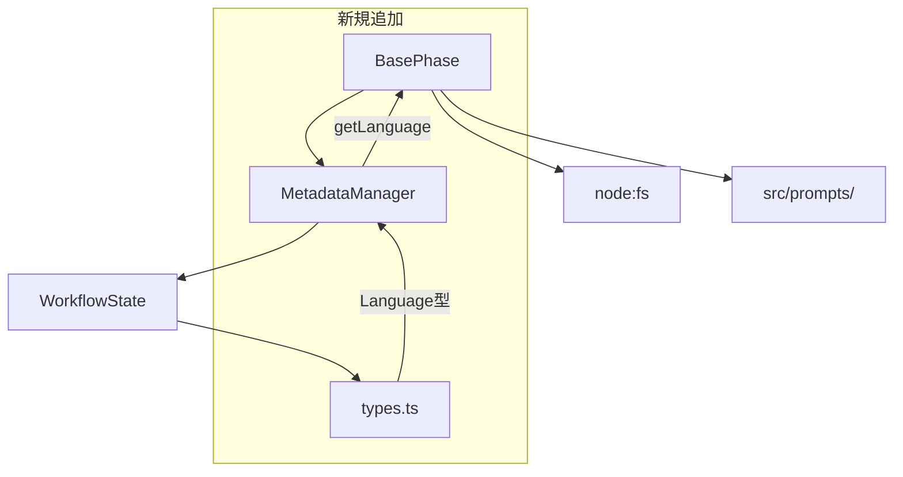

# Codex Agent 実行ログ

開始日時: 2025/12/30 3:15:58

---

## Turn 1: スレッド開始

**Thread ID**: `[REDACTED_TOKEN]`

## Turn 2: ツール実行

**種別**: reasoning
**ステータス**: completed

## Turn 3: ツール実行

**種別**: コマンド実行
**コマンド**: `/bin/bash -lc pwd`
**ステータス**: completed (exit_code=0)

```text
/tmp/ai-workflow-repos-138-6353c320/ai-workflow-agent
```

## Turn 4: ツール実行

**種別**: reasoning
**ステータス**: completed

## Turn 5: ツール実行

**種別**: コマンド実行
**コマンド**: `/bin/bash -lc ls`
**ステータス**: completed (exit_code=0)

```text
ARCHITECTURE.md
CHANGELOG.md
CLAUDE.md
[REDACTED_TOKEN].md
[REDACTED_TOKEN].md
CODEBASE_SUMMARY.md
DOCKER_AUTH_SETUP.md
Dockerfile
Jenkinsfile
LICENSE
PROGRESS.md
README.md
ROADMAP.md
SETUP_TYPESCRIPT.md
TROUBLESHOOTING.md
__mocks__
docs
examples
jenkins
jest.config.cjs
metadata.json.template
package-lock.json
package.json
scripts
src
tests
tmp
tsconfig.json
tsconfig.test.json
```

## Turn 6: ツール実行

**種別**: reasoning
**ステータス**: completed

## Turn 7: ツール実行

**種別**: reasoning
**ステータス**: completed

## Turn 8: ツール実行

**種別**: コマンド実行
**コマンド**: `/bin/bash -lc 'ls .ai-workflow'`
**ステータス**: completed (exit_code=0)

```text
issue-10
issue-102
issue-104
issue-105
issue-108
issue-113
issue-115
issue-119
issue-126
issue-127
issue-128
issue-140
issue-144
issue-150
issue-153
issue-155
issue-16
issue-161
issue-165
issue-174
issue-177
issue-18
issue-184
issue-188
issue-194
issue-2
issue-207
issue-208
issue-211
issue-212
issue-216
issue-22
issue-225
issue-23
issue-238
issue-24
issue-243
issue-248
issue-25
issue-253
issue-259
issue-26
issue-261
issue-271
issue-38
issue-45
issue-46
issue-47
issue-48
issue-49
issue-5
issue-50
issue-51
issue-52
issue-54
issue-571
issue-58
issue-61
issue-64
issue-7
issue-73
issue-74
issue-90
issue-91
```

## Turn 9: ツール実行

**種別**: reasoning
**ステータス**: completed

## Turn 10: ツール実行

**種別**: コマンド実行
**コマンド**: `/bin/bash -lc 'cat .ai-workflow/issue-571/00_planning/output/planning.md'`
**ステータス**: completed (exit_code=0)

```text
# プロジェクト計画書: Issue #571

## Implement prompt file switching based on language setting

---

## 1. Issue分析

### 概要

Issue #526で言語設定の解決ロジックとメタデータ永続化が実装されたが、実際のプロンプトファイルは日本語固定のままである。`metadata.json` の `language` 設定に応じてプロンプトファイルを切り替える機能を実装する。

### 複雑度: **中程度**

**判定根拠**:
- 複数ファイルの修正が必要（`base-phase.ts`、`copy-static-assets.mjs`、プロンプトファイル構造）
- 既存機能（`loadPrompt()`メソッド）の拡張が中心
- プロンプトファイルの構造変更（10フェーズ × 2言語 × 3種類 = 60ファイル）
- 新規アーキテクチャ変更ではなく、既存パターンに沿った拡張

### 見積もり工数: **12〜16時間**

**内訳**:
| 作業項目 | 見積もり時間 |
|---------|------------|
| 要件定義・設計 | 2h |
| プロンプトファイル構造変更（日本語移動） | 1h |
| 英語プロンプト翻訳（30ファイル） | 4〜6h |
| `BasePhase.loadPrompt()` 修正 | 1〜2h |
| ビルドスクリプト更新 | 0.5h |
| テストコード実装 | 2〜3h |
| 統合テスト・動作確認 | 1h |
| ドキュメント更新 | 0.5h |

### リスク評価: **中**

**理由**:
- プロンプトファイルの翻訳品質がシステム動作に影響
- 既存の全フェーズに影響するため、回帰テストが重要
- フォールバック機構が正しく動作しないと、言語未対応時にエラーが発生

---

## 2. 実装戦略判断

### 実装戦略: **EXTEND**

**判断根拠**:
- 既存の `BasePhase.loadPrompt()` メソッドを拡張して多言語対応を追加
- 新規ファイル作成は最小限（テストファイル1つ、英語プロンプト30ファイル）
- 既存のプロンプトロード機構を維持しつつ、言語切り替えロジックを追加
- `copy-static-assets.mjs` は既存のコピーロジックで対応可能（ディレクトリ構造変更のみ）

**EXTEND を選択した理由**:
1. `loadPrompt()` メソッドは既に存在し、パス解決ロジックを拡張するだけ
2. 環境情報注入や差し戻しコンテキスト注入など、既存の注入パターンを踏襲
3. プロンプトファイルのディレクトリ構造変更は、既存ファイルの移動が中心

### テスト戦略: **UNIT_INTEGRATION**

**判断根拠**:
- **ユニットテスト**: `loadPrompt()` メソッドの多言語パス解決ロジック、フォールバック動作
- **インテグレーションテスト**: 実際のプロンプトファイル構造での読み込み確認、ビルド後の動作確認

**UNIT_INTEGRATION を選択した理由**:
1. `loadPrompt()` のロジック変更はユニットテストで検証可能
2. プロンプトファイル構造変更は統合テストで実際のファイルシステム操作を検証
3. BDDは不要（エンドユーザー向け機能ではなく内部実装の拡張）

### テストコード戦略: **CREATE_TEST**

**判断根拠**:
- 新規テストファイル `tests/integration/[REDACTED_TOKEN].test.ts` を作成
- 既存の `base-phase-*.test.ts` とは独立した多言語切り替えテスト
- フォールバック動作の網羅的なテストには専用ファイルが適切

**CREATE_TEST を選択した理由**:
1. 多言語切り替えは新規機能であり、独立したテストスイートが適切
2. 既存テストファイルへの追加では、テストの関心事が混在する
3. Issue本文で `tests/integration/[REDACTED_TOKEN].test.ts` が指定されている

---

## 3. 影響範囲分析

### 既存コードへの影響

| ファイル | 変更内容 | 影響度 |
|---------|---------|-------|
| `src/phases/base-phase.ts` | `loadPrompt()` メソッドの多言語対応 | 高 |
| `scripts/copy-static-assets.mjs` | 多言語ディレクトリ構造のコピー対応 | 低 |
| `src/prompts/*/` | ディレクトリ構造変更（`{phase}/{lang}/` 形式へ） | 中 |
| `src/types.ts` | `DEFAULT_LANGUAGE` 定数の追加（必要に応じて） | 低 |

### 依存関係の変更

- **新規依存**: なし
- **既存依存の変更**: なし
- **内部依存**: `MetadataManager.getLanguage()` メソッドの利用（既に実装済み想定）

### マイグレーション要否

- **プロンプトファイル構造**:
  - 既存の `src/prompts/{phase}/*.txt` を `src/prompts/{phase}/ja/*.txt` に移動
  - 英語版プロンプト `src/prompts/{phase}/en/*.txt` を新規作成
- **設定ファイル変更**: なし
- **データベーススキーマ変更**: なし

### 影響を受けるフェーズ（全10フェーズ）

1. Planning (00)
2. Requirements (01)
3. Design (02)
4. Test Scenario (03)
5. Implementation (04)
6. Test Implementation (05)
7. Testing (06)
8. Documentation (07)
9. Report (08)
10. Evaluation (09)

---

## 4. タスク分割

### Phase 1: 要件定義 (見積もり: 1〜2h)

- [x] Task 1-1: 機能要件の明確化 (1h)
  - 多言語プロンプト切り替えの仕様定義
  - フォールバック動作の仕様定義
  - 対象言語（ja, en）の確定

- [x] Task 1-2: 受け入れ基準の定義 (0.5h)
  - `language: 'ja'` 設定時に日本語プロンプトが読み込まれる
  - `language: 'en'` 設定時に英語プロンプトが読み込まれる
  - 指定言語のプロンプトが存在しない場合、日本語にフォールバック
  - ビルド後も多言語ディレクトリ構造が維持される

### Phase 2: 設計 (見積もり: 1〜2h)

- [x] Task 2-1: `loadPrompt()` メソッドの設計 (1h)
  - 言語パラメータ取得方法の設計
  - パス解決ロジックの設計
  - フォールバック機構の設計

- [x] Task 2-2: ディレクトリ構造の設計 (0.5h)
  - `src/prompts/{phase}/{lang}/*.txt` 構造の確定
  - ビルド後の `dist/prompts/` 構造の確定

### Phase 3: テストシナリオ (見積もり: 1〜2h)

- [x] Task 3-1: ユニットテストシナリオ作成 (1h)
  - `loadPrompt()` 日本語読み込みテスト
  - `loadPrompt()` 英語読み込みテスト
  - フォールバックテスト（言語未対応時）
  - エラーテスト（プロンプトファイル欠落時）

- [x] Task 3-2: 統合テストシナリオ作成 (0.5h)
  - 全10フェーズの多言語切り替え確認
  - ビルド後のプロンプト読み込み確認

### Phase 4: 実装 (見積もり: 6〜8h)

- [ ] Task 4-1: プロンプトファイル構造の変更 (1h)
  - 既存日本語プロンプトを `{phase}/ja/` に移動
  - ディレクトリ作成スクリプトの実行

- [ ] Task 4-2: 英語プロンプトの翻訳・作成 (4〜6h)
  - 10フェーズ × 3種類（execute, review, revise）= 30ファイル
  - LLMを使用した翻訳の実施
  - 翻訳品質の確認

- [ ] Task 4-3: `BasePhase.loadPrompt()` の多言語対応実装 (1〜2h)
  - `MetadataManager.getLanguage()` の呼び出し追加
  - パス解決ロジックの変更（言語ディレクトリを含める）
  - フォールバック機構の実装
  - ログ出力の追加

- [ ] Task 4-4: `DEFAULT_LANGUAGE` 定数の追加 (0.5h)
... (truncated)
```

## Turn 11: ツール実行

**種別**: reasoning
**ステータス**: completed

## Turn 12: ツール実行

**種別**: コマンド実行
**コマンド**: `/bin/bash -lc 'cat .ai-workflow/issue-571/04_implementation/output/implementation.md'`
**ステータス**: completed (exit_code=0)

```text
# 実装完了レポート

## 変更ファイル一覧

| ファイル | 変更種別 | 概要 |
|---------|---------|------|
| `src/types.ts` | 修正 | プロンプト言語用の`Language`型と`DEFAULT_LANGUAGE`を追加しメタデータ型に言語を許容 |
| `src/core/metadata-manager.ts` | 修正 | 言語設定を取得する`getLanguage()`を実装しデフォルトフォールバックを追加 |
| `src/phases/base-phase.ts` | 修正 | `loadPrompt`を言語対応させ不足時にデフォルトへフォールバックするよう更新 |
| `src/prompts/*/ja/*.txt` | 移動 | 各フェーズの既存プロンプトを言語ディレクトリ配下に再配置 |
| `src/prompts/*/en/*.txt` | 新規 | 10フェーズ分の英語プロンプトを追加 |

## 主要な変更点
- プロンプトディレクトリを`{phase}/{lang}/`構造に整理し日本語ファイルを`ja/`へ移動、英語版を追加。
- `Language`型と`DEFAULT_LANGUAGE`を定義し、メタデータからの言語取得にフォールバック処理を追加。
- `BasePhase.loadPrompt`が言語設定に応じてプロンプトを読み込み、指定言語が無い場合は日本語へ警告付きでフォールバックするように変更。

## テスト実施状況
- ビルド: 未実行（依頼なし）
- リント: 未実行（依頼なし）
- 基本動作確認: プロンプト構造と読み込みロジックの変更のみのため手動テストは未実施
```

## Turn 13: ツール実行

**種別**: reasoning
**ステータス**: completed

## Turn 14: ツール実行

**種別**: コマンド実行
**コマンド**: `/bin/bash -lc "sed -n '1,200p' src/types.ts"`
**ステータス**: completed (exit_code=0)

```text
export type PhaseName =
  | 'planning'
  | 'requirements'
  | 'design'
  | 'test_scenario'
  | 'implementation'
  | 'test_implementation'
  | 'testing'
  | 'documentation'
  | 'report'
  | 'evaluation';

export type PhaseStatus = 'pending' | 'in_progress' | 'completed' | 'failed';

// Issue #10: ステップ名の型定義
export type StepName = 'execute' | 'review' | 'revise';

export type DifficultyLevel = 'simple' | 'moderate' | 'complex';

/**
 * Supported language codes for prompts (Issue #571)
 */
export type Language = 'ja' | 'en';

/**
 * Default language used when no valid preference is set
 */
export const DEFAULT_LANGUAGE: Language = 'ja';

export interface [REDACTED_TOKEN] {
  level: DifficultyLevel;
  confidence: number;
  factors: {
    estimated_file_changes: number;
    scope: 'single_file' | 'single_module' | 'multiple_modules' | 'cross_cutting';
    requires_tests: boolean;
    requires_architecture_change: boolean;
    complexity_score: number;
  };
  analyzed_at: string;
  analyzer_agent: 'claude' | 'codex';
  analyzer_model: string;
}

export interface StepModelConfig {
  claudeModel: 'opus' | 'sonnet';
  codexModel: 'max' | 'mini';
}

export interface PhaseModelConfig {
  execute: StepModelConfig;
  review: StepModelConfig;
  revise: StepModelConfig;
}

export type ModelConfigByPhase = {
  [phase in PhaseName]?: PhaseModelConfig;
};

export interface PhaseMetadata {
  status: PhaseStatus;
  retry_count: number;
  started_at: string | null;
  completed_at: string | null;
  review_result: string | null;
  output_files?: string[];
  // Issue #10: ステップ単位の進捗管理
  current_step?: StepName | null;  // 現在実行中のステップ（実行中でない場合はnull）
  completed_steps?: StepName[];     // 完了済みステップの配列（実行順序を保持）
  // Issue #90: 差し戻しコンテキスト（オプショナル）
  rollback_context?: import('./types/commands.js').RollbackContext | null;
}

/**
 * フォローアップ Issue の背景コンテキスト
 * Evaluation Phase から IssueClient に渡される
 */
export interface IssueContext {
  /**
   * 元 Issue の概要
   * 例: "Issue #91 では、BasePhase モジュール分解（Issue #49）で発生した 15 件のテスト失敗を修正しました。"
   */
  summary: string;

  /**
   * ブロッカーのステータス
   * 例: "すべてのブロッカーは解決済み"
   */
  blockerStatus: string;

  /**
   * タスクが残った理由
   * 例: "テスト失敗修正を優先したため、カバレッジ改善は後回しにした"
   */
  deferredReason: string;
}

/**
 * Evaluation Phase で検出された残タスク
 */
export interface RemainingTask {
  // ===== 既存フィールド（必須） =====
  /** タスクの説明 */
  task: string;

  /** 対象フェーズ（例: "implementation", "testing"） */
  phase: string;

  /** 優先度（例: "High", "Medium", "Low"） */
  priority: string;

  // ===== 新規フィールド（すべてオプショナル） =====

  /**
   * 優先度の理由
   * 例: "元 Issue #91 の推奨事項、ブロッカーではない"
   */
  priorityReason?: string;

  /**
   * 対象ファイル/モジュールのリスト
   * 例: ["src/core/phase-factory.ts", "src/commands/execute/agent-setup.ts"]
   */
  targetFiles?: string[];

  /**
   * 実行手順（番号付きリスト）
   * 例: ["不足しているテストケースを特定", "エッジケースのテストを追加"]
   */
  steps?: string[];

  /**
   * 受け入れ基準（Acceptance Criteria）
   * 例: ["すべての対象モジュールで 90% 以上のカバレッジを達成", "npm run test:coverage がすべてパス"]
   */
  acceptanceCriteria?: string[];

  /**
   * 依存タスク
   * 例: ["Task 1 完了後に実行", "Phase 4 の修正が必要"]
   */
  dependencies?: string[];

  /**
   * 見積もり工数
   * 例: "2-4h", "1日", "0.5h"
   */
  estimatedHours?: string;
}

export interface [REDACTED_TOKEN] {
  enabled: boolean;
  provider: 'auto' | 'openai' | 'claude' | 'agent';
  model?: string;
  temperature?: number;
  maxOutputTokens?: number;
  timeoutMs?: number;
  maxRetries?: number;
  maxTasks?: number;
  appendMetadata?: boolean;
}

export interface [REDACTED_TOKEN] {
  title: string;
  body: string;
  metadata: {
    provider: 'openai' | 'claude';
    model: string;
    durationMs: number;
    retryCount: number;
    inputTokens?: number;
    outputTokens?: number;
    omittedTasks?: number;
  };
}

export interface [REDACTED_TOKEN] extends PhaseMetadata {
  decision: string | null;
  failed_phase: PhaseName | null;
  remaining_tasks: RemainingTask[];
  created_issue_url: string | null;
  abort_reason: string | null;
}

export type P
... (truncated)
```

## Turn 15: ツール実行

**種別**: reasoning
**ステータス**: completed

## Turn 16: ツール実行

**種別**: コマンド実行
**コマンド**: `/bin/bash -lc "sed -n '1,200p' src/core/metadata-manager.ts"`
**ステータス**: completed (exit_code=0)

```text
import fs from 'fs-extra';
import { logger } from '../utils/logger.js';
import { dirname, join } from 'node:path';
import { WorkflowState } from './workflow-state.js';
import {
  PhaseName,
  PhaseStatus,
  StepName,
  WorkflowMetadata,
  RemainingTask,
  PhaseMetadata,
  [REDACTED_TOKEN],
  [REDACTED_TOKEN],
  ModelConfigByPhase,
  Language,
  DEFAULT_LANGUAGE,
} from '../types.js';
import { [REDACTED_TOKEN], backupMetadataFile, [REDACTED_TOKEN] } from './helpers/metadata-io.js';

/**
 * フェーズの順序を定義
 * Object.keys() の順序は保証されないため、明示的な配列で順序を管理
 */
const PHASE_ORDER: PhaseName[] = [
  'planning',
  'requirements',
  'design',
  'test_scenario',
  'implementation',
  'test_implementation',
  'testing',
  'documentation',
  'report',
  'evaluation',
];

export class MetadataManager {
  public readonly metadataPath: string;
  public readonly workflowDir: string;
  private readonly state: WorkflowState;

  constructor(metadataPath: string) {
    this.metadataPath = metadataPath;
    this.workflowDir = dirname(metadataPath);
    this.state = WorkflowState.load(metadataPath);
  }

  private ensurePhaseData(
    phaseName: PhaseName,
  ): PhaseMetadata | [REDACTED_TOKEN] {
    let phaseData = this.state.data.phases[phaseName];
    if (phaseData) {
      return phaseData;
    }

    const migrated = this.state.migrate();
    phaseData = this.state.data.phases[phaseName];
    if (phaseData) {
      return phaseData;
    }

    logger.warn(`Phase ${phaseName} missing from metadata. Initializing default entry.`);
    if (phaseName === 'evaluation') {
      const evaluationData = this.[REDACTED_TOKEN]();
      this.state.data.phases.evaluation = evaluationData;
      return evaluationData;
    }

    const defaultData = this.[REDACTED_TOKEN]();
    this.state.data.phases[phaseName] = defaultData;
    return defaultData;
  }

  private [REDACTED_TOKEN](): PhaseMetadata {
    return {
      status: 'pending',
      retry_count: 0,
      started_at: null,
      completed_at: null,
      review_result: null,
      output_files: [],
      current_step: null,
      completed_steps: [],
      rollback_context: null,
    };
  }

  private [REDACTED_TOKEN](): [REDACTED_TOKEN] {
    const base = this.[REDACTED_TOKEN]();
    return {
      ...base,
      decision: null,
      failed_phase: null,
      remaining_tasks: [],
      created_issue_url: null,
      abort_reason: null,
    };
  }

  public get data(): WorkflowMetadata {
    return this.state.data;
  }

  public save(): void {
    this.state.save();
  }

  public updatePhaseStatus(
    phaseName: PhaseName,
    status: PhaseStatus,
    options: {
      outputFile?: string;
      reviewResult?: string;
    } = {},
  ): void {
    const phaseData = this.ensurePhaseData(phaseName);
    const currentStatus = phaseData.status;

    // Issue #248: 冪等性チェック（同じステータスへの重複更新をスキップ）
    if (currentStatus === status) {
      logger.info(`Phase ${phaseName}: Status already set to '${status}', skipping update`);
      return;
    }

    // Issue #248: ステータス遷移バリデーション（不正な遷移を検出）
    this.[REDACTED_TOKEN](phaseName, currentStatus, status);

    // 既存のステータス更新処理
    this.state.updatePhaseStatus(phaseName, status);

    if (options.outputFile) {
      if (!phaseData.output_files) {
        phaseData.output_files = [];
      }
      phaseData.output_files.push(options.outputFile);
    }

    if (options.reviewResult) {
      phaseData.review_result = options.reviewResult;
    }

    this.state.save();

    logger.debug(`Phase ${phaseName}: Status updated from '${currentStatus}' to '${status}'`);
  }

  /**
   * Issue #248: ステータス遷移のバリデーション
   *
   * 不正なステータス遷移を検出してログ出力する。
   * 不正な遷移でもステータス更新は実行される（エラーにはしない）。
   *
   * 許可される遷移:
   * - pending → in_progress
   * - in_progress → completed
   * - in_progress → failed
   *
   * 不正な遷移の例:
   * - completed → in_progress
   * - failed → in_progress
   * - p
... (truncated)
```

## Turn 17: ツール実行

**種別**: reasoning
**ステータス**: completed

## Turn 18: ツール実行

**種別**: コマンド実行
**コマンド**: `/bin/bash -lc 'rg -n "getLanguage" -n src/core/metadata-manager.ts'`
**ステータス**: failed (exit_code=127)

```text
/bin/bash: line 1: rg: command not found
```

## Turn 19: ツール実行

**種別**: reasoning
**ステータス**: completed

## Turn 20: ツール実行

**種別**: コマンド実行
**コマンド**: `/bin/bash -lc 'grep -n "getLanguage" -n src/core/metadata-manager.ts'`
**ステータス**: completed (exit_code=0)

```text
220:  public getLanguage(): Language {
```

## Turn 21: ツール実行

**種別**: reasoning
**ステータス**: completed

## Turn 22: ツール実行

**種別**: コマンド実行
**コマンド**: `/bin/bash -lc "sed -n '200,340p' src/core/metadata-manager.ts"`
**ステータス**: completed (exit_code=0)

```text
this.state.data.difficulty_analysis = result;
    this.state.save();
  }

  public [REDACTED_TOKEN](): [REDACTED_TOKEN] | null {
    return this.state.data.difficulty_analysis ?? null;
  }

  public setModelConfig(config: ModelConfigByPhase | null): void {
    this.state.data.model_config = config;
    this.state.save();
  }

  public getModelConfig(): ModelConfigByPhase | null {
    return this.state.data.model_config ?? null;
  }

  /**
   * Get preferred language for prompt loading (Issue #571)
   */
  public getLanguage(): Language {
    const metadataLanguage = (this.state.data as WorkflowMetadata & { language?: string }).language;
    if (metadataLanguage === 'ja' || metadataLanguage === 'en') {
      return metadataLanguage;
    }

    return DEFAULT_LANGUAGE;
  }

  public getPhaseStatus(phaseName: PhaseName): PhaseStatus {
    return this.state.getPhaseStatus(phaseName);
  }

  public setDesignDecision(key: string, value: string): void {
    this.state.setDesignDecision(key, value);
    this.state.save();
  }

  public incrementRetryCount(phaseName: PhaseName): number {
    const count = this.state.incrementRetryCount(phaseName);
    this.state.save();
    return count;
  }

  public clear(): void {
    if (fs.existsSync(this.metadataPath)) {
      logger.info(`Clearing metadata: ${this.metadataPath}`);
      fs.rmSync(this.metadataPath, { force: true });
    }

    [REDACTED_TOKEN](this.workflowDir);
    if (!fs.existsSync(this.workflowDir)) {
      logger.info('Workflow directory removed successfully');
    }
  }

  public rollbackToPhase(phaseName: PhaseName) {
    const phases = Object.keys(this.state.data.phases) as PhaseName[];
    if (!phases.includes(phaseName)) {
      return {
        success: false,
        error: `Invalid phase name: ${phaseName}`,
        backup_path: null,
        rolled_back_phases: [] as PhaseName[],
      };
    }

    const backupPath = backupMetadataFile(this.metadataPath);

    const startIndex = phases.indexOf(phaseName);
    const rolledBack = phases.slice(startIndex);

    for (const phase of rolledBack) {
      const phaseData = this.ensurePhaseData(phase);
      phaseData.status = 'pending';
      phaseData.started_at = null;
      phaseData.completed_at = null;
      phaseData.review_result = null;
      phaseData.retry_count = 0;
      // Issue #208: completed_steps と current_step のリセット追加
      phaseData.current_step = null;
      phaseData.completed_steps = [];
      phaseData.rollback_context = null; // Issue #208: consistency確保
    }

    this.state.save();

    logger.info(`metadata.json rolled back to phase ${phaseName}`);
    logger.info(`Phases reset: ${rolledBack.join(', ')}`);

    return {
      success: true,
      backup_path: backupPath,
      rolled_back_phases: rolledBack,
      error: null,
    };
  }

  public getAllPhasesStatus(): Record<PhaseName, PhaseStatus> {
    const result = {} as Record<PhaseName, PhaseStatus>;
    for (const [phase, data] of Object.entries(this.state.data.phases)) {
      result[phase as PhaseName] = data.status;
    }
    return result;
  }

  public backupMetadata(): string {
    return backupMetadataFile(this.metadataPath);
  }

  public [REDACTED_TOKEN](options: {
    decision: string;
    failedPhase?: PhaseName | null;
    remainingTasks?: RemainingTask[] | null;
    createdIssueUrl?: string | null;
    abortReason?: string | null;
  }): void {
    const evaluation = this.ensurePhaseData('evaluation') as [REDACTED_TOKEN];
    if (!evaluation) {
      throw new Error('Evaluation phase not found in metadata');
    }

    evaluation.decision = options.decision;

    if (options.failedPhase !== undefined) {
      evaluation.failed_phase = options.failedPhase ?? null;
    }

    if (options.remainingTasks !== undefined) {
      evaluation.remaining_tasks = options.remainingTasks ?? [];
    }

    if (options.createdIssueUrl !== undefined) {
      evaluation.created_issue_url = options.createdIssueUr
... (truncated)
```

## Turn 23: ツール実行

**種別**: reasoning
**ステータス**: completed

## Turn 24: ツール実行

**種別**: コマンド実行
**コマンド**: `/bin/bash -lc "sed -n '1,200p' src/phases/base-phase.ts"`
**ステータス**: completed (exit_code=0)

```text
import * as fs from 'node:fs';
import { logger } from '../utils/logger.js';
import path from 'node:path';
import { fileURLToPath } from 'node:url';
import { MetadataManager } from '../core/metadata-manager.js';
import { ClaudeAgentClient } from '../core/claude-agent-client.js';
import { CodexAgentClient } from '../core/codex-agent-client.js';
import { GitHubClient } from '../core/github-client.js';
import { ContentParser } from '../core/content-parser.js';
import { config } from '../core/config.js';
import {
  [REDACTED_TOKEN],
  PhaseName,
  PhaseStatus,
  PhaseMetadata,
  StepName,
  DEFAULT_LANGUAGE,
  type [REDACTED_TOKEN],
  type WorkflowMetadata,
} from '../types.js';
import { LogFormatter } from './formatters/log-formatter.js';
import { ProgressFormatter } from './formatters/progress-formatter.js';
import { AgentExecutor } from './core/agent-executor.js';
import { ReviewCycleManager } from './core/review-cycle-manager.js';
import { ContextBuilder } from './context/context-builder.js';
import { ArtifactCleaner } from './cleanup/artifact-cleaner.js';
import { StepExecutor } from './lifecycle/step-executor.js';
import { PhaseRunner } from './lifecycle/phase-runner.js';
import { getErrorMessage } from '../utils/error-utils.js';
import { [REDACTED_TOKEN] } from '../commands/execute/agent-setup.js';
import { ModelOptimizer, ModelOverrides } from '../core/model-optimizer.js';

// PhaseRunOptions を BasePhase から export（Issue #49）
export interface PhaseRunOptions {
  gitManager?: import('../core/git-manager.js').GitManager | null;
  skipReview?: boolean;
  cleanupOnComplete?: boolean;  // Issue #2: Cleanup workflow artifacts after evaluation phase
  [REDACTED_TOKEN]?: boolean;  // Issue #2: Skip confirmation prompt for cleanup
}

const moduleDir = path.dirname(fileURLToPath(import.meta.url));
const promptsRoot = path.resolve(moduleDir, '..', 'prompts');
const MAX_RETRIES = 3;

export type [REDACTED_TOKEN] = {
  phaseName: PhaseName;
  workingDir: string;
  metadataManager: MetadataManager;
  codexClient?: CodexAgentClient | null;
  claudeClient?: ClaudeAgentClient | null;
  githubClient: GitHubClient;
  skipDependencyCheck?: boolean;
  ignoreDependencies?: boolean;
  presetPhases?: PhaseName[]; // プリセット実行時のフェーズリスト（Issue #396）
  [REDACTED_TOKEN]?: [REDACTED_TOKEN]; // Issue #119: Optional for backward compatibility
  modelOptimizer?: ModelOptimizer | null;
  modelOverrides?: ModelOverrides;
};

export type [REDACTED_TOKEN] = Omit<[REDACTED_TOKEN], 'phaseName'>;

export abstract class BasePhase {
  protected readonly phaseName: PhaseName;
  protected readonly workingDir: string;
  protected readonly metadata: MetadataManager;
  protected codex: CodexAgentClient | null;
  protected claude: ClaudeAgentClient | null;
  protected readonly github: GitHubClient;
  protected readonly skipDependencyCheck: boolean;
  protected readonly ignoreDependencies: boolean;
  protected readonly presetPhases: PhaseName[] | undefined; // プリセット実行時のフェーズリスト（Issue #396）
  protected readonly contentParser: ContentParser;
  protected readonly issueGenerationOptions: [REDACTED_TOKEN];
  protected readonly modelOptimizer: ModelOptimizer | null;
  protected readonly modelOverrides: ModelOverrides | undefined;

  protected readonly phaseDir: string;
  protected readonly outputDir: string;
  protected readonly executeDir: string;
  protected readonly reviewDir: string;
  protected readonly reviseDir: string;

  // 新規モジュール (Issue #23)
  private readonly logFormatter: LogFormatter;
  private readonly progressFormatter: ProgressFormatter;
  private agentExecutor: AgentExecutor | null = null;
  private readonly reviewCycleManager: ReviewCycleManager;

  // 新規モジュール (Issue #49)
  private readonly contextBuilder: ContextBuilder;
  private readonly artifactCleaner: ArtifactCleaner;
  private stepExecutor: StepExecutor | null = null;
  private phaseRunner: PhaseRunner | null = null;

  private getActiveAge
... (truncated)
```

## Turn 25: ツール実行

**種別**: reasoning
**ステータス**: completed

## Turn 26: ツール実行

**種別**: コマンド実行
**コマンド**: `/bin/bash -lc 'rg -n "loadPrompt" src/phases/base-phase.ts'`
**ステータス**: failed (exit_code=127)

```text
/bin/bash: line 1: rg: command not found
```

## Turn 27: ツール実行

**種別**: reasoning
**ステータス**: completed

## Turn 28: ツール実行

**種別**: コマンド実行
**コマンド**: `/bin/bash -lc 'grep -n "loadPrompt" -n src/phases/base-phase.ts'`
**ステータス**: completed (exit_code=0)

```text
292:  protected loadPrompt(promptType: 'execute' | 'review' | 'revise'): string {
470:    let prompt = this.loadPrompt('execute');
```

## Turn 29: ツール実行

**種別**: reasoning
**ステータス**: completed

## Turn 30: ツール実行

**種別**: コマンド実行
**コマンド**: `/bin/bash -lc "sed -n '260,360p' src/phases/base-phase.ts"`
**ステータス**: completed (exit_code=0)

```text
this.phaseName,
        this.metadata,
        this.reviewCycleManager,
        async () => this.runWithStepModel('execute', () => this.execute()),
        async () => this.runWithStepModel('review', () => this.review()),
        async () => this.shouldRunReview()
      );
    }

    if (!this.phaseRunner) {
      const reviseHandler = this.getReviseFunction();
      const wrappedRevise =
        reviseHandler !== null
          ? (feedback: string) => this.runWithStepModel('revise', () => reviseHandler(feedback))
          : null;

      this.phaseRunner = new PhaseRunner(
        this.phaseName,
        this.metadata,
        this.github,
        this.stepExecutor,
        this.skipDependencyCheck,
        this.ignoreDependencies,
        this.presetPhases,
        wrappedRevise
      );
    }

    // PhaseRunner に委譲（Issue #49）
    return this.phaseRunner.run(options);
  }

  protected loadPrompt(promptType: 'execute' | 'review' | 'revise'): string {
    const language = this.metadata.getLanguage();
    const promptPath = path.join(promptsRoot, this.phaseName, language, `${promptType}.txt`);
    let resolvedPath = promptPath;

    if (!fs.existsSync(promptPath)) {
      const fallbackPath = path.join(promptsRoot, this.phaseName, DEFAULT_LANGUAGE, `${promptType}.txt`);

      if (!fs.existsSync(fallbackPath)) {
        throw new Error(`Prompt file not found: ${promptPath} (fallback also failed: ${fallbackPath})`);
      }

      logger.warn(
        `Prompt not found for language '${language}', falling back to '${DEFAULT_LANGUAGE}': ${promptPath}`
      );
      resolvedPath = fallbackPath;
    }

    let prompt = fs.readFileSync(resolvedPath, 'utf-8');

    // Issue #177: 環境情報の注入（execute ステップのみ、パッケージインストール可能時）
    if (promptType === 'execute' && config.[REDACTED_TOKEN]()) {
      const environmentInfo = this.[REDACTED_TOKEN]();
      prompt = environmentInfo + '\n\n' + prompt;

      logger.info(`Environment info injected into execute prompt for phase ${this.phaseName}`);
    }

    // Issue #90: 差し戻しコンテキストがある場合、プロンプトの先頭に追加
    // revise ステップのみに差し戻し情報を注入
    if (promptType === 'revise') {
      const rollbackContext = this.metadata.getRollbackContext(this.phaseName);
      if (rollbackContext) {
        const rollbackSection = this.[REDACTED_TOKEN](rollbackContext);
        prompt = rollbackSection + '\n\n' + prompt;

        logger.info(`Rollback context injected into revise prompt for phase ${this.phaseName}`);
      }
    }

    return prompt;
  }

  /**
   * Issue #177: 環境情報セクションのMarkdownを生成
   * @returns 環境情報セクションのMarkdown文字列
   * @private
   */
  private [REDACTED_TOKEN](): string {
    return `## 🛠️ 開発環境情報

このDocker環境では、以下のプログラミング言語をインストール可能です：

- **Python**: \`apt-get update && apt-get install -y python3 python3-pip\`
- **Go**: \`apt-get update && apt-get install -y golang-go\`
- **Java**: \`apt-get update && apt-get install -y default-jdk\`
- **Rust**: \`curl --proto '=https' --tlsv1.2 -sSf https://sh.rustup.rs | sh -s -- -y\`
- **Ruby**: \`apt-get update && apt-get install -y ruby ruby-dev\`

テスト実行や品質チェックに必要な言語環境は、自由にインストールしてください。`;
  }

  /**
   * Issue #90: 差し戻し情報をMarkdown形式で生成
   * @param context - 差し戻しコンテキスト
   * @returns Markdown形式の差し戻し情報
   */
  protected [REDACTED_TOKEN](
    context: import('../types/commands.js').RollbackContext,
```

## Turn 31: ツール実行

**種別**: reasoning
**ステータス**: completed

## Turn 32: ツール実行

**種別**: コマンド実行
**コマンド**: `/bin/bash -lc 'cat .ai-workflow/issue-571/02_design/output/design.md'`
**ステータス**: completed (exit_code=0)

```text
# 詳細設計書: Issue #571

## Implement prompt file switching based on language setting

---

## 0. Planning Documentの確認

本設計書は、Planning Phase成果物（`.ai-workflow/issue-571/00_planning/output/planning.md`）および要件定義書（`.ai-workflow/issue-571/01_requirements/output/requirements.md`）の計画に基づいて作成されています。

### 開発計画の概要

| 項目 | 内容 |
|------|------|
| **複雑度** | 中程度 |
| **見積もり工数** | 12〜16時間 |
| **実装戦略** | EXTEND（既存の`loadPrompt()`メソッドを拡張） |
| **テスト戦略** | UNIT_INTEGRATION |
| **テストコード戦略** | CREATE_TEST |

---

## 1. 既存コードベース分析

### 1.1 現状の実装

#### BasePhase.loadPrompt() メソッド

**ファイル**: `src/phases/base-phase.ts` (lines 291-320)

```typescript
protected loadPrompt(promptType: 'execute' | 'review' | 'revise'): string {
  const promptPath = path.join(promptsRoot, this.phaseName, `${promptType}.txt`);
  if (!fs.existsSync(promptPath)) {
    throw new Error(`Prompt file not found: ${promptPath}`);
  }

  let prompt = fs.readFileSync(promptPath, 'utf-8');

  // Issue #177: 環境情報の注入（execute ステップのみ）
  if (promptType === 'execute' && config.[REDACTED_TOKEN]()) {
    const environmentInfo = this.[REDACTED_TOKEN]();
    prompt = environmentInfo + '\n\n' + prompt;
    // ...
  }

  // Issue #90: 差し戻しコンテキストの注入
  if (promptType === 'revise') {
    // ...
  }

  return prompt;
}
```

**現状の問題**:
- パス解決: `promptsRoot/{phaseName}/{promptType}.txt` （言語考慮なし）
- 言語設定を一切参照していない
- 日本語プロンプトのみ存在

#### MetadataManager クラス

**ファイル**: `src/core/metadata-manager.ts`

**重要な発見**: `getLanguage()` メソッドは**存在しない**。Issue #526で実装済みとの前提だったが、実際には未実装。

**現在のWorkflowMetadata型** (`src/types.ts`):
```typescript
export interface WorkflowMetadata {
  issue_number: string;
  issue_url: string;
  issue_title: string;
  // ...
  // language フィールドは存在しない
}
```

#### プロンプトファイル構造

**現状**: `src/prompts/{phase}/{promptType}.txt`

```
src/prompts/
├── planning/
│   ├── execute.txt
│   ├── review.txt
│   └── revise.txt
├── requirements/
│   ├── execute.txt
│   ├── review.txt
│   └── revise.txt
├── design/
├── test_scenario/
├── implementation/
├── test_implementation/
├── testing/
├── documentation/
├── report/
└── evaluation/
```

#### copy-static-assets.mjs

**ファイル**: `scripts/copy-static-assets.mjs`

```javascript
const assets = [
  // ...
  {
    source: path.join(projectRoot, 'src', 'prompts'),
    target: path.join(distDir, 'prompts'),
  },
];

await fsp.cp(asset.source, asset.target, {
  recursive: true,
  force: true,
});
```

**評価**: `recursive: true` オプションにより、多言語ディレクトリ構造もそのままコピーされる。**変更不要**。

### 1.2 影響範囲の特定

| コンポーネント | 影響 | 変更内容 |
|--------------|------|---------|
| `src/types.ts` | 中 | `Language` 型、`DEFAULT_LANGUAGE` 定数の追加 |
| `src/core/metadata-manager.ts` | 中 | `getLanguage()` メソッドの追加 |
| `src/phases/base-phase.ts` | 高 | `loadPrompt()` メソッドの多言語対応 |
| `src/prompts/**/*` | 高 | ディレクトリ構造変更（60ファイル） |
| `scripts/copy-static-assets.mjs` | 低 | **変更不要**（既存の再帰コピーで対応） |

### 1.3 依存関係の確認



---

## 2. 実装戦略判断

### 実装戦略: **EXTEND**

**判断根拠**:
1. **既存メソッドの拡張が中心**: `BasePhase.loadPrompt()` の既存実装を維持しつつ、言語パラメータによるパス解決ロジックを追加
2. **既存パターンの踏襲**: Issue #177（環境情報注入）やIssue #90（差し戻しコンテキスト注入）と同様の注入パターンを適用
3. **MetadataManagerの拡張**: 既存クラスに `getLanguage()` メソッドを追加（新規クラス作成不要）
4. **ファイル構造変更のみ**: 既存の日本語プロンプトを `{phase}/ja/` に移動し、英語版を `{phase}/en/` に新規作成
5. **ビルドスクリプト変更不要**: `copy-static-assets.mjs` は既存の再帰コピーで対応可能

**CREATE を選択しなかった理由**:
- 新規コンポーネント作成は不要
- 既存の `loadPrompt()` メソッドの責務を維持

**REFACTOR を選択しなかった理由**:
- 既存コードの構造改善が目的ではなく、機能追加が目的
- 既存の設計パターンは適切

---

## 3. テスト戦略判断

### テスト戦略: **UNIT_INTEGRATION**

**判断根拠**:
1. **ユニットテストが必要な理由**:
   - `loadPrompt()` のパス解決ロジックは単体でテスト可能
   - フォールバック動作の境界値テストが必要
   - `MetadataManager.getLanguage()` の単体テスト

2. **統合テストが必要な理由**:
   - 実際のプロンプトファイル構造での読み込み確認
   - 全10フェーズでの多言語切り替えの動作確認
   - ビルド後（`dist/prompts/`
... (truncated)
```

## Turn 33: ツール実行

**種別**: reasoning
**ステータス**: completed

## Turn 34: ツール実行

**種別**: コマンド実行
**コマンド**: `/bin/bash -lc 'ls src/prompts'`
**ステータス**: completed (exit_code=0)

```text
auto-issue
content_parser
design
difficulty
documentation
evaluation
followup
implementation
planning
pr-comment
report
requirements
rollback
squash
test_implementation
test_scenario
testing
validation
```

## Turn 35: ツール実行

**種別**: reasoning
**ステータス**: completed

## Turn 36: ツール実行

**種別**: コマンド実行
**コマンド**: `/bin/bash -lc 'ls src/prompts/planning'`
**ステータス**: completed (exit_code=0)

```text
en
ja
```

## Turn 37: ツール実行

**種別**: reasoning
**ステータス**: completed

## Turn 38: ツール実行

**種別**: コマンド実行
**コマンド**: `/bin/bash -lc 'ls src/prompts/planning/en'`
**ステータス**: completed (exit_code=0)

```text
execute.txt
review.txt
revise.txt
```

## Turn 39: ツール実行

**種別**: reasoning
**ステータス**: completed

## Turn 40: ツール実行

**種別**: コマンド実行
**コマンド**: `/bin/bash -lc 'ls src/prompts/auto-issue'`
**ステータス**: completed (exit_code=0)

```text
detect-bugs.txt
detect-enhancements.txt
detect-refactoring.txt
[REDACTED_TOKEN].txt
generate-issue-body.txt
[REDACTED_TOKEN].txt
```

## Turn 41: ツール実行

**種別**: reasoning
**ステータス**: completed

## Turn 42: ツール実行

**種別**: reasoning
**ステータス**: completed

## Turn 43: ツール実行

**種別**: コマンド実行
**コマンド**: `/bin/bash -lc 'for phase in planning requirements design test_scenario implementation test_implementation testing documentation report evaluation; do echo "${phase}:"; ls src/prompts/$phase; done'`
**ステータス**: completed (exit_code=0)

```text
planning:
en
ja
requirements:
en
ja
design:
en
ja
test_scenario:
en
ja
implementation:
en
ja
test_implementation:
en
ja
testing:
en
ja
documentation:
en
ja
report:
en
ja
evaluation:
en
ja
```

## Turn 44: ツール実行

**種別**: reasoning
**ステータス**: completed

## Turn 45: ツール実行

**種別**: コマンド実行
**コマンド**: `/bin/bash -lc 'for phase in planning requirements design test_scenario implementation test_implementation testing documentation report evaluation; do echo "${phase}/en:"; ls src/prompts/$phase/en; done'`
**ステータス**: completed (exit_code=0)

```text
planning/en:
execute.txt
review.txt
revise.txt
requirements/en:
execute.txt
review.txt
revise.txt
design/en:
execute.txt
review.txt
revise.txt
test_scenario/en:
execute.txt
review.txt
revise.txt
implementation/en:
execute.txt
review.txt
revise.txt
test_implementation/en:
execute.txt
review.txt
revise.txt
testing/en:
execute.txt
review.txt
revise.txt
documentation/en:
execute.txt
review.txt
revise.txt
report/en:
execute.txt
review.txt
revise.txt
evaluation/en:
execute.txt
review.txt
revise.txt
```

## Turn 46: ツール実行

**種別**: reasoning
**ステータス**: completed

## Turn 47: ツール実行

**種別**: コマンド実行
**コマンド**: `/bin/bash -lc 'for phase in planning requirements design test_scenario implementation test_implementation testing documentation report evaluation; do echo "${phase}/ja:"; ls src/prompts/$phase/ja; done'`
**ステータス**: completed (exit_code=0)

```text
planning/ja:
execute.txt
review.txt
revise.txt
requirements/ja:
execute.txt
review.txt
revise.txt
design/ja:
execute.txt
review.txt
revise.txt
test_scenario/ja:
execute.txt
review.txt
revise.txt
implementation/ja:
execute.txt
review.txt
revise.txt
test_implementation/ja:
execute.txt
review.txt
revise.txt
testing/ja:
execute.txt
review.txt
revise.txt
documentation/ja:
execute.txt
review.txt
revise.txt
report/ja:
execute.txt
review.txt
revise.txt
evaluation/ja:
execute.txt
review.txt
revise.txt
```

## Turn 48: ツール実行

**種別**: reasoning
**ステータス**: completed

## Turn 49: ツール実行

**種別**: reasoning
**ステータス**: completed

## Turn 50: ツール実行

**種別**: コマンド実行
**コマンド**: `/bin/bash -lc 'grep -n "Phase 4" -n .ai-workflow/issue-571/00_planning/output/planning.md'`
**ステータス**: completed (exit_code=0)

```text
162:### Phase 4: 実装 (見積もり: 6〜8h)
233:    P2 --> P4[Phase 4: 実装]
240:    subgraph "Phase 4 内部依存"
250:- Phase 3（テストシナリオ）と Phase 4（実装）は一部並行実行可能
321:### Phase 4: 実装
```

## Turn 51: ツール実行

**種別**: reasoning
**ステータス**: completed

## Turn 52: ツール実行

**種別**: コマンド実行
**コマンド**: `/bin/bash -lc "sed -n '150,210p' .ai-workflow/issue-571/00_planning/output/planning.md"`
**ステータス**: completed (exit_code=0)

```text
### Phase 3: テストシナリオ (見積もり: 1〜2h)

- [x] Task 3-1: ユニットテストシナリオ作成 (1h)
  - `loadPrompt()` 日本語読み込みテスト
  - `loadPrompt()` 英語読み込みテスト
  - フォールバックテスト（言語未対応時）
  - エラーテスト（プロンプトファイル欠落時）

- [x] Task 3-2: 統合テストシナリオ作成 (0.5h)
  - 全10フェーズの多言語切り替え確認
  - ビルド後のプロンプト読み込み確認

### Phase 4: 実装 (見積もり: 6〜8h)

- [ ] Task 4-1: プロンプトファイル構造の変更 (1h)
  - 既存日本語プロンプトを `{phase}/ja/` に移動
  - ディレクトリ作成スクリプトの実行

- [ ] Task 4-2: 英語プロンプトの翻訳・作成 (4〜6h)
  - 10フェーズ × 3種類（execute, review, revise）= 30ファイル
  - LLMを使用した翻訳の実施
  - 翻訳品質の確認

- [ ] Task 4-3: `BasePhase.loadPrompt()` の多言語対応実装 (1〜2h)
  - `MetadataManager.getLanguage()` の呼び出し追加
  - パス解決ロジックの変更（言語ディレクトリを含める）
  - フォールバック機構の実装
  - ログ出力の追加

- [ ] Task 4-4: `DEFAULT_LANGUAGE` 定数の追加 (0.5h)
  - `src/types.ts` または `src/core/config.ts` に追加
  - デフォルト言語を `'ja'` に設定

### Phase 5: テストコード実装 (見積もり: 2〜3h)

- [ ] Task 5-1: ユニットテストの実装 (1.5h)
  - `tests/unit/phases/base-phase-language-switching.test.ts` 作成
  - `loadPrompt()` のパス解決テスト
  - フォールバック動作テスト

- [ ] Task 5-2: 統合テストの実装 (1.5h)
  - `tests/integration/[REDACTED_TOKEN].test.ts` 作成
  - 実際のプロンプトファイル読み込みテスト
  - 全フェーズの多言語切り替えテスト

### Phase 6: テスト実行 (見積もり: 1〜2h)

- [ ] Task 6-1: ユニットテストの実行と修正 (0.5h)
  - `npm run test:unit` の実行
  - 失敗テストの修正

- [ ] Task 6-2: 統合テストの実行と修正 (0.5h)
  - `npm run test:integration` の実行
  - 失敗テストの修正

- [ ] Task 6-3: 全テストスイートの実行 (0.5h)
  - `npm test` の実行
  - 既存テストの回帰確認

### Phase 7: ドキュメント (見積もり: 0.5〜1h)
```

## Turn 53: ツール実行

**種別**: reasoning
**ステータス**: completed

## Turn 54: ツール実行

**種別**: file_change
**ステータス**: completed

## Turn 55: ツール実行

**種別**: reasoning
**ステータス**: completed

## Turn 56: ツール実行

**種別**: コマンド実行
**コマンド**: `/bin/bash -lc "sed -n '150,210p' .ai-workflow/issue-571/00_planning/output/planning.md"`
**ステータス**: completed (exit_code=0)

```text
### Phase 3: テストシナリオ (見積もり: 1〜2h)

- [x] Task 3-1: ユニットテストシナリオ作成 (1h)
  - `loadPrompt()` 日本語読み込みテスト
  - `loadPrompt()` 英語読み込みテスト
  - フォールバックテスト（言語未対応時）
  - エラーテスト（プロンプトファイル欠落時）

- [x] Task 3-2: 統合テストシナリオ作成 (0.5h)
  - 全10フェーズの多言語切り替え確認
  - ビルド後のプロンプト読み込み確認

-### Phase 4: 実装 (見積もり: 6〜8h)

- [x] Task 4-1: プロンプトファイル構造の変更 (1h)
  - 既存日本語プロンプトを `{phase}/ja/` に移動
  - ディレクトリ作成スクリプトの実行

- [x] Task 4-2: 英語プロンプトの翻訳・作成 (4〜6h)
  - 10フェーズ × 3種類（execute, review, revise）= 30ファイル
  - LLMを使用した翻訳の実施
  - 翻訳品質の確認

- [x] Task 4-3: `BasePhase.loadPrompt()` の多言語対応実装 (1〜2h)
  - `MetadataManager.getLanguage()` の呼び出し追加
  - パス解決ロジックの変更（言語ディレクトリを含める）
  - フォールバック機構の実装
  - ログ出力の追加

- [x] Task 4-4: `DEFAULT_LANGUAGE` 定数の追加 (0.5h)
  - `src/types.ts` または `src/core/config.ts` に追加
  - デフォルト言語を `'ja'` に設定

### Phase 5: テストコード実装 (見積もり: 2〜3h)

- [ ] Task 5-1: ユニットテストの実装 (1.5h)
  - `tests/unit/phases/base-phase-language-switching.test.ts` 作成
  - `loadPrompt()` のパス解決テスト
  - フォールバック動作テスト

- [ ] Task 5-2: 統合テストの実装 (1.5h)
  - `tests/integration/[REDACTED_TOKEN].test.ts` 作成
  - 実際のプロンプトファイル読み込みテスト
  - 全フェーズの多言語切り替えテスト

### Phase 6: テスト実行 (見積もり: 1〜2h)

- [ ] Task 6-1: ユニットテストの実行と修正 (0.5h)
  - `npm run test:unit` の実行
  - 失敗テストの修正

- [ ] Task 6-2: 統合テストの実行と修正 (0.5h)
  - `npm run test:integration` の実行
  - 失敗テストの修正

- [ ] Task 6-3: 全テストスイートの実行 (0.5h)
  - `npm test` の実行
  - 既存テストの回帰確認

### Phase 7: ドキュメント (見積もり: 0.5〜1h)
```

## Turn 57: ツール実行

**種別**: reasoning
**ステータス**: completed

## Turn 58: ツール実行

**種別**: file_change
**ステータス**: completed

## Turn 59: ツール実行

**種別**: reasoning
**ステータス**: completed

## Turn 60: ツール実行

**種別**: コマンド実行
**コマンド**: `/bin/bash -lc "sed -n '150,210p' .ai-workflow/issue-571/00_planning/output/planning.md"`
**ステータス**: completed (exit_code=0)

```text
### Phase 3: テストシナリオ (見積もり: 1〜2h)

- [x] Task 3-1: ユニットテストシナリオ作成 (1h)
  - `loadPrompt()` 日本語読み込みテスト
  - `loadPrompt()` 英語読み込みテスト
  - フォールバックテスト（言語未対応時）
  - エラーテスト（プロンプトファイル欠落時）

- [x] Task 3-2: 統合テストシナリオ作成 (0.5h)
  - 全10フェーズの多言語切り替え確認
  - ビルド後のプロンプト読み込み確認

-### Phase 4: 実装 (見積もり: 6〜8h)

- [x] Task 4-1: プロンプトファイル構造の変更 (1h)
  - 既存日本語プロンプトを `{phase}/ja/` に移動
  - ディレクトリ作成スクリプトの実行

- [x] Task 4-2: 英語プロンプトの翻訳・作成 (4〜6h)
  - 10フェーズ × 3種類（execute, review, revise）= 30ファイル
  - LLMを使用した翻訳の実施
  - 翻訳品質の確認

- [x] Task 4-3: `BasePhase.loadPrompt()` の多言語対応実装 (1〜2h)
  - `MetadataManager.getLanguage()` の呼び出し追加
  - パス解決ロジックの変更（言語ディレクトリを含める）
  - フォールバック機構の実装
  - ログ出力の追加

- [x] Task 4-4: `DEFAULT_LANGUAGE` 定数の追加 (0.5h)
  - `src/types.ts` または `src/core/config.ts` に追加
  - デフォルト言語を `'ja'` に設定

### Phase 5: テストコード実装 (見積もり: 2〜3h)

- [ ] Task 5-1: ユニットテストの実装 (1.5h)
  - `tests/unit/phases/base-phase-language-switching.test.ts` 作成
  - `loadPrompt()` のパス解決テスト
  - フォールバック動作テスト

- [ ] Task 5-2: 統合テストの実装 (1.5h)
  - `tests/integration/[REDACTED_TOKEN].test.ts` 作成
  - 実際のプロンプトファイル読み込みテスト
  - 全フェーズの多言語切り替えテスト

### Phase 6: テスト実行 (見積もり: 1〜2h)

- [ ] Task 6-1: ユニットテストの実行と修正 (0.5h)
  - `npm run test:unit` の実行
  - 失敗テストの修正

- [ ] Task 6-2: 統合テストの実行と修正 (0.5h)
  - `npm run test:integration` の実行
  - 失敗テストの修正

- [ ] Task 6-3: 全テストスイートの実行 (0.5h)
  - `npm test` の実行
  - 既存テストの回帰確認

### Phase 7: ドキュメント (見積もり: 0.5〜1h)
```

## Turn 61: ツール実行

**種別**: reasoning
**ステータス**: completed

## Turn 62: ツール実行

**種別**: file_change
**ステータス**: completed

## Turn 63: ツール実行

**種別**: reasoning
**ステータス**: completed

## Turn 64: ツール実行

**種別**: コマンド実行
**コマンド**: `/bin/bash -lc "sed -n '150,210p' .ai-workflow/issue-571/00_planning/output/planning.md"`
**ステータス**: completed (exit_code=0)

```text
### Phase 3: テストシナリオ (見積もり: 1〜2h)

- [x] Task 3-1: ユニットテストシナリオ作成 (1h)
  - `loadPrompt()` 日本語読み込みテスト
  - `loadPrompt()` 英語読み込みテスト
  - フォールバックテスト（言語未対応時）
  - エラーテスト（プロンプトファイル欠落時）

- [x] Task 3-2: 統合テストシナリオ作成 (0.5h)
  - 全10フェーズの多言語切り替え確認
  - ビルド後のプロンプト読み込み確認

### Phase 4: 実装 (見積もり: 6〜8h)

- [x] Task 4-1: プロンプトファイル構造の変更 (1h)
  - 既存日本語プロンプトを `{phase}/ja/` に移動
  - ディレクトリ作成スクリプトの実行

- [x] Task 4-2: 英語プロンプトの翻訳・作成 (4〜6h)
  - 10フェーズ × 3種類（execute, review, revise）= 30ファイル
  - LLMを使用した翻訳の実施
  - 翻訳品質の確認

- [x] Task 4-3: `BasePhase.loadPrompt()` の多言語対応実装 (1〜2h)
  - `MetadataManager.getLanguage()` の呼び出し追加
  - パス解決ロジックの変更（言語ディレクトリを含める）
  - フォールバック機構の実装
  - ログ出力の追加

- [x] Task 4-4: `DEFAULT_LANGUAGE` 定数の追加 (0.5h)
  - `src/types.ts` または `src/core/config.ts` に追加
  - デフォルト言語を `'ja'` に設定

### Phase 5: テストコード実装 (見積もり: 2〜3h)

- [ ] Task 5-1: ユニットテストの実装 (1.5h)
  - `tests/unit/phases/base-phase-language-switching.test.ts` 作成
  - `loadPrompt()` のパス解決テスト
  - フォールバック動作テスト

- [ ] Task 5-2: 統合テストの実装 (1.5h)
  - `tests/integration/[REDACTED_TOKEN].test.ts` 作成
  - 実際のプロンプトファイル読み込みテスト
  - 全フェーズの多言語切り替えテスト

### Phase 6: テスト実行 (見積もり: 1〜2h)

- [ ] Task 6-1: ユニットテストの実行と修正 (0.5h)
  - `npm run test:unit` の実行
  - 失敗テストの修正

- [ ] Task 6-2: 統合テストの実行と修正 (0.5h)
  - `npm run test:integration` の実行
  - 失敗テストの修正

- [ ] Task 6-3: 全テストスイートの実行 (0.5h)
  - `npm test` の実行
  - 既存テストの回帰確認

### Phase 7: ドキュメント (見積もり: 0.5〜1h)
```

## Turn 65: ツール実行

**種別**: reasoning
**ステータス**: completed

## Turn 66: ツール実行

**種別**: reasoning
**ステータス**: completed

## Turn 67: ツール実行

**種別**: コマンド実行
**コマンド**: `/bin/bash -lc 'grep -n "ESLint" -n .ai-workflow/issue-571/00_planning/output/planning.md'`
**ステータス**: completed (exit_code=0)

```text
327:- [ ] コードがESLintを通過する
```

## Turn 68: ツール実行

**種別**: reasoning
**ステータス**: completed

## Turn 69: ツール実行

**種別**: コマンド実行
**コマンド**: `/bin/bash -lc "sed -n '300,340p' .ai-workflow/issue-571/00_planning/output/planning.md"`
**ステータス**: completed (exit_code=0)

```text
### Phase 1: 要件定義

- [ ] 機能要件が明確に記載されている
- [ ] 受け入れ基準が定義されている
- [ ] 対象言語（ja, en）が確定している
- [ ] フォールバック動作が明確である

### Phase 2: 設計

- [ ] 実装戦略の判断根拠が明記されている（EXTEND）
- [ ] テスト戦略の判断根拠が明記されている（UNIT_INTEGRATION）
- [ ] `loadPrompt()` の設計が完了している
- [ ] ディレクトリ構造が確定している

### Phase 3: テストシナリオ

- [x] 全テストケースが網羅されている
- [x] 正常系・異常系・境界値テストが含まれている
- [x] フォールバック動作のテストが含まれている

### Phase 4: 実装

- [ ] プロンプトファイル構造が変更されている
- [ ] 全10フェーズの英語プロンプトが作成されている
- [ ] `loadPrompt()` が多言語対応されている
- [ ] フォールバック機構が実装されている
- [ ] コードがESLintを通過する

### Phase 5: テストコード実装

- [ ] ユニットテストが実装されている
- [ ] 統合テストが実装されている
- [ ] テストカバレッジが既存水準を維持している

### Phase 6: テスト実行

- [ ] 全ユニットテストがパスする
- [ ] 全統合テストがパスする
- [ ] 既存テストの回帰がない
- [ ] `npm test` が成功する
```

## Turn 70: ツール実行

**種別**: reasoning
**ステータス**: completed

## Turn 71: ツール実行

**種別**: file_change
**ステータス**: completed

## Turn 72: ツール実行

**種別**: reasoning
**ステータス**: completed

## Turn 73: ツール実行

**種別**: コマンド実行
**コマンド**: `/bin/bash -lc 'cat package.json'`
**ステータス**: completed (exit_code=0)

```text
{
  "name": "ai-workflow-agent",
  "version": "0.2.0",
  "description": "TypeScript-based AI workflow automation toolkit with dual-agent (Codex + Claude) support",
  "private": false,
  "type": "module",
  "bin": {
    "ai-workflow": "./dist/index.js"
  },
  "repository": {
    "type": "git",
    "url": "https://github.com/tielec/ai-workflow-agent.git"
  },
  "bugs": {
    "url": "https://__GITHUB_URL_1__/issues"
  },
  "homepage": "https://github.com/tielec/ai-workflow-agent#readme",
  "keywords": [
    "ai",
    "workflow",
    "automation",
    "codex",
    "claude",
    "github",
    "jenkins",
    "pulumi",
    "typescript"
  ],
  "author": "TIELEC",
  "license": "MIT",
  "scripts": {
    "build": "tsc -p tsconfig.json && node ./scripts/copy-static-assets.mjs",
    "start": "tsx src/index.ts",
    "dev": "tsx watch src/index.ts",
    "test": "cross-env NODE_OPTIONS=\"--[REDACTED_TOKEN] --max-old-space-size=4096\" jest",
    "test:unit": "cross-env NODE_OPTIONS=\"--[REDACTED_TOKEN] --max-old-space-size=4096\" jest tests/unit",
    "test:integration": "cross-env NODE_OPTIONS=\"--[REDACTED_TOKEN] --max-old-space-size=4096\" jest tests/integration",
    "test:coverage": "cross-env NODE_OPTIONS=\"--[REDACTED_TOKEN] --max-old-space-size=4096\" jest --coverage",
    "monitor:tokens": "tsx scripts/monitor-token-detection.ts"
  },
  "dependencies": {
    "@anthropic-ai/claude-agent-sdk": "^0.1.14",
    "@anthropic-ai/sdk": "^0.71.0",
    "@octokit/rest": "^20.1.0",
    "chalk": "^5.3.0",
    "commander": "^12.1.0",
    "dotenv": "^16.4.5",
    "fs-extra": "^11.2.0",
    "minimatch": "^9.0.3",
    "openai": "^4.57.2",
    "simple-git": "^3.27.0",
    "yaml": "^2.5.0"
  },
  "devDependencies": {
    "@jest/globals": "^30.2.0",
    "@types/fs-extra": "^11.0.4",
    "@types/jest": "^30.0.0",
    "@types/minimatch": "^5.1.2",
    "@types/node": "^20.11.30",
    "cross-env": "^10.1.0",
    "jest": "^30.2.0",
    "jest-mock-extended": "^4.0.0",
    "ts-jest": "^29.4.5",
    "tsx": "^4.11.0",
    "typescript": "^5.6.3"
  }
}
```

## Turn 74: ツール実行

**種別**: reasoning
**ステータス**: completed

## Turn 75: ツール実行

**種別**: コマンド実行
**コマンド**: `/bin/bash -lc 'grep -n "interface WorkflowMetadata" -n src -r'`
**ステータス**: completed (exit_code=0)

```text
src/types.ts:239:export interface WorkflowMetadata {
```

## Turn 76: ツール実行

**種別**: コマンド実行
**コマンド**: `/bin/bash -lc "sed -n '200,320p' src/types.ts"`
**ステータス**: completed (exit_code=0)

```text
total_output_tokens: number;
  total_cost_usd: number;
}

/**
 * 対象リポジトリ情報
 */
export interface TargetRepository {
  /**
   * ローカルパス
   * 例: "C:\\Users\\ytaka\\TIELEC\\development\\my-app"
   */
  path: string;

  /**
   * GitHubリポジトリ名（owner/repo形式）
   * 例: "tielec/my-app"
   */
  github_name: string;

  /**
   * Git remote URL
   * 例: "https://github.com/tielec/my-app.git"
   */
  remote_url: string;

  /**
   * リポジトリオーナー
   * 例: "tielec"
   */
  owner: string;

  /**
   * リポジトリ名
   * 例: "my-app"
   */
  repo: string;
}

export interface WorkflowMetadata {
  issue_number: string;
  issue_url: string;
  issue_title: string;
  repository?: string | null;
  target_repository?: TargetRepository | null;
  workflow_version: string;
  /**
   * Preferred prompt language (Issue #571)
   */
  language?: Language;
  current_phase: PhaseName;
  design_decisions: DesignDecisions;
  cost_tracking: CostTracking;
  phases: PhasesMetadata;
  pr_number?: number | null;
  pr_url?: string | null;
  branch_name?: string | null;
  github_integration?: {
    progress_comment_id?: number;
    [REDACTED_TOKEN]?: string;
  };
  external_documents?: Record<string, string>;
  created_at: string;
  updated_at: string;
  // Issue #90: 差し戻し履歴（オプショナル）
  rollback_history?: import('./types/commands.js').[REDACTED_TOKEN][];
  // Issue #194: スカッシュ機能関連のメタデータ（オプショナル）
  base_commit?: string | null;                 // ワークフロー開始時のコミットハッシュ（init時に記録）
  pre_squash_commits?: string[] | null;        // スカッシュ前のコミットハッシュリスト（ロールバック用）
  squashed_at?: string | null;                 // スカッシュ完了時のタイムスタンプ（ISO 8601形式）
  /**
   * 難易度分析結果（[REDACTED_TOKEN] 有効時に設定）
   */
  difficulty_analysis?: [REDACTED_TOKEN] | null;
  /**
   * フェーズ別のモデル設定（[REDACTED_TOKEN] 有効時に設定）
   */
  model_config?: ModelConfigByPhase | null;
}

export interface [REDACTED_TOKEN] {
  success: boolean;
  output?: string | null;
  error?: string | null;
  decision?: string | null;
  approved?: boolean;       // レビュー承認フラグ（Issue #49）
  feedback?: string;        // レビューフィードバック（Issue #49）
}

export interface PhaseRunSummary {
  phases: PhaseName[];
  success: boolean;
  failed_phase?: PhaseName;
  error?: string;
  results: Record<
    PhaseName,
    {
      success: boolean;
      error?: string;
      output?: string | null;
    }
  >;
}

export interface GitCommandResult {
  success: boolean;
  error?: string;
  [key: string]: unknown;
}

export interface [REDACTED_TOKEN] {
  success: boolean;
  decision?: string;
  failedPhase?: PhaseName;
  abortReason?: string;
  remainingTasks?: RemainingTask[];
  error?: string;
}
```

## Turn 77: ツール実行

**種別**: reasoning
**ステータス**: completed

## Turn 78: ツール実行

**種別**: コマンド実行
**コマンド**: `/bin/bash -lc "nl -ba src/phases/base-phase.ts | sed -n '280,360p'"`
**ステータス**: completed (exit_code=0)

```text
280	        this.stepExecutor,
   281	        this.skipDependencyCheck,
   282	        this.ignoreDependencies,
   283	        this.presetPhases,
   284	        wrappedRevise
   285	      );
   286	    }
   287	
   288	    // PhaseRunner に委譲（Issue #49）
   289	    return this.phaseRunner.run(options);
   290	  }
   291	
   292	  protected loadPrompt(promptType: 'execute' | 'review' | 'revise'): string {
   293	    const language = this.metadata.getLanguage();
   294	    const promptPath = path.join(promptsRoot, this.phaseName, language, `${promptType}.txt`);
   295	    let resolvedPath = promptPath;
   296	
   297	    if (!fs.existsSync(promptPath)) {
   298	      const fallbackPath = path.join(promptsRoot, this.phaseName, DEFAULT_LANGUAGE, `${promptType}.txt`);
   299	
   300	      if (!fs.existsSync(fallbackPath)) {
   301	        throw new Error(`Prompt file not found: ${promptPath} (fallback also failed: ${fallbackPath})`);
   302	      }
   303	
   304	      logger.warn(
   305	        `Prompt not found for language '${language}', falling back to '${DEFAULT_LANGUAGE}': ${promptPath}`
   306	      );
   307	      resolvedPath = fallbackPath;
   308	    }
   309	
   310	    let prompt = fs.readFileSync(resolvedPath, 'utf-8');
   311	
   312	    // Issue #177: 環境情報の注入（execute ステップのみ、パッケージインストール可能時）
   313	    if (promptType === 'execute' && config.[REDACTED_TOKEN]()) {
   314	      const environmentInfo = this.[REDACTED_TOKEN]();
   315	      prompt = environmentInfo + '\n\n' + prompt;
   316	
   317	      logger.info(`Environment info injected into execute prompt for phase ${this.phaseName}`);
   318	    }
   319	
   320	    // Issue #90: 差し戻しコンテキストがある場合、プロンプトの先頭に追加
   321	    // revise ステップのみに差し戻し情報を注入
   322	    if (promptType === 'revise') {
   323	      const rollbackContext = this.metadata.getRollbackContext(this.phaseName);
   324	      if (rollbackContext) {
   325	        const rollbackSection = this.[REDACTED_TOKEN](rollbackContext);
   326	        prompt = rollbackSection + '\n\n' + prompt;
   327	
   328	        logger.info(`Rollback context injected into revise prompt for phase ${this.phaseName}`);
   329	      }
   330	    }
   331	
   332	    return prompt;
   333	  }
   334	
   335	  /**
   336	   * Issue #177: 環境情報セクションのMarkdownを生成
   337	   * @returns 環境情報セクションのMarkdown文字列
   338	   * @private
   339	   */
   340	  private [REDACTED_TOKEN](): string {
   341	    return `## 🛠️ 開発環境情報
   342	
   343	このDocker環境では、以下のプログラミング言語をインストール可能です：
   344	
   345	- **Python**: \`apt-get update && apt-get install -y python3 python3-pip\`
   346	- **Go**: \`apt-get update && apt-get install -y golang-go\`
   347	- **Java**: \`apt-get update && apt-get install -y default-jdk\`
   348	- **Rust**: \`curl --proto '=https' --tlsv1.2 -sSf https://sh.rustup.rs | sh -s -- -y\`
   349	- **Ruby**: \`apt-get update && apt-get install -y ruby ruby-dev\`
   350	
   351	テスト実行や品質チェックに必要な言語環境は、自由にインストールしてください。`;
   352	  }
   353	
   354	  /**
   355	   * Issue #90: 差し戻し情報をMarkdown形式で生成
   356	   * @param context - 差し戻しコンテキスト
   357	   * @returns Markdown形式の差し戻し情報
   358	   */
   359	  protected [REDACTED_TOKEN](
   360	    context: import('../types/commands.js').RollbackContext,
```

## Turn 79: ツール実行

**種別**: reasoning
**ステータス**: completed

## Turn 80: ツール実行

**種別**: コマンド実行
**コマンド**: `/bin/bash -lc "nl -ba src/core/metadata-manager.ts | sed -n '200,260p'"`
**ステータス**: completed (exit_code=0)

```text
200	    this.state.data.difficulty_analysis = result;
   201	    this.state.save();
   202	  }
   203	
   204	  public [REDACTED_TOKEN](): [REDACTED_TOKEN] | null {
   205	    return this.state.data.difficulty_analysis ?? null;
   206	  }
   207	
   208	  public setModelConfig(config: ModelConfigByPhase | null): void {
   209	    this.state.data.model_config = config;
   210	    this.state.save();
   211	  }
   212	
   213	  public getModelConfig(): ModelConfigByPhase | null {
   214	    return this.state.data.model_config ?? null;
   215	  }
   216	
   217	  /**
   218	   * Get preferred language for prompt loading (Issue #571)
   219	   */
   220	  public getLanguage(): Language {
   221	    const metadataLanguage = (this.state.data as WorkflowMetadata & { language?: string }).language;
   222	    if (metadataLanguage === 'ja' || metadataLanguage === 'en') {
   223	      return metadataLanguage;
   224	    }
   225	
   226	    return DEFAULT_LANGUAGE;
   227	  }
   228	
   229	  public getPhaseStatus(phaseName: PhaseName): PhaseStatus {
   230	    return this.state.getPhaseStatus(phaseName);
   231	  }
   232	
   233	  public setDesignDecision(key: string, value: string): void {
   234	    this.state.setDesignDecision(key, value);
   235	    this.state.save();
   236	  }
   237	
   238	  public incrementRetryCount(phaseName: PhaseName): number {
   239	    const count = this.state.incrementRetryCount(phaseName);
   240	    this.state.save();
   241	    return count;
   242	  }
   243	
   244	  public clear(): void {
   245	    if (fs.existsSync(this.metadataPath)) {
   246	      logger.info(`Clearing metadata: ${this.metadataPath}`);
   247	      fs.rmSync(this.metadataPath, { force: true });
   248	    }
   249	
   250	    [REDACTED_TOKEN](this.workflowDir);
   251	    if (!fs.existsSync(this.workflowDir)) {
   252	      logger.info('Workflow directory removed successfully');
   253	    }
   254	  }
   255	
   256	  public rollbackToPhase(phaseName: PhaseName) {
   257	    const phases = Object.keys(this.state.data.phases) as PhaseName[];
   258	    if (!phases.includes(phaseName)) {
   259	      return {
   260	        success: false,
```

## Turn 81: ツール実行

**種別**: reasoning
**ステータス**: completed

## Turn 82: ツール実行

**種別**: コマンド実行
**コマンド**: `/bin/bash -lc "nl -ba src/types.ts | sed -n '1,80p'"`
**ステータス**: completed (exit_code=0)

```text
1	export type PhaseName =
     2	  | 'planning'
     3	  | 'requirements'
     4	  | 'design'
     5	  | 'test_scenario'
     6	  | 'implementation'
     7	  | 'test_implementation'
     8	  | 'testing'
     9	  | 'documentation'
    10	  | 'report'
    11	  | 'evaluation';
    12	
    13	export type PhaseStatus = 'pending' | 'in_progress' | 'completed' | 'failed';
    14	
    15	// Issue #10: ステップ名の型定義
    16	export type StepName = 'execute' | 'review' | 'revise';
    17	
    18	export type DifficultyLevel = 'simple' | 'moderate' | 'complex';
    19	
    20	/**
    21	 * Supported language codes for prompts (Issue #571)
    22	 */
    23	export type Language = 'ja' | 'en';
    24	
    25	/**
    26	 * Default language used when no valid preference is set
    27	 */
    28	export const DEFAULT_LANGUAGE: Language = 'ja';
    29	
    30	export interface [REDACTED_TOKEN] {
    31	  level: DifficultyLevel;
    32	  confidence: number;
    33	  factors: {
    34	    estimated_file_changes: number;
    35	    scope: 'single_file' | 'single_module' | 'multiple_modules' | 'cross_cutting';
    36	    requires_tests: boolean;
    37	    requires_architecture_change: boolean;
    38	    complexity_score: number;
    39	  };
    40	  analyzed_at: string;
    41	  analyzer_agent: 'claude' | 'codex';
    42	  analyzer_model: string;
    43	}
    44	
    45	export interface StepModelConfig {
    46	  claudeModel: 'opus' | 'sonnet';
    47	  codexModel: 'max' | 'mini';
    48	}
    49	
    50	export interface PhaseModelConfig {
    51	  execute: StepModelConfig;
    52	  review: StepModelConfig;
    53	  revise: StepModelConfig;
    54	}
    55	
    56	export type ModelConfigByPhase = {
    57	  [phase in PhaseName]?: PhaseModelConfig;
    58	};
    59	
    60	export interface PhaseMetadata {
    61	  status: PhaseStatus;
    62	  retry_count: number;
    63	  started_at: string | null;
    64	  completed_at: string | null;
    65	  review_result: string | null;
    66	  output_files?: string[];
    67	  // Issue #10: ステップ単位の進捗管理
    68	  current_step?: StepName | null;  // 現在実行中のステップ（実行中でない場合はnull）
    69	  completed_steps?: StepName[];     // 完了済みステップの配列（実行順序を保持）
    70	  // Issue #90: 差し戻しコンテキスト（オプショナル）
    71	  rollback_context?: import('./types/commands.js').RollbackContext | null;
    72	}
    73	
    74	/**
    75	 * フォローアップ Issue の背景コンテキスト
    76	 * Evaluation Phase から IssueClient に渡される
    77	 */
    78	export interface IssueContext {
    79	  /**
    80	   * 元 Issue の概要
```

## Turn 83: ツール実行

**種別**: reasoning
**ステータス**: completed

## Turn 84: ツール実行

**種別**: コマンド実行
**コマンド**: `/bin/bash -lc 'nl -ba .ai-workflow/issue-571/04_implementation/output/implementation.md'`
**ステータス**: completed (exit_code=0)

```text
1	# 実装完了レポート
     2	
     3	## 変更ファイル一覧
     4	
     5	| ファイル | 変更種別 | 概要 |
     6	|---------|---------|------|
     7	| `src/types.ts` | 修正 | プロンプト言語用の`Language`型と`DEFAULT_LANGUAGE`を追加しメタデータ型に言語を許容 |
     8	| `src/core/metadata-manager.ts` | 修正 | 言語設定を取得する`getLanguage()`を実装しデフォルトフォールバックを追加 |
     9	| `src/phases/base-phase.ts` | 修正 | `loadPrompt`を言語対応させ不足時にデフォルトへフォールバックするよう更新 |
    10	| `src/prompts/*/ja/*.txt` | 移動 | 各フェーズの既存プロンプトを言語ディレクトリ配下に再配置 |
    11	| `src/prompts/*/en/*.txt` | 新規 | 10フェーズ分の英語プロンプトを追加 |
    12	
    13	## 主要な変更点
    14	- プロンプトディレクトリを`{phase}/{lang}/`構造に整理し日本語ファイルを`ja/`へ移動、英語版を追加。
    15	- `Language`型と`DEFAULT_LANGUAGE`を定義し、メタデータからの言語取得にフォールバック処理を追加。
    16	- `BasePhase.loadPrompt`が言語設定に応じてプロンプトを読み込み、指定言語が無い場合は日本語へ警告付きでフォールバックするように変更。
    17	
    18	## テスト実施状況
    19	- ビルド: 未実行（依頼なし）
    20	- リント: 未実行（依頼なし）
    21	- 基本動作確認: プロンプト構造と読み込みロジックの変更のみのため手動テストは未実施
```

## Turn 85: ツール実行

**種別**: reasoning
**ステータス**: completed

## Turn 86: ツール実行

**種別**: コマンド実行
**コマンド**: `/bin/bash -lc "nl -ba .ai-workflow/issue-571/02_design/output/design.md | sed -n '150,260p'"`
**ステータス**: completed (exit_code=0)

```text
150	
   151	## 2. 実装戦略判断
   152	
   153	### 実装戦略: **EXTEND**
   154	
   155	**判断根拠**:
   156	1. **既存メソッドの拡張が中心**: `BasePhase.loadPrompt()` の既存実装を維持しつつ、言語パラメータによるパス解決ロジックを追加
   157	2. **既存パターンの踏襲**: Issue #177（環境情報注入）やIssue #90（差し戻しコンテキスト注入）と同様の注入パターンを適用
   158	3. **MetadataManagerの拡張**: 既存クラスに `getLanguage()` メソッドを追加（新規クラス作成不要）
   159	4. **ファイル構造変更のみ**: 既存の日本語プロンプトを `{phase}/ja/` に移動し、英語版を `{phase}/en/` に新規作成
   160	5. **ビルドスクリプト変更不要**: `copy-static-assets.mjs` は既存の再帰コピーで対応可能
   161	
   162	**CREATE を選択しなかった理由**:
   163	- 新規コンポーネント作成は不要
   164	- 既存の `loadPrompt()` メソッドの責務を維持
   165	
   166	**REFACTOR を選択しなかった理由**:
   167	- 既存コードの構造改善が目的ではなく、機能追加が目的
   168	- 既存の設計パターンは適切
   169	
   170	---
   171	
   172	## 3. テスト戦略判断
   173	
   174	### テスト戦略: **UNIT_INTEGRATION**
   175	
   176	**判断根拠**:
   177	1. **ユニットテストが必要な理由**:
   178	   - `loadPrompt()` のパス解決ロジックは単体でテスト可能
   179	   - フォールバック動作の境界値テストが必要
   180	   - `MetadataManager.getLanguage()` の単体テスト
   181	
   182	2. **統合テストが必要な理由**:
   183	   - 実際のプロンプトファイル構造での読み込み確認
   184	   - 全10フェーズでの多言語切り替えの動作確認
   185	   - ビルド後（`dist/prompts/`）の動作確認
   186	
   187	3. **BDDテストが不要な理由**:
   188	   - エンドユーザー向け機能ではなく、内部実装の拡張
   189	   - ユーザーストーリーが存在しない
   190	   - 既存のテストパターンに統合テストが含まれている
   191	
   192	**テストカバレッジ目標**:
   193	- ユニットテスト: 90%以上（ロジック部分）
   194	- 統合テスト: 全10フェーズ × 2言語 × 3種類 = 60パターン
   195	
   196	---
   197	
   198	## 4. テストコード戦略判断
   199	
   200	### テストコード戦略: **CREATE_TEST**
   201	
   202	**判断根拠**:
   203	1. **新規テストファイル作成が適切な理由**:
   204	   - 多言語切り替えは新規機能であり、独立したテストスイートが必要
   205	   - 既存テストファイル（`[REDACTED_TOKEN].test.ts`）とは関心事が異なる
   206	   - Issue本文で `tests/integration/[REDACTED_TOKEN].test.ts` が指定されている
   207	
   208	2. **既存テストファイル拡張が不適切な理由**:
   209	   - `[REDACTED_TOKEN].test.ts` は環境情報注入のテストに特化
   210	   - テストの関心事が混在すると保守性が低下
   211	
   212	3. **作成するテストファイル**:
   213	   - `tests/unit/phases/base-phase-language-switching.test.ts`（ユニットテスト）
   214	   - `tests/integration/[REDACTED_TOKEN].test.ts`（統合テスト）
   215	
   216	**既存テストへの影響**:
   217	- 既存のプロンプト読み込みテストは、フォールバック機構により引き続き動作
   218	- 既存テストの修正は不要
   219	
   220	---
   221	
   222	## 5. アーキテクチャ設計
   223	
   224	### 5.1 システム全体図
   225	
   226	```mermaid
   227	graph TD
   228	    subgraph "Phase Layer"
   229	        BP[BasePhase]
   230	        PP[PlanningPhase]
   231	        RP[RequirementsPhase]
   232	        DP[DesignPhase]
   233	    end
   234	
   235	    subgraph "Core Layer"
   236	        MM[MetadataManager]
   237	        WS[WorkflowState]
   238	        CFG[config.ts]
   239	    end
   240	
   241	    subgraph "Data Layer"
   242	        MJ[metadata.json]
   243	        PROMPTS[src/prompts/{phase}/{lang}/]
   244	    end
   245	
   246	    PP --> BP
   247	    RP --> BP
   248	    DP --> BP
   249	
   250	    BP --> |loadPrompt| PROMPTS
   251	    BP --> |getLanguage| MM
   252	    MM --> WS
   253	    WS --> MJ
   254	
   255	    style BP fill:#f9f,stroke:#333
   256	    style MM fill:#f9f,stroke:#333
   257	    style PROMPTS fill:#bbf,stroke:#333
   258	```
   259	
   260	### 5.2 データフロー
```

## Turn 87: ツール実行

**種別**: reasoning
**ステータス**: completed

## Turn 88: ツール実行

**種別**: コマンド実行
**コマンド**: `/bin/bash -lc "nl -ba .ai-workflow/issue-571/02_design/output/design.md | sed -n '260,420p'"`
**ステータス**: completed (exit_code=0)

```text
260	### 5.2 データフロー
   261	
   262	```mermaid
   263	sequenceDiagram
   264	    participant Phase as BasePhase
   265	    participant MM as MetadataManager
   266	    participant FS as FileSystem
   267	
   268	    Phase->>MM: getLanguage()
   269	    MM-->>Phase: "en" | "ja"
   270	
   271	    Phase->>FS: existsSync(prompts/{phase}/{lang}/{type}.txt)
   272	
   273	    alt ファイルが存在する場合
   274	        FS-->>Phase: true
   275	        Phase->>FS: readFileSync(prompts/{phase}/{lang}/{type}.txt)
   276	        FS-->>Phase: プロンプト内容
   277	    else ファイルが存在しない場合（フォールバック）
   278	        FS-->>Phase: false
   279	        Phase->>Phase: logger.warn(フォールバック警告)
   280	        Phase->>FS: readFileSync(prompts/{phase}/ja/{type}.txt)
   281	        FS-->>Phase: デフォルト言語プロンプト
   282	    end
   283	
   284	    Phase->>Phase: 環境情報注入（execute時）
   285	    Phase->>Phase: 差し戻しコンテキスト注入（revise時）
   286	    Phase-->>Phase: 最終プロンプト
   287	```
   288	
   289	### 5.3 ディレクトリ構造設計
   290	
   291	**Before（現状）**:
   292	```
   293	src/prompts/
   294	├── planning/
   295	│   ├── execute.txt
   296	│   ├── review.txt
   297	│   └── revise.txt
   298	├── requirements/
   299	│   └── ...
   300	└── ...
   301	```
   302	
   303	**After（新構造）**:
   304	```
   305	src/prompts/
   306	├── planning/
   307	│   ├── ja/
   308	│   │   ├── execute.txt
   309	│   │   ├── review.txt
   310	│   │   └── revise.txt
   311	│   └── en/
   312	│       ├── execute.txt
   313	│       ├── review.txt
   314	│       └── revise.txt
   315	├── requirements/
   316	│   ├── ja/
   317	│   │   └── ...
   318	│   └── en/
   319	│       └── ...
   320	└── ...
   321	```
   322	
   323	---
   324	
   325	## 6. 影響範囲分析
   326	
   327	### 6.1 既存コードへの影響
   328	
   329	| ファイル | 変更内容 | 影響度 | リスク |
   330	|---------|---------|-------|-------|
   331	| `src/types.ts` | `Language`型、`DEFAULT_LANGUAGE`定数の追加 | 低 | 低 |
   332	| `src/core/metadata-manager.ts` | `getLanguage()`メソッドの追加 | 中 | 低 |
   333	| `src/phases/base-phase.ts` | `loadPrompt()`メソッドのパス解決変更 | 高 | 中 |
   334	| `src/prompts/**/*` | ディレクトリ構造変更（60ファイル） | 高 | 中 |
   335	| `scripts/copy-static-assets.mjs` | **変更不要** | なし | なし |
   336	
   337	### 6.2 依存関係の変更
   338	
   339	- **新規依存**: なし
   340	- **既存依存の変更**: なし
   341	- **内部依存**: `MetadataManager` から `DEFAULT_LANGUAGE` 定数を参照
   342	
   343	### 6.3 マイグレーション
   344	
   345	| 項目 | 内容 |
   346	|-----|------|
   347	| **プロンプトファイル** | 既存ファイルを `{phase}/ja/` に移動、英語版を `{phase}/en/` に新規作成 |
   348	| **設定ファイル変更** | なし |
   349	| **データベース変更** | なし |
   350	| **metadata.json変更** | 既存の `language` フィールド参照（Issue #526で追加済み想定） |
   351	
   352	---
   353	
   354	## 7. 変更・追加ファイルリスト
   355	
   356	### 7.1 新規作成ファイル
   357	
   358	| ファイルパス | 説明 |
   359	|------------|------|
   360	| `tests/unit/phases/base-phase-language-switching.test.ts` | ユニットテスト（loadPrompt多言語対応） |
   361	| `tests/integration/[REDACTED_TOKEN].test.ts` | 統合テスト（全フェーズ多言語切り替え） |
   362	| `src/prompts/{phase}/en/execute.txt` | 英語版executeプロンプト（10フェーズ） |
   363	| `src/prompts/{phase}/en/review.txt` | 英語版reviewプロンプト（10フェーズ） |
   364	| `src/prompts/{phase}/en/revise.txt` | 英語版reviseプロンプト（10フェーズ） |
   365	
   366	**新規作成ファイル数**: 2（テスト）+ 30（英語プロンプト）= **32ファイル**
   367	
   368	### 7.2 修正が必要な既存ファイル
   369	
   370	| ファイルパス | 変更内容 |
   371	|------------|---------|
   372	| `src/types.ts` | `Language`型、`DEFAULT_LANGUAGE`定数の追加 |
   373	| `src/core/metadata-manager.ts` | `getLanguage()`メソッドの追加（未実装の場合） |
   374	| `src/phases/base-phase.ts` | `loadPrompt()`メソッドの多言語対応 |
   375	
   376	### 7.3 移動が必要なファイル
   377	
   378	| 現在のパス | 移動先パス |
   379	|-----------|-----------|
   380	| `src/prompts/{phase}/execute.txt` | `src/prompts/{phase}/ja/execute.txt` |
   381	| `src/prompts/{phase}/review.txt` | `src/prompts/{phase}/ja/review.txt` |
   382	| `src/prompts/{phase}/revise.txt` | `src/prompts/{phase}/ja/revise.txt` |
   383	
   384	**対象フェーズ（10フェーズ）**:
   385	- planning, requirements, design, test_scenario, implementation
   386	- test_implementation, testing, docum
... (truncated)
```

## Turn 89: ツール実行

**種別**: reasoning
**ステータス**: completed

## Turn 90: ツール実行

**種別**: コマンド実行
**コマンド**: `/bin/bash -lc "nl -ba .ai-workflow/issue-571/00_planning/output/planning.md | sed -n '150,220p'"`
**ステータス**: completed (exit_code=0)

```text
150	### Phase 3: テストシナリオ (見積もり: 1〜2h)
   151	
   152	- [x] Task 3-1: ユニットテストシナリオ作成 (1h)
   153	  - `loadPrompt()` 日本語読み込みテスト
   154	  - `loadPrompt()` 英語読み込みテスト
   155	  - フォールバックテスト（言語未対応時）
   156	  - エラーテスト（プロンプトファイル欠落時）
   157	
   158	- [x] Task 3-2: 統合テストシナリオ作成 (0.5h)
   159	  - 全10フェーズの多言語切り替え確認
   160	  - ビルド後のプロンプト読み込み確認
   161	
   162	### Phase 4: 実装 (見積もり: 6〜8h)
   163	
   164	- [x] Task 4-1: プロンプトファイル構造の変更 (1h)
   165	  - 既存日本語プロンプトを `{phase}/ja/` に移動
   166	  - ディレクトリ作成スクリプトの実行
   167	
   168	- [x] Task 4-2: 英語プロンプトの翻訳・作成 (4〜6h)
   169	  - 10フェーズ × 3種類（execute, review, revise）= 30ファイル
   170	  - LLMを使用した翻訳の実施
   171	  - 翻訳品質の確認
   172	
   173	- [x] Task 4-3: `BasePhase.loadPrompt()` の多言語対応実装 (1〜2h)
   174	  - `MetadataManager.getLanguage()` の呼び出し追加
   175	  - パス解決ロジックの変更（言語ディレクトリを含める）
   176	  - フォールバック機構の実装
   177	  - ログ出力の追加
   178	
   179	- [x] Task 4-4: `DEFAULT_LANGUAGE` 定数の追加 (0.5h)
   180	  - `src/types.ts` または `src/core/config.ts` に追加
   181	  - デフォルト言語を `'ja'` に設定
   182	
   183	### Phase 5: テストコード実装 (見積もり: 2〜3h)
   184	
   185	- [ ] Task 5-1: ユニットテストの実装 (1.5h)
   186	  - `tests/unit/phases/base-phase-language-switching.test.ts` 作成
   187	  - `loadPrompt()` のパス解決テスト
   188	  - フォールバック動作テスト
   189	
   190	- [ ] Task 5-2: 統合テストの実装 (1.5h)
   191	  - `tests/integration/[REDACTED_TOKEN].test.ts` 作成
   192	  - 実際のプロンプトファイル読み込みテスト
   193	  - 全フェーズの多言語切り替えテスト
   194	
   195	### Phase 6: テスト実行 (見積もり: 1〜2h)
   196	
   197	- [ ] Task 6-1: ユニットテストの実行と修正 (0.5h)
   198	  - `npm run test:unit` の実行
   199	  - 失敗テストの修正
   200	
   201	- [ ] Task 6-2: 統合テストの実行と修正 (0.5h)
   202	  - `npm run test:integration` の実行
   203	  - 失敗テストの修正
   204	
   205	- [ ] Task 6-3: 全テストスイートの実行 (0.5h)
   206	  - `npm test` の実行
   207	  - 既存テストの回帰確認
   208	
   209	### Phase 7: ドキュメント (見積もり: 0.5〜1h)
   210	
   211	- [ ] Task 7-1: CLAUDE.md の更新 (0.5h)
   212	  - 多言語プロンプト機能の説明追加
   213	  - 新規言語追加手順の記載
   214	
   215	- [ ] Task 7-2: CHANGELOG.md の更新 (0.5h)
   216	  - Issue #571 の変更内容を記載
   217	
   218	### Phase 8: レポート (見積もり: 0.5h)
   219	
   220	- [ ] Task 8-1: 実装レポートの作成 (0.5h)
```

## Turn 91: ツール実行

**種別**: reasoning
**ステータス**: completed

## Turn 92: ツール実行

**種別**: reasoning
**ステータス**: completed

## Turn 93: ツール実行

**種別**: reasoning
**ステータス**: completed

## Turn 94: ツール実行

**種別**: コマンド実行
**コマンド**: `/bin/bash -lc 'git status -sb'`
**ステータス**: completed (exit_code=0)

```text
## ai-workflow/issue-571...origin/main [ahead 12]
 M .ai-workflow/issue-571/00_planning/output/planning.md
 M .ai-workflow/issue-571/metadata.json
 D src/prompts/design/execute.txt
 D src/prompts/design/review.txt
 D src/prompts/design/revise.txt
 D src/prompts/documentation/execute.txt
 D src/prompts/documentation/review.txt
 D src/prompts/documentation/revise.txt
 D src/prompts/evaluation/execute.txt
 D src/prompts/evaluation/review.txt
 D src/prompts/evaluation/revise.txt
 D src/prompts/implementation/execute.txt
 D src/prompts/implementation/review.txt
 D src/prompts/implementation/revise.txt
 D src/prompts/planning/execute.txt
 D src/prompts/planning/review.txt
 D src/prompts/planning/revise.txt
 D src/prompts/report/execute.txt
 D src/prompts/report/review.txt
 D src/prompts/report/revise.txt
 D src/prompts/requirements/execute.txt
 D src/prompts/requirements/review.txt
 D src/prompts/requirements/revise.txt
 D src/prompts/test_implementation/execute.txt
 D src/prompts/test_implementation/review.txt
 D src/prompts/test_implementation/revise.txt
 D src/prompts/test_scenario/execute.txt
 D src/prompts/test_scenario/review.txt
 D src/prompts/test_scenario/revise.txt
 D src/prompts/testing/execute.txt
 D src/prompts/testing/review.txt
 D src/prompts/testing/revise.txt
?? .ai-workflow/issue-571/00_planning/execute/agent_log_raw.txt
?? .ai-workflow/issue-571/00_planning/execute/prompt.txt
?? .ai-workflow/issue-571/00_planning/review/agent_log_raw.txt
?? .ai-workflow/issue-571/00_planning/review/prompt.txt
?? .ai-workflow/issue-571/01_requirements/execute/agent_log_raw.txt
?? .ai-workflow/issue-571/01_requirements/execute/prompt.txt
?? .ai-workflow/issue-571/01_requirements/review/agent_log_raw.txt
?? .ai-workflow/issue-571/01_requirements/review/prompt.txt
?? .ai-workflow/issue-571/02_design/execute/agent_log_raw.txt
?? .ai-workflow/issue-571/02_design/execute/prompt.txt
?? .ai-workflow/issue-571/02_design/review/agent_log_raw.txt
?? .ai-workflow/issue-571/02_design/review/prompt.txt
?? .ai-workflow/issue-571/03_test_scenario/execute/agent_log_raw.txt
?? .ai-workflow/issue-571/03_test_scenario/execute/prompt.txt
?? .ai-workflow/issue-571/03_test_scenario/review/agent_log_raw.txt
?? .ai-workflow/issue-571/03_test_scenario/review/prompt.txt
?? .ai-workflow/issue-571/04_implementation/execute/agent_log_raw.txt
?? .ai-workflow/issue-571/04_implementation/execute/prompt.txt
?? .ai-workflow/issue-571/04_implementation/review/
```

## Turn 95: ツール実行

**種別**: reasoning
**ステータス**: completed

## Turn 96: ツール実行

**種別**: agent_message
**ステータス**: completed

## Turn 97: ツール実行

**種別**: todo_list
**ステータス**: completed

## Turn 98: 実行完了

**ステータス**: completed
**所要時間**: 286220ms
**ターン数**: N/A

---

**経過時間**: 286220ms
**開始**: 2025-12-30T03:15:58.491Z
**終了**: 2025-12-30T03:20:44.711Z