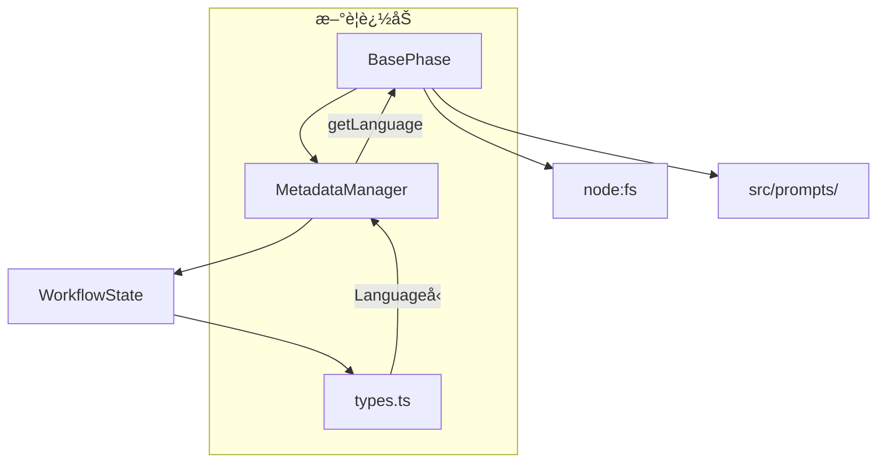

# Codex Agent 実行ログ

開始日時: 2025/12/30 3:15:58

---

## Turn 1: スレッド開始

**Thread ID**: `[REDACTED_TOKEN]`

## Turn 2: ツール実行

**種別**: reasoning
**ステータス**: completed

## Turn 3: ツール実行

**種別**: コãƒãƒ³ãƒ‰å®Ÿè¡Œ
**コãƒãƒ³ãƒ‰**: `/bin/bash -lc pwd`
**ステータス**: completed (exit_code=0)

```text
/tmp/ai-workflow-repos-138-6353c320/ai-workflow-agent
```

## Turn 4: ツール実行

**種別**: reasoning
**ステータス**: completed

## Turn 5: ツール実行

**種別**: コãƒãƒ³ãƒ‰å®Ÿè¡Œ
**コãƒãƒ³ãƒ‰**: `/bin/bash -lc ls`
**ステータス**: completed (exit_code=0)

```text
ARCHITECTURE.md
CHANGELOG.md
CLAUDE.md
[REDACTED_TOKEN].md
[REDACTED_TOKEN].md
CODEBASE_SUMMARY.md
DOCKER_AUTH_SETUP.md
Dockerfile
Jenkinsfile
LICENSE
PROGRESS.md
README.md
ROADMAP.md
SETUP_TYPESCRIPT.md
TROUBLESHOOTING.md
__mocks__
docs
examples
jenkins
jest.config.cjs
metadata.json.template
package-lock.json
package.json
scripts
src
tests
tmp
tsconfig.json
tsconfig.test.json
```

## Turn 6: ツール実行

**種別**: reasoning
**ステータス**: completed

## Turn 7: ツール実行

**種別**: reasoning
**ステータス**: completed

## Turn 8: ツール実行

**種別**: コãƒãƒ³ãƒ‰å®Ÿè¡Œ
**コãƒãƒ³ãƒ‰**: `/bin/bash -lc 'ls .ai-workflow'`
**ステータス**: completed (exit_code=0)

```text
issue-10
issue-102
issue-104
issue-105
issue-108
issue-113
issue-115
issue-119
issue-126
issue-127
issue-128
issue-140
issue-144
issue-150
issue-153
issue-155
issue-16
issue-161
issue-165
issue-174
issue-177
issue-18
issue-184
issue-188
issue-194
issue-2
issue-207
issue-208
issue-211
issue-212
issue-216
issue-22
issue-225
issue-23
issue-238
issue-24
issue-243
issue-248
issue-25
issue-253
issue-259
issue-26
issue-261
issue-271
issue-38
issue-45
issue-46
issue-47
issue-48
issue-49
issue-5
issue-50
issue-51
issue-52
issue-54
issue-571
issue-58
issue-61
issue-64
issue-7
issue-73
issue-74
issue-90
issue-91
```

## Turn 9: ツール実行

**種別**: reasoning
**ステータス**: completed

## Turn 10: ツール実行

**種別**: コãƒãƒ³ãƒ‰å®Ÿè¡Œ
**コãƒãƒ³ãƒ‰**: `/bin/bash -lc 'cat .ai-workflow/issue-571/00_planning/output/planning.md'`
**ステータス**: completed (exit_code=0)

```text
# プロジェクト計画書: Issue #571

## Implement prompt file switching based on language setting

---

## 1. Issue分æ

### 概è¦

Issue #526ã§è¨€èªè¨­å®šã®è§£æ±ºãƒ­ã‚¸ãƒƒã‚¯ã¨ãƒ¡ã‚¿ãƒ‡ãƒ¼ã‚¿æ°¸ç¶šåŒ–ãŒå®Ÿè£…ã•ã‚ŒãŸãŒã€å®Ÿéš›ã®ãƒ—ロンプトファイルã¯æ—¥æœ¬èªå›ºå®šã®ã¾ã¾ã§ã‚る。`metadata.json` ã® `language` 設定ã«å¿œã˜ã¦ãƒ—ロンプトファイルを切り替ãˆã‚‹æ©Ÿèƒ½ã‚’実装ã™ã‚‹ã€‚

### 複雑度: **中程度**

**判定根拠**:
- 複数ファイルã®ä¿®æ­£ãŒå¿…è¦ï¼ˆ`base-phase.ts`ã€`copy-static-assets.mjs`ã€ãƒ—ロンプトファイル構造）
- 既存機能（`loadPrompt()`メソッド）ã®æ‹¡å¼µãŒä¸­å¿ƒ
- プロンプトファイルã®æ§‹é€ å¤‰æ›´ï¼ˆ10フェーズ × 2è¨€èª Ã— 3ç¨®é¡ = 60ファイル）
- æ–°è¦ã‚¢ãƒ¼ã‚­ãƒ†ã‚¯ãƒãƒ£å¤‰æ›´ã§ã¯ãªãã€æ—¢å­˜ãƒ‘ターンã«æ²¿ã£ãŸæ‹¡å¼µ

### 見ç©ã‚‚り工数: **12〜16時間**

**内訳**:
| 作業項目 | 見ç©ã‚‚り時間 |
|---------|------------|
| è¦ä»¶å®šç¾©ãƒ»è¨­è¨ˆ | 2h |
| プロンプトファイル構造変更（日本èªç§»å‹•ï¼‰ | 1h |
| 英èªãƒ—ロンプト翻訳（30ファイル） | 4〜6h |
| `BasePhase.loadPrompt()` 修正 | 1〜2h |
| ビルドスクリプト更新 | 0.5h |
| テストコード実装 | 2〜3h |
| çµ±åˆãƒ†ã‚¹ãƒˆãƒ»å‹•ä½œç¢ºèª | 1h |
| ドキュメント更新 | 0.5h |

### リスク評価: **中**

**ç†ç”±**:
- プロンプトファイルã®ç¿»è¨³å“質ãŒã‚·ã‚¹ãƒ†ãƒ å‹•ä½œã«å½±éŸ¿
- 既存ã®å…¨ãƒ•ã‚§ãƒ¼ã‚ºã«å½±éŸ¿ã™ã‚‹ãŸã‚ã€å›å¸°ãƒ†ã‚¹ãƒˆãŒé‡è¦
- フォールãƒãƒƒã‚¯æ©Ÿæ§‹ãŒæ­£ã—ã動作ã—ãªã„ã¨ã€è¨€èªæœªå¯¾å¿œæ™‚ã«ã‚¨ãƒ©ãƒ¼ãŒç™ºç”Ÿ

---

## 2. 実装戦略判断

### 実装戦略: **EXTEND**

**判断根拠**:
- 既存㮠`BasePhase.loadPrompt()` メソッドを拡張ã—ã¦å¤šè¨€èªå¯¾å¿œã‚’追加
- æ–°è¦ãƒ•ã‚¡ã‚¤ãƒ«ä½œæˆã¯æœ€å°é™ï¼ˆãƒ†ã‚¹ãƒˆãƒ•ã‚¡ã‚¤ãƒ«1ã¤ã€è‹±èªãƒ—ロンプト30ファイル）
- 既存ã®ãƒ—ロンプトロード機構を維æŒã—ã¤ã¤ã€è¨€èªåˆ‡ã‚Šæ›¿ãˆãƒ­ã‚¸ãƒƒã‚¯ã‚’追加
- `copy-static-assets.mjs` ã¯æ—¢å­˜ã®ã‚³ãƒ”ーロジックã§å¯¾å¿œå¯èƒ½ï¼ˆãƒ‡ã‚£ãƒ¬ã‚¯ãƒˆãƒªæ§‹é€ å¤‰æ›´ã®ã¿ï¼‰

**EXTEND ã‚’é¸æŠã—ãŸç†ç”±**:
1. `loadPrompt()` メソッドã¯æ—¢ã«å­˜åœ¨ã—ã€ãƒ‘ス解決ロジックを拡張ã™ã‚‹ã ã‘
2. 環境情報注入や差ã—戻ã—コンテキスト注入ãªã©ã€æ—¢å­˜ã®æ³¨å…¥ãƒ‘ターンをè¸è¥²
3. プロンプトファイルã®ãƒ‡ã‚£ãƒ¬ã‚¯ãƒˆãƒªæ§‹é€ å¤‰æ›´ã¯ã€æ—¢å­˜ãƒ•ã‚¡ã‚¤ãƒ«ã®ç§»å‹•ãŒä¸­å¿ƒ

### テスト戦略: **UNIT_INTEGRATION**

**判断根拠**:
- **ユニットテスト**: `loadPrompt()` メソッドã®å¤šè¨€èªãƒ‘ス解決ロジックã€ãƒ•ã‚©ãƒ¼ãƒ«ãƒãƒƒã‚¯å‹•ä½œ
- **インテグレーションテスト**: 実際ã®ãƒ—ロンプトファイル構造ã§ã®èª­ã¿è¾¼ã¿ç¢ºèªã€ãƒ“ルド後ã®å‹•ä½œç¢ºèª

**UNIT_INTEGRATION ã‚’é¸æŠã—ãŸç†ç”±**:
1. `loadPrompt()` ã®ãƒ­ã‚¸ãƒƒã‚¯å¤‰æ›´ã¯ãƒ¦ãƒ‹ãƒƒãƒˆãƒ†ã‚¹ãƒˆã§æ¤œè¨¼å¯èƒ½
2. プロンプトファイル構造変更ã¯çµ±åˆãƒ†ã‚¹ãƒˆã§å®Ÿéš›ã®ãƒ•ã‚¡ã‚¤ãƒ«ã‚·ã‚¹ãƒ†ãƒ æ“作を検証
3. BDDã¯ä¸è¦ï¼ˆã‚¨ãƒ³ãƒ‰ãƒ¦ãƒ¼ã‚¶ãƒ¼å‘ã‘機能ã§ã¯ãªã内部実装ã®æ‹¡å¼µï¼‰

### テストコード戦略: **CREATE_TEST**

**判断根拠**:
- æ–°è¦ãƒ†ã‚¹ãƒˆãƒ•ã‚¡ã‚¤ãƒ« `tests/integration/[REDACTED_TOKEN].test.ts` を作æˆ
- 既存㮠`base-phase-*.test.ts` ã¨ã¯ç‹¬ç«‹ã—ãŸå¤šè¨€èªåˆ‡ã‚Šæ›¿ãˆãƒ†ã‚¹ãƒˆ
- フォールãƒãƒƒã‚¯å‹•ä½œã®ç¶²ç¾…çš„ãªãƒ†ã‚¹ãƒˆã«ã¯å°‚用ファイルãŒé©åˆ‡

**CREATE_TEST ã‚’é¸æŠã—ãŸç†ç”±**:
1. 多言èªåˆ‡ã‚Šæ›¿ãˆã¯æ–°è¦æ©Ÿèƒ½ã§ã‚ã‚Šã€ç‹¬ç«‹ã—ãŸãƒ†ã‚¹ãƒˆã‚¹ã‚¤ãƒ¼ãƒˆãŒé©åˆ‡
2. 既存テストファイルã¸ã®è¿½åŠ ã§ã¯ã€ãƒ†ã‚¹ãƒˆã®é–¢å¿ƒäº‹ãŒæ··åœ¨ã™ã‚‹
3. Issue本文㧠`tests/integration/[REDACTED_TOKEN].test.ts` ãŒæŒ‡å®šã•ã‚Œã¦ã„ã‚‹

---

## 3. 影響範囲分æ

### 既存コードã¸ã®å½±éŸ¿

| ファイル | 変更内容 | 影響度 |
|---------|---------|-------|
| `src/phases/base-phase.ts` | `loadPrompt()` メソッドã®å¤šè¨€èªå¯¾å¿œ | 高 |
| `scripts/copy-static-assets.mjs` | 多言èªãƒ‡ã‚£ãƒ¬ã‚¯ãƒˆãƒªæ§‹é€ ã®ã‚³ãƒ”ー対応 | ä½ |
| `src/prompts/*/` | ディレクトリ構造変更（`{phase}/{lang}/` å½¢å¼ã¸ï¼‰ | 中 |
| `src/types.ts` | `DEFAULT_LANGUAGE` 定数ã®è¿½åŠ ï¼ˆå¿…è¦ã«å¿œã˜ã¦ï¼‰ | ä½ |

### ä¾å­˜é–¢ä¿‚ã®å¤‰æ›´

- **æ–°è¦ä¾å­˜**: ãªã—
- **既存ä¾å­˜ã®å¤‰æ›´**: ãªã—
- **内部ä¾å­˜**: `MetadataManager.getLanguage()` メソッドã®åˆ©ç”¨ï¼ˆæ—¢ã«å®Ÿè£…済ã¿æƒ³å®šï¼‰

### ãƒã‚¤ã‚°ãƒ¬ãƒ¼ã‚·ãƒ§ãƒ³è¦å¦

- **プロンプトファイル構造**:
  - 既存㮠`src/prompts/{phase}/*.txt` ã‚’ `src/prompts/{phase}/ja/*.txt` ã«ç§»å‹•
  - 英èªç‰ˆãƒ—ロンプト `src/prompts/{phase}/en/*.txt` ã‚’æ–°è¦ä½œæˆ
- **設定ファイル変更**: ãªã—
- **データベーススキーãƒå¤‰æ›´**: ãªã—

### 影響をå—ã‘るフェーズ（全10フェーズ）

1. Planning (00)
2. Requirements (01)
3. Design (02)
4. Test Scenario (03)
5. Implementation (04)
6. Test Implementation (05)
7. Testing (06)
8. Documentation (07)
9. Report (08)
10. Evaluation (09)

---

## 4. タスク分割

### Phase 1: è¦ä»¶å®šç¾© (見ç©ã‚‚ã‚Š: 1〜2h)

- [x] Task 1-1: 機能è¦ä»¶ã®æ˜ç¢ºåŒ– (1h)
  - 多言èªãƒ—ロンプト切り替ãˆã®ä»•æ§˜å®šç¾©
  - フォールãƒãƒƒã‚¯å‹•ä½œã®ä»•æ§˜å®šç¾©
  - 対象言èªï¼ˆja, en）ã®ç¢ºå®š

- [x] Task 1-2: å—ã‘入れ基準ã®å®šç¾© (0.5h)
  - `language: 'ja'` 設定時ã«æ—¥æœ¬èªãƒ—ロンプトãŒèª­ã¿è¾¼ã¾ã‚Œã‚‹
  - `language: 'en'` 設定時ã«è‹±èªãƒ—ロンプトãŒèª­ã¿è¾¼ã¾ã‚Œã‚‹
  - 指定言èªã®ãƒ—ロンプトãŒå­˜åœ¨ã—ãªã„å ´åˆã€æ—¥æœ¬èªã«ãƒ•ã‚©ãƒ¼ãƒ«ãƒãƒƒã‚¯
  - ビルド後も多言èªãƒ‡ã‚£ãƒ¬ã‚¯ãƒˆãƒªæ§‹é€ ãŒç¶­æŒã•ã‚Œã‚‹

### Phase 2: 設計 (見ç©ã‚‚ã‚Š: 1〜2h)

- [x] Task 2-1: `loadPrompt()` メソッドã®è¨­è¨ˆ (1h)
  - 言èªãƒ‘ラメータå–得方法ã®è¨­è¨ˆ
  - パス解決ロジックã®è¨­è¨ˆ
  - フォールãƒãƒƒã‚¯æ©Ÿæ§‹ã®è¨­è¨ˆ

- [x] Task 2-2: ディレクトリ構造ã®è¨­è¨ˆ (0.5h)
  - `src/prompts/{phase}/{lang}/*.txt` 構造ã®ç¢ºå®š
  - ビルド後㮠`dist/prompts/` 構造ã®ç¢ºå®š

### Phase 3: テストシナリオ (見ç©ã‚‚ã‚Š: 1〜2h)

- [x] Task 3-1: ãƒ¦ãƒ‹ãƒƒãƒˆãƒ†ã‚¹ãƒˆã‚·ãƒŠãƒªã‚ªä½œæˆ (1h)
  - `loadPrompt()` 日本èªèª­ã¿è¾¼ã¿ãƒ†ã‚¹ãƒˆ
  - `loadPrompt()` 英èªèª­ã¿è¾¼ã¿ãƒ†ã‚¹ãƒˆ
  - フォールãƒãƒƒã‚¯ãƒ†ã‚¹ãƒˆï¼ˆè¨€èªæœªå¯¾å¿œæ™‚）
  - エラーテスト（プロンプトファイル欠è½æ™‚）

- [x] Task 3-2: çµ±åˆãƒ†ã‚¹ãƒˆã‚·ãƒŠãƒªã‚ªä½œæˆ (0.5h)
  - å…¨10フェーズã®å¤šè¨€èªåˆ‡ã‚Šæ›¿ãˆç¢ºèª
  - ビルド後ã®ãƒ—ロンプト読ã¿è¾¼ã¿ç¢ºèª

### Phase 4: 実装 (見ç©ã‚‚ã‚Š: 6〜8h)

- [ ] Task 4-1: プロンプトファイル構造ã®å¤‰æ›´ (1h)
  - 既存日本èªãƒ—ロンプトを `{phase}/ja/` ã«ç§»å‹•
  - ディレクトリ作æˆã‚¹ã‚¯ãƒªãƒ—トã®å®Ÿè¡Œ

- [ ] Task 4-2: 英èªãƒ—ロンプトã®ç¿»è¨³ãƒ»ä½œæˆ (4〜6h)
  - 10フェーズ × 3種é¡ï¼ˆexecute, review, revise）= 30ファイル
  - LLMを使用ã—ãŸç¿»è¨³ã®å®Ÿæ–½
  - 翻訳å“質ã®ç¢ºèª

- [ ] Task 4-3: `BasePhase.loadPrompt()` ã®å¤šè¨€èªå¯¾å¿œå®Ÿè£… (1〜2h)
  - `MetadataManager.getLanguage()` ã®å‘¼ã³å‡ºã—追加
  - パス解決ロジックã®å¤‰æ›´ï¼ˆè¨€èªãƒ‡ã‚£ãƒ¬ã‚¯ãƒˆãƒªã‚’å«ã‚る）
  - フォールãƒãƒƒã‚¯æ©Ÿæ§‹ã®å®Ÿè£…
  - ログ出力ã®è¿½åŠ 

- [ ] Task 4-4: `DEFAULT_LANGUAGE` 定数ã®è¿½åŠ  (0.5h)
... (truncated)
```

## Turn 11: ツール実行

**種別**: reasoning
**ステータス**: completed

## Turn 12: ツール実行

**種別**: コãƒãƒ³ãƒ‰å®Ÿè¡Œ
**コãƒãƒ³ãƒ‰**: `/bin/bash -lc 'cat .ai-workflow/issue-571/04_implementation/output/implementation.md'`
**ステータス**: completed (exit_code=0)

```text
# 実装完了レãƒãƒ¼ãƒˆ

## 変更ファイル一覧

| ファイル | 変更種別 | æ¦‚è¦ |
|---------|---------|------|
| `src/types.ts` | 修正 | プロンプト言èªç”¨ã®`Language`å‹ã¨`DEFAULT_LANGUAGE`を追加ã—メタデータå‹ã«è¨€èªã‚’許容 |
| `src/core/metadata-manager.ts` | 修正 | 言èªè¨­å®šã‚’å–å¾—ã™ã‚‹`getLanguage()`を実装ã—デフォルトフォールãƒãƒƒã‚¯ã‚’追加 |
| `src/phases/base-phase.ts` | 修正 | `loadPrompt`を言èªå¯¾å¿œã•ã›ä¸è¶³æ™‚ã«ãƒ‡ãƒ•ã‚©ãƒ«ãƒˆã¸ãƒ•ã‚©ãƒ¼ãƒ«ãƒãƒƒã‚¯ã™ã‚‹ã‚ˆã†æ›´æ–° |
| `src/prompts/*/ja/*.txt` | 移動 | å„フェーズã®æ—¢å­˜ãƒ—ロンプトを言èªãƒ‡ã‚£ãƒ¬ã‚¯ãƒˆãƒªé…下ã«å†é…ç½® |
| `src/prompts/*/en/*.txt` | æ–°è¦ | 10フェーズ分ã®è‹±èªãƒ—ロンプトを追加 |

## 主è¦ãªå¤‰æ›´ç‚¹
- プロンプトディレクトリを`{phase}/{lang}/`構造ã«æ•´ç†ã—日本èªãƒ•ã‚¡ã‚¤ãƒ«ã‚’`ja/`ã¸ç§»å‹•ã€è‹±èªç‰ˆã‚’追加。
- `Language`å‹ã¨`DEFAULT_LANGUAGE`を定義ã—ã€ãƒ¡ã‚¿ãƒ‡ãƒ¼ã‚¿ã‹ã‚‰ã®è¨€èªå–å¾—ã«ãƒ•ã‚©ãƒ¼ãƒ«ãƒãƒƒã‚¯å‡¦ç†ã‚’追加。
- `BasePhase.loadPrompt`ãŒè¨€èªè¨­å®šã«å¿œã˜ã¦ãƒ—ロンプトを読ã¿è¾¼ã¿ã€æŒ‡å®šè¨€èªãŒç„¡ã„å ´åˆã¯æ—¥æœ¬èªã¸è­¦å‘Šä»˜ãã§ãƒ•ã‚©ãƒ¼ãƒ«ãƒãƒƒã‚¯ã™ã‚‹ã‚ˆã†ã«å¤‰æ›´ã€‚

## テスト実施状æ³
- ビルド: 未実行（ä¾é ¼ãªã—）
- リント: 未実行（ä¾é ¼ãªã—）
- 基本動作確èª: プロンプト構造ã¨èª­ã¿è¾¼ã¿ãƒ­ã‚¸ãƒƒã‚¯ã®å¤‰æ›´ã®ã¿ã®ãŸã‚手動テストã¯æœªå®Ÿæ–½
```

## Turn 13: ツール実行

**種別**: reasoning
**ステータス**: completed

## Turn 14: ツール実行

**種別**: コãƒãƒ³ãƒ‰å®Ÿè¡Œ
**コãƒãƒ³ãƒ‰**: `/bin/bash -lc "sed -n '1,200p' src/types.ts"`
**ステータス**: completed (exit_code=0)

```text
export type PhaseName =
  | 'planning'
  | 'requirements'
  | 'design'
  | 'test_scenario'
  | 'implementation'
  | 'test_implementation'
  | 'testing'
  | 'documentation'
  | 'report'
  | 'evaluation';

export type PhaseStatus = 'pending' | 'in_progress' | 'completed' | 'failed';

// Issue #10: ステップåã®å‹å®šç¾©
export type StepName = 'execute' | 'review' | 'revise';

export type DifficultyLevel = 'simple' | 'moderate' | 'complex';

/**
 * Supported language codes for prompts (Issue #571)
 */
export type Language = 'ja' | 'en';

/**
 * Default language used when no valid preference is set
 */
export const DEFAULT_LANGUAGE: Language = 'ja';

export interface [REDACTED_TOKEN] {
  level: DifficultyLevel;
  confidence: number;
  factors: {
    estimated_file_changes: number;
    scope: 'single_file' | 'single_module' | 'multiple_modules' | 'cross_cutting';
    requires_tests: boolean;
    requires_architecture_change: boolean;
    complexity_score: number;
  };
  analyzed_at: string;
  analyzer_agent: 'claude' | 'codex';
  analyzer_model: string;
}

export interface StepModelConfig {
  claudeModel: 'opus' | 'sonnet';
  codexModel: 'max' | 'mini';
}

export interface PhaseModelConfig {
  execute: StepModelConfig;
  review: StepModelConfig;
  revise: StepModelConfig;
}

export type ModelConfigByPhase = {
  [phase in PhaseName]?: PhaseModelConfig;
};

export interface PhaseMetadata {
  status: PhaseStatus;
  retry_count: number;
  started_at: string | null;
  completed_at: string | null;
  review_result: string | null;
  output_files?: string[];
  // Issue #10: ステップå˜ä½ã®é€²æ—管ç†
  current_step?: StepName | null;  // ç¾åœ¨å®Ÿè¡Œä¸­ã®ã‚¹ãƒ†ãƒƒãƒ—（実行中ã§ãªã„å ´åˆã¯null）
  completed_steps?: StepName[];     // 完了済ã¿ã‚¹ãƒ†ãƒƒãƒ—ã®é…列（実行順åºã‚’ä¿æŒï¼‰
  // Issue #90: å·®ã—戻ã—コンテキスト（オプショナル）
  rollback_context?: import('./types/commands.js').RollbackContext | null;
}

/**
 * フォローアップ Issue ã®èƒŒæ™¯ã‚³ãƒ³ãƒ†ã‚­ã‚¹ãƒˆ
 * Evaluation Phase ã‹ã‚‰ IssueClient ã«æ¸¡ã•ã‚Œã‚‹
 */
export interface IssueContext {
  /**
   * å…ƒ Issue ã®æ¦‚è¦
   * 例: "Issue #91 ã§ã¯ã€BasePhase モジュール分解（Issue #49）ã§ç™ºç”Ÿã—㟠15 件ã®ãƒ†ã‚¹ãƒˆå¤±æ•—を修正ã—ã¾ã—ãŸã€‚"
   */
  summary: string;

  /**
   * ブロッカーã®ã‚¹ãƒ†ãƒ¼ã‚¿ã‚¹
   * 例: "ã™ã¹ã¦ã®ãƒ–ロッカーã¯è§£æ±ºæ¸ˆã¿"
   */
  blockerStatus: string;

  /**
   * タスクãŒæ®‹ã£ãŸç†ç”±
   * 例: "テスト失敗修正を優先ã—ãŸãŸã‚ã€ã‚«ãƒãƒ¬ãƒƒã‚¸æ”¹å–„ã¯å¾Œå›ã—ã«ã—ãŸ"
   */
  deferredReason: string;
}

/**
 * Evaluation Phase ã§æ¤œå‡ºã•ã‚ŒãŸæ®‹ã‚¿ã‚¹ã‚¯
 */
export interface RemainingTask {
  // ===== 既存フィールド（必須） =====
  /** タスクã®èª¬æ˜ */
  task: string;

  /** 対象フェーズ（例: "implementation", "testing"） */
  phase: string;

  /** 優先度（例: "High", "Medium", "Low"） */
  priority: string;

  // ===== æ–°è¦ãƒ•ã‚£ãƒ¼ãƒ«ãƒ‰ï¼ˆã™ã¹ã¦ã‚ªãƒ—ショナル） =====

  /**
   * 優先度ã®ç†ç”±
   * 例: "å…ƒ Issue #91 ã®æ¨å¥¨äº‹é …ã€ãƒ–ロッカーã§ã¯ãªã„"
   */
  priorityReason?: string;

  /**
   * 対象ファイル/モジュールã®ãƒªã‚¹ãƒˆ
   * 例: ["src/core/phase-factory.ts", "src/commands/execute/agent-setup.ts"]
   */
  targetFiles?: string[];

  /**
   * 実行手順（番å·ä»˜ãリスト）
   * 例: ["ä¸è¶³ã—ã¦ã„るテストケースを特定", "エッジケースã®ãƒ†ã‚¹ãƒˆã‚’追加"]
   */
  steps?: string[];

  /**
   * å—ã‘入れ基準（Acceptance Criteria）
   * 例: ["ã™ã¹ã¦ã®å¯¾è±¡ãƒ¢ã‚¸ãƒ¥ãƒ¼ãƒ«ã§ 90% 以上ã®ã‚«ãƒãƒ¬ãƒƒã‚¸ã‚’é”æˆ", "npm run test:coverage ãŒã™ã¹ã¦ãƒ‘ス"]
   */
  acceptanceCriteria?: string[];

  /**
   * ä¾å­˜ã‚¿ã‚¹ã‚¯
   * 例: ["Task 1 完了後ã«å®Ÿè¡Œ", "Phase 4 ã®ä¿®æ­£ãŒå¿…è¦"]
   */
  dependencies?: string[];

  /**
   * 見ç©ã‚‚り工数
   * 例: "2-4h", "1日", "0.5h"
   */
  estimatedHours?: string;
}

export interface [REDACTED_TOKEN] {
  enabled: boolean;
  provider: 'auto' | 'openai' | 'claude' | 'agent';
  model?: string;
  temperature?: number;
  maxOutputTokens?: number;
  timeoutMs?: number;
  maxRetries?: number;
  maxTasks?: number;
  appendMetadata?: boolean;
}

export interface [REDACTED_TOKEN] {
  title: string;
  body: string;
  metadata: {
    provider: 'openai' | 'claude';
    model: string;
    durationMs: number;
    retryCount: number;
    inputTokens?: number;
    outputTokens?: number;
    omittedTasks?: number;
  };
}

export interface [REDACTED_TOKEN] extends PhaseMetadata {
  decision: string | null;
  failed_phase: PhaseName | null;
  remaining_tasks: RemainingTask[];
  created_issue_url: string | null;
  abort_reason: string | null;
}

export type P
... (truncated)
```

## Turn 15: ツール実行

**種別**: reasoning
**ステータス**: completed

## Turn 16: ツール実行

**種別**: コãƒãƒ³ãƒ‰å®Ÿè¡Œ
**コãƒãƒ³ãƒ‰**: `/bin/bash -lc "sed -n '1,200p' src/core/metadata-manager.ts"`
**ステータス**: completed (exit_code=0)

```text
import fs from 'fs-extra';
import { logger } from '../utils/logger.js';
import { dirname, join } from 'node:path';
import { WorkflowState } from './workflow-state.js';
import {
  PhaseName,
  PhaseStatus,
  StepName,
  WorkflowMetadata,
  RemainingTask,
  PhaseMetadata,
  [REDACTED_TOKEN],
  [REDACTED_TOKEN],
  ModelConfigByPhase,
  Language,
  DEFAULT_LANGUAGE,
} from '../types.js';
import { [REDACTED_TOKEN], backupMetadataFile, [REDACTED_TOKEN] } from './helpers/metadata-io.js';

/**
 * フェーズã®é †åºã‚’定義
 * Object.keys() ã®é †åºã¯ä¿è¨¼ã•ã‚Œãªã„ãŸã‚ã€æ˜ç¤ºçš„ãªé…列ã§é †åºã‚’管ç†
 */
const PHASE_ORDER: PhaseName[] = [
  'planning',
  'requirements',
  'design',
  'test_scenario',
  'implementation',
  'test_implementation',
  'testing',
  'documentation',
  'report',
  'evaluation',
];

export class MetadataManager {
  public readonly metadataPath: string;
  public readonly workflowDir: string;
  private readonly state: WorkflowState;

  constructor(metadataPath: string) {
    this.metadataPath = metadataPath;
    this.workflowDir = dirname(metadataPath);
    this.state = WorkflowState.load(metadataPath);
  }

  private ensurePhaseData(
    phaseName: PhaseName,
  ): PhaseMetadata | [REDACTED_TOKEN] {
    let phaseData = this.state.data.phases[phaseName];
    if (phaseData) {
      return phaseData;
    }

    const migrated = this.state.migrate();
    phaseData = this.state.data.phases[phaseName];
    if (phaseData) {
      return phaseData;
    }

    logger.warn(`Phase ${phaseName} missing from metadata. Initializing default entry.`);
    if (phaseName === 'evaluation') {
      const evaluationData = this.[REDACTED_TOKEN]();
      this.state.data.phases.evaluation = evaluationData;
      return evaluationData;
    }

    const defaultData = this.[REDACTED_TOKEN]();
    this.state.data.phases[phaseName] = defaultData;
    return defaultData;
  }

  private [REDACTED_TOKEN](): PhaseMetadata {
    return {
      status: 'pending',
      retry_count: 0,
      started_at: null,
      completed_at: null,
      review_result: null,
      output_files: [],
      current_step: null,
      completed_steps: [],
      rollback_context: null,
    };
  }

  private [REDACTED_TOKEN](): [REDACTED_TOKEN] {
    const base = this.[REDACTED_TOKEN]();
    return {
      ...base,
      decision: null,
      failed_phase: null,
      remaining_tasks: [],
      created_issue_url: null,
      abort_reason: null,
    };
  }

  public get data(): WorkflowMetadata {
    return this.state.data;
  }

  public save(): void {
    this.state.save();
  }

  public updatePhaseStatus(
    phaseName: PhaseName,
    status: PhaseStatus,
    options: {
      outputFile?: string;
      reviewResult?: string;
    } = {},
  ): void {
    const phaseData = this.ensurePhaseData(phaseName);
    const currentStatus = phaseData.status;

    // Issue #248: 冪等性ãƒã‚§ãƒƒã‚¯ï¼ˆåŒã˜ã‚¹ãƒ†ãƒ¼ã‚¿ã‚¹ã¸ã®é‡è¤‡æ›´æ–°ã‚’スキップ）
    if (currentStatus === status) {
      logger.info(`Phase ${phaseName}: Status already set to '${status}', skipping update`);
      return;
    }

    // Issue #248: ステータスé·ç§»ãƒãƒªãƒ‡ãƒ¼ã‚·ãƒ§ãƒ³ï¼ˆä¸æ­£ãªé·ç§»ã‚’検出）
    this.[REDACTED_TOKEN](phaseName, currentStatus, status);

    // 既存ã®ã‚¹ãƒ†ãƒ¼ã‚¿ã‚¹æ›´æ–°å‡¦ç†
    this.state.updatePhaseStatus(phaseName, status);

    if (options.outputFile) {
      if (!phaseData.output_files) {
        phaseData.output_files = [];
      }
      phaseData.output_files.push(options.outputFile);
    }

    if (options.reviewResult) {
      phaseData.review_result = options.reviewResult;
    }

    this.state.save();

    logger.debug(`Phase ${phaseName}: Status updated from '${currentStatus}' to '${status}'`);
  }

  /**
   * Issue #248: ステータスé·ç§»ã®ãƒãƒªãƒ‡ãƒ¼ã‚·ãƒ§ãƒ³
   *
   * ä¸æ­£ãªã‚¹ãƒ†ãƒ¼ã‚¿ã‚¹é·ç§»ã‚’検出ã—ã¦ãƒ­ã‚°å‡ºåŠ›ã™ã‚‹ã€‚
   * ä¸æ­£ãªé·ç§»ã§ã‚‚ステータス更新ã¯å®Ÿè¡Œã•ã‚Œã‚‹ï¼ˆã‚¨ãƒ©ãƒ¼ã«ã¯ã—ãªã„）。
   *
   * 許å¯ã•ã‚Œã‚‹é·ç§»:
   * - pending → in_progress
   * - in_progress → completed
   * - in_progress → failed
   *
   * ä¸æ­£ãªé·ç§»ã®ä¾‹:
   * - completed → in_progress
   * - failed → in_progress
   * - p
... (truncated)
```

## Turn 17: ツール実行

**種別**: reasoning
**ステータス**: completed

## Turn 18: ツール実行

**種別**: コãƒãƒ³ãƒ‰å®Ÿè¡Œ
**コãƒãƒ³ãƒ‰**: `/bin/bash -lc 'rg -n "getLanguage" -n src/core/metadata-manager.ts'`
**ステータス**: failed (exit_code=127)

```text
/bin/bash: line 1: rg: command not found
```

## Turn 19: ツール実行

**種別**: reasoning
**ステータス**: completed

## Turn 20: ツール実行

**種別**: コãƒãƒ³ãƒ‰å®Ÿè¡Œ
**コãƒãƒ³ãƒ‰**: `/bin/bash -lc 'grep -n "getLanguage" -n src/core/metadata-manager.ts'`
**ステータス**: completed (exit_code=0)

```text
220:  public getLanguage(): Language {
```

## Turn 21: ツール実行

**種別**: reasoning
**ステータス**: completed

## Turn 22: ツール実行

**種別**: コãƒãƒ³ãƒ‰å®Ÿè¡Œ
**コãƒãƒ³ãƒ‰**: `/bin/bash -lc "sed -n '200,340p' src/core/metadata-manager.ts"`
**ステータス**: completed (exit_code=0)

```text
this.state.data.difficulty_analysis = result;
    this.state.save();
  }

  public [REDACTED_TOKEN](): [REDACTED_TOKEN] | null {
    return this.state.data.difficulty_analysis ?? null;
  }

  public setModelConfig(config: ModelConfigByPhase | null): void {
    this.state.data.model_config = config;
    this.state.save();
  }

  public getModelConfig(): ModelConfigByPhase | null {
    return this.state.data.model_config ?? null;
  }

  /**
   * Get preferred language for prompt loading (Issue #571)
   */
  public getLanguage(): Language {
    const metadataLanguage = (this.state.data as WorkflowMetadata & { language?: string }).language;
    if (metadataLanguage === 'ja' || metadataLanguage === 'en') {
      return metadataLanguage;
    }

    return DEFAULT_LANGUAGE;
  }

  public getPhaseStatus(phaseName: PhaseName): PhaseStatus {
    return this.state.getPhaseStatus(phaseName);
  }

  public setDesignDecision(key: string, value: string): void {
    this.state.setDesignDecision(key, value);
    this.state.save();
  }

  public incrementRetryCount(phaseName: PhaseName): number {
    const count = this.state.incrementRetryCount(phaseName);
    this.state.save();
    return count;
  }

  public clear(): void {
    if (fs.existsSync(this.metadataPath)) {
      logger.info(`Clearing metadata: ${this.metadataPath}`);
      fs.rmSync(this.metadataPath, { force: true });
    }

    [REDACTED_TOKEN](this.workflowDir);
    if (!fs.existsSync(this.workflowDir)) {
      logger.info('Workflow directory removed successfully');
    }
  }

  public rollbackToPhase(phaseName: PhaseName) {
    const phases = Object.keys(this.state.data.phases) as PhaseName[];
    if (!phases.includes(phaseName)) {
      return {
        success: false,
        error: `Invalid phase name: ${phaseName}`,
        backup_path: null,
        rolled_back_phases: [] as PhaseName[],
      };
    }

    const backupPath = backupMetadataFile(this.metadataPath);

    const startIndex = phases.indexOf(phaseName);
    const rolledBack = phases.slice(startIndex);

    for (const phase of rolledBack) {
      const phaseData = this.ensurePhaseData(phase);
      phaseData.status = 'pending';
      phaseData.started_at = null;
      phaseData.completed_at = null;
      phaseData.review_result = null;
      phaseData.retry_count = 0;
      // Issue #208: completed_steps 㨠current_step ã®ãƒªã‚»ãƒƒãƒˆè¿½åŠ 
      phaseData.current_step = null;
      phaseData.completed_steps = [];
      phaseData.rollback_context = null; // Issue #208: consistency確ä¿
    }

    this.state.save();

    logger.info(`metadata.json rolled back to phase ${phaseName}`);
    logger.info(`Phases reset: ${rolledBack.join(', ')}`);

    return {
      success: true,
      backup_path: backupPath,
      rolled_back_phases: rolledBack,
      error: null,
    };
  }

  public getAllPhasesStatus(): Record<PhaseName, PhaseStatus> {
    const result = {} as Record<PhaseName, PhaseStatus>;
    for (const [phase, data] of Object.entries(this.state.data.phases)) {
      result[phase as PhaseName] = data.status;
    }
    return result;
  }

  public backupMetadata(): string {
    return backupMetadataFile(this.metadataPath);
  }

  public [REDACTED_TOKEN](options: {
    decision: string;
    failedPhase?: PhaseName | null;
    remainingTasks?: RemainingTask[] | null;
    createdIssueUrl?: string | null;
    abortReason?: string | null;
  }): void {
    const evaluation = this.ensurePhaseData('evaluation') as [REDACTED_TOKEN];
    if (!evaluation) {
      throw new Error('Evaluation phase not found in metadata');
    }

    evaluation.decision = options.decision;

    if (options.failedPhase !== undefined) {
      evaluation.failed_phase = options.failedPhase ?? null;
    }

    if (options.remainingTasks !== undefined) {
      evaluation.remaining_tasks = options.remainingTasks ?? [];
    }

    if (options.createdIssueUrl !== undefined) {
      evaluation.created_issue_url = options.createdIssueUr
... (truncated)
```

## Turn 23: ツール実行

**種別**: reasoning
**ステータス**: completed

## Turn 24: ツール実行

**種別**: コãƒãƒ³ãƒ‰å®Ÿè¡Œ
**コãƒãƒ³ãƒ‰**: `/bin/bash -lc "sed -n '1,200p' src/phases/base-phase.ts"`
**ステータス**: completed (exit_code=0)

```text
import * as fs from 'node:fs';
import { logger } from '../utils/logger.js';
import path from 'node:path';
import { fileURLToPath } from 'node:url';
import { MetadataManager } from '../core/metadata-manager.js';
import { ClaudeAgentClient } from '../core/claude-agent-client.js';
import { CodexAgentClient } from '../core/codex-agent-client.js';
import { GitHubClient } from '../core/github-client.js';
import { ContentParser } from '../core/content-parser.js';
import { config } from '../core/config.js';
import {
  [REDACTED_TOKEN],
  PhaseName,
  PhaseStatus,
  PhaseMetadata,
  StepName,
  DEFAULT_LANGUAGE,
  type [REDACTED_TOKEN],
  type WorkflowMetadata,
} from '../types.js';
import { LogFormatter } from './formatters/log-formatter.js';
import { ProgressFormatter } from './formatters/progress-formatter.js';
import { AgentExecutor } from './core/agent-executor.js';
import { ReviewCycleManager } from './core/review-cycle-manager.js';
import { ContextBuilder } from './context/context-builder.js';
import { ArtifactCleaner } from './cleanup/artifact-cleaner.js';
import { StepExecutor } from './lifecycle/step-executor.js';
import { PhaseRunner } from './lifecycle/phase-runner.js';
import { getErrorMessage } from '../utils/error-utils.js';
import { [REDACTED_TOKEN] } from '../commands/execute/agent-setup.js';
import { ModelOptimizer, ModelOverrides } from '../core/model-optimizer.js';

// PhaseRunOptions ã‚’ BasePhase ã‹ã‚‰ export（Issue #49）
export interface PhaseRunOptions {
  gitManager?: import('../core/git-manager.js').GitManager | null;
  skipReview?: boolean;
  cleanupOnComplete?: boolean;  // Issue #2: Cleanup workflow artifacts after evaluation phase
  [REDACTED_TOKEN]?: boolean;  // Issue #2: Skip confirmation prompt for cleanup
}

const moduleDir = path.dirname(fileURLToPath(import.meta.url));
const promptsRoot = path.resolve(moduleDir, '..', 'prompts');
const MAX_RETRIES = 3;

export type [REDACTED_TOKEN] = {
  phaseName: PhaseName;
  workingDir: string;
  metadataManager: MetadataManager;
  codexClient?: CodexAgentClient | null;
  claudeClient?: ClaudeAgentClient | null;
  githubClient: GitHubClient;
  skipDependencyCheck?: boolean;
  ignoreDependencies?: boolean;
  presetPhases?: PhaseName[]; // プリセット実行時ã®ãƒ•ã‚§ãƒ¼ã‚ºãƒªã‚¹ãƒˆï¼ˆIssue #396）
  [REDACTED_TOKEN]?: [REDACTED_TOKEN]; // Issue #119: Optional for backward compatibility
  modelOptimizer?: ModelOptimizer | null;
  modelOverrides?: ModelOverrides;
};

export type [REDACTED_TOKEN] = Omit<[REDACTED_TOKEN], 'phaseName'>;

export abstract class BasePhase {
  protected readonly phaseName: PhaseName;
  protected readonly workingDir: string;
  protected readonly metadata: MetadataManager;
  protected codex: CodexAgentClient | null;
  protected claude: ClaudeAgentClient | null;
  protected readonly github: GitHubClient;
  protected readonly skipDependencyCheck: boolean;
  protected readonly ignoreDependencies: boolean;
  protected readonly presetPhases: PhaseName[] | undefined; // プリセット実行時ã®ãƒ•ã‚§ãƒ¼ã‚ºãƒªã‚¹ãƒˆï¼ˆIssue #396）
  protected readonly contentParser: ContentParser;
  protected readonly issueGenerationOptions: [REDACTED_TOKEN];
  protected readonly modelOptimizer: ModelOptimizer | null;
  protected readonly modelOverrides: ModelOverrides | undefined;

  protected readonly phaseDir: string;
  protected readonly outputDir: string;
  protected readonly executeDir: string;
  protected readonly reviewDir: string;
  protected readonly reviseDir: string;

  // æ–°è¦ãƒ¢ã‚¸ãƒ¥ãƒ¼ãƒ« (Issue #23)
  private readonly logFormatter: LogFormatter;
  private readonly progressFormatter: ProgressFormatter;
  private agentExecutor: AgentExecutor | null = null;
  private readonly reviewCycleManager: ReviewCycleManager;

  // æ–°è¦ãƒ¢ã‚¸ãƒ¥ãƒ¼ãƒ« (Issue #49)
  private readonly contextBuilder: ContextBuilder;
  private readonly artifactCleaner: ArtifactCleaner;
  private stepExecutor: StepExecutor | null = null;
  private phaseRunner: PhaseRunner | null = null;

  private getActiveAge
... (truncated)
```

## Turn 25: ツール実行

**種別**: reasoning
**ステータス**: completed

## Turn 26: ツール実行

**種別**: コãƒãƒ³ãƒ‰å®Ÿè¡Œ
**コãƒãƒ³ãƒ‰**: `/bin/bash -lc 'rg -n "loadPrompt" src/phases/base-phase.ts'`
**ステータス**: failed (exit_code=127)

```text
/bin/bash: line 1: rg: command not found
```

## Turn 27: ツール実行

**種別**: reasoning
**ステータス**: completed

## Turn 28: ツール実行

**種別**: コãƒãƒ³ãƒ‰å®Ÿè¡Œ
**コãƒãƒ³ãƒ‰**: `/bin/bash -lc 'grep -n "loadPrompt" -n src/phases/base-phase.ts'`
**ステータス**: completed (exit_code=0)

```text
292:  protected loadPrompt(promptType: 'execute' | 'review' | 'revise'): string {
470:    let prompt = this.loadPrompt('execute');
```

## Turn 29: ツール実行

**種別**: reasoning
**ステータス**: completed

## Turn 30: ツール実行

**種別**: コãƒãƒ³ãƒ‰å®Ÿè¡Œ
**コãƒãƒ³ãƒ‰**: `/bin/bash -lc "sed -n '260,360p' src/phases/base-phase.ts"`
**ステータス**: completed (exit_code=0)

```text
this.phaseName,
        this.metadata,
        this.reviewCycleManager,
        async () => this.runWithStepModel('execute', () => this.execute()),
        async () => this.runWithStepModel('review', () => this.review()),
        async () => this.shouldRunReview()
      );
    }

    if (!this.phaseRunner) {
      const reviseHandler = this.getReviseFunction();
      const wrappedRevise =
        reviseHandler !== null
          ? (feedback: string) => this.runWithStepModel('revise', () => reviseHandler(feedback))
          : null;

      this.phaseRunner = new PhaseRunner(
        this.phaseName,
        this.metadata,
        this.github,
        this.stepExecutor,
        this.skipDependencyCheck,
        this.ignoreDependencies,
        this.presetPhases,
        wrappedRevise
      );
    }

    // PhaseRunner ã«å§”譲（Issue #49）
    return this.phaseRunner.run(options);
  }

  protected loadPrompt(promptType: 'execute' | 'review' | 'revise'): string {
    const language = this.metadata.getLanguage();
    const promptPath = path.join(promptsRoot, this.phaseName, language, `${promptType}.txt`);
    let resolvedPath = promptPath;

    if (!fs.existsSync(promptPath)) {
      const fallbackPath = path.join(promptsRoot, this.phaseName, DEFAULT_LANGUAGE, `${promptType}.txt`);

      if (!fs.existsSync(fallbackPath)) {
        throw new Error(`Prompt file not found: ${promptPath} (fallback also failed: ${fallbackPath})`);
      }

      logger.warn(
        `Prompt not found for language '${language}', falling back to '${DEFAULT_LANGUAGE}': ${promptPath}`
      );
      resolvedPath = fallbackPath;
    }

    let prompt = fs.readFileSync(resolvedPath, 'utf-8');

    // Issue #177: 環境情報ã®æ³¨å…¥ï¼ˆexecute ステップã®ã¿ã€ãƒ‘ッケージインストールå¯èƒ½æ™‚）
    if (promptType === 'execute' && config.[REDACTED_TOKEN]()) {
      const environmentInfo = this.[REDACTED_TOKEN]();
      prompt = environmentInfo + '\n\n' + prompt;

      logger.info(`Environment info injected into execute prompt for phase ${this.phaseName}`);
    }

    // Issue #90: å·®ã—戻ã—コンテキストãŒã‚ã‚‹å ´åˆã€ãƒ—ロンプトã®å…ˆé ­ã«è¿½åŠ 
    // revise ステップã®ã¿ã«å·®ã—戻ã—情報を注入
    if (promptType === 'revise') {
      const rollbackContext = this.metadata.getRollbackContext(this.phaseName);
      if (rollbackContext) {
        const rollbackSection = this.[REDACTED_TOKEN](rollbackContext);
        prompt = rollbackSection + '\n\n' + prompt;

        logger.info(`Rollback context injected into revise prompt for phase ${this.phaseName}`);
      }
    }

    return prompt;
  }

  /**
   * Issue #177: 環境情報セクションã®Markdownを生æˆ
   * @returns 環境情報セクションã®Markdown文字列
   * @private
   */
  private [REDACTED_TOKEN](): string {
    return `## ğŸ› ï¸ é–‹ç™ºç’°å¢ƒæƒ…å ±

ã“ã®Docker環境ã§ã¯ã€ä»¥ä¸‹ã®ãƒ—ログラミング言èªã‚’インストールå¯èƒ½ã§ã™ï¼š

- **Python**: \`apt-get update && apt-get install -y python3 python3-pip\`
- **Go**: \`apt-get update && apt-get install -y golang-go\`
- **Java**: \`apt-get update && apt-get install -y default-jdk\`
- **Rust**: \`curl --proto '=https' --tlsv1.2 -sSf https://sh.rustup.rs | sh -s -- -y\`
- **Ruby**: \`apt-get update && apt-get install -y ruby ruby-dev\`

テスト実行やå“質ãƒã‚§ãƒƒã‚¯ã«å¿…è¦ãªè¨€èªç’°å¢ƒã¯ã€è‡ªç”±ã«ã‚¤ãƒ³ã‚¹ãƒˆãƒ¼ãƒ«ã—ã¦ãã ã•ã„。`;
  }

  /**
   * Issue #90: å·®ã—戻ã—情報をMarkdownå½¢å¼ã§ç”Ÿæˆ
   * @param context - å·®ã—戻ã—コンテキスト
   * @returns Markdownå½¢å¼ã®å·®ã—戻ã—情報
   */
  protected [REDACTED_TOKEN](
    context: import('../types/commands.js').RollbackContext,
```

## Turn 31: ツール実行

**種別**: reasoning
**ステータス**: completed

## Turn 32: ツール実行

**種別**: コãƒãƒ³ãƒ‰å®Ÿè¡Œ
**コãƒãƒ³ãƒ‰**: `/bin/bash -lc 'cat .ai-workflow/issue-571/02_design/output/design.md'`
**ステータス**: completed (exit_code=0)

```text
# 詳細設計書: Issue #571

## Implement prompt file switching based on language setting

---

## 0. Planning Documentã®ç¢ºèª

本設計書ã¯ã€Planning Phaseæˆæœç‰©ï¼ˆ`.ai-workflow/issue-571/00_planning/output/planning.md`）ãŠã‚ˆã³è¦ä»¶å®šç¾©æ›¸ï¼ˆ`.ai-workflow/issue-571/01_requirements/output/requirements.md`）ã®è¨ˆç”»ã«åŸºã¥ã„ã¦ä½œæˆã•ã‚Œã¦ã„ã¾ã™ã€‚

### 開発計画ã®æ¦‚è¦

| 項目 | 内容 |
|------|------|
| **複雑度** | 中程度 |
| **見ç©ã‚‚り工数** | 12〜16時間 |
| **実装戦略** | EXTEND（既存ã®`loadPrompt()`メソッドを拡張） |
| **テスト戦略** | UNIT_INTEGRATION |
| **テストコード戦略** | CREATE_TEST |

---

## 1. 既存コードベース分æ

### 1.1 ç¾çŠ¶ã®å®Ÿè£…

#### BasePhase.loadPrompt() メソッド

**ファイル**: `src/phases/base-phase.ts` (lines 291-320)

```typescript
protected loadPrompt(promptType: 'execute' | 'review' | 'revise'): string {
  const promptPath = path.join(promptsRoot, this.phaseName, `${promptType}.txt`);
  if (!fs.existsSync(promptPath)) {
    throw new Error(`Prompt file not found: ${promptPath}`);
  }

  let prompt = fs.readFileSync(promptPath, 'utf-8');

  // Issue #177: 環境情報ã®æ³¨å…¥ï¼ˆexecute ステップã®ã¿ï¼‰
  if (promptType === 'execute' && config.[REDACTED_TOKEN]()) {
    const environmentInfo = this.[REDACTED_TOKEN]();
    prompt = environmentInfo + '\n\n' + prompt;
    // ...
  }

  // Issue #90: å·®ã—戻ã—コンテキストã®æ³¨å…¥
  if (promptType === 'revise') {
    // ...
  }

  return prompt;
}
```

**ç¾çŠ¶ã®å•é¡Œ**:
- パス解決: `promptsRoot/{phaseName}/{promptType}.txt` （言èªè€ƒæ…®ãªã—）
- 言èªè¨­å®šã‚’一切å‚ç…§ã—ã¦ã„ãªã„
- 日本èªãƒ—ロンプトã®ã¿å­˜åœ¨

#### MetadataManager クラス

**ファイル**: `src/core/metadata-manager.ts`

**é‡è¦ãªç™ºè¦‹**: `getLanguage()` メソッドã¯**存在ã—ãªã„**。Issue #526ã§å®Ÿè£…済ã¿ã¨ã®å‰æã ã£ãŸãŒã€å®Ÿéš›ã«ã¯æœªå®Ÿè£…。

**ç¾åœ¨ã®WorkflowMetadataå‹** (`src/types.ts`):
```typescript
export interface WorkflowMetadata {
  issue_number: string;
  issue_url: string;
  issue_title: string;
  // ...
  // language フィールドã¯å­˜åœ¨ã—ãªã„
}
```

#### プロンプトファイル構造

**ç¾çŠ¶**: `src/prompts/{phase}/{promptType}.txt`

```
src/prompts/
├── planning/
│   ├── execute.txt
│   ├── review.txt
│   └── revise.txt
├── requirements/
│   ├── execute.txt
│   ├── review.txt
│   └── revise.txt
├── design/
├── test_scenario/
├── implementation/
├── test_implementation/
├── testing/
├── documentation/
├── report/
└── evaluation/
```

#### copy-static-assets.mjs

**ファイル**: `scripts/copy-static-assets.mjs`

```javascript
const assets = [
  // ...
  {
    source: path.join(projectRoot, 'src', 'prompts'),
    target: path.join(distDir, 'prompts'),
  },
];

await fsp.cp(asset.source, asset.target, {
  recursive: true,
  force: true,
});
```

**評価**: `recursive: true` オプションã«ã‚ˆã‚Šã€å¤šè¨€èªãƒ‡ã‚£ãƒ¬ã‚¯ãƒˆãƒªæ§‹é€ ã‚‚ãã®ã¾ã¾ã‚³ãƒ”ーã•ã‚Œã‚‹ã€‚**変更ä¸è¦**。

### 1.2 影響範囲ã®ç‰¹å®š

| コンãƒãƒ¼ãƒãƒ³ãƒˆ | 影響 | 変更内容 |
|--------------|------|---------|
| `src/types.ts` | 中 | `Language` å‹ã€`DEFAULT_LANGUAGE` 定数ã®è¿½åŠ  |
| `src/core/metadata-manager.ts` | 中 | `getLanguage()` メソッドã®è¿½åŠ  |
| `src/phases/base-phase.ts` | 高 | `loadPrompt()` メソッドã®å¤šè¨€èªå¯¾å¿œ |
| `src/prompts/**/*` | 高 | ディレクトリ構造変更（60ファイル） |
| `scripts/copy-static-assets.mjs` | ä½ | **変更ä¸è¦**（既存ã®å†å¸°ã‚³ãƒ”ーã§å¯¾å¿œï¼‰ |

### 1.3 ä¾å­˜é–¢ä¿‚ã®ç¢ºèª



---

## 2. 実装戦略判断

### 実装戦略: **EXTEND**

**判断根拠**:
1. **既存メソッドã®æ‹¡å¼µãŒä¸­å¿ƒ**: `BasePhase.loadPrompt()` ã®æ—¢å­˜å®Ÿè£…を維æŒã—ã¤ã¤ã€è¨€èªãƒ‘ラメータã«ã‚ˆã‚‹ãƒ‘ス解決ロジックを追加
2. **既存パターンã®è¸è¥²**: Issue #177（環境情報注入）やIssue #90（差ã—戻ã—コンテキスト注入）ã¨åŒæ§˜ã®æ³¨å…¥ãƒ‘ターンをé©ç”¨
3. **MetadataManagerã®æ‹¡å¼µ**: 既存クラス㫠`getLanguage()` メソッドを追加（新è¦ã‚¯ãƒ©ã‚¹ä½œæˆä¸è¦ï¼‰
4. **ファイル構造変更ã®ã¿**: 既存ã®æ—¥æœ¬èªãƒ—ロンプトを `{phase}/ja/` ã«ç§»å‹•ã—ã€è‹±èªç‰ˆã‚’ `{phase}/en/` ã«æ–°è¦ä½œæˆ
5. **ビルドスクリプト変更ä¸è¦**: `copy-static-assets.mjs` ã¯æ—¢å­˜ã®å†å¸°ã‚³ãƒ”ーã§å¯¾å¿œå¯èƒ½

**CREATE ã‚’é¸æŠã—ãªã‹ã£ãŸç†ç”±**:
- æ–°è¦ã‚³ãƒ³ãƒãƒ¼ãƒãƒ³ãƒˆä½œæˆã¯ä¸è¦
- 既存㮠`loadPrompt()` メソッドã®è²¬å‹™ã‚’維æŒ

**REFACTOR ã‚’é¸æŠã—ãªã‹ã£ãŸç†ç”±**:
- 既存コードã®æ§‹é€ æ”¹å–„ãŒç›®çš„ã§ã¯ãªãã€æ©Ÿèƒ½è¿½åŠ ãŒç›®çš„
- 既存ã®è¨­è¨ˆãƒ‘ターンã¯é©åˆ‡

---

## 3. テスト戦略判断

### テスト戦略: **UNIT_INTEGRATION**

**判断根拠**:
1. **ユニットテストãŒå¿…è¦ãªç†ç”±**:
   - `loadPrompt()` ã®ãƒ‘ス解決ロジックã¯å˜ä½“ã§ãƒ†ã‚¹ãƒˆå¯èƒ½
   - フォールãƒãƒƒã‚¯å‹•ä½œã®å¢ƒç•Œå€¤ãƒ†ã‚¹ãƒˆãŒå¿…è¦
   - `MetadataManager.getLanguage()` ã®å˜ä½“テスト

2. **çµ±åˆãƒ†ã‚¹ãƒˆãŒå¿…è¦ãªç†ç”±**:
   - 実際ã®ãƒ—ロンプトファイル構造ã§ã®èª­ã¿è¾¼ã¿ç¢ºèª
   - å…¨10フェーズã§ã®å¤šè¨€èªåˆ‡ã‚Šæ›¿ãˆã®å‹•ä½œç¢ºèª
   - ビルド後（`dist/prompts/`
... (truncated)
```

## Turn 33: ツール実行

**種別**: reasoning
**ステータス**: completed

## Turn 34: ツール実行

**種別**: コãƒãƒ³ãƒ‰å®Ÿè¡Œ
**コãƒãƒ³ãƒ‰**: `/bin/bash -lc 'ls src/prompts'`
**ステータス**: completed (exit_code=0)

```text
auto-issue
content_parser
design
difficulty
documentation
evaluation
followup
implementation
planning
pr-comment
report
requirements
rollback
squash
test_implementation
test_scenario
testing
validation
```

## Turn 35: ツール実行

**種別**: reasoning
**ステータス**: completed

## Turn 36: ツール実行

**種別**: コãƒãƒ³ãƒ‰å®Ÿè¡Œ
**コãƒãƒ³ãƒ‰**: `/bin/bash -lc 'ls src/prompts/planning'`
**ステータス**: completed (exit_code=0)

```text
en
ja
```

## Turn 37: ツール実行

**種別**: reasoning
**ステータス**: completed

## Turn 38: ツール実行

**種別**: コãƒãƒ³ãƒ‰å®Ÿè¡Œ
**コãƒãƒ³ãƒ‰**: `/bin/bash -lc 'ls src/prompts/planning/en'`
**ステータス**: completed (exit_code=0)

```text
execute.txt
review.txt
revise.txt
```

## Turn 39: ツール実行

**種別**: reasoning
**ステータス**: completed

## Turn 40: ツール実行

**種別**: コãƒãƒ³ãƒ‰å®Ÿè¡Œ
**コãƒãƒ³ãƒ‰**: `/bin/bash -lc 'ls src/prompts/auto-issue'`
**ステータス**: completed (exit_code=0)

```text
detect-bugs.txt
detect-enhancements.txt
detect-refactoring.txt
[REDACTED_TOKEN].txt
generate-issue-body.txt
[REDACTED_TOKEN].txt
```

## Turn 41: ツール実行

**種別**: reasoning
**ステータス**: completed

## Turn 42: ツール実行

**種別**: reasoning
**ステータス**: completed

## Turn 43: ツール実行

**種別**: コãƒãƒ³ãƒ‰å®Ÿè¡Œ
**コãƒãƒ³ãƒ‰**: `/bin/bash -lc 'for phase in planning requirements design test_scenario implementation test_implementation testing documentation report evaluation; do echo "${phase}:"; ls src/prompts/$phase; done'`
**ステータス**: completed (exit_code=0)

```text
planning:
en
ja
requirements:
en
ja
design:
en
ja
test_scenario:
en
ja
implementation:
en
ja
test_implementation:
en
ja
testing:
en
ja
documentation:
en
ja
report:
en
ja
evaluation:
en
ja
```

## Turn 44: ツール実行

**種別**: reasoning
**ステータス**: completed

## Turn 45: ツール実行

**種別**: コãƒãƒ³ãƒ‰å®Ÿè¡Œ
**コãƒãƒ³ãƒ‰**: `/bin/bash -lc 'for phase in planning requirements design test_scenario implementation test_implementation testing documentation report evaluation; do echo "${phase}/en:"; ls src/prompts/$phase/en; done'`
**ステータス**: completed (exit_code=0)

```text
planning/en:
execute.txt
review.txt
revise.txt
requirements/en:
execute.txt
review.txt
revise.txt
design/en:
execute.txt
review.txt
revise.txt
test_scenario/en:
execute.txt
review.txt
revise.txt
implementation/en:
execute.txt
review.txt
revise.txt
test_implementation/en:
execute.txt
review.txt
revise.txt
testing/en:
execute.txt
review.txt
revise.txt
documentation/en:
execute.txt
review.txt
revise.txt
report/en:
execute.txt
review.txt
revise.txt
evaluation/en:
execute.txt
review.txt
revise.txt
```

## Turn 46: ツール実行

**種別**: reasoning
**ステータス**: completed

## Turn 47: ツール実行

**種別**: コãƒãƒ³ãƒ‰å®Ÿè¡Œ
**コãƒãƒ³ãƒ‰**: `/bin/bash -lc 'for phase in planning requirements design test_scenario implementation test_implementation testing documentation report evaluation; do echo "${phase}/ja:"; ls src/prompts/$phase/ja; done'`
**ステータス**: completed (exit_code=0)

```text
planning/ja:
execute.txt
review.txt
revise.txt
requirements/ja:
execute.txt
review.txt
revise.txt
design/ja:
execute.txt
review.txt
revise.txt
test_scenario/ja:
execute.txt
review.txt
revise.txt
implementation/ja:
execute.txt
review.txt
revise.txt
test_implementation/ja:
execute.txt
review.txt
revise.txt
testing/ja:
execute.txt
review.txt
revise.txt
documentation/ja:
execute.txt
review.txt
revise.txt
report/ja:
execute.txt
review.txt
revise.txt
evaluation/ja:
execute.txt
review.txt
revise.txt
```

## Turn 48: ツール実行

**種別**: reasoning
**ステータス**: completed

## Turn 49: ツール実行

**種別**: reasoning
**ステータス**: completed

## Turn 50: ツール実行

**種別**: コãƒãƒ³ãƒ‰å®Ÿè¡Œ
**コãƒãƒ³ãƒ‰**: `/bin/bash -lc 'grep -n "Phase 4" -n .ai-workflow/issue-571/00_planning/output/planning.md'`
**ステータス**: completed (exit_code=0)

```text
162:### Phase 4: 実装 (見ç©ã‚‚ã‚Š: 6〜8h)
233:    P2 --> P4[Phase 4: 実装]
240:    subgraph "Phase 4 内部ä¾å­˜"
250:- Phase 3（テストシナリオ）㨠Phase 4（実装）ã¯ä¸€éƒ¨ä¸¦è¡Œå®Ÿè¡Œå¯èƒ½
321:### Phase 4: 実装
```

## Turn 51: ツール実行

**種別**: reasoning
**ステータス**: completed

## Turn 52: ツール実行

**種別**: コãƒãƒ³ãƒ‰å®Ÿè¡Œ
**コãƒãƒ³ãƒ‰**: `/bin/bash -lc "sed -n '150,210p' .ai-workflow/issue-571/00_planning/output/planning.md"`
**ステータス**: completed (exit_code=0)

```text
### Phase 3: テストシナリオ (見ç©ã‚‚ã‚Š: 1〜2h)

- [x] Task 3-1: ãƒ¦ãƒ‹ãƒƒãƒˆãƒ†ã‚¹ãƒˆã‚·ãƒŠãƒªã‚ªä½œæˆ (1h)
  - `loadPrompt()` 日本èªèª­ã¿è¾¼ã¿ãƒ†ã‚¹ãƒˆ
  - `loadPrompt()` 英èªèª­ã¿è¾¼ã¿ãƒ†ã‚¹ãƒˆ
  - フォールãƒãƒƒã‚¯ãƒ†ã‚¹ãƒˆï¼ˆè¨€èªæœªå¯¾å¿œæ™‚）
  - エラーテスト（プロンプトファイル欠è½æ™‚）

- [x] Task 3-2: çµ±åˆãƒ†ã‚¹ãƒˆã‚·ãƒŠãƒªã‚ªä½œæˆ (0.5h)
  - å…¨10フェーズã®å¤šè¨€èªåˆ‡ã‚Šæ›¿ãˆç¢ºèª
  - ビルド後ã®ãƒ—ロンプト読ã¿è¾¼ã¿ç¢ºèª

### Phase 4: 実装 (見ç©ã‚‚ã‚Š: 6〜8h)

- [ ] Task 4-1: プロンプトファイル構造ã®å¤‰æ›´ (1h)
  - 既存日本èªãƒ—ロンプトを `{phase}/ja/` ã«ç§»å‹•
  - ディレクトリ作æˆã‚¹ã‚¯ãƒªãƒ—トã®å®Ÿè¡Œ

- [ ] Task 4-2: 英èªãƒ—ロンプトã®ç¿»è¨³ãƒ»ä½œæˆ (4〜6h)
  - 10フェーズ × 3種é¡ï¼ˆexecute, review, revise）= 30ファイル
  - LLMを使用ã—ãŸç¿»è¨³ã®å®Ÿæ–½
  - 翻訳å“質ã®ç¢ºèª

- [ ] Task 4-3: `BasePhase.loadPrompt()` ã®å¤šè¨€èªå¯¾å¿œå®Ÿè£… (1〜2h)
  - `MetadataManager.getLanguage()` ã®å‘¼ã³å‡ºã—追加
  - パス解決ロジックã®å¤‰æ›´ï¼ˆè¨€èªãƒ‡ã‚£ãƒ¬ã‚¯ãƒˆãƒªã‚’å«ã‚る）
  - フォールãƒãƒƒã‚¯æ©Ÿæ§‹ã®å®Ÿè£…
  - ログ出力ã®è¿½åŠ 

- [ ] Task 4-4: `DEFAULT_LANGUAGE` 定数ã®è¿½åŠ  (0.5h)
  - `src/types.ts` ã¾ãŸã¯ `src/core/config.ts` ã«è¿½åŠ 
  - デフォルト言èªã‚’ `'ja'` ã«è¨­å®š

### Phase 5: テストコード実装 (見ç©ã‚‚ã‚Š: 2〜3h)

- [ ] Task 5-1: ユニットテストã®å®Ÿè£… (1.5h)
  - `tests/unit/phases/base-phase-language-switching.test.ts` 作æˆ
  - `loadPrompt()` ã®ãƒ‘ス解決テスト
  - フォールãƒãƒƒã‚¯å‹•ä½œãƒ†ã‚¹ãƒˆ

- [ ] Task 5-2: çµ±åˆãƒ†ã‚¹ãƒˆã®å®Ÿè£… (1.5h)
  - `tests/integration/[REDACTED_TOKEN].test.ts` 作æˆ
  - 実際ã®ãƒ—ロンプトファイル読ã¿è¾¼ã¿ãƒ†ã‚¹ãƒˆ
  - 全フェーズã®å¤šè¨€èªåˆ‡ã‚Šæ›¿ãˆãƒ†ã‚¹ãƒˆ

### Phase 6: テスト実行 (見ç©ã‚‚ã‚Š: 1〜2h)

- [ ] Task 6-1: ユニットテストã®å®Ÿè¡Œã¨ä¿®æ­£ (0.5h)
  - `npm run test:unit` ã®å®Ÿè¡Œ
  - 失敗テストã®ä¿®æ­£

- [ ] Task 6-2: çµ±åˆãƒ†ã‚¹ãƒˆã®å®Ÿè¡Œã¨ä¿®æ­£ (0.5h)
  - `npm run test:integration` ã®å®Ÿè¡Œ
  - 失敗テストã®ä¿®æ­£

- [ ] Task 6-3: 全テストスイートã®å®Ÿè¡Œ (0.5h)
  - `npm test` ã®å®Ÿè¡Œ
  - 既存テストã®å›å¸°ç¢ºèª

### Phase 7: ドキュメント (見ç©ã‚‚ã‚Š: 0.5〜1h)
```

## Turn 53: ツール実行

**種別**: reasoning
**ステータス**: completed

## Turn 54: ツール実行

**種別**: file_change
**ステータス**: completed

## Turn 55: ツール実行

**種別**: reasoning
**ステータス**: completed

## Turn 56: ツール実行

**種別**: コãƒãƒ³ãƒ‰å®Ÿè¡Œ
**コãƒãƒ³ãƒ‰**: `/bin/bash -lc "sed -n '150,210p' .ai-workflow/issue-571/00_planning/output/planning.md"`
**ステータス**: completed (exit_code=0)

```text
### Phase 3: テストシナリオ (見ç©ã‚‚ã‚Š: 1〜2h)

- [x] Task 3-1: ãƒ¦ãƒ‹ãƒƒãƒˆãƒ†ã‚¹ãƒˆã‚·ãƒŠãƒªã‚ªä½œæˆ (1h)
  - `loadPrompt()` 日本èªèª­ã¿è¾¼ã¿ãƒ†ã‚¹ãƒˆ
  - `loadPrompt()` 英èªèª­ã¿è¾¼ã¿ãƒ†ã‚¹ãƒˆ
  - フォールãƒãƒƒã‚¯ãƒ†ã‚¹ãƒˆï¼ˆè¨€èªæœªå¯¾å¿œæ™‚）
  - エラーテスト（プロンプトファイル欠è½æ™‚）

- [x] Task 3-2: çµ±åˆãƒ†ã‚¹ãƒˆã‚·ãƒŠãƒªã‚ªä½œæˆ (0.5h)
  - å…¨10フェーズã®å¤šè¨€èªåˆ‡ã‚Šæ›¿ãˆç¢ºèª
  - ビルド後ã®ãƒ—ロンプト読ã¿è¾¼ã¿ç¢ºèª

-### Phase 4: 実装 (見ç©ã‚‚ã‚Š: 6〜8h)

- [x] Task 4-1: プロンプトファイル構造ã®å¤‰æ›´ (1h)
  - 既存日本èªãƒ—ロンプトを `{phase}/ja/` ã«ç§»å‹•
  - ディレクトリ作æˆã‚¹ã‚¯ãƒªãƒ—トã®å®Ÿè¡Œ

- [x] Task 4-2: 英èªãƒ—ロンプトã®ç¿»è¨³ãƒ»ä½œæˆ (4〜6h)
  - 10フェーズ × 3種é¡ï¼ˆexecute, review, revise）= 30ファイル
  - LLMを使用ã—ãŸç¿»è¨³ã®å®Ÿæ–½
  - 翻訳å“質ã®ç¢ºèª

- [x] Task 4-3: `BasePhase.loadPrompt()` ã®å¤šè¨€èªå¯¾å¿œå®Ÿè£… (1〜2h)
  - `MetadataManager.getLanguage()` ã®å‘¼ã³å‡ºã—追加
  - パス解決ロジックã®å¤‰æ›´ï¼ˆè¨€èªãƒ‡ã‚£ãƒ¬ã‚¯ãƒˆãƒªã‚’å«ã‚る）
  - フォールãƒãƒƒã‚¯æ©Ÿæ§‹ã®å®Ÿè£…
  - ログ出力ã®è¿½åŠ 

- [x] Task 4-4: `DEFAULT_LANGUAGE` 定数ã®è¿½åŠ  (0.5h)
  - `src/types.ts` ã¾ãŸã¯ `src/core/config.ts` ã«è¿½åŠ 
  - デフォルト言èªã‚’ `'ja'` ã«è¨­å®š

### Phase 5: テストコード実装 (見ç©ã‚‚ã‚Š: 2〜3h)

- [ ] Task 5-1: ユニットテストã®å®Ÿè£… (1.5h)
  - `tests/unit/phases/base-phase-language-switching.test.ts` 作æˆ
  - `loadPrompt()` ã®ãƒ‘ス解決テスト
  - フォールãƒãƒƒã‚¯å‹•ä½œãƒ†ã‚¹ãƒˆ

- [ ] Task 5-2: çµ±åˆãƒ†ã‚¹ãƒˆã®å®Ÿè£… (1.5h)
  - `tests/integration/[REDACTED_TOKEN].test.ts` 作æˆ
  - 実際ã®ãƒ—ロンプトファイル読ã¿è¾¼ã¿ãƒ†ã‚¹ãƒˆ
  - 全フェーズã®å¤šè¨€èªåˆ‡ã‚Šæ›¿ãˆãƒ†ã‚¹ãƒˆ

### Phase 6: テスト実行 (見ç©ã‚‚ã‚Š: 1〜2h)

- [ ] Task 6-1: ユニットテストã®å®Ÿè¡Œã¨ä¿®æ­£ (0.5h)
  - `npm run test:unit` ã®å®Ÿè¡Œ
  - 失敗テストã®ä¿®æ­£

- [ ] Task 6-2: çµ±åˆãƒ†ã‚¹ãƒˆã®å®Ÿè¡Œã¨ä¿®æ­£ (0.5h)
  - `npm run test:integration` ã®å®Ÿè¡Œ
  - 失敗テストã®ä¿®æ­£

- [ ] Task 6-3: 全テストスイートã®å®Ÿè¡Œ (0.5h)
  - `npm test` ã®å®Ÿè¡Œ
  - 既存テストã®å›å¸°ç¢ºèª

### Phase 7: ドキュメント (見ç©ã‚‚ã‚Š: 0.5〜1h)
```

## Turn 57: ツール実行

**種別**: reasoning
**ステータス**: completed

## Turn 58: ツール実行

**種別**: file_change
**ステータス**: completed

## Turn 59: ツール実行

**種別**: reasoning
**ステータス**: completed

## Turn 60: ツール実行

**種別**: コãƒãƒ³ãƒ‰å®Ÿè¡Œ
**コãƒãƒ³ãƒ‰**: `/bin/bash -lc "sed -n '150,210p' .ai-workflow/issue-571/00_planning/output/planning.md"`
**ステータス**: completed (exit_code=0)

```text
### Phase 3: テストシナリオ (見ç©ã‚‚ã‚Š: 1〜2h)

- [x] Task 3-1: ãƒ¦ãƒ‹ãƒƒãƒˆãƒ†ã‚¹ãƒˆã‚·ãƒŠãƒªã‚ªä½œæˆ (1h)
  - `loadPrompt()` 日本èªèª­ã¿è¾¼ã¿ãƒ†ã‚¹ãƒˆ
  - `loadPrompt()` 英èªèª­ã¿è¾¼ã¿ãƒ†ã‚¹ãƒˆ
  - フォールãƒãƒƒã‚¯ãƒ†ã‚¹ãƒˆï¼ˆè¨€èªæœªå¯¾å¿œæ™‚）
  - エラーテスト（プロンプトファイル欠è½æ™‚）

- [x] Task 3-2: çµ±åˆãƒ†ã‚¹ãƒˆã‚·ãƒŠãƒªã‚ªä½œæˆ (0.5h)
  - å…¨10フェーズã®å¤šè¨€èªåˆ‡ã‚Šæ›¿ãˆç¢ºèª
  - ビルド後ã®ãƒ—ロンプト読ã¿è¾¼ã¿ç¢ºèª

-### Phase 4: 実装 (見ç©ã‚‚ã‚Š: 6〜8h)

- [x] Task 4-1: プロンプトファイル構造ã®å¤‰æ›´ (1h)
  - 既存日本èªãƒ—ロンプトを `{phase}/ja/` ã«ç§»å‹•
  - ディレクトリ作æˆã‚¹ã‚¯ãƒªãƒ—トã®å®Ÿè¡Œ

- [x] Task 4-2: 英èªãƒ—ロンプトã®ç¿»è¨³ãƒ»ä½œæˆ (4〜6h)
  - 10フェーズ × 3種é¡ï¼ˆexecute, review, revise）= 30ファイル
  - LLMを使用ã—ãŸç¿»è¨³ã®å®Ÿæ–½
  - 翻訳å“質ã®ç¢ºèª

- [x] Task 4-3: `BasePhase.loadPrompt()` ã®å¤šè¨€èªå¯¾å¿œå®Ÿè£… (1〜2h)
  - `MetadataManager.getLanguage()` ã®å‘¼ã³å‡ºã—追加
  - パス解決ロジックã®å¤‰æ›´ï¼ˆè¨€èªãƒ‡ã‚£ãƒ¬ã‚¯ãƒˆãƒªã‚’å«ã‚る）
  - フォールãƒãƒƒã‚¯æ©Ÿæ§‹ã®å®Ÿè£…
  - ログ出力ã®è¿½åŠ 

- [x] Task 4-4: `DEFAULT_LANGUAGE` 定数ã®è¿½åŠ  (0.5h)
  - `src/types.ts` ã¾ãŸã¯ `src/core/config.ts` ã«è¿½åŠ 
  - デフォルト言èªã‚’ `'ja'` ã«è¨­å®š

### Phase 5: テストコード実装 (見ç©ã‚‚ã‚Š: 2〜3h)

- [ ] Task 5-1: ユニットテストã®å®Ÿè£… (1.5h)
  - `tests/unit/phases/base-phase-language-switching.test.ts` 作æˆ
  - `loadPrompt()` ã®ãƒ‘ス解決テスト
  - フォールãƒãƒƒã‚¯å‹•ä½œãƒ†ã‚¹ãƒˆ

- [ ] Task 5-2: çµ±åˆãƒ†ã‚¹ãƒˆã®å®Ÿè£… (1.5h)
  - `tests/integration/[REDACTED_TOKEN].test.ts` 作æˆ
  - 実際ã®ãƒ—ロンプトファイル読ã¿è¾¼ã¿ãƒ†ã‚¹ãƒˆ
  - 全フェーズã®å¤šè¨€èªåˆ‡ã‚Šæ›¿ãˆãƒ†ã‚¹ãƒˆ

### Phase 6: テスト実行 (見ç©ã‚‚ã‚Š: 1〜2h)

- [ ] Task 6-1: ユニットテストã®å®Ÿè¡Œã¨ä¿®æ­£ (0.5h)
  - `npm run test:unit` ã®å®Ÿè¡Œ
  - 失敗テストã®ä¿®æ­£

- [ ] Task 6-2: çµ±åˆãƒ†ã‚¹ãƒˆã®å®Ÿè¡Œã¨ä¿®æ­£ (0.5h)
  - `npm run test:integration` ã®å®Ÿè¡Œ
  - 失敗テストã®ä¿®æ­£

- [ ] Task 6-3: 全テストスイートã®å®Ÿè¡Œ (0.5h)
  - `npm test` ã®å®Ÿè¡Œ
  - 既存テストã®å›å¸°ç¢ºèª

### Phase 7: ドキュメント (見ç©ã‚‚ã‚Š: 0.5〜1h)
```

## Turn 61: ツール実行

**種別**: reasoning
**ステータス**: completed

## Turn 62: ツール実行

**種別**: file_change
**ステータス**: completed

## Turn 63: ツール実行

**種別**: reasoning
**ステータス**: completed

## Turn 64: ツール実行

**種別**: コãƒãƒ³ãƒ‰å®Ÿè¡Œ
**コãƒãƒ³ãƒ‰**: `/bin/bash -lc "sed -n '150,210p' .ai-workflow/issue-571/00_planning/output/planning.md"`
**ステータス**: completed (exit_code=0)

```text
### Phase 3: テストシナリオ (見ç©ã‚‚ã‚Š: 1〜2h)

- [x] Task 3-1: ãƒ¦ãƒ‹ãƒƒãƒˆãƒ†ã‚¹ãƒˆã‚·ãƒŠãƒªã‚ªä½œæˆ (1h)
  - `loadPrompt()` 日本èªèª­ã¿è¾¼ã¿ãƒ†ã‚¹ãƒˆ
  - `loadPrompt()` 英èªèª­ã¿è¾¼ã¿ãƒ†ã‚¹ãƒˆ
  - フォールãƒãƒƒã‚¯ãƒ†ã‚¹ãƒˆï¼ˆè¨€èªæœªå¯¾å¿œæ™‚）
  - エラーテスト（プロンプトファイル欠è½æ™‚）

- [x] Task 3-2: çµ±åˆãƒ†ã‚¹ãƒˆã‚·ãƒŠãƒªã‚ªä½œæˆ (0.5h)
  - å…¨10フェーズã®å¤šè¨€èªåˆ‡ã‚Šæ›¿ãˆç¢ºèª
  - ビルド後ã®ãƒ—ロンプト読ã¿è¾¼ã¿ç¢ºèª

### Phase 4: 実装 (見ç©ã‚‚ã‚Š: 6〜8h)

- [x] Task 4-1: プロンプトファイル構造ã®å¤‰æ›´ (1h)
  - 既存日本èªãƒ—ロンプトを `{phase}/ja/` ã«ç§»å‹•
  - ディレクトリ作æˆã‚¹ã‚¯ãƒªãƒ—トã®å®Ÿè¡Œ

- [x] Task 4-2: 英èªãƒ—ロンプトã®ç¿»è¨³ãƒ»ä½œæˆ (4〜6h)
  - 10フェーズ × 3種é¡ï¼ˆexecute, review, revise）= 30ファイル
  - LLMを使用ã—ãŸç¿»è¨³ã®å®Ÿæ–½
  - 翻訳å“質ã®ç¢ºèª

- [x] Task 4-3: `BasePhase.loadPrompt()` ã®å¤šè¨€èªå¯¾å¿œå®Ÿè£… (1〜2h)
  - `MetadataManager.getLanguage()` ã®å‘¼ã³å‡ºã—追加
  - パス解決ロジックã®å¤‰æ›´ï¼ˆè¨€èªãƒ‡ã‚£ãƒ¬ã‚¯ãƒˆãƒªã‚’å«ã‚る）
  - フォールãƒãƒƒã‚¯æ©Ÿæ§‹ã®å®Ÿè£…
  - ログ出力ã®è¿½åŠ 

- [x] Task 4-4: `DEFAULT_LANGUAGE` 定数ã®è¿½åŠ  (0.5h)
  - `src/types.ts` ã¾ãŸã¯ `src/core/config.ts` ã«è¿½åŠ 
  - デフォルト言èªã‚’ `'ja'` ã«è¨­å®š

### Phase 5: テストコード実装 (見ç©ã‚‚ã‚Š: 2〜3h)

- [ ] Task 5-1: ユニットテストã®å®Ÿè£… (1.5h)
  - `tests/unit/phases/base-phase-language-switching.test.ts` 作æˆ
  - `loadPrompt()` ã®ãƒ‘ス解決テスト
  - フォールãƒãƒƒã‚¯å‹•ä½œãƒ†ã‚¹ãƒˆ

- [ ] Task 5-2: çµ±åˆãƒ†ã‚¹ãƒˆã®å®Ÿè£… (1.5h)
  - `tests/integration/[REDACTED_TOKEN].test.ts` 作æˆ
  - 実際ã®ãƒ—ロンプトファイル読ã¿è¾¼ã¿ãƒ†ã‚¹ãƒˆ
  - 全フェーズã®å¤šè¨€èªåˆ‡ã‚Šæ›¿ãˆãƒ†ã‚¹ãƒˆ

### Phase 6: テスト実行 (見ç©ã‚‚ã‚Š: 1〜2h)

- [ ] Task 6-1: ユニットテストã®å®Ÿè¡Œã¨ä¿®æ­£ (0.5h)
  - `npm run test:unit` ã®å®Ÿè¡Œ
  - 失敗テストã®ä¿®æ­£

- [ ] Task 6-2: çµ±åˆãƒ†ã‚¹ãƒˆã®å®Ÿè¡Œã¨ä¿®æ­£ (0.5h)
  - `npm run test:integration` ã®å®Ÿè¡Œ
  - 失敗テストã®ä¿®æ­£

- [ ] Task 6-3: 全テストスイートã®å®Ÿè¡Œ (0.5h)
  - `npm test` ã®å®Ÿè¡Œ
  - 既存テストã®å›å¸°ç¢ºèª

### Phase 7: ドキュメント (見ç©ã‚‚ã‚Š: 0.5〜1h)
```

## Turn 65: ツール実行

**種別**: reasoning
**ステータス**: completed

## Turn 66: ツール実行

**種別**: reasoning
**ステータス**: completed

## Turn 67: ツール実行

**種別**: コãƒãƒ³ãƒ‰å®Ÿè¡Œ
**コãƒãƒ³ãƒ‰**: `/bin/bash -lc 'grep -n "ESLint" -n .ai-workflow/issue-571/00_planning/output/planning.md'`
**ステータス**: completed (exit_code=0)

```text
327:- [ ] コードãŒESLintを通éã™ã‚‹
```

## Turn 68: ツール実行

**種別**: reasoning
**ステータス**: completed

## Turn 69: ツール実行

**種別**: コãƒãƒ³ãƒ‰å®Ÿè¡Œ
**コãƒãƒ³ãƒ‰**: `/bin/bash -lc "sed -n '300,340p' .ai-workflow/issue-571/00_planning/output/planning.md"`
**ステータス**: completed (exit_code=0)

```text
### Phase 1: è¦ä»¶å®šç¾©

- [ ] 機能è¦ä»¶ãŒæ˜ç¢ºã«è¨˜è¼‰ã•ã‚Œã¦ã„ã‚‹
- [ ] å—ã‘入れ基準ãŒå®šç¾©ã•ã‚Œã¦ã„ã‚‹
- [ ] 対象言èªï¼ˆja, en）ãŒç¢ºå®šã—ã¦ã„ã‚‹
- [ ] フォールãƒãƒƒã‚¯å‹•ä½œãŒæ˜ç¢ºã§ã‚ã‚‹

### Phase 2: 設計

- [ ] 実装戦略ã®åˆ¤æ–­æ ¹æ‹ ãŒæ˜è¨˜ã•ã‚Œã¦ã„る（EXTEND）
- [ ] テスト戦略ã®åˆ¤æ–­æ ¹æ‹ ãŒæ˜è¨˜ã•ã‚Œã¦ã„る（UNIT_INTEGRATION）
- [ ] `loadPrompt()` ã®è¨­è¨ˆãŒå®Œäº†ã—ã¦ã„ã‚‹
- [ ] ディレクトリ構造ãŒç¢ºå®šã—ã¦ã„ã‚‹

### Phase 3: テストシナリオ

- [x] 全テストケースãŒç¶²ç¾…ã•ã‚Œã¦ã„ã‚‹
- [x] 正常系・異常系・境界値テストãŒå«ã¾ã‚Œã¦ã„ã‚‹
- [x] フォールãƒãƒƒã‚¯å‹•ä½œã®ãƒ†ã‚¹ãƒˆãŒå«ã¾ã‚Œã¦ã„ã‚‹

### Phase 4: 実装

- [ ] プロンプトファイル構造ãŒå¤‰æ›´ã•ã‚Œã¦ã„ã‚‹
- [ ] å…¨10フェーズã®è‹±èªãƒ—ロンプトãŒä½œæˆã•ã‚Œã¦ã„ã‚‹
- [ ] `loadPrompt()` ãŒå¤šè¨€èªå¯¾å¿œã•ã‚Œã¦ã„ã‚‹
- [ ] フォールãƒãƒƒã‚¯æ©Ÿæ§‹ãŒå®Ÿè£…ã•ã‚Œã¦ã„ã‚‹
- [ ] コードãŒESLintを通éã™ã‚‹

### Phase 5: テストコード実装

- [ ] ユニットテストãŒå®Ÿè£…ã•ã‚Œã¦ã„ã‚‹
- [ ] çµ±åˆãƒ†ã‚¹ãƒˆãŒå®Ÿè£…ã•ã‚Œã¦ã„ã‚‹
- [ ] テストカãƒãƒ¬ãƒƒã‚¸ãŒæ—¢å­˜æ°´æº–を維æŒã—ã¦ã„ã‚‹

### Phase 6: テスト実行

- [ ] 全ユニットテストãŒãƒ‘スã™ã‚‹
- [ ] 全統åˆãƒ†ã‚¹ãƒˆãŒãƒ‘スã™ã‚‹
- [ ] 既存テストã®å›å¸°ãŒãªã„
- [ ] `npm test` ãŒæˆåŠŸã™ã‚‹
```

## Turn 70: ツール実行

**種別**: reasoning
**ステータス**: completed

## Turn 71: ツール実行

**種別**: file_change
**ステータス**: completed

## Turn 72: ツール実行

**種別**: reasoning
**ステータス**: completed

## Turn 73: ツール実行

**種別**: コãƒãƒ³ãƒ‰å®Ÿè¡Œ
**コãƒãƒ³ãƒ‰**: `/bin/bash -lc 'cat package.json'`
**ステータス**: completed (exit_code=0)

```text
{
  "name": "ai-workflow-agent",
  "version": "0.2.0",
  "description": "TypeScript-based AI workflow automation toolkit with dual-agent (Codex + Claude) support",
  "private": false,
  "type": "module",
  "bin": {
    "ai-workflow": "./dist/index.js"
  },
  "repository": {
    "type": "git",
    "url": "https://github.com/tielec/ai-workflow-agent.git"
  },
  "bugs": {
    "url": "https://__GITHUB_URL_1__/issues"
  },
  "homepage": "https://github.com/tielec/ai-workflow-agent#readme",
  "keywords": [
    "ai",
    "workflow",
    "automation",
    "codex",
    "claude",
    "github",
    "jenkins",
    "pulumi",
    "typescript"
  ],
  "author": "TIELEC",
  "license": "MIT",
  "scripts": {
    "build": "tsc -p tsconfig.json && node ./scripts/copy-static-assets.mjs",
    "start": "tsx src/index.ts",
    "dev": "tsx watch src/index.ts",
    "test": "cross-env NODE_OPTIONS=\"--[REDACTED_TOKEN] --max-old-space-size=4096\" jest",
    "test:unit": "cross-env NODE_OPTIONS=\"--[REDACTED_TOKEN] --max-old-space-size=4096\" jest tests/unit",
    "test:integration": "cross-env NODE_OPTIONS=\"--[REDACTED_TOKEN] --max-old-space-size=4096\" jest tests/integration",
    "test:coverage": "cross-env NODE_OPTIONS=\"--[REDACTED_TOKEN] --max-old-space-size=4096\" jest --coverage",
    "monitor:tokens": "tsx scripts/monitor-token-detection.ts"
  },
  "dependencies": {
    "@anthropic-ai/claude-agent-sdk": "^0.1.14",
    "@anthropic-ai/sdk": "^0.71.0",
    "@octokit/rest": "^20.1.0",
    "chalk": "^5.3.0",
    "commander": "^12.1.0",
    "dotenv": "^16.4.5",
    "fs-extra": "^11.2.0",
    "minimatch": "^9.0.3",
    "openai": "^4.57.2",
    "simple-git": "^3.27.0",
    "yaml": "^2.5.0"
  },
  "devDependencies": {
    "@jest/globals": "^30.2.0",
    "@types/fs-extra": "^11.0.4",
    "@types/jest": "^30.0.0",
    "@types/minimatch": "^5.1.2",
    "@types/node": "^20.11.30",
    "cross-env": "^10.1.0",
    "jest": "^30.2.0",
    "jest-mock-extended": "^4.0.0",
    "ts-jest": "^29.4.5",
    "tsx": "^4.11.0",
    "typescript": "^5.6.3"
  }
}
```

## Turn 74: ツール実行

**種別**: reasoning
**ステータス**: completed

## Turn 75: ツール実行

**種別**: コãƒãƒ³ãƒ‰å®Ÿè¡Œ
**コãƒãƒ³ãƒ‰**: `/bin/bash -lc 'grep -n "interface WorkflowMetadata" -n src -r'`
**ステータス**: completed (exit_code=0)

```text
src/types.ts:239:export interface WorkflowMetadata {
```

## Turn 76: ツール実行

**種別**: コãƒãƒ³ãƒ‰å®Ÿè¡Œ
**コãƒãƒ³ãƒ‰**: `/bin/bash -lc "sed -n '200,320p' src/types.ts"`
**ステータス**: completed (exit_code=0)

```text
total_output_tokens: number;
  total_cost_usd: number;
}

/**
 * 対象リãƒã‚¸ãƒˆãƒªæƒ…å ±
 */
export interface TargetRepository {
  /**
   * ローカルパス
   * 例: "C:\\Users\\ytaka\\TIELEC\\development\\my-app"
   */
  path: string;

  /**
   * GitHubリãƒã‚¸ãƒˆãƒªå（owner/repoå½¢å¼ï¼‰
   * 例: "tielec/my-app"
   */
  github_name: string;

  /**
   * Git remote URL
   * 例: "https://github.com/tielec/my-app.git"
   */
  remote_url: string;

  /**
   * リãƒã‚¸ãƒˆãƒªã‚ªãƒ¼ãƒŠãƒ¼
   * 例: "tielec"
   */
  owner: string;

  /**
   * リãƒã‚¸ãƒˆãƒªå
   * 例: "my-app"
   */
  repo: string;
}

export interface WorkflowMetadata {
  issue_number: string;
  issue_url: string;
  issue_title: string;
  repository?: string | null;
  target_repository?: TargetRepository | null;
  workflow_version: string;
  /**
   * Preferred prompt language (Issue #571)
   */
  language?: Language;
  current_phase: PhaseName;
  design_decisions: DesignDecisions;
  cost_tracking: CostTracking;
  phases: PhasesMetadata;
  pr_number?: number | null;
  pr_url?: string | null;
  branch_name?: string | null;
  github_integration?: {
    progress_comment_id?: number;
    [REDACTED_TOKEN]?: string;
  };
  external_documents?: Record<string, string>;
  created_at: string;
  updated_at: string;
  // Issue #90: å·®ã—戻ã—履歴（オプショナル）
  rollback_history?: import('./types/commands.js').[REDACTED_TOKEN][];
  // Issue #194: スカッシュ機能関連ã®ãƒ¡ã‚¿ãƒ‡ãƒ¼ã‚¿ï¼ˆã‚ªãƒ—ショナル）
  base_commit?: string | null;                 // ワークフロー開始時ã®ã‚³ãƒŸãƒƒãƒˆãƒãƒƒã‚·ãƒ¥ï¼ˆinit時ã«è¨˜éŒ²ï¼‰
  pre_squash_commits?: string[] | null;        // スカッシュå‰ã®ã‚³ãƒŸãƒƒãƒˆãƒãƒƒã‚·ãƒ¥ãƒªã‚¹ãƒˆï¼ˆãƒ­ãƒ¼ãƒ«ãƒãƒƒã‚¯ç”¨ï¼‰
  squashed_at?: string | null;                 // スカッシュ完了時ã®ã‚¿ã‚¤ãƒ ã‚¹ã‚¿ãƒ³ãƒ—（ISO 8601å½¢å¼ï¼‰
  /**
   * 難易度分æçµæœï¼ˆ[REDACTED_TOKEN] 有効時ã«è¨­å®šï¼‰
   */
  difficulty_analysis?: [REDACTED_TOKEN] | null;
  /**
   * フェーズ別ã®ãƒ¢ãƒ‡ãƒ«è¨­å®šï¼ˆ[REDACTED_TOKEN] 有効時ã«è¨­å®šï¼‰
   */
  model_config?: ModelConfigByPhase | null;
}

export interface [REDACTED_TOKEN] {
  success: boolean;
  output?: string | null;
  error?: string | null;
  decision?: string | null;
  approved?: boolean;       // レビュー承èªãƒ•ãƒ©ã‚°ï¼ˆIssue #49）
  feedback?: string;        // レビューフィードãƒãƒƒã‚¯ï¼ˆIssue #49）
}

export interface PhaseRunSummary {
  phases: PhaseName[];
  success: boolean;
  failed_phase?: PhaseName;
  error?: string;
  results: Record<
    PhaseName,
    {
      success: boolean;
      error?: string;
      output?: string | null;
    }
  >;
}

export interface GitCommandResult {
  success: boolean;
  error?: string;
  [key: string]: unknown;
}

export interface [REDACTED_TOKEN] {
  success: boolean;
  decision?: string;
  failedPhase?: PhaseName;
  abortReason?: string;
  remainingTasks?: RemainingTask[];
  error?: string;
}
```

## Turn 77: ツール実行

**種別**: reasoning
**ステータス**: completed

## Turn 78: ツール実行

**種別**: コãƒãƒ³ãƒ‰å®Ÿè¡Œ
**コãƒãƒ³ãƒ‰**: `/bin/bash -lc "nl -ba src/phases/base-phase.ts | sed -n '280,360p'"`
**ステータス**: completed (exit_code=0)

```text
280	        this.stepExecutor,
   281	        this.skipDependencyCheck,
   282	        this.ignoreDependencies,
   283	        this.presetPhases,
   284	        wrappedRevise
   285	      );
   286	    }
   287	
   288	    // PhaseRunner ã«å§”譲（Issue #49）
   289	    return this.phaseRunner.run(options);
   290	  }
   291	
   292	  protected loadPrompt(promptType: 'execute' | 'review' | 'revise'): string {
   293	    const language = this.metadata.getLanguage();
   294	    const promptPath = path.join(promptsRoot, this.phaseName, language, `${promptType}.txt`);
   295	    let resolvedPath = promptPath;
   296	
   297	    if (!fs.existsSync(promptPath)) {
   298	      const fallbackPath = path.join(promptsRoot, this.phaseName, DEFAULT_LANGUAGE, `${promptType}.txt`);
   299	
   300	      if (!fs.existsSync(fallbackPath)) {
   301	        throw new Error(`Prompt file not found: ${promptPath} (fallback also failed: ${fallbackPath})`);
   302	      }
   303	
   304	      logger.warn(
   305	        `Prompt not found for language '${language}', falling back to '${DEFAULT_LANGUAGE}': ${promptPath}`
   306	      );
   307	      resolvedPath = fallbackPath;
   308	    }
   309	
   310	    let prompt = fs.readFileSync(resolvedPath, 'utf-8');
   311	
   312	    // Issue #177: 環境情報ã®æ³¨å…¥ï¼ˆexecute ステップã®ã¿ã€ãƒ‘ッケージインストールå¯èƒ½æ™‚）
   313	    if (promptType === 'execute' && config.[REDACTED_TOKEN]()) {
   314	      const environmentInfo = this.[REDACTED_TOKEN]();
   315	      prompt = environmentInfo + '\n\n' + prompt;
   316	
   317	      logger.info(`Environment info injected into execute prompt for phase ${this.phaseName}`);
   318	    }
   319	
   320	    // Issue #90: å·®ã—戻ã—コンテキストãŒã‚ã‚‹å ´åˆã€ãƒ—ロンプトã®å…ˆé ­ã«è¿½åŠ 
   321	    // revise ステップã®ã¿ã«å·®ã—戻ã—情報を注入
   322	    if (promptType === 'revise') {
   323	      const rollbackContext = this.metadata.getRollbackContext(this.phaseName);
   324	      if (rollbackContext) {
   325	        const rollbackSection = this.[REDACTED_TOKEN](rollbackContext);
   326	        prompt = rollbackSection + '\n\n' + prompt;
   327	
   328	        logger.info(`Rollback context injected into revise prompt for phase ${this.phaseName}`);
   329	      }
   330	    }
   331	
   332	    return prompt;
   333	  }
   334	
   335	  /**
   336	   * Issue #177: 環境情報セクションã®Markdownを生æˆ
   337	   * @returns 環境情報セクションã®Markdown文字列
   338	   * @private
   339	   */
   340	  private [REDACTED_TOKEN](): string {
   341	    return `## ğŸ› ï¸ é–‹ç™ºç’°å¢ƒæƒ…å ±
   342	
   343	ã“ã®Docker環境ã§ã¯ã€ä»¥ä¸‹ã®ãƒ—ログラミング言èªã‚’インストールå¯èƒ½ã§ã™ï¼š
   344	
   345	- **Python**: \`apt-get update && apt-get install -y python3 python3-pip\`
   346	- **Go**: \`apt-get update && apt-get install -y golang-go\`
   347	- **Java**: \`apt-get update && apt-get install -y default-jdk\`
   348	- **Rust**: \`curl --proto '=https' --tlsv1.2 -sSf https://sh.rustup.rs | sh -s -- -y\`
   349	- **Ruby**: \`apt-get update && apt-get install -y ruby ruby-dev\`
   350	
   351	テスト実行やå“質ãƒã‚§ãƒƒã‚¯ã«å¿…è¦ãªè¨€èªç’°å¢ƒã¯ã€è‡ªç”±ã«ã‚¤ãƒ³ã‚¹ãƒˆãƒ¼ãƒ«ã—ã¦ãã ã•ã„。`;
   352	  }
   353	
   354	  /**
   355	   * Issue #90: å·®ã—戻ã—情報をMarkdownå½¢å¼ã§ç”Ÿæˆ
   356	   * @param context - å·®ã—戻ã—コンテキスト
   357	   * @returns Markdownå½¢å¼ã®å·®ã—戻ã—情報
   358	   */
   359	  protected [REDACTED_TOKEN](
   360	    context: import('../types/commands.js').RollbackContext,
```

## Turn 79: ツール実行

**種別**: reasoning
**ステータス**: completed

## Turn 80: ツール実行

**種別**: コãƒãƒ³ãƒ‰å®Ÿè¡Œ
**コãƒãƒ³ãƒ‰**: `/bin/bash -lc "nl -ba src/core/metadata-manager.ts | sed -n '200,260p'"`
**ステータス**: completed (exit_code=0)

```text
200	    this.state.data.difficulty_analysis = result;
   201	    this.state.save();
   202	  }
   203	
   204	  public [REDACTED_TOKEN](): [REDACTED_TOKEN] | null {
   205	    return this.state.data.difficulty_analysis ?? null;
   206	  }
   207	
   208	  public setModelConfig(config: ModelConfigByPhase | null): void {
   209	    this.state.data.model_config = config;
   210	    this.state.save();
   211	  }
   212	
   213	  public getModelConfig(): ModelConfigByPhase | null {
   214	    return this.state.data.model_config ?? null;
   215	  }
   216	
   217	  /**
   218	   * Get preferred language for prompt loading (Issue #571)
   219	   */
   220	  public getLanguage(): Language {
   221	    const metadataLanguage = (this.state.data as WorkflowMetadata & { language?: string }).language;
   222	    if (metadataLanguage === 'ja' || metadataLanguage === 'en') {
   223	      return metadataLanguage;
   224	    }
   225	
   226	    return DEFAULT_LANGUAGE;
   227	  }
   228	
   229	  public getPhaseStatus(phaseName: PhaseName): PhaseStatus {
   230	    return this.state.getPhaseStatus(phaseName);
   231	  }
   232	
   233	  public setDesignDecision(key: string, value: string): void {
   234	    this.state.setDesignDecision(key, value);
   235	    this.state.save();
   236	  }
   237	
   238	  public incrementRetryCount(phaseName: PhaseName): number {
   239	    const count = this.state.incrementRetryCount(phaseName);
   240	    this.state.save();
   241	    return count;
   242	  }
   243	
   244	  public clear(): void {
   245	    if (fs.existsSync(this.metadataPath)) {
   246	      logger.info(`Clearing metadata: ${this.metadataPath}`);
   247	      fs.rmSync(this.metadataPath, { force: true });
   248	    }
   249	
   250	    [REDACTED_TOKEN](this.workflowDir);
   251	    if (!fs.existsSync(this.workflowDir)) {
   252	      logger.info('Workflow directory removed successfully');
   253	    }
   254	  }
   255	
   256	  public rollbackToPhase(phaseName: PhaseName) {
   257	    const phases = Object.keys(this.state.data.phases) as PhaseName[];
   258	    if (!phases.includes(phaseName)) {
   259	      return {
   260	        success: false,
```

## Turn 81: ツール実行

**種別**: reasoning
**ステータス**: completed

## Turn 82: ツール実行

**種別**: コãƒãƒ³ãƒ‰å®Ÿè¡Œ
**コãƒãƒ³ãƒ‰**: `/bin/bash -lc "nl -ba src/types.ts | sed -n '1,80p'"`
**ステータス**: completed (exit_code=0)

```text
1	export type PhaseName =
     2	  | 'planning'
     3	  | 'requirements'
     4	  | 'design'
     5	  | 'test_scenario'
     6	  | 'implementation'
     7	  | 'test_implementation'
     8	  | 'testing'
     9	  | 'documentation'
    10	  | 'report'
    11	  | 'evaluation';
    12	
    13	export type PhaseStatus = 'pending' | 'in_progress' | 'completed' | 'failed';
    14	
    15	// Issue #10: ステップåã®å‹å®šç¾©
    16	export type StepName = 'execute' | 'review' | 'revise';
    17	
    18	export type DifficultyLevel = 'simple' | 'moderate' | 'complex';
    19	
    20	/**
    21	 * Supported language codes for prompts (Issue #571)
    22	 */
    23	export type Language = 'ja' | 'en';
    24	
    25	/**
    26	 * Default language used when no valid preference is set
    27	 */
    28	export const DEFAULT_LANGUAGE: Language = 'ja';
    29	
    30	export interface [REDACTED_TOKEN] {
    31	  level: DifficultyLevel;
    32	  confidence: number;
    33	  factors: {
    34	    estimated_file_changes: number;
    35	    scope: 'single_file' | 'single_module' | 'multiple_modules' | 'cross_cutting';
    36	    requires_tests: boolean;
    37	    requires_architecture_change: boolean;
    38	    complexity_score: number;
    39	  };
    40	  analyzed_at: string;
    41	  analyzer_agent: 'claude' | 'codex';
    42	  analyzer_model: string;
    43	}
    44	
    45	export interface StepModelConfig {
    46	  claudeModel: 'opus' | 'sonnet';
    47	  codexModel: 'max' | 'mini';
    48	}
    49	
    50	export interface PhaseModelConfig {
    51	  execute: StepModelConfig;
    52	  review: StepModelConfig;
    53	  revise: StepModelConfig;
    54	}
    55	
    56	export type ModelConfigByPhase = {
    57	  [phase in PhaseName]?: PhaseModelConfig;
    58	};
    59	
    60	export interface PhaseMetadata {
    61	  status: PhaseStatus;
    62	  retry_count: number;
    63	  started_at: string | null;
    64	  completed_at: string | null;
    65	  review_result: string | null;
    66	  output_files?: string[];
    67	  // Issue #10: ステップå˜ä½ã®é€²æ—管ç†
    68	  current_step?: StepName | null;  // ç¾åœ¨å®Ÿè¡Œä¸­ã®ã‚¹ãƒ†ãƒƒãƒ—（実行中ã§ãªã„å ´åˆã¯null）
    69	  completed_steps?: StepName[];     // 完了済ã¿ã‚¹ãƒ†ãƒƒãƒ—ã®é…列（実行順åºã‚’ä¿æŒï¼‰
    70	  // Issue #90: å·®ã—戻ã—コンテキスト（オプショナル）
    71	  rollback_context?: import('./types/commands.js').RollbackContext | null;
    72	}
    73	
    74	/**
    75	 * フォローアップ Issue ã®èƒŒæ™¯ã‚³ãƒ³ãƒ†ã‚­ã‚¹ãƒˆ
    76	 * Evaluation Phase ã‹ã‚‰ IssueClient ã«æ¸¡ã•ã‚Œã‚‹
    77	 */
    78	export interface IssueContext {
    79	  /**
    80	   * å…ƒ Issue ã®æ¦‚è¦
```

## Turn 83: ツール実行

**種別**: reasoning
**ステータス**: completed

## Turn 84: ツール実行

**種別**: コãƒãƒ³ãƒ‰å®Ÿè¡Œ
**コãƒãƒ³ãƒ‰**: `/bin/bash -lc 'nl -ba .ai-workflow/issue-571/04_implementation/output/implementation.md'`
**ステータス**: completed (exit_code=0)

```text
1	# 実装完了レãƒãƒ¼ãƒˆ
     2	
     3	## 変更ファイル一覧
     4	
     5	| ファイル | 変更種別 | æ¦‚è¦ |
     6	|---------|---------|------|
     7	| `src/types.ts` | 修正 | プロンプト言èªç”¨ã®`Language`å‹ã¨`DEFAULT_LANGUAGE`を追加ã—メタデータå‹ã«è¨€èªã‚’許容 |
     8	| `src/core/metadata-manager.ts` | 修正 | 言èªè¨­å®šã‚’å–å¾—ã™ã‚‹`getLanguage()`を実装ã—デフォルトフォールãƒãƒƒã‚¯ã‚’追加 |
     9	| `src/phases/base-phase.ts` | 修正 | `loadPrompt`を言èªå¯¾å¿œã•ã›ä¸è¶³æ™‚ã«ãƒ‡ãƒ•ã‚©ãƒ«ãƒˆã¸ãƒ•ã‚©ãƒ¼ãƒ«ãƒãƒƒã‚¯ã™ã‚‹ã‚ˆã†æ›´æ–° |
    10	| `src/prompts/*/ja/*.txt` | 移動 | å„フェーズã®æ—¢å­˜ãƒ—ロンプトを言èªãƒ‡ã‚£ãƒ¬ã‚¯ãƒˆãƒªé…下ã«å†é…ç½® |
    11	| `src/prompts/*/en/*.txt` | æ–°è¦ | 10フェーズ分ã®è‹±èªãƒ—ロンプトを追加 |
    12	
    13	## 主è¦ãªå¤‰æ›´ç‚¹
    14	- プロンプトディレクトリを`{phase}/{lang}/`構造ã«æ•´ç†ã—日本èªãƒ•ã‚¡ã‚¤ãƒ«ã‚’`ja/`ã¸ç§»å‹•ã€è‹±èªç‰ˆã‚’追加。
    15	- `Language`å‹ã¨`DEFAULT_LANGUAGE`を定義ã—ã€ãƒ¡ã‚¿ãƒ‡ãƒ¼ã‚¿ã‹ã‚‰ã®è¨€èªå–å¾—ã«ãƒ•ã‚©ãƒ¼ãƒ«ãƒãƒƒã‚¯å‡¦ç†ã‚’追加。
    16	- `BasePhase.loadPrompt`ãŒè¨€èªè¨­å®šã«å¿œã˜ã¦ãƒ—ロンプトを読ã¿è¾¼ã¿ã€æŒ‡å®šè¨€èªãŒç„¡ã„å ´åˆã¯æ—¥æœ¬èªã¸è­¦å‘Šä»˜ãã§ãƒ•ã‚©ãƒ¼ãƒ«ãƒãƒƒã‚¯ã™ã‚‹ã‚ˆã†ã«å¤‰æ›´ã€‚
    17	
    18	## テスト実施状æ³
    19	- ビルド: 未実行（ä¾é ¼ãªã—）
    20	- リント: 未実行（ä¾é ¼ãªã—）
    21	- 基本動作確èª: プロンプト構造ã¨èª­ã¿è¾¼ã¿ãƒ­ã‚¸ãƒƒã‚¯ã®å¤‰æ›´ã®ã¿ã®ãŸã‚手動テストã¯æœªå®Ÿæ–½
```

## Turn 85: ツール実行

**種別**: reasoning
**ステータス**: completed

## Turn 86: ツール実行

**種別**: コãƒãƒ³ãƒ‰å®Ÿè¡Œ
**コãƒãƒ³ãƒ‰**: `/bin/bash -lc "nl -ba .ai-workflow/issue-571/02_design/output/design.md | sed -n '150,260p'"`
**ステータス**: completed (exit_code=0)

```text
150	
   151	## 2. 実装戦略判断
   152	
   153	### 実装戦略: **EXTEND**
   154	
   155	**判断根拠**:
   156	1. **既存メソッドã®æ‹¡å¼µãŒä¸­å¿ƒ**: `BasePhase.loadPrompt()` ã®æ—¢å­˜å®Ÿè£…を維æŒã—ã¤ã¤ã€è¨€èªãƒ‘ラメータã«ã‚ˆã‚‹ãƒ‘ス解決ロジックを追加
   157	2. **既存パターンã®è¸è¥²**: Issue #177（環境情報注入）やIssue #90（差ã—戻ã—コンテキスト注入）ã¨åŒæ§˜ã®æ³¨å…¥ãƒ‘ターンをé©ç”¨
   158	3. **MetadataManagerã®æ‹¡å¼µ**: 既存クラス㫠`getLanguage()` メソッドを追加（新è¦ã‚¯ãƒ©ã‚¹ä½œæˆä¸è¦ï¼‰
   159	4. **ファイル構造変更ã®ã¿**: 既存ã®æ—¥æœ¬èªãƒ—ロンプトを `{phase}/ja/` ã«ç§»å‹•ã—ã€è‹±èªç‰ˆã‚’ `{phase}/en/` ã«æ–°è¦ä½œæˆ
   160	5. **ビルドスクリプト変更ä¸è¦**: `copy-static-assets.mjs` ã¯æ—¢å­˜ã®å†å¸°ã‚³ãƒ”ーã§å¯¾å¿œå¯èƒ½
   161	
   162	**CREATE ã‚’é¸æŠã—ãªã‹ã£ãŸç†ç”±**:
   163	- æ–°è¦ã‚³ãƒ³ãƒãƒ¼ãƒãƒ³ãƒˆä½œæˆã¯ä¸è¦
   164	- 既存㮠`loadPrompt()` メソッドã®è²¬å‹™ã‚’維æŒ
   165	
   166	**REFACTOR ã‚’é¸æŠã—ãªã‹ã£ãŸç†ç”±**:
   167	- 既存コードã®æ§‹é€ æ”¹å–„ãŒç›®çš„ã§ã¯ãªãã€æ©Ÿèƒ½è¿½åŠ ãŒç›®çš„
   168	- 既存ã®è¨­è¨ˆãƒ‘ターンã¯é©åˆ‡
   169	
   170	---
   171	
   172	## 3. テスト戦略判断
   173	
   174	### テスト戦略: **UNIT_INTEGRATION**
   175	
   176	**判断根拠**:
   177	1. **ユニットテストãŒå¿…è¦ãªç†ç”±**:
   178	   - `loadPrompt()` ã®ãƒ‘ス解決ロジックã¯å˜ä½“ã§ãƒ†ã‚¹ãƒˆå¯èƒ½
   179	   - フォールãƒãƒƒã‚¯å‹•ä½œã®å¢ƒç•Œå€¤ãƒ†ã‚¹ãƒˆãŒå¿…è¦
   180	   - `MetadataManager.getLanguage()` ã®å˜ä½“テスト
   181	
   182	2. **çµ±åˆãƒ†ã‚¹ãƒˆãŒå¿…è¦ãªç†ç”±**:
   183	   - 実際ã®ãƒ—ロンプトファイル構造ã§ã®èª­ã¿è¾¼ã¿ç¢ºèª
   184	   - å…¨10フェーズã§ã®å¤šè¨€èªåˆ‡ã‚Šæ›¿ãˆã®å‹•ä½œç¢ºèª
   185	   - ビルド後（`dist/prompts/`）ã®å‹•ä½œç¢ºèª
   186	
   187	3. **BDDテストãŒä¸è¦ãªç†ç”±**:
   188	   - エンドユーザーå‘ã‘機能ã§ã¯ãªãã€å†…部実装ã®æ‹¡å¼µ
   189	   - ユーザーストーリーãŒå­˜åœ¨ã—ãªã„
   190	   - 既存ã®ãƒ†ã‚¹ãƒˆãƒ‘ターンã«çµ±åˆãƒ†ã‚¹ãƒˆãŒå«ã¾ã‚Œã¦ã„ã‚‹
   191	
   192	**テストカãƒãƒ¬ãƒƒã‚¸ç›®æ¨™**:
   193	- ユニットテスト: 90%以上（ロジック部分）
   194	- çµ±åˆãƒ†ã‚¹ãƒˆ: å…¨10フェーズ × 2è¨€èª Ã— 3ç¨®é¡ = 60パターン
   195	
   196	---
   197	
   198	## 4. テストコード戦略判断
   199	
   200	### テストコード戦略: **CREATE_TEST**
   201	
   202	**判断根拠**:
   203	1. **æ–°è¦ãƒ†ã‚¹ãƒˆãƒ•ã‚¡ã‚¤ãƒ«ä½œæˆãŒé©åˆ‡ãªç†ç”±**:
   204	   - 多言èªåˆ‡ã‚Šæ›¿ãˆã¯æ–°è¦æ©Ÿèƒ½ã§ã‚ã‚Šã€ç‹¬ç«‹ã—ãŸãƒ†ã‚¹ãƒˆã‚¹ã‚¤ãƒ¼ãƒˆãŒå¿…è¦
   205	   - 既存テストファイル（`[REDACTED_TOKEN].test.ts`）ã¨ã¯é–¢å¿ƒäº‹ãŒç•°ãªã‚‹
   206	   - Issue本文㧠`tests/integration/[REDACTED_TOKEN].test.ts` ãŒæŒ‡å®šã•ã‚Œã¦ã„ã‚‹
   207	
   208	2. **既存テストファイル拡張ãŒä¸é©åˆ‡ãªç†ç”±**:
   209	   - `[REDACTED_TOKEN].test.ts` ã¯ç’°å¢ƒæƒ…報注入ã®ãƒ†ã‚¹ãƒˆã«ç‰¹åŒ–
   210	   - テストã®é–¢å¿ƒäº‹ãŒæ··åœ¨ã™ã‚‹ã¨ä¿å®ˆæ€§ãŒä½ä¸‹
   211	
   212	3. **作æˆã™ã‚‹ãƒ†ã‚¹ãƒˆãƒ•ã‚¡ã‚¤ãƒ«**:
   213	   - `tests/unit/phases/base-phase-language-switching.test.ts`（ユニットテスト）
   214	   - `tests/integration/[REDACTED_TOKEN].test.ts`（統åˆãƒ†ã‚¹ãƒˆï¼‰
   215	
   216	**既存テストã¸ã®å½±éŸ¿**:
   217	- 既存ã®ãƒ—ロンプト読ã¿è¾¼ã¿ãƒ†ã‚¹ãƒˆã¯ã€ãƒ•ã‚©ãƒ¼ãƒ«ãƒãƒƒã‚¯æ©Ÿæ§‹ã«ã‚ˆã‚Šå¼•ã続ã動作
   218	- 既存テストã®ä¿®æ­£ã¯ä¸è¦
   219	
   220	---
   221	
   222	## 5. アーキテクãƒãƒ£è¨­è¨ˆ
   223	
   224	### 5.1 システム全体図
   225	
   226	```mermaid
   227	graph TD
   228	    subgraph "Phase Layer"
   229	        BP[BasePhase]
   230	        PP[PlanningPhase]
   231	        RP[RequirementsPhase]
   232	        DP[DesignPhase]
   233	    end
   234	
   235	    subgraph "Core Layer"
   236	        MM[MetadataManager]
   237	        WS[WorkflowState]
   238	        CFG[config.ts]
   239	    end
   240	
   241	    subgraph "Data Layer"
   242	        MJ[metadata.json]
   243	        PROMPTS[src/prompts/{phase}/{lang}/]
   244	    end
   245	
   246	    PP --> BP
   247	    RP --> BP
   248	    DP --> BP
   249	
   250	    BP --> |loadPrompt| PROMPTS
   251	    BP --> |getLanguage| MM
   252	    MM --> WS
   253	    WS --> MJ
   254	
   255	    style BP fill:#f9f,stroke:#333
   256	    style MM fill:#f9f,stroke:#333
   257	    style PROMPTS fill:#bbf,stroke:#333
   258	```
   259	
   260	### 5.2 データフロー
```

## Turn 87: ツール実行

**種別**: reasoning
**ステータス**: completed

## Turn 88: ツール実行

**種別**: コãƒãƒ³ãƒ‰å®Ÿè¡Œ
**コãƒãƒ³ãƒ‰**: `/bin/bash -lc "nl -ba .ai-workflow/issue-571/02_design/output/design.md | sed -n '260,420p'"`
**ステータス**: completed (exit_code=0)

```text
260	### 5.2 データフロー
   261	
   262	```mermaid
   263	sequenceDiagram
   264	    participant Phase as BasePhase
   265	    participant MM as MetadataManager
   266	    participant FS as FileSystem
   267	
   268	    Phase->>MM: getLanguage()
   269	    MM-->>Phase: "en" | "ja"
   270	
   271	    Phase->>FS: existsSync(prompts/{phase}/{lang}/{type}.txt)
   272	
   273	    alt ファイルãŒå­˜åœ¨ã™ã‚‹å ´åˆ
   274	        FS-->>Phase: true
   275	        Phase->>FS: readFileSync(prompts/{phase}/{lang}/{type}.txt)
   276	        FS-->>Phase: プロンプト内容
   277	    else ファイルãŒå­˜åœ¨ã—ãªã„å ´åˆï¼ˆãƒ•ã‚©ãƒ¼ãƒ«ãƒãƒƒã‚¯ï¼‰
   278	        FS-->>Phase: false
   279	        Phase->>Phase: logger.warn(フォールãƒãƒƒã‚¯è­¦å‘Š)
   280	        Phase->>FS: readFileSync(prompts/{phase}/ja/{type}.txt)
   281	        FS-->>Phase: デフォルト言èªãƒ—ロンプト
   282	    end
   283	
   284	    Phase->>Phase: 環境情報注入（execute時）
   285	    Phase->>Phase: å·®ã—戻ã—コンテキスト注入（revise時）
   286	    Phase-->>Phase: 最終プロンプト
   287	```
   288	
   289	### 5.3 ディレクトリ構造設計
   290	
   291	**Before（ç¾çŠ¶ï¼‰**:
   292	```
   293	src/prompts/
   294	├── planning/
   295	│   ├── execute.txt
   296	│   ├── review.txt
   297	│   └── revise.txt
   298	├── requirements/
   299	│   └── ...
   300	└── ...
   301	```
   302	
   303	**After（新構造）**:
   304	```
   305	src/prompts/
   306	├── planning/
   307	│   ├── ja/
   308	│   │   ├── execute.txt
   309	│   │   ├── review.txt
   310	│   │   └── revise.txt
   311	│   └── en/
   312	│       ├── execute.txt
   313	│       ├── review.txt
   314	│       └── revise.txt
   315	├── requirements/
   316	│   ├── ja/
   317	│   │   └── ...
   318	│   └── en/
   319	│       └── ...
   320	└── ...
   321	```
   322	
   323	---
   324	
   325	## 6. 影響範囲分æ
   326	
   327	### 6.1 既存コードã¸ã®å½±éŸ¿
   328	
   329	| ファイル | 変更内容 | 影響度 | リスク |
   330	|---------|---------|-------|-------|
   331	| `src/types.ts` | `Language`å‹ã€`DEFAULT_LANGUAGE`定数ã®è¿½åŠ  | ä½ | ä½ |
   332	| `src/core/metadata-manager.ts` | `getLanguage()`メソッドã®è¿½åŠ  | 中 | ä½ |
   333	| `src/phases/base-phase.ts` | `loadPrompt()`メソッドã®ãƒ‘ス解決変更 | 高 | 中 |
   334	| `src/prompts/**/*` | ディレクトリ構造変更（60ファイル） | 高 | 中 |
   335	| `scripts/copy-static-assets.mjs` | **変更ä¸è¦** | ãªã— | ãªã— |
   336	
   337	### 6.2 ä¾å­˜é–¢ä¿‚ã®å¤‰æ›´
   338	
   339	- **æ–°è¦ä¾å­˜**: ãªã—
   340	- **既存ä¾å­˜ã®å¤‰æ›´**: ãªã—
   341	- **内部ä¾å­˜**: `MetadataManager` ã‹ã‚‰ `DEFAULT_LANGUAGE` 定数をå‚ç…§
   342	
   343	### 6.3 ãƒã‚¤ã‚°ãƒ¬ãƒ¼ã‚·ãƒ§ãƒ³
   344	
   345	| 項目 | 内容 |
   346	|-----|------|
   347	| **プロンプトファイル** | 既存ファイルを `{phase}/ja/` ã«ç§»å‹•ã€è‹±èªç‰ˆã‚’ `{phase}/en/` ã«æ–°è¦ä½œæˆ |
   348	| **設定ファイル変更** | ãªã— |
   349	| **データベース変更** | ãªã— |
   350	| **metadata.json変更** | 既存㮠`language` フィールドå‚照（Issue #526ã§è¿½åŠ æ¸ˆã¿æƒ³å®šï¼‰ |
   351	
   352	---
   353	
   354	## 7. 変更・追加ファイルリスト
   355	
   356	### 7.1 æ–°è¦ä½œæˆãƒ•ã‚¡ã‚¤ãƒ«
   357	
   358	| ファイルパス | èª¬æ˜ |
   359	|------------|------|
   360	| `tests/unit/phases/base-phase-language-switching.test.ts` | ユニットテスト（loadPrompt多言èªå¯¾å¿œï¼‰ |
   361	| `tests/integration/[REDACTED_TOKEN].test.ts` | çµ±åˆãƒ†ã‚¹ãƒˆï¼ˆå…¨ãƒ•ã‚§ãƒ¼ã‚ºå¤šè¨€èªåˆ‡ã‚Šæ›¿ãˆï¼‰ |
   362	| `src/prompts/{phase}/en/execute.txt` | 英èªç‰ˆexecuteプロンプト（10フェーズ） |
   363	| `src/prompts/{phase}/en/review.txt` | 英èªç‰ˆreviewプロンプト（10フェーズ） |
   364	| `src/prompts/{phase}/en/revise.txt` | 英èªç‰ˆreviseプロンプト（10フェーズ） |
   365	
   366	**æ–°è¦ä½œæˆãƒ•ã‚¡ã‚¤ãƒ«æ•°**: 2（テスト）+ 30（英èªãƒ—ロンプト）= **32ファイル**
   367	
   368	### 7.2 修正ãŒå¿…è¦ãªæ—¢å­˜ãƒ•ã‚¡ã‚¤ãƒ«
   369	
   370	| ファイルパス | 変更内容 |
   371	|------------|---------|
   372	| `src/types.ts` | `Language`å‹ã€`DEFAULT_LANGUAGE`定数ã®è¿½åŠ  |
   373	| `src/core/metadata-manager.ts` | `getLanguage()`メソッドã®è¿½åŠ ï¼ˆæœªå®Ÿè£…ã®å ´åˆï¼‰ |
   374	| `src/phases/base-phase.ts` | `loadPrompt()`メソッドã®å¤šè¨€èªå¯¾å¿œ |
   375	
   376	### 7.3 移動ãŒå¿…è¦ãªãƒ•ã‚¡ã‚¤ãƒ«
   377	
   378	| ç¾åœ¨ã®ãƒ‘ス | 移動先パス |
   379	|-----------|-----------|
   380	| `src/prompts/{phase}/execute.txt` | `src/prompts/{phase}/ja/execute.txt` |
   381	| `src/prompts/{phase}/review.txt` | `src/prompts/{phase}/ja/review.txt` |
   382	| `src/prompts/{phase}/revise.txt` | `src/prompts/{phase}/ja/revise.txt` |
   383	
   384	**対象フェーズ（10フェーズ）**:
   385	- planning, requirements, design, test_scenario, implementation
   386	- test_implementation, testing, docum
... (truncated)
```

## Turn 89: ツール実行

**種別**: reasoning
**ステータス**: completed

## Turn 90: ツール実行

**種別**: コãƒãƒ³ãƒ‰å®Ÿè¡Œ
**コãƒãƒ³ãƒ‰**: `/bin/bash -lc "nl -ba .ai-workflow/issue-571/00_planning/output/planning.md | sed -n '150,220p'"`
**ステータス**: completed (exit_code=0)

```text
150	### Phase 3: テストシナリオ (見ç©ã‚‚ã‚Š: 1〜2h)
   151	
   152	- [x] Task 3-1: ãƒ¦ãƒ‹ãƒƒãƒˆãƒ†ã‚¹ãƒˆã‚·ãƒŠãƒªã‚ªä½œæˆ (1h)
   153	  - `loadPrompt()` 日本èªèª­ã¿è¾¼ã¿ãƒ†ã‚¹ãƒˆ
   154	  - `loadPrompt()` 英èªèª­ã¿è¾¼ã¿ãƒ†ã‚¹ãƒˆ
   155	  - フォールãƒãƒƒã‚¯ãƒ†ã‚¹ãƒˆï¼ˆè¨€èªæœªå¯¾å¿œæ™‚）
   156	  - エラーテスト（プロンプトファイル欠è½æ™‚）
   157	
   158	- [x] Task 3-2: çµ±åˆãƒ†ã‚¹ãƒˆã‚·ãƒŠãƒªã‚ªä½œæˆ (0.5h)
   159	  - å…¨10フェーズã®å¤šè¨€èªåˆ‡ã‚Šæ›¿ãˆç¢ºèª
   160	  - ビルド後ã®ãƒ—ロンプト読ã¿è¾¼ã¿ç¢ºèª
   161	
   162	### Phase 4: 実装 (見ç©ã‚‚ã‚Š: 6〜8h)
   163	
   164	- [x] Task 4-1: プロンプトファイル構造ã®å¤‰æ›´ (1h)
   165	  - 既存日本èªãƒ—ロンプトを `{phase}/ja/` ã«ç§»å‹•
   166	  - ディレクトリ作æˆã‚¹ã‚¯ãƒªãƒ—トã®å®Ÿè¡Œ
   167	
   168	- [x] Task 4-2: 英èªãƒ—ロンプトã®ç¿»è¨³ãƒ»ä½œæˆ (4〜6h)
   169	  - 10フェーズ × 3種é¡ï¼ˆexecute, review, revise）= 30ファイル
   170	  - LLMを使用ã—ãŸç¿»è¨³ã®å®Ÿæ–½
   171	  - 翻訳å“質ã®ç¢ºèª
   172	
   173	- [x] Task 4-3: `BasePhase.loadPrompt()` ã®å¤šè¨€èªå¯¾å¿œå®Ÿè£… (1〜2h)
   174	  - `MetadataManager.getLanguage()` ã®å‘¼ã³å‡ºã—追加
   175	  - パス解決ロジックã®å¤‰æ›´ï¼ˆè¨€èªãƒ‡ã‚£ãƒ¬ã‚¯ãƒˆãƒªã‚’å«ã‚る）
   176	  - フォールãƒãƒƒã‚¯æ©Ÿæ§‹ã®å®Ÿè£…
   177	  - ログ出力ã®è¿½åŠ 
   178	
   179	- [x] Task 4-4: `DEFAULT_LANGUAGE` 定数ã®è¿½åŠ  (0.5h)
   180	  - `src/types.ts` ã¾ãŸã¯ `src/core/config.ts` ã«è¿½åŠ 
   181	  - デフォルト言èªã‚’ `'ja'` ã«è¨­å®š
   182	
   183	### Phase 5: テストコード実装 (見ç©ã‚‚ã‚Š: 2〜3h)
   184	
   185	- [ ] Task 5-1: ユニットテストã®å®Ÿè£… (1.5h)
   186	  - `tests/unit/phases/base-phase-language-switching.test.ts` 作æˆ
   187	  - `loadPrompt()` ã®ãƒ‘ス解決テスト
   188	  - フォールãƒãƒƒã‚¯å‹•ä½œãƒ†ã‚¹ãƒˆ
   189	
   190	- [ ] Task 5-2: çµ±åˆãƒ†ã‚¹ãƒˆã®å®Ÿè£… (1.5h)
   191	  - `tests/integration/[REDACTED_TOKEN].test.ts` 作æˆ
   192	  - 実際ã®ãƒ—ロンプトファイル読ã¿è¾¼ã¿ãƒ†ã‚¹ãƒˆ
   193	  - 全フェーズã®å¤šè¨€èªåˆ‡ã‚Šæ›¿ãˆãƒ†ã‚¹ãƒˆ
   194	
   195	### Phase 6: テスト実行 (見ç©ã‚‚ã‚Š: 1〜2h)
   196	
   197	- [ ] Task 6-1: ユニットテストã®å®Ÿè¡Œã¨ä¿®æ­£ (0.5h)
   198	  - `npm run test:unit` ã®å®Ÿè¡Œ
   199	  - 失敗テストã®ä¿®æ­£
   200	
   201	- [ ] Task 6-2: çµ±åˆãƒ†ã‚¹ãƒˆã®å®Ÿè¡Œã¨ä¿®æ­£ (0.5h)
   202	  - `npm run test:integration` ã®å®Ÿè¡Œ
   203	  - 失敗テストã®ä¿®æ­£
   204	
   205	- [ ] Task 6-3: 全テストスイートã®å®Ÿè¡Œ (0.5h)
   206	  - `npm test` ã®å®Ÿè¡Œ
   207	  - 既存テストã®å›å¸°ç¢ºèª
   208	
   209	### Phase 7: ドキュメント (見ç©ã‚‚ã‚Š: 0.5〜1h)
   210	
   211	- [ ] Task 7-1: CLAUDE.md ã®æ›´æ–° (0.5h)
   212	  - 多言èªãƒ—ロンプト機能ã®èª¬æ˜è¿½åŠ 
   213	  - æ–°è¦è¨€èªè¿½åŠ æ‰‹é †ã®è¨˜è¼‰
   214	
   215	- [ ] Task 7-2: CHANGELOG.md ã®æ›´æ–° (0.5h)
   216	  - Issue #571 ã®å¤‰æ›´å†…容を記載
   217	
   218	### Phase 8: レãƒãƒ¼ãƒˆ (見ç©ã‚‚ã‚Š: 0.5h)
   219	
   220	- [ ] Task 8-1: 実装レãƒãƒ¼ãƒˆã®ä½œæˆ (0.5h)
```

## Turn 91: ツール実行

**種別**: reasoning
**ステータス**: completed

## Turn 92: ツール実行

**種別**: reasoning
**ステータス**: completed

## Turn 93: ツール実行

**種別**: reasoning
**ステータス**: completed

## Turn 94: ツール実行

**種別**: コãƒãƒ³ãƒ‰å®Ÿè¡Œ
**コãƒãƒ³ãƒ‰**: `/bin/bash -lc 'git status -sb'`
**ステータス**: completed (exit_code=0)

```text
## ai-workflow/issue-571...origin/main [ahead 12]
 M .ai-workflow/issue-571/00_planning/output/planning.md
 M .ai-workflow/issue-571/metadata.json
 D src/prompts/design/execute.txt
 D src/prompts/design/review.txt
 D src/prompts/design/revise.txt
 D src/prompts/documentation/execute.txt
 D src/prompts/documentation/review.txt
 D src/prompts/documentation/revise.txt
 D src/prompts/evaluation/execute.txt
 D src/prompts/evaluation/review.txt
 D src/prompts/evaluation/revise.txt
 D src/prompts/implementation/execute.txt
 D src/prompts/implementation/review.txt
 D src/prompts/implementation/revise.txt
 D src/prompts/planning/execute.txt
 D src/prompts/planning/review.txt
 D src/prompts/planning/revise.txt
 D src/prompts/report/execute.txt
 D src/prompts/report/review.txt
 D src/prompts/report/revise.txt
 D src/prompts/requirements/execute.txt
 D src/prompts/requirements/review.txt
 D src/prompts/requirements/revise.txt
 D src/prompts/test_implementation/execute.txt
 D src/prompts/test_implementation/review.txt
 D src/prompts/test_implementation/revise.txt
 D src/prompts/test_scenario/execute.txt
 D src/prompts/test_scenario/review.txt
 D src/prompts/test_scenario/revise.txt
 D src/prompts/testing/execute.txt
 D src/prompts/testing/review.txt
 D src/prompts/testing/revise.txt
?? .ai-workflow/issue-571/00_planning/execute/agent_log_raw.txt
?? .ai-workflow/issue-571/00_planning/execute/prompt.txt
?? .ai-workflow/issue-571/00_planning/review/agent_log_raw.txt
?? .ai-workflow/issue-571/00_planning/review/prompt.txt
?? .ai-workflow/issue-571/01_requirements/execute/agent_log_raw.txt
?? .ai-workflow/issue-571/01_requirements/execute/prompt.txt
?? .ai-workflow/issue-571/01_requirements/review/agent_log_raw.txt
?? .ai-workflow/issue-571/01_requirements/review/prompt.txt
?? .ai-workflow/issue-571/02_design/execute/agent_log_raw.txt
?? .ai-workflow/issue-571/02_design/execute/prompt.txt
?? .ai-workflow/issue-571/02_design/review/agent_log_raw.txt
?? .ai-workflow/issue-571/02_design/review/prompt.txt
?? .ai-workflow/issue-571/03_test_scenario/execute/agent_log_raw.txt
?? .ai-workflow/issue-571/03_test_scenario/execute/prompt.txt
?? .ai-workflow/issue-571/03_test_scenario/review/agent_log_raw.txt
?? .ai-workflow/issue-571/03_test_scenario/review/prompt.txt
?? .ai-workflow/issue-571/04_implementation/execute/agent_log_raw.txt
?? .ai-workflow/issue-571/04_implementation/execute/prompt.txt
?? .ai-workflow/issue-571/04_implementation/review/
```

## Turn 95: ツール実行

**種別**: reasoning
**ステータス**: completed

## Turn 96: ツール実行

**種別**: agent_message
**ステータス**: completed

## Turn 97: ツール実行

**種別**: todo_list
**ステータス**: completed

## Turn 98: 実行完了

**ステータス**: completed
**所è¦æ™‚é–“**: 286220ms
**ターン数**: N/A

---

**経é時間**: 286220ms
**開始**: 2025-12-30T03:15:58.491Z
**終了**: 2025-12-30T03:20:44.711Z