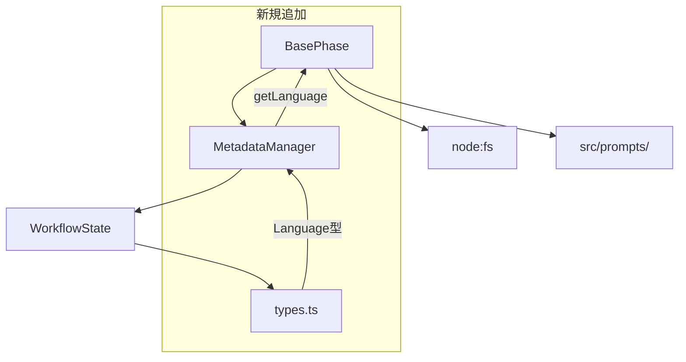

# Codex Agent 実行ログ

開始日時: 2025/12/30 3:20:45

---

## Turn 1: スレッド開始

**Thread ID**: `[REDACTED_TOKEN]`

## Turn 2: ツール実行

**種別**: reasoning
**ステータス**: completed

## Turn 3: ツール実行

**種別**: コマンド実行
**コマンド**: `/bin/bash -lc 'cd /tmp/ai-workflow-repos-138-6353c320/ai-workflow-agent && ls .ai-workflow/issue-571/04_implementation/output'`
**ステータス**: completed (exit_code=0)

```text
implementation.md
```

## Turn 4: ツール実行

**種別**: reasoning
**ステータス**: completed

## Turn 5: ツール実行

**種別**: コマンド実行
**コマンド**: `/bin/bash -lc 'cd /tmp/ai-workflow-repos-138-6353c320/ai-workflow-agent && cat .ai-workflow/issue-571/04_implementation/output/implementation.md'`
**ステータス**: completed (exit_code=0)

```text
# 実装完了レポート

## 変更ファイル一覧

| ファイル | 変更種別 | 概要 |
|---------|---------|------|
| `src/types.ts` | 修正 | プロンプト言語用の`Language`型と`DEFAULT_LANGUAGE`を追加しメタデータ型に言語を許容 |
| `src/core/metadata-manager.ts` | 修正 | 言語設定を取得する`getLanguage()`を実装しデフォルトフォールバックを追加 |
| `src/phases/base-phase.ts` | 修正 | `loadPrompt`を言語対応させ不足時にデフォルトへフォールバックするよう更新 |
| `src/prompts/*/ja/*.txt` | 移動 | 各フェーズの既存プロンプトを言語ディレクトリ配下に再配置 |
| `src/prompts/*/en/*.txt` | 新規 | 10フェーズ分の英語プロンプトを追加 |

## 主要な変更点
- プロンプトディレクトリを`{phase}/{lang}/`構造に整理し日本語ファイルを`ja/`へ移動、英語版を追加。
- `Language`型と`DEFAULT_LANGUAGE`を定義し、メタデータからの言語取得にフォールバック処理を追加。
- `BasePhase.loadPrompt`が言語設定に応じてプロンプトを読み込み、指定言語が無い場合は日本語へ警告付きでフォールバックするように変更。

## テスト実施状況
- ビルド: 未実行（依頼なし）
- リント: 未実行（依頼なし）
- 基本動作確認: プロンプト構造と読み込みロジックの変更のみのため手動テストは未実施
```

## Turn 6: ツール実行

**種別**: reasoning
**ステータス**: completed

## Turn 7: ツール実行

**種別**: コマンド実行
**コマンド**: `/bin/bash -lc 'cd /tmp/ai-workflow-repos-138-6353c320/ai-workflow-agent && git status --short'`
**ステータス**: completed (exit_code=0)

```text
M .ai-workflow/issue-571/00_planning/output/planning.md
 M .ai-workflow/issue-571/metadata.json
 D src/prompts/design/execute.txt
 D src/prompts/design/review.txt
 D src/prompts/design/revise.txt
 D src/prompts/documentation/execute.txt
 D src/prompts/documentation/review.txt
 D src/prompts/documentation/revise.txt
 D src/prompts/evaluation/execute.txt
 D src/prompts/evaluation/review.txt
 D src/prompts/evaluation/revise.txt
 D src/prompts/implementation/execute.txt
 D src/prompts/implementation/review.txt
 D src/prompts/implementation/revise.txt
 D src/prompts/planning/execute.txt
 D src/prompts/planning/review.txt
 D src/prompts/planning/revise.txt
 D src/prompts/report/execute.txt
 D src/prompts/report/review.txt
 D src/prompts/report/revise.txt
 D src/prompts/requirements/execute.txt
 D src/prompts/requirements/review.txt
 D src/prompts/requirements/revise.txt
 D src/prompts/test_implementation/execute.txt
 D src/prompts/test_implementation/review.txt
 D src/prompts/test_implementation/revise.txt
 D src/prompts/test_scenario/execute.txt
 D src/prompts/test_scenario/review.txt
 D src/prompts/test_scenario/revise.txt
 D src/prompts/testing/execute.txt
 D src/prompts/testing/review.txt
 D src/prompts/testing/revise.txt
?? .ai-workflow/issue-571/00_planning/execute/agent_log_raw.txt
?? .ai-workflow/issue-571/00_planning/execute/prompt.txt
?? .ai-workflow/issue-571/00_planning/review/agent_log_raw.txt
?? .ai-workflow/issue-571/00_planning/review/prompt.txt
?? .ai-workflow/issue-571/01_requirements/execute/agent_log_raw.txt
?? .ai-workflow/issue-571/01_requirements/execute/prompt.txt
?? .ai-workflow/issue-571/01_requirements/review/agent_log_raw.txt
?? .ai-workflow/issue-571/01_requirements/review/prompt.txt
?? .ai-workflow/issue-571/02_design/execute/agent_log_raw.txt
?? .ai-workflow/issue-571/02_design/execute/prompt.txt
?? .ai-workflow/issue-571/02_design/review/agent_log_raw.txt
?? .ai-workflow/issue-571/02_design/review/prompt.txt
?? .ai-workflow/issue-571/03_test_scenario/execute/agent_log_raw.txt
?? .ai-workflow/issue-571/03_test_scenario/execute/prompt.txt
?? .ai-workflow/issue-571/03_test_scenario/review/agent_log_raw.txt
?? .ai-workflow/issue-571/03_test_scenario/review/prompt.txt
?? .ai-workflow/issue-571/04_implementation/execute/agent_log_raw.txt
?? .ai-workflow/issue-571/04_implementation/execute/prompt.txt
?? .ai-workflow/issue-571/04_implementation/review/
?? .ai-workflow/issue-571/04_implementation/revise/
```

## Turn 8: ツール実行

**種別**: reasoning
**ステータス**: completed

## Turn 9: ツール実行

**種別**: コマンド実行
**コマンド**: `/bin/bash -lc "cd /tmp/ai-workflow-repos-138-6353c320/ai-workflow-agent && sed -n '1,200p' .ai-workflow/issue-571/02_design/output/design.md"`
**ステータス**: completed (exit_code=0)

```text
# 詳細設計書: Issue #571

## Implement prompt file switching based on language setting

---

## 0. Planning Documentの確認

本設計書は、Planning Phase成果物（`.ai-workflow/issue-571/00_planning/output/planning.md`）および要件定義書（`.ai-workflow/issue-571/01_requirements/output/requirements.md`）の計画に基づいて作成されています。

### 開発計画の概要

| 項目 | 内容 |
|------|------|
| **複雑度** | 中程度 |
| **見積もり工数** | 12〜16時間 |
| **実装戦略** | EXTEND（既存の`loadPrompt()`メソッドを拡張） |
| **テスト戦略** | UNIT_INTEGRATION |
| **テストコード戦略** | CREATE_TEST |

---

## 1. 既存コードベース分析

### 1.1 現状の実装

#### BasePhase.loadPrompt() メソッド

**ファイル**: `src/phases/base-phase.ts` (lines 291-320)

```typescript
protected loadPrompt(promptType: 'execute' | 'review' | 'revise'): string {
  const promptPath = path.join(promptsRoot, this.phaseName, `${promptType}.txt`);
  if (!fs.existsSync(promptPath)) {
    throw new Error(`Prompt file not found: ${promptPath}`);
  }

  let prompt = fs.readFileSync(promptPath, 'utf-8');

  // Issue #177: 環境情報の注入（execute ステップのみ）
  if (promptType === 'execute' && config.[REDACTED_TOKEN]()) {
    const environmentInfo = this.[REDACTED_TOKEN]();
    prompt = environmentInfo + '\n\n' + prompt;
    // ...
  }

  // Issue #90: 差し戻しコンテキストの注入
  if (promptType === 'revise') {
    // ...
  }

  return prompt;
}
```

**現状の問題**:
- パス解決: `promptsRoot/{phaseName}/{promptType}.txt` （言語考慮なし）
- 言語設定を一切参照していない
- 日本語プロンプトのみ存在

#### MetadataManager クラス

**ファイル**: `src/core/metadata-manager.ts`

**重要な発見**: `getLanguage()` メソッドは**存在しない**。Issue #526で実装済みとの前提だったが、実際には未実装。

**現在のWorkflowMetadata型** (`src/types.ts`):
```typescript
export interface WorkflowMetadata {
  issue_number: string;
  issue_url: string;
  issue_title: string;
  // ...
  // language フィールドは存在しない
}
```

#### プロンプトファイル構造

**現状**: `src/prompts/{phase}/{promptType}.txt`

```
src/prompts/
├── planning/
│   ├── execute.txt
│   ├── review.txt
│   └── revise.txt
├── requirements/
│   ├── execute.txt
│   ├── review.txt
│   └── revise.txt
├── design/
├── test_scenario/
├── implementation/
├── test_implementation/
├── testing/
├── documentation/
├── report/
└── evaluation/
```

#### copy-static-assets.mjs

**ファイル**: `scripts/copy-static-assets.mjs`

```javascript
const assets = [
  // ...
  {
    source: path.join(projectRoot, 'src', 'prompts'),
    target: path.join(distDir, 'prompts'),
  },
];

await fsp.cp(asset.source, asset.target, {
  recursive: true,
  force: true,
});
```

**評価**: `recursive: true` オプションにより、多言語ディレクトリ構造もそのままコピーされる。**変更不要**。

### 1.2 影響範囲の特定

| コンポーネント | 影響 | 変更内容 |
|--------------|------|---------|
| `src/types.ts` | 中 | `Language` 型、`DEFAULT_LANGUAGE` 定数の追加 |
| `src/core/metadata-manager.ts` | 中 | `getLanguage()` メソッドの追加 |
| `src/phases/base-phase.ts` | 高 | `loadPrompt()` メソッドの多言語対応 |
| `src/prompts/**/*` | 高 | ディレクトリ構造変更（60ファイル） |
| `scripts/copy-static-assets.mjs` | 低 | **変更不要**（既存の再帰コピーで対応） |

### 1.3 依存関係の確認



---

## 2. 実装戦略判断

### 実装戦略: **EXTEND**

**判断根拠**:
1. **既存メソッドの拡張が中心**: `BasePhase.loadPrompt()` の既存実装を維持しつつ、言語パラメータによるパス解決ロジックを追加
2. **既存パターンの踏襲**: Issue #177（環境情報注入）やIssue #90（差し戻しコンテキスト注入）と同様の注入パターンを適用
3. **MetadataManagerの拡張**: 既存クラスに `getLanguage()` メソッドを追加（新規クラス作成不要）
4. **ファイル構造変更のみ**: 既存の日本語プロンプトを `{phase}/ja/` に移動し、英語版を `{phase}/en/` に新規作成
5. **ビルドスクリプト変更不要**: `copy-static-assets.mjs` は既存の再帰コピーで対応可能

**CREATE を選択しなかった理由**:
- 新規コンポーネント作成は不要
- 既存の `loadPrompt()` メソッドの責務を維持

**REFACTOR を選択しなかった理由**:
- 既存コードの構造改善が目的ではなく、機能追加が目的
- 既存の設計パターンは適切

---

## 3. テスト戦略判断

### テスト戦略: **UNIT_INTEGRATION**

**判断根拠**:
1. **ユニットテストが必要な理由**:
   - `loadPrompt()` のパス解決ロジックは単体でテスト可能
   - フォールバック動作の境界値テストが必要
   - `MetadataManager.getLanguage()` の単体テスト

2. **統合テストが必要な理由**:
   - 実際のプロンプトファイル構造での読み込み確認
   - 全10フェーズでの多言語切り替えの動作確認
   - ビルド後（`dist/prompts/`
... (truncated)
```

## Turn 10: ツール実行

**種別**: reasoning
**ステータス**: completed

## Turn 11: ツール実行

**種別**: コマンド実行
**コマンド**: `/bin/bash -lc 'cd /tmp/ai-workflow-repos-138-6353c320/ai-workflow-agent && rg "DEFAULT_LANGUAGE" -n src'`
**ステータス**: failed (exit_code=127)

```text
/bin/bash: line 1: rg: command not found
```

## Turn 12: ツール実行

**種別**: reasoning
**ステータス**: completed

## Turn 13: ツール実行

**種別**: コマンド実行
**コマンド**: `/bin/bash -lc 'cd /tmp/ai-workflow-repos-138-6353c320/ai-workflow-agent && grep -R "DEFAULT_LANGUAGE" -n src'`
**ステータス**: completed (exit_code=0)

```text
src/core/metadata-manager.ts:16:  DEFAULT_LANGUAGE,
src/core/metadata-manager.ts:226:    return DEFAULT_LANGUAGE;
src/phases/base-phase.ts:17:  DEFAULT_LANGUAGE,
src/phases/base-phase.ts:298:      const fallbackPath = path.join(promptsRoot, this.phaseName, DEFAULT_LANGUAGE, `${promptType}.txt`);
src/phases/base-phase.ts:305:        `Prompt not found for language '${language}', falling back to '${DEFAULT_LANGUAGE}': ${promptPath}`
src/types.ts:28:export const DEFAULT_LANGUAGE: Language = 'ja';
```

## Turn 14: ツール実行

**種別**: reasoning
**ステータス**: completed

## Turn 15: ツール実行

**種別**: コマンド実行
**コマンド**: `/bin/bash -lc "cd /tmp/ai-workflow-repos-138-6353c320/ai-workflow-agent && sed -n '1,200p' src/types.ts"`
**ステータス**: completed (exit_code=0)

```text
export type PhaseName =
  | 'planning'
  | 'requirements'
  | 'design'
  | 'test_scenario'
  | 'implementation'
  | 'test_implementation'
  | 'testing'
  | 'documentation'
  | 'report'
  | 'evaluation';

export type PhaseStatus = 'pending' | 'in_progress' | 'completed' | 'failed';

// Issue #10: ステップ名の型定義
export type StepName = 'execute' | 'review' | 'revise';

export type DifficultyLevel = 'simple' | 'moderate' | 'complex';

/**
 * Supported language codes for prompts (Issue #571)
 */
export type Language = 'ja' | 'en';

/**
 * Default language used when no valid preference is set
 */
export const DEFAULT_LANGUAGE: Language = 'ja';

export interface [REDACTED_TOKEN] {
  level: DifficultyLevel;
  confidence: number;
  factors: {
    estimated_file_changes: number;
    scope: 'single_file' | 'single_module' | 'multiple_modules' | 'cross_cutting';
    requires_tests: boolean;
    requires_architecture_change: boolean;
    complexity_score: number;
  };
  analyzed_at: string;
  analyzer_agent: 'claude' | 'codex';
  analyzer_model: string;
}

export interface StepModelConfig {
  claudeModel: 'opus' | 'sonnet';
  codexModel: 'max' | 'mini';
}

export interface PhaseModelConfig {
  execute: StepModelConfig;
  review: StepModelConfig;
  revise: StepModelConfig;
}

export type ModelConfigByPhase = {
  [phase in PhaseName]?: PhaseModelConfig;
};

export interface PhaseMetadata {
  status: PhaseStatus;
  retry_count: number;
  started_at: string | null;
  completed_at: string | null;
  review_result: string | null;
  output_files?: string[];
  // Issue #10: ステップ単位の進捗管理
  current_step?: StepName | null;  // 現在実行中のステップ（実行中でない場合はnull）
  completed_steps?: StepName[];     // 完了済みステップの配列（実行順序を保持）
  // Issue #90: 差し戻しコンテキスト（オプショナル）
  rollback_context?: import('./types/commands.js').RollbackContext | null;
}

/**
 * フォローアップ Issue の背景コンテキスト
 * Evaluation Phase から IssueClient に渡される
 */
export interface IssueContext {
  /**
   * 元 Issue の概要
   * 例: "Issue #91 では、BasePhase モジュール分解（Issue #49）で発生した 15 件のテスト失敗を修正しました。"
   */
  summary: string;

  /**
   * ブロッカーのステータス
   * 例: "すべてのブロッカーは解決済み"
   */
  blockerStatus: string;

  /**
   * タスクが残った理由
   * 例: "テスト失敗修正を優先したため、カバレッジ改善は後回しにした"
   */
  deferredReason: string;
}

/**
 * Evaluation Phase で検出された残タスク
 */
export interface RemainingTask {
  // ===== 既存フィールド（必須） =====
  /** タスクの説明 */
  task: string;

  /** 対象フェーズ（例: "implementation", "testing"） */
  phase: string;

  /** 優先度（例: "High", "Medium", "Low"） */
  priority: string;

  // ===== 新規フィールド（すべてオプショナル） =====

  /**
   * 優先度の理由
   * 例: "元 Issue #91 の推奨事項、ブロッカーではない"
   */
  priorityReason?: string;

  /**
   * 対象ファイル/モジュールのリスト
   * 例: ["src/core/phase-factory.ts", "src/commands/execute/agent-setup.ts"]
   */
  targetFiles?: string[];

  /**
   * 実行手順（番号付きリスト）
   * 例: ["不足しているテストケースを特定", "エッジケースのテストを追加"]
   */
  steps?: string[];

  /**
   * 受け入れ基準（Acceptance Criteria）
   * 例: ["すべての対象モジュールで 90% 以上のカバレッジを達成", "npm run test:coverage がすべてパス"]
   */
  acceptanceCriteria?: string[];

  /**
   * 依存タスク
   * 例: ["Task 1 完了後に実行", "Phase 4 の修正が必要"]
   */
  dependencies?: string[];

  /**
   * 見積もり工数
   * 例: "2-4h", "1日", "0.5h"
   */
  estimatedHours?: string;
}

export interface [REDACTED_TOKEN] {
  enabled: boolean;
  provider: 'auto' | 'openai' | 'claude' | 'agent';
  model?: string;
  temperature?: number;
  maxOutputTokens?: number;
  timeoutMs?: number;
  maxRetries?: number;
  maxTasks?: number;
  appendMetadata?: boolean;
}

export interface [REDACTED_TOKEN] {
  title: string;
  body: string;
  metadata: {
    provider: 'openai' | 'claude';
    model: string;
    durationMs: number;
    retryCount: number;
    inputTokens?: number;
    outputTokens?: number;
    omittedTasks?: number;
  };
}

export interface [REDACTED_TOKEN] extends PhaseMetadata {
  decision: string | null;
  failed_phase: PhaseName | null;
  remaining_tasks: RemainingTask[];
  created_issue_url: string | null;
  abort_reason: string | null;
}

export type P
... (truncated)
```

## Turn 16: ツール実行

**種別**: コマンド実行
**コマンド**: `/bin/bash -lc "cd /tmp/ai-workflow-repos-138-6353c320/ai-workflow-agent && sed -n '200,420p' src/core/metadata-manager.ts"`
**ステータス**: completed (exit_code=0)

```text
this.state.data.difficulty_analysis = result;
    this.state.save();
  }

  public [REDACTED_TOKEN](): [REDACTED_TOKEN] | null {
    return this.state.data.difficulty_analysis ?? null;
  }

  public setModelConfig(config: ModelConfigByPhase | null): void {
    this.state.data.model_config = config;
    this.state.save();
  }

  public getModelConfig(): ModelConfigByPhase | null {
    return this.state.data.model_config ?? null;
  }

  /**
   * Get preferred language for prompt loading (Issue #571)
   */
  public getLanguage(): Language {
    const metadataLanguage = (this.state.data as WorkflowMetadata & { language?: string }).language;
    if (metadataLanguage === 'ja' || metadataLanguage === 'en') {
      return metadataLanguage;
    }

    return DEFAULT_LANGUAGE;
  }

  public getPhaseStatus(phaseName: PhaseName): PhaseStatus {
    return this.state.getPhaseStatus(phaseName);
  }

  public setDesignDecision(key: string, value: string): void {
    this.state.setDesignDecision(key, value);
    this.state.save();
  }

  public incrementRetryCount(phaseName: PhaseName): number {
    const count = this.state.incrementRetryCount(phaseName);
    this.state.save();
    return count;
  }

  public clear(): void {
    if (fs.existsSync(this.metadataPath)) {
      logger.info(`Clearing metadata: ${this.metadataPath}`);
      fs.rmSync(this.metadataPath, { force: true });
    }

    [REDACTED_TOKEN](this.workflowDir);
    if (!fs.existsSync(this.workflowDir)) {
      logger.info('Workflow directory removed successfully');
    }
  }

  public rollbackToPhase(phaseName: PhaseName) {
    const phases = Object.keys(this.state.data.phases) as PhaseName[];
    if (!phases.includes(phaseName)) {
      return {
        success: false,
        error: `Invalid phase name: ${phaseName}`,
        backup_path: null,
        rolled_back_phases: [] as PhaseName[],
      };
    }

    const backupPath = backupMetadataFile(this.metadataPath);

    const startIndex = phases.indexOf(phaseName);
    const rolledBack = phases.slice(startIndex);

    for (const phase of rolledBack) {
      const phaseData = this.ensurePhaseData(phase);
      phaseData.status = 'pending';
      phaseData.started_at = null;
      phaseData.completed_at = null;
      phaseData.review_result = null;
      phaseData.retry_count = 0;
      // Issue #208: completed_steps と current_step のリセット追加
      phaseData.current_step = null;
      phaseData.completed_steps = [];
      phaseData.rollback_context = null; // Issue #208: consistency確保
    }

    this.state.save();

    logger.info(`metadata.json rolled back to phase ${phaseName}`);
    logger.info(`Phases reset: ${rolledBack.join(', ')}`);

    return {
      success: true,
      backup_path: backupPath,
      rolled_back_phases: rolledBack,
      error: null,
    };
  }

  public getAllPhasesStatus(): Record<PhaseName, PhaseStatus> {
    const result = {} as Record<PhaseName, PhaseStatus>;
    for (const [phase, data] of Object.entries(this.state.data.phases)) {
      result[phase as PhaseName] = data.status;
    }
    return result;
  }

  public backupMetadata(): string {
    return backupMetadataFile(this.metadataPath);
  }

  public [REDACTED_TOKEN](options: {
    decision: string;
    failedPhase?: PhaseName | null;
    remainingTasks?: RemainingTask[] | null;
    createdIssueUrl?: string | null;
    abortReason?: string | null;
  }): void {
    const evaluation = this.ensurePhaseData('evaluation') as [REDACTED_TOKEN];
    if (!evaluation) {
      throw new Error('Evaluation phase not found in metadata');
    }

    evaluation.decision = options.decision;

    if (options.failedPhase !== undefined) {
      evaluation.failed_phase = options.failedPhase ?? null;
    }

    if (options.remainingTasks !== undefined) {
      evaluation.remaining_tasks = options.remainingTasks ?? [];
    }

    if (options.createdIssueUrl !== undefined) {
      evaluation.created_issue_url = options.createdIssueUr
... (truncated)
```

## Turn 17: ツール実行

**種別**: reasoning
**ステータス**: completed

## Turn 18: ツール実行

**種別**: コマンド実行
**コマンド**: `/bin/bash -lc "cd /tmp/ai-workflow-repos-138-6353c320/ai-workflow-agent && sed -n '250,360p' src/phases/base-phase.ts"`
**ステータス**: completed (exit_code=0)

```text
protected abstract review(): Promise<[REDACTED_TOKEN]>;

  protected async shouldRunReview(): Promise<boolean> {
    return true;
  }

  public async run(options: PhaseRunOptions = {}): Promise<boolean> {
    // StepExecutor と PhaseRunner の遅延初期化（Issue #49）
    if (!this.stepExecutor) {
      this.stepExecutor = new StepExecutor(
        this.phaseName,
        this.metadata,
        this.reviewCycleManager,
        async () => this.runWithStepModel('execute', () => this.execute()),
        async () => this.runWithStepModel('review', () => this.review()),
        async () => this.shouldRunReview()
      );
    }

    if (!this.phaseRunner) {
      const reviseHandler = this.getReviseFunction();
      const wrappedRevise =
        reviseHandler !== null
          ? (feedback: string) => this.runWithStepModel('revise', () => reviseHandler(feedback))
          : null;

      this.phaseRunner = new PhaseRunner(
        this.phaseName,
        this.metadata,
        this.github,
        this.stepExecutor,
        this.skipDependencyCheck,
        this.ignoreDependencies,
        this.presetPhases,
        wrappedRevise
      );
    }

    // PhaseRunner に委譲（Issue #49）
    return this.phaseRunner.run(options);
  }

  protected loadPrompt(promptType: 'execute' | 'review' | 'revise'): string {
    const language = this.metadata.getLanguage();
    const promptPath = path.join(promptsRoot, this.phaseName, language, `${promptType}.txt`);
    let resolvedPath = promptPath;

    if (!fs.existsSync(promptPath)) {
      const fallbackPath = path.join(promptsRoot, this.phaseName, DEFAULT_LANGUAGE, `${promptType}.txt`);

      if (!fs.existsSync(fallbackPath)) {
        throw new Error(`Prompt file not found: ${promptPath} (fallback also failed: ${fallbackPath})`);
      }

      logger.warn(
        `Prompt not found for language '${language}', falling back to '${DEFAULT_LANGUAGE}': ${promptPath}`
      );
      resolvedPath = fallbackPath;
    }

    let prompt = fs.readFileSync(resolvedPath, 'utf-8');

    // Issue #177: 環境情報の注入（execute ステップのみ、パッケージインストール可能時）
    if (promptType === 'execute' && config.[REDACTED_TOKEN]()) {
      const environmentInfo = this.[REDACTED_TOKEN]();
      prompt = environmentInfo + '\n\n' + prompt;

      logger.info(`Environment info injected into execute prompt for phase ${this.phaseName}`);
    }

    // Issue #90: 差し戻しコンテキストがある場合、プロンプトの先頭に追加
    // revise ステップのみに差し戻し情報を注入
    if (promptType === 'revise') {
      const rollbackContext = this.metadata.getRollbackContext(this.phaseName);
      if (rollbackContext) {
        const rollbackSection = this.[REDACTED_TOKEN](rollbackContext);
        prompt = rollbackSection + '\n\n' + prompt;

        logger.info(`Rollback context injected into revise prompt for phase ${this.phaseName}`);
      }
    }

    return prompt;
  }

  /**
   * Issue #177: 環境情報セクションのMarkdownを生成
   * @returns 環境情報セクションのMarkdown文字列
   * @private
   */
  private [REDACTED_TOKEN](): string {
    return `## 🛠️ 開発環境情報

このDocker環境では、以下のプログラミング言語をインストール可能です：

- **Python**: \`apt-get update && apt-get install -y python3 python3-pip\`
- **Go**: \`apt-get update && apt-get install -y golang-go\`
- **Java**: \`apt-get update && apt-get install -y default-jdk\`
- **Rust**: \`curl --proto '=https' --tlsv1.2 -sSf https://sh.rustup.rs | sh -s -- -y\`
- **Ruby**: \`apt-get update && apt-get install -y ruby ruby-dev\`

テスト実行や品質チェックに必要な言語環境は、自由にインストールしてください。`;
  }

  /**
   * Issue #90: 差し戻し情報をMarkdown形式で生成
   * @param context - 差し戻しコンテキスト
   * @returns Markdown形式の差し戻し情報
   */
  protected [REDACTED_TOKEN](
    context: import('../types/commands.js').RollbackContext,
```

## Turn 19: ツール実行

**種別**: reasoning
**ステータス**: completed

## Turn 20: ツール実行

**種別**: コマンド実行
**コマンド**: `/bin/bash -lc 'cd /tmp/ai-workflow-repos-138-6353c320/ai-workflow-agent && ls src/prompts | head'`
**ステータス**: completed (exit_code=0)

```text
auto-issue
content_parser
design
difficulty
documentation
evaluation
followup
implementation
planning
pr-comment
```

## Turn 21: ツール実行

**種別**: reasoning
**ステータス**: completed

## Turn 22: ツール実行

**種別**: コマンド実行
**コマンド**: `/bin/bash -lc 'cd /tmp/ai-workflow-repos-138-6353c320/ai-workflow-agent && ls src/prompts/design | head'`
**ステータス**: completed (exit_code=0)

```text
en
ja
```

## Turn 23: ツール実行

**種別**: reasoning
**ステータス**: completed

## Turn 24: ツール実行

**種別**: コマンド実行
**コマンド**: `/bin/bash -lc 'cd /tmp/ai-workflow-repos-138-6353c320/ai-workflow-agent && ls src/prompts/design/en | head'`
**ステータス**: completed (exit_code=0)

```text
execute.txt
review.txt
revise.txt
```

## Turn 25: ツール実行

**種別**: reasoning
**ステータス**: completed

## Turn 26: ツール実行

**種別**: コマンド実行
**コマンド**: `/bin/bash -lc 'cd /tmp/ai-workflow-repos-138-6353c320/ai-workflow-agent && grep -n "language" -n .ai-workflow/issue-571/02_design/output/design.md'`
**ステータス**: completed (exit_code=0)

```text
3:## Implement prompt file switching based on language setting
74:  // language フィールドは存在しない
206:   - Issue本文で `tests/integration/[REDACTED_TOKEN].test.ts` が指定されている
213:   - `tests/unit/phases/base-phase-language-switching.test.ts`（ユニットテスト）
214:   - `tests/integration/[REDACTED_TOKEN].test.ts`（統合テスト）
350:| **metadata.json変更** | 既存の `language` フィールド参照（Issue #526で追加済み想定） |
360:| `tests/unit/phases/base-phase-language-switching.test.ts` | ユニットテスト（loadPrompt多言語対応） |
361:| `tests/integration/[REDACTED_TOKEN].test.ts` | 統合テスト（全フェーズ多言語切り替え） |
425: * 1. metadata.json の language フィールド
429: * const language = metadataManager.getLanguage();
430: * // Returns: 'en' (if metadata.language === 'en')
431: * // Returns: 'ja' (if metadata.language is undefined or 'ja')
434:  const metadataLanguage = (this.state.data as any).language;
446:- `WorkflowMetadata` 型に `language` フィールドが存在しない場合でも、`any` キャストで安全にアクセス
459:  const language = this.metadata.getLanguage();
462:  const promptPath = path.join(promptsRoot, this.phaseName, language, `${promptType}.txt`);
475:      `Prompt not found for language '${language}', falling back to '${DEFAULT_LANGUAGE}': ${promptPath}`
567:  const metadataLanguage = (this.state.data as any).language;
652:1. ユニットテスト: `tests/unit/phases/base-phase-language-switching.test.ts`
653:2. 統合テスト: `tests/integration/[REDACTED_TOKEN].test.ts`
665:### 12.1 ユニットテスト（[REDACTED_TOKEN].test.ts）
670:  test('Given language="ja", When loadPrompt("execute") is called, Then ja/execute.txt is loaded');
673:  test('Given language="en", When loadPrompt("execute") is called, Then en/execute.txt is loaded');
676:  test('Given language="fr" and no fr/ directory, When loadPrompt("execute") is called, Then ja/execute.txt is loaded with warning');
682:  test('Given language="en" and [REDACTED_TOKEN]=true, When loadPrompt("execute") is called, Then environment info is injected into en prompt');
685:  test('Given language="en" and rollback context exists, When loadPrompt("revise") is called, Then rollback context is injected into en prompt');
689:### 12.2 統合テスト（[REDACTED_TOKEN].test.ts）
694:  test('Given language="ja", When all phases load prompts, Then all ja prompts are loaded');
697:  test('Given language="en", When all phases load prompts, Then all en prompts are loaded');
```

## Turn 27: ツール実行

**種別**: reasoning
**ステータス**: completed

## Turn 28: ツール実行

**種別**: コマンド実行
**コマンド**: `/bin/bash -lc 'cd /tmp/ai-workflow-repos-138-6353c320/ai-workflow-agent && ls tests/unit/phases | head'`
**ステータス**: completed (exit_code=0)

```text
base-phase-fallback.test.ts
[REDACTED_TOKEN].test.ts
[REDACTED_TOKEN].test.ts
base-phase-template.test.ts
cleanup
context
core
formatters
lifecycle
```

## Turn 29: ツール実行

**種別**: reasoning
**ステータス**: completed

## Turn 30: ツール実行

**種別**: コマンド実行
**コマンド**: `/bin/bash -lc "cd /tmp/ai-workflow-repos-138-6353c320/ai-workflow-agent && sed -n '1,200p' tests/unit/phases/base-phase-fallback.test.ts"`
**ステータス**: completed (exit_code=0)

```text
/**
 * Unit tests for BasePhase fallback mechanism (Issue #113)
 *
 * Tests cover:
 * - [REDACTED_TOKEN](): Log extraction with pattern matching
 * - [REDACTED_TOKEN](): Content validation logic
 * - [REDACTED_TOKEN](): Fallback processing orchestration
 * - [REDACTED_TOKEN](): Integration with enableFallback option
 */

import { describe, it, expect, beforeEach, afterEach, jest } from '@jest/globals';
import fs from 'fs-extra';
import path from 'node:path';
import { BasePhase } from '../../../src/phases/base-phase.js';
import { MetadataManager } from '../../../src/core/metadata-manager.js';
import { GitHubClient } from '../../../src/core/github-client.js';
import { [REDACTED_TOKEN], PhaseName } from '../../../src/types.js';

// Concrete implementation of BasePhase for testing
class TestPhase extends BasePhase {
  constructor(params: any) {
    super({ ...params, phaseName: 'planning' as PhaseName });
  }

  protected async execute(): Promise<[REDACTED_TOKEN]> {
    return { success: true, output: 'test-output.md' };
  }

  protected async review(): Promise<[REDACTED_TOKEN]> {
    return { success: true, output: null };
  }

  public async testRevise(feedback: string): Promise<[REDACTED_TOKEN]> {
    return { success: true, output: 'planning.md' };
  }

  // Expose protected methods for testing
  public [REDACTED_TOKEN](agentLog: string, phaseName: PhaseName): string | null {
    return this.[REDACTED_TOKEN](agentLog, phaseName);
  }

  public [REDACTED_TOKEN](content: string, phaseName: PhaseName): boolean {
    return this.[REDACTED_TOKEN](content, phaseName);
  }

  public [REDACTED_TOKEN](
    phaseOutputFile: string,
    logDir: string
  ): Promise<[REDACTED_TOKEN]> {
    return this.[REDACTED_TOKEN](phaseOutputFile, logDir);
  }

  public [REDACTED_TOKEN]<T extends Record<string, string>>(
    phaseOutputFile: string,
    templateVariables: T,
    options?: { maxTurns?: number; verbose?: boolean; logDir?: string; enableFallback?: boolean }
  ): Promise<[REDACTED_TOKEN]> {
    return this.[REDACTED_TOKEN](phaseOutputFile, templateVariables, options);
  }
}

function ensureDirectory(dir: string): void {
  if (!fs.existsSync(dir)) {
    fs.mkdirSync(dir, { recursive: true });
  }
}

/**
 * Setup file system mock with limited scope.
 *
 * This mock intentionally does NOT mock prompt file reads to prevent
 * "EACCES: permission denied" errors in [REDACTED_TOKEN] tests.
 *
 * Reason: fs.readFileSync mock was affecting loadPrompt() method, causing
 * errors in [REDACTED_TOKEN] tests.
 *
 * Reference: Issue #113 Evaluation Report lines 145-160
 */
function setupFileSystemMock(): void {
  // Note: This function is intentionally empty as we don't want to mock
  // fs.readFileSync for these tests. The original issue was that mocking
  // fs.readFileSync was preventing loadPrompt() from working correctly.
  // By not mocking it at all, we allow the tests to work properly.
}

describe('BasePhase Fallback Mechanism (Issue #113)', () => {
  let testPhase: TestPhase;
  let mockMetadata: jest.Mocked<MetadataManager>;
  let mockGitHub: jest.Mocked<GitHubClient>;
  let testWorkingDir: string;

  beforeEach(() => {
    // Setup test working directory
    testWorkingDir = path.join(process.cwd(), '.test-tmp', 'base-phase-fallback');
    ensureDirectory(testWorkingDir);

    // Mock MetadataManager
    mockMetadata = {
      workflowDir: path.join(testWorkingDir, '.ai-workflow', 'issue-113'),
      data: { issue_number: '113' },
      updatePhaseStatus: jest.fn(),
      getRollbackContext: jest.fn(),
    } as any;

    // Mock GitHubClient
    mockGitHub = {
      getIssueInfo: jest.fn(),
      postComment: jest.fn(),
    } as any;

    // Create TestPhase instance
    testPhase = new TestPhase({
      workingDir: testWorkingDir,
      metadataManager: mockMetadata,
      githubClient: mockGitHub,
    });
  });

  afterEach(() =
... (truncated)
```

## Turn 31: ツール実行

**種別**: reasoning
**ステータス**: completed

## Turn 32: ツール実行

**種別**: コマンド実行
**コマンド**: `/bin/bash -lc "cd /tmp/ai-workflow-repos-138-6353c320/ai-workflow-agent && sed -n '1,200p' .ai-workflow/issue-571/03_test_scenario/output/test-scenario.md"`
**ステータス**: completed (exit_code=0)

```text
# テストシナリオ: Issue #571

## Implement prompt file switching based on language setting

---

## 0. テスト戦略サマリー

### 選択されたテスト戦略（Phase 2から引用）

**テスト戦略**: **UNIT_INTEGRATION**

**判断根拠**:
1. **ユニットテストが必要な理由**:
   - `loadPrompt()` のパス解決ロジックは単体でテスト可能
   - フォールバック動作の境界値テストが必要
   - `MetadataManager.getLanguage()` の単体テスト

2. **統合テストが必要な理由**:
   - 実際のプロンプトファイル構造での読み込み確認
   - 全10フェーズでの多言語切り替えの動作確認
   - ビルド後（`dist/prompts/`）の動作確認

3. **BDDテストが不要な理由**:
   - エンドユーザー向け機能ではなく、内部実装の拡張
   - ユーザーストーリーが存在しない

### テスト対象の範囲

| コンポーネント | テスト種別 | 優先度 |
|--------------|----------|-------|
| `MetadataManager.getLanguage()` | Unit | 高 |
| `BasePhase.loadPrompt()` | Unit | 高 |
| プロンプトファイル構造 | Integration | 高 |
| 全10フェーズの多言語切り替え | Integration | 中 |
| ビルド後の動作確認 | Integration | 中 |

### テストの目的

1. `loadPrompt()` メソッドが言語設定に基づいて正しいプロンプトファイルを読み込むことを検証
2. フォールバック機構が正常に動作することを検証
3. 既存の環境情報注入・差し戻しコンテキスト注入との互換性を検証
4. 全10フェーズで多言語切り替えが正常に動作することを検証

### テストカバレッジ目標

- ユニットテスト: 90%以上（ロジック部分）
- 統合テスト: 全10フェーズ × 2言語 × 3種類 = 60パターン

---

## 1. Unitテストシナリオ

### 1.1 MetadataManager.getLanguage() テスト

**テストファイル**: `tests/unit/core/metadata-manager-language.test.ts`

#### TC-571-U01: getLanguage() - 日本語設定の取得

| 項目 | 内容 |
|-----|------|
| **目的** | metadata.jsonのlanguageが'ja'の場合、'ja'が返されることを検証 |
| **前提条件** | MetadataManagerインスタンスが初期化済み |
| **入力** | `metadata.language = 'ja'` |
| **期待結果** | `getLanguage()` が `'ja'` を返す |
| **テストデータ** | `{ language: 'ja', issue_number: '571', ... }` |

```typescript
test('TC-571-U01: getLanguage() returns "ja" when metadata.language is "ja"', () => {
  // Given
  const mockState = {
    data: { language: 'ja', issue_number: '571' }
  };
  const metadataManager = new MetadataManager(mockState);

  // When
  const result = metadataManager.getLanguage();

  // Then
  expect(result).toBe('ja');
});
```

#### TC-571-U02: getLanguage() - 英語設定の取得

| 項目 | 内容 |
|-----|------|
| **目的** | metadata.jsonのlanguageが'en'の場合、'en'が返されることを検証 |
| **前提条件** | MetadataManagerインスタンスが初期化済み |
| **入力** | `metadata.language = 'en'` |
| **期待結果** | `getLanguage()` が `'en'` を返す |
| **テストデータ** | `{ language: 'en', issue_number: '571', ... }` |

```typescript
test('TC-571-U02: getLanguage() returns "en" when metadata.language is "en"', () => {
  // Given
  const mockState = {
    data: { language: 'en', issue_number: '571' }
  };
  const metadataManager = new MetadataManager(mockState);

  // When
  const result = metadataManager.getLanguage();

  // Then
  expect(result).toBe('en');
});
```

#### TC-571-U03: getLanguage() - 未定義時のデフォルト値

| 項目 | 内容 |
|-----|------|
| **目的** | metadata.languageが未定義の場合、デフォルト言語'ja'が返されることを検証 |
| **前提条件** | MetadataManagerインスタンスが初期化済み |
| **入力** | `metadata.language = undefined` |
| **期待結果** | `getLanguage()` が `'ja'` (DEFAULT_LANGUAGE) を返す |
| **テストデータ** | `{ issue_number: '571' }` (languageフィールドなし) |

```typescript
test('TC-571-U03: getLanguage() returns DEFAULT_LANGUAGE when metadata.language is undefined', () => {
  // Given
  const mockState = {
    data: { issue_number: '571' } // No language field
  };
  const metadataManager = new MetadataManager(mockState);

  // When
  const result = metadataManager.getLanguage();

  // Then
  expect(result).toBe('ja');
});
```

#### TC-571-U04: getLanguage() - 無効な言語コード

| 項目 | 内容 |
|-----|------|
| **目的** | metadata.languageが無効な値の場合、デフォルト言語にフォールバックすることを検証 |
| **前提条件** | MetadataManagerインスタンスが初期化済み |
| **入力** | `metadata.language = 'fr'` (サポートされていない言語) |
| **期待結果** | `getLanguage()` が `'ja'` (DEFAULT_LANGUAGE) を返す |
| **テストデータ** | `{ language: 'fr', issue_number: '571' }` |

```typescript
test('TC-571-U04: getLanguage() returns DEFAULT_LANGUAGE for unsupported language code', () => {
  // Given
  const mockState = {
    data: { language: 'fr', issue_number: '571' }
  };
  const metadataManager = new MetadataManager(mockState);

  // When
  const result = metadataManager.getLanguage();

  // Then
  expect(result).toBe('ja');
});
```

#### TC-571-U05: getLanguage() - パストラバーサル攻撃対策

| 項目 | 内容 |
|-----|------|
| **目的
... (truncated)
```

## Turn 33: ツール実行

**種別**: reasoning
**ステータス**: completed

## Turn 34: ツール実行

**種別**: コマンド実行
**コマンド**: `/bin/bash -lc 'cd /tmp/ai-workflow-repos-138-6353c320/ai-workflow-agent && ls tests/unit/core | head'`
**ステータス**: completed (exit_code=0)

```text
claude-model.test.ts
codex-model.test.ts
config.test.ts
difficulty-analyzer.test.ts
enhancement-utils.test.ts
[REDACTED_TOKEN].test.ts
issue-deduplicator.test.ts
issue-generator.test.ts
logger.test.ts
[REDACTED_TOKEN].test.ts
```

## Turn 35: ツール実行

**種別**: reasoning
**ステータス**: completed

## Turn 36: ツール実行

**種別**: コマンド実行
**コマンド**: `/bin/bash -lc 'cd /tmp/ai-workflow-repos-138-6353c320/ai-workflow-agent && grep -R "loadPrompt" -n tests/unit/phases'`
**ステータス**: completed (exit_code=0)

```text
tests/unit/phases/base-phase-fallback.test.ts:74: * Reason: fs.readFileSync mock was affecting loadPrompt() method, causing
tests/unit/phases/base-phase-fallback.test.ts:82:  // fs.readFileSync was preventing loadPrompt() from working correctly.
tests/unit/phases/base-phase-prompt-injection.test.ts:2: * ユニットテスト: BasePhase.loadPrompt() - 環境情報注入 (Issue #177)
tests/unit/phases/base-phase-prompt-injection.test.ts:5: * - BasePhase.loadPrompt() メソッドの環境情報注入ロジック
tests/unit/phases/base-phase-prompt-injection.test.ts:11: * - loadPrompt()メソッドをモックしてテストプロンプトファイルを読み込む
tests/unit/phases/base-phase-prompt-injection.test.ts:41: * loadPrompt() を public にアクセス可能にする
tests/unit/phases/base-phase-prompt-injection.test.ts:48:  // loadPrompt() を public にするラッパー
tests/unit/phases/base-phase-prompt-injection.test.ts:50:    return (this as any).loadPrompt(promptType);
tests/unit/phases/base-phase-prompt-injection.test.ts:145:    // Mock loadPrompt() to read from test prompt files
tests/unit/phases/base-phase-prompt-injection.test.ts:146:    jest.spyOn(testPhase as any, 'loadPrompt').mockImplementation((promptType: string) => {
tests/unit/phases/base-phase-prompt-injection.test.ts:178:    test('Given [REDACTED_TOKEN]=true, When loadPrompt("execute") is called, Then environment info is injected at the beginning', () => {
tests/unit/phases/base-phase-prompt-injection.test.ts:183:      // When: loadPrompt('execute') を呼び出す
tests/unit/phases/base-phase-prompt-injection.test.ts:208:    test('Given [REDACTED_TOKEN]=false, When loadPrompt("execute") is called, Then environment info is NOT injected', () => {
tests/unit/phases/base-phase-prompt-injection.test.ts:213:      // When: loadPrompt('execute') を呼び出す
tests/unit/phases/base-phase-prompt-injection.test.ts:229:    test('Given [REDACTED_TOKEN] is not set, When loadPrompt("execute") is called, Then environment info is NOT injected (default)', () => {
tests/unit/phases/base-phase-prompt-injection.test.ts:234:      // When: loadPrompt('execute') を呼び出す
tests/unit/phases/base-phase-prompt-injection.test.ts:249:    test('Given [REDACTED_TOKEN]=true, When loadPrompt("review") is called, Then environment info is NOT injected', () => {
tests/unit/phases/base-phase-prompt-injection.test.ts:254:      // When: loadPrompt('review') を呼び出す
tests/unit/phases/base-phase-prompt-injection.test.ts:264:    test('Given [REDACTED_TOKEN]=true, When loadPrompt("revise") is called, Then environment info is NOT injected', () => {
tests/unit/phases/base-phase-prompt-injection.test.ts:269:      // When: loadPrompt('revise') を呼び出す
tests/unit/phases/base-phase-template.test.ts:133:    // loadPrompt() のモック（実プロンプトファイルを読み込む）
tests/unit/phases/base-phase-template.test.ts:134:    jest.spyOn(testPhase as any, 'loadPrompt').mockImplementation((promptType: string) => {
tests/unit/phases/base-phase-template.test.ts:269:      // loadPrompt() のモック（custom-phase用）
tests/unit/phases/base-phase-template.test.ts:270:      jest.spyOn(customPhase as any, 'loadPrompt').mockImplementation((promptType: string) => {
```

## Turn 37: ツール実行

**種別**: reasoning
**ステータス**: completed

## Turn 38: ツール実行

**種別**: コマンド実行
**コマンド**: `/bin/bash -lc "cd /tmp/ai-workflow-repos-138-6353c320/ai-workflow-agent && sed -n '1,160p' tests/unit/phases/base-phase-prompt-injection.test.ts"`
**ステータス**: completed (exit_code=0)

```text
/**
 * ユニットテスト: BasePhase.loadPrompt() - 環境情報注入 (Issue #177)
 *
 * テスト対象:
 * - BasePhase.loadPrompt() メソッドの環境情報注入ロジック
 * - config.[REDACTED_TOKEN]() による条件分岐
 * - [REDACTED_TOKEN]() メソッドの Markdown 生成
 *
 * テスト戦略: Real Filesystem Strategy (P4パターンを適用)
 * - node:fsのモックを避け、実ファイルシステムを使用
 * - loadPrompt()メソッドをモックしてテストプロンプトファイルを読み込む
 * - config.[REDACTED_TOKEN]()を個別にモック
 *
 * テスト内容:
 * - TC-011: [REDACTED_TOKEN]=true の場合、環境情報が注入される
 * - TC-012: [REDACTED_TOKEN]=false の場合、環境情報が注入されない
 * - TC-013: [REDACTED_TOKEN] が未設定の場合、環境情報が注入されない（デフォルト動作）
 * - TC-014: review と revise ステップには環境情報が注入されない
 * - TC-015: [REDACTED_TOKEN]() が正しいMarkdown形式を返す
 */

import { jest, describe, test, expect, beforeAll, afterAll, beforeEach, afterEach } from '@jest/globals';
import path from 'node:path';
import os from 'node:os';
import fs from 'fs-extra';
import type { [REDACTED_TOKEN] } from '../../../src/types.js';
import { BasePhase } from '../../../src/phases/base-phase.js';
import { config } from '../../../src/core/config.js';

// Test directory paths
let testRootDir: string;
let testWorkingDir: string;
let testWorkflowDir: string;
let testPromptsDir: string;

// Environment variable backup
let originalEnv: NodeJS.ProcessEnv;

/**
 * テスト用の BasePhase サブクラス
 * loadPrompt() を public にアクセス可能にする
 */
class TestPhase extends BasePhase {
  constructor(params: any) {
    super(params);
  }

  // loadPrompt() を public にするラッパー
  public testLoadPrompt(promptType: 'execute' | 'review' | 'revise'): string {
    return (this as any).loadPrompt(promptType);
  }

  // [REDACTED_TOKEN]() を public にするラッパー（TC-015用）
  public [REDACTED_TOKEN](): string {
    return (this as any).[REDACTED_TOKEN]();
  }

  // 抽象メソッドの実装（ダミー）
  protected async execute(): Promise<[REDACTED_TOKEN]> {
    return { success: true };
  }

  protected async review(): Promise<[REDACTED_TOKEN]> {
    return { success: true };
  }
}

describe('BasePhase - 環境情報注入ロジック（Issue #177）', () => {
  let testPhase: TestPhase;
  let mockMetadata: any;
  let mockGithub: any;

  beforeAll(() => {
    // Create test directory structure
    testRootDir = path.join(os.tmpdir(), '[REDACTED_TOKEN]-' + Date.now());
    testWorkingDir = path.join(testRootDir, 'workspace');
    testWorkflowDir = path.join(testWorkingDir, '.ai-workflow', 'issue-177');
    testPromptsDir = path.join(testRootDir, 'prompts');

    // Create prompts directory structure for planning phase
    const promptsPlanningDir = path.join(testPromptsDir, 'planning');
    fs.ensureDirSync(promptsPlanningDir);
    fs.writeFileSync(
      path.join(promptsPlanningDir, 'execute.txt'),
      'Execute planning phase...\n\n{issue_info}',
      'utf-8'
    );
    fs.writeFileSync(
      path.join(promptsPlanningDir, 'review.txt'),
      'Review planning phase...',
      'utf-8'
    );
    fs.writeFileSync(
      path.join(promptsPlanningDir, 'revise.txt'),
      'Revise planning phase...',
      'utf-8'
    );

    // Create workflow directory structure
    fs.ensureDirSync(testWorkflowDir);
  });

  afterAll(() => {
    // Cleanup test directory
    if (testRootDir && fs.existsSync(testRootDir)) {
      fs.removeSync(testRootDir);
    }
  });

  beforeEach(() => {
    jest.clearAllMocks();

    // 環境変数のバックアップ
    originalEnv = { ...process.env };

    // MetadataManager のモック
    mockMetadata = {
      workflowDir: testWorkflowDir,
      data: { issue_number: '177' },
      updatePhaseStatus: jest.fn<any>(),
      getPhaseStatus: jest.fn<any>(),
      addCompletedStep: jest.fn<any>(),
      getCompletedSteps: jest.fn<any>().mockReturnValue([]),
      updateCurrentStep: jest.fn<any>(),
      save: jest.fn<any>(),
      getRollbackContext: jest.fn<any>().mockReturnValue(null),
    };

    // GitHubClient のモック
    mockGithub = {
      getIssueInfo: jest.fn<any>(),
      postComment: jest.fn<any>(),
      createOrUpdateProgressComment:
... (truncated)
```

## Turn 39: ツール実行

**種別**: reasoning
**ステータス**: completed

## Turn 40: ツール実行

**種別**: reasoning
**ステータス**: completed

## Turn 41: ツール実行

**種別**: コマンド実行
**コマンド**: `/bin/bash -lc 'cd /tmp/ai-workflow-repos-138-6353c320/ai-workflow-agent && grep -n "WorkflowMetadata" -n .ai-workflow/issue-571/02_design/output/design.md | head'`
**ステータス**: completed (exit_code=0)

```text
67:**現在のWorkflowMetadata型** (`src/types.ts`):
69:export interface WorkflowMetadata {
446:- `WorkflowMetadata` 型に `language` フィールドが存在しない場合でも、`any` キャストで安全にアクセス
```

## Turn 42: ツール実行

**種別**: reasoning
**ステータス**: completed

## Turn 43: ツール実行

**種別**: コマンド実行
**コマンド**: `/bin/bash -lc 'cd /tmp/ai-workflow-repos-138-6353c320/ai-workflow-agent && cat jest.config.cjs'`
**ステータス**: completed (exit_code=0)

```text
/** @type {import('jest').Config} */
const config = {
  preset: 'ts-jest',
  testEnvironment: 'node',
  roots: ['<rootDir>/tests'],
  testMatch: ['**/*.test.ts'],
  moduleFileExtensions: ['ts', 'tsx', 'js', 'jsx', 'json', 'node'],
  collectCoverageFrom: [
    'src/**/*.ts',
    '!src/**/*.d.ts',
    '!src/**/*.test.ts',
  ],
  coverageDirectory: 'coverage',
  coverageReporters: ['text', 'lcov', 'html'],
  transform: {
    '^.+\\.tsx?$': ['ts-jest', {
      useESM: true,
      tsconfig: 'tsconfig.test.json',
      diagnostics: false,
    }],
  },
  extensionsToTreatAsEsm: ['.ts'],
  // ESMパッケージ（chalk、strip-ansi、ansi-regex、#ansi-styles）を変換対象に含める
  transformIgnorePatterns: [
    '/node_modules/(?!(strip-ansi|ansi-regex|chalk|#ansi-styles)/)',
  ],
  moduleNameMapper: {
    '^(\\.{1,2}/.*)\\.js$': '$1',
  },
};

module.exports = config;
```

## Turn 44: ツール実行

**種別**: reasoning
**ステータス**: completed

## Turn 45: ツール実行

**種別**: コマンド実行
**コマンド**: `/bin/bash -lc "cd /tmp/ai-workflow-repos-138-6353c320/ai-workflow-agent && sed -n '1,140p' src/core/metadata-manager.ts"`
**ステータス**: completed (exit_code=0)

```text
import fs from 'fs-extra';
import { logger } from '../utils/logger.js';
import { dirname, join } from 'node:path';
import { WorkflowState } from './workflow-state.js';
import {
  PhaseName,
  PhaseStatus,
  StepName,
  WorkflowMetadata,
  RemainingTask,
  PhaseMetadata,
  [REDACTED_TOKEN],
  [REDACTED_TOKEN],
  ModelConfigByPhase,
  Language,
  DEFAULT_LANGUAGE,
} from '../types.js';
import { [REDACTED_TOKEN], backupMetadataFile, [REDACTED_TOKEN] } from './helpers/metadata-io.js';

/**
 * フェーズの順序を定義
 * Object.keys() の順序は保証されないため、明示的な配列で順序を管理
 */
const PHASE_ORDER: PhaseName[] = [
  'planning',
  'requirements',
  'design',
  'test_scenario',
  'implementation',
  'test_implementation',
  'testing',
  'documentation',
  'report',
  'evaluation',
];

export class MetadataManager {
  public readonly metadataPath: string;
  public readonly workflowDir: string;
  private readonly state: WorkflowState;

  constructor(metadataPath: string) {
    this.metadataPath = metadataPath;
    this.workflowDir = dirname(metadataPath);
    this.state = WorkflowState.load(metadataPath);
  }

  private ensurePhaseData(
    phaseName: PhaseName,
  ): PhaseMetadata | [REDACTED_TOKEN] {
    let phaseData = this.state.data.phases[phaseName];
    if (phaseData) {
      return phaseData;
    }

    const migrated = this.state.migrate();
    phaseData = this.state.data.phases[phaseName];
    if (phaseData) {
      return phaseData;
    }

    logger.warn(`Phase ${phaseName} missing from metadata. Initializing default entry.`);
    if (phaseName === 'evaluation') {
      const evaluationData = this.[REDACTED_TOKEN]();
      this.state.data.phases.evaluation = evaluationData;
      return evaluationData;
    }

    const defaultData = this.[REDACTED_TOKEN]();
    this.state.data.phases[phaseName] = defaultData;
    return defaultData;
  }

  private [REDACTED_TOKEN](): PhaseMetadata {
    return {
      status: 'pending',
      retry_count: 0,
      started_at: null,
      completed_at: null,
      review_result: null,
      output_files: [],
      current_step: null,
      completed_steps: [],
      rollback_context: null,
    };
  }

  private [REDACTED_TOKEN](): [REDACTED_TOKEN] {
    const base = this.[REDACTED_TOKEN]();
    return {
      ...base,
      decision: null,
      failed_phase: null,
      remaining_tasks: [],
      created_issue_url: null,
      abort_reason: null,
    };
  }

  public get data(): WorkflowMetadata {
    return this.state.data;
  }

  public save(): void {
    this.state.save();
  }

  public updatePhaseStatus(
    phaseName: PhaseName,
    status: PhaseStatus,
    options: {
      outputFile?: string;
      reviewResult?: string;
    } = {},
  ): void {
    const phaseData = this.ensurePhaseData(phaseName);
    const currentStatus = phaseData.status;

    // Issue #248: 冪等性チェック（同じステータスへの重複更新をスキップ）
    if (currentStatus === status) {
      logger.info(`Phase ${phaseName}: Status already set to '${status}', skipping update`);
      return;
    }

    // Issue #248: ステータス遷移バリデーション（不正な遷移を検出）
    this.[REDACTED_TOKEN](phaseName, currentStatus, status);

    // 既存のステータス更新処理
    this.state.updatePhaseStatus(phaseName, status);

    if (options.outputFile) {
      if (!phaseData.output_files) {
        phaseData.output_files = [];
      }
      phaseData.output_files.push(options.outputFile);
    }

    if (options.reviewResult) {
      phaseData.review_result = options.reviewResult;
    }
```

## Turn 46: ツール実行

**種別**: reasoning
**ステータス**: completed

## Turn 47: ツール実行

**種別**: コマンド実行
**コマンド**: `/bin/bash -lc "cd /tmp/ai-workflow-repos-138-6353c320/ai-workflow-agent && sed -n '1,120p' src/core/workflow-state.ts"`
**ステータス**: completed (exit_code=0)

```text
import fs from 'fs-extra';
import { logger } from '../utils/logger.js';
import { basename, dirname, join } from 'node:path';
import { resolveProjectPath } from './path-utils.js';
import {
  PhaseMetadata,
  PhaseName,
  PhaseStatus,
  WorkflowMetadata,
  PhasesMetadata,
  [REDACTED_TOKEN],
} from '../types.js';

const [REDACTED_TOKEN] = (date = new Date()): string => {
  const pad = (value: number) => value.toString().padStart(2, '0');
  return [
    date.getFullYear(),
    pad(date.getMonth() + 1),
    pad(date.getDate()),
  ].join('') +
    '_' +
    [pad(date.getHours()), pad(date.getMinutes()), pad(date.getSeconds())].join('');
};

const [REDACTED_TOKEN] = resolveProjectPath('metadata.json.template');

export class WorkflowState {
  public readonly metadataPath: string;
  public data: WorkflowMetadata;

  private constructor(metadataPath: string, data: WorkflowMetadata) {
    this.metadataPath = metadataPath;
    this.data = data;
  }

  public static createNew(
    metadataPath: string,
    issueNumber: string,
    issueUrl: string,
    issueTitle: string,
  ): WorkflowState {
    if (!fs.existsSync([REDACTED_TOKEN])) {
      throw new Error(
        `Template file not found: ${[REDACTED_TOKEN]}`,
      );
    }

    const initialData = JSON.parse(
      fs.readFileSync([REDACTED_TOKEN], 'utf-8')
    ) as WorkflowMetadata;

    const nowIso = new Date().toISOString();
    initialData.issue_number = issueNumber;
    initialData.issue_url = issueUrl;
    initialData.issue_title = issueTitle;
    initialData.created_at = nowIso;
    initialData.updated_at = nowIso;

    fs.mkdirSync(dirname(metadataPath), { recursive: true });
    fs.writeFileSync(metadataPath, JSON.stringify(initialData, null, 2), 'utf-8');

    return new WorkflowState(metadataPath, initialData);
  }

  public static load(metadataPath: string): WorkflowState {
    if (!fs.existsSync(metadataPath)) {
      throw new Error(`metadata.json not found: ${metadataPath}`);
    }

    const data = JSON.parse(fs.readFileSync(metadataPath, 'utf-8')) as WorkflowMetadata;
    return new WorkflowState(metadataPath, data);
  }

  public save(): void {
    this.data.updated_at = new Date().toISOString();
    fs.writeFileSync(this.metadataPath, JSON.stringify(this.data, null, 2), 'utf-8');
  }

  public updatePhaseStatus(phase: PhaseName, status: PhaseStatus): void {
    const phases = this.data.phases;
    if (!(phase in phases)) {
      throw new Error(`Unknown phase: ${phase}`);
    }

    const phaseData = phases[phase];
    phaseData.status = status;

    const nowIso = new Date().toISOString();
    if (status === 'in_progress') {
      phaseData.started_at = nowIso;
    } else if (status === 'completed' || status === 'failed') {
      phaseData.completed_at = nowIso;
    }

    this.data.current_phase = phase;
  }

  public incrementRetryCount(phase: PhaseName): number {
    const phases = this.data.phases;
    if (!(phase in phases)) {
      throw new Error(`Unknown phase: ${phase}`);
    }

    const current = phases[phase].retry_count;
    if (current >= 3) {
      throw new Error(`Max retry count exceeded for phase: ${phase}`);
    }

    phases[phase].retry_count = current + 1;
    return phases[phase].retry_count;
  }

  public setDesignDecision(key: string, value: string): void {
    if (!(key in this.data.design_decisions)) {
      throw new Error(`Unknown design decision key: ${key}`);
    }

    this.data.design_decisions[key] = value;
  }
```

## Turn 48: ツール実行

**種別**: reasoning
**ステータス**: completed

## Turn 49: ツール実行

**種別**: コマンド実行
**コマンド**: `/bin/bash -lc 'cd /tmp/ai-workflow-repos-138-6353c320/ai-workflow-agent && head -n 20 metadata.json.template'`
**ステータス**: completed (exit_code=0)

```text
{
  "issue_number": "",
  "issue_url": "",
  "issue_title": "",
  "repository": null,
  "target_repository": null,
  "workflow_version": "1.0.0",
  "current_phase": "planning",
  "design_decisions": {
    "[REDACTED_TOKEN]": null,
    "test_strategy": null,
    "test_code_strategy": null
  },
  "cost_tracking": {
    "total_input_tokens": 0,
    "total_output_tokens": 0,
    "total_cost_usd": 0.0
  },
  "difficulty_analysis": null,
  "model_config": null,
```

## Turn 50: ツール実行

**種別**: reasoning
**ステータス**: completed

## Turn 51: ツール実行

**種別**: コマンド実行
**コマンド**: `/bin/bash -lc 'cd /tmp/ai-workflow-repos-138-6353c320/ai-workflow-agent && grep -n "language" metadata.json.template'`
**ステータス**: failed (exit_code=1)

## Turn 52: ツール実行

**種別**: reasoning
**ステータス**: completed

## Turn 53: ツール実行

**種別**: reasoning
**ステータス**: completed

## Turn 54: ツール実行

**種別**: reasoning
**ステータス**: completed

## Turn 55: ツール実行

**種別**: コマンド実行
**コマンド**: `/bin/bash -lc "cd /tmp/ai-workflow-repos-138-6353c320/ai-workflow-agent && sed -n '1,120p' src/phases/base-phase.ts"`
**ステータス**: completed (exit_code=0)

```text
import * as fs from 'node:fs';
import { logger } from '../utils/logger.js';
import path from 'node:path';
import { fileURLToPath } from 'node:url';
import { MetadataManager } from '../core/metadata-manager.js';
import { ClaudeAgentClient } from '../core/claude-agent-client.js';
import { CodexAgentClient } from '../core/codex-agent-client.js';
import { GitHubClient } from '../core/github-client.js';
import { ContentParser } from '../core/content-parser.js';
import { config } from '../core/config.js';
import {
  [REDACTED_TOKEN],
  PhaseName,
  PhaseStatus,
  PhaseMetadata,
  StepName,
  DEFAULT_LANGUAGE,
  type [REDACTED_TOKEN],
  type WorkflowMetadata,
} from '../types.js';
import { LogFormatter } from './formatters/log-formatter.js';
import { ProgressFormatter } from './formatters/progress-formatter.js';
import { AgentExecutor } from './core/agent-executor.js';
import { ReviewCycleManager } from './core/review-cycle-manager.js';
import { ContextBuilder } from './context/context-builder.js';
import { ArtifactCleaner } from './cleanup/artifact-cleaner.js';
import { StepExecutor } from './lifecycle/step-executor.js';
import { PhaseRunner } from './lifecycle/phase-runner.js';
import { getErrorMessage } from '../utils/error-utils.js';
import { [REDACTED_TOKEN] } from '../commands/execute/agent-setup.js';
import { ModelOptimizer, ModelOverrides } from '../core/model-optimizer.js';

// PhaseRunOptions を BasePhase から export（Issue #49）
export interface PhaseRunOptions {
  gitManager?: import('../core/git-manager.js').GitManager | null;
  skipReview?: boolean;
  cleanupOnComplete?: boolean;  // Issue #2: Cleanup workflow artifacts after evaluation phase
  [REDACTED_TOKEN]?: boolean;  // Issue #2: Skip confirmation prompt for cleanup
}

const moduleDir = path.dirname(fileURLToPath(import.meta.url));
const promptsRoot = path.resolve(moduleDir, '..', 'prompts');
const MAX_RETRIES = 3;

export type [REDACTED_TOKEN] = {
  phaseName: PhaseName;
  workingDir: string;
  metadataManager: MetadataManager;
  codexClient?: CodexAgentClient | null;
  claudeClient?: ClaudeAgentClient | null;
  githubClient: GitHubClient;
  skipDependencyCheck?: boolean;
  ignoreDependencies?: boolean;
  presetPhases?: PhaseName[]; // プリセット実行時のフェーズリスト（Issue #396）
  [REDACTED_TOKEN]?: [REDACTED_TOKEN]; // Issue #119: Optional for backward compatibility
  modelOptimizer?: ModelOptimizer | null;
  modelOverrides?: ModelOverrides;
};

export type [REDACTED_TOKEN] = Omit<[REDACTED_TOKEN], 'phaseName'>;

export abstract class BasePhase {
  protected readonly phaseName: PhaseName;
  protected readonly workingDir: string;
  protected readonly metadata: MetadataManager;
  protected codex: CodexAgentClient | null;
  protected claude: ClaudeAgentClient | null;
  protected readonly github: GitHubClient;
  protected readonly skipDependencyCheck: boolean;
  protected readonly ignoreDependencies: boolean;
  protected readonly presetPhases: PhaseName[] | undefined; // プリセット実行時のフェーズリスト（Issue #396）
  protected readonly contentParser: ContentParser;
  protected readonly issueGenerationOptions: [REDACTED_TOKEN];
  protected readonly modelOptimizer: ModelOptimizer | null;
  protected readonly modelOverrides: ModelOverrides | undefined;

  protected readonly phaseDir: string;
  protected readonly outputDir: string;
  protected readonly executeDir: string;
  protected readonly reviewDir: string;
  protected readonly reviseDir: string;

  // 新規モジュール (Issue #23)
  private readonly logFormatter: LogFormatter;
  private readonly progressFormatter: ProgressFormatter;
  private agentExecutor: AgentExecutor | null = null;
  private readonly reviewCycleManager: ReviewCycleManager;

  // 新規モジュール (Issue #49)
  private readonly contextBuilder: ContextBuilder;
  private readonly artifactCleaner: ArtifactCleaner;
  private stepExecutor: StepExecutor | null = null;
  private phaseRunner: PhaseRunner | null = null;

  private getActiveAge
... (truncated)
```

## Turn 56: ツール実行

**種別**: reasoning
**ステータス**: completed

## Turn 57: ツール実行

**種別**: コマンド実行
**コマンド**: `/bin/bash -lc "cd /tmp/ai-workflow-repos-138-6353c320/ai-workflow-agent && rg \"constructor\\(\" src/phases/base-phase.ts"`
**ステータス**: failed (exit_code=127)

```text
/bin/bash: line 1: rg: command not found
```

## Turn 58: ツール実行

**種別**: reasoning
**ステータス**: completed

## Turn 59: ツール実行

**種別**: コマンド実行
**コマンド**: `/bin/bash -lc 'cd /tmp/ai-workflow-repos-138-6353c320/ai-workflow-agent && grep -n "constructor(" src/phases/base-phase.ts | head'`
**ステータス**: completed (exit_code=0)

```text
186:  constructor(params: [REDACTED_TOKEN]) {
```

## Turn 60: ツール実行

**種別**: コマンド実行
**コマンド**: `/bin/bash -lc "cd /tmp/ai-workflow-repos-138-6353c320/ai-workflow-agent && sed -n '180,240p' src/phases/base-phase.ts"`
**ステータス**: completed (exit_code=0)

```text
if (!((this.metadata as { workflowDir?: string }).workflowDir)) {
      logger.debug('metadata.workflowDir is missing. Falling back to workingDir-based path.');
    }
    return fallbackDir;
  }

  constructor(params: [REDACTED_TOKEN]) {
    this.phaseName = params.phaseName;
    this.workingDir = params.workingDir;
    this.metadata = params.metadataManager;
    this.codex = params.codexClient ?? null;
    this.claude = params.claudeClient ?? null;
    this.github = params.githubClient;
    this.skipDependencyCheck = params.skipDependencyCheck ?? false;
    this.ignoreDependencies = params.ignoreDependencies ?? false;
    this.presetPhases = params.presetPhases;
    this.contentParser = new ContentParser();
    this.[REDACTED_TOKEN] = params.[REDACTED_TOKEN]
      ? { ...params.[REDACTED_TOKEN] }
      : { enabled: false, provider: 'auto' };
    this.modelOptimizer = params.modelOptimizer ?? null;
    this.modelOverrides = params.modelOverrides;

    const phaseNumber = this.getPhaseNumber(this.phaseName);
    // Issue #274: REPOS_ROOT が設定されている場合は動的にパスを解決
    const workflowBaseDir = this.[REDACTED_TOKEN]();
    this.phaseDir = path.join(workflowBaseDir, `${phaseNumber}_${this.phaseName}`);
    this.outputDir = path.join(this.phaseDir, 'output');
    this.executeDir = path.join(this.phaseDir, 'execute');
    this.reviewDir = path.join(this.phaseDir, 'review');
    this.reviseDir = path.join(this.phaseDir, 'revise');

    this.ensureDirectories();

    // 新規モジュールの初期化 (Issue #23)
    this.logFormatter = new LogFormatter();
    this.progressFormatter = new ProgressFormatter();
    this.reviewCycleManager = new ReviewCycleManager(this.metadata, this.phaseName);

    // AgentExecutor は遅延初期化（codex/claude が設定されている場合のみ）
    // Issue #264: [REDACTED_TOKEN] 関数を渡して REPOS_ROOT 対応
    // Issue #306: agentPriority を渡してフェーズ固有の優先順位を適用
    if (this.codex || this.claude) {
      const agentPriority = [REDACTED_TOKEN][this.phaseName];
      this.agentExecutor = new AgentExecutor(
        this.codex,
        this.claude,
        this.metadata,
        this.phaseName,
        this.workingDir,
        () => this.[REDACTED_TOKEN](),
        agentPriority,
      );
    }

    // 新規モジュールの初期化 (Issue #49)
    // Issue #274: workflowBaseDir を渡して REPOS_ROOT 対応
    this.contextBuilder = new ContextBuilder(
      this.metadata,
      this.workingDir,
      () => this.[REDACTED_TOKEN](),
```

## Turn 61: ツール実行

**種別**: reasoning
**ステータス**: completed

## Turn 62: ツール実行

**種別**: コマンド実行
**コマンド**: `/bin/bash -lc 'cd /tmp/ai-workflow-repos-138-6353c320/ai-workflow-agent && grep -n "[REDACTED_TOKEN]" -n src/phases/base-phase.ts'`
**ステータス**: completed (exit_code=0)

```text
158:  private [REDACTED_TOKEN](): string {
205:    const workflowBaseDir = this.[REDACTED_TOKEN]();
```

## Turn 63: ツール実行

**種別**: コマンド実行
**コマンド**: `/bin/bash -lc "cd /tmp/ai-workflow-repos-138-6353c320/ai-workflow-agent && sed -n '140,180p' src/phases/base-phase.ts"`
**ステータス**: completed (exit_code=0)

```text
);
    } catch (error) {
      logger.warn(
        `Phase ${this.phaseName}: Failed to resolve model for ${step}: ${getErrorMessage(error)}`
      );
      this.agentExecutor.updateModelConfig(null);
    }
  }

  /**
   * Issue #274: ワークフローディレクトリのベースパスを解決
   *
   * REPOS_ROOT が設定されている場合は、対象リポジトリの .ai-workflow ディレクトリを使用。
   * Jenkins環境ではWORKSPACEとREPOS_ROOTが分離されているため、
   * 成果物ファイルは REPOS_ROOT 配下に保存する必要がある。
   *
   * @returns ワークフローのベースディレクトリ（例: /tmp/repos/repo-name/.ai-workflow/issue-123）
   */
  private [REDACTED_TOKEN](): string {
    const reposRoot = config.getReposRoot();
    const metadataData = (this.metadata as MetadataManager & { data?: WorkflowMetadata }).data;
    const repoName = metadataData?.target_repository?.repo;
    const issueNumber = metadataData?.issue_number;
    const fallbackDir =
      (this.metadata as { workflowDir?: string }).workflowDir ??
      path.join(process.cwd(), '.ai-workflow', `issue-${issueNumber ?? 'unknown'}`);

    if (reposRoot && repoName && issueNumber) {
      const reposRootPath = path.join(reposRoot, repoName);
      if (fs.existsSync(reposRootPath)) {
        const workflowDir = path.join(reposRootPath, '.ai-workflow', `issue-${issueNumber}`);
        logger.debug(`Using REPOS_ROOT path for workflow directory: ${workflowDir}`);
        return workflowDir;
      }
    }

    // フォールバック: metadata.workflowDir を使用
    if (!metadataData) {
      logger.debug('Metadata data is not available when resolving workflow base dir. Using fallback.');
    }
    if (!((this.metadata as { workflowDir?: string }).workflowDir)) {
```

## Turn 64: ツール実行

**種別**: reasoning
**ステータス**: completed

## Turn 65: ツール実行

**種別**: reasoning
**ステータス**: completed

## Turn 66: ツール実行

**種別**: コマンド実行
**コマンド**: `/bin/bash -lc 'cd /tmp/ai-workflow-repos-138-6353c320/ai-workflow-agent && head -n 5 src/prompts/planning/en/execute.txt'`
**ステータス**: completed (exit_code=0)

```text
# Project Planning Phase - Execute Prompt

## Task Summary

Create a detailed project plan from the GitHub Issue information. In Phase 0 you act as the project manager so the development work can proceed in a planned and efficient way.
```

## Turn 67: ツール実行

**種別**: コマンド実行
**コマンド**: `/bin/bash -lc 'cd /tmp/ai-workflow-repos-138-6353c320/ai-workflow-agent && head -n 5 src/prompts/planning/ja/execute.txt'`
**ステータス**: completed (exit_code=0)

```text
# プロジェクト計画フェーズ - 実行プロンプト

## タスク概要

GitHubのIssue情報から詳細なプロジェクト計画書を作成してください。
```

## Turn 68: ツール実行

**種別**: reasoning
**ステータス**: completed

## Turn 69: ツール実行

**種別**: reasoning
**ステータス**: completed

## Turn 70: ツール実行

**種別**: コマンド実行
**コマンド**: `/bin/bash -lc 'cd /tmp/ai-workflow-repos-138-6353c320/ai-workflow-agent && grep -n "ensureDirectories" -n src/phases/base-phase.ts'`
**ステータス**: completed (exit_code=0)

```text
212:    this.ensureDirectories();
655:  private ensureDirectories() {
```

## Turn 71: ツール実行

**種別**: コマンド実行
**コマンド**: `/bin/bash -lc "cd /tmp/ai-workflow-repos-138-6353c320/ai-workflow-agent && sed -n '640,720p' src/phases/base-phase.ts"`
**ステータス**: completed (exit_code=0)

```text
const mapping: Record<PhaseName, string> = {
      planning: '00',
      requirements: '01',
      design: '02',
      test_scenario: '03',
      implementation: '04',
      test_implementation: '05',
      testing: '06',
      documentation: '07',
      report: '08',
      evaluation: '09',
    };
    return mapping[phase];
  }

  private ensureDirectories() {
    fs.mkdirSync(this.outputDir, { recursive: true });
    fs.mkdirSync(this.executeDir, { recursive: true });
    fs.mkdirSync(this.reviewDir, { recursive: true });
    fs.mkdirSync(this.reviseDir, { recursive: true });
  }

  /**
   * ワークフローアーティファクト全体をクリーンアップ（Issue #2）
   *
   * Evaluation Phase完了後に実行され、.ai-workflow/issue-<NUM>/ ディレクトリ全体を削除します。
   * Report Phaseのクリーンアップ（cleanupWorkflowLogs）とは異なり、metadata.jsonや
   * output/*.mdファイルを含むすべてのファイルを削除します。
   *
   * @param force - 確認プロンプトをスキップする場合は true（CI環境用）
   */
  protected async [REDACTED_TOKEN](force: boolean = false): Promise<void> {
    // ArtifactCleaner に委譲（Issue #49）
    await this.artifactCleaner.[REDACTED_TOKEN](force);
  }

  /**
   * CI 環境かどうかを判定（ArtifactCleaner の判定をラップ）
   */
  protected isCIEnvironment(): boolean {
    const ciValue = process.env.CI;
    if (ciValue !== undefined) {
      return ciValue === 'true' || ciValue === '1';
    }
    return false;
  }

  /**
   * ワークフローログをクリーンアップ（Issue #2）
   *
   * Report Phase 完了後に実行され、phases 00-08 の execute/review/revise ディレクトリを削除します。
   * metadata.json と output/*.md は保持されます。
   *
   * @param phaseRange - クリーンアップ対象のフェーズ範囲（オプション、Issue #212）
   */
  protected async cleanupWorkflowLogs(phaseRange?: PhaseName[]): Promise<void> {
    // ArtifactCleaner に委譲（Issue #49）
    await this.artifactCleaner.cleanupWorkflowLogs(phaseRange);
  }


  /**
   * ファイルが作成されなかった場合のフォールバック処理（Issue #113）
   *
   * 1. エージェントログから成果物内容を抽出して保存
   * 2. 抽出失敗時は revise() メソッドを使用
   *
   * Evaluation Phaseの [REDACTED_TOKEN]() を汎用化した実装
   *
   * @param phaseOutputFile - 出力ファイル名（例: 'planning.md', 'requirements.md'）
   * @param logDir - エージェントログディレクトリ（通常は this.executeDir）
   * @returns [REDACTED_TOKEN]
   */
  protected async [REDACTED_TOKEN](
    phaseOutputFile: string,
    logDir: string
  ): Promise<[REDACTED_TOKEN]> {
    const outputFilePath = path.join(this.outputDir, phaseOutputFile);

    // Step 1: エージェントログから成果物内容を抽出
    const agentLogPath = path.join(logDir, 'agent_log.md');
```

## Turn 72: ツール実行

**種別**: reasoning
**ステータス**: completed

## Turn 73: ツール実行

**種別**: reasoning
**ステータス**: completed

## Turn 74: ツール実行

**種別**: コマンド実行
**コマンド**: `/bin/bash -lc 'cd /tmp/ai-workflow-repos-138-6353c320/ai-workflow-agent && grep -n "[REDACTED_TOKEN]" -n src/core/config.ts'`
**ステータス**: completed (exit_code=0)

```text
207:  [REDACTED_TOKEN](): boolean;
412:  public [REDACTED_TOKEN](): boolean {
```

## Turn 75: ツール実行

**種別**: コマンド実行
**コマンド**: `/bin/bash -lc "cd /tmp/ai-workflow-repos-138-6353c320/ai-workflow-agent && sed -n '400,430p' src/core/config.ts"`
**ステータス**: completed (exit_code=0)

```text
}

  // ========== 動作環境判定 ==========

  public isCI(): boolean {
    const ci = this.getEnv('CI', false);
    const jenkinsHome = this.getEnv('JENKINS_HOME', false);
    return ci === 'true' || ci === '1' || !!jenkinsHome;
  }

  // ========== パッケージインストール設定（Issue #177） ==========

  public [REDACTED_TOKEN](): boolean {
    const value = this.getEnv('[REDACTED_TOKEN]', false);
    return this.parseBoolean(value, false);
  }

  // ========== プライベートヘルパーメソッド ==========

  /**
   * 環境変数を取得（内部用）
   *
   * @param key - 環境変数名
   * @param required - 必須フラグ（true: 未設定時は例外、false: 未設定時は null）
   * @returns 環境変数の値（トリム済み）、または null
   */
  private getEnv(key: string, required: boolean): string | null {
    const value = process.env[key];

    if (!value || value.trim() === '') {
      if (required) {
```

## Turn 76: ツール実行

**種別**: reasoning
**ステータス**: completed

## Turn 77: ツール実行

**種別**: reasoning
**ステータス**: completed

## Turn 78: ツール実行

**種別**: reasoning
**ステータス**: completed

## Turn 79: ツール実行

**種別**: reasoning
**ステータス**: completed

## Turn 80: ツール実行

**種別**: reasoning
**ステータス**: completed

## Turn 81: ツール実行

**種別**: コマンド実行
**コマンド**: `/bin/bash -lc "cd /tmp/ai-workflow-repos-138-6353c320/ai-workflow-agent && sed -n '1,80p' src/phases/core/review-cycle-manager.ts"`
**ステータス**: completed (exit_code=0)

```text
/**
 * ReviewCycleManager - レビューサイクル管理を担当
 *
 * レビュー失敗時の自動修正（revise）とリトライを管理するモジュール。
 * - レビュー実行（review() メソッド呼び出し）
 * - レビュー失敗時の revise ステップ実行
 * - 最大リトライ回数（3回）のチェック
 * - リトライカウントの更新
 * - Git コミット＆プッシュ（ステップ単位）
 */

import { MetadataManager } from '../../core/metadata-manager.js';
import { GitManager } from '../../core/git-manager.js';
import { PhaseName, [REDACTED_TOKEN], PhaseStatus } from '../../types.js';
import { logger } from '../../utils/logger.js';

const MAX_RETRIES = 3;

export class ReviewCycleManager {
  private readonly metadata: MetadataManager;
  private readonly phaseName: PhaseName;
  private readonly maxRetries: number = MAX_RETRIES;

  constructor(
    metadata: MetadataManager,
    phaseName: PhaseName,
  ) {
    this.metadata = metadata;
    this.phaseName = phaseName;
  }

  /**
   * Reviseステップの実行（リトライ付き）
   *
   * @param gitManager - Git マネージャー（コミット＆プッシュ用）
   * @param initialReviewResult - 初回レビュー結果
   * @param reviewFn - レビュー関数
   * @param reviseFn - Revise 関数
   * @param postProgressFn - 進捗投稿関数
   * @param commitAndPushStepFn - ステップ単位のコミット＆プッシュ関数
   * @throws エラー時は例外をスロー
   */
  async [REDACTED_TOKEN](
    gitManager: GitManager | null,
    initialReviewResult: [REDACTED_TOKEN],
    reviewFn: () => Promise<[REDACTED_TOKEN]>,
    reviseFn: (feedback: string) => Promise<[REDACTED_TOKEN]>,
    postProgressFn: (status: PhaseStatus, details?: string) => Promise<void>,
    commitAndPushStepFn: (step: 'execute' | 'review' | 'revise') => Promise<void>,
  ): Promise<void> {
    const completedSteps = this.metadata.getCompletedSteps(this.phaseName);

    // reviseステップが既に完了している場合はスキップ
    if (completedSteps.includes('revise')) {
      logger.info(`Phase ${this.phaseName}: Skipping revise step (already completed)`);
      return;
    }

    let retryCount = 0;
    let reviewResult = initialReviewResult;

    while (retryCount < this.maxRetries) {
      logger.info(`Phase ${this.phaseName}: Starting revise step (attempt ${retryCount + 1}/${this.maxRetries})...`);
      this.metadata.updateCurrentStep(this.phaseName, 'revise');

      // Increment retry count in metadata
      const currentRetryCount = this.metadata.incrementRetryCount(this.phaseName);
      await postProgressFn(
        'in_progress',
        `レビュー不合格のため修正を実施します（${currentRetryCount}/${this.maxRetries}回目）。`,
      );

      const feedback = reviewResult.error ?? 'レビューで不合格となりました。';

      // Execute revise
      const reviseResult = await reviseFn(feedback);
      if (!reviseResult.success) {
        logger.error(`Phase ${this.phaseName}: Revise failed: ${reviseResult.error ?? 'Unknown error'}`);

        // Issue #248: revise失敗時もステータスを更新してから例外をスロー
```

## Turn 82: ツール実行

**種別**: reasoning
**ステータス**: completed

## Turn 83: ツール実行

**種別**: reasoning
**ステータス**: completed

## Turn 84: ツール実行

**種別**: file_change
**ステータス**: completed

## Turn 85: ツール実行

**種別**: reasoning
**ステータス**: completed

## Turn 86: ツール実行

**種別**: file_change
**ステータス**: completed

## Turn 87: ツール実行

**種別**: reasoning
**ステータス**: completed

## Turn 88: ツール実行

**種別**: reasoning
**ステータス**: completed

## Turn 89: ツール実行

**種別**: コマンド実行
**コマンド**: `/bin/bash -lc 'cd /tmp/ai-workflow-repos-138-6353c320/ai-workflow-agent && ls node_modules >/dev/null 2>&1; echo $?'`
**ステータス**: completed (exit_code=0)

```text
2
```

## Turn 90: ツール実行

**種別**: reasoning
**ステータス**: completed

## Turn 91: ツール実行

**種別**: reasoning
**ステータス**: completed

## Turn 92: ツール実行

**種別**: reasoning
**ステータス**: completed

## Turn 93: ツール実行

**種別**: file_change
**ステータス**: completed

## Turn 94: ツール実行

**種別**: reasoning
**ステータス**: completed

## Turn 95: ツール実行

**種別**: file_change
**ステータス**: completed

## Turn 96: ツール実行

**種別**: reasoning
**ステータス**: completed

## Turn 97: ツール実行

**種別**: コマンド実行
**コマンド**: `/bin/bash -lc 'cd /tmp/ai-workflow-repos-138-6353c320/ai-workflow-agent && git status --short'`
**ステータス**: completed (exit_code=0)

```text
M .ai-workflow/issue-571/00_planning/output/planning.md
 M .ai-workflow/issue-571/04_implementation/output/implementation.md
 M .ai-workflow/issue-571/metadata.json
 D src/prompts/design/execute.txt
 D src/prompts/design/review.txt
 D src/prompts/design/revise.txt
 D src/prompts/documentation/execute.txt
 D src/prompts/documentation/review.txt
 D src/prompts/documentation/revise.txt
 D src/prompts/evaluation/execute.txt
 D src/prompts/evaluation/review.txt
 D src/prompts/evaluation/revise.txt
 D src/prompts/implementation/execute.txt
 D src/prompts/implementation/review.txt
 D src/prompts/implementation/revise.txt
 D src/prompts/planning/execute.txt
 D src/prompts/planning/review.txt
 D src/prompts/planning/revise.txt
 D src/prompts/report/execute.txt
 D src/prompts/report/review.txt
 D src/prompts/report/revise.txt
 D src/prompts/requirements/execute.txt
 D src/prompts/requirements/review.txt
 D src/prompts/requirements/revise.txt
 D src/prompts/test_implementation/execute.txt
 D src/prompts/test_implementation/review.txt
 D src/prompts/test_implementation/revise.txt
 D src/prompts/test_scenario/execute.txt
 D src/prompts/test_scenario/review.txt
 D src/prompts/test_scenario/revise.txt
 D src/prompts/testing/execute.txt
 D src/prompts/testing/review.txt
 D src/prompts/testing/revise.txt
?? .ai-workflow/issue-571/00_planning/execute/agent_log_raw.txt
?? .ai-workflow/issue-571/00_planning/execute/prompt.txt
?? .ai-workflow/issue-571/00_planning/review/agent_log_raw.txt
?? .ai-workflow/issue-571/00_planning/review/prompt.txt
?? .ai-workflow/issue-571/01_requirements/execute/agent_log_raw.txt
?? .ai-workflow/issue-571/01_requirements/execute/prompt.txt
?? .ai-workflow/issue-571/01_requirements/review/agent_log_raw.txt
?? .ai-workflow/issue-571/01_requirements/review/prompt.txt
?? .ai-workflow/issue-571/02_design/execute/agent_log_raw.txt
?? .ai-workflow/issue-571/02_design/execute/prompt.txt
?? .ai-workflow/issue-571/02_design/review/agent_log_raw.txt
?? .ai-workflow/issue-571/02_design/review/prompt.txt
?? .ai-workflow/issue-571/03_test_scenario/execute/agent_log_raw.txt
?? .ai-workflow/issue-571/03_test_scenario/execute/prompt.txt
?? .ai-workflow/issue-571/03_test_scenario/review/agent_log_raw.txt
?? .ai-workflow/issue-571/03_test_scenario/review/prompt.txt
?? .ai-workflow/issue-571/04_implementation/execute/agent_log_raw.txt
?? .ai-workflow/issue-571/04_implementation/execute/prompt.txt
?? .ai-workflow/issue-571/04_implementation/review/
?? .ai-workflow/issue-571/04_implementation/revise/
?? tests/unit/core/metadata-manager-language.test.ts
?? tests/unit/phases/base-phase-language-switching.test.ts
```

## Turn 98: ツール実行

**種別**: reasoning
**ステータス**: completed

## Turn 99: ツール実行

**種別**: agent_message
**ステータス**: completed

## Turn 100: 実行完了

**ステータス**: completed
**所要時間**: 342798ms
**ターン数**: N/A

---

**経過時間**: 342798ms
**開始**: 2025-12-30T03:20:45.917Z
**終了**: 2025-12-30T03:26:28.715Z