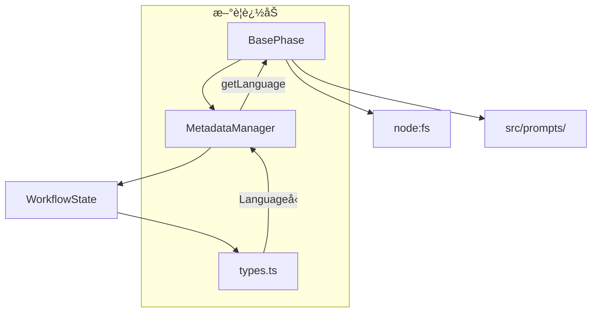

# Codex Agent 実行ログ

開始日時: 2025/12/30 3:20:45

---

## Turn 1: スレッド開始

**Thread ID**: `[REDACTED_TOKEN]`

## Turn 2: ツール実行

**種別**: reasoning
**ステータス**: completed

## Turn 3: ツール実行

**種別**: コãƒãƒ³ãƒ‰å®Ÿè¡Œ
**コãƒãƒ³ãƒ‰**: `/bin/bash -lc 'cd /tmp/ai-workflow-repos-138-6353c320/ai-workflow-agent && ls .ai-workflow/issue-571/04_implementation/output'`
**ステータス**: completed (exit_code=0)

```text
implementation.md
```

## Turn 4: ツール実行

**種別**: reasoning
**ステータス**: completed

## Turn 5: ツール実行

**種別**: コãƒãƒ³ãƒ‰å®Ÿè¡Œ
**コãƒãƒ³ãƒ‰**: `/bin/bash -lc 'cd /tmp/ai-workflow-repos-138-6353c320/ai-workflow-agent && cat .ai-workflow/issue-571/04_implementation/output/implementation.md'`
**ステータス**: completed (exit_code=0)

```text
# 実装完了レãƒãƒ¼ãƒˆ

## 変更ファイル一覧

| ファイル | 変更種別 | æ¦‚è¦ |
|---------|---------|------|
| `src/types.ts` | 修正 | プロンプト言èªç”¨ã®`Language`å‹ã¨`DEFAULT_LANGUAGE`を追加ã—メタデータå‹ã«è¨€èªã‚’許容 |
| `src/core/metadata-manager.ts` | 修正 | 言èªè¨­å®šã‚’å–å¾—ã™ã‚‹`getLanguage()`を実装ã—デフォルトフォールãƒãƒƒã‚¯ã‚’追加 |
| `src/phases/base-phase.ts` | 修正 | `loadPrompt`を言èªå¯¾å¿œã•ã›ä¸è¶³æ™‚ã«ãƒ‡ãƒ•ã‚©ãƒ«ãƒˆã¸ãƒ•ã‚©ãƒ¼ãƒ«ãƒãƒƒã‚¯ã™ã‚‹ã‚ˆã†æ›´æ–° |
| `src/prompts/*/ja/*.txt` | 移動 | å„フェーズã®æ—¢å­˜ãƒ—ロンプトを言èªãƒ‡ã‚£ãƒ¬ã‚¯ãƒˆãƒªé…下ã«å†é…ç½® |
| `src/prompts/*/en/*.txt` | æ–°è¦ | 10フェーズ分ã®è‹±èªãƒ—ロンプトを追加 |

## 主è¦ãªå¤‰æ›´ç‚¹
- プロンプトディレクトリを`{phase}/{lang}/`構造ã«æ•´ç†ã—日本èªãƒ•ã‚¡ã‚¤ãƒ«ã‚’`ja/`ã¸ç§»å‹•ã€è‹±èªç‰ˆã‚’追加。
- `Language`å‹ã¨`DEFAULT_LANGUAGE`を定義ã—ã€ãƒ¡ã‚¿ãƒ‡ãƒ¼ã‚¿ã‹ã‚‰ã®è¨€èªå–å¾—ã«ãƒ•ã‚©ãƒ¼ãƒ«ãƒãƒƒã‚¯å‡¦ç†ã‚’追加。
- `BasePhase.loadPrompt`ãŒè¨€èªè¨­å®šã«å¿œã˜ã¦ãƒ—ロンプトを読ã¿è¾¼ã¿ã€æŒ‡å®šè¨€èªãŒç„¡ã„å ´åˆã¯æ—¥æœ¬èªã¸è­¦å‘Šä»˜ãã§ãƒ•ã‚©ãƒ¼ãƒ«ãƒãƒƒã‚¯ã™ã‚‹ã‚ˆã†ã«å¤‰æ›´ã€‚

## テスト実施状æ³
- ビルド: 未実行（ä¾é ¼ãªã—）
- リント: 未実行（ä¾é ¼ãªã—）
- 基本動作確èª: プロンプト構造ã¨èª­ã¿è¾¼ã¿ãƒ­ã‚¸ãƒƒã‚¯ã®å¤‰æ›´ã®ã¿ã®ãŸã‚手動テストã¯æœªå®Ÿæ–½
```

## Turn 6: ツール実行

**種別**: reasoning
**ステータス**: completed

## Turn 7: ツール実行

**種別**: コãƒãƒ³ãƒ‰å®Ÿè¡Œ
**コãƒãƒ³ãƒ‰**: `/bin/bash -lc 'cd /tmp/ai-workflow-repos-138-6353c320/ai-workflow-agent && git status --short'`
**ステータス**: completed (exit_code=0)

```text
M .ai-workflow/issue-571/00_planning/output/planning.md
 M .ai-workflow/issue-571/metadata.json
 D src/prompts/design/execute.txt
 D src/prompts/design/review.txt
 D src/prompts/design/revise.txt
 D src/prompts/documentation/execute.txt
 D src/prompts/documentation/review.txt
 D src/prompts/documentation/revise.txt
 D src/prompts/evaluation/execute.txt
 D src/prompts/evaluation/review.txt
 D src/prompts/evaluation/revise.txt
 D src/prompts/implementation/execute.txt
 D src/prompts/implementation/review.txt
 D src/prompts/implementation/revise.txt
 D src/prompts/planning/execute.txt
 D src/prompts/planning/review.txt
 D src/prompts/planning/revise.txt
 D src/prompts/report/execute.txt
 D src/prompts/report/review.txt
 D src/prompts/report/revise.txt
 D src/prompts/requirements/execute.txt
 D src/prompts/requirements/review.txt
 D src/prompts/requirements/revise.txt
 D src/prompts/test_implementation/execute.txt
 D src/prompts/test_implementation/review.txt
 D src/prompts/test_implementation/revise.txt
 D src/prompts/test_scenario/execute.txt
 D src/prompts/test_scenario/review.txt
 D src/prompts/test_scenario/revise.txt
 D src/prompts/testing/execute.txt
 D src/prompts/testing/review.txt
 D src/prompts/testing/revise.txt
?? .ai-workflow/issue-571/00_planning/execute/agent_log_raw.txt
?? .ai-workflow/issue-571/00_planning/execute/prompt.txt
?? .ai-workflow/issue-571/00_planning/review/agent_log_raw.txt
?? .ai-workflow/issue-571/00_planning/review/prompt.txt
?? .ai-workflow/issue-571/01_requirements/execute/agent_log_raw.txt
?? .ai-workflow/issue-571/01_requirements/execute/prompt.txt
?? .ai-workflow/issue-571/01_requirements/review/agent_log_raw.txt
?? .ai-workflow/issue-571/01_requirements/review/prompt.txt
?? .ai-workflow/issue-571/02_design/execute/agent_log_raw.txt
?? .ai-workflow/issue-571/02_design/execute/prompt.txt
?? .ai-workflow/issue-571/02_design/review/agent_log_raw.txt
?? .ai-workflow/issue-571/02_design/review/prompt.txt
?? .ai-workflow/issue-571/03_test_scenario/execute/agent_log_raw.txt
?? .ai-workflow/issue-571/03_test_scenario/execute/prompt.txt
?? .ai-workflow/issue-571/03_test_scenario/review/agent_log_raw.txt
?? .ai-workflow/issue-571/03_test_scenario/review/prompt.txt
?? .ai-workflow/issue-571/04_implementation/execute/agent_log_raw.txt
?? .ai-workflow/issue-571/04_implementation/execute/prompt.txt
?? .ai-workflow/issue-571/04_implementation/review/
?? .ai-workflow/issue-571/04_implementation/revise/
```

## Turn 8: ツール実行

**種別**: reasoning
**ステータス**: completed

## Turn 9: ツール実行

**種別**: コãƒãƒ³ãƒ‰å®Ÿè¡Œ
**コãƒãƒ³ãƒ‰**: `/bin/bash -lc "cd /tmp/ai-workflow-repos-138-6353c320/ai-workflow-agent && sed -n '1,200p' .ai-workflow/issue-571/02_design/output/design.md"`
**ステータス**: completed (exit_code=0)

```text
# 詳細設計書: Issue #571

## Implement prompt file switching based on language setting

---

## 0. Planning Documentã®ç¢ºèª

本設計書ã¯ã€Planning Phaseæˆæœç‰©ï¼ˆ`.ai-workflow/issue-571/00_planning/output/planning.md`）ãŠã‚ˆã³è¦ä»¶å®šç¾©æ›¸ï¼ˆ`.ai-workflow/issue-571/01_requirements/output/requirements.md`）ã®è¨ˆç”»ã«åŸºã¥ã„ã¦ä½œæˆã•ã‚Œã¦ã„ã¾ã™ã€‚

### 開発計画ã®æ¦‚è¦

| 項目 | 内容 |
|------|------|
| **複雑度** | 中程度 |
| **見ç©ã‚‚り工数** | 12〜16時間 |
| **実装戦略** | EXTEND（既存ã®`loadPrompt()`メソッドを拡張） |
| **テスト戦略** | UNIT_INTEGRATION |
| **テストコード戦略** | CREATE_TEST |

---

## 1. 既存コードベース分æ

### 1.1 ç¾çŠ¶ã®å®Ÿè£…

#### BasePhase.loadPrompt() メソッド

**ファイル**: `src/phases/base-phase.ts` (lines 291-320)

```typescript
protected loadPrompt(promptType: 'execute' | 'review' | 'revise'): string {
  const promptPath = path.join(promptsRoot, this.phaseName, `${promptType}.txt`);
  if (!fs.existsSync(promptPath)) {
    throw new Error(`Prompt file not found: ${promptPath}`);
  }

  let prompt = fs.readFileSync(promptPath, 'utf-8');

  // Issue #177: 環境情報ã®æ³¨å…¥ï¼ˆexecute ステップã®ã¿ï¼‰
  if (promptType === 'execute' && config.[REDACTED_TOKEN]()) {
    const environmentInfo = this.[REDACTED_TOKEN]();
    prompt = environmentInfo + '\n\n' + prompt;
    // ...
  }

  // Issue #90: å·®ã—戻ã—コンテキストã®æ³¨å…¥
  if (promptType === 'revise') {
    // ...
  }

  return prompt;
}
```

**ç¾çŠ¶ã®å•é¡Œ**:
- パス解決: `promptsRoot/{phaseName}/{promptType}.txt` （言èªè€ƒæ…®ãªã—）
- 言èªè¨­å®šã‚’一切å‚ç…§ã—ã¦ã„ãªã„
- 日本èªãƒ—ロンプトã®ã¿å­˜åœ¨

#### MetadataManager クラス

**ファイル**: `src/core/metadata-manager.ts`

**é‡è¦ãªç™ºè¦‹**: `getLanguage()` メソッドã¯**存在ã—ãªã„**。Issue #526ã§å®Ÿè£…済ã¿ã¨ã®å‰æã ã£ãŸãŒã€å®Ÿéš›ã«ã¯æœªå®Ÿè£…。

**ç¾åœ¨ã®WorkflowMetadataå‹** (`src/types.ts`):
```typescript
export interface WorkflowMetadata {
  issue_number: string;
  issue_url: string;
  issue_title: string;
  // ...
  // language フィールドã¯å­˜åœ¨ã—ãªã„
}
```

#### プロンプトファイル構造

**ç¾çŠ¶**: `src/prompts/{phase}/{promptType}.txt`

```
src/prompts/
├── planning/
│   ├── execute.txt
│   ├── review.txt
│   └── revise.txt
├── requirements/
│   ├── execute.txt
│   ├── review.txt
│   └── revise.txt
├── design/
├── test_scenario/
├── implementation/
├── test_implementation/
├── testing/
├── documentation/
├── report/
└── evaluation/
```

#### copy-static-assets.mjs

**ファイル**: `scripts/copy-static-assets.mjs`

```javascript
const assets = [
  // ...
  {
    source: path.join(projectRoot, 'src', 'prompts'),
    target: path.join(distDir, 'prompts'),
  },
];

await fsp.cp(asset.source, asset.target, {
  recursive: true,
  force: true,
});
```

**評価**: `recursive: true` オプションã«ã‚ˆã‚Šã€å¤šè¨€èªãƒ‡ã‚£ãƒ¬ã‚¯ãƒˆãƒªæ§‹é€ ã‚‚ãã®ã¾ã¾ã‚³ãƒ”ーã•ã‚Œã‚‹ã€‚**変更ä¸è¦**。

### 1.2 影響範囲ã®ç‰¹å®š

| コンãƒãƒ¼ãƒãƒ³ãƒˆ | 影響 | 変更内容 |
|--------------|------|---------|
| `src/types.ts` | 中 | `Language` å‹ã€`DEFAULT_LANGUAGE` 定数ã®è¿½åŠ  |
| `src/core/metadata-manager.ts` | 中 | `getLanguage()` メソッドã®è¿½åŠ  |
| `src/phases/base-phase.ts` | 高 | `loadPrompt()` メソッドã®å¤šè¨€èªå¯¾å¿œ |
| `src/prompts/**/*` | 高 | ディレクトリ構造変更（60ファイル） |
| `scripts/copy-static-assets.mjs` | ä½ | **変更ä¸è¦**（既存ã®å†å¸°ã‚³ãƒ”ーã§å¯¾å¿œï¼‰ |

### 1.3 ä¾å­˜é–¢ä¿‚ã®ç¢ºèª



---

## 2. 実装戦略判断

### 実装戦略: **EXTEND**

**判断根拠**:
1. **既存メソッドã®æ‹¡å¼µãŒä¸­å¿ƒ**: `BasePhase.loadPrompt()` ã®æ—¢å­˜å®Ÿè£…を維æŒã—ã¤ã¤ã€è¨€èªãƒ‘ラメータã«ã‚ˆã‚‹ãƒ‘ス解決ロジックを追加
2. **既存パターンã®è¸è¥²**: Issue #177（環境情報注入）やIssue #90（差ã—戻ã—コンテキスト注入）ã¨åŒæ§˜ã®æ³¨å…¥ãƒ‘ターンをé©ç”¨
3. **MetadataManagerã®æ‹¡å¼µ**: 既存クラス㫠`getLanguage()` メソッドを追加（新è¦ã‚¯ãƒ©ã‚¹ä½œæˆä¸è¦ï¼‰
4. **ファイル構造変更ã®ã¿**: 既存ã®æ—¥æœ¬èªãƒ—ロンプトを `{phase}/ja/` ã«ç§»å‹•ã—ã€è‹±èªç‰ˆã‚’ `{phase}/en/` ã«æ–°è¦ä½œæˆ
5. **ビルドスクリプト変更ä¸è¦**: `copy-static-assets.mjs` ã¯æ—¢å­˜ã®å†å¸°ã‚³ãƒ”ーã§å¯¾å¿œå¯èƒ½

**CREATE ã‚’é¸æŠã—ãªã‹ã£ãŸç†ç”±**:
- æ–°è¦ã‚³ãƒ³ãƒãƒ¼ãƒãƒ³ãƒˆä½œæˆã¯ä¸è¦
- 既存㮠`loadPrompt()` メソッドã®è²¬å‹™ã‚’維æŒ

**REFACTOR ã‚’é¸æŠã—ãªã‹ã£ãŸç†ç”±**:
- 既存コードã®æ§‹é€ æ”¹å–„ãŒç›®çš„ã§ã¯ãªãã€æ©Ÿèƒ½è¿½åŠ ãŒç›®çš„
- 既存ã®è¨­è¨ˆãƒ‘ターンã¯é©åˆ‡

---

## 3. テスト戦略判断

### テスト戦略: **UNIT_INTEGRATION**

**判断根拠**:
1. **ユニットテストãŒå¿…è¦ãªç†ç”±**:
   - `loadPrompt()` ã®ãƒ‘ス解決ロジックã¯å˜ä½“ã§ãƒ†ã‚¹ãƒˆå¯èƒ½
   - フォールãƒãƒƒã‚¯å‹•ä½œã®å¢ƒç•Œå€¤ãƒ†ã‚¹ãƒˆãŒå¿…è¦
   - `MetadataManager.getLanguage()` ã®å˜ä½“テスト

2. **çµ±åˆãƒ†ã‚¹ãƒˆãŒå¿…è¦ãªç†ç”±**:
   - 実際ã®ãƒ—ロンプトファイル構造ã§ã®èª­ã¿è¾¼ã¿ç¢ºèª
   - å…¨10フェーズã§ã®å¤šè¨€èªåˆ‡ã‚Šæ›¿ãˆã®å‹•ä½œç¢ºèª
   - ビルド後（`dist/prompts/`
... (truncated)
```

## Turn 10: ツール実行

**種別**: reasoning
**ステータス**: completed

## Turn 11: ツール実行

**種別**: コãƒãƒ³ãƒ‰å®Ÿè¡Œ
**コãƒãƒ³ãƒ‰**: `/bin/bash -lc 'cd /tmp/ai-workflow-repos-138-6353c320/ai-workflow-agent && rg "DEFAULT_LANGUAGE" -n src'`
**ステータス**: failed (exit_code=127)

```text
/bin/bash: line 1: rg: command not found
```

## Turn 12: ツール実行

**種別**: reasoning
**ステータス**: completed

## Turn 13: ツール実行

**種別**: コãƒãƒ³ãƒ‰å®Ÿè¡Œ
**コãƒãƒ³ãƒ‰**: `/bin/bash -lc 'cd /tmp/ai-workflow-repos-138-6353c320/ai-workflow-agent && grep -R "DEFAULT_LANGUAGE" -n src'`
**ステータス**: completed (exit_code=0)

```text
src/core/metadata-manager.ts:16:  DEFAULT_LANGUAGE,
src/core/metadata-manager.ts:226:    return DEFAULT_LANGUAGE;
src/phases/base-phase.ts:17:  DEFAULT_LANGUAGE,
src/phases/base-phase.ts:298:      const fallbackPath = path.join(promptsRoot, this.phaseName, DEFAULT_LANGUAGE, `${promptType}.txt`);
src/phases/base-phase.ts:305:        `Prompt not found for language '${language}', falling back to '${DEFAULT_LANGUAGE}': ${promptPath}`
src/types.ts:28:export const DEFAULT_LANGUAGE: Language = 'ja';
```

## Turn 14: ツール実行

**種別**: reasoning
**ステータス**: completed

## Turn 15: ツール実行

**種別**: コãƒãƒ³ãƒ‰å®Ÿè¡Œ
**コãƒãƒ³ãƒ‰**: `/bin/bash -lc "cd /tmp/ai-workflow-repos-138-6353c320/ai-workflow-agent && sed -n '1,200p' src/types.ts"`
**ステータス**: completed (exit_code=0)

```text
export type PhaseName =
  | 'planning'
  | 'requirements'
  | 'design'
  | 'test_scenario'
  | 'implementation'
  | 'test_implementation'
  | 'testing'
  | 'documentation'
  | 'report'
  | 'evaluation';

export type PhaseStatus = 'pending' | 'in_progress' | 'completed' | 'failed';

// Issue #10: ステップåã®å‹å®šç¾©
export type StepName = 'execute' | 'review' | 'revise';

export type DifficultyLevel = 'simple' | 'moderate' | 'complex';

/**
 * Supported language codes for prompts (Issue #571)
 */
export type Language = 'ja' | 'en';

/**
 * Default language used when no valid preference is set
 */
export const DEFAULT_LANGUAGE: Language = 'ja';

export interface [REDACTED_TOKEN] {
  level: DifficultyLevel;
  confidence: number;
  factors: {
    estimated_file_changes: number;
    scope: 'single_file' | 'single_module' | 'multiple_modules' | 'cross_cutting';
    requires_tests: boolean;
    requires_architecture_change: boolean;
    complexity_score: number;
  };
  analyzed_at: string;
  analyzer_agent: 'claude' | 'codex';
  analyzer_model: string;
}

export interface StepModelConfig {
  claudeModel: 'opus' | 'sonnet';
  codexModel: 'max' | 'mini';
}

export interface PhaseModelConfig {
  execute: StepModelConfig;
  review: StepModelConfig;
  revise: StepModelConfig;
}

export type ModelConfigByPhase = {
  [phase in PhaseName]?: PhaseModelConfig;
};

export interface PhaseMetadata {
  status: PhaseStatus;
  retry_count: number;
  started_at: string | null;
  completed_at: string | null;
  review_result: string | null;
  output_files?: string[];
  // Issue #10: ステップå˜ä½ã®é€²æ—管ç†
  current_step?: StepName | null;  // ç¾åœ¨å®Ÿè¡Œä¸­ã®ã‚¹ãƒ†ãƒƒãƒ—（実行中ã§ãªã„å ´åˆã¯null）
  completed_steps?: StepName[];     // 完了済ã¿ã‚¹ãƒ†ãƒƒãƒ—ã®é…列（実行順åºã‚’ä¿æŒï¼‰
  // Issue #90: å·®ã—戻ã—コンテキスト（オプショナル）
  rollback_context?: import('./types/commands.js').RollbackContext | null;
}

/**
 * フォローアップ Issue ã®èƒŒæ™¯ã‚³ãƒ³ãƒ†ã‚­ã‚¹ãƒˆ
 * Evaluation Phase ã‹ã‚‰ IssueClient ã«æ¸¡ã•ã‚Œã‚‹
 */
export interface IssueContext {
  /**
   * å…ƒ Issue ã®æ¦‚è¦
   * 例: "Issue #91 ã§ã¯ã€BasePhase モジュール分解（Issue #49）ã§ç™ºç”Ÿã—㟠15 件ã®ãƒ†ã‚¹ãƒˆå¤±æ•—を修正ã—ã¾ã—ãŸã€‚"
   */
  summary: string;

  /**
   * ブロッカーã®ã‚¹ãƒ†ãƒ¼ã‚¿ã‚¹
   * 例: "ã™ã¹ã¦ã®ãƒ–ロッカーã¯è§£æ±ºæ¸ˆã¿"
   */
  blockerStatus: string;

  /**
   * タスクãŒæ®‹ã£ãŸç†ç”±
   * 例: "テスト失敗修正を優先ã—ãŸãŸã‚ã€ã‚«ãƒãƒ¬ãƒƒã‚¸æ”¹å–„ã¯å¾Œå›ã—ã«ã—ãŸ"
   */
  deferredReason: string;
}

/**
 * Evaluation Phase ã§æ¤œå‡ºã•ã‚ŒãŸæ®‹ã‚¿ã‚¹ã‚¯
 */
export interface RemainingTask {
  // ===== 既存フィールド（必須） =====
  /** タスクã®èª¬æ˜ */
  task: string;

  /** 対象フェーズ（例: "implementation", "testing"） */
  phase: string;

  /** 優先度（例: "High", "Medium", "Low"） */
  priority: string;

  // ===== æ–°è¦ãƒ•ã‚£ãƒ¼ãƒ«ãƒ‰ï¼ˆã™ã¹ã¦ã‚ªãƒ—ショナル） =====

  /**
   * 優先度ã®ç†ç”±
   * 例: "å…ƒ Issue #91 ã®æ¨å¥¨äº‹é …ã€ãƒ–ロッカーã§ã¯ãªã„"
   */
  priorityReason?: string;

  /**
   * 対象ファイル/モジュールã®ãƒªã‚¹ãƒˆ
   * 例: ["src/core/phase-factory.ts", "src/commands/execute/agent-setup.ts"]
   */
  targetFiles?: string[];

  /**
   * 実行手順（番å·ä»˜ãリスト）
   * 例: ["ä¸è¶³ã—ã¦ã„るテストケースを特定", "エッジケースã®ãƒ†ã‚¹ãƒˆã‚’追加"]
   */
  steps?: string[];

  /**
   * å—ã‘入れ基準（Acceptance Criteria）
   * 例: ["ã™ã¹ã¦ã®å¯¾è±¡ãƒ¢ã‚¸ãƒ¥ãƒ¼ãƒ«ã§ 90% 以上ã®ã‚«ãƒãƒ¬ãƒƒã‚¸ã‚’é”æˆ", "npm run test:coverage ãŒã™ã¹ã¦ãƒ‘ス"]
   */
  acceptanceCriteria?: string[];

  /**
   * ä¾å­˜ã‚¿ã‚¹ã‚¯
   * 例: ["Task 1 完了後ã«å®Ÿè¡Œ", "Phase 4 ã®ä¿®æ­£ãŒå¿…è¦"]
   */
  dependencies?: string[];

  /**
   * 見ç©ã‚‚り工数
   * 例: "2-4h", "1日", "0.5h"
   */
  estimatedHours?: string;
}

export interface [REDACTED_TOKEN] {
  enabled: boolean;
  provider: 'auto' | 'openai' | 'claude' | 'agent';
  model?: string;
  temperature?: number;
  maxOutputTokens?: number;
  timeoutMs?: number;
  maxRetries?: number;
  maxTasks?: number;
  appendMetadata?: boolean;
}

export interface [REDACTED_TOKEN] {
  title: string;
  body: string;
  metadata: {
    provider: 'openai' | 'claude';
    model: string;
    durationMs: number;
    retryCount: number;
    inputTokens?: number;
    outputTokens?: number;
    omittedTasks?: number;
  };
}

export interface [REDACTED_TOKEN] extends PhaseMetadata {
  decision: string | null;
  failed_phase: PhaseName | null;
  remaining_tasks: RemainingTask[];
  created_issue_url: string | null;
  abort_reason: string | null;
}

export type P
... (truncated)
```

## Turn 16: ツール実行

**種別**: コãƒãƒ³ãƒ‰å®Ÿè¡Œ
**コãƒãƒ³ãƒ‰**: `/bin/bash -lc "cd /tmp/ai-workflow-repos-138-6353c320/ai-workflow-agent && sed -n '200,420p' src/core/metadata-manager.ts"`
**ステータス**: completed (exit_code=0)

```text
this.state.data.difficulty_analysis = result;
    this.state.save();
  }

  public [REDACTED_TOKEN](): [REDACTED_TOKEN] | null {
    return this.state.data.difficulty_analysis ?? null;
  }

  public setModelConfig(config: ModelConfigByPhase | null): void {
    this.state.data.model_config = config;
    this.state.save();
  }

  public getModelConfig(): ModelConfigByPhase | null {
    return this.state.data.model_config ?? null;
  }

  /**
   * Get preferred language for prompt loading (Issue #571)
   */
  public getLanguage(): Language {
    const metadataLanguage = (this.state.data as WorkflowMetadata & { language?: string }).language;
    if (metadataLanguage === 'ja' || metadataLanguage === 'en') {
      return metadataLanguage;
    }

    return DEFAULT_LANGUAGE;
  }

  public getPhaseStatus(phaseName: PhaseName): PhaseStatus {
    return this.state.getPhaseStatus(phaseName);
  }

  public setDesignDecision(key: string, value: string): void {
    this.state.setDesignDecision(key, value);
    this.state.save();
  }

  public incrementRetryCount(phaseName: PhaseName): number {
    const count = this.state.incrementRetryCount(phaseName);
    this.state.save();
    return count;
  }

  public clear(): void {
    if (fs.existsSync(this.metadataPath)) {
      logger.info(`Clearing metadata: ${this.metadataPath}`);
      fs.rmSync(this.metadataPath, { force: true });
    }

    [REDACTED_TOKEN](this.workflowDir);
    if (!fs.existsSync(this.workflowDir)) {
      logger.info('Workflow directory removed successfully');
    }
  }

  public rollbackToPhase(phaseName: PhaseName) {
    const phases = Object.keys(this.state.data.phases) as PhaseName[];
    if (!phases.includes(phaseName)) {
      return {
        success: false,
        error: `Invalid phase name: ${phaseName}`,
        backup_path: null,
        rolled_back_phases: [] as PhaseName[],
      };
    }

    const backupPath = backupMetadataFile(this.metadataPath);

    const startIndex = phases.indexOf(phaseName);
    const rolledBack = phases.slice(startIndex);

    for (const phase of rolledBack) {
      const phaseData = this.ensurePhaseData(phase);
      phaseData.status = 'pending';
      phaseData.started_at = null;
      phaseData.completed_at = null;
      phaseData.review_result = null;
      phaseData.retry_count = 0;
      // Issue #208: completed_steps 㨠current_step ã®ãƒªã‚»ãƒƒãƒˆè¿½åŠ 
      phaseData.current_step = null;
      phaseData.completed_steps = [];
      phaseData.rollback_context = null; // Issue #208: consistency確ä¿
    }

    this.state.save();

    logger.info(`metadata.json rolled back to phase ${phaseName}`);
    logger.info(`Phases reset: ${rolledBack.join(', ')}`);

    return {
      success: true,
      backup_path: backupPath,
      rolled_back_phases: rolledBack,
      error: null,
    };
  }

  public getAllPhasesStatus(): Record<PhaseName, PhaseStatus> {
    const result = {} as Record<PhaseName, PhaseStatus>;
    for (const [phase, data] of Object.entries(this.state.data.phases)) {
      result[phase as PhaseName] = data.status;
    }
    return result;
  }

  public backupMetadata(): string {
    return backupMetadataFile(this.metadataPath);
  }

  public [REDACTED_TOKEN](options: {
    decision: string;
    failedPhase?: PhaseName | null;
    remainingTasks?: RemainingTask[] | null;
    createdIssueUrl?: string | null;
    abortReason?: string | null;
  }): void {
    const evaluation = this.ensurePhaseData('evaluation') as [REDACTED_TOKEN];
    if (!evaluation) {
      throw new Error('Evaluation phase not found in metadata');
    }

    evaluation.decision = options.decision;

    if (options.failedPhase !== undefined) {
      evaluation.failed_phase = options.failedPhase ?? null;
    }

    if (options.remainingTasks !== undefined) {
      evaluation.remaining_tasks = options.remainingTasks ?? [];
    }

    if (options.createdIssueUrl !== undefined) {
      evaluation.created_issue_url = options.createdIssueUr
... (truncated)
```

## Turn 17: ツール実行

**種別**: reasoning
**ステータス**: completed

## Turn 18: ツール実行

**種別**: コãƒãƒ³ãƒ‰å®Ÿè¡Œ
**コãƒãƒ³ãƒ‰**: `/bin/bash -lc "cd /tmp/ai-workflow-repos-138-6353c320/ai-workflow-agent && sed -n '250,360p' src/phases/base-phase.ts"`
**ステータス**: completed (exit_code=0)

```text
protected abstract review(): Promise<[REDACTED_TOKEN]>;

  protected async shouldRunReview(): Promise<boolean> {
    return true;
  }

  public async run(options: PhaseRunOptions = {}): Promise<boolean> {
    // StepExecutor 㨠PhaseRunner ã®é…延åˆæœŸåŒ–（Issue #49）
    if (!this.stepExecutor) {
      this.stepExecutor = new StepExecutor(
        this.phaseName,
        this.metadata,
        this.reviewCycleManager,
        async () => this.runWithStepModel('execute', () => this.execute()),
        async () => this.runWithStepModel('review', () => this.review()),
        async () => this.shouldRunReview()
      );
    }

    if (!this.phaseRunner) {
      const reviseHandler = this.getReviseFunction();
      const wrappedRevise =
        reviseHandler !== null
          ? (feedback: string) => this.runWithStepModel('revise', () => reviseHandler(feedback))
          : null;

      this.phaseRunner = new PhaseRunner(
        this.phaseName,
        this.metadata,
        this.github,
        this.stepExecutor,
        this.skipDependencyCheck,
        this.ignoreDependencies,
        this.presetPhases,
        wrappedRevise
      );
    }

    // PhaseRunner ã«å§”譲（Issue #49）
    return this.phaseRunner.run(options);
  }

  protected loadPrompt(promptType: 'execute' | 'review' | 'revise'): string {
    const language = this.metadata.getLanguage();
    const promptPath = path.join(promptsRoot, this.phaseName, language, `${promptType}.txt`);
    let resolvedPath = promptPath;

    if (!fs.existsSync(promptPath)) {
      const fallbackPath = path.join(promptsRoot, this.phaseName, DEFAULT_LANGUAGE, `${promptType}.txt`);

      if (!fs.existsSync(fallbackPath)) {
        throw new Error(`Prompt file not found: ${promptPath} (fallback also failed: ${fallbackPath})`);
      }

      logger.warn(
        `Prompt not found for language '${language}', falling back to '${DEFAULT_LANGUAGE}': ${promptPath}`
      );
      resolvedPath = fallbackPath;
    }

    let prompt = fs.readFileSync(resolvedPath, 'utf-8');

    // Issue #177: 環境情報ã®æ³¨å…¥ï¼ˆexecute ステップã®ã¿ã€ãƒ‘ッケージインストールå¯èƒ½æ™‚）
    if (promptType === 'execute' && config.[REDACTED_TOKEN]()) {
      const environmentInfo = this.[REDACTED_TOKEN]();
      prompt = environmentInfo + '\n\n' + prompt;

      logger.info(`Environment info injected into execute prompt for phase ${this.phaseName}`);
    }

    // Issue #90: å·®ã—戻ã—コンテキストãŒã‚ã‚‹å ´åˆã€ãƒ—ロンプトã®å…ˆé ­ã«è¿½åŠ 
    // revise ステップã®ã¿ã«å·®ã—戻ã—情報を注入
    if (promptType === 'revise') {
      const rollbackContext = this.metadata.getRollbackContext(this.phaseName);
      if (rollbackContext) {
        const rollbackSection = this.[REDACTED_TOKEN](rollbackContext);
        prompt = rollbackSection + '\n\n' + prompt;

        logger.info(`Rollback context injected into revise prompt for phase ${this.phaseName}`);
      }
    }

    return prompt;
  }

  /**
   * Issue #177: 環境情報セクションã®Markdownを生æˆ
   * @returns 環境情報セクションã®Markdown文字列
   * @private
   */
  private [REDACTED_TOKEN](): string {
    return `## ğŸ› ï¸ é–‹ç™ºç’°å¢ƒæƒ…å ±

ã“ã®Docker環境ã§ã¯ã€ä»¥ä¸‹ã®ãƒ—ログラミング言èªã‚’インストールå¯èƒ½ã§ã™ï¼š

- **Python**: \`apt-get update && apt-get install -y python3 python3-pip\`
- **Go**: \`apt-get update && apt-get install -y golang-go\`
- **Java**: \`apt-get update && apt-get install -y default-jdk\`
- **Rust**: \`curl --proto '=https' --tlsv1.2 -sSf https://sh.rustup.rs | sh -s -- -y\`
- **Ruby**: \`apt-get update && apt-get install -y ruby ruby-dev\`

テスト実行やå“質ãƒã‚§ãƒƒã‚¯ã«å¿…è¦ãªè¨€èªç’°å¢ƒã¯ã€è‡ªç”±ã«ã‚¤ãƒ³ã‚¹ãƒˆãƒ¼ãƒ«ã—ã¦ãã ã•ã„。`;
  }

  /**
   * Issue #90: å·®ã—戻ã—情報をMarkdownå½¢å¼ã§ç”Ÿæˆ
   * @param context - å·®ã—戻ã—コンテキスト
   * @returns Markdownå½¢å¼ã®å·®ã—戻ã—情報
   */
  protected [REDACTED_TOKEN](
    context: import('../types/commands.js').RollbackContext,
```

## Turn 19: ツール実行

**種別**: reasoning
**ステータス**: completed

## Turn 20: ツール実行

**種別**: コãƒãƒ³ãƒ‰å®Ÿè¡Œ
**コãƒãƒ³ãƒ‰**: `/bin/bash -lc 'cd /tmp/ai-workflow-repos-138-6353c320/ai-workflow-agent && ls src/prompts | head'`
**ステータス**: completed (exit_code=0)

```text
auto-issue
content_parser
design
difficulty
documentation
evaluation
followup
implementation
planning
pr-comment
```

## Turn 21: ツール実行

**種別**: reasoning
**ステータス**: completed

## Turn 22: ツール実行

**種別**: コãƒãƒ³ãƒ‰å®Ÿè¡Œ
**コãƒãƒ³ãƒ‰**: `/bin/bash -lc 'cd /tmp/ai-workflow-repos-138-6353c320/ai-workflow-agent && ls src/prompts/design | head'`
**ステータス**: completed (exit_code=0)

```text
en
ja
```

## Turn 23: ツール実行

**種別**: reasoning
**ステータス**: completed

## Turn 24: ツール実行

**種別**: コãƒãƒ³ãƒ‰å®Ÿè¡Œ
**コãƒãƒ³ãƒ‰**: `/bin/bash -lc 'cd /tmp/ai-workflow-repos-138-6353c320/ai-workflow-agent && ls src/prompts/design/en | head'`
**ステータス**: completed (exit_code=0)

```text
execute.txt
review.txt
revise.txt
```

## Turn 25: ツール実行

**種別**: reasoning
**ステータス**: completed

## Turn 26: ツール実行

**種別**: コãƒãƒ³ãƒ‰å®Ÿè¡Œ
**コãƒãƒ³ãƒ‰**: `/bin/bash -lc 'cd /tmp/ai-workflow-repos-138-6353c320/ai-workflow-agent && grep -n "language" -n .ai-workflow/issue-571/02_design/output/design.md'`
**ステータス**: completed (exit_code=0)

```text
3:## Implement prompt file switching based on language setting
74:  // language フィールドã¯å­˜åœ¨ã—ãªã„
206:   - Issue本文㧠`tests/integration/[REDACTED_TOKEN].test.ts` ãŒæŒ‡å®šã•ã‚Œã¦ã„ã‚‹
213:   - `tests/unit/phases/base-phase-language-switching.test.ts`（ユニットテスト）
214:   - `tests/integration/[REDACTED_TOKEN].test.ts`（統åˆãƒ†ã‚¹ãƒˆï¼‰
350:| **metadata.json変更** | 既存㮠`language` フィールドå‚照（Issue #526ã§è¿½åŠ æ¸ˆã¿æƒ³å®šï¼‰ |
360:| `tests/unit/phases/base-phase-language-switching.test.ts` | ユニットテスト（loadPrompt多言èªå¯¾å¿œï¼‰ |
361:| `tests/integration/[REDACTED_TOKEN].test.ts` | çµ±åˆãƒ†ã‚¹ãƒˆï¼ˆå…¨ãƒ•ã‚§ãƒ¼ã‚ºå¤šè¨€èªåˆ‡ã‚Šæ›¿ãˆï¼‰ |
425: * 1. metadata.json 㮠language フィールド
429: * const language = metadataManager.getLanguage();
430: * // Returns: 'en' (if metadata.language === 'en')
431: * // Returns: 'ja' (if metadata.language is undefined or 'ja')
434:  const metadataLanguage = (this.state.data as any).language;
446:- `WorkflowMetadata` å‹ã« `language` フィールドãŒå­˜åœ¨ã—ãªã„å ´åˆã§ã‚‚ã€`any` キャストã§å®‰å…¨ã«ã‚¢ã‚¯ã‚»ã‚¹
459:  const language = this.metadata.getLanguage();
462:  const promptPath = path.join(promptsRoot, this.phaseName, language, `${promptType}.txt`);
475:      `Prompt not found for language '${language}', falling back to '${DEFAULT_LANGUAGE}': ${promptPath}`
567:  const metadataLanguage = (this.state.data as any).language;
652:1. ユニットテスト: `tests/unit/phases/base-phase-language-switching.test.ts`
653:2. çµ±åˆãƒ†ã‚¹ãƒˆ: `tests/integration/[REDACTED_TOKEN].test.ts`
665:### 12.1 ユニットテスト（[REDACTED_TOKEN].test.ts）
670:  test('Given language="ja", When loadPrompt("execute") is called, Then ja/execute.txt is loaded');
673:  test('Given language="en", When loadPrompt("execute") is called, Then en/execute.txt is loaded');
676:  test('Given language="fr" and no fr/ directory, When loadPrompt("execute") is called, Then ja/execute.txt is loaded with warning');
682:  test('Given language="en" and [REDACTED_TOKEN]=true, When loadPrompt("execute") is called, Then environment info is injected into en prompt');
685:  test('Given language="en" and rollback context exists, When loadPrompt("revise") is called, Then rollback context is injected into en prompt');
689:### 12.2 çµ±åˆãƒ†ã‚¹ãƒˆï¼ˆ[REDACTED_TOKEN].test.ts）
694:  test('Given language="ja", When all phases load prompts, Then all ja prompts are loaded');
697:  test('Given language="en", When all phases load prompts, Then all en prompts are loaded');
```

## Turn 27: ツール実行

**種別**: reasoning
**ステータス**: completed

## Turn 28: ツール実行

**種別**: コãƒãƒ³ãƒ‰å®Ÿè¡Œ
**コãƒãƒ³ãƒ‰**: `/bin/bash -lc 'cd /tmp/ai-workflow-repos-138-6353c320/ai-workflow-agent && ls tests/unit/phases | head'`
**ステータス**: completed (exit_code=0)

```text
base-phase-fallback.test.ts
[REDACTED_TOKEN].test.ts
[REDACTED_TOKEN].test.ts
base-phase-template.test.ts
cleanup
context
core
formatters
lifecycle
```

## Turn 29: ツール実行

**種別**: reasoning
**ステータス**: completed

## Turn 30: ツール実行

**種別**: コãƒãƒ³ãƒ‰å®Ÿè¡Œ
**コãƒãƒ³ãƒ‰**: `/bin/bash -lc "cd /tmp/ai-workflow-repos-138-6353c320/ai-workflow-agent && sed -n '1,200p' tests/unit/phases/base-phase-fallback.test.ts"`
**ステータス**: completed (exit_code=0)

```text
/**
 * Unit tests for BasePhase fallback mechanism (Issue #113)
 *
 * Tests cover:
 * - [REDACTED_TOKEN](): Log extraction with pattern matching
 * - [REDACTED_TOKEN](): Content validation logic
 * - [REDACTED_TOKEN](): Fallback processing orchestration
 * - [REDACTED_TOKEN](): Integration with enableFallback option
 */

import { describe, it, expect, beforeEach, afterEach, jest } from '@jest/globals';
import fs from 'fs-extra';
import path from 'node:path';
import { BasePhase } from '../../../src/phases/base-phase.js';
import { MetadataManager } from '../../../src/core/metadata-manager.js';
import { GitHubClient } from '../../../src/core/github-client.js';
import { [REDACTED_TOKEN], PhaseName } from '../../../src/types.js';

// Concrete implementation of BasePhase for testing
class TestPhase extends BasePhase {
  constructor(params: any) {
    super({ ...params, phaseName: 'planning' as PhaseName });
  }

  protected async execute(): Promise<[REDACTED_TOKEN]> {
    return { success: true, output: 'test-output.md' };
  }

  protected async review(): Promise<[REDACTED_TOKEN]> {
    return { success: true, output: null };
  }

  public async testRevise(feedback: string): Promise<[REDACTED_TOKEN]> {
    return { success: true, output: 'planning.md' };
  }

  // Expose protected methods for testing
  public [REDACTED_TOKEN](agentLog: string, phaseName: PhaseName): string | null {
    return this.[REDACTED_TOKEN](agentLog, phaseName);
  }

  public [REDACTED_TOKEN](content: string, phaseName: PhaseName): boolean {
    return this.[REDACTED_TOKEN](content, phaseName);
  }

  public [REDACTED_TOKEN](
    phaseOutputFile: string,
    logDir: string
  ): Promise<[REDACTED_TOKEN]> {
    return this.[REDACTED_TOKEN](phaseOutputFile, logDir);
  }

  public [REDACTED_TOKEN]<T extends Record<string, string>>(
    phaseOutputFile: string,
    templateVariables: T,
    options?: { maxTurns?: number; verbose?: boolean; logDir?: string; enableFallback?: boolean }
  ): Promise<[REDACTED_TOKEN]> {
    return this.[REDACTED_TOKEN](phaseOutputFile, templateVariables, options);
  }
}

function ensureDirectory(dir: string): void {
  if (!fs.existsSync(dir)) {
    fs.mkdirSync(dir, { recursive: true });
  }
}

/**
 * Setup file system mock with limited scope.
 *
 * This mock intentionally does NOT mock prompt file reads to prevent
 * "EACCES: permission denied" errors in [REDACTED_TOKEN] tests.
 *
 * Reason: fs.readFileSync mock was affecting loadPrompt() method, causing
 * errors in [REDACTED_TOKEN] tests.
 *
 * Reference: Issue #113 Evaluation Report lines 145-160
 */
function setupFileSystemMock(): void {
  // Note: This function is intentionally empty as we don't want to mock
  // fs.readFileSync for these tests. The original issue was that mocking
  // fs.readFileSync was preventing loadPrompt() from working correctly.
  // By not mocking it at all, we allow the tests to work properly.
}

describe('BasePhase Fallback Mechanism (Issue #113)', () => {
  let testPhase: TestPhase;
  let mockMetadata: jest.Mocked<MetadataManager>;
  let mockGitHub: jest.Mocked<GitHubClient>;
  let testWorkingDir: string;

  beforeEach(() => {
    // Setup test working directory
    testWorkingDir = path.join(process.cwd(), '.test-tmp', 'base-phase-fallback');
    ensureDirectory(testWorkingDir);

    // Mock MetadataManager
    mockMetadata = {
      workflowDir: path.join(testWorkingDir, '.ai-workflow', 'issue-113'),
      data: { issue_number: '113' },
      updatePhaseStatus: jest.fn(),
      getRollbackContext: jest.fn(),
    } as any;

    // Mock GitHubClient
    mockGitHub = {
      getIssueInfo: jest.fn(),
      postComment: jest.fn(),
    } as any;

    // Create TestPhase instance
    testPhase = new TestPhase({
      workingDir: testWorkingDir,
      metadataManager: mockMetadata,
      githubClient: mockGitHub,
    });
  });

  afterEach(() =
... (truncated)
```

## Turn 31: ツール実行

**種別**: reasoning
**ステータス**: completed

## Turn 32: ツール実行

**種別**: コãƒãƒ³ãƒ‰å®Ÿè¡Œ
**コãƒãƒ³ãƒ‰**: `/bin/bash -lc "cd /tmp/ai-workflow-repos-138-6353c320/ai-workflow-agent && sed -n '1,200p' .ai-workflow/issue-571/03_test_scenario/output/test-scenario.md"`
**ステータス**: completed (exit_code=0)

```text
# テストシナリオ: Issue #571

## Implement prompt file switching based on language setting

---

## 0. テスト戦略サãƒãƒªãƒ¼

### é¸æŠã•ã‚ŒãŸãƒ†ã‚¹ãƒˆæˆ¦ç•¥ï¼ˆPhase 2ã‹ã‚‰å¼•ç”¨ï¼‰

**テスト戦略**: **UNIT_INTEGRATION**

**判断根拠**:
1. **ユニットテストãŒå¿…è¦ãªç†ç”±**:
   - `loadPrompt()` ã®ãƒ‘ス解決ロジックã¯å˜ä½“ã§ãƒ†ã‚¹ãƒˆå¯èƒ½
   - フォールãƒãƒƒã‚¯å‹•ä½œã®å¢ƒç•Œå€¤ãƒ†ã‚¹ãƒˆãŒå¿…è¦
   - `MetadataManager.getLanguage()` ã®å˜ä½“テスト

2. **çµ±åˆãƒ†ã‚¹ãƒˆãŒå¿…è¦ãªç†ç”±**:
   - 実際ã®ãƒ—ロンプトファイル構造ã§ã®èª­ã¿è¾¼ã¿ç¢ºèª
   - å…¨10フェーズã§ã®å¤šè¨€èªåˆ‡ã‚Šæ›¿ãˆã®å‹•ä½œç¢ºèª
   - ビルド後（`dist/prompts/`）ã®å‹•ä½œç¢ºèª

3. **BDDテストãŒä¸è¦ãªç†ç”±**:
   - エンドユーザーå‘ã‘機能ã§ã¯ãªãã€å†…部実装ã®æ‹¡å¼µ
   - ユーザーストーリーãŒå­˜åœ¨ã—ãªã„

### テスト対象ã®ç¯„囲

| コンãƒãƒ¼ãƒãƒ³ãƒˆ | テスト種別 | 優先度 |
|--------------|----------|-------|
| `MetadataManager.getLanguage()` | Unit | 高 |
| `BasePhase.loadPrompt()` | Unit | 高 |
| プロンプトファイル構造 | Integration | 高 |
| å…¨10フェーズã®å¤šè¨€èªåˆ‡ã‚Šæ›¿ãˆ | Integration | 中 |
| ビルド後ã®å‹•ä½œç¢ºèª | Integration | 中 |

### テストã®ç›®çš„

1. `loadPrompt()` メソッドãŒè¨€èªè¨­å®šã«åŸºã¥ã„ã¦æ­£ã—ã„プロンプトファイルを読ã¿è¾¼ã‚€ã“ã¨ã‚’検証
2. フォールãƒãƒƒã‚¯æ©Ÿæ§‹ãŒæ­£å¸¸ã«å‹•ä½œã™ã‚‹ã“ã¨ã‚’検証
3. 既存ã®ç’°å¢ƒæƒ…報注入・差ã—戻ã—コンテキスト注入ã¨ã®äº’æ›æ€§ã‚’検証
4. å…¨10フェーズã§å¤šè¨€èªåˆ‡ã‚Šæ›¿ãˆãŒæ­£å¸¸ã«å‹•ä½œã™ã‚‹ã“ã¨ã‚’検証

### テストカãƒãƒ¬ãƒƒã‚¸ç›®æ¨™

- ユニットテスト: 90%以上（ロジック部分）
- çµ±åˆãƒ†ã‚¹ãƒˆ: å…¨10フェーズ × 2è¨€èª Ã— 3ç¨®é¡ = 60パターン

---

## 1. Unitテストシナリオ

### 1.1 MetadataManager.getLanguage() テスト

**テストファイル**: `tests/unit/core/metadata-manager-language.test.ts`

#### TC-571-U01: getLanguage() - 日本èªè¨­å®šã®å–å¾—

| 項目 | 内容 |
|-----|------|
| **目的** | metadata.jsonã®languageãŒ'ja'ã®å ´åˆã€'ja'ãŒè¿”ã•ã‚Œã‚‹ã“ã¨ã‚’検証 |
| **å‰ææ¡ä»¶** | MetadataManagerインスタンスãŒåˆæœŸåŒ–済㿠|
| **入力** | `metadata.language = 'ja'` |
| **期待çµæœ** | `getLanguage()` ㌠`'ja'` を返㙠|
| **テストデータ** | `{ language: 'ja', issue_number: '571', ... }` |

```typescript
test('TC-571-U01: getLanguage() returns "ja" when metadata.language is "ja"', () => {
  // Given
  const mockState = {
    data: { language: 'ja', issue_number: '571' }
  };
  const metadataManager = new MetadataManager(mockState);

  // When
  const result = metadataManager.getLanguage();

  // Then
  expect(result).toBe('ja');
});
```

#### TC-571-U02: getLanguage() - 英èªè¨­å®šã®å–å¾—

| 項目 | 内容 |
|-----|------|
| **目的** | metadata.jsonã®languageãŒ'en'ã®å ´åˆã€'en'ãŒè¿”ã•ã‚Œã‚‹ã“ã¨ã‚’検証 |
| **å‰ææ¡ä»¶** | MetadataManagerインスタンスãŒåˆæœŸåŒ–済㿠|
| **入力** | `metadata.language = 'en'` |
| **期待çµæœ** | `getLanguage()` ㌠`'en'` を返㙠|
| **テストデータ** | `{ language: 'en', issue_number: '571', ... }` |

```typescript
test('TC-571-U02: getLanguage() returns "en" when metadata.language is "en"', () => {
  // Given
  const mockState = {
    data: { language: 'en', issue_number: '571' }
  };
  const metadataManager = new MetadataManager(mockState);

  // When
  const result = metadataManager.getLanguage();

  // Then
  expect(result).toBe('en');
});
```

#### TC-571-U03: getLanguage() - 未定義時ã®ãƒ‡ãƒ•ã‚©ãƒ«ãƒˆå€¤

| 項目 | 内容 |
|-----|------|
| **目的** | metadata.languageãŒæœªå®šç¾©ã®å ´åˆã€ãƒ‡ãƒ•ã‚©ãƒ«ãƒˆè¨€èª'ja'ãŒè¿”ã•ã‚Œã‚‹ã“ã¨ã‚’検証 |
| **å‰ææ¡ä»¶** | MetadataManagerインスタンスãŒåˆæœŸåŒ–済㿠|
| **入力** | `metadata.language = undefined` |
| **期待çµæœ** | `getLanguage()` ㌠`'ja'` (DEFAULT_LANGUAGE) を返㙠|
| **テストデータ** | `{ issue_number: '571' }` (languageフィールドãªã—) |

```typescript
test('TC-571-U03: getLanguage() returns DEFAULT_LANGUAGE when metadata.language is undefined', () => {
  // Given
  const mockState = {
    data: { issue_number: '571' } // No language field
  };
  const metadataManager = new MetadataManager(mockState);

  // When
  const result = metadataManager.getLanguage();

  // Then
  expect(result).toBe('ja');
});
```

#### TC-571-U04: getLanguage() - 無効ãªè¨€èªã‚³ãƒ¼ãƒ‰

| 項目 | 内容 |
|-----|------|
| **目的** | metadata.languageãŒç„¡åŠ¹ãªå€¤ã®å ´åˆã€ãƒ‡ãƒ•ã‚©ãƒ«ãƒˆè¨€èªã«ãƒ•ã‚©ãƒ¼ãƒ«ãƒãƒƒã‚¯ã™ã‚‹ã“ã¨ã‚’検証 |
| **å‰ææ¡ä»¶** | MetadataManagerインスタンスãŒåˆæœŸåŒ–済㿠|
| **入力** | `metadata.language = 'fr'` (サãƒãƒ¼ãƒˆã•ã‚Œã¦ã„ãªã„言èª) |
| **期待çµæœ** | `getLanguage()` ㌠`'ja'` (DEFAULT_LANGUAGE) を返㙠|
| **テストデータ** | `{ language: 'fr', issue_number: '571' }` |

```typescript
test('TC-571-U04: getLanguage() returns DEFAULT_LANGUAGE for unsupported language code', () => {
  // Given
  const mockState = {
    data: { language: 'fr', issue_number: '571' }
  };
  const metadataManager = new MetadataManager(mockState);

  // When
  const result = metadataManager.getLanguage();

  // Then
  expect(result).toBe('ja');
});
```

#### TC-571-U05: getLanguage() - パストラãƒãƒ¼ã‚µãƒ«æ”»æ’ƒå¯¾ç­–

| 項目 | 内容 |
|-----|------|
| **目的
... (truncated)
```

## Turn 33: ツール実行

**種別**: reasoning
**ステータス**: completed

## Turn 34: ツール実行

**種別**: コãƒãƒ³ãƒ‰å®Ÿè¡Œ
**コãƒãƒ³ãƒ‰**: `/bin/bash -lc 'cd /tmp/ai-workflow-repos-138-6353c320/ai-workflow-agent && ls tests/unit/core | head'`
**ステータス**: completed (exit_code=0)

```text
claude-model.test.ts
codex-model.test.ts
config.test.ts
difficulty-analyzer.test.ts
enhancement-utils.test.ts
[REDACTED_TOKEN].test.ts
issue-deduplicator.test.ts
issue-generator.test.ts
logger.test.ts
[REDACTED_TOKEN].test.ts
```

## Turn 35: ツール実行

**種別**: reasoning
**ステータス**: completed

## Turn 36: ツール実行

**種別**: コãƒãƒ³ãƒ‰å®Ÿè¡Œ
**コãƒãƒ³ãƒ‰**: `/bin/bash -lc 'cd /tmp/ai-workflow-repos-138-6353c320/ai-workflow-agent && grep -R "loadPrompt" -n tests/unit/phases'`
**ステータス**: completed (exit_code=0)

```text
tests/unit/phases/base-phase-fallback.test.ts:74: * Reason: fs.readFileSync mock was affecting loadPrompt() method, causing
tests/unit/phases/base-phase-fallback.test.ts:82:  // fs.readFileSync was preventing loadPrompt() from working correctly.
tests/unit/phases/base-phase-prompt-injection.test.ts:2: * ユニットテスト: BasePhase.loadPrompt() - 環境情報注入 (Issue #177)
tests/unit/phases/base-phase-prompt-injection.test.ts:5: * - BasePhase.loadPrompt() メソッドã®ç’°å¢ƒæƒ…報注入ロジック
tests/unit/phases/base-phase-prompt-injection.test.ts:11: * - loadPrompt()メソッドをモックã—ã¦ãƒ†ã‚¹ãƒˆãƒ—ロンプトファイルを読ã¿è¾¼ã‚€
tests/unit/phases/base-phase-prompt-injection.test.ts:41: * loadPrompt() ã‚’ public ã«ã‚¢ã‚¯ã‚»ã‚¹å¯èƒ½ã«ã™ã‚‹
tests/unit/phases/base-phase-prompt-injection.test.ts:48:  // loadPrompt() ã‚’ public ã«ã™ã‚‹ãƒ©ãƒƒãƒ‘ー
tests/unit/phases/base-phase-prompt-injection.test.ts:50:    return (this as any).loadPrompt(promptType);
tests/unit/phases/base-phase-prompt-injection.test.ts:145:    // Mock loadPrompt() to read from test prompt files
tests/unit/phases/base-phase-prompt-injection.test.ts:146:    jest.spyOn(testPhase as any, 'loadPrompt').mockImplementation((promptType: string) => {
tests/unit/phases/base-phase-prompt-injection.test.ts:178:    test('Given [REDACTED_TOKEN]=true, When loadPrompt("execute") is called, Then environment info is injected at the beginning', () => {
tests/unit/phases/base-phase-prompt-injection.test.ts:183:      // When: loadPrompt('execute') を呼ã³å‡ºã™
tests/unit/phases/base-phase-prompt-injection.test.ts:208:    test('Given [REDACTED_TOKEN]=false, When loadPrompt("execute") is called, Then environment info is NOT injected', () => {
tests/unit/phases/base-phase-prompt-injection.test.ts:213:      // When: loadPrompt('execute') を呼ã³å‡ºã™
tests/unit/phases/base-phase-prompt-injection.test.ts:229:    test('Given [REDACTED_TOKEN] is not set, When loadPrompt("execute") is called, Then environment info is NOT injected (default)', () => {
tests/unit/phases/base-phase-prompt-injection.test.ts:234:      // When: loadPrompt('execute') を呼ã³å‡ºã™
tests/unit/phases/base-phase-prompt-injection.test.ts:249:    test('Given [REDACTED_TOKEN]=true, When loadPrompt("review") is called, Then environment info is NOT injected', () => {
tests/unit/phases/base-phase-prompt-injection.test.ts:254:      // When: loadPrompt('review') を呼ã³å‡ºã™
tests/unit/phases/base-phase-prompt-injection.test.ts:264:    test('Given [REDACTED_TOKEN]=true, When loadPrompt("revise") is called, Then environment info is NOT injected', () => {
tests/unit/phases/base-phase-prompt-injection.test.ts:269:      // When: loadPrompt('revise') を呼ã³å‡ºã™
tests/unit/phases/base-phase-template.test.ts:133:    // loadPrompt() ã®ãƒ¢ãƒƒã‚¯ï¼ˆå®Ÿãƒ—ロンプトファイルを読ã¿è¾¼ã‚€ï¼‰
tests/unit/phases/base-phase-template.test.ts:134:    jest.spyOn(testPhase as any, 'loadPrompt').mockImplementation((promptType: string) => {
tests/unit/phases/base-phase-template.test.ts:269:      // loadPrompt() ã®ãƒ¢ãƒƒã‚¯ï¼ˆcustom-phase用）
tests/unit/phases/base-phase-template.test.ts:270:      jest.spyOn(customPhase as any, 'loadPrompt').mockImplementation((promptType: string) => {
```

## Turn 37: ツール実行

**種別**: reasoning
**ステータス**: completed

## Turn 38: ツール実行

**種別**: コãƒãƒ³ãƒ‰å®Ÿè¡Œ
**コãƒãƒ³ãƒ‰**: `/bin/bash -lc "cd /tmp/ai-workflow-repos-138-6353c320/ai-workflow-agent && sed -n '1,160p' tests/unit/phases/base-phase-prompt-injection.test.ts"`
**ステータス**: completed (exit_code=0)

```text
/**
 * ユニットテスト: BasePhase.loadPrompt() - 環境情報注入 (Issue #177)
 *
 * テスト対象:
 * - BasePhase.loadPrompt() メソッドã®ç’°å¢ƒæƒ…報注入ロジック
 * - config.[REDACTED_TOKEN]() ã«ã‚ˆã‚‹æ¡ä»¶åˆ†å²
 * - [REDACTED_TOKEN]() メソッド㮠Markdown 生æˆ
 *
 * テスト戦略: Real Filesystem Strategy (P4パターンをé©ç”¨)
 * - node:fsã®ãƒ¢ãƒƒã‚¯ã‚’é¿ã‘ã€å®Ÿãƒ•ã‚¡ã‚¤ãƒ«ã‚·ã‚¹ãƒ†ãƒ ã‚’使用
 * - loadPrompt()メソッドをモックã—ã¦ãƒ†ã‚¹ãƒˆãƒ—ロンプトファイルを読ã¿è¾¼ã‚€
 * - config.[REDACTED_TOKEN]()を個別ã«ãƒ¢ãƒƒã‚¯
 *
 * テスト内容:
 * - TC-011: [REDACTED_TOKEN]=true ã®å ´åˆã€ç’°å¢ƒæƒ…å ±ãŒæ³¨å…¥ã•ã‚Œã‚‹
 * - TC-012: [REDACTED_TOKEN]=false ã®å ´åˆã€ç’°å¢ƒæƒ…å ±ãŒæ³¨å…¥ã•ã‚Œãªã„
 * - TC-013: [REDACTED_TOKEN] ãŒæœªè¨­å®šã®å ´åˆã€ç’°å¢ƒæƒ…å ±ãŒæ³¨å…¥ã•ã‚Œãªã„（デフォルト動作）
 * - TC-014: review 㨠revise ステップã«ã¯ç’°å¢ƒæƒ…å ±ãŒæ³¨å…¥ã•ã‚Œãªã„
 * - TC-015: [REDACTED_TOKEN]() ãŒæ­£ã—ã„Markdownå½¢å¼ã‚’è¿”ã™
 */

import { jest, describe, test, expect, beforeAll, afterAll, beforeEach, afterEach } from '@jest/globals';
import path from 'node:path';
import os from 'node:os';
import fs from 'fs-extra';
import type { [REDACTED_TOKEN] } from '../../../src/types.js';
import { BasePhase } from '../../../src/phases/base-phase.js';
import { config } from '../../../src/core/config.js';

// Test directory paths
let testRootDir: string;
let testWorkingDir: string;
let testWorkflowDir: string;
let testPromptsDir: string;

// Environment variable backup
let originalEnv: NodeJS.ProcessEnv;

/**
 * テスト用㮠BasePhase サブクラス
 * loadPrompt() ã‚’ public ã«ã‚¢ã‚¯ã‚»ã‚¹å¯èƒ½ã«ã™ã‚‹
 */
class TestPhase extends BasePhase {
  constructor(params: any) {
    super(params);
  }

  // loadPrompt() ã‚’ public ã«ã™ã‚‹ãƒ©ãƒƒãƒ‘ー
  public testLoadPrompt(promptType: 'execute' | 'review' | 'revise'): string {
    return (this as any).loadPrompt(promptType);
  }

  // [REDACTED_TOKEN]() ã‚’ public ã«ã™ã‚‹ãƒ©ãƒƒãƒ‘ー（TC-015用）
  public [REDACTED_TOKEN](): string {
    return (this as any).[REDACTED_TOKEN]();
  }

  // 抽象メソッドã®å®Ÿè£…（ダミー）
  protected async execute(): Promise<[REDACTED_TOKEN]> {
    return { success: true };
  }

  protected async review(): Promise<[REDACTED_TOKEN]> {
    return { success: true };
  }
}

describe('BasePhase - 環境情報注入ロジック（Issue #177）', () => {
  let testPhase: TestPhase;
  let mockMetadata: any;
  let mockGithub: any;

  beforeAll(() => {
    // Create test directory structure
    testRootDir = path.join(os.tmpdir(), '[REDACTED_TOKEN]-' + Date.now());
    testWorkingDir = path.join(testRootDir, 'workspace');
    testWorkflowDir = path.join(testWorkingDir, '.ai-workflow', 'issue-177');
    testPromptsDir = path.join(testRootDir, 'prompts');

    // Create prompts directory structure for planning phase
    const promptsPlanningDir = path.join(testPromptsDir, 'planning');
    fs.ensureDirSync(promptsPlanningDir);
    fs.writeFileSync(
      path.join(promptsPlanningDir, 'execute.txt'),
      'Execute planning phase...\n\n{issue_info}',
      'utf-8'
    );
    fs.writeFileSync(
      path.join(promptsPlanningDir, 'review.txt'),
      'Review planning phase...',
      'utf-8'
    );
    fs.writeFileSync(
      path.join(promptsPlanningDir, 'revise.txt'),
      'Revise planning phase...',
      'utf-8'
    );

    // Create workflow directory structure
    fs.ensureDirSync(testWorkflowDir);
  });

  afterAll(() => {
    // Cleanup test directory
    if (testRootDir && fs.existsSync(testRootDir)) {
      fs.removeSync(testRootDir);
    }
  });

  beforeEach(() => {
    jest.clearAllMocks();

    // 環境変数ã®ãƒãƒƒã‚¯ã‚¢ãƒƒãƒ—
    originalEnv = { ...process.env };

    // MetadataManager ã®ãƒ¢ãƒƒã‚¯
    mockMetadata = {
      workflowDir: testWorkflowDir,
      data: { issue_number: '177' },
      updatePhaseStatus: jest.fn<any>(),
      getPhaseStatus: jest.fn<any>(),
      addCompletedStep: jest.fn<any>(),
      getCompletedSteps: jest.fn<any>().mockReturnValue([]),
      updateCurrentStep: jest.fn<any>(),
      save: jest.fn<any>(),
      getRollbackContext: jest.fn<any>().mockReturnValue(null),
    };

    // GitHubClient ã®ãƒ¢ãƒƒã‚¯
    mockGithub = {
      getIssueInfo: jest.fn<any>(),
      postComment: jest.fn<any>(),
      createOrUpdateProgressComment:
... (truncated)
```

## Turn 39: ツール実行

**種別**: reasoning
**ステータス**: completed

## Turn 40: ツール実行

**種別**: reasoning
**ステータス**: completed

## Turn 41: ツール実行

**種別**: コãƒãƒ³ãƒ‰å®Ÿè¡Œ
**コãƒãƒ³ãƒ‰**: `/bin/bash -lc 'cd /tmp/ai-workflow-repos-138-6353c320/ai-workflow-agent && grep -n "WorkflowMetadata" -n .ai-workflow/issue-571/02_design/output/design.md | head'`
**ステータス**: completed (exit_code=0)

```text
67:**ç¾åœ¨ã®WorkflowMetadataå‹** (`src/types.ts`):
69:export interface WorkflowMetadata {
446:- `WorkflowMetadata` å‹ã« `language` フィールドãŒå­˜åœ¨ã—ãªã„å ´åˆã§ã‚‚ã€`any` キャストã§å®‰å…¨ã«ã‚¢ã‚¯ã‚»ã‚¹
```

## Turn 42: ツール実行

**種別**: reasoning
**ステータス**: completed

## Turn 43: ツール実行

**種別**: コãƒãƒ³ãƒ‰å®Ÿè¡Œ
**コãƒãƒ³ãƒ‰**: `/bin/bash -lc 'cd /tmp/ai-workflow-repos-138-6353c320/ai-workflow-agent && cat jest.config.cjs'`
**ステータス**: completed (exit_code=0)

```text
/** @type {import('jest').Config} */
const config = {
  preset: 'ts-jest',
  testEnvironment: 'node',
  roots: ['<rootDir>/tests'],
  testMatch: ['**/*.test.ts'],
  moduleFileExtensions: ['ts', 'tsx', 'js', 'jsx', 'json', 'node'],
  collectCoverageFrom: [
    'src/**/*.ts',
    '!src/**/*.d.ts',
    '!src/**/*.test.ts',
  ],
  coverageDirectory: 'coverage',
  coverageReporters: ['text', 'lcov', 'html'],
  transform: {
    '^.+\\.tsx?$': ['ts-jest', {
      useESM: true,
      tsconfig: 'tsconfig.test.json',
      diagnostics: false,
    }],
  },
  extensionsToTreatAsEsm: ['.ts'],
  // ESMパッケージ（chalkã€strip-ansiã€ansi-regexã€#ansi-styles）を変æ›å¯¾è±¡ã«å«ã‚ã‚‹
  transformIgnorePatterns: [
    '/node_modules/(?!(strip-ansi|ansi-regex|chalk|#ansi-styles)/)',
  ],
  moduleNameMapper: {
    '^(\\.{1,2}/.*)\\.js$': '$1',
  },
};

module.exports = config;
```

## Turn 44: ツール実行

**種別**: reasoning
**ステータス**: completed

## Turn 45: ツール実行

**種別**: コãƒãƒ³ãƒ‰å®Ÿè¡Œ
**コãƒãƒ³ãƒ‰**: `/bin/bash -lc "cd /tmp/ai-workflow-repos-138-6353c320/ai-workflow-agent && sed -n '1,140p' src/core/metadata-manager.ts"`
**ステータス**: completed (exit_code=0)

```text
import fs from 'fs-extra';
import { logger } from '../utils/logger.js';
import { dirname, join } from 'node:path';
import { WorkflowState } from './workflow-state.js';
import {
  PhaseName,
  PhaseStatus,
  StepName,
  WorkflowMetadata,
  RemainingTask,
  PhaseMetadata,
  [REDACTED_TOKEN],
  [REDACTED_TOKEN],
  ModelConfigByPhase,
  Language,
  DEFAULT_LANGUAGE,
} from '../types.js';
import { [REDACTED_TOKEN], backupMetadataFile, [REDACTED_TOKEN] } from './helpers/metadata-io.js';

/**
 * フェーズã®é †åºã‚’定義
 * Object.keys() ã®é †åºã¯ä¿è¨¼ã•ã‚Œãªã„ãŸã‚ã€æ˜ç¤ºçš„ãªé…列ã§é †åºã‚’管ç†
 */
const PHASE_ORDER: PhaseName[] = [
  'planning',
  'requirements',
  'design',
  'test_scenario',
  'implementation',
  'test_implementation',
  'testing',
  'documentation',
  'report',
  'evaluation',
];

export class MetadataManager {
  public readonly metadataPath: string;
  public readonly workflowDir: string;
  private readonly state: WorkflowState;

  constructor(metadataPath: string) {
    this.metadataPath = metadataPath;
    this.workflowDir = dirname(metadataPath);
    this.state = WorkflowState.load(metadataPath);
  }

  private ensurePhaseData(
    phaseName: PhaseName,
  ): PhaseMetadata | [REDACTED_TOKEN] {
    let phaseData = this.state.data.phases[phaseName];
    if (phaseData) {
      return phaseData;
    }

    const migrated = this.state.migrate();
    phaseData = this.state.data.phases[phaseName];
    if (phaseData) {
      return phaseData;
    }

    logger.warn(`Phase ${phaseName} missing from metadata. Initializing default entry.`);
    if (phaseName === 'evaluation') {
      const evaluationData = this.[REDACTED_TOKEN]();
      this.state.data.phases.evaluation = evaluationData;
      return evaluationData;
    }

    const defaultData = this.[REDACTED_TOKEN]();
    this.state.data.phases[phaseName] = defaultData;
    return defaultData;
  }

  private [REDACTED_TOKEN](): PhaseMetadata {
    return {
      status: 'pending',
      retry_count: 0,
      started_at: null,
      completed_at: null,
      review_result: null,
      output_files: [],
      current_step: null,
      completed_steps: [],
      rollback_context: null,
    };
  }

  private [REDACTED_TOKEN](): [REDACTED_TOKEN] {
    const base = this.[REDACTED_TOKEN]();
    return {
      ...base,
      decision: null,
      failed_phase: null,
      remaining_tasks: [],
      created_issue_url: null,
      abort_reason: null,
    };
  }

  public get data(): WorkflowMetadata {
    return this.state.data;
  }

  public save(): void {
    this.state.save();
  }

  public updatePhaseStatus(
    phaseName: PhaseName,
    status: PhaseStatus,
    options: {
      outputFile?: string;
      reviewResult?: string;
    } = {},
  ): void {
    const phaseData = this.ensurePhaseData(phaseName);
    const currentStatus = phaseData.status;

    // Issue #248: 冪等性ãƒã‚§ãƒƒã‚¯ï¼ˆåŒã˜ã‚¹ãƒ†ãƒ¼ã‚¿ã‚¹ã¸ã®é‡è¤‡æ›´æ–°ã‚’スキップ）
    if (currentStatus === status) {
      logger.info(`Phase ${phaseName}: Status already set to '${status}', skipping update`);
      return;
    }

    // Issue #248: ステータスé·ç§»ãƒãƒªãƒ‡ãƒ¼ã‚·ãƒ§ãƒ³ï¼ˆä¸æ­£ãªé·ç§»ã‚’検出）
    this.[REDACTED_TOKEN](phaseName, currentStatus, status);

    // 既存ã®ã‚¹ãƒ†ãƒ¼ã‚¿ã‚¹æ›´æ–°å‡¦ç†
    this.state.updatePhaseStatus(phaseName, status);

    if (options.outputFile) {
      if (!phaseData.output_files) {
        phaseData.output_files = [];
      }
      phaseData.output_files.push(options.outputFile);
    }

    if (options.reviewResult) {
      phaseData.review_result = options.reviewResult;
    }
```

## Turn 46: ツール実行

**種別**: reasoning
**ステータス**: completed

## Turn 47: ツール実行

**種別**: コãƒãƒ³ãƒ‰å®Ÿè¡Œ
**コãƒãƒ³ãƒ‰**: `/bin/bash -lc "cd /tmp/ai-workflow-repos-138-6353c320/ai-workflow-agent && sed -n '1,120p' src/core/workflow-state.ts"`
**ステータス**: completed (exit_code=0)

```text
import fs from 'fs-extra';
import { logger } from '../utils/logger.js';
import { basename, dirname, join } from 'node:path';
import { resolveProjectPath } from './path-utils.js';
import {
  PhaseMetadata,
  PhaseName,
  PhaseStatus,
  WorkflowMetadata,
  PhasesMetadata,
  [REDACTED_TOKEN],
} from '../types.js';

const [REDACTED_TOKEN] = (date = new Date()): string => {
  const pad = (value: number) => value.toString().padStart(2, '0');
  return [
    date.getFullYear(),
    pad(date.getMonth() + 1),
    pad(date.getDate()),
  ].join('') +
    '_' +
    [pad(date.getHours()), pad(date.getMinutes()), pad(date.getSeconds())].join('');
};

const [REDACTED_TOKEN] = resolveProjectPath('metadata.json.template');

export class WorkflowState {
  public readonly metadataPath: string;
  public data: WorkflowMetadata;

  private constructor(metadataPath: string, data: WorkflowMetadata) {
    this.metadataPath = metadataPath;
    this.data = data;
  }

  public static createNew(
    metadataPath: string,
    issueNumber: string,
    issueUrl: string,
    issueTitle: string,
  ): WorkflowState {
    if (!fs.existsSync([REDACTED_TOKEN])) {
      throw new Error(
        `Template file not found: ${[REDACTED_TOKEN]}`,
      );
    }

    const initialData = JSON.parse(
      fs.readFileSync([REDACTED_TOKEN], 'utf-8')
    ) as WorkflowMetadata;

    const nowIso = new Date().toISOString();
    initialData.issue_number = issueNumber;
    initialData.issue_url = issueUrl;
    initialData.issue_title = issueTitle;
    initialData.created_at = nowIso;
    initialData.updated_at = nowIso;

    fs.mkdirSync(dirname(metadataPath), { recursive: true });
    fs.writeFileSync(metadataPath, JSON.stringify(initialData, null, 2), 'utf-8');

    return new WorkflowState(metadataPath, initialData);
  }

  public static load(metadataPath: string): WorkflowState {
    if (!fs.existsSync(metadataPath)) {
      throw new Error(`metadata.json not found: ${metadataPath}`);
    }

    const data = JSON.parse(fs.readFileSync(metadataPath, 'utf-8')) as WorkflowMetadata;
    return new WorkflowState(metadataPath, data);
  }

  public save(): void {
    this.data.updated_at = new Date().toISOString();
    fs.writeFileSync(this.metadataPath, JSON.stringify(this.data, null, 2), 'utf-8');
  }

  public updatePhaseStatus(phase: PhaseName, status: PhaseStatus): void {
    const phases = this.data.phases;
    if (!(phase in phases)) {
      throw new Error(`Unknown phase: ${phase}`);
    }

    const phaseData = phases[phase];
    phaseData.status = status;

    const nowIso = new Date().toISOString();
    if (status === 'in_progress') {
      phaseData.started_at = nowIso;
    } else if (status === 'completed' || status === 'failed') {
      phaseData.completed_at = nowIso;
    }

    this.data.current_phase = phase;
  }

  public incrementRetryCount(phase: PhaseName): number {
    const phases = this.data.phases;
    if (!(phase in phases)) {
      throw new Error(`Unknown phase: ${phase}`);
    }

    const current = phases[phase].retry_count;
    if (current >= 3) {
      throw new Error(`Max retry count exceeded for phase: ${phase}`);
    }

    phases[phase].retry_count = current + 1;
    return phases[phase].retry_count;
  }

  public setDesignDecision(key: string, value: string): void {
    if (!(key in this.data.design_decisions)) {
      throw new Error(`Unknown design decision key: ${key}`);
    }

    this.data.design_decisions[key] = value;
  }
```

## Turn 48: ツール実行

**種別**: reasoning
**ステータス**: completed

## Turn 49: ツール実行

**種別**: コãƒãƒ³ãƒ‰å®Ÿè¡Œ
**コãƒãƒ³ãƒ‰**: `/bin/bash -lc 'cd /tmp/ai-workflow-repos-138-6353c320/ai-workflow-agent && head -n 20 metadata.json.template'`
**ステータス**: completed (exit_code=0)

```text
{
  "issue_number": "",
  "issue_url": "",
  "issue_title": "",
  "repository": null,
  "target_repository": null,
  "workflow_version": "1.0.0",
  "current_phase": "planning",
  "design_decisions": {
    "[REDACTED_TOKEN]": null,
    "test_strategy": null,
    "test_code_strategy": null
  },
  "cost_tracking": {
    "total_input_tokens": 0,
    "total_output_tokens": 0,
    "total_cost_usd": 0.0
  },
  "difficulty_analysis": null,
  "model_config": null,
```

## Turn 50: ツール実行

**種別**: reasoning
**ステータス**: completed

## Turn 51: ツール実行

**種別**: コãƒãƒ³ãƒ‰å®Ÿè¡Œ
**コãƒãƒ³ãƒ‰**: `/bin/bash -lc 'cd /tmp/ai-workflow-repos-138-6353c320/ai-workflow-agent && grep -n "language" metadata.json.template'`
**ステータス**: failed (exit_code=1)

## Turn 52: ツール実行

**種別**: reasoning
**ステータス**: completed

## Turn 53: ツール実行

**種別**: reasoning
**ステータス**: completed

## Turn 54: ツール実行

**種別**: reasoning
**ステータス**: completed

## Turn 55: ツール実行

**種別**: コãƒãƒ³ãƒ‰å®Ÿè¡Œ
**コãƒãƒ³ãƒ‰**: `/bin/bash -lc "cd /tmp/ai-workflow-repos-138-6353c320/ai-workflow-agent && sed -n '1,120p' src/phases/base-phase.ts"`
**ステータス**: completed (exit_code=0)

```text
import * as fs from 'node:fs';
import { logger } from '../utils/logger.js';
import path from 'node:path';
import { fileURLToPath } from 'node:url';
import { MetadataManager } from '../core/metadata-manager.js';
import { ClaudeAgentClient } from '../core/claude-agent-client.js';
import { CodexAgentClient } from '../core/codex-agent-client.js';
import { GitHubClient } from '../core/github-client.js';
import { ContentParser } from '../core/content-parser.js';
import { config } from '../core/config.js';
import {
  [REDACTED_TOKEN],
  PhaseName,
  PhaseStatus,
  PhaseMetadata,
  StepName,
  DEFAULT_LANGUAGE,
  type [REDACTED_TOKEN],
  type WorkflowMetadata,
} from '../types.js';
import { LogFormatter } from './formatters/log-formatter.js';
import { ProgressFormatter } from './formatters/progress-formatter.js';
import { AgentExecutor } from './core/agent-executor.js';
import { ReviewCycleManager } from './core/review-cycle-manager.js';
import { ContextBuilder } from './context/context-builder.js';
import { ArtifactCleaner } from './cleanup/artifact-cleaner.js';
import { StepExecutor } from './lifecycle/step-executor.js';
import { PhaseRunner } from './lifecycle/phase-runner.js';
import { getErrorMessage } from '../utils/error-utils.js';
import { [REDACTED_TOKEN] } from '../commands/execute/agent-setup.js';
import { ModelOptimizer, ModelOverrides } from '../core/model-optimizer.js';

// PhaseRunOptions ã‚’ BasePhase ã‹ã‚‰ export（Issue #49）
export interface PhaseRunOptions {
  gitManager?: import('../core/git-manager.js').GitManager | null;
  skipReview?: boolean;
  cleanupOnComplete?: boolean;  // Issue #2: Cleanup workflow artifacts after evaluation phase
  [REDACTED_TOKEN]?: boolean;  // Issue #2: Skip confirmation prompt for cleanup
}

const moduleDir = path.dirname(fileURLToPath(import.meta.url));
const promptsRoot = path.resolve(moduleDir, '..', 'prompts');
const MAX_RETRIES = 3;

export type [REDACTED_TOKEN] = {
  phaseName: PhaseName;
  workingDir: string;
  metadataManager: MetadataManager;
  codexClient?: CodexAgentClient | null;
  claudeClient?: ClaudeAgentClient | null;
  githubClient: GitHubClient;
  skipDependencyCheck?: boolean;
  ignoreDependencies?: boolean;
  presetPhases?: PhaseName[]; // プリセット実行時ã®ãƒ•ã‚§ãƒ¼ã‚ºãƒªã‚¹ãƒˆï¼ˆIssue #396）
  [REDACTED_TOKEN]?: [REDACTED_TOKEN]; // Issue #119: Optional for backward compatibility
  modelOptimizer?: ModelOptimizer | null;
  modelOverrides?: ModelOverrides;
};

export type [REDACTED_TOKEN] = Omit<[REDACTED_TOKEN], 'phaseName'>;

export abstract class BasePhase {
  protected readonly phaseName: PhaseName;
  protected readonly workingDir: string;
  protected readonly metadata: MetadataManager;
  protected codex: CodexAgentClient | null;
  protected claude: ClaudeAgentClient | null;
  protected readonly github: GitHubClient;
  protected readonly skipDependencyCheck: boolean;
  protected readonly ignoreDependencies: boolean;
  protected readonly presetPhases: PhaseName[] | undefined; // プリセット実行時ã®ãƒ•ã‚§ãƒ¼ã‚ºãƒªã‚¹ãƒˆï¼ˆIssue #396）
  protected readonly contentParser: ContentParser;
  protected readonly issueGenerationOptions: [REDACTED_TOKEN];
  protected readonly modelOptimizer: ModelOptimizer | null;
  protected readonly modelOverrides: ModelOverrides | undefined;

  protected readonly phaseDir: string;
  protected readonly outputDir: string;
  protected readonly executeDir: string;
  protected readonly reviewDir: string;
  protected readonly reviseDir: string;

  // æ–°è¦ãƒ¢ã‚¸ãƒ¥ãƒ¼ãƒ« (Issue #23)
  private readonly logFormatter: LogFormatter;
  private readonly progressFormatter: ProgressFormatter;
  private agentExecutor: AgentExecutor | null = null;
  private readonly reviewCycleManager: ReviewCycleManager;

  // æ–°è¦ãƒ¢ã‚¸ãƒ¥ãƒ¼ãƒ« (Issue #49)
  private readonly contextBuilder: ContextBuilder;
  private readonly artifactCleaner: ArtifactCleaner;
  private stepExecutor: StepExecutor | null = null;
  private phaseRunner: PhaseRunner | null = null;

  private getActiveAge
... (truncated)
```

## Turn 56: ツール実行

**種別**: reasoning
**ステータス**: completed

## Turn 57: ツール実行

**種別**: コãƒãƒ³ãƒ‰å®Ÿè¡Œ
**コãƒãƒ³ãƒ‰**: `/bin/bash -lc "cd /tmp/ai-workflow-repos-138-6353c320/ai-workflow-agent && rg \"constructor\\(\" src/phases/base-phase.ts"`
**ステータス**: failed (exit_code=127)

```text
/bin/bash: line 1: rg: command not found
```

## Turn 58: ツール実行

**種別**: reasoning
**ステータス**: completed

## Turn 59: ツール実行

**種別**: コãƒãƒ³ãƒ‰å®Ÿè¡Œ
**コãƒãƒ³ãƒ‰**: `/bin/bash -lc 'cd /tmp/ai-workflow-repos-138-6353c320/ai-workflow-agent && grep -n "constructor(" src/phases/base-phase.ts | head'`
**ステータス**: completed (exit_code=0)

```text
186:  constructor(params: [REDACTED_TOKEN]) {
```

## Turn 60: ツール実行

**種別**: コãƒãƒ³ãƒ‰å®Ÿè¡Œ
**コãƒãƒ³ãƒ‰**: `/bin/bash -lc "cd /tmp/ai-workflow-repos-138-6353c320/ai-workflow-agent && sed -n '180,240p' src/phases/base-phase.ts"`
**ステータス**: completed (exit_code=0)

```text
if (!((this.metadata as { workflowDir?: string }).workflowDir)) {
      logger.debug('metadata.workflowDir is missing. Falling back to workingDir-based path.');
    }
    return fallbackDir;
  }

  constructor(params: [REDACTED_TOKEN]) {
    this.phaseName = params.phaseName;
    this.workingDir = params.workingDir;
    this.metadata = params.metadataManager;
    this.codex = params.codexClient ?? null;
    this.claude = params.claudeClient ?? null;
    this.github = params.githubClient;
    this.skipDependencyCheck = params.skipDependencyCheck ?? false;
    this.ignoreDependencies = params.ignoreDependencies ?? false;
    this.presetPhases = params.presetPhases;
    this.contentParser = new ContentParser();
    this.[REDACTED_TOKEN] = params.[REDACTED_TOKEN]
      ? { ...params.[REDACTED_TOKEN] }
      : { enabled: false, provider: 'auto' };
    this.modelOptimizer = params.modelOptimizer ?? null;
    this.modelOverrides = params.modelOverrides;

    const phaseNumber = this.getPhaseNumber(this.phaseName);
    // Issue #274: REPOS_ROOT ãŒè¨­å®šã•ã‚Œã¦ã„ã‚‹å ´åˆã¯å‹•çš„ã«ãƒ‘スを解決
    const workflowBaseDir = this.[REDACTED_TOKEN]();
    this.phaseDir = path.join(workflowBaseDir, `${phaseNumber}_${this.phaseName}`);
    this.outputDir = path.join(this.phaseDir, 'output');
    this.executeDir = path.join(this.phaseDir, 'execute');
    this.reviewDir = path.join(this.phaseDir, 'review');
    this.reviseDir = path.join(this.phaseDir, 'revise');

    this.ensureDirectories();

    // æ–°è¦ãƒ¢ã‚¸ãƒ¥ãƒ¼ãƒ«ã®åˆæœŸåŒ– (Issue #23)
    this.logFormatter = new LogFormatter();
    this.progressFormatter = new ProgressFormatter();
    this.reviewCycleManager = new ReviewCycleManager(this.metadata, this.phaseName);

    // AgentExecutor ã¯é…延åˆæœŸåŒ–（codex/claude ãŒè¨­å®šã•ã‚Œã¦ã„ã‚‹å ´åˆã®ã¿ï¼‰
    // Issue #264: [REDACTED_TOKEN] 関数を渡ã—㦠REPOS_ROOT 対応
    // Issue #306: agentPriority を渡ã—ã¦ãƒ•ã‚§ãƒ¼ã‚ºå›ºæœ‰ã®å„ªå…ˆé †ä½ã‚’é©ç”¨
    if (this.codex || this.claude) {
      const agentPriority = [REDACTED_TOKEN][this.phaseName];
      this.agentExecutor = new AgentExecutor(
        this.codex,
        this.claude,
        this.metadata,
        this.phaseName,
        this.workingDir,
        () => this.[REDACTED_TOKEN](),
        agentPriority,
      );
    }

    // æ–°è¦ãƒ¢ã‚¸ãƒ¥ãƒ¼ãƒ«ã®åˆæœŸåŒ– (Issue #49)
    // Issue #274: workflowBaseDir を渡ã—㦠REPOS_ROOT 対応
    this.contextBuilder = new ContextBuilder(
      this.metadata,
      this.workingDir,
      () => this.[REDACTED_TOKEN](),
```

## Turn 61: ツール実行

**種別**: reasoning
**ステータス**: completed

## Turn 62: ツール実行

**種別**: コãƒãƒ³ãƒ‰å®Ÿè¡Œ
**コãƒãƒ³ãƒ‰**: `/bin/bash -lc 'cd /tmp/ai-workflow-repos-138-6353c320/ai-workflow-agent && grep -n "[REDACTED_TOKEN]" -n src/phases/base-phase.ts'`
**ステータス**: completed (exit_code=0)

```text
158:  private [REDACTED_TOKEN](): string {
205:    const workflowBaseDir = this.[REDACTED_TOKEN]();
```

## Turn 63: ツール実行

**種別**: コãƒãƒ³ãƒ‰å®Ÿè¡Œ
**コãƒãƒ³ãƒ‰**: `/bin/bash -lc "cd /tmp/ai-workflow-repos-138-6353c320/ai-workflow-agent && sed -n '140,180p' src/phases/base-phase.ts"`
**ステータス**: completed (exit_code=0)

```text
);
    } catch (error) {
      logger.warn(
        `Phase ${this.phaseName}: Failed to resolve model for ${step}: ${getErrorMessage(error)}`
      );
      this.agentExecutor.updateModelConfig(null);
    }
  }

  /**
   * Issue #274: ワークフローディレクトリã®ãƒ™ãƒ¼ã‚¹ãƒ‘スを解決
   *
   * REPOS_ROOT ãŒè¨­å®šã•ã‚Œã¦ã„ã‚‹å ´åˆã¯ã€å¯¾è±¡ãƒªãƒã‚¸ãƒˆãƒªã® .ai-workflow ディレクトリを使用。
   * Jenkins環境ã§ã¯WORKSPACEã¨REPOS_ROOTãŒåˆ†é›¢ã•ã‚Œã¦ã„ã‚‹ãŸã‚ã€
   * æˆæœç‰©ãƒ•ã‚¡ã‚¤ãƒ«ã¯ REPOS_ROOT é…下ã«ä¿å­˜ã™ã‚‹å¿…è¦ãŒã‚る。
   *
   * @returns ワークフローã®ãƒ™ãƒ¼ã‚¹ãƒ‡ã‚£ãƒ¬ã‚¯ãƒˆãƒªï¼ˆä¾‹: /tmp/repos/repo-name/.ai-workflow/issue-123）
   */
  private [REDACTED_TOKEN](): string {
    const reposRoot = config.getReposRoot();
    const metadataData = (this.metadata as MetadataManager & { data?: WorkflowMetadata }).data;
    const repoName = metadataData?.target_repository?.repo;
    const issueNumber = metadataData?.issue_number;
    const fallbackDir =
      (this.metadata as { workflowDir?: string }).workflowDir ??
      path.join(process.cwd(), '.ai-workflow', `issue-${issueNumber ?? 'unknown'}`);

    if (reposRoot && repoName && issueNumber) {
      const reposRootPath = path.join(reposRoot, repoName);
      if (fs.existsSync(reposRootPath)) {
        const workflowDir = path.join(reposRootPath, '.ai-workflow', `issue-${issueNumber}`);
        logger.debug(`Using REPOS_ROOT path for workflow directory: ${workflowDir}`);
        return workflowDir;
      }
    }

    // フォールãƒãƒƒã‚¯: metadata.workflowDir を使用
    if (!metadataData) {
      logger.debug('Metadata data is not available when resolving workflow base dir. Using fallback.');
    }
    if (!((this.metadata as { workflowDir?: string }).workflowDir)) {
```

## Turn 64: ツール実行

**種別**: reasoning
**ステータス**: completed

## Turn 65: ツール実行

**種別**: reasoning
**ステータス**: completed

## Turn 66: ツール実行

**種別**: コãƒãƒ³ãƒ‰å®Ÿè¡Œ
**コãƒãƒ³ãƒ‰**: `/bin/bash -lc 'cd /tmp/ai-workflow-repos-138-6353c320/ai-workflow-agent && head -n 5 src/prompts/planning/en/execute.txt'`
**ステータス**: completed (exit_code=0)

```text
# Project Planning Phase - Execute Prompt

## Task Summary

Create a detailed project plan from the GitHub Issue information. In Phase 0 you act as the project manager so the development work can proceed in a planned and efficient way.
```

## Turn 67: ツール実行

**種別**: コãƒãƒ³ãƒ‰å®Ÿè¡Œ
**コãƒãƒ³ãƒ‰**: `/bin/bash -lc 'cd /tmp/ai-workflow-repos-138-6353c320/ai-workflow-agent && head -n 5 src/prompts/planning/ja/execute.txt'`
**ステータス**: completed (exit_code=0)

```text
# プロジェクト計画フェーズ - 実行プロンプト

## タスク概è¦

GitHubã®Issue情報ã‹ã‚‰è©³ç´°ãªãƒ—ロジェクト計画書を作æˆã—ã¦ãã ã•ã„。
```

## Turn 68: ツール実行

**種別**: reasoning
**ステータス**: completed

## Turn 69: ツール実行

**種別**: reasoning
**ステータス**: completed

## Turn 70: ツール実行

**種別**: コãƒãƒ³ãƒ‰å®Ÿè¡Œ
**コãƒãƒ³ãƒ‰**: `/bin/bash -lc 'cd /tmp/ai-workflow-repos-138-6353c320/ai-workflow-agent && grep -n "ensureDirectories" -n src/phases/base-phase.ts'`
**ステータス**: completed (exit_code=0)

```text
212:    this.ensureDirectories();
655:  private ensureDirectories() {
```

## Turn 71: ツール実行

**種別**: コãƒãƒ³ãƒ‰å®Ÿè¡Œ
**コãƒãƒ³ãƒ‰**: `/bin/bash -lc "cd /tmp/ai-workflow-repos-138-6353c320/ai-workflow-agent && sed -n '640,720p' src/phases/base-phase.ts"`
**ステータス**: completed (exit_code=0)

```text
const mapping: Record<PhaseName, string> = {
      planning: '00',
      requirements: '01',
      design: '02',
      test_scenario: '03',
      implementation: '04',
      test_implementation: '05',
      testing: '06',
      documentation: '07',
      report: '08',
      evaluation: '09',
    };
    return mapping[phase];
  }

  private ensureDirectories() {
    fs.mkdirSync(this.outputDir, { recursive: true });
    fs.mkdirSync(this.executeDir, { recursive: true });
    fs.mkdirSync(this.reviewDir, { recursive: true });
    fs.mkdirSync(this.reviseDir, { recursive: true });
  }

  /**
   * ワークフローアーティファクト全体をクリーンアップ（Issue #2）
   *
   * Evaluation Phase完了後ã«å®Ÿè¡Œã•ã‚Œã€.ai-workflow/issue-<NUM>/ ディレクトリ全体を削除ã—ã¾ã™ã€‚
   * Report Phaseã®ã‚¯ãƒªãƒ¼ãƒ³ã‚¢ãƒƒãƒ—（cleanupWorkflowLogs）ã¨ã¯ç•°ãªã‚Šã€metadata.jsonã‚„
   * output/*.mdファイルをå«ã‚€ã™ã¹ã¦ã®ãƒ•ã‚¡ã‚¤ãƒ«ã‚’削除ã—ã¾ã™ã€‚
   *
   * @param force - 確èªãƒ—ロンプトをスキップã™ã‚‹å ´åˆã¯ true（CI環境用）
   */
  protected async [REDACTED_TOKEN](force: boolean = false): Promise<void> {
    // ArtifactCleaner ã«å§”譲（Issue #49）
    await this.artifactCleaner.[REDACTED_TOKEN](force);
  }

  /**
   * CI 環境ã‹ã©ã†ã‹ã‚’判定（ArtifactCleaner ã®åˆ¤å®šã‚’ラップ）
   */
  protected isCIEnvironment(): boolean {
    const ciValue = process.env.CI;
    if (ciValue !== undefined) {
      return ciValue === 'true' || ciValue === '1';
    }
    return false;
  }

  /**
   * ワークフローログをクリーンアップ（Issue #2）
   *
   * Report Phase 完了後ã«å®Ÿè¡Œã•ã‚Œã€phases 00-08 ã® execute/review/revise ディレクトリを削除ã—ã¾ã™ã€‚
   * metadata.json 㨠output/*.md ã¯ä¿æŒã•ã‚Œã¾ã™ã€‚
   *
   * @param phaseRange - クリーンアップ対象ã®ãƒ•ã‚§ãƒ¼ã‚ºç¯„囲（オプションã€Issue #212）
   */
  protected async cleanupWorkflowLogs(phaseRange?: PhaseName[]): Promise<void> {
    // ArtifactCleaner ã«å§”譲（Issue #49）
    await this.artifactCleaner.cleanupWorkflowLogs(phaseRange);
  }


  /**
   * ファイルãŒä½œæˆã•ã‚Œãªã‹ã£ãŸå ´åˆã®ãƒ•ã‚©ãƒ¼ãƒ«ãƒãƒƒã‚¯å‡¦ç†ï¼ˆIssue #113）
   *
   * 1. エージェントログã‹ã‚‰æˆæœç‰©å†…容を抽出ã—ã¦ä¿å­˜
   * 2. 抽出失敗時㯠revise() メソッドを使用
   *
   * Evaluation Phaseã® [REDACTED_TOKEN]() ã‚’æ±ç”¨åŒ–ã—ãŸå®Ÿè£…
   *
   * @param phaseOutputFile - 出力ファイルå（例: 'planning.md', 'requirements.md'）
   * @param logDir - エージェントログディレクトリ（通常㯠this.executeDir）
   * @returns [REDACTED_TOKEN]
   */
  protected async [REDACTED_TOKEN](
    phaseOutputFile: string,
    logDir: string
  ): Promise<[REDACTED_TOKEN]> {
    const outputFilePath = path.join(this.outputDir, phaseOutputFile);

    // Step 1: エージェントログã‹ã‚‰æˆæœç‰©å†…容を抽出
    const agentLogPath = path.join(logDir, 'agent_log.md');
```

## Turn 72: ツール実行

**種別**: reasoning
**ステータス**: completed

## Turn 73: ツール実行

**種別**: reasoning
**ステータス**: completed

## Turn 74: ツール実行

**種別**: コãƒãƒ³ãƒ‰å®Ÿè¡Œ
**コãƒãƒ³ãƒ‰**: `/bin/bash -lc 'cd /tmp/ai-workflow-repos-138-6353c320/ai-workflow-agent && grep -n "[REDACTED_TOKEN]" -n src/core/config.ts'`
**ステータス**: completed (exit_code=0)

```text
207:  [REDACTED_TOKEN](): boolean;
412:  public [REDACTED_TOKEN](): boolean {
```

## Turn 75: ツール実行

**種別**: コãƒãƒ³ãƒ‰å®Ÿè¡Œ
**コãƒãƒ³ãƒ‰**: `/bin/bash -lc "cd /tmp/ai-workflow-repos-138-6353c320/ai-workflow-agent && sed -n '400,430p' src/core/config.ts"`
**ステータス**: completed (exit_code=0)

```text
}

  // ========== 動作環境判定 ==========

  public isCI(): boolean {
    const ci = this.getEnv('CI', false);
    const jenkinsHome = this.getEnv('JENKINS_HOME', false);
    return ci === 'true' || ci === '1' || !!jenkinsHome;
  }

  // ========== パッケージインストール設定（Issue #177） ==========

  public [REDACTED_TOKEN](): boolean {
    const value = this.getEnv('[REDACTED_TOKEN]', false);
    return this.parseBoolean(value, false);
  }

  // ========== プライベートヘルパーメソッド ==========

  /**
   * 環境変数をå–得（内部用）
   *
   * @param key - 環境変数å
   * @param required - 必須フラグ（true: 未設定時ã¯ä¾‹å¤–ã€false: 未設定時㯠null）
   * @returns 環境変数ã®å€¤ï¼ˆãƒˆãƒªãƒ æ¸ˆã¿ï¼‰ã€ã¾ãŸã¯ null
   */
  private getEnv(key: string, required: boolean): string | null {
    const value = process.env[key];

    if (!value || value.trim() === '') {
      if (required) {
```

## Turn 76: ツール実行

**種別**: reasoning
**ステータス**: completed

## Turn 77: ツール実行

**種別**: reasoning
**ステータス**: completed

## Turn 78: ツール実行

**種別**: reasoning
**ステータス**: completed

## Turn 79: ツール実行

**種別**: reasoning
**ステータス**: completed

## Turn 80: ツール実行

**種別**: reasoning
**ステータス**: completed

## Turn 81: ツール実行

**種別**: コãƒãƒ³ãƒ‰å®Ÿè¡Œ
**コãƒãƒ³ãƒ‰**: `/bin/bash -lc "cd /tmp/ai-workflow-repos-138-6353c320/ai-workflow-agent && sed -n '1,80p' src/phases/core/review-cycle-manager.ts"`
**ステータス**: completed (exit_code=0)

```text
/**
 * ReviewCycleManager - レビューサイクル管ç†ã‚’担当
 *
 * レビュー失敗時ã®è‡ªå‹•ä¿®æ­£ï¼ˆrevise）ã¨ãƒªãƒˆãƒ©ã‚¤ã‚’管ç†ã™ã‚‹ãƒ¢ã‚¸ãƒ¥ãƒ¼ãƒ«ã€‚
 * - レビュー実行（review() メソッド呼ã³å‡ºã—）
 * - レビュー失敗時㮠revise ステップ実行
 * - 最大リトライå›æ•°ï¼ˆ3å›ï¼‰ã®ãƒã‚§ãƒƒã‚¯
 * - リトライカウントã®æ›´æ–°
 * - Git コミット＆プッシュ（ステップå˜ä½ï¼‰
 */

import { MetadataManager } from '../../core/metadata-manager.js';
import { GitManager } from '../../core/git-manager.js';
import { PhaseName, [REDACTED_TOKEN], PhaseStatus } from '../../types.js';
import { logger } from '../../utils/logger.js';

const MAX_RETRIES = 3;

export class ReviewCycleManager {
  private readonly metadata: MetadataManager;
  private readonly phaseName: PhaseName;
  private readonly maxRetries: number = MAX_RETRIES;

  constructor(
    metadata: MetadataManager,
    phaseName: PhaseName,
  ) {
    this.metadata = metadata;
    this.phaseName = phaseName;
  }

  /**
   * Reviseステップã®å®Ÿè¡Œï¼ˆãƒªãƒˆãƒ©ã‚¤ä»˜ã）
   *
   * @param gitManager - Git ãƒãƒãƒ¼ã‚¸ãƒ£ãƒ¼ï¼ˆã‚³ãƒŸãƒƒãƒˆï¼†ãƒ—ッシュ用）
   * @param initialReviewResult - åˆå›ãƒ¬ãƒ“ューçµæœ
   * @param reviewFn - レビュー関数
   * @param reviseFn - Revise 関数
   * @param postProgressFn - 進æ—投稿関数
   * @param commitAndPushStepFn - ステップå˜ä½ã®ã‚³ãƒŸãƒƒãƒˆï¼†ãƒ—ッシュ関数
   * @throws エラー時ã¯ä¾‹å¤–をスロー
   */
  async [REDACTED_TOKEN](
    gitManager: GitManager | null,
    initialReviewResult: [REDACTED_TOKEN],
    reviewFn: () => Promise<[REDACTED_TOKEN]>,
    reviseFn: (feedback: string) => Promise<[REDACTED_TOKEN]>,
    postProgressFn: (status: PhaseStatus, details?: string) => Promise<void>,
    commitAndPushStepFn: (step: 'execute' | 'review' | 'revise') => Promise<void>,
  ): Promise<void> {
    const completedSteps = this.metadata.getCompletedSteps(this.phaseName);

    // reviseステップãŒæ—¢ã«å®Œäº†ã—ã¦ã„ã‚‹å ´åˆã¯ã‚¹ã‚­ãƒƒãƒ—
    if (completedSteps.includes('revise')) {
      logger.info(`Phase ${this.phaseName}: Skipping revise step (already completed)`);
      return;
    }

    let retryCount = 0;
    let reviewResult = initialReviewResult;

    while (retryCount < this.maxRetries) {
      logger.info(`Phase ${this.phaseName}: Starting revise step (attempt ${retryCount + 1}/${this.maxRetries})...`);
      this.metadata.updateCurrentStep(this.phaseName, 'revise');

      // Increment retry count in metadata
      const currentRetryCount = this.metadata.incrementRetryCount(this.phaseName);
      await postProgressFn(
        'in_progress',
        `レビューä¸åˆæ ¼ã®ãŸã‚修正を実施ã—ã¾ã™ï¼ˆ${currentRetryCount}/${this.maxRetries}å›ç›®ï¼‰ã€‚`,
      );

      const feedback = reviewResult.error ?? 'レビューã§ä¸åˆæ ¼ã¨ãªã‚Šã¾ã—ãŸã€‚';

      // Execute revise
      const reviseResult = await reviseFn(feedback);
      if (!reviseResult.success) {
        logger.error(`Phase ${this.phaseName}: Revise failed: ${reviseResult.error ?? 'Unknown error'}`);

        // Issue #248: revise失敗時もステータスを更新ã—ã¦ã‹ã‚‰ä¾‹å¤–をスロー
```

## Turn 82: ツール実行

**種別**: reasoning
**ステータス**: completed

## Turn 83: ツール実行

**種別**: reasoning
**ステータス**: completed

## Turn 84: ツール実行

**種別**: file_change
**ステータス**: completed

## Turn 85: ツール実行

**種別**: reasoning
**ステータス**: completed

## Turn 86: ツール実行

**種別**: file_change
**ステータス**: completed

## Turn 87: ツール実行

**種別**: reasoning
**ステータス**: completed

## Turn 88: ツール実行

**種別**: reasoning
**ステータス**: completed

## Turn 89: ツール実行

**種別**: コãƒãƒ³ãƒ‰å®Ÿè¡Œ
**コãƒãƒ³ãƒ‰**: `/bin/bash -lc 'cd /tmp/ai-workflow-repos-138-6353c320/ai-workflow-agent && ls node_modules >/dev/null 2>&1; echo $?'`
**ステータス**: completed (exit_code=0)

```text
2
```

## Turn 90: ツール実行

**種別**: reasoning
**ステータス**: completed

## Turn 91: ツール実行

**種別**: reasoning
**ステータス**: completed

## Turn 92: ツール実行

**種別**: reasoning
**ステータス**: completed

## Turn 93: ツール実行

**種別**: file_change
**ステータス**: completed

## Turn 94: ツール実行

**種別**: reasoning
**ステータス**: completed

## Turn 95: ツール実行

**種別**: file_change
**ステータス**: completed

## Turn 96: ツール実行

**種別**: reasoning
**ステータス**: completed

## Turn 97: ツール実行

**種別**: コãƒãƒ³ãƒ‰å®Ÿè¡Œ
**コãƒãƒ³ãƒ‰**: `/bin/bash -lc 'cd /tmp/ai-workflow-repos-138-6353c320/ai-workflow-agent && git status --short'`
**ステータス**: completed (exit_code=0)

```text
M .ai-workflow/issue-571/00_planning/output/planning.md
 M .ai-workflow/issue-571/04_implementation/output/implementation.md
 M .ai-workflow/issue-571/metadata.json
 D src/prompts/design/execute.txt
 D src/prompts/design/review.txt
 D src/prompts/design/revise.txt
 D src/prompts/documentation/execute.txt
 D src/prompts/documentation/review.txt
 D src/prompts/documentation/revise.txt
 D src/prompts/evaluation/execute.txt
 D src/prompts/evaluation/review.txt
 D src/prompts/evaluation/revise.txt
 D src/prompts/implementation/execute.txt
 D src/prompts/implementation/review.txt
 D src/prompts/implementation/revise.txt
 D src/prompts/planning/execute.txt
 D src/prompts/planning/review.txt
 D src/prompts/planning/revise.txt
 D src/prompts/report/execute.txt
 D src/prompts/report/review.txt
 D src/prompts/report/revise.txt
 D src/prompts/requirements/execute.txt
 D src/prompts/requirements/review.txt
 D src/prompts/requirements/revise.txt
 D src/prompts/test_implementation/execute.txt
 D src/prompts/test_implementation/review.txt
 D src/prompts/test_implementation/revise.txt
 D src/prompts/test_scenario/execute.txt
 D src/prompts/test_scenario/review.txt
 D src/prompts/test_scenario/revise.txt
 D src/prompts/testing/execute.txt
 D src/prompts/testing/review.txt
 D src/prompts/testing/revise.txt
?? .ai-workflow/issue-571/00_planning/execute/agent_log_raw.txt
?? .ai-workflow/issue-571/00_planning/execute/prompt.txt
?? .ai-workflow/issue-571/00_planning/review/agent_log_raw.txt
?? .ai-workflow/issue-571/00_planning/review/prompt.txt
?? .ai-workflow/issue-571/01_requirements/execute/agent_log_raw.txt
?? .ai-workflow/issue-571/01_requirements/execute/prompt.txt
?? .ai-workflow/issue-571/01_requirements/review/agent_log_raw.txt
?? .ai-workflow/issue-571/01_requirements/review/prompt.txt
?? .ai-workflow/issue-571/02_design/execute/agent_log_raw.txt
?? .ai-workflow/issue-571/02_design/execute/prompt.txt
?? .ai-workflow/issue-571/02_design/review/agent_log_raw.txt
?? .ai-workflow/issue-571/02_design/review/prompt.txt
?? .ai-workflow/issue-571/03_test_scenario/execute/agent_log_raw.txt
?? .ai-workflow/issue-571/03_test_scenario/execute/prompt.txt
?? .ai-workflow/issue-571/03_test_scenario/review/agent_log_raw.txt
?? .ai-workflow/issue-571/03_test_scenario/review/prompt.txt
?? .ai-workflow/issue-571/04_implementation/execute/agent_log_raw.txt
?? .ai-workflow/issue-571/04_implementation/execute/prompt.txt
?? .ai-workflow/issue-571/04_implementation/review/
?? .ai-workflow/issue-571/04_implementation/revise/
?? tests/unit/core/metadata-manager-language.test.ts
?? tests/unit/phases/base-phase-language-switching.test.ts
```

## Turn 98: ツール実行

**種別**: reasoning
**ステータス**: completed

## Turn 99: ツール実行

**種別**: agent_message
**ステータス**: completed

## Turn 100: 実行完了

**ステータス**: completed
**所è¦æ™‚é–“**: 342798ms
**ターン数**: N/A

---

**経é時間**: 342798ms
**開始**: 2025-12-30T03:20:45.917Z
**終了**: 2025-12-30T03:26:28.715Z