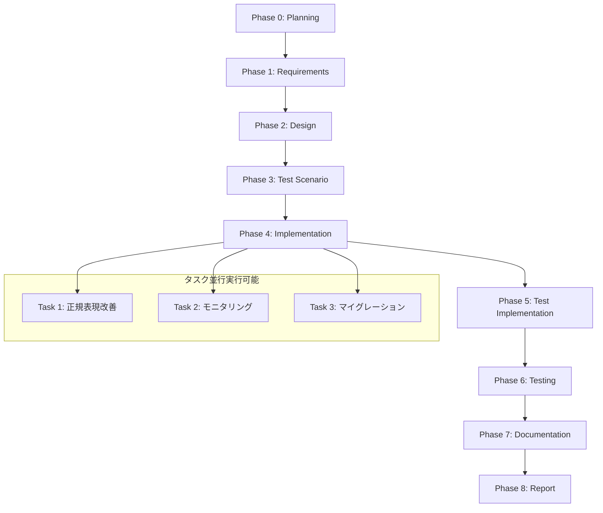

# プロジェクト計画書 - Issue #58

## 概要

**Issue番号**: #58
**タイトル**: [FOLLOW-UP] Issue #54 - 残タスク
**状態**: open
**URL**: https://github.com/tielec/ai-workflow-agent/issues/58
**ラベル**: enhancement, ai-workflow-follow-up

---

## 1. Issue分析

### 複雑度: 簡単

**判断根拠**:
- Issue #54のフォローアップタスクであり、スコープが明確
- 既存実装（`sanitizeGitUrl()`, `SecretMasker`）の軽微な改善のみ
- アーキテクチャ変更不要、新規サブシステム不要
- 3つのタスクはそれぞれ独立しており、依存関係が少ない

### 見積もり工数: 4~8時間

**内訳**:
- Task 1（正規表現改善）: 1~2時間
- Task 2（モニタリング）: 1~2時間
- Task 3（マイグレーションコマンド実装）: 2~4時間

**根拠**:
- **Task 1**: 正規表現パターンの変更（1ファイル、約5行）+ テスト修正（既存テストケース4件の修正）
- **Task 2**: ログ分析スクリプト作成（新規ファイル、約50行）+ レポート作成（約1~2時間）
- **Task 3**: 新規CLIコマンド追加（約100~200行）+ テストコード追加（約50~100行）+ ドキュメント更新

### リスク評価: 低

**判断根拠**:
- すべてのタスクは低優先度（evaluation report line 241-243）
- 既存機能への影響が極めて低い（既にDefense in Depthパターンで保護されている）
- Issue #54で統合テスト100%成功済み、セキュリティリスクは解決済み
- タスク失敗時も実運用への影響なし（フォールバック機能が存在）

---

## 2. 実装戦略判断

### 実装戦略: EXTEND

**判断根拠**:
- 既存実装（`src/utils/git-url-utils.ts`, `src/core/secret-masker.ts`）の軽微な改善
- Task 1: 既存関数 `sanitizeGitUrl()` の正規表現パターン変更（約5行）
- Task 2: 新規スクリプト作成（既存コードへの影響なし）
- Task 3: 新規CLIコマンド追加（`src/commands/migrate.ts` を新規作成、`src/main.ts` へ1コマンド追加）
- 新規ファイル: 2ファイル（`scripts/monitor-token-detection.ts`, `src/commands/migrate.ts`）
- 既存ファイル修正: 3ファイル（`src/utils/git-url-utils.ts`, `tests/unit/utils/git-url-utils.test.ts`, `src/main.ts`）

**CREATE戦略を採用しない理由**:
- 新規サブシステムの作成ではなく、既存機能の改善
- アーキテクチャ変更なし

**REFACTOR戦略を採用しない理由**:
- コード構造の改善が目的ではなく、機能拡張が目的
- Issue #54で既にクリーンな実装が完了している

### テスト戦略: UNIT_INTEGRATION

**判断根拠**:
- **UNIT**: Task 1の正規表現改善（エッジケース検証）、Task 3のマイグレーションコマンド（ロジック検証）
- **INTEGRATION**: Task 3のマイグレーションコマンド（E2Eフロー検証：既存メタデータ読み込み → トークン検出 → サニタイズ → 保存）
- **BDD不要**: ユーザーストーリー駆動ではなく、技術的な改善のため

**他の戦略を採用しない理由**:
- **UNIT_ONLY不適**: Task 3のマイグレーションコマンドは外部ファイル操作を伴うため、統合テストが必要
- **INTEGRATION_ONLY不適**: Task 1の正規表現は純粋関数であり、ユニットテストが効率的
- **BDD系不適**: エンドユーザー向け機能ではなく、開発者向けツール

### テストコード戦略: BOTH_TEST

**判断根拠**:
- **EXTEND_TEST**: 既存テストファイル（`tests/unit/utils/git-url-utils.test.ts`）の修正（Task 1）
- **CREATE_TEST**: 新規テストファイル作成（`tests/unit/commands/migrate.test.ts`, `tests/integration/migrate-sanitize-tokens.test.ts`）（Task 3）
- Task 2（モニタリング）はテストコード不要（スクリプトとして実行）

**他の戦略を採用しない理由**:
- **EXTEND_TEST不適**: Task 3の新規CLIコマンドには新規テストファイルが必要
- **CREATE_TEST不適**: Task 1は既存テストファイルの修正のみで対応可能

---

## 3. 影響範囲分析

### 既存コードへの影響

#### 変更が必要なファイル（3ファイル）

| ファイル | 影響内容 | 変更規模 |
|---------|---------|---------|
| `src/utils/git-url-utils.ts` | 正規表現パターン変更（line 48） | 軽微（1行） |
| `tests/unit/utils/git-url-utils.test.ts` | テストケース修正（4件の期待値更新） | 軽微（約20行） |
| `src/main.ts` | 新規コマンド `migrate` の追加 | 軽微（約10行） |

#### 新規作成ファイル（5ファイル）

| ファイル | 目的 | 規模 |
|---------|------|------|
| `scripts/monitor-token-detection.ts` | トークン検出ログ分析スクリプト | 約50~100行 |
| `src/commands/migrate.ts` | マイグレーションコマンド本体 | 約200~300行 |
| `tests/unit/commands/migrate.test.ts` | ユニットテスト | 約100~150行 |
| `tests/integration/migrate-sanitize-tokens.test.ts` | 統合テスト | 約100~150行 |
| `docs/MIGRATION.md` | マイグレーションガイド | 約50~100行 |

### 依存関係の変更

**新規依存の追加**: なし

**既存依存の変更**: なし

**理由**: すべてのタスクは既存のライブラリ（TypeScript標準ライブラリ、`commander`、`fs-extra`、`glob`）で実装可能。

### マイグレーション要否

**データベーススキーマ変更**: なし

**設定ファイル変更**: なし

**既存メタデータへの影響**:
- Task 3のマイグレーションコマンドは、既存の `.ai-workflow/issue-*/metadata.json` を対象とするが、**ユーザーが明示的に実行する場合のみ**動作する
- 自動マイグレーションは実施しない（ユーザーの選択を尊重）

---

## 4. タスク分割

### Phase 1: 要件定義 (見積もり: 0.5h)

- [x] Task 1-1: Issue #54のEvaluation Reportレビュー (0.25h)
  - 残タスクの背景と優先度の確認
  - Defense in Depthパターンの理解
- [x] Task 1-2: 各タスクの機能要件定義 (0.25h)
  - Task 1（正規表現改善）の受け入れ基準
  - Task 2（モニタリング）の受け入れ基準
  - Task 3（マイグレーションコマンド）の受け入れ基準

### Phase 2: 設計 (見積もり: 1~1.5h)

- [x] Task 2-1: Task 1の正規表現設計 (0.25~0.5h)
  - 新パターン `/^(https?:\/\/)(.+)@([^@]+)$/` の検証
  - ReDoS脆弱性評価
  - エッジケースの洗い出し
- [x] Task 2-2: Task 2のモニタリングスクリプト設計 (0.25~0.5h)
  - ログファイル形式の調査
  - 集計ロジックの設計
  - レポート形式の設計
- [x] Task 2-3: Task 3のマイグレーションコマンド設計 (0.5h)
  - CLIインターフェース設計（`ai-workflow migrate --sanitize-tokens`）
  - サニタイズアルゴリズム設計（`sanitizeGitUrl()` の再利用）
  - エラーハンドリング設計
  - ドライラン機能（`--dry-run`）の設計

### Phase 3: テストシナリオ (見積もり: 0.5~1h)

- [x] Task 3-1: Task 1のテストシナリオ策定 (0.25~0.5h)
  - パスワードに`@`を含むケース（4件のテスト修正）
  - 既存テストケースの回帰テスト
- [x] Task 3-2: Task 3のテストシナリオ策定 (0.25~0.5h)
  - ユニットテスト（正常系、エラー系、エッジケース）
  - 統合テスト（E2Eフロー：既存メタデータ読み込み → サニタイズ → 保存）

### Phase 4: 実装 (見積もり: 2~4h)

- [ ] Task 4-1: Task 1の正規表現改善実装 (0.5~1h)
  - `src/utils/git-url-utils.ts` のパターン変更（line 48）
  - コメント更新（Issue #58参照を追加）
- [ ] Task 4-2: Task 2のモニタリングスクリプト実装 (0.5~1h)
  - `scripts/monitor-token-detection.ts` の作成
  - ログファイルパース処理
  - 集計ロジック実装
  - レポート出力処理
- [ ] Task 4-3: Task 3のマイグレーションコマンド実装 (1~2h)
  - `src/commands/migrate.ts` の作成
    - `handleMigrateCommand()` 関数
    - `sanitizeTokensInMetadata()` 関数
    - `findAllMetadataFiles()` 関数
    - ドライラン機能（`--dry-run`）
  - `src/main.ts` へのコマンド追加（約10行）

### Phase 5: テストコード実装 (見積もり: 1~2h)

- [ ] Task 5-1: Task 1のテストコード修正 (0.25~0.5h)
  - `tests/unit/utils/git-url-utils.test.ts` の修正（4件のテストケース期待値更新）
  - 回帰テストの実行確認
- [ ] Task 5-2: Task 3のユニットテスト実装 (0.5~1h)
  - `tests/unit/commands/migrate.test.ts` の作成
  - 正常系テスト（トークン検出 → サニタイズ）
  - エラー系テスト（ファイル読み込み失敗、書き込み失敗）
  - エッジケーステスト（空メタデータ、トークンなし）
- [ ] Task 5-3: Task 3の統合テスト実装 (0.25~0.5h)
  - `tests/integration/migrate-sanitize-tokens.test.ts` の作成
  - E2Eフローテスト（既存メタデータ読み込み → サニタイズ → 保存 → 検証）
  - ドライランテスト（`--dry-run` でファイルが変更されないこと）

### Phase 6: テスト実行 (見積もり: 0.5~1h)

- [ ] Task 6-1: Task 1のテスト実行 (0.25~0.5h)
  - ユニットテスト実行（`npm run test:unit -- git-url-utils`）
  - 回帰テスト確認（既存テストケースすべてがパス）
- [ ] Task 6-2: Task 3のテスト実行 (0.25~0.5h)
  - ユニットテスト実行（`npm run test:unit -- migrate`）
  - 統合テスト実行（`npm run test:integration -- migrate-sanitize-tokens`）
  - カバレッジ確認（目標: 90%以上）

### Phase 7: ドキュメント (見積もり: 0.5~1h)

- [ ] Task 7-1: マイグレーションガイド作成 (0.25~0.5h)
  - `docs/MIGRATION.md` の作成
  - `ai-workflow migrate --sanitize-tokens` の使用方法
  - 実行例とサンプル出力
- [ ] Task 7-2: TROUBLESHOOTING.md更新 (0.25~0.5h)
  - Task 3のマイグレーションコマンドの使用手順を追加
  - 既存の手動修正手順（Issue #54で追加）との比較

### Phase 8: レポート (見積もり: 0.5h)

- [ ] Task 8-1: Task 2のモニタリングレポート作成 (0.25h)
  - スクリプト実行（`npm run monitor:tokens`）
  - 2週間のログ分析結果の要約
  - トークン検出頻度の評価
- [ ] Task 8-2: ステータスレポート作成 (0.25h)
  - 各タスクの完了状況
  - テスト結果サマリー
  - PRボディ生成

---

## 5. 依存関係

**注意事項**:
- Task 1、Task 2、Task 3は**並行実行可能**（相互依存なし）
- Task 2（モニタリング）は2週間の期間が必要だが、他のタスクをブロックしない
- Task 3（マイグレーションコマンド）の実装は、Task 1の正規表現改善の結果に依存しない（`sanitizeGitUrl()` を再利用するため）

---

## 6. リスクと軽減策

### リスク1: 正規表現パターン変更による予期しない動作

- **影響度**: 中
- **確率**: 低
- **軽減策**:
  - Phase 3でエッジケースを網羅的に洗い出す
  - Phase 5で回帰テスト（既存テストケースすべて）を実施
  - ReDoS脆弱性評価を実施（Phase 2）
  - 失敗した場合のロールバック手順を準備（元のパターンに戻す）

### リスク2: モニタリングスクリプトのログ形式依存

- **影響度**: 低
- **確率**: 中
- **軽減策**:
  - Phase 2でログ形式を調査し、パースロジックを柔軟に設計
  - エラーハンドリングを実装（ログファイルが存在しない場合、形式が異なる場合）
  - ドライラン機能を実装（実際にログを破壊しない）

### リスク3: マイグレーションコマンドによる既存メタデータ破壊

- **影響度**: 高
- **確率**: 低
- **軽減策**:
  - **Phase 2でドライラン機能を設計**（`--dry-run` でファイルを変更しない）
  - **バックアップ機能を実装**（変更前に `.bak` ファイルを作成）
  - Phase 5で統合テスト（E2Eフロー）を実施
  - ドキュメント（`docs/MIGRATION.md`）で注意喚起

### リスク4: スコープクリープ（機能追加の要求）

- **影響度**: 中
- **確率**: 低
- **軽減策**:
  - Phase 1で受け入れ基準を明確に定義
  - Issue #54のEvaluation Reportで既に優先度が「低」と明記されている
  - 追加機能の要求は別Issueとして管理

### リスク5: テスト工数の過小評価

- **影響度**: 低
- **確率**: 中
- **軽減策**:
  - Phase 3でテストシナリオを詳細に策定（見積もりの精度向上）
  - Phase 5でテストコード実装時に、シンプルな構造を維持（過度に複雑なテストを避ける）
  - Phase 6でテスト実行時に、失敗したテストは即座に修正（後回しにしない）

---

## 7. 品質ゲート

### Phase 0: Planning
- [x] **実装戦略が明確に決定されている**（EXTEND）
- [x] **テスト戦略が明確に決定されている**（UNIT_INTEGRATION）
- [x] **テストコード戦略が明確に決定されている**（BOTH_TEST）
- [x] **影響範囲が分析されている**（既存ファイル3件、新規ファイル5件）
- [x] **タスク分割が適切な粒度である**（1タスク = 0.25~2時間）
- [x] **リスクが洗い出されている**（5つのリスクと軽減策）

### Phase 1: 要件定義
- [x] 機能要件が明確に記載されている
- [x] 受け入れ基準が定義されている（各タスクごと）
- [x] スコープ外項目が明記されている
- [x] Issue #54のEvaluation Reportとの整合性が確認されている

### Phase 2: 設計
- [x] 実装戦略の判断根拠が明記されている
- [x] テスト戦略の判断根拠が明記されている
- [x] 正規表現パターンの設計根拠とReDoS脆弱性評価が完了している
- [x] マイグレーションコマンドのCLIインターフェースが設計されている
- [x] エラーハンドリング戦略が明記されている

### Phase 3: テストシナリオ
- [x] ユニットテストシナリオが定義されている（Task 1、Task 3）
- [x] 統合テストシナリオが定義されている（Task 3）
- [x] エッジケースが網羅されている
- [x] 回帰テスト計画が策定されている

### Phase 4: 実装
- [ ] 正規表現パターンが変更されている（Task 1）
- [ ] モニタリングスクリプトが作成されている（Task 2）
- [ ] マイグレーションコマンドが実装されている（Task 3）
- [ ] TypeScriptコンパイルが成功すること（`npm run build`）
- [ ] ESLintチェックが通過すること（`npm run lint`）

### Phase 5: テストコード実装
- [ ] Task 1のテストケースが修正されている（4件）
- [ ] Task 3のユニットテストが作成されている
- [ ] Task 3の統合テストが作成されている
- [ ] テストコンパイルが成功すること（`npm run test -- --listTests`）

### Phase 6: テスト実行
- [ ] すべてのユニットテストがパスすること
- [ ] すべての統合テストがパスすること
- [ ] 回帰テスト（既存テストケース）がすべてパスすること
- [ ] カバレッジが90%以上であること

### Phase 7: ドキュメント
- [ ] `docs/MIGRATION.md` が作成されている
- [ ] `TROUBLESHOOTING.md` が更新されている
- [ ] コードコメントが適切に記載されている（JSDoc形式）

### Phase 8: レポート
- [ ] Task 2のモニタリングレポートが作成されている
- [ ] ステータスレポートが作成されている
- [ ] PRボディが生成されている
- [ ] マージチェックリストがすべて完了している

---

## 8. 追加の考慮事項

### 優先度の再評価

Issue #54のEvaluation Reportで、すべてのタスクは「優先度: 低」と評価されています。本プロジェクト計画では、以下の優先度で実装を進めることを推奨します：

1. **Task 1（正規表現改善）**: 中優先度
   - 理由: ユニットテスト4件が失敗しており、テストの信頼性向上に寄与
   - ただし、実運用への影響は極めて低い（Defense in Depthパターンで保護済み）

2. **Task 3（マイグレーションコマンド）**: 中優先度
   - 理由: 既存ワークフローのユーザーに利便性を提供
   - ただし、手動修正手順が既に提供されており、緊急性は低い

3. **Task 2（モニタリング）**: 低優先度
   - 理由: データ収集のため、2週間の期間が必要
   - 他のタスクをブロックしないため、並行実行可能

### 実装順序の推奨

並行実行可能ですが、以下の順序で実装することを推奨します：

1. **Task 1（正規表現改善）** → ユニットテストの信頼性向上
2. **Task 3（マイグレーションコマンド）** → ユーザーへの価値提供
3. **Task 2（モニタリング）** → 長期的なデータ収集（並行実行）

### レビューポイント

クリティカルシンキングレビュー時に、以下の点を重点的に確認することを推奨します：

- **正規表現の正当性**: Task 1の新パターン `/^(https?:\/\/)(.+)@([^@]+)$/` が本当にすべてのケースをカバーしているか
- **マイグレーションコマンドの安全性**: Task 3のバックアップ機能とドライラン機能が適切に実装されているか
- **テストカバレッジ**: Phase 6でカバレッジが90%以上であることを確認

---

## 9. 成功基準

このプロジェクトは、以下の基準を満たした場合に成功とみなします：

### 必須基準（Must Have）

- [ ] **Task 1完了**: 正規表現パターンが変更され、ユニットテスト4件がすべてパスすること
- [ ] **Task 3完了**: マイグレーションコマンド `ai-workflow migrate --sanitize-tokens` が実装され、統合テストがパスすること
- [ ] **回帰テストパス**: 既存テストケースすべてがパスすること
- [ ] **ドキュメント更新**: `docs/MIGRATION.md` と `TROUBLESHOOTING.md` が更新されていること

### 推奨基準（Should Have）

- [ ] **Task 2完了**: モニタリングスクリプトが実装され、2週間のログ分析レポートが作成されていること
- [ ] **カバレッジ90%以上**: 新規コードのテストカバレッジが90%以上であること
- [ ] **ReDoS脆弱性なし**: Phase 2でReDoS脆弱性評価が完了し、リスクがないこと

### オプション基準（Nice to Have）

- [ ] **自動バックアップ**: マイグレーションコマンドが実行前に自動的にバックアップを作成すること
- [ ] **進捗レポート**: マイグレーションコマンドが処理状況をリアルタイムで表示すること

---

## 10. まとめ

Issue #58は、Issue #54のフォローアップタスクであり、スコープが明確で複雑度が低いプロジェクトです。EXTEND戦略により、既存実装の軽微な改善のみを行い、UNIT_INTEGRATION戦略により、効率的なテストを実施します。

**見積もり工数**: 4~8時間
**リスク評価**: 低
**優先度**: 中（Issue #54の評価では「低」だが、テストの信頼性向上とユーザー利便性向上のため、中優先度で実装を推奨）

すべてのタスクは並行実行可能であり、Task 2（モニタリング）は2週間の期間が必要ですが、他のタスクをブロックしません。Defense in Depthパターンにより、すべてのタスクが失敗した場合でも、セキュリティリスクは解決済みです。

---

**計画作成日**: 2025-01-22
**作成者**: AI Workflow Agent (Planning Phase)
**次ステップ**: Phase 1 (Requirements) へ進む
