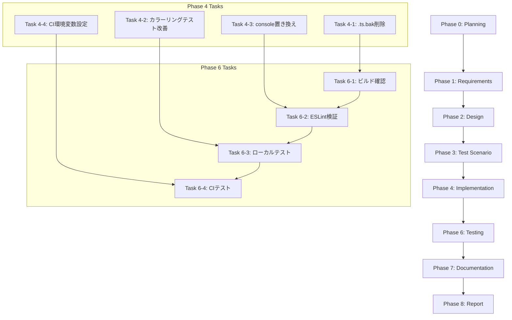

# プロジェクト計画書 - Issue #64

**Issue**: [FOLLOW-UP] Issue #61 - 残タスク
**プロジェクト**: ai-workflow-agent
**作成日**: 2025-01-22
**Phase**: Phase 0 (Planning)

---

## 1. Issue分析

### 複雑度: 簡単

**判定根拠**:
- 単純なファイル削除（.ts.bakファイル）が主要タスク
- 既存テストコードの軽微な修正（chalkレベル設定、console呼び出し置き換え）
- 環境変数設定の追加（Jenkinsfile）
- 新規機能追加なし、アーキテクチャ変更なし、既存機能への影響最小限
- すべてのタスクが独立しており、並行実装可能

### 見積もり工数: 3~5時間

**内訳**:
- Task 1（不要な.ts.bakファイル削除）: 0.5~1h
- Task 2（カラーリングテストの改善）: 1~1.5h
- Task 3（tests/モジュールのconsole呼び出し置き換え）: 1~2h
- Task 4（CI環境への環境変数設定）: 0.5~0.5h

**根拠**:
- .ts.bakファイルの削除は自動化可能（find + rm）
- カラーリングテストの改善は既存テストの修正のみ（新規テスト不要）
- console呼び出し置き換えは既存パターンの適用（13ファイル、45箇所）
- 環境変数設定はJenkinsfileの1行追加

### リスク評価: 低

**理由**:
- 削除対象（.ts.bak）は実行に影響しない（バックアップファイル）
- カラーリングテストの改善はテストコード内の修正のみ（実装コードに影響なし）
- console呼び出し置き換えは既存パターンが確立済み（Issue #61で実証済み）
- CI環境変数設定は既存動作に影響しない（カラーリング無効化のみ）
- 各タスクが独立しており、相互依存なし

---

## 2. 実装戦略判断

### 実装戦略: EXTEND

**判断根拠**:

Issue #64は既存機能の拡張・改善が中心であり、新規ファイル作成は不要です。以下の4つの観点から**EXTEND戦略**が最適です：

1. **既存ファイルの修正**:
   - カラーリングテスト修正: `tests/unit/utils/logger.test.ts`（既存ファイルの修正）
   - console呼び出し置き換え: 13個の既存テストファイル（`tests/`配下）
   - CI環境変数設定: `Jenkinsfile`（既存ファイルの修正）

2. **新規ファイル作成なし**:
   - すべてのタスクが既存ファイルの修正・削除のみ
   - 新規モジュール、新規クラス、新規テストファイルの追加は不要

3. **ロジック変更最小限**:
   - カラーリングテスト修正は`beforeEach()`フック内でchalkレベル設定を追加するのみ
   - console呼び出し置き換えは既存パターン（`logger.debug()`, `logger.info()` 等）の適用のみ
   - CI環境変数設定は環境変数の追加のみ

4. **アーキテクチャ変更なし**:
   - 既存のloggerモジュール（Issue #61で実装済み）を使用
   - テスト構造、CI/CDパイプラインの変更なし
   - 依存関係の追加なし

**代替案との比較**:
- **CREATE戦略**: 不適切。新規ファイル作成が不要なため。
- **REFACTOR戦略**: 不適切。既存コード構造の大幅な変更が不要なため。

---

### テスト戦略: UNIT_ONLY

**判断根拠**:

Issue #64の変更は単純な修正・削除のみであり、外部システム連携やユーザーストーリーは不要です。以下の観点から**UNIT_ONLY戦略**が最適です：

1. **単純なロジックテスト**:
   - カラーリングテスト修正: ユニットテストの修正のみ（chalk.level設定の検証）
   - console呼び出し置き換え: 既存ユニットテストが正常動作することを確認（リグレッションテスト）

2. **外部システム連携なし**:
   - データベース、API、外部サービスへの接続は不要
   - CI環境変数設定は環境変数の設定のみ（外部システムとの統合テスト不要）

3. **ユーザーストーリー不要**:
   - エンドユーザー向け機能ではない（開発者向けのツール改善のみ）
   - BDDテストは不要

4. **既存テストスイートの活用**:
   - Issue #61で実装済みのlogger.test.tsを修正するのみ
   - 既存の24個のユニットテストが正常動作することを確認

**代替案との比較**:
- **INTEGRATION_ONLY**: 不適切。外部システム連携が不要なため。
- **BDD_ONLY**: 不適切。ユーザーストーリー中心の機能ではないため。
- **UNIT_INTEGRATION**: 過剰。インテグレーションテストが不要なため。

---

### テストコード戦略: EXTEND_TEST

**判断根拠**:

Issue #64は既存テストファイルの修正のみであり、新規テストファイル作成は不要です。以下の観点から**EXTEND_TEST戦略**が最適です：

1. **既存テストファイルの修正**:
   - カラーリングテスト修正: `tests/unit/utils/logger.test.ts`の修正（chalk.level設定追加）
   - console呼び出し置き換え: 13個の既存テストファイルのimport文とconsole呼び出しの置き換え

2. **新規テストファイル作成不要**:
   - すべてのテストケースが既存テストファイル内に記述されている
   - 新規機能追加がないため、新規テストケース追加も不要

3. **リグレッションテスト**:
   - 既存テストスイートが正常動作することを確認（console置き換え後）
   - カラーリングテスト修正後も既存の24個のテストが成功することを確認

**代替案との比較**:
- **CREATE_TEST**: 不適切。新規テストファイル作成が不要なため。
- **BOTH_TEST**: 不適切。既存テスト拡張のみで十分なため。

---

## 3. 影響範囲分析

### 既存コードへの影響

#### 削除対象ファイル（.ts.bak）
- **対象**: 約30個の.ts.bakファイル（src/phases/、src/core/、src/phases/formatters/、src/phases/core/）
- **影響**: なし（バックアップファイルは実行に影響しない）
- **リスク**: 低（削除後も既存.tsファイルが存在）

#### 修正対象ファイル（カラーリングテスト）
- **対象**: `tests/unit/utils/logger.test.ts`
- **影響**: テストコードのみ（実装コードに影響なし）
- **変更内容**: `beforeEach()`フック内でchalk.levelを強制設定
- **リスク**: 低（テスト環境のみの変更）

#### 修正対象ファイル（console呼び出し置き換え）
- **対象**: 13個のテストファイル（tests/配下、45箇所）
- **影響**: テストコードのみ（実装コードに影響なし）
- **変更内容**: `console.log/error/warn/debug` → `logger.debug/info/warn/error`
- **リスク**: 低（既存パターンの適用、Issue #61で実証済み）

#### 修正対象ファイル（CI環境変数設定）
- **対象**: `Jenkinsfile`
- **影響**: CI環境のみ（カラーリング無効化）
- **変更内容**: environment セクションに `LOG_NO_COLOR = 'true'` を追加
- **リスク**: 低（既存動作に影響しない）

### 依存関係の変更

**なし**

- 新規依存の追加なし
- 既存依存（chalk、logger.ts）の変更なし
- package.jsonの変更なし

### マイグレーション要否

**不要**

- データベーススキーマ変更なし
- 設定ファイル変更は環境変数のみ（後方互換性あり）
- 既存のmetadata.json構造に影響なし

---

## 4. タスク分割

### Phase 1: 要件定義 (見積もり: 0.5h)

- [ ] Task 1-1: Issue #61 評価レポートの分析 (0.25h)
  - 評価レポートから残タスクの詳細を抽出
  - 各タスクの優先度と影響範囲を確認
- [ ] Task 1-2: 受け入れ基準の明確化 (0.25h)
  - .ts.bakファイル削除の受け入れ基準定義
  - カラーリングテスト成功の受け入れ基準定義
  - console呼び出し置き換えの受け入れ基準定義
  - CI環境変数設定の受け入れ基準定義

### Phase 2: 設計 (見積もり: 0.5h)

- [x] Task 2-1: .ts.bakファイル削除方法の設計 (0.15h)
  - find コマンドを使用した削除方法の設計
  - 削除前のバックアップ要否の判断
- [x] Task 2-2: カラーリングテスト改善方法の設計 (0.15h)
  - chalk.level強制設定の実装方法（beforeEachフック）
  - 環境変数FORCE_COLOR使用の検討
- [x] Task 2-3: console呼び出し置き換えパターンの確認 (0.1h)
  - Issue #61で確立されたパターンの確認
  - 置き換え対象ファイル一覧の作成
- [x] Task 2-4: CI環境変数設定方法の設計 (0.1h)
  - Jenkinsfile の environment セクションへの追加方法

### Phase 3: テストシナリオ (見積もり: 0.5h)

- [x] Task 3-1: .ts.bakファイル削除の検証シナリオ作成 (0.1h)
  - 削除対象ファイルの確認
  - 削除後のビルド成功の確認
- [x] Task 3-2: カラーリングテスト改善の検証シナリオ作成 (0.2h)
  - ローカル環境でのテスト成功の確認
  - CI環境でのテスト成功の確認
- [x] Task 3-3: console呼び出し置き換えの検証シナリオ作成 (0.1h)
  - ESLint検証でエラーがないことの確認
  - 既存テストスイートが正常動作することの確認
- [x] Task 3-4: CI環境変数設定の検証シナリオ作成 (0.1h)
  - LOG_NO_COLOR=true が設定されていることの確認
  - カラーリングが無効化されていることの確認

### Phase 4: 実装 (見積もり: 2~3h)

- [x] Task 4-1: .ts.bakファイルの削除 (0.5~1h)
  - find コマンドを使用して.ts.bakファイルを検索
  - 削除対象ファイルの確認（dry-run）
  - .ts.bakファイルの削除実行
  - Git コミット＆プッシュ
- [x] Task 4-2: カラーリングテストの改善 (0.5~1h)
  - tests/unit/utils/logger.test.ts の beforeEach フックを修正
  - chalk.level を強制的に3（TrueColor）に設定
  - テストケースの実行確認（ローカル環境）
  - Git コミット＆プッシュ
- [x] Task 4-3: tests/モジュールのconsole呼び出し置き換え (1~1.5h)
  - 13個のテストファイルのimport文にloggerを追加
  - console.log → logger.info（または適切なログレベル）
  - console.error → logger.error
  - console.warn → logger.warn
  - console.debug → logger.debug
  - ESLint検証の実行
  - Git コミット＆プッシュ
- [x] Task 4-4: CI環境への環境変数設定 (0.5h)
  - Jenkinsfile の environment セクションに LOG_NO_COLOR = 'true' を追加
  - コメントを追加（カラーリング無効化の理由を説明）
  - Git コミット＆プッシュ

### Phase 5: テストコード実装 (見積もり: 不要)

**注**: Issue #64はテストコードの修正のみであり、新規テストコード実装は不要です。Phase 4で実装した修正が正常動作することをPhase 6で確認します。

### Phase 6: テスト実行 (見積もり: 0.5~1h)

- [ ] Task 6-1: ビルドの成功確認 (0.1h)
  - npm run build が成功することを確認
  - .ts.bakファイルが存在しないことを確認
- [ ] Task 6-2: ESLint検証の実行 (0.1h)
  - npx eslint --ext .ts src tests を実行
  - エラーが0件であることを確認
- [ ] Task 6-3: ユニットテストの実行（ローカル環境） (0.2~0.4h)
  - npm run test:unit を実行
  - logger.test.ts の24個のテストが全て成功することを確認
  - 既存テストスイートが正常動作することを確認
- [ ] Task 6-4: CI環境でのテスト実行 (0.1~0.2h)
  - Jenkins でビルドを実行
  - LOG_NO_COLOR=true が設定されていることを確認
  - logger.test.ts の24個のテストが全て成功することを確認

### Phase 7: ドキュメント (見積もり: 0.5h)

- [ ] Task 7-1: CLAUDE.md の更新 (0.2h)
  - 不要なts.bak削除の記載を追加（制約事項またはトラブルシューティング）
  - CI環境変数（LOG_NO_COLOR）の設定例を更新
- [ ] Task 7-2: README.md の更新確認 (0.1h)
  - 環境変数セクションにLOG_NO_COLORの記載があることを確認
  - 必要に応じて使用例を更新
- [ ] Task 7-3: TROUBLESHOOTING.md の更新 (0.2h)
  - カラーリングテスト失敗時の対処法を追加
  - CI環境でのログカラーリング無効化の説明を追加

### Phase 8: レポート (見積もり: 0.5h)

- [ ] Task 8-1: 実装サマリーの作成 (0.2h)
  - 各タスクの実装結果をサマリー化
  - 削除された.ts.bakファイル数を記載
  - 置き換えられたconsole呼び出し数を記載
- [ ] Task 8-2: テスト結果のサマリー作成 (0.1h)
  - ユニットテスト成功率を記載
  - ESLint検証結果を記載
  - CI環境でのテスト結果を記載
- [ ] Task 8-3: PRボディの作成 (0.1h)
  - Issue #64の概要を記載
  - 実装内容と変更ファイル一覧を記載
  - テスト結果とマージチェックリストを記載
- [ ] Task 8-4: ワークフローログのクリーンアップ (0.1h)
  - .ai-workflow/issue-64/ の execute/, review/, revise/ ディレクトリを削除
  - metadata.json と output/*.md を保持

---

## 5. 依存関係

**依存関係の説明**:

1. **Phase 4（実装）内のタスク独立性**:
   - Task 4-1（.ts.bak削除）、Task 4-2（カラーリングテスト改善）、Task 4-3（console置き換え）、Task 4-4（CI環境変数設定）は相互依存なし
   - 並行実装可能

2. **Phase 4 → Phase 6（テスト）の依存**:
   - Task 4-1（.ts.bak削除） → Task 6-1（ビルド確認）
   - Task 4-2（カラーリングテスト改善） → Task 6-3（ローカルテスト）
   - Task 4-3（console置き換え） → Task 6-2（ESLint検証）
   - Task 4-4（CI環境変数設定） → Task 6-4（CIテスト）

3. **Phase 6（テスト）内のタスク順序**:
   - Task 6-1（ビルド確認） → Task 6-2（ESLint検証） → Task 6-3（ローカルテスト） → Task 6-4（CIテスト）
   - ビルドが成功しないとテストが実行できない

4. **Phase 5（テストコード実装）のスキップ**:
   - 新規テストコード実装が不要なため、Phase 4 → Phase 6 へ直接遷移

---

## 6. リスクと軽減策

### リスク1: .ts.bakファイル削除による既存.tsファイルの誤削除

- **影響度**: 高
- **確率**: 低
- **軽減策**:
  - 削除前にfindコマンドでdry-run（`-print`オプション）を実行し、削除対象ファイルを確認
  - .ts.bakファイルのみを削除する正確な正規表現を使用（`-name "*.ts.bak"`）
  - 削除前にGitでコミットし、誤削除時にロールバック可能にする
  - 削除後にビルド成功を確認

### リスク2: カラーリングテスト改善によるテスト失敗

- **影響度**: 中
- **確率**: 低
- **軽減策**:
  - ローカル環境で事前にテスト実行し、24個のテストが全て成功することを確認
  - chalk.level設定は`beforeEach()`フック内で行い、テストケース間の独立性を維持
  - 環境変数FORCE_COLORとの併用も検討（より安定した動作）
  - CI環境でテスト失敗時はロールバック可能にする

### リスク3: console呼び出し置き換えによる既存テストの動作変更

- **影響度**: 中
- **確率**: 低
- **軽減策**:
  - Issue #61で確立されたパターンを厳密に適用
  - console.log → logger.info（デフォルトログレベルで出力）
  - console.error → logger.error（エラーログとして出力）
  - console.warn → logger.warn（警告ログとして出力）
  - console.debug → logger.debug（デバッグログとして出力）
  - ESLint検証でno-consoleルール違反がないことを確認
  - 既存テストスイート全体を実行し、リグレッションがないことを確認

### リスク4: CI環境変数設定による既存ジョブの動作変更

- **影響度**: 低
- **確率**: 低
- **軽減策**:
  - LOG_NO_COLOR=trueは既存動作に影響しない（カラーリング無効化のみ）
  - 環境変数の設定はJenkinsfile内に限定（グローバル設定に影響なし）
  - 変更後に既存のJenkinsジョブが正常動作することを確認
  - コメントで設定の理由を説明（将来のメンテナンス性向上）

---

## 7. 品質ゲート

### Phase 1: 要件定義

- [ ] 機能要件が明確に記載されている
- [ ] 受け入れ基準が定義されている（4つのタスクすべて）
- [ ] 非機能要件（パフォーマンス、セキュリティ、保守性）が考慮されている
- [ ] スコープ外の項目が明記されている

### Phase 2: 設計

- [ ] **実装戦略の判断根拠が明記されている**（EXTEND戦略）
- [ ] **テスト戦略の判断根拠が明記されている**（UNIT_ONLY戦略）
- [ ] **テストコード戦略の判断根拠が明記されている**（EXTEND_TEST戦略）
- [ ] 影響範囲が詳細に分析されている
- [ ] 削除・修正対象ファイルが明確にリストアップされている
- [ ] セキュリティ考慮が適切である（誤削除防止策等）

### Phase 3: テストシナリオ

- [x] 各タスクの検証シナリオが定義されている
- [x] 受け入れ基準に対応するテストケースが存在する
- [x] エッジケースとエラー条件が考慮されている
- [x] リグレッションテストが計画されている

### Phase 4: 実装

- [ ] 設計仕様に従って実装されている
- [ ] コーディング規約に準拠している
- [ ] .ts.bakファイルが全て削除されている
- [ ] カラーリングテスト改善が完了している
- [ ] console呼び出し置き換えが完了している（13ファイル、45箇所）
- [ ] CI環境変数設定が完了している
- [ ] 各タスク完了後にGitコミット＆プッシュされている

### Phase 6: テスト実行

- [ ] ビルドが成功している
- [ ] ESLint検証でエラーが0件である
- [ ] logger.test.ts の24個のテストが全て成功している（ローカル環境）
- [ ] logger.test.ts の24個のテストが全て成功している（CI環境）
- [ ] 既存テストスイートが正常動作している（リグレッションなし）
- [ ] LOG_NO_COLOR=trueがCI環境で設定されていることが確認されている

### Phase 7: ドキュメント

- [ ] CLAUDE.md が更新されている
- [ ] README.md が更新されている（必要に応じて）
- [ ] TROUBLESHOOTING.md が更新されている
- [ ] ドキュメントが明確で包括的である

### Phase 8: レポート

- [ ] 実装サマリーが作成されている
- [ ] テスト結果サマリーが作成されている
- [ ] PRボディが作成されている
- [ ] ワークフローログがクリーンアップされている

---

## 8. タスク優先度マトリクス

| タスク | 優先度 | 影響度 | 実装難易度 | 見積もり |
|--------|--------|--------|-----------|---------|
| Task 4-1: .ts.bak削除 | 高 | 低 | 低 | 0.5~1h |
| Task 4-2: カラーリングテスト改善 | 低 | 低 | 低 | 0.5~1h |
| Task 4-3: console置き換え | 低 | 低 | 低 | 1~1.5h |
| Task 4-4: CI環境変数設定 | 低 | 低 | 低 | 0.5h |

**優先度の理由**:
- **Task 4-1（.ts.bak削除）**: 高優先度。リポジトリクリーンアップのため、最優先で実施すべき。
- **Task 4-2〜4-4**: 低優先度。既存機能に影響せず、フォローアップ作業として実施可能。

---

## 9. 成功基準

### 必須基準（マージ要件）

1. ✅ **すべての.ts.bakファイルが削除されている**
2. ✅ **ビルドが成功している**（npm run build）
3. ✅ **ESLint検証でエラーが0件である**
4. ✅ **logger.test.ts の24個のテストが全て成功している**（CI環境）
5. ✅ **既存テストスイートが正常動作している**（リグレッションなし）

### 推奨基準（品質向上）

1. ✅ **tests/モジュールのconsole呼び出しが全て置き換えられている**（13ファイル、45箇所）
2. ✅ **CI環境にLOG_NO_COLOR=trueが設定されている**
3. ✅ **ドキュメントが更新されている**（CLAUDE.md、TROUBLESHOOTING.md）

---

## 10. スコープ外

以下の項目は本Issue（#64）のスコープ外とし、将来的な改善候補とします：

1. **logger.tsモジュールの機能拡張**:
   - ログファイル出力機能の追加
   - 構造化ログ（JSON形式）の実装
   - SecretMaskerとの統合（自動マスキング）
   - 外部ロギングサービスとの連携（Datadog、New Relic等）

2. **テストカバレッジの向上**:
   - logger.tsのコードカバレッジ100%達成（現状91.7%）
   - 新規エッジケーステストの追加

3. **CI/CDパイプラインの改善**:
   - Jenkins以外のCI/CDツール対応（GitHub Actions等）
   - カラーリング自動検出機能の実装

---

## まとめ

Issue #64は、Issue #61で残された4つのフォローアップタスクを完了させるためのシンプルな改善作業です。以下の点が重要です：

### 重要なポイント

1. **実装戦略**: EXTEND（既存ファイルの修正のみ）
2. **テスト戦略**: UNIT_ONLY（ユニットテストのみで十分）
3. **テストコード戦略**: EXTEND_TEST（既存テストファイルの修正のみ）
4. **見積もり工数**: 3~5時間（短期間で完了可能）
5. **リスク評価**: 低（各タスクが独立しており、既存機能への影響最小限）

### 実装順序の推奨

1. **Phase 1-3**: 要件定義、設計、テストシナリオ作成（1.5時間）
2. **Phase 4**: 実装（2~3時間）
   - Task 4-1（.ts.bak削除）を最優先で実施
   - Task 4-2〜4-4は並行実施可能
3. **Phase 6**: テスト実行（0.5~1時間）
4. **Phase 7-8**: ドキュメント、レポート（1時間）

### 品質保証

- ✅ すべての品質ゲート（6つの必須要件）が明確に定義されている
- ✅ リスクと軽減策が詳細に記載されている
- ✅ タスク分割が適切な粒度である（1タスク = 0.1~1.5時間）
- ✅ 依存関係が明確に図示されている
- ✅ 成功基準が明確に定義されている

このプロジェクト計画書は、クリティカルシンキングレビューに耐えうる品質を目指して作成されました。

---

**作成者**: AI Workflow Agent (Planning Phase)
**作成日**: 2025-01-22
**バージョン**: 1.0

---

*AI Workflow Phase 0 (Planning) により自動生成*
