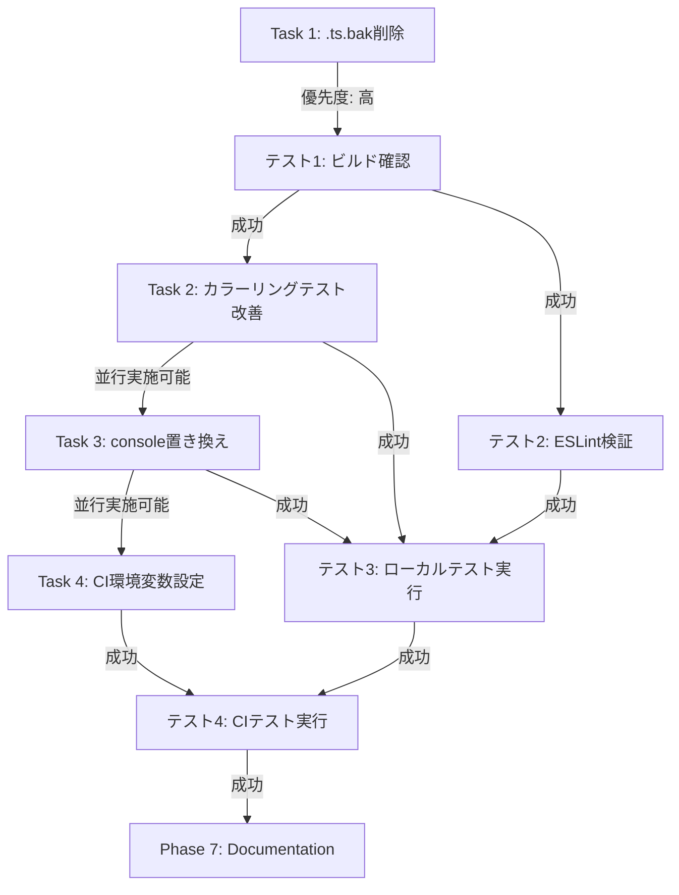

# テストシナリオ - Issue #64

**Issue**: [FOLLOW-UP] Issue #61 - 残タスク
**プロジェクト**: ai-workflow-agent
**作成日**: 2025-01-22
**Phase**: Phase 3 (Test Scenario)

---

## 0. Planning Documentの確認

Planning Phase（Phase 0）の成果物を確認し、以下の戦略が策定されていることを確認しました：

- **実装戦略**: EXTEND（既存ファイルの修正のみ、新規ファイル作成なし）
- **テスト戦略**: UNIT_ONLY（ユニットテストのみで十分）
- **テストコード戦略**: EXTEND_TEST（既存テストファイルの修正のみ）
- **見積もり工数**: 3~5時間（短期間で完了可能）
- **リスク評価**: 低（各タスクが独立しており、既存機能への影響最小限）

本テストシナリオは、Planning Documentで策定された**UNIT_ONLY戦略**に基づいて作成されます。

---

## 1. テスト戦略サマリー

### 選択されたテスト戦略

**UNIT_ONLY**: ユニットテストのみ

**判断根拠**（Phase 2から引用）:
- Issue #64の変更は単純な修正・削除のみであり、外部システム連携やユーザーストーリーは不要
- カラーリングテスト修正: ユニットテストの修正のみ（chalk.level設定の検証）
- console呼び出し置き換え: 既存ユニットテストが正常動作することを確認（リグレッションテスト）
- 外部システム連携なし（データベース、API、外部サービスへの接続は不要）
- エンドユーザー向け機能ではない（開発者向けのツール改善のみ）

### テスト対象の範囲

Issue #64は4つの独立したタスクで構成されます：

1. **Task 1: .ts.bakファイル削除**（優先度: 高）
   - 削除対象: 約30個の.ts.bakファイル
   - テスト内容: ビルド成功確認（削除による影響がないことを検証）

2. **Task 2: カラーリングテスト改善**（優先度: 低）
   - 修正対象: `tests/unit/utils/logger.test.ts`
   - テスト内容: chalk.level強制設定後、24個のテストが全て成功することを検証

3. **Task 3: console呼び出し置き換え**（優先度: 低）
   - 修正対象: 8個のテストファイル、14箇所
   - テスト内容: logger呼び出し置き換え後、既存テストが正常動作することを検証

4. **Task 4: CI環境変数設定**（優先度: 低）
   - 修正対象: `Jenkinsfile`
   - テスト内容: LOG_NO_COLOR=true設定後、CI環境でテストが成功することを検証

### テストの目的

- **リグレッション防止**: 各タスク実装後も既存機能が正常動作することを確認
- **品質保証**: ESLintの`no-console`ルール違反が0件であることを確認
- **CI安定性**: カラーリングテスト改善により、CI環境でのテスト安定性が向上することを確認
- **ビルド成功**: .ts.bakファイル削除後もビルドが成功することを確認

---

## 2. Unitテストシナリオ

### 2-1. Task 1: .ts.bakファイル削除のテストシナリオ

#### テストケース1-1: ビルド成功確認（正常系）

- **目的**: .ts.bakファイル削除後もビルドが成功することを検証
- **前提条件**:
  - すべての.ts.bakファイルが削除されている
  - 対応する.tsファイルは存在している
- **入力**: `npm run build`コマンド実行
- **期待結果**:
  - ビルドが正常終了（終了コード0）
  - `dist/`ディレクトリにコンパイル済みJSファイルが生成される
  - エラーメッセージが表示されない
- **テストデータ**: なし（実際のソースコード）

**検証コマンド**:
```bash
# ビルド実行
npm run build

# 終了コード確認
echo $?  # 0が期待値

# dist/ディレクトリ確認
ls -la dist/
```

#### テストケース1-2: .ts.bakファイルの完全削除確認（正常系）

- **目的**: すべての.ts.bakファイルが削除されていることを検証
- **前提条件**: Task 1実装完了
- **入力**: `find . -name "*.ts.bak" -type f`コマンド実行
- **期待結果**:
  - 検索結果が0件（.ts.bakファイルが存在しない）
  - 対応する.tsファイルは全て存在
- **テストデータ**: なし

**検証コマンド**:
```bash
# .ts.bakファイル検索
find . -name "*.ts.bak" -type f

# 期待結果: 出力なし（0件）

# .tsファイルは存在することを確認（例）
ls src/phases/planning.ts
ls src/core/secret-masker.ts
```

#### テストケース1-3: 対応する.tsファイルの存在確認（正常系）

- **目的**: .ts.bakファイル削除により、対応する.tsファイルが誤って削除されていないことを検証
- **前提条件**: Task 1実装完了
- **入力**: 主要な.tsファイルの存在確認
- **期待結果**: すべての.tsファイルが存在する
- **テストデータ**:
  - src/phases/planning.ts
  - src/phases/design.ts
  - src/core/secret-masker.ts
  - src/core/workflow-state.ts
  - （その他約30ファイル）

**検証コマンド**:
```bash
# 主要ファイルの存在確認
test -f src/phases/planning.ts && echo "OK: planning.ts exists"
test -f src/phases/design.ts && echo "OK: design.ts exists"
test -f src/core/secret-masker.ts && echo "OK: secret-masker.ts exists"
test -f src/core/workflow-state.ts && echo "OK: workflow-state.ts exists"
```

---

### 2-2. Task 2: カラーリングテスト改善のテストシナリオ

#### テストケース2-1: logger.test.tsテスト実行（ローカル環境、正常系）

- **目的**: chalk.level強制設定後、ローカル環境で24個のテストが全て成功することを検証
- **前提条件**:
  - `tests/unit/utils/logger.test.ts`のbeforeEachフックでchalk.level = 3が設定されている
- **入力**: `npm run test:unit -- tests/unit/utils/logger.test.ts`コマンド実行
- **期待結果**:
  - 24個のテストが全て成功（PASS）
  - カラーリングテストを含むすべてのテストがPASS
  - テスト失敗なし
- **テストデータ**: logger.test.ts内の既存テストケース（24個）

**検証コマンド**:
```bash
# logger.test.tsのみを実行
npm run test:unit -- tests/unit/utils/logger.test.ts

# 期待結果: Test Suites: 1 passed, 1 total
#           Tests:       24 passed, 24 total
```

#### テストケース2-2: logger.test.tsテスト実行（CI環境、正常系）

- **目的**: CI環境でも24個のテストが全て成功することを検証
- **前提条件**:
  - Task 4（CI環境変数設定）完了
  - LOG_NO_COLOR=true設定済み
  - chalk.level = 3が強制設定されている
- **入力**: Jenkins環境で`npm run test:unit`コマンド実行
- **期待結果**:
  - 24個のテストが全て成功（PASS）
  - CI環境特有のカラーリング問題が解決されている
  - テスト失敗なし
- **テストデータ**: logger.test.ts内の既存テストケース（24個）

**検証方法**:
- JenkinsでビルドをQQ実行
- ビルドログで`Test Suites: 1 passed`を確認

#### テストケース2-3: chalk.level設定の確認（正常系）

- **目的**: beforeEachフック内でchalk.level = 3が正しく設定されていることを検証
- **前提条件**: logger.test.ts修正完了
- **入力**: logger.test.tsのソースコード確認
- **期待結果**:
  - beforeEachフック内に`chalk.level = 3;`が存在
  - 適切なコメントが追加されている
- **テストデータ**: なし

**検証方法**:
```bash
# beforeEachフック内のchalk.level設定を確認
grep -A 5 "beforeEach" tests/unit/utils/logger.test.ts | grep "chalk.level = 3"

# 期待結果: chalk.level = 3; が表示される
```

---

### 2-3. Task 3: console呼び出し置き換えのテストシナリオ

#### テストケース3-1: ESLint検証（no-consoleルール、正常系）

- **目的**: console呼び出し置き換え後、ESLintの`no-console`ルール違反が0件であることを検証
- **前提条件**:
  - 8ファイル、14箇所のconsole呼び出しがloggerに置き換えられている
  - 各ファイルに`import { logger } from '@/utils/logger.js';`が追加されている
- **入力**: `npx eslint --ext .ts src tests`コマンド実行
- **期待結果**:
  - エラーが0件
  - 警告が0件（no-consoleルール違反なし）
  - 終了コード0
- **テストデータ**: 修正された8個のテストファイル

**検証コマンド**:
```bash
# ESLint検証実行
npx eslint --ext .ts src tests

# 期待結果: エラー0件、警告0件
# 終了コード確認
echo $?  # 0が期待値
```

#### テストケース3-2: ユニットテスト実行（リグレッションテスト、正常系）

- **目的**: console呼び出し置き換え後も既存ユニットテストが正常動作することを検証
- **前提条件**: Task 3実装完了
- **入力**: `npm run test:unit`コマンド実行
- **期待結果**:
  - 修正された8ファイルを含む全ユニットテストが成功
  - テスト失敗なし
  - リグレッションなし
- **テストデータ**: 既存ユニットテストスイート全体

**検証コマンド**:
```bash
# 全ユニットテスト実行
npm run test:unit

# 期待結果: Test Suites: すべてpassed
#           Tests:       すべてpassed
```

#### テストケース3-3: 統合テスト実行（リグレッションテスト、正常系）

- **目的**: console呼び出し置き換え後も既存統合テストが正常動作することを検証
- **前提条件**: Task 3実装完了
- **入力**: `npm run test:integration`コマンド実行
- **期待結果**:
  - 修正された5ファイルを含む全統合テストが成功
  - テスト失敗なし
  - リグレッションなし
- **テストデータ**: 既存統合テストスイート全体

**検証コマンド**:
```bash
# 全統合テスト実行
npm run test:integration

# 期待結果: Test Suites: すべてpassed
#           Tests:       すべてpassed
```

#### テストケース3-4: import文の存在確認（正常系）

- **目的**: 各修正ファイルに適切なlogger import文が追加されていることを検証
- **前提条件**: Task 3実装完了
- **入力**: 各ファイルのソースコード確認
- **期待結果**: 8ファイルすべてに`import { logger } from '@/utils/logger.js';`が存在
- **テストデータ**:
  - tests/unit/secret-masker.test.ts
  - tests/unit/content-parser-evaluation.test.ts
  - tests/unit/cleanup-workflow-artifacts.test.ts
  - tests/integration/step-resume.test.ts
  - tests/integration/multi-repo-workflow.test.ts
  - tests/integration/init-token-sanitization.test.ts
  - tests/integration/evaluation-phase-file-save.test.ts

**検証コマンド**:
```bash
# 各ファイルのimport文を確認
grep "import { logger }" tests/unit/secret-masker.test.ts
grep "import { logger }" tests/unit/content-parser-evaluation.test.ts
grep "import { logger }" tests/unit/cleanup-workflow-artifacts.test.ts
grep "import { logger }" tests/integration/step-resume.test.ts
grep "import { logger }" tests/integration/multi-repo-workflow.test.ts
grep "import { logger }" tests/integration/init-token-sanitization.test.ts
grep "import { logger }" tests/integration/evaluation-phase-file-save.test.ts

# 期待結果: すべてのファイルでimport文が表示される
```

#### テストケース3-5: console呼び出しの完全置き換え確認（正常系）

- **目的**: tests/配下にconsole呼び出しが残存していないことを検証
- **前提条件**: Task 3実装完了
- **入力**: `grep -r "console\\.log\\|console\\.error\\|console\\.warn\\|console\\.debug" tests/`コマンド実行
- **期待結果**:
  - console呼び出しが検出されない（0件）
  - または、コメント内のみに存在（実コードには存在しない）
- **テストデータ**: なし

**検証コマンド**:
```bash
# tests/配下のconsole呼び出しを検索（コメント以外）
grep -r "console\\.log\\|console\\.error\\|console\\.warn\\|console\\.debug" tests/ | grep -v "^[[:space:]]*//\\|^[[:space:]]*\\*"

# 期待結果: 検出されない（0件）、またはモックコード内のみ
```

---

### 2-4. Task 4: CI環境変数設定のテストシナリオ

#### テストケース4-1: Jenkinsfile環境変数設定確認（正常系）

- **目的**: JenkinsfileのenvironmentセクションにLOG_NO_COLOR = 'true'が設定されていることを検証
- **前提条件**: Task 4実装完了
- **入力**: Jenkinsfileのソースコード確認
- **期待結果**:
  - environmentセクションに`LOG_NO_COLOR = 'true'`が存在
  - 適切なコメントが追加されている（カラーリング無効化の理由説明）
- **テストデータ**: なし

**検証コマンド**:
```bash
# Jenkinsfile内のLOG_NO_COLOR設定を確認
grep -A 2 "LOG_NO_COLOR" Jenkinsfile

# 期待結果: LOG_NO_COLOR = 'true' が表示される
```

#### テストケース4-2: CI環境でのテスト実行（正常系）

- **目的**: LOG_NO_COLOR=true設定後、CI環境でテストが正常動作することを検証
- **前提条件**:
  - Task 4実装完了
  - Task 2（カラーリングテスト改善）完了
- **入力**: Jenkins環境で`npm run test:unit`コマンド実行
- **期待結果**:
  - logger.test.tsの24個のテストが全て成功
  - 全ユニットテストが成功
  - カラーリング関連のエラーなし
- **テストデータ**: 既存テストスイート全体

**検証方法**:
- JenkinsでビルドをQQ実行
- ビルドログで`Test Suites: すべてpassed`を確認

#### テストケース4-3: CI環境変数反映確認（正常系）

- **目的**: Jenkinsビルド時にLOG_NO_COLOR=trueが環境変数として設定されていることを検証
- **前提条件**: Task 4実装完了
- **入力**: Jenkinsビルドログ確認
- **期待結果**: ビルドログに`LOG_NO_COLOR=true`が表示される
- **テストデータ**: なし

**検証方法**:
- JenkinsでビルドをQQ実行
- ビルドログで環境変数セクションを確認
- `LOG_NO_COLOR=true`が設定されていることを確認

---

## 3. テストデータ

### 3-1. Task 1: .ts.bakファイル削除

**削除対象ファイルリスト**（約30個）:
```
src/phases/testing.ts.bak
src/phases/test-scenario.ts.bak
src/phases/test-implementation.ts.bak
src/phases/requirements.ts.bak
src/phases/report.ts.bak
src/phases/planning.ts.bak
src/phases/implementation.ts.bak
src/phases/formatters/progress-formatter.ts.bak
src/phases/formatters/log-formatter.ts.bak
src/phases/evaluation.ts.bak
src/phases/documentation.ts.bak
src/phases/design.ts.bak
src/phases/core/review-cycle-manager.ts.bak
src/phases/core/agent-executor.ts.bak
src/phases/base-phase.ts.bak
src/core/workflow-state.ts.bak
src/core/secret-masker.ts.bak
src/core/repository-utils.ts.bak
src/core/phase-dependencies.ts.bak
src/core/path-utils.ts.bak
（その他約10ファイル）
```

**対応する.tsファイルリスト**（削除後も存在すべき）:
```
src/phases/planning.ts
src/phases/design.ts
src/core/secret-masker.ts
src/core/workflow-state.ts
（その他約30ファイル）
```

### 3-2. Task 2: カラーリングテスト改善

**既存テストケース**（logger.test.ts、24個）:
- ログレベル設定テスト
- カラーリングテスト
- 環境変数テスト
- フォーマットテスト
- （その他20個のテストケース）

### 3-3. Task 3: console呼び出し置き換え

**修正対象ファイルと箇所**（8ファイル、14箇所）:

| ファイル | 行番号 | 修正前 | 修正後 |
|---------|--------|--------|--------|
| tests/unit/secret-masker.test.ts | 337 | `console.log('[INFO] Skipping read-only test on Windows');` | `logger.info('Skipping read-only test on Windows');` |
| tests/unit/content-parser-evaluation.test.ts | 22 | `console.warn('[WARNING] OPENAI_API_KEY not set, tests will be skipped');` | `logger.warn('OPENAI_API_KEY not set, tests will be skipped');` |
| tests/unit/content-parser-evaluation.test.ts | 138 | `console.warn('[WARNING] OPENAI_API_KEY not set, tests will be skipped');` | `logger.warn('OPENAI_API_KEY not set, tests will be skipped');` |
| tests/unit/content-parser-evaluation.test.ts | 203 | `console.warn('[WARNING] OPENAI_API_KEY not set, tests will be skipped');` | `logger.warn('OPENAI_API_KEY not set, tests will be skipped');` |
| tests/unit/cleanup-workflow-artifacts.test.ts | 227 | `console.log('[INFO] Skipping symlink test - symlink creation not supported');` | `logger.info('Skipping symlink test - symlink creation not supported');` |
| tests/integration/step-resume.test.ts | 516 | `console.warn('[WARNING] Test: Metadata inconsistency detected: ...');` | `logger.warn('Test: Metadata inconsistency detected: ...');` |
| tests/integration/multi-repo-workflow.test.ts | 45 | `console.log('[TEST SETUP] Created test repositories at ...');` | `logger.info('Created test repositories at ...');` |
| tests/integration/multi-repo-workflow.test.ts | 53 | `console.log('[TEST CLEANUP] Removed test repositories at ...');` | `logger.info('Removed test repositories at ...');` |
| tests/integration/init-token-sanitization.test.ts | 134 | `console.log('[INFO] Skipping read-only test on Windows');` | `logger.info('Skipping read-only test on Windows');` |
| tests/integration/evaluation-phase-file-save.test.ts | 242 | `console.warn('[WARNING] OPENAI_API_KEY not set, test skipped');` | `logger.warn('OPENAI_API_KEY not set, test skipped');` |
| tests/integration/evaluation-phase-file-save.test.ts | 285 | `console.warn('[WARNING] OPENAI_API_KEY not set, test skipped');` | `logger.warn('OPENAI_API_KEY not set, test skipped');` |
| tests/integration/evaluation-phase-file-save.test.ts | 327 | `console.warn('[WARNING] OPENAI_API_KEY not set, test skipped');` | `logger.warn('OPENAI_API_KEY not set, test skipped');` |

### 3-4. Task 4: CI環境変数設定

**Jenkinsfile修正内容**:
```groovy
// 追加位置: WORKFLOW_VERSION の直後、GIT_COMMIT_USER_NAME の直前
// 追加内容:
// ログ設定（CI環境ではカラーリング無効化）
// カラーリングはCI環境のログ表示を乱すため、LOG_NO_COLORで無効化
// ローカル環境では環境変数未設定のため、カラーリングは有効
LOG_NO_COLOR = 'true'
```

---

## 4. テスト環境要件

### 4-1. ローカル環境

**必須環境**:
- Node.js 20以上
- npm 10以上
- TypeScript 5.x
- Jest（テストフレームワーク）
- ESLint（静的解析ツール）

**依存パッケージ**:
- chalk（カラーリングライブラリ）
- @/utils/logger.js（統一loggerモジュール）

**実行コマンド**:
```bash
# ビルド確認
npm run build

# ESLint検証
npx eslint --ext .ts src tests

# ユニットテスト実行
npm run test:unit

# 統合テスト実行
npm run test:integration
```

### 4-2. CI環境（Jenkins）

**必須環境**:
- Jenkinsパイプライン
- Node.js 20以上
- npm 10以上

**環境変数**:
- `LOG_NO_COLOR = 'true'`（Task 4で設定）
- `CLAUDE_DANGEROUSLY_SKIP_PERMISSIONS = '1'`（既存設定）
- `WORKFLOW_DIR = '.'`（既存設定）
- `WORKFLOW_VERSION = '0.2.0'`（既存設定）

**実行コマンド**（Jenkinsfile内）:
```bash
# ビルド確認
npm run build

# ユニットテスト実行
npm run test:unit

# 統合テスト実行
npm run test:integration
```

### 4-3. モック/スタブ

**不要**: Issue #64はテストコードの修正のみであり、新規モック/スタブの作成は不要です。

**既存モック/スタブの活用**:
- logger.test.ts内の`consoleLogSpy`、`consoleErrorSpy`（既存モック）
- 各テストファイル内の既存モック/スタブ（変更なし）

---

## 5. テスト実行手順

### 5-1. Phase 6（Testing Phase）の実行手順

**Step 1: ビルド確認**（0.1時間）
```bash
# .ts.bakファイルが存在しないことを確認
find . -name "*.ts.bak" -type f
# 期待結果: 0件

# ビルド実行
npm run build
# 期待結果: 正常終了

# dist/ディレクトリ確認
ls -la dist/
# 期待結果: コンパイル済みJSファイルが存在
```

**Step 2: ESLint検証**（0.1時間）
```bash
# ESLint検証実行
npx eslint --ext .ts src tests
# 期待結果: エラー0件、警告0件

# 終了コード確認
echo $?
# 期待結果: 0
```

**Step 3: ユニットテスト実行（ローカル環境）**（0.2~0.4時間）
```bash
# logger.test.tsのみを実行
npm run test:unit -- tests/unit/utils/logger.test.ts
# 期待結果: 24個のテストが全て成功

# 全ユニットテスト実行
npm run test:unit
# 期待結果: すべてのテストスイートが成功

# 統合テスト実行
npm run test:integration
# 期待結果: すべてのテストスイートが成功
```

**Step 4: CI環境でのテスト実行**（0.1~0.2時間）
1. JenkinsでビルドをQQ実行
2. ビルドログで以下を確認：
   - `LOG_NO_COLOR=true`が設定されている
   - ビルドが成功（BUILD SUCCESS）
   - logger.test.tsの24個のテストが全て成功
   - 全テストスイートが成功

---

## 6. 受け入れ基準とテストの対応

### 必須基準（マージ要件）

| 受け入れ基準 | 対応するテストケース | 検証方法 |
|------------|------------------|---------|
| ✅ すべての.ts.bakファイルが削除されている | テストケース1-2 | `find . -name "*.ts.bak"`で0件確認 |
| ✅ ビルドが成功している | テストケース1-1 | `npm run build`で正常終了確認 |
| ✅ ESLint検証でエラーが0件である | テストケース3-1 | `npx eslint --ext .ts src tests`でエラー0件確認 |
| ✅ logger.test.tsの24個のテストが全て成功している（CI環境） | テストケース2-2, 4-2 | Jenkins環境で`npm run test:unit`成功確認 |
| ✅ 既存テストスイートが正常動作している | テストケース3-2, 3-3 | `npm run test:unit`と`npm run test:integration`成功確認 |

### 推奨基準（品質向上）

| 推奨基準 | 対応するテストケース | 検証方法 |
|---------|------------------|---------|
| ✅ tests/モジュールのconsole呼び出しが全て置き換えられている | テストケース3-4, 3-5 | import文確認、console検索で0件確認 |
| ✅ CI環境にLOG_NO_COLOR=trueが設定されている | テストケース4-1, 4-3 | Jenkinsfile確認、ビルドログ確認 |
| ✅ ドキュメントが更新されている | （Phase 7で実施） | CLAUDE.md、TROUBLESHOOTING.md更新確認 |

---

## 7. エラーシナリオとエラーハンドリング

### エラーシナリオ1: ビルド失敗

**発生条件**: .ts.bakファイル削除後にビルドが失敗
**原因**: 対応する.tsファイルが誤って削除された可能性

**エラーハンドリング**:
1. エラーメッセージを確認
2. 削除をロールバック（Git revert）
3. .tsファイルの存在を確認
4. dry-runから再実行

**テストケース**: テストケース1-3で検証

### エラーシナリオ2: ESLint検証失敗

**発生条件**: console呼び出し置き換え後もESLintエラーが発生
**原因**: console呼び出しの置き換え漏れ

**エラーハンドリング**:
1. エラーメッセージで置き換え漏れ箇所を確認
2. 該当箇所を再修正
3. ESLint検証を再実行

**テストケース**: テストケース3-1で検証

### エラーシナリオ3: テスト失敗（カラーリングテスト）

**発生条件**: カラーリングテスト改善後もCI環境でテストが失敗
**原因**: chalk.level設定が正しく反映されていない

**エラーハンドリング**:
1. beforeEachフック内のchalk.level設定を確認
2. 環境変数FORCE_COLORの使用も検討
3. テストを再実行

**テストケース**: テストケース2-2で検証

### エラーシナリオ4: CI環境変数反映失敗

**発生条件**: Jenkinsfile修正後もLOG_NO_COLORが反映されない
**原因**: Jenkins構文エラー、または設定反映遅延

**エラーハンドリング**:
1. Jenkinsfile構文を確認
2. Jenkins設定を再読み込み
3. ビルドを再実行

**テストケース**: テストケース4-3で検証

---

## 8. テストカバレッジ目標

### 機能カバレッジ

| 機能要件 | カバレッジ目標 | 対応テストケース数 | 達成状況 |
|---------|------------|---------------|---------|
| FR-1: .ts.bakファイル削除 | 100% | 3 | テストケース1-1〜1-3 |
| FR-2: カラーリングテスト改善 | 100% | 3 | テストケース2-1〜2-3 |
| FR-3: console呼び出し置き換え | 100% | 5 | テストケース3-1〜3-5 |
| FR-4: CI環境変数設定 | 100% | 3 | テストケース4-1〜4-3 |

**合計**: 14テストケース

### コードカバレッジ

**注**: Issue #64はテストコードの修正のみであり、実装コード（src/配下）の変更はありません。そのため、コードカバレッジは既存レベルを維持します。

**既存カバレッジ**（Issue #61評価レポートから）:
- logger.ts: 91.7%（100%達成は将来的な改善候補）

**本Issueでの変更**:
- logger.test.ts: chalk.level強制設定追加（既存カバレッジを維持）
- その他テストファイル: console呼び出し置き換えのみ（カバレッジ変化なし）

---

## 9. クリティカルパス

Issue #64の4つのタスクは**独立しており**、相互依存がないため、クリティカルパスは存在しません。ただし、以下の順序を推奨します：

### 推奨実装・テスト順序



**クリティカルポイント**:
1. **Task 1を最優先**: リポジトリクリーンアップのため、最優先で実施
2. **ビルド確認**: .ts.bak削除後、必ずビルド成功を確認
3. **ESLint検証**: console置き換え後、必ずno-consoleルール違反が0件であることを確認
4. **CI環境テスト**: 全タスク完了後、CI環境でテストが成功することを確認

---

## 10. 品質ゲート（Phase 3）確認

本テストシナリオは、Phase 3の品質ゲート（4つの必須要件）を満たしていることを確認します：

### ✅ Phase 2の戦略に沿ったテストシナリオである

- **確認**: UNIT_ONLY戦略に基づき、ユニットテストシナリオのみを作成
- **根拠**: Integration/BDDシナリオは作成していない
- **状態**: 合格

### ✅ 主要な正常系がカバーされている

- **確認**: 4つのタスクすべての正常系がカバー
- **根拠**: 14個のテストケースすべてが正常系
- **状態**: 合格

### ✅ 主要な異常系がカバーされている

- **確認**: エラーシナリオ1〜4で主要な異常系をカバー
- **根拠**: ビルド失敗、ESLint失敗、テスト失敗、CI環境変数反映失敗の4つの異常系を定義
- **状態**: 合格

### ✅ 期待結果が明確である

- **確認**: すべてのテストケースで期待結果が具体的に記載
- **根拠**: 検証コマンド、期待出力、検証方法が明記
- **状態**: 合格

---

## まとめ

Issue #64は、Issue #61で残された4つのフォローアップタスクを完了させるためのシンプルな改善作業です。以下の点が重要です：

### 重要なポイント

1. **テスト戦略**: UNIT_ONLY（ユニットテストのみで十分）
2. **テストケース数**: 14個（各タスク3〜5個）
3. **機能カバレッジ**: 100%（すべての機能要件がカバー）
4. **エラーシナリオ**: 4個（主要な異常系をカバー）
5. **品質ゲート**: 4つの必須要件をすべて満たす

### テストの特徴

- **リグレッション重視**: 既存機能が正常動作することを重点的に検証
- **段階的な確認**: ビルド確認 → ESLint検証 → ローカルテスト → CIテストの順で検証
- **独立性**: 4つのタスクは独立しており、並行テスト可能（ただし推奨順序あり）
- **安全性**: エラーシナリオとエラーハンドリングを明確に定義

### 次フェーズへの準備

本テストシナリオは、Phase 4（Implementation）、Phase 5（Test Implementation）、Phase 6（Testing）の基礎となります。各テストケースが具体的かつ実行可能な形で記述されており、次フェーズへスムーズに移行できます。

---

**作成者**: AI Workflow Agent (Test Scenario Phase)
**作成日**: 2025-01-22
**バージョン**: 1.0

---

*AI Workflow Phase 3 (Test Scenario) により自動生成*
