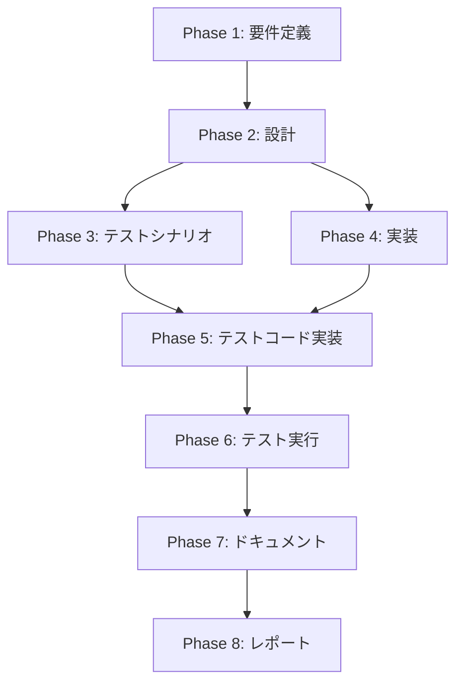
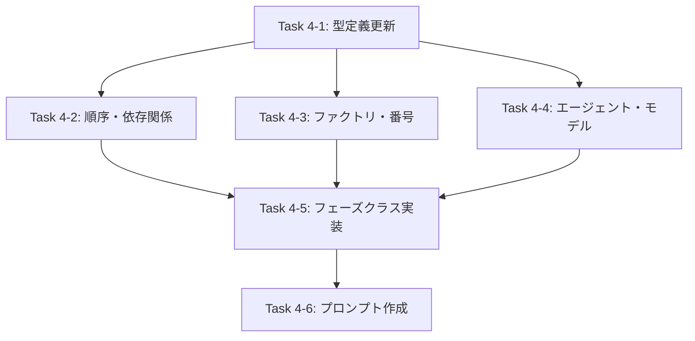
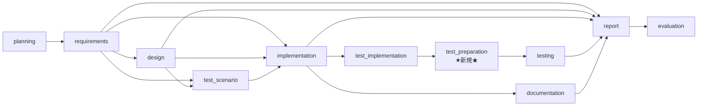

# プロジェクト計画書: Issue #692 - test_preparation フェーズの追加

## 1. Issue分析

### 概要

本Issueは、`execute` コマンドのワークフローにおいて、テスト実装（`test_implementation`）フェーズとテスト実行（`testing`）フェーズの間に、新規の **テスト準備（`test_preparation`）フェーズ** を追加する変更である。

Docker コンテナ内でテスト実行時に、対象リポジトリの開発言語ランタイムやライブラリがインストールされておらず、テストが失敗するケースが頻発している。この問題を根本的に解決するため、テスト実行前に環境を自動準備するフェーズを導入する。

### 複雑度: **中程度〜複雑**

**判定根拠**:
- **新規ファイル作成**: `TestPreparationPhase` クラス（1ファイル）、プロンプトファイル（6ファイル: ja/en x execute/review/revise）
- **既存ファイル変更**: 最低7ファイル（`types.ts`, `execute.ts`, `phase-dependencies.ts`, `phase-factory.ts`, `base-phase.ts`, `agent-setup.ts`, `model-optimizer.ts`）
- **フェーズ番号の変更**: 既存フェーズ（testing〜evaluation）の番号が06〜09から07〜10にシフトし、既存ワークフローとの後方互換性の考慮が必要
- **テスト追加**: ユニットテストおよび統合テストの新規作成・既存テスト修正
- **既存のフェーズ実装パターン**が明確に存在するため、ゼロからの設計は不要

### 見積もり工数: **16〜24時間**

| カテゴリ | 見積もり | 内訳 |
|---------|---------|------|
| 型定義・設定変更 | 2〜3h | types.ts, execute.ts, phase-dependencies.ts, phase-factory.ts, agent-setup.ts |
| フェーズクラス実装 | 4〜6h | TestPreparationPhase（execute/review/revise） |
| プロンプト作成 | 3〜4h | 日本語3ファイル + 英語3ファイル |
| base-phase.ts 変更 | 2〜3h | フェーズ番号マッピング変更、後方互換性対応 |
| model-optimizer.ts 変更 | 1〜2h | 難易度別モデルマッピング追加 |
| テスト作成・修正 | 3〜4h | ユニットテスト新規作成、既存テスト修正 |
| 統合テスト・検証 | 1〜2h | `npm run validate` で全体検証 |

### リスク評価: **中**

- フェーズ番号変更による既存ワークフローへの影響がリスク要因
- ただし、既存のフェーズ実装パターンが確立されており、実装自体の技術的リスクは低い

---

## 2. 実装戦略判断

### 実装戦略: **CREATE**

**判断根拠**:
- 新規フェーズクラス `TestPreparationPhase` の作成が中心的な作業
- 新規プロンプトファイル6ファイルの作成が必要
- 既存ファイルの変更は、新規フェーズの登録・統合のための定型的な追加が主
- 既存コードのリファクタリングは不要（フェーズ番号の調整は機械的な変更）
- `TestImplementationPhase` の実装パターンをテンプレートとして流用できるため、アーキテクチャ設計は不要

### テスト戦略: **UNIT_INTEGRATION**

**判断根拠**:
- **ユニットテスト**: `TestPreparationPhase` クラスの各メソッド（execute/review/revise）の単体テスト、フェーズ依存関係のバリデーションテスト、フェーズ番号マッピングのテスト
- **インテグレーションテスト**: `implementation` プリセットおよび `testing` プリセットで `test_preparation` が正しく実行順序に含まれることの検証、フェーズ間のコンテキスト受け渡しテスト
- **BDDテスト不要**: エンドユーザー向けUIの変更はなく、CLIの動作は既存のフレームワーク内で完結する

### テストコード戦略: **BOTH_TEST**

**判断根拠**:
- **CREATE_TEST**: `TestPreparationPhase` の新規テストファイル作成（`tests/unit/phases/test-preparation.test.ts`）
- **EXTEND_TEST**: 既存の統合テスト（フェーズ順序テスト、依存関係テスト、プリセットテスト）に `test_preparation` のケースを追加
- 既存の `execute.test.ts` や `phase-dependencies` 関連テストにもテストケース追加が必要

---

## 3. 影響範囲分析

### 既存コードへの影響

#### 直接変更が必要なファイル

| ファイル | 変更内容 | 影響度 |
|---------|---------|--------|
| `src/types.ts` | `PhaseName` 型に `'test_preparation'` を追加 | 低（型の拡張のみ） |
| `src/commands/execute.ts` | `PHASE_ORDER` 配列に追加 | 低（配列要素追加） |
| `src/core/phase-dependencies.ts` | `PHASE_DEPENDENCIES`, `PHASE_PRESETS`, `PRESET_DESCRIPTIONS` の更新 | 中（依存関係の変更） |
| `src/core/phase-factory.ts` | `createPhaseInstance()` に case 追加、import 追加 | 低（定型追加） |
| `src/phases/base-phase.ts` | `getPhaseNumber()` のマッピング更新（番号シフト） | **高**（既存フェーズ番号変更） |
| `src/commands/execute/agent-setup.ts` | `PHASE_AGENT_PRIORITY` に `test_preparation` 追加 | 低（マッピング追加） |
| `src/core/model-optimizer.ts` | 難易度別モデルマッピングに `test_preparation` 追加 | 低（マッピング追加） |

#### 新規作成ファイル

| ファイル | 説明 |
|---------|------|
| `src/phases/test-preparation.ts` | `TestPreparationPhase` クラス |
| `src/prompts/test_preparation/ja/execute.txt` | テスト準備実行プロンプト（日本語） |
| `src/prompts/test_preparation/ja/review.txt` | テスト準備レビュープロンプト（日本語） |
| `src/prompts/test_preparation/ja/revise.txt` | テスト準備修正プロンプト（日本語） |
| `src/prompts/test_preparation/en/execute.txt` | テスト準備実行プロンプト（英語） |
| `src/prompts/test_preparation/en/review.txt` | テスト準備レビュープロンプト（英語） |
| `src/prompts/test_preparation/en/revise.txt` | テスト準備修正プロンプト（英語） |

#### 影響を受ける既存テスト

| テストファイル | 修正内容 |
|--------------|---------|
| `tests/unit/commands/execute.test.ts` | フェーズ順序テスト、プリセットテストの更新 |
| `tests/unit/phases/base-phase-*.test.ts` | フェーズ番号マッピングテストの更新 |
| `tests/integration/` 内の関連テスト | フェーズ数の変更（10→11）に伴うアサーション更新 |

### 依存関係の変更

- **新規依存の追加**: なし（既存の依存パッケージで実装可能）
- **フェーズ依存関係の変更**:
  - `test_preparation` → `['test_implementation']` に依存（新規追加）
  - `testing` → `['test_implementation']` から `['test_preparation']` に変更

### マイグレーション要否

**フェーズ番号のシフトに関する方針**:

既存ワークフローとの後方互換性について検討が必要。`.ai-workflow/issue-*/` ディレクトリ構造で使用されるフェーズ番号が変わるため、以下の方針を推奨する：

- **新規ワークフローのみに適用**: フェーズ番号変更は新規 `init` 以降のワークフローにのみ適用される（既存のメタデータディレクトリは変更しない）
- **既存ワークフローの互換性**: `base-phase.ts` の `getPhaseNumber()` は新規ディレクトリ作成時にのみ使用されるため、既に完了した既存ワークフローのディレクトリ名には影響しない
- **サンプルワークフロー**: `.ai-workflow/issue-7`, `issue-10`, `issue-105` は旧番号体系のまま保持（リファレンス用）

---

## 4. タスク分割

### Phase 1: 要件定義 (見積もり: 2〜3h)

- [x] Task 1-1: 機能要件の明確化 (1〜2h)
  - `test_preparation` フェーズの責務を定義（言語ランタイムのインストール、依存パッケージの解決、テストフレームワークのセットアップ、環境検証）
  - 入力コンテキスト（どのフェーズの成果物を参照するか）の定義
  - 出力成果物（`test-preparation.md`）のフォーマット定義
  - フェーズ間のデータフロー仕様（implementation → test_implementation → test_preparation → testing）

- [x] Task 1-2: 非機能要件の明確化 (0.5〜1h)
  - エージェント実行のタイムアウト設定（maxTurns: 80 を推奨）
  - フォールバック機構の適用要否（enableFallback: true を推奨）
  - 後方互換性要件（既存ワークフローへの非影響）
  - 多言語対応要件（日本語/英語プロンプト）

- [x] Task 1-3: 受け入れ基準の定義 (0.5h)
  - `npm run validate` が全件パスすること
  - `--phase all` 実行時に test_preparation が test_implementation と testing の間で実行されること
  - `implementation` プリセットに test_preparation が含まれること
  - 日本語・英語の両方のプロンプトが存在すること

### Phase 2: 設計 (見積もり: 3〜4h)

- [x] Task 2-1: TestPreparationPhase クラスの詳細設計 (1〜2h)
  - クラス図の作成（BasePhase からの継承関係）
  - execute() メソッドの設計（参照するコンテキスト: test_implementation, implementation, test_scenario）
  - review() メソッドの設計（環境準備の検証基準）
  - revise() メソッドの設計（環境準備の再実行ロジック）
  - 出力ファイル名の決定（`test-preparation.md`）

- [x] Task 2-2: フェーズ統合設計 (1〜1.5h)
  - フェーズ番号マッピングの設計（`test_preparation: '06'`, testing〜evaluation の番号シフト）
  - 依存関係グラフの設計（`test_preparation: ['test_implementation']`, `testing: ['test_preparation']`）
  - エージェント優先順位の決定（`codex-first`: テスト環境構築はコード実行が主）
  - モデルマッピングの設計（実装系フェーズと同等の設定）

- [x] Task 2-3: プロンプト設計 (1h)
  - execute プロンプトの構造設計（言語検出 → ランタイムインストール → 依存解決 → 検証）
  - review プロンプトの構造設計（環境準備の完了判定基準）
  - revise プロンプトの構造設計（レビューフィードバックに基づく再準備）
  - テンプレート変数の定義（`{planning_document_path}`, `{test_implementation_context}`, `{implementation_context}`, `{issue_number}`）

### Phase 3: テストシナリオ (見積もり: 2〜3h)

- [ ] Task 3-1: ユニットテストシナリオ設計 (1〜1.5h)
  - TestPreparationPhase コンストラクタのテスト（phaseName が 'test_preparation' であること）
  - execute() メソッドのテスト（正常系: コンテキスト構築とテンプレート実行、異常系: メタデータ不足時のエラーハンドリング）
  - review() メソッドのテスト（出力ファイル存在チェック、レビュー結果パース）
  - revise() メソッドのテスト（レビューフィードバック適用、ファイル更新確認）

- [ ] Task 3-2: 統合テストシナリオ設計 (1〜1.5h)
  - PHASE_ORDER の順序テスト（test_preparation が test_implementation と testing の間）
  - PHASE_DEPENDENCIES のバリデーションテスト（test_preparation → test_implementation 依存）
  - PHASE_PRESETS の更新テスト（implementation プリセットに test_preparation 含む）
  - getPhaseNumber() のマッピングテスト（test_preparation: '06', testing: '07'〜evaluation: '10'）
  - PHASE_AGENT_PRIORITY のマッピングテスト（test_preparation: 'codex-first'）
  - model-optimizer のマッピングテスト（全難易度レベルで test_preparation の設定存在）

-### Phase 4: 実装 (見積もり: 6〜8h)

- [x] Task 4-1: 型定義の更新 (0.5h)
  - `src/types.ts` の `PhaseName` 型に `'test_preparation'` を追加

- [x] Task 4-2: フェーズ順序・依存関係の更新 (1〜1.5h)
  - `src/commands/execute.ts` の `PHASE_ORDER` に `'test_preparation'` を追加
  - `src/core/phase-dependencies.ts` の `PHASE_DEPENDENCIES` に `test_preparation: ['test_implementation']` を追加
  - `src/core/phase-dependencies.ts` の `testing` の依存を `['test_preparation']` に変更
  - `src/core/phase-dependencies.ts` の `PHASE_PRESETS` を更新（`implementation`, `testing`, `full-test` プリセット）
  - `src/core/phase-dependencies.ts` の `PRESET_DESCRIPTIONS` を更新

- [x] Task 4-3: フェーズファクトリ・番号マッピングの更新 (1h)
  - `src/core/phase-factory.ts` に `TestPreparationPhase` の import と case 追加
  - `src/phases/base-phase.ts` の `getPhaseNumber()` にマッピング追加（`test_preparation: '06'`）
  - 既存フェーズ番号のシフト（testing: '07', documentation: '08', report: '09', evaluation: '10'）

- [x] Task 4-4: エージェント優先順位・モデル設定の更新 (0.5h)
  - `src/commands/execute/agent-setup.ts` の `PHASE_AGENT_PRIORITY` に `test_preparation: 'codex-first'` を追加
  - `src/core/model-optimizer.ts` の全難易度マッピングに `test_preparation` を追加

- [x] Task 4-5: TestPreparationPhase クラスの実装 (2〜3h)
  - `src/phases/test-preparation.ts` の新規作成
  - `execute()` メソッドの実装（test_implementation, implementation, test_scenario コンテキストの参照、executePhaseTemplate 呼び出し）
  - `review()` メソッドの実装（test-preparation.md の存在チェック、レビュープロンプトの実行、結果パース・GitHub投稿）
  - `revise()` メソッドの実装（レビューフィードバックに基づく再実行、ファイル更新確認）

- [x] Task 4-6: プロンプトファイルの作成 (2〜3h)
  - `src/prompts/test_preparation/ja/execute.txt` の作成（言語検出、ランタイムインストール、依存解決、環境検証の指示）
  - `src/prompts/test_preparation/ja/review.txt` の作成（環境準備完了の判定基準）
  - `src/prompts/test_preparation/ja/revise.txt` の作成（レビューフィードバックに基づく修正指示）
  - `src/prompts/test_preparation/en/execute.txt` の作成（英語版）
  - `src/prompts/test_preparation/en/review.txt` の作成（英語版）
  - `src/prompts/test_preparation/en/revise.txt` の作成（英語版）

### Phase 5: テストコード実装 (見積もり: 3〜4h)

- [ ] Task 5-1: TestPreparationPhase ユニットテストの作成 (2〜2.5h)
  - `tests/unit/phases/test-preparation.test.ts` の新規作成
  - コンストラクタテスト（phaseName の検証）
  - execute() のテスト（モック環境でのコンテキスト構築・テンプレート実行の検証）
  - review() のテスト（出力ファイルチェック、レビュー結果パースの検証）
  - revise() のテスト（フィードバック適用の検証）

- [ ] Task 5-2: 既存テストの修正 (1〜1.5h)
  - `tests/unit/commands/execute.test.ts` のフェーズ順序テスト更新
  - フェーズ依存関係テストへの test_preparation ケース追加
  - フェーズ番号マッピングテストの更新（番号シフトの反映）
  - `PHASE_AGENT_PRIORITY` テストの更新
  - プリセットテストの更新

### Phase 6: テスト実行 (見積もり: 1〜2h)

- [ ] Task 6-1: テスト実行と修正 (1〜2h)
  - `npm run test:unit` で全ユニットテストの実行
  - `npm run test:integration` で全統合テストの実行
  - `npm run lint` で型チェックの実行
  - `npm run build` でビルド確認
  - `npm run validate` で統合検証
  - テスト失敗箇所の修正

### Phase 7: ドキュメント (見積もり: 1〜2h)

- [ ] Task 7-1: ドキュメント更新 (1〜2h)
  - `CLAUDE.md` のフェーズ番号関連記述の更新（10フェーズ → 11フェーズ）
  - `README.md` の10フェーズワークフロー表に `test_preparation` を追加
  - `docs/ARCHITECTURE.md` のフェーズ実行フロー図の更新
  - `docs/CLI_REFERENCE.md` のフェーズ一覧更新

### Phase 8: レポート (見積もり: 0.5〜1h)

- [ ] Task 8-1: 実装レポートの作成 (0.5〜1h)
  - エグゼクティブサマリー（変更概要、影響範囲）
  - マージチェックリスト（テスト結果、ビルド結果、後方互換性確認）
  - 既知の制限事項（既存ワークフローのディレクトリ名は旧番号のまま）

---

## 5. 依存関係

### タスク間の依存関係

### 実装タスク内の依存関係

### フェーズ依存関係（変更後のワークフロー）

---

## 6. リスクと軽減策

### リスク1: フェーズ番号シフトによる既存ワークフローの破損
- **影響度**: 高
- **確率**: 低
- **説明**: `getPhaseNumber()` の変更により、既存の `.ai-workflow/issue-*/` ディレクトリ構造との不整合が発生する可能性
- **軽減策**:
  - `getPhaseNumber()` は新規ディレクトリ作成時にのみ使用されることを確認済み
  - 既存の `.ai-workflow/issue-7`, `issue-10`, `issue-105` サンプルディレクトリは旧番号のまま保持
  - テスト実行時に既存サンプルワークフローとの互換性を検証

### リスク2: 既存テストの大量修正
- **影響度**: 中
- **確率**: 中
- **説明**: フェーズ数が10から11に増加することで、フェーズ数に依存するテストアサーションが失敗する可能性
- **軽減策**:
  - フェーズ数をハードコードしているテストを事前に特定し、修正対象を明確化
  - `npm run validate` で全テストの通過を確認してからPR作成

### リスク3: プロンプト品質の不足
- **影響度**: 中
- **確率**: 中
- **説明**: test_preparation フェーズのプロンプトが不十分で、エージェントが適切に環境準備を実行できない可能性
- **軽減策**:
  - 既存の testing フェーズプロンプトを参考に、具体的なインストール手順を明示
  - `base-phase.ts` の `buildEnvironmentInfoSection()` で提供される情報と連携
  - review/revise サイクルで環境準備の不備を検出・修正

### リスク4: プリセット更新の漏れ
- **影響度**: 低
- **確率**: 中
- **説明**: `PHASE_PRESETS` の更新が不完全で、特定のプリセット実行時に test_preparation がスキップされる可能性
- **軽減策**:
  - 全プリセット（`implementation`, `testing`, `full-test`）を列挙し、更新対象を明確化
  - プリセット実行のテストケースを追加

### リスク5: model-optimizer のマッピング漏れ
- **影響度**: 低
- **確率**: 低
- **説明**: `model-optimizer.ts` の全難易度レベル（simple/moderate/complex）で test_preparation のモデル設定が漏れ、実行時エラーが発生する可能性
- **軽減策**:
  - 全難易度レベルのマッピングを網羅的に追加
  - TypeScript の型チェックで漏れを検出

---

## 7. 品質ゲート

### Phase 1: 要件定義
- [ ] `test_preparation` フェーズの責務（4つのタスク）が明確に定義されている
- [ ] 入力コンテキスト（参照するフェーズの成果物）が明確に定義されている
- [ ] 出力成果物（`test-preparation.md`）のフォーマットが定義されている
- [ ] 受け入れ基準が定義され、検証可能である
- [ ] 後方互換性要件が明確である

### Phase 2: 設計
- [ ] 実装戦略の判断根拠が明記されている（CREATE）
- [ ] テスト戦略の判断根拠が明記されている（UNIT_INTEGRATION）
- [ ] テストコード戦略の判断根拠が明記されている（BOTH_TEST）
- [ ] `TestPreparationPhase` クラスの設計が BasePhase のパターンに準拠している
- [ ] フェーズ番号マッピングの変更方針が明確である
- [ ] 依存関係グラフが整合性を持っている
- [ ] プロンプトのテンプレート変数が定義されている

### Phase 3: テストシナリオ
- [ ] ユニットテストシナリオが execute/review/revise の各メソッドをカバーしている
- [ ] 統合テストシナリオがフェーズ順序・依存関係・プリセットをカバーしている
- [ ] 異常系テスト（ファイル未存在、メタデータ不足）が含まれている
- [ ] フェーズ番号マッピングのテストが含まれている

### Phase 4: 実装
- [ ] `PhaseName` 型に `'test_preparation'` が追加されている
- [ ] `PHASE_ORDER` に `test_preparation` が正しい位置に挿入されている
- [ ] `PHASE_DEPENDENCIES` に `test_preparation` の依存関係が定義されている
- [ ] `testing` の依存が `['test_preparation']` に更新されている
- [ ] `createPhaseInstance()` に `test_preparation` の case が追加されている
- [ ] `getPhaseNumber()` のマッピングが更新されている（番号シフト含む）
- [ ] `PHASE_AGENT_PRIORITY` に `test_preparation` が追加されている
- [ ] `model-optimizer.ts` の全難易度レベルに `test_preparation` が追加されている
- [ ] `TestPreparationPhase` クラスが `execute()`, `review()`, `revise()` を実装している
- [ ] 日本語・英語の各プロンプトファイル（6ファイル）が作成されている
- [ ] コーディング規約に準拠している（logger使用、Config使用、error-utils使用）

### Phase 5: テストコード実装
- [ ] `TestPreparationPhase` のユニットテストが作成されている
- [ ] 既存テストが更新されている（フェーズ順序、番号マッピング、プリセット）
- [ ] テストで jest.restoreAllMocks() による適切なクリーンアップが行われている

### Phase 6: テスト実行
- [ ] `npm run lint` が成功する（TypeScript 型チェック）
- [ ] `npm run test:unit` が全件パスする
- [ ] `npm run test:integration` が全件パスする
- [ ] `npm run build` が成功する
- [ ] `npm run validate` が全件パスする

### Phase 7: ドキュメント
- [ ] `CLAUDE.md` のフェーズ関連記述が更新されている
- [ ] `README.md` のフェーズ一覧表が更新されている
- [ ] フェーズ数の記述が10から11に更新されている

---

## 補足: 設計判断の詳細

### フェーズ番号の割り当て方針

Issue本文で提案されている `05b_test_preparation` 形式ではなく、標準的な連番方式（`06_test_preparation`）を採用する。

**理由**:
1. 既存のコードベースは整数番号のみを前提としている（`getPhaseNumber()` は string 型を返すが、2桁の数字文字列が慣例）
2. `05b` のような非標準的な番号は、ソート順序やパーサーの互換性に問題を起こす可能性がある
3. 既存ワークフロー（`.ai-workflow/issue-7` 等）は読み取り専用のリファレンスであり、番号変更の影響を受けない
4. 新規ワークフロー（`init` コマンドで初期化するもの）のみが新番号体系を使用する

### エージェント優先順位の決定

`test_preparation` のエージェント優先順位は **`codex-first`** とする。

**理由**:
1. テスト環境の構築は、具体的なコマンド実行（`apt-get install`, `pip install`, `npm install`）が主な作業
2. 既存の `implementation`, `test_implementation`, `testing` と同じカテゴリ（コード実行中心）
3. Codex は実際のコマンド実行とその結果の解釈に優れている

### モデル設定の方針

`test_preparation` のモデル設定は `testing` フェーズと同等とする。

| 難易度 | execute | review | revise |
|--------|---------|--------|--------|
| simple | sonnet/mini | sonnet/mini | sonnet/mini |
| moderate | opus/max | sonnet/mini | opus/max |
| complex | opus/max | sonnet/mini | opus/max |

**理由**: テスト準備は testing フェーズの前段階であり、同等の複雑度を持つと判断。
