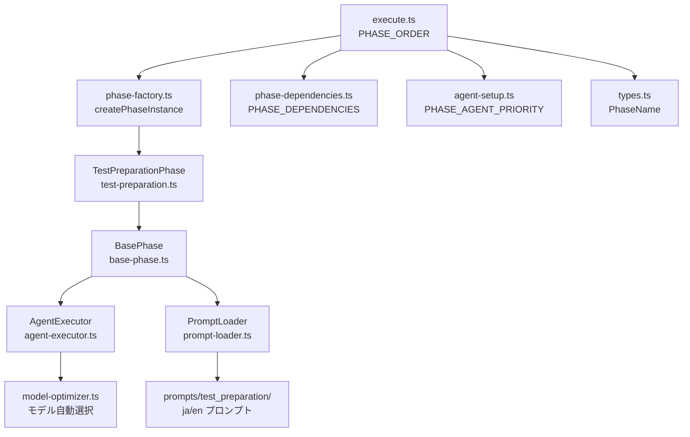
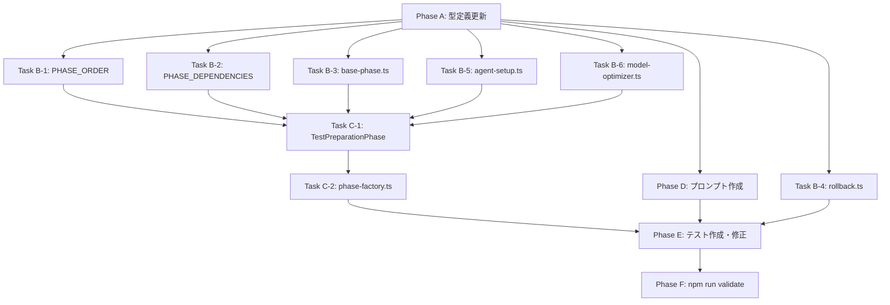

# 詳細設計書: Issue #692 - test_preparation フェーズの追加

## 0. 要件定義書・Planning Document の確認

### 要件定義書の要約

要件定義書（`.ai-workflow/issue-692/01_requirements/output/requirements.md`）では、以下の機能要件（FR-001〜FR-011）および非機能要件（NFR-001〜NFR-005）が定義されている。本設計書は、これらの要件を実装可能な詳細設計に落とし込むものである。

### Planning Document の要約

Planning Document（`.ai-workflow/issue-692/00_planning/output/planning.md`）では、以下が確定している：

- **実装戦略**: CREATE（新規作成中心）
- **テスト戦略**: UNIT_INTEGRATION
- **テストコード戦略**: BOTH_TEST
- **複雑度**: 中程度〜複雑（16〜24時間）
- **リスク**: 中（フェーズ番号変更が主なリスク）

本設計書では、Planning Document の方針を踏襲しつつ、コードレベルの詳細設計を提供する。

---

## 1. アーキテクチャ設計

### 1.1 システム全体図

```
┌─────────────────────────────────────────────────────────────────┐
│                        CLI Layer                                 │
│  src/main.ts → src/commands/execute.ts (PHASE_ORDER)            │
│                                                                  │
│  PHASE_ORDER (11フェーズ):                                       │
│  planning → requirements → design → test_scenario →             │
│  implementation → test_implementation → test_preparation(新規) → │
│  testing → documentation → report → evaluation                  │
└────────────────────────┬────────────────────────────────────────┘
                         │
┌────────────────────────▼────────────────────────────────────────┐
│                    Phase Layer                                   │
│                                                                  │
│  src/phases/base-phase.ts (抽象基底クラス)                       │
│    ├── execute() → review() → revise() ライフサイクル            │
│    ├── executePhaseTemplate()                                    │
│    ├── buildOptionalContext()                                    │
│    ├── getPhaseNumber() マッピング                               │
│    └── extractContentFromLog() ヘッダーパターン                  │
│                                                                  │
│  src/phases/test-preparation.ts (★新規★)                        │
│    ├── execute(): 環境準備実行                                    │
│    ├── review(): 準備完了検証                                     │
│    └── revise(): フィードバック反映                               │
│                                                                  │
│  関連フェーズ:                                                    │
│    src/phases/test-implementation.ts (前段: テストコード実装)     │
│    src/phases/testing.ts (後段: テスト実行)                       │
└────────────────────────┬────────────────────────────────────────┘
                         │
┌────────────────────────▼────────────────────────────────────────┐
│                    Core Layer                                    │
│                                                                  │
│  src/core/phase-factory.ts     → TestPreparationPhase 生成      │
│  src/core/phase-dependencies.ts → 依存関係・プリセット定義       │
│  src/core/model-optimizer.ts   → モデル自動選択設定              │
│  src/commands/execute/agent-setup.ts → エージェント優先順位      │
│                                                                  │
│  src/types.ts → PhaseName 型定義                                 │
│  src/commands/rollback.ts → getPhaseNumber() (別実装)            │
└────────────────────────┬────────────────────────────────────────┘
                         │
┌────────────────────────▼────────────────────────────────────────┐
│                   Prompt Layer                                   │
│                                                                  │
│  src/prompts/test_preparation/ (★新規★)                         │
│    ├── ja/execute.txt  │  en/execute.txt                        │
│    ├── ja/review.txt   │  en/review.txt                         │
│    └── ja/revise.txt   │  en/revise.txt                         │
└─────────────────────────────────────────────────────────────────┘
```

### 1.2 コンポーネント間の関係



### 1.3 データフロー

```
[test_implementation フェーズ]
  └─ 成果物: test-implementation.md
       │
       ▼
[test_preparation フェーズ] ★新規★
  ├─ 入力:
  │   ├─ test-implementation.md (テスト実装情報)
  │   ├─ implementation.md (実装言語・フレームワーク情報)
  │   └─ planning.md (全体計画)
  │
  ├─ execute(): エージェントが以下を実行
  │   ├─ 言語ランタイム検出・インストール
  │   ├─ 依存パッケージインストール
  │   ├─ テストフレームワークセットアップ
  │   └─ 環境検証
  │
  ├─ review(): 環境準備の完了を検証
  │   └─ PASS / PASS_WITH_SUGGESTIONS / FAIL 判定
  │
  ├─ revise(): review結果に基づく再準備
  │
  └─ 成果物: test-preparation.md
       │
       ▼
[testing フェーズ]
  └─ 入力: test-preparation.md の環境情報を活用
```

---

## 2. 実装戦略判断

### 実装戦略: CREATE

**判断根拠**:
- 新規ファイル `TestPreparationPhase` クラス（`src/phases/test-preparation.ts`）の作成が中心的な作業である
- 新規プロンプトファイル 6 ファイル（日本語/英語 × execute/review/revise）の作成が必要である
- 既存ファイルへの変更は、新規フェーズの登録・統合のための定型的な追加が主であり、既存コードのリファクタリングは不要である
- `TestImplementationPhase`（`src/phases/test-implementation.ts`, 227行）の実装パターンをそのままテンプレートとして流用できるため、設計上の不確実性が低い
- フェーズ番号のシフトは機械的な変更であり、ロジックの変更は伴わない

---

## 3. テスト戦略判断

### テスト戦略: UNIT_INTEGRATION

**判断根拠**:
- **ユニットテスト必須**: `TestPreparationPhase` クラスの各メソッド（execute/review/revise）の単体テスト、フェーズ番号マッピングの正確性検証、依存関係定義の検証が必要
- **統合テスト必須**: プリセット実行時の正しいフェーズ順序、フェーズ間の依存関係整合性、`PHASE_ORDER` の総数検証（10→11）が必要。既存の統合テスト（`tests/integration/preset-execution.test.ts`）がフェーズ数やプリセット内容を厳密に検証しているため、これらの更新が不可欠
- **BDD テスト不要**: エンドユーザー向け UI の変更はなく、CLI の動作は既存フレームワーク内で完結する。ユーザーストーリーの追加もないため、BDD テストの追加は不要

---

## 4. テストコード戦略判断

### テストコード戦略: BOTH_TEST

**判断根拠**:
- **CREATE_TEST**: `TestPreparationPhase` のユニットテストファイル（`tests/unit/phases/test-preparation.test.ts`）は存在しないため新規作成が必要。なお、既存の `test-implementation.test.ts` も存在しないが、本 Issue のスコープ外とする
- **EXTEND_TEST**: 以下の既存テストファイルにテストケース追加・アサーション更新が必要:
  - `tests/unit/phase-dependencies.test.ts`: プリセット定義テスト（プリセット内容の更新）
  - `tests/unit/commands/execute.test.ts`: フェーズ順序テスト（プリセット内容の更新）
  - `tests/unit/commands/rollback.test.ts`: `getPhaseNumber()` のマッピングテスト
  - `tests/unit/commands/rollback-auto.test.ts`: `getPhaseNumber()` のマッピングテスト
  - `tests/integration/preset-execution.test.ts`: プリセット統合テスト（プリセット内容の更新）

---

## 5. 影響範囲分析

### 5.1 既存コードへの影響

#### 5.1.1 型レベルの波及（TypeScript コンパイラによる自動検出）

`PhaseName` 型に `'test_preparation'` を追加すると、TypeScript コンパイラが `Record<PhaseName, ...>` を使用するすべての箇所で `test_preparation` エントリの欠如を検出する。これにより、以下のファイルで変更が強制される：

| ファイル | 影響を受ける型 | 影響度 |
|---------|-------------|--------|
| `src/phases/base-phase.ts` | `getPhaseNumber()` 内の `Record<PhaseName, string>` | **高** |
| `src/phases/base-phase.ts` | `extractContentFromLog()` 内の `Record<PhaseName, RegExp>` | 低 |
| `src/commands/execute/agent-setup.ts` | `PHASE_AGENT_PRIORITY: Record<PhaseName, AgentPriority>` | 低 |
| `src/core/phase-dependencies.ts` | `PHASE_DEPENDENCIES: Record<PhaseName, PhaseName[]>` | 中 |
| `src/core/model-optimizer.ts` | `Record<PhaseName, ModelConfigByStep>` (3箇所) | 低 |
| `src/commands/rollback.ts` | `getPhaseNumber()` 内の `Record<PhaseName, string>` | 中 |

#### 5.1.2 直接変更が必要なファイル（詳細）

| # | ファイル | 変更内容 | 影響度 | 要件トレース |
|---|---------|---------|--------|------------|
| 1 | `src/types.ts` L1-11 | `PhaseName` 型に `'test_preparation'` を追加 | 低 | FR-001 |
| 2 | `src/commands/execute.ts` L36-47 | `PHASE_ORDER` 配列に `'test_preparation'` を挿入 | 低 | FR-002 |
| 3 | `src/core/phase-dependencies.ts` L9-20 | `PHASE_DEPENDENCIES` に `test_preparation` 追加、`testing` の依存を変更 | 中 | FR-003 |
| 4 | `src/core/phase-dependencies.ts` L22-45 | `PHASE_PRESETS` の `implementation`, `testing` プリセットを更新 | 中 | FR-004 |
| 5 | `src/core/phase-dependencies.ts` L55-67 | `PRESET_DESCRIPTIONS` の該当プリセット説明を更新 | 低 | FR-004 |
| 6 | `src/core/phase-factory.ts` L27-69 | `createPhaseInstance()` に `case 'test_preparation'` を追加 | 低 | FR-006 |
| 7 | `src/phases/base-phase.ts` L668-682 | `getPhaseNumber()` マッピング更新（番号シフト含む） | **高** | FR-007 |
| 8 | `src/phases/base-phase.ts` L841-853 | `extractContentFromLog()` ヘッダーパターン追加 | 低 | FR-011 |
| 9 | `src/commands/execute/agent-setup.ts` L48-59 | `PHASE_AGENT_PRIORITY` に `test_preparation` 追加 | 低 | FR-008 |
| 10 | `src/core/model-optimizer.ts` L21-100 | 3つの難易度マッピング関数に `test_preparation` 追加 | 低 | FR-009 |
| 11 | `src/commands/rollback.ts` L490-504 | `getPhaseNumber()` マッピング更新（番号シフト含む） | 中 | FR-007 |

#### 5.1.3 新規作成ファイル

| # | ファイルパス | 説明 | 要件トレース |
|---|------------|------|------------|
| 1 | `src/phases/test-preparation.ts` | `TestPreparationPhase` クラス | FR-005 |
| 2 | `src/prompts/test_preparation/ja/execute.txt` | テスト準備実行プロンプト（日本語） | FR-010-A |
| 3 | `src/prompts/test_preparation/ja/review.txt` | テスト準備レビュープロンプト（日本語） | FR-010-B |
| 4 | `src/prompts/test_preparation/ja/revise.txt` | テスト準備修正プロンプト（日本語） | FR-010-C |
| 5 | `src/prompts/test_preparation/en/execute.txt` | テスト準備実行プロンプト（英語） | FR-010-A |
| 6 | `src/prompts/test_preparation/en/review.txt` | テスト準備レビュープロンプト（英語） | FR-010-B |
| 7 | `src/prompts/test_preparation/en/revise.txt` | テスト準備修正プロンプト（英語） | FR-010-C |

#### 5.1.4 削除が必要なファイル

なし。

### 5.2 依存関係の変更

#### フェーズ依存関係の変更

```
【変更前】
test_implementation → testing (直接依存)

【変更後】
test_implementation → test_preparation → testing (間接依存チェーン)
```

具体的な変更:
- **追加**: `test_preparation: ['test_implementation']`（test_preparation は test_implementation に依存）
- **変更**: `testing: ['test_implementation']` → `testing: ['test_preparation']`（testing の依存先を変更）

この変更により、`testing` フェーズは `test_preparation` が `completed` 状態でないと実行できなくなる。`test_preparation` は `test_implementation` に依存するため、推移的に `test_implementation` → `test_preparation` → `testing` の順序が保証される。

#### 循環依存の不在確認

変更後の依存グラフに循環は発生しない：
```
planning(0依存) → requirements → design → test_scenario → implementation
                                                              → test_implementation
                                                                  → test_preparation（新規）
                                                                      → testing
                                           implementation → documentation
                  requirements,design,implementation,testing,documentation → report → evaluation
```

### 5.3 マイグレーション要否

#### フェーズ番号のシフト

| フェーズ | 変更前 | 変更後 | 影響 |
|---------|-------|-------|------|
| planning | 00 | 00 | なし |
| requirements | 01 | 01 | なし |
| design | 02 | 02 | なし |
| test_scenario | 03 | 03 | なし |
| implementation | 04 | 04 | なし |
| test_implementation | 05 | 05 | なし |
| **test_preparation** | — | **06** | **新規追加** |
| testing | 06 | **07** | **番号変更** |
| documentation | 07 | **08** | **番号変更** |
| report | 08 | **09** | **番号変更** |
| evaluation | 09 | **10** | **番号変更** |

#### マイグレーション方針

**新規ワークフローのみに適用**（マイグレーション不要）:

1. `getPhaseNumber()` は新規ディレクトリ作成時にのみ使用される（`base-phase.ts` コンストラクタで `phaseDir` を構築する際）
2. 既存の `.ai-workflow/issue-7`, `issue-10`, `issue-105` サンプルディレクトリは旧番号体系のまま保持される（読み取り専用リファレンス）
3. 既に完了した既存ワークフローのディレクトリ名は変更しない
4. `getPhaseNumber()` は **2箇所に独立して存在する**（`base-phase.ts` と `rollback.ts`）ため、両方を同期して更新する必要がある

### 5.4 影響を受けるテストファイル

| テストファイル | 修正内容 | 影響度 |
|-------------|---------|--------|
| `tests/unit/phase-dependencies.test.ts` | プリセット定義テスト（`implementation`, `testing` プリセットの期待値更新） | 中 |
| `tests/unit/commands/execute.test.ts` | `getPresetPhases()` テスト（`implementation` プリセットの期待値更新） | 中 |
| `tests/unit/commands/rollback.test.ts` | `getPhaseNumber()` テスト（番号シフトの反映） | 中 |
| `tests/unit/commands/rollback-auto.test.ts` | `getPhaseNumber()` テスト（番号シフトの反映） | 中 |
| `tests/integration/preset-execution.test.ts` | プリセット統合テスト（プリセット内容、依存関係の更新） | 中 |
| `tests/integration/phases/fallback-mechanism.test.ts` | ディレクトリパス参照がハードコードされている場合の確認 | 低 |

### 5.5 新規作成テストファイル

| テストファイル | 内容 |
|-------------|------|
| `tests/unit/phases/test-preparation.test.ts` | `TestPreparationPhase` のユニットテスト |

---

## 6. 詳細設計

### 6.1 型定義の変更

#### `src/types.ts` - PhaseName 型

```typescript
// 変更前
export type PhaseName =
  | 'planning'
  | 'requirements'
  | 'design'
  | 'test_scenario'
  | 'implementation'
  | 'test_implementation'
  | 'testing'
  | 'documentation'
  | 'report'
  | 'evaluation';

// 変更後
export type PhaseName =
  | 'planning'
  | 'requirements'
  | 'design'
  | 'test_scenario'
  | 'implementation'
  | 'test_implementation'
  | 'test_preparation'     // ★追加
  | 'testing'
  | 'documentation'
  | 'report'
  | 'evaluation';
```

**設計判断**: `PhasesMetadata` 型は `PhaseName` を使用した Mapped Type であり、`test_preparation` が自動的に含まれるため追加の型変更は不要。TypeScript コンパイラが `Record<PhaseName, ...>` を使用するすべての箇所で漏れを静的に検出する。

### 6.2 TestPreparationPhase クラス設計

#### クラス図

```
BasePhase (abstract)
  │
  ├── TestImplementationPhase  (参考: テンプレートパターン)
  ├── TestPreparationPhase     ★新規★
  └── TestingPhase             (後段フェーズ)
```

#### `src/phases/test-preparation.ts` の詳細設計

```typescript
import * as fs from 'node:fs';
import { logger } from '../utils/logger.js';
import path from 'node:path';
import { BasePhase, type PhaseInitializationParams } from './base-phase.js';
import { PhaseExecutionResult } from '../types.js';

export class TestPreparationPhase extends BasePhase {
  constructor(params: PhaseInitializationParams) {
    super({ ...params, phaseName: 'test_preparation' });
  }

  // --- execute() ---
  // 責務: テスト実行環境の自動準備
  // 参照コンテキスト: test_implementation, implementation, planning
  // 出力: test-preparation.md
  // エージェントオプション: maxTurns: 80, enableFallback: true
  protected async execute(): Promise<PhaseExecutionResult>;

  // --- review() ---
  // 責務: テスト環境準備の完了検証
  // 検証対象: test-preparation.md の存在と内容
  // 結果: PASS / PASS_WITH_SUGGESTIONS / FAIL
  protected async review(): Promise<PhaseExecutionResult>;

  // --- revise() ---
  // 責務: レビューフィードバックに基づく環境準備の修正
  // 入力: reviewFeedback (string)
  // 出力: test-preparation.md の更新
  public async revise(reviewFeedback: string): Promise<PhaseExecutionResult>;
}
```

#### execute() メソッドの詳細設計

`TestImplementationPhase.execute()` のパターンを踏襲する。

```
入力:
  1. issueNumber: metadata.data.issue_number から取得
  2. testImplementationContext: buildOptionalContext('test_implementation', 'test-implementation.md', ...)
  3. implementationContext: buildOptionalContext('implementation', 'implementation.md', ...)
  4. planningDocumentPath: getPlanningDocumentReference(issueNumber)

処理:
  executePhaseTemplate('test-preparation.md', {
    planning_document_path: planningDocumentPath,
    test_implementation_context: testImplementationContext,
    implementation_context: implementationContext,
    issue_number: String(issueNumber),
  }, {
    maxTurns: 80,
    enableFallback: true,
  })

出力:
  PhaseExecutionResult (成功時: .ai-workflow/issue-{N}/06_test_preparation/output/test-preparation.md)
```

**設計判断**:
- `maxTurns: 80` は `test_implementation` および `testing` と同等。コマンド実行（`apt-get install`, `pip install`, `npm install` 等）が複数回必要なため、十分なターン数を確保
- `enableFallback: true` はエージェントが成果物ファイルを生成しなかった場合のリカバリを有効化
- テンプレート変数は最小限に留め、`test_implementation_context` と `implementation_context` から言語・フレームワーク情報を推論する設計

#### review() メソッドの詳細設計

`TestImplementationPhase.review()` のパターンを踏襲する。

```
入力:
  1. outputFile: test-preparation.md (outputDir 内)
  2. implementationContext: buildOptionalContext('implementation', 'implementation.md', ...)
  3. testImplementationContext: buildOptionalContext('test_implementation', 'test-implementation.md', ...)
  4. planningDocumentPath: getPlanningDocumentReference(issueNumber)

処理:
  1. outputFile の存在確認 → 不在の場合は FAIL 結果を返す
  2. レビュープロンプトのロードとテンプレート変数の置換
  3. executeWithAgent() でレビューを実行
  4. ContentParser.parseReviewResult() で結果を解析（PASS/FAIL判定）
  5. レビュー結果を result.md として保存
  6. GitHub Issue にレビュー結果を投稿

出力:
  PhaseExecutionResult (レビュー結果)
```

**review プロンプトのテンプレート変数**:
- `{test_preparation_document_path}`: test-preparation.md へのパス
- `{implementation_document_path}`: implementation.md へのパス
- `{test_implementation_document_path}`: test-implementation.md へのパス
- `{planning_document_path}`: planning.md へのパス

#### revise() メソッドの詳細設計

`TestImplementationPhase.revise()` のパターンを踏襲する。

```
入力:
  1. reviewFeedback: string (レビューで検出された問題)
  2. outputFile: test-preparation.md (outputDir 内)
  3. implementationContext: buildOptionalContext('implementation', 'implementation.md', ...)
  4. testImplementationContext: buildOptionalContext('test_implementation', 'test-implementation.md', ...)

処理:
  1. outputFile の存在確認 → 不在の場合は FAIL 結果を返す
  2. ファイルの更新前タイムスタンプ・サイズを記録
  3. revise プロンプトのロードとテンプレート変数の置換
  4. executeWithAgent() でリビジョンを実行
  5. ファイルの更新後タイムスタンプ・サイズを確認し、実際に更新されたか検証

出力:
  PhaseExecutionResult (修正結果)
```

**revise プロンプトのテンプレート変数**:
- `{review_feedback}`: レビューフィードバック内容
- `{test_preparation_document_path}`: test-preparation.md へのパス
- `{implementation_document_path}`: implementation.md へのパス
- `{test_implementation_document_path}`: test-implementation.md へのパス
- `{issue_number}`: Issue 番号

### 6.3 フェーズ順序・依存関係の設計

#### PHASE_ORDER（`src/commands/execute.ts`）

```typescript
const PHASE_ORDER: PhaseName[] = [
  'planning',            // 00
  'requirements',        // 01
  'design',              // 02
  'test_scenario',       // 03
  'implementation',      // 04
  'test_implementation', // 05
  'test_preparation',    // 06 ★新規★
  'testing',             // 07
  'documentation',       // 08
  'report',              // 09
  'evaluation',          // 10
];
```

#### PHASE_DEPENDENCIES（`src/core/phase-dependencies.ts`）

```typescript
export const PHASE_DEPENDENCIES: Record<PhaseName, PhaseName[]> = {
  planning: [],
  requirements: ['planning'],
  design: ['requirements'],
  test_scenario: ['requirements', 'design'],
  implementation: ['requirements', 'design', 'test_scenario'],
  test_implementation: ['implementation'],
  test_preparation: ['test_implementation'],    // ★追加
  testing: ['test_preparation'],                // ★変更: test_implementation → test_preparation
  documentation: ['implementation'],
  report: ['requirements', 'design', 'implementation', 'testing', 'documentation'],
  evaluation: ['report'],
};
```

#### PHASE_PRESETS（`src/core/phase-dependencies.ts`）

```typescript
export const PHASE_PRESETS: Record<string, PhaseName[]> = {
  // Review-driven patterns（変更なし）
  'review-requirements': ['planning', 'requirements'],
  'review-design': ['planning', 'requirements', 'design'],
  'review-test-scenario': ['planning', 'requirements', 'design', 'test_scenario'],

  // Analysis/design patterns（変更なし）
  'analysis-design': ['planning', 'requirements', 'design'],

  // Prototype acceleration pattern（変更なし）
  'prototype': ['planning', 'design', 'implementation', 'report'],

  // Implementation-centered patterns
  'quick-fix': ['planning', 'implementation', 'documentation', 'report'],  // 変更なし
  'implementation': ['planning', 'implementation', 'test_implementation',
                     'test_preparation',  // ★追加
                     'testing', 'documentation', 'report'],

  // Test-centered patterns
  'full-test': ['planning', 'test_scenario', 'test_implementation'],  // 変更なし（testing を含まないため）
  'testing': ['planning', 'test_implementation',
              'test_preparation',  // ★追加
              'testing'],

  // Documentation/report patterns（変更なし）
  'finalize': ['planning', 'documentation', 'report', 'evaluation'],
};
```

**設計判断**:
- `full-test` プリセットは `['planning', 'test_scenario', 'test_implementation']` で `testing` を含まないため、`test_preparation` の追加は不要（要件定義書のスコープ外確認と合致）
- `quick-fix` プリセットは `testing` を含まないため、変更不要
- `prototype` プリセットは `testing` を含まないため、変更不要

#### PRESET_DESCRIPTIONS（`src/core/phase-dependencies.ts`）

```typescript
export const PRESET_DESCRIPTIONS: Record<string, string> = {
  // 変更なし: review-requirements, review-design, review-test-scenario,
  //           analysis-design, quick-fix, full-test, finalize, prototype

  // ★変更
  'implementation': 'Planning + Implementation + TestImplementation + TestPreparation + Testing + Documentation + Report (通常の実装フロー)',
  'testing': 'Planning + TestImplementation + TestPreparation + Testing (テスト追加用)',
};
```

### 6.4 フェーズファクトリの設計

#### `src/core/phase-factory.ts`

`createPhaseInstance()` の switch 文に以下を追加:

```typescript
import { TestPreparationPhase } from '../phases/test-preparation.js';

// switch 文内に追加（test_implementation の case の後）
case 'test_preparation':
  return new TestPreparationPhase(baseParams);
```

### 6.5 フェーズ番号マッピングの設計

#### `src/phases/base-phase.ts` - getPhaseNumber()

```typescript
private getPhaseNumber(phase: PhaseName): string {
  const mapping: Record<PhaseName, string> = {
    planning: '00',
    requirements: '01',
    design: '02',
    test_scenario: '03',
    implementation: '04',
    test_implementation: '05',
    test_preparation: '06',    // ★追加
    testing: '07',             // 06 → 07
    documentation: '08',       // 07 → 08
    report: '09',              // 08 → 09
    evaluation: '10',          // 09 → 10
  };
  return mapping[phase];
}
```

#### `src/commands/rollback.ts` - getPhaseNumber()

同一のマッピング変更を適用する。`rollback.ts` の `getPhaseNumber()` は `base-phase.ts` とは独立した実装であるため、**両方のファイルで同期的に更新する必要がある**。

```typescript
export function getPhaseNumber(phase: PhaseName): string {
  const mapping: Record<PhaseName, string> = {
    planning: '00',
    requirements: '01',
    design: '02',
    test_scenario: '03',
    implementation: '04',
    test_implementation: '05',
    test_preparation: '06',    // ★追加
    testing: '07',             // 06 → 07
    documentation: '08',       // 07 → 08
    report: '09',              // 08 → 09
    evaluation: '10',          // 09 → 10
  };
  return mapping[phase];
}
```

### 6.6 ログ抽出パターンの設計

#### `src/phases/base-phase.ts` - extractContentFromLog()

```typescript
const headerPatterns: Record<PhaseName, RegExp> = {
  // ... 既存エントリ ...
  test_preparation: /^#+ (テスト準備|Test Preparation|環境準備|Environment Setup)/im,  // ★追加
  // ... 既存エントリ ...
};
```

### 6.7 エージェント優先順位の設計

#### `src/commands/execute/agent-setup.ts`

```typescript
export const PHASE_AGENT_PRIORITY: Record<PhaseName, AgentPriority> = {
  planning: 'claude-first',
  requirements: 'claude-first',
  design: 'claude-first',
  test_scenario: 'claude-first',
  implementation: 'codex-first',
  test_implementation: 'codex-first',
  test_preparation: 'codex-first',    // ★追加
  testing: 'codex-first',
  documentation: 'claude-first',
  report: 'claude-first',
  evaluation: 'claude-first',
};
```

**設計判断**: テスト環境の構築は `apt-get install`, `pip install`, `npm install` 等の具体的なコマンド実行が主な作業であり、Codex エージェントが得意とする領域。`implementation`, `test_implementation`, `testing` と同じカテゴリに分類。

### 6.8 モデル最適化マッピングの設計

#### `src/core/model-optimizer.ts`

3つの難易度マッピング関数すべてに `test_preparation` エントリを追加する。

**simple（`createSimpleMapping`）**:
```typescript
test_preparation: simpleConfig,  // 全ステップ LIGHTWEIGHT_MODEL_CONFIG
```

**moderate（`createModerateMapping`）**:
```typescript
test_preparation: codePhaseConfig,  // execute=HIGH, review=LIGHT, revise=HIGH
```
→ `testing` と同等（コード実行中心フェーズ）

**complex（`createComplexMapping`）**:
```typescript
test_preparation: complexConfig,  // execute=HIGH, review=LIGHT, revise=HIGH
```

### 6.9 プロンプト設計

#### 6.9.1 execute プロンプト設計

**テンプレート変数**:
| 変数名 | 説明 | 値の例 |
|--------|------|--------|
| `{planning_document_path}` | Planning Document への参照パス | `@.ai-workflow/issue-123/00_planning/output/planning.md` |
| `{test_implementation_context}` | テスト実装コンテキスト | `@.ai-workflow/issue-123/05_test_implementation/output/test-implementation.md` |
| `{implementation_context}` | 実装コンテキスト | `@.ai-workflow/issue-123/04_implementation/output/implementation.md` |
| `{issue_number}` | Issue 番号 | `123` |

**プロンプトの構造**（日本語版 / 英語版共通）:

```
1. ヘッダー + 言語指示
   - 日本語: 「すべてのドキュメント内容を日本語で記述してください」
   - 英語: 「Write all document content in English」

2. タスク概要
   - テスト実行前の環境準備が目的
   - 4つのサブタスク（ランタイム、依存、フレームワーク、検証）

3. スキップ判定（Issue #411 パターン踏襲）
   - テスト不要の場合（ドキュメント変更のみ等）のスキップテンプレート

4. 入力情報
   - {planning_document_path}
   - {test_implementation_context}
   - {implementation_context}

5. 実行ステップ
   Step 1: リポジトリの言語・フレームワーク自動検出
     - package.json, requirements.txt, go.mod, pom.xml, Gemfile, Cargo.toml 等
   Step 2: 言語ランタイムのインストール
     - Python: apt-get install python3 python3-pip
     - Go: apt-get install golang-go
     - Java: apt-get install default-jdk
     - Rust: curl --proto '=https' --tlsv1.2 -sSf https://sh.rustup.rs | sh
     - Ruby: apt-get install ruby ruby-dev
   Step 3: 依存パッケージのインストール
     - pip install -r requirements.txt
     - npm install
     - go mod download
     - bundle install
     - mvn dependency:resolve
   Step 4: テストフレームワークのセットアップ確認
     - pytest --version, jest --version 等
   Step 5: 環境検証
     - 言語バージョン確認
     - テストコマンドの簡易実行（--help レベル）
   Step 6: test-preparation.md への結果記録

6. 出力パス
   .ai-workflow/issue-{issue_number}/06_test_preparation/output/test-preparation.md

7. 品質ゲート（3項目）
   - 言語ランタイムが正しくインストールされている
   - 依存パッケージが解決されている
   - テストフレームワークが利用可能である
```

#### 6.9.2 review プロンプト設計

**テンプレート変数**:
- `{test_preparation_document_path}`: test-preparation.md へのパス
- `{implementation_document_path}`: implementation.md へのパス
- `{test_implementation_document_path}`: test-implementation.md へのパス
- `{planning_document_path}`: planning.md へのパス

**品質ゲート（3項目、必須）**:
1. 言語ランタイムが正しくインストールされ、バージョンが確認されている
2. プロジェクトの依存パッケージが解決されている
3. テストフレームワーク（pytest, Jest 等）が利用可能な状態である

**レビュー観点（4次元）**:
1. 環境構築の完全性: 必要なランタイム・ツールがすべてインストールされているか
2. 依存関係の解決: マニフェストファイルに記載された依存がすべて解決されているか
3. テスト実行可能性: テストコマンドが実行可能な状態であるか
4. 記録の正確性: test-preparation.md に実行結果が正確に記録されているか

**判定基準**:
- PASS: 品質ゲート3項目すべてクリア
- PASS_WITH_SUGGESTIONS: 品質ゲートはクリアだが改善余地あり
- FAIL: 品質ゲートのいずれかが未達

#### 6.9.3 revise プロンプト設計

**テンプレート変数**:
- `{review_feedback}`: レビューフィードバック
- `{test_preparation_document_path}`: test-preparation.md へのパス
- `{implementation_document_path}`: implementation.md へのパス
- `{test_implementation_document_path}`: test-implementation.md へのパス
- `{issue_number}`: Issue 番号

**修正フロー**:
1. レビューフィードバックの BLOCKER 項目を優先的に修正
2. 不足しているランタイム・パッケージの追加インストール
3. テストフレームワークのセットアップ修正
4. test-preparation.md の更新（修正履歴を含む）

---

## 7. セキュリティ考慮事項

### 7.1 認証・認可

- 本変更では新たな認証・認可の追加は不要
- エージェント認証（Codex/Claude）は既存の `AgentExecutor` が管理しており、`test_preparation` フェーズは同じ認証フローを使用する
- GitHub API へのアクセス（レビュー結果の投稿）も既存の `GitHubClient` を使用

### 7.2 データ保護

- test-preparation.md に記録される内容はテスト環境の構成情報（言語バージョン、パッケージリスト等）であり、機密情報は含まれない
- ただし、プロンプト経由でエージェントがインストールコマンドを実行するため、以下の点に注意:
  - `AGENT_CAN_INSTALL_PACKAGES=true` が設定されている場合のみパッケージインストールが実行される（既存の `buildEnvironmentInfoSection()` と同じ制約）
  - インストール対象はリポジトリのマニフェストファイル（`package.json`, `requirements.txt` 等）から検出されたパッケージのみ

### 7.3 セキュリティリスクと対策

| リスク | 対策 |
|-------|------|
| プロンプトインジェクションによる不正なパッケージインストール | エージェントのサンドボックス環境（Docker コンテナ）で実行。ホストシステムへの影響なし |
| Git URL に埋め込まれた PAT の漏洩 | 既存の PAT 自動除去機構が適用される（CLAUDE.md 制約事項 #7） |
| ReDoS 脆弱性 | プロンプト内のテンプレート変数置換は `String.prototype.replaceAll()` を使用（CLAUDE.md コーディング規約 #4） |

---

## 8. 非機能要件への対応

### 8.1 パフォーマンス

| 項目 | 設定 | 根拠 |
|------|------|------|
| maxTurns | 80 | コマンド実行が複数回必要（ランタイムインストール + 依存解決 + 検証）。`test_implementation` および `testing` と同等 |
| enableFallback | true | 成果物ファイルが生成されなかった場合のリカバリを有効化 |
| ワークフロー全体への影響 | 微増 | 1フェーズ追加により全体実行時間は増加するが、`testing` フェーズの環境未準備による失敗→リトライが削減されるため、トータルでは時間短縮が期待される |

### 8.2 スケーラビリティ

- 新しい言語やフレームワークのサポートは execute プロンプトの更新のみで対応可能（コード変更不要）
- Docker 環境でのキャッシュ機構（将来的な拡張候補）は、現時点ではスコープ外

### 8.3 保守性

- `TestImplementationPhase` の実装パターンに完全に準拠しており、コードの一貫性を保つ
- CLAUDE.md のコーディング規約を厳守:
  - `logger` モジュールを使用（`console.log` 禁止）
  - `Config` クラスを使用（`process.env` 禁止）
  - `getErrorMessage()` / `getErrorStack()` を使用（`as Error` 禁止）
- `PhaseName` 型の拡張により、TypeScript コンパイラが全マッピングの漏れを静的に検出

---

## 9. 実装の順序

### 実装順序の推奨

以下の順序で実装することを推奨する。依存関係を考慮し、TypeScript のコンパイルエラーを最小化する順序となっている。

```
Phase A: 型定義の更新（他の全変更の前提条件）
  └─ Task A-1: src/types.ts - PhaseName 型に 'test_preparation' 追加

Phase B: コア設定の更新（並列実行可能）
  ├─ Task B-1: src/commands/execute.ts - PHASE_ORDER 更新
  ├─ Task B-2: src/core/phase-dependencies.ts - PHASE_DEPENDENCIES, PHASE_PRESETS, PRESET_DESCRIPTIONS 更新
  ├─ Task B-3: src/phases/base-phase.ts - getPhaseNumber(), extractContentFromLog() 更新
  ├─ Task B-4: src/commands/rollback.ts - getPhaseNumber() 更新
  ├─ Task B-5: src/commands/execute/agent-setup.ts - PHASE_AGENT_PRIORITY 更新
  └─ Task B-6: src/core/model-optimizer.ts - 難易度マッピング更新

Phase C: フェーズクラス実装（Phase B 完了後）
  ├─ Task C-1: src/phases/test-preparation.ts - TestPreparationPhase クラス新規作成
  └─ Task C-2: src/core/phase-factory.ts - createPhaseInstance() に case 追加

Phase D: プロンプトファイル作成（Phase C と並列実行可能）
  ├─ Task D-1: src/prompts/test_preparation/ja/execute.txt
  ├─ Task D-2: src/prompts/test_preparation/ja/review.txt
  ├─ Task D-3: src/prompts/test_preparation/ja/revise.txt
  ├─ Task D-4: src/prompts/test_preparation/en/execute.txt
  ├─ Task D-5: src/prompts/test_preparation/en/review.txt
  └─ Task D-6: src/prompts/test_preparation/en/revise.txt

Phase E: テスト作成・修正（Phase C, D 完了後）
  ├─ Task E-1: tests/unit/phases/test-preparation.test.ts - 新規作成
  ├─ Task E-2: tests/unit/phase-dependencies.test.ts - プリセット定義テスト更新
  ├─ Task E-3: tests/unit/commands/execute.test.ts - プリセットテスト更新
  ├─ Task E-4: tests/unit/commands/rollback.test.ts - getPhaseNumber() テスト更新
  ├─ Task E-5: tests/unit/commands/rollback-auto.test.ts - getPhaseNumber() テスト更新
  └─ Task E-6: tests/integration/preset-execution.test.ts - 統合テスト更新

Phase F: 検証（Phase E 完了後）
  └─ Task F-1: npm run validate（lint + test + build 統合検証）
```

### 依存関係グラフ



---

## 10. 要件トレーサビリティマトリクス

| 要件ID | 要件名 | 設計セクション | 実装ファイル |
|--------|--------|-------------|------------|
| FR-001 | PhaseName 型の拡張 | 6.1 | `src/types.ts` |
| FR-002 | PHASE_ORDER 配列の更新 | 6.3 | `src/commands/execute.ts` |
| FR-003 | フェーズ依存関係の定義 | 6.3 | `src/core/phase-dependencies.ts` |
| FR-004 | フェーズプリセットの更新 | 6.3 | `src/core/phase-dependencies.ts` |
| FR-005 | TestPreparationPhase クラスの実装 | 6.2 | `src/phases/test-preparation.ts` |
| FR-005-A | execute() メソッド | 6.2 | `src/phases/test-preparation.ts` |
| FR-005-B | review() メソッド | 6.2 | `src/phases/test-preparation.ts` |
| FR-005-C | revise() メソッド | 6.2 | `src/phases/test-preparation.ts` |
| FR-006 | フェーズファクトリの更新 | 6.4 | `src/core/phase-factory.ts` |
| FR-007 | フェーズ番号マッピングの更新 | 6.5 | `src/phases/base-phase.ts`, `src/commands/rollback.ts` |
| FR-008 | エージェント優先順位の設定 | 6.7 | `src/commands/execute/agent-setup.ts` |
| FR-009 | モデル最適化マッピングの更新 | 6.8 | `src/core/model-optimizer.ts` |
| FR-010 | プロンプトファイルの作成 | 6.9 | `src/prompts/test_preparation/` (6ファイル) |
| FR-011 | ログ抽出パターンの追加 | 6.6 | `src/phases/base-phase.ts` |
| NFR-001 | パフォーマンス要件 | 8.1 | `src/phases/test-preparation.ts` (maxTurns: 80) |
| NFR-002 | 信頼性要件 | 5.3 | マイグレーション方針 |
| NFR-003 | 保守性・拡張性要件 | 8.3 | コーディング規約準拠 |
| NFR-004 | テスタビリティ要件 | 4, 5.4, 5.5 | テストファイル群 |
| NFR-005 | 多言語対応要件 | 6.9 | プロンプト 6ファイル（ja/en） |

---

## 11. 品質ゲート確認

### 設計フェーズの品質ゲート

- [x] **実装戦略の判断根拠が明記されている**: セクション 2 で CREATE 戦略を選択し、5 つの判断根拠を記載
- [x] **テスト戦略の判断根拠が明記されている**: セクション 3 で UNIT_INTEGRATION 戦略を選択し、3 つの判断根拠を記載
- [x] **テストコード戦略の判断根拠が明記されている**: セクション 4 で BOTH_TEST 戦略を選択し、2 つの判断根拠を記載
- [x] **既存コードへの影響範囲が分析されている**: セクション 5 で 11 ファイルの直接変更、7 ファイルの新規作成、6 テストファイルの修正を特定
- [x] **変更が必要なファイルがリストアップされている**: セクション 5.1.2〜5.1.4 で全ファイルを相対パス付きで列挙
- [x] **設計が実装可能である**: セクション 6 で各コンポーネントのコードレベル詳細設計を提供し、セクション 9 で依存関係を考慮した実装順序を定義
