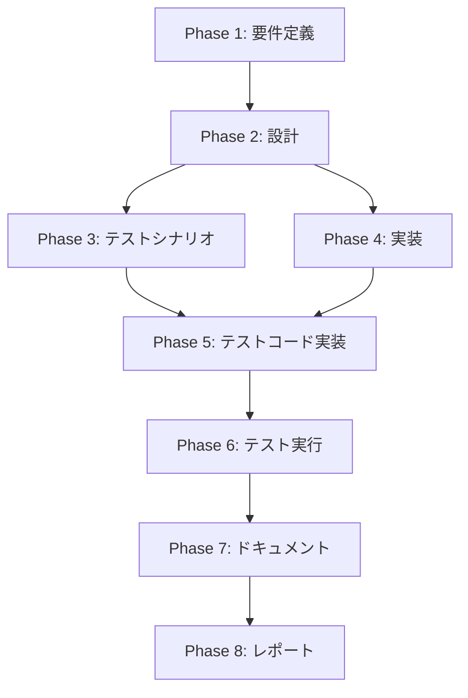
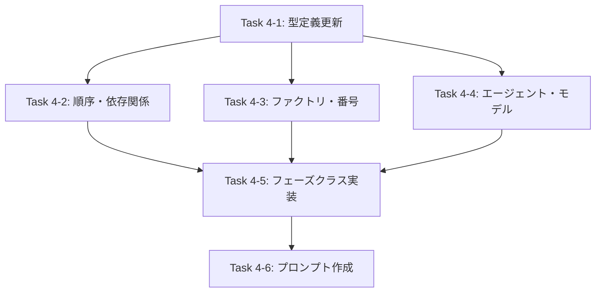
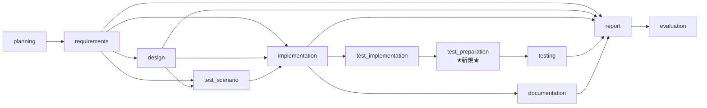
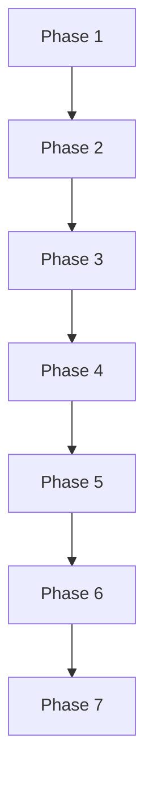

# Codex Agent 実行ログ

開始日時: 2026/2/17 7:31:52

---

## Turn 1: スレッド開始

**Thread ID**: `[REDACTED_TOKEN]`

## Turn 2: ツール実行

**種別**: reasoning
**ステータス**: completed

## Turn 3: ツール実行

**種別**: コマンド実行
**コマンド**: `/bin/bash -lc 'ls -la /tmp/ai-workflow-repos-196-2db81b66/ai-workflow-agent'`
**ステータス**: completed (exit_code=0)

```text
total 612
drwxr-xr-x. 12 node node  16384 Feb 17 07:00 .
drwxr-xr-x.  3 node node     31 Feb 17 07:00 ..
drwxr-xr-x.  6 node node     71 Feb 17 07:01 .ai-workflow
-rw-r--r--.  1 node node    174 Feb 17 07:00 .eslintrc.json
drwxr-xr-x.  8 node node  16384 Feb 17 07:31 .git
drwxr-xr-x.  3 node node  16384 Feb 17 07:00 .github
-rw-r--r--.  1 node node    485 Feb 17 07:00 .gitignore
-rw-r--r--.  1 node node  13781 Feb 17 07:00 AGENT_TEAMS.md
-rw-r--r--.  1 node node  73474 Feb 17 07:00 CHANGELOG.md
-rw-r--r--.  1 node node  32438 Feb 17 07:00 CLAUDE.md
-rw-r--r--.  1 node node  19959 Feb 17 07:00 [REDACTED_TOKEN].md
-rw-r--r--.  1 node node  15780 Feb 17 07:00 [REDACTED_TOKEN].md
-rw-r--r--.  1 node node  16530 Feb 17 07:00 [REDACTED_TOKEN].md
-rw-r--r--.  1 node node  24812 Feb 17 07:00 CODEBASE_SUMMARY.md
-rw-r--r--.  1 node node   2190 Feb 17 07:00 Dockerfile
-rw-r--r--.  1 node node  37855 Feb 17 07:00 Jenkinsfile
-rw-r--r--.  1 node node   1063 Feb 17 07:00 LICENSE
-rw-r--r--.  1 node node   4767 Feb 17 07:00 PROGRESS.md
-rw-r--r--.  1 node node  15659 Feb 17 07:00 README.md
-rw-r--r--.  1 node node   1494 Feb 17 07:00 TROUBLESHOOTING.md
drwxr-xr-x.  2 node node     25 Feb 17 07:00 __mocks__
drwxr-xr-x.  2 node node  16384 Feb 17 07:00 docs
drwxr-xr-x.  2 node node     29 Feb 17 07:00 examples
drwxr-xr-x.  4 node node     49 Feb 17 07:00 jenkins
-rw-r--r--.  1 node node   1241 Feb 17 07:00 jest.config.cjs
-rw-r--r--.  1 node node   2296 Feb 17 07:00 metadata.json.template
-rw-r--r--.  1 node node 244700 Feb 17 07:00 package-lock.json
-rw-r--r--.  1 node node   2258 Feb 17 07:00 package.json
drwxr-xr-x.  2 node node    144 Feb 17 07:00 scripts
drwxr-xr-x.  9 node node    153 Feb 17 07:00 src
drwxr-xr-x.  6 node node    107 Feb 17 07:00 tests
-rw-r--r--.  1 node node    452 Feb 17 07:00 tsconfig.json
-rw-r--r--.  1 node node    282 Feb 17 07:00 tsconfig.test.json
```

## Turn 4: ツール実行

**種別**: reasoning
**ステータス**: completed

## Turn 5: ツール実行

**種別**: コマンド実行
**コマンド**: `/bin/bash -lc "sed -n '1,200p' /tmp/ai-workflow-repos-196-2db81b66/ai-workflow-agent/.ai-workflow/issue-692/00_planning/output/planning.md"`
**ステータス**: completed (exit_code=0)

```text
# プロジェクト計画書: Issue #692 - test_preparation フェーズの追加

## 1. Issue分析

### 概要

本Issueは、`execute` コマンドのワークフローにおいて、テスト実装（`test_implementation`）フェーズとテスト実行（`testing`）フェーズの間に、新規の **テスト準備（`test_preparation`）フェーズ** を追加する変更である。

Docker コンテナ内でテスト実行時に、対象リポジトリの開発言語ランタイムやライブラリがインストールされておらず、テストが失敗するケースが頻発している。この問題を根本的に解決するため、テスト実行前に環境を自動準備するフェーズを導入する。

### 複雑度: **中程度〜複雑**

**判定根拠**:
- **新規ファイル作成**: `[REDACTED_TOKEN]` クラス（1ファイル）、プロンプトファイル（6ファイル: ja/en x execute/review/revise）
- **既存ファイル変更**: 最低7ファイル（`types.ts`, `execute.ts`, `phase-dependencies.ts`, `phase-factory.ts`, `base-phase.ts`, `agent-setup.ts`, `model-optimizer.ts`）
- **フェーズ番号の変更**: 既存フェーズ（testing〜evaluation）の番号が06〜09から07〜10にシフトし、既存ワークフローとの後方互換性の考慮が必要
- **テスト追加**: ユニットテストおよび統合テストの新規作成・既存テスト修正
- **既存のフェーズ実装パターン**が明確に存在するため、ゼロからの設計は不要

### 見積もり工数: **16〜24時間**

| カテゴリ | 見積もり | 内訳 |
|---------|---------|------|
| 型定義・設定変更 | 2〜3h | types.ts, execute.ts, phase-dependencies.ts, phase-factory.ts, agent-setup.ts |
| フェーズクラス実装 | 4〜6h | [REDACTED_TOKEN]（execute/review/revise） |
| プロンプト作成 | 3〜4h | 日本語3ファイル + 英語3ファイル |
| base-phase.ts 変更 | 2〜3h | フェーズ番号マッピング変更、後方互換性対応 |
| model-optimizer.ts 変更 | 1〜2h | 難易度別モデルマッピング追加 |
| テスト作成・修正 | 3〜4h | ユニットテスト新規作成、既存テスト修正 |
| 統合テスト・検証 | 1〜2h | `npm run validate` で全体検証 |

### リスク評価: **中**

- フェーズ番号変更による既存ワークフローへの影響がリスク要因
- ただし、既存のフェーズ実装パターンが確立されており、実装自体の技術的リスクは低い

---

## 2. 実装戦略判断

### 実装戦略: **CREATE**

**判断根拠**:
- 新規フェーズクラス `[REDACTED_TOKEN]` の作成が中心的な作業
- 新規プロンプトファイル6ファイルの作成が必要
- 既存ファイルの変更は、新規フェーズの登録・統合のための定型的な追加が主
- 既存コードのリファクタリングは不要（フェーズ番号の調整は機械的な変更）
- `[REDACTED_TOKEN]` の実装パターンをテンプレートとして流用できるため、アーキテクチャ設計は不要

### テスト戦略: **UNIT_INTEGRATION**

**判断根拠**:
- **ユニットテスト**: `[REDACTED_TOKEN]` クラスの各メソッド（execute/review/revise）の単体テスト、フェーズ依存関係のバリデーションテスト、フェーズ番号マッピングのテスト
- **インテグレーションテスト**: `implementation` プリセットおよび `testing` プリセットで `test_preparation` が正しく実行順序に含まれることの検証、フェーズ間のコンテキスト受け渡しテスト
- **BDDテスト不要**: エンドユーザー向けUIの変更はなく、CLIの動作は既存のフレームワーク内で完結する

### テストコード戦略: **BOTH_TEST**

**判断根拠**:
- **CREATE_TEST**: `[REDACTED_TOKEN]` の新規テストファイル作成（`tests/unit/phases/test-preparation.test.ts`）
- **EXTEND_TEST**: 既存の統合テスト（フェーズ順序テスト、依存関係テスト、プリセットテスト）に `test_preparation` のケースを追加
- 既存の `execute.test.ts` や `phase-dependencies` 関連テストにもテストケース追加が必要

---

## 3. 影響範囲分析

### 既存コードへの影響

#### 直接変更が必要なファイル

| ファイル | 変更内容 | 影響度 |
|---------|---------|--------|
| `src/types.ts` | `PhaseName` 型に `'test_preparation'` を追加 | 低（型の拡張のみ） |
| `src/commands/execute.ts` | `PHASE_ORDER` 配列に追加 | 低（配列要素追加） |
| `src/core/phase-dependencies.ts` | `PHASE_DEPENDENCIES`, `PHASE_PRESETS`, `PRESET_DESCRIPTIONS` の更新 | 中（依存関係の変更） |
| `src/core/phase-factory.ts` | `createPhaseInstance()` に case 追加、import 追加 | 低（定型追加） |
| `src/phases/base-phase.ts` | `getPhaseNumber()` のマッピング更新（番号シフト） | **高**（既存フェーズ番号変更） |
| `src/commands/execute/agent-setup.ts` | `[REDACTED_TOKEN]` に `test_preparation` 追加 | 低（マッピング追加） |
| `src/core/model-optimizer.ts` | 難易度別モデルマッピングに `test_preparation` 追加 | 低（マッピング追加） |

#### 新規作成ファイル

| ファイル | 説明 |
|---------|------|
| `src/phases/test-preparation.ts` | `[REDACTED_TOKEN]` クラス |
| `src/prompts/test_preparation/ja/execute.txt` | テスト準備実行プロンプト（日本語） |
| `src/prompts/test_preparation/ja/review.txt` | テスト準備レビュープロンプト（日本語） |
| `src/prompts/test_preparation/ja/revise.txt` | テスト準備修正プロンプト（日本語） |
| `src/prompts/test_preparation/en/execute.txt` | テスト準備実行プロンプト（英語） |
| `src/prompts/test_preparation/en/review.txt` | テスト準備レビュープロンプト（英語） |
| `src/prompts/test_preparation/en/revise.txt` | テスト準備修正プロンプト（英語） |

#### 影響を受ける既存テスト

| テストファイル | 修正内容 |
|--------------|---------|
| `tests/unit/commands/execute.test.ts` | フェーズ順序テスト、プリセットテストの更新 |
| `tests/unit/phases/base-phase-*.test.ts` | フェーズ番号マッピングテストの更新 |
| `tests/integration/` 内の関連テスト | フェーズ数の変更（10→11）に伴うアサーション更新 |

### 依存関係の変更

- **新規依存の追加**: なし（既存の依存パッケージで実装可能）
- **フェーズ依存関係の変更**:
  - `test_preparation` → `['test_implementation']` に依存（新規追加）
  - `testing` → `['test_implementation']` から `['test_preparation']` に変更

### マイグレーション要否

**フェーズ番号のシフトに関する方
... (truncated)
```

## Turn 6: ツール実行

**種別**: reasoning
**ステータス**: completed

## Turn 7: ツール実行

**種別**: コマンド実行
**コマンド**: `/bin/bash -lc "sed -n '200,400p' /tmp/ai-workflow-repos-196-2db81b66/ai-workflow-agent/.ai-workflow/issue-692/00_planning/output/planning.md"`
**ステータス**: completed (exit_code=0)

```text
- [ ] Task 4-5: [REDACTED_TOKEN] クラスの実装 (2〜3h)
  - `src/phases/test-preparation.ts` の新規作成
  - `execute()` メソッドの実装（test_implementation, implementation, test_scenario コンテキストの参照、[REDACTED_TOKEN] 呼び出し）
  - `review()` メソッドの実装（test-preparation.md の存在チェック、レビュープロンプトの実行、結果パース・GitHub投稿）
  - `revise()` メソッドの実装（レビューフィードバックに基づく再実行、ファイル更新確認）

- [ ] Task 4-6: プロンプトファイルの作成 (2〜3h)
  - `src/prompts/test_preparation/ja/execute.txt` の作成（言語検出、ランタイムインストール、依存解決、環境検証の指示）
  - `src/prompts/test_preparation/ja/review.txt` の作成（環境準備完了の判定基準）
  - `src/prompts/test_preparation/ja/revise.txt` の作成（レビューフィードバックに基づく修正指示）
  - `src/prompts/test_preparation/en/execute.txt` の作成（英語版）
  - `src/prompts/test_preparation/en/review.txt` の作成（英語版）
  - `src/prompts/test_preparation/en/revise.txt` の作成（英語版）

### Phase 5: テストコード実装 (見積もり: 3〜4h)

- [ ] Task 5-1: [REDACTED_TOKEN] ユニットテストの作成 (2〜2.5h)
  - `tests/unit/phases/test-preparation.test.ts` の新規作成
  - コンストラクタテスト（phaseName の検証）
  - execute() のテスト（モック環境でのコンテキスト構築・テンプレート実行の検証）
  - review() のテスト（出力ファイルチェック、レビュー結果パースの検証）
  - revise() のテスト（フィードバック適用の検証）

- [ ] Task 5-2: 既存テストの修正 (1〜1.5h)
  - `tests/unit/commands/execute.test.ts` のフェーズ順序テスト更新
  - フェーズ依存関係テストへの test_preparation ケース追加
  - フェーズ番号マッピングテストの更新（番号シフトの反映）
  - `[REDACTED_TOKEN]` テストの更新
  - プリセットテストの更新

### Phase 6: テスト実行 (見積もり: 1〜2h)

- [ ] Task 6-1: テスト実行と修正 (1〜2h)
  - `npm run test:unit` で全ユニットテストの実行
  - `npm run test:integration` で全統合テストの実行
  - `npm run lint` で型チェックの実行
  - `npm run build` でビルド確認
  - `npm run validate` で統合検証
  - テスト失敗箇所の修正

### Phase 7: ドキュメント (見積もり: 1〜2h)

- [ ] Task 7-1: ドキュメント更新 (1〜2h)
  - `CLAUDE.md` のフェーズ番号関連記述の更新（10フェーズ → 11フェーズ）
  - `README.md` の10フェーズワークフロー表に `test_preparation` を追加
  - `docs/ARCHITECTURE.md` のフェーズ実行フロー図の更新
  - `docs/CLI_REFERENCE.md` のフェーズ一覧更新

### Phase 8: レポート (見積もり: 0.5〜1h)

- [ ] Task 8-1: 実装レポートの作成 (0.5〜1h)
  - エグゼクティブサマリー（変更概要、影響範囲）
  - マージチェックリスト（テスト結果、ビルド結果、後方互換性確認）
  - 既知の制限事項（既存ワークフローのディレクトリ名は旧番号のまま）

---

## 5. 依存関係

### タスク間の依存関係



### 実装タスク内の依存関係



### フェーズ依存関係（変更後のワークフロー）



---

## 6. リスクと軽減策

### リスク1: フェーズ番号シフトによる既存ワークフローの破損
- **影響度**: 高
- **確率**: 低
- **説明**: `getPhaseNumber()` の変更により、既存の `.ai-workflow/issue-*/` ディレクトリ構造との不整合が発生する可能性
- **軽減策**:
  - `getPhaseNumber()` は新規ディレクトリ作成時にのみ使用されることを確認済み
  - 既存の `.ai-workflow/issue-7`, `issue-10`, `issue-105` サンプルディレクトリは旧番号のまま保持
  - テスト実行時に既存サンプルワークフローとの互換性を検証

### リスク2: 既存テストの大量修正
- **影響度**: 中
- **確率**: 中
- **説明**: フェーズ数が10から11に増加することで、フェーズ数に依存するテストアサーションが失敗する可能性
- **軽減策**:
  - フェーズ数をハードコードしているテストを事前に特定し、修正対象を明確化
  - `npm run validate` で全テストの通過を確認してからPR作成

### リスク3: プロンプト品質の不足
- **影響度**: 中
- **確率**: 中
- **説明**: test_preparation フェーズのプロンプトが不十分で、エージェントが適切に環境準備を実行できない可能性
- **軽減策**:
  - 既存の testing フェーズプロンプトを参考に、具体的なインストール手順を明示
  - `base-phase.ts` の `[REDACTED_TOKEN]()` で提供される情報と連携
  - review/revise サイクルで環境準備の不備を検出・修正

### リスク4: プリセット更新の漏れ
- **影響度**: 低
- **確率**: 中
- **説明**: `PHASE_PRESETS` の更新が不完全で、特定のプリセット実行時に test_preparation がスキップされる可能性
- **軽減策**:
  - 全プリセット（`implementation`, `testing`, `full-test`）を列挙し、更新対象を明確化
  - プリセット実行のテストケースを追加

### リスク5:
... (truncated)
```

## Turn 8: ツール実行

**種別**: reasoning
**ステータス**: completed

## Turn 9: ツール実行

**種別**: コマンド実行
**コマンド**: `/bin/bash -lc "sed -n '1,240p' /tmp/ai-workflow-repos-196-2db81b66/ai-workflow-agent/.ai-workflow/issue-692/02_design/output/design.md"`
**ステータス**: completed (exit_code=0)

```text
# 詳細設計書: Issue #692 - test_preparation フェーズの追加

## 0. 要件定義書・Planning Document の確認

### 要件定義書の要約

要件定義書（`.ai-workflow/issue-692/01_requirements/output/requirements.md`）では、以下の機能要件（FR-001〜FR-011）および非機能要件（NFR-001〜NFR-005）が定義されている。本設計書は、これらの要件を実装可能な詳細設計に落とし込むものである。

### Planning Document の要約

Planning Document（`.ai-workflow/issue-692/00_planning/output/planning.md`）では、以下が確定している：

- **実装戦略**: CREATE（新規作成中心）
- **テスト戦略**: UNIT_INTEGRATION
- **テストコード戦略**: BOTH_TEST
- **複雑度**: 中程度〜複雑（16〜24時間）
- **リスク**: 中（フェーズ番号変更が主なリスク）

本設計書では、Planning Document の方針を踏襲しつつ、コードレベルの詳細設計を提供する。

---

## 1. アーキテクチャ設計

### 1.1 システム全体図

```
┌─────────────────────────────────────────────────────────────────┐
│                        CLI Layer                                 │
│  src/main.ts → src/commands/execute.ts (PHASE_ORDER)            │
│                                                                  │
│  PHASE_ORDER (11フェーズ):                                       │
│  planning → requirements → design → test_scenario →             │
│  implementation → test_implementation → test_preparation(新規) → │
│  testing → documentation → report → evaluation                  │
└────────────────────────┬────────────────────────────────────────┘
                         │
┌────────────────────────▼────────────────────────────────────────┐
│                    Phase Layer                                   │
│                                                                  │
│  src/phases/base-phase.ts (抽象基底クラス)                       │
│    ├── execute() → review() → revise() ライフサイクル            │
│    ├── [REDACTED_TOKEN]()                                    │
│    ├── [REDACTED_TOKEN]()                                    │
│    ├── getPhaseNumber() マッピング                               │
│    └── [REDACTED_TOKEN]() ヘッダーパターン                  │
│                                                                  │
│  src/phases/test-preparation.ts (★新規★)                        │
│    ├── execute(): 環境準備実行                                    │
│    ├── review(): 準備完了検証                                     │
│    └── revise(): フィードバック反映                               │
│                                                                  │
│  関連フェーズ:                                                    │
│    src/phases/test-implementation.ts (前段: テストコード実装)     │
│    src/phases/testing.ts (後段: テスト実行)                       │
└────────────────────────┬────────────────────────────────────────┘
                         │
┌────────────────────────▼────────────────────────────────────────┐
│                    Core Layer                                    │
│                                                                  │
│  src/core/phase-factory.ts     → [REDACTED_TOKEN] 生成      │
│  src/core/phase-dependencies.ts → 依存関係・プリセット定義       │
│  src/core/model-optimizer.ts   → モデル自動選択設定              │
│  src/commands/execute/agent-setup.ts → エージェント優先順位      │
│                                                                  │
│  src/types.ts → PhaseName 型定義                                 │
│  src/commands/rollback.ts → getPhaseNumber() (別実装)            │
└────────────────────────┬────────────────────────────────────────┘
                         │
┌────────────────────────▼────────────────────────────────────────┐
│                   Prompt Layer                                   │
│                                                                  │
│  src/prompts/test_preparation/ (★新規★)                         │
│    ├── ja/execute.txt  │  en/execute.txt                        │
│    ├── ja/review.txt   │  en/review.txt                         │
│    └── ja/revise.txt   │  en/revise.txt                         │
└─────────────────────────────────────────────────────────────────┘
```

### 1.2 コンポーネント間の関係

```mermaid
graph TD
    A[execute.ts<br/>PHASE_ORDER] --> B[phase-factory.ts<br/>createPhaseInstance]
    B --> C[[REDACTED_TOKEN]<br/>test-preparation.ts]
    C
... (truncated)
```

## Turn 10: ツール実行

**種別**: コマンド実行
**コマンド**: `/bin/bash -lc "sed -n '240,520p' /tmp/ai-workflow-repos-196-2db81b66/ai-workflow-agent/.ai-workflow/issue-692/02_design/output/design.md"`
**ステータス**: completed (exit_code=0)

```text
→ test_implementation
                                                                  → test_preparation（新規）
                                                                      → testing
                                           implementation → documentation
                  requirements,design,implementation,testing,documentation → report → evaluation
```

### 5.3 マイグレーション要否

#### フェーズ番号のシフト

| フェーズ | 変更前 | 変更後 | 影響 |
|---------|-------|-------|------|
| planning | 00 | 00 | なし |
| requirements | 01 | 01 | なし |
| design | 02 | 02 | なし |
| test_scenario | 03 | 03 | なし |
| implementation | 04 | 04 | なし |
| test_implementation | 05 | 05 | なし |
| **test_preparation** | — | **06** | **新規追加** |
| testing | 06 | **07** | **番号変更** |
| documentation | 07 | **08** | **番号変更** |
| report | 08 | **09** | **番号変更** |
| evaluation | 09 | **10** | **番号変更** |

#### マイグレーション方針

**新規ワークフローのみに適用**（マイグレーション不要）:

1. `getPhaseNumber()` は新規ディレクトリ作成時にのみ使用される（`base-phase.ts` コンストラクタで `phaseDir` を構築する際）
2. 既存の `.ai-workflow/issue-7`, `issue-10`, `issue-105` サンプルディレクトリは旧番号体系のまま保持される（読み取り専用リファレンス）
3. 既に完了した既存ワークフローのディレクトリ名は変更しない
4. `getPhaseNumber()` は **2箇所に独立して存在する**（`base-phase.ts` と `rollback.ts`）ため、両方を同期して更新する必要がある

### 5.4 影響を受けるテストファイル

| テストファイル | 修正内容 | 影響度 |
|-------------|---------|--------|
| `tests/unit/phase-dependencies.test.ts` | プリセット定義テスト（`implementation`, `testing` プリセットの期待値更新） | 中 |
| `tests/unit/commands/execute.test.ts` | `getPresetPhases()` テスト（`implementation` プリセットの期待値更新） | 中 |
| `tests/unit/commands/rollback.test.ts` | `getPhaseNumber()` テスト（番号シフトの反映） | 中 |
| `tests/unit/commands/rollback-auto.test.ts` | `getPhaseNumber()` テスト（番号シフトの反映） | 中 |
| `tests/integration/preset-execution.test.ts` | プリセット統合テスト（プリセット内容、依存関係の更新） | 中 |
| `tests/integration/phases/fallback-mechanism.test.ts` | ディレクトリパス参照がハードコードされている場合の確認 | 低 |

### 5.5 新規作成テストファイル

| テストファイル | 内容 |
|-------------|------|
| `tests/unit/phases/test-preparation.test.ts` | `[REDACTED_TOKEN]` のユニットテスト |

---

## 6. 詳細設計

### 6.1 型定義の変更

#### `src/types.ts` - PhaseName 型

```typescript
// 変更前
export type PhaseName =
  | 'planning'
  | 'requirements'
  | 'design'
  | 'test_scenario'
  | 'implementation'
  | 'test_implementation'
  | 'testing'
  | 'documentation'
  | 'report'
  | 'evaluation';

// 変更後
export type PhaseName =
  | 'planning'
  | 'requirements'
  | 'design'
  | 'test_scenario'
  | 'implementation'
  | 'test_implementation'
  | 'test_preparation'     // ★追加
  | 'testing'
  | 'documentation'
  | 'report'
  | 'evaluation';
```

**設計判断**: `PhasesMetadata` 型は `PhaseName` を使用した Mapped Type であり、`test_preparation` が自動的に含まれるため追加の型変更は不要。TypeScript コンパイラが `Record<PhaseName, ...>` を使用するすべての箇所で漏れを静的に検出する。

### 6.2 [REDACTED_TOKEN] クラス設計

#### クラス図

```
BasePhase (abstract)
  │
  ├── [REDACTED_TOKEN]  (参考: テンプレートパターン)
  ├── [REDACTED_TOKEN]     ★新規★
  └── TestingPhase             (後段フェーズ)
```

#### `src/phases/test-preparation.ts` の詳細設計

```typescript
import * as fs from 'node:fs';
import { logger } from '../utils/logger.js';
import path from 'node:path';
import { BasePhase, type [REDACTED_TOKEN] } from './base-phase.js';
import { [REDACTED_TOKEN] } from '../types.js';

export class [REDACTED_TOKEN] extends BasePhase {
  constructor(params: [REDACTED_TOKEN]) {
    super({ ...params, phaseName: 'test_preparation' });
  }

  // --- execute() ---
  // 責務: テスト実行環境の自動準備
  // 参照コンテキスト: test_implementation, implementation, planning
  // 出力: test-preparation.md
  // エージェントオプション: maxTurns: 80, enableFallback: true
  protected async execute(): Promise<[REDACTED_TOKEN]>;

  // --- review() ---
  // 責務: テスト環境準備の完了検証
  // 検証対象: test-preparation.md の存在と内容
  // 結果: PASS / [REDACTED_TOKEN] / FAIL
  protected async review(): Promise<[REDACTED_TOKEN]>;

  // --- revise() ---
  // 責務: レビューフィードバックに基づく環境準備の修正
  // 入力: reviewFeedback (string)
  // 出力: test-preparation.md の更新
  public async revise(reviewFeedback: string): Promise<PhaseExecuti
... (truncated)
```

## Turn 11: ツール実行

**種別**: コマンド実行
**コマンド**: `/bin/bash -lc "sed -n '520,1040p' /tmp/ai-workflow-repos-196-2db81b66/ai-workflow-agent/.ai-workflow/issue-692/02_design/output/design.md"`
**ステータス**: completed (exit_code=0)

```text
'quick-fix': ['planning', 'implementation', 'documentation', 'report'],  // 変更なし
  'implementation': ['planning', 'implementation', 'test_implementation',
                     'test_preparation',  // ★追加
                     'testing', 'documentation', 'report'],

  // Test-centered patterns
  'full-test': ['planning', 'test_scenario', 'test_implementation'],  // 変更なし（testing を含まないため）
  'testing': ['planning', 'test_implementation',
              'test_preparation',  // ★追加
              'testing'],

  // Documentation/report patterns（変更なし）
  'finalize': ['planning', 'documentation', 'report', 'evaluation'],
};
```

**設計判断**:
- `full-test` プリセットは `['planning', 'test_scenario', 'test_implementation']` で `testing` を含まないため、`test_preparation` の追加は不要（要件定義書のスコープ外確認と合致）
- `quick-fix` プリセットは `testing` を含まないため、変更不要
- `prototype` プリセットは `testing` を含まないため、変更不要

#### PRESET_DESCRIPTIONS（`src/core/phase-dependencies.ts`）

```typescript
export const PRESET_DESCRIPTIONS: Record<string, string> = {
  // 変更なし: review-requirements, review-design, [REDACTED_TOKEN],
  //           analysis-design, quick-fix, full-test, finalize, prototype

  // ★変更
  'implementation': 'Planning + Implementation + TestImplementation + TestPreparation + Testing + Documentation + Report (通常の実装フロー)',
  'testing': 'Planning + TestImplementation + TestPreparation + Testing (テスト追加用)',
};
```

### 6.4 フェーズファクトリの設計

#### `src/core/phase-factory.ts`

`createPhaseInstance()` の switch 文に以下を追加:

```typescript
import { [REDACTED_TOKEN] } from '../phases/test-preparation.js';

// switch 文内に追加（test_implementation の case の後）
case 'test_preparation':
  return new [REDACTED_TOKEN](baseParams);
```

### 6.5 フェーズ番号マッピングの設計

#### `src/phases/base-phase.ts` - getPhaseNumber()

```typescript
private getPhaseNumber(phase: PhaseName): string {
  const mapping: Record<PhaseName, string> = {
    planning: '00',
    requirements: '01',
    design: '02',
    test_scenario: '03',
    implementation: '04',
    test_implementation: '05',
    test_preparation: '06',    // ★追加
    testing: '07',             // 06 → 07
    documentation: '08',       // 07 → 08
    report: '09',              // 08 → 09
    evaluation: '10',          // 09 → 10
  };
  return mapping[phase];
}
```

#### `src/commands/rollback.ts` - getPhaseNumber()

同一のマッピング変更を適用する。`rollback.ts` の `getPhaseNumber()` は `base-phase.ts` とは独立した実装であるため、**両方のファイルで同期的に更新する必要がある**。

```typescript
export function getPhaseNumber(phase: PhaseName): string {
  const mapping: Record<PhaseName, string> = {
    planning: '00',
    requirements: '01',
    design: '02',
    test_scenario: '03',
    implementation: '04',
    test_implementation: '05',
    test_preparation: '06',    // ★追加
    testing: '07',             // 06 → 07
    documentation: '08',       // 07 → 08
    report: '09',              // 08 → 09
    evaluation: '10',          // 09 → 10
  };
  return mapping[phase];
}
```

### 6.6 ログ抽出パターンの設計

#### `src/phases/base-phase.ts` - [REDACTED_TOKEN]()

```typescript
const headerPatterns: Record<PhaseName, RegExp> = {
  // ... 既存エントリ ...
  test_preparation: /^#+ (テスト準備|Test Preparation|環境準備|Environment Setup)/im,  // ★追加
  // ... 既存エントリ ...
};
```

### 6.7 エージェント優先順位の設計

#### `src/commands/execute/agent-setup.ts`

```typescript
export const PHASE_AGENT_PRIORITY: Record<PhaseName, AgentPriority> = {
  planning: 'claude-first',
  requirements: 'claude-first',
  design: 'claude-first',
  test_scenario: 'claude-first',
  implementation: 'codex-first',
  test_implementation: 'codex-first',
  test_preparation: 'codex-first',    // ★追加
  testing: 'codex-first',
  documentation: 'claude-first',
  report: 'claude-first',
  evaluation: 'claude-first',
};
```

**設計判断**: テスト環境の構築は `apt-get install`, `pip install`, `npm install` 等の具体的なコマンド実行が主な作業であり、Codex エージェントが得意とする領域。`implementation`, `test_implementation`, `testing` と同じカテゴリに分類。

### 6.8 モデル最適化マッピングの設計

#### `src/core/model-optimizer.ts`

3つの難易度マッピング関数すべてに `test_preparation` エントリを追加する。
... (truncated)
```

## Turn 12: ツール実行

**種別**: コマンド実行
**コマンド**: `/bin/bash -lc "sed -n '1,240p' /tmp/ai-workflow-repos-196-2db81b66/ai-workflow-agent/.ai-workflow/issue-692/01_requirements/output/requirements.md"`
**ステータス**: completed (exit_code=0)

```text
# 要件定義書: Issue #692 - test_preparation フェーズの追加

## 0. Planning Document の確認

Planning Document（`.ai-workflow/issue-692/00_planning/output/planning.md`）の分析結果を以下に要約する。

### 開発計画の全体像

- **実装戦略**: CREATE（新規フェーズクラスとプロンプトファイルの新規作成が中心）
- **テスト戦略**: UNIT_INTEGRATION（ユニットテスト + 統合テスト）
- **テストコード戦略**: BOTH_TEST（新規テスト作成 + 既存テスト拡張）
- **複雑度**: 中程度〜複雑（見積もり工数: 16〜24時間）
- **リスク評価**: 中（フェーズ番号変更による既存ワークフローへの影響が主なリスク）

### スコープ

- 新規 `[REDACTED_TOKEN]` クラスの実装
- 新規プロンプトファイル 6 ファイル（日本語/英語 x execute/review/revise）の作成
- 既存 7 ファイルの変更（`types.ts`, `execute.ts`, `phase-dependencies.ts`, `phase-factory.ts`, `base-phase.ts`, `agent-setup.ts`, `model-optimizer.ts`）
- フェーズ番号のシフト（testing〜evaluation が 06〜09 から 07〜10 に変更）
- ユニットテスト・統合テストの新規作成および既存テスト修正

### 技術選定

- 既存の `BasePhase` 抽象クラスを継承し、`[REDACTED_TOKEN]` のパターンをテンプレートとして流用
- エージェント優先順位は `codex-first`（コマンド実行が主作業のため）
- モデル設定は `testing` フェーズと同等

### リスク

1. フェーズ番号シフトによる既存ワークフロー破損（影響度: 高、確率: 低）
2. 既存テストの大量修正（影響度: 中、確率: 中）
3. プロンプト品質の不足（影響度: 中、確率: 中）
4. プリセット更新の漏れ（影響度: 低、確率: 中）
5. model-optimizer マッピング漏れ（影響度: 低、確率: 低）

### スケジュール

8 フェーズ構成（要件定義 → 設計 → テストシナリオ → 実装 → テストコード実装 → テスト実行 → ドキュメント → レポート）で 16〜24 時間。

---

## 1. 概要

### 背景

現在の AI Workflow Agent の `execute` コマンドは、10 フェーズのワークフロー（Planning → Evaluation）で構成されている。テスト実装（`test_implementation`）フェーズの後に直接テスト実行（`testing`）フェーズが実行されるが、Docker コンテナ内の実行環境が整っていないためにテストが失敗するケースが頻発している。

### 問題の詳細

Docker 環境のベースイメージは `Node.js 20-slim` であり、以下のツールのみがプリインストールされている：

- Node.js 20 + npm
- Git, curl, jq, unzip
- GitHub CLI (gh), AWS CLI v2, Pulumi CLI

Python, Go, Java, Rust, Ruby などの言語ランタイムは含まれておらず、対象リポジトリの開発言語に応じた環境構築が必要となる。具体的には以下の問題が報告されている：

1. **言語ランタイムの不一致**: Python のバージョンが対象リポジトリの要件と合致しない（例: Python 3.11 が必要だが 3.9 がインストールされている）
2. **依存パッケージの未解決**: `requirements.txt`, `package.json` 等の依存関係が解決されていない
3. **テストフレームワークの未セットアップ**: pytest, Jest, JUnit 等が利用可能でない
4. **環境変数・設定ファイルの未準備**: テスト実行に必要な設定が準備されていない

### 目的

`test_implementation` と `testing` の間に新規の `test_preparation` フェーズを挿入し、テスト実行前に環境を自動準備することで、テスト失敗率を削減し、ワークフロー全体の成功率を向上させる。

### ビジネス価値

- **ワークフロー成功率の向上**: テスト環境未準備による失敗を事前に防止
- **開発者体験の改善**: テスト実行前の手動環境構築が不要に
- **CI/CD パイプラインの安定化**: Jenkins 統合での Docker コンテナ内テスト実行の信頼性向上

### 技術的価値

- **関心の分離**: テストコード実装（test_implementation）、テスト環境準備（test_preparation）、テスト実行（testing）の責務が明確に分離
- **拡張性**: 将来的に新しい言語やフレームワークのサポートを容易に追加可能
- **再利用性**: 環境準備のナレッジが `test-preparation.md` として成果物に記録され、後続のワークフローで参照可能

---

## 2. 機能要件

### FR-001: PhaseName 型の拡張（優先度: 高）

**説明**: `src/types.ts` の `PhaseName` 型ユニオンに `'test_preparation'` リテラル型を追加する。

**詳細**:
- `PhaseName` 型に `'test_preparation'` を `'test_implementation'` と `'testing'` の間に追加する
- `PhasesMetadata` 型は `PhaseName` を使用した Mapped Type であるため、`test_preparation` が自動的に含まれる（追加の型変更は不要）
- TypeScript のコンパイラが `PhaseName` を使用するすべての `Record<PhaseName, ...>` 型で `test_preparation` のエントリを要求するようになるため、漏れが静的に検出される

**検証条件**: `npm run lint`（TypeScript 型チェック）がエラーなく完了すること

---

### FR-002: PHASE_ORDER 配列の更新（優先度: 高）

**説明**: `src/commands/execute.ts` の `PHASE_ORDER` 配列に `'test_preparation'` を追加し、実行順序を確立する。

**詳細**:
- `'test_implementation'` の直後、`'testing'` の直前に `'test_preparation'` を挿入する
- 変更後のフェーズ順序:
  ```
  planning → requirements → design → test_scenario → implementation →
  test_implementation → test_preparation → testing → documentation → report → evaluation
  ```
- フェーズ総数が 10 から 11 に増加する

**検証条件**: `PHASE_ORDER.indexOf('test_preparation')` が `PHASE_ORDER.indexOf('test_implementation') + 1` と等しく、かつ `PHASE_ORDER.indexOf('testing') - 1` と等しいこと

---

### FR-003: フェーズ依存関係の定義（優先度: 高）

**説明**: `src/core/phase-dependencies.ts` の `PHASE_DEPENDENCIES` マップを更新し、`test_preparation` の依存関係を定義する。

**詳細**:
- `test_preparation: ['test_implementation']` を追加（test_preparation は test_implementation に依存）
- `testing` の依存関係を `['test_implementation']` から `['test_preparation']` に変更（testing は test_preparation に依存）
- 依存関係グラフに循環依存が発生しないことを保証する

**検証条件**:
- `PHASE_DEPENDENCIES['test_preparation']` が `['test_implementation']` と等しいこと
- `PHASE_DEPENDENCIES['testing']` が `['test_preparat
... (truncated)
```

## Turn 13: ツール実行

**種別**: reasoning
**ステータス**: completed

## Turn 14: ツール実行

**種別**: コマンド実行
**コマンド**: `/bin/bash -lc "sed -n '1,240p' /tmp/ai-workflow-repos-196-2db81b66/ai-workflow-agent/.ai-workflow/issue-692/03_test_scenario/output/test-scenario.md"`
**ステータス**: completed (exit_code=0)

```text
# テストシナリオ: Issue #692 - test_preparation フェーズの追加

## 1. テスト戦略サマリー

### 選択されたテスト戦略

**UNIT_INTEGRATION**（Phase 2 設計書で決定）

### テスト対象の範囲

| カテゴリ | 対象 | テスト種別 |
|---------|------|-----------|
| 型定義 | `PhaseName` 型への `'test_preparation'` 追加 | Unit |
| フェーズ順序 | `PHASE_ORDER` 配列への挿入 | Unit + Integration |
| 依存関係 | `PHASE_DEPENDENCIES` の更新 | Unit + Integration |
| プリセット | `PHASE_PRESETS`, `PRESET_DESCRIPTIONS` の更新 | Unit + Integration |
| フェーズクラス | `[REDACTED_TOKEN]` (execute/review/revise) | Unit |
| フェーズファクトリ | `createPhaseInstance()` の case 追加 | Unit |
| フェーズ番号 | `getPhaseNumber()` のマッピング更新（2箇所） | Unit |
| ログ抽出 | `[REDACTED_TOKEN]()` のヘッダーパターン追加 | Unit |
| エージェント優先順位 | `[REDACTED_TOKEN]` マッピング追加 | Unit |
| モデル最適化 | `[REDACTED_TOKEN]` への追加 | Unit |
| プロンプト | 6 ファイル（ja/en × execute/review/revise） | Unit |

### テストの目的

1. **型安全性の保証**: `PhaseName` 型の拡張が全ての `Record<PhaseName, ...>` マッピングに波及し、漏れがないことを検証
2. **フェーズ統合の正確性**: `test_preparation` が正しい位置（test_implementation の直後、testing の直前）に挿入されていることを検証
3. **依存関係の整合性**: 新しい依存チェーン（test_implementation → test_preparation → testing）が正しく機能することを検証
4. **後方互換性**: 既存のプリセット・依存関係・フェーズ番号が正しく動作し続けることを検証
5. **新規クラスの機能性**: `[REDACTED_TOKEN]` の execute/review/revise が正しく動作することを検証

---

## 2. Unit テストシナリオ

### 2.1 PhaseName 型の拡張（FR-001）

**テスト対象ファイル**: `src/types.ts`
**テストファイル**: 既存テストの TypeScript コンパイル成功で間接検証

#### UT-TYPE-001: PhaseName 型に test_preparation が含まれる

- **目的**: `PhaseName` 型ユニオンに `'test_preparation'` が追加されていることを検証
- **前提条件**: `src/types.ts` が変更済み
- **入力**: TypeScript コンパイル
- **期待結果**: `npm run lint` がエラーなく完了すること
- **検証方法**: `'test_preparation'` を `PhaseName` 型の変数に代入可能であること（型レベル検証はコンパイル時に実行）

---

### 2.2 PHASE_ORDER 配列の更新（FR-002）

**テスト対象ファイル**: `src/commands/execute.ts`
**テストファイル**: `tests/unit/commands/execute.test.ts`（既存テスト更新）

#### UT-ORDER-001: test_preparation が PHASE_ORDER に含まれる

- **目的**: `PHASE_ORDER` 配列に `'test_preparation'` が含まれていることを検証
- **前提条件**: `PHASE_ORDER` が更新済み
- **入力**: なし（定数参照）
- **期待結果**: `PHASE_ORDER` が `'test_preparation'` を含むこと
- **テストデータ**: なし

#### UT-ORDER-002: test_preparation の位置が正しい

- **目的**: `test_preparation` が `test_implementation` の直後、`testing` の直前に配置されていることを検証
- **前提条件**: `PHASE_ORDER` が更新済み
- **入力**: なし（定数参照）
- **期待結果**:
  - `PHASE_ORDER.indexOf('test_preparation')` が `PHASE_ORDER.indexOf('test_implementation') + 1` と等しい
  - `PHASE_ORDER.indexOf('test_preparation')` が `PHASE_ORDER.indexOf('testing') - 1` と等しい

#### UT-ORDER-003: フェーズ総数が 11 である

- **目的**: `test_preparation` の追加によりフェーズ総数が 10 から 11 に増加していることを検証
- **前提条件**: `PHASE_ORDER` が更新済み
- **入力**: なし（定数参照）
- **期待結果**: `PHASE_ORDER.length` が 11 であること

---

### 2.3 フェーズ依存関係（FR-003）

**テスト対象ファイル**: `src/core/phase-dependencies.ts`
**テストファイル**: `tests/unit/phase-dependencies.test.ts`（既存テスト更新）

#### UT-DEP-001: test_preparation の依存関係が正しく定義されている

- **目的**: `PHASE_DEPENDENCIES['test_preparation']` が `['test_implementation']` であることを検証
- **前提条件**: `PHASE_DEPENDENCIES` が更新済み
- **入力**: なし（定数参照）
- **期待結果**: `PHASE_DEPENDENCIES['test_preparation']` が `['test_implementation']` と等しいこと

#### UT-DEP-002: testing の依存が test_preparation に変更されている

- **目的**: `PHASE_DEPENDENCIES['testing']` が `['test_implementation']` から `['test_preparation']` に変更されていることを検証
- **前提条件**: `PHASE_DEPENDENCIES` が更新済み
- **入力**: なし（定数参照）
- **期待結果**: `PHASE_DEPENDENCIES['testing']` が `['test_preparation']` と等しいこと

#### UT-DEP-003: 全 Phase が PHASE_DEPENDENCIES に定義されている

- **目的**: `PHASE_DEPENDENCIES` のキーに `test_preparation` を含む全 11 フェーズが定義されていることを検証
- **前提条件**: `PHASE_DEPENDENCIES` が更新済み
- **入力**: 期待されるフェーズ名リスト（11 件）
- **期待結果**: すべてのフェーズ名が `PHASE_DEPENDENCIES` のキーに含まれること
- **テストデータ**:
  ```typescript
  const expectedPhases: PhaseName[] = [
    'planning', 'requirements', 'design', 'test_scenario',
    'implementation', 'test_implementation', 'test_preparation',
    'testing', 'documentation', 'report', 'evaluation',
  ];
  ```

#### UT-DEP-004: 循環依存が存在しない

- **目的**: `test_preparation` 追加後も依存関係グラフに循環が存在しないことを検証
- **前提条件**: `P
... (truncated)
```

## Turn 15: ツール実行

**種別**: reasoning
**ステータス**: completed

## Turn 16: ツール実行

**種別**: コマンド実行
**コマンド**: `/bin/bash -lc "sed -n '1,200p' /tmp/ai-workflow-repos-196-2db81b66/ai-workflow-agent/CLAUDE.md"`
**ステータス**: completed (exit_code=0)

```text
# CLAUDE.md

このファイルは、このリポジトリで作業する際に Claude Code (claude.ai/code) にガイダンスを提供します。

## 目次

- [プロジェクト概要](#プロジェクト概要)
- [Agent Teams 運用ガイドライン](#agent-teams-運用ガイドライン)
- [クイックスタート](#クイックスタート)
- [アーキテクチャ概要](#アーキテクチャ概要)
- [コーディング規約](#コーディング規約)
- [重要な制約事項](#重要な制約事項)
- [ドキュメント索引](#ドキュメント索引)

## プロジェクト概要

TypeScript ベースの AI Workflow 自動化ツールキットで、デュアルエージェント（Codex + Claude）をサポートしています。GitHub Issue に対して planning から evaluation までの 10 フェーズのワークフローを実行し、マルチリポジトリワークフロー、Jenkins 統合、永続的なメタデータ管理をサポートします。

**主要機能**:
- **デュアルエージェント**: Codex（gpt-5.2-codex）と Claude（Opus 4.5）の自動フォールバック
- **10フェーズワークフロー**: Planning → Requirements → Design → Test Scenario → Implementation → Test Implementation → Testing → Documentation → Report → Evaluation
- **永続化メタデータ**: `.ai-workflow/issue-*/metadata.json` でワークフロー状態を管理（サンプル: issue-7/issue-10/issue-105 をリファレンスとして保持）
- **マルチリポジトリ対応**: Issue URL から対象リポジトリを自動判定（v0.2.0）
- **Jenkins統合**: Docker コンテナ内で TypeScript CLI を実行

**リポジトリ構成**:
```
ai-workflow-agent/
├── src/
│   ├── core/                  # エージェント・Git/GitHub ヘルパー・メタデータ管理
│   ├── phases/                # 各フェーズ実装（planning 〜 evaluation）
│   ├── prompts/               # フェーズ/コマンド別・言語別プロンプト（{phase|category}/{lang}/*.txt）
│   ├── templates/             # PR ボディなどのテンプレート（{lang}/pr_body*.md）
│   ├── main.ts                # CLI 定義
│   └── index.ts               # bin エントリ
├── tests/
│   ├── unit/                  # ユニットテスト
│   └── integration/           # 統合テスト
├── docs/                      # ドキュメント（詳細は下記参照）
└── dist/                      # ビルド成果物（npm run build 後に生成）
```

## Agent Teams 運用ガイドライン

このプロジェクトは Claude Code の Agent Teams による並列開発をサポートしています。Agent Teams を使用する際は、以下のガイドラインに従ってください。

**詳細な実践ガイドは [AGENT_TEAMS.md](./AGENT_TEAMS.md) を参照してください。**

### ミッション・ビジョン・バリュー（MVV）

**ミッション**

AI Workflow 自動化ツールキットの品質と保守性を維持・向上させ、開発者が安心して利用できる信頼性の高いツールを提供する。

**ビジョン**

- デュアルエージェント（Codex + Claude）による柔軟なワークフロー自動化
- 10フェーズのライフサイクル管理による体系的な開発プロセス
- 多言語対応（日本語・英語）による国際的な利用促進
- 継続的なテストとドキュメントによる長期的な保守性の確保

**バリュー（行動指針）**

1. **既存機能を壊さない**: テストスイート（`npm run validate`）で常に検証する
2. **コードの整合性を維持する**: コーディング規約に従い、統一された品質を保つ
3. **段階的に進める**: 大規模な変更は小さなステップに分割し、各ステップで検証する
4. **判断に迷ったら確認する**: 不明確な要件や影響範囲が大きい変更は、必ず人間（コーチ役）に確認する

### テストスイートの位置づけ

テストスイートは「上司の代わり」として機能します。エージェントが作業を終えたら、以下のコマンドで自己検証してください。

```bash
# 統合検証（推奨）
npm run validate

# または個別に実行
npm run lint                # TypeScript 型チェック
npm test                    # ユニット・統合テスト
npm run build               # ビルド確認
```

- **テストが通ること = 品質の最低基準**：エージェントはテストが通ることをゴールに動く
- **出力はシンプルに**：エラーメッセージは grep しやすい形式（`ERROR: <理由>`）にする
- **高速フィードバック**：各エージェントが素早くリグレッションを検出できるようにする

### Agent Teams に適したタスク・適さないタスク

Agent Teams の特性を理解し、適切なタスクに適用してください。

**✅ Agent Teams に適したタスク（Read-Heavy）**

- 複数ファイルの調査・レビュー（コードレビュー、セキュリティ監査）
- 多角的な視点が必要なタスク（設計レビュー、アーキテクチャ分析）
- 独立性の高いタスク群（複数フェーズの並列実装、独立したバグ修正）
- ドキュメント作成・更新（各フェーズのドキュメント整備）

**❌ Agent Teams に適さないタスク（Write-Heavy）**

- 同一ファイルへの同時書き込み（マージコンフリクトのリスク）
- 強い逐次依存があるタスク（A完了後にBを開始する必要がある場合）
- 小規模な修正（単一ファイルの typo 修正など）
- 密結合な変更（1つの機能変更が複数ファイルに波及する場合）

### タスク分解のベストプラクティス

Agent Teams を効果的に活用するには、タスクを適切に分解する必要があります。

**良い分解（独立性が高い）**
```
✅ 各フェーズのプロンプト改善
├── Agent 1: planning フェーズのプロンプト改善
├── Agent 2: implementation フェーズのプロンプト改善
├── Agent 3: testing フェーズのプロンプト改善
└── Agent 4: documentation フェーズのプロンプト改善
```

**悪い分解（依存関係が強い）**
```
❌ すべてのプロンプトを一括変更
├── Agent 1: すべてのプロンプトを修正（範囲が広すぎる）
└── Agent 2: Agent 1 の完了を待つ（不必要な依存）
```

**改善案（機能単位で分割）**
```
✅ 機能ごとに独立させる
├── Agent 1: 日本語プロンプトの改善（全フェーズ）
├── Agent 2: 英語プロンプトの改善（全フェーズ）
└── Agent 3: プロンプト検証ツールの実装
```

### 並列化のパターン

| パターン | 適用場面 | 例 |
|---|---|---|
| コンポーネント分割型 | モジュール間の結合度が低い | 各エージェントが異なるフェーズの実装を担当 |
| 多角レビュー型 | 品質の多面的な評価が必要 | セキュリティ、パフォーマンス、可読性を別々のエージェントが評価 |
| ドキュメント並列型 | 複数のドキュメントを同時更新 | 各エージェントが異なる docs ファイルを更新 |
| 独立テスト型 | 多数の独立したテストケースがある | 各エージェントが異なるテストファイルを改善 |

### Team Leader（コーチ）の役割

Agent Teams では、Team leader が「コーチ」として環境を整え、エージェントを見守る役割を担います。

**重要な原則**:
- **仕事のやり方には口を出さない**：各エージェントの自律性を尊重する
- **環境や仕組みを整える**：タスク設計、ツール提供、障害の除去に集中する
- **見守り、必要に応じて介入する**：放置ではなく、適切なタイミングでサポー
... (truncated)
```

## Turn 17: ツール実行

**種別**: reasoning
**ステータス**: completed

## Turn 18: ツール実行

**種別**: コマンド実行
**コマンド**: `/bin/bash -lc 'rg -n "コーディング規約|重要な制約事項" -n /tmp/ai-workflow-repos-196-2db81b66/ai-workflow-agent/CLAUDE.md'`
**ステータス**: failed (exit_code=127)

```text
/bin/bash: line 1: rg: command not found
```

## Turn 19: ツール実行

**種別**: reasoning
**ステータス**: completed

## Turn 20: ツール実行

**種別**: コマンド実行
**コマンド**: `/bin/bash -lc "grep -n \"コーディング規約\\|重要な制約事項\" -n /tmp/ai-workflow-repos-196-2db81b66/ai-workflow-agent/CLAUDE.md"`
**ステータス**: completed (exit_code=0)

```text
11:- [コーディング規約](#コーディング規約)
12:- [重要な制約事項](#重要な制約事項)
65:2. **コードの整合性を維持する**: コーディング規約に従い、統一された品質を保つ
378:## コーディング規約
521:## 重要な制約事項
628:| コーディング規約を確認する | このドキュメント（[コーディング規約](#コーディング規約)） |
634:**重要**: Claude Code で開発する際は、このドキュメントのコーディング規約と制約事項を厳守してください。詳細な情報が必要な場合は、上記のドキュメント索引から適切なドキュメントを参照してください。
```

## Turn 21: ツール実行

**種別**: コマンド実行
**コマンド**: `/bin/bash -lc "sed -n '378,520p' /tmp/ai-workflow-repos-196-2db81b66/ai-workflow-agent/CLAUDE.md"`
**ステータス**: completed (exit_code=0)

```text
## コーディング規約

### 1. 統一ロギング規約（Issue #61）

**必須**: `console.log`/`error`/`warn`等の直接使用は禁止。統一loggerモジュール（`src/utils/logger.ts`）を使用してください。

```typescript
import { logger } from '@/utils/logger';

// ✅ 正しい使用方法
logger.debug('デバッグ情報', { metadata: 'value' });
logger.info('情報メッセージ');
logger.warn('警告メッセージ');
logger.error('エラーメッセージ', error);

// ❌ 禁止
console.log('情報メッセージ');  // ESLint no-console ルールでエラー
```

**ログレベル制御**:
- `LOG_LEVEL` 環境変数で制御（`debug` | `info` | `warn` | `error`、デフォルト: `info`）
- 開発時は `LOG_LEVEL=debug` を推奨

### 2. 環境変数アクセス規約（Issue #51）

**必須**: `process.env` への直接アクセスは禁止。Config クラス（`src/core/config.ts`）を使用してください。

```typescript
import { config } from '@/core/config';

// ✅ 正しい使用方法
const token = config.getGitHubToken();        // 必須環境変数（未設定時は例外）
const reposRoot = config.getReposRoot();      // オプション環境変数（未設定時は null）
const codexKey = config.getCodexApiKey();     // エージェント用
const openAiKey = config.getOpenAiApiKey();   // API用

// ❌ 禁止
const token = process.env.GITHUB_TOKEN;  // 直接アクセス禁止
```

**用途別の API キー分離**（Issue #188）:
- `CODEX_API_KEY`: Codex エージェント専用
- `OPENAI_API_KEY`: OpenAI API 専用（テキスト生成）
- `[REDACTED_TOKEN]`: Claude Code エージェント（優先）
- `CLAUDE_CODE_API_KEY`: Claude Code エージェント（フォールバック）
- `ANTHROPIC_API_KEY`: Anthropic API 専用（テキスト生成）

### 3. エラーハンドリング規約（Issue #48）

**必須**: `as Error` 型アサーションの使用は禁止。エラーハンドリングユーティリティ（`src/utils/error-utils.ts`）を使用してください。

```typescript
import { getErrorMessage, getErrorStack, isError } from '@/utils/error-utils';

// ✅ 正しい使用方法
try {
  // 処理
} catch (error: unknown) {
  const message = getErrorMessage(error);  // 安全にメッセージ取得
  const stack = getErrorStack(error);      // スタックトレース取得
  logger.error(message, { stack });

  if (isError(error)) {
    // Error オブジェクトの場合の処理
  }
}

// ❌ 禁止
catch (error) {
  const message = (error as Error).message;  // 型アサーション禁止
}
```

### 4. セキュリティ: ReDoS攻撃の防止（Issue #140、Issue #161）

正規表現を動的に生成する場合、ユーザー入力やテンプレート変数をそのまま `new RegExp()` に渡すと ReDoS（Regular Expression Denial of Service）攻撃のリスクがあります。

**推奨される対策**:
- **文字列置換**: リテラル文字列の置換には `String.prototype.replaceAll()` を使用（Node.js 15.0.0以降）
- **エスケープ処理**: 正規表現が必須の場合は、ユーザー入力を適切にエスケープ

```typescript
// ✅ 正しい使用方法
let result = template;
for (const [key, value] of Object.entries(context)) {
  result = result.replaceAll(`{${key}}`, value);
}

// ❌ ReDoS脆弱性のある例
for (const [key, value] of Object.entries(context)) {
  const regex = new RegExp(`{${key}}`, 'g');  // 危険
  result = result.replace(regex, value);
}
```

**実装完了**: `fillTemplate` メソッド（`src/core/claude-agent-client.ts` および `src/core/codex-agent-client.ts`）では、ReDoS脆弱性を完全に排除（99.997%のパフォーマンス改善を達成、Issue #161で修正完了）

### 5. テストコード品質のベストプラクティス（Issue #115）

#### TypeScript 5.x + Jest型定義の互換性

TypeScript 5.xの厳格な型チェックにより、`jest.fn().mockResolvedValue()`の型推論が正しく機能しない場合があります。

```typescript
// ✅ 型パラメータを明示的に指定
mockGitHub = {
  getIssueInfo: jest.fn<any>().mockResolvedValue({ number: 113 }),
} as any;

// ✅ mockResolvedValue()の戻り値に型アノテーション
jest.spyOn(phase as any, 'executeWithAgent').mockResolvedValue([] as any[]);
```

#### モッククリーンアップの重要性

**必須**: `afterEach()`で`jest.restoreAllMocks()`を呼び出し、テスト後に全モックをクリーンアップしてください。

```typescript
describe('My Test Suite', () => {
  afterEach(() => {
    // ✅ 全モックをクリーンアップ
    jest.restoreAllMocks();

    // テストディレクトリのクリーンアップ
    if (fs.existsSync(testWorkingDir)) {
      fs.removeSync(testWorkingDir);
    }
  });

  it('should handle file operations', () => {
    // テスト内でモックを作成
    jest.spyOn(fs, 'readFileSync').mockImplementation(() => {
      throw new Error('EACCES: permission denied');
    });

    // テスト処理...
  });
  // ✅ afterEach()で自動的にモックがクリーンアップされる
});
```

**テストの詳細は [docs/DEVELOPMENT.md](./docs/DEVELOPMENT.md) を参照してください。**
```

## Turn 22: ツール実行

**種別**: reasoning
**ステータス**: completed

## Turn 23: ツール実行

**種別**: コマンド実行
**コマンド**: `/bin/bash -lc "sed -n '1,240p' /tmp/ai-workflow-repos-196-2db81b66/ai-workflow-agent/src/phases/test-implementation.ts"`
**ステータス**: completed (exit_code=0)

```text
import * as fs from 'node:fs';
import { logger } from '../utils/logger.js';
import path from 'node:path';
import { BasePhase, type [REDACTED_TOKEN] } from './base-phase.js';
import { [REDACTED_TOKEN] } from '../types.js';

export class [REDACTED_TOKEN] extends BasePhase {
  constructor(params: [REDACTED_TOKEN]) {
    super({ ...params, phaseName: 'test_implementation' });
  }

  protected async execute(): Promise<[REDACTED_TOKEN]> {
    const issueNumber = parseInt(this.metadata.data.issue_number, 10);

    // オプショナルコンテキストを構築（Issue #398, #396）
    const requirementsContext = this.[REDACTED_TOKEN](
      'requirements',
      'requirements.md',
      '要件定義書は利用できません。Planning情報とIssue情報から要件を推測してください。',
      issueNumber,
    );

    const designContext = this.[REDACTED_TOKEN](
      'design',
      'design.md',
      '設計書は利用できません。Issue情報とPlanning情報に基づいて適切な設計判断を行ってください。',
      issueNumber,
    );

    const scenarioContext = this.[REDACTED_TOKEN](
      'test_scenario',
      'test-scenario.md',
      'テストシナリオは利用できません。実装時に適切なテスト考慮を行ってください。',
      issueNumber,
    );

    const [REDACTED_TOKEN] = this.[REDACTED_TOKEN](
      'implementation',
      'implementation.md',
      '実装ログは利用できません。設計書とテストシナリオに基づいて実装してください。',
      issueNumber,
    );

    // test_strategy と test_code_strategy もオプショナル（Issue #405）
    const testStrategy = this.metadata.data.design_decisions.test_strategy ??
      'テスト戦略は設定されていません。設計書とテストシナリオから適切なテスト戦略を決定してください。';
    const testCodeStrategy = this.metadata.data.design_decisions.test_code_strategy ??
      'テストコード方針は設定されていません。プロジェクトの規約とテスト戦略から適切なテストコード方針を決定してください。';

    // Issue #47: [REDACTED_TOKEN]() を使用してコード削減
    return this.[REDACTED_TOKEN]('test-implementation.md', {
      planning_document_path: this.[REDACTED_TOKEN](issueNumber),
      requirements_context: requirementsContext,
      design_context: designContext,
      test_scenario_context: scenarioContext,
      implementation_context: [REDACTED_TOKEN],
      test_strategy: testStrategy,
      test_code_strategy: testCodeStrategy,
      issue_number: String(issueNumber),
    }, { maxTurns: 80 });

    // Phase outputはPRに含まれるため、Issue投稿は不要（Review resultのみ投稿）
  }

  protected async review(): Promise<[REDACTED_TOKEN]> {
    const issueNumber = parseInt(this.metadata.data.issue_number, 10);
    const [REDACTED_TOKEN] = path.join(this.outputDir, 'test-implementation.md');

    if (!fs.existsSync([REDACTED_TOKEN])) {
      return {
        success: false,
        error: 'test-implementation.md が存在しません。execute() を先に実行してください。',
      };
    }

    const planningReference = this.[REDACTED_TOKEN](issueNumber);
    const designFile = this.getPhaseOutputFile('design', 'design.md', issueNumber);
    const scenarioFile = this.getPhaseOutputFile('test_scenario', 'test-scenario.md', issueNumber);
    const implementationFile = this.getPhaseOutputFile('implementation', 'implementation.md', issueNumber);

    const [REDACTED_TOKEN] = this.[REDACTED_TOKEN]([REDACTED_TOKEN]);
    if (![REDACTED_TOKEN]) {
      return {
        success: false,
        error: 'Agent が test-implementation.md を参照できません。',
      };
    }

    // design, scenario, implementation はオプショナル（Issue #405）
    let designReference: string;
    if (designFile) {
      const ref = this.[REDACTED_TOKEN](designFile);
      designReference = ref ?? '設計ドキュメントは利用できません。テストコード実装内容から設計を推測してレビューしてください。';
    } else {
      designReference = '設計ドキュメントは利用できません。テストコード実装内容から設計を推測してレビューしてください。';
    }

    let scenarioReference: string;
    if (scenarioFile) {
      const ref = this.[REDACTED_TOKEN](scenarioFile);
      scenarioReference = ref ?? 'テストシナリオは利用できません。テストコード実装内容から適切なテスト観点でレビューしてください。';
    } else {
      scenarioReference = 'テストシナリオは利用できません。テストコード実装内容から適切なテスト観点でレビューしてください。';
    }

    let implementationReference: string;
    if (implementationFile) {
... (truncated)
```

## Turn 24: ツール実行

**種別**: reasoning
**ステータス**: completed

## Turn 25: ツール実行

**種別**: コマンド実行
**コマンド**: `/bin/bash -lc 'grep -n "[REDACTED_TOKEN]" -n /tmp/ai-workflow-repos-196-2db81b66/ai-workflow-agent/src/phases/base-phase.ts'`
**ステータス**: completed (exit_code=0)

```text
770:      const extractedContent = this.[REDACTED_TOKEN](agentLog, this.phaseName);
827:  protected [REDACTED_TOKEN](agentLog: string, phaseName: PhaseName): string | null {
```

## Turn 26: ツール実行

**種別**: コマンド実行
**コマンド**: `/bin/bash -lc "sed -n '820,910p' /tmp/ai-workflow-repos-196-2db81b66/ai-workflow-agent/src/phases/base-phase.ts"`
**ステータス**: completed (exit_code=0)

```text
*
   * Evaluation Phaseの [REDACTED_TOKEN]() を汎用化した実装
   *
   * @param agentLog - エージェントログ（agent_log.md の内容）
   * @param phaseName - フェーズ名（抽出パターンの選択に使用）
   * @returns 抽出した成果物内容（抽出失敗時は null）
   */
  protected [REDACTED_TOKEN](agentLog: string, phaseName: PhaseName): string | null {
    // Issue #252: エージェントログ形式を検出するパターン
    // これらのパターンが見つかった場合は、成果物ではなくエージェントログとして扱う
    const agentLogPatterns = [
      /^## Turn \d+:/m,                           // Codex/Claude のターン形式
      /^### (User|Assistant|Tool Result):/m,      // 会話形式
      /^\*\*Tool:\*\*/m,                          // ツール呼び出し形式
      /^<tool_call>/m,                            // XMLスタイルのツール呼び出し
      /^### Agent Execution/m,                    // エージェント実行ヘッダー
      /^\*\*Codex CLI Output:\*\*/m,              // Codex CLI出力
      /^\*\*Claude Agent Output:\*\*/m,           // Claude Agent出力
    ];

    // フェーズごとのヘッダーパターン
    const headerPatterns: Record<PhaseName, RegExp> = {
      planning: /^#+ (プロジェクト計画書|Project Planning|計画書|Planning)/im,
      requirements: /^#+ (要件定義書|Requirements Document|要件定義|Requirements)/im,
      design: /^#+ (詳細設計書|Design Document|設計書|Design)/im,
      test_scenario: /^#+ (テストシナリオ|Test Scenario|テスト設計|Test Design)/im,
      implementation: /^#+ (実装ログ|Implementation Log|実装|Implementation)/im,
      report: /^#+ (プロジェクトレポート|Project Report|レポート|Report)/im,
      // 以下は対象外（フォールバック機構を導入しないフェーズ）
      test_implementation: /^#+ (テスト実装|Test Implementation)/im,
      testing: /^#+ (テスト実行結果|Test Result)/im,
      documentation: /^#+ (ドキュメント更新ログ|Documentation Update Log)/im,
      evaluation: /^#+ (評価レポート|Evaluation Report)/im,
    };

    const pattern = headerPatterns[phaseName];
    if (!pattern) {
      logger.warn(`Phase ${phaseName}: No extraction pattern defined`);
      return null;
    }

    // パターン1: ヘッダーから始まるセクションを探す
    const match = agentLog.match(pattern);

    if (match && match.index !== undefined) {
      // ヘッダー以降のコンテンツを抽出
      const content = agentLog.substring(match.index).trim();

      // Issue #252: 抽出内容がエージェントログ形式でないことを確認
      if (content.includes('##') && !this.isAgentLogFormat(content, agentLogPatterns)) {
        return content;
      }
    }

    // パターン2: 大きなMarkdownブロックを探す（ヘッダーが見つからない場合）
    // Issue #252: エージェントログパターンを除外
    const lines = agentLog.split('\n');
    let startIndex = -1;
    let sectionCount = 0;

    for (let i = 0; i < lines.length; i++) {
      const line = lines[i];

      // Issue #252: エージェントログのヘッダーはスキップ
      if (/^## Turn \d+:/.test(line)) {
        continue;
      }

      // Markdownセクションヘッダーを探す（エージェントログ形式を除外）
      if (/^##+ /.test(line) && !this.isAgentLogLine(line)) {
        if (startIndex === -1) {
          startIndex = i;
        }
        sectionCount++;
      }
    }

    // 複数のセクションヘッダーがある場合、それ以降を抽出
    if (sectionCount >= 2 && startIndex !== -1) {
      const extracted = lines.slice(startIndex).join('\n').trim();

      // Issue #252: 抽出内容がエージェントログ形式でないことを確認
      if (!this.isAgentLogFormat(extracted, agentLogPatterns)) {
        return extracted;
      }
    }

    return null;
  }

  /**
```

## Turn 27: ツール実行

**種別**: reasoning
**ステータス**: completed

## Turn 28: ツール実行

**種別**: コマンド実行
**コマンド**: `/bin/bash -lc 'grep -n "getPhaseNumber" -n /tmp/ai-workflow-repos-196-2db81b66/ai-workflow-agent/src/phases/base-phase.ts'`
**ステータス**: completed (exit_code=0)

```text
222:    const phaseNumber = this.getPhaseNumber(this.phaseName);
590:    const phaseNumber = this.getPhaseNumber(targetPhase);
668:  private getPhaseNumber(phase: PhaseName): string {
```

## Turn 29: ツール実行

**種別**: コマンド実行
**コマンド**: `/bin/bash -lc "sed -n '660,720p' /tmp/ai-workflow-repos-196-2db81b66/ai-workflow-agent/src/phases/base-phase.ts"`
**ステータス**: completed (exit_code=0)

```text
return this.contextBuilder.[REDACTED_TOKEN](
      phaseName,
      filename,
      fallbackMessage,
      issueNumberOverride
    );
  }

  private getPhaseNumber(phase: PhaseName): string {
    const mapping: Record<PhaseName, string> = {
      planning: '00',
      requirements: '01',
      design: '02',
      test_scenario: '03',
      implementation: '04',
      test_implementation: '05',
      testing: '06',
      documentation: '07',
      report: '08',
      evaluation: '09',
    };
    return mapping[phase];
  }

  private ensureDirectories() {
    fs.mkdirSync(this.outputDir, { recursive: true });
    fs.mkdirSync(this.executeDir, { recursive: true });
    fs.mkdirSync(this.reviewDir, { recursive: true });
    fs.mkdirSync(this.reviseDir, { recursive: true });
  }

  /**
   * ワークフローアーティファクト全体をクリーンアップ（Issue #2）
   *
   * Evaluation Phase完了後に実行され、.ai-workflow/issue-<NUM>/ ディレクトリ全体を削除します。
   * Report Phaseのクリーンアップ（cleanupWorkflowLogs）とは異なり、metadata.jsonや
   * output/*.mdファイルを含むすべてのファイルを削除します。
   *
   * @param force - 確認プロンプトをスキップする場合は true（CI環境用）
   */
  protected async [REDACTED_TOKEN](force: boolean = false): Promise<void> {
    // ArtifactCleaner に委譲（Issue #49）
    await this.artifactCleaner.[REDACTED_TOKEN](force);
  }

  /**
   * CI 環境かどうかを判定（ArtifactCleaner の判定をラップ）
   */
  protected isCIEnvironment(): boolean {
    const ciValue = process.env.CI;
    if (ciValue !== undefined) {
      return ciValue === 'true' || ciValue === '1';
    }
    return false;
  }

  /**
   * ワークフローログをクリーンアップ（Issue #2）
   *
   * Report Phase 完了後に実行され、phases 00-08 の execute/review/revise ディレクトリを削除します。
   * metadata.json と output/*.md は保持されます。
```

## Turn 30: ツール実行

**種別**: reasoning
**ステータス**: completed

## Turn 31: ツール実行

**種別**: コマンド実行
**コマンド**: `/bin/bash -lc 'grep -n "getPhaseNumber" -n /tmp/ai-workflow-repos-196-2db81b66/ai-workflow-agent/src/commands/rollback.ts'`
**ステータス**: completed (exit_code=0)

```text
383:  const phaseNumber = getPhaseNumber(toPhase);
453:  const phaseNumber = getPhaseNumber(toPhase as PhaseName);
490:export function getPhaseNumber(phase: PhaseName): string {
```

## Turn 32: ツール実行

**種別**: コマンド実行
**コマンド**: `/bin/bash -lc "sed -n '480,520p' /tmp/ai-workflow-repos-196-2db81b66/ai-workflow-agent/src/commands/rollback.ts"`
**ステータス**: completed (exit_code=0)

```text
sections.push('3. テストが成功することを確認（該当する場合）');
  sections.push('');

  return sections.join('\n');
}

/**
 * フェーズ番号を取得
 * Issue #90: テストのためにエクスポート
 */
export function getPhaseNumber(phase: PhaseName): string {
  const mapping: Record<PhaseName, string> = {
    planning: '00',
    requirements: '01',
    design: '02',
    test_scenario: '03',
    implementation: '04',
    test_implementation: '05',
    testing: '06',
    documentation: '07',
    report: '08',
    evaluation: '09',
  };
  return mapping[phase];
}

/**
 * エージェント出力から RollbackDecision を抽出
 *
 * - Markdown の ```json コードブロックを優先的にパース
 * - 次にプレーンテキスト内の JSON オブジェクトを探索
 * - どちらも見つからない場合はエラーをスロー
 */
export function [REDACTED_TOKEN](agentOutput: string[]): RollbackDecision {
  const joined = agentOutput.join('\n');

  const codeBlockMatch = joined.match(/```json\s*([\s\S]*?)```/i);
  const inlineJsonMatch = joined.match(/\{[\s\S]*\}/);

  const jsonText = codeBlockMatch?.[1] ?? inlineJsonMatch?.[0];
  if (!jsonText) {
```

## Turn 33: ツール実行

**種別**: reasoning
**ステータス**: completed

## Turn 34: ツール実行

**種別**: コマンド実行
**コマンド**: `/bin/bash -lc "sed -n '1,200p' /tmp/ai-workflow-repos-196-2db81b66/ai-workflow-agent/src/core/phase-factory.ts"`
**ステータス**: completed (exit_code=0)

```text
import type { PhaseName } from '../types.js';
import type { PhaseContext } from '../types/commands.js';
import type { BasePhase } from '../phases/base-phase.js';

import { PlanningPhase } from '../phases/planning.js';
import { RequirementsPhase } from '../phases/requirements.js';
import { DesignPhase } from '../phases/design.js';
import { TestScenarioPhase } from '../phases/test-scenario.js';
import { ImplementationPhase } from '../phases/implementation.js';
import { [REDACTED_TOKEN] } from '../phases/test-implementation.js';
import { TestingPhase } from '../phases/testing.js';
import { DocumentationPhase } from '../phases/documentation.js';
import { ReportPhase } from '../phases/report.js';
import { EvaluationPhase } from '../phases/evaluation.js';

/**
 * フェーズインスタンスを作成
 *
 * フェーズ名から対応するフェーズクラスのインスタンスを生成します。
 * 10フェーズすべてに対応し、PhaseContext から baseParams を構築してコンストラクタに渡します。
 *
 * @param phaseName - フェーズ名
 * @param context - フェーズ実行コンテキスト
 * @returns フェーズインスタンス
 * @throws {Error} 未知のフェーズ名が指定された場合
 */
export function createPhaseInstance(phaseName: PhaseName, context: PhaseContext): BasePhase {
  // PhaseContext から baseParams を構築
  const baseParams = {
    workingDir: context.workingDir,
    metadataManager: context.metadataManager,
    codexClient: context.codexClient,
    claudeClient: context.claudeClient,
    githubClient: context.githubClient,
    skipDependencyCheck: context.skipDependencyCheck,
    ignoreDependencies: context.ignoreDependencies,
    skipPhases: context.skipPhases,
    presetPhases: context.presetPhases,
    issueGenerationOptions: context.[REDACTED_TOKEN],
    modelOptimizer: context.modelOptimizer,
    modelOverrides: context.modelOverrides,
  };

  // フェーズ名に応じてインスタンスを生成
  switch (phaseName) {
    case 'planning':
      return new PlanningPhase(baseParams);
    case 'requirements':
      return new RequirementsPhase(baseParams);
    case 'design':
      return new DesignPhase(baseParams);
    case 'test_scenario':
      return new TestScenarioPhase(baseParams);
    case 'implementation':
      return new ImplementationPhase(baseParams);
    case 'test_implementation':
      return new [REDACTED_TOKEN](baseParams);
    case 'testing':
      return new TestingPhase(baseParams);
    case 'documentation':
      return new DocumentationPhase(baseParams);
    case 'report':
      return new ReportPhase(baseParams);
    case 'evaluation':
      return new EvaluationPhase(baseParams);
    default:
      throw new Error(`Unknown phase: ${phaseName}`);
  }
}
```

## Turn 35: ツール実行

**種別**: reasoning
**ステータス**: completed

## Turn 36: ツール実行

**種別**: コマンド実行
**コマンド**: `/bin/bash -lc "sed -n '1,200p' /tmp/ai-workflow-repos-196-2db81b66/ai-workflow-agent/src/core/phase-dependencies.ts"`
**ステータス**: completed (exit_code=0)

```text
import * as fs from 'node:fs';
import { logger } from '../utils/logger.js';
import { MetadataManager } from './metadata-manager.js';
import { PhaseName, PhaseStatus } from '../types.js';
import { buildErrorMessage, buildWarningMessage } from './helpers/dependency-messages.js';
import { [REDACTED_TOKEN] } from './helpers/metadata-io.js';
import { getErrorMessage } from '../utils/error-utils.js';

export const PHASE_DEPENDENCIES: Record<PhaseName, PhaseName[]> = {
  planning: [],
  requirements: ['planning'],
  design: ['requirements'],
  test_scenario: ['requirements', 'design'],
  implementation: ['requirements', 'design', 'test_scenario'],
  test_implementation: ['implementation'],
  testing: ['test_implementation'],
  documentation: ['implementation'],
  report: ['requirements', 'design', 'implementation', 'testing', 'documentation'],
  evaluation: ['report'],
};

// 新規プリセット定義（Issue #396）
export const PHASE_PRESETS: Record<string, PhaseName[]> = {
  // === レビュー駆動パターン ===
  'review-requirements': ['planning', 'requirements'],
  'review-design': ['planning', 'requirements', 'design'],
  '[REDACTED_TOKEN]': ['planning', 'requirements', 'design', 'test_scenario'],

  // === 分析・設計パターン ===
  'analysis-design': ['planning', 'requirements', 'design'],

  // === プロトタイプ高速化パターン ===
  'prototype': ['planning', 'design', 'implementation', 'report'],

  // === 実装中心パターン ===
  'quick-fix': ['planning', 'implementation', 'documentation', 'report'],
  'implementation': ['planning', 'implementation', 'test_implementation', 'testing', 'documentation', 'report'],

  // === テスト中心パターン ===
  'full-test': ['planning', 'test_scenario', 'test_implementation'],
  'testing': ['planning', 'test_implementation', 'testing'],

  // === ドキュメント・レポートパターン ===
  'finalize': ['planning', 'documentation', 'report', 'evaluation'],
};

// 後方互換性のための非推奨プリセット（6ヶ月後に削除予定）
export const DEPRECATED_PRESETS: Record<string, string> = {
  'requirements-only': 'review-requirements',
  'design-phase': 'review-design',
  '[REDACTED_TOKEN]': 'implementation',
  'full-workflow': '--phase all',
};

// プリセット説明マップ
export const PRESET_DESCRIPTIONS: Record<string, string> = {
  'review-requirements': 'Planning + Requirements (要件定義レビュー用)',
  'review-design': 'Planning + Requirements + Design (設計レビュー用)',
  '[REDACTED_TOKEN]': 'Planning + Requirements + Design + TestScenario (テストシナリオレビュー用)',
  'analysis-design': 'Planning + Requirements + Design (分析と設計フェーズのみ実行)',
  'quick-fix': 'Planning + Implementation + Documentation + Report (軽微な修正用)',
  'implementation': 'Planning + Implementation + TestImplementation + Testing + Documentation + Report (通常の実装フロー)',
  'full-test': 'Planning + TestScenario + TestImplementation (テストシナリオとテストコード実装のみ実行)',
  'testing': 'Planning + TestImplementation + Testing (テスト追加用)',
  'finalize': 'Planning + Documentation + Report + Evaluation (最終化用)',
  'prototype': 'Planning + Design + Implementation + Report (プロトタイプ作成用の最小フロー)',
};

export interface [REDACTED_TOKEN] {
  skipCheck?: boolean;
  ignoreViolations?: boolean;
  checkFileExistence?: boolean; // ファイル存在チェック（Issue #396）
  presetPhases?: PhaseName[]; // プリセット実行時のフェーズリスト（Issue #396）
  skipPhases?: PhaseName[];
}

export interface [REDACTED_TOKEN] {
  valid: boolean;
  error?: string;
  warning?: string;
  ignored?: boolean;
  missing_phases?: PhaseName[];
  missing_files?: Array<{ phase: PhaseName; file: string }>; // ファイル不在情報（Issue #396）
}

export const [REDACTED_TOKEN] = (
  phaseName: PhaseName,
  metadataManager: MetadataManager,
  options: [REDACTED_TOKEN] = {},
): [REDACTED_TOKEN] => {
  const {
    skipCheck = false,
    ignoreViolations = false,
    checkFileExistence = false,
    presetPhases,
    skipPhases,
  } = options;

  if (!(phaseName in PHASE_DEPENDENCIES)) {
    throw new Error(`Invalid phase name: ${phaseName}`);
  }

  if (skipCheck) {
    return { valid: true, missing_files: [] };
  }

  const required = PHASE_DEPENDENCIES[p
... (truncated)
```

## Turn 37: ツール実行

**種別**: reasoning
**ステータス**: completed

## Turn 38: ツール実行

**種別**: コマンド実行
**コマンド**: `/bin/bash -lc "sed -n '1,120p' /tmp/ai-workflow-repos-196-2db81b66/ai-workflow-agent/src/commands/execute.ts"`
**ステータス**: completed (exit_code=0)

```text
import path from 'node:path';
import process from 'node:process';
import * as fs from 'node:fs';

import { logger } from '../utils/logger.js';
import { config } from '../core/config.js';
import { MetadataManager } from '../core/metadata-manager.js';
import { GitManager } from '../core/git-manager.js';
import { GitHubClient } from '../core/github-client.js';
import {
  PHASE_PRESETS,
  DEPRECATED_PRESETS,
  [REDACTED_TOKEN],
} from '../core/phase-dependencies.js';
import { ResumeManager } from '../utils/resume.js';
import { PhaseName, type [REDACTED_TOKEN] } from '../types.js';
import { [REDACTED_TOKEN], getRepoRoot } from '../core/repository-utils.js';
import { getErrorMessage } from '../utils/error-utils.js';
import type { PhaseContext, [REDACTED_TOKEN] } from '../types/commands.js';
import { ModelOptimizer, ModelOverrides } from '../core/model-optimizer.js';
import { resolveLanguage } from '../core/language-resolver.js';

// 新規モジュールからインポート
import { [REDACTED_TOKEN], parseExecuteOptions } from './execute/options-parser.js';
import { [REDACTED_TOKEN], setupAgentClients } from './execute/agent-setup.js';
import {
  [REDACTED_TOKEN],
  executePhasesFrom,
} from './execute/workflow-executor.js';

// phase-factory から createPhaseInstance を再エクスポート
export { createPhaseInstance } from '../core/phase-factory.js';
// workflow-executor から [REDACTED_TOKEN], executePhasesFrom を再エクスポート
export { [REDACTED_TOKEN], executePhasesFrom } from './execute/workflow-executor.js';

const PHASE_ORDER: PhaseName[] = [
  'planning',
  'requirements',
  'design',
  'test_scenario',
  'implementation',
  'test_implementation',
  'testing',
  'documentation',
  'report',
  'evaluation',
];

const DEFAULT_FOLLOWUP_LLM_OPTIONS: [REDACTED_TOKEN] = {
  enabled: false,
  provider: 'auto',
  temperature: 0.2,
  maxOutputTokens: 1500,
  timeoutMs: 25000,
  maxRetries: 3,
  maxTasks: 5,
  appendMetadata: false,
};

/**
 * フェーズ実行コマンドハンドラ
 * @param options - CLI オプション
 */
export async function [REDACTED_TOKEN](options: [REDACTED_TOKEN]): Promise<void> {
  // 1. オプション検証（options-parser に委譲）
  const validationResult = [REDACTED_TOKEN](options);
  if (!validationResult.valid) {
    for (const error of validationResult.errors) {
      logger.error(error);
    }
    process.exit(1);
  }

  // 2. オプション解析（options-parser に委譲）
  const parsedOptions = parseExecuteOptions(options);
  const {
    issueNumber,
    phaseOption,
    presetOption,
    agentMode,
    skipDependencyCheck,
    ignoreDependencies,
    skipPhases,
    forceReset,
    cleanupOnComplete,
    [REDACTED_TOKEN],
    followupLlmMode,
    followupLlmModel,
    followupLlmTimeout,
    [REDACTED_TOKEN],
    [REDACTED_TOKEN],
    squashOnComplete,
    language,
  } = parsedOptions;

  // メタデータからリポジトリ情報を取得
  let repoRoot: string;
  let metadataPath: string;

  try {
    const result = await [REDACTED_TOKEN](issueNumber);
    repoRoot = result.repoRoot;
    metadataPath = result.metadataPath;
  } catch (error) {
    // フォールバック: 現在のリポジトリルートで試す
    const currentRepoRoot = await getRepoRoot();
    const [REDACTED_TOKEN] = path.join(
      currentRepoRoot,
      '.ai-workflow',
      `issue-${issueNumber}`,
      'metadata.json',
    );

    if (fs.existsSync([REDACTED_TOKEN])) {
      logger.warn('Metadata found in current repository (legacy behavior).');
      repoRoot = currentRepoRoot;
      metadataPath = [REDACTED_TOKEN];
    } else {
      logger.error('Workflow not found. Run init first.');
      process.exit(1);
```

## Turn 39: ツール実行

**種別**: reasoning
**ステータス**: completed

## Turn 40: ツール実行

**種別**: コマンド実行
**コマンド**: `/bin/bash -lc "sed -n '1,120p' /tmp/ai-workflow-repos-196-2db81b66/ai-workflow-agent/src/commands/execute/agent-setup.ts"`
**ステータス**: completed (exit_code=0)

```text
import path from 'node:path';
import process from 'node:process';
import fs from 'fs-extra';

import { logger } from '../../utils/logger.js';
import { config } from '../../core/config.js';
import { CodexAgentClient, resolveCodexModel, DEFAULT_CODEX_MODEL } from '../../core/codex-agent-client.js';
import { ClaudeAgentClient, resolveClaudeModel, [REDACTED_TOKEN] } from '../../core/claude-agent-client.js';
import {
  [REDACTED_TOKEN],
  detectCodexCliAuth,
  isValidCodexApiKey,
} from '../../core/helpers/codex-credentials.js';
import { PhaseName } from '../../types.js';

/**
 * エージェント優先順位（Issue #306）
 *
 * - 'codex-first': Codex を優先的に使用し、失敗時に Claude へフォールバック
 * - 'claude-first': Claude を優先的に使用し、失敗時に Codex へフォールバック
 *
 * @example
 * // claude-first の場合
 * // 1. Claude Agent を試行
 * // 2. Claude 失敗時 → Codex Agent にフォールバック
 *
 * // codex-first の場合
 * // 1. Codex Agent を試行
 * // 2. Codex 失敗時 → Claude Agent にフォールバック
 */
export type AgentPriority = 'codex-first' | 'claude-first';

/**
 * フェーズごとのエージェント優先順位マッピング（Issue #306）
 *
 * `--agent auto` モード実行時に、フェーズの特性に応じて
 * エージェントの優先順位を自動的に切り替えます。
 *
 * | 優先順位 | 対象フェーズ | 理由 |
 * |---------|-------------|------|
 * | claude-first | planning, requirements, design, test_scenario, documentation, report, evaluation | 情報整理・戦略立案・ドキュメント作成が得意 |
 * | codex-first | implementation, test_implementation, testing | 具体的なコード実装・テスト実行が得意 |
 *
 * @example
 * const priority = [REDACTED_TOKEN]['planning']; // 'claude-first'
 * const priority = [REDACTED_TOKEN]['implementation']; // 'codex-first'
 */
export const PHASE_AGENT_PRIORITY: Record<PhaseName, AgentPriority> = {
  planning: 'claude-first',
  requirements: 'claude-first',
  design: 'claude-first',
  test_scenario: 'claude-first',
  implementation: 'codex-first',
  test_implementation: 'codex-first',
  testing: 'codex-first',
  documentation: 'claude-first',
  report: 'claude-first',
  evaluation: 'claude-first',
};

/**
 * API キーの最小文字数
 * OpenAI/Codex API キーは通常 40 文字以上
 */
/**
 * エージェント初期化結果
 */
export interface AgentSetupResult {
  /**
   * Codex エージェントクライアント（未初期化時は null）
   */
  codexClient: CodexAgentClient | null;

  /**
   * Claude エージェントクライアント（未初期化時は null）
   */
  claudeClient: ClaudeAgentClient | null;
}

/**
 * 認証情報解決結果
 */
export interface CredentialsResult {
  /**
   * Codex API キー（未設定時は null）
   */
  codexApiKey: string | null;

  /**
   * Claude Code トークン（未設定時は null）
   * [REDACTED_TOKEN] または CLAUDE_CODE_API_KEY
   */
  claudeCodeToken: string | null;

  /**
   * Claude 認証情報ファイルパス（未設定時は null）
   * @deprecated credentials.json は非推奨。[REDACTED_TOKEN] または CLAUDE_CODE_API_KEY を使用してください。
   */
  claudeCredentialsPath: string | null;
}

/**
 * 認証情報を解決（フォールバック処理）
 *
 * Codex API キーと Claude 認証情報を以下の優先順位で探索します:
 *
 * **Codex API キー**:
 * 1. CODEX_API_KEY 環境変数
 *
 * **Claude 認証情報**:
 * 1. [REDACTED_TOKEN] 環境変数（推奨）
 * 2. CLAUDE_CODE_API_KEY 環境変数（フォールバック）
 * 3. credentials.json ファイル（レガシー、非推奨）
 *    - [REDACTED_TOKEN] 環境変数
 *    - ~/.claude-code/credentials.json
 *    - <repo>/.claude-code/credentials.json
 *
 * @param homeDir - ホームディレクトリ
 * @param repoRoot - リポジトリルート
 * @returns 認証情報解決結果
```

## Turn 41: ツール実行

**種別**: reasoning
**ステータス**: completed

## Turn 42: ツール実行

**種別**: コマンド実行
**コマンド**: `/bin/bash -lc "sed -n '1,200p' /tmp/ai-workflow-repos-196-2db81b66/ai-workflow-agent/src/core/model-optimizer.ts"`
**ステータス**: completed (exit_code=0)

```text
import { logger } from '../utils/logger.js';
import {
  DifficultyLevel,
  ModelConfigByPhase,
  PhaseModelConfig,
  PhaseName,
  StepModelConfig,
  StepName,
} from '../types.js';

const HIGH_QUALITY_MODEL_CONFIG: StepModelConfig = {
  claudeModel: 'opus',
  codexModel: 'max',
};

const LIGHTWEIGHT_MODEL_CONFIG: StepModelConfig = {
  claudeModel: 'sonnet',
  codexModel: 'mini',
};

function createSimpleMapping(): Record<PhaseName, PhaseModelConfig> {
  const config: PhaseModelConfig = {
    execute: [REDACTED_TOKEN],
    review: [REDACTED_TOKEN],
    revise: [REDACTED_TOKEN],
  };

  return {
    planning: config,
    requirements: config,
    design: config,
    test_scenario: config,
    implementation: config,
    test_implementation: config,
    testing: config,
    documentation: config,
    report: config,
    evaluation: config,
  };
}

function [REDACTED_TOKEN](): Record<PhaseName, PhaseModelConfig> {
  const strategyPhaseConfig: PhaseModelConfig = {
    execute: [REDACTED_TOKEN],
    review: [REDACTED_TOKEN],
    revise: [REDACTED_TOKEN],
  };

  const codePhaseConfig: PhaseModelConfig = {
    execute: [REDACTED_TOKEN],
    review: [REDACTED_TOKEN],
    revise: [REDACTED_TOKEN],
  };

  const docPhaseConfig: PhaseModelConfig = {
    execute: [REDACTED_TOKEN],
    review: [REDACTED_TOKEN],
    revise: [REDACTED_TOKEN],
  };

  const evalPhaseConfig: PhaseModelConfig = {
    execute: [REDACTED_TOKEN],
    review: [REDACTED_TOKEN],
    revise: [REDACTED_TOKEN],
  };

  return {
    planning: strategyPhaseConfig,
    requirements: strategyPhaseConfig,
    design: strategyPhaseConfig,
    test_scenario: strategyPhaseConfig,
    implementation: codePhaseConfig,
    test_implementation: codePhaseConfig,
    testing: codePhaseConfig,
    documentation: docPhaseConfig,
    report: docPhaseConfig,
    evaluation: evalPhaseConfig,
  };
}

function [REDACTED_TOKEN](): Record<PhaseName, PhaseModelConfig> {
  const complexConfig: PhaseModelConfig = {
    execute: [REDACTED_TOKEN],
    review: [REDACTED_TOKEN],
    revise: [REDACTED_TOKEN],
  };

  return {
    planning: complexConfig,
    requirements: complexConfig,
    design: complexConfig,
    test_scenario: complexConfig,
    implementation: complexConfig,
    test_implementation: complexConfig,
    testing: complexConfig,
    documentation: complexConfig,
    report: complexConfig,
    evaluation: complexConfig,
  };
}

export const DEFAULT_DIFFICULTY_MODEL_MAPPING: Record<
  DifficultyLevel,
  Record<PhaseName, PhaseModelConfig>
> = {
  simple: createSimpleMapping(),
  moderate: [REDACTED_TOKEN](),
  complex: [REDACTED_TOKEN](),
};

/**
 * モデル解決オーバーライド
 */
export interface ModelOverrides {
  /** CLI/ENV から指定された Claude モデル */
  claudeModel?: string;
  /** CLI/ENV から指定された Codex モデル */
  codexModel?: string;
}

function [REDACTED_TOKEN](level: DifficultyLevel | string | undefined | null): DifficultyLevel {
  if (level === 'simple' || level === 'moderate' || level === 'complex') {
    return level;
  }
  logger.warn(`Unknown difficulty level "${level}". Falling back to complex.`);
  return 'complex';
}

export class ModelOptimizer {
  private readonly difficultyLevel: DifficultyLevel;
  private readonly modelConfig: ModelConfigByPhase | null;

  constructor(difficultyLevel: DifficultyLevel | string, modelConfig?: ModelConfigByPhase | null) {
    this.difficultyLevel = [REDACTED_TOKEN](difficultyLevel);
    this.modelConfig = modelConfig ?? null;
  }

  resolveModel(
    phase: PhaseName,
    step: StepName,
    overrides?: ModelOverrides
  ): StepModelConfig {
    if (step === 'review') {
      if (overrides?.claudeModel || overrides?.codexModel) {
        logger.debug(`Overrides provided for review step in ${phase}, but review uses lightweight models.`);
      }
      return [REDACTED_TOKEN]
... (truncated)
```

## Turn 43: ツール実行

**種別**: reasoning
**ステータス**: completed

## Turn 44: ツール実行

**種別**: コマンド実行
**コマンド**: `/bin/bash -lc "sed -n '1,120p' /tmp/ai-workflow-repos-196-2db81b66/ai-workflow-agent/src/types.ts"`
**ステータス**: completed (exit_code=0)

```text
export type PhaseName =
  | 'planning'
  | 'requirements'
  | 'design'
  | 'test_scenario'
  | 'implementation'
  | 'test_implementation'
  | 'testing'
  | 'documentation'
  | 'report'
  | 'evaluation';

export type PhaseStatus = 'pending' | 'in_progress' | 'completed' | 'failed' | 'skipped';

// Issue #10: ステップ名の型定義
export type StepName = 'execute' | 'review' | 'revise';

export type DifficultyLevel = 'simple' | 'moderate' | 'complex';

/**
 * サポートされるワークフロー言語
 */
export const SUPPORTED_LANGUAGES = ['ja', 'en'] as const;

export type SupportedLanguage = (typeof SUPPORTED_LANGUAGES)[number];

/**
 * 未指定時に使用するデフォルト言語
 */
export const DEFAULT_LANGUAGE: SupportedLanguage = 'ja';

export interface [REDACTED_TOKEN] {
  level: DifficultyLevel;
  confidence: number;
  factors: {
    estimated_file_changes: number;
    scope: 'single_file' | 'single_module' | 'multiple_modules' | 'cross_cutting';
    requires_tests: boolean;
    requires_architecture_change: boolean;
    complexity_score: number;
  };
  analyzed_at: string;
  analyzer_agent: 'claude' | 'codex';
  analyzer_model: string;
}

export interface StepModelConfig {
  claudeModel: 'opus' | 'sonnet';
  codexModel: 'max' | 'mini';
}

export interface PhaseModelConfig {
  execute: StepModelConfig;
  review: StepModelConfig;
  revise: StepModelConfig;
}

export type ModelConfigByPhase = {
  [phase in PhaseName]?: PhaseModelConfig;
};

export interface PhaseMetadata {
  status: PhaseStatus;
  retry_count: number;
  started_at: string | null;
  completed_at: string | null;
  review_result: string | null;
  output_files?: string[];
  // Issue #10: ステップ単位の進捗管理
  current_step?: StepName | null;  // 現在実行中のステップ（実行中でない場合はnull）
  completed_steps?: StepName[];     // 完了済みステップの配列（実行順序を保持）
  // Issue #90: 差し戻しコンテキスト（オプショナル）
  rollback_context?: import('./types/commands.js').RollbackContext | null;
}

/**
 * フォローアップ Issue の背景コンテキスト
 * Evaluation Phase から IssueClient に渡される
 */
export interface IssueContext {
  /**
   * 元 Issue の概要
   * 例: "Issue #91 では、BasePhase モジュール分解（Issue #49）で発生した 15 件のテスト失敗を修正しました。"
   */
  summary: string;

  /**
   * ブロッカーのステータス
   * 例: "すべてのブロッカーは解決済み"
   */
  blockerStatus: string;

  /**
   * タスクが残った理由
   * 例: "テスト失敗修正を優先したため、カバレッジ改善は後回しにした"
   */
  deferredReason: string;
}

/**
 * Evaluation Phase で検出された残タスク
 */
export interface RemainingTask {
  // ===== 既存フィールド（必須） =====
  /** タスクの説明 */
  task: string;

  /** 対象フェーズ（例: "implementation", "testing"） */
  phase: string;

  /** 優先度（例: "High", "Medium", "Low"） */
  priority: string;

  // ===== 新規フィールド（すべてオプショナル） =====

  /**
   * 優先度の理由
   * 例: "元 Issue #91 の推奨事項、ブロッカーではない"
   */
  priorityReason?: string;
```

## Turn 45: ツール実行

**種別**: reasoning
**ステータス**: completed

## Turn 46: ツール実行

**種別**: コマンド実行
**コマンド**: `/bin/bash -lc "sed -n '1,200p' /tmp/ai-workflow-repos-196-2db81b66/ai-workflow-agent/src/prompts/test_implementation/ja/execute.txt"`
**ステータス**: completed (exit_code=0)

```text
# テストコード実装フェーズ - 実行プロンプト

**重要: すべてのドキュメント内容を日本語で記述してください。すべてのセクション、説明、解説は日本語で書いてください。**

## タスク概要
Phase 3のテストシナリオとPhase 4の実装に基づいて、テストコードを実装してください。

**🚨 最重要タスク: 実際のテストファイルの作成が最優先です**
- テスト実装ログ（test-implementation.md）だけでなく、**実際に実行可能なテストファイル**を必ず作成してください
- テストファイルを作成せずにログだけ書いても、Phase 6でテストが実行できず失敗します
- テストファイルの配置場所: プロジェクト構造に応じた適切なテストディレクトリ
- 対応言語: Python (.py), JavaScript (.test.js), TypeScript (.test.ts), Go (_test.go), Java (Test*.java) など
- 例: `tests/unit/test_xxx.py`、`src/tests/test_xxx.py`、`scripts/ai-workflow/tests/test_xxx.py` など

## ⚠️ このフェーズが不要と判断した場合の対応（Issue #411）

**重要**: このIssueでテストコード実装が不要と判断した場合でも、**必ずtest-implementation.mdファイルを作成**してください。
ファイルが作成されないと、ワークフローがエラーで停止します。

### スキップ判断の基準
以下のような場合、テストコード実装をスキップすることが適切です：
- ドキュメント修正のみのIssue
- ファイル削除のみのIssue
- 設定ファイルの微修正のみのIssue
- テスト対象となる実装コードが存在しないIssue

### スキップ時のファイル作成（必須）
スキップすると判断した場合、以下のテンプレートで必ずtest-implementation.mdを作成してください：

```markdown
# テストコード実装

## スキップ判定
このIssueではテストコード実装が不要と判断しました。

## 判定理由
- （具体的な理由を箇条書きで記載）
- 例: ドキュメント修正のみのため、テスト対象コードが存在しない
- 例: ファイル削除のみのため、新規テストコードは不要

## 次フェーズへの推奨
Phase 6（Testing）もスキップを推奨します。
```

**注意**: このテンプレートでファイルを作成した場合、Phase 6（Testing）でも同様にスキップ判定される可能性があります。

## 入力情報

### Planning Phase成果物
- Planning Document: {[REDACTED_TOKEN]}

**注意**: Planning Phaseが実行されている場合、開発計画（実装戦略、テスト戦略、リスク、スケジュール）を必ず確認してください。

### テストシナリオ（利用可能な場合）
{[REDACTED_TOKEN]}
<!--
  存在する場合: @test-scenario.md への参照
  存在しない場合: "テストシナリオは利用できません。実装時に適切なテスト考慮を行ってください。"
-->

### 実装ログ（利用可能な場合）
{[REDACTED_TOKEN]}
<!--
  存在する場合: @implementation.md への参照
  存在しない場合: "実装ログは利用できません。設計書とテストシナリオに基づいて実装してください。"
-->

### 設計書（利用可能な場合）
{design_context}
<!--
  存在する場合: @design.md への参照
  存在しない場合: "設計書は利用できません。Issue情報とPlanning情報に基づいて適切な設計判断を行ってください。"
-->

### 要件定義書（利用可能な場合）
{[REDACTED_TOKEN]}
<!--
  存在する場合: @requirements.md への参照
  存在しない場合: "要件定義書は利用できません。Planning情報とIssue情報から要件を推測してください。"
-->

### テスト戦略（Phase 2で決定）
**{test_strategy}**

## テスト戦略別の対応

Phase 2で決定されたテスト戦略に応じて、適切なテストコードを実装してください：

### UNIT_ONLY
- 各関数・メソッドの単体テストのみ実装
- モック・スタブを活用して外部依存を排除

### INTEGRATION_ONLY
- コンポーネント間の統合テストのみ実装
- 実際のDBやAPIを使用したテスト

### UNIT_INTEGRATION
- ユニットテストと統合テストの両方を実装
- ユニットテスト: 関数・メソッドレベル
- 統合テスト: コンポーネント間の連携

### BDD
- Given-When-Then形式のBDDテストを実装
- ユーザーストーリーに基づくシナリオテスト

### ALL（UNIT + INTEGRATION + BDD）
- すべてのテストタイプを実装
- 包括的なテストカバレッジを確保

## テストコード実装手順

### 1. テストシナリオの確認

Phase 3で作成されたテストシナリオを確認してください：
- 正常系シナリオ
- 異常系シナリオ
- エッジケースシナリオ

### 2. 実装コードの理解

Phase 4で実装された実コードを確認してください：
- 実装されたクラス・関数
- インターフェース
- データ構造

### 3. テストコードの実装

テストシナリオに基づいて、以下を実装してください：

#### 3.1 テストファイル作成（最優先タスク）
- 命名規則（言語により異なる）:
  - Python: test_*.py, *_test.py
  - JavaScript/TypeScript: *.test.js, *.spec.js, *.test.ts, *.spec.ts
  - Go: *_test.go
  - Java: Test*.java, *Test.java
  - Shell: test_*.sh
- 配置場所: プロジェクト構造に応じた適切なテストディレクトリ
- テスト戦略に応じた適切なディレクトリ構造（例: tests/unit/、tests/integration/等）
- **注意**: プロジェクトの既存のテストディレクトリ構造を確認し、それに合わせて配置してください

#### 3.2 テストケース実装
- Given-When-Then構造でテストを記述
- アサーション（assert文）を明確に
- テストの意図をコメントで記載

#### 3.3 テストユーティリティ
- モック・スタブの実装
- テストフィクスチャの作成
- テストヘルパー関数

### 4. テスト実装ログの記録

実装した内容を以下の形式で記録してください：

```markdown
# テスト実装完了レポート

## テストファイル一覧

| ファイル | テスト数 | カバー対象 |
|---------|---------|-----------|\
| `tests/test_xxx.py` | X | カバー対象モジュール名 |

## テストカバレッジ

以下の形式で数値サマリーを記載してください：
- ユニットテスト: X件
- 統合テスト: Y件
- BDDテスト: Z件（該当する場合）
- カバレッジ率: XX%（算出可能な場合のみ）
```

このログを `.ai-workflow/issue-{issue_number}/05_test_implementation/output/test-implementation.md` として保存してください。

## 品質ゲート（Phase 5）

テストコード実装は以下の品質ゲートを満たす必要があります：

- [ ] **Phase 3のテストシナリオがすべて実装されている**
- [ ] **テストコードが実行可能である**
- [ ] **テストの意図がコメントで明確**

これらの品質ゲートは**必須要件**です。実装後、クリティカルシンキングレビューが実施され、品質ゲートを満たさない場合は修正が必要になります。

## 注意事項

1. **責務の明確化**: テストコードのみを実装
   - 実コードは Phase 4 で実装済み
   - Phase 5 では一切の実コード変更を行わない

2. **テストの独立性**: テスト間の依存関係を避ける
   - 各テストは独立して実行可能
   - テストの実行順序に依存しない

3. **テストカバレッジ**: 十分なカバレッジを確保
   - 主要な機能はすべてテスト
   - エッジケースも考慮

4. **レビューされることを意識**: テストコードはクリティカルシンキングレビューが実施されます
   - 品質ゲート（3つの必須要件）を最優先で満たすこと
```

## Turn 47: ツール実行

**種別**: reasoning
**ステータス**: completed

## Turn 48: ツール実行

**種別**: コマンド実行
**コマンド**: `/bin/bash -lc "sed -n '1,200p' /tmp/ai-workflow-repos-196-2db81b66/ai-workflow-agent/src/phases/testing.ts"`
**ステータス**: completed (exit_code=0)

```text
import * as fs from 'node:fs';
import { logger } from '../utils/logger.js';
import path from 'node:path';
import { BasePhase, type [REDACTED_TOKEN] } from './base-phase.js';
import { [REDACTED_TOKEN] } from '../types.js';

export class TestingPhase extends BasePhase {
  constructor(params: [REDACTED_TOKEN]) {
    super({ ...params, phaseName: 'testing' });
  }

  protected async execute(): Promise<[REDACTED_TOKEN]> {
    const issueNumber = parseInt(this.metadata.data.issue_number, 10);

    // オプショナルコンテキストを構築（Issue #398, #396）
    const [REDACTED_TOKEN] = this.[REDACTED_TOKEN](
      'test_implementation',
      'test-implementation.md',
      'テストコード実装ログは利用できません。実装コードを直接確認してテストを実行してください。',
      issueNumber,
    );

    const [REDACTED_TOKEN] = this.[REDACTED_TOKEN](
      'implementation',
      'implementation.md',
      '実装ログは利用できません。リポジトリの実装コードを直接確認してください。',
      issueNumber,
    );

    const scenarioContext = this.[REDACTED_TOKEN](
      'test_scenario',
      'test-scenario.md',
      'テストシナリオは利用できません。実装内容に基づいて適切なテストを実施してください。',
      issueNumber,
    );

    // 特殊ロジック: ファイル更新チェック（Testing Phase 特有のロジック）
    const testResultFile = path.join(this.outputDir, 'test-result.md');
    const oldMtime = fs.existsSync(testResultFile) ? fs.statSync(testResultFile).mtimeMs : null;
    const oldSize = fs.existsSync(testResultFile) ? fs.statSync(testResultFile).size : null;

    // Issue #47: [REDACTED_TOKEN]() を使用してコード削減
    const result = await this.[REDACTED_TOKEN]('test-result.md', {
      planning_document_path: this.[REDACTED_TOKEN](issueNumber),
      test_implementation_context: [REDACTED_TOKEN],
      implementation_context: [REDACTED_TOKEN],
      test_scenario_context: scenarioContext,
      issue_number: String(issueNumber),
    }, { maxTurns: 80 });

    // 特殊ロジック: ファイル更新チェック（Testing Phase 特有のロジック）
    if (result.success && oldMtime !== null && oldSize !== null) {
      const newMtime = fs.statSync(testResultFile).mtimeMs;
      const newSize = fs.statSync(testResultFile).size;

      if (newMtime === oldMtime && newSize === oldSize) {
        return {
          success: false,
          error: 'test-result.md が更新されていません。出力内容を確認してください。',
        };
      }
    }

    return result;
  }

  protected async review(): Promise<[REDACTED_TOKEN]> {
    const issueNumber = parseInt(this.metadata.data.issue_number, 10);
    const testResultFile = path.join(this.outputDir, 'test-result.md');

    if (!fs.existsSync(testResultFile)) {
      return {
        success: false,
        error: 'test-result.md が存在しません。execute() を先に実行してください。',
      };
    }

    const [REDACTED_TOKEN] = this.getPhaseOutputFile(
      'test_implementation',
      'test-implementation.md',
      issueNumber,
    );
    const implementationFile = this.getPhaseOutputFile('implementation', 'implementation.md', issueNumber);
    const scenarioFile = this.getPhaseOutputFile('test_scenario', 'test-scenario.md', issueNumber);

    const testResultRef = this.[REDACTED_TOKEN](testResultFile);
    if (!testResultRef) {
      return {
        success: false,
        error: 'Agent が test-result.md を参照できません。',
      };
    }

    // test_implementation, implementation, scenario はオプショナル（Issue #405）
    let testImplementationRef: string;
    if ([REDACTED_TOKEN]) {
      const ref = this.[REDACTED_TOKEN]([REDACTED_TOKEN]);
      [REDACTED_TOKEN] = ref ?? 'テストコード実装ログは利用できません。テスト結果から実装を推測してレビューしてください。';
    } else {
      [REDACTED_TOKEN] = 'テストコード実装ログは利用できません。テスト結果から実装を推測してレビューしてください。';
    }

    let implementationRef: string;
    if (implementationFile) {
      const ref = this.[REDACTED_TOKEN](implementationFile);
      implementationRef = ref ?? '実装ログは利用できません。テスト結果から実装を推測してレビューしてください。';
    } else {
      implementationRef = '実装ログは利用できません。テスト結果から実装を推測してレビューしてください。';
    }

    let scenarioRef: string;
    if (scenarioFile) {
      cons
... (truncated)
```

## Turn 49: ツール実行

**種別**: reasoning
**ステータス**: completed

## Turn 50: ツール実行

**種別**: コマンド実行
**コマンド**: `/bin/bash -lc "sed -n '1,160p' /tmp/ai-workflow-repos-196-2db81b66/ai-workflow-agent/src/prompts/testing/ja/execute.txt"`
**ステータス**: completed (exit_code=0)

```text
# テスト実行フェーズ - 実行プロンプト

**重要: すべてのドキュメント内容を日本語で記述してください。すべてのセクション、説明、解説は日本語で書いてください。**

## タスク概要
Phase 5で実装したテストコードを実行し、結果を記録してください。

## ⚠️ このフェーズが不要と判断した場合の対応（Issue #411）

**重要**: このIssueでテスト実行が不要と判断した場合でも、**必ずtest-result.mdファイルを作成**してください。
ファイルが作成されないと、ワークフローがエラーで停止します。

### スキップ判断の基準
以下のような場合、テスト実行をスキップすることが適切です：
- Phase 5でテストコード実装がスキップされた場合
- ドキュメント修正のみのIssue
- ファイル削除のみのIssue
- 設定ファイルの微修正のみのIssue
- テスト対象となる実装コードが存在しないIssue

### スキップ時のファイル作成（必須）
スキップすると判断した場合、以下のテンプレートで必ずtest-result.mdを作成してください：

```markdown
# テスト実行結果

## スキップ判定
このIssueではテスト実行が不要と判断しました。

## 判定理由
- （具体的な理由を箇条書きで記載）
- 例: Phase 5でテストコード実装がスキップされたため、実行するテストが存在しない
- 例: ドキュメント修正のみのため、テスト実行は不要

## 次フェーズへの推奨
Phase 7（Documentation）へ進んでください。
```

**注意**: Phase 5でtest-implementation.mdにスキップ判定が記載されている場合は、このフェーズもスキップすることを推奨します。

## 入力情報

### Planning Phase成果物
- Planning Document: {[REDACTED_TOKEN]}

**注意**: Planning Phaseが実行されている場合、開発計画（実装戦略、テスト戦略、リスク、スケジュール）を必ず確認してください。

### テスト実装ログ（利用可能な場合）
{[REDACTED_TOKEN]}
<!--
  存在する場合: @test-implementation.md への参照
  存在しない場合: "テストコード実装ログは利用できません。実装コードを直接確認してテストを実行してください。"
-->

### 実装ログ（利用可能な場合）
{[REDACTED_TOKEN]}
<!--
  存在する場合: @implementation.md への参照
  存在しない場合: "実装ログは利用できません。リポジトリの実装コードを直接確認してください。"
-->

### テストシナリオ（利用可能な場合）
{[REDACTED_TOKEN]}
<!--
  存在する場合: @test-scenario.md への参照
  存在しない場合: "テストシナリオは利用できません。実装内容に基づいて適切なテストを実施してください。"
-->

## テスト実行手順

### 1. テストコードの確認

テスト実装ログに記載されたテストファイルを確認してください：
- 実装されたテストファイルのパス
- テストフレームワーク（pytest, unittest, behave等）
- テスト実行コマンド

### 2. テストの実行

適切なテストコマンドを実行してください：

**Pytestの場合**:
```bash
pytest tests/
```

**Unittestの場合**:
```bash
python -m unittest discover tests/
```

**Behave（BDD）の場合**:
```bash
behave tests/features/
```

**プロジェクト固有のテストコマンド**:
- @README.md や@CONTRIBUTION.md にテスト実行方法が記載されている場合があります
- 既存のテストスクリプトがあれば参考にしてください

### 3. テスト結果の記録

テスト結果を以下の形式で記録してください：

```markdown
# テスト実行結果

## テスト結果サマリー

以下の形式で数値サマリーを記載してください：
- 総テスト数: X件
- 成功: Y件
- 失敗: Z件
- 成功率: XX%

## 条件分岐

**成功時（失敗数が0件）**:
✅ 全てのテストが成功しました。

**失敗時（失敗数が1件以上）**:
以下の形式で失敗したテストの詳細のみを記載してください：

### `tests/test_xxx.py::test_function_name`
- **エラー**: （エラーメッセージ）
- **スタックトレース**:
  ```
  （関連する部分のみ抜粋）
  ```

**注意**: 成功したテストの詳細リストは記載しないでください。
```

このログを `.ai-workflow/issue-{issue_number}/06_testing/output/test-result.md` として保存してください。

## 品質ゲート（Phase 6）

テスト実行は以下の品質ゲートを満たす必要があります：

- [ ] **テストが実行されている**
- [ ] **主要なテストケースが成功している**
- [ ] **失敗したテストは分析されている**

これらの品質ゲートは**必須要件**です。テスト実行後、クリティカルシンキングレビューが実施されます。

## 注意事項

1. **テスト環境**: 適切なテスト環境で実行
   - 必要な依存パッケージがインストールされているか確認
   - テストデータが準備されているか確認

2. **失敗の分析**: テストが失敗した場合は詳細に分析
   - エラーメッセージを記録
   - 原因を特定
   - 修正方針を明記

3. **完全性**: すべてのテストを実行
   - 一部だけでなく、すべてのテストを実行
   - スキップされたテストがある場合は理由を記載
```

## Turn 51: ツール実行

**種別**: reasoning
**ステータス**: completed

## Turn 52: ツール実行

**種別**: コマンド実行
**コマンド**: `/bin/bash -lc "sed -n '1,120p' /tmp/ai-workflow-repos-196-2db81b66/ai-workflow-agent/src/prompts/testing/ja/review.txt"`
**ステータス**: completed (exit_code=0)

```text
# テスト実行フェーズ - レビュープロンプト

**重要: すべてのドキュメント内容を日本語で記述してください。すべてのセクション、説明、解説は日本語で書いてください。**

## レビュー対象

### テスト結果
{[REDACTED_TOKEN]}

### 実装ログ（参考）
{[REDACTED_TOKEN]}

### テストシナリオ（参考）
{[REDACTED_TOKEN]}

## 品質ゲート（Phase 5）

テスト実行は以下の品質ゲートをクリアする必要があります：

- [ ] **テストが実行されている**
- [ ] **主要なテストケースが成功している**
- [ ] **失敗したテストは分析されている**

## ⚠️ 重要: Planning Phaseチェックリストとの照合（必須）

### 1. Planning.mdの読み込み

以下のファイルを読み込んでください：
- {[REDACTED_TOKEN]}

### 2. 該当フェーズのチェックリストを抽出

Planning.mdから、現在のフェーズ（"### Phase 6:" または "## Phase 6:"）のセクションを見つけ、タスクチェックリストを抽出してください。

**注意**: チェックリストが見つからない場合は、このチェックをスキップしてください。

### 3. テスト実行内容との照合

テスト結果（test-result.md）と照合し、各タスクが完了しているかチェックしてください。

**完了の判定基準**:
- Task記載のテストが実行されているか
- Task記載のテストケースが検証されているか
- サブタスクがすべて完了しているか

### 4. Planning.mdの更新

照合結果に基づき、planning.mdのチェックボックスを更新してください：

- 完了したタスク: `- [ ]` → `- [x]`
- 未完了のタスク: `- [ ]` のまま

**Editツールを使用**して、該当フェーズのセクションを更新してください。

### 5. レビュー判定への反映

- **すべてのタスクが完了**（全て `[x]`）: PASS または [REDACTED_TOKEN]
- **未完了タスクがある**（`[ ]` が残っている）: FAIL
  - レビューフィードバックに未完了タスクをリストアップ
  - 具体的に何が不足しているか説明

**例（FAIL時のフィードバック）**:
```
## Planning Phaseチェックリスト照合結果: FAIL

以下のタスクが未完了です：

- [ ] Task 6-2: 統合テストの実行
  - 不足: 統合テストが実行されていません
- [ ] Task 6-3: パフォーマンステストの実行
  - 不足: パフォーマンステスト結果が記録されていません

これらのタスクを完了してから再提出してください。
```

### ⚠️ 重要: Planning.mdの内容はレビュー結果に含めない

Planning.mdの読み込みと照合作業は必要ですが、**planning.mdの全文やPlanning Phaseのレビュー内容をレビュー結果に含めないでください**。

レビュー結果には以下のみを含めること:
- テスト結果（test-result.md）に対する評価
- Planning.mdとの照合で発見した未完了タスク（FAIL時のみ）
- テスト結果固有の改善提案

Planning Phaseのレビュー詳細やplanning.mdの内容全体は出力しないこと。

## レビュー姿勢

このレビューは「**80点で十分**」の原則に基づいて実施してください：

1. **完璧ではなく、十分を目指す**
   - すべてのテストが成功する必要はない
   - 主要なテストケースが成功していれば合格
   - エッジケースの失敗は改善提案として記載

2. **ブロッカーと改善提案を明確に区別**
   - ブロッカー: 次フェーズ（ドキュメント作成）に進めない重大な問題
   - 改善提案: 次フェーズに進めるが、改善が望ましい事項

3. **実用的でバランスの取れた判断**
   - プロジェクトを前に進めることを最優先
   - クリティカルな機能が動作していれば合格

4. **建設的なフィードバック**
   - テスト失敗を責めない
   - 具体的な改善案を提示

## レビュー観点

### 1. テスト実行の確認（最重要）

- テストが実際に実行されたか
- テスト実行コマンドが記録されているか
- テスト出力が記録されているか

### 2. 主要テストケースの成功

- クリティカルパスのテストが成功しているか
- 正常系のテストが成功しているか
- 基本的な機能が動作しているか
```

## Turn 53: ツール実行

**種別**: reasoning
**ステータス**: completed

## Turn 54: ツール実行

**種別**: コマンド実行
**コマンド**: `/bin/bash -lc "sed -n '1,120p' /tmp/ai-workflow-repos-196-2db81b66/ai-workflow-agent/src/prompts/test_implementation/ja/review.txt"`
**ステータス**: completed (exit_code=0)

```text
# テストコード実装フェーズ - レビュープロンプト

**重要: すべてのドキュメント内容を日本語で記述してください。すべてのセクション、説明、解説は日本語で書いてください。**

## レビュー対象

### テスト実装ログ
{[REDACTED_TOKEN]}

### 実装されたテストコード
テスト実装ログに記載されたテストファイルを確認してください。

### テストシナリオ（参考）
{[REDACTED_TOKEN]}

### 実装ログ（参考）
{[REDACTED_TOKEN]}

### テスト戦略（Phase 2で決定）
**{test_strategy}**

## 品質ゲート（Phase 5）

テストコード実装は以下の品質ゲートをクリアする必要があります：

- [ ] **Phase 3のテストシナリオがすべて実装されている**
- [ ] **テストコードが実行可能である**
- [ ] **テストの意図がコメントで明確**

## ⚠️ 重要: Planning Phaseチェックリストとの照合（必須）

### 1. Planning.mdの読み込み

以下のファイルを読み込んでください：
- {[REDACTED_TOKEN]}

### 2. 該当フェーズのチェックリストを抽出

Planning.mdから、現在のフェーズ（"### Phase 5:" または "## Phase 5:"）のセクションを見つけ、タスクチェックリストを抽出してください。

**注意**: チェックリストが見つからない場合は、このチェックをスキップしてください。

### 3. テスト実装内容との照合

テスト実装ログ（test-implementation.md）と照合し、各タスクが完了しているかチェックしてください。

**完了の判定基準**:
- Task記載のテストファイルが作成されているか
- Task記載のテストケースが実装されているか
- サブタスクがすべて完了しているか

### 4. Planning.mdの更新

照合結果に基づき、planning.mdのチェックボックスを更新してください：

- 完了したタスク: `- [ ]` → `- [x]`
- 未完了のタスク: `- [ ]` のまま

**Editツールを使用**して、該当フェーズのセクションを更新してください。

### 5. レビュー判定への反映

- **すべてのタスクが完了**（全て `[x]`）: PASS または [REDACTED_TOKEN]
- **未完了タスクがある**（`[ ]` が残っている）: FAIL
  - レビューフィードバックに未完了タスクをリストアップ
  - 具体的に何が不足しているか説明

**例（FAIL時のフィードバック）**:
```
## Planning Phaseチェックリスト照合結果: FAIL

以下のタスクが未完了です：

- [ ] Task 5-2: 異常系テストケースの実装
  - 不足: tests/error_handling_test.py が実装されていません
- [ ] Task 5-3: 統合テストの実装
  - 不足: tests/integration_test.py が実装されていません

これらのタスクを完了してから再提出してください。
```

### ⚠️ 重要: Planning.mdの内容はレビュー結果に含めない

Planning.mdの読み込みと照合作業は必要ですが、**planning.mdの全文やPlanning Phaseのレビュー内容をレビュー結果に含めないでください**。

レビュー結果には以下のみを含めること:
- テストコード実装（test-implementation.md）に対する評価
- Planning.mdとの照合で発見した未完了タスク（FAIL時のみ）
- テストコード実装固有の改善提案

Planning Phaseのレビュー詳細やplanning.mdの内容全体は出力しないこと。

## レビュー姿勢

このレビューは「**80点で十分**」の原則に基づいて実施してください：

1. **完璧ではなく、十分を目指す**
   - テストコードが次フェーズ（テスト実行）に進める状態であれば合格
   - 細かい最適化は改善提案として記載

2. **ブロッカーと改善提案を明確に区別**
   - ブロッカー: 次フェーズ（テスト実行）に進めない重大な問題
   - 改善提案: 次フェーズに進めるが、改善が望ましい事項

3. **実用的でバランスの取れた判断**
   - プロジェクトを前に進めることを最優先
   - テスト実行で検出可能な問題はブロッカーにしない

4. **建設的なフィードバック**
   - 「間違い」ではなく「こうすればより良い」という表現
   - 具体的な改善案を提示

## レビュー観点

### 1. テストシナリオとの整合性（最重要）

- Phase 3のテストシナリオに沿っているか
- テストシナリオの主要ケースがすべて実装されているか
- テストシナリオから逸脱していないか
```

## Turn 55: ツール実行

**種別**: reasoning
**ステータス**: completed

## Turn 56: ツール実行

**種別**: reasoning
**ステータス**: completed

## Turn 57: ツール実行

**種別**: コマンド実行
**コマンド**: `/bin/bash -lc 'grep -n "[REDACTED_TOKEN]" -n /tmp/ai-workflow-repos-196-2db81b66/ai-workflow-agent/src/phases/base-phase.ts'`
**ステータス**: completed (exit_code=0)

```text
481:   *     planning_document_path: this.[REDACTED_TOKEN](issueInfo.number),
633:  protected [REDACTED_TOKEN](issueNumber: number): string {
635:    return this.contextBuilder.[REDACTED_TOKEN](issueNumber);
```

## Turn 58: ツール実行

**種別**: reasoning
**ステータス**: completed

## Turn 59: ツール実行

**種別**: コマンド実行
**コマンド**: `/bin/bash -lc "sed -n '1,200p' /tmp/ai-workflow-repos-196-2db81b66/ai-workflow-agent/src/phases/documentation.ts"`
**ステータス**: completed (exit_code=0)

```text
import * as fs from 'node:fs';
import { logger } from '../utils/logger.js';
import path from 'node:path';
import { BasePhase, type [REDACTED_TOKEN] } from './base-phase.js';
import { [REDACTED_TOKEN] } from '../types.js';

type PhaseOutputInfo = {
  path: string;
  exists: boolean;
};

type PhaseOutputMap = Record<string, PhaseOutputInfo>;

export class DocumentationPhase extends BasePhase {
  constructor(params: [REDACTED_TOKEN]) {
    super({ ...params, phaseName: 'documentation' });
  }

  protected async execute(): Promise<[REDACTED_TOKEN]> {
    const issueNumber = parseInt(this.metadata.data.issue_number, 10);

    // オプショナルコンテキストを構築（Issue #398, #396）
    const [REDACTED_TOKEN] = this.[REDACTED_TOKEN](
      'implementation',
      'implementation.md',
      '実装ログは利用できません。リポジトリの実装内容を直接確認してください。',
      issueNumber,
    );

    const testingContext = this.[REDACTED_TOKEN](
      'testing',
      'test-result.md',
      'テスト結果は利用できません。実装内容に基づいてドキュメントを更新してください。',
      issueNumber,
    );

    // 参考情報（オプショナル）
    const requirementsContext = this.[REDACTED_TOKEN]('requirements', 'requirements.md', '', issueNumber);
    const designContext = this.[REDACTED_TOKEN]('design', 'design.md', '', issueNumber);
    const scenarioContext = this.[REDACTED_TOKEN]('test_scenario', 'test-scenario.md', '', issueNumber);
    const [REDACTED_TOKEN] = this.[REDACTED_TOKEN](
      'test_implementation',
      'test-implementation.md',
      '',
      issueNumber,
    );

    // Issue #47: [REDACTED_TOKEN]() を使用してコード削減
    return this.[REDACTED_TOKEN]('[REDACTED_TOKEN].md', {
      planning_document_path: this.[REDACTED_TOKEN](issueNumber),
      implementation_context: [REDACTED_TOKEN],
      testing_context: testingContext,
      requirements_context: requirementsContext,
      design_context: designContext,
      test_scenario_context: scenarioContext,
      test_implementation_context: [REDACTED_TOKEN],
      issue_number: String(issueNumber),
    }, { maxTurns: 70 });

    // Phase outputはPRに含まれるため、Issue投稿は不要（Review resultのみ投稿）
  }

  protected async review(): Promise<[REDACTED_TOKEN]> {
    const issueNumber = parseInt(this.metadata.data.issue_number, 10);
    const documentationFile = path.join(this.outputDir, '[REDACTED_TOKEN].md');

    if (!fs.existsSync(documentationFile)) {
      return {
        success: false,
        error: '[REDACTED_TOKEN].md が存在しません。execute() を先に実行してください。',
      };
    }

    const reviewPrompt = this.buildPrompt('review', issueNumber, documentationFile);

    const messages = await this.executeWithAgent(reviewPrompt, { maxTurns: 50, logDir: this.reviewDir });
    const reviewResult = await this.contentParser.parseReviewResult(messages);

    const reviewFile = path.join(this.reviewDir, 'result.md');
    fs.writeFileSync(reviewFile, reviewResult.feedback, 'utf-8');

    await this.github.postReviewResult(
      issueNumber,
      this.phaseName,
      reviewResult.result,
      reviewResult.feedback,
      reviewResult.suggestions,
      this.metadata,
    );

    return {
      success: reviewResult.result !== 'FAIL',
      output: reviewResult.result,
      error: reviewResult.result === 'FAIL' ? reviewResult.feedback : undefined,
    };
  }

  public async revise(reviewFeedback: string): Promise<[REDACTED_TOKEN]> {
    const issueNumber = parseInt(this.metadata.data.issue_number, 10);
    const documentationFile = path.join(this.outputDir, '[REDACTED_TOKEN].md');

    if (!fs.existsSync(documentationFile)) {
      return {
        success: false,
        error: '[REDACTED_TOKEN].md が存在しません。execute() を先に実行してください。',
      };
    }

    const revisePrompt = this.buildPrompt('revise', issueNumber, documentationFile).replace(
      '{review_feedback}',
      reviewFeedback,
    );

    await this.executeWithAgent(revisePrompt, { maxTurns: 70, logDir: this.reviseDir })
... (truncated)
```

## Turn 60: ツール実行

**種別**: reasoning
**ステータス**: completed

## Turn 61: ツール実行

**種別**: file_change
**ステータス**: completed

## Turn 62: ツール実行

**種別**: reasoning
**ステータス**: completed

## Turn 63: ツール実行

**種別**: file_change
**ステータス**: completed

## Turn 64: ツール実行

**種別**: reasoning
**ステータス**: completed

## Turn 65: ツール実行

**種別**: file_change
**ステータス**: completed

## Turn 66: ツール実行

**種別**: reasoning
**ステータス**: completed

## Turn 67: ツール実行

**種別**: file_change
**ステータス**: completed

## Turn 68: ツール実行

**種別**: reasoning
**ステータス**: completed

## Turn 69: ツール実行

**種別**: reasoning
**ステータス**: completed

## Turn 70: ツール実行

**種別**: file_change
**ステータス**: completed

## Turn 71: ツール実行

**種別**: reasoning
**ステータス**: completed

## Turn 72: ツール実行

**種別**: file_change
**ステータス**: completed

## Turn 73: ツール実行

**種別**: reasoning
**ステータス**: completed

## Turn 74: ツール実行

**種別**: file_change
**ステータス**: completed

## Turn 75: ツール実行

**種別**: reasoning
**ステータス**: completed

## Turn 76: ツール実行

**種別**: file_change
**ステータス**: completed

## Turn 77: ツール実行

**種別**: reasoning
**ステータス**: completed

## Turn 78: ツール実行

**種別**: reasoning
**ステータス**: completed

## Turn 79: ツール実行

**種別**: コマンド実行
**コマンド**: `/bin/bash -lc "cat <<'EOF' > /tmp/ai-workflow-repos-196-2db81b66/ai-workflow-agent/src/phases/test-preparation.ts
import * as fs from 'node:fs';
import { logger } from '../utils/logger.js';
import path from 'node:path';
import { BasePhase, type [REDACTED_TOKEN] } from './base-phase.js';
import { [REDACTED_TOKEN] } from '../types.js';

export class [REDACTED_TOKEN] extends BasePhase {
  constructor(params: [REDACTED_TOKEN]) {
    super({ ...params, phaseName: 'test_preparation' });
  }

  protected async execute(): Promise<[REDACTED_TOKEN]> {
    const issueNumber = parseInt(this.metadata.data.issue_number, 10);

    const [REDACTED_TOKEN] = this.[REDACTED_TOKEN](
      'test_implementation',
      'test-implementation.md',
      'テストコード実装ログは利用できません。実装コードとリポジトリ構成から環境準備を行ってください。',
      issueNumber,
    );

    const [REDACTED_TOKEN] = this.[REDACTED_TOKEN](
      'implementation',
      'implementation.md',
      '実装ログは利用できません。リポジトリの実装内容を直接確認して環境準備を行ってください。',
      issueNumber,
    );

    return this.[REDACTED_TOKEN]('test-preparation.md', {
      planning_document_path: this.[REDACTED_TOKEN](issueNumber),
      test_implementation_context: [REDACTED_TOKEN],
      implementation_context: [REDACTED_TOKEN],
      issue_number: String(issueNumber),
    }, { maxTurns: 80, enableFallback: true });
  }

  protected async review(): Promise<[REDACTED_TOKEN]> {
    const issueNumber = parseInt(this.metadata.data.issue_number, 10);
    const testPreparationFile = path.join(this.outputDir, 'test-preparation.md');

    if ("'!fs.existsSync(testPreparationFile)) {
      return {
        success: false,
        error: '"'test-preparation.md が存在しません。execute() を先に実行してください。',
      };
    }

    const planningReference = this.[REDACTED_TOKEN](issueNumber);
    const implementationFile = this.getPhaseOutputFile('implementation', 'implementation.md', issueNumber);
    const [REDACTED_TOKEN] = this.getPhaseOutputFile(
      'test_implementation',
      'test-implementation.md',
      issueNumber,
    );

    const [REDACTED_TOKEN] = this.[REDACTED_TOKEN](testPreparationFile);
    if ("'![REDACTED_TOKEN]) {
      return {
        success: false,
        error: '"'Agent が test-preparation.md を参照できません。',
      };
    }

    let implementationReference: string;
    if (implementationFile) {
      const ref = this.[REDACTED_TOKEN](implementationFile);
      [REDACTED_TOKEN] = ref ?? '実装ログは利用できません。テスト準備内容から実装を推測してレビューしてください。';
    } else {
      [REDACTED_TOKEN] = '実装ログは利用できません。テスト準備内容から実装を推測してレビューしてください。';
    }

    let testImplementationReference: string;
    if ([REDACTED_TOKEN]) {
      const ref = this.[REDACTED_TOKEN]([REDACTED_TOKEN]);
      [REDACTED_TOKEN] = ref ?? 'テストコード実装ログは利用できません。テスト準備内容からテスト方針を推測してレビューしてください。';
    } else {
      [REDACTED_TOKEN] = 'テストコード実装ログは利用できません。テスト準備内容からテスト方針を推測してレビューしてください。';
    }

    const reviewPrompt = this.loadPrompt('review')
      .replace('{[REDACTED_TOKEN]}', planningReference)
      .replace('{[REDACTED_TOKEN]}', [REDACTED_TOKEN])
      .replace('{[REDACTED_TOKEN]}', [REDACTED_TOKEN])
      .replace('{[REDACTED_TOKEN]}', [REDACTED_TOKEN]);

    const messages = await this.executeWithAgent(reviewPrompt, { maxTurns: 30, logDir: this.reviewDir });
    const reviewResult = await this.contentParser.parseReviewResult(messages);

    const reviewFile = path.join(this.reviewDir, 'result.md');
    fs.writeFileSync(reviewFile, reviewResult.feedback, 'utf-8');

    await this.github.postReviewResult(
      issueNumber,
      this.phaseName,
      reviewResult.result,
      reviewResult.feedback,
      reviewResult.suggestions,
      this.metadata,
    );

    return {
      success: reviewResult.result "'!== '"'FAIL',
      output: reviewResult.result,
      error: reviewResult.result === 'FAIL' ? reviewResult.feedback : undefined,
    };
  }

  public async revise(reviewFeedback: string): Promise<[REDACTED_TOKEN]> {
    const issueNumber = parseInt(this.metadata.data.issue_number, 10);
    const testPreparationFile = path.join(this.outputDir, 'test-preparation.md');

    if ("'!fs.existsSync(testPreparationFile)) {
      return {
        success: false,
        error: '"'test-preparation.md が存在しません。execute() を先に実行してください。',
      };
    }

    const implementationFile = this.getPhaseOutputFile('implementation', 'implementation.md', issueNumber);
    const [REDACTED_TOKEN] = this.getPhaseOutputFile(
      'test_implementation',
      'test-implementation.md',
      issueNumber,
    );

    const [REDACTED_TOKEN] = this.[REDACTED_TOKEN](testPreparationFile);
    if ("'![REDACTED_TOKEN]) {
      return {
        success: false,
        error: '"'Agent が test-preparation.md を参照できません。',
      };
    }

    let implementationReference: string;
    if (implementationFile) {
      const ref = this.[REDACTED_TOKEN](implementationFile);
      [REDACTED_TOKEN] = ref ?? '実装ログは利用できません。テスト準備内容から実装を推測して修正してください。';
    } else {
      [REDACTED_TOKEN] = '実装ログは利用できません。テスト準備内容から実装を推測して修正してください。';
    }

    let testImplementationReference: string;
    if ([REDACTED_TOKEN]) {
      const ref = this.[REDACTED_TOKEN]([REDACTED_TOKEN]);
      [REDACTED_TOKEN] = ref ?? 'テストコード実装ログは利用できません。テスト準備内容からテスト方針を推測して修正してください。';
    } else {
      [REDACTED_TOKEN] = 'テストコード実装ログは利用できません。テスト準備内容からテスト方針を推測して修正してください。';
    }

    const oldMtime = fs.statSync(testPreparationFile).mtimeMs;
    const oldSize = fs.statSync(testPreparationFile).size;

    const revisePrompt = this.loadPrompt('revise')
      .replace('{[REDACTED_TOKEN]}', [REDACTED_TOKEN])
      .replace('{[REDACTED_TOKEN]}', [REDACTED_TOKEN])
      .replace('{[REDACTED_TOKEN]}', [REDACTED_TOKEN])
      .replace('{review_feedback}', reviewFeedback)
      .replace('{issue_number}', String(issueNumber));

    await this.executeWithAgent(revisePrompt, { maxTurns: 80, logDir: this.reviseDir });

    if ("'!fs.existsSync(testPreparationFile)) {
      return {
        success: false,
        error: '"'改訂後の test-preparation.md を確認できませんでした。',
      };
    }

    const newMtime = fs.statSync(testPreparationFile).mtimeMs;
    const newSize = fs.statSync(testPreparationFile).size;

    if (newMtime === oldMtime && newSize === oldSize) {
      return {
        success: false,
        error: 'test-preparation.md が更新されていません。レビュー指摘を反映してください。',
      };
    }

    return {
      success: true,
      output: testPreparationFile,
    };
  }
}
EOF
"`
**ステータス**: completed (exit_code=0)

## Turn 80: ツール実行

**種別**: reasoning
**ステータス**: completed

## Turn 81: ツール実行

**種別**: reasoning
**ステータス**: completed

## Turn 82: ツール実行

**種別**: コマンド実行
**コマンド**: `/bin/bash -lc 'mkdir -p /tmp/ai-workflow-repos-196-2db81b66/ai-workflow-agent/src/prompts/test_preparation/ja /tmp/ai-workflow-repos-196-2db81b66/ai-workflow-agent/src/prompts/test_preparation/en'`
**ステータス**: completed (exit_code=0)

## Turn 83: ツール実行

**種別**: reasoning
**ステータス**: completed

## Turn 84: ツール実行

**種別**: コマンド実行
**コマンド**: `/bin/bash -lc "cat <<'EOF' > /tmp/ai-workflow-repos-196-2db81b66/ai-workflow-agent/src/prompts/test_preparation/ja/execute.txt
# テスト準備フェーズ - 実行プロンプト

**重要: すべてのドキュメント内容を日本語で記述してください。すべてのセクション、説明、解説は日本語で書いてください。**

## タスク概要
テスト実行前に、対象リポジトリの環境を自動準備してください。

### このフェーズの目的
- 言語ランタイムのインストール
- 依存パッケージの解決
- テストフレームワークのセットアップ
- 実行環境の検証

## ⚠️ このフェーズが不要と判断した場合の対応（Issue #411）

**重要**: このIssueでテスト準備が不要と判断した場合でも、**必ずtest-preparation.mdファイルを作成**してください。
ファイルが作成されないと、ワークフローがエラーで停止します。

### スキップ判断の基準
以下のような場合、テスト準備をスキップすることが適切です：
- テスト実行が不要なIssue（ドキュメントのみ、設定のみ等）
- Phase 5でテストコード実装がスキップされた場合
- テスト対象の実装が存在しない場合

### スキップ時のファイル作成（必須）
スキップすると判断した場合、以下のテンプレートで必ずtest-preparation.mdを作成してください：

"'```markdown
# テスト準備

## スキップ判定
このIssueではテスト準備が不要と判断しました。

## 判定理由
- （具体的な理由を箇条書きで記載）
- 例: ドキュメント修正のみのため、テスト実行が不要
- 例: Phase 5でテストコード実装がスキップされたため、環境準備が不要

## 次フェーズへの推奨
Phase 7（Testing）もスキップを推奨します。
```

## 入力情報

### Planning Phase成果物
- Planning Document: {[REDACTED_TOKEN]}

**注意**: Planning Phaseが実行されている場合、開発計画（実装戦略、テスト戦略、リスク、スケジュール）を必ず確認してください。

### テスト実装ログ（利用可能な場合）
{[REDACTED_TOKEN]}
<!--
  存在する場合: @test-implementation.md への参照
  存在しない場合: "テストコード実装ログは利用できません。実装コードとリポジトリ構成から環境準備を行ってください。"
-->

### 実装ログ（利用可能な場合）
{[REDACTED_TOKEN]}
<!--
  存在する場合: @implementation.md への参照
  存在しない場合: "実装ログは利用できません。リポジトリの実装内容を直接確認して環境準備を行ってください。"
-->

## テスト準備の手順

### 1. 言語・フレームワークの検出
以下のファイルを確認し、対象言語を特定してください：
- Node.js: package.json
- Python: requirements.txt / pyproject.toml
- Go: go.mod
- Java: pom.xml / build.gradle
- Ruby: Gemfile
- Rust: Cargo.toml

### 2. 言語ランタイムのインストール
対象言語に応じて、必要なランタイムをインストールしてください：
- Python: `apt-get update && apt-get install -y python3 python3-pip`
- Go: `apt-get update && apt-get install -y golang-go`
- Java: `apt-get update && apt-get install -y default-jdk`
- Rust: `curl --proto '"'=https' --tlsv1.2 -sSf https://sh.rustup.rs | sh -s -- -y"'`
- Ruby: `apt-get update && apt-get install -y ruby ruby-dev`

### 3. 依存パッケージのインストール
マニフェストに応じて依存解決を行ってください：
- Python: `pip install -r requirements.txt`
- Node.js: `npm install` / `npm ci`
- Go: `go mod download`
- Ruby: `bundle install`
- Java: `mvn dependency:resolve` / `./gradlew dependencies`

### 4. テストフレームワークのセットアップ確認
以下のようにテストランナーが利用可能か確認してください：
- pytest: `pytest --version`
- Jest: `npx jest --version` / `npm test -- --help`
- Go test: `go test ./... -list .`
- JUnit: `mvn -q -DskipTests=false test -Dtest=DummyTest`（必要なら）

### 5. 環境検証
簡易的にテストが実行可能な状態であることを確認してください：
- 言語バージョンの確認（`python --version`, `node --version` など）
- テストコマンドのヘルプ表示（`npm test -- --help` など）

## 結果の記録

テスト準備結果を以下の形式で記録してください：

```markdown
# テスト準備

## 検出した言語・フレームワーク
- 言語: （例: Python 3.11）
- フレームワーク: （例: pytest）

## インストール・セットアップ結果
- ランタイム: （インストール結果）
- 依存パッケージ: （インストール結果）
- テストランナー: （確認結果）

## 検証結果
- バージョン確認: （結果）
- テストコマンド確認: （結果）

## 追加の注意事項
- （警告・制限事項があれば記載）
```

このログを `.ai-workflow/issue-{issue_number}/06_test_preparation/output/test-preparation.md` として保存してください。

## 品質ゲート（Phase 6）

テスト準備は以下の品質ゲートを満たす必要があります：

- [ ] **言語ランタイムが正しくインストールされている**
- [ ] **依存パッケージが解決されている**
- [ ] **テストフレームワークが利用可能である**

これらの品質ゲートは**必須要件**です。準備後、クリティカルシンキングレビューが実施されます。

## 注意事項

1. **安全性**: インストールは必要最低限に
   - 不要なパッケージはインストールしない
   - プロジェクトのマニフェストに記載された依存のみを対象にする

2. **再現性**: 実行したコマンドを記録
   - test-preparation.md に実行コマンドを簡潔に記載
   - 失敗した場合も原因と対処を記載

3. **後続フェーズへの引き継ぎ**
   - テスト実行に必要な追加手順があれば明記
EOF
'`
**ステータス**: completed (exit_code=0)

## Turn 85: ツール実行

**種別**: reasoning
**ステータス**: completed

## Turn 86: ツール実行

**種別**: コマンド実行
**コマンド**: `/bin/bash -lc "cat <<'EOF' > /tmp/ai-workflow-repos-196-2db81b66/ai-workflow-agent/src/prompts/test_preparation/ja/review.txt
# テスト準備フェーズ - レビュープロンプト

**重要: すべてのドキュメント内容を日本語で記述してください。すべてのセクション、説明、解説は日本語で書いてください。**

## レビュー対象

### テスト準備ドキュメント
{[REDACTED_TOKEN]}

### 実装ログ（参考）
{[REDACTED_TOKEN]}

### テスト実装ログ（参考）
{[REDACTED_TOKEN]}

## 品質ゲート（Phase 6）

テスト準備は以下の品質ゲートをクリアする必要があります：

- [ ] **言語ランタイムが正しくインストールされている**
- [ ] **依存パッケージが解決されている**
- [ ] **テストフレームワークが利用可能である**

## ⚠️ 重要: Planning Phaseチェックリストとの照合（必須）

### 1. Planning.mdの読み込み

以下のファイルを読み込んでください：
- {[REDACTED_TOKEN]}

### 2. 該当フェーズのチェックリストを抽出

Planning.mdから、現在のフェーズ（\"### Phase 6:\" または \"## Phase 6:\"）のセクションを見つけ、タスクチェックリストを抽出してください。

**注意**: チェックリストが見つからない場合は、このチェックをスキップしてください。

### 3. テスト準備内容との照合

テスト準備ドキュメント（test-preparation.md）と照合し、各タスクが完了しているかチェックしてください。

**完了の判定基準**:
- Task記載のランタイムがインストールされているか
- Task記載の依存解決が完了しているか
- Task記載の検証が実施されているか

### 4. Planning.mdの更新

照合結果に基づき、planning.mdのチェックボックスを更新してください：

- 完了したタスク: "'`- [ ]` → `- [x]`
- 未完了のタスク: `- [ ]` のまま

**Editツールを使用**して、該当フェーズのセクションを更新してください。

### 5. レビュー判定への反映

- **すべてのタスクが完了**（全て `[x]`）: PASS または [REDACTED_TOKEN]
- **未完了タスクがある**（`[ ]` が残っている）: FAIL
  - レビューフィードバックに未完了タスクをリストアップ
  - 具体的に何が不足しているか説明

**例（FAIL時のフィードバック）**:
```
## Planning Phaseチェックリスト照合結果: FAIL

以下のタスクが未完了です：

- [ ] Task 6-1: テストランナーのセットアップ
  - 不足: pytest のインストールが記録されていません
- [ ] Task 6-2: 依存解決の完了
  - 不足: npm install の実行結果が記載されていません

これらのタスクを完了してから再提出してください。
```

### ⚠️ 重要: Planning.mdの内容はレビュー結果に含めない

Planning.mdの読み込みと照合作業は必要ですが、**planning.mdの全文やPlanning Phaseのレビュー内容をレビュー結果に含めないでください**。

レビュー結果には以下のみを含めること:
- テスト準備（test-preparation.md）に対する評価
- Planning.mdとの照合で発見した未完了タスク（FAIL時のみ）
- テスト準備固有の改善提案

Planning Phaseのレビュー詳細やplanning.mdの内容全体は出力しないこと。

## レビュー姿勢

このレビューは「**80点で十分**」の原則に基づいて実施してください：

1. **完璧ではなく、十分を目指す**
   - テスト実行に進める状態なら合格
   - 細かい最適化は改善提案として記載

2. **ブロッカーと改善提案を明確に区別**
   - ブロッカー: 次フェーズ（テスト実行）に進めない重大な問題
   - 改善提案: 次フェーズに進めるが、改善が望ましい事項

3. **実用的でバランスの取れた判断**
   - プロジェクトを前に進めることを最優先

4. **建設的なフィードバック**
   - 具体的な改善案を提示

## レビュー観点

### 1. ランタイム準備の確認（最重要）

- 必要な言語ランタイムがインストールされているか
- バージョン確認が記録されているか

### 2. 依存関係の解決

- 依存パッケージのインストールが完了しているか
- インストールエラーが残っていないか

### 3. テスト実行可能性

- テストフレームワークが利用可能であるか
- テストコマンドの確認が行われているか

### 4. 記録の正確性

- 実行したコマンドと結果が正確に記録されているか
- 不足情報がある場合、次フェーズでのリスクが示されているか
EOF
'`
**ステータス**: completed (exit_code=0)

## Turn 87: ツール実行

**種別**: コマンド実行
**コマンド**: `/bin/bash -lc "cat <<'EOF' > /tmp/ai-workflow-repos-196-2db81b66/ai-workflow-agent/src/prompts/test_preparation/ja/revise.txt
# テスト準備フェーズ - 修正プロンプト

**重要: すべてのドキュメント内容を日本語で記述してください。すべてのセクション、説明、解説は日本語で書いてください。**

## 修正対象

### レビューフィードバック
{review_feedback}

### テスト準備ドキュメント
{[REDACTED_TOKEN]}

### 実装ログ（参考）
{[REDACTED_TOKEN]}

### テスト実装ログ（参考）
{[REDACTED_TOKEN]}

## 修正方針

1. **レビュー指摘のBLOCKERを最優先で解消**
2. **不足しているランタイム・依存・テストランナーの補完**
3. **test-preparation.mdの内容を更新し、修正履歴を明記**

## 修正ステップ

### 1. 環境準備の追加実行
- 指摘された不足項目をインストール/設定
- 既存の失敗手順があれば再実行

### 2. 検証の再実施
- ランタイムのバージョン確認
- 依存インストールの再確認
- テストランナーの利用可否確認

### 3. test-preparation.md の更新
- 実行した追加コマンドと結果を記録
- 変更内容と修正理由を簡潔に追記

## 出力

更新済みのテスト準備ドキュメントを以下に保存してください：
- "'`.ai-workflow/issue-{issue_number}/06_test_preparation/output/test-preparation.md`

**注意**: 既存内容を消さず、追記または整理して更新してください。
EOF
'`
**ステータス**: completed (exit_code=0)

## Turn 88: ツール実行

**種別**: reasoning
**ステータス**: completed

## Turn 89: ツール実行

**種別**: コマンド実行
**コマンド**: `/bin/bash -lc "cat <<'EOF' > /tmp/ai-workflow-repos-196-2db81b66/ai-workflow-agent/src/prompts/test_preparation/en/execute.txt
# Test Preparation Phase - Execute Prompt

**Important: Write all document content in English. All sections, descriptions, and explanations must be written in English.**

## Task Overview
Prepare the execution environment before running tests.

### Purpose of this phase
- Install language runtimes
- Resolve dependencies
- Set up test frameworks
- Validate the execution environment

## ⚠️ If This Phase Is Not Needed (Issue #411)

**Important**: Even if test preparation is not needed, **you must create the test-preparation.md file**.
If the file is not created, the workflow will stop with an error.

### Skip criteria
It is appropriate to skip test preparation when:
- The issue does not require testing (docs-only, config-only, etc.)
- Test implementation was skipped in Phase 5
- There is no executable code to test

### Required output when skipped
If you decide to skip, create test-preparation.md with the following template:

"'```markdown
# Test Preparation

## Skip Decision
Test preparation is not required for this issue.

## Reasons
- (List specific reasons)
- Example: Docs-only change, no tests to run
- Example: Test implementation was skipped in Phase 5

## Recommendation for Next Phase
Recommend skipping Phase 7 (Testing).
```

## Inputs

### Planning Phase artifact
- Planning Document: {[REDACTED_TOKEN]}

**Note**: If the Planning phase has been executed, review the plan (implementation strategy, test strategy, risks, schedule).

### Test implementation log (if available)
{[REDACTED_TOKEN]}
<!--
  If available: reference to @test-implementation.md
  If not: "Test implementation log is not available. Prepare the environment based on repository structure and code."
-->

### Implementation log (if available)
{[REDACTED_TOKEN]}
<!--
  If available: reference to @implementation.md
  If not: "Implementation log is not available. Prepare the environment by inspecting the repository."
-->

## Preparation Steps

### 1. Detect language and framework
Check the following files to identify the target language:
- Node.js: package.json
- Python: requirements.txt / pyproject.toml
- Go: go.mod
- Java: pom.xml / build.gradle
- Ruby: Gemfile
- Rust: Cargo.toml

### 2. Install language runtimes
Install required runtimes based on the detected language:
- Python: `apt-get update && apt-get install -y python3 python3-pip`
- Go: `apt-get update && apt-get install -y golang-go`
- Java: `apt-get update && apt-get install -y default-jdk`
- Rust: `curl --proto '"'=https' --tlsv1.2 -sSf https://sh.rustup.rs | sh -s -- -y"'`
- Ruby: `apt-get update && apt-get install -y ruby ruby-dev`

### 3. Install dependencies
Resolve dependencies based on the manifest files:
- Python: `pip install -r requirements.txt`
- Node.js: `npm install` / `npm ci`
- Go: `go mod download`
- Ruby: `bundle install`
- Java: `mvn dependency:resolve` / `./gradlew dependencies`

### 4. Verify test frameworks
Check that test runners are available:
- pytest: `pytest --version`
- Jest: `npx jest --version` / `npm test -- --help`
- Go test: `go test ./... -list .`
- JUnit: `mvn -q -DskipTests=false test -Dtest=DummyTest` (if needed)

### 5. Validate environment
Confirm the environment is ready:
- Check language versions (`python --version`, `node --version`, etc.)
- Verify test command help output (`npm test -- --help`, etc.)

## Record the Result

Record the preparation results in the following format:

```markdown
# Test Preparation

## Detected Language/Framework
- Language: (e.g., Python 3.11)
- Framework: (e.g., pytest)

## Installation & Setup Results
- Runtime: (result)
- Dependencies: (result)
- Test runner: (result)

## Validation Results
- Version check: (result)
- Test command check: (result)

## Additional Notes
- (Warnings or limitations)
```

Save this log to `.ai-workflow/issue-{issue_number}/06_test_preparation/output/test-preparation.md`.

## Quality Gates (Phase 6)

Test preparation must satisfy the following quality gates:

- [ ] **Language runtime is installed correctly**
- [ ] **Dependencies are resolved**
- [ ] **Test framework is available**

These are **mandatory requirements**. A critical thinking review will follow.

## Notes

1. **Safety**: Install only what is necessary
   - Do not install unrelated packages
   - Limit to dependencies listed in manifests

2. **Reproducibility**: Record the executed commands
   - Briefly list commands in test-preparation.md
   - If failures occur, record causes and mitigations

3. **Handoff to next phase**
   - If extra steps are needed for testing, document them clearly
EOF
'`
**ステータス**: completed (exit_code=0)

## Turn 90: ツール実行

**種別**: コマンド実行
**コマンド**: `/bin/bash -lc "cat <<'EOF' > /tmp/ai-workflow-repos-196-2db81b66/ai-workflow-agent/src/prompts/test_preparation/en/review.txt
# Test Preparation Phase - Review Prompt

**Important: Write all document content in English. All sections, descriptions, and explanations must be written in English.**

## Review Targets

### Test preparation document
{[REDACTED_TOKEN]}

### Implementation log (reference)
{[REDACTED_TOKEN]}

### Test implementation log (reference)
{[REDACTED_TOKEN]}

## Quality Gates (Phase 6)

Test preparation must satisfy the following quality gates:

- [ ] **Language runtime is installed correctly**
- [ ] **Dependencies are resolved**
- [ ] **Test framework is available**

## ⚠️ Important: Cross-check with Planning Phase checklist (Required)

### 1. Read planning.md

Read the following file:
- {[REDACTED_TOKEN]}

### 2. Extract the relevant checklist section

Find the section for the current phase (\"### Phase 6:\" or \"## Phase 6:\") and extract the task checklist.

**Note**: If no checklist is found, skip this check.

### 3. Cross-check with test preparation content

Compare the checklist with test-preparation.md and verify each task is completed.

**Completion criteria**:
- Required runtimes are installed
- Dependency installation is complete
- Validation steps are recorded

### 4. Update planning.md

Update the checkboxes based on the comparison:

- Completed tasks: "'`- [ ]` → `- [x]`
- Incomplete tasks: leave `- [ ]`

**Use the Edit tool** to update the relevant section.

### 5. Reflect in review decision

- **All tasks completed** (all `[x]`): PASS or [REDACTED_TOKEN]
- **Any tasks incomplete** (`[ ]` remains): FAIL
  - List the incomplete tasks in the feedback
  - Explain what is missing

**Example (FAIL feedback)**:
```
## Planning Phase checklist result: FAIL

The following tasks are incomplete:

- [ ] Task 6-1: Test runner setup
  - Missing: pytest installation is not recorded
- [ ] Task 6-2: Dependency resolution
  - Missing: npm install results are not documented

Complete these tasks and resubmit.
```

### ⚠️ Important: Do not include planning.md content in the review result

Reading and updating planning.md is required, but **do not include the full planning.md content** in the review output.

Only include:
- Evaluation of test-preparation.md
- Incomplete tasks found via planning.md (only when FAIL)
- Improvement suggestions specific to test preparation

## Review Stance

Follow the "80 points is enough" principle:

1. **Aim for sufficient, not perfect**
   - If testing can proceed, pass the review
   - Minor optimizations go into suggestions

2. **Separate blockers from suggestions**
   - Blocker: cannot proceed to Testing
   - Suggestion: can proceed but improvements are desirable

3. **Practical and balanced judgment**
   - Prioritize moving the project forward

4. **Constructive feedback**
   - Provide concrete improvement guidance

## Review Criteria

### 1. Runtime readiness (most important)

- Required runtimes are installed
- Version checks are recorded

### 2. Dependency resolution

- Dependency installation completed
- No unresolved installation errors

### 3. Test readiness

- Test framework is available
- Test command checks are recorded

### 4. Accuracy of records

- Commands and results are accurately captured
- Risks or limitations are noted for the next phase
EOF
'`
**ステータス**: completed (exit_code=0)

## Turn 91: ツール実行

**種別**: コマンド実行
**コマンド**: `/bin/bash -lc "cat <<'EOF' > /tmp/ai-workflow-repos-196-2db81b66/ai-workflow-agent/src/prompts/test_preparation/en/revise.txt
# Test Preparation Phase - Revise Prompt

**Important: Write all document content in English. All sections, descriptions, and explanations must be written in English.**

## Revision Targets

### Review feedback
{review_feedback}

### Test preparation document
{[REDACTED_TOKEN]}

### Implementation log (reference)
{[REDACTED_TOKEN]}

### Test implementation log (reference)
{[REDACTED_TOKEN]}

## Revision Policy

1. **Fix BLOCKER items first**
2. **Fill in missing runtimes/dependencies/test runners**
3. **Update test-preparation.md and document the fixes**

## Revision Steps

### 1. Additional preparation steps
- Install or configure missing items
- Re-run failed steps if needed

### 2. Re-validate
- Check runtime versions
- Re-verify dependency installation
- Confirm test runner availability

### 3. Update test-preparation.md
- Record additional commands and results
- Add brief notes on what changed and why

## Output

Save the updated document to:
- "'`.ai-workflow/issue-{issue_number}/06_test_preparation/output/test-preparation.md`

**Note**: Do not delete existing content. Append or reorganize as needed.
EOF
'`
**ステータス**: completed (exit_code=0)

## Turn 92: ツール実行

**種別**: reasoning
**ステータス**: completed

## Turn 93: ツール実行

**種別**: コマンド実行
**コマンド**: `/bin/bash -lc 'grep -R "Record<PhaseName" -n /tmp/ai-workflow-repos-196-2db81b66/ai-workflow-agent/src | head'`
**ステータス**: completed (exit_code=0)

```text
/tmp/ai-workflow-repos-196-2db81b66/ai-workflow-agent/src/commands/cleanup.ts:355:  const phaseNameToDir: Record<PhaseName, string> = {
/tmp/ai-workflow-repos-196-2db81b66/ai-workflow-agent/src/commands/execute/agent-setup.ts:48:export const PHASE_AGENT_PRIORITY: Record<PhaseName, AgentPriority> = {
/tmp/ai-workflow-repos-196-2db81b66/ai-workflow-agent/src/commands/rollback.ts:491:  const mapping: Record<PhaseName, string> = {
/tmp/ai-workflow-repos-196-2db81b66/ai-workflow-agent/src/core/content-parser.ts:862:    const phaseOrder: Record<PhaseName, number> = {
/tmp/ai-workflow-repos-196-2db81b66/ai-workflow-agent/src/core/helpers/metadata-io.ts:100:  const phaseNumberMap: Record<PhaseName, string> = {
/tmp/ai-workflow-repos-196-2db81b66/ai-workflow-agent/src/core/helpers/metadata-io.ts:113:  const fileNameMap: Record<PhaseName, string> = {
/tmp/ai-workflow-repos-196-2db81b66/ai-workflow-agent/src/core/metadata-manager.ts:322:  public getAllPhasesStatus(): Record<PhaseName, PhaseStatus> {
/tmp/ai-workflow-repos-196-2db81b66/ai-workflow-agent/src/core/metadata-manager.ts:323:    const result = {} as Record<PhaseName, PhaseStatus>;
/tmp/ai-workflow-repos-196-2db81b66/ai-workflow-agent/src/core/model-optimizer.ts:21:function createSimpleMapping(): Record<PhaseName, PhaseModelConfig> {
/tmp/ai-workflow-repos-196-2db81b66/ai-workflow-agent/src/core/model-optimizer.ts:43:function [REDACTED_TOKEN](): Record<PhaseName, PhaseModelConfig> {
```

## Turn 94: ツール実行

**種別**: reasoning
**ステータス**: completed

## Turn 95: ツール実行

**種別**: reasoning
**ステータス**: completed

## Turn 96: ツール実行

**種別**: コマンド実行
**コマンド**: `/bin/bash -lc "sed -n '820,900p' /tmp/ai-workflow-repos-196-2db81b66/ai-workflow-agent/src/core/content-parser.ts"`
**ステータス**: completed (exit_code=0)

```text
}

      if (trimmed) {
        reasonLines.push(trimmed);
      }
    }

    const reason = reasonLines.join('\n').trim();
    return reason.length > 0 ? reason : null;
  }

  private mapPhaseKey(phaseKey: string): PhaseName | null {
    const normalized = phaseKey.toLowerCase().replace(/[-_]/g, '');
    const mapping: Record<string, PhaseName> = {
      planning: 'planning',
      '0': 'planning',
      requirements: 'requirements',
      '1': 'requirements',
      design: 'design',
      '2': 'design',
      testscenario: 'test_scenario',
      '3': 'test_scenario',
      implementation: 'implementation',
      '4': 'implementation',
      testimplementation: 'test_implementation',
      '5': 'test_implementation',
      testing: 'testing',
      '6': 'testing',
      documentation: 'documentation',
      '7': 'documentation',
      report: 'report',
      '8': 'report',
    };

    return mapping[normalized] ?? null;
  }

  private [REDACTED_TOKEN](decision: string, failedPhase?: PhaseName): string {
    if (!decision.startsWith('FAIL_PHASE') || !failedPhase) {
      return decision;
    }

    const phaseOrder: Record<PhaseName, number> = {
      planning: 0,
      requirements: 1,
      design: 2,
      test_scenario: 3,
      implementation: 4,
      test_implementation: 5,
      testing: 6,
      documentation: 7,
      report: 8,
      evaluation: 9,
    };

    const index = phaseOrder[failedPhase];
    if (index === undefined) {
      return decision;
    }

    return `FAIL_PHASE_${index}`;
  }
}
```

## Turn 97: ツール実行

**種別**: reasoning
**ステータス**: completed

## Turn 98: ツール実行

**種別**: コマンド実行
**コマンド**: `/bin/bash -lc "sed -n '80,140p' /tmp/ai-workflow-repos-196-2db81b66/ai-workflow-agent/src/core/helpers/metadata-io.ts"`
**ステータス**: completed (exit_code=0)

```text
requirements: 'requirements',
    design: 'design',
    test_scenario: 'test_scenario',
    implementation: 'implementation',
    test_implementation: 'test_implementation',
    testing: 'testing',
    documentation: 'documentation',
    report: 'report',
    evaluation: 'evaluation',
  };

  return mapping[baseKey] ?? null;
}

export function [REDACTED_TOKEN](phaseName: PhaseName | string, workflowDir: string): string | null {
  const normalizedPhase = normalizePhaseKey(phaseName);
  if (!normalizedPhase) {
    return null;
  }

  const phaseNumberMap: Record<PhaseName, string> = {
    planning: '00_planning',
    requirements: '01_requirements',
    design: '02_design',
    test_scenario: '03_test_scenario',
    implementation: '04_implementation',
    test_implementation: '[REDACTED_TOKEN]',
    testing: '06_testing',
    documentation: '07_documentation',
    report: '08_report',
    evaluation: '09_evaluation',
  };

  const fileNameMap: Record<PhaseName, string> = {
    planning: 'planning.md',
    requirements: 'requirements.md',
    design: 'design.md',
    test_scenario: 'test-scenario.md',
    implementation: 'implementation.md',
    test_implementation: 'test-implementation.md',
    testing: 'test-result.md',
    documentation: '[REDACTED_TOKEN].md',
    report: 'report.md',
    evaluation: 'evaluation.md',
  };

  const phaseDir = phaseNumberMap[normalizedPhase];
  const fileName = fileNameMap[normalizedPhase];

  if (!phaseDir || !fileName) {
    return null;
  }

  const phaseBasePath = resolvePath(workflowDir, phaseDir);

  if (normalizedPhase === 'testing') {
    const reviewResultPath = resolvePath(phaseBasePath, 'review', 'result.md');
    if (fs.existsSync(reviewResultPath)) {
      return reviewResultPath;
    }
```

## Turn 99: ツール実行

**種別**: reasoning
**ステータス**: completed

## Turn 100: ツール実行

**種別**: コマンド実行
**コマンド**: `/bin/bash -lc "sed -n '320,380p' /tmp/ai-workflow-repos-196-2db81b66/ai-workflow-agent/src/commands/cleanup.ts"`
**ステータス**: completed (exit_code=0)

```text
// 削除対象ファイルをスキャン
    const { fileCount, totalSize, fileList } = scanTargetFiles(workflowDir, phaseRange);

    logger.info('');
    logger.info('Files to be deleted:');
    logger.info('');

    // ファイル数が多い場合は一部のみ表示
    const maxDisplay = 20;
    const displayFiles = fileList.slice(0, maxDisplay);

    for (const file of displayFiles) {
      const sizeKB = (file.size / 1024).toFixed(2);
      logger.info(`  - ${file.path} (${sizeKB} KB)`);
    }

    if (fileList.length > maxDisplay) {
      logger.info(`  ... and ${fileList.length - maxDisplay} more files`);
    }

    logger.info('');
    logger.info(`Total: ${fileCount} files (${(totalSize / (1024 * 1024)).toFixed(2)} MB)`);
  }

  logger.info('');
  logger.info('[DRY RUN] No changes were made. Remove --dry-run to execute.');
}

/**
 * scanTargetFiles - 削除対象ファイルをスキャン
 */
function scanTargetFiles(
  workflowDir: string,
  phaseRange?: PhaseName[]
): { fileCount: number; totalSize: number; fileList: { path: string; size: number }[] } {
  const phaseNameToDir: Record<PhaseName, string> = {
    'planning': '00_planning',
    'requirements': '01_requirements',
    'design': '02_design',
    'test_scenario': '03_test_scenario',
    'implementation': '04_implementation',
    'test_implementation': '[REDACTED_TOKEN]',
    'testing': '06_testing',
    'documentation': '07_documentation',
    'report': '08_report',
    'evaluation': '09_evaluation',
  };

  const allPhaseDirs = Object.values(phaseNameToDir);

  let phaseDirs: string[];
  if (phaseRange && phaseRange.length > 0) {
    phaseDirs = phaseRange.map(phase => phaseNameToDir[phase]);
  } else {
    phaseDirs = allPhaseDirs;
  }

  let fileCount = 0;
  let totalSize = 0;
  const fileList: { path: string; size: number }[] = [];
```

## Turn 101: ツール実行

**種別**: reasoning
**ステータス**: completed

## Turn 102: ツール実行

**種別**: コマンド実行
**コマンド**: `/bin/bash -lc "grep -R \"test_implementation'\" -n /tmp/ai-workflow-repos-196-2db81b66/ai-workflow-agent/src | head"`
**ステータス**: completed (exit_code=0)

```text
/tmp/ai-workflow-repos-196-2db81b66/ai-workflow-agent/src/commands/cleanup.ts:149:    5: 'test_implementation',
/tmp/ai-workflow-repos-196-2db81b66/ai-workflow-agent/src/commands/cleanup.ts:158:    'implementation', 'test_implementation', 'testing',
/tmp/ai-workflow-repos-196-2db81b66/ai-workflow-agent/src/commands/cleanup.ts:361:    'test_implementation': '[REDACTED_TOKEN]',
/tmp/ai-workflow-repos-196-2db81b66/ai-workflow-agent/src/commands/execute.ts:42:  'test_implementation',
/tmp/ai-workflow-repos-196-2db81b66/ai-workflow-agent/src/commands/execute/options-parser.ts:127:  'test_implementation',
/tmp/ai-workflow-repos-196-2db81b66/ai-workflow-agent/src/commands/execute/workflow-executor.ts:18:  'test_implementation',
/tmp/ai-workflow-repos-196-2db81b66/ai-workflow-agent/src/commands/finalize.ts:405:    'test_implementation',
/tmp/ai-workflow-repos-196-2db81b66/ai-workflow-agent/src/commands/rollback.ts:105:    'implementation', 'test_implementation', 'testing',
/tmp/ai-workflow-repos-196-2db81b66/ai-workflow-agent/src/commands/rollback.ts:902:      'implementation', 'test_implementation', 'testing',
/tmp/ai-workflow-repos-196-2db81b66/ai-workflow-agent/src/core/content-parser.ts:844:      testimplementation: 'test_implementation',
```

## Turn 103: ツール実行

**種別**: reasoning
**ステータス**: completed

## Turn 104: ツール実行

**種別**: コマンド実行
**コマンド**: `/bin/bash -lc "sed -n '100,160p' /tmp/ai-workflow-repos-196-2db81b66/ai-workflow-agent/src/commands/execute/options-parser.ts"`
**ステータス**: completed (exit_code=0)

```text
/**
   * 言語設定（パース済み）
   */
  language?: SupportedLanguage;
}

/**
 * バリデーション結果
 */
export interface ValidationResult {
  /**
   * バリデーション成功フラグ
   */
  valid: boolean;

  /**
   * エラーメッセージリスト（バリデーション失敗時）
   */
  errors: string[];
}

const VALID_PHASE_NAMES: readonly PhaseName[] = [
  'planning',
  'requirements',
  'design',
  'test_scenario',
  'implementation',
  'test_implementation',
  'testing',
  'documentation',
  'report',
  'evaluation',
] as const;

/**
 * [REDACTED_TOKEN] を正規化
 *
 * デフォルト値を補完し、型変換を行います。
 *
 * @param options - CLI オプション
 * @returns 解析済みオプション
 */
export function parseExecuteOptions(options: [REDACTED_TOKEN]): [REDACTED_TOKEN] {
  const issueNumber = String(options.issue);
  const phaseOption: string = (options.phase ?? 'all').toLowerCase();
  const presetOption: string | undefined = options.preset;

  // エージェントモードの正規化
  const agentModeRaw = typeof options.agent === 'string' ? options.agent.toLowerCase() : 'auto';
  const agentMode: 'auto' | 'codex' | 'claude' =
    agentModeRaw === 'codex' || agentModeRaw === 'claude' ? agentModeRaw : 'auto';

  const skipDependencyCheck = Boolean(options.skipDependencyCheck);
  const ignoreDependencies = Boolean(options.ignoreDependencies);
  const skipPhases = [REDACTED_TOKEN](options.skipPhases);
  const forceReset = Boolean(options.forceReset);
  const cleanupOnComplete = Boolean(options.cleanupOnComplete);
  const [REDACTED_TOKEN] = Boolean(options.[REDACTED_TOKEN]);

  const followupLlmModeRaw =
    typeof options.followupLlmMode === 'string' ? options.followupLlmMode.toLowerCase() : undefined;
```

## Turn 105: ツール実行

**種別**: reasoning
**ステータス**: completed

## Turn 106: ツール実行

**種別**: コマンド実行
**コマンド**: `/bin/bash -lc "sed -n '1,80p' /tmp/ai-workflow-repos-196-2db81b66/ai-workflow-agent/src/commands/execute/workflow-executor.ts"`
**ステータス**: completed (exit_code=0)

```text
import type { PhaseName } from '../../types.js';
import type { PhaseContext, ExecutionSummary, PhaseResultMap } from '../../types/commands.js';
import type { GitManager } from '../../core/git-manager.js';

import { logger } from '../../utils/logger.js';
import { getErrorMessage } from '../../utils/error-utils.js';
import { createPhaseInstance } from '../../core/phase-factory.js';

/**
 * フェーズ順序定義
 */
const PHASE_ORDER: PhaseName[] = [
  'planning',
  'requirements',
  'design',
  'test_scenario',
  'implementation',
  'test_implementation',
  'testing',
  'documentation',
  'report',
  'evaluation',
];

/**
 * フェーズを順次実行
 *
 * 指定されたフェーズリストを依存関係順に順次実行します。
 * フェーズ実行失敗時は即座に ExecutionSummary を返し、後続フェーズは実行されません。
 *
 * @param phases - 実行するフェーズリスト
 * @param context - フェーズ実行コンテキスト
 * @param gitManager - Git管理インスタンス
 * @param cleanupOnComplete - 完了時クリーンアップフラグ
 * @param [REDACTED_TOKEN] - クリーンアップ強制フラグ
 * @returns 実行サマリー
 */
export async function [REDACTED_TOKEN](
  phases: PhaseName[],
  context: PhaseContext,
  gitManager: GitManager,
  cleanupOnComplete?: boolean,
  [REDACTED_TOKEN]?: boolean,
): Promise<ExecutionSummary> {
  const results: PhaseResultMap = {} as PhaseResultMap;

  if (context.skipPhases && context.skipPhases.length > 0) {
    if (context.skipPhases.includes('evaluation')) {
      logger.warn(
        '⚠️  WARNING: Skipping Evaluation phase. Follow-up issues will not be generated.',
      );
    }
    logger.info(`ℹ️  Phases to skip: ${context.skipPhases.join(', ')}`);
  }

  for (const phaseName of phases) {
    try {
      if (context.skipPhases?.includes(phaseName)) {
        logger.info(`⏭️  Skipped: ${phaseName}`);
        context.metadataManager.updatePhaseStatus(phaseName, 'skipped');
        results[phaseName] = { success: true };
        continue;
      }

      // フェーズインスタンス生成
      const phaseInstance = createPhaseInstance(phaseName, context);

      // フェーズ実行
      const success = await phaseInstance.run({
        gitManager,
        cleanupOnComplete,
        [REDACTED_TOKEN],
      });

      results[phaseName] = { success };

      if (!success) {
        // フェーズ実行失敗
        return {
          success: false,
```

## Turn 107: ツール実行

**種別**: reasoning
**ステータス**: completed

## Turn 108: ツール実行

**種別**: コマンド実行
**コマンド**: `/bin/bash -lc "sed -n '360,460p' /tmp/ai-workflow-repos-196-2db81b66/ai-workflow-agent/src/commands/finalize.ts"`
**ステータス**: completed (exit_code=0)

```text
const targetRepo = metadata.target_repository;

  if (!targetRepo) {
    throw new Error('target_repository not found in metadata');
  }

  // owner/repo 形式のリポジトリ名を構築
  const repositoryName = `${targetRepo.owner}/${targetRepo.repo}`;
  logger.debug(`Initializing GitHubClient for repository: ${repositoryName}`);

  // GitHubClient を対象リポジトリで初期化
  // token は環境変数から自動取得、repository を明示的に指定
  const githubClient = new GitHubClient(undefined, repositoryName);
  return githubClient;
}

/**
 * generateFinalPrBody - PR 最終本文を生成
 *
 * @param metadataManager - メタデータマネージャー
 * @param issueNumber - Issue番号
 * @returns PR 本文（Markdown形式）
 */
function generateFinalPrBody(metadataManager: MetadataManager, issueNumber: number): string {
  const metadata = metadataManager.data;

  // 言語取得（Issue #587）
  const language = metadataManager.getLanguage() || 'ja';
  const text = FINALIZE_TEXT[language];

  // 変更サマリー
  const summary = `## ${text.changeSummary}

- ${text.issueNumber}: #${issueNumber}
- ${text.title}: ${metadata.issue_title ?? 'Unknown'}
- ${text.completionStatus}: ${text.allPhasesCompleted}
`;

  // 完了フェーズ一覧
  const phases = [
    'planning',
    'requirements',
    'design',
    'test_scenario',
    'implementation',
    'test_implementation',
    'testing',
    'documentation',
    'report',
    'evaluation',
  ];

  const phaseList = phases
    .map((phase) => {
      const phaseName = phase as PhaseName;
      const status = metadata.phases[phaseName]?.status ?? 'pending';
      const emoji = status === 'completed' ? '✅' : '⏳';
      return `- ${emoji} ${phase}: ${status}`;
    })
    .join('\n');

  // テスト結果（testing フェーズのステータスから取得）
  const testStatus = metadata.phases?.testing?.status === 'completed' ? `✅ ${text.testPassed}` : `⏳ ${text.testPending}`;

  const body = `${summary}

## ${text.phaseStatus}

${phaseList}

## ${text.testResult}

${testStatus}

## ${text.cleanupStatus}

- ✅ ${text.[REDACTED_TOKEN]}
- ✅ ${text.commitSquashed}

---

**${text.footer}**
`;

  return body;
}

/**
 * previewFinalize - ドライランモードでプレビュー表示
 *
 * @param options - CLI オプション
 * @param metadataManager - メタデータマネージャー
 */
async function previewFinalize(
  options: [REDACTED_TOKEN],
  metadataManager: MetadataManager
): Promise<void> {
  logger.info('[DRY RUN] Finalize preview:');
  logger.info('');

  logger.info('Steps to be executed:');
```

## Turn 109: ツール実行

**種別**: reasoning
**ステータス**: completed

## Turn 110: ツール実行

**種別**: コマンド実行
**コマンド**: `/bin/bash -lc 'grep -R "PHASE_ORDER" -n /tmp/ai-workflow-repos-196-2db81b66/ai-workflow-agent/src'`
**ステータス**: completed (exit_code=0)

```text
/tmp/ai-workflow-repos-196-2db81b66/ai-workflow-agent/src/commands/execute.ts:36:const PHASE_ORDER: PhaseName[] = [
/tmp/ai-workflow-repos-196-2db81b66/ai-workflow-agent/src/commands/execute.ts:407:        PHASE_ORDER,
/tmp/ai-workflow-repos-196-2db81b66/ai-workflow-agent/src/commands/execute.ts:453:      PHASE_ORDER,
/tmp/ai-workflow-repos-196-2db81b66/ai-workflow-agent/src/commands/execute.ts:740:  return (PHASE_ORDER as string[]).includes(value);
/tmp/ai-workflow-repos-196-2db81b66/ai-workflow-agent/src/commands/execute/workflow-executor.ts:12:const PHASE_ORDER: PhaseName[] = [
/tmp/ai-workflow-repos-196-2db81b66/ai-workflow-agent/src/commands/execute/workflow-executor.ts:119: * PHASE_ORDER から startPhase 以降のフェーズを抽出し、[REDACTED_TOKEN]() に委譲します。
/tmp/ai-workflow-repos-196-2db81b66/ai-workflow-agent/src/commands/execute/workflow-executor.ts:136:  const startIndex = PHASE_ORDER.indexOf(startPhase);
/tmp/ai-workflow-repos-196-2db81b66/ai-workflow-agent/src/commands/execute/workflow-executor.ts:149:  const remainingPhases = PHASE_ORDER.slice(startIndex);
/tmp/ai-workflow-repos-196-2db81b66/ai-workflow-agent/src/core/metadata-manager.ts:25:const PHASE_ORDER: PhaseName[] = [
/tmp/ai-workflow-repos-196-2db81b66/ai-workflow-agent/src/core/metadata-manager.ts:594:    // PHASE_ORDER を使用して順序を保証（Object.keys の順序は保証されない）
/tmp/ai-workflow-repos-196-2db81b66/ai-workflow-agent/src/core/metadata-manager.ts:595:    const startIndex = PHASE_ORDER.indexOf(fromPhase);
/tmp/ai-workflow-repos-196-2db81b66/ai-workflow-agent/src/core/metadata-manager.ts:598:      logger.warn(`Phase ${fromPhase} not found in PHASE_ORDER`);
/tmp/ai-workflow-repos-196-2db81b66/ai-workflow-agent/src/core/metadata-manager.ts:603:    const subsequentPhases = PHASE_ORDER.slice(startIndex + 1);
```

## Turn 111: ツール実行

**種別**: reasoning
**ステータス**: completed

## Turn 112: ツール実行

**種別**: コマンド実行
**コマンド**: `/bin/bash -lc "sed -n '1,80p' /tmp/ai-workflow-repos-196-2db81b66/ai-workflow-agent/src/core/metadata-manager.ts"`
**ステータス**: completed (exit_code=0)

```text
import fs from 'fs-extra';
import { logger } from '../utils/logger.js';
import { dirname, join } from 'node:path';
import { WorkflowState } from './workflow-state.js';
import {
  PhaseName,
  PhaseStatus,
  StepName,
  WorkflowMetadata,
  RemainingTask,
  PhaseMetadata,
  [REDACTED_TOKEN],
  [REDACTED_TOKEN],
  ModelConfigByPhase,
  DEFAULT_LANGUAGE,
  SUPPORTED_LANGUAGES,
  type SupportedLanguage,
} from '../types.js';
import { [REDACTED_TOKEN], backupMetadataFile, [REDACTED_TOKEN] } from './helpers/metadata-io.js';

/**
 * フェーズの順序を定義
 * Object.keys() の順序は保証されないため、明示的な配列で順序を管理
 */
const PHASE_ORDER: PhaseName[] = [
  'planning',
  'requirements',
  'design',
  'test_scenario',
  'implementation',
  'test_implementation',
  'testing',
  'documentation',
  'report',
  'evaluation',
];

export class MetadataManager {
  public readonly metadataPath: string;
  public readonly workflowDir: string;
  private readonly state: WorkflowState;

  constructor(metadataPath: string) {
    this.metadataPath = metadataPath;
    this.workflowDir = dirname(metadataPath);
    this.state = WorkflowState.load(metadataPath);
  }

  private ensurePhaseData(
    phaseName: PhaseName,
  ): PhaseMetadata | [REDACTED_TOKEN] {
    let phaseData = this.state.data.phases[phaseName];
    if (phaseData) {
      return phaseData;
    }

    const migrated = this.state.migrate();
    phaseData = this.state.data.phases[phaseName];
    if (phaseData) {
      return phaseData;
    }

    logger.warn(`Phase ${phaseName} missing from metadata. Initializing default entry.`);
    if (phaseName === 'evaluation') {
      const evaluationData = this.[REDACTED_TOKEN]();
      this.state.data.phases.evaluation = evaluationData;
      return evaluationData;
    }

    const defaultData = this.[REDACTED_TOKEN]();
    this.state.data.phases[phaseName] = defaultData;
    return defaultData;
  }

  private [REDACTED_TOKEN](): PhaseMetadata {
    return {
      status: 'pending',
      retry_count: 0,
      started_at: null,
      completed_at: null,
```

## Turn 113: ツール実行

**種別**: reasoning
**ステータス**: completed

## Turn 114: ツール実行

**種別**: コマンド実行
**コマンド**: `/bin/bash -lc "sed -n '120,200p' /tmp/ai-workflow-repos-196-2db81b66/ai-workflow-agent/src/commands/cleanup.ts"`
**ステータス**: completed (exit_code=0)

```text
// 5. 排他制御（--phases と --all は同時に指定できない）
  if (options.phases && options.all) {
    throw new Error('Error: Cannot specify both --phases and --all options');
  }
}

/**
 * parsePhaseRange - フェーズ範囲文字列を解析してPhaseName配列に変換
 *
 * 例:
 * - "0-4" → ['planning', 'requirements', 'design', 'test_scenario', 'implementation']
 * - "planning,requirements" → ['planning', 'requirements']
 * - "planning" → ['planning']
 */
export function parsePhaseRange(rangeStr: string): PhaseName[] {
  if (!rangeStr || rangeStr.trim().length === 0) {
    throw new Error('Phase range cannot be empty');
  }

  const trimmed = rangeStr.trim();

  // フェーズ番号 → PhaseName のマッピング
  const phaseNumberToName: Record<number, PhaseName> = {
    0: 'planning',
    1: 'requirements',
    2: 'design',
    3: 'test_scenario',
    4: 'implementation',
    5: 'test_implementation',
    6: 'testing',
    7: 'documentation',
    8: 'report',
    9: 'evaluation',
  };

  const validPhaseNames: PhaseName[] = [
    'planning', 'requirements', 'design', 'test_scenario',
    'implementation', 'test_implementation', 'testing',
    'documentation', 'report', 'evaluation'
  ];

  // パターン1: 数値範囲（例: "0-4"）
  const rangePattern = /^(\d+)-(\d+)$/;
  const rangeMatch = trimmed.match(rangePattern);

  if (rangeMatch) {
    const start = parseInt(rangeMatch[1], 10);
    const end = parseInt(rangeMatch[2], 10);

    // 範囲チェック
    if (start < 0 || start > 9 || end < 0 || end > 9) {
      throw new Error(`Invalid phase range: ${rangeStr}. Valid range is 0-9`);
    }

    // 逆順チェック
    if (start > end) {
      throw new Error(`Invalid phase range: ${rangeStr}. Start must be less than or equal to end.`);
    }

    // フェーズ名配列を生成
    const phaseNames: PhaseName[] = [];
    for (let i = start; i <= end; i++) {
      phaseNames.push(phaseNumberToName[i]);
    }

    return phaseNames;
  }

  // パターン2: フェーズ名リスト（例: "planning,requirements" または "planning"）
  const phaseList = trimmed.split(',').map(p => p.trim());

  const phaseNames: PhaseName[] = [];
  for (const phaseName of phaseList) {
    if (!validPhaseNames.includes(phaseName as PhaseName)) {
      throw new Error(`Invalid phase name: ${phaseName}`);
    }

    phaseNames.push(phaseName as PhaseName);
  }
```

## Turn 115: ツール実行

**種別**: reasoning
**ステータス**: completed

## Turn 116: ツール実行

**種別**: コマンド実行
**コマンド**: `/bin/bash -lc 'grep -R "phaseNumberToName" -n /tmp/ai-workflow-repos-196-2db81b66/ai-workflow-agent/src'`
**ステータス**: completed (exit_code=0)

```text
/tmp/ai-workflow-repos-196-2db81b66/ai-workflow-agent/src/commands/cleanup.ts:143:  const phaseNumberToName: Record<number, PhaseName> = {
/tmp/ai-workflow-repos-196-2db81b66/ai-workflow-agent/src/commands/cleanup.ts:183:      phaseNames.push(phaseNumberToName[i]);
```

## Turn 117: ツール実行

**種別**: reasoning
**ステータス**: completed

## Turn 118: ツール実行

**種別**: コマンド実行
**コマンド**: `/bin/bash -lc "grep -R \"'planning'\" -n /tmp/ai-workflow-repos-196-2db81b66/ai-workflow-agent/src | head"`
**ステータス**: completed (exit_code=0)

```text
/tmp/ai-workflow-repos-196-2db81b66/ai-workflow-agent/src/commands/cleanup.ts:131: * - "0-4" → ['planning', 'requirements', 'design', 'test_scenario', 'implementation']
/tmp/ai-workflow-repos-196-2db81b66/ai-workflow-agent/src/commands/cleanup.ts:132: * - "planning,requirements" → ['planning', 'requirements']
/tmp/ai-workflow-repos-196-2db81b66/ai-workflow-agent/src/commands/cleanup.ts:133: * - "planning" → ['planning']
/tmp/ai-workflow-repos-196-2db81b66/ai-workflow-agent/src/commands/cleanup.ts:144:    0: 'planning',
/tmp/ai-workflow-repos-196-2db81b66/ai-workflow-agent/src/commands/cleanup.ts:157:    'planning', 'requirements', 'design', 'test_scenario',
/tmp/ai-workflow-repos-196-2db81b66/ai-workflow-agent/src/commands/cleanup.ts:356:    'planning': '00_planning',
/tmp/ai-workflow-repos-196-2db81b66/ai-workflow-agent/src/commands/execute.ts:37:  'planning',
/tmp/ai-workflow-repos-196-2db81b66/ai-workflow-agent/src/commands/execute/agent-setup.ts:45: * const priority = [REDACTED_TOKEN]['planning']; // 'claude-first'
/tmp/ai-workflow-repos-196-2db81b66/ai-workflow-agent/src/commands/execute/options-parser.ts:122:  'planning',
/tmp/ai-workflow-repos-196-2db81b66/ai-workflow-agent/src/commands/execute/options-parser.ts:263:  if (phases.includes('planning')) {
```

## Turn 119: ツール実行

**種別**: reasoning
**ステータス**: completed

## Turn 120: ツール実行

**種別**: コマンド実行
**コマンド**: `/bin/bash -lc 'grep -n "test_implementation" -n /tmp/ai-workflow-repos-196-2db81b66/ai-workflow-agent/src/commands/rollback.ts | head'`
**ステータス**: completed (exit_code=0)

```text
105:    'implementation', 'test_implementation', 'testing',
497:    test_implementation: '05',
902:      'implementation', 'test_implementation', 'testing',
```

## Turn 121: ツール実行

**種別**: reasoning
**ステータス**: completed

## Turn 122: ツール実行

**種別**: コマンド実行
**コマンド**: `/bin/bash -lc "sed -n '80,130p' /tmp/ai-workflow-repos-196-2db81b66/ai-workflow-agent/src/commands/rollback.ts"`
**ステータス**: completed (exit_code=0)

```text
metadataManager: MetadataManager;
  workflowDir: string;
}> {
  // メタデータの探索
  const result = await [REDACTED_TOKEN](issueNumber);
  const metadataPath = result.metadataPath;

  const metadataManager = new MetadataManager(metadataPath);
  const workflowDir = metadataManager.workflowDir;

  logger.info(`Loaded workflow metadata: ${metadataPath}`);
  return { metadataManager, workflowDir };
}

/**
 * Rollback オプションをバリデーション
 * Issue #90: テストのためにエクスポート
 */
export function [REDACTED_TOKEN](
  options: [REDACTED_TOKEN],
  metadataManager: MetadataManager
): void {
  // 1. to-phase の有効性チェック
  const validPhases: PhaseName[] = [
    'planning', 'requirements', 'design', 'test_scenario',
    'implementation', 'test_implementation', 'testing',
    'documentation', 'report', 'evaluation'
  ];

  const toPhase = options.toPhase as PhaseName;
  if (!validPhases.includes(toPhase)) {
    throw new Error(
      `Invalid phase name: ${options.toPhase}. ` +
      `Use 'list-presets' command to see valid phase names.`
    );
  }

  // 2. to-step の有効性チェック
  const validSteps: StepName[] = ['execute', 'review', 'revise'];
  const toStep = (options.toStep ?? 'revise') as StepName;
  if (!validSteps.includes(toStep)) {
    throw new Error(
      `Invalid step: ${options.toStep}. ` +
      `Valid steps are: execute, review, revise.`
    );
  }

  // 3. 対象フェーズの状態チェック（Issue #208: completed_steps も考慮）
  const phaseStatus = metadataManager.getPhaseStatus(toPhase);
  const completedSteps = metadataManager.getCompletedSteps(toPhase);
```

## Turn 123: ツール実行

**種別**: reasoning
**ステータス**: completed

## Turn 124: ツール実行

**種別**: コマンド実行
**コマンド**: `/bin/bash -lc "sed -n '880,930p' /tmp/ai-workflow-repos-196-2db81b66/ai-workflow-agent/src/commands/rollback.ts"`
**ステータス**: completed (exit_code=0)

```text
}

  // confidence チェック
  const validConfidences = ['high', 'medium', 'low'];
  if (!validConfidences.includes(decision.confidence)) {
    throw new Error('Invalid RollbackDecision: "confidence" must be "high", "medium", or "low"');
  }

  // analysis チェック
  if (typeof decision.analysis !== 'string' || decision.analysis.trim().length === 0) {
    throw new Error('Invalid RollbackDecision: "analysis" must be a non-empty string');
  }

  // needs_rollback が true の場合の追加バリデーション
  if (decision.needs_rollback) {
    if (!decision.to_phase) {
      throw new Error('Invalid RollbackDecision: "to_phase" is required when needs_rollback=true');
    }

    // to_phase の有効性チェック
    const validPhases: PhaseName[] = [
      'planning', 'requirements', 'design', 'test_scenario',
      'implementation', 'test_implementation', 'testing',
      'documentation', 'report', 'evaluation'
    ];

    if (!validPhases.includes(decision.to_phase)) {
      throw new Error(`Invalid RollbackDecision: "to_phase" must be one of: ${validPhases.join(', ')}`);
    }

    // to_step の有効性チェック（オプション）
    if (decision.to_step) {
      const validSteps: StepName[] = ['execute', 'review', 'revise'];
      if (!validSteps.includes(decision.to_step)) {
        throw new Error(`Invalid RollbackDecision: "to_step" must be one of: ${validSteps.join(', ')}`);
      }
    }
  }
}

/**
 * 分析結果を表示（Issue #271）
 */
function [REDACTED_TOKEN](decision: RollbackDecision, options: RollbackAutoOptions): void {
  logger.info('');
  logger.info('=== Rollback Auto Analysis Result ===');
  logger.info('');
  logger.info(`Needs Rollback: ${decision.needs_rollback ? 'YES' : 'NO'}`);
  logger.info(`Confidence: ${decision.confidence.toUpperCase()}`);

  if (decision.needs_rollback) {
```

## Turn 125: ツール実行

**種別**: reasoning
**ステータス**: completed

## Turn 126: ツール実行

**種別**: コマンド実行
**コマンド**: `/bin/bash -lc "sed -n '1,100p' /tmp/ai-workflow-repos-196-2db81b66/ai-workflow-agent/src/core/helpers/metadata-io.ts"`
**ステータス**: completed (exit_code=0)

```text
/**
 * Metadata I/O
 *
 * メタデータファイルI/O操作を提供するヘルパーモジュール
 */

import fs from 'fs-extra';
import { basename, dirname, join, resolve as resolvePath } from 'node:path';
import type { PhaseName } from '../../types.js';
import { logger } from '../../utils/logger.js';

/**
 * タイムスタンプをファイル名用にフォーマット
 *
 * @param date - Dateオブジェクト（オプション、デフォルトは現在時刻）
 * @returns YYYYMMDD_HHMMSS 形式の文字列
 */
export function [REDACTED_TOKEN](date = new Date()): string {
  const pad = (value: number) => value.toString().padStart(2, '0');
  return (
    [date.getFullYear(), pad(date.getMonth() + 1), pad(date.getDate())].join('') +
    '_' +
    [pad(date.getHours()), pad(date.getMinutes()), pad(date.getSeconds())].join('')
  );
}

/**
 * メタデータファイルをバックアップ
 *
 * @param metadataPath - metadata.jsonのパス
 * @returns バックアップファイルのパス
 * @throws ファイルが存在しない場合、fs-extraの例外をスロー
 */
export function backupMetadataFile(metadataPath: string): string {
  const timestamp = [REDACTED_TOKEN]();
  const metadataDir = dirname(metadataPath);
  const metadataFileName = basename(metadataPath);
  const backupPath = join(
    metadataDir,
    `${metadataFileName}.backup_${timestamp}`,
  );

  fs.copyFileSync(metadataPath, backupPath);
  logger.info(`Metadata backup created: ${backupPath}`);

  return backupPath;
}

/**
 * ワークフローディレクトリを削除
 *
 * @param workflowDir - ワークフローディレクトリパス
 */
export function [REDACTED_TOKEN](workflowDir: string): void {
  if (fs.existsSync(workflowDir)) {
    logger.info(`Removing workflow directory: ${workflowDir}`);
    fs.removeSync(workflowDir);
  }
}

/**
 * フェーズ出力ファイルのパスを取得
 *
 * @param phaseName - フェーズ名
 * @param workflowDir - ワークフローディレクトリパス
 * @returns 出力ファイルの絶対パス、または見つからない場合はnull
 */
function normalizePhaseKey(phaseName: PhaseName | string): PhaseName | null {
  const raw = phaseName?.toString().trim().toLowerCase();
  if (!raw) {
    return null;
  }

  const sanitized = raw.replace(/-/g, '_');
  const prefixedMatch = sanitized.match(/^\d+_(.+)$/);
  const baseKey = prefixedMatch ? prefixedMatch[1] : sanitized;

  const mapping: Record<string, PhaseName> = {
    planning: 'planning',
    requirements: 'requirements',
    design: 'design',
    test_scenario: 'test_scenario',
    implementation: 'implementation',
    test_implementation: 'test_implementation',
    testing: 'testing',
    documentation: 'documentation',
    report: 'report',
    evaluation: 'evaluation',
  };

  return mapping[baseKey] ?? null;
}

export function [REDACTED_TOKEN](phaseName: PhaseName | string, workflowDir: string): string | null {
  const normalizedPhase = normalizePhaseKey(phaseName);
  if (!normalizedPhase) {
    return null;
  }

  const phaseNumberMap: Record<PhaseName, string> = {
```

## Turn 127: ツール実行

**種別**: reasoning
**ステータス**: completed

## Turn 128: ツール実行

**種別**: file_change
**ステータス**: completed

## Turn 129: ツール実行

**種別**: reasoning
**ステータス**: completed

## Turn 130: ツール実行

**種別**: file_change
**ステータス**: completed

## Turn 131: ツール実行

**種別**: reasoning
**ステータス**: completed

## Turn 132: ツール実行

**種別**: file_change
**ステータス**: completed

## Turn 133: ツール実行

**種別**: reasoning
**ステータス**: completed

## Turn 134: ツール実行

**種別**: file_change
**ステータス**: completed

## Turn 135: ツール実行

**種別**: reasoning
**ステータス**: completed

## Turn 136: ツール実行

**種別**: reasoning
**ステータス**: completed

## Turn 137: ツール実行

**種別**: file_change
**ステータス**: completed

## Turn 138: ツール実行

**種別**: reasoning
**ステータス**: completed

## Turn 139: ツール実行

**種別**: file_change
**ステータス**: completed

## Turn 140: ツール実行

**種別**: reasoning
**ステータス**: completed

## Turn 141: ツール実行

**種別**: file_change
**ステータス**: completed

## Turn 142: ツール実行

**種別**: reasoning
**ステータス**: completed

## Turn 143: ツール実行

**種別**: file_change
**ステータス**: completed

## Turn 144: ツール実行

**種別**: reasoning
**ステータス**: completed

## Turn 145: ツール実行

**種別**: reasoning
**ステータス**: completed

## Turn 146: ツール実行

**種別**: コマンド実行
**コマンド**: `/bin/bash -lc 'grep -n "[REDACTED_TOKEN]" -n /tmp/ai-workflow-repos-196-2db81b66/ai-workflow-agent/src/commands/execute/options-parser.ts'`
**ステータス**: completed (exit_code=0)

```text
155:  const skipPhases = [REDACTED_TOKEN](options.skipPhases);
235:function [REDACTED_TOKEN](value: string | undefined): PhaseName[] | undefined {
```

## Turn 147: ツール実行

**種別**: コマンド実行
**コマンド**: `/bin/bash -lc "sed -n '220,300p' /tmp/ai-workflow-repos-196-2db81b66/ai-workflow-agent/src/commands/execute/options-parser.ts"`
**ステータス**: completed (exit_code=0)

```text
[REDACTED_TOKEN],
    squashOnComplete,
    claudeModel,
    codexModel,
    language,
  };
}

/**
 * --skip-phases オプションをパース
 *
 * @param value - カンマ区切りのフェーズ名文字列
 * @returns パース済みフェーズ名配列、または undefined
 * @throws Error - 無効なフェーズ名や planning が含まれる場合
 */
function [REDACTED_TOKEN](value: string | undefined): PhaseName[] | undefined {
  if (value === undefined || value === null) {
    return undefined;
  }

  const normalized = String(value).trim();
  if (normalized === '') {
    return undefined;
  }

  const phases = normalized
    .split(',')
    .map((phase) => phase.trim().toLowerCase())
    .filter((phase) => phase.length > 0);

  if (phases.length === 0) {
    return undefined;
  }

  const invalidPhases = phases.filter(
    (phase) => !VALID_PHASE_NAMES.includes(phase as PhaseName),
  );
  if (invalidPhases.length > 0) {
    throw new Error(
      `Invalid phase names in --skip-phases: ${invalidPhases.join(', ')}. ` +
        `Valid phase names are: ${VALID_PHASE_NAMES.join(', ')}`,
    );
  }

  if (phases.includes('planning')) {
    throw new Error(
      'Planning phase cannot be skipped as all other phases depend on it.',
    );
  }

  return phases as PhaseName[];
}

/**
 * 相互排他オプションを検証
 *
 * 以下の相互排他制約を検証します:
 * - '--preset' と '--phase' の同時指定禁止
 * - '--[REDACTED_TOKEN]' と '--ignore-dependencies' の同時指定禁止
 * - '--issue' は必須
 * - '--phase' または '--preset' のいずれかが必須
 *
 * @param options - CLI オプション
 * @returns バリデーション結果
 */
export function [REDACTED_TOKEN](options: [REDACTED_TOKEN]): ValidationResult {
  const errors: string[] = [];

  // 必須オプション検証: --issue
  if (!options.issue) {
    errors.push("Option '--issue' is required.");
  }

  const phaseOption: string = (options.phase ?? 'all').toLowerCase();
  const presetOption: string | undefined = options.preset;

  // 相互排他検証: --preset vs --phase
  if (presetOption && phaseOption !== 'all') {
   errors.push("Options '--preset' and '--phase' are mutually exclusive.");
  }
```

## Turn 148: ツール実行

**種別**: reasoning
**ステータス**: completed

## Turn 149: ツール実行

**種別**: reasoning
**ステータス**: completed

## Turn 150: ツール実行

**種別**: file_change
**ステータス**: completed

## Turn 151: ツール実行

**種別**: reasoning
**ステータス**: completed

## Turn 152: ツール実行

**種別**: reasoning
**ステータス**: completed

## Turn 153: ツール実行

**種別**: コマンド実行
**コマンド**: `/bin/bash -lc 'grep -n "isValidPhaseName" -n /tmp/ai-workflow-repos-196-2db81b66/ai-workflow-agent/src/commands/execute.ts'`
**ステータス**: completed (exit_code=0)

```text
464:  if (!isValidPhaseName(phaseOption)) {
739:function isValidPhaseName(value: string): value is PhaseName {
```

## Turn 154: ツール実行

**種別**: コマンド実行
**コマンド**: `/bin/bash -lc "sed -n '720,760p' /tmp/ai-workflow-repos-196-2db81b66/ai-workflow-agent/src/commands/execute.ts"`
**ステータス**: completed (exit_code=0)

```text
* @param summary - 実行サマリー
 */
function [REDACTED_TOKEN](summary: import('../types/commands.js').ExecutionSummary): void {
  if (summary.success) {
    logger.info('All phases completed successfully.');
    return;
  }

  logger.error(`Workflow failed at phase: ${summary.failedPhase ?? 'unknown phase'}`);
  if (summary.error) {
    logger.error(`Reason: ${summary.error}`);
  }
}

/**
 * フェーズ名が有効かチェック
 * @param value - 検証する値
 * @returns 有効なフェーズ名かどうか
 */
function isValidPhaseName(value: string): value is PhaseName {
  return (PHASE_ORDER as string[]).includes(value);
}
async function [REDACTED_TOKEN](
  gitManager: GitManager,
  issueNumber: number,
  branchName: string,
): Promise<boolean> {
  try {
    logger.info('Auto committing metadata updates before executing phases...');
    const commitResult = await gitManager.commitWorkflowInit(issueNumber, branchName);
    if (!commitResult.success) {
      logger.warn(`Auto commit failed: ${commitResult.error ?? 'unknown error'}`);
      return false;
    }

    if (commitResult.commit_hash) {
      logger.info(`Metadata commit ${commitResult.commit_hash.slice(0, 7)} created.`);
      const pushResult = await gitManager.pushToRemote();
      if (!pushResult.success) {
        logger.warn(`Failed to push metadata commit: ${pushResult.error ?? 'unknown error'}`);
        return false;
```

## Turn 155: ツール実行

**種別**: reasoning
**ステータス**: completed

## Turn 156: ツール実行

**種別**: コマンド実行
**コマンド**: `/bin/bash -lc 'grep -R "test_preparation" -n /tmp/ai-workflow-repos-196-2db81b66/ai-workflow-agent/src | head -n 50'`
**ステータス**: completed (exit_code=0)

```text
/tmp/ai-workflow-repos-196-2db81b66/ai-workflow-agent/src/commands/cleanup.ts:150:    6: 'test_preparation',
/tmp/ai-workflow-repos-196-2db81b66/ai-workflow-agent/src/commands/cleanup.ts:159:    'implementation', 'test_implementation', 'test_preparation',
/tmp/ai-workflow-repos-196-2db81b66/ai-workflow-agent/src/commands/cleanup.ts:363:    'test_preparation': '06_test_preparation',
/tmp/ai-workflow-repos-196-2db81b66/ai-workflow-agent/src/commands/execute.ts:43:  'test_preparation',
/tmp/ai-workflow-repos-196-2db81b66/ai-workflow-agent/src/commands/execute/agent-setup.ts:42: * | codex-first | implementation, test_implementation, test_preparation, testing | 具体的なコード実装・テスト実行が得意 |
/tmp/ai-workflow-repos-196-2db81b66/ai-workflow-agent/src/commands/execute/agent-setup.ts:55:  test_preparation: 'codex-first',
/tmp/ai-workflow-repos-196-2db81b66/ai-workflow-agent/src/commands/execute/options-parser.ts:128:  'test_preparation',
/tmp/ai-workflow-repos-196-2db81b66/ai-workflow-agent/src/commands/execute/workflow-executor.ts:19:  'test_preparation',
/tmp/ai-workflow-repos-196-2db81b66/ai-workflow-agent/src/commands/finalize.ts:406:    'test_preparation',
/tmp/ai-workflow-repos-196-2db81b66/ai-workflow-agent/src/commands/rollback.ts:105:    'implementation', 'test_implementation', 'test_preparation',
/tmp/ai-workflow-repos-196-2db81b66/ai-workflow-agent/src/commands/rollback.ts:498:    test_preparation: '06',
/tmp/ai-workflow-repos-196-2db81b66/ai-workflow-agent/src/commands/rollback.ts:902:      'implementation', 'test_implementation', 'test_preparation',
/tmp/ai-workflow-repos-196-2db81b66/ai-workflow-agent/src/core/content-parser.ts:846:      testpreparation: 'test_preparation',
/tmp/ai-workflow-repos-196-2db81b66/ai-workflow-agent/src/core/content-parser.ts:847:      '6': 'test_preparation',
/tmp/ai-workflow-repos-196-2db81b66/ai-workflow-agent/src/core/content-parser.ts:873:      test_preparation: 6,
/tmp/ai-workflow-repos-196-2db81b66/ai-workflow-agent/src/core/helpers/metadata-io.ts:85:    test_preparation: 'test_preparation',
/tmp/ai-workflow-repos-196-2db81b66/ai-workflow-agent/src/core/helpers/metadata-io.ts:108:    test_preparation: '06_test_preparation',
/tmp/ai-workflow-repos-196-2db81b66/ai-workflow-agent/src/core/helpers/metadata-io.ts:122:    test_preparation: 'test-preparation.md',
/tmp/ai-workflow-repos-196-2db81b66/ai-workflow-agent/src/core/metadata-manager.ts:32:  'test_preparation',
/tmp/ai-workflow-repos-196-2db81b66/ai-workflow-agent/src/core/model-optimizer.ts:35:    test_preparation: config,
/tmp/ai-workflow-repos-196-2db81b66/ai-workflow-agent/src/core/model-optimizer.ts:75:    test_preparation: codePhaseConfig,
/tmp/ai-workflow-repos-196-2db81b66/ai-workflow-agent/src/core/model-optimizer.ts:97:    test_preparation: complexConfig,
/tmp/ai-workflow-repos-196-2db81b66/ai-workflow-agent/src/core/phase-dependencies.ts:16:  test_preparation: ['test_implementation'],
/tmp/ai-workflow-repos-196-2db81b66/ai-workflow-agent/src/core/phase-dependencies.ts:17:  testing: ['test_preparation'],
/tmp/ai-workflow-repos-196-2db81b66/ai-workflow-agent/src/core/phase-dependencies.ts:42:    'test_preparation',
/tmp/ai-workflow-repos-196-2db81b66/ai-workflow-agent/src/core/phase-dependencies.ts:50:  'testing': ['planning', 'test_implementation', 'test_preparation', 'testing'],
/tmp/ai-workflow-repos-196-2db81b66/ai-workflow-agent/src/core/phase-factory.ts:59:    case 'test_preparation':
/tmp/ai-workflow-repos-196-2db81b66/ai-workflow-agent/src/phases/base-phase.ts:676:      test_preparation: '06',
/tmp/ai-workflow-repos-196-2db81b66/ai-workflow-agent/src/phases/base-phase.ts:851:      test_preparation: /^#+ (テスト準備|Test Preparation|環境準備|Environment Setup)/im,
/tmp/ai-workflow-repos-196-2db81b66/ai-workflow-agent/src/phases/test-preparation.ts:9:    super({ ...params, phaseName: 'test_preparation' });
/tmp/ai-workflow-repos-196-2db81b66/ai-workflow-agent/src/phases/test-preparation.ts:82:      .replace('{[REDACTED_TOKEN]}
... (truncated)
```

## Turn 157: ツール実行

**種別**: reasoning
**ステータス**: completed

## Turn 158: ツール実行

**種別**: reasoning
**ステータス**: completed

## Turn 159: ツール実行

**種別**: コマンド実行
**コマンド**: `/bin/bash -lc "grep -R \"test_implementation', 'testing'\" -n /tmp/ai-workflow-repos-196-2db81b66/ai-workflow-agent/src"`
**ステータス**: failed (exit_code=1)

## Turn 160: ツール実行

**種別**: reasoning
**ステータス**: completed

## Turn 161: ツール実行

**種別**: reasoning
**ステータス**: completed

## Turn 162: ツール実行

**種別**: コマンド実行
**コマンド**: `/bin/bash -lc 'grep -R "09_evaluation" -n /tmp/ai-workflow-repos-196-2db81b66/ai-workflow-agent/src'`
**ステータス**: completed (exit_code=0)

```text
/tmp/ai-workflow-repos-196-2db81b66/ai-workflow-agent/src/phases/cleanup/artifact-cleaner.ts:138:        '09_evaluation',
/tmp/ai-workflow-repos-196-2db81b66/ai-workflow-agent/src/phases/cleanup/artifact-cleaner.ts:152:        'evaluation': '09_evaluation',
/tmp/ai-workflow-repos-196-2db81b66/ai-workflow-agent/src/prompts/evaluation/en/execute.txt:12:.ai-workflow/issue-{issue_number}/09_evaluation/output/evaluation_report.md
/tmp/ai-workflow-repos-196-2db81b66/ai-workflow-agent/src/prompts/evaluation/en/execute.txt:192:- file_path: .ai-workflow/issue-{issue_number}/09_evaluation/output/evaluation_report.md
/tmp/ai-workflow-repos-196-2db81b66/ai-workflow-agent/src/prompts/evaluation/en/execute.txt:216:.ai-workflow/issue-{issue_number}/09_evaluation/output/evaluation_report.md
/tmp/ai-workflow-repos-196-2db81b66/ai-workflow-agent/src/prompts/evaluation/en/revise.txt:12:.ai-workflow/issue-{issue_number}/09_evaluation/output/evaluation_report.md
/tmp/ai-workflow-repos-196-2db81b66/ai-workflow-agent/src/prompts/evaluation/en/revise.txt:206:**Important**: A revised assessment report must be Save it as `.ai-workflow/issue-{issue_number}/09_evaluation/output/evaluation_report.md`. Please overwrite the original file.
/tmp/ai-workflow-repos-196-2db81b66/ai-workflow-agent/src/prompts/evaluation/ja/execute.txt:12:.ai-workflow/issue-{issue_number}/09_evaluation/output/evaluation_report.md
/tmp/ai-workflow-repos-196-2db81b66/ai-workflow-agent/src/prompts/evaluation/ja/execute.txt:195:- file_path: .ai-workflow/issue-{issue_number}/09_evaluation/output/evaluation_report.md
/tmp/ai-workflow-repos-196-2db81b66/ai-workflow-agent/src/prompts/evaluation/ja/execute.txt:219:.ai-workflow/issue-{issue_number}/09_evaluation/output/evaluation_report.md
/tmp/ai-workflow-repos-196-2db81b66/ai-workflow-agent/src/prompts/evaluation/ja/revise.txt:12:.ai-workflow/issue-{issue_number}/09_evaluation/output/evaluation_report.md
/tmp/ai-workflow-repos-196-2db81b66/ai-workflow-agent/src/prompts/evaluation/ja/revise.txt:209:**重要**: 修正された評価レポートは必ず `.ai-workflow/issue-{issue_number}/09_evaluation/output/evaluation_report.md` として保存してください。元のファイルを上書きしてください。
```

## Turn 163: ツール実行

**種別**: reasoning
**ステータス**: completed

## Turn 164: ツール実行

**種別**: reasoning
**ステータス**: completed

## Turn 165: ツール実行

**種別**: コマンド実行
**コマンド**: `/bin/bash -lc "sed -n '120,180p' /tmp/ai-workflow-repos-196-2db81b66/ai-workflow-agent/src/phases/cleanup/artifact-cleaner.ts"`
**ステータス**: completed (exit_code=0)

```text
*/
  async cleanupWorkflowLogs(phaseRange?: import('../../types.js').PhaseName[]): Promise<void> {
    const workflowDir = this.metadata.workflowDir; // .ai-workflow/issue-<NUM>

    logger.info('Cleaning up workflow execution logs...');

    try {
      // Issue #212: phaseRange が指定されている場合は、そのフェーズのみを対象にする
      const allPhaseDirs = [
        '00_planning',
        '01_requirements',
        '02_design',
        '03_test_scenario',
        '04_implementation',
        '[REDACTED_TOKEN]',
        '06_testing',
        '07_documentation',
        '08_report',
        '09_evaluation',
      ];

      // Issue #212: PhaseName → ディレクトリ名のマッピング
      const phaseNameToDir: Record<string, string> = {
        'planning': '00_planning',
        'requirements': '01_requirements',
        'design': '02_design',
        'test_scenario': '03_test_scenario',
        'implementation': '04_implementation',
        'test_implementation': '[REDACTED_TOKEN]',
        'testing': '06_testing',
        'documentation': '07_documentation',
        'report': '08_report',
        'evaluation': '09_evaluation',
      };

      // Issue #212: 削除対象フェーズの決定
      let phaseDirs: string[];
      if (phaseRange && phaseRange.length > 0) {
        // 指定されたフェーズのみ
        phaseDirs = phaseRange.map(phase => phaseNameToDir[phase]).filter(dir => dir !== undefined);
        logger.info(`Cleanup target phases (${phaseRange.length}): ${phaseRange.join(', ')}`);
      } else {
        // 全フェーズ（既存動作）
        phaseDirs = allPhaseDirs;
        logger.info('Cleanup target: all phases (00-09)');
      }

      for (const phaseDir of phaseDirs) {
        const phasePath = path.join(workflowDir, phaseDir);

        if (!fs.existsSync(phasePath)) {
          continue;
        }

        // execute/review/revise ディレクトリを削除
        const dirsToRemove = ['execute', 'review', 'revise'];
        for (const dir of dirsToRemove) {
          const dirPath = path.join(phasePath, dir);
          if (fs.existsSync(dirPath)) {
            try {
              fs.rmSync(dirPath, { recursive: true, force: true });
```

## Turn 166: ツール実行

**種別**: reasoning
**ステータス**: completed

## Turn 167: ツール実行

**種別**: file_change
**ステータス**: completed

## Turn 168: ツール実行

**種別**: reasoning
**ステータス**: completed

## Turn 169: ツール実行

**種別**: コマンド実行
**コマンド**: `/bin/bash -lc 'grep -R "06_testing" -n /tmp/ai-workflow-repos-196-2db81b66/ai-workflow-agent/src/prompts'`
**ステータス**: completed (exit_code=0)

```text
/tmp/ai-workflow-repos-196-2db81b66/ai-workflow-agent/src/prompts/report/en/execute.txt:95:- **Test results**: @.ai-workflow/issue-{issue_number}/06_testing/output/test-result.md
/tmp/ai-workflow-repos-196-2db81b66/ai-workflow-agent/src/prompts/report/ja/execute.txt:96:- **テスト結果**: @.ai-workflow/issue-{issue_number}/06_testing/output/test-result.md
/tmp/ai-workflow-repos-196-2db81b66/ai-workflow-agent/src/prompts/testing/en/execute.txt:125:Please save this log as `.ai-workflow/issue-{issue_number}/06_testing/output/test-result.md`.
/tmp/ai-workflow-repos-196-2db81b66/ai-workflow-agent/src/prompts/testing/en/revise.txt:7:Write tool to **overwrite** `.ai-workflow/issue-{issue_number}/06_testing/output/test-result.md`, completely replacing the old content and recording only the latest test results.
/tmp/ai-workflow-repos-196-2db81b66/ai-workflow-agent/src/prompts/testing/en/revise.txt:32:**Please overwrite and save `.ai-workflow/issue-{issue_number}/06_testing/output/test-result.md` with the Write tool as a top priority. Please only include the latest test results and do not keep old records.
/tmp/ai-workflow-repos-196-2db81b66/ai-workflow-agent/src/prompts/testing/en/revise.txt:75:Overwrite and save this in `.ai-workflow/issue-{issue_number}/06_testing/output/test-result.md`. Please do not keep old content and record only the latest decisions and reasons for corrections.
/tmp/ai-workflow-repos-196-2db81b66/ai-workflow-agent/src/prompts/testing/en/revise.txt:91:- [ ] 4. **Overwrite and save `.ai-workflow/issue-{issue_number}/06_testing/output/test-result.md` with the Write tool** (required)
/tmp/ai-workflow-repos-196-2db81b66/ai-workflow-agent/src/prompts/testing/en/revise.txt:110:If you have re-run the tests, use the `Write` tool to Please **overwrite** `.ai-workflow/issue-{issue_number}/06_testing/output/test-result.md`. Be sure to completely replace the old content and record only the latest test-result.md. The following template is an example of the content structure (must be overwritten, not appended):
/tmp/ai-workflow-repos-196-2db81b66/ai-workflow-agent/src/prompts/testing/en/revise.txt:123:**Important**: Be sure to **overwrite** the modified test results as `.ai-workflow/issue-{issue_number}/06_testing/output/test-result.md`. If you have an existing file, completely replace the old contents and record only the latest test results.
/tmp/ai-workflow-repos-196-2db81b66/ai-workflow-agent/src/prompts/testing/ja/execute.txt:134:このログを `.ai-workflow/issue-{issue_number}/06_testing/output/test-result.md` として保存してください。
/tmp/ai-workflow-repos-196-2db81b66/ai-workflow-agent/src/prompts/testing/ja/revise.txt:7:Write ツールを使用して `.ai-workflow/issue-{issue_number}/06_testing/output/test-result.md` を**上書き保存**し、古い内容は完全に置き換えて最新のテスト結果のみを記録してください。
/tmp/ai-workflow-repos-196-2db81b66/ai-workflow-agent/src/prompts/testing/ja/revise.txt:32:**Write ツールで `.ai-workflow/issue-{issue_number}/06_testing/output/test-result.md` を上書き保存**することを最優先で実行してください。内容は最新のテスト結果のみとし、古い記録は残さないでください。
/tmp/ai-workflow-repos-196-2db81b66/ai-workflow-agent/src/prompts/testing/ja/revise.txt:76:これを `.ai-workflow/issue-{issue_number}/06_testing/output/test-result.md` に上書き保存してください。古い内容は残さず、最新の判断と修正理由のみを記録してください。
/tmp/ai-workflow-repos-196-2db81b66/ai-workflow-agent/src/prompts/testing/ja/revise.txt:92:- [ ] 4. **Write ツールで `.ai-workflow/issue-{issue_number}/06_testing/output/test-result.md` を上書き保存**（必須）
/tmp/ai-workflow-repos-196-2db81b66/ai-workflow-agent/src/prompts/testing/ja/revise.txt:111:テストを再実行した場合は、`Write` ツールを使って `.ai-workflow/issue-{issue_number}/06_testing/output/test-result.md` を**上書き保存**してください。古い内容は完全に置き換え、最新の test-result.md のみを記録するようにしてください。以下のテンプレートは内容の構成例です（追記ではなく上書き前提です）：
/tmp/ai-workflow-repos-196-2db81b66/ai-workflow-agent/src/prompts/testing/ja/revise.txt:125:**重要**: 修正後のテスト結果を `.ai-workflow/issue-{issue_number}/06_testing/output/test-result.md` として**必ず上書き保存**してください。既存のファイルがある場合は、古い内容を完全に置き換えて、最新のテスト結果のみを記録してください。
```

## Turn 170: ツール実行

**種別**: reasoning
**ステータス**: completed

## Turn 171: ツール実行

**種別**: コマンド実行
**コマンド**: `/bin/bash -lc 'grep -R "07_documentation" -n /tmp/ai-workflow-repos-196-2db81b66/ai-workflow-agent/src/prompts'`
**ステータス**: completed (exit_code=0)

```text
/tmp/ai-workflow-repos-196-2db81b66/ai-workflow-agent/src/prompts/documentation/en/execute.txt:120:[REDACTED_TOKEN].md Please create it as `.ai-workflow/issue-{issue_number}/07_documentation/output/documentation-update-log.md` and include the following content:
/tmp/ai-workflow-repos-196-2db81b66/ai-workflow-agent/src/prompts/documentation/en/execute.txt:149:2. Save update log as `.ai-workflow/issue-{issue_number}/07_documentation/output/documentation-update-log.md`
/tmp/ai-workflow-repos-196-2db81b66/ai-workflow-agent/src/prompts/documentation/ja/execute.txt:122:[REDACTED_TOKEN].mdを `.ai-workflow/issue-{issue_number}/07_documentation/output/documentation-update-log.md` として作成し、以下の内容を記載してください：
/tmp/ai-workflow-repos-196-2db81b66/ai-workflow-agent/src/prompts/documentation/ja/execute.txt:152:2. 更新ログを `.ai-workflow/issue-{issue_number}/07_documentation/output/documentation-update-log.md` として保存
/tmp/ai-workflow-repos-196-2db81b66/ai-workflow-agent/src/prompts/report/en/execute.txt:96:- **Documentation update**: @.ai-workflow/issue-{issue_number}/07_documentation/output/documentation-update-log.md
/tmp/ai-workflow-repos-196-2db81b66/ai-workflow-agent/src/prompts/report/ja/execute.txt:97:- **ドキュメント更新**: @.ai-workflow/issue-{issue_number}/07_documentation/output/documentation-update-log.md
```

## Turn 172: ツール実行

**種別**: コマンド実行
**コマンド**: `/bin/bash -lc 'grep -R "08_report" -n /tmp/ai-workflow-repos-196-2db81b66/ai-workflow-agent/src/prompts'`
**ステータス**: completed (exit_code=0)

```text
/tmp/ai-workflow-repos-196-2db81b66/ai-workflow-agent/src/prompts/report/en/execute.txt:111:Save the final report as `.ai-workflow/issue-{issue_number}/08_report/output/report.md`.
/tmp/ai-workflow-repos-196-2db81b66/ai-workflow-agent/src/prompts/report/en/revise.txt:6:** Report updates are a top priority. Please **overwrite** `.ai-workflow/issue-{issue_number}/08_report/output/report.md` using the **
/tmp/ai-workflow-repos-196-2db81b66/ai-workflow-agent/src/prompts/report/en/revise.txt:80:With the Write or Edit tool Please update `.ai-workflow/issue-{issue_number}/08_report/output/report.md` with top priority. Please state the main points concisely and avoid unnecessary additions.
/tmp/ai-workflow-repos-196-2db81b66/ai-workflow-agent/src/prompts/report/en/revise.txt:144:- [ ] 4. **Use the Write/Edit tool Overwrite and save `.ai-workflow/issue-{issue_number}/08_report/output/report.md`** (Required)
/tmp/ai-workflow-repos-196-2db81b66/ai-workflow-agent/src/prompts/report/en/revise.txt:162:## Please **overwrite** `.ai-workflow/issue-{issue_number}/08_report/output/report.md` using the report update
/tmp/ai-workflow-repos-196-2db81b66/ai-workflow-agent/src/prompts/report/ja/execute.txt:112:最終レポートを `.ai-workflow/issue-{issue_number}/08_report/output/report.md` として保存してください。
/tmp/ai-workflow-repos-196-2db81b66/ai-workflow-agent/src/prompts/report/ja/revise.txt:7:Write ツールまたは Edit ツールを使用して `.ai-workflow/issue-{issue_number}/08_report/output/report.md` を**上書き保存**し、最新のレポートのみを残してください。ファイルが存在しない場合は Write ツールで新規作成してください。
/tmp/ai-workflow-repos-196-2db81b66/ai-workflow-agent/src/prompts/report/ja/revise.txt:81:Write または Edit ツールで `.ai-workflow/issue-{issue_number}/08_report/output/report.md` を最優先で更新してください。要点を簡潔に記載し、不要な追記は避けてください。
/tmp/ai-workflow-repos-196-2db81b66/ai-workflow-agent/src/prompts/report/ja/revise.txt:149:- [ ] 4. **Write/Edit ツールで `.ai-workflow/issue-{issue_number}/08_report/output/report.md` を上書き保存**（必須）
/tmp/ai-workflow-repos-196-2db81b66/ai-workflow-agent/src/prompts/report/ja/revise.txt:169:Write または Edit ツールで `.ai-workflow/issue-{issue_number}/08_report/output/report.md` を**上書き保存**してください。
```

## Turn 173: ツール実行

**種別**: reasoning
**ステータス**: completed

## Turn 174: ツール実行

**種別**: reasoning
**ステータス**: completed

## Turn 175: ツール実行

**種別**: コマンド実行
**コマンド**: `/bin/bash -lc "python - <<'PY'
from pathlib import Path
base = Path('/tmp/ai-workflow-repos-196-2db81b66/ai-workflow-agent/src/prompts')
replacements = {
    '/06_testing/': '/07_testing/',
    '/07_documentation/': '/08_documentation/',
    '/08_report/': '/09_report/',
    '/09_evaluation/': '/10_evaluation/',
}
for path in base.rglob('*.txt'):
    text = path.read_text(encoding='utf-8')
    new = text
    for old, newstr in replacements.items():
        new = new.replace(old, newstr)
    if new "'!= text:
        path.write_text(new, encoding='"'utf-8')
PY
"`
**ステータス**: failed (exit_code=127)

```text
/bin/bash: line 1: python: command not found
```

## Turn 176: ツール実行

**種別**: reasoning
**ステータス**: completed

## Turn 177: ツール実行

**種別**: コマンド実行
**コマンド**: `/bin/bash -lc "find /tmp/ai-workflow-repos-196-2db81b66/ai-workflow-agent/src/prompts -name '*.txt' -exec sed -i 's#/06_testing/#/07_testing/#g' {} +
find /tmp/ai-workflow-repos-196-2db81b66/ai-workflow-agent/src/prompts -name '*.txt' -exec sed -i 's#/07_documentation/#/08_documentation/#g' {} +
find /tmp/ai-workflow-repos-196-2db81b66/ai-workflow-agent/src/prompts -name '*.txt' -exec sed -i 's#/08_report/#/09_report/#g' {} +
find /tmp/ai-workflow-repos-196-2db81b66/ai-workflow-agent/src/prompts -name '*.txt' -exec sed -i 's#/09_evaluation/#/10_evaluation/#g' {} +
"`
**ステータス**: completed (exit_code=0)

## Turn 178: ツール実行

**種別**: reasoning
**ステータス**: completed

## Turn 179: ツール実行

**種別**: コマンド実行
**コマンド**: `/bin/bash -lc 'grep -R "Phase 6" -n /tmp/ai-workflow-repos-196-2db81b66/ai-workflow-agent/src/prompts'`
**ステータス**: completed (exit_code=0)

```text
/tmp/ai-workflow-repos-196-2db81b66/ai-workflow-agent/src/prompts/documentation/en/review.txt:24:## Quality gate (Phase 6: Documentation）
/tmp/ai-workflow-repos-196-2db81b66/ai-workflow-agent/src/prompts/documentation/ja/review.txt:24:## 品質ゲート（Phase 6: Documentation）
/tmp/ai-workflow-repos-196-2db81b66/ai-workflow-agent/src/prompts/planning/en/execute.txt:133:#### Phase 6: Test Execution (Estimate: Xh)
/tmp/ai-workflow-repos-196-2db81b66/ai-workflow-agent/src/prompts/planning/en/execute.txt:164:    P5 --> P6[Phase 6]
/tmp/ai-workflow-repos-196-2db81b66/ai-workflow-agent/src/prompts/planning/ja/execute.txt:133:#### Phase 6: テスト実行 (見積もり: Xh)
/tmp/ai-workflow-repos-196-2db81b66/ai-workflow-agent/src/prompts/planning/ja/execute.txt:164:    P5 --> P6[Phase 6]
/tmp/ai-workflow-repos-196-2db81b66/ai-workflow-agent/src/prompts/report/en/review.txt:16:- Phase 6 (Testing): {testing_context}
/tmp/ai-workflow-repos-196-2db81b66/ai-workflow-agent/src/prompts/report/en/revise.txt:36:- Phase 6 (Testing): {testing_context}
/tmp/ai-workflow-repos-196-2db81b66/ai-workflow-agent/src/prompts/report/en/revise.txt:125:- **Phase 6 (Documentation)**: Updated documentation, updated content
/tmp/ai-workflow-repos-196-2db81b66/ai-workflow-agent/src/prompts/report/ja/review.txt:16:- Phase 6 (Testing): {testing_context}
/tmp/ai-workflow-repos-196-2db81b66/ai-workflow-agent/src/prompts/report/ja/revise.txt:36:- Phase 6 (Testing): {testing_context}
/tmp/ai-workflow-repos-196-2db81b66/ai-workflow-agent/src/prompts/report/ja/revise.txt:126:- **Phase 6（ドキュメント）**: 更新されたドキュメント、更新内容
/tmp/ai-workflow-repos-196-2db81b66/ai-workflow-agent/src/prompts/test_implementation/en/execute.txt:10:- If you write only the log without creating the test file, the test will not be able to run in Phase 6 and will fail
/tmp/ai-workflow-repos-196-2db81b66/ai-workflow-agent/src/prompts/test_implementation/en/execute.txt:40:It is also recommended to skip Phase 6 (Testing).
/tmp/ai-workflow-repos-196-2db81b66/ai-workflow-agent/src/prompts/test_implementation/en/execute.txt:43:**Note**: If you create a file using this template, it may be skipped in Phase 6 (Testing) as well.
/tmp/ai-workflow-repos-196-2db81b66/ai-workflow-agent/src/prompts/test_implementation/en/revise.txt:119:- Should I proceed to Phase 6 (test execution)?
/tmp/ai-workflow-repos-196-2db81b66/ai-workflow-agent/src/prompts/test_implementation/ja/execute.txt:10:- テストファイルを作成せずにログだけ書いても、Phase 6でテストが実行できず失敗します
/tmp/ai-workflow-repos-196-2db81b66/ai-workflow-agent/src/prompts/test_implementation/ja/execute.txt:42:Phase 6（Testing）もスキップを推奨します。
/tmp/ai-workflow-repos-196-2db81b66/ai-workflow-agent/src/prompts/test_implementation/ja/execute.txt:45:**注意**: このテンプレートでファイルを作成した場合、Phase 6（Testing）でも同様にスキップ判定される可能性があります。
/tmp/ai-workflow-repos-196-2db81b66/ai-workflow-agent/src/prompts/test_implementation/ja/revise.txt:120:   - Phase 6（テスト実行）に進めるか
/tmp/ai-workflow-repos-196-2db81b66/ai-workflow-agent/src/prompts/testing/en/execute.txt:127:## Quality Gates (Phase 6)
/tmp/ai-workflow-repos-196-2db81b66/ai-workflow-agent/src/prompts/testing/en/review.txt:33:From Planning.md, find the section for the current phase ("### Phase 6:" or "## Phase 6:") and extract the task checklist.
/tmp/ai-workflow-repos-196-2db81b66/ai-workflow-agent/src/prompts/testing/en/revise.txt:105:- Do you want to proceed to Phase 6 (documentation)?
/tmp/ai-workflow-repos-196-2db81b66/ai-workflow-agent/src/prompts/testing/ja/execute.txt:136:## 品質ゲート（Phase 6）
/tmp/ai-workflow-repos-196-2db81b66/ai-workflow-agent/src/prompts/testing/ja/review.txt:33:Planning.mdから、現在のフェーズ（"### Phase 6:" または "## Phase 6:"）のセクションを見つけ、タスクチェックリストを抽出してください。
/tmp/ai-workflow-repos-196-2db81b66/ai-workflow-agent/src/prompts/testing/ja/revise.txt:106:   - Phase 6（ドキュメント作成）に進めるか
/tmp/ai-workflow-repos-196-2db81b66/ai-workflow-agent/src/prompts/test_preparation/ja/execute.txt:129:## 品質ゲート（Phase 6）
/tmp/ai-workflow-repos-196-2db81b66/ai-workflow-agent/src/prompts/test_preparation/ja/review.txt:16:#
... (truncated)
```

## Turn 180: ツール実行

**種別**: reasoning
**ステータス**: completed

## Turn 181: ツール実行

**種別**: reasoning
**ステータス**: completed

## Turn 182: ツール実行

**種別**: コマンド実行
**コマンド**: `/bin/bash -lc 'grep -R "Phase 9" -n /tmp/ai-workflow-repos-196-2db81b66/ai-workflow-agent/src/prompts'`
**ステータス**: completed (exit_code=0)

```text
/tmp/ai-workflow-repos-196-2db81b66/ai-workflow-agent/src/prompts/auto-issue/en/detect-enhancements.txt:100:    "description": "Send a rich Slack message after Phase 9 (Evaluation) with issue title, PR link, runtime, and cost.",
/tmp/ai-workflow-repos-196-2db81b66/ai-workflow-agent/src/prompts/auto-issue/ja/detect-enhancements.txt:118:    "description": "AI Workflow Agent のワークフロー完了時（Phase 9: Evaluation 完了）に、Slack チャンネルへ自動通知を送信する機能。Issue タイトル、PR リンク、実行時間、コスト情報をリッチメッセージで表示。",
```

## Turn 183: ツール実行

**種別**: reasoning
**ステータス**: completed

## Turn 184: ツール実行

**種別**: reasoning
**ステータス**: completed

## Turn 185: ツール実行

**種別**: コマンド実行
**コマンド**: `/bin/bash -lc 'grep -n "Phase" -n /tmp/ai-workflow-repos-196-2db81b66/ai-workflow-agent/src/prompts/testing/ja/execute.txt'`
**ステータス**: completed (exit_code=0)

```text
6:Phase 5で実装したテストコードを実行し、結果を記録してください。
15:- Phase 5でテストコード実装がスキップされた場合
32:- 例: Phase 5でテストコード実装がスキップされたため、実行するテストが存在しない
36:Phase 7（Documentation）へ進んでください。
39:**注意**: Phase 5でtest-implementation.mdにスキップ判定が記載されている場合は、このフェーズもスキップすることを推奨します。
43:### Planning Phase成果物
46:**注意**: Planning Phaseが実行されている場合、開発計画（実装戦略、テスト戦略、リスク、スケジュール）を必ず確認してください。
136:## 品質ゲート（Phase 6）
```

## Turn 186: ツール実行

**種別**: reasoning
**ステータス**: completed

## Turn 187: ツール実行

**種別**: reasoning
**ステータス**: completed

## Turn 188: ツール実行

**種別**: コマンド実行
**コマンド**: `/bin/bash -lc "sed -n '110,190p' /tmp/ai-workflow-repos-196-2db81b66/ai-workflow-agent/src/prompts/planning/en/execute.txt"`
**ステータス**: completed (exit_code=0)

```text
#### Phase 2: Design (Estimate: Xh)

- [ ] Task 2-1: [Task Name] (Estimated time)
  - Subtask 1
  - Subtask 2

#### Phase 3: Test Scenario (Estimate: Xh)

- [ ] Task 3-1: [Task Name] (Estimated time)
  - Subtask 1

#### Phase 4: Implementation (Estimate: Xh)

- [ ] Task 4-1: [Task Name] (Estimated time)
  - Subtask 1
  - Subtask 2

#### Phase 5: Test Implementation (Estimate: Xh)

- [ ] Task 5-1: [Task Name] (Estimated time)
  - Subtask 1

#### Phase 6: Test Execution (Estimate: Xh)

- [ ] Task 6-1: [Task Name] (Estimated time)
  - Subtask 1

#### Phase 7: Documentation (Estimate: Xh)

- [ ] Task 7-1: [Task Name] (Estimated time)
  - Subtask 1

#### Phase 8: Report (Estimate: Xh)

- [ ] Task 8-1: [Task Name] (Estimated time)
  - Subtask 1

**Task Granularity Rules**:
- 1 task = ~1–4 hours of work
- Must have clear done criteria
- Independent from other tasks for implementation and testing
- **Verifiable**: The Review Phase must be able to judge completion objectively

### 5. Dependencies

Diagram task dependencies in Mermaid format:



### 6. Risks and Mitigations

Identify risks and document mitigations:

#### Risk 1: (Risk Name)
- **Impact**: Low / Medium / High
- **Likelihood**: Low / Medium / High
- **Mitigation**: (Concrete actions)

#### Risk 2: (Risk Name)
...

**Risk Categories**:
- Technical: learning curve, integration issues
- Scope: unclear requirements, scope creep
- Resource: limited time, limited skills
- Dependency: external systems, blocking issues

### 7. Quality Gates

Define acceptance criteria for each phase:

#### Phase 1: Requirements
```

## Turn 189: ツール実行

**種別**: reasoning
**ステータス**: completed

## Turn 190: ツール実行

**種別**: reasoning
**ステータス**: completed

## Turn 191: ツール実行

**種別**: コマンド実行
**コマンド**: `/bin/bash -lc "sed -i 's/Phase 7（Documentation）/Phase 8（Documentation）/g; s/品質ゲート（Phase 6）/品質ゲート（Phase 7）/g' /tmp/ai-workflow-repos-196-2db81b66/ai-workflow-agent/src/prompts/testing/ja/execute.txt"`
**ステータス**: completed (exit_code=0)

## Turn 192: ツール実行

**種別**: reasoning
**ステータス**: completed

## Turn 193: ツール実行

**種別**: コマンド実行
**コマンド**: `/bin/bash -lc "sed -i 's/Phase 7 (Documentation)/Phase 8 (Documentation)/g; s/Quality Gates (Phase 6)/Quality Gates (Phase 7)/g' /tmp/ai-workflow-repos-196-2db81b66/ai-workflow-agent/src/prompts/testing/en/execute.txt"`
**ステータス**: completed (exit_code=0)

## Turn 194: ツール実行

**種別**: reasoning
**ステータス**: completed

## Turn 195: ツール実行

**種別**: コマンド実行
**コマンド**: `/bin/bash -lc "sed -i 's/Phase 6/Phase 7/g' /tmp/ai-workflow-repos-196-2db81b66/ai-workflow-agent/src/prompts/testing/ja/review.txt
sed -i 's/Phase 6/Phase 7/g' /tmp/ai-workflow-repos-196-2db81b66/ai-workflow-agent/src/prompts/testing/en/review.txt"`
**ステータス**: completed (exit_code=0)

## Turn 196: ツール実行

**種別**: reasoning
**ステータス**: completed

## Turn 197: ツール実行

**種別**: コマンド実行
**コマンド**: `/bin/bash -lc "sed -i 's/Phase 6（ドキュメント作成）/Phase 8（ドキュメント作成）/g' /tmp/ai-workflow-repos-196-2db81b66/ai-workflow-agent/src/prompts/testing/ja/revise.txt
sed -i 's/Phase 6 (documentation)/Phase 8 (documentation)/g' /tmp/ai-workflow-repos-196-2db81b66/ai-workflow-agent/src/prompts/testing/en/revise.txt"`
**ステータス**: completed (exit_code=0)

## Turn 198: ツール実行

**種別**: reasoning
**ステータス**: completed

## Turn 199: ツール実行

**種別**: コマンド実行
**コマンド**: `/bin/bash -lc "sed -n '1,60p' /tmp/ai-workflow-repos-196-2db81b66/ai-workflow-agent/src/prompts/test_implementation/ja/execute.txt"`
**ステータス**: completed (exit_code=0)

```text
# テストコード実装フェーズ - 実行プロンプト

**重要: すべてのドキュメント内容を日本語で記述してください。すべてのセクション、説明、解説は日本語で書いてください。**

## タスク概要
Phase 3のテストシナリオとPhase 4の実装に基づいて、テストコードを実装してください。

**🚨 最重要タスク: 実際のテストファイルの作成が最優先です**
- テスト実装ログ（test-implementation.md）だけでなく、**実際に実行可能なテストファイル**を必ず作成してください
- テストファイルを作成せずにログだけ書いても、Phase 6でテストが実行できず失敗します
- テストファイルの配置場所: プロジェクト構造に応じた適切なテストディレクトリ
- 対応言語: Python (.py), JavaScript (.test.js), TypeScript (.test.ts), Go (_test.go), Java (Test*.java) など
- 例: `tests/unit/test_xxx.py`、`src/tests/test_xxx.py`、`scripts/ai-workflow/tests/test_xxx.py` など

## ⚠️ このフェーズが不要と判断した場合の対応（Issue #411）

**重要**: このIssueでテストコード実装が不要と判断した場合でも、**必ずtest-implementation.mdファイルを作成**してください。
ファイルが作成されないと、ワークフローがエラーで停止します。

### スキップ判断の基準
以下のような場合、テストコード実装をスキップすることが適切です：
- ドキュメント修正のみのIssue
- ファイル削除のみのIssue
- 設定ファイルの微修正のみのIssue
- テスト対象となる実装コードが存在しないIssue

### スキップ時のファイル作成（必須）
スキップすると判断した場合、以下のテンプレートで必ずtest-implementation.mdを作成してください：

```markdown
# テストコード実装

## スキップ判定
このIssueではテストコード実装が不要と判断しました。

## 判定理由
- （具体的な理由を箇条書きで記載）
- 例: ドキュメント修正のみのため、テスト対象コードが存在しない
- 例: ファイル削除のみのため、新規テストコードは不要

## 次フェーズへの推奨
Phase 6（Testing）もスキップを推奨します。
```

**注意**: このテンプレートでファイルを作成した場合、Phase 6（Testing）でも同様にスキップ判定される可能性があります。

## 入力情報

### Planning Phase成果物
- Planning Document: {[REDACTED_TOKEN]}

**注意**: Planning Phaseが実行されている場合、開発計画（実装戦略、テスト戦略、リスク、スケジュール）を必ず確認してください。

### テストシナリオ（利用可能な場合）
{[REDACTED_TOKEN]}
<!--
  存在する場合: @test-scenario.md への参照
  存在しない場合: "テストシナリオは利用できません。実装時に適切なテスト考慮を行ってください。"
-->
```

## Turn 200: ツール実行

**種別**: reasoning
**ステータス**: completed

## Turn 201: ツール実行

**種別**: file_change
**ステータス**: completed

## Turn 202: ツール実行

**種別**: reasoning
**ステータス**: completed

## Turn 203: ツール実行

**種別**: file_change
**ステータス**: completed

## Turn 204: ツール実行

**種別**: reasoning
**ステータス**: completed

## Turn 205: ツール実行

**種別**: コマンド実行
**コマンド**: `/bin/bash -lc "sed -i 's/Phase 6（テスト実行）/Phase 7（テスト実行）/g' /tmp/ai-workflow-repos-196-2db81b66/ai-workflow-agent/src/prompts/test_implementation/ja/revise.txt
sed -i 's/Phase 6 (test execution)/Phase 7 (test execution)/g' /tmp/ai-workflow-repos-196-2db81b66/ai-workflow-agent/src/prompts/test_implementation/en/revise.txt"`
**ステータス**: completed (exit_code=0)

## Turn 206: ツール実行

**種別**: reasoning
**ステータス**: completed

## Turn 207: ツール実行

**種別**: コマンド実行
**コマンド**: `/bin/bash -lc "sed -i 's/Phase 6/Phase 8/g' /tmp/ai-workflow-repos-196-2db81b66/ai-workflow-agent/src/prompts/documentation/ja/review.txt
sed -i 's/Phase 6/Phase 8/g' /tmp/ai-workflow-repos-196-2db81b66/ai-workflow-agent/src/prompts/documentation/en/review.txt"`
**ステータス**: completed (exit_code=0)

## Turn 208: ツール実行

**種別**: reasoning
**ステータス**: completed

## Turn 209: ツール実行

**種別**: コマンド実行
**コマンド**: `/bin/bash -lc 'grep -n "Phase" -n /tmp/ai-workflow-repos-196-2db81b66/ai-workflow-agent/src/prompts/documentation/ja/execute.txt'`
**ステータス**: completed (exit_code=0)

```text
10:### Planning Phase成果物
13:**注意**: Planning Phaseが実行されている場合、開発計画（実装戦略、テスト戦略、リスク、スケジュール）を必ず確認してください。
77:Phase 2（設計）とPhase 4（実装）から、以下を抽出してください：
139:## 品質ゲート（Phase 7: Documentation）
```

## Turn 210: ツール実行

**種別**: reasoning
**ステータス**: completed

## Turn 211: ツール実行

**種別**: コマンド実行
**コマンド**: `/bin/bash -lc "sed -i 's/Phase 7: Documentation/Phase 8: Documentation/g' /tmp/ai-workflow-repos-196-2db81b66/ai-workflow-agent/src/prompts/documentation/en/execute.txt
sed -i 's/Phase 7: Documentation/Phase 8: Documentation/g' /tmp/ai-workflow-repos-196-2db81b66/ai-workflow-agent/src/prompts/documentation/ja/execute.txt"`
**ステータス**: completed (exit_code=0)

## Turn 212: ツール実行

**種別**: reasoning
**ステータス**: completed

## Turn 213: ツール実行

**種別**: コマンド実行
**コマンド**: `/bin/bash -lc "sed -i 's/Phase 6 (Testing)/Phase 7 (Testing)/g; s/Phase 6（Testing）/Phase 7（Testing）/g' /tmp/ai-workflow-repos-196-2db81b66/ai-workflow-agent/src/prompts/report/en/review.txt
sed -i 's/Phase 6 (Testing)/Phase 7 (Testing)/g' /tmp/ai-workflow-repos-196-2db81b66/ai-workflow-agent/src/prompts/report/en/revise.txt
sed -i 's/Phase 6 (Documentation)/Phase 8 (Documentation)/g' /tmp/ai-workflow-repos-196-2db81b66/ai-workflow-agent/src/prompts/report/en/revise.txt
sed -i 's/Phase 6 (Testing)/Phase 7 (Testing)/g' /tmp/ai-workflow-repos-196-2db81b66/ai-workflow-agent/src/prompts/report/ja/review.txt
sed -i 's/Phase 6 (Testing)/Phase 7 (Testing)/g' /tmp/ai-workflow-repos-196-2db81b66/ai-workflow-agent/src/prompts/report/ja/revise.txt
sed -i 's/Phase 6（ドキュメント）/Phase 8（ドキュメント）/g' /tmp/ai-workflow-repos-196-2db81b66/ai-workflow-agent/src/prompts/report/ja/revise.txt"`
**ステータス**: completed (exit_code=0)

## Turn 214: ツール実行

**種別**: reasoning
**ステータス**: completed

## Turn 215: ツール実行

**種別**: コマンド実行
**コマンド**: `/bin/bash -lc 'grep -n "Phase" -n /tmp/ai-workflow-repos-196-2db81b66/ai-workflow-agent/src/prompts/report/ja/execute.txt'`
**ステータス**: completed (exit_code=0)

```text
6:Phase 1-7の全成果物をまとめて、マージ判断用の最終レポートを作成してください。このレポートは、人間がPRをマージするかどうかを判断するための情報をすべて含みます。
10:### Planning Phase成果物
13:**注意**: Planning Phaseが実行されている場合、開発計画（実装戦略、テスト戦略、リスク、スケジュール）を必ず確認してください。
100:## 品質ゲート（Phase 8: Report）
```

## Turn 216: ツール実行

**種別**: reasoning
**ステータス**: completed

## Turn 217: ツール実行

**種別**: コマンド実行
**コマンド**: `/bin/bash -lc "sed -i 's/Phase 1-7/Phase 1-8/g; s/Phase 8: Report/Phase 9: Report/g' /tmp/ai-workflow-repos-196-2db81b66/ai-workflow-agent/src/prompts/report/ja/execute.txt
sed -i 's/Phase 1-7/Phase 1-8/g; s/Phase 8: Report/Phase 9: Report/g' /tmp/ai-workflow-repos-196-2db81b66/ai-workflow-agent/src/prompts/report/en/execute.txt"`
**ステータス**: completed (exit_code=0)

## Turn 218: ツール実行

**種別**: reasoning
**ステータス**: completed

## Turn 219: ツール実行

**種別**: コマンド実行
**コマンド**: `/bin/bash -lc 'grep -n "Phase 8" -n /tmp/ai-workflow-repos-196-2db81b66/ai-workflow-agent/src/prompts/report'`
**ステータス**: failed (exit_code=2)

```text
grep: /tmp/ai-workflow-repos-196-2db81b66/ai-workflow-agent/src/prompts/report: Is a directory
```

## Turn 220: ツール実行

**種別**: reasoning
**ステータス**: completed

## Turn 221: ツール実行

**種別**: コマンド実行
**コマンド**: `/bin/bash -lc 'grep -R "Phase 8" -n /tmp/ai-workflow-repos-196-2db81b66/ai-workflow-agent/src/prompts/report'`
**ステータス**: completed (exit_code=0)

```text
/tmp/ai-workflow-repos-196-2db81b66/ai-workflow-agent/src/prompts/report/en/review.txt:36:From Planning.md, find the section for the current phase ("### Phase 8:" or "## Phase 8:") and extract the task checklist.
/tmp/ai-workflow-repos-196-2db81b66/ai-workflow-agent/src/prompts/report/en/revise.txt:125:- **Phase 8 (Documentation)**: Updated documentation, updated content
/tmp/ai-workflow-repos-196-2db81b66/ai-workflow-agent/src/prompts/report/ja/review.txt:36:Planning.mdから、現在のフェーズ（"### Phase 8:" または "## Phase 8:"）のセクションを見つけ、タスクチェックリストを抽出してください。
/tmp/ai-workflow-repos-196-2db81b66/ai-workflow-agent/src/prompts/report/ja/revise.txt:126:- **Phase 8（ドキュメント）**: 更新されたドキュメント、更新内容
```

## Turn 222: ツール実行

**種別**: reasoning
**ステータス**: completed

## Turn 223: ツール実行

**種別**: コマンド実行
**コマンド**: `/bin/bash -lc "sed -i 's/Phase 8/Phase 9/g' /tmp/ai-workflow-repos-196-2db81b66/ai-workflow-agent/src/prompts/report/en/review.txt
sed -i 's/Phase 8/Phase 9/g' /tmp/ai-workflow-repos-196-2db81b66/ai-workflow-agent/src/prompts/report/ja/review.txt"`
**ステータス**: completed (exit_code=0)

## Turn 224: ツール実行

**種別**: reasoning
**ステータス**: completed

## Turn 225: ツール実行

**種別**: コマンド実行
**コマンド**: `/bin/bash -lc 'grep -R "Phase 9" -n /tmp/ai-workflow-repos-196-2db81b66/ai-workflow-agent/src/prompts/evaluation'`
**ステータス**: failed (exit_code=1)

## Turn 226: ツール実行

**種別**: reasoning
**ステータス**: completed

## Turn 227: ツール実行

**種別**: reasoning
**ステータス**: completed

## Turn 228: ツール実行

**種別**: file_change
**ステータス**: completed

## Turn 229: ツール実行

**種別**: reasoning
**ステータス**: completed

## Turn 230: ツール実行

**種別**: reasoning
**ステータス**: completed

## Turn 231: ツール実行

**種別**: コマンド実行
**コマンド**: `/bin/bash -lc "sed -n '120,190p' /tmp/ai-workflow-repos-196-2db81b66/ai-workflow-agent/src/prompts/planning/ja/execute.txt"`
**ステータス**: completed (exit_code=0)

```text
- サブタスク1

#### Phase 4: 実装 (見積もり: Xh)

- [ ] Task 4-1: [タスク名] (見積もり時間)
  - サブタスク1
  - サブタスク2

#### Phase 5: テストコード実装 (見積もり: Xh)

- [ ] Task 5-1: [タスク名] (見積もり時間)
  - サブタスク1

#### Phase 6: テスト実行 (見積もり: Xh)

- [ ] Task 6-1: [タスク名] (見積もり時間)
  - サブタスク1

#### Phase 7: ドキュメント (見積もり: Xh)

- [ ] Task 7-1: [タスク名] (見積もり時間)
  - サブタスク1

#### Phase 8: レポート (見積もり: Xh)

- [ ] Task 8-1: [タスク名] (見積もり時間)
  - サブタスク1

**タスク粒度基準**:
- 1タスク = 1~4時間程度で完了可能な作業単位
- 明確な完了条件（Done criteria）を持つ
- 他のタスクから独立して実装・テスト可能
- **検証可能**: Review Phaseで「完了したか」を客観的に判断できる内容

### 5. 依存関係

タスク間の依存関係をMermaid形式で図示してください：


### 6. リスクと軽減策

潜在的なリスクを洗い出し、各リスクに対する軽減策を記載してください：

#### リスク1: （リスク名）
- **影響度**: 低/中/高
- **確率**: 低/中/高
- **軽減策**: （具体的な対策）

#### リスク2: （リスク名）
...

**リスクカテゴリ**:
- 技術的リスク: 新技術の学習コスト、既存システムとの統合問題
- スコープリスク: 要件の曖昧さ、スコープクリープ
- リソースリスク: 工数不足、スキル不足
- 依存リスク: 外部システム依存、ブロッキング問題

### 7. 品質ゲート

各フェーズの合格基準を定義してください：

#### Phase 1: 要件定義
```

## Turn 232: ツール実行

**種別**: reasoning
**ステータス**: completed

## Turn 233: ツール実行

**種別**: file_change
**ステータス**: completed

## Turn 234: ツール実行

**種別**: reasoning
**ステータス**: completed

## Turn 235: ツール実行

**種別**: コマンド実行
**コマンド**: `/bin/bash -lc "sed -i 's/Phase 9 (Evaluation)/Phase 10 (Evaluation)/g' /tmp/ai-workflow-repos-196-2db81b66/ai-workflow-agent/src/prompts/auto-issue/en/detect-enhancements.txt
sed -i 's/Phase 9: Evaluation/Phase 10: Evaluation/g' /tmp/ai-workflow-repos-196-2db81b66/ai-workflow-agent/src/prompts/auto-issue/ja/detect-enhancements.txt"`
**ステータス**: completed (exit_code=0)

## Turn 236: ツール実行

**種別**: reasoning
**ステータス**: completed

## Turn 237: ツール実行

**種別**: reasoning
**ステータス**: completed

## Turn 238: ツール実行

**種別**: コマンド実行
**コマンド**: `/bin/bash -lc 'grep -R "09_evaluation" -n /tmp/ai-workflow-repos-196-2db81b66/ai-workflow-agent/src'`
**ステータス**: failed (exit_code=1)

## Turn 239: ツール実行

**種別**: reasoning
**ステータス**: completed

## Turn 240: ツール実行

**種別**: コマンド実行
**コマンド**: `/bin/bash -lc 'grep -R "06_testing" -n /tmp/ai-workflow-repos-196-2db81b66/ai-workflow-agent/src | head'`
**ステータス**: completed (exit_code=0)

```text
/tmp/ai-workflow-repos-196-2db81b66/ai-workflow-agent/src/commands/rollback.ts:768:    '**/06_testing/output/test-result.md',
/tmp/ai-workflow-repos-196-2db81b66/ai-workflow-agent/src/phases/evaluation.ts:421:      testing: path.join(baseDir, '06_testing', 'output', 'test-result.md'),
/tmp/ai-workflow-repos-196-2db81b66/ai-workflow-agent/src/phases/report.ts:261:      test_result: path.join(baseDir, '06_testing', 'output', 'test-result.md'),
```

## Turn 241: ツール実行

**種別**: reasoning
**ステータス**: completed

## Turn 242: ツール実行

**種別**: コマンド実行
**コマンド**: `/bin/bash -lc "sed -n '230,290p' /tmp/ai-workflow-repos-196-2db81b66/ai-workflow-agent/src/phases/report.ts"`
**ステータス**: completed (exit_code=0)

```text
'',
      issueNumber,
    );

    return this.loadPrompt(promptType)
      .replace('{[REDACTED_TOKEN]}', reportReference)
      .replace('{[REDACTED_TOKEN]}', planningReference)
      .replace('{[REDACTED_TOKEN]}', requirementsContext)
      .replace('{design_context}', designContext)
      .replace('{[REDACTED_TOKEN]}', [REDACTED_TOKEN])
      .replace('{testing_context}', testingContext)
      .replace('{[REDACTED_TOKEN]}', [REDACTED_TOKEN])
      .replace('{[REDACTED_TOKEN]}', scenarioContext)
      .replace('{[REDACTED_TOKEN]}', [REDACTED_TOKEN])
      .replace('{issue_number}', String(issueNumber));
  }

  private getPhaseOutputs(issueNumber: number): PhaseOutputMap {
    const baseDir = path.resolve(this.metadata.workflowDir, '..', `issue-${issueNumber}`);

    const entries: Record<string, string> = {
      requirements: path.join(baseDir, '01_requirements', 'output', 'requirements.md'),
      design: path.join(baseDir, '02_design', 'output', 'design.md'),
      test_scenario: path.join(baseDir, '03_test_scenario', 'output', 'test-scenario.md'),
      implementation: path.join(baseDir, '04_implementation', 'output', 'implementation.md'),
      test_implementation: path.join(
        baseDir,
        '[REDACTED_TOKEN]',
        'output',
        'test-implementation.md',
      ),
      test_result: path.join(baseDir, '06_testing', 'output', 'test-result.md'),
      documentation: path.join(
        baseDir,
        '07_documentation',
        'output',
        '[REDACTED_TOKEN].md',
      ),
    };

    return Object.fromEntries(
      Object.entries(entries).map(([phase, filePath]) => [
        phase,
        {
          path: filePath,
          exists: fs.existsSync(filePath),
        },
      ]),
    );
  }

  private async [REDACTED_TOKEN](issueNumber: number, outputs: PhaseOutputMap): Promise<void> {
    try {
      let prNumber = this.metadata.data.pr_number ?? null;
      const branchName =
        this.metadata.data.branch_name ?? `ai-workflow/issue-${this.metadata.data.issue_number}`;

      if (!prNumber) {
        const existing = await this.github.checkExistingPr(branchName);
        if (existing) {
          prNumber = existing.pr_number;
```

## Turn 243: ツール実行

**種別**: reasoning
**ステータス**: completed

## Turn 244: ツール実行

**種別**: file_change
**ステータス**: completed

## Turn 245: ツール実行

**種別**: reasoning
**ステータス**: completed

## Turn 246: ツール実行

**種別**: コマンド実行
**コマンド**: `/bin/bash -lc "sed -n '380,450p' /tmp/ai-workflow-repos-196-2db81b66/ai-workflow-agent/src/phases/evaluation.ts"`
**ステータス**: completed (exit_code=0)

```text
.replace('{phase_outputs}', phaseOutputsList);

    logger.info(`Phase ${this.phaseName}: Starting revise with explicit file save instruction`);
    await this.executeWithAgent(revisePrompt, { maxTurns: 30, logDir: this.reviseDir });

    // Check if file was created
    if (!fs.existsSync(evaluationFile)) {
      return {
        success: false,
        output: null,
        decision: null,
        error: [
          `evaluation_report.md が見つかりません: ${evaluationFile}`,
          `Revise ステップでもファイルが作成されませんでした。`,
          `エージェントログを確認してください: ${path.join(this.reviseDir, 'agent_log.md')}`,
        ].join('\n'),
      };
    }

    logger.info(`Phase ${this.phaseName}: Revise succeeded, evaluation_report.md created`);
    return {
      success: true,
      output: evaluationFile,
    };
  }

  private getAllPhaseOutputs(issueNumber: number): PhaseOutputMap {
    const baseDir = path.resolve(this.metadata.workflowDir, '..', `issue-${issueNumber}`);

    const entries: Record<string, string> = {
      planning: path.join(baseDir, '00_planning', 'output', 'planning.md'),
      requirements: path.join(baseDir, '01_requirements', 'output', 'requirements.md'),
      design: path.join(baseDir, '02_design', 'output', 'design.md'),
      test_scenario: path.join(baseDir, '03_test_scenario', 'output', 'test-scenario.md'),
      implementation: path.join(baseDir, '04_implementation', 'output', 'implementation.md'),
      test_implementation: path.join(
        baseDir,
        '[REDACTED_TOKEN]',
        'output',
        'test-implementation.md',
      ),
      testing: path.join(baseDir, '06_testing', 'output', 'test-result.md'),
      documentation: path.join(
        baseDir,
        '07_documentation',
        'output',
        '[REDACTED_TOKEN].md',
      ),
      report: path.join(baseDir, '08_report', 'output', 'report.md'),
    };

    return Object.fromEntries(
      Object.entries(entries).map(([phase, filePath]) => [
        phase,
        {
          path: filePath,
          exists: fs.existsSync(filePath),
        },
      ]),
    );
  }

  /**
   * Evaluation 結果が「Pass with Issues」の場合の処理
   * フォローアップ Issue を作成する
   */
  private async [REDACTED_TOKEN](
    remainingTasks: RemainingTask[],
    issueNumber: number,
    evaluationFile: string,
  ): Promise<{ success: boolean; createdIssueUrl?: string | null; error?: string }> {
```

## Turn 247: ツール実行

**種別**: reasoning
**ステータス**: completed

## Turn 248: ツール実行

**種別**: file_change
**ステータス**: completed

## Turn 249: ツール実行

**種別**: reasoning
**ステータス**: completed

## Turn 250: ツール実行

**種別**: コマンド実行
**コマンド**: `/bin/bash -lc "sed -n '740,800p' /tmp/ai-workflow-repos-196-2db81b66/ai-workflow-agent/src/commands/rollback.ts"`
**ステータス**: completed (exit_code=0)

```text
];

  for (const pattern of reviewPatterns) {
    const files = await glob(pattern, {
      cwd: workflowDir,
      absolute: true,
      nodir: true,
    });

    if (files.length > 0) {
      // 最新のファイルを返す（タイムスタンプでソート）
      const sorted = files.sort((a: string, b: string) => {
        const statA = fs.statSync(a);
        const statB = fs.statSync(b);
        return statB.mtimeMs - statA.mtimeMs;
      });
      return sorted[0];
    }
  }

  return null;
}

/**
 * 最新のテスト結果ファイルを検索（Issue #271）
 */
async function [REDACTED_TOKEN](workflowDir: string): Promise<string | null> {
  const testPatterns = [
    '**/06_testing/output/test-result.md',
    '**/testing/output/test-result.md',
    '**/testing/execute/test-result.md',
    '**/testing/test-result.md',
    '**/TEST_RESULT.md',
  ];

  for (const pattern of testPatterns) {
    const files = await glob(pattern, {
      cwd: workflowDir,
      absolute: true,
      nodir: true,
    });

    if (files.length > 0) {
      // 最新のファイルを返す（タイムスタンプでソート）
      const sorted = files.sort((a: string, b: string) => {
        const statA = fs.statSync(a);
        const statB = fs.statSync(b);
        return statB.mtimeMs - statA.mtimeMs;
      });
      return sorted[0];
    }
  }

  return null;
}

/**
 * エージェント用プロンプトを生成（Issue #271）
 */
function buildAgentPrompt(
  issueNumber: number,
```

## Turn 251: ツール実行

**種別**: reasoning
**ステータス**: completed

## Turn 252: ツール実行

**種別**: file_change
**ステータス**: completed

## Turn 253: ツール実行

**種別**: reasoning
**ステータス**: completed

## Turn 254: ツール実行

**種別**: reasoning
**ステータス**: completed

## Turn 255: ツール実行

**種別**: コマンド実行
**コマンド**: `/bin/bash -lc 'grep -R "/07_documentation/" -n /tmp/ai-workflow-repos-196-2db81b66/ai-workflow-agent/src/prompts'`
**ステータス**: failed (exit_code=1)

## Turn 256: ツール実行

**種別**: reasoning
**ステータス**: completed

## Turn 257: ツール実行

**種別**: コマンド実行
**コマンド**: `/bin/bash -lc 'grep -R "/06_testing/" -n /tmp/ai-workflow-repos-196-2db81b66/ai-workflow-agent/src/prompts'`
**ステータス**: failed (exit_code=1)

## Turn 258: ツール実行

**種別**: reasoning
**ステータス**: completed

## Turn 259: ツール実行

**種別**: コマンド実行
**コマンド**: `/bin/bash -lc 'grep -R "/08_report/" -n /tmp/ai-workflow-repos-196-2db81b66/ai-workflow-agent/src/prompts'`
**ステータス**: failed (exit_code=1)

## Turn 260: ツール実行

**種別**: reasoning
**ステータス**: completed

## Turn 261: ツール実行

**種別**: コマンド実行
**コマンド**: `/bin/bash -lc 'grep -R "07_documentation" -n /tmp/ai-workflow-repos-196-2db81b66/ai-workflow-agent/src'`
**ステータス**: failed (exit_code=1)

## Turn 262: ツール実行

**種別**: reasoning
**ステータス**: completed

## Turn 263: ツール実行

**種別**: コマンド実行
**コマンド**: `/bin/bash -lc 'grep -R "08_report" -n /tmp/ai-workflow-repos-196-2db81b66/ai-workflow-agent/src'`
**ステータス**: failed (exit_code=1)

## Turn 264: ツール実行

**種別**: reasoning
**ステータス**: completed

## Turn 265: ツール実行

**種別**: コマンド実行
**コマンド**: `/bin/bash -lc 'grep -R "06_testing" -n /tmp/ai-workflow-repos-196-2db81b66/ai-workflow-agent/src | head'`
**ステータス**: completed (exit_code=0)

```text
/tmp/ai-workflow-repos-196-2db81b66/ai-workflow-agent/src/commands/rollback.ts:769:    '**/06_testing/output/test-result.md',
```

## Turn 266: ツール実行

**種別**: reasoning
**ステータス**: completed

## Turn 267: ツール実行

**種別**: コマンド実行
**コマンド**: `/bin/bash -lc 'grep -R "09_report" -n /tmp/ai-workflow-repos-196-2db81b66/ai-workflow-agent/src | head'`
**ステータス**: completed (exit_code=0)

```text
/tmp/ai-workflow-repos-196-2db81b66/ai-workflow-agent/src/commands/cleanup.ts:366:    'report': '09_report',
/tmp/ai-workflow-repos-196-2db81b66/ai-workflow-agent/src/core/helpers/metadata-io.ts:111:    report: '09_report',
/tmp/ai-workflow-repos-196-2db81b66/ai-workflow-agent/src/phases/cleanup/artifact-cleaner.ts:138:        '09_report',
/tmp/ai-workflow-repos-196-2db81b66/ai-workflow-agent/src/phases/cleanup/artifact-cleaner.ts:153:        'report': '09_report',
/tmp/ai-workflow-repos-196-2db81b66/ai-workflow-agent/src/phases/evaluation.ts:434:      report: path.join(baseDir, '09_report', 'output', 'report.md'),
/tmp/ai-workflow-repos-196-2db81b66/ai-workflow-agent/src/prompts/report/en/execute.txt:111:Save the final report as `.ai-workflow/issue-{issue_number}/09_report/output/report.md`.
/tmp/ai-workflow-repos-196-2db81b66/ai-workflow-agent/src/prompts/report/en/revise.txt:6:** Report updates are a top priority. Please **overwrite** `.ai-workflow/issue-{issue_number}/09_report/output/report.md` using the **
/tmp/ai-workflow-repos-196-2db81b66/ai-workflow-agent/src/prompts/report/en/revise.txt:80:With the Write or Edit tool Please update `.ai-workflow/issue-{issue_number}/09_report/output/report.md` with top priority. Please state the main points concisely and avoid unnecessary additions.
/tmp/ai-workflow-repos-196-2db81b66/ai-workflow-agent/src/prompts/report/en/revise.txt:144:- [ ] 4. **Use the Write/Edit tool Overwrite and save `.ai-workflow/issue-{issue_number}/09_report/output/report.md`** (Required)
/tmp/ai-workflow-repos-196-2db81b66/ai-workflow-agent/src/prompts/report/en/revise.txt:162:## Please **overwrite** `.ai-workflow/issue-{issue_number}/09_report/output/report.md` using the report update
```

## Turn 268: ツール実行

**種別**: reasoning
**ステータス**: completed

## Turn 269: ツール実行

**種別**: reasoning
**ステータス**: completed

## Turn 270: ツール実行

**種別**: コマンド実行
**コマンド**: `/bin/bash -lc 'grep -R "Phase 7" -n /tmp/ai-workflow-repos-196-2db81b66/ai-workflow-agent/src/prompts | head'`
**ステータス**: completed (exit_code=0)

```text
/tmp/ai-workflow-repos-196-2db81b66/ai-workflow-agent/src/prompts/documentation/en/review.txt:41:From Planning.md, find the section for the current phase ("### Phase 7:" or "## Phase 7:") and extract the task checklist.
/tmp/ai-workflow-repos-196-2db81b66/ai-workflow-agent/src/prompts/documentation/ja/review.txt:41:Planning.mdから、現在のフェーズ（"### Phase 7:" または "## Phase 7:"）のセクションを見つけ、タスクチェックリストを抽出してください。
/tmp/ai-workflow-repos-196-2db81b66/ai-workflow-agent/src/prompts/evaluation/en/execute.txt:74:- Is Phase 7 (Documentation) clear and comprehensive?
/tmp/ai-workflow-repos-196-2db81b66/ai-workflow-agent/src/prompts/planning/en/execute.txt:138:#### Phase 7: Test Execution (Estimate: Xh)
/tmp/ai-workflow-repos-196-2db81b66/ai-workflow-agent/src/prompts/planning/en/execute.txt:170:    P6 --> P7[Phase 7]
/tmp/ai-workflow-repos-196-2db81b66/ai-workflow-agent/src/prompts/planning/ja/execute.txt:138:#### Phase 7: テスト実行 (見積もり: Xh)
/tmp/ai-workflow-repos-196-2db81b66/ai-workflow-agent/src/prompts/planning/ja/execute.txt:170:    P6 --> P7[Phase 7]
/tmp/ai-workflow-repos-196-2db81b66/ai-workflow-agent/src/prompts/report/en/review.txt:16:- Phase 7 (Testing): {testing_context}
/tmp/ai-workflow-repos-196-2db81b66/ai-workflow-agent/src/prompts/report/en/review.txt:17:- Phase 7 (Documentation): {[REDACTED_TOKEN]}
/tmp/ai-workflow-repos-196-2db81b66/ai-workflow-agent/src/prompts/report/en/review.txt:19:## Quality Gate (Phase 7: Report)
```

## Turn 271: ツール実行

**種別**: reasoning
**ステータス**: completed

## Turn 272: ツール実行

**種別**: コマンド実行
**コマンド**: `/bin/bash -lc "sed -n '1,60p' /tmp/ai-workflow-repos-196-2db81b66/ai-workflow-agent/src/prompts/documentation/en/review.txt"`
**ステータス**: completed (exit_code=0)

```text
# Documentation update phase - review prompt

**IMPORTANT: Write all document content in English. All sections, descriptions, and explanations must be in English.**

## Review target

### Documentation update log
{[REDACTED_TOKEN]}

### Updated project documentation
(check updated documents during review)

### Deliverables for each phase (reference)
- Phase 1: {[REDACTED_TOKEN]}
- Phase 2: {[REDACTED_TOKEN]}
- Phase 3: {[REDACTED_TOKEN]}
- Phase 4: {[REDACTED_TOKEN]}
- Phase 5: {[REDACTED_TOKEN]}

## ⚠️ Notes when using Read tool (prompt length suppression)
- `CLAUDE.md` (repository root) and `~/.claude/CLAUDE.md` has already been automatically read by Claude Code, so do not reread it with the Read tool.
- Even if additional reading is required for review confirmation, limit reading to **3-5 files or less**, and limit large files to partial reading by specifying `limit: 1000-2000`

## Quality gate (Phase 8: Documentation）

Document updates must pass the following quality gates:

- [ ] **Affected documents are identified**
- [ ] **Required documents are updated**
- [ ] **Updates are recorded**

## ⚠️ Important: Check against Planning Phase checklist (required)

### 1. Load Planning.md

Please load the following file:
- {[REDACTED_TOKEN]}

### 2. Extract the checklist for the relevant phase

From Planning.md, find the section for the current phase ("### Phase 7:" or "## Phase 7:") and extract the task checklist.

**Note**: If you can't find the checklist, please skip this check.

### 3. Check with document update contents

Check whether each task has been completed by checking against the document update log (documentation.md).

**Completion criteria**:
- Has the document file described in the Task been updated?
- Has the updated content in the Task been reflected?
- Are all subtasks completed?

### 4. Update Planning.md

Update the checkbox in planning.md based on the verification results:
- Completed tasks: `- [ ]` → `- [x]`
- Unfinished tasks: `- [ ]` Please use the

**Edit tool** to update the section for the relevant phase.
```

## Turn 273: ツール実行

**種別**: reasoning
**ステータス**: completed

## Turn 274: ツール実行

**種別**: reasoning
**ステータス**: completed

## Turn 275: ツール実行

**種別**: file_change
**ステータス**: completed

## Turn 276: ツール実行

**種別**: reasoning
**ステータス**: completed

## Turn 277: ツール実行

**種別**: file_change
**ステータス**: completed

## Turn 278: ツール実行

**種別**: reasoning
**ステータス**: completed

## Turn 279: ツール実行

**種別**: コマンド実行
**コマンド**: `/bin/bash -lc "sed -n '1,40p' /tmp/ai-workflow-repos-196-2db81b66/ai-workflow-agent/src/prompts/report/en/review.txt"`
**ステータス**: completed (exit_code=0)

```text
# Report creation phase - Review prompt

**IMPORTANT: Write all document content in English. All sections, descriptions, and explanations must be in English.**

## Review target

### Report
{[REDACTED_TOKEN]}

### Deliverables of each phase (reference)
- Phase 1 (Requirements): {[REDACTED_TOKEN]}
- Phase 2 (Design): {design_context}
- Phase 3 (Test Scenario): {[REDACTED_TOKEN]}
- Phase 4 (Implementation): {[REDACTED_TOKEN]}
- Phase 5 (Test Implementation): {[REDACTED_TOKEN]}
- Phase 7 (Testing): {testing_context}
- Phase 7 (Documentation): {[REDACTED_TOKEN]}

## Quality Gate (Phase 7: Report)

Reports must pass the following quality gates:

- [ ] **Summary of changes**
- [ ] **Contains the information needed to make a merge decision**
- [ ] **Contains operation verification steps**

## ⚠️ Important: Check against Planning Phase checklist (required)

### 1. Load Planning.md

Please load the following file:
- {[REDACTED_TOKEN]}

### 2. Extract the checklist for the relevant phase

From Planning.md, find the section for the current phase ("### Phase 9:" or "## Phase 9:") and extract the task checklist.

**Note**: If you can't find the checklist, please skip this check.

### 3. Check with the report contents
```

## Turn 280: ツール実行

**種別**: reasoning
**ステータス**: completed

## Turn 281: ツール実行

**種別**: file_change
**ステータス**: completed

## Turn 282: ツール実行

**種別**: コマンド実行
**コマンド**: `/bin/bash -lc "sed -n '1,40p' /tmp/ai-workflow-repos-196-2db81b66/ai-workflow-agent/src/prompts/report/ja/review.txt"`
**ステータス**: completed (exit_code=0)

```text
# レポート作成フェーズ - レビュープロンプト

**重要: すべてのドキュメント内容を日本語で記述してください。すべてのセクション、説明、解説は日本語で書いてください。**

## レビュー対象

### レポート
{[REDACTED_TOKEN]}

### 各フェーズ成果物（参考）
- Phase 1 (Requirements): {[REDACTED_TOKEN]}
- Phase 2 (Design): {design_context}
- Phase 3 (Test Scenario): {[REDACTED_TOKEN]}
- Phase 4 (Implementation): {[REDACTED_TOKEN]}
- Phase 5 (Test Implementation): {[REDACTED_TOKEN]}
- Phase 7 (Testing): {testing_context}
- Phase 7 (Documentation): {[REDACTED_TOKEN]}

## 品質ゲート（Phase 7: Report）

レポートは以下の品質ゲートをクリアする必要があります：

- [ ] **変更内容が要約されている**
- [ ] **マージ判断に必要な情報が揃っている**
- [ ] **動作確認手順が記載されている**

## ⚠️ 重要: Planning Phaseチェックリストとの照合（必須）

### 1. Planning.mdの読み込み

以下のファイルを読み込んでください：
- {[REDACTED_TOKEN]}

### 2. 該当フェーズのチェックリストを抽出

Planning.mdから、現在のフェーズ（"### Phase 9:" または "## Phase 9:"）のセクションを見つけ、タスクチェックリストを抽出してください。

**注意**: チェックリストが見つからない場合は、このチェックをスキップしてください。

### 3. レポート内容との照合
```

## Turn 283: ツール実行

**種別**: reasoning
**ステータス**: completed

## Turn 284: ツール実行

**種別**: file_change
**ステータス**: completed

## Turn 285: ツール実行

**種別**: reasoning
**ステータス**: completed

## Turn 286: ツール実行

**種別**: コマンド実行
**コマンド**: `/bin/bash -lc 'grep -R "Phase 7" -n /tmp/ai-workflow-repos-196-2db81b66/ai-workflow-agent/src/prompts/report'`
**ステータス**: completed (exit_code=0)

```text
/tmp/ai-workflow-repos-196-2db81b66/ai-workflow-agent/src/prompts/report/en/review.txt:16:- Phase 7 (Testing): {testing_context}
/tmp/ai-workflow-repos-196-2db81b66/ai-workflow-agent/src/prompts/report/en/revise.txt:36:- Phase 7 (Testing): {testing_context}
/tmp/ai-workflow-repos-196-2db81b66/ai-workflow-agent/src/prompts/report/en/revise.txt:37:- Phase 7 (Documentation): {[REDACTED_TOKEN]}
/tmp/ai-workflow-repos-196-2db81b66/ai-workflow-agent/src/prompts/report/ja/review.txt:16:- Phase 7 (Testing): {testing_context}
/tmp/ai-workflow-repos-196-2db81b66/ai-workflow-agent/src/prompts/report/ja/revise.txt:36:- Phase 7 (Testing): {testing_context}
/tmp/ai-workflow-repos-196-2db81b66/ai-workflow-agent/src/prompts/report/ja/revise.txt:37:- Phase 7 (Documentation): {[REDACTED_TOKEN]}
```

## Turn 287: ツール実行

**種別**: reasoning
**ステータス**: completed

## Turn 288: ツール実行

**種別**: コマンド実行
**コマンド**: `/bin/bash -lc "sed -i 's/Phase 7 (Documentation)/Phase 8 (Documentation)/g' /tmp/ai-workflow-repos-196-2db81b66/ai-workflow-agent/src/prompts/report/en/revise.txt
sed -i 's/Phase 7 (Documentation)/Phase 8 (Documentation)/g' /tmp/ai-workflow-repos-196-2db81b66/ai-workflow-agent/src/prompts/report/ja/revise.txt"`
**ステータス**: completed (exit_code=0)

## Turn 289: ツール実行

**種別**: reasoning
**ステータス**: completed

## Turn 290: ツール実行

**種別**: コマンド実行
**コマンド**: `/bin/bash -lc 'grep -R "Phase 7" -n /tmp/ai-workflow-repos-196-2db81b66/ai-workflow-agent/src/prompts | head'`
**ステータス**: completed (exit_code=0)

```text
/tmp/ai-workflow-repos-196-2db81b66/ai-workflow-agent/src/prompts/documentation/en/review.txt:18:- Phase 7: {[REDACTED_TOKEN]}
/tmp/ai-workflow-repos-196-2db81b66/ai-workflow-agent/src/prompts/documentation/ja/review.txt:18:- Phase 7: {[REDACTED_TOKEN]}
/tmp/ai-workflow-repos-196-2db81b66/ai-workflow-agent/src/prompts/evaluation/en/execute.txt:74:- Is Phase 7 (Documentation) clear and comprehensive?
/tmp/ai-workflow-repos-196-2db81b66/ai-workflow-agent/src/prompts/planning/en/execute.txt:138:#### Phase 7: Test Execution (Estimate: Xh)
/tmp/ai-workflow-repos-196-2db81b66/ai-workflow-agent/src/prompts/planning/en/execute.txt:170:    P6 --> P7[Phase 7]
/tmp/ai-workflow-repos-196-2db81b66/ai-workflow-agent/src/prompts/planning/ja/execute.txt:138:#### Phase 7: テスト実行 (見積もり: Xh)
/tmp/ai-workflow-repos-196-2db81b66/ai-workflow-agent/src/prompts/planning/ja/execute.txt:170:    P6 --> P7[Phase 7]
/tmp/ai-workflow-repos-196-2db81b66/ai-workflow-agent/src/prompts/report/en/review.txt:16:- Phase 7 (Testing): {testing_context}
/tmp/ai-workflow-repos-196-2db81b66/ai-workflow-agent/src/prompts/report/en/revise.txt:36:- Phase 7 (Testing): {testing_context}
/tmp/ai-workflow-repos-196-2db81b66/ai-workflow-agent/src/prompts/report/ja/review.txt:16:- Phase 7 (Testing): {testing_context}
```

## Turn 291: ツール実行

**種別**: reasoning
**ステータス**: completed

## Turn 292: ツール実行

**種別**: コマンド実行
**コマンド**: `/bin/bash -lc "sed -i 's/Phase 7 (Documentation)/Phase 8 (Documentation)/g' /tmp/ai-workflow-repos-196-2db81b66/ai-workflow-agent/src/prompts/evaluation/en/execute.txt
sed -i 's/Phase 7（ドキュメント）/Phase 8（ドキュメント）/g' /tmp/ai-workflow-repos-196-2db81b66/ai-workflow-agent/src/prompts/evaluation/ja/execute.txt"`
**ステータス**: completed (exit_code=0)

## Turn 293: ツール実行

**種別**: reasoning
**ステータス**: completed

## Turn 294: ツール実行

**種別**: コマンド実行
**コマンド**: `/bin/bash -lc 'grep -R "Phase 8" -n /tmp/ai-workflow-repos-196-2db81b66/ai-workflow-agent/src/prompts | head'`
**ステータス**: completed (exit_code=0)

```text
/tmp/ai-workflow-repos-196-2db81b66/ai-workflow-agent/src/prompts/documentation/en/execute.txt:136:## Quality Gates (Phase 8: Documentation)
/tmp/ai-workflow-repos-196-2db81b66/ai-workflow-agent/src/prompts/documentation/en/review.txt:24:## Quality gate (Phase 8: Documentation）
/tmp/ai-workflow-repos-196-2db81b66/ai-workflow-agent/src/prompts/documentation/en/review.txt:41:From Planning.md, find the section for the current phase ("### Phase 8:" or "## Phase 8:") and extract the task checklist.
/tmp/ai-workflow-repos-196-2db81b66/ai-workflow-agent/src/prompts/documentation/ja/execute.txt:139:## 品質ゲート（Phase 8: Documentation）
/tmp/ai-workflow-repos-196-2db81b66/ai-workflow-agent/src/prompts/documentation/ja/review.txt:24:## 品質ゲート（Phase 8: Documentation）
/tmp/ai-workflow-repos-196-2db81b66/ai-workflow-agent/src/prompts/documentation/ja/review.txt:41:Planning.mdから、現在のフェーズ（"### Phase 8:" または "## Phase 8:"）のセクションを見つけ、タスクチェックリストを抽出してください。
/tmp/ai-workflow-repos-196-2db81b66/ai-workflow-agent/src/prompts/evaluation/en/execute.txt:30:**Report Phase (Phase 8) artifacts should be used as the primary source of information. **
/tmp/ai-workflow-repos-196-2db81b66/ai-workflow-agent/src/prompts/evaluation/en/execute.txt:74:- Is Phase 8 (Documentation) clear and comprehensive?
/tmp/ai-workflow-repos-196-2db81b66/ai-workflow-agent/src/prompts/evaluation/en/execute.txt:81:- Does Phase 8 (Report) accurately summarize the work?
/tmp/ai-workflow-repos-196-2db81b66/ai-workflow-agent/src/prompts/evaluation/ja/execute.txt:30:**Report Phase（Phase 8）の成果物を主たる情報源として使用してください。**
```

## Turn 295: ツール実行

**種別**: reasoning
**ステータス**: completed

## Turn 296: ツール実行

**種別**: コマンド実行
**コマンド**: `/bin/bash -lc "sed -i 's/Report Phase (Phase 8)/Report Phase (Phase 9)/g; s/Phase 8 (Report)/Phase 9 (Report)/g' /tmp/ai-workflow-repos-196-2db81b66/ai-workflow-agent/src/prompts/evaluation/en/execute.txt
sed -i 's/Report Phase（Phase 8）/Report Phase（Phase 9）/g; s/Phase 8（レポート）/Phase 9（レポート）/g' /tmp/ai-workflow-repos-196-2db81b66/ai-workflow-agent/src/prompts/evaluation/ja/execute.txt"`
**ステータス**: completed (exit_code=0)

## Turn 297: ツール実行

**種別**: reasoning
**ステータス**: completed

## Turn 298: ツール実行

**種別**: コマンド実行
**コマンド**: `/bin/bash -lc 'grep -R "Phase 9" -n /tmp/ai-workflow-repos-196-2db81b66/ai-workflow-agent/src/prompts | head'`
**ステータス**: completed (exit_code=0)

```text
/tmp/ai-workflow-repos-196-2db81b66/ai-workflow-agent/src/prompts/evaluation/en/execute.txt:30:**Report Phase (Phase 9) artifacts should be used as the primary source of information. **
/tmp/ai-workflow-repos-196-2db81b66/ai-workflow-agent/src/prompts/evaluation/en/execute.txt:81:- Does Phase 9 (Report) accurately summarize the work?
/tmp/ai-workflow-repos-196-2db81b66/ai-workflow-agent/src/prompts/evaluation/ja/execute.txt:30:**Report Phase（Phase 9）の成果物を主たる情報源として使用してください。**
/tmp/ai-workflow-repos-196-2db81b66/ai-workflow-agent/src/prompts/planning/en/execute.txt:148:#### Phase 9: Report (Estimate: Xh)
/tmp/ai-workflow-repos-196-2db81b66/ai-workflow-agent/src/prompts/planning/en/execute.txt:172:    P8 --> P9[Phase 9]
/tmp/ai-workflow-repos-196-2db81b66/ai-workflow-agent/src/prompts/planning/ja/execute.txt:148:#### Phase 9: レポート (見積もり: Xh)
/tmp/ai-workflow-repos-196-2db81b66/ai-workflow-agent/src/prompts/planning/ja/execute.txt:172:    P8 --> P9[Phase 9]
/tmp/ai-workflow-repos-196-2db81b66/ai-workflow-agent/src/prompts/report/en/execute.txt:99:## Quality Gate (Phase 9: Report)
/tmp/ai-workflow-repos-196-2db81b66/ai-workflow-agent/src/prompts/report/en/review.txt:19:## Quality Gate (Phase 9: Report)
/tmp/ai-workflow-repos-196-2db81b66/ai-workflow-agent/src/prompts/report/en/review.txt:36:From Planning.md, find the section for the current phase ("### Phase 9:" or "## Phase 9:") and extract the task checklist.
```

## Turn 299: ツール実行

**種別**: reasoning
**ステータス**: completed

## Turn 300: ツール実行

**種別**: コマンド実行
**コマンド**: `/bin/bash -lc 'grep -R "Phase 10" -n /tmp/ai-workflow-repos-196-2db81b66/ai-workflow-agent/src/prompts | head'`
**ステータス**: completed (exit_code=0)

```text
/tmp/ai-workflow-repos-196-2db81b66/ai-workflow-agent/src/prompts/auto-issue/en/detect-enhancements.txt:100:    "description": "Send a rich Slack message after Phase 10 (Evaluation) with issue title, PR link, runtime, and cost.",
/tmp/ai-workflow-repos-196-2db81b66/ai-workflow-agent/src/prompts/auto-issue/ja/detect-enhancements.txt:118:    "description": "AI Workflow Agent のワークフロー完了時（Phase 10: Evaluation 完了）に、Slack チャンネルへ自動通知を送信する機能。Issue タイトル、PR リンク、実行時間、コスト情報をリッチメッセージで表示。",
```

## Turn 301: ツール実行

**種別**: reasoning
**ステータス**: completed

## Turn 302: ツール実行

**種別**: コマンド実行
**コマンド**: `/bin/bash -lc 'grep -R "Phase 6" -n /tmp/ai-workflow-repos-196-2db81b66/ai-workflow-agent/src/prompts | head'`
**ステータス**: completed (exit_code=0)

```text
/tmp/ai-workflow-repos-196-2db81b66/ai-workflow-agent/src/prompts/planning/en/execute.txt:133:#### Phase 6: Test Preparation (Estimate: Xh)
/tmp/ai-workflow-repos-196-2db81b66/ai-workflow-agent/src/prompts/planning/en/execute.txt:169:    P5 --> P6[Phase 6]
/tmp/ai-workflow-repos-196-2db81b66/ai-workflow-agent/src/prompts/planning/ja/execute.txt:133:#### Phase 6: テスト準備 (見積もり: Xh)
/tmp/ai-workflow-repos-196-2db81b66/ai-workflow-agent/src/prompts/planning/ja/execute.txt:169:    P5 --> P6[Phase 6]
/tmp/ai-workflow-repos-196-2db81b66/ai-workflow-agent/src/prompts/test_implementation/en/execute.txt:40:It is also recommended to skip Phase 6 (Test Preparation) and Phase 7 (Testing).
/tmp/ai-workflow-repos-196-2db81b66/ai-workflow-agent/src/prompts/test_implementation/en/execute.txt:43:**Note**: If you create a file using this template, it may be skipped in Phase 6 (Test Preparation) and Phase 7 (Testing) as well.
/tmp/ai-workflow-repos-196-2db81b66/ai-workflow-agent/src/prompts/test_implementation/ja/execute.txt:42:Phase 6（Test Preparation）とPhase 7（Testing）もスキップを推奨します。
/tmp/ai-workflow-repos-196-2db81b66/ai-workflow-agent/src/prompts/test_implementation/ja/execute.txt:45:**注意**: このテンプレートでファイルを作成した場合、Phase 6（Test Preparation）とPhase 7（Testing）でも同様にスキップ判定される可能性があります。
/tmp/ai-workflow-repos-196-2db81b66/ai-workflow-agent/src/prompts/test_preparation/ja/execute.txt:129:## 品質ゲート（Phase 6）
/tmp/ai-workflow-repos-196-2db81b66/ai-workflow-agent/src/prompts/test_preparation/ja/review.txt:16:## 品質ゲート（Phase 6）
```

## Turn 303: ツール実行

**種別**: reasoning
**ステータス**: completed

## Turn 304: ツール実行

**種別**: コマンド実行
**コマンド**: `/bin/bash -lc 'grep -n "[REDACTED_TOKEN]" -n /tmp/ai-workflow-repos-196-2db81b66/ai-workflow-agent/src/phases/report.ts'`
**ステータス**: completed (exit_code=0)

```text
115:      test_implementation_context: [REDACTED_TOKEN],
243:      .replace('{[REDACTED_TOKEN]}', [REDACTED_TOKEN])
```

## Turn 305: ツール実行

**種別**: reasoning
**ステータス**: completed

## Turn 306: ツール実行

**種別**: reasoning
**ステータス**: completed

## Turn 307: ツール実行

**種別**: コマンド実行
**コマンド**: `/bin/bash -lc 'grep -R "10_evaluation" -n /tmp/ai-workflow-repos-196-2db81b66/ai-workflow-agent/src | head'`
**ステータス**: completed (exit_code=0)

```text
/tmp/ai-workflow-repos-196-2db81b66/ai-workflow-agent/src/commands/cleanup.ts:367:    'evaluation': '10_evaluation',
/tmp/ai-workflow-repos-196-2db81b66/ai-workflow-agent/src/core/helpers/metadata-io.ts:112:    evaluation: '10_evaluation',
/tmp/ai-workflow-repos-196-2db81b66/ai-workflow-agent/src/phases/cleanup/artifact-cleaner.ts:139:        '10_evaluation',
/tmp/ai-workflow-repos-196-2db81b66/ai-workflow-agent/src/phases/cleanup/artifact-cleaner.ts:154:        'evaluation': '10_evaluation',
/tmp/ai-workflow-repos-196-2db81b66/ai-workflow-agent/src/prompts/evaluation/en/execute.txt:12:.ai-workflow/issue-{issue_number}/10_evaluation/output/evaluation_report.md
/tmp/ai-workflow-repos-196-2db81b66/ai-workflow-agent/src/prompts/evaluation/en/execute.txt:192:- file_path: .ai-workflow/issue-{issue_number}/10_evaluation/output/evaluation_report.md
/tmp/ai-workflow-repos-196-2db81b66/ai-workflow-agent/src/prompts/evaluation/en/execute.txt:216:.ai-workflow/issue-{issue_number}/10_evaluation/output/evaluation_report.md
/tmp/ai-workflow-repos-196-2db81b66/ai-workflow-agent/src/prompts/evaluation/en/revise.txt:12:.ai-workflow/issue-{issue_number}/10_evaluation/output/evaluation_report.md
/tmp/ai-workflow-repos-196-2db81b66/ai-workflow-agent/src/prompts/evaluation/en/revise.txt:206:**Important**: A revised assessment report must be Save it as `.ai-workflow/issue-{issue_number}/10_evaluation/output/evaluation_report.md`. Please overwrite the original file.
/tmp/ai-workflow-repos-196-2db81b66/ai-workflow-agent/src/prompts/evaluation/ja/execute.txt:12:.ai-workflow/issue-{issue_number}/10_evaluation/output/evaluation_report.md
```

## Turn 308: ツール実行

**種別**: reasoning
**ステータス**: completed

## Turn 309: ツール実行

**種別**: reasoning
**ステータス**: completed

## Turn 310: ツール実行

**種別**: コマンド実行
**コマンド**: `/bin/bash -lc 'grep -R "Phase 7 (Documentation)" -n /tmp/ai-workflow-repos-196-2db81b66/ai-workflow-agent/src/prompts'`
**ステータス**: failed (exit_code=1)

## Turn 311: ツール実行

**種別**: reasoning
**ステータス**: completed

## Turn 312: ツール実行

**種別**: reasoning
**ステータス**: completed

## Turn 313: ツール実行

**種別**: コマンド実行
**コマンド**: `/bin/bash -lc "sed -n '1,120p' /tmp/ai-workflow-repos-196-2db81b66/ai-workflow-agent/src/index.ts"`
**ステータス**: completed (exit_code=0)

```text
import { runCli } from './main.js';

runCli().catch((error) => {
  console.error('[ERROR] Unhandled exception in AI Workflow v2 CLI');
  console.error(error instanceof Error ? error.stack ?? error.message : error);
  process.exit(1);
});
```

## Turn 314: ツール実行

**種別**: reasoning
**ステータス**: completed

## Turn 315: ツール実行

**種別**: コマンド実行
**コマンド**: `/bin/bash -lc 'grep -R "00-09" -n /tmp/ai-workflow-repos-196-2db81b66/ai-workflow-agent/src'`
**ステータス**: completed (exit_code=0)

```text
/tmp/ai-workflow-repos-196-2db81b66/ai-workflow-agent/src/phases/cleanup/artifact-cleaner.ts:104:   * Report Phase 完了後に実行され、phases 00-09 の execute/review/revise ディレクトリを削除します。
/tmp/ai-workflow-repos-196-2db81b66/ai-workflow-agent/src/phases/cleanup/artifact-cleaner.ts:108:   *   - 未指定時: phases 00-09 を削除（既存動作）
```

## Turn 316: ツール実行

**種別**: reasoning
**ステータス**: completed

## Turn 317: ツール実行

**種別**: file_change
**ステータス**: completed

## Turn 318: ツール実行

**種別**: reasoning
**ステータス**: completed

## Turn 319: ツール実行

**種別**: reasoning
**ステータス**: completed

## Turn 320: ツール実行

**種別**: コマンド実行
**コマンド**: `/bin/bash -lc 'git -C /tmp/ai-workflow-repos-196-2db81b66/ai-workflow-agent status --short'`
**ステータス**: completed (exit_code=0)

```text
M .ai-workflow/issue-692/metadata.json
 M src/commands/cleanup.ts
 M src/commands/execute.ts
 M src/commands/execute/agent-setup.ts
 M src/commands/execute/options-parser.ts
 M src/commands/execute/workflow-executor.ts
 M src/commands/finalize.ts
 M src/commands/rollback.ts
 M src/core/content-parser.ts
 M src/core/helpers/metadata-io.ts
 M src/core/metadata-manager.ts
 M src/core/model-optimizer.ts
 M src/core/phase-dependencies.ts
 M src/core/phase-factory.ts
 M src/phases/base-phase.ts
 M src/phases/cleanup/artifact-cleaner.ts
 M src/phases/evaluation.ts
 M src/phases/report.ts
 M src/prompts/auto-issue/en/detect-enhancements.txt
 M src/prompts/auto-issue/ja/detect-enhancements.txt
 M src/prompts/documentation/en/execute.txt
 M src/prompts/documentation/en/review.txt
 M src/prompts/documentation/ja/execute.txt
 M src/prompts/documentation/ja/review.txt
 M src/prompts/evaluation/en/execute.txt
 M src/prompts/evaluation/en/revise.txt
 M src/prompts/evaluation/ja/execute.txt
 M src/prompts/evaluation/ja/revise.txt
 M src/prompts/planning/en/execute.txt
 M src/prompts/planning/ja/execute.txt
 M src/prompts/report/en/execute.txt
 M src/prompts/report/en/review.txt
 M src/prompts/report/en/revise.txt
 M src/prompts/report/ja/execute.txt
 M src/prompts/report/ja/review.txt
 M src/prompts/report/ja/revise.txt
 M src/prompts/test_implementation/en/execute.txt
 M src/prompts/test_implementation/en/revise.txt
 M src/prompts/test_implementation/ja/execute.txt
 M src/prompts/test_implementation/ja/revise.txt
 M src/prompts/testing/en/execute.txt
 M src/prompts/testing/en/review.txt
 M src/prompts/testing/en/revise.txt
 M src/prompts/testing/ja/execute.txt
 M src/prompts/testing/ja/review.txt
 M src/prompts/testing/ja/revise.txt
 M src/types.ts
?? .ai-workflow/issue-692/00_planning/execute/agent_log_raw.txt
?? .ai-workflow/issue-692/00_planning/execute/prompt.txt
?? .ai-workflow/issue-692/00_planning/review/agent_log_raw.txt
?? .ai-workflow/issue-692/00_planning/review/prompt.txt
?? .ai-workflow/issue-692/01_requirements/execute/agent_log_raw.txt
?? .ai-workflow/issue-692/01_requirements/execute/prompt.txt
?? .ai-workflow/issue-692/01_requirements/review/agent_log_raw.txt
?? .ai-workflow/issue-692/01_requirements/review/prompt.txt
?? .ai-workflow/issue-692/02_design/execute/agent_log_raw.txt
?? .ai-workflow/issue-692/02_design/execute/prompt.txt
?? .ai-workflow/issue-692/02_design/review/agent_log_raw.txt
?? .ai-workflow/issue-692/02_design/review/prompt.txt
?? .ai-workflow/issue-692/03_test_scenario/execute/agent_log_raw.txt
?? .ai-workflow/issue-692/03_test_scenario/execute/prompt.txt
?? .ai-workflow/issue-692/03_test_scenario/review/agent_log_raw.txt
?? .ai-workflow/issue-692/03_test_scenario/review/prompt.txt
?? .ai-workflow/issue-692/04_implementation/
?? src/phases/test-preparation.ts
?? src/prompts/test_preparation/
```

## Turn 321: ツール実行

**種別**: reasoning
**ステータス**: completed

## Turn 322: ツール実行

**種別**: reasoning
**ステータス**: completed

## Turn 323: ツール実行

**種別**: コマンド実行
**コマンド**: `/bin/bash -lc "cat <<'EOF' > /tmp/ai-workflow-repos-196-2db81b66/ai-workflow-agent/.ai-workflow/issue-692/04_implementation/output/implementation.md
# 実装完了レポート

## 変更ファイル一覧

| ファイル | 変更種別 | 概要 |
|---------|---------|------|
| "'`src/types.ts` | 修正 | PhaseName に `test_preparation` を追加 |
| `src/commands/execute.ts` | 修正 | PHASE_ORDER に `test_preparation` を追加 |
| `src/commands/execute/agent-setup.ts` | 修正 | エージェント優先順位に `test_preparation` を追加 |
| `src/commands/execute/options-parser.ts` | 修正 | 有効フェーズに `test_preparation` を追加 |
| `src/commands/execute/workflow-executor.ts` | 修正 | 実行順序に `test_preparation` を追加 |
| `src/core/phase-dependencies.ts` | 修正 | 依存関係・プリセット・説明に `test_preparation` を反映 |
| `src/core/phase-factory.ts` | 修正 | `[REDACTED_TOKEN]` の生成分岐を追加 |
| `src/phases/base-phase.ts` | 修正 | フェーズ番号とログ抽出パターンを更新 |
| `src/commands/rollback.ts` | 修正 | フェーズ番号・有効フェーズ・テスト結果探索を更新 |
| `src/core/model-optimizer.ts` | 修正 | モデル最適化マッピングに `test_preparation` を追加 |
| `src/core/content-parser.ts` | 修正 | フェーズ番号マッピングを更新 |
| `src/core/helpers/metadata-io.ts` | 修正 | フェーズディレクトリと出力ファイルマップを更新 |
| `src/core/metadata-manager.ts` | 修正 | PHASE_ORDER に `test_preparation` を追加 |
| `src/commands/cleanup.ts` | 修正 | フェーズ範囲とディレクトリ番号を更新 |
| `src/phases/cleanup/artifact-cleaner.ts` | 修正 | クリーンアップ対象フェーズ番号を更新 |
| `src/commands/finalize.ts` | 修正 | 完了フェーズ一覧に `test_preparation` を追加 |
| `src/phases/report.ts` | 修正 | テスト結果・ドキュメントの参照パスを更新 |
| `src/phases/evaluation.ts` | 修正 | フェーズ成果物一覧に `test_preparation` を追加、番号を更新 |
| `src/phases/test-preparation.ts` | 新規 | テスト準備フェーズの実装を追加 |
| `src/prompts/test_preparation/ja/execute.txt` | 新規 | テスト準備の実行プロンプト（日本語） |
| `src/prompts/test_preparation/ja/review.txt` | 新規 | テスト準備のレビュープロンプト（日本語） |
| `src/prompts/test_preparation/ja/revise.txt` | 新規 | テスト準備の修正プロンプト（日本語） |
| `src/prompts/test_preparation/en/execute.txt` | 新規 | テスト準備の実行プロンプト（英語） |
| `src/prompts/test_preparation/en/review.txt` | 新規 | テスト準備のレビュープロンプト（英語） |
| `src/prompts/test_preparation/en/revise.txt` | 新規 | テスト準備の修正プロンプト（英語） |
| `src/prompts/planning/en/execute.txt` | 修正 | 追加フェーズを反映した計画テンプレートに更新 |
| `src/prompts/planning/ja/execute.txt` | 修正 | 追加フェーズを反映した計画テンプレートに更新 |
| `src/prompts/test_implementation/en/execute.txt` | 修正 | フェーズ番号・スキップ案内を更新 |
| `src/prompts/test_implementation/ja/execute.txt` | 修正 | フェーズ番号・スキップ案内を更新 |
| `src/prompts/test_implementation/en/revise.txt` | 修正 | フェーズ番号を更新 |
| `src/prompts/test_implementation/ja/revise.txt` | 修正 | フェーズ番号を更新 |
| `src/prompts/testing/en/execute.txt` | 修正 | 出力パスとフェーズ番号を更新 |
| `src/prompts/testing/ja/execute.txt` | 修正 | 出力パスとフェーズ番号を更新 |
| `src/prompts/testing/en/review.txt` | 修正 | Planningチェック対象フェーズ番号を更新 |
| `src/prompts/testing/ja/review.txt` | 修正 | Planningチェック対象フェーズ番号を更新 |
| `src/prompts/testing/en/revise.txt` | 修正 | 次フェーズ案内を更新 |
| `src/prompts/testing/ja/revise.txt` | 修正 | 次フェーズ案内を更新 |
| `src/prompts/documentation/en/execute.txt` | 修正 | 出力パスと品質ゲート番号を更新 |
| `src/prompts/documentation/ja/execute.txt` | 修正 | 出力パスと品質ゲート番号を更新 |
| `src/prompts/documentation/en/review.txt` | 修正 | Planningチェック対象フェーズ番号を更新 |
| `src/prompts/documentation/ja/review.txt` | 修正 | Planningチェック対象フェーズ番号を更新 |
| `src/prompts/report/en/execute.txt` | 修正 | 出力パスとフェーズ番号を更新 |
| `src/prompts/report/ja/execute.txt` | 修正 | 出力パスとフェーズ番号を更新 |
| `src/prompts/report/en/review.txt` | 修正 | フェーズ番号と品質ゲート番号を更新 |
| `src/prompts/report/ja/review.txt` | 修正 | フェーズ番号と品質ゲート番号を更新 |
| `src/prompts/report/en/revise.txt` | 修正 | 参照フェーズ番号を更新 |
| `src/prompts/report/ja/revise.txt` | 修正 | 参照フェーズ番号を更新 |
| `src/prompts/evaluation/en/execute.txt` | 修正 | 参照フェーズ番号と出力パスを更新 |
| `src/prompts/evaluation/ja/execute.txt` | 修正 | 参照フェーズ番号と出力パスを更新 |
| `src/prompts/evaluation/en/revise.txt` | 修正 | 出力パスを更新 |
| `src/prompts/evaluation/ja/revise.txt` | 修正 | 出力パスを更新 |
| `src/prompts/auto-issue/en/detect-enhancements.txt` | 修正 | Evaluation フェーズ番号を更新 |
| `src/prompts/auto-issue/ja/detect-enhancements.txt` | 修正 | Evaluation フェーズ番号を更新 |

## 主要な変更点

- `test_preparation` フェーズを追加し、実行・レビュー・修正フローとプロンプトを新規実装しました。
- フェーズ番号シフトに伴う依存関係、フェーズ順序、メタデータパス、クリーンアップ、ロールバック処理を一括で更新しました。
- 既存フェーズのプロンプトや出力パス表記を更新し、新しいフェーズ構成に整合させました。

## テスト実施状況
- ビルド: ❌ 失敗（未実施）
- リント: ❌ 失敗（未実施）
- 基本動作確認: 未実施
EOF
'`
**ステータス**: completed (exit_code=0)

## Turn 324: ツール実行

**種別**: reasoning
**ステータス**: completed

## Turn 325: ツール実行

**種別**: agent_message
**ステータス**: completed

## Turn 326: 実行完了

**ステータス**: completed
**所要時間**: 1118525ms
**ターン数**: N/A

---

**経過時間**: 1118525ms
**開始**: 2026/2/17 7:31:52
**終了**: 2026/2/17 7:50:30