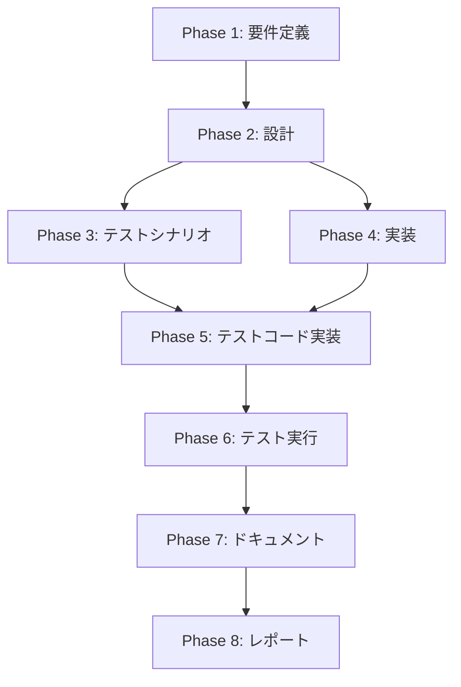
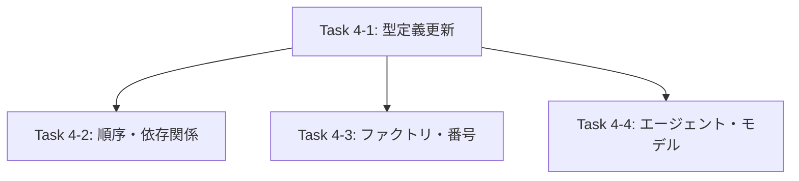

# Codex Agent 実行ログ

開始日時: 2026/2/17 8:21:18

---

## Turn 1: スレッド開始

**Thread ID**: `[REDACTED_TOKEN]`

## Turn 2: ツール実行

**種別**: reasoning
**ステータス**: completed

## Turn 3: ツール実行

**種別**: コマンド実行
**コマンド**: `/bin/bash -lc ls`
**ステータス**: completed (exit_code=0)

```text
AGENT_TEAMS.md
CHANGELOG.md
CLAUDE.md
[REDACTED_TOKEN].md
[REDACTED_TOKEN].md
[REDACTED_TOKEN].md
CODEBASE_SUMMARY.md
Dockerfile
Jenkinsfile
LICENSE
PROGRESS.md
README.md
TROUBLESHOOTING.md
__mocks__
docs
examples
jenkins
jest.config.cjs
metadata.json.template
package-lock.json
package.json
scripts
src
tests
tsconfig.json
tsconfig.test.json
```

## Turn 4: ツール実行

**種別**: reasoning
**ステータス**: completed

## Turn 5: ツール実行

**種別**: コマンド実行
**コマンド**: `/bin/bash -lc 'cat @.ai-workflow/issue-692/00_planning/output/planning.md'`
**ステータス**: failed (exit_code=1)

```text
cat: @.ai-workflow/issue-692/00_planning/output/planning.md: No such file or directory
```

## Turn 6: ツール実行

**種別**: reasoning
**ステータス**: completed

## Turn 7: ツール実行

**種別**: コマンド実行
**コマンド**: `/bin/bash -lc 'ls -a'`
**ステータス**: completed (exit_code=0)

```text
.
..
.ai-workflow
.eslintrc.json
.git
.github
.gitignore
AGENT_TEAMS.md
CHANGELOG.md
CLAUDE.md
[REDACTED_TOKEN].md
[REDACTED_TOKEN].md
[REDACTED_TOKEN].md
CODEBASE_SUMMARY.md
Dockerfile
Jenkinsfile
LICENSE
PROGRESS.md
README.md
TROUBLESHOOTING.md
__mocks__
docs
examples
jenkins
jest.config.cjs
metadata.json.template
package-lock.json
package.json
scripts
src
tests
tsconfig.json
tsconfig.test.json
```

## Turn 8: ツール実行

**種別**: reasoning
**ステータス**: completed

## Turn 9: ツール実行

**種別**: コマンド実行
**コマンド**: `/bin/bash -lc 'cat .ai-workflow/issue-692/00_planning/output/planning.md'`
**ステータス**: completed (exit_code=0)

```text
# プロジェクト計画書: Issue #692 - test_preparation フェーズの追加

## 1. Issue分析

### 概要

本Issueは、`execute` コマンドのワークフローにおいて、テスト実装（`test_implementation`）フェーズとテスト実行（`testing`）フェーズの間に、新規の **テスト準備（`test_preparation`）フェーズ** を追加する変更である。

Docker コンテナ内でテスト実行時に、対象リポジトリの開発言語ランタイムやライブラリがインストールされておらず、テストが失敗するケースが頻発している。この問題を根本的に解決するため、テスト実行前に環境を自動準備するフェーズを導入する。

### 複雑度: **中程度〜複雑**

**判定根拠**:
- **新規ファイル作成**: `[REDACTED_TOKEN]` クラス（1ファイル）、プロンプトファイル（6ファイル: ja/en x execute/review/revise）
- **既存ファイル変更**: 最低7ファイル（`types.ts`, `execute.ts`, `phase-dependencies.ts`, `phase-factory.ts`, `base-phase.ts`, `agent-setup.ts`, `model-optimizer.ts`）
- **フェーズ番号の変更**: 既存フェーズ（testing〜evaluation）の番号が06〜09から07〜10にシフトし、既存ワークフローとの後方互換性の考慮が必要
- **テスト追加**: ユニットテストおよび統合テストの新規作成・既存テスト修正
- **既存のフェーズ実装パターン**が明確に存在するため、ゼロからの設計は不要

### 見積もり工数: **16〜24時間**

| カテゴリ | 見積もり | 内訳 |
|---------|---------|------|
| 型定義・設定変更 | 2〜3h | types.ts, execute.ts, phase-dependencies.ts, phase-factory.ts, agent-setup.ts |
| フェーズクラス実装 | 4〜6h | [REDACTED_TOKEN]（execute/review/revise） |
| プロンプト作成 | 3〜4h | 日本語3ファイル + 英語3ファイル |
| base-phase.ts 変更 | 2〜3h | フェーズ番号マッピング変更、後方互換性対応 |
| model-optimizer.ts 変更 | 1〜2h | 難易度別モデルマッピング追加 |
| テスト作成・修正 | 3〜4h | ユニットテスト新規作成、既存テスト修正 |
| 統合テスト・検証 | 1〜2h | `npm run validate` で全体検証 |

### リスク評価: **中**

- フェーズ番号変更による既存ワークフローへの影響がリスク要因
- ただし、既存のフェーズ実装パターンが確立されており、実装自体の技術的リスクは低い

---

## 2. 実装戦略判断

### 実装戦略: **CREATE**

**判断根拠**:
- 新規フェーズクラス `[REDACTED_TOKEN]` の作成が中心的な作業
- 新規プロンプトファイル6ファイルの作成が必要
- 既存ファイルの変更は、新規フェーズの登録・統合のための定型的な追加が主
- 既存コードのリファクタリングは不要（フェーズ番号の調整は機械的な変更）
- `[REDACTED_TOKEN]` の実装パターンをテンプレートとして流用できるため、アーキテクチャ設計は不要

### テスト戦略: **UNIT_INTEGRATION**

**判断根拠**:
- **ユニットテスト**: `[REDACTED_TOKEN]` クラスの各メソッド（execute/review/revise）の単体テスト、フェーズ依存関係のバリデーションテスト、フェーズ番号マッピングのテスト
- **インテグレーションテスト**: `implementation` プリセットおよび `testing` プリセットで `test_preparation` が正しく実行順序に含まれることの検証、フェーズ間のコンテキスト受け渡しテスト
- **BDDテスト不要**: エンドユーザー向けUIの変更はなく、CLIの動作は既存のフレームワーク内で完結する

### テストコード戦略: **BOTH_TEST**

**判断根拠**:
- **CREATE_TEST**: `[REDACTED_TOKEN]` の新規テストファイル作成（`tests/unit/phases/test-preparation.test.ts`）
- **EXTEND_TEST**: 既存の統合テスト（フェーズ順序テスト、依存関係テスト、プリセットテスト）に `test_preparation` のケースを追加
- 既存の `execute.test.ts` や `phase-dependencies` 関連テストにもテストケース追加が必要

---

## 3. 影響範囲分析

### 既存コードへの影響

#### 直接変更が必要なファイル

| ファイル | 変更内容 | 影響度 |
|---------|---------|--------|
| `src/types.ts` | `PhaseName` 型に `'test_preparation'` を追加 | 低（型の拡張のみ） |
| `src/commands/execute.ts` | `PHASE_ORDER` 配列に追加 | 低（配列要素追加） |
| `src/core/phase-dependencies.ts` | `PHASE_DEPENDENCIES`, `PHASE_PRESETS`, `PRESET_DESCRIPTIONS` の更新 | 中（依存関係の変更） |
| `src/core/phase-factory.ts` | `createPhaseInstance()` に case 追加、import 追加 | 低（定型追加） |
| `src/phases/base-phase.ts` | `getPhaseNumber()` のマッピング更新（番号シフト） | **高**（既存フェーズ番号変更） |
| `src/commands/execute/agent-setup.ts` | `[REDACTED_TOKEN]` に `test_preparation` 追加 | 低（マッピング追加） |
| `src/core/model-optimizer.ts` | 難易度別モデルマッピングに `test_preparation` 追加 | 低（マッピング追加） |

#### 新規作成ファイル

| ファイル | 説明 |
|---------|------|
| `src/phases/test-preparation.ts` | `[REDACTED_TOKEN]` クラス |
| `src/prompts/test_preparation/ja/execute.txt` | テスト準備実行プロンプト（日本語） |
| `src/prompts/test_preparation/ja/review.txt` | テスト準備レビュープロンプト（日本語） |
| `src/prompts/test_preparation/ja/revise.txt` | テスト準備修正プロンプト（日本語） |
| `src/prompts/test_preparation/en/execute.txt` | テスト準備実行プロンプト（英語） |
| `src/prompts/test_preparation/en/review.txt` | テスト準備レビュープロンプト（英語） |
| `src/prompts/test_preparation/en/revise.txt` | テスト準備修正プロンプト（英語） |

#### 影響を受ける既存テスト

| テストファイル | 修正内容 |
|--------------|---------|
| `tests/unit/commands/execute.test.ts` | フェーズ順序テスト、プリセットテストの更新 |
| `tests/unit/phases/base-phase-*.test.ts` | フェーズ番号マッピングテストの更新 |
| `tests/integration/` 内の関連テスト | フェーズ数の変更（10→11）に伴うアサーション更新 |

### 依存関係の変更

- **新規依存の追加**: なし（既存の依存パッケージで実装可能）
- **フェーズ依存関係の変更**:
  - `test_preparation` → `['test_implementation']` に依存（新規追加）
  - `testing` → `['test_implementation']` から `['test_preparation']` に変更

### マイグレーション要否

**フェーズ番号のシフトに関する方
... (truncated)
```

## Turn 10: ツール実行

**種別**: reasoning
**ステータス**: completed

## Turn 11: ツール実行

**種別**: コマンド実行
**コマンド**: `/bin/bash -lc 'cat .ai-workflow/issue-692/05_test_implementation/output/test-implementation.md'`
**ステータス**: completed (exit_code=0)

```text
# テスト実装完了レポート

## テストファイル一覧

| ファイル | テスト数 | カバー対象 |
|---------|---------|-----------|
| `tests/unit/phases/test-preparation.test.ts` | 7 | [REDACTED_TOKEN] の execute/review/revise と例外系 |
| `tests/unit/prompts/test-preparation-prompts.test.ts` | 5 | test_preparation プロンプトの存在・テンプレート変数・言語指示 |
| `tests/unit/phase-dependencies.test.ts` | 6 | test_preparation 依存関係/プリセット説明の追加検証 |
| `tests/unit/core/model-optimizer.test.ts` | 3 | test_preparation のモデルマッピング |
| `tests/unit/phases/base-phase-fallback.test.ts` | 2 | test_preparation のログ抽出ヘッダー判定 |

## 既存テストの更新概要
- フェーズ番号シフト（`06`→`07` 以降）に伴う期待値更新
- フェーズ一覧への `test_preparation` 追加（依存関係/メタデータ/プリセット/チェックリスト）
- スキップ・ロールバック・クリーンアップ系テストの期待値更新

## テストカバレッジ

- ユニットテスト: 23件（追加分）
- 統合テスト: 0件（追加分なし、期待値更新のみ）
- BDDテスト: 0件
- カバレッジ率: 算出不可（未計測）

## テスト実行状況
- 未実行（このフェーズではテスト実行を行っていません）
```

## Turn 12: ツール実行

**種別**: reasoning
**ステータス**: completed

## Turn 13: ツール実行

**種別**: コマンド実行
**コマンド**: `/bin/bash -lc "sed -n '1,200p' tests/unit/phases/test-preparation.test.ts"`
**ステータス**: completed (exit_code=0)

```text
/**
 * ユニットテスト: [REDACTED_TOKEN]
 *
 * テスト対象:
 * - constructor
 * - execute()
 * - review()
 * - revise()
 */

import { describe, test, expect, jest, beforeEach, afterEach } from '@jest/globals';
import fs from 'fs-extra';
import os from 'node:os';
import path from 'node:path';
import { [REDACTED_TOKEN] } from '../../../src/phases/test-preparation.js';
import type { [REDACTED_TOKEN] } from '../../../src/types.js';

const ISSUE_NUMBER = '123';

const [REDACTED_TOKEN] =
  'テストコード実装ログは利用できません。実装コードとリポジトリ構成から環境準備を行ってください。';
const [REDACTED_TOKEN] =
  '実装ログは利用できません。リポジトリの実装内容を直接確認して環境準備を行ってください。';

const [REDACTED_TOKEN] =
  '実装ログは利用できません。テスト準備内容から実装を推測してレビューしてください。';
const [REDACTED_TOKEN] =
  'テストコード実装ログは利用できません。テスト準備内容からテスト方針を推測してレビューしてください。';

const [REDACTED_TOKEN] =
  '実装ログは利用できません。テスト準備内容から実装を推測して修正してください。';
const [REDACTED_TOKEN] =
  'テストコード実装ログは利用できません。テスト準備内容からテスト方針を推測して修正してください。';

describe('[REDACTED_TOKEN]', () => {
  let tempRoot: string;
  let workingDir: string;
  let workflowDir: string;
  let metadataManager: any;
  let githubClient: any;

  const createPhase = (): [REDACTED_TOKEN] =>
    new [REDACTED_TOKEN]({
      workingDir,
      metadataManager,
      githubClient,
      skipDependencyCheck: true,
    });

  beforeEach(() => {
    tempRoot = fs.mkdtempSync(path.join(os.tmpdir(), '[REDACTED_TOKEN]-'));
    workingDir = path.join(tempRoot, 'repo');
    workflowDir = path.join(workingDir, '.ai-workflow', `issue-${ISSUE_NUMBER}`);
    fs.ensureDirSync(workingDir);

    metadataManager = {
      workflowDir,
      data: {
        issue_number: ISSUE_NUMBER,
        target_repository: {
          path: workingDir,
          repo: path.basename(workingDir),
        },
      },
      updatePhaseStatus: jest.fn<any>(),
      getPhaseStatus: jest.fn<any>(),
      addCompletedStep: jest.fn<any>(),
      getCompletedSteps: jest.fn<any>().mockReturnValue([]),
      updateCurrentStep: jest.fn<any>(),
      getRollbackContext: jest.fn<any>().mockReturnValue(null),
      save: jest.fn<any>(),
      getLanguage: jest.fn<any>().mockReturnValue('ja'),
    };

    githubClient = {
      getIssueInfo: jest.fn<any>(),
      postComment: jest.fn<any>(),
      createOrUpdateProgressComment: jest.fn<any>(),
      postReviewResult: jest.fn<any>(),
    };
  });

  afterEach(() => {
    jest.restoreAllMocks();
    if (tempRoot && fs.existsSync(tempRoot)) {
      fs.removeSync(tempRoot);
    }
  });

  test('UT-PHASE-001: コンストラクタで phaseName が test_preparation に設定される', () => {
    const phase = createPhase();
    expect((phase as any).phaseName).toBe('test_preparation');
  });

  test('UT-PHASE-002: execute() が [REDACTED_TOKEN] を呼び出す', async () => {
    const phase = createPhase();

    const [REDACTED_TOKEN] = jest
      .spyOn(phase as any, '[REDACTED_TOKEN]')
      .mockReturnValue('mock-context');
    const planningRefSpy = jest
      .spyOn(phase as any, '[REDACTED_TOKEN]')
      .mockReturnValue('@planning');
    const executeTemplateSpy = jest
      .spyOn(phase as any, '[REDACTED_TOKEN]')
      .mockResolvedValue({ success: true } as [REDACTED_TOKEN]);

    const result = await (phase as any).execute();

    expect([REDACTED_TOKEN]).[REDACTED_TOKEN](
      'test_implementation',
      'test-implementation.md',
      [REDACTED_TOKEN],
      Number(ISSUE_NUMBER),
    );
    expect([REDACTED_TOKEN]).[REDACTED_TOKEN](
      'implementation',
      'implementation.md',
      [REDACTED_TOKEN],
      Number(ISSUE_NUMBER),
    );
    expect(planningRefSpy).[REDACTED_TOKEN](Number(ISSUE_NUMBER));
    expect(executeTemplateSpy).[REDACTED_TOKEN](
      'test-preparation.md',
      {
        planning_document_path: '@planning',
        test_implementation_context: 'mock-context',
        implementation_context: 'mock-context',
        issue_number: ISSUE_NUMBER,
      },
      { maxTurns: 80, e
... (truncated)
```

## Turn 14: ツール実行

**種別**: reasoning
**ステータス**: completed

## Turn 15: ツール実行

**種別**: コマンド実行
**コマンド**: `/bin/bash -lc "sed -n '200,400p' tests/unit/phases/test-preparation.test.ts"`
**ステータス**: completed (exit_code=0)

```text
const result = await phase.revise('fix');

    expect(result.success).toBe(false);
    expect(result.error).toContain('test-preparation.md が存在しません');
  });

  test('UT-PHASE-007: revise() がレビュー指摘を反映して更新される', async () => {
    const phase = createPhase();
    const outputFile = path.join((phase as any).outputDir, 'test-preparation.md');
    fs.ensureDirSync(path.dirname(outputFile));
    fs.writeFileSync(outputFile, '# テスト準備 v1', 'utf-8');

    jest.spyOn(phase as any, 'getPhaseOutputFile').mockReturnValue(null);
    jest.spyOn(phase as any, '[REDACTED_TOKEN]').mockReturnValue('@test-prep');
    jest.spyOn(phase as any, 'loadPrompt').mockReturnValue(
      'Prep: {[REDACTED_TOKEN]}\n' +
        'Impl: {[REDACTED_TOKEN]}\n' +
        'TestImpl: {[REDACTED_TOKEN]}\n' +
        'Feedback: {review_feedback}\n' +
        'Issue: {issue_number}'
    );

    const executeSpy = jest
      .spyOn(phase as any, 'executeWithAgent')
      .mockImplementation(async () => {
        fs.writeFileSync(outputFile, '# テスト準備 v2', 'utf-8');
        return [] as any;
      });

    const result = await phase.revise('Python 3.11 が必要です');

    const [[promptArg, optionsArg]] = executeSpy.mock.calls;
    expect(promptArg).toContain('Prep: @test-prep');
    expect(promptArg).toContain(`Impl: ${[REDACTED_TOKEN]}`);
    expect(promptArg).toContain(`TestImpl: ${[REDACTED_TOKEN]}`);
    expect(promptArg).toContain('Feedback: Python 3.11 が必要です');
    expect(promptArg).toContain(`Issue: ${ISSUE_NUMBER}`);
    expect(optionsArg).toEqual({ maxTurns: 80, logDir: (phase as any).reviseDir });

    expect(result.success).toBe(true);
    expect(result.output).toBe(outputFile);
  });
});
```

## Turn 16: ツール実行

**種別**: reasoning
**ステータス**: completed

## Turn 17: ツール実行

**種別**: コマンド実行
**コマンド**: `/bin/bash -lc "sed -n '1,200p' tests/unit/prompts/test-preparation-prompts.test.ts"`
**ステータス**: completed (exit_code=0)

```text
/**
 * ユニットテスト: test_preparation プロンプト
 *
 * テスト対象:
 * - 日本語/英語の execute/review/revise プロンプトの存在
 * - 重要なテンプレート変数の埋め込み
 * - 言語指示の有無
 */

import { describe, test, expect } from '@jest/globals';
import fs from 'fs-extra';
import path from 'node:path';

const PROMPTS_ROOT = path.join(process.cwd(), 'src', 'prompts', 'test_preparation');

const promptFiles = {
  ja: {
    execute: path.join(PROMPTS_ROOT, 'ja', 'execute.txt'),
    review: path.join(PROMPTS_ROOT, 'ja', 'review.txt'),
    revise: path.join(PROMPTS_ROOT, 'ja', 'revise.txt'),
  },
  en: {
    execute: path.join(PROMPTS_ROOT, 'en', 'execute.txt'),
    review: path.join(PROMPTS_ROOT, 'en', 'review.txt'),
    revise: path.join(PROMPTS_ROOT, 'en', 'revise.txt'),
  },
} as const;

describe('test_preparation プロンプトファイルの存在確認', () => {
  test('日本語プロンプト（execute/review/revise）が存在し、空でない', () => {
    const files = Object.values(promptFiles.ja);
    for (const filePath of files) {
      expect(fs.existsSync(filePath)).toBe(true);
      const content = fs.readFileSync(filePath, 'utf-8');
      expect(content.trim().length).toBeGreaterThan(0);
    }
  });

  test('英語プロンプト（execute/review/revise）が存在し、空でない', () => {
    const files = Object.values(promptFiles.en);
    for (const filePath of files) {
      expect(fs.existsSync(filePath)).toBe(true);
      const content = fs.readFileSync(filePath, 'utf-8');
      expect(content.trim().length).toBeGreaterThan(0);
    }
  });
});

describe('test_preparation 実行プロンプトのテンプレート変数', () => {
  test('日本語 execute プロンプトに必須テンプレート変数が含まれる', () => {
    const content = fs.readFileSync(promptFiles.ja.execute, 'utf-8');
    expect(content).toContain('{[REDACTED_TOKEN]}');
    expect(content).toContain('{[REDACTED_TOKEN]}');
    expect(content).toContain('{[REDACTED_TOKEN]}');
    expect(content).toContain('{issue_number}');
  });
});

describe('test_preparation プロンプトの言語指示', () => {
  test('日本語プロンプトに日本語出力指示が含まれる', () => {
    const content = fs.readFileSync(promptFiles.ja.execute, 'utf-8');
    expect(content).toMatch(/日本語/);
  });

  test('英語プロンプトに英語出力指示が含まれる', () => {
    const content = fs.readFileSync(promptFiles.en.execute, 'utf-8');
    expect(content).toMatch(/English/i);
  });
});
```

## Turn 18: ツール実行

**種別**: reasoning
**ステータス**: completed

## Turn 19: ツール実行

**種別**: コマンド実行
**コマンド**: `/bin/bash -lc "sed -n '1,200p' tests/unit/phase-dependencies.test.ts"`
**ステータス**: completed (exit_code=0)

```text
/**
 * ユニットテスト: phase-dependencies.ts
 *
 * テスト対象:
 * - PHASE_PRESETS定義の正確性
 * - DEPRECATED_PRESETS後方互換性
 * - [REDACTED_TOKEN]関数
 * - buildErrorMessage関数
 * - buildWarningMessage関数
 */

import { describe, test, expect, beforeAll, afterAll } from '@jest/globals';
import fs from 'fs-extra';
import path from 'node:path';
import {
  PHASE_PRESETS,
  DEPRECATED_PRESETS,
  PRESET_DESCRIPTIONS,
  PHASE_DEPENDENCIES,
  [REDACTED_TOKEN],
  [REDACTED_TOKEN],
} from '../../src/core/phase-dependencies.js';
import { MetadataManager } from '../../src/core/metadata-manager.js';
import { WorkflowState } from '../../src/core/workflow-state.js';
import { PhaseName, type PhaseStatus } from '../../src/types.js';

// テスト用の一時ディレクトリ
const TEST_DIR = path.join(process.cwd(), 'tests', 'temp', '[REDACTED_TOKEN]');
const [REDACTED_TOKEN] = path.join(TEST_DIR, 'skip-phases');

/**
 * skipPhases 用のメタデータを作成
 */
function [REDACTED_TOKEN](statuses: Partial<Record<PhaseName, PhaseStatus>>): MetadataManager {
  fs.ensureDirSync([REDACTED_TOKEN]);
  const tempDir = fs.mkdtempSync(path.join([REDACTED_TOKEN], 'case-'));
  const metadataPath = path.join(tempDir, 'metadata.json');
  WorkflowState.createNew(metadataPath, '123', 'https://example.com/issues/123', 'Skip phases test');
  const manager = new MetadataManager(metadataPath);

  for (const [phase, status] of Object.entries(statuses)) {
    if (!status) {
      continue;
    }
    manager.updatePhaseStatus(phase as PhaseName, 'in_progress');
    manager.updatePhaseStatus(phase as PhaseName, status as PhaseStatus);
  }

  return manager;
}

describe('PHASE_PRESETS定義テスト', () => {
  test('1.1.1: 新規プリセット定義の正確性', () => {
    // Given: PHASE_PRESETSが定義されている
    // When: 各プリセットを確認
    // Then: 正しいPhaseリストを持つ
    expect(PHASE_PRESETS['review-requirements']).toEqual(['planning', 'requirements']);
    expect(PHASE_PRESETS['review-design']).toEqual(['planning', 'requirements', 'design']);
    expect(PHASE_PRESETS['[REDACTED_TOKEN]']).toEqual(['planning', 'requirements', 'design', 'test_scenario']);
    expect(PHASE_PRESETS['analysis-design']).toEqual(['planning', 'requirements', 'design']);

    expect(PHASE_PRESETS['quick-fix']).toEqual(['planning', 'implementation', 'documentation', 'report']);
    expect(PHASE_PRESETS['implementation']).toEqual(['planning', 'implementation', 'test_implementation', 'test_preparation', 'testing', 'documentation', 'report']);

    expect(PHASE_PRESETS['full-test']).toEqual(['planning', 'test_scenario', 'test_implementation']);
    expect(PHASE_PRESETS['testing']).toEqual(['planning', 'test_implementation', 'test_preparation', 'testing']);

    expect(PHASE_PRESETS['finalize']).toEqual(['planning', 'documentation', 'report', 'evaluation']);
  });

  test('1.1.2: プリセット説明マップの存在確認', () => {
    // Given: PHASE_PRESETSの全キー
    // When: 各プリセット名に対する説明を確認
    // Then: 説明文字列が存在する
    for (const presetName of Object.keys(PHASE_PRESETS)) {
      expect(PRESET_DESCRIPTIONS[presetName]).toBeTruthy();
      expect(PRESET_DESCRIPTIONS[presetName].length > 0).toBeTruthy();
    }
  });

  test('1.1.3: すべてのプリセットにplanningが含まれる', () => {
    // Given: PHASE_PRESETSが定義されている
    // When: 各プリセットのフェーズリストを確認
    // Then: すべてのプリセットに'planning'が含まれ、先頭が'planning'である
    for (const phases of Object.values(PHASE_PRESETS)) {
      expect(phases).toContain('planning');
      expect(phases[0]).toBe('planning');
    }
  });

  test('1.1.4: すべてのプリセット説明がPlanningで始まる', () => {
    // Given: PRESET_DESCRIPTIONSが定義されている
    // When: 各プリセットの説明を確認
    // Then: すべての説明が'Planning +'で始まる
    for (const description of Object.values(PRESET_DESCRIPTIONS)) {
      expect(description.startsWith('Planning +')).toBe(true);
    }
  });

  test('1.1.4-1: implementation の説明に TestPreparation が含まれる', () => {
    expect(PRESET_DESCRIPTIONS['implementation']).toContain('TestPreparation');
  });

  test('1.1.4-2: testing の説明に TestPreparation が含まれる', () => {
    expect(PRESET_DES
... (truncated)
```

## Turn 20: ツール実行

**種別**: reasoning
**ステータス**: completed

## Turn 21: ツール実行

**種別**: コマンド実行
**コマンド**: `/bin/bash -lc "sed -n '1,200p' tests/unit/core/model-optimizer.test.ts"`
**ステータス**: completed (exit_code=0)

```text
import { describe, it, expect, jest, beforeEach } from '@jest/globals';
import { ModelOptimizer, [REDACTED_TOKEN] } from '../../../src/core/model-optimizer.js';
import { logger } from '../../../src/utils/logger.js';

describe('ModelOptimizer', () => {
  beforeEach(() => {
    jest.spyOn(logger, 'warn').mockImplementation(() => {});
    jest.spyOn(logger, 'debug').mockImplementation(() => {});
  });

  describe('default mapping', () => {
    it('returns lightweight models for simple execute step (TC-MO-001)', () => {
      // Given
      const optimizer = new ModelOptimizer('simple');

      // When
      const result = optimizer.resolveModel('planning', 'execute');

      // Then
      expect(result).toEqual({ claudeModel: 'sonnet', codexModel: 'mini' });
    });

    it('returns lightweight models for simple review step (TC-MO-002)', () => {
      // Given
      const optimizer = new ModelOptimizer('simple');

      // When
      const result = optimizer.resolveModel('implementation', 'review');

      // Then
      expect(result).toEqual({ claudeModel: 'sonnet', codexModel: 'mini' });
    });

    it('returns lightweight models for simple test_preparation execute (TC-MO-018)', () => {
      // Given
      const optimizer = new ModelOptimizer('simple');

      // When
      const result = optimizer.resolveModel('test_preparation', 'execute');

      // Then
      expect(result).toEqual({ claudeModel: 'sonnet', codexModel: 'mini' });
    });

    it('returns high quality models for moderate planning execute (TC-MO-003)', () => {
      // Given
      const optimizer = new ModelOptimizer('moderate');

      // When
      const result = optimizer.resolveModel('planning', 'execute');

      // Then
      expect(result).toEqual({ claudeModel: 'opus', codexModel: 'max' });
    });

    it('returns high quality models for moderate test_preparation execute (TC-MO-019)', () => {
      // Given
      const optimizer = new ModelOptimizer('moderate');

      // When
      const result = optimizer.resolveModel('test_preparation', 'execute');

      // Then
      expect(result).toEqual({ claudeModel: 'opus', codexModel: 'max' });
    });

    it('returns high quality models for moderate revise steps in code phases (TC-MO-004)', () => {
      // Given
      const optimizer = new ModelOptimizer('moderate');

      // When
      const result = optimizer.resolveModel('implementation', 'revise');

      // Then
      expect(result).toEqual({ claudeModel: 'opus', codexModel: 'max' });
    });

    it('returns high quality models for complex test_preparation execute (TC-MO-020)', () => {
      // Given
      const optimizer = new ModelOptimizer('complex');

      // When
      const result = optimizer.resolveModel('test_preparation', 'execute');

      // Then
      expect(result).toEqual({ claudeModel: 'opus', codexModel: 'max' });
    });

    it('returns lightweight models for moderate documentation execute (TC-MO-005)', () => {
      // Given
      const optimizer = new ModelOptimizer('moderate');

      // When
      const result = optimizer.resolveModel('documentation', 'execute');

      // Then
      expect(result).toEqual({ claudeModel: 'sonnet', codexModel: 'mini' });
    });

    it('returns high quality models for complex execute steps (TC-MO-006)', () => {
      // Given
      const optimizer = new ModelOptimizer('complex');

      // When
      const result = optimizer.resolveModel('implementation', 'execute');

      // Then
      expect(result).toEqual({ claudeModel: 'opus', codexModel: 'max' });
    });

    it('returns high quality models for complex revise steps (TC-MO-007)', () => {
      // Given
      const optimizer = new ModelOptimizer('complex');

      // When
      const result = optimizer.resolveModel('testing', 'revise');

      // Then
      expect(result).toEqual({ claudeModel: 'opus', codexModel: 'max' });
    });

    it('falls back to complex mapping for unknown difficulty', () => {
      // Given
... (truncated)
```

## Turn 22: ツール実行

**種別**: reasoning
**ステータス**: completed

## Turn 23: ツール実行

**種別**: コマンド実行
**コマンド**: `/bin/bash -lc "sed -n '1,200p' tests/unit/phases/base-phase-fallback.test.ts"`
**ステータス**: completed (exit_code=0)

```text
/**
 * Unit tests for BasePhase fallback mechanism (Issue #113)
 *
 * Tests cover:
 * - [REDACTED_TOKEN](): Log extraction with pattern matching
 * - [REDACTED_TOKEN](): Content validation logic
 * - [REDACTED_TOKEN](): Fallback processing orchestration
 * - [REDACTED_TOKEN](): Integration with enableFallback option
 */

import { describe, it, expect, beforeEach, afterEach, jest } from '@jest/globals';
import fs from 'fs-extra';
import path from 'node:path';
import { BasePhase } from '../../../src/phases/base-phase.js';
import { MetadataManager } from '../../../src/core/metadata-manager.js';
import { GitHubClient } from '../../../src/core/github-client.js';
import { [REDACTED_TOKEN], PhaseName } from '../../../src/types.js';

// Concrete implementation of BasePhase for testing
class TestPhase extends BasePhase {
  constructor(params: any) {
    super({ ...params, phaseName: 'planning' as PhaseName });
  }

  protected async execute(): Promise<[REDACTED_TOKEN]> {
    return { success: true, output: 'test-output.md' };
  }

  protected async review(): Promise<[REDACTED_TOKEN]> {
    return { success: true, output: null };
  }

  public async testRevise(feedback: string): Promise<[REDACTED_TOKEN]> {
    return { success: true, output: 'planning.md' };
  }

  // Expose protected methods for testing
  public [REDACTED_TOKEN](agentLog: string, phaseName: PhaseName): string | null {
    return this.[REDACTED_TOKEN](agentLog, phaseName);
  }

  public [REDACTED_TOKEN](content: string, phaseName: PhaseName): boolean {
    return this.[REDACTED_TOKEN](content, phaseName);
  }

  public [REDACTED_TOKEN](
    phaseOutputFile: string,
    logDir: string
  ): Promise<[REDACTED_TOKEN]> {
    return this.[REDACTED_TOKEN](phaseOutputFile, logDir);
  }

  public [REDACTED_TOKEN]<T extends Record<string, string>>(
    phaseOutputFile: string,
    templateVariables: T,
    options?: { maxTurns?: number; verbose?: boolean; logDir?: string; enableFallback?: boolean }
  ): Promise<[REDACTED_TOKEN]> {
    return this.[REDACTED_TOKEN](phaseOutputFile, templateVariables, options);
  }
}

function ensureDirectory(dir: string): void {
  if (!fs.existsSync(dir)) {
    fs.mkdirSync(dir, { recursive: true });
  }
}

/**
 * Setup file system mock with limited scope.
 *
 * This mock intentionally does NOT mock prompt file reads to prevent
 * "EACCES: permission denied" errors in [REDACTED_TOKEN] tests.
 *
 * Reason: fs.readFileSync mock was affecting loadPrompt() method, causing
 * errors in [REDACTED_TOKEN] tests.
 *
 * Reference: Issue #113 Evaluation Report lines 145-160
 */
function setupFileSystemMock(): void {
  // Note: This function is intentionally empty as we don't want to mock
  // fs.readFileSync for these tests. The original issue was that mocking
  // fs.readFileSync was preventing loadPrompt() from working correctly.
  // By not mocking it at all, we allow the tests to work properly.
}

describe('BasePhase Fallback Mechanism (Issue #113)', () => {
  let testPhase: TestPhase;
  let mockMetadata: jest.Mocked<MetadataManager>;
  let mockGitHub: jest.Mocked<GitHubClient>;
  let testWorkingDir: string;

  beforeEach(() => {
    // Setup test working directory
    testWorkingDir = path.join(process.cwd(), '.test-tmp', 'base-phase-fallback');
    ensureDirectory(testWorkingDir);

    // Mock MetadataManager
    mockMetadata = {
      workflowDir: path.join(testWorkingDir, '.ai-workflow', 'issue-113'),
      data: {
        issue_number: '113',
        target_repository: {
          path: testWorkingDir,
          repo: path.basename(testWorkingDir),
        },
      },
      updatePhaseStatus: jest.fn(),
      getRollbackContext: jest.fn(),
      getLanguage: jest.fn().mockReturnValue('ja'),
    } as any;

    // Mock GitHubClient
    mockGitHub = {
      getIssueInfo: jest.fn(),
      postComment: jest.fn(),
    } as any;

    // Create
... (truncated)
```

## Turn 24: ツール実行

**種別**: reasoning
**ステータス**: completed

## Turn 25: ツール実行

**種別**: コマンド実行
**コマンド**: `/bin/bash -lc 'rg -n "test_preparation" tests'`
**ステータス**: failed (exit_code=127)

```text
/bin/bash: line 1: rg: command not found
```

## Turn 26: ツール実行

**種別**: reasoning
**ステータス**: completed

## Turn 27: ツール実行

**種別**: コマンド実行
**コマンド**: `/bin/bash -lc 'grep -R "test_preparation" -n tests | head'`
**ステータス**: completed (exit_code=0)

```text
tests/integration/base-phase-refactored.test.ts:84:    test_preparation: [],
tests/integration/cleanup-command.test.ts:238:      '06_test_preparation',
tests/integration/cleanup-command.test.ts:285:      '06_test_preparation',
tests/integration/cleanup-command.test.ts:324:      '06_test_preparation',
tests/integration/cleanup-command.test.ts:381:      '06_test_preparation',
tests/integration/cleanup-command.test.ts:430:    for (const phaseName of ['[REDACTED_TOKEN]', '06_test_preparation', '07_testing', '08_documentation', '09_report']) {
tests/integration/cleanup-command.test.ts:473:      '06_test_preparation',
tests/integration/cleanup-command.test.ts:529:      '06_test_preparation',
tests/integration/evaluation-phase-file-save.test.ts:73:        test_preparation: { status: 'completed', started_at: new Date().toISOString() },
tests/integration/finalize-command.test.ts:84:    test_preparation: { status: 'pending', retry_count: 0, started_at: null, completed_at: null, review_result: null },
```

## Turn 28: ツール実行

**種別**: reasoning
**ステータス**: completed

## Turn 29: ツール実行

**種別**: コマンド実行
**コマンド**: `/bin/bash -lc 'cat .ai-workflow/issue-692/03_test_scenario/output/test-scenario.md'`
**ステータス**: completed (exit_code=0)

```text
Total output lines: 1016

# テストシナリオ: Issue #692 - test_preparation フェーズの追加

## 1. テスト戦略サマリー

### 選択されたテスト戦略

**UNIT_INTEGRATION**（Phase 2 設計書で決定）

### テスト対象の範囲

| カテゴリ | 対象 | テスト種別 |
|---------|------|-----------|
| 型定義 | `PhaseName` 型への `'test_preparation'` 追加 | Unit |
| フェーズ順序 | `PHASE_ORDER` 配列への挿入 | Unit + Integration |
| 依存関係 | `PHASE_DEPENDENCIES` の更新 | Unit + Integration |
| プリセット | `PHASE_PRESETS`, `PRESET_DESCRIPTIONS` の更新 | Unit + Integration |
| フェーズクラス | `[REDACTED_TOKEN]` (execute/review/revise) | Unit |
| フェーズファクトリ | `createPhaseInstance()` の case 追加 | Unit |
| フェーズ番号 | `getPhaseNumber()` のマッピング更新（2箇所） | Unit |
| ログ抽出 | `[REDACTED_TOKEN]()` のヘッダーパターン追加 | Unit |
| エージェント優先順位 | `[REDACTED_TOKEN]` マッピング追加 | Unit |
| モデル最適化 | `[REDACTED_TOKEN]` への追加 | Unit |
| プロンプト | 6 ファイル（ja/en × execute/review/revise） | Unit |

### テストの目的

1. **型安全性の保証**: `PhaseName` 型の拡張が全ての `Record<PhaseName, ...>` マッピングに波及し、漏れがないことを検証
2. **フェーズ統合の正確性**: `test_preparation` が正しい位置（test_implementation の直後、testing の直前）に挿入されていることを検証
3. **依存関係の整合性**: 新しい依存チェーン（test_implementation → test_preparation → testing）が正しく機能することを検証
4. **後方互換性**: 既存のプリセット・依存関係・フェーズ番号が正しく動作し続けることを検証
5. **新規クラスの機能性**: `[REDACTED_TOKEN]` の execute/review/revise が正しく動作することを検証

---

## 2. Unit テストシナリオ

### 2.1 PhaseName 型の拡張（FR-001）

**テスト対象ファイル**: `src/types.ts`
**テストファイル**: 既存テストの TypeScript コンパイル成功で間接検証

#### UT-TYPE-001: PhaseName 型に test_preparation が含まれる

- **目的**: `PhaseName` 型ユニオンに `'test_preparation'` が追加されていることを検証
- **前提条件**: `src/types.ts` が変更済み
- **入力**: TypeScript コンパイル
- **期待結果**: `npm run lint` がエラーなく完了すること
- **検証方法**: `'test_preparation'` を `PhaseName` 型の変数に代入可能であること（型レベル検証はコンパイル時に実行）

---

### 2.2 PHASE_ORDER 配列の更新（FR-002）

**テスト対象ファイル**: `src/commands/execute.ts`
**テストファイル**: `tests/unit/commands/execute.test.ts`（既存テスト更新）

#### UT-ORDER-001: test_preparation が PHASE_ORDER に含まれる

- **目的**: `PHASE_ORDER` 配列に `'test_preparation'` が含まれていることを検証
- **前提条件**: `PHASE_ORDER` が更新済み
- **入力**: なし（定数参照）
- **期待結果**: `PHASE_ORDER` が `'test_preparation'` を含むこと
- **テストデータ**: なし

#### UT-ORDER-002: test_preparation の位置が正しい

- **目的**: `test_preparation` が `test_implementation` の直後、`testing` の直前に配置されていることを検証
- **前提条件**: `PHASE_ORDER` が更新済み
- **入力**: なし（定数参照）
- **期待結果**:
  - `PHASE_ORDER.indexOf('test_preparation')` が `PHASE_ORDER.indexOf('test_implementation') + 1` と等しい
  - `PHASE_ORDER.indexOf('test_preparation')` が `PHASE_ORDER.indexOf('testing') - 1` と等しい

#### UT-ORDER-003: フェーズ総数が 11 である

- **目的**: `test_preparation` の追加によりフェーズ総数が 10 から 11 に増加していることを検証
- **前提条件**: `PHASE_ORDER` が更新済み
- **入力**: なし（定数参照）
- **期待結果**: `PHASE_ORDER.length` が 11 であること

---

### 2.3 フェーズ依存関係（FR-003）

**テスト対象ファイル**: `src/core/phase-dependencies.ts`
**テストファイル**: `tests/unit/phase-dependencies.test.ts`（既存テスト更新）

#### UT-DEP-001: test_preparation の依存関係が正しく定義されている

- **目的**: `PHASE_DEPENDENCIES['test_preparation']` が `['test_implementation']` であることを検証
- **前提条件**: `PHASE_DEPENDENCIES` が更新済み
- **入力**: なし（定数参照）
- **期待結果**: `PHASE_DEPENDENCIES['test_preparation']` が `['test_implementation']` と等しいこと

#### UT-DEP-002: testing の依存が test_preparation に変更されている

- **目的**: `PHASE_DEPENDENCIES['testing']` が `['test_implementation']` から `['test_preparation']` に変更されていることを検証
- **前提条件**: `PHASE_DEPENDENCIES` が更新済み
- **入力**: なし（定数参照）
- **期待結果**: `PHASE_DEPENDENCIES['testing']` が `['test_preparation']` と等しいこと

#### UT-DEP-003: 全 Phase が PHASE_DEPENDENCIES に定義されている

- **目的**: `PHASE_DEPENDENCIES` のキーに `test_preparation` を含む全 11 フェーズが定義されていることを検証
- **前提条件**: `PHASE_DEPENDENCIES` が更新済み
- **入力**: 期待されるフェーズ名リスト（11 件）
- **期待結果**: すべてのフェーズ名が `PHASE_DEPENDENCIES` のキーに含まれること
- **テストデータ**:
  ```typescript
  const expectedPhases: PhaseName[] = [
    'planning', 'requirements', 'design', 'test_scenario',
    'implementation', 'test_implementation', 'test_preparation',
    'testing', 'documentation', 'report', 'evaluation',
  ];
  ```

#### UT-DEP-004: 循環依存が存在しない

- **目的**: `test_preparation` 追加後も依存関係グラフに循環
... (truncated)
```

## Turn 30: ツール実行

**種別**: reasoning
**ステータス**: completed

## Turn 31: ツール実行

**種別**: コマンド実行
**コマンド**: `/bin/bash -lc 'rg -n "PHASE_ORDER" -n tests/unit/commands/execute.test.ts'`
**ステータス**: failed (exit_code=127)

```text
/bin/bash: line 1: rg: command not found
```

## Turn 32: ツール実行

**種別**: reasoning
**ステータス**: completed

## Turn 33: ツール実行

**種別**: コマンド実行
**コマンド**: `/bin/bash -lc 'grep -n "PHASE_ORDER" tests/unit/commands/execute.test.ts'`
**ステータス**: failed (exit_code=1)

## Turn 34: ツール実行

**種別**: reasoning
**ステータス**: completed

## Turn 35: ツール実行

**種別**: コマンド実行
**コマンド**: `/bin/bash -lc "sed -n '1,200p' tests/unit/commands/execute.test.ts"`
**ステータス**: completed (exit_code=0)

```text
/**
 * ユニットテスト: execute コマンドモジュール
 *
 * テスト対象:
 * - resolvePresetName(): プリセット名解決（後方互換性対応）
 * - getPresetPhases(): プリセットのフェーズリスト取得
 * - canResumeWorkflow(): ワークフロー再開可否判定
 *
 * テスト戦略: UNIT_INTEGRATION - ユニット部分
 *
 * 注意: [REDACTED_TOKEN]()のテストは統合テストで実施します。
 */

import { describe, test, expect } from '@jest/globals';
import { resolvePresetName, getPresetPhases } from '../../../src/commands/execute.js';
import * as executeModule from '../../../src/commands/execute.js';

// =============================================================================
// resolvePresetName() のテスト
// =============================================================================

describe('resolvePresetName', () => {
  describe('正常系: 標準プリセット名', () => {
    test('quick-fixプリセットが正しく解決される', () => {
      // Given: 標準プリセット名
      const presetName = 'quick-fix';

      // When: プリセット名を解決
      const result = resolvePresetName(presetName);

      // Then: 警告なしで解決される
      expect(result.resolvedName).toBe('quick-fix');
      expect(result.warning).toBeUndefined();
    });

    test('review-requirementsプリセットが正しく解決される', () => {
      // Given: 標準プリセット名
      const presetName = 'review-requirements';

      // When: プリセット名を解決
      const result = resolvePresetName(presetName);

      // Then: 警告なしで解決される
      expect(result.resolvedName).toBe('review-requirements');
      expect(result.warning).toBeUndefined();
    });

    test('implementationプリセットが正しく解決される', () => {
      // Given: 標準プリセット名
      const presetName = 'implementation';

      // When: プリセット名を解決
      const result = resolvePresetName(presetName);

      // Then: 警告なしで解決される
      expect(result.resolvedName).toBe('implementation');
      expect(result.warning).toBeUndefined();
    });
  });

  describe('正常系: 非推奨プリセット名（後方互換性）', () => {
    test('requirements-onlyが新プリセット名に自動変換され、警告が返される', () => {
      // Given: 非推奨プリセット名
      const presetName = 'requirements-only';

      // When: プリセット名を解決
      const result = resolvePresetName(presetName);

      // Then: 新プリセット名に解決され、警告が表示される
      expect(result.resolvedName).toBe('review-requirements');
      expect(result.warning).toBeTruthy();
      expect(result.warning).toContain('deprecated');
      expect(result.warning).toContain('review-requirements');
    });

    test('design-phaseが新プリセット名に自動変換され、警告が返される', () => {
      // Given: 非推奨プリセット名
      const presetName = 'design-phase';

      // When: プリセット名を解決
      const result = resolvePresetName(presetName);

      // Then: 新プリセット名に解決され、警告が表示される
      expect(result.resolvedName).toBe('review-design');
      expect(result.warning).toBeTruthy();
      expect(result.warning).toContain('deprecated');
      expect(result.warning).toContain('review-design');
    });

    test('[REDACTED_TOKEN]が新プリセット名に自動変換され、警告が返される', () => {
      // Given: 非推奨プリセット名
      const presetName = '[REDACTED_TOKEN]';

      // When: プリセット名を解決
      const result = resolvePresetName(presetName);

      // Then: 新プリセット名に解決され、警告が表示される
      expect(result.resolvedName).toBe('implementation');
      expect(result.warning).toBeTruthy();
      expect(result.warning).toContain('deprecated');
      expect(result.warning).toContain('implementation');
    });
  });

  describe('異常系: 存在しないプリセット名', () => {
    test('存在しないプリセット名でエラーをスローする', () => {
      // Given: 存在しないプリセット名
      const presetName = 'non-existent-preset';

      // When & Then: エラーがスローされる
      expect(() => {
        resolvePresetName(presetName);
      }).toThrow();
    });

    test('空文字列でエラーをスローする', () => {
      // Given: 空文字列
      const presetName = '';

      // When & Then: エラーがスローされる
      expect(() => {
        resolvePresetName(presetName);
      }).toThrow();
    });
  });
});

// =============================================================================
// getPresetPhases() のテスト
// =============================================================================

describe('getPresetPhases', () => {
  describe('正常系: プリセットのフェーズリスト取得', () => {
    test('quick-
... (truncated)
```

## Turn 36: ツール実行

**種別**: reasoning
**ステータス**: completed

## Turn 37: ツール実行

**種別**: reasoning
**ステータス**: completed

## Turn 38: ツール実行

**種別**: reasoning
**ステータス**: completed

## Turn 39: ツール実行

**種別**: コマンド実行
**コマンド**: `/bin/bash -lc 'grep -n "test_preparation" -n tests/unit/commands/rollback.test.ts'`
**ステータス**: completed (exit_code=0)

```text
67:        test_preparation: { ...basePhase },
438:      expect(getPhaseNumber('test_preparation')).toBe('06');
```

## Turn 40: ツール実行

**種別**: reasoning
**ステータス**: completed

## Turn 41: ツール実行

**種別**: コマンド実行
**コマンド**: `/bin/bash -lc "sed -n '380,460p' tests/unit/commands/rollback.test.ts"`
**ステータス**: completed (exit_code=0)

```text
reasonFile: '.ai-workflow/issue-49/07_testing/review/result.md'
      };
      const reason = 'Type definition missing...';
      const details = {
        blocker_count: 2,
        suggestion_count: 4,
        affected_tests: ['StepExecutor', 'PhaseRunner']
      };

      // When: [REDACTED_TOKEN]()を呼び出す
      const markdown = [REDACTED_TOKEN](options, reason);

      // Then: Markdown形式のドキュメントが返される
      expect(markdown).toContain('# Phase 04 (implementation) への差し戻し理由');
      expect(markdown).toContain('**差し戻し元**: Phase testing');
      expect(markdown).toContain('Type definition missing...');
      expect(markdown).toContain('@.ai-workflow/issue-49/07_testing/review/result.md');
    });
  });

  // =============================================================================
  // UC-RC-16: [REDACTED_TOKEN]() - 最小限の情報
  // =============================================================================
  describe('UC-RC-16: [REDACTED_TOKEN]() - 最小限の情報', () => {
    test('最小限の情報でもドキュメントが生成される', () => {
      // Given: 最小限の情報
      const options: [REDACTED_TOKEN] = {
        issue: '49',
        toPhase: 'implementation'
      };
      const reason = 'Manual rollback for testing';
      const details = null;

      // When: [REDACTED_TOKEN]()を呼び出す
      const markdown = [REDACTED_TOKEN](options, reason);

      // Then: Markdown形式のドキュメントが返される
      expect(markdown).toContain('# Phase 04 (implementation) への差し戻し理由');
      expect(markdown).toContain('Manual rollback for testing');
      expect(markdown).not.toContain('詳細情報');
      expect(markdown).not.toContain('参照ドキュメント');
    });
  });
});

describe('Rollback コマンド - ヘルパー関数', () => {
  // =============================================================================
  // getPhaseNumber() のテスト
  // =============================================================================
  describe('getPhaseNumber()', () => {
    test('フェーズ名から正しいフェーズ番号が返される', () => {
      // Then: 各フェーズ名に対応する番号が返される
      expect(getPhaseNumber('planning')).toBe('00');
      expect(getPhaseNumber('requirements')).toBe('01');
      expect(getPhaseNumber('design')).toBe('02');
      expect(getPhaseNumber('test_scenario')).toBe('03');
      expect(getPhaseNumber('implementation')).toBe('04');
      expect(getPhaseNumber('test_implementation')).toBe('05');
      expect(getPhaseNumber('test_preparation')).toBe('06');
      expect(getPhaseNumber('testing')).toBe('07');
      expect(getPhaseNumber('documentation')).toBe('08');
      expect(getPhaseNumber('report')).toBe('09');
      expect(getPhaseNumber('evaluation')).toBe('10');
    });
  });
});

describe('Rollback auto language switching', () => {
  let originalEnv: NodeJS.ProcessEnv;
  let repoRoot: string;
  let issueDir: string;
  let metadataPath: string;
  const createdDecisionFiles: string[] = [];

  const basePhase = {
    status: 'completed',
    completed_steps: ['execute'],
    current_step: null,
    started_at: null,
    completed_at: null,
    review_result: null,
```

## Turn 42: ツール実行

**種別**: reasoning
**ステータス**: completed

## Turn 43: ツール実行

**種別**: コマンド実行
**コマンド**: `/bin/bash -lc "nl -ba tests/unit/phases/test-preparation.test.ts | sed -n '1,220p'"`
**ステータス**: completed (exit_code=0)

```text
1	/**
     2	 * ユニットテスト: [REDACTED_TOKEN]
     3	 *
     4	 * テスト対象:
     5	 * - constructor
     6	 * - execute()
     7	 * - review()
     8	 * - revise()
     9	 */
    10	
    11	import { describe, test, expect, jest, beforeEach, afterEach } from '@jest/globals';
    12	import fs from 'fs-extra';
    13	import os from 'node:os';
    14	import path from 'node:path';
    15	import { [REDACTED_TOKEN] } from '../../../src/phases/test-preparation.js';
    16	import type { [REDACTED_TOKEN] } from '../../../src/types.js';
    17	
    18	const ISSUE_NUMBER = '123';
    19	
    20	const [REDACTED_TOKEN] =
    21	  'テストコード実装ログは利用できません。実装コードとリポジトリ構成から環境準備を行ってください。';
    22	const [REDACTED_TOKEN] =
    23	  '実装ログは利用できません。リポジトリの実装内容を直接確認して環境準備を行ってください。';
    24	
    25	const [REDACTED_TOKEN] =
    26	  '実装ログは利用できません。テスト準備内容から実装を推測してレビューしてください。';
    27	const [REDACTED_TOKEN] =
    28	  'テストコード実装ログは利用できません。テスト準備内容からテスト方針を推測してレビューしてください。';
    29	
    30	const [REDACTED_TOKEN] =
    31	  '実装ログは利用できません。テスト準備内容から実装を推測して修正してください。';
    32	const [REDACTED_TOKEN] =
    33	  'テストコード実装ログは利用できません。テスト準備内容からテスト方針を推測して修正してください。';
    34	
    35	describe('[REDACTED_TOKEN]', () => {
    36	  let tempRoot: string;
    37	  let workingDir: string;
    38	  let workflowDir: string;
    39	  let metadataManager: any;
    40	  let githubClient: any;
    41	
    42	  const createPhase = (): [REDACTED_TOKEN] =>
    43	    new [REDACTED_TOKEN]({
    44	      workingDir,
    45	      metadataManager,
    46	      githubClient,
    47	      skipDependencyCheck: true,
    48	    });
    49	
    50	  beforeEach(() => {
    51	    tempRoot = fs.mkdtempSync(path.join(os.tmpdir(), '[REDACTED_TOKEN]-'));
    52	    workingDir = path.join(tempRoot, 'repo');
    53	    workflowDir = path.join(workingDir, '.ai-workflow', `issue-${ISSUE_NUMBER}`);
    54	    fs.ensureDirSync(workingDir);
    55	
    56	    metadataManager = {
    57	      workflowDir,
    58	      data: {
    59	        issue_number: ISSUE_NUMBER,
    60	        target_repository: {
    61	          path: workingDir,
    62	          repo: path.basename(workingDir),
    63	        },
    64	      },
    65	      updatePhaseStatus: jest.fn<any>(),
    66	      getPhaseStatus: jest.fn<any>(),
    67	      addCompletedStep: jest.fn<any>(),
    68	      getCompletedSteps: jest.fn<any>().mockReturnValue([]),
    69	      updateCurrentStep: jest.fn<any>(),
    70	      getRollbackContext: jest.fn<any>().mockReturnValue(null),
    71	      save: jest.fn<any>(),
    72	      getLanguage: jest.fn<any>().mockReturnValue('ja'),
    73	    };
    74	
    75	    githubClient = {
    76	      getIssueInfo: jest.fn<any>(),
    77	      postComment: jest.fn<any>(),
    78	      createOrUpdateProgressComment: jest.fn<any>(),
    79	      postReviewResult: jest.fn<any>(),
    80	    };
    81	  });
    82	
    83	  afterEach(() => {
    84	    jest.restoreAllMocks();
    85	    if (tempRoot && fs.existsSync(tempRoot)) {
    86	      fs.removeSync(tempRoot);
    87	    }
    88	  });
    89	
    90	  test('UT-PHASE-001: コンストラクタで phaseName が test_preparation に設定される', () => {
    91	    const phase = createPhase();
    92	    expect((phase as any).phaseName).toBe('test_preparation');
    93	  });
    94	
    95	  test('UT-PHASE-002: execute() が [REDACTED_TOKEN] を呼び出す', async () => {
    96	    const phase = createPhase();
    97	
    98	    const [REDACTED_TOKEN] = jest
    99	      .spyOn(phase as any, '[REDACTED_TOKEN]')
   100	      .mockReturnValue('mock-context');
   101	    const planningRefSpy = jest
   102	      .spyOn(phase as any, '[REDACTED_TOKEN]')
   103	      .mockReturnValue('@planning');
   104	    const executeTemplateSpy = jest
   105	      .spyOn(phase as any, '[REDACTED_TOKEN]')
   106	      .mockResolvedValue({ success: true } as [REDACTED_TOKEN]);
   107	
   108	    const result = await (phase as an
... (truncated)
```

## Turn 44: ツール実行

**種別**: reasoning
**ステータス**: completed

## Turn 45: ツール実行

**種別**: コマンド実行
**コマンド**: `/bin/bash -lc "nl -ba tests/unit/phases/test-preparation.test.ts | sed -n '220,360p'"`
**ステータス**: completed (exit_code=0)

```text
220	    );
   221	
   222	    const executeSpy = jest
   223	      .spyOn(phase as any, 'executeWithAgent')
   224	      .mockImplementation(async () => {
   225	        fs.writeFileSync(outputFile, '# テスト準備 v2', 'utf-8');
   226	        return [] as any;
   227	      });
   228	
   229	    const result = await phase.revise('Python 3.11 が必要です');
   230	
   231	    const [[promptArg, optionsArg]] = executeSpy.mock.calls;
   232	    expect(promptArg).toContain('Prep: @test-prep');
   233	    expect(promptArg).toContain(`Impl: ${[REDACTED_TOKEN]}`);
   234	    expect(promptArg).toContain(`TestImpl: ${[REDACTED_TOKEN]}`);
   235	    expect(promptArg).toContain('Feedback: Python 3.11 が必要です');
   236	    expect(promptArg).toContain(`Issue: ${ISSUE_NUMBER}`);
   237	    expect(optionsArg).toEqual({ maxTurns: 80, logDir: (phase as any).reviseDir });
   238	
   239	    expect(result.success).toBe(true);
   240	    expect(result.output).toBe(outputFile);
   241	  });
   242	});
```

## Turn 46: ツール実行

**種別**: reasoning
**ステータス**: completed

## Turn 47: ツール実行

**種別**: コマンド実行
**コマンド**: `/bin/bash -lc 'nl -ba tests/unit/prompts/test-preparation-prompts.test.ts'`
**ステータス**: completed (exit_code=0)

```text
1	/**
     2	 * ユニットテスト: test_preparation プロンプト
     3	 *
     4	 * テスト対象:
     5	 * - 日本語/英語の execute/review/revise プロンプトの存在
     6	 * - 重要なテンプレート変数の埋め込み
     7	 * - 言語指示の有無
     8	 */
     9	
    10	import { describe, test, expect } from '@jest/globals';
    11	import fs from 'fs-extra';
    12	import path from 'node:path';
    13	
    14	const PROMPTS_ROOT = path.join(process.cwd(), 'src', 'prompts', 'test_preparation');
    15	
    16	const promptFiles = {
    17	  ja: {
    18	    execute: path.join(PROMPTS_ROOT, 'ja', 'execute.txt'),
    19	    review: path.join(PROMPTS_ROOT, 'ja', 'review.txt'),
    20	    revise: path.join(PROMPTS_ROOT, 'ja', 'revise.txt'),
    21	  },
    22	  en: {
    23	    execute: path.join(PROMPTS_ROOT, 'en', 'execute.txt'),
    24	    review: path.join(PROMPTS_ROOT, 'en', 'review.txt'),
    25	    revise: path.join(PROMPTS_ROOT, 'en', 'revise.txt'),
    26	  },
    27	} as const;
    28	
    29	describe('test_preparation プロンプトファイルの存在確認', () => {
    30	  test('日本語プロンプト（execute/review/revise）が存在し、空でない', () => {
    31	    const files = Object.values(promptFiles.ja);
    32	    for (const filePath of files) {
    33	      expect(fs.existsSync(filePath)).toBe(true);
    34	      const content = fs.readFileSync(filePath, 'utf-8');
    35	      expect(content.trim().length).toBeGreaterThan(0);
    36	    }
    37	  });
    38	
    39	  test('英語プロンプト（execute/review/revise）が存在し、空でない', () => {
    40	    const files = Object.values(promptFiles.en);
    41	    for (const filePath of files) {
    42	      expect(fs.existsSync(filePath)).toBe(true);
    43	      const content = fs.readFileSync(filePath, 'utf-8');
    44	      expect(content.trim().length).toBeGreaterThan(0);
    45	    }
    46	  });
    47	});
    48	
    49	describe('test_preparation 実行プロンプトのテンプレート変数', () => {
    50	  test('日本語 execute プロンプトに必須テンプレート変数が含まれる', () => {
    51	    const content = fs.readFileSync(promptFiles.ja.execute, 'utf-8');
    52	    expect(content).toContain('{[REDACTED_TOKEN]}');
    53	    expect(content).toContain('{[REDACTED_TOKEN]}');
    54	    expect(content).toContain('{[REDACTED_TOKEN]}');
    55	    expect(content).toContain('{issue_number}');
    56	  });
    57	});
    58	
    59	describe('test_preparation プロンプトの言語指示', () => {
    60	  test('日本語プロンプトに日本語出力指示が含まれる', () => {
    61	    const content = fs.readFileSync(promptFiles.ja.execute, 'utf-8');
    62	    expect(content).toMatch(/日本語/);
    63	  });
    64	
    65	  test('英語プロンプトに英語出力指示が含まれる', () => {
    66	    const content = fs.readFileSync(promptFiles.en.execute, 'utf-8');
    67	    expect(content).toMatch(/English/i);
    68	  });
    69	});
```

## Turn 48: ツール実行

**種別**: reasoning
**ステータス**: completed

## Turn 49: ツール実行

**種別**: コマンド実行
**コマンド**: `/bin/bash -lc 'grep -n "test_preparation" tests/unit/phase-dependencies.test.ts'`
**ステータス**: completed (exit_code=0)

```text
63:    expect(PHASE_PRESETS['implementation']).toEqual(['planning', 'implementation', 'test_implementation', 'test_preparation', 'testing', 'documentation', 'report']);
66:    expect(PHASE_PRESETS['testing']).toEqual(['planning', 'test_implementation', 'test_preparation', 'testing']);
246:  test('1.4.6: test_preparation の依存関係が満たされている場合', () => {
252:    // When: test_preparation の依存関係をチェック
253:    const result = [REDACTED_TOKEN]('test_preparation', manager);
260:  test('1.4.7: test_preparation の依存関係が不足している場合', () => {
264:    // When: test_preparation の依存関係をチェック
265:    const result = [REDACTED_TOKEN]('test_preparation', manager);
273:  test('1.4.8: testing の依存が test_preparation に変更されている（正常系）', () => {
274:    // Given: test_preparation が完了済み
276:      test_preparation: 'completed',
286:  test('1.4.9: testing の依存が test_preparation に変更されている（異常系）', () => {
287:    // Given: test_preparation が未完了、test_implementation は完了済み
295:    // Then: エラーに test_preparation が含まれる
297:    expect(result.error).toContain('test_preparation');
368:    // Given: implementation まで完了済み、test_preparation は未完了
375:    // When: testing フェーズの依存 test_preparation をスキップ
377:      skipPhases: ['test_preparation'],
396:      'test_preparation',
```

## Turn 50: ツール実行

**種別**: reasoning
**ステータス**: completed

## Turn 51: ツール実行

**種別**: コマンド実行
**コマンド**: `/bin/bash -lc "nl -ba tests/unit/phase-dependencies.test.ts | sed -n '40,120p'"`
**ステータス**: completed (exit_code=0)

```text
40	
    41	  for (const [phase, status] of Object.entries(statuses)) {
    42	    if (!status) {
    43	      continue;
    44	    }
    45	    manager.updatePhaseStatus(phase as PhaseName, 'in_progress');
    46	    manager.updatePhaseStatus(phase as PhaseName, status as PhaseStatus);
    47	  }
    48	
    49	  return manager;
    50	}
    51	
    52	describe('PHASE_PRESETS定義テスト', () => {
    53	  test('1.1.1: 新規プリセット定義の正確性', () => {
    54	    // Given: PHASE_PRESETSが定義されている
    55	    // When: 各プリセットを確認
    56	    // Then: 正しいPhaseリストを持つ
    57	    expect(PHASE_PRESETS['review-requirements']).toEqual(['planning', 'requirements']);
    58	    expect(PHASE_PRESETS['review-design']).toEqual(['planning', 'requirements', 'design']);
    59	    expect(PHASE_PRESETS['[REDACTED_TOKEN]']).toEqual(['planning', 'requirements', 'design', 'test_scenario']);
    60	    expect(PHASE_PRESETS['analysis-design']).toEqual(['planning', 'requirements', 'design']);
    61	
    62	    expect(PHASE_PRESETS['quick-fix']).toEqual(['planning', 'implementation', 'documentation', 'report']);
    63	    expect(PHASE_PRESETS['implementation']).toEqual(['planning', 'implementation', 'test_implementation', 'test_preparation', 'testing', 'documentation', 'report']);
    64	
    65	    expect(PHASE_PRESETS['full-test']).toEqual(['planning', 'test_scenario', 'test_implementation']);
    66	    expect(PHASE_PRESETS['testing']).toEqual(['planning', 'test_implementation', 'test_preparation', 'testing']);
    67	
    68	    expect(PHASE_PRESETS['finalize']).toEqual(['planning', 'documentation', 'report', 'evaluation']);
    69	  });
    70	
    71	  test('1.1.2: プリセット説明マップの存在確認', () => {
    72	    // Given: PHASE_PRESETSの全キー
    73	    // When: 各プリセット名に対する説明を確認
    74	    // Then: 説明文字列が存在する
    75	    for (const presetName of Object.keys(PHASE_PRESETS)) {
    76	      expect(PRESET_DESCRIPTIONS[presetName]).toBeTruthy();
    77	      expect(PRESET_DESCRIPTIONS[presetName].length > 0).toBeTruthy();
    78	    }
    79	  });
    80	
    81	  test('1.1.3: すべてのプリセットにplanningが含まれる', () => {
    82	    // Given: PHASE_PRESETSが定義されている
    83	    // When: 各プリセットのフェーズリストを確認
    84	    // Then: すべてのプリセットに'planning'が含まれ、先頭が'planning'である
    85	    for (const phases of Object.values(PHASE_PRESETS)) {
    86	      expect(phases).toContain('planning');
    87	      expect(phases[0]).toBe('planning');
    88	    }
    89	  });
    90	
    91	  test('1.1.4: すべてのプリセット説明がPlanningで始まる', () => {
    92	    // Given: PRESET_DESCRIPTIONSが定義されている
    93	    // When: 各プリセットの説明を確認
    94	    // Then: すべての説明が'Planning +'で始まる
    95	    for (const description of Object.values(PRESET_DESCRIPTIONS)) {
    96	      expect(description.startsWith('Planning +')).toBe(true);
    97	    }
    98	  });
    99	
   100	  test('1.1.4-1: implementation の説明に TestPreparation が含まれる', () => {
   101	    expect(PRESET_DESCRIPTIONS['implementation']).toContain('TestPreparation');
   102	  });
   103	
   104	  test('1.1.4-2: testing の説明に TestPreparation が含まれる', () => {
   105	    expect(PRESET_DESCRIPTIONS['testing']).toContain('TestPreparation');
   106	  });
   107	
   108	  test('1.1.5: プリセットと説明のキーが一致する', () => {
   109	    // Given: PHASE_PRESETSとPRESET_DESCRIPTIONSが定義されている
   110	    // When: 両方のキー集合を比較
   111	    // Then: キーが完全に一致する
   112	    const presetNames = Object.keys(PHASE_PRESETS).sort();
   113	    const descriptionNames = Object.keys(PRESET_DESCRIPTIONS).sort();
   114	
   115	    expect(presetNames).toEqual(descriptionNames);
   116	  });
   117	
   118	  test('1.1.6: プリセット総数が想定どおり', () => {
   119	    // Given: PHASE_PRESETSが定義されている
   120	    // When: プリセットの数を数える
```

## Turn 52: ツール実行

**種別**: reasoning
**ステータス**: completed

## Turn 53: ツール実行

**種別**: コマンド実行
**コマンド**: `/bin/bash -lc "nl -ba tests/unit/phase-dependencies.test.ts | sed -n '230,420p'"`
**ステータス**: completed (exit_code=0)

```text
230	    freshMetadata.data.phases = {} as any;
   231	    freshMetadata.save();
   232	
   233	    const options: [REDACTED_TOKEN] = {
   234	      skipCheck: true,
   235	    };
   236	
   237	    // When: implementation Phaseの依存関係をチェック
   238	    const result = [REDACTED_TOKEN]('implementation', freshMetadata, options);
   239	
   240	    // Then: チェックがスキップされる
   241	    expect(result.valid).toBe(true);
   242	    expect(result.missing_phases?.length || 0).toBe(0);
   243	    expect(result.missing_files?.length || 0).toBe(0);
   244	  });
   245	
   246	  test('1.4.6: test_preparation の依存関係が満たされている場合', () => {
   247	    // Given: test_implementation が完了済み
   248	    const manager = [REDACTED_TOKEN]({
   249	      test_implementation: 'completed',
   250	    });
   251	
   252	    // When: test_preparation の依存関係をチェック
   253	    const result = [REDACTED_TOKEN]('test_preparation', manager);
   254	
   255	    // Then: チェックが成功する
   256	    expect(result.valid).toBe(true);
   257	    expect(result.missing_phases?.length || 0).toBe(0);
   258	  });
   259	
   260	  test('1.4.7: test_preparation の依存関係が不足している場合', () => {
   261	    // Given: test_implementation が未完了
   262	    const manager = [REDACTED_TOKEN]({});
   263	
   264	    // When: test_preparation の依存関係をチェック
   265	    const result = [REDACTED_TOKEN]('test_preparation', manager);
   266	
   267	    // Then: エラーが返される
   268	    expect(result.valid).toBe(false);
   269	    expect(result.error).toBeTruthy();
   270	    expect(result.error).toContain('test_implementation');
   271	  });
   272	
   273	  test('1.4.8: testing の依存が test_preparation に変更されている（正常系）', () => {
   274	    // Given: test_preparation が完了済み
   275	    const manager = [REDACTED_TOKEN]({
   276	      test_preparation: 'completed',
   277	    });
   278	
   279	    // When: testing の依存関係をチェック
   280	    const result = [REDACTED_TOKEN]('testing', manager);
   281	
   282	    // Then: チェックが成功する
   283	    expect(result.valid).toBe(true);
   284	  });
   285	
   286	  test('1.4.9: testing の依存が test_preparation に変更されている（異常系）', () => {
   287	    // Given: test_preparation が未完了、test_implementation は完了済み
   288	    const manager = [REDACTED_TOKEN]({
   289	      test_implementation: 'completed',
   290	    });
   291	
   292	    // When: testing の依存関係をチェック
   293	    const result = [REDACTED_TOKEN]('testing', manager);
   294	
   295	    // Then: エラーに test_preparation が含まれる
   296	    expect(result.valid).toBe(false);
   297	    expect(result.error).toContain('test_preparation');
   298	  });
   299	});
   300	
   301	describe('skipPhases オプションの適用', () => {
   302	  test('スキップ対象は依存関係から除外される', () => {
   303	    // Given: requirements と design は完了、test_scenario は未完了
   304	    const manager = [REDACTED_TOKEN]({
   305	      requirements: 'completed',
   306	      design: 'completed',
   307	    });
   308	
   309	    // When: implementation の依存関係を skipPhases でフィルタ
   310	    const result = [REDACTED_TOKEN]('implementation', manager, {
   311	      skipPhases: ['test_scenario'],
   312	    });
   313	
   314	    // Then: test_scenario は無視され、バリデーションが成功する
   315	    expect(result.valid).toBe(true);
   316	    expect(result.missing_phases?.length || 0).toBe(0);
   317	  });
   318	
   319	  test('skipPhases が空配列の場合は通常の検証が行われる', () => {
   320	    // Given: requirements のみ完了、design は未完了
   321	    const manager = [REDACTED_TOKEN]({
   322	      requirements: 'completed',
   323	    });
   324	
   325	    // When: test_scenario の依存関係を skipPhases: [] で検証
   326	    const result = [REDACTED_TOKEN]('test_scenario', manager, {
   327	      skipPhases: [],
   328	    });
   329	
   330	    // Then: design 未完了のためエラー
   331	    expect(result.valid).toBe(false);
   332	    expect(result.missing_phases).toContain('design');
   333	  });
   334	
   335	  t
... (truncated)
```

## Turn 54: ツール実行

**種別**: reasoning
**ステータス**: completed

## Turn 55: ツール実行

**種別**: コマンド実行
**コマンド**: `/bin/bash -lc "nl -ba tests/unit/core/model-optimizer.test.ts | sed -n '1,200p'"`
**ステータス**: completed (exit_code=0)

```text
1	import { describe, it, expect, jest, beforeEach } from '@jest/globals';
     2	import { ModelOptimizer, [REDACTED_TOKEN] } from '../../../src/core/model-optimizer.js';
     3	import { logger } from '../../../src/utils/logger.js';
     4	
     5	describe('ModelOptimizer', () => {
     6	  beforeEach(() => {
     7	    jest.spyOn(logger, 'warn').mockImplementation(() => {});
     8	    jest.spyOn(logger, 'debug').mockImplementation(() => {});
     9	  });
    10	
    11	  describe('default mapping', () => {
    12	    it('returns lightweight models for simple execute step (TC-MO-001)', () => {
    13	      // Given
    14	      const optimizer = new ModelOptimizer('simple');
    15	
    16	      // When
    17	      const result = optimizer.resolveModel('planning', 'execute');
    18	
    19	      // Then
    20	      expect(result).toEqual({ claudeModel: 'sonnet', codexModel: 'mini' });
    21	    });
    22	
    23	    it('returns lightweight models for simple review step (TC-MO-002)', () => {
    24	      // Given
    25	      const optimizer = new ModelOptimizer('simple');
    26	
    27	      // When
    28	      const result = optimizer.resolveModel('implementation', 'review');
    29	
    30	      // Then
    31	      expect(result).toEqual({ claudeModel: 'sonnet', codexModel: 'mini' });
    32	    });
    33	
    34	    it('returns lightweight models for simple test_preparation execute (TC-MO-018)', () => {
    35	      // Given
    36	      const optimizer = new ModelOptimizer('simple');
    37	
    38	      // When
    39	      const result = optimizer.resolveModel('test_preparation', 'execute');
    40	
    41	      // Then
    42	      expect(result).toEqual({ claudeModel: 'sonnet', codexModel: 'mini' });
    43	    });
    44	
    45	    it('returns high quality models for moderate planning execute (TC-MO-003)', () => {
    46	      // Given
    47	      const optimizer = new ModelOptimizer('moderate');
    48	
    49	      // When
    50	      const result = optimizer.resolveModel('planning', 'execute');
    51	
    52	      // Then
    53	      expect(result).toEqual({ claudeModel: 'opus', codexModel: 'max' });
    54	    });
    55	
    56	    it('returns high quality models for moderate test_preparation execute (TC-MO-019)', () => {
    57	      // Given
    58	      const optimizer = new ModelOptimizer('moderate');
    59	
    60	      // When
    61	      const result = optimizer.resolveModel('test_preparation', 'execute');
    62	
    63	      // Then
    64	      expect(result).toEqual({ claudeModel: 'opus', codexModel: 'max' });
    65	    });
    66	
    67	    it('returns high quality models for moderate revise steps in code phases (TC-MO-004)', () => {
    68	      // Given
    69	      const optimizer = new ModelOptimizer('moderate');
    70	
    71	      // When
    72	      const result = optimizer.resolveModel('implementation', 'revise');
    73	
    74	      // Then
    75	      expect(result).toEqual({ claudeModel: 'opus', codexModel: 'max' });
    76	    });
    77	
    78	    it('returns high quality models for complex test_preparation execute (TC-MO-020)', () => {
    79	      // Given
    80	      const optimizer = new ModelOptimizer('complex');
    81	
    82	      // When
    83	      const result = optimizer.resolveModel('test_preparation', 'execute');
    84	
    85	      // Then
    86	      expect(result).toEqual({ claudeModel: 'opus', codexModel: 'max' });
    87	    });
    88	
    89	    it('returns lightweight models for moderate documentation execute (TC-MO-005)', () => {
    90	      // Given
    91	      const optimizer = new ModelOptimizer('moderate');
    92	
    93	      // When
    94	      const result = optimizer.resolveModel('documentation', 'execute');
    95	
    96	      // Then
    97	      expect(result).toEqual({ claudeModel: 'sonnet', codexModel: 'mini' });
    98	    });
    99	
   100	    it('returns high quality models for complex execute steps (T
... (truncated)
```

## Turn 56: ツール実行

**種別**: reasoning
**ステータス**: completed

## Turn 57: ツール実行

**種別**: コマンド実行
**コマンド**: `/bin/bash -lc "nl -ba tests/unit/commands/execute.test.ts | sed -n '60,210p'"`
**ステータス**: completed (exit_code=0)

```text
60	
    61	  describe('正常系: 非推奨プリセット名（後方互換性）', () => {
    62	    test('requirements-onlyが新プリセット名に自動変換され、警告が返される', () => {
    63	      // Given: 非推奨プリセット名
    64	      const presetName = 'requirements-only';
    65	
    66	      // When: プリセット名を解決
    67	      const result = resolvePresetName(presetName);
    68	
    69	      // Then: 新プリセット名に解決され、警告が表示される
    70	      expect(result.resolvedName).toBe('review-requirements');
    71	      expect(result.warning).toBeTruthy();
    72	      expect(result.warning).toContain('deprecated');
    73	      expect(result.warning).toContain('review-requirements');
    74	    });
    75	
    76	    test('design-phaseが新プリセット名に自動変換され、警告が返される', () => {
    77	      // Given: 非推奨プリセット名
    78	      const presetName = 'design-phase';
    79	
    80	      // When: プリセット名を解決
    81	      const result = resolvePresetName(presetName);
    82	
    83	      // Then: 新プリセット名に解決され、警告が表示される
    84	      expect(result.resolvedName).toBe('review-design');
    85	      expect(result.warning).toBeTruthy();
    86	      expect(result.warning).toContain('deprecated');
    87	      expect(result.warning).toContain('review-design');
    88	    });
    89	
    90	    test('[REDACTED_TOKEN]が新プリセット名に自動変換され、警告が返される', () => {
    91	      // Given: 非推奨プリセット名
    92	      const presetName = '[REDACTED_TOKEN]';
    93	
    94	      // When: プリセット名を解決
    95	      const result = resolvePresetName(presetName);
    96	
    97	      // Then: 新プリセット名に解決され、警告が表示される
    98	      expect(result.resolvedName).toBe('implementation');
    99	      expect(result.warning).toBeTruthy();
   100	      expect(result.warning).toContain('deprecated');
   101	      expect(result.warning).toContain('implementation');
   102	    });
   103	  });
   104	
   105	  describe('異常系: 存在しないプリセット名', () => {
   106	    test('存在しないプリセット名でエラーをスローする', () => {
   107	      // Given: 存在しないプリセット名
   108	      const presetName = 'non-existent-preset';
   109	
   110	      // When & Then: エラーがスローされる
   111	      expect(() => {
   112	        resolvePresetName(presetName);
   113	      }).toThrow();
   114	    });
   115	
   116	    test('空文字列でエラーをスローする', () => {
   117	      // Given: 空文字列
   118	      const presetName = '';
   119	
   120	      // When & Then: エラーがスローされる
   121	      expect(() => {
   122	        resolvePresetName(presetName);
   123	      }).toThrow();
   124	    });
   125	  });
   126	});
   127	
   128	// =============================================================================
   129	// getPresetPhases() のテスト
   130	// =============================================================================
   131	
   132	describe('getPresetPhases', () => {
   133	  describe('正常系: プリセットのフェーズリスト取得', () => {
   134	    test('quick-fixプリセットのフェーズリストが正しく取得できる', () => {
   135	      // Given: quick-fixプリセット名
   136	      const presetName = 'quick-fix';
   137	
   138	      // When: フェーズリストを取得
   139	      const result = getPresetPhases(presetName);
   140	
   141	      // Then: 正しいフェーズリストが返される
   142	      expect(result).toEqual(['planning', 'implementation', 'documentation', 'report']);
   143	    });
   144	
   145	    test('review-requirementsプリセットのフェーズリストが正しく取得できる', () => {
   146	      // Given: review-requirementsプリセット名
   147	      const presetName = 'review-requirements';
   148	
   149	      // When: フェーズリストを取得
   150	      const result = getPresetPhases(presetName);
   151	
   152	      // Then: 正しいフェーズリストが返される
   153	      expect(result).toEqual(['planning', 'requirements']);
   154	    });
   155	
   156	    test('implementationプリセットのフェーズリストが正しく取得できる', () => {
   157	      // Given: implementationプリセット名
   158	      const presetName = 'implementation';
   159	
   160	      // When: フェーズリストを取得
   161	      const result = getPresetPhases(presetName);
   162	
   163	      // Then: 正しいフェーズリストが返される
   164	      expect(result).toEqual(['planning', 'implementation', 'test_implementation', 'test_preparation', 'testing', 'documentation',
... (truncated)
```

## Turn 58: ツール実行

**種別**: reasoning
**ステータス**: completed

## Turn 59: ツール実行

**種別**: reasoning
**ステータス**: completed

## Turn 60: ツール実行

**種別**: コマンド実行
**コマンド**: `/bin/bash -lc "sed -n '200,280p' .ai-workflow/issue-692/00_planning/output/planning.md"`
**ステータス**: completed (exit_code=0)

```text
- [x] Task 4-5: [REDACTED_TOKEN] クラスの実装 (2〜3h)
  - `src/phases/test-preparation.ts` の新規作成
  - `execute()` メソッドの実装（test_implementation, implementation, test_scenario コンテキストの参照、[REDACTED_TOKEN] 呼び出し）
  - `review()` メソッドの実装（test-preparation.md の存在チェック、レビュープロンプトの実行、結果パース・GitHub投稿）
  - `revise()` メソッドの実装（レビューフィードバックに基づく再実行、ファイル更新確認）

- [x] Task 4-6: プロンプトファイルの作成 (2〜3h)
  - `src/prompts/test_preparation/ja/execute.txt` の作成（言語検出、ランタイムインストール、依存解決、環境検証の指示）
  - `src/prompts/test_preparation/ja/review.txt` の作成（環境準備完了の判定基準）
  - `src/prompts/test_preparation/ja/revise.txt` の作成（レビューフィードバックに基づく修正指示）
  - `src/prompts/test_preparation/en/execute.txt` の作成（英語版）
  - `src/prompts/test_preparation/en/review.txt` の作成（英語版）
  - `src/prompts/test_preparation/en/revise.txt` の作成（英語版）

### Phase 5: テストコード実装 (見積もり: 3〜4h)

- [ ] Task 5-1: [REDACTED_TOKEN] ユニットテストの作成 (2〜2.5h)
  - `tests/unit/phases/test-preparation.test.ts` の新規作成
  - コンストラクタテスト（phaseName の検証）
  - execute() のテスト（モック環境でのコンテキスト構築・テンプレート実行の検証）
  - review() のテスト（出力ファイルチェック、レビュー結果パースの検証）
  - revise() のテスト（フィードバック適用の検証）

- [ ] Task 5-2: 既存テストの修正 (1〜1.5h)
  - `tests/unit/commands/execute.test.ts` のフェーズ順序テスト更新
  - フェーズ依存関係テストへの test_preparation ケース追加
  - フェーズ番号マッピングテストの更新（番号シフトの反映）
  - `[REDACTED_TOKEN]` テストの更新
  - プリセットテストの更新

### Phase 6: テスト実行 (見積もり: 1〜2h)

- [ ] Task 6-1: テスト実行と修正 (1〜2h)
  - `npm run test:unit` で全ユニットテストの実行
  - `npm run test:integration` で全統合テストの実行
  - `npm run lint` で型チェックの実行
  - `npm run build` でビルド確認
  - `npm run validate` で統合検証
  - テスト失敗箇所の修正

### Phase 7: ドキュメント (見積もり: 1〜2h)

- [ ] Task 7-1: ドキュメント更新 (1〜2h)
  - `CLAUDE.md` のフェーズ番号関連記述の更新（10フェーズ → 11フェーズ）
  - `README.md` の10フェーズワークフロー表に `test_preparation` を追加
  - `docs/ARCHITECTURE.md` のフェーズ実行フロー図の更新
  - `docs/CLI_REFERENCE.md` のフェーズ一覧更新

### Phase 8: レポート (見積もり: 0.5〜1h)

- [ ] Task 8-1: 実装レポートの作成 (0.5〜1h)
  - エグゼクティブサマリー（変更概要、影響範囲）
  - マージチェックリスト（テスト結果、ビルド結果、後方互換性確認）
  - 既知の制限事項（既存ワークフローのディレクトリ名は旧番号のまま）

---

## 5. 依存関係

### タスク間の依存関係



### 実装タスク内の依存関係



## Turn 61: ツール実行

**種別**: reasoning
**ステータス**: completed

## Turn 62: ツール実行

**種別**: file_change
**ステータス**: completed

## Turn 63: ツール実行

**種別**: reasoning
**ステータス**: completed

## Turn 64: ツール実行

**種別**: reasoning
**ステータス**: completed

## Turn 65: ツール実行

**種別**: コマンド実行
**コマンド**: `/bin/bash -lc 'grep -n "[REDACTED_TOKEN]" -R tests'`
**ステータス**: completed (exit_code=0)

```text
tests/unit/commands/execute/agent-setup.test.ts:40:let [REDACTED_TOKEN]!: typeof import('../../../../src/commands/execute/agent-setup.js')['[REDACTED_TOKEN]'];
tests/unit/commands/execute/agent-setup.test.ts:120:  [REDACTED_TOKEN] = module.[REDACTED_TOKEN];
tests/unit/commands/execute/agent-setup.test.ts:821:// [REDACTED_TOKEN] マッピング（Issue #306）
tests/unit/commands/execute/agent-setup.test.ts:824:describe('[REDACTED_TOKEN] - 正常系（Issue #306）', () => {
tests/unit/commands/execute/agent-setup.test.ts:835:      expect([REDACTED_TOKEN][phaseName]).toBeDefined();
tests/unit/commands/execute/agent-setup.test.ts:836:      expect(['codex-first', 'claude-first']).toContain([REDACTED_TOKEN][phaseName]);
tests/unit/commands/execute/agent-setup.test.ts:854:      expect([REDACTED_TOKEN][phaseName]).toBe('claude-first');
tests/unit/commands/execute/agent-setup.test.ts:869:      expect([REDACTED_TOKEN][phaseName]).toBe('codex-first');
tests/unit/commands/execute/agent-setup.test.ts:874:    // Given: [REDACTED_TOKEN] マッピング
tests/unit/commands/execute/agent-setup.test.ts:875:    const allPhases = Object.entries([REDACTED_TOKEN]);
tests/unit/commands/execute/agent-setup.test.ts:888:describe('[REDACTED_TOKEN] - 型安全性（Issue #306）', () => {
tests/unit/commands/execute/agent-setup.test.ts:890:    // Given: [REDACTED_TOKEN] 定数
tests/unit/commands/execute/agent-setup.test.ts:900:    const actualPhases = Object.keys([REDACTED_TOKEN]) as PhaseName[];
tests/unit/commands/execute/agent-setup.test.ts:907:    // Given: [REDACTED_TOKEN] マッピング
tests/unit/commands/execute/agent-setup.test.ts:911:    for (const priority of Object.values([REDACTED_TOKEN])) {
```

## Turn 66: ツール実行

**種別**: コマンド実行
**コマンド**: `/bin/bash -lc "sed -n '820,940p' tests/unit/commands/execute/agent-setup.test.ts"`
**ステータス**: completed (exit_code=0)

```text
// =============================================================================
// [REDACTED_TOKEN] マッピング（Issue #306）
// =============================================================================

describe('[REDACTED_TOKEN] - 正常系（Issue #306）', () => {
  test('すべてのフェーズに優先順位が定義されている', () => {
    // Given: 全11フェーズのリスト
    const phaseNames: PhaseName[] = [
      'planning', 'requirements', 'design', 'test_scenario',
      'implementation', 'test_implementation', 'test_preparation', 'testing',
      'documentation', 'report', 'evaluation',
    ];

    // When & Then: 各フェーズに対して優先順位が定義されている
    for (const phaseName of phaseNames) {
      expect([REDACTED_TOKEN][phaseName]).toBeDefined();
      expect(['codex-first', 'claude-first']).toContain([REDACTED_TOKEN][phaseName]);
    }
  });

  test('claude-first フェーズが正しく設定されている', () => {
    // Given: Claude Code優先のフェーズリスト
    const claudeFirstPhases: PhaseName[] = [
      'planning',          // 戦略立案、情報整理
      'requirements',      // 要件の構造化、分析
      'design',            // アーキテクチャ設計、ドキュメント作成
      'test_scenario',     // テストシナリオの設計・整理
      'documentation',     // ドキュメント作成
      'report',            // レポート作成、要約
      'evaluation',        // 評価、分析
    ];

    // When & Then: すべてのフェーズで 'claude-first' が返される
    for (const phaseName of claudeFirstPhases) {
      expect([REDACTED_TOKEN][phaseName]).toBe('claude-first');
    }
  });

  test('codex-first フェーズが正しく設定されている', () => {
    // Given: Codex優先のフェーズリスト
    const codexFirstPhases: PhaseName[] = [
      'implementation',        // 具体的なコード実装
      'test_implementation',   // テストコード生成
      'test_preparation',      // テスト実行前の環境準備
      'testing',               // テスト実行、デバッグ
    ];

    // When & Then: すべてのフェーズで 'codex-first' が返される
    for (const phaseName of codexFirstPhases) {
      expect([REDACTED_TOKEN][phaseName]).toBe('codex-first');
    }
  });

  test('claude-first フェーズは7つ、codex-first フェーズは4つ', () => {
    // Given: [REDACTED_TOKEN] マッピング
    const allPhases = Object.entries([REDACTED_TOKEN]);

    // When: 各優先順位をカウント
    const claudeFirstCount = allPhases.filter(([_, priority]) => priority === 'claude-first').length;
    const codexFirstCount = allPhases.filter(([_, priority]) => priority === 'codex-first').length;

    // Then: 期待どおりのカウント
    expect(claudeFirstCount).toBe(7);
    expect(codexFirstCount).toBe(4);
    expect(allPhases.length).toBe(11); // 全11フェーズ
  });
});

describe('[REDACTED_TOKEN] - 型安全性（Issue #306）', () => {
  test('Record<PhaseName, AgentPriority> 型として定義されている', () => {
    // Given: [REDACTED_TOKEN] 定数
    // When & Then: 型安全性はコンパイル時にチェックされる
    // ランタイムテストとしては、キーの網羅性を確認

    const expectedPhases: PhaseName[] = [
      'planning', 'requirements', 'design', 'test_scenario',
      'implementation', 'test_implementation', 'test_preparation', 'testing',
      'documentation', 'report', 'evaluation',
    ];

    const actualPhases = Object.keys([REDACTED_TOKEN]) as PhaseName[];

    // すべてのフェーズがマッピングに含まれている
    expect(actualPhases.sort()).toEqual(expectedPhases.sort());
  });

  test('AgentPriority 型の値のみが含まれている', () => {
    // Given: [REDACTED_TOKEN] マッピング
    const validPriorities: AgentPriority[] = ['codex-first', 'claude-first'];

    // When & Then: すべての値が有効な AgentPriority である
    for (const priority of Object.values([REDACTED_TOKEN])) {
      expect(validPriorities).toContain(priority);
    }
  });
});
```

## Turn 67: ツール実行

**種別**: reasoning
**ステータス**: completed

## Turn 68: ツール実行

**種別**: reasoning
**ステータス**: completed

## Turn 69: ツール実行

**種別**: agent_message
**ステータス**: completed

## Turn 70: ツール実行

**種別**: todo_list
**ステータス**: completed

## Turn 71: 実行完了

**ステータス**: completed
**所要時間**: 170559ms
**ターン数**: N/A

---

**経過時間**: 170559ms
**開始**: 2026/2/17 8:21:18
**終了**: 2026/2/17 8:24:09