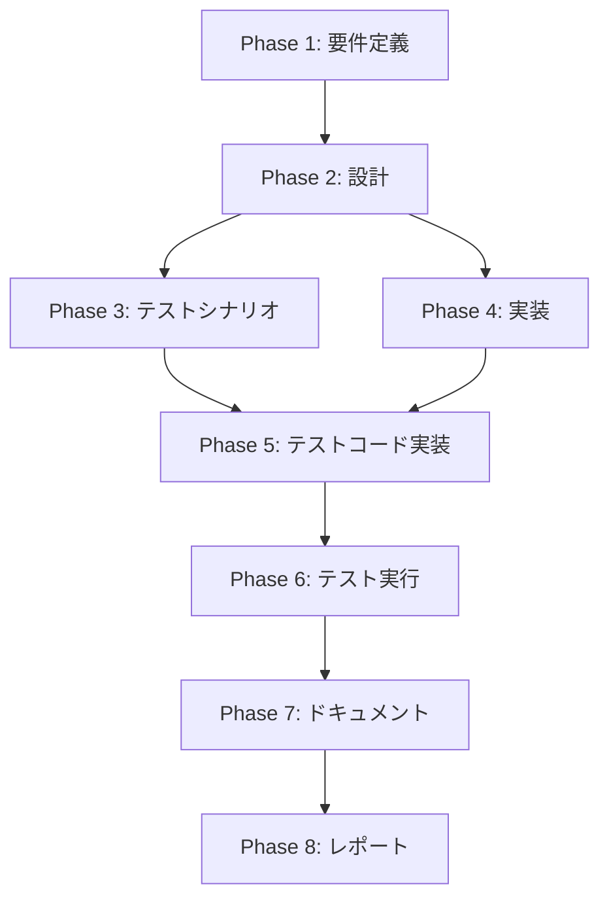
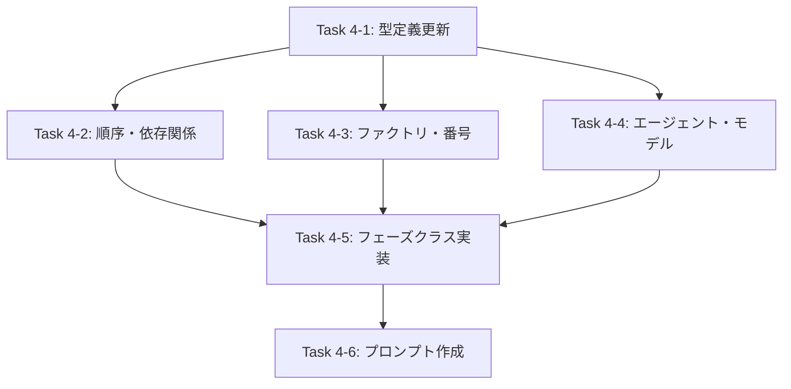
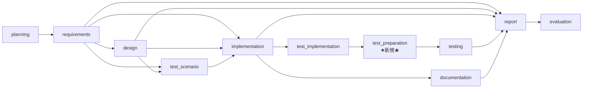

# Codex Agent 実行ログ

開始日時: 2026/2/17 9:15:02

---

## Turn 1: スレッド開始

**Thread ID**: `[REDACTED_TOKEN]`

## Turn 2: ツール実行

**種別**: reasoning
**ステータス**: completed

## Turn 3: ツール実行

**種別**: コマンド実行
**コマンド**: `/bin/bash -lc pwd`
**ステータス**: completed (exit_code=0)

```text
/tmp/ai-workflow-repos-196-2db81b66/ai-workflow-agent
```

## Turn 4: ツール実行

**種別**: reasoning
**ステータス**: completed

## Turn 5: ツール実行

**種別**: コマンド実行
**コマンド**: `/bin/bash -lc ls`
**ステータス**: completed (exit_code=0)

```text
AGENT_TEAMS.md
CHANGELOG.md
CLAUDE.md
[REDACTED_TOKEN].md
[REDACTED_TOKEN].md
[REDACTED_TOKEN].md
CODEBASE_SUMMARY.md
Dockerfile
Jenkinsfile
LICENSE
PROGRESS.md
README.md
TROUBLESHOOTING.md
__mocks__
dist
docs
examples
jenkins
jest.config.cjs
metadata.json.template
node_modules
package-lock.json
package.json
scripts
src
tests
tmp
tmp-init-auto
tsconfig.json
tsconfig.test.json
```

## Turn 6: ツール実行

**種別**: reasoning
**ステータス**: completed

## Turn 7: ツール実行

**種別**: コマンド実行
**コマンド**: `/bin/bash -lc "rg --files -g 'Planning.md'"`
**ステータス**: failed (exit_code=127)

```text
/bin/bash: line 1: rg: command not found
```

## Turn 8: ツール実行

**種別**: reasoning
**ステータス**: completed

## Turn 9: ツール実行

**種別**: コマンド実行
**コマンド**: `/bin/bash -lc 'find .. -name Planning.md -print'`
**ステータス**: completed (exit_code=0)

## Turn 10: ツール実行

**種別**: reasoning
**ステータス**: completed

## Turn 11: ツール実行

**種別**: コマンド実行
**コマンド**: `/bin/bash -lc 'grep -R "Phase 6" -n'`
**ステータス**: completed (exit_code=0)

```text
.git/logs/refs/heads/ai-workflow/issue-692:17:f6400028b97d5939f5157a52a7cbc2e20ae2f35e d72803181919fdfe119c017b3a96acdfd7e3e65c yuto-takashi <[REDACTED_EMAIL]> 1771316963 +0000	commit: [ai-workflow] Phase 6 (testing) - execute completed
.git/logs/refs/heads/ai-workflow/issue-692:18:d72803181919fdfe119c017b3a96acdfd7e3e65c 8db8e354220ae8af94ba8cd1d4f8443e670a8257 yuto-takashi <[REDACTED_EMAIL]> 1771319699 +0000	commit: [ai-workflow] Phase 6 (testing) - revise completed
.git/logs/HEAD:19:f6400028b97d5939f5157a52a7cbc2e20ae2f35e d72803181919fdfe119c017b3a96acdfd7e3e65c yuto-takashi <[REDACTED_EMAIL]> 1771316963 +0000	commit: [ai-workflow] Phase 6 (testing) - execute completed
.git/logs/HEAD:20:d72803181919fdfe119c017b3a96acdfd7e3e65c 8db8e354220ae8af94ba8cd1d4f8443e670a8257 yuto-takashi <[REDACTED_EMAIL]> 1771319699 +0000	commit: [ai-workflow] Phase 6 (testing) - revise completed
.git/COMMIT_EDITMSG:1:[ai-workflow] Phase 6 (testing) - revise completed
.ai-workflow/issue-10/00_planning/output/planning.md:22:- **Phase 6 (テスト実行)**: 1~2h - テスト実行と修正
.ai-workflow/issue-10/00_planning/output/planning.md:241:### Phase 6: テスト実行 (見積もり: 1~2h)
.ai-workflow/issue-10/00_planning/output/planning.md:300:    P5 --> P6[Phase 6: テスト実行]
.ai-workflow/issue-10/00_planning/output/planning.md:406:### Phase 6: テスト実行
.ai-workflow/issue-10/02_design/output/design.md:942:### Phase 6: テスト実行（1~2h）
.ai-workflow/issue-10/04_implementation/output/implementation.md:186:### Phase 6（testing）での作業
.ai-workflow/issue-10/04_implementation/output/implementation.md:251:### Phase 6 で実施する項目
.ai-workflow/issue-10/05_test_implementation/output/test-implementation.md:372:### Phase 6: テスト実行（testing）
.ai-workflow/issue-10/05_test_implementation/output/test-implementation.md:436:### Phase 6 で実施する項目
.ai-workflow/issue-10/06_testing/output/test-result.md:227:4. **実装完了後、Phase 6（testing）を再実行**
.ai-workflow/issue-10/06_testing/output/test-result.md:230:## 品質ゲート（Phase 6）の確認
.ai-workflow/issue-10/06_testing/output/test-result.md:247:6. 再度Phase 6（testing）を実行
.ai-workflow/issue-10/06_testing/output/test-result.md:323:**Phase**: Testing (Phase 6)
.ai-workflow/issue-10/08_report/output/report.md:39:- マージ後、Phase 6（testing）を再実行して統合テスト成功率の改善を確認
.ai-workflow/issue-10/08_report/output/report.md:200:#### テストフレームワーク修正（Phase 6で実施）
.ai-workflow/issue-10/08_report/output/report.md:207:### テスト結果（Phase 6）
.ai-workflow/issue-10/08_report/output/report.md:390:  - Phase 6（testing）を再実行して統合テスト成功率の改善を確認（推奨）
.ai-workflow/issue-10/08_report/output/report.md:446:1. **Phase 6（testing）を再実行**:
.ai-workflow/issue-10/08_report/output/report.md:458:1. **Phase 6（testing）の再実行**（推奨）:
.ai-workflow/issue-10/09_evaluation/output/evaluation_report.md:343: 4. **Phase 6（testing）の再実行**
.ai-workflow/issue-105/00_planning/output/planning.md:46:- **Phase 6 (テスト実行)**: 0.5〜0.75h
.ai-workflow/issue-105/00_planning/output/planning.md:283:  - **注**: 設計書で想定されたエラーパターン1・2・3は実際には発生せず、中優先度テストはPhase 6で対応
.ai-workflow/issue-105/00_planning/output/planning.md:295:  - **注**: Phase 6（Testing）で既存テストスイート実行により間接的に検証予定。新規テストコード実装をスキップしたため、Phase 5でのカバレッジ確認は不要と判断。
.ai-workflow/issue-105/00_planning/output/planning.md:297:### Phase 6: テスト実行 (見積もり: 0.5~0.75h)
.ai-workflow/issue-105/00_planning/output/planning.md:345:    P5 --> P6[Phase 6: Testing<br/>見積もり: 0.5~0.75h]
.ai-workflow/issue-105/00_planning/output/planning.md:380:- Phase 0 → Phase 1 → Phase 2 → Phase 3 → Phase 4 → Phase 6 → Phase 7 → Phase 8
.ai-workflow/issue-105/00_planning/output/planning.md:459:   - Phase 6（テスト実行）でCI環境（Jenkins）での動作確認を必須とする
.ai-workflow/issue-105/00_planning/output/planning.md:472:   - Phase 6（テスト実行）で全テストスイート実行（npm test）を必須とする
.ai-workflow/issue-105/00_planning/output/planning.md:560:### Phase 6: Testing
.ai-workflow/issue-105/00_planning/output/planning.md:733:6. **Phase 6: Testing（テスト実行）**
.ai-workflow/issue-105/01_requirements/output/requirements.md:45:- Phase 6: テスト実行（0.5〜0.75h）
.ai-workflow/issue-105/03_test_scenario/output/test-scenario.md:782:Phase
... (truncated)
```

## Turn 12: ツール実行

**種別**: reasoning
**ステータス**: completed

## Turn 13: ツール実行

**種別**: コマンド実行
**コマンド**: `/bin/bash -lc 'ls .ai-workflow'`
**ステータス**: completed (exit_code=0)

```text
issue-10
issue-105
issue-692
issue-7
```

## Turn 14: ツール実行

**種別**: reasoning
**ステータス**: completed

## Turn 15: ツール実行

**種別**: コマンド実行
**コマンド**: `/bin/bash -lc 'ls .ai-workflow/issue-692'`
**ステータス**: completed (exit_code=0)

```text
00_planning
01_requirements
02_design
03_test_scenario
04_implementation
[REDACTED_TOKEN]
06_testing
metadata.json
```

## Turn 16: ツール実行

**種別**: reasoning
**ステータス**: completed

## Turn 17: ツール実行

**種別**: コマンド実行
**コマンド**: `/bin/bash -lc 'ls .ai-workflow/issue-692/00_planning/output'`
**ステータス**: completed (exit_code=0)

```text
planning.md
```

## Turn 18: ツール実行

**種別**: reasoning
**ステータス**: completed

## Turn 19: ツール実行

**種別**: コマンド実行
**コマンド**: `/bin/bash -lc 'rg -n "Phase 6" .ai-workflow/issue-692/00_planning/output/planning.md'`
**ステータス**: failed (exit_code=127)

```text
/bin/bash: line 1: rg: command not found
```

## Turn 20: ツール実行

**種別**: reasoning
**ステータス**: completed

## Turn 21: ツール実行

**種別**: コマンド実行
**コマンド**: `/bin/bash -lc 'grep -n "Phase 6" .ai-workflow/issue-692/00_planning/output/planning.md'`
**ステータス**: completed (exit_code=0)

```text
231:### Phase 6: テスト実行 (見積もり: 1〜2h)
269:    P5 --> P6[Phase 6: テスト実行]
400:### Phase 6: テスト実行
```

## Turn 22: ツール実行

**種別**: reasoning
**ステータス**: completed

## Turn 23: ツール実行

**種別**: コマンド実行
**コマンド**: `/bin/bash -lc "sed -n '231,320p' .ai-workflow/issue-692/00_planning/output/planning.md"`
**ステータス**: completed (exit_code=0)

```text
### Phase 6: テスト実行 (見積もり: 1〜2h)

- [ ] Task 6-1: テスト実行と修正 (1〜2h)
  - `npm run test:unit` で全ユニットテストの実行
  - `npm run test:integration` で全統合テストの実行
  - `npm run lint` で型チェックの実行
  - `npm run build` でビルド確認
  - `npm run validate` で統合検証
  - テスト失敗箇所の修正

### Phase 7: ドキュメント (見積もり: 1〜2h)

- [ ] Task 7-1: ドキュメント更新 (1〜2h)
  - `CLAUDE.md` のフェーズ番号関連記述の更新（10フェーズ → 11フェーズ）
  - `README.md` の10フェーズワークフロー表に `test_preparation` を追加
  - `docs/ARCHITECTURE.md` のフェーズ実行フロー図の更新
  - `docs/CLI_REFERENCE.md` のフェーズ一覧更新

### Phase 8: レポート (見積もり: 0.5〜1h)

- [ ] Task 8-1: 実装レポートの作成 (0.5〜1h)
  - エグゼクティブサマリー（変更概要、影響範囲）
  - マージチェックリスト（テスト結果、ビルド結果、後方互換性確認）
  - 既知の制限事項（既存ワークフローのディレクトリ名は旧番号のまま）

---

## 5. 依存関係

### タスク間の依存関係



### 実装タスク内の依存関係



### フェーズ依存関係（変更後のワークフロー）



---

## 6. リスクと軽減策

### リスク1: フェーズ番号シフトによる既存ワークフローの破損
- **影響度**: 高
- **確率**: 低
- **説明**: `getPhaseNumber()` の変更により、既存の `.ai-workflow/issue-*/` ディレクトリ構造との不整合が発生する可能性
- **軽減策**:
  - `getPhaseNumber()` は新規ディレクトリ作成時にのみ使用されることを確認済み
  - 既存の `.ai-workflow/issue-7`, `issue-10`, `issue-105` サンプルディレクトリは旧番号のまま保持
```

## Turn 24: ツール実行

**種別**: reasoning
**ステータス**: completed

## Turn 25: ツール実行

**種別**: コマンド実行
**コマンド**: `/bin/bash -lc "sed -n '1,200p' .ai-workflow/issue-692/06_testing/output/test-result.md"`
**ステータス**: completed (exit_code=0)

```text
# テスト結果

## 実行日時
2026-02-17 08:56:19 UTC

## 実行コマンド
- `npm run build`
- `npm run lint`
- `npm run test:unit`
- `npm run test:integration`
- `npm run validate`

## 結果サマリー
- `npm run build`: 成功
- `npm run lint`: 成功
- `npm run test:unit`: 成功（Tests: 2144 total / 2143 passed / 1 skipped、Suites: 139 passed）
- `npm run test:integration`: 成功（Tests: 774 total / 752 passed / 22 skipped、Suites: 70 passed / 1 skipped）
- `npm run validate`: 成功（`lint` + `npm test` + `build`）
  - `npm test` 結果: Tests 2920 total / 2897 passed / 23 skipped、Suites 210 passed / 1 skipped

## スキップ事項
- OPENAI_API_KEY 未設定により、一部テストがスキップ

## 失敗したテスト
- なし
```

## Turn 26: ツール実行

**種別**: reasoning
**ステータス**: completed

## Turn 27: ツール実行

**種別**: reasoning
**ステータス**: completed

## Turn 28: ツール実行

**種別**: コマンド実行
**コマンド**: `/bin/bash -lc "sed -n '225,245p' .ai-workflow/issue-692/00_planning/output/planning.md"`
**ステータス**: completed (exit_code=0)

```text
- `tests/unit/commands/execute.test.ts` のフェーズ順序テスト更新
  - フェーズ依存関係テストへの test_preparation ケース追加
  - フェーズ番号マッピングテストの更新（番号シフトの反映）
  - `[REDACTED_TOKEN]` テストの更新
  - プリセットテストの更新

### Phase 6: テスト実行 (見積もり: 1〜2h)

- [ ] Task 6-1: テスト実行と修正 (1〜2h)
  - `npm run test:unit` で全ユニットテストの実行
  - `npm run test:integration` で全統合テストの実行
  - `npm run lint` で型チェックの実行
  - `npm run build` でビルド確認
  - `npm run validate` で統合検証
  - テスト失敗箇所の修正

### Phase 7: ドキュメント (見積もり: 1〜2h)

- [ ] Task 7-1: ドキュメント更新 (1〜2h)
  - `CLAUDE.md` のフェーズ番号関連記述の更新（10フェーズ → 11フェーズ）
  - `README.md` の10フェーズワークフロー表に `test_preparation` を追加
```

## Turn 29: ツール実行

**種別**: reasoning
**ステータス**: completed

## Turn 30: ツール実行

**種別**: file_change
**ステータス**: completed

## Turn 31: ツール実行

**種別**: reasoning
**ステータス**: completed

## Turn 32: ツール実行

**種別**: コマンド実行
**コマンド**: `/bin/bash -lc 'git status -sb'`
**ステータス**: completed (exit_code=0)

```text
## ai-workflow/issue-692...origin/develop [ahead 17]
 M .ai-workflow/issue-692/00_planning/output/planning.md
 M .ai-workflow/issue-692/metadata.json
?? .ai-workflow/issue-692/00_planning/execute/agent_log_raw.txt
?? .ai-workflow/issue-692/00_planning/execute/prompt.txt
?? .ai-workflow/issue-692/00_planning/review/agent_log_raw.txt
?? .ai-workflow/issue-692/00_planning/review/prompt.txt
?? .ai-workflow/issue-692/01_requirements/execute/agent_log_raw.txt
?? .ai-workflow/issue-692/01_requirements/execute/prompt.txt
?? .ai-workflow/issue-692/01_requirements/review/agent_log_raw.txt
?? .ai-workflow/issue-692/01_requirements/review/prompt.txt
?? .ai-workflow/issue-692/02_design/execute/agent_log_raw.txt
?? .ai-workflow/issue-692/02_design/execute/prompt.txt
?? .ai-workflow/issue-692/02_design/review/agent_log_raw.txt
?? .ai-workflow/issue-692/02_design/review/prompt.txt
?? .ai-workflow/issue-692/03_test_scenario/execute/agent_log_raw.txt
?? .ai-workflow/issue-692/03_test_scenario/execute/prompt.txt
?? .ai-workflow/issue-692/03_test_scenario/review/agent_log_raw.txt
?? .ai-workflow/issue-692/03_test_scenario/review/prompt.txt
?? .ai-workflow/issue-692/04_implementation/execute/agent_log_raw.txt
?? .ai-workflow/issue-692/04_implementation/execute/prompt.txt
?? .ai-workflow/issue-692/04_implementation/review/agent_log_raw.txt
?? .ai-workflow/issue-692/04_implementation/review/prompt.txt
?? .ai-workflow/issue-692/05_test_implementation/execute/agent_log_raw.txt
?? .ai-workflow/issue-692/05_test_implementation/execute/prompt.txt
?? .ai-workflow/issue-692/05_test_implementation/review/agent_log_raw.txt
?? .ai-workflow/issue-692/05_test_implementation/review/prompt.txt
?? .ai-workflow/issue-692/06_testing/execute/agent_log_raw.txt
?? .ai-workflow/issue-692/06_testing/execute/prompt.txt
?? .ai-workflow/issue-692/06_testing/review/agent_log_raw.txt
?? .ai-workflow/issue-692/06_testing/review/prompt.txt
?? .ai-workflow/issue-692/06_testing/revise/agent_log_raw.txt
?? .ai-workflow/issue-692/06_testing/revise/prompt.txt
```

## Turn 33: ツール実行

**種別**: reasoning
**ステータス**: completed

## Turn 34: ツール実行

**種別**: agent_message
**ステータス**: completed

## Turn 35: 実行完了

**ステータス**: completed
**所要時間**: 82806ms
**ターン数**: N/A

---

**経過時間**: 82806ms
**開始**: 2026/2/17 9:15:02
**終了**: 2026/2/17 9:16:25