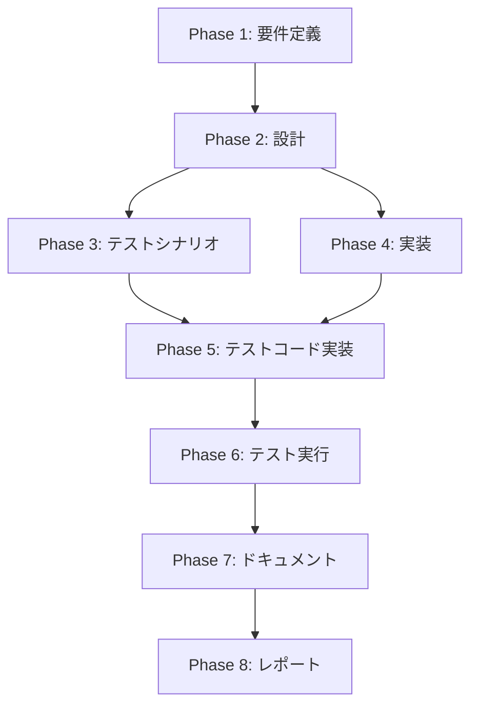
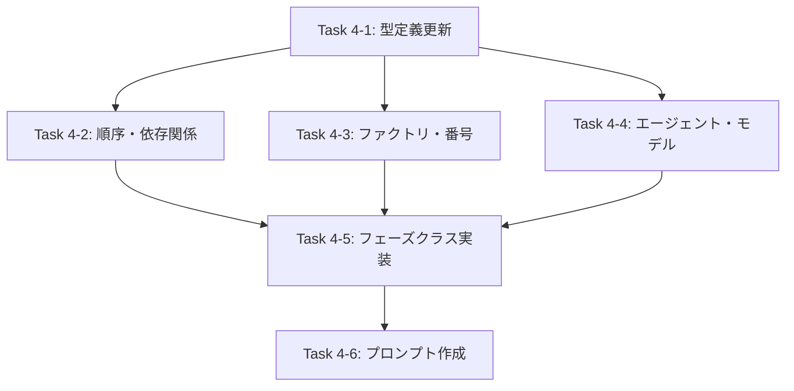
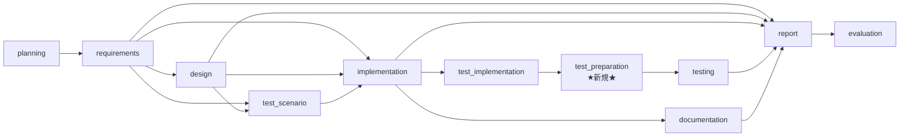

# Codex Agent 実行ログ

開始日時: 2026/2/17 8:29:25

---

## Turn 1: スレッド開始

**Thread ID**: `[REDACTED_TOKEN]`

## Turn 2: ツール実行

**種別**: reasoning
**ステータス**: completed

## Turn 3: ツール実行

**種別**: コマンド実行
**コマンド**: `/bin/bash -lc pwd`
**ステータス**: completed (exit_code=0)

```text
/tmp/ai-workflow-repos-196-2db81b66/ai-workflow-agent
```

## Turn 4: ツール実行

**種別**: コマンド実行
**コマンド**: `/bin/bash -lc ls`
**ステータス**: completed (exit_code=0)

```text
AGENT_TEAMS.md
CHANGELOG.md
CLAUDE.md
[REDACTED_TOKEN].md
[REDACTED_TOKEN].md
[REDACTED_TOKEN].md
CODEBASE_SUMMARY.md
Dockerfile
Jenkinsfile
LICENSE
PROGRESS.md
README.md
TROUBLESHOOTING.md
__mocks__
dist
docs
examples
jenkins
jest.config.cjs
metadata.json.template
node_modules
package-lock.json
package.json
scripts
src
tests
tmp
tmp-init-auto
tsconfig.json
tsconfig.test.json
```

## Turn 5: ツール実行

**種別**: reasoning
**ステータス**: completed

## Turn 6: ツール実行

**種別**: コマンド実行
**コマンド**: `/bin/bash -lc "rg --files -g 'Planning.md'"`
**ステータス**: failed (exit_code=127)

```text
/bin/bash: line 1: rg: command not found
```

## Turn 7: ツール実行

**種別**: reasoning
**ステータス**: completed

## Turn 8: ツール実行

**種別**: コマンド実行
**コマンド**: `/bin/bash -lc "find . -name 'Planning.md'"`
**ステータス**: completed (exit_code=0)

## Turn 9: ツール実行

**種別**: reasoning
**ステータス**: completed

## Turn 10: ツール実行

**種別**: コマンド実行
**コマンド**: `/bin/bash -lc "find . -iname '*planning*.md'"`
**ステータス**: completed (exit_code=0)

```text
./.ai-workflow/issue-10/00_planning/output/planning.md
./.ai-workflow/issue-105/00_planning/output/planning.md
./.ai-workflow/issue-7/00_planning/output/planning.md
./.ai-workflow/issue-692/00_planning/output/planning.md
```

## Turn 11: ツール実行

**種別**: reasoning
**ステータス**: completed

## Turn 12: ツール実行

**種別**: コマンド実行
**コマンド**: `/bin/bash -lc "sed -n '1,160p' .ai-workflow/issue-692/00_planning/output/planning.md"`
**ステータス**: completed (exit_code=0)

```text
# プロジェクト計画書: Issue #692 - test_preparation フェーズの追加

## 1. Issue分析

### 概要

本Issueは、`execute` コマンドのワークフローにおいて、テスト実装（`test_implementation`）フェーズとテスト実行（`testing`）フェーズの間に、新規の **テスト準備（`test_preparation`）フェーズ** を追加する変更である。

Docker コンテナ内でテスト実行時に、対象リポジトリの開発言語ランタイムやライブラリがインストールされておらず、テストが失敗するケースが頻発している。この問題を根本的に解決するため、テスト実行前に環境を自動準備するフェーズを導入する。

### 複雑度: **中程度〜複雑**

**判定根拠**:
- **新規ファイル作成**: `[REDACTED_TOKEN]` クラス（1ファイル）、プロンプトファイル（6ファイル: ja/en x execute/review/revise）
- **既存ファイル変更**: 最低7ファイル（`types.ts`, `execute.ts`, `phase-dependencies.ts`, `phase-factory.ts`, `base-phase.ts`, `agent-setup.ts`, `model-optimizer.ts`）
- **フェーズ番号の変更**: 既存フェーズ（testing〜evaluation）の番号が06〜09から07〜10にシフトし、既存ワークフローとの後方互換性の考慮が必要
- **テスト追加**: ユニットテストおよび統合テストの新規作成・既存テスト修正
- **既存のフェーズ実装パターン**が明確に存在するため、ゼロからの設計は不要

### 見積もり工数: **16〜24時間**

| カテゴリ | 見積もり | 内訳 |
|---------|---------|------|
| 型定義・設定変更 | 2〜3h | types.ts, execute.ts, phase-dependencies.ts, phase-factory.ts, agent-setup.ts |
| フェーズクラス実装 | 4〜6h | [REDACTED_TOKEN]（execute/review/revise） |
| プロンプト作成 | 3〜4h | 日本語3ファイル + 英語3ファイル |
| base-phase.ts 変更 | 2〜3h | フェーズ番号マッピング変更、後方互換性対応 |
| model-optimizer.ts 変更 | 1〜2h | 難易度別モデルマッピング追加 |
| テスト作成・修正 | 3〜4h | ユニットテスト新規作成、既存テスト修正 |
| 統合テスト・検証 | 1〜2h | `npm run validate` で全体検証 |

### リスク評価: **中**

- フェーズ番号変更による既存ワークフローへの影響がリスク要因
- ただし、既存のフェーズ実装パターンが確立されており、実装自体の技術的リスクは低い

---

## 2. 実装戦略判断

### 実装戦略: **CREATE**

**判断根拠**:
- 新規フェーズクラス `[REDACTED_TOKEN]` の作成が中心的な作業
- 新規プロンプトファイル6ファイルの作成が必要
- 既存ファイルの変更は、新規フェーズの登録・統合のための定型的な追加が主
- 既存コードのリファクタリングは不要（フェーズ番号の調整は機械的な変更）
- `[REDACTED_TOKEN]` の実装パターンをテンプレートとして流用できるため、アーキテクチャ設計は不要

### テスト戦略: **UNIT_INTEGRATION**

**判断根拠**:
- **ユニットテスト**: `[REDACTED_TOKEN]` クラスの各メソッド（execute/review/revise）の単体テスト、フェーズ依存関係のバリデーションテスト、フェーズ番号マッピングのテスト
- **インテグレーションテスト**: `implementation` プリセットおよび `testing` プリセットで `test_preparation` が正しく実行順序に含まれることの検証、フェーズ間のコンテキスト受け渡しテスト
- **BDDテスト不要**: エンドユーザー向けUIの変更はなく、CLIの動作は既存のフレームワーク内で完結する

### テストコード戦略: **BOTH_TEST**

**判断根拠**:
- **CREATE_TEST**: `[REDACTED_TOKEN]` の新規テストファイル作成（`tests/unit/phases/test-preparation.test.ts`）
- **EXTEND_TEST**: 既存の統合テスト（フェーズ順序テスト、依存関係テスト、プリセットテスト）に `test_preparation` のケースを追加
- 既存の `execute.test.ts` や `phase-dependencies` 関連テストにもテストケース追加が必要

---

## 3. 影響範囲分析

### 既存コードへの影響

#### 直接変更が必要なファイル

| ファイル | 変更内容 | 影響度 |
|---------|---------|--------|
| `src/types.ts` | `PhaseName` 型に `'test_preparation'` を追加 | 低（型の拡張のみ） |
| `src/commands/execute.ts` | `PHASE_ORDER` 配列に追加 | 低（配列要素追加） |
| `src/core/phase-dependencies.ts` | `PHASE_DEPENDENCIES`, `PHASE_PRESETS`, `PRESET_DESCRIPTIONS` の更新 | 中（依存関係の変更） |
| `src/core/phase-factory.ts` | `createPhaseInstance()` に case 追加、import 追加 | 低（定型追加） |
| `src/phases/base-phase.ts` | `getPhaseNumber()` のマッピング更新（番号シフト） | **高**（既存フェーズ番号変更） |
| `src/commands/execute/agent-setup.ts` | `[REDACTED_TOKEN]` に `test_preparation` 追加 | 低（マッピング追加） |
| `src/core/model-optimizer.ts` | 難易度別モデルマッピングに `test_preparation` 追加 | 低（マッピング追加） |

#### 新規作成ファイル

| ファイル | 説明 |
|---------|------|
| `src/phases/test-preparation.ts` | `[REDACTED_TOKEN]` クラス |
| `src/prompts/test_preparation/ja/execute.txt` | テスト準備実行プロンプト（日本語） |
| `src/prompts/test_preparation/ja/review.txt` | テスト準備レビュープロンプト（日本語） |
| `src/prompts/test_preparation/ja/revise.txt` | テスト準備修正プロンプト（日本語） |
| `src/prompts/test_preparation/en/execute.txt` | テスト準備実行プロンプト（英語） |
| `src/prompts/test_preparation/en/review.txt` | テスト準備レビュープロンプト（英語） |
| `src/prompts/test_preparation/en/revise.txt` | テスト準備修正プロンプト（英語） |

#### 影響を受ける既存テスト

| テストファイル | 修正内容 |
|--------------|---------|
| `tests/unit/commands/execute.test.ts` | フェーズ順序テスト、プリセットテストの更新 |
| `tests/unit/phases/base-phase-*.test.ts` | フェーズ番号マッピングテストの更新 |
| `tests/integration/` 内の関連テスト | フェーズ数の変更（10→11）に伴うアサーション更新 |

### 依存関係の変更

- **新規依存の追加**: なし（既存の依存パッケージで実装可能）
- **フェーズ依存関係の変更**:
  - `test_preparation` → `['test_implementation']` に依存（新規追加）
  - `testing` → `['test_implementation']` から `['test_preparation']` に変更

### マイグレーション要否

**フェーズ番号のシフトに関する方
... (truncated)
```

## Turn 13: ツール実行

**種別**: reasoning
**ステータス**: completed

## Turn 14: ツール実行

**種別**: コマンド実行
**コマンド**: `/bin/bash -lc 'rg -n "Phase 6" -n .ai-workflow/issue-692/00_planning/output/planning.md'`
**ステータス**: failed (exit_code=127)

```text
/bin/bash: line 1: rg: command not found
```

## Turn 15: ツール実行

**種別**: reasoning
**ステータス**: completed

## Turn 16: ツール実行

**種別**: コマンド実行
**コマンド**: `/bin/bash -lc 'grep -n "Phase 6" -n .ai-workflow/issue-692/00_planning/output/planning.md'`
**ステータス**: completed (exit_code=0)

```text
231:### Phase 6: テスト実行 (見積もり: 1〜2h)
269:    P5 --> P6[Phase 6: テスト実行]
400:### Phase 6: テスト実行
```

## Turn 17: ツール実行

**種別**: reasoning
**ステータス**: completed

## Turn 18: ツール実行

**種別**: コマンド実行
**コマンド**: `/bin/bash -lc "sed -n '205,360p' .ai-workflow/issue-692/00_planning/output/planning.md"`
**ステータス**: completed (exit_code=0)

```text
- `revise()` メソッドの実装（レビューフィードバックに基づく再実行、ファイル更新確認）

- [x] Task 4-6: プロンプトファイルの作成 (2〜3h)
  - `src/prompts/test_preparation/ja/execute.txt` の作成（言語検出、ランタイムインストール、依存解決、環境検証の指示）
  - `src/prompts/test_preparation/ja/review.txt` の作成（環境準備完了の判定基準）
  - `src/prompts/test_preparation/ja/revise.txt` の作成（レビューフィードバックに基づく修正指示）
  - `src/prompts/test_preparation/en/execute.txt` の作成（英語版）
  - `src/prompts/test_preparation/en/review.txt` の作成（英語版）
  - `src/prompts/test_preparation/en/revise.txt` の作成（英語版）

### Phase 5: テストコード実装 (見積もり: 3〜4h)

- [x] Task 5-1: [REDACTED_TOKEN] ユニットテストの作成 (2〜2.5h)
  - `tests/unit/phases/test-preparation.test.ts` の新規作成
  - コンストラクタテスト（phaseName の検証）
  - execute() のテスト（モック環境でのコンテキスト構築・テンプレート実行の検証）
  - review() のテスト（出力ファイルチェック、レビュー結果パースの検証）
  - revise() のテスト（フィードバック適用の検証）

- [x] Task 5-2: 既存テストの修正 (1〜1.5h)
  - `tests/unit/commands/execute.test.ts` のフェーズ順序テスト更新
  - フェーズ依存関係テストへの test_preparation ケース追加
  - フェーズ番号マッピングテストの更新（番号シフトの反映）
  - `[REDACTED_TOKEN]` テストの更新
  - プリセットテストの更新

### Phase 6: テスト実行 (見積もり: 1〜2h)

- [ ] Task 6-1: テスト実行と修正 (1〜2h)
  - `npm run test:unit` で全ユニットテストの実行
  - `npm run test:integration` で全統合テストの実行
  - `npm run lint` で型チェックの実行
  - `npm run build` でビルド確認
  - `npm run validate` で統合検証
  - テスト失敗箇所の修正

### Phase 7: ドキュメント (見積もり: 1〜2h)

- [ ] Task 7-1: ドキュメント更新 (1〜2h)
  - `CLAUDE.md` のフェーズ番号関連記述の更新（10フェーズ → 11フェーズ）
  - `README.md` の10フェーズワークフロー表に `test_preparation` を追加
  - `docs/ARCHITECTURE.md` のフェーズ実行フロー図の更新
  - `docs/CLI_REFERENCE.md` のフェーズ一覧更新

### Phase 8: レポート (見積もり: 0.5〜1h)

- [ ] Task 8-1: 実装レポートの作成 (0.5〜1h)
  - エグゼクティブサマリー（変更概要、影響範囲）
  - マージチェックリスト（テスト結果、ビルド結果、後方互換性確認）
  - 既知の制限事項（既存ワークフローのディレクトリ名は旧番号のまま）

---

## 5. 依存関係

### タスク間の依存関係



### 実装タスク内の依存関係



### フェーズ依存関係（変更後のワークフロー）



---

## 6. リスクと軽減策

### リスク1: フェーズ番号シフトによる既存ワークフローの破損
- **影響度**: 高
- **確率**: 低
- **説明**: `getPhaseNumber()` の変更により、既存の `.ai-workflow/issue-*/` ディレクトリ構造との不整合が発生する可能性
- **軽減策**:
  - `getPhaseNumber()` は新規ディレクトリ作成時にのみ使用されることを確認済み
  - 既存の `.ai-workflow/issue-7`, `issue-10`, `issue-105` サンプルディレクトリは旧番号のまま保持
  - テスト実行時に既存サンプルワークフローとの互換性を検証

### リスク2: 既存テストの大量修正
- **影響度**: 中
- **確率**: 中
- **説明**: フェーズ数が10から11に増加することで、フェーズ数に依存するテストアサーションが失敗する可能性
- **軽減策**:
  - フェーズ数をハードコードしているテストを事前に特定し、修正対象を明確化
  - `npm run validate` で全テストの通過を確認してからPR作成

### リスク3: プロンプト品質の不足
- **影響度**: 中
- **確率**: 中
- **説明**: test_preparation フェーズのプロンプトが不十分で、エージェントが適切に環境準備を実行できない可能性
- **軽減策**:
  - 既存の testing フェーズプロンプトを参考に、具体的なインストール手順を明示
  - `base-phase.ts` の `[REDACTED_TOKEN]()` で提供される情報と連携
  - review/revise サイクルで環境準備の不備を検出・修正

### リスク4: プリセット更新の漏れ
- **影響度**: 低
- **確率**: 中
- **説明**: `PHASE_PRESETS` の更新が不完全で、特定のプリセット実行時に test_preparation がスキップされる可能性
- **軽減策**:
  - 全プリセット（`implementation`, `testing`, `full-test`）を列挙し、更新対象を明確化
  - プリセット実行のテストケースを追加

### リスク5: model-optimizer のマッピング漏れ
- **影響度**: 低
- **確率**: 低
- **説明**: `model-optimizer.ts` の全難易度レベル（simple/moderate/complex）で test_preparation のモデル設定が漏れ、実行時エラーが発生する可能性
- **軽減策**:
  - 全難易度レベルのマッピングを網羅的に追加
  - TypeScript の型チェックで漏れを検出

---

## 7. 品質ゲート

### Phase 1: 要件定義
```

## Turn 19: ツール実行

**種別**: reasoning
**ステータス**: completed

## Turn 20: ツール実行

**種別**: コマンド実行
**コマンド**: `/bin/bash -lc "sed -n '360,520p' .ai-workflow/issue-692/00_planning/output/planning.md"`
**ステータス**: completed (exit_code=0)

```text
### Phase 1: 要件定義
- [ ] `test_preparation` フェーズの責務（4つのタスク）が明確に定義されている
- [ ] 入力コンテキスト（参照するフェーズの成果物）が明確に定義されている
- [ ] 出力成果物（`test-preparation.md`）のフォーマットが定義されている
- [ ] 受け入れ基準が定義され、検証可能である
- [ ] 後方互換性要件が明確である

### Phase 2: 設計
- [ ] 実装戦略の判断根拠が明記されている（CREATE）
- [ ] テスト戦略の判断根拠が明記されている（UNIT_INTEGRATION）
- [ ] テストコード戦略の判断根拠が明記されている（BOTH_TEST）
- [ ] `[REDACTED_TOKEN]` クラスの設計が BasePhase のパターンに準拠している
- [ ] フェーズ番号マッピングの変更方針が明確である
- [ ] 依存関係グラフが整合性を持っている
- [ ] プロンプトのテンプレート変数が定義されている

### Phase 3: テストシナリオ
- [ ] ユニットテストシナリオが execute/review/revise の各メソッドをカバーしている
- [ ] 統合テストシナリオがフェーズ順序・依存関係・プリセットをカバーしている
- [ ] 異常系テスト（ファイル未存在、メタデータ不足）が含まれている
- [ ] フェーズ番号マッピングのテストが含まれている

### Phase 4: 実装
- [ ] `PhaseName` 型に `'test_preparation'` が追加されている
- [ ] `PHASE_ORDER` に `test_preparation` が正しい位置に挿入されている
- [ ] `PHASE_DEPENDENCIES` に `test_preparation` の依存関係が定義されている
- [ ] `testing` の依存が `['test_preparation']` に更新されている
- [ ] `createPhaseInstance()` に `test_preparation` の case が追加されている
- [ ] `getPhaseNumber()` のマッピングが更新されている（番号シフト含む）
- [ ] `[REDACTED_TOKEN]` に `test_preparation` が追加されている
- [ ] `model-optimizer.ts` の全難易度レベルに `test_preparation` が追加されている
- [ ] `[REDACTED_TOKEN]` クラスが `execute()`, `review()`, `revise()` を実装している
- [ ] 日本語・英語の各プロンプトファイル（6ファイル）が作成されている
- [ ] コーディング規約に準拠している（logger使用、Config使用、error-utils使用）

### Phase 5: テストコード実装
- [ ] `[REDACTED_TOKEN]` のユニットテストが作成されている
- [ ] 既存テストが更新されている（フェーズ順序、番号マッピング、プリセット）
- [ ] テストで jest.restoreAllMocks() による適切なクリーンアップが行われている

### Phase 6: テスト実行
- [ ] `npm run lint` が成功する（TypeScript 型チェック）
- [ ] `npm run test:unit` が全件パスする
- [ ] `npm run test:integration` が全件パスする
- [ ] `npm run build` が成功する
- [ ] `npm run validate` が全件パスする

### Phase 7: ドキュメント
- [ ] `CLAUDE.md` のフェーズ関連記述が更新されている
- [ ] `README.md` のフェーズ一覧表が更新されている
- [ ] フェーズ数の記述が10から11に更新されている

---

## 補足: 設計判断の詳細

### フェーズ番号の割り当て方針

Issue本文で提案されている `[REDACTED_TOKEN]` 形式ではなく、標準的な連番方式（`06_test_preparation`）を採用する。

**理由**:
1. 既存のコードベースは整数番号のみを前提としている（`getPhaseNumber()` は string 型を返すが、2桁の数字文字列が慣例）
2. `05b` のような非標準的な番号は、ソート順序やパーサーの互換性に問題を起こす可能性がある
3. 既存ワークフロー（`.ai-workflow/issue-7` 等）は読み取り専用のリファレンスであり、番号変更の影響を受けない
4. 新規ワークフロー（`init` コマンドで初期化するもの）のみが新番号体系を使用する

### エージェント優先順位の決定

`test_preparation` のエージェント優先順位は **`codex-first`** とする。

**理由**:
1. テスト環境の構築は、具体的なコマンド実行（`apt-get install`, `pip install`, `npm install`）が主な作業
2. 既存の `implementation`, `test_implementation`, `testing` と同じカテゴリ（コード実行中心）
3. Codex は実際のコマンド実行とその結果の解釈に優れている

### モデル設定の方針

`test_preparation` のモデル設定は `testing` フェーズと同等とする。

| 難易度 | execute | review | revise |
|--------|---------|--------|--------|
| simple | sonnet/mini | sonnet/mini | sonnet/mini |
| moderate | opus/max | sonnet/mini | opus/max |
| complex | opus/max | sonnet/mini | opus/max |

**理由**: テスト準備は testing フェーズの前段階であり、同等の複雑度を持つと判断。
```

## Turn 21: ツール実行

**種別**: reasoning
**ステータス**: completed

## Turn 22: ツール実行

**種別**: コマンド実行
**コマンド**: `/bin/bash -lc "sed -n '1,200p' .ai-workflow/issue-692/06_testing/output/test-result.md"`
**ステータス**: completed (exit_code=0)

```text
# テスト実行結果

## テスト結果サマリー
- 総テスト数: 2919件
- 成功: 2870件
- 失敗: 26件
- 成功率: 98.32%

## 条件分岐
以下の形式で失敗したテストの詳細のみを記載します。

### `tests/unit/report-cleanup.test.ts::cleanupWorkflowLogs メソッドテスト（Issue #405） › 1.1: execute/review/reviseディレクトリを正しく削除する`
- **エラー**: Expected: false / Received: true
- **スタックトレース**:
  ```
  at Object.<anonymous> (tests/unit/report-cleanup.test.ts:138:24)
  ```

### `tests/unit/core/metadata-manager-rollback.test.ts::MetadataManager - Rollback機能 › UC-MM-08: [REDACTED_TOKEN]() - 後続フェーズのリセット › 指定フェーズより後のすべてのフェーズが正しくリセットされる`
- **エラー**: Expected配列に含まれない "test_preparation" が Received に含まれている
- **スタックトレース**:
  ```
  at Object.<anonymous> (tests/unit/core/metadata-manager-rollback.test.ts:372:27)
  ```

### `tests/integration/jenkins/non-stored-password-params.test.ts::Integration: Sensitive Jenkins parameters use [REDACTED_TOKEN] (Issue #462) › IT-001: Job DSL seed job reapplication completes without errors › lists all AI Workflow jobs with valid DSL paths for the seed job execution`
- **エラー**: Expected length: 10 / Received length: 11
- **スタックトレース**:
  ```
  at Object.<anonymous> (tests/integration/jenkins/non-stored-password-params.test.ts:196:30)
  ```

### `tests/integration/jenkins/auto-close-issue-job-config.test.ts::Integration: auto-close-issue job-config entry (Issue #678) › auto-close-issueジョブに必要なパラメータが定義されている`
- **エラー**: Expected: "followup" / Received: "all"
- **スタックトレース**:
  ```
  at Object.<anonymous> (tests/integration/jenkins/auto-close-issue-job-config.test.ts:127:58)
  ```

### `tests/integration/jenkins/rewrite-issue-job.test.ts::Integration: rewrite-issue Jenkins pipeline (Issue #674) › IT-013/IT-014/IT-015: ビルド/検証/CLIヘルプの実行確認 › npm run build が成功し dist/index.js が生成される`
- **エラー**: Command failed: npm run build
- **スタックトレース**:
  ```
  at tests/integration/jenkins/rewrite-issue-job.test.ts
  ```

### `tests/integration/jenkins/rewrite-issue-job.test.ts::Integration: rewrite-issue Jenkins pipeline (Issue #674) › IT-013/IT-014/IT-015: ビルド/検証/CLIヘルプの実行確認 › npm run validate を実行し正常終了する`
- **エラー**: Command failed: npm run build
- **スタックトレース**:
  ```
  at tests/integration/jenkins/rewrite-issue-job.test.ts
  ```

### `tests/integration/jenkins/rewrite-issue-job.test.ts::Integration: rewrite-issue Jenkins pipeline (Issue #674) › IT-013/IT-014/IT-015: ビルド/検証/CLIヘルプの実行確認 › node dist/index.js rewrite-issue --help がヘルプを出力する`
- **エラー**: Command failed: npm run build
- **スタックトレース**:
  ```
  at tests/integration/jenkins/rewrite-issue-job.test.ts
  ```

### `tests/integration/prompt-language-switching.test.ts::Prompt language switching integration › all prompts include the required language instruction near the top`
- **エラー**: instructionIndex が -1（言語指示が見つからない）
- **スタックトレース**:
  ```
  at tests/integration/prompt-language-switching.test.ts:239:38
  ```

### `tests/integration/prompt-language-switching.test.ts::Prompt language switching integration › language instruction appears exactly once in each prompt file`
- **エラー**: Expected: 1 / Received: 0
- **スタックトレース**:
  ```
  at tests/integration/prompt-language-switching.test.ts:257:29
  ```

### `tests/integration/prompt-language-switching.test.ts::Prompt language switching integration › prompt inventory matches expected counts by language`
- **エラー**: Expected: 48 / Received: 51
- **スタックトレース**:
  ```
  at Object.<anonymous> (tests/integration/prompt-language-switching.test.ts:263:45)
  ```

### `tests/unit/phases/test-preparation.test.ts::[REDACTED_TOKEN] › UT-PHASE-007: revise() がレビュー指摘を反映して更新される`
- **エラー**: Expected: true / Received: false
- **スタックトレース**:
  ```
  at Object.<anonymous> (tests/unit/phases/test-preparation.test.ts:239:28)
  ```

### `tests/unit/git/commit-message-builder.test.ts::[REDACTED_TOKEN] - createCommitMessage › [REDACTED_TOKEN]正常系_全フェーズの番号計算`
- **エラー**: 期待文字列 "Phase 7 (test_preparation)" が含まれない（"Phase 0 (test_preparation)" になっている）
- **スタックトレース**:
  ```
  at tests/unit/git/commit-message-builder.test.ts:95:23
  ```

### `tests/un
... (truncated)
```

## Turn 23: ツール実行

**種別**: reasoning
**ステータス**: completed

## Turn 24: ツール実行

**種別**: コマンド実行
**コマンド**: `/bin/bash -lc "sed -n '1,200p' .ai-workflow/issue-692/03_test_scenario/output/test-scenario.md"`
**ステータス**: completed (exit_code=0)

```text
# テストシナリオ: Issue #692 - test_preparation フェーズの追加

## 1. テスト戦略サマリー

### 選択されたテスト戦略

**UNIT_INTEGRATION**（Phase 2 設計書で決定）

### テスト対象の範囲

| カテゴリ | 対象 | テスト種別 |
|---------|------|-----------|
| 型定義 | `PhaseName` 型への `'test_preparation'` 追加 | Unit |
| フェーズ順序 | `PHASE_ORDER` 配列への挿入 | Unit + Integration |
| 依存関係 | `PHASE_DEPENDENCIES` の更新 | Unit + Integration |
| プリセット | `PHASE_PRESETS`, `PRESET_DESCRIPTIONS` の更新 | Unit + Integration |
| フェーズクラス | `[REDACTED_TOKEN]` (execute/review/revise) | Unit |
| フェーズファクトリ | `createPhaseInstance()` の case 追加 | Unit |
| フェーズ番号 | `getPhaseNumber()` のマッピング更新（2箇所） | Unit |
| ログ抽出 | `[REDACTED_TOKEN]()` のヘッダーパターン追加 | Unit |
| エージェント優先順位 | `[REDACTED_TOKEN]` マッピング追加 | Unit |
| モデル最適化 | `[REDACTED_TOKEN]` への追加 | Unit |
| プロンプト | 6 ファイル（ja/en × execute/review/revise） | Unit |

### テストの目的

1. **型安全性の保証**: `PhaseName` 型の拡張が全ての `Record<PhaseName, ...>` マッピングに波及し、漏れがないことを検証
2. **フェーズ統合の正確性**: `test_preparation` が正しい位置（test_implementation の直後、testing の直前）に挿入されていることを検証
3. **依存関係の整合性**: 新しい依存チェーン（test_implementation → test_preparation → testing）が正しく機能することを検証
4. **後方互換性**: 既存のプリセット・依存関係・フェーズ番号が正しく動作し続けることを検証
5. **新規クラスの機能性**: `[REDACTED_TOKEN]` の execute/review/revise が正しく動作することを検証

---

## 2. Unit テストシナリオ

### 2.1 PhaseName 型の拡張（FR-001）

**テスト対象ファイル**: `src/types.ts`
**テストファイル**: 既存テストの TypeScript コンパイル成功で間接検証

#### UT-TYPE-001: PhaseName 型に test_preparation が含まれる

- **目的**: `PhaseName` 型ユニオンに `'test_preparation'` が追加されていることを検証
- **前提条件**: `src/types.ts` が変更済み
- **入力**: TypeScript コンパイル
- **期待結果**: `npm run lint` がエラーなく完了すること
- **検証方法**: `'test_preparation'` を `PhaseName` 型の変数に代入可能であること（型レベル検証はコンパイル時に実行）

---

### 2.2 PHASE_ORDER 配列の更新（FR-002）

**テスト対象ファイル**: `src/commands/execute.ts`
**テストファイル**: `tests/unit/commands/execute.test.ts`（既存テスト更新）

#### UT-ORDER-001: test_preparation が PHASE_ORDER に含まれる

- **目的**: `PHASE_ORDER` 配列に `'test_preparation'` が含まれていることを検証
- **前提条件**: `PHASE_ORDER` が更新済み
- **入力**: なし（定数参照）
- **期待結果**: `PHASE_ORDER` が `'test_preparation'` を含むこと
- **テストデータ**: なし

#### UT-ORDER-002: test_preparation の位置が正しい

- **目的**: `test_preparation` が `test_implementation` の直後、`testing` の直前に配置されていることを検証
- **前提条件**: `PHASE_ORDER` が更新済み
- **入力**: なし（定数参照）
- **期待結果**:
  - `PHASE_ORDER.indexOf('test_preparation')` が `PHASE_ORDER.indexOf('test_implementation') + 1` と等しい
  - `PHASE_ORDER.indexOf('test_preparation')` が `PHASE_ORDER.indexOf('testing') - 1` と等しい

#### UT-ORDER-003: フェーズ総数が 11 である

- **目的**: `test_preparation` の追加によりフェーズ総数が 10 から 11 に増加していることを検証
- **前提条件**: `PHASE_ORDER` が更新済み
- **入力**: なし（定数参照）
- **期待結果**: `PHASE_ORDER.length` が 11 であること

---

### 2.3 フェーズ依存関係（FR-003）

**テスト対象ファイル**: `src/core/phase-dependencies.ts`
**テストファイル**: `tests/unit/phase-dependencies.test.ts`（既存テスト更新）

#### UT-DEP-001: test_preparation の依存関係が正しく定義されている

- **目的**: `PHASE_DEPENDENCIES['test_preparation']` が `['test_implementation']` であることを検証
- **前提条件**: `PHASE_DEPENDENCIES` が更新済み
- **入力**: なし（定数参照）
- **期待結果**: `PHASE_DEPENDENCIES['test_preparation']` が `['test_implementation']` と等しいこと

#### UT-DEP-002: testing の依存が test_preparation に変更されている

- **目的**: `PHASE_DEPENDENCIES['testing']` が `['test_implementation']` から `['test_preparation']` に変更されていることを検証
- **前提条件**: `PHASE_DEPENDENCIES` が更新済み
- **入力**: なし（定数参照）
- **期待結果**: `PHASE_DEPENDENCIES['testing']` が `['test_preparation']` と等しいこと

#### UT-DEP-003: 全 Phase が PHASE_DEPENDENCIES に定義されている

- **目的**: `PHASE_DEPENDENCIES` のキーに `test_preparation` を含む全 11 フェーズが定義されていることを検証
- **前提条件**: `PHASE_DEPENDENCIES` が更新済み
- **入力**: 期待されるフェーズ名リスト（11 件）
- **期待結果**: すべてのフェーズ名が `PHASE_DEPENDENCIES` のキーに含まれること
- **テストデータ**:
  ```typescript
  const expectedPhases: PhaseName[] = [
    'planning', 'requirements', 'design', 'test_scenario',
    'implementation', 'test_implementation', 'test_preparation',
    'testing', 'documentation', 'report', 'evaluation',
  ];
  ```

#### UT-DEP-004: 循環依存が存在しない

- **目的**: `test_preparation` 追加後も依存関係グラフに循環が存在しないことを検証
- **前提条件**: `P
... (truncated)
```

## Turn 25: ツール実行

**種別**: reasoning
**ステータス**: completed

## Turn 26: ツール実行

**種別**: reasoning
**ステータス**: completed

## Turn 27: ツール実行

**種別**: agent_message
**ステータス**: completed

## Turn 28: 実行完了

**ステータス**: completed
**所要時間**: 85343ms
**ターン数**: N/A

---

**経過時間**: 85343ms
**開始**: 2026/2/17 8:29:25
**終了**: 2026/2/17 8:30:50