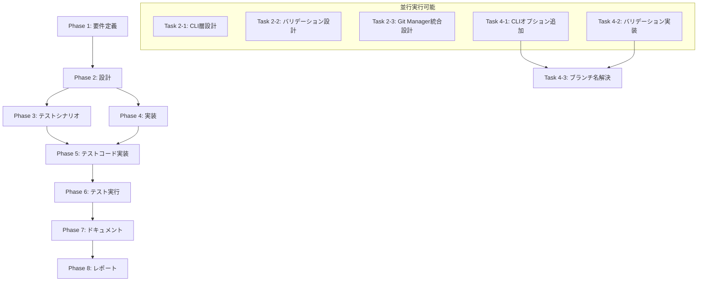

# プロジェクト計画書: Issue #7 - カスタムブランチ名での作業をサポート

## 1. Issue分析

### 複雑度
**中程度**

### 見積もり工数
**8~12時間**

#### 根拠
- CLI オプションの追加（1~2h）
- ブランチ名バリデーションロジックの実装（1~2h）
- Git Manager の既存機能統合（1~2h）
- メタデータスキーマの更新（0.5~1h）
- Jenkinsfile の更新（0.5~1h）
- テストコードの実装（2~3h）
- ドキュメント更新（1~2h）

この機能は既存アーキテクチャの自然な拡張であり、新規モジュールの追加は不要。既存の `GitManager` と `MetadataManager` を活用し、CLI層とパイプライン層に変更を加える。

### リスク評価
**低**

- 既存機能（デフォルトブランチ生成）への影響は最小限
- Git操作は既存の `GitManager` を利用するため、新規実装リスクが低い
- 後方互換性の維持が容易（オプション追加のみ）
- Jenkins統合は既存パラメータパターンを踏襲

---

## 2. 実装戦略判断

### 実装戦略: **EXTEND**

#### 判断根拠
この機能は既存の初期化フローとブランチ管理機能を拡張するものであり、以下の点から **EXTEND** が適切：

1. **既存CLIコマンドの拡張**: `init` コマンドに `--branch` オプションを追加
2. **既存クラスの活用**: `GitManager` の既存メソッド（`createBranch()`, `switchBranch()`）を再利用
3. **既存メタデータスキーマの利用**: `metadata.json` の既存フィールド `branch_name` を活用
4. **デフォルト動作の維持**: オプション未指定時の動作は完全に保持
5. **新規モジュール不要**: 新しいファイル・クラスの作成は不要

この機能は、既存アーキテクチャに自然に統合される拡張機能であり、CREATE（新規作成）やREFACTOR（構造改善）には該当しない。

---

### テスト戦略: **UNIT_INTEGRATION**

#### 判断根拠
この機能は以下の理由から **UNIT_INTEGRATION** が適切：

1. **ユニットテスト**:
   - ブランチ名バリデーションロジック（純粋関数）
   - CLI オプション解析ロジック
   - メタデータ保存ロジック
   - これらは外部依存なしで単体テスト可能

2. **インテグレーションテスト**:
   - Git操作（ブランチ作成・切り替え）の統合テスト
   - CLIコマンド全体の実行フロー検証
   - メタデータと実際のGit状態の整合性確認
   - リモートブランチ取得のシナリオ検証

3. **BDDテストは不要**:
   - この機能はエンドユーザー向けストーリーではなく、開発者向けツールの内部機能
   - ユーザーストーリーよりも技術的な動作保証が重要

---

### テストコード戦略: **BOTH_TEST**

#### 判断根拠
この機能は新規機能追加と既存機能の拡張の両面を持つため、**BOTH_TEST** が適切：

1. **CREATE_TEST（新規テストファイル作成）**:
   - `tests/unit/branch-validation.test.ts`: ブランチ名バリデーション専用のユニットテスト
   - `tests/integration/custom-branch-workflow.test.ts`: カスタムブランチ使用時の統合テスト
   - 新規機能に対する独立したテストスイートを作成

2. **EXTEND_TEST（既存テストファイル拡張）**:
   - `tests/integration/init-workflow.test.ts`: 既存のinitコマンドテストにカスタムブランチのケースを追加
   - `tests/unit/metadata-manager.test.ts`: `branch_name` フィールド保存のテストケース追加
   - 既存機能（デフォルトブランチ生成）の後方互換性検証

この組み合わせにより、新規機能の独立したテストと既存機能との整合性検証を両立できる。

---

## 3. 影響範囲分析

### 既存コードへの影響

#### 変更が必要なファイル
1. **src/main.ts** (高影響)
   - `init` コマンドに `--branch` オプション追加
   - ブランチ名解決ロジックの実装
   - ブランチ名バリデーションの実装

2. **src/core/git-manager.ts** (低影響)
   - 既存メソッド（`createBranch()`, `switchBranch()`）の活用のみ
   - 新規メソッド追加は不要

3. **src/core/metadata-manager.ts** (低影響)
   - 既存フィールド `branch_name` を利用（スキーマ変更なし）
   - 保存・読み込みロジックは既存

4. **Jenkinsfile** (中影響)
   - Initialize Workflow ステージに `--branch` パラメータの条件分岐追加

5. **jenkins/jobs/dsl/ai-workflow/ai_workflow_orchestrator.groovy** (スコープ外、参考のみ)
   - `BRANCH_NAME` パラメータ追加（別Issue/PRで対応）

#### 影響を受けないファイル
- `src/phases/*.ts`: 各フェーズは `metadata.json` の `branch_name` を読み取るのみ
- `src/core/github-client.ts`: ブランチ情報は `GitManager` 経由で取得
- `src/templates/*.md`: テンプレートは変更不要

---

### 依存関係の変更

#### 新規依存の追加
**なし** - 既存の依存関係（`simple-git`, `commander`）で実装可能

#### 既存依存の変更
**なし**

---

### マイグレーション要否

#### メタデータスキーマ
**マイグレーション不要**

理由:
- `metadata.json` の `branch_name` フィールドは既存
- 既存ワークフローは `ai-workflow/issue-{issue_number}` が保存されており、新しいロジックでも正常動作
- 古いメタデータファイルとの互換性は完全に保たれる

#### 設定ファイル
**変更不要**

---

## 4. タスク分割

### Phase 1: 要件定義 (見積もり: 1~1.5h)

- [x] Task 1-1: 機能要件の詳細化 (0.5~1h)
  - FR-1～FR-6の受け入れ基準を明確化
  - ブランチ名バリデーションルールの仕様確定
  - エッジケース（リモートのみ存在、conflictingブランチなど）の取り扱い決定
- [x] Task 1-2: 非機能要件の定義 (0.5h)
  - エラーメッセージの文言定義
  - パフォーマンス要件（Git操作のタイムアウトなど）
  - ログ出力の仕様

---

### Phase 2: 設計 (見積もり: 1.5~2h)

- [ ] Task 2-1: CLI層の設計 (0.5~1h)
  - `--branch` オプションの型定義とバリデーション仕様
  - Commander.jsのオプション定義方法
  - ヘルプメッセージの設計
- [ ] Task 2-2: ブランチ名バリデーションロジックの設計 (0.5h)
  - 正規表現パターンの定義
  - Git命名規則の検証項目リスト
  - エラーメッセージのマッピング
- [ ] Task 2-3: Git Manager統合の設計 (0.5h)
  - 既存メソッド（`createBranch()`, `switchBranch()`）の呼び出しフロー
  - ブランチ存在チェックの実装方法
  - リモートブランチ取得の処理フロー

---

### Phase 3: テストシナリオ (見積もり: 1~1.5h)

- [x] Task 3-1: ユニットテストシナリオの作成 (0.5h)
  - ブランチ名バリデーションの正常系・異常系
  - CLI オプション解析の境界値テスト
- [x] Task 3-2: インテグレーションテストシナリオの作成 (0.5~1h)
  - デフォルトブランチ生成（後方互換性）
  - カスタムブランチ新規作成
  - 既存ブランチへの切り替え
  - リモートブランチの取得
  - 不正なブランチ名のエラーハンドリング
  - Jenkinsパラメータ統合

---

### Phase 4: 実装 (見積もり: 3~5h)

- [x] Task 4-1: CLI オプションの追加 (0.5~1h)
  - `src/main.ts` の `init` コマンドに `--branch` オプション追加
  - Commander.jsの型定義更新
  - ヘルプメッセージの追加
- [x] Task 4-2: ブランチ名バリデーション実装 (1~1.5h)
  - `validateBranchName()` 関数の実装
  - Git命名規則のチェックロジック
  - エラーメッセージの生成
- [x] Task 4-3: ブランチ名解決ロジック実装 (1~1.5h)
  - `resolveBranchName()` 関数の実装（デフォルト vs カスタム）
  - 既存ブランチ存在チェック
  - リモートブランチ取得ロジック
  - `GitManager` の既存メソッド統合
- [x] Task 4-4: Jenkinsfile の更新 (0.5~1h)
  - `BRANCH_NAME` パラメータの条件分岐追加
  - 環境変数からCLIへのパラメータ渡し
  - デフォルト動作の維持確認

---

### Phase 5: テストコード実装 (見積もり: 2~3h)

- [x] Task 5-1: ユニットテスト実装 (1~1.5h)
  - `tests/unit/branch-validation.test.ts` の作成
  - ブランチ名バリデーションの正常系・異常系テスト
  - 境界値テスト（空文字列、特殊文字、長い名前など）
- [x] Task 5-2: インテグレーションテスト実装 (1~1.5h)
  - `tests/integration/custom-branch-workflow.test.ts` の作成
  - デフォルトブランチ生成のテスト
  - カスタムブランチ作成・切り替えのテスト
  - エラーハンドリングのテスト
- [x] Task 5-3: 既存テストの拡張 (0.5h)
  - `tests/integration/multi-repo-workflow.test.ts` にカスタムブランチケース追加（IT-007, IT-008）
  - 後方互換性の検証テスト追加

---

### Phase 6: テスト実行 (見積もり: 0.5~1h)

- [x] Task 6-1: ユニットテスト実行 (0.25~0.5h)
  - `npm run test:unit` 実行
  - カバレッジレポート確認（目標: 90%以上）
  - 失敗ケースの修正
- [x] Task 6-2: インテグレーションテスト実行 (0.25~0.5h)
  - `npm run test:integration` 実行
  - 実際のGit操作の動作確認
  - 失敗ケースの修正

---

### Phase 7: ドキュメント (見積もり: 1~2h)

- [x] Task 7-1: README.md の更新 (0.5~1h)
  - CLI オプションセクションに `--branch` を追加
  - 使用例の追加（デフォルト、カスタム、既存ブランチ）
  - ブランチ名バリデーションルールの記載
- [x] Task 7-2: CLAUDE.md の更新 (0.25~0.5h)
  - CLI オプション一覧に `--branch` を追加
  - マルチリポジトリワークフローセクションに言及
- [x] Task 7-3: ARCHITECTURE.md の更新（任意） (0.25~0.5h)
  - init コマンドフローにブランチ名解決ステップを追記
  - メタデータ構造の説明を確認（既存フィールド使用のため変更不要）

---

### Phase 8: レポート (見積もり: 0.5~1h)

- [ ] Task 8-1: 実装サマリーの作成 (0.25~0.5h)
  - 変更ファイル一覧
  - 実装した機能の概要
  - テスト結果のサマリー
- [ ] Task 8-2: PRボディの生成 (0.25~0.5h)
  - 機能説明
  - 使用例
  - 受け入れ基準の達成確認
  - スクリーンショット（任意、CLI出力）

---

## 5. 依存関係

### クリティカルパス
**Phase 1 → Phase 2 → Phase 4 → Phase 5 → Phase 6 → Phase 7 → Phase 8**

Phase 3（テストシナリオ）は Phase 4（実装）と並行して進められるが、Phase 5（テストコード実装）の前に完了する必要がある。

---

## 6. リスクと軽減策

### リスク1: Git命名規則の解釈の違い
- **影響度**: 中
- **確率**: 低
- **軽減策**:
  - Git公式ドキュメントの `git-check-ref-format` を参照し、仕様を明確化
  - 既存の実装（Git CLIの動作）と整合性を取る
  - ユニットテストでエッジケースを網羅（`..`, `~`, `^`, `/` を含むケース）

### リスク2: リモートブランチ取得時のネットワークエラー
- **影響度**: 中
- **確率**: 中
- **軽減策**:
  - `simple-git` のエラーハンドリングを適切に実装
  - タイムアウト設定を明示
  - ユーザーフレンドリーなエラーメッセージを表示
  - ローカルブランチが存在する場合はリモート取得をスキップ

### リスク3: Jenkins統合のテスト環境不足
- **影響度**: 低
- **確率**: 中
- **軽減策**:
  - Jenkinsfileの変更は最小限に抑える
  - 既存のパラメータパターン（`AGENT_MODE`, `PRESET_NAME`）を踏襲
  - Job DSLの変更はスコープ外とし、ドキュメント記載のみ
  - ローカルで環境変数を設定してCLI動作を検証

### リスク4: 後方互換性の破壊
- **影響度**: 高
- **確率**: 低
- **軽減策**:
  - `--branch` はオプションとし、未指定時のデフォルト動作を完全に保持
  - 既存テストスイートを全て実行し、regressionがないことを確認
  - 既存のメタデータファイルとの互換性を検証
  - レビューフェーズで後方互換性チェックリストを使用

---

## 7. 品質ゲート

### Phase 1: 要件定義
- [x] FR-1～FR-6の受け入れ基準が明確に記載されている
- [x] ブランチ名バリデーションルールの仕様が確定している
- [x] エッジケースの取り扱いが決定されている
- [x] 非機能要件（エラーメッセージ、パフォーマンス）が定義されている

### Phase 2: 設計
- [ ] 実装戦略（EXTEND）の判断根拠が明記されている
- [ ] テスト戦略（UNIT_INTEGRATION）の判断根拠が明記されている
- [ ] テストコード戦略（BOTH_TEST）の判断根拠が明記されている
- [ ] CLI層、バリデーションロジック、Git Manager統合の設計が完了している
- [ ] 既存コードへの影響範囲が明確に文書化されている

### Phase 3: テストシナリオ
- [x] ユニットテストシナリオが正常系・異常系を網羅している
- [x] インテグレーションテストシナリオが全受け入れ基準（AC-1～AC-6）をカバーしている
- [x] 後方互換性検証のテストシナリオが含まれている
- [x] 各テストシナリオに期待結果が明記されている

### Phase 4: 実装
- [ ] CLI オプション `--branch` が正しく追加されている
- [ ] ブランチ名バリデーションが仕様通りに実装されている
- [ ] デフォルトブランチ生成の動作が変更されていない（後方互換性）
- [ ] エラーハンドリングが適切に実装されている
- [ ] コードレビューでアンチパターンが検出されていない

### Phase 5: テストコード実装
- [x] ユニットテストがバリデーションロジックの全分岐をカバーしている
- [x] インテグレーションテストが全受け入れ基準（AC-1～AC-6）を検証している
- [x] 既存テストスイートにregressionテストが追加されている
- [x] テストコードがプロジェクトのコーディング規約に準拠している

### Phase 6: テスト実行
- [x] 全ユニットテストが成功している（0 failed）
- [x] 全インテグレーションテストが成功している（0 failed）
- [x] コードカバレッジが90%以上である
- [x] 既存テストスイートが全て成功している（regression なし）

### Phase 7: ドキュメント
- [x] README.md に `--branch` オプションと使用例が追加されている
- [x] CLAUDE.md にCLIオプション一覧が更新されている
- [x] ブランチ名バリデーションルールがドキュメント化されている
- [x] ドキュメントの技術的正確性が検証されている

### Phase 8: レポート
- [ ] 実装サマリーに変更ファイル一覧が含まれている
- [ ] PRボディに機能説明と使用例が記載されている
- [ ] 全受け入れ基準（AC-1～AC-6）の達成が確認されている
- [ ] テスト結果のサマリーが含まれている

---

## 8. 成功基準

### 機能要件の達成
- [ ] AC-1: CLI でカスタムブランチ名を指定できる
- [ ] AC-2: デフォルト動作が変わらない（後方互換性）
- [ ] AC-3: 既存ブランチに切り替えられる
- [ ] AC-4: メタデータに保存される
- [ ] AC-5: Jenkins でブランチ名を指定できる
- [ ] AC-6: ブランチ名のバリデーションが動作する

### 品質基準
- [ ] ユニットテストカバレッジ ≥ 90%
- [ ] インテグレーションテスト成功率 = 100%
- [ ] 既存テストスイート成功率 = 100%（regression なし）
- [ ] ドキュメント完全性 = 100%

### 非機能要件
- [ ] エラーメッセージがユーザーフレンドリーである
- [ ] Git操作のパフォーマンス劣化がない
- [ ] ログ出力が適切なレベルで出力されている

---

## 9. スコープ外の確認

以下は今回のスコープに含めないことを確認：

- [ ] Job DSL ファイルの実装（別ファイルで管理、ドキュメント参照のみ）
- [ ] ブランチ保護ルールのチェック
- [ ] PR 作成時のベースブランチ自動判定
- [ ] 複数リポジトリでのブランチ名統一

これらは将来的な拡張として Issue を別途作成することを推奨。

---

## 10. レビュー観点

このプロジェクト計画書のレビュー時には、以下を重点的に確認すること：

### ブロッカー（次フェーズに進めない問題）
- [ ] 実装戦略（EXTEND）の判断根拠が明確か
- [ ] テスト戦略（UNIT_INTEGRATION）の判断根拠が明確か
- [ ] テストコード戦略（BOTH_TEST）の判断根拠が明確か
- [ ] タスク分割の粒度は適切か（1タスク = 1~4時間）
- [ ] 依存関係は正確に記載されているか
- [ ] 品質ゲートの定義は明確か

### 改善提案（望ましいが必須ではない）
- [ ] リスク分析は十分に網羅的か
- [ ] 見積もり工数は現実的か
- [ ] 成功基準は測定可能か

---

## 11. 次ステップ

Phase 0（Planning）完了後、以下のフェーズに進む：

1. **Phase 1: 要件定義** - 機能要件・非機能要件の詳細化
2. **Phase 2: 設計** - CLI層、バリデーションロジック、Git Manager統合の詳細設計
3. **Phase 3: テストシナリオ** - ユニット・インテグレーションテストシナリオの作成
4. **Phase 4: 実装** - CLI、バリデーション、ブランチ解決ロジック、Jenkinsfile の実装
5. **Phase 5: テストコード実装** - ユニット・インテグレーションテストの実装
6. **Phase 6: テスト実行** - 全テストの実行とカバレッジ確認
7. **Phase 7: ドキュメント** - README、CLAUDE.md、ARCHITECTURE.md の更新
8. **Phase 8: レポート** - 実装サマリーとPRボディの生成

---

**プロジェクト計画書 v1.0**
**作成日**: 2025-01-XX
**見積もり総工数**: 8~12時間
**リスクレベル**: 低
**複雑度**: 中程度
