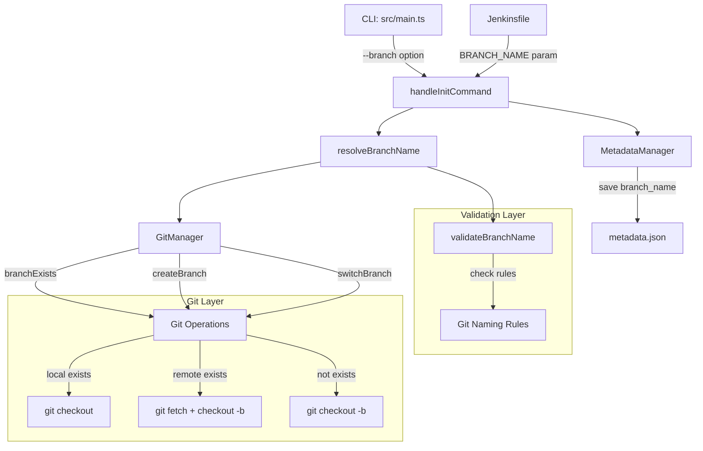
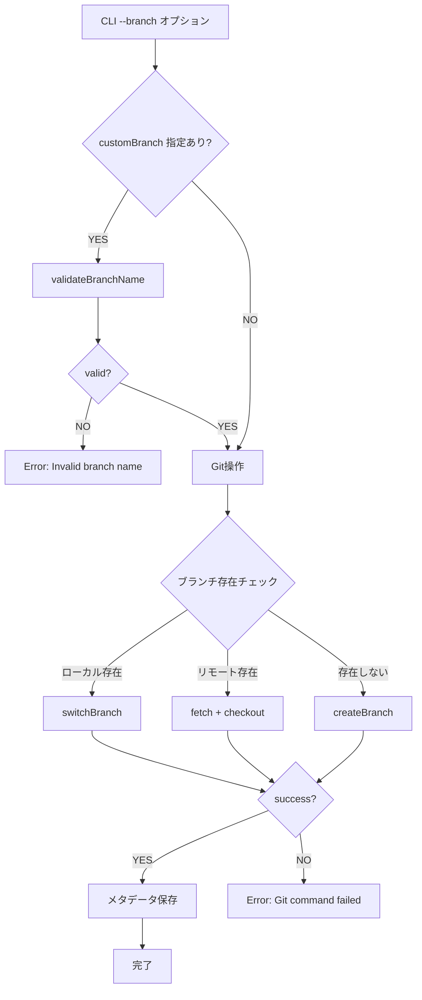

# 詳細設計書: Issue #7 - カスタムブランチ名での作業をサポート

## 0. Planning Documentの確認

本設計書は、Planning Phase（Phase 0）の計画書および要件定義書（Phase 1）の内容を踏まえて作成されています。

### 実装戦略: EXTEND
既存の初期化フロー（`init`コマンド）とブランチ管理機能（`GitManager`）を拡張します。新規モジュールの追加は不要であり、既存のメソッドとメタデータスキーマを活用します。

### テスト戦略: UNIT_INTEGRATION
- **ユニットテスト**: ブランチ名バリデーションロジック、CLIオプション解析の単体テスト
- **インテグレーションテスト**: Git操作統合、CLIコマンド全体フロー、メタデータとGit状態の整合性確認

### テストコード戦略: BOTH_TEST
- **CREATE_TEST**: 新規テストファイル（ブランチバリデーション専用、カスタムブランチワークフロー統合テスト）
- **EXTEND_TEST**: 既存テストファイルへのケース追加（マルチリポジトリワークフローテスト）

---

## 1. アーキテクチャ設計

### 1.1 システム全体図



### 1.2 コンポーネント間の関係

| コンポーネント | 役割 | 依存関係 |
|--------------|------|---------|
| `src/main.ts` | CLI定義、`--branch`オプション追加、ブランチ名解決 | `GitManager`, `MetadataManager`, `commander` |
| `validateBranchName()` | Git命名規則チェック | なし（純粋関数） |
| `resolveBranchName()` | デフォルトまたはカスタムブランチ名を解決 | `validateBranchName()`, `GitManager` |
| `GitManager` | ブランチ作成・切り替え（既存メソッド活用） | `simple-git` |
| `MetadataManager` | `branch_name`フィールド保存 | `WorkflowState` |
| `Jenkinsfile` | Jenkins統合（`BRANCH_NAME`パラメータ追加） | CLI `--branch`オプション |

### 1.3 データフロー

```
1. ユーザー入力
   └─> CLI: --branch <branch-name> または BRANCH_NAME環境変数

2. ブランチ名解決
   ├─> カスタムブランチ名が指定された場合
   │   └─> validateBranchName() でバリデーション
   └─> 未指定の場合: デフォルト ai-workflow/issue-{issue_number}

3. Git操作
   ├─> branchExists(branchName, checkRemote=true)
   ├─> ローカル存在: switchBranch(branchName)
   ├─> リモート存在: fetch() → checkout -b <branch> origin/<branch>
   └─> 存在しない: createBranch(branchName)

4. メタデータ保存
   └─> metadata.json の branch_name フィールドに保存

5. Git操作（既存フロー）
   └─> commitPhaseOutput() → pushToRemote()
```

---

## 2. 実装戦略判断

### 実装戦略: **EXTEND（拡張）**

#### 判断根拠:

1. **既存CLIコマンドの拡張**: `init`コマンドに`--branch`オプションを追加するのみで、新規コマンドは不要
2. **既存クラスの活用**: `GitManager`の既存メソッド（`createBranch()`, `switchBranch()`, `branchExists()`）を再利用
3. **既存メタデータスキーマの利用**: `metadata.json`の既存フィールド`branch_name`を活用（スキーママイグレーション不要）
4. **デフォルト動作の維持**: オプション未指定時の動作は完全に保持（後方互換性）
5. **新規モジュール不要**: 新しいファイル・クラスの作成は不要（バリデーション関数のみ追加）

この機能は、既存アーキテクチャに自然に統合される拡張機能であり、CREATE（新規作成）やREFACTOR（構造改善）には該当しません。

---

## 3. テスト戦略判断

### テスト戦略: **UNIT_INTEGRATION**

#### 判断根拠:

1. **ユニットテスト**:
   - ブランチ名バリデーションロジック（純粋関数）は外部依存なしで単体テスト可能
   - CLI オプション解析ロジックの境界値テスト
   - これらは独立してテスト可能

2. **インテグレーションテスト**:
   - Git操作（ブランチ作成・切り替え）の統合テスト
   - CLIコマンド全体の実行フロー検証
   - メタデータと実際のGit状態の整合性確認
   - リモートブランチ取得のシナリオ検証

3. **BDDテストは不要**:
   - この機能はエンドユーザー向けストーリーではなく、開発者向けツールの内部機能
   - ユーザーストーリーよりも技術的な動作保証が重要

---

## 4. テストコード戦略判断

### テストコード戦略: **BOTH_TEST（両方）**

#### 判断根拠:

1. **CREATE_TEST（新規テストファイル作成）**:
   - `tests/unit/branch-validation.test.ts`: ブランチ名バリデーション専用のユニットテスト
   - `tests/integration/custom-branch-workflow.test.ts`: カスタムブランチ使用時の統合テスト
   - 新規機能に対する独立したテストスイートを作成

2. **EXTEND_TEST（既存テストファイル拡張）**:
   - `tests/integration/multi-repo-workflow.test.ts`: 既存のマルチリポジトリワークフローテストにカスタムブランチのケースを追加
   - 既存機能（デフォルトブランチ生成）の後方互換性検証

この組み合わせにより、新規機能の独立したテストと既存機能との整合性検証を両立できます。

---

## 5. 影響範囲分析

### 5.1 既存コードへの影響

#### 変更が必要なファイル

| ファイル | 影響度 | 変更内容 |
|---------|--------|---------|
| `src/main.ts` | **高** | `init`コマンドに`--branch`オプション追加、ブランチ名解決ロジック実装、バリデーション関数追加 |
| `Jenkinsfile` | **中** | "Initialize Workflow"ステージで`BRANCH_NAME`パラメータの条件分岐追加 |
| `src/core/git-manager.ts` | **低** | 既存メソッド（`createBranch()`, `switchBranch()`, `branchExists()`）の活用のみ、新規メソッド追加不要 |
| `src/core/metadata-manager.ts` | **低** | 既存フィールド`branch_name`を利用、スキーマ変更なし |
| `README.md` | **中** | `--branch`オプションの使用例、ブランチ名バリデーションルールの追加 |
| `CLAUDE.md` | **低** | CLIオプション一覧に`--branch`を追加 |
| `ARCHITECTURE.md` | **低** | initコマンドフローにブランチ名解決ステップを追記（任意） |

#### 影響を受けないファイル

- `src/phases/*.ts`: 各フェーズは`metadata.json`の`branch_name`を読み取るのみ
- `src/core/github-client.ts`: ブランチ情報は`GitManager`経由で取得
- `src/templates/*.md`: テンプレートは変更不要
- `jenkins/jobs/dsl/ai-workflow/ai_workflow_orchestrator.groovy`: ドキュメント参照のみ（実装はスコープ外）

### 5.2 依存関係の変更

#### 新規依存の追加
**なし** - 既存の依存関係（`simple-git`, `commander`）で実装可能

#### 既存依存の変更
**なし**

### 5.3 マイグレーション要否

#### メタデータスキーマ
**マイグレーション不要**

理由:
- `metadata.json`の`branch_name`フィールドは既存
- 既存ワークフローは`ai-workflow/issue-{issue_number}`が保存されており、新しいロジックでも正常動作
- 古いメタデータファイルとの互換性は完全に保たれる

#### 設定ファイル
**変更不要**

---

## 6. 変更・追加ファイルリスト

### 6.1 新規作成ファイル

| ファイルパス | 説明 |
|------------|------|
| `tests/unit/branch-validation.test.ts` | ブランチ名バリデーションのユニットテスト |
| `tests/integration/custom-branch-workflow.test.ts` | カスタムブランチワークフローの統合テスト |

### 6.2 修正が必要な既存ファイル

| ファイルパス | 変更箇所 |
|------------|---------|
| `src/main.ts` | ・`init`コマンドに`.option('--branch <name>', 'Custom branch name')`追加<br>・`handleInitCommand()`関数内にブランチ名解決ロジック追加<br>・`validateBranchName()`関数追加<br>・`resolveBranchName()`関数追加 |
| `Jenkinsfile` | ・"Initialize Workflow"ステージで`BRANCH_NAME`パラメータの条件分岐追加 |
| `tests/integration/multi-repo-workflow.test.ts` | ・カスタムブランチ名のテストケース追加（後方互換性検証） |
| `README.md` | ・CLI オプションセクションに`--branch`を追加<br>・使用例の追加（デフォルト、カスタム、既存ブランチ）<br>・ブランチ名バリデーションルールの記載 |
| `CLAUDE.md` | ・CLIオプション一覧に`--branch`を追加<br>・マルチリポジトリワークフローセクションに言及 |
| `ARCHITECTURE.md` | ・initコマンドフローにブランチ名解決ステップを追記（任意） |

### 6.3 削除が必要なファイル

**なし**

---

## 7. 詳細設計

### 7.1 CLI層の設計（src/main.ts）

#### 7.1.1 `--branch`オプションの追加

**実装箇所**: `src/main.ts` の `init`コマンド定義

```typescript
program
  .command('init')
  .requiredOption('--issue-url <url>', 'GitHub Issue URL')
  .option('--branch <name>', 'Custom branch name (default: ai-workflow/issue-{issue_number})')
  .action(async (options) => {
    try {
      await handleInitCommand(options.issueUrl, options.branch);
    } catch (error) {
      reportFatalError(error);
    }
  });
```

**変更点**:
- `.option('--branch <name>', ...)` を追加
- `handleInitCommand()` の引数に `branchName?: string` を追加

#### 7.1.2 ブランチ名バリデーション関数

**関数名**: `validateBranchName(branchName: string): { valid: boolean; error?: string }`

**配置場所**: `src/main.ts`（`handleInitCommand()`の前に定義）

**実装仕様**:

```typescript
/**
 * Gitブランチ名のバリデーション
 * git-check-ref-format の命名規則に基づく
 * @see https://git-scm.com/docs/git-check-ref-format
 */
function validateBranchName(branchName: string): { valid: boolean; error?: string } {
  // 1. 空文字列チェック
  if (!branchName || branchName.trim() === '') {
    return { valid: false, error: 'Branch name cannot be empty' };
  }

  // 2. スラッシュの位置チェック
  if (branchName.startsWith('/') || branchName.endsWith('/')) {
    return { valid: false, error: 'Branch name cannot start or end with "/"' };
  }

  // 3. 連続ドットチェック
  if (branchName.includes('..')) {
    return { valid: false, error: 'Branch name cannot contain ".."' };
  }

  // 4. 不正文字チェック（~, ^, :, ?, *, [, \, 空白、@{）
  const invalidChars = /[~^:?*[\\\s]|@\{/;
  if (invalidChars.test(branchName)) {
    return { valid: false, error: 'Branch name contains invalid characters (spaces, ~, ^, :, ?, *, [, \\, @{)' };
  }

  // 5. ドットで終わらないチェック
  if (branchName.endsWith('.')) {
    return { valid: false, error: 'Branch name cannot end with "."' };
  }

  return { valid: true };
}
```

**バリデーションルール詳細**:

| ルール | 検証内容 | エラーメッセージ |
|-------|---------|----------------|
| 空文字列 | `branchName.trim() === ''` | "Branch name cannot be empty" |
| スラッシュの位置 | `startsWith('/')` or `endsWith('/')` | "Branch name cannot start or end with \"/\"" |
| 連続ドット | `includes('..')` | "Branch name cannot contain \"..\"" |
| 不正文字 | 正規表現: `/[~^:?*[\\\s]|@\{/` | "Branch name contains invalid characters (spaces, ~, ^, :, ?, *, [, \\, @{)" |
| ドットで終わる | `endsWith('.')` | "Branch name cannot end with \".\"" |

#### 7.1.3 ブランチ名解決ロジック

**関数名**: `resolveBranchName(customBranch: string | undefined, issueNumber: number, gitManager: GitManager): Promise<string>`

**配置場所**: `src/main.ts`（`handleInitCommand()`内で使用）

**実装仕様**:

```typescript
/**
 * ブランチ名を解決（デフォルト vs カスタム）
 * @param customBranch - CLI の --branch オプション値
 * @param issueNumber - Issue番号
 * @param gitManager - GitManager インスタンス
 * @returns 解決されたブランチ名
 */
async function resolveBranchName(
  customBranch: string | undefined,
  issueNumber: number,
  gitManager: GitManager
): Promise<string> {
  // 1. カスタムブランチ名が指定された場合
  if (customBranch) {
    // バリデーション
    const validation = validateBranchName(customBranch);
    if (!validation.valid) {
      throw new Error(`[ERROR] Invalid branch name: ${customBranch}. ${validation.error}`);
    }

    console.info(`[INFO] Using custom branch name: ${customBranch}`);
    return customBranch;
  }

  // 2. デフォルトブランチ名
  const defaultBranch = `ai-workflow/issue-${issueNumber}`;
  console.info(`[INFO] Using default branch name: ${defaultBranch}`);
  return defaultBranch;
}
```

**フローチャート**:

```
カスタムブランチ名指定あり？
├─ YES
│  ├─ validateBranchName()
│  ├─ valid? → YES: return customBranch
│  └─ valid? → NO: throw Error
└─ NO
   └─ return `ai-workflow/issue-${issueNumber}`
```

#### 7.1.4 `handleInitCommand()`の変更

**変更箇所**: `src/main.ts` の `handleInitCommand()` 関数

**変更内容**:

```typescript
// 関数シグネチャ変更
async function handleInitCommand(issueUrl: string, customBranch?: string): Promise<void> {
  // ... 既存のIssue URL解析処理 ...

  // ブランチ名解決（新規追加）
  const gitManager = new GitManager(repoRoot, metadataManager);
  const branchName = await resolveBranchName(customBranch, issueNumber, gitManager);

  // 既存のブランチ名変数をすべて解決されたbranchNameに置き換え
  // 例: const branchName = `ai-workflow/issue-${issueNumber}`; を削除

  // ... 既存のブランチ作成・切り替えロジック ...
  // （既存のロジックはそのまま活用、branchName変数のみ変更）

  // メタデータ保存
  metadataManager.data.branch_name = branchName;
  metadataManager.save();

  // ... 残りの既存処理（PR作成など）...
}
```

**重要な変更点**:

1. 関数シグネチャに `customBranch?: string` パラメータを追加
2. `resolveBranchName()` を呼び出してブランチ名を取得
3. 既存のハードコードされた `const branchName = `ai-workflow/issue-${issueNumber}`` を削除
4. それ以外の既存ロジック（ブランチ作成、メタデータ保存、PR作成）は変更不要

### 7.2 Git Manager統合

**変更なし** - 既存の`GitManager`メソッドを活用

#### 既存メソッドの活用方法:

| メソッド | 用途 | 呼び出し元 |
|---------|------|-----------|
| `branchExists(branchName: string, checkRemote = true): Promise<boolean>` | ローカル・リモートブランチ存在確認 | `handleInitCommand()` |
| `createBranch(branchName: string, baseBranch?: string): Promise<BranchResult>` | 新規ブランチ作成 | `handleInitCommand()` |
| `switchBranch(branchName: string): Promise<BranchResult>` | 既存ブランチへの切り替え | `handleInitCommand()` |
| `getCurrentBranch(): Promise<string>` | 現在のブランチ名取得 | `handleInitCommand()` |

**ブランチ作成・切り替えフロー** (既存のロジックを活用):

```typescript
// リモートブランチの存在確認
await git.fetch();
const remoteBranches = await git.branch(['-r']);
const remoteBranchExists = remoteBranches.all.some(ref => ref.includes(`origin/${branchName}`));

if (remoteBranchExists) {
  // リモートブランチが存在する場合: チェックアウト → pull
  console.info(`[INFO] Remote branch '${branchName}' found. Checking out...`);

  const localBranches = await git.branchLocal();
  if (localBranches.all.includes(branchName)) {
    await git.checkout(branchName);
    console.info(`[INFO] Switched to existing local branch: ${branchName}`);
  } else {
    await git.checkoutBranch(branchName, `origin/${branchName}`);
    console.info(`[INFO] Created local branch '${branchName}' tracking origin/${branchName}`);
  }

  await git.pull('origin', branchName, { '--no-rebase': null });
  console.info('[OK] Successfully pulled latest changes.');
} else {
  // リモートブランチが存在しない場合: 新規作成
  console.info(`[INFO] Remote branch '${branchName}' not found. Creating new branch...`);

  const localBranches = await git.branchLocal();
  if (localBranches.all.includes(branchName)) {
    await git.checkout(branchName);
    console.info(`[INFO] Switched to existing local branch: ${branchName}`);
  } else {
    await git.checkoutLocalBranch(branchName);
    console.info(`[INFO] Created and switched to new branch: ${branchName}`);
  }
}
```

**重要**: この既存フローは変更不要です。`branchName`変数が解決されたカスタムブランチ名または デフォルトブランチ名を指すように変更するだけです。

### 7.3 メタデータ管理

**変更なし** - 既存フィールド`branch_name`を活用

#### 既存のメタデータ構造:

```typescript
export interface WorkflowMetadata {
  // ... 既存フィールド ...
  branch_name?: string | null;  // ← このフィールドを使用（既存）
  // ... 既存フィールド ...
}
```

#### 保存処理（既存ロジック）:

```typescript
// src/main.ts の handleInitCommand() 内
metadataManager.data.branch_name = branchName;  // ← 既存コード（変更なし）
metadataManager.save();
```

**重要**: メタデータスキーマの変更は不要です。既存の`branch_name`フィールドがカスタムブランチ名またはデフォルトブランチ名を格納します。

### 7.4 Jenkins統合

#### 7.4.1 Jenkinsfile の更新

**変更箇所**: `Jenkinsfile` の "Initialize Workflow" ステージ

**現在の実装** (行 270-291):

```groovy
stage('Initialize Workflow') {
    steps {
        script {
            echo "========================================="
            echo "Stage: Initialize Workflow"
            echo "========================================="

            dir(env.WORKFLOW_DIR) {
                if (params.DRY_RUN) {
                    echo "[DRY RUN] ワークフロー初期化をスキップ"
                } else {
                    sh """
                        node dist/index.js init --issue-url ${params.ISSUE_URL}
                    """
                }
            }
        }
    }
}
```

**新しい実装**:

```groovy
stage('Initialize Workflow') {
    steps {
        script {
            echo "========================================="
            echo "Stage: Initialize Workflow"
            echo "========================================="

            dir(env.WORKFLOW_DIR) {
                if (params.DRY_RUN) {
                    echo "[DRY RUN] ワークフロー初期化をスキップ"
                } else {
                    // BRANCH_NAME パラメータが指定されている場合、--branch オプションを追加
                    def branchOption = params.BRANCH_NAME ? "--branch ${params.BRANCH_NAME}" : ""

                    sh """
                        node dist/index.js init \
                            --issue-url ${params.ISSUE_URL} \
                            ${branchOption}
                    """
                }
            }
        }
    }
}
```

**変更点**:
- `def branchOption = params.BRANCH_NAME ? "--branch ${params.BRANCH_NAME}" : ""` を追加
- `sh`コマンドに `${branchOption}` を追加
- `BRANCH_NAME`パラメータが空の場合はオプションを渡さない（デフォルト動作）

#### 7.4.2 Job DSL パラメータ追加（参考、実装はスコープ外）

**ファイル**: `jenkins/jobs/dsl/ai-workflow/ai_workflow_orchestrator.groovy`

**追加するパラメータ** (参考):

```groovy
stringParam {
    name('BRANCH_NAME')
    defaultValue('')
    description('Custom branch name (optional, default: ai-workflow/issue-{issue_number})')
    trim(true)
}
```

**注意**: Job DSLファイルの実装は今回のスコープ外です。ドキュメント（README.md）にのみ記載します。

---

## 8. セキュリティ考慮事項

### 8.1 認証・認可

**変更なし** - 既存のGitHub Token管理を踏襲

- `GITHUB_TOKEN`環境変数による認証
- Git remote URLへのトークン埋め込み（既存の`GitManager.setupGithubCredentials()`を使用）

### 8.2 データ保護

**ブランチ名のサニタイゼーション**:

- `validateBranchName()`関数で不正文字を事前にブロック
- コマンドインジェクション対策: `simple-git`ライブラリを使用（直接シェルコマンド実行を回避）
- 正規表現による厳格なバリデーション

**リスク分析**:

| リスク | 影響度 | 対策 |
|-------|-------|------|
| コマンドインジェクション | 高 | `simple-git`ライブラリ使用、バリデーション |
| 不正なブランチ名 | 中 | `validateBranchName()`による事前検証 |
| メタデータ改ざん | 低 | ファイルシステム権限に依存（既存と同じ） |

### 8.3 セキュリティリスクと対策

| リスク項目 | 対策 | 実装箇所 |
|----------|------|---------|
| **コマンドインジェクション** | `simple-git`ライブラリ使用、`validateBranchName()`による不正文字除外 | `src/main.ts` |
| **パストラバーサル** | ブランチ名にはパスは含まれない（Git命名規則に準拠） | `validateBranchName()` |
| **認証情報漏洩** | 既存の`GITHUB_TOKEN`管理を踏襲、ログ出力時にトークンをマスク | `GitManager` |

---

## 9. 非機能要件への対応

### 9.1 パフォーマンス

| 項目 | 目標 | 実装方法 |
|-----|------|---------|
| **Git操作のタイムアウト** | 既存と同じ（60秒） | `simple-git`のデフォルト設定を維持 |
| **ブランチ存在チェック** | 追加オーバーヘッドなし | 既存の`branchExists()`メソッドを使用 |
| **リモートブランチ取得** | 初回実行時のみ | 既存の`git fetch`ロジックを活用 |
| **バリデーション** | 1ms未満 | 正規表現による高速チェック（外部I/O不要） |

**パフォーマンステスト**:
- ブランチ名バリデーションの実行時間計測（ユニットテスト）
- 既存のデフォルトブランチ生成と比較してパフォーマンス劣化がないことを確認

### 9.2 スケーラビリティ

**変更なし** - カスタムブランチ名機能はスケーラビリティに影響を与えません。

- ブランチ名の長さに制限なし（Git標準に準拠）
- メタデータのサイズ増加なし（既存フィールドを使用）

### 9.3 保守性

| 観点 | 実装方法 |
|-----|---------|
| **コードの可読性** | バリデーションロジックは独立した関数として実装（`validateBranchName()`） |
| **テスト容易性** | 純粋関数によるバリデーション（外部依存なし） |
| **既存コードへの影響最小化** | 既存メソッド（`GitManager`, `MetadataManager`）を活用 |
| **ログ出力** | 各Git操作の実行状況をINFOレベルでログ出力 |

**ログ出力例**:

```
[INFO] Using custom branch name: feature/add-logging
[INFO] Remote branch 'feature/add-logging' not found. Creating new branch...
[INFO] Created and switched to new branch: feature/add-logging
```

---

## 10. 実装の順序

### Phase 4: Implementation（実装フェーズ）での実装順序推奨

#### ステップ1: バリデーション関数の実装（1~1.5h）

**優先度**: 高
**依存関係**: なし

1. `src/main.ts`に`validateBranchName()`関数を追加
2. Git命名規則のチェックロジックを実装
3. エラーメッセージの生成

**成果物**:
- `validateBranchName()`関数（純粋関数）

#### ステップ2: CLIオプションの追加（0.5~1h）

**優先度**: 高
**依存関係**: なし

1. `src/main.ts`の`init`コマンドに`.option('--branch <name>', ...)`を追加
2. `handleInitCommand()`の関数シグネチャを変更（`customBranch?: string`パラメータ追加）
3. Commander.jsの型定義更新

**成果物**:
- CLI `--branch`オプションの定義

#### ステップ3: ブランチ名解決ロジックの実装（1~1.5h）

**優先度**: 高
**依存関係**: ステップ1（バリデーション関数）

1. `resolveBranchName()`関数を実装
2. デフォルトブランチ名生成ロジックとの統合
3. `handleInitCommand()`内で`resolveBranchName()`を呼び出し
4. 既存のハードコードされたブランチ名変数を削除

**成果物**:
- `resolveBranchName()`関数
- `handleInitCommand()`の更新

#### ステップ4: Jenkinsfileの更新（0.5~1h）

**優先度**: 中
**依存関係**: ステップ2, 3（CLI実装）

1. "Initialize Workflow"ステージの更新
2. `BRANCH_NAME`パラメータの条件分岐追加
3. デフォルト動作の維持確認

**成果物**:
- 更新された`Jenkinsfile`

#### 実装順序の理由:

1. **ステップ1（バリデーション）**: 独立した純粋関数であり、他のステップに依存しない
2. **ステップ2（CLIオプション）**: バリデーション関数と独立しており、並行実装可能
3. **ステップ3（ブランチ名解決）**: ステップ1のバリデーション関数を使用するため、その後に実装
4. **ステップ4（Jenkins統合）**: CLI実装が完了してから統合テスト可能

**並行実装可能な組み合わせ**:
- ステップ1とステップ2は並行実装可能

---

## 11. データ構造設計

### 11.1 ブランチ名バリデーション結果

```typescript
interface BranchValidationResult {
  valid: boolean;
  error?: string;
}
```

**使用例**:
```typescript
const validation = validateBranchName("feature/add-logging");
if (!validation.valid) {
  throw new Error(`Invalid branch name: ${validation.error}`);
}
```

### 11.2 メタデータ構造（既存）

```typescript
export interface WorkflowMetadata {
  // ... 既存フィールド ...
  branch_name?: string | null;  // カスタムブランチ名またはデフォルト
  // ... 既存フィールド ...
}
```

**例**:

```json
{
  "issue_number": "7",
  "issue_url": "https://github.com/tielec/ai-workflow-agent/issues/7",
  "branch_name": "feature/custom-branch-support",
  "repository": "tielec/ai-workflow-agent",
  // ... 他のフィールド ...
}
```

### 11.3 Git操作結果（既存）

```typescript
interface BranchResult {
  success: boolean;
  branch_name: string;
  error?: string | null;
}
```

**使用例** (既存コード):
```typescript
const result = await gitManager.createBranch(branchName);
if (!result.success) {
  throw new Error(result.error ?? 'Unknown error');
}
```

---

## 12. インターフェース設計

### 12.1 CLIインターフェース

#### コマンド仕様

```bash
ai-workflow-v2 init \
  --issue-url <GitHub Issue URL> \
  [--branch <branch-name>]
```

**オプション**:

| オプション | 型 | 必須 | デフォルト | 説明 |
|-----------|---|------|-----------|------|
| `--issue-url` | string | ✓ | - | GitHub Issue URL |
| `--branch` | string | - | `ai-workflow/issue-{issue_number}` | カスタムブランチ名 |

**使用例**:

```bash
# デフォルトブランチ名（ai-workflow/issue-7）
ai-workflow-v2 init --issue-url https://github.com/org/repo/issues/7

# カスタムブランチ名
ai-workflow-v2 init --issue-url https://github.com/org/repo/issues/7 --branch feature/my-feature

# 既存ブランチでの作業
ai-workflow-v2 init --issue-url https://github.com/org/repo/issues/7 --branch feature/existing-branch
```

### 12.2 Jenkinsインターフェース

#### パラメータ仕様（参考、Job DSL実装はスコープ外）

| パラメータ名 | 型 | デフォルト値 | 説明 |
|------------|---|------------|------|
| `ISSUE_URL` | string | (必須) | GitHub Issue URL |
| `BRANCH_NAME` | string | `""` (空文字列) | カスタムブランチ名（任意） |
| `EXECUTION_MODE` | choice | `all_phases` | 実行モード |
| `AGENT_MODE` | choice | `auto` | エージェントモード |
| ... | ... | ... | （既存パラメータ） |

**使用例**（Jenkins UI）:

```
ISSUE_URL: https://github.com/tielec/ai-workflow-agent/issues/7
BRANCH_NAME: feature/jenkins-custom
EXECUTION_MODE: all_phases
AGENT_MODE: auto
```

**Jenkinsfileでの使用**:

```groovy
def branchOption = params.BRANCH_NAME ? "--branch ${params.BRANCH_NAME}" : ""
sh """
    node dist/index.js init \
        --issue-url ${params.ISSUE_URL} \
        ${branchOption}
"""
```

### 12.3 エラーメッセージ仕様

#### ブランチ名バリデーションエラー

| エラーケース | エラーメッセージ |
|-----------|----------------|
| 空文字列 | `[ERROR] Invalid branch name: . Branch name cannot be empty` |
| スラッシュで始まる/終わる | `[ERROR] Invalid branch name: /feature. Branch name cannot start or end with "/"` |
| 連続ドット | `[ERROR] Invalid branch name: feature/... Branch name cannot contain ".."` |
| 不正文字（空白） | `[ERROR] Invalid branch name: invalid branch name. Branch name contains invalid characters (spaces, ~, ^, :, ?, *, [, \, @{)` |
| 不正文字（~, ^, :など） | `[ERROR] Invalid branch name: ~test. Branch name contains invalid characters (spaces, ~, ^, :, ?, *, [, \, @{)` |
| ドットで終わる | `[ERROR] Invalid branch name: feature.. Branch name cannot end with "."` |

#### Git操作エラー（既存）

| エラーケース | エラーメッセージ |
|-----------|----------------|
| ブランチ作成失敗 | `[ERROR] Git command failed: ...` |
| ブランチ切り替え失敗 | `[ERROR] Git command failed: ...` |

---

## 13. エラーハンドリング設計

### 13.1 エラーハンドリングフロー



### 13.2 エラーハンドリング実装

#### バリデーションエラー

```typescript
const validation = validateBranchName(customBranch);
if (!validation.valid) {
  console.error(`[ERROR] Invalid branch name: ${customBranch}. ${validation.error}`);
  process.exit(1);
}
```

#### Git操作エラー（既存ロジック活用）

```typescript
const result = await gitManager.createBranch(branchName);
if (!result.success) {
  throw new Error(`Git command failed: ${result.error ?? 'unknown error'}`);
}
```

#### リトライロジック（既存）

- Git push操作: 最大3回リトライ（既存の`pushToRemote()`メソッド）
- Git pull操作: エラー時はワークフロー継続（既存の動作）

---

## 14. テストシナリオ詳細

### 14.1 ユニットテスト

#### テストファイル: `tests/unit/branch-validation.test.ts`

**テストケース一覧**:

| テストケース名 | 入力 | 期待される結果 |
|-------------|------|--------------|
| `should validate valid branch names` | `"feature/add-logging"` | `{ valid: true }` |
| `should reject empty branch name` | `""` | `{ valid: false, error: "Branch name cannot be empty" }` |
| `should reject branch name starting with /` | `"/feature"` | `{ valid: false, error: "Branch name cannot start or end with \"/\"" }` |
| `should reject branch name ending with /` | `"feature/"` | `{ valid: false, error: "Branch name cannot start or end with \"/\"" }` |
| `should reject branch name with consecutive dots` | `"feature/.."` | `{ valid: false, error: "Branch name cannot contain \"..\"" }` |
| `should reject branch name with spaces` | `"invalid branch name"` | `{ valid: false, error: "Branch name contains invalid characters ..."` |
| `should reject branch name with ~` | `"~test"` | `{ valid: false, error: "Branch name contains invalid characters ..."` |
| `should reject branch name with ^` | `"test^123"` | `{ valid: false, error: "Branch name contains invalid characters ..."` |
| `should reject branch name with @{` | `"feature@{123}"` | `{ valid: false, error: "Branch name contains invalid characters ..."` |
| `should reject branch name ending with .` | `"feature."` | `{ valid: false, error: "Branch name cannot end with \".\"" }` |
| `should validate complex valid branch names` | `"feature/add-aws-credentials-support"` | `{ valid: true }` |

**テスト実装例**:

```typescript
import { validateBranchName } from '../../../src/main';

describe('Branch Name Validation', () => {
  describe('Valid branch names', () => {
    test('should validate standard feature branch', () => {
      const result = validateBranchName('feature/add-logging');
      expect(result.valid).toBe(true);
      expect(result.error).toBeUndefined();
    });

    test('should validate bugfix branch', () => {
      const result = validateBranchName('bugfix/issue-123');
      expect(result.valid).toBe(true);
    });

    test('should validate hotfix branch', () => {
      const result = validateBranchName('hotfix/security-patch');
      expect(result.valid).toBe(true);
    });

    test('should validate complex branch names', () => {
      const result = validateBranchName('feature/add-aws-credentials-support');
      expect(result.valid).toBe(true);
    });
  });

  describe('Invalid branch names', () => {
    test('should reject empty string', () => {
      const result = validateBranchName('');
      expect(result.valid).toBe(false);
      expect(result.error).toBe('Branch name cannot be empty');
    });

    test('should reject branch starting with /', () => {
      const result = validateBranchName('/feature');
      expect(result.valid).toBe(false);
      expect(result.error).toBe('Branch name cannot start or end with "/"');
    });

    test('should reject branch ending with /', () => {
      const result = validateBranchName('feature/');
      expect(result.valid).toBe(false);
      expect(result.error).toBe('Branch name cannot start or end with "/"');
    });

    test('should reject branch with consecutive dots', () => {
      const result = validateBranchName('feature/..');
      expect(result.valid).toBe(false);
      expect(result.error).toBe('Branch name cannot contain ".."');
    });

    test('should reject branch with spaces', () => {
      const result = validateBranchName('invalid branch name');
      expect(result.valid).toBe(false);
      expect(result.error).toContain('invalid characters');
    });

    test('should reject branch with tilde', () => {
      const result = validateBranchName('~test');
      expect(result.valid).toBe(false);
      expect(result.error).toContain('invalid characters');
    });

    test('should reject branch ending with dot', () => {
      const result = validateBranchName('feature.');
      expect(result.valid).toBe(false);
      expect(result.error).toBe('Branch name cannot end with "."');
    });
  });
});
```

### 14.2 インテグレーションテスト

#### テストファイル: `tests/integration/custom-branch-workflow.test.ts`

**テストケース一覧**:

| テストケース名 | 説明 | 検証項目 |
|-------------|------|---------|
| `should create workflow with default branch` | デフォルトブランチ名（`ai-workflow/issue-{number}`）でワークフローを作成 | ・ブランチ作成<br>・metadata.jsonの`branch_name`フィールド |
| `should create workflow with custom branch` | カスタムブランチ名でワークフローを作成 | ・カスタムブランチ作成<br>・metadata.jsonの`branch_name`フィールド |
| `should switch to existing local branch` | 既存のローカルブランチに切り替え | ・ブランチ切り替え<br>・新規ブランチが作成されないこと |
| `should fetch and checkout remote branch` | リモートブランチを取得してチェックアウト | ・`git fetch`実行<br>・ローカルブランチ作成<br>・トラッキング設定 |
| `should reject invalid branch name` | 不正なブランチ名を拒否 | ・エラーメッセージ表示<br>・ブランチが作成されないこと |

**テスト実装例**:

```typescript
import fs from 'fs-extra';
import path from 'path';
import simpleGit from 'simple-git';
import { execSync } from 'child_process';

describe('Custom Branch Workflow Integration', () => {
  let testRepoPath: string;
  let git: ReturnType<typeof simpleGit>;

  beforeEach(async () => {
    // テスト用リポジトリ作成
    testRepoPath = path.join(process.cwd(), '.tmp-test-repo-' + Date.now());
    fs.ensureDirSync(testRepoPath);
    git = simpleGit(testRepoPath);

    await git.init();
    await git.addConfig('user.name', 'Test User');
    await git.addConfig('user.email', 'test@example.com');

    // 初期コミット作成
    fs.writeFileSync(path.join(testRepoPath, 'README.md'), '# Test');
    await git.add('.');
    await git.commit('Initial commit');
  });

  afterEach(async () => {
    // テスト用リポジトリ削除
    if (fs.existsSync(testRepoPath)) {
      fs.removeSync(testRepoPath);
    }
  });

  test('should create workflow with default branch', async () => {
    // CLI実行: --branch オプションなし
    execSync(
      `node dist/index.js init --issue-url https://github.com/test/repo/issues/123`,
      { cwd: testRepoPath }
    );

    // 検証: ブランチが作成されたか
    const branches = await git.branchLocal();
    expect(branches.all).toContain('ai-workflow/issue-123');

    // 検証: metadata.json の branch_name フィールド
    const metadataPath = path.join(testRepoPath, '.ai-workflow', 'issue-123', 'metadata.json');
    const metadata = JSON.parse(fs.readFileSync(metadataPath, 'utf-8'));
    expect(metadata.branch_name).toBe('ai-workflow/issue-123');
  });

  test('should create workflow with custom branch', async () => {
    // CLI実行: --branch オプションあり
    execSync(
      `node dist/index.js init --issue-url https://github.com/test/repo/issues/123 --branch feature/custom-branch`,
      { cwd: testRepoPath }
    );

    // 検証: カスタムブランチが作成されたか
    const branches = await git.branchLocal();
    expect(branches.all).toContain('feature/custom-branch');

    // 検証: metadata.json の branch_name フィールド
    const metadataPath = path.join(testRepoPath, '.ai-workflow', 'issue-123', 'metadata.json');
    const metadata = JSON.parse(fs.readFileSync(metadataPath, 'utf-8'));
    expect(metadata.branch_name).toBe('feature/custom-branch');
  });

  test('should switch to existing local branch', async () => {
    // 事前準備: 既存ブランチ作成
    await git.checkoutLocalBranch('feature/existing-branch');
    await git.checkout('main');

    // CLI実行: 既存ブランチ指定
    execSync(
      `node dist/index.js init --issue-url https://github.com/test/repo/issues/123 --branch feature/existing-branch`,
      { cwd: testRepoPath }
    );

    // 検証: 既存ブランチにチェックアウトされたか
    const currentBranch = await git.revparse(['--abbrev-ref', 'HEAD']);
    expect(currentBranch.trim()).toBe('feature/existing-branch');

    // 検証: 新規ブランチが作成されていないこと
    const branches = await git.branchLocal();
    expect(branches.all.filter(b => b.includes('feature/existing-branch')).length).toBe(1);
  });

  test('should reject invalid branch name', () => {
    // CLI実行: 不正なブランチ名
    expect(() => {
      execSync(
        `node dist/index.js init --issue-url https://github.com/test/repo/issues/123 --branch "invalid branch name"`,
        { cwd: testRepoPath, stdio: 'pipe' }
      );
    }).toThrow();

    // 検証: ブランチが作成されていないこと
    const branches = git.branchLocal();
    expect(branches).resolves.not.toContain('invalid branch name');

    // 検証: metadata.jsonが作成されていないこと
    const metadataPath = path.join(testRepoPath, '.ai-workflow', 'issue-123', 'metadata.json');
    expect(fs.existsSync(metadataPath)).toBe(false);
  });
});
```

#### テストファイル: `tests/integration/multi-repo-workflow.test.ts`（既存ファイルへのケース追加）

**追加するテストケース**:

```typescript
describe('Multi-Repository Workflow with Custom Branches', () => {
  test('should support custom branch in target repository', async () => {
    // テスト内容: マルチリポジトリ環境でカスタムブランチを使用
    // 検証項目:
    // - 対象リポジトリにカスタムブランチが作成される
    // - metadata.json の target_repository と branch_name フィールドが正しい
  });

  test('should maintain default branch behavior in multi-repo', async () => {
    // テスト内容: マルチリポジトリ環境でデフォルトブランチを使用
    // 検証項目:
    // - 対象リポジトリにデフォルトブランチが作成される
    // - 後方互換性が維持されている
  });
});
```

---

## 15. 品質ゲート（Phase 2）

本設計書は以下の品質ゲートを満たしています：

- [x] **実装戦略の判断根拠が明記されている**: セクション2で詳細に記載
- [x] **テスト戦略の判断根拠が明記されている**: セクション3で詳細に記載
- [x] **テストコード戦略の判断根拠が明記されている**: セクション4で詳細に記載
- [x] **既存コードへの影響範囲が分析されている**: セクション5で詳細に記載
- [x] **変更が必要なファイルがリストアップされている**: セクション6で詳細に記載
- [x] **設計が実装可能である**: セクション7で詳細設計を記載、既存メソッドを活用

---

## 16. レビュー観点

このプロジェクト設計書のレビュー時には、以下を重点的に確認してください：

### ブロッカー（次フェーズに進めない問題）

- [ ] **実装戦略（EXTEND）の判断根拠が明確か**: 既存コードの拡張であることが明示されているか
- [ ] **テスト戦略（UNIT_INTEGRATION）の判断根拠が明確か**: ユニットテストとインテグレーションテストの必要性が説明されているか
- [ ] **テストコード戦略（BOTH_TEST）の判断根拠が明確か**: 新規テスト作成と既存テスト拡張の両方が必要な理由が説明されているか
- [ ] **既存コードへの影響範囲が明確に文書化されているか**: セクション5で影響ファイルがリストアップされているか
- [ ] **バリデーションロジックの実装方法が明確か**: セクション7.1.2で詳細仕様が記載されているか

### 改善提案（望ましいが必須ではない）

- [ ] **パフォーマンステスト計画は十分か**: セクション9.1で記載されているか
- [ ] **エラーハンドリング設計は網羅的か**: セクション13で詳細に記載されているか
- [ ] **セキュリティリスク分析は適切か**: セクション8で対策が記載されているか

---

## 17. 次ステップ

本設計書（Phase 2）が承認された後、以下のフェーズに進みます：

1. **Phase 3: Test Scenario（テストシナリオ）** - ユニット・インテグレーションテストシナリオの詳細化
2. **Phase 4: Implementation（実装）** - コード実装（セクション10の実装順序に従う）
3. **Phase 5: Test Implementation（テスト実装）** - テストコードの実装
4. **Phase 6: Testing（テスト実行）** - 全テストの実行とカバレッジ確認
5. **Phase 7: Documentation（ドキュメント）** - README、CLAUDE.md、ARCHITECTURE.mdの更新
6. **Phase 8: Report（レポート）** - 実装サマリーとPRボディの生成

---

**詳細設計書 v1.0**
**作成日**: 2025-01-XX
**Issue番号**: #7
**対応Issue**: https://github.com/tielec/ai-workflow-agent/issues/7
**見積もり工数**: 8〜12時間（Planning Documentに基づく）
**リスクレベル**: 低
**複雑度**: 中程度
**実装戦略**: EXTEND
**テスト戦略**: UNIT_INTEGRATION
**テストコード戦略**: BOTH_TEST
