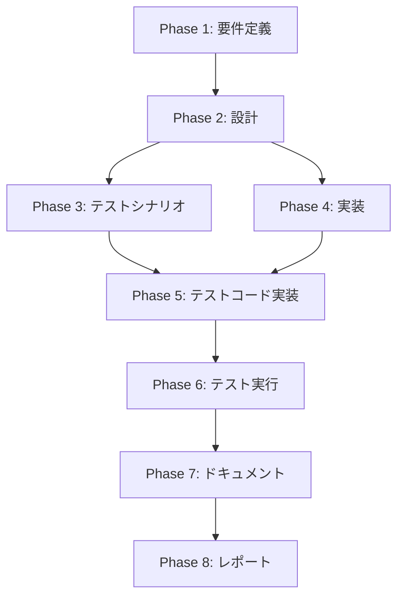

# プロジェクト計画書: Issue #714 — Jenkins に split-issue ジョブを追加

## 1. Issue分析

### 概要

Issue #714 は、既に CLI 実装が完了している `split-issue` コマンド（Issue #715 で実装済み）を Jenkins CI/CD パイプラインから実行可能にするため、Jenkins ジョブ一式（Jenkinsfile・Job DSL・シード設定）を新規作成するタスクである。

既存の `rewrite-issue` ジョブが最も構成が類似しており、これをテンプレートとしてカスタマイズする方針が Issue 本文で明確に指定されている。

### 複雑度: **簡単**

**判定根拠**:
- 新規作成ファイルは 2 ファイル（Jenkinsfile、Job DSL）のみ
- 変更対象ファイルは 2 ファイル（job-config.yaml、README.md）のみ
- 既存の `rewrite-issue` ジョブをテンプレートとした差分変更が中心
- アーキテクチャ変更なし、新規ロジック実装なし
- CLI 側は既に完成しており、Jenkins 側のラッパー作成のみ
- 共通ライブラリ（`shared/common.groovy`）への変更不要

### 見積もり工数: **約3〜4時間**

| 作業項目 | 見積もり |
|---------|---------|
| Jenkinsfile 作成 | 0.5〜1h |
| Job DSL 作成 | 0.5〜1h |
| job-config.yaml 更新 | 0.25h |
| jenkins/README.md 更新 | 0.5h |
| テストシナリオ作成・静的検証 | 0.5〜1h |
| ドキュメント・レポート | 0.5h |

### リスク評価: **低**

- テンプレートとなる `rewrite-issue` ジョブが安定稼働しており、差分が最小限
- CLI 側のインターフェースは固定済み（`src/main.ts` 358-383行で確認）
- 既存のシードジョブの仕組み（10フォルダ自動デプロイ）はそのまま利用可能

---

## 2. 実装戦略判断

### 実装戦略: **CREATE**

**判断根拠**:
- 新規ファイル作成が中心（Jenkinsfile、Job DSL の2ファイルを新規作成）
- 既存ファイルへの変更は設定追記（job-config.yaml へのエントリ追加）とドキュメント更新（README.md）のみ
- 既存コードのリファクタリングや既存機能の拡張ではなく、既存パターンに沿った新規ジョブの追加
- テンプレートの `rewrite-issue` をコピーして `split-issue` 固有の差分を適用する作業

### テスト戦略: **UNIT_ONLY**

**判断根拠**:
- 本 Issue は Jenkins パイプライン定義ファイル（Groovy）と設定ファイル（YAML）の追加が中心
- Jenkins パイプラインの実際の動作テストは Jenkins 環境でのみ実行可能であり、ユニットテストの対象外
- テスト可能な範囲は以下に限定される:
  - Jenkinsfile の Groovy 構文の静的検証（パース可能性）
  - Job DSL の構文チェック
  - job-config.yaml の YAML 構文検証とスキーマ整合性
  - README.md の内容整合性チェック
- CLI 側のテスト（ユニット39件、統合7件）は既に完成しており追加不要
- 統合テストはシードジョブの実運用（Jenkins 環境）で確認する性質のため、コードレベルでは UNIT_ONLY が適切

### テストコード戦略: **CREATE_TEST**

**判断根拠**:
- 新規作成するファイル群（Jenkinsfile、Job DSL）に対する検証テストが必要
- 既存の Jenkins 関連テストは存在しない（CLI 側のテストは既存だが、Jenkins ジョブ定義のテストは別領域）
- テスト内容は主に静的検証（構文チェック、パラメータ整合性、ファイル存在確認）が中心
- 新規テストファイルとして、構成ファイルの整合性チェックスクリプトを作成する可能性がある

---

## 3. 影響範囲分析

### 既存コードへの影響

| カテゴリ | ファイル | 影響内容 |
|---------|---------|---------|
| 設定追記 | `jenkins/jobs/pipeline/_seed/ai-workflow-job-creator/job-config.yaml` | 新規エントリ `ai_workflow_split_issue_job` を追加（既存エントリへの変更なし） |
| ドキュメント更新 | `jenkins/README.md` | ジョブ一覧テーブルに1行追加、フォルダ構成図に1行追加 |

### 新規作成ファイル

| ファイル | 説明 |
|---------|------|
| `jenkins/jobs/pipeline/ai-workflow/split-issue/Jenkinsfile` | split-issue パイプライン定義（`rewrite-issue/Jenkinsfile` ベース） |
| `jenkins/jobs/dsl/ai-workflow/ai_workflow_split_issue_job.groovy` | split-issue Job DSL 定義（`ai_workflow_rewrite_issue_job.groovy` ベース） |

### 依存関係の変更

- **新規依存の追加**: なし
- **既存依存の変更**: なし
- **npm パッケージ変更**: なし
- 新規ファイルは既存の共通ライブラリ `jenkins/shared/common.groovy` に依存するが、共通ライブラリ側の変更は不要

### マイグレーション要否

- **データベーススキーマ変更**: なし
- **設定ファイル変更**: `job-config.yaml` へのエントリ追加のみ（破壊的変更なし）
- **環境変数追加**: なし（既存の環境変数をそのまま利用）

### 既存ジョブへの影響

- 既存の12種類のジョブには一切影響なし
- シードジョブ実行時に新たに `split_issue` ジョブが追加生成されるのみ
- 既存ジョブの再生成時にも影響なし（job-config.yaml の追記は独立エントリ）

---

## 4. タスク分割

### Phase 1: 要件定義 (見積もり: 0.5〜1h)

- [ ] Task 1-1: split-issue CLI コマンドのパラメータ仕様の整理 (0.25h)
  - `src/main.ts` の 358-383行から CLI オプション定義を抽出
  - `src/types/split-issue.ts` から型定義を確認
  - Jenkins パラメータへのマッピング表を作成
- [ ] Task 1-2: rewrite-issue ジョブとの差分要件の明確化 (0.25h)
  - `rewrite-issue` ジョブのパラメータ一覧（18個）を確認
  - `split-issue` 固有パラメータ（`MAX_SPLITS`）の追加仕様を定義
  - パラメータ数の確認（18 + 1 = 19個）
- [ ] Task 1-3: 受け入れ基準の定義 (0.25h)
  - シードジョブ実行後の自動デプロイ（10フォルダ）の動作確認基準
  - dry-run / apply モードの動作確認基準
  - Webhook 通知の動作確認基準

### Phase 2: 設計 (見積もり: 0.5〜1h)

- [x] Task 2-1: Jenkinsfile の設計 (0.25h)
  - `rewrite-issue/Jenkinsfile` との差分ポイントを設計文書に記載
  - `EXECUTION_MODE = 'split_issue'` の設定
  - `--max-splits` パラメータの受け渡し設計
  - ステージ名・ログメッセージ・ビルド説明の変更箇所一覧
- [x] Task 2-2: Job DSL の設計 (0.25h)
  - `ai_workflow_rewrite_issue_job.groovy` との差分ポイントを設計文書に記載
  - `MAX_SPLITS` パラメータの定義（型: `stringParam`、デフォルト: `'10'`、説明文）
  - `scriptPath` の設定（`jenkins/jobs/pipeline/ai-workflow/split-issue/Jenkinsfile`）
  - パラメータ総数（19個）の確認
- [x] Task 2-3: job-config.yaml のエントリ設計 (0.15h)
  - エントリキー: `ai_workflow_split_issue_job`
  - 各フィールド値の設計（name, displayName, dslfile, jenkinsfile, skipJenkinsfileValidation）
- [x] Task 2-4: README.md の更新箇所設計 (0.15h)
  - ジョブ一覧テーブルへの追加行の内容確定
  - フォルダ構成図への追加行の位置と内容確定

### Phase 3: テストシナリオ (見積もり: 0.5h)

- [x] Task 3-1: 静的検証テストシナリオの作成 (0.25h)
  - Jenkinsfile の Groovy 構文チェックシナリオ
  - Job DSL の構文チェックシナリオ
  - job-config.yaml の YAML 構文チェックシナリオ
  - ファイル存在確認テストシナリオ
- [x] Task 3-2: パラメータ整合性テストシナリオの作成 (0.25h)
  - Jenkinsfile と Job DSL 間のパラメータ整合性確認
  - Job DSL と job-config.yaml 間の設定整合性確認
  - CLI 定義（`src/main.ts`）と Jenkinsfile のパラメータ一致確認
  - `rewrite-issue` テンプレートとの差分が意図通りであることの確認

### Phase 4: 実装 (見積もり: 1〜1.5h)

- [x] Task 4-1: Jenkinsfile の作成 (0.5h)
  - `rewrite-issue/Jenkinsfile` をコピーして `split-issue/Jenkinsfile` を作成
  - `EXECUTION_MODE` を `'split_issue'` に変更
  - コメントヘッダーを `split-issue` 用に更新（説明文、パラメータ一覧に `MAX_SPLITS` を追記）
  - `echo` のモード表示を `"Mode: Split Issue"` に変更
  - `Validate Parameters` ステージのビルド説明を `"Split Issue #..."` に変更
  - `Execute Rewrite Issue` ステージ名を `'Execute Split Issue'` に変更
  - CLI コマンドを `node dist/index.js split-issue` に変更
  - `--max-splits` パラメータの追加（`def maxSplitsOption = params.MAX_SPLITS ? "--max-splits ${params.MAX_SPLITS}" : ''`）
  - post セクションのログメッセージを `Split Issue` に変更
- [x] Task 4-2: Job DSL の作成 (0.5h)
  - `ai_workflow_rewrite_issue_job.groovy` をコピーして `ai_workflow_split_issue_job.groovy` を作成
  - ジョブキーを `ai_workflow_split_issue_job` に変更
  - コメントヘッダーを `split-issue` 用に更新
  - `description` を Issue 分割機能の説明に変更
  - `EXECUTION_MODE` の `choiceParam` を `['split_issue']` に変更
  - `APPLY` パラメータの後に `MAX_SPLITS` パラメータを追加（`stringParam('MAX_SPLITS', '10', ...)`)
  - `scriptPath` を `jenkins/jobs/pipeline/ai-workflow/split-issue/Jenkinsfile` に変更
  - `environmentVariables` の `EXECUTION_MODE` を `'split_issue'` に変更
- [x] Task 4-3: job-config.yaml の更新 (0.15h)
  - `ai_workflow_rewrite_issue_job` の直後に `ai_workflow_split_issue_job` エントリを追加
  - 各フィールド: `name: 'split_issue'`, `displayName: 'Split Issue'`, `dslfile`, `jenkinsfile`, `skipJenkinsfileValidation: true`
- [x] Task 4-4: jenkins/README.md の更新 (0.25h)
  - ジョブ一覧テーブルに `split_issue` 行を追加（パラメータ数: 19）
  - ディレクトリ構造に `split-issue/` ディレクトリと `Jenkinsfile` を追加
  - DSL ファイル一覧に `ai_workflow_split_issue_job.groovy` を追加
  - フォルダ構成図に `split_issue` を追加
  - ジョブ種類数を「12種類 × 10フォルダ = 120ジョブ」から「13種類 × 10フォルダ = 130ジョブ」に更新

### Phase 5: テストコード実装 (見積もり: 0.5h)

- [x] Task 5-1: ファイル存在・構文検証テストの作成 (0.25h)
  - 新規作成ファイルの存在確認テスト
  - job-config.yaml の YAML パース確認テスト
  - `split_issue` エントリの必須フィールド存在確認テスト
- [x] Task 5-2: パラメータ整合性テストの作成 (0.25h)
  - Jenkinsfile 内の `EXECUTION_MODE` が `'split_issue'` であることの確認
  - Job DSL 内の `scriptPath` が正しい Jenkinsfile パスを指していることの確認
  - `MAX_SPLITS` パラメータが Jenkinsfile と Job DSL の両方に存在することの確認

### Phase 6: テスト実行 (見積もり: 0.25h)

- [ ] Task 6-1: テストスイートの実行と結果確認 (0.25h)
  - `npm run validate` の実行
  - テスト結果の確認と問題がある場合の修正

### Phase 7: ドキュメント (見積もり: 0.25h)

- [ ] Task 7-1: 変更内容のドキュメント整備 (0.25h)
  - jenkins/README.md の更新内容が正確であることの最終確認
  - 新規ファイルのコメントヘッダーが適切であることの確認

### Phase 8: レポート (見積もり: 0.25h)

- [ ] Task 8-1: エグゼクティブサマリーの作成 (0.15h)
  - 変更概要、影響範囲、テスト結果のサマリー
- [ ] Task 8-2: マージチェックリストの作成 (0.1h)
  - マージ前の確認項目リスト

---

## 5. 依存関係

**補足**:
- Phase 3（テストシナリオ）と Phase 4（実装）は Phase 2 完了後に並行着手可能
- Phase 5（テストコード実装）は Phase 3 と Phase 4 の両方が完了した後に開始
- Phase 4 の各タスク（4-1〜4-4）は独立しており並行実装可能

### タスク間の依存関係詳細

| タスク | 依存先 | 理由 |
|-------|--------|------|
| Task 4-1 (Jenkinsfile) | Task 2-1 | Jenkinsfile の設計が確定している必要がある |
| Task 4-2 (Job DSL) | Task 2-2 | Job DSL の設計が確定している必要がある |
| Task 4-3 (job-config.yaml) | Task 2-3, Task 4-2 | DSL ファイル名が確定している必要がある |
| Task 4-4 (README.md) | Task 4-1, 4-2, 4-3 | 全ファイルが確定した後に正確な情報を記載 |
| Task 5-1, 5-2 | Task 4-1, 4-2, 4-3 | テスト対象ファイルが存在する必要がある |

---

## 6. リスクと軽減策

### リスク1: Jenkinsfile の Groovy 構文エラー
- **影響度**: 中
- **確率**: 低
- **軽減策**: `rewrite-issue/Jenkinsfile` を忠実にテンプレートとし、差分を最小限に抑える。変更箇所を明確にリスト化し、各変更点を個別に検証する。

### リスク2: MAX_SPLITS パラメータの受け渡し不備
- **影響度**: 中
- **確率**: 低
- **軽減策**: CLI 定義（`src/main.ts` 373行: `.option('--max-splits <number>', ...)`)と Jenkinsfile でのパラメータ展開を正確に対応させる。`params.MAX_SPLITS` が空文字の場合のデフォルト動作（CLI 側のデフォルト `'10'` にフォールバック）を考慮する。

### リスク3: Job DSL の scriptPath 設定ミス
- **影響度**: 高
- **確率**: 低
- **軽減策**: `scriptPath` を `'jenkins/jobs/pipeline/ai-workflow/split-issue/Jenkinsfile'` に正確に設定。既存の `rewrite-issue` ジョブの `scriptPath` パターンと一致させる。テストで整合性を検証する。

### リスク4: job-config.yaml の YAML 構文エラー
- **影響度**: 高（シードジョブ全体が失敗する可能性）
- **確率**: 低
- **軽減策**: YAML パーサーによる構文検証テストを実施。既存エントリのインデント・フォーマットを厳密に踏襲する。

### リスク5: README.md の情報不整合
- **影響度**: 低
- **確率**: 低
- **軽減策**: パラメータ数（19個）を Job DSL と突合確認。フォルダ構成図のフォーマットを既存行と一致させる。

---

## 7. 品質ゲート

### Phase 1: 要件定義
- [ ] split-issue CLI のパラメータ仕様が完全に整理されている
- [ ] rewrite-issue との差分が明確にリスト化されている
- [ ] Jenkins パラメータへのマッピング表が作成されている
- [ ] 受け入れ基準が具体的に定義されている

### Phase 2: 設計
- [x] 実装戦略の判断根拠が明記されている（CREATE）
- [x] テスト戦略の判断根拠が明記されている（UNIT_ONLY）
- [x] テストコード戦略の判断根拠が明記されている（CREATE_TEST）
- [x] Jenkinsfile の差分ポイントが網羅的にリスト化されている
- [x] Job DSL の差分ポイントが網羅的にリスト化されている
- [x] `MAX_SPLITS` パラメータの仕様が明確に定義されている

### Phase 3: テストシナリオ
- [x] 静的検証（構文チェック）のテストシナリオが定義されている
- [x] パラメータ整合性のテストシナリオが定義されている
- [x] rewrite-issue との差分が意図通りであることを確認するシナリオが含まれている

### Phase 4: 実装
- [ ] Jenkinsfile が正しい Groovy 構文で記述されている
- [ ] Job DSL が正しい Groovy 構文で記述されている
- [ ] job-config.yaml が正しい YAML 構文で記述されている
- [ ] `EXECUTION_MODE = 'split_issue'` が Jenkinsfile と Job DSL の両方で設定されている
- [ ] `--max-splits` パラメータが CLI に正しく渡される
- [ ] `--apply` / `--dry-run` フラグの排他制御が rewrite-issue と同一ロジックである
- [ ] README.md の更新内容が正確である

### Phase 5: テストコード実装
- [ ] ファイル存在確認テストが実装されている
- [ ] YAML 構文検証テストが実装されている
- [ ] パラメータ整合性テストが実装されている

### Phase 6: テスト実行
- [ ] `npm run validate` が成功する
- [ ] 新規テストが全件パスする
- [ ] 既存テストにリグレッションがない

### Phase 7: ドキュメント
- [ ] jenkins/README.md のジョブ一覧が最新状態である
- [ ] ディレクトリ構造図が実際のファイル構成と一致している
- [ ] 新規ファイルに適切なコメントヘッダーが記載されている

---

## 補足: 主要な変更差分サマリー

### rewrite-issue → split-issue 変更マッピング

| 項目 | rewrite-issue | split-issue |
|------|--------------|-------------|
| EXECUTION_MODE | `'rewrite_issue'` | `'split_issue'` |
| CLI コマンド | `rewrite-issue` | `split-issue` |
| ステージ名 | `'Execute Rewrite Issue'` | `'Execute Split Issue'` |
| ビルド説明 | `"Rewrite Issue #..."` | `"Split Issue #..."` |
| ポスト成功メッセージ | `"Rewrite Issue Success"` | `"Split Issue Success"` |
| ポスト失敗メッセージ | `"Rewrite Issue Failure"` | `"Split Issue Failure"` |
| 固有パラメータ | なし | `MAX_SPLITS`（`stringParam`, デフォルト `'10'`） |
| Job DSL キー | `ai_workflow_rewrite_issue_job` | `ai_workflow_split_issue_job` |
| scriptPath | `rewrite-issue/Jenkinsfile` | `split-issue/Jenkinsfile` |
| パラメータ数 | 18 | 19 |
| Job DSL 説明 | Issue本文再設計 | 複雑なIssueを機能単位で分割 |
| Job DSL ファイル名 | `ai_workflow_rewrite_issue_job.groovy` | `ai_workflow_split_issue_job.groovy` |
| job-config.yaml エントリ | `ai_workflow_rewrite_issue_job` | `ai_workflow_split_issue_job` |
