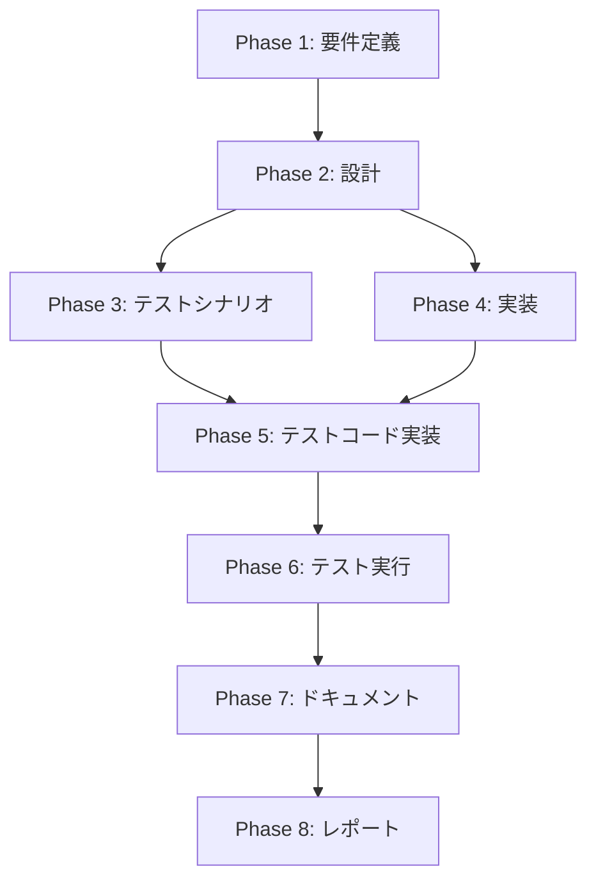

# Codex Agent 実行ログ

開始日時: 2026/2/20 0:43:31

---

## Turn 1: スレッド開始

**Thread ID**: `[REDACTED_TOKEN]`

## Turn 2: ツール実行

**種別**: reasoning
**ステータス**: completed

## Turn 3: ツール実行

**種別**: コマンド実行
**コマンド**: `/bin/bash -lc pwd`
**ステータス**: completed (exit_code=0)

```text
/tmp/ai-workflow-repos-25-a2add124/ai-workflow-agent
```

## Turn 4: ツール実行

**種別**: reasoning
**ステータス**: completed

## Turn 5: ツール実行

**種別**: コマンド実行
**コマンド**: `/bin/bash -lc ls`
**ステータス**: completed (exit_code=0)

```text
AGENT_TEAMS.md
CHANGELOG.md
CLAUDE.md
[REDACTED_TOKEN].md
[REDACTED_TOKEN].md
[REDACTED_TOKEN].md
[REDACTED_TOKEN].md
CODEBASE_SUMMARY.md
Dockerfile
Jenkinsfile
LICENSE
PROGRESS.md
README.md
TROUBLESHOOTING.md
__mocks__
docs
examples
jenkins
jest.config.cjs
metadata.json.template
package-lock.json
package.json
scripts
src
tests
tmp
tsconfig.json
tsconfig.test.json
```

## Turn 6: ツール実行

**種別**: reasoning
**ステータス**: completed

## Turn 7: ツール実行

**種別**: コマンド実行
**コマンド**: `/bin/bash -lc 'cat AGENT_TEAMS.md'`
**ステータス**: completed (exit_code=0)

```text
# Agent Teams 実践ガイド

このドキュメントは、ai-workflow-agent プロジェクトで Claude Code の Agent Teams を使用する際の具体的な手順とベストプラクティスを提供します。

**基本概念と組織論的背景は [CLAUDE.md § Agent Teams 運用ガイドライン](./CLAUDE.md#agent-teams-運用ガイドライン) を参照してください。**

---

## 目次

- [セットアップ](#セットアップ)
- [基本的な使い方](#基本的な使い方)
- [具体的なタスク例](#具体的なタスク例)
- [検証ワークフロー](#検証ワークフロー)
- [トラブルシューティング](#トラブルシューティング)
- [FAQ](#faq)

---

## セットアップ

### 環境変数の設定

Agent Teams を使用する前に、以下の環境変数が設定されていることを確認してください。

```bash
# 必須
export GITHUB_TOKEN="ghp_xxxxxxxxxxxx"  # GitHub Personal Access Token

# エージェント用（少なくとも1つ必要）
export CODEX_API_KEY="sk-xxxxxxxxxxxx"           # Codex エージェント用
export [REDACTED_TOKEN]="oauth_xxxx"      # Claude Code エージェント用（優先）
export CLAUDE_CODE_API_KEY="sk-xxxxxxxxxxxx"    # Claude Code エージェント用（フォールバック）

# オプション
export REPOS_ROOT="/path/to/repos"               # マルチリポジトリ対応
export LOG_LEVEL="debug"                         # ログレベル（開発時）
export LANGUAGE="ja"                             # プロンプト言語（ja/en）
```

**詳細は [docs/ENVIRONMENT.md](./docs/ENVIRONMENT.md) を参照してください。**

### Agent Teams の有効化

Claude Code で Agent Teams を有効化します。

```bash
# 環境変数で有効化
export [REDACTED_TOKEN]=1
```

または `~/.claude/settings.json` で設定：

```json
{
  "experimental": {
    "agentTeams": true
  }
}
```

### 依存関係のインストール

```bash
npm install
npm run build
```

---

## 基本的な使い方

### チームの起動

Claude Code のセッションで、以下のようにチームを起動します。

```
このプロジェクトの planning フェーズのプロンプトを改善したいです。
Agent Teams を使って以下のタスクに分けて並列で作業してください：

1. 日本語プロンプトの改善（src/prompts/planning/ja/*.txt）
2. 英語プロンプトの改善（src/prompts/planning/en/*.txt）
3. プロンプトの検証ツールの実装

各エージェントは作業完了後に npm run validate を実行して検証してください。
```

### 操作方法

| 操作 | キー |
|---|---|
| チームメイト間の切り替え | Shift+Up/Down |
| セッションの表示 | Enter |
| 作業の中断 | Escape |

---

## 具体的なタスク例

### タスク例1：複数フェーズのプロンプト改善

**目的**: 各フェーズのプロンプトを並列で改善する

**チーム構成**:
- Agent 1: planning フェーズのプロンプト改善
- Agent 2: implementation フェーズのプロンプト改善
- Agent 3: testing フェーズのプロンプト改善
- Agent 4: documentation フェーズのプロンプト改善

**指示例**:
```
以下のフェーズのプロンプトを改善してください。Agent Teams を使って並列で作業してください：

1. planning フェーズ（src/prompts/planning/）
2. implementation フェーズ（src/prompts/implementation/）
3. testing フェーズ（src/prompts/testing/）
4. documentation フェーズ（src/prompts/documentation/）

各エージェントは以下を実施してください：
- プロンプトの明確性を向上させる
- 多言語対応（ja/en）を確認する
- 作業完了後に npm run validate を実行する
```

### タスク例2：コードレビューと品質監査

**目的**: 多角的な視点でコードベースをレビューする

**チーム構成**:
- Agent 1: セキュリティレビュー（ReDoS、認証、エラーハンドリング）
- Agent 2: パフォーマンスレビュー（ボトルネック、最適化ポイント）
- Agent 3: 可読性レビュー（コメント、命名規則、ドキュメント）
- Agent 4: テストカバレッジ分析（未テスト箇所の特定）

**指示例**:
```
コードベースの品質監査を実施してください。Agent Teams を使って以下の観点で並列レビューしてください：

1. セキュリティ監査（ReDoS、認証、エラーハンドリング規約の遵守）
2. パフォーマンス分析（ボトルネック、最適化ポイント）
3. 可読性評価（コメント、命名規則、ドキュメント整合性）
4. テストカバレッジ分析（未テスト箇所の特定と追加テストの提案）

各エージェントは発見事項をレポートにまとめてください。
```

### タスク例3：ドキュメント並列更新

**目的**: 複数のドキュメントを同時に最新化する

**チーム構成**:
- Agent 1: README.md の更新
- Agent 2: docs/CLI_REFERENCE.md の更新
- Agent 3: docs/ARCHITECTURE.md の更新
- Agent 4: docs/DEVELOPMENT.md の更新

**指示例**:
```
プロジェクトドキュメントを最新の実装に合わせて更新してください。Agent Teams を使って並列で作業してください：

1. README.md - 最新の機能とクイックスタートを反映
2. docs/CLI_REFERENCE.md - 新しいコマンドオプションを追加
3. docs/ARCHITECTURE.md - 最新のモジュール構成を反映
4. docs/DEVELOPMENT.md - テスト手順とベストプラクティスを更新

各エージェントは作業完了後に npm run build で確認してください。
```

### タスク例4：独立したバグ修正

**目的**: 複数の独立したバグを並列で修正する

**チーム構成**:
- Agent 1: Issue #123 の修正
- Agent 2: Issue #124 の修正
- Agent 3: Issue #125 の修正

**指示例**:
```
以下のバグを並列で修正してください。Agent Teams を使用します：

1. Issue #123: メタデータの読み込みエラー
2. Issue #124: プロンプトローダーのフォールバック不具合
3. Issue #125: Git コミットメッセージの文字化け

各エージェントは以下を実施してください：
- バグの原因を調査
- 修正を実装
- テストケースを追加
- npm run validate で検証
```

---

## 検証ワークフロー

Agent Teams で作業した後は、必ず以下のワークフローで検証してください。

### 統合検証コマンド

```bash
# 推奨：すべての検証を一括実行
npm run validate
```

これは以下のコマンドを順次実行します：

1. `npm run lint` - TypeScript 型チェック
2. `npm test` - ユニット・統合テスト
3. `npm run build` - ビルド確認

### 個別検証コマンド

必要に応じて個別に実行することもできます。

```bash
# TypeScript 型チェック
npm run lint

# ユニットテストのみ
npm run test:unit

# 統合テストのみ
npm run test:integration

# カバレッジレポート付き
npm r
... (truncated)
```

## Turn 8: ツール実行

**種別**: reasoning
**ステータス**: completed

## Turn 9: ツール実行

**種別**: コマンド実行
**コマンド**: `/bin/bash -lc 'ls .ai-workflow'`
**ステータス**: completed (exit_code=0)

```text
issue-10
issue-105
issue-7
issue-714
```

## Turn 10: ツール実行

**種別**: reasoning
**ステータス**: completed

## Turn 11: ツール実行

**種別**: コマンド実行
**コマンド**: `/bin/bash -lc 'cat .ai-workflow/issue-714/00_planning/output/planning.md'`
**ステータス**: completed (exit_code=0)

```text
# プロジェクト計画書: Issue #714 — Jenkins に split-issue ジョブを追加

## 1. Issue分析

### 概要

Issue #714 は、既に CLI 実装が完了している `split-issue` コマンド（Issue #715 で実装済み）を Jenkins CI/CD パイプラインから実行可能にするため、Jenkins ジョブ一式（Jenkinsfile・Job DSL・シード設定）を新規作成するタスクである。

既存の `rewrite-issue` ジョブが最も構成が類似しており、これをテンプレートとしてカスタマイズする方針が Issue 本文で明確に指定されている。

### 複雑度: **簡単**

**判定根拠**:
- 新規作成ファイルは 2 ファイル（Jenkinsfile、Job DSL）のみ
- 変更対象ファイルは 2 ファイル（job-config.yaml、README.md）のみ
- 既存の `rewrite-issue` ジョブをテンプレートとした差分変更が中心
- アーキテクチャ変更なし、新規ロジック実装なし
- CLI 側は既に完成しており、Jenkins 側のラッパー作成のみ
- 共通ライブラリ（`shared/common.groovy`）への変更不要

### 見積もり工数: **約3〜4時間**

| 作業項目 | 見積もり |
|---------|---------|
| Jenkinsfile 作成 | 0.5〜1h |
| Job DSL 作成 | 0.5〜1h |
| job-config.yaml 更新 | 0.25h |
| jenkins/README.md 更新 | 0.5h |
| テストシナリオ作成・静的検証 | 0.5〜1h |
| ドキュメント・レポート | 0.5h |

### リスク評価: **低**

- テンプレートとなる `rewrite-issue` ジョブが安定稼働しており、差分が最小限
- CLI 側のインターフェースは固定済み（`src/main.ts` 358-383行で確認）
- 既存のシードジョブの仕組み（10フォルダ自動デプロイ）はそのまま利用可能

---

## 2. 実装戦略判断

### 実装戦略: **CREATE**

**判断根拠**:
- 新規ファイル作成が中心（Jenkinsfile、Job DSL の2ファイルを新規作成）
- 既存ファイルへの変更は設定追記（job-config.yaml へのエントリ追加）とドキュメント更新（README.md）のみ
- 既存コードのリファクタリングや既存機能の拡張ではなく、既存パターンに沿った新規ジョブの追加
- テンプレートの `rewrite-issue` をコピーして `split-issue` 固有の差分を適用する作業

### テスト戦略: **UNIT_ONLY**

**判断根拠**:
- 本 Issue は Jenkins パイプライン定義ファイル（Groovy）と設定ファイル（YAML）の追加が中心
- Jenkins パイプラインの実際の動作テストは Jenkins 環境でのみ実行可能であり、ユニットテストの対象外
- テスト可能な範囲は以下に限定される:
  - Jenkinsfile の Groovy 構文の静的検証（パース可能性）
  - Job DSL の構文チェック
  - job-config.yaml の YAML 構文検証とスキーマ整合性
  - README.md の内容整合性チェック
- CLI 側のテスト（ユニット39件、統合7件）は既に完成しており追加不要
- 統合テストはシードジョブの実運用（Jenkins 環境）で確認する性質のため、コードレベルでは UNIT_ONLY が適切

### テストコード戦略: **CREATE_TEST**

**判断根拠**:
- 新規作成するファイル群（Jenkinsfile、Job DSL）に対する検証テストが必要
- 既存の Jenkins 関連テストは存在しない（CLI 側のテストは既存だが、Jenkins ジョブ定義のテストは別領域）
- テスト内容は主に静的検証（構文チェック、パラメータ整合性、ファイル存在確認）が中心
- 新規テストファイルとして、構成ファイルの整合性チェックスクリプトを作成する可能性がある

---

## 3. 影響範囲分析

### 既存コードへの影響

| カテゴリ | ファイル | 影響内容 |
|---------|---------|---------|
| 設定追記 | `jenkins/jobs/pipeline/_seed/ai-workflow-job-creator/job-config.yaml` | 新規エントリ `[REDACTED_TOKEN]` を追加（既存エントリへの変更なし） |
| ドキュメント更新 | `jenkins/README.md` | ジョブ一覧テーブルに1行追加、フォルダ構成図に1行追加 |

### 新規作成ファイル

| ファイル | 説明 |
|---------|------|
| `jenkins/jobs/pipeline/ai-workflow/split-issue/Jenkinsfile` | split-issue パイプライン定義（`rewrite-issue/Jenkinsfile` ベース） |
| `jenkins/jobs/dsl/ai-workflow/ai_workflow_split_issue_job.groovy` | split-issue Job DSL 定義（`[REDACTED_TOKEN].groovy` ベース） |

### 依存関係の変更

- **新規依存の追加**: なし
- **既存依存の変更**: なし
- **npm パッケージ変更**: なし
- 新規ファイルは既存の共通ライブラリ `jenkins/shared/common.groovy` に依存するが、共通ライブラリ側の変更は不要

### マイグレーション要否

- **データベーススキーマ変更**: なし
- **設定ファイル変更**: `job-config.yaml` へのエントリ追加のみ（破壊的変更なし）
- **環境変数追加**: なし（既存の環境変数をそのまま利用）

### 既存ジョブへの影響

- 既存の12種類のジョブには一切影響なし
- シードジョブ実行時に新たに `split_issue` ジョブが追加生成されるのみ
- 既存ジョブの再生成時にも影響なし（job-config.yaml の追記は独立エントリ）

---

## 4. タスク分割

### Phase 1: 要件定義 (見積もり: 0.5〜1h)

- [ ] Task 1-1: split-issue CLI コマンドのパラメータ仕様の整理 (0.25h)
  - `src/main.ts` の 358-383行から CLI オプション定義を抽出
  - `src/types/split-issue.ts` から型定義を確認
  - Jenkins パラメータへのマッピング表を作成
- [ ] Task 1-2: rewrite-issue ジョブとの差分要件の明確化 (0.25h)
  - `rewrite-issue` ジョブのパラメータ一覧（18個）を確認
  - `split-issue` 固有パラメータ（`MAX_SPLITS`）の追加仕様を定義
  - パラメータ数の確認（18 + 1 = 19個）
- [ ] Task 1-3: 受け入れ基準の定義 (0.25h)
  - シードジョブ実行後の自動デプロイ（10フォルダ）の動作確認基準
  - dry-run / apply モードの動作確認基準
  - Webhook 通知の動作確認基準

### Phase 2: 設計 (見積もり: 0.5〜1h)

- [x] Task 2-1: Jenkinsfile の設計 (0.25h)
  - `rewrite-issue/Jenkinsfile` との差分ポイントを設計文書に記載
  - `EXECUTION_MODE = 'split_issue'` の設定
  - `--max-splits` パラメータの受け渡し設計
  - ステージ名・ログメッセージ・ビルド説明の変更箇所一覧
- [x] Task 2-2: Job DSL の設計 (0.25h)
  - `[REDACTED_TOKEN].groovy` との差分ポイントを設計文書に記載
  - `MAX_SPLITS` パラメータの定義（型: `stringParam`、デフォルト: `'10'`、説明文）
  - `scriptPath` の設定（`jenkins/jobs/pipeline/ai-workflow/split-issue/Jenkinsfile`）
  - パラメータ総数（19個）の確認
- [x] Task 2-3: job-config.yaml のエントリ設計 (0.15h)
  - エントリキー: `[REDACTED_TOKEN]`
  - 各フィールド値の設計（name, di
... (truncated)
```

## Turn 12: ツール実行

**種別**: reasoning
**ステータス**: completed

## Turn 13: ツール実行

**種別**: コマンド実行
**コマンド**: `/bin/bash -lc 'cat .ai-workflow/issue-714/04_implementation/output/implementation.md'`
**ステータス**: completed (exit_code=0)

```text
# 実装完了レポート

## 変更ファイル一覧

| ファイル | 変更種別 | 概要 |
|---------|---------|------|
| `jenkins/jobs/pipeline/ai-workflow/split-issue/Jenkinsfile` | 新規 | split-issue 用パイプライン定義を追加（rewrite-issue をベースに差分適用） |
| `jenkins/jobs/dsl/ai-workflow/ai_workflow_split_issue_job.groovy` | 新規 | split-issue 用 Job DSL を追加（MAX_SPLITS を含む19パラメータ定義） |
| `jenkins/jobs/pipeline/_seed/ai-workflow-job-creator/job-config.yaml` | 修正 | split-issue ジョブエントリを追加 |
| `jenkins/README.md` | 修正 | ジョブ一覧・ディレクトリ構成・ジョブ数の更新 |

## 主要な変更点

- rewrite-issue をテンプレートに split-issue の Jenkinsfile を新規作成し、EXECUTION_MODE やステージ名、CLI コマンドを split-issue 用に更新しました。
- MAX_SPLITS パラメータを Jenkinsfile/Job DSL の両方に追加し、CLI へ `--max-splits` を受け渡す構成にしました。
- シード設定に split-issue ジョブのエントリを追加し、Jenkinsfile/DSL パスの整合性を確保しました。
- jenkins/README.md に split-issue ジョブ情報と構成図の追記、ジョブ数の更新を反映しました。

## テスト実施状況
- ビルド: ❌ 未実施
- リント: ❌ 未実施
- 基本動作確認: 未実施（Jenkins 環境での実行が必要）
```

## Turn 14: ツール実行

**種別**: reasoning
**ステータス**: completed

## Turn 15: ツール実行

**種別**: コマンド実行
**コマンド**: `/bin/bash -lc "sed -n '1,200p' jenkins/jobs/pipeline/ai-workflow/split-issue/Jenkinsfile"`
**ステータス**: completed (exit_code=0)

```text
/**
 * AI Workflow - Split Issue Mode
 *
 * 複雑なGitHub Issueを機能単位の子Issueに分割するJenkinsfile。
 * auto-issueパイプラインをベースに、split-issueコマンド用にカスタマイズ。
 *
 * パラメータ（Job DSLで定義）:
 * - ISSUE_NUMBER: 対象Issue番号（必須）
 * - GITHUB_REPOSITORY: owner/repo形式（必須）
 * - LANGUAGE: 出力言語（ja/en、デフォルト: ja）
 * - AGENT_MODE: エージェントモード（auto/codex/claude、デフォルト: auto）
 * - APPLY: 子Issue作成フラグ（true/false、デフォルト: true）
 * - DRY_RUN: 分割プレビューモード（true/false、デフォルト: false）
 * - MAX_SPLITS: 分割Issue数の上限（1-20の整数、デフォルト: 10）
 * - GITHUB_TOKEN: GitHub Personal Access Token（必須）
 * - 認証情報（Codex/Claude系、auto-issueと同様）
 *
 * 注意:
 * - EXECUTION_MODE は内部的に 'split_issue' に固定
 * - APPLYとDRY_RUNが両方trueの場合、APPLYが優先
 */

def common

pipeline {
    agent {
        dockerfile {
            label 'ec2-fleet-micro'
            dir '.'
            filename 'Dockerfile'
            args "-v \${WORKSPACE}:/workspace -w /workspace -e [REDACTED_TOKEN]=1"
        }
    }

    options {
        timestamps()
        ansiColor('xterm')
    }

    environment {
        [REDACTED_TOKEN] = '1'
        WORKFLOW_DIR = '.'
        WORKFLOW_VERSION = '0.2.0'
        // ワークフロー言語設定
        [REDACTED_TOKEN] = "${params.LANGUAGE ?: 'ja'}"
        EXECUTION_MODE = 'split_issue'
        CODEX_HOME = ''
        LOG_NO_COLOR = 'true'

        [REDACTED_TOKEN] = "${params.[REDACTED_TOKEN] ?: 'AI Workflow Bot'}"
        [REDACTED_TOKEN] = "${params.[REDACTED_TOKEN] ?: '[REDACTED_EMAIL]'}"

        AWS_ACCESS_KEY_ID = "${params.AWS_ACCESS_KEY_ID ?: ''}"
        [REDACTED_TOKEN] = "${params.[REDACTED_TOKEN] ?: ''}"
        AWS_SESSION_TOKEN = "${params.AWS_SESSION_TOKEN ?: ''}"

        GITHUB_TOKEN = "${params.GITHUB_TOKEN}"
        GITHUB_REPOSITORY = "${params.GITHUB_REPOSITORY ?: 'tielec/ai-workflow-agent'}"

        CODEX_API_KEY = "${params.CODEX_API_KEY ?: ''}"
        OPENAI_API_KEY = "${params.OPENAI_API_KEY ?: ''}"

        [REDACTED_TOKEN] = "${params.[REDACTED_TOKEN] ?: ''}"
        CLAUDE_CODE_API_KEY = "${params.CLAUDE_CODE_API_KEY ?: ''}"
        ANTHROPIC_API_KEY = "${params.ANTHROPIC_API_KEY ?: ''}"
    }

    stages {
        stage('Load Common Library') {
            steps {
                script {
                    echo "========================================="
                    echo "AI Workflow Orchestrator v${env.WORKFLOW_VERSION}"
                    echo "Mode: Split Issue"
                    echo "========================================="

                    common = load 'jenkins/shared/common.groovy'
                    echo "Common library loaded successfully"

                    common.sendWebhook([
                        webhookUrl: params.WEBHOOK_URL,
                        webhookToken: params.WEBHOOK_TOKEN,
                        jobId: params.JOB_ID,
                        status: 'running',
                        buildUrl: env.BUILD_URL,
                        branchName: env.BRANCH_NAME ?: ''
                    ])
                }
            }
        }

        stage('Prepare Codex auth.json') {
            steps {
                script {
                    common.[REDACTED_TOKEN]()
                }
            }
        }

        stage('Prepare Agent Credentials') {
            steps {
                script {
                    common.[REDACTED_TOKEN]()
                }
            }
        }

        stage('Validate Parameters') {
            steps {
                script {
                    echo "========================================="
                    echo "Stage: Validate Parameters"
                    echo "========================================="

                    if (!params.ISSUE_NUMBER?.trim()) {
                        error("ISSUE_NUMBER parameter is required")
                    }

                    if (!params.ISSUE_NUMBER.isInteger()) {
                        error("ISSUE_NUMBER must be a number: ${params.ISSUE_NUMBER}")
... (truncated)
```

## Turn 16: ツール実行

**種別**: reasoning
**ステータス**: completed

## Turn 17: ツール実行

**種別**: コマンド実行
**コマンド**: `/bin/bash -lc "sed -n '200,400p' jenkins/jobs/pipeline/ai-workflow/split-issue/Jenkinsfile"`
**ステータス**: completed (exit_code=0)

```text
${dryRunFlag} \\
                                ${maxSplitsOption}
                        """
                    }
                }
            }
        }
    }

    post {
        always {
            script {
                echo "========================================="
                echo "Post Processing"
                echo "========================================="

                def applyLabel = params.APPLY ? ' [APPLY]' : ''
                def dryRunLabel = (!params.APPLY && params.DRY_RUN) ? ' [DRY RUN]' : ''
                currentBuild.description = "Split Issue #${env.ISSUE_NUMBER}${applyLabel}${dryRunLabel} | ${env.REPO_OWNER}/${env.REPO_NAME}"

                if (env.REPOS_ROOT) {
                    sh """
                        rm -rf ${env.REPOS_ROOT}
                    """
                    echo "REPOS_ROOT cleaned up: ${env.REPOS_ROOT}"
                }

                if (env.CODEX_HOME?.trim()) {
                    sh """
                        rm -rf ${env.CODEX_HOME}
                    """
                    echo "CODEX_HOME cleaned up: ${env.CODEX_HOME}"
                }

                cleanWs()
                echo "Workspace cleaned up"
            }
        }

        success {
            script {
                echo "========================================="
                echo "✅ AI Workflow - Split Issue Success"
                echo "========================================="
                echo "Repository: ${params.GITHUB_REPOSITORY}"
                echo "Issue Number: ${params.ISSUE_NUMBER}"
                def dryRunNote = (!params.APPLY && params.DRY_RUN) ? ' (dry run mode)' : ''
                def applyNote = params.APPLY ? ' (applied)' : ''
                echo "Result: Split issue completed${applyNote}${dryRunNote}"

                common.sendWebhook([
                    webhookUrl: params.WEBHOOK_URL,
                    webhookToken: params.WEBHOOK_TOKEN,
                    jobId: params.JOB_ID,
                    status: 'success',
                    buildUrl: env.BUILD_URL,
                    branchName: env.BRANCH_NAME ?: '',
                    finishedAt: new Date().format("yyyy-MM-dd'T'HH:mm:ss.SSS'Z'", TimeZone.getTimeZone('UTC')),
                    logsUrl: "${env.BUILD_URL}console"
                ])
            }
        }

        failure {
            script {
                echo "========================================="
                echo "❌ AI Workflow - Split Issue Failure"
                echo "========================================="
                echo "Repository: ${params.GITHUB_REPOSITORY}"
                echo "Issue Number: ${params.ISSUE_NUMBER}"
                echo "Please check the logs"

                def errorMessage = currentBuild.result ?: 'Build failed'
                common.sendWebhook([
                    webhookUrl: params.WEBHOOK_URL,
                    webhookToken: params.WEBHOOK_TOKEN,
                    jobId: params.JOB_ID,
                    status: 'failed',
                    errorMessage: errorMessage,
                    buildUrl: env.BUILD_URL,
                    finishedAt: new Date().format("yyyy-MM-dd'T'HH:mm:ss.SSS'Z'", TimeZone.getTimeZone('UTC')),
                    logsUrl: "${env.BUILD_URL}console"
                ])
            }
        }
    }
}
```

## Turn 18: ツール実行

**種別**: reasoning
**ステータス**: completed

## Turn 19: ツール実行

**種別**: コマンド実行
**コマンド**: `/bin/bash -lc "sed -n '1,200p' jenkins/jobs/dsl/ai-workflow/ai_workflow_split_issue_job.groovy"`
**ステータス**: completed (exit_code=0)

```text
/**
 * AI Workflow Split Issue Job DSL
 *
 * 複雑なIssueを機能単位の子Issueに分割するジョブ
 * EXECUTION_MODE: split_issue（固定値、パラメータとして表示しない）
 * パラメータはJob DSL内で定義
 */

// 汎用フォルダ定義（Develop 1 + Stable 9）
def genericFolders = [
    [name: 'develop', displayName: 'AI Workflow Executor - Develop', branch: '*/develop']
] + (1..9).collect { i ->
    [name: "stable-${i}", displayName: "AI Workflow Executor - Stable ${i}", branch: '*/main']
}

// 共通設定を取得
def jenkinsPipelineRepo = commonSettings['[REDACTED_TOKEN]']
def jobKey = '[REDACTED_TOKEN]'
def jobConfig = jenkinsJobsConfig[jobKey]

// ジョブ作成クロージャ
def createJob = { String jobName, String descriptionHeader, String gitBranch ->
    pipelineJob(jobName) {
        displayName(jobConfig.displayName)

        description("""\
            |# AI Workflow - Split Issue
            |${descriptionHeader}
            |
            |## 概要
            |複雑なGitHub Issueを機能単位の子Issueに分割します。
            |
            |## 機能
            |- Issue番号を指定して対象Issueを分割
            |- dry-run モードで分割プレビューのみ表示
            |- apply モードで子Issueを作成
            |- 分割数上限を指定可能（デフォルト: 10）
            |
            |## 注意事項
            |- EXECUTION_MODEは内部的に'split_issue'に固定されます
            |- APPLYとDRY_RUNが両方trueの場合、APPLYが優先されます
            |""".stripMargin())

        // パラメータ定義
        parameters {
            // ========================================
            // 実行モード（固定値）
            // ========================================
            choiceParam('EXECUTION_MODE', ['split_issue'], '''
実行モード（固定値 - 変更不可）
            '''.stripIndent().trim())

            // ========================================
            // 基本設定
            // ========================================
            stringParam('ISSUE_NUMBER', '', '''
対象Issue番号（必須）
            '''.stripIndent().trim())

            stringParam('GITHUB_REPOSITORY', '', '''
GitHub リポジトリ（owner/repo）（必須）

例: tielec/ai-workflow-agent
            '''.stripIndent().trim())

            choiceParam('AGENT_MODE', ['auto', 'codex', 'claude'], '''
エージェントの実行モード
- auto: Codex APIキーがあれば Codex を優先し、なければ Claude Code を使用
- codex: Codex のみを使用（CODEX_API_KEY または OPENAI_API_KEY が必要）
- claude: Claude Code のみを使用（credentials.json が必要）
            '''.stripIndent().trim())

            choiceParam('LANGUAGE', ['ja', 'en'], '''
ワークフロー言語
- ja: 日本語（デフォルト）
- en: English
            '''.stripIndent().trim())

            // ========================================
            // 実行オプション
            // ========================================
            booleanParam('APPLY', true, '''
Issue本文を更新する（デフォルト: true）
            '''.stripIndent().trim())

            booleanParam('DRY_RUN', false, '''
ドライランモード（差分プレビューのみ表示）
            '''.stripIndent().trim())

            stringParam('MAX_SPLITS', '10', '''
分割Issue数の上限（1-20の整数、デフォルト: 10）

分割するIssueの最大数を指定します。
空欄の場合はデフォルト値（10）が使用されます。
            '''.stripIndent().trim())

            // ========================================
            // APIキー設定
            // ========================================
            [REDACTED_TOKEN]('GITHUB_TOKEN', '''
GitHub Personal Access Token（必須）
GitHub API呼び出しに使用されます
            '''.stripIndent().trim())

            [REDACTED_TOKEN]('OPENAI_API_KEY', '''
OpenAI API キー（任意）
Codex実行モードで使用されます
            '''.stripIndent().trim())

            [REDACTED_TOKEN]('CODEX_API_KEY', '''
Codex API キー（任意）
OPENAI_API_KEYの代替として使用可能
            '''.stripIndent().trim())

            [REDACTED_TOKEN]('CODEX_AUTH_JSON', '''
Codex auth.json の内容（任意）

Codex CLI 用の ~/.codex/auth.json を貼り付けます。ジョブ実行中のみ workspace/.codex/auth.json として展開され、完了後にクリーンアップされます。
空欄の場合はファイルを作成しません。

注意: 入力フィールドが単一行のパスワード形式に変更されます。
auth.json の内容を1行に整形するか、改行なしで貼り付けてください。
            '''.stripIndent().trim())

            [REDACTED_TOKEN]('[REDACTED_TOKEN]', '''
Claude Code OAuth トークン（任意）
Claude実行モードで使用されます
            '''.stripIndent().trim())

            [REDACTED_TOKEN]('CLAUDE_CODE_API_KEY', '''
Claude Code AP
... (truncated)
```

## Turn 20: ツール実行

**種別**: reasoning
**ステータス**: completed

## Turn 21: ツール実行

**種別**: コマンド実行
**コマンド**: `/bin/bash -lc "sed -n '200,400p' jenkins/jobs/dsl/ai-workflow/ai_workflow_split_issue_job.groovy"`
**ステータス**: completed (exit_code=0)

```text
}

        // プロパティ
        properties {
            [REDACTED_TOKEN]()
        }

        // ジョブの無効化状態
        disabled(false)
    }
}

// 汎用フォルダ用ジョブを作成
genericFolders.each { folder ->
    createJob(
        "AI_Workflow/${folder.name}/${jobConfig.name}",
        "フォルダ: ${folder.displayName}\nブランチ: ${folder.branch}",
        folder.branch
    )
}
```

## Turn 22: ツール実行

**種別**: reasoning
**ステータス**: completed

## Turn 23: ツール実行

**種別**: コマンド実行
**コマンド**: `/bin/bash -lc 'rg -n "split_issue" -n jenkins/jobs/pipeline/_seed/ai-workflow-job-creator/job-config.yaml'`
**ステータス**: failed (exit_code=127)

```text
/bin/bash: line 1: rg: command not found
```

## Turn 24: ツール実行

**種別**: reasoning
**ステータス**: completed

## Turn 25: ツール実行

**種別**: コマンド実行
**コマンド**: `/bin/bash -lc 'grep -n "split_issue" -n jenkins/jobs/pipeline/_seed/ai-workflow-job-creator/job-config.yaml'`
**ステータス**: completed (exit_code=0)

```text
65:  ai_workflow_split_issue_job:
66:    name: 'split_issue'
68:    dslfile: jenkins/jobs/dsl/ai-workflow/ai_workflow_split_issue_job.groovy
```

## Turn 26: ツール実行

**種別**: reasoning
**ステータス**: completed

## Turn 27: ツール実行

**種別**: コマンド実行
**コマンド**: `/bin/bash -lc "sed -n '1,140p' jenkins/jobs/pipeline/_seed/ai-workflow-job-creator/job-config.yaml"`
**ステータス**: completed (exit_code=0)

```text
# JobDSL設定ファイル - AI Workflow専用

# 共通設定
common-settings:
  # Jenkinsパイプラインリポジトリ設定
  jenkins-pipeline-repo:
    url: 'https://github.com/tielec/ai-workflow-agent'
    credentials: '[REDACTED_TOKEN]'
    branch: '*/main'

# AI Workflow専用ジョブ定義
jenkins-jobs:
  # AI Workflow Jobs（新しいジョブ構成）
  # 注意: これらのジョブはai-workflow-agentリポジトリのJenkinsfileを使用するため
  # skipJenkinsfileValidation: true を設定してローカル存在チェックをスキップ
  ai_workflow_all_phases_job:
    name: 'all_phases'
    displayName: 'All Phases Execution'
    dslfile: jenkins/jobs/dsl/ai-workflow/ai_workflow_all_phases_job.groovy
    jenkinsfile: Jenkinsfile
    skipJenkinsfileValidation: true

  ai_workflow_preset_job:
    name: 'preset'
    displayName: 'Preset Execution'
    dslfile: jenkins/jobs/dsl/ai-workflow/ai_workflow_preset_job.groovy
    jenkinsfile: Jenkinsfile
    skipJenkinsfileValidation: true

  ai_workflow_single_phase_job:
    name: 'single_phase'
    displayName: 'Single Phase Execution'
    dslfile: jenkins/jobs/dsl/ai-workflow/ai_workflow_single_phase_job.groovy
    jenkinsfile: Jenkinsfile
    skipJenkinsfileValidation: true

  ai_workflow_rollback_job:
    name: 'rollback'
    displayName: 'Rollback Execution'
    dslfile: jenkins/jobs/dsl/ai-workflow/ai_workflow_rollback_job.groovy
    jenkinsfile: Jenkinsfile
    skipJenkinsfileValidation: true

  ai_workflow_auto_issue_job:
    name: 'auto_issue'
    displayName: 'Auto Issue Creation'
    dslfile: jenkins/jobs/dsl/ai-workflow/ai_workflow_auto_issue_job.groovy
    jenkinsfile: Jenkinsfile
    skipJenkinsfileValidation: true

  ai_workflow_auto_close_issue_job:
    name: 'auto_close_issue'
    displayName: 'Auto Close Issue'
    dslfile: jenkins/jobs/dsl/ai-workflow/ai_workflow_auto_close_issue_job.groovy
    jenkinsfile: jenkins/jobs/pipeline/ai-workflow/auto-close-issue/Jenkinsfile
    skipJenkinsfileValidation: true

  ai_workflow_rewrite_issue_job:
    name: 'rewrite_issue'
    displayName: 'Rewrite Issue'
    dslfile: jenkins/jobs/dsl/ai-workflow/ai_workflow_rewrite_issue_job.groovy
    jenkinsfile: jenkins/jobs/pipeline/ai-workflow/rewrite-issue/Jenkinsfile
    skipJenkinsfileValidation: true

  ai_workflow_split_issue_job:
    name: 'split_issue'
    displayName: 'Split Issue'
    dslfile: jenkins/jobs/dsl/ai-workflow/ai_workflow_split_issue_job.groovy
    jenkinsfile: jenkins/jobs/pipeline/ai-workflow/split-issue/Jenkinsfile
    skipJenkinsfileValidation: true

  ai_workflow_validate_credentials_job:
    name: '[REDACTED_TOKEN]'
    displayName: 'Validate Credentials'
    dslfile: jenkins/jobs/dsl/ai-workflow/ai_workflow_validate_credentials_job.groovy
    jenkinsfile: jenkins/jobs/pipeline/ai-workflow/validate-credentials/Jenkinsfile
    skipJenkinsfileValidation: true

  ai_workflow_finalize_job:
    name: 'finalize'
    displayName: 'Finalize Execution'
    dslfile: jenkins/jobs/dsl/ai-workflow/ai_workflow_finalize_job.groovy
    jenkinsfile: Jenkinsfile
    skipJenkinsfileValidation: true

  ai_workflow_pr_comment_execute_job:
    name: 'pr_comment_execute'
    displayName: 'PR Comment Execute'
    dslfile: jenkins/jobs/dsl/ai-workflow/ai_workflow_pr_comment_execute_job.groovy
    jenkinsfile: Jenkinsfile
    skipJenkinsfileValidation: true

  ai_workflow_pr_comment_finalize_job:
    name: 'pr_comment_finalize'
    displayName: 'PR Comment Finalize'
    dslfile: jenkins/jobs/dsl/ai-workflow/ai_workflow_pr_comment_finalize_job.groovy
    jenkinsfile: Jenkinsfile
    skipJenkinsfileValidation: true

  ai_workflow_ecr_build_job:
    name: 'ecr_build'
    displayName: 'ECR Image Build'
    dslfile: jenkins/jobs/dsl/ai-workflow/ai_workflow_ecr_build_job.groovy
    jenkinsfile: jenkins/jobs/pipeline/ai-workflow/ecr-build/Jenkinsfile
    skipJenkinsfileValidation: true
```

## Turn 28: ツール実行

**種別**: reasoning
**ステータス**: completed

## Turn 29: ツール実行

**種別**: コマンド実行
**コマンド**: `/bin/bash -lc 'git status -sb'`
**ステータス**: completed (exit_code=0)

```text
## ai-workflow/issue-714...origin/main [ahead 27]
?? .ai-workflow/issue-714/00_planning/execute/agent_log_raw.txt
?? .ai-workflow/issue-714/00_planning/execute/prompt.txt
?? .ai-workflow/issue-714/00_planning/review/agent_log_raw.txt
?? .ai-workflow/issue-714/00_planning/review/prompt.txt
?? .ai-workflow/issue-714/01_requirements/execute/agent_log_raw.txt
?? .ai-workflow/issue-714/01_requirements/execute/prompt.txt
?? .ai-workflow/issue-714/01_requirements/review/agent_log_raw.txt
?? .ai-workflow/issue-714/01_requirements/review/prompt.txt
?? .ai-workflow/issue-714/02_design/execute/agent_log_raw.txt
?? .ai-workflow/issue-714/02_design/execute/prompt.txt
?? .ai-workflow/issue-714/02_design/review/agent_log_raw.txt
?? .ai-workflow/issue-714/02_design/review/prompt.txt
?? .ai-workflow/issue-714/03_test_scenario/execute/agent_log_raw.txt
?? .ai-workflow/issue-714/03_test_scenario/execute/prompt.txt
?? .ai-workflow/issue-714/03_test_scenario/review/agent_log_raw.txt
?? .ai-workflow/issue-714/03_test_scenario/review/prompt.txt
?? .ai-workflow/issue-714/04_implementation/execute/agent_log_raw.txt
?? .ai-workflow/issue-714/04_implementation/execute/prompt.txt
?? .ai-workflow/issue-714/04_implementation/review/
```

## Turn 30: ツール実行

**種別**: reasoning
**ステータス**: completed

## Turn 31: ツール実行

**種別**: コマンド実行
**コマンド**: `/bin/bash -lc 'git diff -- jenkins/README.md'`
**ステータス**: completed (exit_code=0)

## Turn 32: ツール実行

**種別**: reasoning
**ステータス**: completed

## Turn 33: ツール実行

**種別**: コマンド実行
**コマンド**: `/bin/bash -lc 'git diff'`
**ステータス**: completed (exit_code=0)

## Turn 34: ツール実行

**種別**: reasoning
**ステータス**: completed

## Turn 35: ツール実行

**種別**: コマンド実行
**コマンド**: `/bin/bash -lc 'grep -n "split_issue" -n jenkins/README.md'`
**ステータス**: completed (exit_code=0)

```text
55:│           ├── [REDACTED_TOKEN].groovy
79:| **split_issue** | 複雑なIssueを機能単位で分割（split-issueコマンドのJenkins実行） | 19 |
164:│   ├── split_issue
```

## Turn 36: ツール実行

**種別**: reasoning
**ステータス**: completed

## Turn 37: ツール実行

**種別**: コマンド実行
**コマンド**: `/bin/bash -lc "sed -n '1,200p' jenkins/README.md"`
**ステータス**: completed (exit_code=0)

```text
# AI Workflow Jenkins Jobs

このディレクトリには、AI Workflow関連のJenkins Job定義が含まれています。

> **Note**: これらのファイルは `[REDACTED_TOKEN]` リポジトリから移行されました（Issue #230）

## ディレクトリ構造

```
jenkins/
├── jobs/
│   ├── pipeline/
│   │   ├── _seed/
│   │   │   └── [REDACTED_TOKEN]/
│   │   │       ├── Jenkinsfile          # シードジョブ定義
│   │   │       ├── folder-config.yaml   # フォルダ構成定義
│   │   │       └── job-config.yaml      # ジョブ設定
│   │   └── ai-workflow/                 # 各実行モード用Jenkinsfile
│   │       ├── all-phases/
│   │       │   └── Jenkinsfile
│   │       ├── preset/
│   │       │   └── Jenkinsfile
│   │       ├── single-phase/
│   │       │   └── Jenkinsfile
│   │       ├── rollback/
│   │       │   └── Jenkinsfile
│   │       ├── auto-issue/
│   │       │   └── Jenkinsfile
│   │       ├── rewrite-issue/
│   │       │   └── Jenkinsfile
│   │       ├── split-issue/
│   │       │   └── Jenkinsfile
│   │       ├── auto-close-issue/
│   │       │   └── Jenkinsfile
│   │       ├── finalize/
│   │       │   └── Jenkinsfile
│   │       ├── pr-comment-execute/
│   │       │   └── Jenkinsfile
│   │       ├── pr-comment-finalize/
│   │       │   └── Jenkinsfile
│   │       ├── [REDACTED_TOKEN]/
│   │       │   ├── Jenkinsfile
│   │       │   └── README.md
│   │       └── ecr-build/
│   │           └── Jenkinsfile
│   └── dsl/
│       ├── folders.groovy               # フォルダ作成DSL
│       └── ai-workflow/
│           ├── [REDACTED_TOKEN].groovy
│           ├── [REDACTED_TOKEN].groovy
│           ├── [REDACTED_TOKEN].groovy
│           ├── [REDACTED_TOKEN].groovy
│           ├── [REDACTED_TOKEN].groovy
│           ├── [REDACTED_TOKEN].groovy
│           ├── [REDACTED_TOKEN].groovy
│           ├── [REDACTED_TOKEN].groovy
│           ├── [REDACTED_TOKEN].groovy
│           ├── [REDACTED_TOKEN].groovy
│           ├── [REDACTED_TOKEN].groovy
│           ├── [REDACTED_TOKEN].groovy
│           ├── [REDACTED_TOKEN].groovy
│           └── TEST_PLAN.md
└── shared/
    └── common.groovy                    # 共通処理モジュール
```

## 利用可能なジョブ

### ジョブ一覧

| ジョブ名 | 説明 | パラメータ数 |
|---------|------|-------------|
| **all_phases** | 全フェーズ一括実行（planning → evaluation） | 30 |
| **preset** | プリセット実行（quick-fix, implementation等） | 31 |
| **single_phase** | 単一フェーズ実行（デバッグ用） | 29 |
| **rollback** | フェーズ差し戻し実行 | 27 |
| **auto_issue** | 自動Issue作成 | 20 |
| **rewrite_issue** | Issue本文再設計（リポジトリ文脈を参照した既存Issue改善） | 18 |
| **split_issue** | 複雑なIssueを機能単位で分割（split-issueコマンドのJenkins実行） | 19 |
| **auto_close_issue** | 既存Issue自動クローズ（AIによる安全なIssue整理） | 20 |
| **finalize** | ワークフロー完了後の最終処理（cleanup/squash/PR更新） | 24 |
| **pr_comment_execute** | PRコメント自動対応（init + execute） | 19 |
| **pr_comment_finalize** | PRコメント解決処理（finalize） | 18 |
| **[REDACTED_TOKEN]** | 認証情報バリデーション（Git/GitHub/Codex/Claude/OpenAI/Anthropic） | 17 |
| **ecr_build** | DockerイメージのECRビルド・プッシュ（cronトリガーによる定期実行、古いイメージの自動削除） | 7 |

### 言語設定

すべてのジョブで**ワークフロー言語**を選択できます：

- **LANGUAGE**: ワークフロー実行言語
  - `ja`: 日本語（デフォルト）
  - `en`: English

この設定により、プロンプト、出力メッセージ、生成されるドキュメントが指定した言語で作成されます。

### All Phases ジョブの主要機能

**SKIP_PHASES パラメータ**（Issue #656 で追加）:
- **機能**: 特定のフェーズをスキップして全フェーズワークフローを実行
- **設定方法**: パラメータ「SKIP_PHASES」にカンマ区切りでフェーズ名を入力（例: `test_scenario,testing`）
- **対応フェーズ**: requirements, design, test_scenario, implementation, test_implementation, testing, documentation, report, evaluation
- **制約**: planning フェーズはスキップ不可（他フェーズが依存）
- **空欄時**: すべてのフェーズを実行（従来動作）

**使用例**:
```
# テスト関連フェーズを除外して実行
SKIP_PHASES: test_scenario,test_implementation,testing

# ドキュメント生成のみスキップ
SKIP_PHASES: documentation,report
```

### Webhook通知

- すべてのジョブに以下のオプションパラメータを追加しました（Lavable通知向け）:
  - `JOB_ID`: Lavable Job ID
  - `WEBHOOK_URL`: webhookエンドポイント URL（[REDACTED_TOKEN]）
  - `WEBHOOK_TOKEN`: webhook認証トークン（[REDACTED_TOKEN]、`X-Webhook-Token`ヘッダーで送信）
- 通知タイミング: ジョブ開始 (`running`)、成功 (`succes
... (truncated)
```

## Turn 38: ツール実行

**種別**: reasoning
**ステータス**: completed

## Turn 39: ツール実行

**種別**: コマンド実行
**コマンド**: `/bin/bash -lc 'cat .ai-workflow/issue-714/02_design/output/design.md'`
**ステータス**: completed (exit_code=0)

```text
# 詳細設計書: Issue #714 — Jenkins に split-issue ジョブを追加

## 0. Planning Document・要件定義書の確認

### 開発計画の参照

Planning Phase（`.ai-workflow/issue-714/00_planning/output/planning.md`）および Requirements Phase（`.ai-workflow/issue-714/01_requirements/output/requirements.md`）で策定された計画・要件を確認済み。以下の戦略に基づいて本設計書を作成する。

| 項目 | 策定内容 |
|------|---------|
| 実装戦略 | **CREATE** — 新規ファイル2件の作成と既存ファイル2件への追記 |
| テスト戦略 | **UNIT_ONLY** — Jenkins パイプライン定義は静的検証のみ |
| テストコード戦略 | **CREATE_TEST** — 構文検証・整合性チェックの新規テスト作成 |
| 複雑度 | **簡単** — 既存テンプレートの差分変更が中心 |
| リスク評価 | **低** — テンプレート元（`rewrite-issue`）が安定稼働中 |

### 要件定義書のトレーサビリティ

本設計書は以下の機能要件に対応する設計を提供する：

| 要件ID | 要件名 | 設計セクション |
|--------|--------|---------------|
| FR-001 | Jenkinsfile の新規作成（14項目） | [4.1 Jenkinsfile 詳細設計](#41-jenkinsfile-詳細設計) |
| FR-002 | Job DSL の新規作成（15項目） | [4.2 Job DSL 詳細設計](#42-job-dsl-詳細設計) |
| FR-003 | job-config.yaml への新規エントリ追加（9項目） | [4.3 job-config.yaml 詳細設計](#43-job-configyaml-詳細設計) |
| FR-004 | jenkins/README.md の更新（6項目） | [4.4 README.md 詳細設計](#44-readmemd-詳細設計) |

---

## 1. アーキテクチャ設計

### 1.1 システム全体図

```
┌─────────────────────────────────────────────────────────────┐
│                    Jenkins Server                            │
│                                                              │
│  ┌──────────────────────────────────────────────────────┐   │
│  │  Admin_Jobs/ai-workflow-job-creator (Seed Job)       │   │
│  │  ┌─────────────────────────────────────────────┐     │   │
│  │  │ job-config.yaml                              │     │   │
│  │  │  ├─ [REDACTED_TOKEN]               │     │   │
│  │  │  ├─ [REDACTED_TOKEN]                   │     │   │
│  │  │  ├─ ...                                      │     │   │
│  │  │  ├─ [REDACTED_TOKEN]            │     │   │
│  │  │  ├─ [REDACTED_TOKEN]  ◀── 新規追加 │     │   │
│  │  │  └─ [REDACTED_TOKEN]               │     │   │
│  │  └─────────────────────────────────────────────┘     │   │
│  └──────────────────────────────────────────────────────┘   │
│                          │                                   │
│                          ▼ シードジョブ実行                   │
│  ┌──────────────────────────────────────────────────────┐   │
│  │  AI_Workflow/ (10フォルダ自動生成)                     │   │
│  │  ├─ develop/                                         │   │
│  │  │  ├─ all_phases                                    │   │
│  │  │  ├─ ...                                           │   │
│  │  │  ├─ rewrite_issue                                 │   │
│  │  │  ├─ split_issue  ◀── 新規生成                      │   │
│  │  │  └─ ecr_build                                     │   │
│  │  ├─ stable-1/ ... stable-9/                          │   │
│  │  │  └─ (同一構成)                                     │   │
│  └──────────────────────────────────────────────────────┘   │
└─────────────────────────────────────────────────────────────┘
```

### 1.2 コンポーネント間の関係

```
┌─────────────────────────┐
│  Job DSL (.groovy)      │───定義───▶ Jenkins ジョブ生成
│  ai_workflow_split_     │            │
│  issue_job.groovy       │            │
└───────────┬─────────────┘            │
            │ scriptPath 参照           ▼
┌───────────▼─────────────┐    ┌──────────────────┐
│  Jenkinsfile            │───▶│ Docker コンテナ   │
│  split-issue/           │    │  (ec2-fleet-micro)│
│  Jenkinsfile            │    │                   │
└───────────┬─────────────┘    │  node dist/       │
            │ load              │  index.js         │
┌───────────▼─────────────┐    │  split-issue      │
│  shared/common.groovy   │    │  --issue N        │
│  (共通ライブラリ)        │    │  --max-splits M   │
│  - prepareAgentCreds()  │    └──────────────────┘
│  - prepareCodexAuth()   │            │
│  - setupEnvironment()   │            ▼
│  - setupNodeEnv()       │    ┌──────────────────┐
│  - sendWebhook()        │    │  CLI (TypeScript) │
└─────────────────────────┘    │  split-issue.ts   │
                               │  (Issue #715 済み) │
┌───────────
... (truncated)
```

## Turn 40: ツール実行

**種別**: reasoning
**ステータス**: completed

## Turn 41: ツール実行

**種別**: reasoning
**ステータス**: completed

## Turn 42: ツール実行

**種別**: コマンド実行
**コマンド**: `/bin/bash -lc "sed -n '180,260p' .ai-workflow/issue-714/00_planning/output/planning.md"`
**ステータス**: completed (exit_code=0)

```text
- [ ] Task 4-3: job-config.yaml の更新 (0.15h)
  - `[REDACTED_TOKEN]` の直後に `[REDACTED_TOKEN]` エントリを追加
  - 各フィールド: `name: 'split_issue'`, `displayName: 'Split Issue'`, `dslfile`, `jenkinsfile`, `skipJenkinsfileValidation: true`
- [ ] Task 4-4: jenkins/README.md の更新 (0.25h)
  - ジョブ一覧テーブルに `split_issue` 行を追加（パラメータ数: 19）
  - ディレクトリ構造に `split-issue/` ディレクトリと `Jenkinsfile` を追加
  - DSL ファイル一覧に `[REDACTED_TOKEN].groovy` を追加
  - フォルダ構成図に `split_issue` を追加
  - ジョブ種類数を「12種類 × 10フォルダ = 120ジョブ」から「13種類 × 10フォルダ = 130ジョブ」に更新

### Phase 5: テストコード実装 (見積もり: 0.5h)

- [ ] Task 5-1: ファイル存在・構文検証テストの作成 (0.25h)
  - 新規作成ファイルの存在確認テスト
  - job-config.yaml の YAML パース確認テスト
  - `split_issue` エントリの必須フィールド存在確認テスト
- [ ] Task 5-2: パラメータ整合性テストの作成 (0.25h)
  - Jenkinsfile 内の `EXECUTION_MODE` が `'split_issue'` であることの確認
  - Job DSL 内の `scriptPath` が正しい Jenkinsfile パスを指していることの確認
  - `MAX_SPLITS` パラメータが Jenkinsfile と Job DSL の両方に存在することの確認

### Phase 6: テスト実行 (見積もり: 0.25h)

- [ ] Task 6-1: テストスイートの実行と結果確認 (0.25h)
  - `npm run validate` の実行
  - テスト結果の確認と問題がある場合の修正

### Phase 7: ドキュメント (見積もり: 0.25h)

- [ ] Task 7-1: 変更内容のドキュメント整備 (0.25h)
  - jenkins/README.md の更新内容が正確であることの最終確認
  - 新規ファイルのコメントヘッダーが適切であることの確認

### Phase 8: レポート (見積もり: 0.25h)

- [ ] Task 8-1: エグゼクティブサマリーの作成 (0.15h)
  - 変更概要、影響範囲、テスト結果のサマリー
- [ ] Task 8-2: マージチェックリストの作成 (0.1h)
  - マージ前の確認項目リスト

---

## 5. 依存関係



**補足**:
- Phase 3（テストシナリオ）と Phase 4（実装）は Phase 2 完了後に並行着手可能
- Phase 5（テストコード実装）は Phase 3 と Phase 4 の両方が完了した後に開始
- Phase 4 の各タスク（4-1〜4-4）は独立しており並行実装可能

### タスク間の依存関係詳細

| タスク | 依存先 | 理由 |
|-------|--------|------|
| Task 4-1 (Jenkinsfile) | Task 2-1 | Jenkinsfile の設計が確定している必要がある |
| Task 4-2 (Job DSL) | Task 2-2 | Job DSL の設計が確定している必要がある |
| Task 4-3 (job-config.yaml) | Task 2-3, Task 4-2 | DSL ファイル名が確定している必要がある |
| Task 4-4 (README.md) | Task 4-1, 4-2, 4-3 | 全ファイルが確定した後に正確な情報を記載 |
| Task 5-1, 5-2 | Task 4-1, 4-2, 4-3 | テスト対象ファイルが存在する必要がある |

---

## 6. リスクと軽減策

### リスク1: Jenkinsfile の Groovy 構文エラー
- **影響度**: 中
- **確率**: 低
- **軽減策**: `rewrite-issue/Jenkinsfile` を忠実にテンプレートとし、差分を最小限に抑える。変更箇所を明確にリスト化し、各変更点を個別に検証する。

### リスク2: MAX_SPLITS パラメータの受け渡し不備
```

## Turn 43: ツール実行

**種別**: reasoning
**ステータス**: completed

## Turn 44: ツール実行

**種別**: コマンド実行
**コマンド**: `/bin/bash -lc "sed -n '140,220p' .ai-workflow/issue-714/00_planning/output/planning.md"`
**ステータス**: completed (exit_code=0)

```text
- エントリキー: `[REDACTED_TOKEN]`
  - 各フィールド値の設計（name, displayName, dslfile, jenkinsfile, [REDACTED_TOKEN]）
- [x] Task 2-4: README.md の更新箇所設計 (0.15h)
  - ジョブ一覧テーブルへの追加行の内容確定
  - フォルダ構成図への追加行の位置と内容確定

### Phase 3: テストシナリオ (見積もり: 0.5h)

- [x] Task 3-1: 静的検証テストシナリオの作成 (0.25h)
  - Jenkinsfile の Groovy 構文チェックシナリオ
  - Job DSL の構文チェックシナリオ
  - job-config.yaml の YAML 構文チェックシナリオ
  - ファイル存在確認テストシナリオ
- [x] Task 3-2: パラメータ整合性テストシナリオの作成 (0.25h)
  - Jenkinsfile と Job DSL 間のパラメータ整合性確認
  - Job DSL と job-config.yaml 間の設定整合性確認
  - CLI 定義（`src/main.ts`）と Jenkinsfile のパラメータ一致確認
  - `rewrite-issue` テンプレートとの差分が意図通りであることの確認

### Phase 4: 実装 (見積もり: 1〜1.5h)

- [ ] Task 4-1: Jenkinsfile の作成 (0.5h)
  - `rewrite-issue/Jenkinsfile` をコピーして `split-issue/Jenkinsfile` を作成
  - `EXECUTION_MODE` を `'split_issue'` に変更
  - コメントヘッダーを `split-issue` 用に更新（説明文、パラメータ一覧に `MAX_SPLITS` を追記）
  - `echo` のモード表示を `"Mode: Split Issue"` に変更
  - `Validate Parameters` ステージのビルド説明を `"Split Issue #..."` に変更
  - `Execute Rewrite Issue` ステージ名を `'Execute Split Issue'` に変更
  - CLI コマンドを `node dist/index.js split-issue` に変更
  - `--max-splits` パラメータの追加（`def maxSplitsOption = params.MAX_SPLITS ? "--max-splits ${params.MAX_SPLITS}" : ''`）
  - post セクションのログメッセージを `Split Issue` に変更
- [ ] Task 4-2: Job DSL の作成 (0.5h)
  - `[REDACTED_TOKEN].groovy` をコピーして `[REDACTED_TOKEN].groovy` を作成
  - ジョブキーを `[REDACTED_TOKEN]` に変更
  - コメントヘッダーを `split-issue` 用に更新
  - `description` を Issue 分割機能の説明に変更
  - `EXECUTION_MODE` の `choiceParam` を `['split_issue']` に変更
  - `APPLY` パラメータの後に `MAX_SPLITS` パラメータを追加（`stringParam('MAX_SPLITS', '10', ...)`)
  - `scriptPath` を `jenkins/jobs/pipeline/ai-workflow/split-issue/Jenkinsfile` に変更
  - `[REDACTED_TOKEN]` の `EXECUTION_MODE` を `'split_issue'` に変更
- [ ] Task 4-3: job-config.yaml の更新 (0.15h)
  - `[REDACTED_TOKEN]` の直後に `[REDACTED_TOKEN]` エントリを追加
  - 各フィールド: `name: 'split_issue'`, `displayName: 'Split Issue'`, `dslfile`, `jenkinsfile`, `skipJenkinsfileValidation: true`
- [ ] Task 4-4: jenkins/README.md の更新 (0.25h)
  - ジョブ一覧テーブルに `split_issue` 行を追加（パラメータ数: 19）
  - ディレクトリ構造に `split-issue/` ディレクトリと `Jenkinsfile` を追加
  - DSL ファイル一覧に `[REDACTED_TOKEN].groovy` を追加
  - フォルダ構成図に `split_issue` を追加
  - ジョブ種類数を「12種類 × 10フォルダ = 120ジョブ」から「13種類 × 10フォルダ = 130ジョブ」に更新

### Phase 5: テストコード実装 (見積もり: 0.5h)

- [ ] Task 5-1: ファイル存在・構文検証テストの作成 (0.25h)
  - 新規作成ファイルの存在確認テスト
  - job-config.yaml の YAML パース確認テスト
  - `split_issue` エントリの必須フィールド存在確認テスト
- [ ] Task 5-2: パラメータ整合性テストの作成 (0.25h)
  - Jenkinsfile 内の `EXECUTION_MODE` が `'split_issue'` であることの確認
  - Job DSL 内の `scriptPath` が正しい Jenkinsfile パスを指していることの確認
  - `MAX_SPLITS` パラメータが Jenkinsfile と Job DSL の両方に存在することの確認

### Phase 6: テスト実行 (見積もり: 0.25h)

- [ ] Task 6-1: テストスイートの実行と結果確認 (0.25h)
  - `npm run validate` の実行
  - テスト結果の確認と問題がある場合の修正

### Phase 7: ドキュメント (見積もり: 0.25h)

- [ ] Task 7-1: 変更内容のドキュメント整備 (0.25h)
  - jenkins/README.md の更新内容が正確であることの最終確認
  - 新規ファイルのコメントヘッダーが適切であることの確認

### Phase 8: レポート (見積もり: 0.25h)

- [ ] Task 8-1: エグゼクティブサマリーの作成 (0.15h)
  - 変更概要、影響範囲、テスト結果のサマリー
- [ ] Task 8-2: マージチェックリストの作成 (0.1h)
  - マージ前の確認項目リスト

---
```

## Turn 45: ツール実行

**種別**: reasoning
**ステータス**: completed

## Turn 46: ツール実行

**種別**: file_change
**ステータス**: completed

## Turn 47: ツール実行

**種別**: reasoning
**ステータス**: completed

## Turn 48: ツール実行

**種別**: コマンド実行
**コマンド**: `/bin/bash -lc "sed -n '140,220p' .ai-workflow/issue-714/00_planning/output/planning.md"`
**ステータス**: completed (exit_code=0)

```text
- エントリキー: `[REDACTED_TOKEN]`
  - 各フィールド値の設計（name, displayName, dslfile, jenkinsfile, [REDACTED_TOKEN]）
- [x] Task 2-4: README.md の更新箇所設計 (0.15h)
  - ジョブ一覧テーブルへの追加行の内容確定
  - フォルダ構成図への追加行の位置と内容確定

### Phase 3: テストシナリオ (見積もり: 0.5h)

- [x] Task 3-1: 静的検証テストシナリオの作成 (0.25h)
  - Jenkinsfile の Groovy 構文チェックシナリオ
  - Job DSL の構文チェックシナリオ
  - job-config.yaml の YAML 構文チェックシナリオ
  - ファイル存在確認テストシナリオ
- [x] Task 3-2: パラメータ整合性テストシナリオの作成 (0.25h)
  - Jenkinsfile と Job DSL 間のパラメータ整合性確認
  - Job DSL と job-config.yaml 間の設定整合性確認
  - CLI 定義（`src/main.ts`）と Jenkinsfile のパラメータ一致確認
  - `rewrite-issue` テンプレートとの差分が意図通りであることの確認

### Phase 4: 実装 (見積もり: 1〜1.5h)

- [x] Task 4-1: Jenkinsfile の作成 (0.5h)
  - `rewrite-issue/Jenkinsfile` をコピーして `split-issue/Jenkinsfile` を作成
  - `EXECUTION_MODE` を `'split_issue'` に変更
  - コメントヘッダーを `split-issue` 用に更新（説明文、パラメータ一覧に `MAX_SPLITS` を追記
  - `echo` のモード表示を `"Mode: Split Issue"` に変更
  - `Validate Parameters` ステージのビルド説明を `"Split Issue #..."` に変更
  - `Execute Rewrite Issue` ステージ名を `'Execute Split Issue'` に変更
  - CLI コマンドを `node dist/index.js split-issue` に変更
  - `--max-splits` パラメータの追加（`def maxSplitsOption = params.MAX_SPLITS ? "--max-splits ${params.MAX_SPLITS}" : ''`）
  - post セクションのログメッセージを `Split Issue` に変更
- [x] Task 4-2: Job DSL の作成 (0.5h)
  - `[REDACTED_TOKEN].groovy` をコピーして `[REDACTED_TOKEN].groovy` を作成
  - ジョブキーを `[REDACTED_TOKEN]` に変更
  - コメントヘッダーを `split-issue` 用に更新
  - `description` を Issue 分割機能の説明に変更
  - `EXECUTION_MODE` の `choiceParam` を `['split_issue']` に変更
  - `APPLY` パラメータの後に `MAX_SPLITS` パラメータを追加（`stringParam('MAX_SPLITS', '10', ...)`)
  - `scriptPath` を `jenkins/jobs/pipeline/ai-workflow/split-issue/Jenkinsfile` に変更
  - `[REDACTED_TOKEN]` の `EXECUTION_MODE` を `'split_issue'` に変更
- [x] Task 4-3: job-config.yaml の更新 (0.15h)
  - `[REDACTED_TOKEN]` の直後に `[REDACTED_TOKEN]` エントリを追加
  - 各フィールド: `name: 'split_issue'`, `displayName: 'Split Issue'`, `dslfile`, `jenkinsfile`, `skipJenkinsfileValidation: true`
- [x] Task 4-4: jenkins/README.md の更新 (0.25h)
  - ジョブ一覧テーブルに `split_issue` 行を追加（パラメータ数: 19）
  - ディレクトリ構造に `split-issue/` ディレクトリと `Jenkinsfile` を追加
  - DSL ファイル一覧に `[REDACTED_TOKEN].groovy` を追加
  - フォルダ構成図に `split_issue` を追加
  - ジョブ種類数を「12種類 × 10フォルダ = 120ジョブ」から「13種類 × 10フォルダ = 130ジョブ」に更新

### Phase 5: テストコード実装 (見積もり: 0.5h)

- [ ] Task 5-1: ファイル存在・構文検証テストの作成 (0.25h)
  - 新規作成ファイルの存在確認テスト
  - job-config.yaml の YAML パース確認テスト
  - `split_issue` エントリの必須フィールド存在確認テスト
- [ ] Task 5-2: パラメータ整合性テストの作成 (0.25h)
  - Jenkinsfile 内の `EXECUTION_MODE` が `'split_issue'` であることの確認
  - Job DSL 内の `scriptPath` が正しい Jenkinsfile パスを指していることの確認
  - `MAX_SPLITS` パラメータが Jenkinsfile と Job DSL の両方に存在することの確認

### Phase 6: テスト実行 (見積もり: 0.25h)

- [ ] Task 6-1: テストスイートの実行と結果確認 (0.25h)
  - `npm run validate` の実行
  - テスト結果の確認と問題がある場合の修正

### Phase 7: ドキュメント (見積もり: 0.25h)

- [ ] Task 7-1: 変更内容のドキュメント整備 (0.25h)
  - jenkins/README.md の更新内容が正確であることの最終確認
  - 新規ファイルのコメントヘッダーが適切であることの確認

### Phase 8: レポート (見積もり: 0.25h)

- [ ] Task 8-1: エグゼクティブサマリーの作成 (0.15h)
  - 変更概要、影響範囲、テスト結果のサマリー
- [ ] Task 8-2: マージチェックリストの作成 (0.1h)
  - マージ前の確認項目リスト

---
```

## Turn 49: ツール実行

**種別**: reasoning
**ステータス**: completed

## Turn 50: ツール実行

**種別**: file_change
**ステータス**: completed

## Turn 51: ツール実行

**種別**: reasoning
**ステータス**: completed

## Turn 52: ツール実行

**種別**: コマンド実行
**コマンド**: `/bin/bash -lc 'git status -sb'`
**ステータス**: completed (exit_code=0)

```text
## ai-workflow/issue-714...origin/main [ahead 27]
 M .ai-workflow/issue-714/00_planning/output/planning.md
?? .ai-workflow/issue-714/00_planning/execute/agent_log_raw.txt
?? .ai-workflow/issue-714/00_planning/execute/prompt.txt
?? .ai-workflow/issue-714/00_planning/review/agent_log_raw.txt
?? .ai-workflow/issue-714/00_planning/review/prompt.txt
?? .ai-workflow/issue-714/01_requirements/execute/agent_log_raw.txt
?? .ai-workflow/issue-714/01_requirements/execute/prompt.txt
?? .ai-workflow/issue-714/01_requirements/review/agent_log_raw.txt
?? .ai-workflow/issue-714/01_requirements/review/prompt.txt
?? .ai-workflow/issue-714/02_design/execute/agent_log_raw.txt
?? .ai-workflow/issue-714/02_design/execute/prompt.txt
?? .ai-workflow/issue-714/02_design/review/agent_log_raw.txt
?? .ai-workflow/issue-714/02_design/review/prompt.txt
?? .ai-workflow/issue-714/03_test_scenario/execute/agent_log_raw.txt
?? .ai-workflow/issue-714/03_test_scenario/execute/prompt.txt
?? .ai-workflow/issue-714/03_test_scenario/review/agent_log_raw.txt
?? .ai-workflow/issue-714/03_test_scenario/review/prompt.txt
?? .ai-workflow/issue-714/04_implementation/execute/agent_log_raw.txt
?? .ai-workflow/issue-714/04_implementation/execute/prompt.txt
?? .ai-workflow/issue-714/04_implementation/review/
```

## Turn 53: ツール実行

**種別**: reasoning
**ステータス**: completed

## Turn 54: ツール実行

**種別**: コマンド実行
**コマンド**: `/bin/bash -lc "nl -ba jenkins/jobs/pipeline/ai-workflow/split-issue/Jenkinsfile | sed -n '30,120p'"`
**ステータス**: completed (exit_code=0)

```text
30	            filename 'Dockerfile'
    31	            args "-v \${WORKSPACE}:/workspace -w /workspace -e [REDACTED_TOKEN]=1"
    32	        }
    33	    }
    34	
    35	    options {
    36	        timestamps()
    37	        ansiColor('xterm')
    38	    }
    39	
    40	    environment {
    41	        [REDACTED_TOKEN] = '1'
    42	        WORKFLOW_DIR = '.'
    43	        WORKFLOW_VERSION = '0.2.0'
    44	        // ワークフロー言語設定
    45	        [REDACTED_TOKEN] = "${params.LANGUAGE ?: 'ja'}"
    46	        EXECUTION_MODE = 'split_issue'
    47	        CODEX_HOME = ''
    48	        LOG_NO_COLOR = 'true'
    49	
    50	        [REDACTED_TOKEN] = "${params.[REDACTED_TOKEN] ?: 'AI Workflow Bot'}"
    51	        [REDACTED_TOKEN] = "${params.[REDACTED_TOKEN] ?: '[REDACTED_EMAIL]'}"
    52	
    53	        AWS_ACCESS_KEY_ID = "${params.AWS_ACCESS_KEY_ID ?: ''}"
    54	        [REDACTED_TOKEN] = "${params.[REDACTED_TOKEN] ?: ''}"
    55	        AWS_SESSION_TOKEN = "${params.AWS_SESSION_TOKEN ?: ''}"
    56	
    57	        GITHUB_TOKEN = "${params.GITHUB_TOKEN}"
    58	        GITHUB_REPOSITORY = "${params.GITHUB_REPOSITORY ?: 'tielec/ai-workflow-agent'}"
    59	
    60	        CODEX_API_KEY = "${params.CODEX_API_KEY ?: ''}"
    61	        OPENAI_API_KEY = "${params.OPENAI_API_KEY ?: ''}"
    62	
    63	        [REDACTED_TOKEN] = "${params.[REDACTED_TOKEN] ?: ''}"
    64	        CLAUDE_CODE_API_KEY = "${params.CLAUDE_CODE_API_KEY ?: ''}"
    65	        ANTHROPIC_API_KEY = "${params.ANTHROPIC_API_KEY ?: ''}"
    66	    }
    67	
    68	    stages {
    69	        stage('Load Common Library') {
    70	            steps {
    71	                script {
    72	                    echo "========================================="
    73	                    echo "AI Workflow Orchestrator v${env.WORKFLOW_VERSION}"
    74	                    echo "Mode: Split Issue"
    75	                    echo "========================================="
    76	
    77	                    common = load 'jenkins/shared/common.groovy'
    78	                    echo "Common library loaded successfully"
    79	
    80	                    common.sendWebhook([
    81	                        webhookUrl: params.WEBHOOK_URL,
    82	                        webhookToken: params.WEBHOOK_TOKEN,
    83	                        jobId: params.JOB_ID,
    84	                        status: 'running',
    85	                        buildUrl: env.BUILD_URL,
    86	                        branchName: env.BRANCH_NAME ?: ''
    87	                    ])
    88	                }
    89	            }
    90	        }
    91	
    92	        stage('Prepare Codex auth.json') {
    93	            steps {
    94	                script {
    95	                    common.[REDACTED_TOKEN]()
    96	                }
    97	            }
    98	        }
    99	
   100	        stage('Prepare Agent Credentials') {
   101	            steps {
   102	                script {
   103	                    common.[REDACTED_TOKEN]()
   104	                }
   105	            }
   106	        }
   107	
   108	        stage('Validate Parameters') {
   109	            steps {
   110	                script {
   111	                    echo "========================================="
   112	                    echo "Stage: Validate Parameters"
   113	                    echo "========================================="
   114	
   115	                    if (!params.ISSUE_NUMBER?.trim()) {
   116	                        error("ISSUE_NUMBER parameter is required")
   117	                    }
   118	
   119	                    if (!params.ISSUE_NUMBER.isInteger()) {
   120	                        error("ISSUE_NUMBER must be a number: ${params.ISSUE_NUMBER}")
```

## Turn 55: ツール実行

**種別**: reasoning
**ステータス**: completed

## Turn 56: ツール実行

**種別**: コマンド実行
**コマンド**: `/bin/bash -lc "nl -ba jenkins/jobs/pipeline/ai-workflow/split-issue/Jenkinsfile | sed -n '160,240p'"`
**ステータス**: completed (exit_code=0)

```text
160	
   161	        stage('Setup Node.js Environment') {
   162	            steps {
   163	                script {
   164	                    common.[REDACTED_TOKEN]()
   165	                }
   166	            }
   167	        }
   168	
   169	        stage('Execute Split Issue') {
   170	            steps {
   171	                script {
   172	                    echo "========================================="
   173	                    echo "Stage: Execute Split Issue"
   174	                    echo "========================================="
   175	                    echo "Issue Number: ${params.ISSUE_NUMBER}"
   176	                    echo "Language: ${params.LANGUAGE ?: 'ja'}"
   177	                    echo "Agent Mode: ${params.AGENT_MODE ?: 'auto'}"
   178	                    echo "Apply: ${params.APPLY ?: false}"
   179	                    echo "Dry Run: ${params.DRY_RUN ?: false}"
   180	                    echo "Max Splits: ${params.MAX_SPLITS ?: '10'}"
   181	
   182	                    def applyLabel = params.APPLY ? ' [APPLY]' : ''
   183	                    def dryRunLabel = (!params.APPLY && params.DRY_RUN) ? ' [DRY RUN]' : ''
   184	                    currentBuild.description = "Split Issue #${env.ISSUE_NUMBER}${applyLabel}${dryRunLabel} | ${env.REPO_OWNER}/${env.REPO_NAME}"
   185	
   186	                    dir(env.WORKFLOW_DIR) {
   187	                        def issueNumber = params.ISSUE_NUMBER
   188	                        def languageOption = params.LANGUAGE ? "--language ${params.LANGUAGE}" : ''
   189	                        def agentOption = "--agent ${params.AGENT_MODE ?: 'auto'}"
   190	                        def applyFlag = params.APPLY ? '--apply' : ''
   191	                        def dryRunFlag = (!params.APPLY && params.DRY_RUN) ? '--dry-run' : ''
   192	                        def maxSplitsOption = params.MAX_SPLITS ? "--max-splits ${params.MAX_SPLITS}" : ''
   193	
   194	                        sh """
   195	                            node dist/index.js split-issue \\
   196	                                --issue ${issueNumber} \\
   197	                                ${languageOption} \\
   198	                                ${agentOption} \\
   199	                                ${applyFlag} \\
   200	                                ${dryRunFlag} \\
   201	                                ${maxSplitsOption}
   202	                        """
   203	                    }
   204	                }
   205	            }
   206	        }
   207	    }
   208	
   209	    post {
   210	        always {
   211	            script {
   212	                echo "========================================="
   213	                echo "Post Processing"
   214	                echo "========================================="
   215	
   216	                def applyLabel = params.APPLY ? ' [APPLY]' : ''
   217	                def dryRunLabel = (!params.APPLY && params.DRY_RUN) ? ' [DRY RUN]' : ''
   218	                currentBuild.description = "Split Issue #${env.ISSUE_NUMBER}${applyLabel}${dryRunLabel} | ${env.REPO_OWNER}/${env.REPO_NAME}"
   219	
   220	                if (env.REPOS_ROOT) {
   221	                    sh """
   222	                        rm -rf ${env.REPOS_ROOT}
   223	                    """
   224	                    echo "REPOS_ROOT cleaned up: ${env.REPOS_ROOT}"
   225	                }
   226	
   227	                if (env.CODEX_HOME?.trim()) {
   228	                    sh """
   229	                        rm -rf ${env.CODEX_HOME}
   230	                    """
   231	                    echo "CODEX_HOME cleaned up: ${env.CODEX_HOME}"
   232	                }
   233	
   234	                cleanWs()
   235	                echo "Workspace cleaned up"
   236	            }
   237	        }
   238	
   239	        success {
   240	            script {
```

## Turn 57: ツール実行

**種別**: reasoning
**ステータス**: completed

## Turn 58: ツール実行

**種別**: コマンド実行
**コマンド**: `/bin/bash -lc "nl -ba jenkins/jobs/pipeline/ai-workflow/split-issue/Jenkinsfile | sed -n '240,320p'"`
**ステータス**: completed (exit_code=0)

```text
240	            script {
   241	                echo "========================================="
   242	                echo "✅ AI Workflow - Split Issue Success"
   243	                echo "========================================="
   244	                echo "Repository: ${params.GITHUB_REPOSITORY}"
   245	                echo "Issue Number: ${params.ISSUE_NUMBER}"
   246	                def dryRunNote = (!params.APPLY && params.DRY_RUN) ? ' (dry run mode)' : ''
   247	                def applyNote = params.APPLY ? ' (applied)' : ''
   248	                echo "Result: Split issue completed${applyNote}${dryRunNote}"
   249	
   250	                common.sendWebhook([
   251	                    webhookUrl: params.WEBHOOK_URL,
   252	                    webhookToken: params.WEBHOOK_TOKEN,
   253	                    jobId: params.JOB_ID,
   254	                    status: 'success',
   255	                    buildUrl: env.BUILD_URL,
   256	                    branchName: env.BRANCH_NAME ?: '',
   257	                    finishedAt: new Date().format("yyyy-MM-dd'T'HH:mm:ss.SSS'Z'", TimeZone.getTimeZone('UTC')),
   258	                    logsUrl: "${env.BUILD_URL}console"
   259	                ])
   260	            }
   261	        }
   262	
   263	        failure {
   264	            script {
   265	                echo "========================================="
   266	                echo "❌ AI Workflow - Split Issue Failure"
   267	                echo "========================================="
   268	                echo "Repository: ${params.GITHUB_REPOSITORY}"
   269	                echo "Issue Number: ${params.ISSUE_NUMBER}"
   270	                echo "Please check the logs"
   271	
   272	                def errorMessage = currentBuild.result ?: 'Build failed'
   273	                common.sendWebhook([
   274	                    webhookUrl: params.WEBHOOK_URL,
   275	                    webhookToken: params.WEBHOOK_TOKEN,
   276	                    jobId: params.JOB_ID,
   277	                    status: 'failed',
   278	                    errorMessage: errorMessage,
   279	                    buildUrl: env.BUILD_URL,
   280	                    finishedAt: new Date().format("yyyy-MM-dd'T'HH:mm:ss.SSS'Z'", TimeZone.getTimeZone('UTC')),
   281	                    logsUrl: "${env.BUILD_URL}console"
   282	                ])
   283	            }
   284	        }
   285	    }
   286	}
```

## Turn 59: ツール実行

**種別**: reasoning
**ステータス**: completed

## Turn 60: ツール実行

**種別**: コマンド実行
**コマンド**: `/bin/bash -lc "nl -ba jenkins/jobs/dsl/ai-workflow/ai_workflow_split_issue_job.groovy | sed -n '1,200p'"`
**ステータス**: completed (exit_code=0)

```text
1	/**
     2	 * AI Workflow Split Issue Job DSL
     3	 *
     4	 * 複雑なIssueを機能単位の子Issueに分割するジョブ
     5	 * EXECUTION_MODE: split_issue（固定値、パラメータとして表示しない）
     6	 * パラメータはJob DSL内で定義
     7	 */
     8	
     9	// 汎用フォルダ定義（Develop 1 + Stable 9）
    10	def genericFolders = [
    11	    [name: 'develop', displayName: 'AI Workflow Executor - Develop', branch: '*/develop']
    12	] + (1..9).collect { i ->
    13	    [name: "stable-${i}", displayName: "AI Workflow Executor - Stable ${i}", branch: '*/main']
    14	}
    15	
    16	// 共通設定を取得
    17	def jenkinsPipelineRepo = commonSettings['[REDACTED_TOKEN]']
    18	def jobKey = '[REDACTED_TOKEN]'
    19	def jobConfig = jenkinsJobsConfig[jobKey]
    20	
    21	// ジョブ作成クロージャ
    22	def createJob = { String jobName, String descriptionHeader, String gitBranch ->
    23	    pipelineJob(jobName) {
    24	        displayName(jobConfig.displayName)
    25	
    26	        description("""\
    27	            |# AI Workflow - Split Issue
    28	            |${descriptionHeader}
    29	            |
    30	            |## 概要
    31	            |複雑なGitHub Issueを機能単位の子Issueに分割します。
    32	            |
    33	            |## 機能
    34	            |- Issue番号を指定して対象Issueを分割
    35	            |- dry-run モードで分割プレビューのみ表示
    36	            |- apply モードで子Issueを作成
    37	            |- 分割数上限を指定可能（デフォルト: 10）
    38	            |
    39	            |## 注意事項
    40	            |- EXECUTION_MODEは内部的に'split_issue'に固定されます
    41	            |- APPLYとDRY_RUNが両方trueの場合、APPLYが優先されます
    42	            |""".stripMargin())
    43	
    44	        // パラメータ定義
    45	        parameters {
    46	            // ========================================
    47	            // 実行モード（固定値）
    48	            // ========================================
    49	            choiceParam('EXECUTION_MODE', ['split_issue'], '''
    50	実行モード（固定値 - 変更不可）
    51	            '''.stripIndent().trim())
    52	
    53	            // ========================================
    54	            // 基本設定
    55	            // ========================================
    56	            stringParam('ISSUE_NUMBER', '', '''
    57	対象Issue番号（必須）
    58	            '''.stripIndent().trim())
    59	
    60	            stringParam('GITHUB_REPOSITORY', '', '''
    61	GitHub リポジトリ（owner/repo）（必須）
    62	
    63	例: tielec/ai-workflow-agent
    64	            '''.stripIndent().trim())
    65	
    66	            choiceParam('AGENT_MODE', ['auto', 'codex', 'claude'], '''
    67	エージェントの実行モード
    68	- auto: Codex APIキーがあれば Codex を優先し、なければ Claude Code を使用
    69	- codex: Codex のみを使用（CODEX_API_KEY または OPENAI_API_KEY が必要）
    70	- claude: Claude Code のみを使用（credentials.json が必要）
    71	            '''.stripIndent().trim())
    72	
    73	            choiceParam('LANGUAGE', ['ja', 'en'], '''
    74	ワークフロー言語
    75	- ja: 日本語（デフォルト）
    76	- en: English
    77	            '''.stripIndent().trim())
    78	
    79	            // ========================================
    80	            // 実行オプション
    81	            // ========================================
    82	            booleanParam('APPLY', true, '''
    83	Issue本文を更新する（デフォルト: true）
    84	            '''.stripIndent().trim())
    85	
    86	            booleanParam('DRY_RUN', false, '''
    87	ドライランモード（差分プレビューのみ表示）
    88	            '''.stripIndent().trim())
    89	
    90	            stringParam('MAX_SPLITS', '10', '''
    91	分割Issue数の上限（1-20の整数、デフォルト: 10）
    92	
    93	分割するIssueの最大数を指定します。
    94	空欄の場合はデフォルト値（10）が使用されます。
    95	            '''.stripIndent().trim())
    96	
    97	            // ========================================
    98	            // APIキー設定
    99	            // ========================================
   100	            [REDACTED_TOKEN]('GITHUB_TOKEN', '''
   101	GitHub Personal Access Token（必須）
   102	GitHub API呼び出しに使用されます
   103	            '''.stripIndent().trim())
   104	
   105	            [REDACTED_TOKEN]('OPENAI_API_KEY', '''
   106	OpenAI API キー（任意
... (truncated)
```

## Turn 61: ツール実行

**種別**: reasoning
**ステータス**: completed

## Turn 62: ツール実行

**種別**: コマンド実行
**コマンド**: `/bin/bash -lc "nl -ba jenkins/jobs/dsl/ai-workflow/ai_workflow_split_issue_job.groovy | sed -n '200,280p'"`
**ステータス**: completed (exit_code=0)

```text
200	        }
   201	
   202	        // プロパティ
   203	        properties {
   204	            [REDACTED_TOKEN]()
   205	        }
   206	
   207	        // ジョブの無効化状態
   208	        disabled(false)
   209	    }
   210	}
   211	
   212	// 汎用フォルダ用ジョブを作成
   213	genericFolders.each { folder ->
   214	    createJob(
   215	        "AI_Workflow/${folder.name}/${jobConfig.name}",
   216	        "フォルダ: ${folder.displayName}\nブランチ: ${folder.branch}",
   217	        folder.branch
   218	    )
   219	}
```

## Turn 63: ツール実行

**種別**: reasoning
**ステータス**: completed

## Turn 64: ツール実行

**種別**: コマンド実行
**コマンド**: `/bin/bash -lc "nl -ba jenkins/jobs/pipeline/_seed/ai-workflow-job-creator/job-config.yaml | sed -n '40,120p'"`
**ステータス**: completed (exit_code=0)

```text
40	    dslfile: jenkins/jobs/dsl/ai-workflow/ai_workflow_rollback_job.groovy
    41	    jenkinsfile: Jenkinsfile
    42	    skipJenkinsfileValidation: true
    43	
    44	  ai_workflow_auto_issue_job:
    45	    name: 'auto_issue'
    46	    displayName: 'Auto Issue Creation'
    47	    dslfile: jenkins/jobs/dsl/ai-workflow/ai_workflow_auto_issue_job.groovy
    48	    jenkinsfile: Jenkinsfile
    49	    skipJenkinsfileValidation: true
    50	
    51	  ai_workflow_auto_close_issue_job:
    52	    name: 'auto_close_issue'
    53	    displayName: 'Auto Close Issue'
    54	    dslfile: jenkins/jobs/dsl/ai-workflow/ai_workflow_auto_close_issue_job.groovy
    55	    jenkinsfile: jenkins/jobs/pipeline/ai-workflow/auto-close-issue/Jenkinsfile
    56	    skipJenkinsfileValidation: true
    57	
    58	  ai_workflow_rewrite_issue_job:
    59	    name: 'rewrite_issue'
    60	    displayName: 'Rewrite Issue'
    61	    dslfile: jenkins/jobs/dsl/ai-workflow/ai_workflow_rewrite_issue_job.groovy
    62	    jenkinsfile: jenkins/jobs/pipeline/ai-workflow/rewrite-issue/Jenkinsfile
    63	    skipJenkinsfileValidation: true
    64	
    65	  ai_workflow_split_issue_job:
    66	    name: 'split_issue'
    67	    displayName: 'Split Issue'
    68	    dslfile: jenkins/jobs/dsl/ai-workflow/ai_workflow_split_issue_job.groovy
    69	    jenkinsfile: jenkins/jobs/pipeline/ai-workflow/split-issue/Jenkinsfile
    70	    skipJenkinsfileValidation: true
    71	
    72	  ai_workflow_validate_credentials_job:
    73	    name: '[REDACTED_TOKEN]'
    74	    displayName: 'Validate Credentials'
    75	    dslfile: jenkins/jobs/dsl/ai-workflow/ai_workflow_validate_credentials_job.groovy
    76	    jenkinsfile: jenkins/jobs/pipeline/ai-workflow/validate-credentials/Jenkinsfile
    77	    skipJenkinsfileValidation: true
    78	
    79	  ai_workflow_finalize_job:
    80	    name: 'finalize'
    81	    displayName: 'Finalize Execution'
    82	    dslfile: jenkins/jobs/dsl/ai-workflow/ai_workflow_finalize_job.groovy
    83	    jenkinsfile: Jenkinsfile
    84	    skipJenkinsfileValidation: true
    85	
    86	  ai_workflow_pr_comment_execute_job:
    87	    name: 'pr_comment_execute'
    88	    displayName: 'PR Comment Execute'
    89	    dslfile: jenkins/jobs/dsl/ai-workflow/ai_workflow_pr_comment_execute_job.groovy
    90	    jenkinsfile: Jenkinsfile
    91	    skipJenkinsfileValidation: true
    92	
    93	  ai_workflow_pr_comment_finalize_job:
    94	    name: 'pr_comment_finalize'
    95	    displayName: 'PR Comment Finalize'
    96	    dslfile: jenkins/jobs/dsl/ai-workflow/ai_workflow_pr_comment_finalize_job.groovy
    97	    jenkinsfile: Jenkinsfile
    98	    skipJenkinsfileValidation: true
    99	
   100	  ai_workflow_ecr_build_job:
   101	    name: 'ecr_build'
   102	    displayName: 'ECR Image Build'
   103	    dslfile: jenkins/jobs/dsl/ai-workflow/ai_workflow_ecr_build_job.groovy
   104	    jenkinsfile: jenkins/jobs/pipeline/ai-workflow/ecr-build/Jenkinsfile
   105	    skipJenkinsfileValidation: true
```

## Turn 65: ツール実行

**種別**: reasoning
**ステータス**: completed

## Turn 66: ツール実行

**種別**: コマンド実行
**コマンド**: `/bin/bash -lc "nl -ba jenkins/README.md | sed -n '20,110p'"`
**ステータス**: completed (exit_code=0)

```text
20	│   │       │   └── Jenkinsfile
    21	│   │       ├── preset/
    22	│   │       │   └── Jenkinsfile
    23	│   │       ├── single-phase/
    24	│   │       │   └── Jenkinsfile
    25	│   │       ├── rollback/
    26	│   │       │   └── Jenkinsfile
    27	│   │       ├── auto-issue/
    28	│   │       │   └── Jenkinsfile
    29	│   │       ├── rewrite-issue/
    30	│   │       │   └── Jenkinsfile
    31	│   │       ├── split-issue/
    32	│   │       │   └── Jenkinsfile
    33	│   │       ├── auto-close-issue/
    34	│   │       │   └── Jenkinsfile
    35	│   │       ├── finalize/
    36	│   │       │   └── Jenkinsfile
    37	│   │       ├── pr-comment-execute/
    38	│   │       │   └── Jenkinsfile
    39	│   │       ├── pr-comment-finalize/
    40	│   │       │   └── Jenkinsfile
    41	│   │       ├── [REDACTED_TOKEN]/
    42	│   │       │   ├── Jenkinsfile
    43	│   │       │   └── README.md
    44	│   │       └── ecr-build/
    45	│   │           └── Jenkinsfile
    46	│   └── dsl/
    47	│       ├── folders.groovy               # フォルダ作成DSL
    48	│       └── ai-workflow/
    49	│           ├── [REDACTED_TOKEN].groovy
    50	│           ├── [REDACTED_TOKEN].groovy
    51	│           ├── [REDACTED_TOKEN].groovy
    52	│           ├── [REDACTED_TOKEN].groovy
    53	│           ├── [REDACTED_TOKEN].groovy
    54	│           ├── [REDACTED_TOKEN].groovy
    55	│           ├── [REDACTED_TOKEN].groovy
    56	│           ├── [REDACTED_TOKEN].groovy
    57	│           ├── [REDACTED_TOKEN].groovy
    58	│           ├── [REDACTED_TOKEN].groovy
    59	│           ├── [REDACTED_TOKEN].groovy
    60	│           ├── [REDACTED_TOKEN].groovy
    61	│           ├── [REDACTED_TOKEN].groovy
    62	│           └── TEST_PLAN.md
    63	└── shared/
    64	    └── common.groovy                    # 共通処理モジュール
    65	```
    66	
    67	## 利用可能なジョブ
    68	
    69	### ジョブ一覧
    70	
    71	| ジョブ名 | 説明 | パラメータ数 |
    72	|---------|------|-------------|
    73	| **all_phases** | 全フェーズ一括実行（planning → evaluation） | 30 |
    74	| **preset** | プリセット実行（quick-fix, implementation等） | 31 |
    75	| **single_phase** | 単一フェーズ実行（デバッグ用） | 29 |
    76	| **rollback** | フェーズ差し戻し実行 | 27 |
    77	| **auto_issue** | 自動Issue作成 | 20 |
    78	| **rewrite_issue** | Issue本文再設計（リポジトリ文脈を参照した既存Issue改善） | 18 |
    79	| **split_issue** | 複雑なIssueを機能単位で分割（split-issueコマンドのJenkins実行） | 19 |
    80	| **auto_close_issue** | 既存Issue自動クローズ（AIによる安全なIssue整理） | 20 |
    81	| **finalize** | ワークフロー完了後の最終処理（cleanup/squash/PR更新） | 24 |
    82	| **pr_comment_execute** | PRコメント自動対応（init + execute） | 19 |
    83	| **pr_comment_finalize** | PRコメント解決処理（finalize） | 18 |
    84	| **[REDACTED_TOKEN]** | 認証情報バリデーション（Git/GitHub/Codex/Claude/OpenAI/Anthropic） | 17 |
    85	| **ecr_build** | DockerイメージのECRビルド・プッシュ（cronトリガーによる定期実行、古いイメージの自動削除） | 7 |
    86	
    87	### 言語設定
    88	
    89	すべてのジョブで**ワークフロー言語**を選択できます：
    90	
    91	- **LANGUAGE**: ワークフロー実行言語
    92	  - `ja`: 日本語（デフォルト）
    93	  - `en`: English
    94	
    95	この設定により、プロンプト、出力メッセージ、生成されるドキュメントが指定した言語で作成されます。
    96	
    97	### All Phases ジョブの主要機能
    98	
    99	**SKIP_PHASES パラメータ**（Issue #656 で追加）:
   100	- **機能**: 特定のフェーズをスキップして全フェーズワークフローを実行
   101	- **設定方法**: パラメータ「SKIP_PHASES」にカンマ区切りでフェーズ名を入力（例: `test_scenario,testing`）
   102	- **対応フェーズ**: requirements, design, test_scenario, implementation, test_implementation, testing, documentation, report, evaluation
   103	- **制約**: planning フェーズはスキップ不可（他フェーズが依存）
   104	- **空欄時**: すべてのフェーズを実行（従来動作）
   105	
   106	**使用例**:
   107	```
   108	# テスト関連フェーズを除外して実行
   109	SKIP_PHASES: test_scenario,test_implementation,testing
   110
```

## Turn 67: ツール実行

**種別**: reasoning
**ステータス**: completed

## Turn 68: ツール実行

**種別**: コマンド実行
**コマンド**: `/bin/bash -lc "nl -ba jenkins/README.md | sed -n '140,220p'"`
**ステータス**: completed (exit_code=0)

```text
140	以下のパラメータは、個人情報・機密情報の保護のためNon-Stored Password Parameterに変更されています：
   141	- `ISSUE_URL`, `PR_URL` - リポジトリ情報を含むURL
   142	- `BRANCH_NAME`, `BASE_BRANCH` - ブランチ名（作業内容を特定可能）
   143	- `[REDACTED_TOKEN]`, `[REDACTED_TOKEN]` - ユーザー個人情報
   144	- `CODEX_AUTH_JSON` - 認証情報
   145	
   146	**UI変更点**:
   147	- 対象パラメータは Jenkins UI でパスワード入力フィールド（マスク表示）になります
   148	- パラメータ値はビルド履歴に保存されません
   149	- `CODEX_AUTH_JSON` は複数行入力から単一行入力に変更されます
   150	
   151	### フォルダ構成
   152	
   153	ジョブは以下のフォルダ構成で配置されます：
   154	
   155	```
   156	AI_Workflow/
   157	├── develop/           # developブランチ用（最新バージョン）
   158	│   ├── all_phases
   159	│   ├── preset
   160	│   ├── single_phase
   161	│   ├── rollback
   162	│   ├── auto_issue
   163	│   ├── rewrite_issue
   164	│   ├── split_issue
   165	│   ├── auto_close_issue
   166	│   ├── finalize
   167	│   ├── pr_comment_execute
   168	│   ├── pr_comment_finalize
   169	│   ├── [REDACTED_TOKEN]
   170	│   └── ecr_build
   171	├── stable-1/          # mainブランチ用（安定バージョン）
   172	│   └── ...
   173	├── stable-2/
   174	├── ...
   175	└── stable-9/
   176	```
   177	
   178	- **develop**: ai-workflow-agentのdevelopブランチを使用（新機能テスト用）
   179	- **stable-1〜9**: ai-workflow-agentのmainブランチを使用（本番環境用、並行実行可能）
   180	
   181	## セットアップ
   182	
   183	### 1. シードジョブの登録
   184	
   185	Jenkinsに以下のパイプラインジョブを作成してください：
   186	
   187	- **ジョブ名**: `Admin_Jobs/ai-workflow-job-creator`
   188	- **Pipeline script from SCM**:
   189	  - SCM: Git
   190	  - Repository URL: `https://github.com/tielec/ai-workflow-agent.git`
   191	  - Branch: `*/main`
   192	  - Script Path: `jenkins/jobs/pipeline/_seed/ai-workflow-job-creator/Jenkinsfile`
   193	
   194	### 2. シードジョブの実行
   195	
   196	作成したシードジョブを実行すると、以下が自動生成されます：
   197	
   198	- AI_Workflowフォルダ構造
   199	- 各実行モード用のジョブ（13種類 × 10フォルダ = 130ジョブ）
   200	
   201	## 共通処理モジュール
   202	
   203	### shared/common.groovy
   204	
   205	すべてのJenkinsfileから利用される共通処理を提供します：
   206	
   207	#### 主要な機能
   208	
   209	| 関数名 | 説明 |
   210	|-------|------|
   211	| `[REDACTED_TOKEN]()` | エージェント実行に必要な認証情報準備（GitHub、OpenAI、Codex、Claude、AWS） |
   212	| `[REDACTED_TOKEN]()` | CODEX_AUTH_JSONパラメータから一時的なauth.jsonを展開 |
   213	| `setupEnvironment()` | REPOS_ROOT準備と対象リポジトリのクローン |
   214	| `[REDACTED_TOKEN]()` | Node.js環境確認とnpm install & build実行 |
   215	| `archiveArtifacts(issueNumber)` | ワークフローメタデータ、ログ、成果物のアーカイブ |
   216	| `sendWebhook(Map config)` | Lavableにジョブステータスを通知（HTTP POST, タイムアウト30秒、build_url / branch_name / pr_url / finished_at / logs_urlをオプション送信） |
   217	
   218	#### archiveArtifacts関数の機能
   219	
   220	- **Issue番号サニタイズ**: パストラバーサル攻撃防止（英数字、ハイフン、アンダースコアのみ許可）
```

## Turn 69: ツール実行

**種別**: reasoning
**ステータス**: completed

## Turn 70: ツール実行

**種別**: コマンド実行
**コマンド**: `/bin/bash -lc 'nl -ba .ai-workflow/issue-714/04_implementation/output/implementation.md'`
**ステータス**: completed (exit_code=0)

```text
1	# 実装完了レポート
     2	
     3	## 変更ファイル一覧
     4	
     5	| ファイル | 変更種別 | 概要 |
     6	|---------|---------|------|
     7	| `jenkins/jobs/pipeline/ai-workflow/split-issue/Jenkinsfile` | 新規 | split-issue 用パイプライン定義を追加（rewrite-issue をベースに差分適用） |
     8	| `jenkins/jobs/dsl/ai-workflow/ai_workflow_split_issue_job.groovy` | 新規 | split-issue 用 Job DSL を追加（MAX_SPLITS を含む19パラメータ定義） |
     9	| `jenkins/jobs/pipeline/_seed/ai-workflow-job-creator/job-config.yaml` | 修正 | split-issue ジョブエントリを追加 |
    10	| `jenkins/README.md` | 修正 | ジョブ一覧・ディレクトリ構成・ジョブ数の更新 |
    11	
    12	## 主要な変更点
    13	
    14	- rewrite-issue をテンプレートに split-issue の Jenkinsfile を新規作成し、EXECUTION_MODE やステージ名、CLI コマンドを split-issue 用に更新しました。
    15	- MAX_SPLITS パラメータを Jenkinsfile/Job DSL の両方に追加し、CLI へ `--max-splits` を受け渡す構成にしました。
    16	- シード設定に split-issue ジョブのエントリを追加し、Jenkinsfile/DSL パスの整合性を確保しました。
    17	- jenkins/README.md に split-issue ジョブ情報と構成図の追記、ジョブ数の更新を反映しました。
    18	
    19	## テスト実施状況
    20	- ビルド: ❌ 未実施
    21	- リント: ❌ 未実施
    22	- 基本動作確認: 未実施（Jenkins 環境での実行が必要）
```

## Turn 71: ツール実行

**種別**: reasoning
**ステータス**: completed

## Turn 72: ツール実行

**種別**: agent_message
**ステータス**: completed

## Turn 73: 実行完了

**ステータス**: completed
**所要時間**: 162586ms
**ターン数**: N/A

---

**経過時間**: 162586ms
**開始**: 2026/2/20 0:43:31
**終了**: 2026/2/20 0:46:14