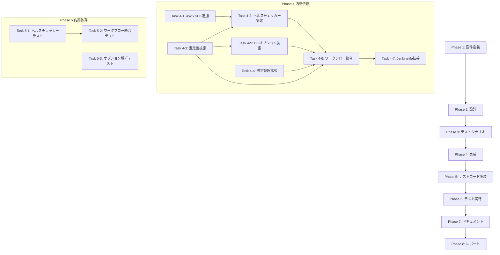

# プロジェクト計画書: Issue #721

## executeコマンドにEC2ネットワークスループット低下検知によるグレースフル停止機能を追加

---

## 1. Issue分析

### 概要

Jenkins環境（EC2フリートインスタンス）で `execute --phase all` を実行する際、T系インスタンスのネットワーク帯域バースト制限により、約1時間経過後に `NetworkPacketsOut` / `NetworkOut` メトリクスが極端に低下する。この状態ではAPI呼び出しレイテンシが増大し、残フェーズの実行が極端に遅くなる。フェーズ開始前にネットワークスループットをチェックし、低下検知時にグレースフル停止する機能をオプションとして追加する。

### 複雑度: **中程度**

**判定根拠:**
- 新規モジュール1つの作成（`network-health-checker.ts`）が必要だが、独立性が高く既存アーキテクチャへの影響は限定的
- 既存の型定義・CLI・設定・ワークフロー実行ループへの拡張が必要（合計6〜7ファイルの変更）
- AWS SDK（`@aws-sdk/client-cloudwatch`）の新規依存追加が必要
- IMDSv2 + CloudWatch API連携という外部システム統合があるが、Issueに詳細な実装ヒントが提供されている
- 非EC2環境でのフォールバック（タイムアウト → `available: false`）を正しく実装する必要がある

### 見積もり工数: **12〜16時間**

| 作業項目 | 見積もり |
|---------|---------|
| 要件定義（Phase 1） | 1〜2h |
| 設計（Phase 2） | 2〜3h |
| テストシナリオ（Phase 3） | 1〜2h |
| 実装（Phase 4） | 4〜5h |
| テストコード実装（Phase 5） | 2〜3h |
| テスト実行・修正（Phase 6） | 1〜2h |
| ドキュメント（Phase 7） | 1h |
| レポート（Phase 8） | 0.5h |
| **合計** | **12.5〜18.5h** |

### リスク評価: **中**

- AWS SDK依存の追加によるバンドルサイズ増加
- 非EC2環境でのIMDSv2タイムアウト処理の正確性
- CloudWatch APIのレート制限・権限不足時の挙動
- 両メトリクスのAND条件判定による誤検知/見逃しのバランス

---

## 2. 実装戦略判断

### 実装戦略: **EXTEND**（既存コードの拡張 + 新規モジュール追加）

**判断根拠:**
- **新規作成は1モジュールのみ**: `src/core/network-health-checker.ts` はネットワークヘルスチェック専用の新規モジュールだが、既存の `src/core/` パターンに準拠して作成する
- **既存コードの拡張が中心**: CLI定義（`main.ts`）、型定義（`commands.ts`）、オプション解析（`options-parser.ts`）、設定管理（`config.ts`）、ワークフロー実行（`workflow-executor.ts`）はいずれも既存インターフェースへのフィールド追加・ロジック挿入であり、構造変更ではない
- **アーキテクチャ変更なし**: 既存のフェーズ実行ループ内にチェックポイントを挿入するだけで、フェーズライフサイクルやメタデータ管理の構造は変更しない
- REFACTOR には該当しない（既存コードの構造改善ではなく機能追加）
- 純粋な CREATE にも該当しない（既存ファイルへの変更が6〜7ファイルあるため）

### テスト戦略: **UNIT_INTEGRATION**（ユニット + インテグレーション）

**判断根拠:**
- **ユニットテスト**: ネットワークヘルスチェッカーのコアロジック（閾値判定、メトリクス比較、非EC2フォールバック）は外部依存をモックして個別にテスト可能
- **インテグレーションテスト**: ワークフロー実行ループへの統合（`executePhasesSequential()` 内でのヘルスチェック呼び出し → 早期終了フロー）は統合テストで検証すべき
- BDDテストは不要（エンドユーザー向けUI機能ではなく、インフラレベルの自動制御機能であるため）
- 純粋なUNIT_ONLYでは統合フローの検証が不十分

### テストコード戦略: **BOTH_TEST**（既存テスト拡張 + 新規テスト作成）

**判断根拠:**
- **新規テスト作成**: `tests/unit/core/network-health-checker.test.ts` — 新規モジュールのユニットテスト
- **既存テスト拡張**:
  - `tests/unit/commands/execute/workflow-executor.test.ts` — ネットワークヘルスチェック統合のテストケース追加
  - `tests/unit/commands/execute/options-parser.test.ts` — 新規オプションの解析・バリデーションテスト追加
  - `tests/unit/core/config.test.ts` — 新規環境変数アクセスメソッドのテスト追加（任意）

---

## 3. 影響範囲分析

### 既存コードへの影響

| ファイル | 変更内容 | 影響度 |
|---------|---------|--------|
| `src/core/network-health-checker.ts` | **新規作成** — IMDSv2 + CloudWatch連携モジュール | なし（新規） |
| `src/types/commands.ts` | `ExecuteCommandOptions`、`PhaseContext`、`ExecutionSummary` にフィールド追加 | 低（追加のみ） |
| `src/core/config.ts` | `IConfig` に2メソッド追加、`Config` クラスに実装追加 | 低（追加のみ） |
| `src/commands/execute/options-parser.ts` | `ParsedExecuteOptions` にフィールド追加、解析・バリデーション拡張 | 低（追加のみ） |
| `src/main.ts` | `execute` コマンドに2つのCLIオプション追加 | 低（追加のみ） |
| `src/commands/execute/workflow-executor.ts` | `executePhasesSequential()` のforループ内にチェック挿入 | 中（既存ループへの挿入） |
| `jenkins/jobs/pipeline/ai-workflow/all-phases/Jenkinsfile` | パラメータとオプション受け渡し追加 | 低（追加のみ） |

### 依存関係の変更

| 依存パッケージ | 種別 | 理由 |
|--------------|------|------|
| `@aws-sdk/client-cloudwatch` | **新規追加**（dependencies） | CloudWatch `GetMetricStatistics` APIの呼び出しに使用 |

**設計判断**: AWS SDK v3のモジュラーアーキテクチャを活用し、`@aws-sdk/client-cloudwatch` のみを追加する（フルSDKではなく必要なクライアントのみ）。これによりバンドルサイズへの影響を最小化する。IMDSv2はNode.js標準の `fetch` APIで直接呼び出す（追加依存不要）。

### マイグレーション要否

- **データベーススキーマ変更**: なし
- **設定ファイル変更**: 環境変数 `NETWORK_HEALTH_CHECK`、`NETWORK_THROUGHPUT_DROP_THRESHOLD` の新規追加（オプション）
- **メタデータスキーマ変更**: `ExecutionSummary` に `stoppedReason` フィールド追加（後方互換、オプショナル）
- **破壊的変更**: なし（全オプションはデフォルト `false`/未指定で既存動作を維持）

---

## 4. タスク分割

### Phase 1: 要件定義 (見積もり: 1〜2h)

- [x] Task 1-1: 機能要件の明確化 (0.5h)
  - ネットワークヘルスチェックの有効化条件（CLIオプション / 環境変数）
  - 閾値パラメータの仕様（デフォルト値70%、カスタマイズ可能）
  - グレースフル停止時の戻り値・ステータスの定義
- [x] Task 1-2: 非機能要件の明確化 (0.5h)
  - 非EC2環境でのフォールバック動作（タイムアウト3秒 → `available: false` → 続行）
  - CloudWatch API呼び出しのパフォーマンス要件（各フェーズ開始前に1回、5秒以内に完了）
  - エラー耐性（API呼び出し失敗時は警告ログのみで続行）
- [x] Task 1-3: 受け入れ基準の定義 (0.5h)
  - `--network-health-check` 有効時、各フェーズ開始前にメトリクスをチェックすること
  - 両メトリクス（`NetworkPacketsOut` + `NetworkOut`）がAND条件で閾値超過時に停止すること
  - 停止時、`ExecutionSummary` に `stoppedReason: 'network_throughput_degraded'` が含まれること
  - 非EC2環境ではチェックがスキップされ、通常通りフェーズが実行されること
- [x] Task 1-4: 既存レジューム機能との整合性確認 (0.5h)
  - `executePhasesFrom()` が `executePhasesSequential()` に委譲している仕組みの確認
  - グレースフル停止後のレジューム実行が正常に動作することの確認

### Phase 2: 設計 (見積もり: 2〜3h)

- [x] Task 2-1: ネットワークヘルスチェッカーモジュールの詳細設計 (1h)
  - `NetworkHealthCheckResult` インターフェースの定義
  - `checkNetworkHealth()` 関数のシグネチャと内部フロー設計
  - IMDSv2トークン取得 → インスタンスID/リージョン取得のフロー
  - CloudWatch `GetMetricStatistics` APIの呼び出しパラメータ設計
- [x] Task 2-2: 型定義・インターフェース拡張の設計 (0.5h)
  - `ExecuteCommandOptions` への新規フィールド追加設計
  - `PhaseContext` への新規フィールド追加設計
  - `ExecutionSummary` への `stoppedReason` フィールド追加設計
- [x] Task 2-3: CLI・オプション解析・設定管理の拡張設計 (0.5h)
  - `src/main.ts` のCLIオプション定義
  - `options-parser.ts` の解析・バリデーションロジック
  - `config.ts` の環境変数マッピング
- [x] Task 2-4: ワークフロー実行ループへの統合設計 (0.5h)
  - `executePhasesSequential()` 内のチェック挿入位置
  - 早期終了時の `ExecutionSummary` 構造
  - ログ出力フォーマットの設計
- [x] Task 2-5: エラーハンドリング・フォールバック設計 (0.5h)
  - IMDSv2アクセス失敗時のフォールバック
  - CloudWatch API呼び出し失敗時のフォールバック
  - 部分的なメトリクス取得失敗時の挙動

### Phase 3: テストシナリオ (見積もり: 1〜2h)

- [ ] Task 3-1: ネットワークヘルスチェッカーのテストシナリオ作成 (1h)
  - 正常系: EC2環境でメトリクス正常 → `shouldStop: false`
  - 正常系: EC2環境でメトリクス低下 → `shouldStop: true`（閾値超過）
  - 正常系: EC2環境でメトリクス低下 → `shouldStop: false`（閾値未満）
  - 正常系: 片方のメトリクスのみ低下 → `shouldStop: false`（AND条件）
  - 異常系: 非EC2環境（IMDSv2タイムアウト） → `available: false`
  - 異常系: CloudWatch API呼び出しエラー → `available: false`
  - 異常系: メトリクスデータポイントが空 → `available: false`
  - 境界値: 閾値ちょうどの低下率 → `shouldStop: true`
- [ ] Task 3-2: ワークフロー統合のテストシナリオ作成 (0.5h)
  - `--network-health-check` 有効時のフェーズ実行前チェック
  - ヘルスチェック失敗時の早期終了と `ExecutionSummary` 内容
  - ヘルスチェック無効時のスキップ動作
  - ヘルスチェック利用不可時の続行動作
- [ ] Task 3-3: CLIオプション・設定のテストシナリオ作成 (0.5h)
  - CLIオプション解析テスト（デフォルト値、カスタム値）
  - 環境変数からの設定読み込みテスト
  - バリデーションテスト（閾値の範囲チェック等）

### Phase 4: 実装 (見積もり: 4〜5h)

- [ ] Task 4-1: AWS SDK依存の追加 (0.5h)
  - `package.json` に `@aws-sdk/client-cloudwatch` を追加
  - `npm install` で依存関係をインストール
  - TypeScript設定でのインポート解決確認
- [ ] Task 4-2: ネットワークヘルスチェッカーモジュールの実装 (2h)
  - `src/core/network-health-checker.ts` の新規作成
  - `NetworkHealthCheckResult` インターフェースの定義
  - IMDSv2によるインスタンスID・リージョン取得の実装
  - CloudWatch APIによるメトリクス取得・評価ロジックの実装
  - 非EC2環境フォールバック（タイムアウト処理）の実装
  - エラーハンドリング（`getErrorMessage()` 使用）の実装
  - ロギング（`logger` 使用）の実装
- [ ] Task 4-3: 型定義の拡張 (0.5h)
  - `src/types/commands.ts` の `ExecuteCommandOptions` にフィールド追加
  - `PhaseContext` にフィールド追加
  - `ExecutionSummary` に `stoppedReason` フィールド追加
- [ ] Task 4-4: 設定管理の拡張 (0.5h)
  - `src/core/config.ts` の `IConfig` にメソッド追加
  - `Config` クラスに `getNetworkHealthCheckEnabled()` / `getNetworkThroughputDropThreshold()` 実装
- [ ] Task 4-5: CLIオプション・解析の拡張 (0.5h)
  - `src/main.ts` に `--network-health-check` / `--network-throughput-drop-threshold` オプション追加
  - `src/commands/execute/options-parser.ts` の解析・バリデーション拡張
- [ ] Task 4-6: ワークフロー実行ループへの統合 (1h)
  - `src/commands/execute/workflow-executor.ts` の `executePhasesSequential()` にヘルスチェック挿入
  - 早期終了ロジックの実装
  - ログ出力の実装
- [ ] Task 4-7: Jenkinsfileの拡張 (0.5h)
  - `jenkins/jobs/pipeline/ai-workflow/all-phases/Jenkinsfile` にパラメータ追加
  - `Execute All Phases` ステージへのオプション受け渡し追加

### Phase 5: テストコード実装 (見積もり: 2〜3h)

- [ ] Task 5-1: ネットワークヘルスチェッカーのユニットテスト作成 (1.5h)
  - `tests/unit/core/network-health-checker.test.ts` の新規作成
  - IMDSv2モック（fetch APIのモック）
  - CloudWatch APIモック（`@aws-sdk/client-cloudwatch` のモック）
  - 正常系テスト（メトリクス正常/低下、閾値判定）
  - 異常系テスト（非EC2環境、APIエラー、データポイント空）
  - 境界値テスト（閾値ちょうど、片方のみ低下）
- [ ] Task 5-2: ワークフロー実行統合テストの拡張 (1h)
  - `tests/unit/commands/execute/workflow-executor.test.ts` にテストケース追加
  - ヘルスチェック有効時の早期終了テスト
  - ヘルスチェック無効時のスキップテスト
  - ヘルスチェック利用不可時の続行テスト
- [ ] Task 5-3: オプション解析テストの拡張 (0.5h)
  - `tests/unit/commands/execute/options-parser.test.ts` にテストケース追加
  - 新規オプションのデフォルト値テスト
  - カスタム閾値のパーステスト
  - バリデーションテスト

### Phase 6: テスト実行 (見積もり: 1〜2h)

- [ ] Task 6-1: ユニットテストの実行と修正 (0.5h)
  - `npm run test:unit` の実行
  - 失敗テストの修正
- [ ] Task 6-2: 統合テストの実行と修正 (0.5h)
  - `npm run test:integration` の実行
  - 失敗テストの修正
- [ ] Task 6-3: 統合検証の実行 (0.5h)
  - `npm run validate`（lint + test + build）の実行
  - ビルドエラーの修正
- [ ] Task 6-4: リグレッションテストの確認 (0.5h)
  - 既存テストが全て通過することの確認
  - 新規コードが既存機能に影響を与えていないことの確認

### Phase 7: ドキュメント (見積もり: 1h)

- [ ] Task 7-1: 環境変数ドキュメントの更新 (0.5h)
  - `docs/ENVIRONMENT.md` に `NETWORK_HEALTH_CHECK` / `NETWORK_THROUGHPUT_DROP_THRESHOLD` を追加
  - AWS SDK依存に関する注意事項を追加
- [ ] Task 7-2: CLIリファレンスの更新 (0.5h)
  - `docs/CLI_REFERENCE.md` に `--network-health-check` / `--network-throughput-drop-threshold` オプションを追加
  - 使用例の追加

### Phase 8: レポート (見積もり: 0.5h)

- [ ] Task 8-1: 実装レポートの作成 (0.5h)
  - 変更サマリー
  - テスト結果サマリー
  - 既知の制限事項

---

## 5. 依存関係

### タスク実行順序の説明

1. **Phase 4 内部**: 型定義（Task 4-3）→ 設定管理（Task 4-4）→ AWS SDK追加（Task 4-1）→ ヘルスチェッカー実装（Task 4-2）→ CLIオプション（Task 4-5）→ ワークフロー統合（Task 4-6）→ Jenkinsfile（Task 4-7）の順で実装
2. **Phase 5 内部**: ヘルスチェッカーテスト（Task 5-1）とオプション解析テスト（Task 5-3）は並列実行可能、ワークフロー統合テスト（Task 5-2）はTask 5-1完了後に実行

---

## 6. リスクと軽減策

### リスク1: AWS SDKバンドルサイズ増加

- **影響度**: 低
- **確率**: 高（確実に発生）
- **軽減策**: AWS SDK v3のモジュラーアーキテクチャを活用し、`@aws-sdk/client-cloudwatch` のみを追加する。フルSDK（`aws-sdk`）ではなく個別クライアントを使用することで、バンドルサイズへの影響を最小化する。Docker環境での使用が主であるため、バンドルサイズの影響は限定的。

### リスク2: 非EC2環境でのIMDSv2タイムアウト

- **影響度**: 中
- **確率**: 高（ローカル開発環境で必ず発生）
- **軽減策**: `AbortSignal.timeout(3000)` による3秒タイムアウトを設定し、非EC2環境では即座に `available: false` を返却してチェックをスキップする。タイムアウトが開発体験に与える影響を最小化するため、十分に短いタイムアウト値を設定する。

### リスク3: CloudWatch APIのレート制限・権限不足

- **影響度**: 中
- **確率**: 低（Jenkins環境ではAWS認証情報が適切に設定されている）
- **軽減策**: CloudWatch API呼び出し失敗時は `available: false` で返却し、警告ログのみ出力して続行する。IAMポリシーに `cloudwatch:GetMetricStatistics` の権限が必要であることをドキュメントに明記する。

### リスク4: メトリクス低下の誤検知（フェーズ間の静止期間）

- **影響度**: 高
- **確率**: 中
- **軽減策**: `NetworkPacketsOut` と `NetworkOut` の両方がAND条件で閾値を超えた場合のみ停止判定とする。これにより、一時的なネットワーク静止期間（フェーズ間の待機等）での誤検知を防止する。直近5分間の平均値と過去1時間のピーク値を比較することで、短期的な変動に左右されにくい判定を行う。

### リスク5: 既存テストへのリグレッション

- **影響度**: 高
- **確率**: 低
- **軽減策**: 全変更はオプショナルフィールドの追加のみであり、既存のデフォルト動作は変更しない。`--network-health-check` のデフォルトは `false` であるため、明示的に有効化しない限り既存動作に影響を与えない。`npm run validate` による統合検証で既存テストの通過を確認する。

### リスク6: CloudWatch メトリクスデータの欠損

- **影響度**: 中
- **確率**: 低（通常のEC2環境ではメトリクスは自動的に収集される）
- **軽減策**: `GetMetricStatistics` のレスポンスで `Datapoints` が空の場合は `available: false` として処理し、チェックをスキップする。新規起動直後のインスタンス（メトリクス履歴が1時間未満）でも安全に動作するようにする。

---

## 7. 品質ゲート

### Phase 0: 計画（本フェーズ）

- [x] 実装戦略が明確に決定されている（EXTEND）
- [x] テスト戦略が明確に決定されている（UNIT_INTEGRATION）
- [x] テストコード戦略が明確に決定されている（BOTH_TEST）
- [x] 影響範囲が分析されている
- [x] タスク分割が適切な粒度である（1タスク = 0.5〜2時間）
- [x] リスクが洗い出されている（6項目）

### Phase 1: 要件定義

- [x] 機能要件が明確に記載されている（ネットワークヘルスチェックの動作仕様）
- [x] 非機能要件が明確に記載されている（パフォーマンス、エラー耐性）
- [x] 受け入れ基準が定義されている（各条件での動作検証基準）
- [x] 既存レジューム機能との整合性が確認されている

### Phase 2: 設計

- [x] 実装戦略の判断根拠が明記されている（EXTEND）
- [x] テスト戦略の判断根拠が明記されている（UNIT_INTEGRATION）
- [x] `NetworkHealthCheckResult` インターフェースが定義されている
- [x] `checkNetworkHealth()` 関数のシグネチャが定義されている
- [x] IMDSv2 → CloudWatch APIのデータフローが設計されている
- [x] エラーハンドリング・フォールバック方針が明確である
- [x] 型定義の拡張内容が明確である

### Phase 3: テストシナリオ

- [ ] 正常系テストシナリオが網羅されている（メトリクス正常/低下/閾値境界）
- [ ] 異常系テストシナリオが網羅されている（非EC2、APIエラー、データ欠損）
- [ ] AND条件判定のテストシナリオが含まれている（片方のみ低下 → 続行）
- [ ] ワークフロー統合テストシナリオが含まれている

### Phase 4: 実装

- [ ] `src/core/network-health-checker.ts` が作成されている
- [ ] `src/types/commands.ts` の型定義が拡張されている
- [ ] `src/core/config.ts` の設定管理が拡張されている
- [ ] `src/main.ts` のCLIオプションが追加されている
- [ ] `src/commands/execute/options-parser.ts` の解析が拡張されている
- [ ] `src/commands/execute/workflow-executor.ts` にヘルスチェックが統合されている
- [ ] Jenkinsfileにパラメータが追加されている
- [ ] コーディング規約に準拠している（logger使用、Config使用、エラーハンドリングユーティリティ使用）

### Phase 5: テストコード実装

- [ ] `tests/unit/core/network-health-checker.test.ts` が作成されている
- [ ] 正常系・異常系・境界値テストが実装されている
- [ ] IMDSv2・CloudWatchのモックが適切に設定されている
- [ ] ワークフロー統合テストが追加されている
- [ ] オプション解析テストが追加されている
- [ ] `jest.restoreAllMocks()` によるクリーンアップが実装されている

### Phase 6: テスト実行

- [ ] `npm run test:unit` が全て通過する
- [ ] `npm run test:integration` が全て通過する
- [ ] `npm run validate`（lint + test + build）が全て通過する
- [ ] 既存テストにリグレッションがない

### Phase 7: ドキュメント

- [ ] `docs/ENVIRONMENT.md` に新規環境変数が追記されている
- [ ] `docs/CLI_REFERENCE.md` に新規CLIオプションが追記されている
- [ ] AWS IAM権限要件が文書化されている

---

## 付録: 技術的考慮事項

### AWS SDK v3 vs 直接HTTPリクエスト

| 項目 | AWS SDK v3 (`@aws-sdk/client-cloudwatch`) | 直接HTTPリクエスト |
|------|-------|------|
| 実装工数 | 低（型定義付き、認証自動処理） | 高（署名v4の手動実装が必要） |
| 保守性 | 高（APIバージョン追従が容易） | 低（API変更時に手動対応） |
| バンドルサイズ | 中（約数百KB） | 低（追加依存なし） |
| 認証処理 | 自動（環境変数・インスタンスプロファイル対応） | 手動（AWS SigV4署名の実装が必要） |
| **推奨** | **✅ 推奨** | ❌ 非推奨 |

**結論**: AWS SDK v3を使用する。理由: Jenkins環境ではAWS認証情報が既に環境変数として設定されており、SDKが自動的に認証を処理する。SigV4署名を手動実装する工数・保守コストに見合わない。

### コーディング規約への準拠チェックリスト

- [ ] `console.log` 等の直接使用なし → `logger` モジュール使用
- [ ] `process.env` の直接アクセスなし → `config` クラス使用
- [ ] `as Error` 型アサーションなし → `getErrorMessage()` / `isError()` 使用
- [ ] ReDoS脆弱性のある正規表現なし
- [ ] テストコードで `jest.restoreAllMocks()` によるクリーンアップ実施
